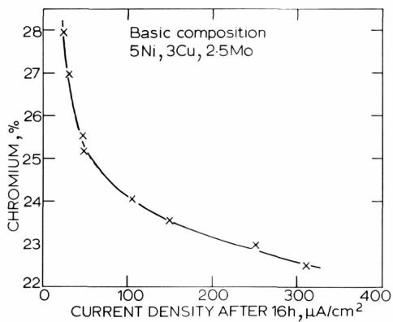
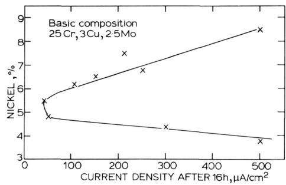
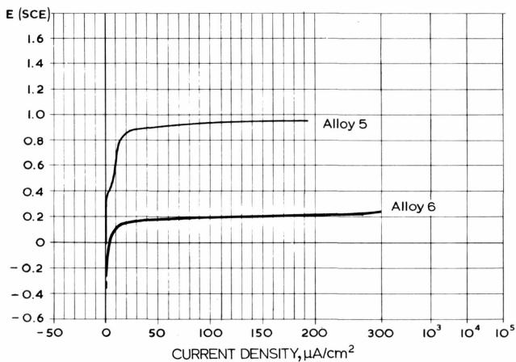
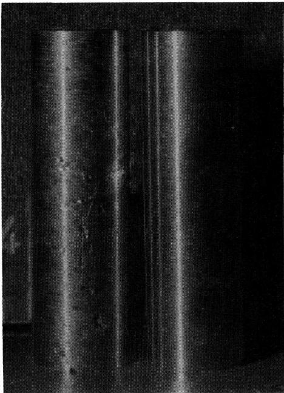
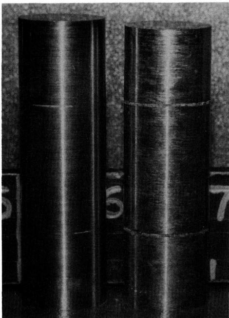
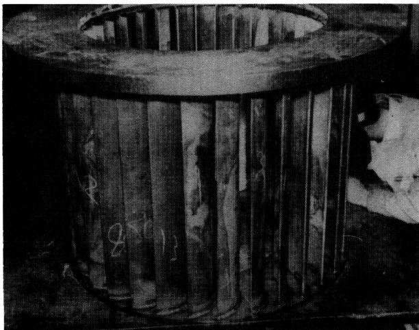

# Improved Ferritic-Austenitic Stainless Steel

W. H. Richardson & P. Guha

To cite this article: W. H. Richardson & P. Guha (1979) Improved Ferritic-Austenitic Stainless Steel, British Corrosion Journal, 14:3, 167-170

To link to this article:https://doi.org/10.1179/000705979798275762

Published online: 18 Jul 2013.

Submit your article to tis journal

Article views: 3

View related articles

Citing articles: 3 View citing articles

# Improved Ferritic-Austenitic Stainless Steel

by W. H. Richardson and P. Guha

Langley Alloys Limited, Langley, Slough, Berkshire

(Manuscript received 1 November, 1978; revised manuscript 20 June, 1979)

For the efficient operation of chemical process plant it is of paramount importance to ensure as far as possible that the periods of closure for maintenance and repair are minimised.

The arduous conditions encountered in many chemical plants as a result of progressive trends towards higher yields, etc., have therefore highlighted the need for greater strength and pitting resistance than can be ·obtained in conventional austenitic stainless steels. This paper describes the development of ferritic/austenitic high chromium duplex cast stainless steels and demonstrates how, by addition of nitrogen and close control of composition, certain inherent drawbacks of duplex alloys can be overcome. The nitrogen-containing steel has an attractive combination of mechanical properties, corrosion resistance, ductility, weldability and castability, and has received application in a wide range of aggressive environments.

## Introduction

AUSTENITIC stainless steels have long been known for their good corrosion resistance and have been extensively used in chemical plants. The development of chemical and other process plants has seen progressive trends towards achieving high yield, often requiring high concentrations and higher temperatures which lead to the shortening of service life of the stainless steels commonly used. This can lead to costly inspection and maintenance involving production loss due to plant shut down, and has been recently highlighted.1

Conventional austenitic stainless steels are inherently low strength alloys, and can suffer from pitting and crevice corrosion in the presence of chloride ions, due to localised breakdown of the passivating surface film. These alloys are also prone to stress corrosion cracking in chloride environments. The choice of a suitable material to combat the more severe conditions in chemical plants and in marine environments such as North Sea Oil Fields is therefore difficult.

The search for suitable alternatives has led to the development of high chromium duplex ferritic/austenitic steels and the interest in such stainless steels for use in chemical and marine industries has increased during the past 10 years. This paper details comparative mechanical and corrosion characteristics of two such steels:

## (1) A.C.I. CD-4MCu Alloy (2) FERRALIUM Alloy\*

## High Chromium-Ferritic-Austenitic Steels

High chromium-ferritic-austenitic steels are known to have good corrosion resistance. The effect of high chromium in improving general corrosion resistance has been reported by various authors,2-4 and the beneficial effect of high chromium content on pitting resistance in chloride environments has also been reported.s,6 High chromium low carbon alloys, however, are generally coarse grained and brittle. Due to their inherent lack of ductility, propensity to cracking, and certain fabrication problems,47 application of these alloys has in practice been severely restricted.

The development of a high chromium duplex steel CD-4MCu with additions of molybdenum and copper was reported by Fontana8 in 1956. This alloy was later incorporated in an Alloy Casting Institute data sheet under the same code name. The results reported indicated good general corrosion resistance, stress corrosion resistance and high strength. Attempts to produce castings of heavy or variable section, however, proved to be very difficult due to cracking problems and this alloy was also found to be prone to thermal cracking during heat treatment.9 Brautingan¹º also highlighted these shortcomings, and a modified heat treatment schedule, both complex and timeconsuming, had to be devised to overcome this tendency to thermal cracking. Published information and production experience of A.C.I. CD-4MCu alloy indicate that this alloy still largely suffers from the inherent drawbacks of the previously known high chromium duplex steels. The percentage composition range of A.C.I. CD-4MCu alloy is as follows: Cr 25-26.5; Ni 4.75–6·0; Mo 1·75–2.25; Cu 2·75-3-25; C 0·04 max.; Fe Bal.

## Development of Improved Alloy

It was clearly desirable to develop an alloy possessing the good corrosion characteristics of duplex steels but having markedly improved mechanical properties, castability and weldability, yielding a general purpose alloy having wide acceptance and application in the chemical engineering industry.

It is well known that nitrogen additions can improve the strength of fully austenitic steels" as well as being an austenite stabiliser. It was therefore decided to investigate the effects of adding nitrogen to duplex ferritic-austenitic steels, an area not previously investigated. In order to retain the good stress corrosion and pitting resistance of the steels of duplex structure it was necessary to study also the effects of varying chromium and nickel contents over a wide range so that the appropriate alloy contents for a given nitrogen addition could be optimised to retain the duplex structure. In practice, as indicated below, a surprising outcome of this work was not only that a marked improvement in ductility was obtained but also that the corrosion resistance of the duplex steels was improved by nitrogen additions. The resultant nitrogen-containing alloy is now widely accepted for use in marine and chemical environments.

## Results and Discussion

Alloys were produced as castings and hot rolled bar having nominal compositions of 1.5-3.5% copper, 2.5% molybdenum with varying chromium and nickel contents in the ranges 23–27% and 4.0–6.5%, respectively, and with nitrogen contents in the range 0.05-0.22% (Table I). Steels with copper at the lower end of the range were used for producing rolled bar.

W.Q. – Water Quench A.C. – Air Cool

TABLEI  
Mechanical properties of duplex steel castings
<table><tr><td rowspan="2">Alloy No.</td><td colspan="6">Composition, %</td><td rowspan="2">Condition</td><td rowspan="2">0.5% Proof Stress, N/mm²</td><td rowspan="2">Ultimate Tensile Stress, N/mm²</td><td rowspan="2">Elongation, %</td><td rowspan="2">Izod Impact Value, J</td></tr><tr><td>N</td><td>Cr</td><td>Nl</td><td>Mo</td><td>Cu</td><td>C</td></tr><tr><td>1</td><td>0.22</td><td>25.2</td><td>5.65</td><td>2.24</td><td>3.12</td><td>0.06</td><td>25 mm dia. test bar 1 h 1120°C W.Q. + 4 h at 500°C A.C.</td><td>664</td><td>927</td><td>31</td><td>79</td></tr><tr><td>2</td><td>0.05</td><td>24.9</td><td>5.5</td><td>2.5</td><td>3.29</td><td>0.04</td><td>25 mm dia. test bar 1 h 1120°c W.Q. + 4 h at 500°℃ A.C.</td><td>602</td><td>873</td><td>15</td><td>13.5</td></tr><tr><td>3</td><td>0.13</td><td>26.8</td><td>4.6</td><td>2.17</td><td>3.05</td><td>0.05</td><td>25 mm dia. test bar 1 h 1120°C W.Q. + 4 h at 500°C A.C.</td><td>772</td><td>965</td><td>16</td><td>11</td></tr><tr><td>4</td><td>0.06</td><td>27.0</td><td>4.9</td><td>2.2</td><td>3.0</td><td>0.04</td><td>25 mm dia. test bar 1 h 1120°℃ W.Q. + 4 h at 500°C A.C.</td><td>803</td><td>942</td><td>4</td><td>4</td></tr><tr><td>5</td><td>0.16</td><td>25.1</td><td>5.0</td><td>2.46</td><td>3.04</td><td>0.065</td><td>76 mm thick section 2 h 1120°℃ W.Q.</td><td>618</td><td>757</td><td>23</td><td></td></tr><tr><td>6</td><td>0.05</td><td>25.3</td><td>5.23</td><td>2.44</td><td>3.15</td><td>0.032</td><td>76 mm thick section 2 h 1120°℃ W.Q.</td><td></td><td>541</td><td>Nil</td><td></td></tr></table>

TABLE II  
Effect of varying chromium content on mechanical properties of the duplex nitrogen-containing steels
<table><tr><td rowspan="2">Alloy No.</td><td colspan="4">Composition, %</td><td rowspan="2">Condition</td><td rowspan="2">0.5% Proof Stress, N/mm2</td><td rowspan="2">Ultimate Tensile Stress, N/mm²</td><td rowspan="2">Elongation, %</td><td rowspan="2">Izod Impact Value, J</td></tr><tr><td>Cr</td><td>Ni</td><td>N</td><td>Mo</td></tr><tr><td>7</td><td>25.2</td><td>5.1</td><td>0.12</td><td>2.0</td><td>1120℃ W.Q. + 4 h at 500°℃</td><td>710</td><td>911</td><td>30</td><td>60</td></tr><tr><td>8</td><td>25.2</td><td>5.65</td><td>0.24</td><td>2.24</td><td>1120℃ W.Q. + 4 h at 500°℃</td><td>664</td><td>927</td><td>31</td><td>79</td></tr><tr><td>9</td><td>25.9</td><td>5.8</td><td>0.25</td><td>2.6</td><td>1120℃ W.Q. + 4 h at 500C</td><td>664</td><td>911</td><td>28</td><td>65</td></tr><tr><td>10</td><td>25.8</td><td>4.6</td><td>0.12</td><td>2.0</td><td>1120℃ W.Q. + 4 h at 500℃</td><td>741</td><td>942</td><td>19</td><td>17.5</td></tr><tr><td>11</td><td>26.8</td><td>4.6</td><td>0.14</td><td>2.1</td><td>1120℃ W.Q. + 4 h at 500°C</td><td>772</td><td>965</td><td>16</td><td>11</td></tr><tr><td>12</td><td>28.3</td><td>4.9</td><td>0.13</td><td>2.0</td><td>1120°℃ W.Q. + 4 h at 500℃</td><td>788</td><td>1004</td><td>17</td><td>8</td></tr></table>

W.Q. – Water Quench

## Mechanical properties

The mechanical properties of specimens from castings, shown in Table I, demonstrate the beneficial effect of nitrogen additions, for duplex steels containing about 25% chromium, 5% nickel, 3% copper and 2.5% molybdenum. The low impact properties and ductility of the essentially nitrogen-free alloys are particularly striking in heat treated and thick sections.

Table II illustrates the effect of varying chromium content on the mechanical properties of the duplex nitrogen-containing steels. It is seen that an increase in chromium content can adversely affect the ductility of these steels, but that this can be largely overcome by an appropriate increase in nitrogen content.

## Corrosion characteristics

The corrosion characteristics of duplex steels were studied using both potentiostatic and immersion (weight loss) test methods. Potentiostatic polarisation studies were carried out according to the ASTM G1 Committee recommendations; all potentials quoted are with reference to the saturated calomel electrode (SCE). The effect of 16 h immersion periods on the corrosion/pitting current density at +600 mV was also studied.

The cell arrangement and electrode holder for these experiments were as recommended by Greene.12

Fig. 1 illustrates the effect of varying chromium content on the pitting current densities on steels containing approximately 5% nickel, 3% copper, 2.5% molybdenum and 0.15% nitrogen. It is seen that a minimum chromium content of about 24.5% is desirable in order to ensure that satisfactory passivity is retained in the presence of chloride ions.

Fig. 2 shows the effect of varying nickel content on the pitting behaviour of steels containing approximately 25% chromium, 3% copper and 2.5% molybdenum. It is seen that the nickel should be maintained within a fairly narrow range, of about 4.7–6·0%, in order to obtain optimum pitting resistance.

As indicated earlier, nitrogen was added to duplex steels in order to achieve an improved combination of mechanical properties. Surprisingly, a marked improvement in corrosion resistance properties was also achieved, as shown in Fig. 3, where the potentiostatic polarisation characteristics in 3% NaCl are plotted for alloys 5 and 6 (Table I) which have similar compositions, except that alloy 5 contains 0.16% nitrogen compared with 0.05% in alloy 6. It is seen that a significant improvement in breakdown/pitting potential is achieved by the addition of nitrogen. The nitrogen-containing steel also shows superior pitting resistance in 7 day immersion tests in 10% FeCl3, pH 1·75, at 20°C (Fig. 4) confirming the potentiostatic findings, the redox potential of the solution being +0.54 mV (SCE). The crevice corrosion resistance of the two steels in 10% FeCl3, pH 1·75, at 20°C is illustrated in Fig. 5. Crevices were produced by placing Neoprene $\cdot _ { \mathrm { { O } ^ { \prime } } }$ rings round the specimens; the period of immersion was 7 days. The superior crevice corrosion resistance of the nitrogen-containing steel is clearly demonstrated. Finally, Table III details immersion corrosion test results in acid/chloride environments, where again the beneficial effect of the higher-nitrogen steel is demonstrated.

  
Fig. 1. Effect of varying Cr content on pitting current density of steel containing approx. 5% Ni, 3% Cu, 2.5% Mo and 0·15% N

  
Fig. 2. Effect of varying Ni content on pitting current density of steel containing approx. 25% Cr, 3% Cu and 2.5% Mo

  
Fig. 3. Potentiostatic polarisation curves for alloys 5 and 6 in 3% NaCl (N2-purged) at 30°C; N content of alloy 5 is 0.15% and of alloy 6, 0.05%

  
Fig. 4. Specimens of alloy 5 and alloy 6 after 7 days' immersion in 10% FeCl3, pH 1.75, at 20°C, showing superior pitting resistance of alloy 5 (on R)

  
Fig. 5. Specimens of alloy 5 and alloy 6 after 7 days' immersion in 10% FeCl3, pH 1·75, at 20°C, in which crevices were produced by placing Neoprene 'O' rings round the cylinders, showing superior crevice corrosion resistance of alloy 5 (on L)

TABLE III  
Corrosion test results 7 days immersion in 30% H2SO4 + 3% NaCl at 60°C
<table><tr><td>Alloy No.</td><td>Corrosion rate, mg/dm² day</td></tr><tr><td>56</td><td>6,500 11,000</td></tr></table>

  
Fig. 6. Typical example of a weld fabricated casting from Ferralium alloy

## Specification for Improved Alloy

On the basis of the mechanical and corrosion resistance properties described above it was possible to characterise a new alloy, having the following preferred range of composition:

Chromium 24.5-25.8% Nickel 4.9-5.8% Molybdenum 2.0-4.0% Copper 1.5-3.5% Nitrogen 0.10% minimum Carbon 0.08% maximum Iron Balance

This alloy satisfied, in laboratory tests, the target requirements for corrosion characteristics, showing in fact significant improvement over CD—4MCu, combined with very satisfactory strength and ductility.

Production experience during the past 15 years has confirmed that this alloy does not suffer from the drawbacks of the conventional high chromium duplex alloys. The alloy can be readily welded, without encountering any HAZ cracking and delayed cracking, often associated with other high chromium duplex alloys. Numerous weld fabricated castings and cast to wrought welded assemblies have been produced using welding wire of matching composition. Fig. 6 shows a typical example of such fabrications.

## Summary and Conclusions

The results described in this paper indicate that FERRALIUM Alloy possesses an excellent combination of mechanical properties and corrosion resistance. Stability of the passivation film in the presence of chloride ions has also been demonstrated. To safeguard these important characteristics, control of composition and addition of nitrogen is of paramount importance.

## References

1. Editorial. Corrosion, 1979, 35 (January)

2. Shaw, D., & Edwards, A. M., Čorros. Sci., 1965, 5, 413

3. Colombier, L., & Hochmann, J., 'Stainless and Heat Resisting Steels', 1967 (London: Edward Arnold)

4. Monypenny, J. H. G., ‘Stainless Steel and Iron', Vol. 1, 1951 (London: Čhapman & Hall)

5. Frochhammer, P., & Engell, H. J., Werkstoffe Korros., 1969, 20, 20

6. Horvath, H., & Uhlig, H. H., J. electrochem. Soc., 1968, 115, 791

7. Thum, E., 'The Book of Stainless Steels', 2nd Edn, 1935 (American Society Metals)

8. Fontana, G., J. ind. engng Chem., 1956, 48, 53A

9. Flowers, J. W., Beck, F. H., & Fontana, M. G., Corrosion, 1963, 19,186t

10. U.S. Patent No. 3,065,119

11. von Rudolf Oppenheim, Werkstoffe Korros., 1965, 16, 1

12. Greene, N. D., 'Experimental Electrode Kinetics', 1965 (Troy, New York: Rensselaer Polytechnic Institute)

## FORGING AND PROPERTIES OFAEROSPACE MATERIALS

Proceedings of a conference organized by Activity Group Committee Il of The Metals Society in association with the Leeds and Bradford Metallurgical Societies, and held at the Department of Metallurgy, University of Leeds, on 5–7 January 1977.

The papers in this volume present a survey of current forging practice and discuss future trends and possibilities, including powder-forming methods and isothermal and superplastic forging processes.   
There are five sessions dealing with : Design philosophy for components ; Current technology ;   
Structure/property relationships in superalloys and titanium alloys ; Forging and structure control;   
Future developments in forming practice. Each session is followed by a substantial Discussion section.

viii+453 pp Paperback ISBN 0 904357 12 0

245×177 mm

UK price £15 (Metals Society Members £12) post free

Overseas \$45(Members \$36) post free

Please send orders, quoting ordering code 188 and enclosing the correct remittance, to :

Sales Department, The Metals Society, 1 Carlton House Terrace, London SW1Y 5DB