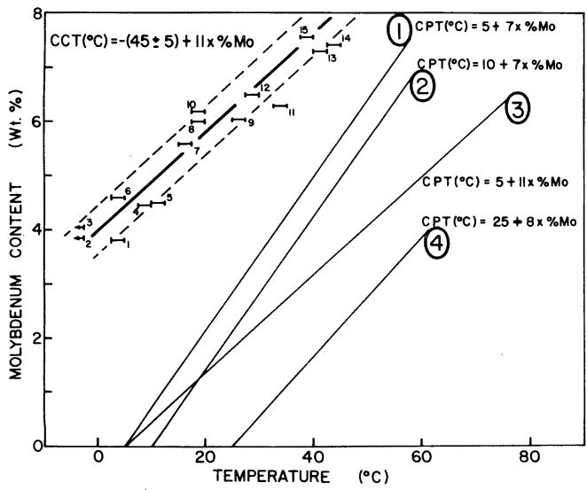
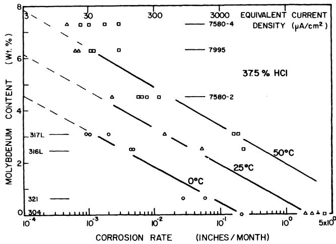

# Temperature as a Crevice Corrosion Criterion

R. J. BRIGHAM\*

## Abstract

Using temperature as a crevice corrosion criterion, a number of commercial and experimental Mo-bearing 18% Cr austenitic stainiess steels have been evaluated for crevice corrosion resistance. These data have been correlated with the effect of Mo content on the rate of active corrosion in the very aggressive acid solution expected in the crevice itself. Alloyed Mo has been found to play the dominant role in reducing the relative rate of crevice corrosion and in defining the go/no-go crevice corrosion behavior in terms of the crevice corrosion temperature (CCT) in oxidizing acid chloride solutions. For 18% Cr austenitic stainless steels the empirical relationship

CCT (C) = -(45 ± 5) + 11 x %Mo

has been found.

In earlier presentations,1 ,2 temperature has been shown to be a reliable pitting criterion for 18% Cr austenitic stainless steels. For each steel, a temperature, called the critical pitting temperature (CPT), has been found below which pits will not initiate on a flat surface parallel to the rolling plane when the steel is exposed to oxidizing acid chloride solutions. Molybdenum plays the dominant beneficial role in improving pit initiation resistance as measured by the CPT while other alloying additions contribute to a lesser extent. Several families of alloys, depending on chemistry, have been identified.2,3 For all of the alloys, edge, end-grain, and crevice attack have been observed to occur at temperatures below the CPT. However, further experimentation has shown that there exists a temperature, which we call the crevice corrosion temperature (CCT), below which no corrosion of any type will occur even when the alloys are tested in a geometric configuration containing a built-in crevice.

## Test Method for Determining CCT

In order to simulate the worst possible crevice configuration, three types of crevices have been used: metal to metal, Teflon to metal, and rubber (elastic band) to metal. The testing method adopted is an extension of the technique which proved successful for the quantitative evaluation of pit initiation resistance. Samples of stainless steel have been exposed to 10% FeCl3 for 24 hours at fixed temperature in at least two of the three crevice configurations mentioned above. At the end of one such exposure period, the stainless steel was examined visually. If no corrosion attack of any type could be observed, the sample was considered to be immune at that temperature and was then exposed for a further 24 hours at a 2.5 C higher temperature. This procedure was continued until attack of any kind (edge, end-grain, elastic to metal crevice, metal to metal crevice, etc) was observed. The CCT was bracketed by that 2.5 C temperature interval in which the go/no-go characteristics were observed. Go/no-go results obtained in 24 hour tests were routinely confirmed in 66 hour tests and in the case of one alloy, the CCT was found to be valid for a 30 day exposure in 10% FeCl3. All of the alloys were tested in the single-phase quench-annealed condition with abraded surfaces (120 grit silicon carbide)

## Results

Because Mo has been found to play the dominant role in increasing resistance to crevice corrosion, the results for several steels are plotted as CCT vs %Mo as shown in Figure 1. The values obtained are compared in Figure 1 with CPT vs %Mo for four families of 18% Cr austenitic alloys which have been defined previously.2,3 Chemical analyses, CCT, and pitting family for each of the alloys are given in Table 1. Family 1 represents the average family of alloys corresponding to present day commercial practice. Family 2 represents a series of alloys similar to Family 1, but having a higher nitrogen content. Family 3 represents a series of alloys similar to Family 1, but containing low Mn (<0.5% Mn). Family 4 represents a series of high Si (3.5% Si) stainless steels. The CPT vs %Mo characteristics of these four families along with the appropriate equation of behavior are plotted in Figure 1.

Whereas several distinct families of alloys can be observed in the case of pit initiation resistance, all of the alloys apparently fall in the same family with respect to crevice corrosion resistance. Their behavior can be described empirically by

$$
\mathbf { C C T } \left( \mathbf { C } \right) = . ( 4 5 \pm 5 ) + \mathbb { 1 1 } \times \mathcal { 7 } \mathbf { 0 M o }
$$

The data are plotted as error bars with the low temperature end denoting no attack and the high temperature end denoting attack. Within the 10 C scatter-band, no distinguishing features can be observed for alloys on the upper or lower limits of the band. Alloyed Mo, however, produces the well established trend toward higher resistance to crevice corrosion with increasing additions shown in Figure 1.

  
FIGURE 1 - Crevice corrosion temperature (CCT) and critical pitting temperature (CPT) as a function of molybdenum content for several austenitic stainless steels. The numbers associated with the CCT data refer to alloys listed in Table 1, while the numbers on the CPT data denote the pitting families listed in the same table.

While the CPT parameter describes conditions for the nucleation of pits on a flat surface, the CCT parameter is related to the conditions for zero growth rate of a pre-existing pit or other occluded cell. These quantities therefore are characteristic of the most severe (CCT) and least severe (CPT) degrees of occlusion possible. Consequently, most alloys in service conditions in chloride solutions such as sea water would be expected to have resistance between these extremes, depending on the severity the crevice condition encountered. For samples with severe artificial crevices exposed 3 years in sea water in Halifax Harbor (maximum temperature 15 C), go/no-go crevice corrosion behavior was observed which is consistent with the data in Figure 1. For example, Alloys 7, 10, 13, 15 which contain more than 5.6% Mo, showed no crevice attack, while Alloy 5 and similar alloys containing less than 4.5% Mo were attacked during this exposure.

## Rate of Crevice Corrosion

The data presented above for CCT vs %Mo, although empirical in nature, have established a limit for the resistance for 18% Cr austenitic alloys in oxidizing acid chloride media. They also serve as a basis for a better understanding of the crevice corrosion phenomenon when considered in combination with other observations. Pickering and Frankenthal⁴ observed that hydrogen gas is produced in occluded cells in stainless steels. This observation unequivocally fixed the potential-pH conditions in the occluded geometry below the hydrogen line and in the active corrosion region of the Pourbaix diagram. Suzuki et $a l ^ { 5 }$ measured the chloride concentration and pH of the solution in artificial occluded cells and found values of the order of 6.5N chloride and $\mathsf { p H } = 0$ for Mo-bearing stainless steels corroding galvanostatically in 0.5N NaCl bulk solution. If the maximum acidity were approximately $\mathrm { p H } = . 1$ and the maximum chloride content approximately 10M for the most severe conditions, the chemistry of the occluded area could be considered to approach that of concentrated HCl (37.5% HCl). It is therefore possible to estimate the relative rates of crevice corrosion by studying the active corrosion rate of stainless steels in concentrated HCl. Molybdenum content and temperature, the dominant factors in determining CCT, were chosen as the variables.

## Corrosion Rates in HCl

Coupons of several of the alloys listed in Table 1, along with several commercial AISI steels of various Mo contents, were exposed for 4 hours in nitrogenated concentrated (37.5%) HCl at 0, 25, and 50 C (32, 77, and 122 F). From the measured weight losses, the corrosion rate in inches per month (ipm) was calculated. As in the CCT determination, the alloys were tested in the single phase quench annealed condition with surfaces abraded on 120 grit silicon carbide paper.

TABLE 1 — Chemical Analyses (Wt %)
<table><tr><td>Alloy</td><td>Heat Number</td><td>Cr</td><td>Ni</td><td>Mn</td><td>C</td><td>N</td><td>Si</td><td>P</td><td>S</td><td>Cu</td><td>Mo</td><td>CCT (C)</td><td>Pitting Family</td></tr><tr><td>1</td><td>8682-4</td><td> $1 8 . 3 ^ { ( 1 ) }$ </td><td> $2 0 . 3 ^ { ( 1 ) }$ </td><td> $0 . 3 6 ^ { ( 1 ) }$ </td><td> $0 . 0 4 ^ { ( 1 ) }$ </td><td> $0 . 1 9 ^ { ( 1 ) }$ </td><td> $_ { 3 . 5 } ( 1 )$ </td><td> $_ { 0 , 0 0 9 } ( 1 )$ </td><td> $_ { 0 . 0 0 5 } ( 1 )$ </td><td>(2)</td><td>3.79</td><td>2.5-5</td><td>(4)</td></tr><tr><td>2</td><td>8427-4</td><td> $1 7 . 6 2$ </td><td> $^ { 1 2 . 5 1 }$ </td><td>1.66</td><td>0.02</td><td> $^ { 0 . 0 7 } _ { ( 2 ) }$ </td><td> $^ { 0 . 7 1 } _ { ( 2 ) }$ </td><td> $^ { 0 . 0 1 2 } _ { ( 2 ) }$ </td><td>0.013</td><td>(2)</td><td>3.85</td><td>&lt;.2.5</td><td>(1)</td></tr><tr><td>3</td><td>7903-1</td><td> $1 8 . 8 9 $ </td><td> $1 5 . 1 3 \AA$ </td><td>(2)</td><td>0.02</td><td></td><td></td><td></td><td>(2)</td><td>(2)</td><td>4.05</td><td>&lt;.2.5</td><td>(1)</td></tr><tr><td>4</td><td>7466-2</td><td> $1 9 . 0 ^ { ( 1 ) }$ </td><td> $2 0 . 0 ^ { ( 1 ) }$ </td><td> $_ { 0 . 0 9 } ( 1 )$ </td><td> $0 . 0 3 _ { \cdot \cdot \cdot } ^ { ( 1 ) }$ </td><td> $0 . 2 0 _ { . } ^ { ( 1 ) }$ </td><td> $0 . 3 3 ^ { ( 1 ) }$ </td><td> $0 . 0 1 6 ^ { ( 1 ) }$ </td><td> $0 . 0 1 1 \cdots$ </td><td> $0 . 0 1 _ { \cdots } ^ { ( 1 ) }$ </td><td>4.45</td><td>7.5-10</td><td>(2)</td></tr><tr><td>5</td><td>7580-2</td><td> $1 9 . 0 ^ { ( 1 ) }$ </td><td> $2 0 . 0 ^ { ( 1 ) }$ </td><td> $0 . 9 6 ^ { ( 1 ) }$ </td><td> $0 . 0 3 ^ { ( 1 ) }$ </td><td> $0 . 2 0 ^ { ( 1 ) }$ </td><td> $0 . 4 \bar { 4 } ^ { ( 1 ) }$ </td><td> $0 . 0 1 2 ^ { ( 1 ) }$ </td><td> $0 . 0 1 2 ^ { ( 1 ) }$ </td><td></td><td>4.48</td><td>10-12.5</td><td>(2)</td></tr><tr><td>6</td><td>Alloy A</td><td>17.3</td><td>23.8</td><td>1.72</td><td>0.018</td><td>0.034</td><td>0.44</td><td>0.010</td><td>0.004</td><td> $^ { 0 . 0 1 } _ { ( 2 ) } ^ { ( 1 ) }$ </td><td>4.60</td><td>2.5-5.0</td><td>(1)</td></tr><tr><td>7</td><td>7580-3</td><td> $\mathfrak { 1 8 . 0 } ^ { ( 1 ) }$ </td><td> ${ \bar { 1 9 . 0 } } ^ { ( 1 ) }$ </td><td></td><td> $_ { 0 , 0 3 } ( 1 )$ </td><td> $0 . 2 0 ^ { ( 1 ) }$ </td><td> $\overline { { 0 . 4 4 } } ^ { ( 1 ) }$ </td><td></td><td></td><td></td><td>5.60</td><td>15-17.5</td><td>(2)</td></tr><tr><td>8</td><td>Alloy B</td><td> $1 5 . 1 7$ </td><td> $^ { 2 4 - 2 7 }$ </td><td> $\sum _ { 2 . 0 } ^ { \cdot \cdot \cdot - } ( 1 )$ </td><td> $< 0 . 0 8$ </td><td>0.10-0.20</td><td>&lt;1.0</td><td> $0 . 0 1 2 _ { ( 2 ) } ^ { ( 1 ) }$ </td><td> $0 . { \stackrel { 0 1 } { ( 2 ) } } ^ { ( 1 ) }$ </td><td></td><td>6.0</td><td>17.5-20</td><td>(2)</td></tr><tr><td>9</td><td>8426</td><td> $1 9 . 3 8 $ </td><td> $^ { 2 2 . 6 8 }$ </td><td>0.38</td><td>0.04</td><td>0.20</td><td>0.47</td><td>0.014</td><td>0.014</td><td> $\begin{array} { c } { { 0 . 0 2 ^ { \left( 1 \right) } } } \\ { { \left( 2 \right) } } \\ { { \left( 2 \right) } } \end{array}$ </td><td>6.04</td><td>25-27.5</td><td>(3)</td></tr><tr><td>10</td><td>7579-3</td><td> $1 8 . 0 ^ { ( 1 ) }$ </td><td> $1 9 . 0 ^ { ( 1 ) }$ </td><td> $0 . 9 5 ^ { ( 1 ) }$ </td><td> $0 . 0 \dot { 2 } ^ { ( 1 ) }$ </td><td> $\bar { 0 . 0 6 } ^ { ( 1 ) }$ </td><td> $0 . 4 \dot { 8 } ^ { ( 1 ) }$ </td><td> $0 . 0 1 \dot { 1 } ^ { ( 1 ) }$ </td><td> $0 . 0 1 \dot { 5 } ^ { ( 1 ) }$ </td><td></td><td>6.18</td><td>17.5-20</td><td>(1)</td></tr><tr><td>11</td><td>7995</td><td> $1 8 . 6 7 \cdot$ </td><td> $^ { 2 3 . 8 }$ </td><td>0.46</td><td>0.043</td><td></td><td>0.33</td><td>0.013</td><td>0.008</td><td> $\begin{array} { c } { 0 . 0 2 ^ { \left( 1 \right) } } \\ { ( 2 ) } \\ { ( 2 ) } \end{array}$ </td><td>6.3</td><td>32.5-35</td><td>(3)</td></tr><tr><td>12</td><td>Alloy D</td><td>18.95</td><td>23.61</td><td>1.73</td><td>0.038</td><td> $^ { 0 . 2 2 4 } _ { ( 2 ) }$ </td><td>0.81</td><td>0.013</td><td>0.004</td><td></td><td>6.50</td><td>27.5-30</td><td>(3)</td></tr><tr><td>13</td><td>7580-4</td><td>17.88</td><td>18.96</td><td>0.89</td><td>0.03</td><td>0.20</td><td>0.43</td><td>0.012</td><td>0.013</td><td>0.02</td><td>7.30</td><td>40-42.5</td><td>(2)</td></tr><tr><td>14</td><td>7466-4</td><td>18.00</td><td>18.93</td><td>0.08</td><td>0.07</td><td>0.19</td><td>0.32</td><td>0.019</td><td>0.015</td><td>0.02</td><td>7.40</td><td>42.5-45</td><td>(2)</td></tr><tr><td>15</td><td>7579-4</td><td>17.64</td><td>18.32</td><td>0.90</td><td>0.02</td><td>0.06</td><td>0.48</td><td>0.011</td><td>0.015</td><td>0.02</td><td>7.56</td><td>37.5-40</td><td>(1)</td></tr></table>

Note: Alloys 6, 8, and 12 are commercial alloys.  
(2) Not analyzed  
(1) Not analyzed, but extrapolated from other splits of the same heat which were analyzed.

  
FIGURE 2 — Corrosion rate as a function of molybdenum content for austenitic stainless steels exposed to nitrogenated concentrated (37.5%) HCl for 4 hours.

## Results

The results are plotted as corrosion rate (ipm) vs Mo content in Figure 2. Equivalent current densities are also shown, assuming for simplicity that all of the ions go into solution in the 2+ valence state. At low Mo levels, the corrosion rate decreases logarithmically with increasing Mo content. At rates less than $1 0 ^ { - 3 }$ ipm $( 2 . 5 ~ \cdot _ { \textbf { X } } ~ 1 0 ^ { - 3 }$ cm/month), weight loss results become inaccurate and seem to represent the minimum readily measurable in this type of experiment. However, if the curves are extrapolated as shown to a typical passive current density $( \mathrm { i } . \mathrm { e } . , 3 \mu \mathrm { A } / \mathrm { c m } ^ { 2 } )$ 6 the Mo level expected to be required to attain this current density at each temperature can be determined. For example, at 0, 25, and 50 C approximately 4.5, 6, and 8% Mo respectively are expected to be needed for a corrosion rate characteristic of passivity in these steels. When these values are compared with the CCT (%Mo vs temperature) data of Figure 1, a reasonable correlation is obtained.

## Discussion

Using two independent testing techniques, temperature has been shown to be a reliable criterion for defining go/no-go conditions for crevice corrosion in wholly austenitic stainless steels containing nominally 18% Cr. In these steels, alloyed Mo plays the dominant role in increasing crevice corrosion resistance while, in contrast to the pit initiation parameters, the effects of other alloying additions have been found to be minimal. Alloys with CPT varying from Family 1 to Family 4 in Figure 1 have been shown to have the same CCT characteristics within the ±5 C scatter band. Although the theoretical significance of these data is not clear at present, the CCT values can be used to define empirically the limits of immunity of stainless steels to crevice corrosion in an environment such as sea water which has a chloride activity similar to the $\mathbb { F } { \mathsf { e C l } } _ { 3 }$ solution used here.

Apart from the effect of alloyed Mo in defining go/no-go crevice corrosion behavior, the results of Figure 2 show the effect of Mo on the relative rates of crevice corrosion attack for 18% Cr austenitic steels at temperatures above the CCT. Even when attack is expected, these data show that a 10-fold decrease in corrosion rate can be expected with a 1.5% increase in alloyed Mo. Although the absolute values of CCT may be such that choosing a completely resistance steel is impractical, important decreases in corrosion rate can be expected with higher Mo stainless steels.

## Acknowledgments

The cooperation of the Physical Metallurgy Division, Department of Energy, Mines, and Resources in making their facilities available and helpful discussions with Dr. G. J. Biefer (Head) and Dr. J. B. Gilmour (Research Scientist) of the Corrosion Section, Physical Metallurgy Division, are gratefully acknowledged.

## References

1. R. J. Brigham and E. W. Tozer. Temperature as a Pitting Criterion, Corrosion, Vol. 29, p. 33 (1973).

2. R. J. Brigham and E. W. Tozer. Effect of Alloying Additions on the Pitting Resistance of 18% Cr Austenitic Stainless Steel, Corrosion, Vol. 30, p. 161 (1974).

3. R. J. Brigham and E. W. Tozer. Pitting Resistance of Specialty High Silicon Austenitic Stainless Steels, Unpublished work.

4. H. W. Pickering and R. P. Frankenthal. On the Mechanism of Localized Corrosion of Iron and Stainless Steel, 1. Electrochemical Studies, J. Electrochem. Soc., Vol. 119, p. 1297 (1972).

5. T. Suzuki, M. Yamabe, and Y. Kitamura. Composition of Anolyte Within Pit Anode of Austenitic Stainless Steels in Chloride Solution, Corrosion, Vol. 29, p. 18 (1973).

6. R. J. Brigham. Pitting of Molybdenum Bearing Austenitic Stainless Steel, Corrosion, Vol. 28, p. 177 (1972).