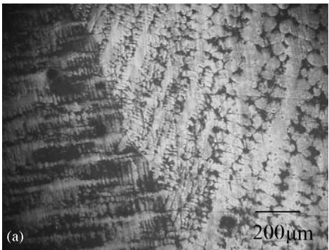
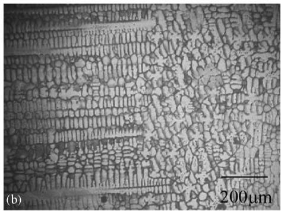
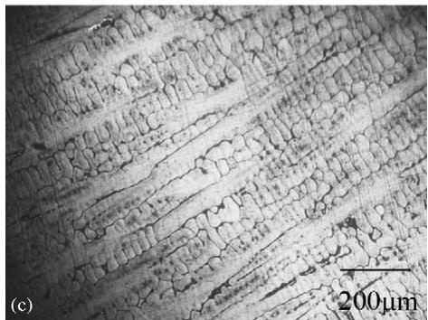
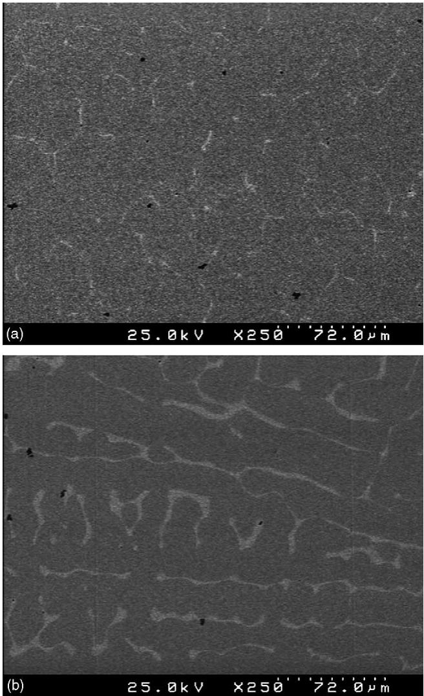
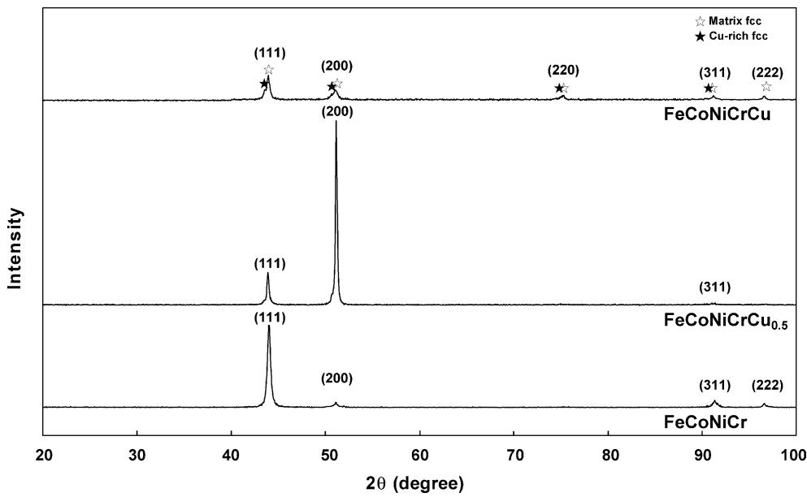
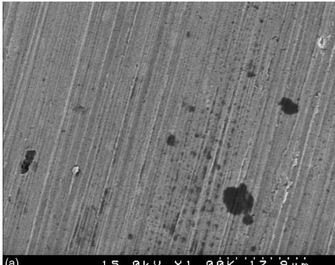
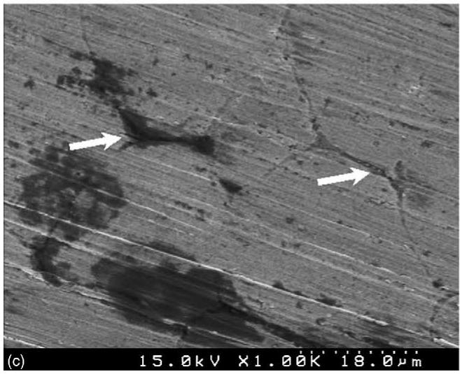
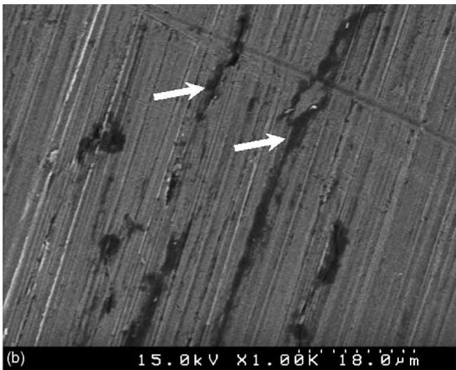
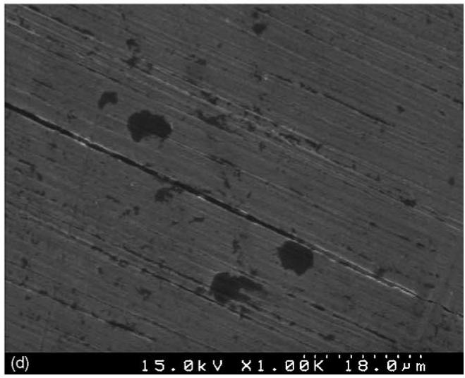
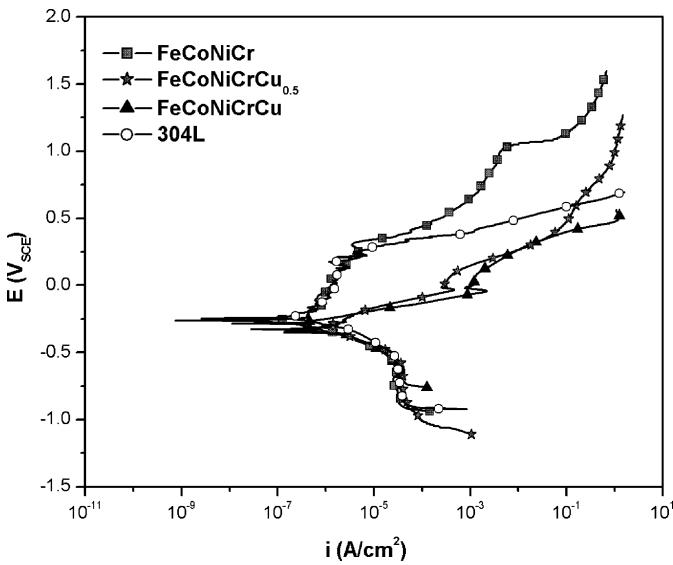

# Corrosion behavior of FeCoNiCrCux high-entropy alloys in 3.5% sodium chloride solution

Yu-Jui Hsu, Wen-Chi Chiang, Jiann-Kuo Wu∗

Institute ofMaterials Engineering, National Taiwan Ocean University, Keelung 20224, Taiwan

Received 15 July 2004; received in revised form 10 November 2004; accepted 3 January 2005

## Abstract

The corrosion behavior of FeCoNiCrCux high-entropy alloys in 3.5% NaCl solution is reported in this paper. The corrosion resistance has been evaluated using immersion tests and potentiodynamic polarization measurements. Our results show that the increase of copper content in FeCoNiCrCux alloys also increases the tendency to localized corrosion of these alloys. This is due to Cu-rich interdendrite and Cu-depleted (Cr-rich) dendrite in these alloys set up a active/noble cell of appreciable potential difference, and the galvanic action results in preferentially attack along the interdentrites of copper containing high-entropy alloys. © 2005 Elsevier B.V. All rights reserved.

Keywords: High-entropy alloys; Localized corrosion; Segregation; Interdendrite

## 1. Introduction

In the past, the design concept of new alloy systems has been conventionally based on an element as their major constituent, such as Fe-based and Ni-based alloy systems, and other lesser elements as their constituents for the enhancement of properties and performances. This design concept has also restricted the development of new materials in recent years. To break through this cognitive concept of alloy design, a new alloy system was developed [1,2]. This new concept of alloy system is also called “high-entropy alloy”. High-entropy alloys have multielements as their major constituents, and the contents of each major constituent is greater than 5 at.% and less than 35 at.%. Because there is no matrix element in high-entropy alloy system, each constituent element in this system could be regarded as a solute atom. To increase the entropy, each major element of these alloy systems is in equimolar or near-equimolar ratio. According to the previous researches [1–6], these high-entropy alloy systems have many good properties, such as ease of amorphization, high hardness and strength, good thermal stability. However, the corrosion data of high-entropy alloys in most aqueous solutions are not available. The purpose of this study is to investigate the immersion behavior and electrochemical polarization behavior of FeCoNiCrCux high-entropy alloys in 3.5% NaCl solution.

## 2. Experimental methods

## 2.1. Materials preparation

The alloys used in this study were FeCoNiCr (x = 0), FeCoNiCrCu (x = 0.5) and FeCoNiCrCu (x = 1). These alloys were melted by arc melting from a mixture of high purity (99.99%) of Fe, Co, Ni, Cr, and Cu metals under a titanium-gettered atmosphere of argon. For comparison, AISI 304L stainless steel was also used in this study.

The composition analyses of elements within these alloys were carried out by scanning electron microscope (SEM) equipped with an energy dispersive X-ray spectrometry (EDX). X-ray diffraction (XRD) using Cu K radiation was used to identify crystalline phases and obtain the lattice parameters of these alloys. The XRD investigation was performed with the diffraction angle (2θ) from $2 0 ^ { \circ }$ to $1 0 0 ^ { \circ }$ at a speed of 1◦ min−1.

## 2.2. Immersion tests

Immersion tests were conducted in aerated 3.5% NaCl solution at $2 5 ^ { \circ } \mathrm { C }$ for 30 days. To remove adherent corrosion products after immersion tests, the corroded specimens were cleaned in 10% HCl solution with $1 \mathrm { g } \mathrm { L } ^ { - 1 }$ hexamethylenetetramine followed by distilled water and acetone. Then, the specimens were dried in an oven for 1 h and weighed to 0.1 mg. The corrosion rate then can be calculated from the weight loss. The surface morphology of each specimen was also examined by SEM to determine the extent of degradation and to identify the corrosion mechanisms.

## 2.3. Potentiodynamic polarization measurements

Potentiodynamic polarization measurements were carried out in a typical three-electrode cell setup with the specimen as a working electrode, a saturated calomel reference electrode (SCE), and a platinum counter electrode. The potential of the working electrode was measured through the Luggin probe with respect to the reference electrode which was placed as close as possible to the specimen. The electrochemical polarization measurements were conducted in aerated 3.5% NaCl solution at $2 5 ^ { \circ } \mathrm { C }$ under atmospheric pressure. The specimen was scanned potentiodynamically at a rate of $1 \mathrm { m V s ^ { - 1 } }$ from the initial potential of 250 mV versus open circuit potential to the final potential of $1 . 6 \mathrm { V } _ { \mathrm { S C E } }$ . Calibration was conducted in accordance with ASTM standard G5 [7] and G59 [8].

## 3. Results and discussion

## 3.1. Microstructure and phase constitution of as-cast $F e C o N i C r C u _ { x }$ alloys

The chemical compositions of specimens are listed in Table 1. The optical micrographs of these alloys are shown in Fig. 1. Fig. 2 illustrates the XRD patterns of as-cast Fe-CoNiCr, $\mathrm { F e C o N i C r C u } _ { 0 . 5 }$ , and FeCoNiCrCu alloys. In this study, all these alloys basically belong to fcc structure. The small peaks slightly on the left of the matrix fcc of FeCoNi-CrCu in XRD patterns is identified as Cu-rich interdendrites, which exhibits the same location of copper and have been reported previously [6]. As the Cu content decreases in these alloys, the peak intensities also changes due to the lattice distortion caused by different atomic size and still remains in fcc structure [6,9]. There is also no tendency to form complex or multiple phases when increasing the number of constituent elements. Because the wavelength of X-ray is constant $( \lambda = 1 . 5 4 \times 1 0 ^ { - 1 0 } \mathrm { m } )$ , from the angle (θ) and plane (h k l) of each diffraction peak, a set of lattice parameter can be calculated by Bragg’s law. These values of lattice parameter were plotted against $\cos ^ { 2 } \theta$ , and the precise parameter of alloy (a0) can be estimated by least squares and extrapolation method [10]. The lattice parameters of FeCoNiCr, FeCoNiCrCu0.5, and FeCoNiCrCu in this study are $3 . 5 8 7 \times 1 0 ^ { - 1 0 }$ $3 . 5 8 5 \times 1 0 ^ { - 1 0 }$ , and $3 . 5 8 2 \times 1 0 ^ { - 1 0 }$ m, respectively.

EDX analyses of the compositions of FeCoNiCr, FeCoNiCrCu0.5, and FeCoNiCrCu
<table><tr><td></td><td colspan="5">Alloys (wt.%)</td></tr><tr><td></td><td>Fe</td><td>Cr</td><td>Ni</td><td>Co</td><td>Cu</td></tr><tr><td>FeCoNiCr</td><td>24.58</td><td>25.12</td><td>25.92</td><td>24.90</td><td></td></tr><tr><td>FeCoNiCrCu0.5</td><td>20.47</td><td>16.48</td><td>25.48</td><td>23.99</td><td>13.49</td></tr><tr><td>FeCoNiCrCu</td><td>18.78</td><td>16.25</td><td>21.78</td><td>21.50</td><td>21.69</td></tr></table>

  
Fig. 1. Microstructure of as-cast FeCoNiCrCux alloys: $\left( \mathrm { a } \right) x = 0 , \left( \mathrm { b } \right) x = 0 . 5 ,$ and (c) x = 1.

Fig. 3 shows the SEM-backscattered electron images (BEI) of as-cast $\mathrm { F e C o N i C r C u } _ { 0 . 5 }$ and FeCoNiCrCu alloys, which are composed of dendrites and interdentrites. According to the EDX analyses as listed in Table 2, the interdendrite (lighter phase) of as-cast $\mathrm { F e C o N i C r C u } _ { x }$ alloy is Curich phase, and dendrite (darker phase) is Cu-depleted phase. When decreasing the Cu concentration, the phenomenon of Cu segregation in interdendrites will be gradually removed. As listed in Table 3 [5,11–13], Cu element has weaker binding force (chemical mixing enthalpy, $\Delta H ^ { \mathrm { c h e m } } )$ to other constituent elements than Fe, Co, Ni, and Cr. As a result of dendritic solidification, Cu solute atoms tend to segregate across the interdendrites and grain boundaries during the period of solidification. According to some previous studies, it is not easy to eliminate this phenomenon of Cu segregation by conventional heat treatment [5].

  
Fig. 2. XRD patterns of as-cast FeCoNiCrCux alloys.  
Fig. 3. Micrographs of as-cast FeCoNiCrCux alloys: (a) x = 0.5, and (b) x = 1.

Table 2  
EDX analyses of the dendrite and interdendrite structure of as-cast FeCoNiCrCu0.5 and FeCoNiCrCu alloys
<table><tr><td rowspan="2"></td><td colspan="2">FeCoNiCrCu0.5 (at.%)</td><td colspan="2">FeCoNiCrCu (at.%)</td></tr><tr><td>Interdendrite</td><td>Dendrite</td><td>Interdendrite</td><td>Dendrite</td></tr><tr><td>Cu</td><td>82.18</td><td>11.68</td><td>86.68</td><td>9.56</td></tr><tr><td>Fe</td><td>0.90</td><td>21.80</td><td>3.46</td><td>23.58</td></tr><tr><td>Co</td><td>1.08</td><td>24.45</td><td>2.67</td><td>24.67</td></tr><tr><td>Ni</td><td>11.60</td><td>22.73</td><td>5.41</td><td>21.34</td></tr><tr><td>Cr</td><td>4.24</td><td>19.34</td><td>1.78</td><td>21.08</td></tr></table>

Table 3  
Chemical mixing enthalpy $( \Delta H ^ { \mathrm { c h e m } } )$ of a pair of atoms [5,11–13]
<table><tr><td></td><td> $\Delta H ^ { \mathrm { c h e m } }$  (kJ mol−1)</td></tr><tr><td>Cu—Fe</td><td>13</td></tr><tr><td>Cu—Co</td><td>10</td></tr><tr><td>Cu—Ni</td><td>4</td></tr><tr><td>Co—Ni</td><td>0</td></tr><tr><td>Cu—Cr</td><td>-1</td></tr><tr><td>Fe—Co</td><td>-1</td></tr><tr><td>Fe—Cr</td><td>-1</td></tr><tr><td>Fe—Ni</td><td>-2</td></tr><tr><td>Co—Cr</td><td>-4</td></tr><tr><td>Ni—Cr</td><td>-7</td></tr></table>

Table 4

## 3.2. Properties of as-cast FeCoNiCrCux alloys

## 3.2.1. Immersion tests

The average corrosion rates of as-cast FeCoNiCrCux alloys were determined by using the weight loss method in 3.5% NaCl solution for 30 days immersion tests at $2 5 ^ { \circ } \mathrm { C }$ The average corrosion rate can be calculated from [14]:

$$
{ \mathrm { c o r r o s i o n } } { \mathrm { r a t e } } ( { \mathrm { m m y e a r } } ^ { - 1 } ) = { \frac { 8 . 7 6 \times 1 0 ^ { 4 } \times W } { T \times A \times D } }\tag{1}
$$

where W is the total weight loss (in g) after exposure time T (in h), D is the density of alloy $( \mathrm { i n } \ \mathrm { g } \mathrm { c m } ^ { - 3 } )$ , and A (in $\mathrm { c m } ^ { 2 } )$ is the area of the specimen. The D values of FeCoNiCr, $\mathrm { F e C o N i C r C u } _ { 0 . 5 } ,$ and FeCoNiCrCu are 8.25, 8.38, and 8.36, respectively.

The average corrosion rates in 3.5% NaCl solution for 30 days immersion test at $2 5 ^ { \circ } \mathrm { C }$ are summarized in Table 4. In the $\mathrm { F e C o N i C r C u } _ { x }$ alloys, the Cu addition significantly increases the corrosion rates and leads to interior localized corrosion in 3.5% NaCl solution. Cu alloying element has negative effect on the corrosion resistance of $\mathrm { F e C o N i C r C u } _ { x }$ alloys.

Average corrosion rates (mm $\mathrm { y e a r ^ { - 1 } } ,$ ) of as-cast FeCoNiCrCux alloys in 3.5% NaCl solution at $2 5 ^ { \circ } \mathrm { C }$
<table><tr><td></td><td>FeCoNiCr</td><td> $\mathrm { F e C o N i C r C u } _ { 0 . 5 }$ </td><td>FeCoNiCrCu</td></tr><tr><td>Immersion testa</td><td> $7 . 6 2 \times 1 0 ^ { - 4 }$ </td><td> $8 . 8 9 \times 1 0 ^ { - 3 }$ </td><td> $1 . 1 4 \times 1 0 ^ { - 2 }$ </td></tr><tr><td>Polarization  $\mathrm { c u r v e } ^ { \mathrm { b } }$ </td><td> $3 . 3 1 \times 1 0 ^ { - 4 }$ </td><td> $7 . 4 6 \times 1 0 ^ { - 3 }$ </td><td> $1 . 3 7 \times 1 0 ^ { - 2 }$ </td></tr></table>

a Average corrosion rate is converted from weight loss data.  
b Average corrosion rate is obtained from Tafel region extrapolation and Faraday’s law.

The surface appearances of as-cast FeCoNiCrCux alloys are shown as Fig. 4. According to the SEM images, surface examination showed that the major types of corrosion were mainly localized corrosion and pitting, not uniform corrosion. Therefore, the corrosion rate converted from weight loss data could only be used as an index of extent of corrosion attack. Therefore, the order of weight loss due to localized corrosion and pitting for these alloys was FeCoNi-$\mathrm { C r C u } > \mathrm { F e C o N i C r C u } _ { 0 . 5 } > \mathrm { F e C o N i C r } .$

  
Fig. 4. Surface appearances of alloys after immersion tests in 3.5% NaCl solution for 30 days: (a) FeCoNiCr, (b) FeCoNiCrCu0.5, (c) FeCoNiCrCu, and (d) 304L (white arrows to the localized corrosion causing by electrochemical attack along the interdendrites).

  
Fig. 5. Polarization curves for as-cast FeCoNiCrCux alloys and 304L in 3.5% NaCl solution at $2 5 ^ { \circ } \mathrm { C } .$

The corroded surfaces of FeCoNiCr alloy and 304L stainless steel in 3.5% NaCl solution showed numerous small irregular shapes of dissolution pits. But the corroded surfaces of $\mathrm { F e C o N i C r C u } _ { 0 . 5 }$ and FeCoNiCrCu alloys showed that the Cu-rich phases in interdendrites corrode preferentially. Cu alloying elements exert harmful effects on $\mathrm { F e C o N i C r C u } _ { x }$ alloys that the corrosion resistance is degenerated, and damage is accelerated with an increase in the Cu content. According to Table 2, the interdendrites are also Cr-depleted zone and in active state. The active interdendrites are coupled to the Cr-rich and Cu-depleted passive dendrites. The low anode/cathode surface area ratio results in galvanic corrosion at the interdendrites, and the electrochemical action causes attack along the interdendrites in copper containing alloys.

## 3.2.2. Potentiodynamic polarization measurements

The potentiodynamic polarization curves of as-cast $\mathrm { F e C o N i C r C u } _ { x }$ alloys in 3.5% NaCl solution are given in Fig. 5. The curve for 304L stainless steel is also plotted for comparison. Only limited regions of passivation are presented for the $\mathrm { F e C o N i C r C u } _ { 0 . 5 }$ and FeCoNiCrCu alloys, which are much narrower than FeCoNiCr alloy and 304L stainless steel. The average corrosion rates obtained from electrochemical polarization measurements can be calculated from [14]:

$$
\operatorname { c o r r o s i o n } \operatorname { r a t e } ( \operatorname* { m m } \operatorname { y e a r } ^ { - 1 } ) = { \frac { 3 . 2 7 \times 1 0 ^ { - 3 } \times i \operatorname { c o r r } \times \operatorname { E W } } { D } }\tag{2}
$$

where EW is the equivalent weight of alloy, D is the density of alloy (in $\mathbf { g } \mathbf { c m } ^ { - 3 } )$ , and $i _ { \mathrm { c o r r } }$ (in $\mu \mathrm { A c m } ^ { - 2 } )$ is the corrosion current density of the specimen. The EW values of Fe-CoNiCr, FeCoNiCrCu0.5, and FeCoNiCrCu are 26.56, 26.38, and 26.56, respectively. The corrosion rates presented in Table 4 delineates that the results obtained from immersion test and polarization study are in correspondence with each other.

Electrochemical parameters of as-cast FeCoNiCrCux alloys and 304L stainless steel in 3.5% NaCl solution at 25 ◦C
<table><tr><td></td><td> $E _ { \mathrm { c o r r } } \mathrm { ^ a _ { \Delta } ( V _ { S C E } ) }$ </td><td> $E _ { \mathrm { p i t } } \mathrm { ^ b _ { \Gamma } ( V _ { S C E } ) }$ </td><td> $i _ { \mathrm { c o r r } } ^ { \mathrm { ~ \tiny ~ c ~ } } ( \mathrm { A c m } ^ { - 2 } )$ </td></tr><tr><td>FeCoNiCr</td><td> $- 0 . 2 6$ </td><td>0.31</td><td> $3 . 1 5 \times 1 0 ^ { - 8 }$ </td></tr><tr><td>FeCoNiCrCu0.5</td><td>-0.29</td><td>0.09</td><td> $7 . 2 3 \times 1 0 ^ { - 7 }$ </td></tr><tr><td>FeCoNiCrCu</td><td>-0.33</td><td>0.08</td><td> $1 . 3 2 \times 1 0 ^ { - 6 }$ </td></tr><tr><td>304L</td><td>-0.25</td><td>0.23</td><td> $6 . 0 1 \times 1 0 ^ { - 7 }$ </td></tr></table>

a $E _ { \mathrm { c o r r } } \mathrm { : }$ corrosion potential.  
b $E _ { \mathrm { p i t } } \colon$ pitting potential.  
c $i _ { \mathrm { c o r r } } \colon$ corrosion current density.

The electrochemical parameters of as-cast $\mathrm { F e C o N i C r C u } _ { x }$ alloys and 304L stainless steel in 3.5% NaCl solution are also given in Table 5. The corrosion potentials for as-cast FeCoNiCrCux alloys vary from $- 0 . 2 6 \ \mathrm { t o } \ - 0 . 3 3 \mathrm { V } _ { \mathrm { S C E } }$ , and the pitting potentials vary from 0.08 to 0.31 VSCE. FeCoNiCr alloy and 304L stainless steel have higher corrosion potential and pitting potential among all specimens. Because of Cu segregation in interdendrites and then causing nonprotective passive film on surface, the passivation region of FeCoNiCrCux alloys with higher Cu addition is narrower than those without Cu addition in 3.5% NaCl solution. The larger passivation current was also observed in those alloys with Cu content. These indicate that FeCoNiCr alloy is easier to passivate and more corrosion-resistant in 3.5% NaCl solution and even shows better corrosion-resistant than 304L stainless steel.

## 4. Conclusions

1. The as-cast $\mathrm { F e C o N i C r C u } _ { x }$ alloys $( x = 0 , 0 . 5 ,$ and 1) belong to fcc structure. But for as-cast $\mathrm { F e C o N i C r C u } _ { 0 . 5 }$ and FeCoNiCrCu alloys, the phenomenon of Cu segregation due to weaker bonding force to other elements is easily formed in interdendrites.

2. After the immersion tests for 30 days in 3.5% NaCl solution, the surface examination of as-cast FeCoNiCrCu0.5 and FeCoNiCrCu alloys showed that the major type of corrosion was galvanic action between interdendrite and dendrite, and then resulted in localized corrosion. The corroded surfaces of as-cast FeCoNiCr alloy and 304L stainless steel showed numerous small irregular shapes of dissolution pits. The order of weight loss due to localized corrosion and pitting for these alloys was FeCoNi-CrCu > FeCoNiCrCu0.5 > FeCoNiCr. The corrosion damage is accelerated with an increase in the Cu content.

3. FeCoNiCr alloy is easier to passivate and more corrosionresistant than FeCoNiCrCu0.5 and FeCoNiCrCu0.5 alloys in 3.5% NaCl solution. This phenomenon is caused by Cu segregation in interdendrites.

## References

[1] J.W. Yeh, S.K. Chen, S.J. Lin, J.Y. Gan, T.S. Chin, T.T. Shun, C.H. Tsau, S.Y. Chang, Adv. Eng. Mater. 6 (2004) 299.

[2] K.H. Huang, Master Thesis, National Tsing Hua University, Taiwan, 1996.

[3] K.T. Lai, Master Thesis, National Tsing Hua University, Taiwan, 1998.

[4] Y.H. Hsu, Master Thesis, National Tsing Hua University, Taiwan, 2000.

[5] Y.T. Hung, Master Thesis, National Tsing Hua University, Taiwan, 2001.

[6] C.J. Tung, Master Thesis, National Tsing Hua University, Taiwan, 2002.

[7] ASTM Standard G5-94, ASTM, PA, 2003.

[8] ASTM Standard G59-97, ASTM, PA, 2003.

[9] C.Y. Hsu, J.W. Yeh, S.K. Chen, T.T. Shun, Metall. Mater. Trans. A 35 (2004) 1465.

[10] B.D. Cullity, Elements of X-ray Diffraction, Addison-Wesley, MA, 1978.

[11] A. Takeuchi, A. Inoue, Mater. Trans. 41 (2000) 1372.

[12] A. Takeuchi, A. Inoue, Mater. Trans. 42 (2001) 1435.

[13] R. Boom, A.R. Miedema, A.K. Niessen, F.R. de Boer, W.C. Mattens, Cohesion in Metals: Transition Metal Alloys, Elsevier Applied Science, Amsterdam, Netherlands, 1988.

[14] ASTM Standard G31-72, ASTM, PA, 2003.