# Microstructure and electrochemical properties of high entropy alloys—a comparison with type-304 stainless steel

Y.Y. Chen, T. Duval, U.D. Hung, J.W. Yeh, H.C. Shih

Department of Materials Science and Engineering, National Tsing Hua University, 101 Kuang Fu Road, Sec. 2, Hsinchu 300, Taiwan, ROC

Received 23 February 2004; accepted 6 November 2004 Available online 25 December 2004

## Abstract

High entropy alloys (HEAs) are a newly developed family of multi-component glassy alloys composed of several major alloying elements, such as copper, nickel, aluminum, cobalt, chromium, iron, silicon, titanium, etc. The HEA studied had a nearly amorphous structure as proven by X-ray difraction (XRD), selected area difraction (SAD), and diferential scanning calorimetry (DSC) analysis. The dendritic phase was composed mainly of a non-crystalline phase with a little body centered cubic (BCC) structure whereas the interdendritic phase had an amorphous structure containing small amounts of nano-scale precipitates. The HEA had a high degree of atomic disorder with mechanical properties comparable to that of glass and it was therefore hard but brittle. Its hardness (Hv860) was much higher than that of type-304 stainless steel (Hv265). The anodic polarization curves of the HEA, obtained in aqueous solutions of NaCl and $\mathrm { H } _ { 2 } \mathrm { S O } _ { 4 } ,$ clearly indicated that the general corrosion resistance of the HEA at ambient temperature $( \sim 2 5 ^ { \circ } \mathrm { C } )$ is superior to that of 304S, irrespective of the concentration of electrolyte in the range 0.1–1 M. On the other hand, the HEAs resistance to pitting corrosion in a $\mathrm { C l ^ { - } }$ environment is inferior to that of 304S, as indicated by a lower pitting potential and a narrower passive region for the HEA. Tests in 1 N sulfuric acid containing different concentrations of chloride ions showed that the HEA has least resistance to general corrosion at a chloride ion concentration of 0.5 M (close to the concentration in seawater). The

lack of hysteresis in cyclic polarization tests confirmed that the HEA—like 304S—is not susceptible to pitting corrosion in chloride-free 1 N $\mathrm { H } _ { 2 } \mathrm { S O } _ { 4 }$ - 2004 Elsevier Ltd. All rights reserved.

Keywords: High entropy alloy; Electrochemical behavior; Anodic polarization; Stainless steel; General corrosion; Pitting; Cyclic polarization

## 1. Introduction

Conventional engineering alloy systems are mainly made up of iron, copper, aluminum, magnesium, titanium, zirconium, etc. Also, superalloys are classified as ironbased, nickel-based and cobalt-based, etc. These alloys all have crystalline structures. During the 1930s, Kramer et al. produced the first amorphous alloy using vapor deposition [1,2]. In the 1950s, Bremer et al. manufactured a Ni–P non-crystalline alloy by electrodeposition methods [3]. However, neither of these approaches produced an alloy that was cooled directly from the liquid phase to produce an amorphous phase. It was not until the 1960s, that Duwez obtained an Au–25 at.%Si amorphous alloy by rapid solidification, and confirmed that it was possible to obtain the amorphous phase if the cooling rate was fast enough to suppress the nucleation and growth of crystals [4]. However in the 1960s, a very rapid cooling rate (about $1 0 ^ { 6 } \mathrm { K } / \mathrm { s } )$ was necessary in order to suppress the crystal nucleation and growth. Such a high cooling rate limited the specimen geometry: only thin films of a thickness of $5 0 { \mathrm { - } } 1 0 0 \ { \mu \mathrm { m } }$ could be formed, which could not be used as a structural material. Also, the thermal stability of these amorphous alloys was poor making them unstable for use near the glass transition temperature. In 1984, Kui et al. successfully produced a bulk $\mathrm { P d } _ { 4 0 } \mathrm { N i } _ { 4 0 } \mathrm { P } _ { 2 0 }$ amorphous alloy of 10 mm in diameter by using a fluxing method to remove heterogeneous nucleation [5]. And, during 1989–1998, Inoue et al. investigated several alloy systems with a highly stable supercooling liquid region, which had good glass-forming ability comparable to $\mathrm { P d } _ { 4 0 } \mathrm { N i } _ { 4 0 } \mathrm { P } _ { 2 0 }$ [6–10]. The alloy design approach was to select components that allowed the alloy composition to approach the eutectic composition. In this way, an amorphous alloy could be produced at a slower cooling rate. However, the designs of these alloys, as mentioned above, relied on the concept that the matrix was composed of a single major element. For example, even $\mathrm { Z r } _ { 6 5 } \mathrm { A l } _ { 7 . 5 } \mathrm { N i } _ { 1 0 } \mathrm { C u } _ { 1 7 . 5 }$ [8], is consistent with the ‘‘one major alloy element’ framework. In order to break away from the traditional alloy design conventions, a novel high entropy alloy (HEA) or a bulk glassy alloy was developed, which was a combination of many major elements, e.g., Ti–Zr–Hf–Cu–M (M = Fe, Co, Ni) [11].

In general, the corrosion resistance of crystalline alloys, like stainless steels (SS), depends on the formation of a protective surface oxide film. This observation suggested that an HEA composed of elements similar to SS might also possess good corrosion resistance. Because of the binding enhancement (binding strength among the component elements) and the fact that there are no dislocations within a fully amorphous phase, and because there are more kinds of alloy elements and, therefore, more atomic sizes, the HEA has a lot of advantages regarding its mechanical [12] and electrochemical [13,14] properties. For instance, an HEA has high-strength, high-hardness, good oxidation resistance, good resistance to atmospheric corrosion and to weak acid attack, excellent abrasion resistance, etc. Consequently, it has great potential for practical applications.

On the other hand, AISI type-304 stainless steel (304S) is the most popular alloy used by the chemical industry, in food processing plants and breweries, cryogenic vessels, gutters, downspouts, flashings, etc. The chemical compositions of 304S and the proposed HEA can be quite similar in that both can be made of Fe, Cr, Ni, and Cu, being diferent only in their relative proportions. Although substantial information is now available on the electrochemical behavior of stainless steels in numerous corrosive environments [15–33], the corrosion behavior of the HEA is relatively unknown. Therefore, it is of interest to determine the corrosion behavior of the HEA in comparison with conventional ferrous alloys, such as 304S.

In this paper, the microstructure and microhardness of the HEA were investigated. At the same time, the anodic polarization curves of the HEA and 304S were studied as functions of the acidity and chloride concentration of the aqueous solutions at ambient temperatures $( \sim 2 5 ^ { \circ } \mathrm { C } )$ . The results of the experiments allowed a comparison of the electrochemical behaviors of the two alloys as a function of Cl- and $\mathrm { S O } _ { 4 } ^ { 2 - }$

## 2. Experimental procedures

## 2.1. Test materials

Test materials used in this work were 304S and an HEA with the chemical compositions (wt.%), as analyzed by an inductively coupled plasma-atomic emission spectrometer (ICP-AES) device, listed in Tables 1 and 2. The type of HEA manufactured was a non-equal-mole, 7-component alloy of $\mathrm { C u _ { 0 . 5 } N i A l C o C r F e S i }$ . Cylindrical alloy ingots (5 cm in diameter and 2 mm thick) were prepared from a mixture of pure elements and smelted by arc melting on a water-cooled copper hearth under a purified argon gas atmosphere [11], as shown in Fig. 1. The alloy was repetitively melted and solidified by turning the solidified ingots over each time so as to obtain a completely alloyed state. Solidification occurred in a water-cooled copper mold. The relatively low proportion of copper in the alloy was necessary because the weaker binding between Cu and other elements would otherwise allow segregation of a copper-rich phase (FCC) in the interdendritic space. If the content of copper is decreased in this way, the segregated phase is immediately reduced or even disappears. In addition, the $\mathrm { C u } _ { 0 . 5 } \mathrm { N i A l C o C r F e S i }$ alloy has a much higher hardness than that of CuNiAlCoCrFeSi with only a small loss in ductility [35].

Table 1  
Chemical composition (wt.%) of the test materials
<table><tr><td>Elements</td><td>Fe</td><td>Ni</td><td>Cr</td><td>Cu</td><td>Al</td><td>Si</td><td>Mn</td><td>Co</td><td>C</td><td>P</td><td>S</td></tr><tr><td>HEA</td><td>17.87</td><td>18.79</td><td>16.65</td><td>10.17</td><td>8.63</td><td>8.99</td><td>一</td><td>18.86</td><td>0.03</td><td>0.006</td><td>0.003</td></tr><tr><td>304S</td><td>70.77</td><td>8.00</td><td>17.99</td><td>0.35</td><td></td><td>1.00</td><td>1.67</td><td>0.11</td><td>0.06</td><td>0.030</td><td>0.020</td></tr></table>

Table 2  
Elemental characteristics of the seven compositional elements
<table><tr><td>Element</td><td>Atomic weight (g/mol)</td><td>Melting point (C)</td><td>Boiling point (°C)</td><td>Density  $( \mathrm { g } / \mathrm { c m } ^ { 3 } )$ </td><td>Crystal structure</td><td>Atomic radius (Å)</td></tr><tr><td>Cu</td><td>63.55</td><td>1084</td><td>2567</td><td>8.96</td><td>FCC</td><td>1.28</td></tr><tr><td>Ni</td><td>58.69</td><td>1453</td><td>2732</td><td>8.90</td><td>FCC</td><td>1.24</td></tr><tr><td>Al</td><td>26.98</td><td>660.4</td><td>2467</td><td>2.70</td><td>FCC</td><td>1.43</td></tr><tr><td>Co</td><td>58.93</td><td>1495</td><td>2870</td><td>8.90</td><td>HCP</td><td>1.25</td></tr><tr><td>Cr</td><td>52.00</td><td>1875</td><td>2672</td><td>7.19</td><td>BCC</td><td>1.25</td></tr><tr><td>Fe</td><td>55.85</td><td>1538</td><td>2870</td><td>7.87</td><td>BCC</td><td>1.24</td></tr><tr><td>Si</td><td>28.09</td><td>1410</td><td>2680</td><td>2.33</td><td>Diamond</td><td>1.18</td></tr></table>

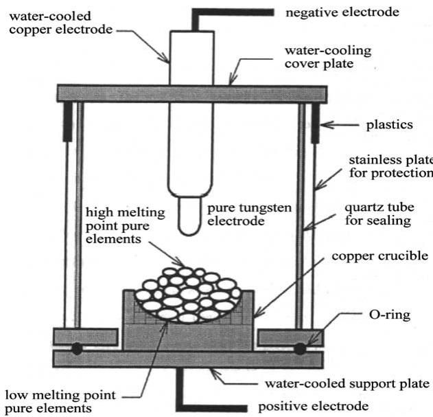  
Fig. 1. A schematic diagram of arc melting method.

For polarization measurements, the HEA sheet was obtained by cutting the bulk material using a water-cooled grinding wheel into pieces that were 2 mm thick, 1.91 cm long by 0.89 cm wide. On the other hand, a 1-inch diameter 304S rod was machined down to 1.22 cm diameter, and then cut into 1-cm-long pieces. Each test specimen was then cold mounted, using an epoxy resin to give an exposed surface area of $1 . 7 \mathrm { c m } ^ { 2 }$ for the HEA and $1 . 1 7 \mathrm { c m } ^ { 2 }$ for 304S.

## 2.2. Structure analysis of the HEA

## 2.2.1. Microstructure observation

The metallographic samples of the HEA were first mechanically wet ground using a 1500 SiC grit paper, then polished with ${ \bf A l } _ { 2 } { \bf O } _ { 3 }$ powder of 1 lm diameter, followed by etching for ${ \sim } 3$ min in a mixture of nitric acid and acetic acid (30 ml $\mathrm { H N O } _ { 3 }$ $( 6 5 \% ) + 2 0$ ml $\mathrm { C H _ { 3 } C O O H }$ (100%) at $2 5 ^ { \circ } \mathrm { C } )$ . After etching, the specimen was cleaned with distilled water, and then dried in air. Subsequently, the specimen was examined in a JEOL-5410 scanning electron microscope (SEM).

## 2.2.2. TEM analysis

In order to analyze the crystal structure of the HEA, including dendritic and interdendritic phases, a transmission electron microscope (TEM) was used. The TEM specimen was prepared by grinding and polishing to reduce the thickness to 30– $5 0 \mu \mathrm { m }$ . A small disc, 3 mm in diameter and ringed by Cu-grids for protection, was cut of from the specimen for further thinning. The pre-thinning process was performed in a twinjet electro-polish machine with a solution of 10% $\mathrm { H C l O _ { 4 } } + 9 0 \%$ $\mathrm { C H } _ { 3 } \mathrm { O H }$ at $0 \ { } ^ { \circ } { \bf C }$ . Finally, an ion-miller thinning device was used to bombard the delicate specimen until it was thin enough to be studied in the TEM. The prepared specimen was then observed in a JEOL JEM-2010 TEM with an accelerating voltage of 200 kV.

## 2.2.3. X-ray difraction analysis

The solidification structure of the HEA was examined with a RIGAKU ME510- FM2 X-ray difractometer using a copper-target radiation. The bulk specimen was ground into powder and pressed into a disc. The working voltage of the difractometer was 30 kV, and the operating current was 20 mA. The scanning region ranged from $2 0 ^ { \circ }$ to 100, and the scanning rate was 1/min.

## 2.2.4. DSC thermal analysis

The thermal stability of the HEA was evaluated by diferential scanning calorimetry (DSC). A specimen of 50 mg was put into an alumina crucible, and then the thermograms of the HEA were acquired in a diferential scanning calorimeter (SETARAM DSC 2000). The rate of increase in temperature was 10 C/min (0.167 K/s), starting at room temperature and ending at $1 4 0 0 ^ { \circ } \mathrm { C }$

## 2.3. Hardness test

The hardness of the HEA and 304S was measured using a Mitutoyo MVK-G3 microhardness tester. Before testing, specimens were polished to $3 \mu \mathrm { m }$ . The test loading was 25 g and the test time was 10 s. Measurements were made at five or more locations on each sample and the average value of all the measurements was then calculated.

## 2.4. Electrochemical measurements

## 2.4.1. Test solutions

Test solutions were prepared from reagent grade NaCl and $\mathrm { H } _ { 2 } \mathrm { S O } _ { 4 }$ (Merck), and dissolved in distilled water. The solution was deaerated by bubbling purified nitrogen gas through the test solution before and throughout the polarization experiment, to eliminate the efect of dissolved oxygen. The specimen was cathodically polarized -2.0 V with respect to the corrosion potential $( E _ { \mathrm { c o r r } } )$ for 1 min to reduce any oxides on the exposed surface. The solution in the test cell (1000 ml in volume) was constantly stirred to ensure that the concentration polarization of dissolved ions in the bulk solution could be neglected. The polarization experiments were performed at the desired temperatures under thermostatic conditions. The pH values for 1 N $\mathrm { H } _ { 2 } \mathrm { S O } _ { 4 }$ and for 1 M NaCl were 0.5 and 7.4, respectively; the pH values of other solutions were adjusted by adding HCl or NaOH. Before each electrochemical test, the working electrodes were mechanically polished with 600–1500 grit emery cloths, and thoroughly cleaned with distilled water, acetone and finally dried in air.

## 2.4.2. Anodic polarization

For polarization experiments, a three-electrode cell was used consisting of a working electrode, a saturated calomel electrode (SCE) as the reference electrode, and a smooth Pt sheet as the counter electrode. The potential was controlled and the current was measured, using a potentiostat/galvanostat (EG&G model 273) with a computercontrolled electrochemical interface, allowing continuous monitoring of the potential (E), total current (I), and time (t). An average current density (i) was obtained by dividing I by the initial working area of the specimen. All the potential values given below are expressed on the SCE scale, which is 241 mV lower than the SHE, i.e., $\mathrm { V } _ { \mathrm { S C E } } + 0 . 2 4 1$ mV = V [33]. Experiments were conducted at a scan rate of 1 mV/s and automatically terminated when the anodic current $\left( I _ { \mathrm { a } } \right)$ reached 100 mA, or when E reached 1.241 V, whichever occurred first. The pitting potential $( E _ { \mathrm { p i t } } )$ or breakdown potential $( E _ { \mathrm { { b } } } )$ was determined by noting the potential at which a continuous increase in anodic current occurred, indicating sustained localized breakdown of the passive film. To determine the reproducibility, tests were repeated three times for each condition.

## 2.5. Post-test observations

After the polarization experiments, the morphology of the corroded surface of each specimen was examined using an SEM. The tests were made after removing the electrode from the solution and washing it with doubly distilled water.

## 3. Results and discussion

## 3.1. Microstructure characteristics

Fig. 2 displays the surface microstructure of the HEA determined by SEM. The morphology and distribution of each alloy element observed by SEM and detected by EDS are shown in Fig. 3. In Fig. 3(a), the white island-like areas (region I) are rich in Cr, Si and O, possibly in the form of oxides, e.g., $\mathrm { C r } _ { 2 } \mathrm { O } _ { 3 }$ and $\mathrm { S i O } _ { 2 } .$ , which may have been the residual passive film. On the other hand, the gray interlaced rods (region II) were obviously dendritic structures.

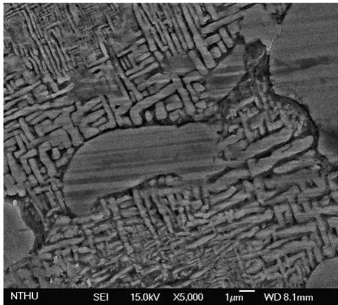  
Fig. 2. Surface morphology and microstructure of the high entropy alloy under the scanning electron microscope at a magnification of 5000·.

Fig. 4(a) shows the TEM microstructure of the HEA in the as-stamped condition. The bright portion is the dendritic phase (region A) whereas the dark portion (region B) is the interdendritic phase. Halo rings were observed indicating that the dendritic phase is composed mainly of a non-crystalline (amorphous) phase, as shown in Fig. 4(b); however, a small amount of a BCC phase was also present with a lattice constant of 2.91 A˚ (Fig. 4(c) and (d)). That is, the dendritic phase of the HEA is a eutectic structure with amorphous and BCC components. On the other hand, the interdendritic phase has an amorphous structure containing small amounts of nano-scale precipitates, as shown in Fig. 5. In our previous study [35], these nanoscale precipitates were shown to be crystalline with an FCC structure (lattice constant was 3.72 A˚ and the grain size was 50 A˚ ).

Fig. 6(a) shows the X-ray difraction pattern of the dendritic phase of the HEA. Not only the intensity of difraction is low, but also the BCC difraction peaks are weak and only 10% of the intensity that would be expected for common crystalline alloys with BCC structures. This is presumably due to the decreased content of copper that segregated in the interdendritic phase [35]. The BCC structure of the crystalline dendritic phase occurs because it is loosely packed and therefore accommodates the crystal strain more easily than face centered cubic (FCC) and hexagonal close packed (HCP). So it is proven again that the dendritic phase of the HEA is nearly amorphous. On the other hand, the difraction pattern of the interdendritic phase of the HEA exhibits only background intensity, as shown in

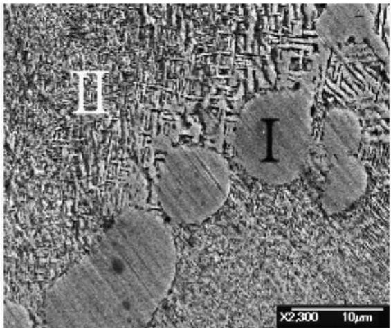  
(a)

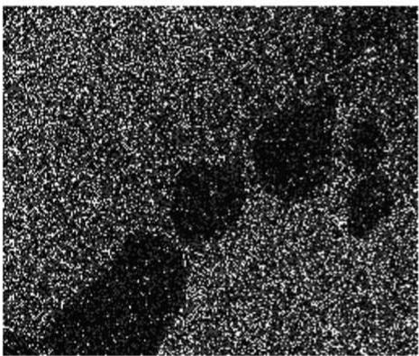  
(b)

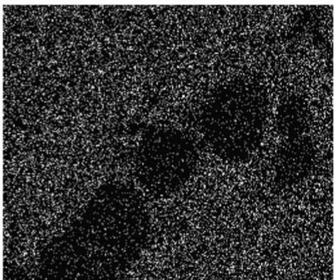  
(c)

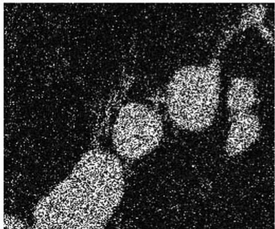  
(d)

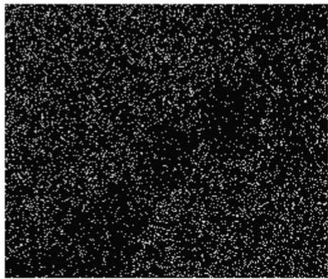  
(e)  
Fig. 3. The spatial distribution and morphology of each alloy element of the HEA observed by SEM and EDS: (a) EDS mapping area, at the magnification of 2300·, (b) Al, (c) Co, (d) Cr, (e) Cu, (f) Fe, (g) Ni, (h) O, (i) Si.

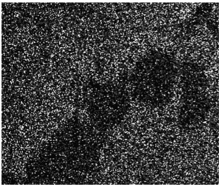  
(f)

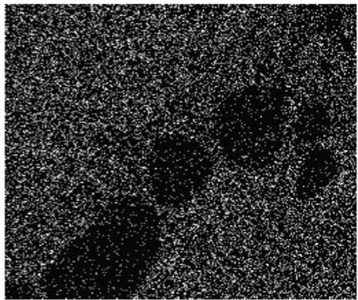  
(g)

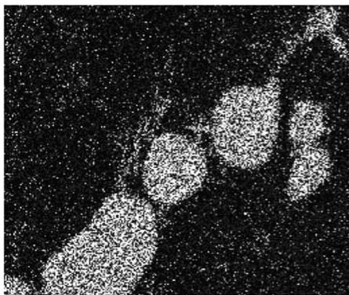  
(h)

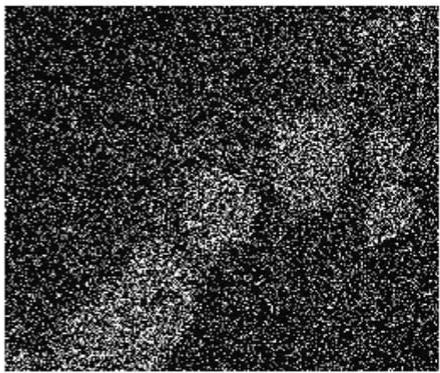  
(i)  
Fig. 3 (continued )

Fig. 6(b), which confirms the selected area difraction (SAD) results (Fig. 5) that the interdendritic phase has an amorphous structure.

In order to further confirm that the structure of the HEA is amorphous, a diferential scanning calorimetry (DSC) analysis was performed. In Fig. 7, the DSC thermograms for the HEA, spanning from room temperature to 1400 ${ } ^ { \circ } \mathbf { C } .$ , reveal the presence of a weak endothermic reaction at the $T _ { \mathrm { C u } }$ temperature of $1 0 1 0 ^ { \circ } \mathrm { C }$ , which should be the melting temperature of the Cu-rich phases segregated in the interdendritic phases [34]. Because the amounts of Cu-rich segregated phases are limited in this alloy, the endothermic reaction is relatively weak. The reaction at a $T _ { \mathrm { m } }$ of $1 2 0 0 ^ { \circ } \mathrm { C }$ , which is the melting temperature of the dendritic phases, is not a single sharp endothermic reaction, but rather it occurs over a wide temperature range of ${ \sim } 1 5 0 ^ { \circ } \mathrm { C }$ . It is due to the departure from the eutectic composition that pro-eutectoid phases form [35]. In addition, the observation that the endothermic reaction occurred over a wide temperature range clearly indicates that the HEA is nearly amorphous and quite diferent from the common crystalline alloys that typically show a single sharp endothermic reaction. On the other hand, the $T _ { \mathrm { C u } }$ and $T _ { \mathrm { m } }$ values in the decreasing temperature curve are both lower than those in the increasing temperature curve because of the efect of supercooling on the decreasing temperature curve which moves them toward the left (smaller values).

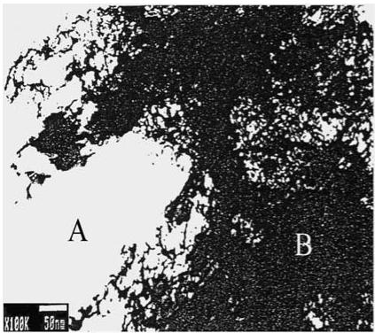  
(a)

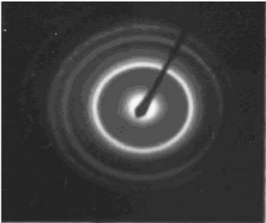  
(b)

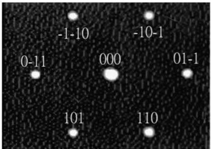  
(c)

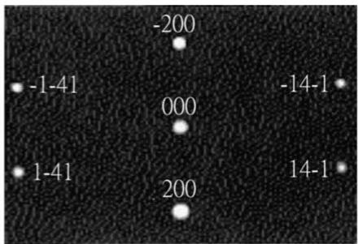  
(d)  
Fig. 4. (a) The bright field image of the HEA stamped foil showing the bright portion is the dendritic phase (region A) whereas the dark portion (region B) is the interdendritic phase. (b) The selected area difraction (SAD) pattern showing the dendritic phase is mainly of amorphous. (c) The SAD pattern indicating small amounts of dendritic phase is crystalline with a BCC structure (along the [-1 1 1] axis). (d) The SAD pattern indicating small amounts of dendritic phase is a BCC structure (along the [0 1 4] axis). Lattice constant is 2.91 A˚ .

## 3.2. Hardness

The hardness of the HEA, measured by a microhardness tester, was of Hv860, which is substantially higher than that of quartz (Hv700) and of the recently developed bulk amorphous alloy, $\mathrm { Z r } _ { 6 5 } \mathrm { A l } _ { 7 . 5 } \mathrm { C u } _ { 1 0 } \mathrm { N i } _ { 1 7 . 5 }$ (Hv467) [9]. The hardness of 304S was only of Hv265, a value very much lower than the hardness of the multi-component HEA. This illustrates that the HEA is superior in hardness. The degree of hardness of the HEA relates to the kinds and the amounts of the alloying elements. Therefore, the major reason for the high hardness of the HEA is the binding strength among the component elements. The more alloying elements, the larger the efects are. In addition, because the HEA used in this study is nearly amorphous but is not fully disordered (a little BCC structure was also found in the dendritic phases), the high hardness may also be attributed to a few synergistic efects of solution strengthening, precipitation enhancement, and fine-grain intensification, and there are almost no dislocations that assist in the deformation as would occur during slip in the nearly non-crystalline alloy.

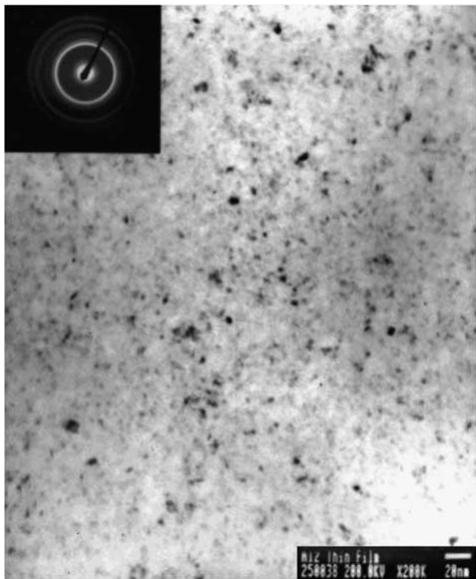  
Fig. 5. TEM micrograph shows that the interdendritic phase has an amorphous structure containing small amounts of nano-scale precipitates.

Because of the efect of binding strength between any two component elements, the hardness of the HEA is significantly raised with the addition of aluminum and silicon, or with the decrease of copper concentration. Aluminum, being a larger atom, provides more strain energy to enhance the efect of solution strengthening when it is dissolved in the crystal, and the binding capacity is greater between silicon and other atoms. In contrast, the binding ability of copper with other atoms is weaker, so the hardness of the HEA is increased by reducing the amount of copper. The hardness of the equal-mole HEA (CuNiAlCoCrFeSi) was reported as Hv567 in a previous study [35], clearly lower than the hardness (Hv860) of the non-equal-mole HEA $( \mathrm { C u } _ { 0 . 5 } \mathrm { N i A l C o C r F e S i } )$ evaluated in this study.

## 3.3. Anodic polarization curves

Fig. 8 shows the anodic polarization curves of the HEA and 304S in deaerated 1 M NaCl solutions at room temperature $( \sim 2 5 ^ { \circ } \mathrm { C } )$ . The corrosion potential $( E _ { \mathrm { c o r r } } )$ of the HEA (-0.53 V) is apparently more noble than that of 304S $( - 0 . 5 9 \mathrm { V } )$ , and the corrosion current density $( i _ { \mathrm { c o r r } } )$ of the HEA $( 3 . 1 6 \times 1 0 ^ { - 6 } \mathrm { A } / \mathrm { c m } ^ { 2 } )$ is also a little lower than that of 304S $( 4 . 3 7 \times 1 0 ^ { - 6 } \mathrm { A } / \mathrm { c m } ^ { 2 } )$ . In general, the $i _ { \mathrm { c o r r } }$ values can be used to calculate the general corrosion rates $( r _ { \mathrm { c o r r } } )$ of alloys. However, a lower corrosion current density does not necessarily correspond to a lower corrosion rate, because the corrosion rate is not only related to the corrosion current density but also to a function of atomic-fraction-weighted values of atomic weight, ion valence, and density of the alloy. Therefore, a more reasonable value of the $r _ { \mathrm { c o r r } }$ can be estimated according to Faradays law as follows [33]:

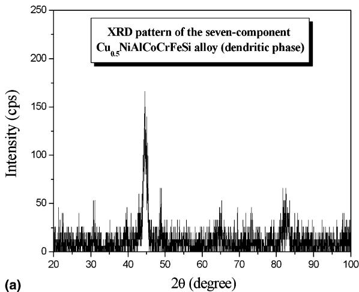

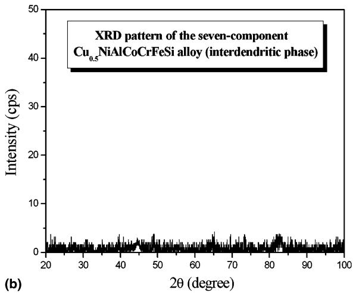  
Fig. 6. X-ray difraction patterns of the seven-component $\mathrm { C u _ { 0 . 5 } N i A l C o C r F e S i }$ alloy show that: (a) the dendritic phase is composed mainly of an amorphous structure with a little BCC structure, and (b) the interdendritic phase has an amorphous structure.

$$
r _ { \mathrm { c o r r } } = 0 . 0 0 3 2 7 { \frac { a i _ { \mathrm { c o r r } } } { n D } } \ ( \mathrm { i n \ m m / y r } )\tag{ð1Þ}
$$

where $a$ is the atomic weight (at.%), $i _ { \mathrm { c o r r } }$ is the corrosion current density $\mathrm { ( \mu A / c m } ^ { 2 } )$ , n is the number of equivalents exchanged, and D is the density $( \mathrm { g } / \mathrm { c m } ^ { 3 } )$ . Calculation of correspondence between general corrosion rate and corrosion current density for an alloy requires a determination of the equivalent weight for the alloy, $a / n ,$ , in Eq. (1). This alloy equivalent weight is a weighted average of $a / n$ for the major alloying elements in any given alloy. The most popular method for calculation of equivalent weight sums the fractional number of equivalents of all alloying elements to determine the total number of equivalents, $N _ { \mathrm { E Q } }$ , which result from dissolving unit mass of the alloy [36]. That is,

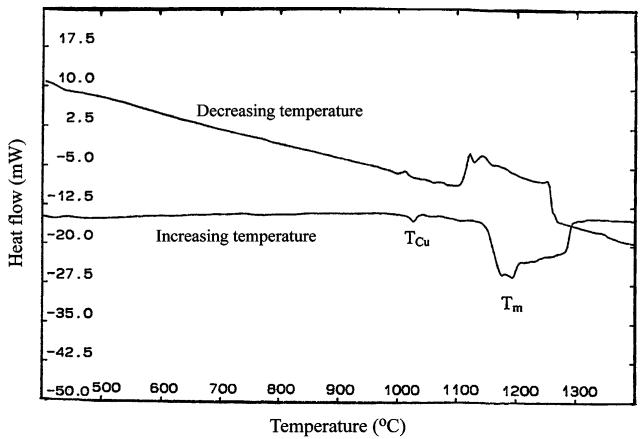  
Fig. 7. DSC thermograms of HEA span from room temperature to $1 4 0 0 ^ { \circ } \mathrm { C } .$

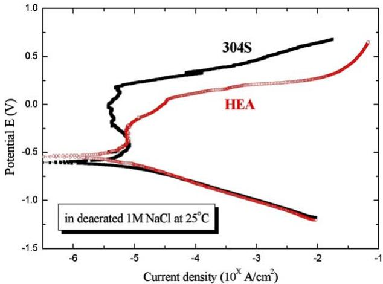  
Fig. 8. Comparisons of the anodic polarization curves for the HEA and 304S in deaerated 1 M NaCl solution at room temperature $( \sim 2 5 ^ { \circ } \mathrm { C } )$

$$
N _ { \mathrm { E Q } } = \sum \left( \frac { f _ { i } } { a _ { i } / n _ { i } } \right) = \sum \left( \frac { f _ { i } n _ { i } } { a _ { i } } \right)\tag{ð2Þ}
$$

where $f _ { i } , n _ { i }$ and $a _ { i }$ are mass fraction, electrons exchanged, and atomic weight, respectively, of the ith alloying element. Equivalent weight, EW, is then the reciprocal of $N _ { \mathrm { E Q } } ; { \mathrm { i . e . , E W } } = N _ { \mathrm { E O } } ^ { - 1 }$

Calculation of equivalent weight for the non-equal mole, 7-component HEA $( \mathrm { C u } _ { 0 . 5 } \mathrm { N i A l C o C r F e S i } )$ is given in the following example, assuming the following parameters for the alloy:

Cu: 7.690 at.%, n = 2;

Ni: 15.385 at.%, n = 2;

Al: 15.385 at.%, n = 3;

Co: 15.385 at.%, n = 2;

Cr: 15.385 at.%, n = 3;

Fe: 15.385 at.%, n = 2;

Si: 15.385 at.%, n = 4.

From Eq. (2), $N _ { \mathrm { E Q } } = { \frac { ( 0 . 0 7 6 9 ) ( 2 ) } { 6 3 . 5 5 } } + { \frac { ( 0 . 1 5 3 8 5 ) ( 2 ) } { 5 8 . 6 9 } } + { \frac { ( 0 . 1 5 3 8 5 ) ( 3 ) } { 2 6 . 9 8 } } + { \frac { ( 0 . 1 5 3 8 5 ) ( 2 ) } { 5 8 . 9 3 } }$ $+ \frac { ( 0 . 1 5 3 8 5 ) ( 3 ) } { 5 2 . 0 0 } + \frac { ( 0 . 1 5 3 8 5 ) ( 2 ) } { 5 5 . 8 5 } + \frac { ( 0 . 1 5 3 8 5 ) ( 4 ) } { 2 8 . 0 9 } = 0 . 0 6 6 2 8 5 .$

Equivalent weight for the HEA is then the reciprocal of 0.066285 or 15.09. Similarly, EW for 304S is 25.12. In addition, the densities of the HEA and 304S are $6 . 5 2 \mathrm { g } / \mathrm { c m } ^ { 3 }$ and $7 . 9 0 \mathrm { g } / \mathrm { c m } ^ { 3 }$ , respectively. Consequently, the general corrosion rate of the HEA in 1 M NaCl is 0.0239 mm/yr, whereas that of 304S is 0.0454 mm/yr. The HEA had a higher resistance to general corrosion, i.e. uniform corrosion, than did the 304S. This superior general corrosion resistance of HEA may be attributed to the fact that there are almost no grain boundaries and no segregation in this nearly amorphous alloy. However, the extent of the passive region $( \Delta E _ { \mathrm { p } } )$ for HEA (0.16 V) in deaerated 1 M NaCl solution approaches one-quarter of that for 304S (0.62 V), and the pitting potential $( E _ { \mathrm { p i t } } )$ for HEA (-0.25 V) is much lower than that for 304S (0.17 V), as listed in Table 3. Based on the nobler $E _ { \mathrm { c o r r } }$ and narrower $\Delta E _ { \mathrm { p } }$ for the HEA, we can conclude that HEA has a less tendency to be anodically polarized, but that once the passive film breaks down, it is more susceptible to pit nucleation and growth. On the other hand, the cathodic polarization curve for HEA in 1 M NaCl has an obviously large range (almost three decade) in the linear Tafel region, which indicates that the cathodic polarization of HEA in 1 M NaCl solutions at room temperature is activation controlled.

Electrochemical parameters of the HEA compared with 304S in diferent concentrations of deaerated NaCl solutions at room temperature (25 C)
<table><tr><td>Alloy</td><td>HEA</td><td colspan="3">304S</td></tr><tr><td>Concentration (M)</td><td>0.1</td><td>1</td><td>0.1</td><td>1</td></tr><tr><td> $E _ { \mathrm { c o r r } } \ : ( \mathrm { V } _ { \mathrm { S C E } } )$ </td><td>0.01</td><td>-0.53</td><td>-0.25</td><td>-0.59</td></tr><tr><td> $E _ { \mathrm { p i t } } \left( \mathrm { V } _ { \mathrm { S C E } } \right)$ </td><td>0.58</td><td>-0.25</td><td>0.46</td><td>0.17</td></tr><tr><td> $\Delta E _ { \mathrm { p } } \ : ( \mathrm { V } )$ </td><td>0.45</td><td>0.16</td><td>0.71</td><td>0.62</td></tr><tr><td> $i _ { \mathrm { c o r r } } \mathrm { ( \mu A / c m } ^ { 2 } )$ </td><td>0.178</td><td>3.16</td><td>1.59</td><td>4.37</td></tr><tr><td> $r _ { \mathrm { c o r r } } \left( \mathrm { m m } / \mathrm { y r } \right)$ </td><td>0.0013</td><td>0.0239</td><td>0.0165</td><td>0.0454</td></tr></table>

Electrochemical parameters of the HEA compared with 304S in diferent concentrations of deaerated $\mathrm { H } _ { 2 } \mathrm { S O } _ { 4 }$ solutions at room temperature $( \sim 2 5 ^ { \circ } \mathrm { C } )$
<table><tr><td>Alloy</td><td>HEA</td><td colspan="3">304S</td></tr><tr><td>Concentration (M)</td><td>0.1</td><td>1</td><td>0.1</td><td>1</td></tr><tr><td> $E _ { \mathrm { c o r r } } \ : ( \mathrm { V } _ { \mathrm { S C E } } )$ </td><td>-0.06</td><td>-0.17</td><td>-0.05</td><td>-0.22</td></tr><tr><td> $E _ { \mathrm { b } } \ : ( \mathrm { V } _ { \mathrm { S C E } } )$ </td><td>0.11</td><td>0.09</td><td>1.12</td><td>1.06</td></tr><tr><td> $\Delta E _ { \mathrm { p } } \ : ( \mathrm { V } )$ </td><td>0.12</td><td>_a</td><td>1.13</td><td>0.90</td></tr><tr><td> $i _ { \mathrm { c o r r } } \ ( \mu \mathrm { A } / \mathrm { c m } ^ { 2 } )$ </td><td>10.7</td><td>251</td><td>50.1</td><td>501</td></tr><tr><td> $r _ { \mathrm { c o r r } } \left( \mathrm { m m } / \mathrm { y r } \right)$ </td><td>0.0810</td><td>1.8996</td><td>0.5209</td><td>5.2093</td></tr></table>

a There is almost no passive region, or so small that it can be neglected.

Similar tests were also conducted in 1 N $\mathrm { H } _ { 2 } \mathrm { S O } _ { 4 }$ at room temperature. In this electrolyte, the $E _ { \mathrm { c o r r } }$ for the HEA (-0.17 V) is still 50 mV higher than that for 304S (-0.22 V), and the corrosion current density for HEA $( 2 . 5 \mathrm { { i } } \times 1 0 ^ { - 4 } \mathrm { { A } } / \mathrm { { c m } } ^ { 2 } )$ is lower by a factor of two than that for 304S $( 5 . 0 1 \times 1 0 ^ { - 4 } \mathrm { A } / \mathrm { c m } ^ { 2 } )$ , as shown in Table 4. In addition, the corrosion rate of the HEA (1.8996 mm/yr) is lower than that of 304S (5.2093 mm/yr). However, Fig. 9 shows that passivation of the HEA takes place over an insignificant range of potentials compared with the range observed in NaCl (Fig. 8). It is apparent that the HEA is more resistant to general corrosion in 1 N $\mathrm { H } _ { 2 } \mathrm { S O } _ { 4 }$ than 304S (higher $E _ { \mathrm { c o r r } } .$ , lower $i _ { \mathrm { c o r r } }$ and $r _ { \mathrm { c o r r } } )$ . However, if general corrosion occurs at higher potentials, the corrosion resistance of the HEA will be less than that of 304S due to the diference in the passivation range. 304S is reported to be more suitable for use in chloride-free solutions [33] and, consistent with this report, pitting is absent (there is no pitting potential) in the $\mathrm { H } _ { 2 } \mathrm { S O } _ { 4 }$ solution. However, a breakdown potential $( E _ { \mathrm { { b } } } )$ still exists (Table 4). Above the breakdown potential, water is unstable and is oxidized to oxygen gas $( \mathrm { H } _ { 2 } \mathrm { O }  1 / 2 \mathrm { O } _ { 2 } + 2 \mathrm { H } ^ { + } + 2 \mathrm { e } ^ { - } )$ , i.e. oxygen gas will be evolved above $E _ { \mathrm { b } }$ . In addition, transpassive dissolution of the passive film could also be expected above $E _ { \mathrm { b } }$ in sulfuric acid medium [33]. The $E _ { \mathrm { b } }$ of the HEA (0.09 V) is much lower than that for 304S (1.06 V).

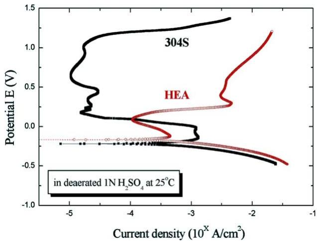  
Fig. 9. Comparisons of the anodic polarization curves for the HEA and 304S in deaerated 1 N $\mathrm { H } _ { 2 } \mathrm { S O } _ { 4 }$ solution at room temperature $( \sim 2 5 ^ { \circ } \mathrm { C } )$

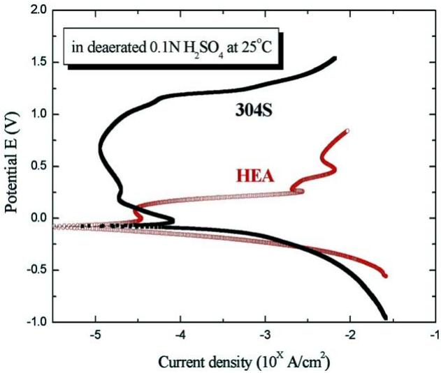  
Fig. 10. Comparisons of the anodic polarization curves for the HEA and 304S in deaerated 0.1 N $\mathrm { H } _ { 2 } \mathrm { S O } _ { 4 }$ at room temperature $( \sim 2 5 ^ { \circ } \mathrm { C } )$

In Fig. 10, we can see that the $E _ { \mathrm { c o r r } }$ values for the HEA (-0.06 V) and for 304S $\left( - 0 . 0 5 \mathrm { V } \right)$ in 0.1 N $\mathrm { H } _ { 2 } \mathrm { S O } _ { 4 }$ are almost the same. And the $i _ { \mathrm { c o r r } } \left( r _ { \mathrm { c o r r } } \right)$ in this dilute $\mathrm { H } _ { 2 } \mathrm { S O } _ { 4 }$ environment are respectively $1 . 0 7 \times 1 0 ^ { - 5 } \mathrm { A / c m } ^ { 2 }$ (0.0810 mm/yr) and $5 . 0 1 \times 1 0 ^ { - 5 } \mathrm { A / c m } ^ { 2 }$ (0.5209 mm/yr) for the HEA and 304S. Furthermore, 304S has a wider range of passive potentials (1.13 V) than HEA (0.12 V). It is worth noting that the passive region of the HEA in 0.1 N $\mathrm { H } _ { 2 } \mathrm { S O } _ { 4 }$ is much larger than that in 1 N $\mathrm { H } _ { 2 } \mathrm { S O } _ { 4 }$ (in which it is insignificant). The corrosion rate of the HEA in 0.1 N $\mathrm { H } _ { 2 } \mathrm { S O } _ { 4 }$ (0.0810 mm/yr) is much lower than that in 1 N $\mathrm { H } _ { 2 } \mathrm { S O } _ { 4 }$ (1.8996 mm/yr), and the $E _ { \mathrm { c o r r } }$ value is nobler (see Table 4). We can therefore assume that a higher concentration of $\mathrm { H } _ { 2 } \mathrm { S O } _ { 4 }$ is more corrosive to the HEA than a lower concentration. Similar to the results in 1 N $\mathrm { H } _ { 2 } \mathrm { S O } _ { 4 }$ , HEA is also more resistant than 304S to general corrosion in 0.1 N $\mathrm { H } _ { 2 } \mathrm { S O } _ { 4 } ;$ but, if general corrosion occurs at higher potentials, the resistance of the HEA to general corrosion is inferior to 304S because of the narrower passive region.

On the other hand, in a dilute (0.1 M) NaCl solution (Fig. 11), the HEA showed obvious passive behavior $( \Delta E _ { \mathrm { p } } = 0 . 4 5 \ : \mathrm { V } )$ and its $E _ { \mathrm { c o r r } }$ value (0.01 V) was higher than for 304S (-0.25 V). It is apparent that the HEA has a lower $i _ { \mathrm { c o r r } } ( 1 . 7 8 \times 1 0 ^ { - 7 } \mathrm { A / c m } ^ { 2 } )$ than 304S $( 1 . 5 9 \times 1 0 ^ { - 6 } \mathrm { A } / \mathrm { c m } ^ { 2 } )$ . From the viewpoint of general corrosion rate, the $r _ { \mathrm { c o r r } }$ of HEA (0.0013 mm/yr) is more than one order of magnitude lower than that of 304S (0.0165 mm/yr) in deaerated 0.1 M NaCl, as listed in Table 3. So it can be said that HEA is more resistant than 304S to general corrosion in both 0.1 M NaCl and in 0.1 N $\mathrm { H } _ { 2 } \mathrm { S O } _ { 4 }$ . Although the $E _ { \mathrm { c o r r } }$ of the HEA (0.01 V) in 0.1 M NaCl was nobler than that of 304S (-0.25 V) (and was similar to $E _ { \mathrm { c o r r } }$ in 0.1 N $\mathrm { H } _ { 2 } \mathrm { S O } _ { 4 } )$ , the passive region $( \Delta E _ { \mathrm { p } } = 0 . 4 5 \ : \mathrm { V } )$ was less than that of 304S $( \Delta E _ { \mathrm { p } } = 0 . 7 1 \ : \mathrm { V } )$ in this dilute $C 1 ^ { - } \left( 0 . 1 \right.$ M NaCl) environment. So, once pitting or cracking has initiated and started to grow, the resistance of the HEA to general corrosion is worse than that of 304S.

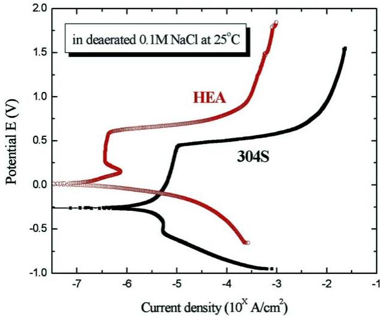  
Fig. 11. Comparisons of the anodic polarization curves for the HEA and 304S in deaerated 0.1 M NaCl at room temperature $( \sim 2 5 ^ { \circ } \mathrm { C } )$

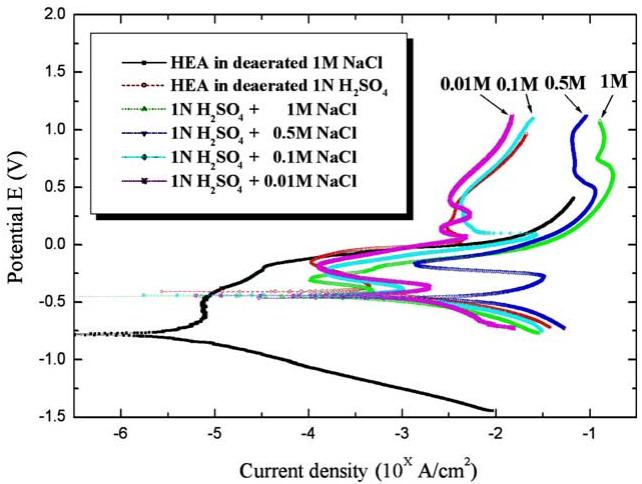  
Fig. 12. Anodic polarization curves for HEA obtained in deaerated 1 N $\mathrm { H } _ { 2 } \mathrm { S O } _ { 4 } / \mathrm { X }$ NaCl $\left( \mathbf { X } = 0 { - } 1 \ \mathbf { M } \right)$ solutions at room temperature $( \sim 2 5 ^ { \circ } \mathrm { C } )$

Anodic polarization curves obtained in 1 N $\mathrm { H } _ { 2 } \mathrm { S O } _ { 4 } / \mathrm { X }$ NaCl (X = 0–1 M) solutions are shown in Fig. 12. In all cases, the efect of adding NaCl is to shift $E _ { \mathrm { c o r r } }$ and $E _ { \mathrm { p i t } }$ to more active values than was obtained in chloride-free 1 N $\mathrm { H } _ { 2 } \mathrm { S O } _ { 4 }$ solution, as exhibited in Table 5. It is worth noting that 0.5 M is a critical chloride concentration: if the concentration of chloride is higher or lower than 0.5 M, $E _ { \mathrm { c o r r } }$ is nobler, $i _ { \mathrm { c o r r } }$ and $r _ { \mathrm { c o r r } }$ are lower, and $E _ { \mathrm { p i t } }$ is more active, as shown in Fig. 13. It is interesting to note that the 0.5 M chloride concentration is near the concentration of seawater $( { \sim } 0 . 6 \mathbf { M } )$ Therefore, it may be speculated that the Cl--containing solution is more harmful at a concentration similar to seawater when it is mixed with sulfuric acid. And we also observed that if $\mathrm { S O } _ { 4 } ^ { 2 - }$ exists, no matter whether the concentration of NaCl is high or low, the $E _ { \mathrm { c o r r } }$ moves to significantly nobler values compared to $E _ { \mathrm { c o r r } }$ in the sulfate-free solution (1 M NaCl). It is proven that $\mathrm { S O } _ { 4 } ^ { 2 - }$ acts as an inhibitor for pitting corrosion in the NaCl solution; that is to say, there is competition between the aggressive Cl- and inhibitive $\mathrm { S O } _ { 4 } ^ { 2 - }$ ions. Furthermore, when the concentration of chloride in 1 N $\mathrm { H } _ { 2 } \mathrm { S O } _ { 4 }$ is raised from 0 to 0.5 M, the $r _ { \mathrm { c o r r } }$ is afected simultaneously by anodic and cathodic polarization at similar $E _ { \mathrm { c o r r } }$ values. Because the corrosion rates at similar $E _ { \mathrm { c o r r } }$ values increased as the chloride concentration increased from 0.01 M to 0.5 M, it can be deduced that the efect of the cathodic depolarization dominates in this range of [Cl-]. When [Cl-] is higher than 0.5 M, the anodic polarization is dominant as is evidenced by a decrease of the corrosion rate.

Table 5  
Electrochemical parameters of HEA in various deaerated electrolytes at room temperature $( \sim 2 5 ^ { \circ } \mathrm { C } )$
<table><tr><td></td><td> $E _ { \mathrm { c o r r } } \ : ( \mathrm { V } _ { \mathrm { S C E } } )$ </td><td> $i _ { \mathrm { c o r r } } ( \mu \mathrm { A } / \mathrm { c m } ^ { 2 } )$ </td><td> $r _ { \mathrm { c o r r } }$  (mm/yr)</td><td> $\Delta E _ { \mathrm { p } } \ : ( \mathrm { V } )$ </td><td> $E _ { \mathrm { p i t } }$  or  $E _ { \mathrm { b } } \ : ( \mathrm { V } _ { \mathrm { S C E } } )$ </td></tr><tr><td>1 M  $\mathrm { \bf N a C l }$ </td><td>-0.77</td><td>3.16</td><td>0.0239</td><td> $0 . 1 6$ </td><td>-0.49</td></tr><tr><td>1N  $\mathrm { H } _ { 2 } \mathrm { S O } _ { 4 }$ </td><td>-0.41</td><td>251</td><td>1.8996</td><td>a</td><td>-0.15</td></tr><tr><td>1N  $\mathrm { H } _ { 2 } \mathrm { S O } _ { 4 } + 1 \mathrm { M } \mathrm { N a C l }$ </td><td>-0.45</td><td>141</td><td>1.0671</td><td>1</td><td>-0.28</td></tr><tr><td>1  $\mathrm { \Delta N \ H _ { 2 } S O _ { 4 } + 0 . 6 \ M \ N a C l }$ </td><td>-0.47</td><td>1620</td><td>12.2604</td><td>一</td><td>-0.23</td></tr><tr><td>4  $\mathrm { \mid N _ { \ I _ { 2 } S O _ { 4 } } + 0 . 5 M _ { \ I a C l } }$ </td><td>-0.48</td><td>1950</td><td>14.7579</td><td>一</td><td>-0.21</td></tr><tr><td>1N  $\mathrm { H } _ { 2 } \mathrm { S O } _ { 4 } + 0 . 4 \mathrm { M }$  NaCl</td><td>-0.46</td><td>1710</td><td>12.9416</td><td>一</td><td>-0.215</td></tr><tr><td>1N  $\mathrm { H } _ { 2 } \mathrm { S O } _ { 4 } + 0 . 1 \mathrm { M }$  NaCl</td><td>-0.44</td><td>316</td><td>2.3915</td><td>一</td><td>-0.24</td></tr><tr><td>1N  $\mathrm { H } _ { 2 } \mathrm { S O } _ { 4 } + 0 . 0 1$  M NaCl</td><td>-0.43</td><td>282</td><td>2.1342</td><td>一</td><td>-0.22</td></tr></table>

a There is almost no passive region, or so small that it can be neglected.

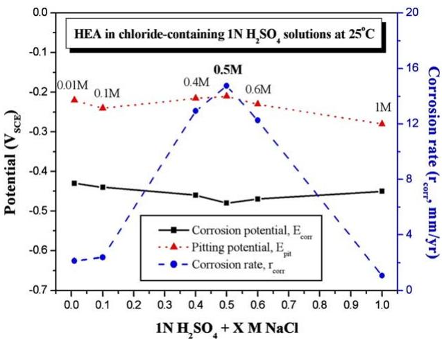  
Fig. 13. Comparisons of the corrosion potential, the pitting potential, and the corrosion rate of HEA versus the concentration of NaCl added to 1 N $\mathrm { H } _ { 2 } \mathrm { S O } _ { 4 }$ at room temperature $( \sim 2 5 ^ { \circ } \mathrm { C } )$

## 3.4. Cyclic potentiodynamic polarization

It is well known that 304S does not sufer from pitting corrosion in halide-free solutions [33]. In order to determine whether the HEA behaves similarly in $\mathrm { H } _ { 2 } \mathrm { S O } _ { 4 }$ solutions at room temperature, a cyclic polarization technique was used. The potential scan began at the corrosion potential and continued in the positive direction until the threshold current density was reached $( 1 0 ^ { - 2 } \mathrm { A } / \mathrm { c m } ^ { 2 }$ for the HEA and $1 0 ^ { - 4 } \mathrm { A } / \mathrm { c m } ^ { 2 }$ for 304S). At this point, the potential scan direction was reversed and the cyclic polarization curves are shown in Fig. 14. The lack of hysteresis in the reverse scans indicates that both HEA and 304S are not susceptible to localized corrosion, such as pitting, in 1 N $\mathrm { H } _ { 2 } \mathrm { S O } _ { 4 }$ at room temperature. Only general corrosion occurs in this environment.

## 3.5. SEM photographs of the corroded surfaces

The occurrence of corrosion on 304S and on the HEA in deaerated 1 M NaCl or 1 N $\mathrm { H } _ { 2 } \mathrm { S O } _ { 4 } ,$ held at a constant potential (+100 mV) for 15 min, was confirmed by examination in an SEM. Typical micrographs of the pits formed in 1 M NaCl are shown in Fig. 15(a) and (b). The pits formed in 1 M NaCl on 304S are fewer but larger in size than those on the HEA. It is an interesting phenomenon that the pits formed on the surface of the HEA show a type of concentric ring pattern with an average maximum diameter of 30 lm. This may result from corrosion of the

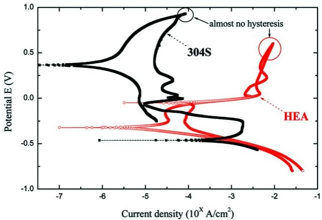  
Fig. 14. Comparison of the cyclic polarization curves for the HEA and 304S tested in $1 \mathrm { N } \mathrm { H } _ { 2 } \mathrm { S O } _ { 4 }$ at room temperature $( \sim 2 5 ^ { \circ } \mathrm { C } )$

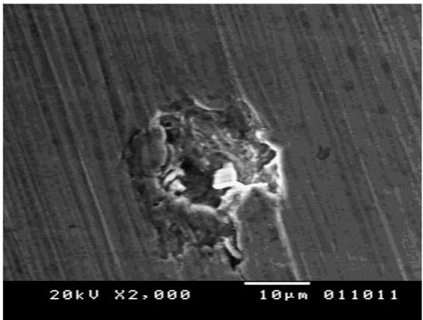  
(a)

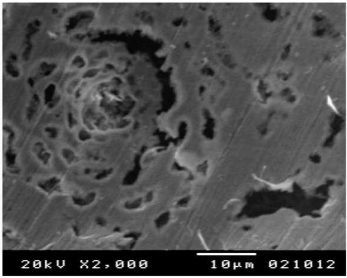  
(b)  
Fig. 15. SEM micrographs of the pits obtained on (a) 304S, (b) HEA after an anodic treatment at +100 mV for 15 min in deaerated 1 M NaCl solutions.

copper-rich regions [35] and the porous-like layer covering the pits may be the remnants of the passive film. Based on the types of pits, we can verify that the HEA is less resistant than 304S to pitting corrosion in 1 M NaCl; once pits nucleated, they became stable nuclei and tended to grow irreversibly. This result is consistent with the anodic polarization curves shown in Fig. 8.

Fig. 16 shows typical micrographs of the corrosion that occurred in 1 N $\mathrm { H } _ { 2 } \mathrm { S O } _ { 4 }$ Here, we find that there are almost no pits on the surface of 304S (Fig. 16(a)), supporting the previous finding that 304S is free of pitting corrosion in sulfuric acid solutions. However, there is minor surface exfoliation (shallow localized attack) on the HEA in ${ \mathrm { H } } _ { 2 } { \mathrm { S O } } _ { 4 } ,$ , which is distributed locally; and the attack is shallower than the pits formed in NaCl (Fig. 16(b)). It appears, therefore, that the HEA is susceptible to pitting corrosion in 1 M NaCl solution, but sufers from general corrosion in 1 N $\mathrm { H } _ { 2 } \mathrm { S O } _ { 4 }$ . Therefore, these SEM micrographs are consistent with the polarization data shown in Figs. 9 and 14.

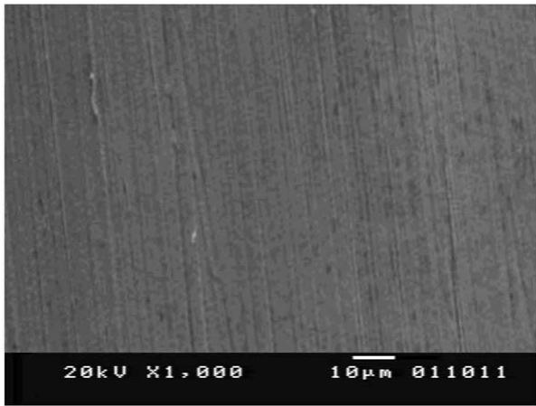  
(a)

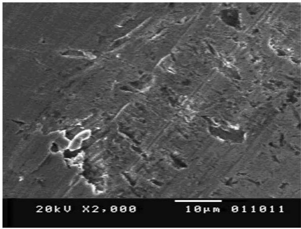  
(b)  
Fig. 16. SEM micrographs of the surface corrosion obtained on (a) 304S, (b) HEA after an anodic treatment at +100 mV for 15 min in deaerated 1 N $\mathrm { H } _ { 2 } \mathrm { S O } _ { 4 }$ solution.

## 4. Conclusions

The following conclusions may be drawn:

1. Microstructure showed that the matrix of HEA is dendritic. The dendrites were composed mainly of a non-crystalline phase with a little BCC structure whereas

the interdendritic phase had an amorphous structure containing small amounts of nano-scale precipitates. The results of XRD, SAD, and DSC confirmed that HEA is almost entirely amorphous.

2. The hardness of the high entropy alloy (Hv860) is much higher than that of type-304 stainless steel (Hv265).

3. Anodic polarization shows that HEA is more resistant to general corrosion than 304S at room temperature in chloride and in acidic environments at all concentrations investigated in this study.

4. HEA is less resistant than 304S to pitting corrosion in chloride environments accounting for the lower pitting potential and narrower range of potentials in the passive region.

5. In an acid containing chloride ions, HEA becomes least resistant to general corrosion when the chloride ion concentration is near that of seawater (0.5 M).

6. The lack of hysteresis in cyclic polarization curves and SEM photographs confirm that HEA, like 304S, is not susceptible to pitting in chloride-free 1 N $\mathrm { H } _ { 2 } \mathrm { S O } _ { 4 }$ . The two alloys sufer only general corrosion in the chloride-free solution.

## References

[1] J. Kramer, Z. Phys. 106 (1937) 639.

[2] J. Kramer, Ann. Phys. 37 (1934) 19.

[3] A. Bremer, D.E. Couch, E.K. Williams, J. Res. Nat. Bur. Stand. 44 (1950) 109.

[4] P. Duwez, Trans. Am. Soc. Metals 60 (1967) 607.

[5] H.W. Kui, A.L. Greer, D. Turnbull, Appl. Phys. Lett. 45 (1984) 615.

[6] A. Inoue, K. Kita, T. Masumoto, K. Ohtera, J. Appl. Phys. 27 (1998) 1796.

[7] A. Inoue, K. Kita, T. Masumoto, T. Zhang, Mater. Trans. JIM 30 (1989) 722.

[8] A. Inoue, T. Zhang, T. Masumoto, Mater. Trans. JIM 31 (1990) 177.

[9] A. Inoue, T. Zhang, K. Ohba, T. Shibata, Mater. Trans. JIM 36 (1995) 876.

[10] A. Inoue, J.S. Gook, Mater. Trans. JIM 36 (1995) 1282.

[11] L. Ma, L. Wang, T. Zhang, A. Inoue, Mater. Trans. JIM 43 (2) (2002) 277.

[12] D.E. Polk, B.C. Giessen, in: Rapid Solidification Technology Source Book, ASM, Metals Park, OH, 1983.

[13] P. Hansen, J. Non Cryst. Solids 56 (1983) 191.

[14] F.G. Yost, J. Mater. Sci. 16 (1981) 3039.

[15] C.K. Lee, H.C. Shih, Corrosion 52 (1996) 690.

[16] S.Y. Tsai, K.P. Yen, H.C. Shih, Corros. Sci. 40 (1998) 281.

[17] M. Drogowska, H. Me\`nard, L. Brossard, J. Appl. Electrochem. 27 (1997) 169.

[18] E.A. Abd El Meguid, N.A. Mahmoud, S.S. Abd El Rehim, Mater. Chem. Phys. 63 (2000) 67.

[19] D. Tromans, A. Sato, Corrosion 57 (2001) 126.

[20] E.A. Abd El Meguid, J. Mater. Sci. 33 (1998) 3465.

[21] E.A. Ashour, E.A. Abd El Meguid, B.G. Ateya, Corrosion 53 (1997) 612.

[22] R. Ke, R. Alkire, J. Electrochem. Soc. 142 (1995) 4056.

[23] N.J. Laycock, S.P. White, J.S. Noh, P.T. Wilson, R.C. Newman, J. Electrochem. Soc. 145 (1998) 1101.

[24] T. Shibata, Y.C. Zhu, Corros. Sci. 36 (1994) 153.

[25] M.I. Suleiman, R.C. Newman, Corros. Sci. 36 (1994) 1657.

[26] H.S. Isaacs, Corros. Sci. 29 (1989) 313; Corros. Sci. 34 (1993) 525.

[27] A.E. Thomas, Y.E. Sung, M. Gamboa-Alde´co, K. Franaszczuk, A. Wieckowaki, J. Electrochem. Soc. 142 (1995) 476.

[28] M. Drogowska, L. Brossard, H. Me´nard, J. Appl. Electrochem. 26 (1996) 217.

[29] D.J. Ellerbrock, D.D. Macdonald, J. Electrochem. Soc. 141 (1994) 2645.

[30] J.A. Bardwell, G.I. Sproule, M.J. Graham, J. Electrochem. Soc. 140 (1993) 50.

[31] M. Ergun, A.Y. Turan, Corros. Sci. 32 (1991) 1137.

[32] D.D. Macdonald, J. Electrochem. Soc. 139 (1992) 3434.

[33] D.A. Jones, Principles and Prevention of Corrosion, second ed., Prentice Hall, NJ, 1996.

[34] G.T. Lai, J.W. Jeh, in: Microstructure and Properties of Multi-component Alloy System with Equal mole Elements, Masters Thesis of National Tsing Hua University in Taiwan, 1998.

[35] U.D. Hung, J.W. Jeh, in: A Study on the Cu–Ni–Al–Co–Cr–Fe–Si–Ti Multi-component Alloy System, Masters Thesis of National Tsing Hua University in Taiwan, 2001.

[36] S.W. Dean, Mater. Perf. 26 (1987) 51.