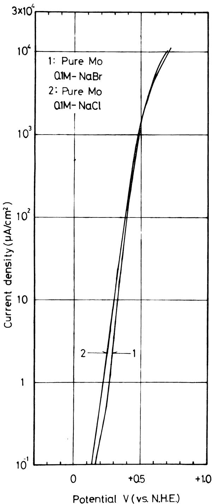
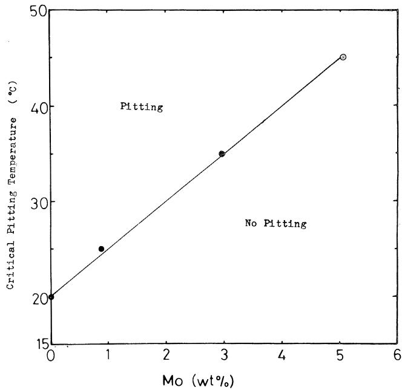
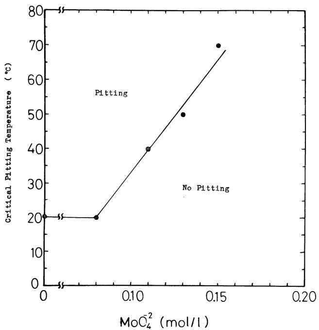
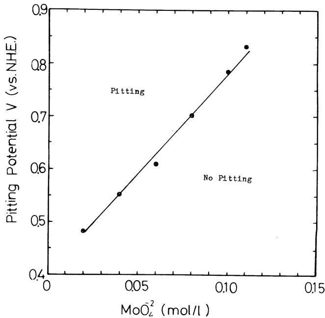
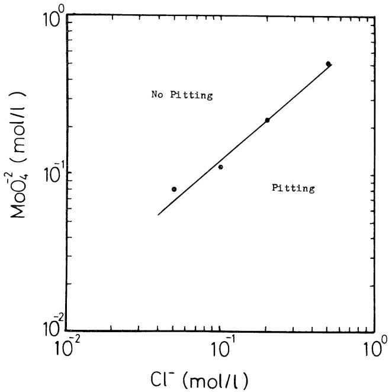
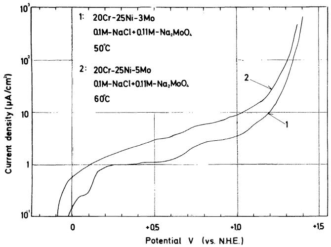
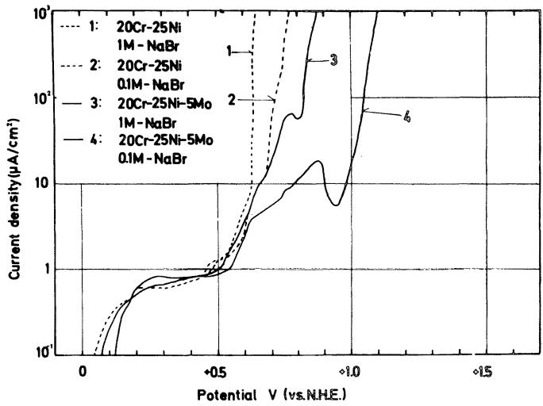

# The Role of Alloyed Molybdenum in Austenitic Stainless Steels in the Inhibition of Pitting in Neutral Halide Solutions\*

KATSUHISA SUGIMOTO AND YOSHINOBU SAWADA

## Abstract

In the passive region of austenitic stainless steels alloyed with Mo, the formation of ${ \mathsf { M o O } _ { 4 } } ^ { 2 - }$ ions can be expected in neutral halide solutions by the transpassive dissolution of Mo. It has been shown that $\mathsf { M o O } _ { 4 } ^ { 2 - }$ ions added to neutral NaCl solutions act as an effective inhibitor against pitting of austenitic stainless steels with and without Mo. The interaction between alloyed Mo in the steels and added $\mathsf { M o O    _ { 4 } } ^ { 2 - }$ ions in the solutions is appreciable. It is likely that the inhibition of pit growth by the adsorption of $\mathsf { M o O    _ { 4 } } ^ { 2 - }$ ions which are thought to result from the dissolution of the steels at the initia! stage of pitting leads to increased pitting resistance of austenitic stainless steels containing Mo.

It is a well known fact that the addition of Mo to austenitic stainless steels increases pitting resistance because of shifts of the pitting potential in the noble direction.1-6 Laboratory experiments, however, show that the factors which lead to the increase in the pitting resistance of the steel by alloying Mo are very complex. For instance, the beneficial effect of Mo addition decreases with increase in temperature,7 and the critical temperature at which pitting initiates depends on the Mo content of the steel and the Ci concentration of the solution used.8 It has been reported that alloyed Mo is ineffective to inhibit bromide pitting. 4,9,10 Furthermore, published data indicating some differences between the effects of Mo additions on austenitic stainless steel and ferritic stainless steel have been presented.11

Although the action of Mo in regard to improving the resistance of austenitic stainless steels against pitting is not known precisely, we have proposed the following 2 mechanisms to account for the inhibition: (1) the inhibition of pit initiation by an improvement of the properties of the passive film for protection against invasion of $\complement 1 ^ { - }$ ions, and (2) the inhibition of pit growth by the adsorption of $\mathsf { M o O } _ { 4 } { } ^ { 2 - }$ ions, which are thought to be concentrated within a pit, by the dissolution of the alloyed Mo at the initial stage of pitting.

Our recent X-ray photoelectron spectroscopy (ESCA) studies on the passive film compositions of austenitic stainless steels containing Mo have shown that Mo is one of the essential constituents of the passive film, and that the Mo content of the film increases with increase in Mo content of the steels.1² Therefore, it would be reasonable to expect that the contribution of Mo in the passive film is the cause of the improved pitting resistance of steel. It is uncertain, however, whether the increase in pitting resistance is brought about only by modifications of the properties ofthe passive film, because the alloyed Mo may dissolve as $\mathsf { M o O    _ { 4 } } ^ { 2 - }$ ions by the transpassive reaction of Mo in the passive region of the steel. Furthermore, it is difficult to explain by the film theory why the alloying addition of Mo is ineffective in a NaBr solution.

Although knowledge of the contribution of ${ \mathsf { M o O } } _ { 4 } ^ { 2 - }$ ions to the mechanism of pitting inhibition for the Mo-containing austenitic stainless steel is insufficient, it has previously been reported that $\mathsf { M o O } _ { 4 } { } ^ { 2 - }$ ions added to a neutral NaCl solution effectively inhibit the pitting dissolution of an austenitic stainless steel that does not contain Mo.1 Suzuki, et al, suggested the possibility of a higher concentration of $\mathsf { M o O               4 } ^ { 2 - }$ ions in an active pit than in the bulk solution for Type 316L and an 18Cr-16Ni-5Mo steel.'4

The purpose of the present study is to clarify the common feature in both methods for pitting inhibition, that is, the alloying addition of Mo to steels and the addition of ${ \mathsf { M o O } _ { 4 } } ^ { 2 - }$ ions to halide solutions, and to speculate on the role of alloyed Mo in the inhibition of pitting. To achieve this, anodic polarization curves and ESCA spectra were measured using several combination of austenitic stainless steels with and without Mo, and halide solutions with and without $\mathsf { M o O } _ { 4 } \mathrm { \Lambda } ^ { 2 - }$ ions.

TABLE 1 — Composition of the Steels Studied (Wt%)
<table><tr><td>Specimen</td><td>C</td><td>Si</td><td>Mn</td><td>P</td><td>S</td><td>Cr</td><td>Ni</td><td>Mo</td></tr><tr><td>20Cr-25Ni</td><td>0.053</td><td>0.54</td><td>1.53</td><td>0.009</td><td>0.010</td><td>20.06</td><td>25.58</td><td>0.01</td></tr><tr><td>20Cr-25Ni-1Mo</td><td>0.057</td><td>0.48</td><td>1.48</td><td>0.009</td><td>0.010</td><td>19.99</td><td>25.88</td><td>1.05</td></tr><tr><td>20Cr-25Ni-3Mo</td><td>0.064</td><td>0.52</td><td>1.47</td><td>0.009</td><td>0.010</td><td>20.16</td><td>25.52</td><td>2.97</td></tr><tr><td>20Cr-25Ni-5Mo</td><td>0.059</td><td>0.46</td><td>1.44</td><td>0.008</td><td>0.010</td><td>19.96</td><td>25.66</td><td>5.06</td></tr></table>

## Experimental

Rolled sheets of austenitic 20Cr-25Ni steels containing 0 to 5 Wt% Mo and pure Mo (99.99 Wt%) were used as specimens. Analytical compositions of the stainless steels used are listed in Table 1. Specimens $4 0 ~ \times ~ 2 0 ~ \times ~ 1 . 5$ (mm) were used for electrochemical polarization measurements, and $1 8 \times 5 \times 0 . 3$ (mm) for ESCA measurements. All of these specimens were annealed at 1050 C for 2 hours in vacuo and then water-quenched at 0 C.

Specimen surfaces were mechanically polished with emery papers up to No. 6/0 and with cloth using the diluted suspension of chromium oxide, degreased with absolute ethyl alcohol, washed in distilled water, and finally dried with air blasts. Specimens for the electrochemical polarization measurements were masked with Teflon seal tapes attached to an epoxy resin undercoating, except for an area $1 \ c m ^ { 2 } ,$ while those for ESCA measurements were not masked.

As test solutions, 0.05 to 0.1M-NaCl, 0.1M-NaBr, NaCl + ${ \mathsf { N a } } _ { 2 } { \mathsf { M o O } } _ { 4 }$ (NaCI : 0.05\~ 0.5M, $\mathsf { N a } _ { 2 } \mathsf { M o O } _ { 4 } : 0 . 0 2 \sim 0 . 2 \mathsf { M } )$ and NaBr $+ \mathsf { N a } _ { 2 } \mathsf { M o O } _ { 4 }$ (NaBr : 0.1M, Na $\mathrm { , } \mathsf { M o O } _ { 4 } \ : \ 0 . 2 \sim \ 1 . 0 \mathsf { M } )$ were used. All the solutions used were approximately neutral; for example, the pH values of 0.1M-NaCl, 0.1M-NaCl + 0.1M-Na₂MoO₄, and $0 . 1 M - N a C l + 0 . 2 M - N a _ { 2 } M o O _ { 4 }$ were 6.16, 6.68, and 7.27, respectively. The solutions were deaerated by bubbling pure nitrogen for more than 30 minutes.

In the measurement of anodic polarization curves, the electrode potential was regulated by a potentiostat and current recording was made after holding the potential for 1 minute at the setting of the potential which was increased successively from the corrosion potential in steps of 25 mV. In this paper, the potentials of test electrodes are represented with respect to the standard hydrogen electrode (NHE), although the values were measured using a saturated calomel reference electrode. Measurements were made at various temperatures in the range 10 to 70 C under a stationarystate condition.

  
FIGURE 1 - Anodic polarization curves for pure Mo in 0.1M-NaCl and 0.1M-NaBr at 25 C.

Surface analyses of specimens which were treated anodically in chloride solutions were performed by means of ESCA using a Kokusai Denki type KES-X-2001 electron spectrometer. The aluminum $\mathsf { K } _ { \alpha 1 , 2 }$ X-ray generated at 1486.6 eV was used for excitation. The voltage and the current applied to the X-ray tube were 10 kV and 20 mA, respectively. The specimen container was evacuated $\tan \_ 1 0 ^ { - 7 }$ Torr and held at room temperature. The photoelectron spectra of the $2 \mathsf { p } _ { \% }$ and ${ 2 { \mathsf p } _ { 3 / 2 } }$ levels for Fe, Cr, Ni, and Cl, the ${ 3 \mathsf { d } _ { 3 / 2 } }$ and $3 \mathsf { d } _ { 5 / 2 }$ levels for ${ \mathsf { M o } } .$ and the 1s level for O and C were measured. The binding energies at the peaks of the photoelectron spectra obtained were corrected by the energy of C 1s of the background spectrum as a reference, assuming the energy difference between the 1s level for C and the Fermi level for metallic Pd to be 285.0 eV. The valencies of elements in passive

  
FIGURE 2 — Critical pitting temperature as a function of the Mo content of 20Cr-25Ni steels in 0.1M-NaCl.

films were evaluated by comparing the binding energies at the peaks   
of the photoelectron spectra of passive films and several kinds of 15   
pure compounds.

## Results

## Anodic Dissolution of Pure Mo in

## NaCl and NaBr Solution

Figure 1 shows anodic polarization curves for pure Mo in 0.1M-NaCl and 0.1M-NaBr. Corrosion potentials of pure Mo in these solutions were nearly equal, that is, approximately +0.15 V. The general dissolution occurred in both solutions with a steep increase in current as the electrode potential was changed from the corrosion potential to higher values. The general dissolution in this case is probably caused, not by the pitting dissolution, but by the transpassivation reaction, since pure Mo showed the same mode of dissolution when anodically polarized in $1 \mathsf { M } . \mathsf { N a } _ { 2 } \mathsf { S O } _ { 4 }$ from a corrosion potential of approximately +0.15 V.

## Effect of Temperature on Pitting of Mo-Containing Steels in NaCI Solution

The effect of temperature on anodic polarization curves of 20Cr-25Ni steels containing 1 to 5 Wt% Mo in 0.1M-NaCl was determined.

Figure 2 shows the relation between the critical pitting temperature and the Mo content of the steels. Below these critical temperatures for the pitting initiation, each steel maintained passivity to about +1.15 V until the transpassive dissolution occurred with the accompanying oxygen evolution. The critical pitting temperature $( \mathsf { T } _ { \mathsf { p i t } } )$ became higher with increase in Mo content. This is defined as

$$
{ \sf T } _ { \sf p i t } = 5 ~ \left[ { \sf M o \% l } + 2 0 \mathrm { ~  ~ \sigma ~ } \right] \mathrm { ~  ~ \zeta ~ } ^ { \circ } { \bf C } \mathrm { ) } .\tag{1}
$$

The critical temperature depended on NaCl concentration too and were observed to decrease with increasing concentration.

## Effect of Temperature on Pitting of

## Mo-free Steels in $N a C l + N a _ { 2 } M o O _ { 4 } \ S o / u t i o n s$

It has previously been reported that $\mathsf { M o O  } _ { 4 } { } ^ { 2 - }$ ions added to a NaCl solution act as an effective inhibitor against pitting of austenitic stainless steels.13 In the present work, the authors investigated the temperature range in which $\mathsf { M o O } _ { 4 } { } ^ { 2 - }$ ions show an effective inhibition, the change in pitting potential with the $\mathsf { M o O              } _ { 4 } ^ { 2 - }$ concentration, and the relation between the chloride concentration and the critical concentration of $\mathsf { M o O                } _ { 4 } ^ { 2 - }$ ions required to completely inhibit pitting.

  
FIGURE 3 — Critical pitting temperature of 20Cr-25Ni steel as a function of the Mo ${ \mathsf { O } _ { 4 } } ^ { 2 - }$ concentration in 0.1M-NaCl.

Figure 3 shows the effect of $\mathsf { M o O    _ { 4 } } ^ { 2 - }$ concentration on the critical pitting temperature of the 20Cr-25Ni steel in 0.1M-NaCI. The critical temperature $( { \mathsf { T } } _ { \mathsf { p i t } } )$ increased linearly with the MoO₄² concentration. The linear relation is expressed as

$$
\mathsf { T } _ { \mathsf { p i t } } = 6 5 7 . 1 \ ( \mathsf { M o O } _ { 4 } ) ^ { 2 - } , \mathsf { m o l } / \mathsf { L } \ ) \cdot 3 2 . 2 8 \ \mathrm { ~ \iota ~ ~ \mathsf ~ { ~ \iota ~ ~ } ~ } ^ { \circ } \mathsf { C } \cdot \mathsf { I } .\tag{2}
$$

Pitting on the steel in 0.1M-NaCl below $7 0 \ \subset$ was completely inhibited when the solution contained $\mathsf { M o O    _ { 4 } } ^ { 2 - }$ ions more than 0.2M. When the complete inhibition is achieved, the 20Cr-25Ni steel retains passivity to about +1.15 $\mathsf { v } ,$ and then the transpassive dissolution occurs, accompanying oxygen evolution.

Figure 4 shows the change in the pitting potential of the 20Cr-25Ni steel with the $M o O _ { 4 } ^ { 2 - }$ concentration in 0.1M-NaCl at 50 C. The pitting potential was shifted linearly in the noble direction with increase in $M _ { 0 } { 0 _ { 4 } } ^ { 2 - }$ concentration up to 0.12M, over which pitting was completely inhibited at 50 C.

Figure 5 shows the relation between the ${ \mathsf { C l } } ^ { - }$ concentration and the minimum concentration of $\mathsf { M o O  } _ { 4 } { } ^ { 2 - }$ ions which is required to inhibit pitting of the 20Cr-25Ni steel at 25 C. The linear relation given in Equation (3) is obtained in the log-log plot between the Cl and the $M o O _ { 4 } ^ { 2 - }$ concentration (mol/L):

$$
\log ( \bar { \bf C l } ^ { - } ) = 1 . 1 7 \log ( \mathsf { M o O    _ { 4 } } ^ { 2 - } ) + 0 . 0 7 9 .\tag{3}
$$

## Interaction in Pitting Inhibition Between Mo in Steel and $M O O _ { 4 } ^ { 2 - }$ lons in Solutions

Anodic polarization behavior of Mo-containing austentic steels in NaCl solutions with ${ M o O _ { 4 } } ^ { 2 - }$ ions shows that Mo in the steels and $\mathsf { M o O    _ { 4 } } ^ { 2 - }$ ions in the solutions interact with each other to inhibit pitting. Figure 6 shows the anodic polarization curves for the 20Cr-25Ni-3Mo steel in $\textsf { a } 0 . 1 { \mathsf { M } } { \mathsf { - N a C l } } + 0 . 1 1 { \mathsf { M } } { \mathsf { - N a } } _ { 2 } { \mathsf { M } } { \mathsf { o O } } _ { 4 }$ solution at 50 C and the 20Cr-25Ni-5Mo steel in the same solution at 60 C. Both curves show stable passivity up to the transpassive potential. As a matter of course, pitting was not observed in either case. As previously stated, both steels used here underwent pitting in 0.1M-NaCl without $\mathsf { M o O } _ { 4 } { } ^ { 2 - }$ ions at 50 or 60 C (Figure 2), and the addition of $M _ { 0 } { 0 _ { 4 } } ^ { 2 - }$ ions up to 0.11M to 0.1M-NaCl above 50 C was insufficient to inhibit pitting of the 20Cr-25Ni steel without Mo (Figure 3). As shown in Figure ${ \bf 6 , }$ however, a simultaneous application of Mo alloying and $\mathsf { M o O } _ { 4 } { } ^ { 2 - }$ addition inhibited pitting effectively, as against a separate use of these procedures by which pitting cannot be eliminated. These results suggest that there exists a common feature in the pitting inhibition mechanism between alloyed Mo and $\mathsf { M o O } _ { 4 } { } ^ { 2 - }$ ions added to the solution.

  
FIGURE 4 - Pitting potential of 20Cr-25Ni steel as a function of the $M _ { 0 } { \ o \mathsf { O } _ { 4 } } ^ { \bar { 2 } - }$ concentration in 0.1M-NaCl at 50 C.

  
FIGURE 5 - Effect of the ${ \tt c } ! ^ { - }$ concentration on the minimum concentration of $\mathsf { M o o } _ { 4 } { } ^ { 2 - }$ ions which is necessary for pitting inhibition of 20Cr-25Ni steel at 25 C.

## Pitting Behavior of 20Cr-25Ni and

## 20Cr-25Ni-5Mo Steels in NaBr Solution

Anodic polarization curves for 20Cr-25Ni and 20Cr-25Ni-5Mo steels in 0.1M and 1.0M-NaBr at 25 C are shown in Figure 7. The effect of Mo content on the pitting potential was scarcely observed,

(3) = Shoulder

  
FIGURE 6 - Anodic polarization curves for 20Cr-25Ni-3Mo and 20Cr-25Ni-5Mo steels in a $0 . 1 { \mathsf { M } } { \mathsf { - N a C l } } + 0 . 1 1 { \mathsf { M } } { \mathsf { - N a } } _ { 2 } { \mathsf { M o O } } _ { 4 }$ solution at 50 and 60 C.

since the pitting potentials of both steels were almost equal in the solutions of the same NaBr concentration. For example, the pitting potential for both steels was +0.521 V in 0.1M-NaBr. The effect of alloyed Mo, however, was clearly observed on the rate of pitting dissolution in the solutions. That is, an increase in the Mo content decreases the rate, since the anodic polarization curve of Figure 7 for the 20Cr-25Ni-5Mo steel in 0.1M-NaBr represents a larger polarization than that for the 20Cr-25Ni steel in the same solution and a temporary decrease in current in the potential range higher than the pitting potential.

Then, the inhibiting efficiency of $\mathsf { M o O    _ { 4 } } ^ { 2 - }$ ions for the bromide pitting of the 20Cr-25Ni steel without Mo was examined in 0.1M-NaBr containing $\mathsf { M o O } _ { 4 } \ L ^ { 2 - }$ ions up to 1.0M at 25 C. Increasing the $\mathsf { M o O    _ { 4 } } ^ { 2 - }$ concentration in the solution shifted the pitting potential of the steel in the noble direction and made the polarization of the anodic curve larger. This means that $\mathsf { M o O        _ { 4 } } ^ { 2 - }$ ions act as an inhibitor against pitting of the steel in NaBr solutions. However, the inhibiting efficiency of $\mathsf { M o O            _ { 4 } } ^ { 2 - }$ ions for pitting in NaBr solutions was extremely low compared with the case of NaCl solutions. For example, at a temperature of 25 C, it was impossible to prevent the initiation of pitting in 0.1M-NaBr above +0.97 V, even if the solution contained $1 . 0 M . M 0 0 _ { 4 } ^ { 2 - }$ ; on the other hand, the complete inhibition was achieved in 0.1M-NaCl by adding only $0 . 1 1 M . M 0 0 _ { 4 } ^ { 2 - }$

  
FIGURE 7 — Anodic polarization curves for 20Cr-25Ni and 20Cr-25Ni-5Mo steels in 0.1M and 1M-NaBr at 25 C.

TABLE 2 - Passivation Treatments for Specimens Used for X-ray Photoelectron Spectroscopic Analyses
<table><tr><td>Symbol of Specimen</td><td>Material</td><td>Passivation Treatment</td></tr><tr><td>A</td><td>20Cr-25Ni</td><td>0.1M-NaCl (20 C), +0.946 V, 60 min</td></tr><tr><td>B</td><td>20Cr-25Ni-5Mo</td><td>0.1M-NaCl (20 C), +0.946 V, 60 min</td></tr><tr><td>C</td><td>20Cr-25Ni</td><td>0.1M-NaCl + 0.2M-Na₂MoO4 (20 C), +0.946 V, 60 min</td></tr><tr><td>D</td><td>20Cr-25Ni-5Mo</td><td>Passivated in the air at room temperature</td></tr><tr><td>Mo sheet</td><td>99.99% Mo</td><td>Freshly polished with emery paper</td></tr></table>

examined on the basis of the photoelectron spectra. The stainless steel specimens used for the measurement of photoelectron spectra are given in Table 2. Specimen A was a Mo-free 20Cr-25Ni steel on which pitting occurred in a NaCl solution. Specimen B was the 20Cr-25Ni-5Mo steel which was resistant to pitting in the solution. Specimen C was a Mo-free 20Cr-25Ni steel which was prevented from pitting by adding $\mathsf { M o O               _ { 4 } } ^ { 2 - }$ ions to the solution. Specimen D was the 20Cr-25Ni-5Mo steel with air-formed films which was used for comparison. The values of binding energy at the peaks of the photoelectron spectra for the specimens listed in Table 2 and reference pure compounds are tabulated in Table 3.

## Discussion

## X-ray Photoelectron Spectra of

## Anodic Polarization Behavior of Pure Mo in Neutral Halide Solutions

## Passive Films

The resistance of austenitic stainless steels against pitting in NaCl solutions is expected to depend on the chemical properties of their passive films formed in the solutions. The differences in the chemical composition of surface films between the specimens susceptible or not susceptible to pitting in NaCl solutions were

It had been said that the passive film of pure Mo was composed of MoO₂ and the reaction product of the transpassivation was $\mathsf { M o O } _ { 4 } { } ^ { 2 - } \mathsf { \bar { \Gamma } } \mathsf { i o n s } . \mathsf { 1 6 - 1 8 }$ Accordingly, the transpassivation reaction for Mo in a neutral solution with pH higher than 6, and its equilibrium potential, may be represented by the following equations, respectively: :19

TABLE 3 — Binding Energies for the Peaks Observed in the X-ray Photoelectron Spectra  
Electrons Analyzed (Binding energy, eV)
<table><tr><td rowspan="2">Specimen</td><td colspan="2">Fe 2p3/2</td><td colspan="2">Cr 2p3/2</td><td colspan="3">Ni 2p3/2</td><td colspan="4">Mo 3d3/2 and 3d5/2 Oxide</td><td rowspan="2" colspan="3"></td></tr><tr><td colspan="2">Oxide</td><td colspan="2">Oxide Metal</td><td colspan="2">Oxide</td><td colspan="2">3d3/2</td><td colspan="2">Metal 3d3/2</td><td colspan="2">Q 1s</td></tr><tr><td></td><td></td><td>Metal</td><td></td><td></td><td></td><td></td><td>Metal</td><td>3d5/2</td><td></td><td></td><td>3d5/2</td><td></td><td>2P1/2</td><td>2p3/2</td></tr><tr><td>A</td><td> $7 1 2 . 9 _ { \textrm { -- } } ^ { ( 1 ) }$ </td><td>708.0(2)</td><td>577.4(1)</td><td> $5 7 4 . 1 ^ { ( 3 ) }$ </td><td>861.1(2)</td><td>855.5(1)</td><td></td><td></td><td> $2 3 2 . 2 _ { \textit { c } \cdot \textit { n } } ^ { ( 1 ) }$ </td><td></td><td></td><td>532.1(3) 530.5(1)</td><td> $1 9 9 . 8 _ { . } ^ { ( 3 ) }$ </td><td> $1 9 8 . 2 \AA _ { i \ldots } ^ { ( 1 ) }$ </td></tr><tr><td>8</td><td> $7 1 2 . 1 \dot { ( 1 ) }$ </td><td> $7 0 7 . 7 _ { \cdots } ^ { ( 2 ) }$ </td><td> $5 7 7 . 1 \dot { ( } 1 )$ </td><td></td><td> $8 6 1 . 6 ^ { ( 2 ) }$ </td><td> $8 5 6 . 3 \AA ^ { ( 1 ) }$   $\bar { 8 5 6 . 2 } _ { \ldots } ^ { ( 1 ) }$ </td><td> $2 3 5 . 5 ^ { ( 2 ) }$ </td><td></td><td> ${ } _ { 2 3 0 , 9 } ( 3 )$ </td><td> $_ { 2 2 7 . 8 } ( 2 )$ </td><td></td><td> $\mathfrak { s } 3 2 . 0 \AA _ { \cdot \infty } ^ { ( 3 ) }$   $\bar { 5 } 3 0 . 5 \AA ^ { ( 1 ) }$ </td><td> $2 0 2 . 0 _ { \cdot \cdot \cdot } ^ { ( 3 ) }$ </td><td> $2 0 0 , 2 _ { \cdot \cdot } ^ { ( 1 ) }$ </td></tr><tr><td>C</td><td> $7 1 2 . 2 _ { \cdots } ^ { ( 1 ) }$ </td><td> $7 0 7 . 8 _ { \cdots } ^ { ( 2 ) }$ </td><td> $. 5 7 7 . 6 _ { \cdot \cdot \cdot } ^ { ( 1 ) }$  574.8(3)</td><td></td><td> $8 6 2 . 6 ^ { ( 2 ) }$ </td><td></td><td> $2 3 5 . 6 ^ { ( 3 ) }$ </td><td> $2 3 2 . 3 ^ { ( 1 ) }$ </td><td></td><td></td><td> $5 3 2 . 5 \AA ^ { ( 3 ) }$ </td><td>530.8(1)</td><td>201.8(3)</td><td> $2 0 0 . 8 ^ { ( 1 ) }$ </td></tr><tr><td>D</td><td> $7 1 2 . 2 ^ { ( 1 ) }$ </td><td> $7 0 7 . 4 ^ { ( 2 ) }$ </td><td>577.5(1) 574.2(3)</td><td></td><td> $8 5 7 . 4 ^ { ( 2 ) }$ </td><td> $. 8 5 3 . 6 ^ { ( 1 ) }$ </td><td> $2 3 5 . 2 ^ { ( 2 ) }$ </td><td> $2 3 2 . 2 ^ { ( 1 ) }$ </td><td> $_ { 2 3 0 . 7 } ( 1 )$ </td><td> $2 2 7 . 7 ^ { ( 2 ) }$ </td><td> $5 3 1 \hat { . 8 } ^ { ( 1 ) }$ </td><td> ${ \mathfrak { s } } 3 0 . 0 ^ { ( 3 ) }$ </td><td></td><td></td></tr><tr><td></td><td></td><td></td><td></td><td></td><td></td><td></td><td></td><td></td><td> ${ } _ { 2 3 1 , 0 } ( { } ^ { 2 } )$ </td><td> $2 2 7 . 9 ^ { ( 1 ) }$ </td><td> ${ \mathfrak { s } } 3 3 . 3 ^ { ( 3 ) }$ </td><td> $5 3 1 . 3 \AA _ { i \cdot 1 } ^ { ( 1 ) }$ </td><td></td><td></td></tr><tr><td>Mo sheet MoO₃</td><td></td><td></td><td></td><td></td><td></td><td></td><td> $2 3 5 . 8 ^ { ( 2 ) }$ </td><td> $2 3 2 . 7 \AA ^ { ( 1 ) }$ </td><td></td><td></td><td></td><td> $5 3 1 . 1 \cdots$ </td><td></td><td></td></tr><tr><td>Na2MoO₄·2H₂2O</td><td></td><td></td><td></td><td></td><td></td><td></td><td> $2 3 5 . 3 ^ { ( 2 ) }$ </td><td> $2 3 2 . 2 ^ { ( 1 ) }$ </td><td></td><td></td><td></td><td> $5 3 0 . 7 ^ { ( 1 ) }$ </td><td></td><td></td></tr><tr><td>NaCl</td><td></td><td></td><td></td><td></td><td></td><td></td><td></td><td></td><td></td><td></td><td></td><td></td><td> $_ { 2 0 0 , 0 ^ { ( 3 ) } }$ </td><td> $_ { 1 9 8 . 5 } ( 1 )$ </td></tr></table>

$$
\mathsf { M o O } _ { 2 } + 2 \mathsf { H } _ { 2 } \mathsf { O } = \mathsf { M o O } _ { 4 } { } ^ { 2 - } + 4 \mathsf { H } ^ { + } + 2 \mathsf { e } ^ { - } ,\tag{4}
$$

$$
\mathsf { E } = 0 . 6 0 6 \cdot 0 . 1 1 8 2 \mathsf { p } \mathsf { H } + 0 . 0 2 9 5 1 \mathsf { o g } \ a _ { \mathsf { M } \mathsf { o } \mathsf { O } _ { 4 } } \mathsf { \bar { \varepsilon } } ^ { - } .\tag{5}
$$

As the pH of 0.1M-NaCl used is 6.16, Mc ${ _ { \mathrm { { } } } } { _ { \mathrm { { } } } } { _ { \mathrm { { } } } } ^ { 2 - }$ ions should be more stable than ${ \mathsf { M o O } } _ { 2 }$ in the potential region above -0.199 V, assuming $a _ { \mathsf { M o O } _ { 4 } } \mathrm { { } } ^ { 2 - } = \mathrm { ~ 1 0 ^ { - 6 } ~ }$ . It is possible to assume that the oxide film of MoO₃ is formed on the Mo electrode in the potential region of transpassivity according to Equation (6):

$$
\mathsf { M o O } _ { 2 } + \mathsf { H } _ { 2 } \mathsf { O } = \mathsf { M o O } _ { 3 } + 2 \mathsf { H } ^ { + } + 2 \mathsf { e } ^ { - } ,\tag{6}
$$

$$
\mathsf { E } = \mathbf { 0 . 3 2 0 \cdot 0 . 0 5 9 1 \ p H . }\tag{7}
$$

The ${ \mathsf { M o O } } _ { 3 }$ film, however, even if formed in this solution, will be porous and not depress the anodic dissolution of the electrode because the oxide ${ \mathsf { M o O } } _ { 3 }$ dissolves as ${ \mathsf { H M o O } } _ { 4 } ^ { - }$ or $\mathsf { M o O } _ { 4 } \mathrm { \Lambda } ^ { 2 - }$ ions in solutions with pH higher than $3 . 7 .$ 19

The general dissolution of pure Mo observed in 0.1M-NaCl and 0.1M-NaBr when polarized in the noble direction from the corrosion potential (about +0.15 V) is thought to be the transpassive dissolution caused by the reaction of Equation (4). The passive region of the 20Cr-25Ni steels containing 1 to 5 Wt% Mo in 0.1M-NaCl corresponds to the transpassive region of pure Mo (because the corrosion potentials of these steels in the solution are about +0.1 V). $\mathsf { M o O  } _ { 4 } \ L ^ { 2 - }$ ions, therefore, should be formed if these steels are dissolved by pitting in their passive regions.

## Pitting Inhibition Mechanism of $M o O _ { 4 } ^ { 2 - }$

## Ions Added to Neutral NaCI Solutions

On addition of ${ M O O _ { 4 } } ^ { 2 - }$ ions to NaCl solutions, the following 2 pitting inhibition mechanisms may be considered for austenitic stainless steels without Mo: $\ ( 1 ) \ M { \circ } { \ O _ { 4 } } ^ { 2 - }$ ions are adsorbed preferentially on the steel surface and preclude the adsorption of Cl ions, and (2) the ${ \mathsf { M o O } } _ { 2 }$ film is formed on the steel surface by the reduction of $M o O _ { 4 } ^ { 2 - }$ ions, and this film prevents the chloride attack. Since the pH values of ${ \sf N a C l } + { \sf N a } _ { 2 } { \sf M o O } _ { 4 }$ solutions used are approximately $^ { 7 , }$ the equilibrium potential for the reaction represented by Equation (4) is -0.251 V as calculated from Equation (5). Consequently, the reduction of MoC ${ ) _ { 4 } } ^ { 2 - }$ ions to ${ \mathsf { M o O } } _ { 2 }$ is improbable in the potential region of passivity for the $2 0 \mathsf { C r } 2 5 \mathsf { N i }$ steel, because corrosion potentials of the steel in ${ \mathsf { N a C l } } \ + \ { \mathsf { N a } } _ { 2 } { \mathsf { M o O } } _ { 4 }$ solutions, which are approximately +0.05 V, are higher than the equilibrium potential for Equation (4). For the 20Cr-25Ni steel passivated in a $0 . 1 M . N a C l ~ + ~ 0 . 2 M . N a _ { 2 } M o O _ { 4 }$ solution, the X-ray photoelectron spectra studies showed that Mo is oxidized to about Mo(Vi) in the passive film, as mentioned later. Consequently, the mechanism which assumes the formation of the Mo(IV) oxide, ${ \mathsf { M o O } } _ { 2 }$ , cannot be considered valid. On the other hand, the mechanism based on the adsorption of $M o O _ { 4 } ^ { 2 - }$ ions is more likely to be valid, because the linear relation, represented by Equation (3), between the logarithmic concentration of ${ \tt C I } ^ { - }$ and the logarithmic concentration of $\mathsf { M o O } _ { 4 } { } ^ { 2 - }$ which is required to inhibit pitting, suggests the adsorption of $M o O _ { 4 } ^ { 2 - }$ ions according to the Freundrich-type adsorption isotherm. Judging from the coefficient (1.17) of the logarithmic term in Equation (3), the inhibiting efficiency of $\mathsf { M o o } _ { 4 } { } ^ { 2 - }$ ions to the chloride pitting of austenitic stainless steels is thought to be lower than that of ${ \mathsf { N O } } _ { 3 } { \mathsf { ^ { - } } }$ ions but higher than that of 20 acetate ions.

## Interaction Between Molybdenum in Steel

## and $M O O _ { 4 } ^ { 2 - }$ lons in Solution

The common features observed in the pitting inhibition by alloying Mo in steels and adding $\mathsf { M o O    _ { 4 } } ^ { 2 - }$ ions to chloride solutions are summarized as follows:

1. The pitting potential is shifted in the noble direction with increase in Mo content of steels or in $\mathsf { M o O    _ { 4 } } ^ { 2 - }$ concentration in solutions.

2. It is impossible to inhibit the initiation of pitting by either method at elevated temperatures. The critical temperature for pitting initiation becomes higher with increasing Mo content in steels or $M _ { 0 } { 0 _ { 4 } } ^ { 2 - }$ concentration in solutions.

3. Pitting of the Mo-containing steels can be inhibited by small additions of $\mathsf { M o o } _ { 4 } { } ^ { 2 - }$ ions to solutions by which pitting of the Mo-free steel cannot be suppressed.

Consequently, it is reasonable to assume the existence of a common process in mechanisms of pitting inhibition by the above two methods. Since the formation of $\mathsf { M o O              4 } ^ { 2 - }$ ions, as previously mentioned, can be expected in the initial stage of pitting of the Mo-containing steel, it is presumed that the adsorption of $\mathsf { M o O } _ { 4 } { } ^ { 2 - }$ ions on the active sites within pits plays an important role in the inhibition of pitting. That is, the adsorption process of ${ \mathsf { M o O } _ { 4 } } ^ { 2 - }$ ions, which suppress the pit growth, is thought to be common in both methods.

## Pitting of Mo-containing Steels in NaBr Solutions

Although the rates of pitting dissolution of the 20Cr-25Ni steel without Mo in NaBr solutions is decreased by the addition of ${ \mathsf { M o O } _ { 4 } } ^ { 2 - }$ ions, the inhibiting efficiency of the ions to bromide pitting is extremely low and an almost tenfold addition of $\mathsf { M o O } _ { 4 } { } ^ { 2 - }$ ions is required for complete inhibition of bromide pitting compared with the case for the chloride pitting. The amount of $\mathsf { M o O  } _ { 4 } { } ^ { 2 - }$ ions which are concentrated within a pit at the initial stage of pitting of the Mo containing steel is thought to be almost equal in both cases for chloride and bromide solutions. Consequently, even the 20Cr-25Ni-5Mo steel, which shows higher resistance to pitting in NaCl solutions, seems to be liable to pitting in NaBr solutions.

## Oxidation States of Constituents of Passive Film Formed in Chloride Solutions

Oxidation states of the film constituents of specimens A, B, C, and D in Table 2 were estimated from the values of binding energy at the peaks of the photoelectron spectra. The oxidation states of $\mathsf { F e } , \mathsf { C r } , \mathsf { N i } ,$ and O in surface films were determined on the basis of our previous data in which the photoelectron spectra for the passivation 18Cr-8Ni steel and various kinds of pure oxides, hydroxides, and oxihydroxides were studied in detail.15 The oxidation states of Mo and Cl were determined from the photoelectron spectra obtained from pure Mo, molybdenum compounds, and sodium chloride in the present study. Literature values for the photoelectron spectra of several molybdenum compounds were also 21 used for comparison.

The characteristic features of photoelectron spectra for specimens $\mathsf { A } , \mathsf { B } , \mathsf { C } ,$ and D, and the oxidation states of their passive film constituents are summarized as follows:

Fe. A strong peak at about 712 eV which is usually observed on the $\mathsf { F e }$ 2p3/2 spectra of these specimens can be assigned to oxidized $\mathsf { F } _ { \mathsf { e } }$ [approximately Fe(III)] in the passive films.

Cr. A strong peak at about 577 eV for the Cr 2p $_ { 3 / 2 }$ spectra of these specimens can be assigned to oxidized Cr [approximately Cr(111)] in the passive films.

Ni. Counting rates of Ni 2p3/2 spectra for the stainless steel specimens were very low, suggesting that the Ni content of their passive films is extremely low. The strong peak at about 856 eV is thought to result from oxidized Ni [approximately Ni(II)] in the passive films.15 A weak peak at about 862 eV can be assigned to the peak due to "shake-up" in the Ni(Il) oxide.

O. O 1s spectra of passive films always have two peaks at about 532 and 531 eV, which are attributed to oxygen in the M-OH (M: metal element) or O-OH bond and that in the M-O bond, respectively.15 Since the intensity of the 531 eV peak is stronger than that of the 532 eV peak in O 1s spectra of specimens $\mathsf { A } , \mathsf { B } ,$ and $\complement ,$ the passive film formed by the anodic oxidation should be composed of an oxide which contains a small amount of hydroxyl groups.

Cl. The binding energy of Cl 2p3/2 electrons for specimen $\mathsf { A } ,$ 198.2 eV, is almost equal to that for NaCl powder, 198.5 eV. However, the values of binding energy for Cl 2p3/2 electrons of specimens B and C, which are around 200.2 eV, are approximately 2 eV higher than those for NaCl powder, suggesting that weakly adsorbed ${ \mathsf { C l } } _ { 2 }$ or Cl exists in the specimen surface. Such ${ \mathsf { C l } } _ { 2 }$ or Cl may be produced by. prolonged exposure of the specimens to X-ray radiation.²2

Mo. Mo $3 \mathsf { d } _ { 3 / 2 ^ { - 3 \mathrm { d } _ { 5 / 2 } } }$ spectra obtained from specimens B and D show four peaks at about 235.5, 232.2, 230.9, and 227.8 eV. Among these peaks, the 230.9 and the 227.8 eV peaks are thought to result from metallic Mo or extremely lower valent $M _ { 0 } ,$ because they correspond to the peaks which appeared at 231.0 and 227.9 eV in the Mo $3 \mathrm { d } _ { 3 / 2 ^ { - 3 \mathrm { d } _ { 5 / 2 } } }$ spectra of pure Mo which were measured immediately after polishing with emery paper. The other two peaks at 235.5 and 232.2 eV correspond to the peaks observed at about 235.8 and 232.7 eV in Mo $3 \mathsf { d } _ { 3 / 2 } . 3 \mathsf { d } _ { 5 / 2 }$ spectrum obtained from powders of ${ \mathsf { M o O } } _ { 3 }$ and $N a _ { 2 } M o O _ { 4 } \cdot 2 H _ { 2 } O$ Consequently, Mo in the passive film of the 20Cr-25Ni-5Mo steel should be oxidized to approximately Mo(VI) when subjected to anodic oxidation or air-oxidation.

A very clear spectrum of Mo $3 \mathsf { d } _ { 3 / 2 ^ { - 3 \mathsf { d } } 5 / 2 }$ photoelectrons was obtained from specimen ${ \mathsf C } , \ i . \ e .$ , the 20Cr-25Ni steel treated in the ${ \mathsf { N a C l } } + { \mathsf { N a } } _ { 2 } { \mathsf { M o O } } _ { 4 }$ solution. Since specimen C contains no Mo in the matrix, the spectrum of Mo obtained is thought to result from ${ \mathsf { M o O } _ { 4 } } ^ { \hat { 2 } - }$ ions adsorbed $\tt o r$ included in the passive film from the solution used. Two peaks are observed at 235.6 and 232.3 eV on the spectrum, and these two peaks agree with the 235.6 and the 232.2 $\mathtt { e v }$ peaks in the Mo $3 \mathsf { d } _ { 3 / 2 ^ { - 3 \mathrm { d } _ { 5 / 2 } } }$ spectrum for $\mathsf { N a } _ { 2 } \mathsf { M o O } _ { 4 } \cdot 2 \mathsf { H } _ { 2 } \mathsf { O }$ powder. It is, therefore, likely that the passive film which is formed by anodic oxidation in a NaCl solution with $\mathsf { M o O   _ { 4 } } ^ { 2 - }$ ions contains Mo(VI).

Finally, it is concluded that Mo in passive films exists as Mo(VI) ions in both cases of the pitting inhibition, that is, the alloying addition of Mo in steels and the addition of $\mathsf { M o O              } _ { 4 } ^ { 2 - }$ ions to chloride solutions.

## Summary

It was found that ${ M o O _ { 4 } } ^ { 2 - }$ ions added to a neutral NaCl solution acts effectively as a pitting inhibitor for the 20Cr-25Ni steel without Mo. Both pit initiation and growth are suppressed by small additions of $\mathsf { M o O  } _ { 4 } ^ { 2 - }$ ions. Several similar effects are observed in both methods for pitting inhibition, that is, alloying Mo in steels and adding $\mathsf { M o O    _ { 4 } } ^ { 2 - }$ ions to chloride solutions. Moreover, the multiplied effect in the inhibition of pitting between Mo in the steel and $\mathsf { M o O               } _ { 4 } ^ { 2 - }$ ions in the solution is recognized.

From results of the surface analysis by X-ray photoelectron spectroscopy (ESCA), it is found that Mo(VI) ions in the passive film participate in the inhibition of the chloride pitting of austenitic stainless steel by alloyed Mo or added ${ \mathsf { M o O } _ { 4 } } ^ { 2 - }$ ions, or both.

On the basis of these facts, it is reasonable to assume that the resistance against pitting of Mo-containing austenitic stainless steels in neutral halide solutions results from the inhibition of pit growth by the adsorption of $\mathsf { M o O            _ { 4 } } ^ { 2 - }$ ions which is concentrated in pits at the initial stage of pitting.

## Acknowledgment

The authors are indebted to S. Soma of Tohoku University for his technical assistance throughout this work. Thanks are also due to Professor S. Ikeda and Dr. K. Kishi of Osaka University for the X-ray photoelectron spectroscopic analyses.

## References

1. J. M. Kolotyrkin. Corrosion, Vol. 19, p. 261 (1963).

2. N. Tomashov, G. Chernova, and O. Marcova. Corrosion, Vol. 20, p. 166t (1964).

3. V. Hospodaruk and J. V. Petrocelli. J. Electrochem. Soc., Vol. 113, p. 878 (1966).

4. J. Horvath and H. H. Uhlig. J. Electrochem. Soc., Vol. 115, p. 791 (1968).

5. A. P. Bond and E. A. Lizlovs. J. Electrochem. Soc., Vol. 115, p. 1130 (1968).

6. P. Forchhammer and H. J. Engell. Werkst. u. Korr., Vol. 20, p. 1 (1969).

7. R. J. Birgham. Corrosion, Vol. 28, p. 177 (1972).

8. R. J. Brigham and E. W. Tozer. Corrosion, Vol. 29, p. 33 (1973).

9. M. A. Streicher. J. Electrochem. Soc., Vol. 103, p. 375 (1956).

10. H. H. Uhlig and J. Wulff. Trans. AIME, Vol. 135, p. 494 (1939).

11. A. P. Bond. J. Electrochem. Soc., Vol. 120, p. 603 (1973).

12. K. Sugimoto, K. Kishi, S. Ikeda, and Y. Sawada. Extended Abstracts of the 75th Meeting of the Japan Inst. Metals, p. 92 (1974).

13. K. Sugimoto and Y. Sawada. Boshoku Gijutsu, Vol. 20, p. 264 (1971).

14. T. Suzuki, M. Yamabe, and Y. Kitamura. Corrosion, Vol. 29, p. 18 (1973).

15. K. Sugimoto, K. Kishi, S. Ikeda, and Y. Sawada. J. Japan Inst. Metals, Vol. 38, p. 54 (1974).

16. M. Koenig and H. Goehr. Ber. Bunsenges. Phys. Chem., Vol. 67, p. 837 (1963).

17. L. L. Wikstrom and Ken Nobe. J. Electrochem. Soc., Vol. 116, p. 525 (1969).

18. Th. Heumann and G. Hauck. Z. Metallkde., Vol. 56, p. 75 (1965).

19. E. Deltombe, N. De Zoubov and M. Pourbaix. Atlas of Electrochemical Equilibria in Aqueous Solutions, Ed. by M. Pourbaix, Pergamon Press, London, p. 272 (1966).

20. H. P. Leckie and H. H. Uhlig. J. Electrochem. Soc., Vol. 113, p. 1261 (1966).

21. W. E. Swartz, Jr. and D. M. Hercules. Anal. Chem., Vol. 43, p. 1774 (1971).

22. K. Kishi and S. Ikeda. J. Phys. Chem., Vol. 78, p. 107 (1974).