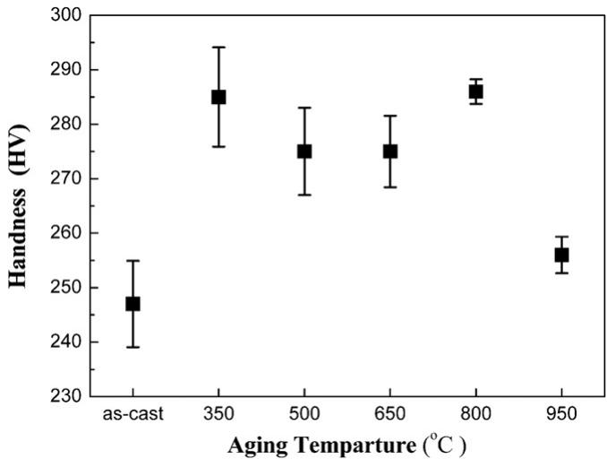
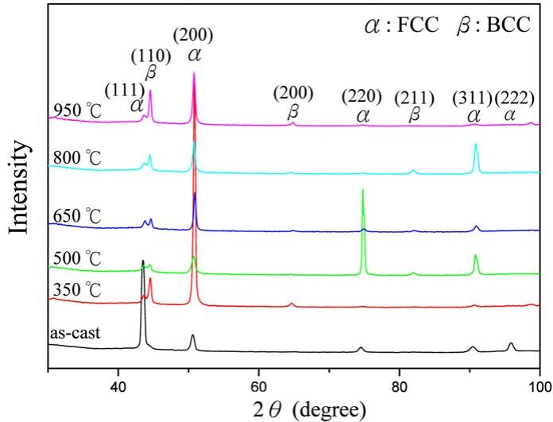
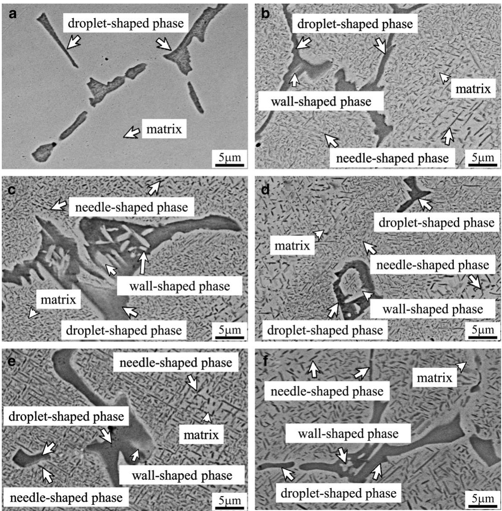
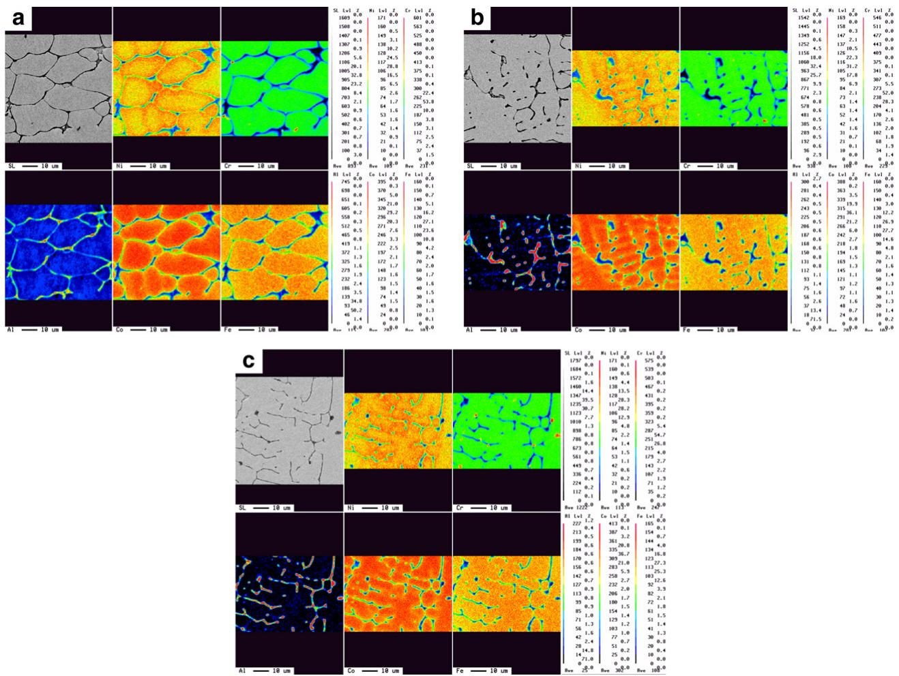
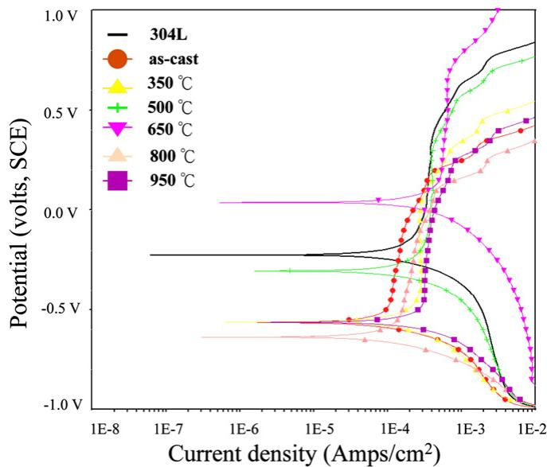
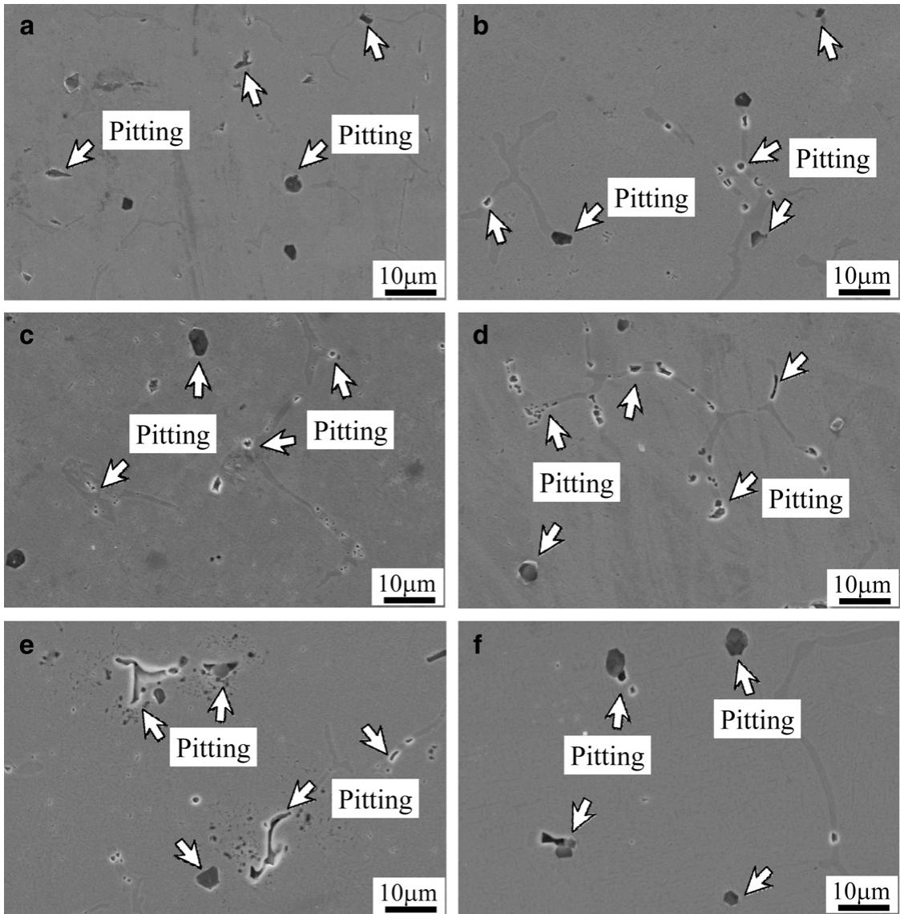

# Evolution of microstructure, hardness, and corrosion properties of high-entropy $\mathsf { A l } _ { 0 . 5 } \mathsf C$ oCrFeNi alloy

Chun-Ming Lin\*, Hsien-Lung Tsai

Department of Mechanical Engineering, National Taiwan University of Science and Technology, 43, Keelung Road, Section 4, Taipei 10673, Taiwan

a r t i c l e i n f o

Article history:   
Received 27 July 2010   
Received in revised form   
15 September 2010   
Accepted 11 October 2010   
Available online 4 December 2010   
Keywords:   
B. Alloy design   
B. Corrosion   
B. Precipitates   
C. Heat treatment   
C. Casting

## a b s t r a c t

In this study, we investigate the microstructure, hardness, and corrosion properties of as-cast Al CoCrFeNi alloy as well as Al CoCrFeNi alloys aged at temperatures of $3 5 0 ^ { \circ } \mathrm { C } , 5 0 0 ^ { \circ } \mathrm { C } , 6 5 0 ^ { \circ } \mathrm { C } , 8 0 0 ^ { \circ } \mathrm { C } ,$ and 950 C for 24 h. The microstructures of the various specimens are investigated using X-ray diffraction (XRD), scanning electron microscopy (SEM), and electron probe X-ray microanalysis (EPMA). The results show that the microstructure of as-cast $_ { \mathsf { A l } _ { 0 . 5 } \mathsf { C o C r F e N i } }$ comprises an FCC solid solution matrix and droplet-shaped phases (AleNi rich phases). At aging temperatures of between 350 and 950 C, the alloy microstructure comprises an FCC BCC solid solution with a matrix, droplet-shaped phases (AleNi rich phase), wall-shaped phases, and needle-shaped phases (Ale(Ni, Co, Cr, Fe) phase). The aging process induces a spinodal decomposition reaction which reduces the amount of the AleNi rich phase in the aged microstructure and increases the amount of the Ale(Ni, Co, Cr, Fe) phase. The hardness of the Al CoCrFeNi alloy increases after aging. The optimal hardness is obtained at aging temperatures in the range 350e800 C, and the hardening effect decreases at higher temperatures. Both the as-cast and aged specimens are considerably corroded when immersed in a 3.5% NaCl solution because of the segregation of the AleNi rich phase precipitate formed in the FCC matrix. Cl ions preferentially attack the AleNi rich phase, which is a sensitive zone exhibiting an appreciable potential difference, with consequent galvanic action.

 2010 Elsevier Ltd. All rights reserved.

## 1. Introduction

Many practical alloy systems have been developed over the years for a wide range of engineering and industrial applications. Most of these alloy systems are based on one or two dominant elements, e.g. ferrous alloys, intermetallic alloys [1,2], bulk metallic glass alloys [3e5], and so on. However, according to conventional metallurgical theory, the presence of multiple elements in an alloy system results in the formation of various compounds, which give rise to a complex microstructure with poor properties. Consequently, Yeh et al. [6,7] developed high-entropy alloy systems (HEASs), in which the multiple elements were added in equi-molar or near equi-molar ratios. Such systems have a far broader range of applications than conventional alloys and may contain five or even more major alloying elements at levels of 5e35 at.% [8e12]. Solid solution structures with multiple principal elements are more stable than conventional FCC, BCC, or FCC BCC structures since they form nano-precipitates in the as-cast state on account of their large entropies of mixing [6,11]. HEASs have excellent hightemperature properties, mechanical properties, and corrosion resistance, and they are therefore ideally suited to industrial applications. In practice, the properties of a HEAS depend on the relative compositions of the various elements within the system [13e20]. The microstructure and properties of the Al CoCrFeNi alloy, a typical HEAS, have been extensively studied and reported in the literature [14,21e23]. Moreover, the effects of the addition or substitution of various constituents of $\mathsf { A l } _ { x } \mathsf { C o C r F e N i }$ alloy on the microstructure and properties of the alloy system at room temperature or elevated temperatures have been examined [13,24,25]. However, the hardness, corrosion properties, and microstructure evolution of AlxCoCrFeNi alloy over a range of aging temperatures have not been sufficiently studied. Accordingly, this study examines the microstructure, hardness, and corrosion properties of as-cast $_ { \mathsf { A l } _ { 0 . 5 } \mathsf { C o C r F e N i } }$ alloy as well as Al CoCrFeNi alloys aged at temperatures of 350 C, 500 C, 650 C, 800 C, and $9 5 0 ^ { \circ } \mathsf C ,$ respectively, for 24 h.

## 2. Experimental procedures

The high-entropy Al0.5CoCrFeNi alloy system was melted under an Ar atmosphere in an arc furnace with adequate amounts of highly pure Al, $\mathbf { \left( 0 , \right. }$ Ni, Cr, Fe, and Ni elements (99.99%). Specimens with dimensions of 10 mm 10 mm 7 mm were prepared. Some ofthe specimens were retained in an as-cast condition, whereas the remaining specimens were aged in an Ar atmosphere for 24 h at temperatures of $3 5 0 ~ ^ { \circ } \mathrm { C } , 5 0 0 ~ ^ { \circ } \mathrm { C } , 6 5 0 ~ ^ { \circ } \mathrm { C } , 8 0 0 ~ ^ { \circ } \mathrm { C }$ or 950 C and then quenched in water. The crystalline phases of the various alloy specimens were identified via X-ray diffraction (XRD, Rigaku $\mathsf { D } / \mathsf { M a x } { - 2 5 0 0 }$ diffractometer with Cu-Ka radiation) at a scanning speed of $1 ^ { \circ } / \mathrm { m i n } ,$ , voltage of 30 kV, and current of 50 mA. The microstructures and chemical compositions of the alloy were then examined using energy dispersive X-ray spectrometry (EDS) and electron probe $_ { \mathrm { X - r a y } }$ microanalysis (EPMA, JEOL JXA-8009R) techniques. The hardness of the as-cast and aged specimens was measured using a Vickers hardness tester (Matsuzawa, Seiki MV-1) under a load of 300 kgf for 15 s. Finally, the electrochemical corrosion properties of the various specimens when immersed in a 3.5% NaCl solution at room temperature were determined from the anodic polarization curves obtained using a potentiodynamic method. Each specimen was scanned potentiodynamically at a rate of1 mV $s ^ { - 1 }$ from an initial potential $\mathsf { o f } 0 . 5 \mathsf { V } _ { \mathsf { S C E } }$ with reference to the open circuit potential to a final potential of 1.5 $\mathsf { V } _ { \mathsf { S C E } }$ Note that calibration was performed in accordance with the ASTM G59 test standard [26].

## 3. Results and discussion

## 3.1. Hardness of Al CoCrFeNi alloy

Fig. 1 shows the hardness values of the Al CoCrFeNi HEAS specimens aged at different temperatures. The hardness increases from HV 247 in the as-cast condition to between HV 256 and HV 285 following aging at temperatures in the range of $3 5 0 { \mathrm { - } } 9 5 0 \ ^ { \circ }  C .$ In addition, maximum age hardening occurs at temperatures between $3 5 0 ^ { \circ } \mathrm { C }$ and $8 0 0 ^ { \circ } \mathsf C ,$ i.e. the hardness reduces as the temperature is further increased to $9 5 0 ~ ^ { \circ } \mathsf C .$ The age hardening phenomena are discussed later in relation to the microstructural observations.

## 3.2. X-ray diffraction of Al CoCrFeNi alloy

Fig. 2 shows the XRD patterns of the as-cast and aged specimens. The results show that the as-cast specimen is an FCC solid solution, whereas the aged specimens are FCC BCC solid solutions. The lattice constants of the BCC and FCC solid solutions are calculated from the principal peaks to be 2.834 -A and 3.562 -A, respectively. As the aging temperature is increased from 350 to 950 C, the FCC peak intensity approaches that of the BCC peak at $2 \theta = 4 2 - 4 8 ^ { \circ }$ . As the aging temperature is increased further, the FCC peak intensity decreases, whereas the BCC peak intensity increases. Thus, it is inferred that aging at high temperatures causes the $_ { \mathsf { A l } _ { 0 . 5 } \mathsf { C o C r F e N i } }$ alloy to gradually transform from a stable FCC structure to a BCC structure. From an overall perspective, Figs. 1 and 2 suggest that the transition of the $_ { \mathsf { A l } _ { 0 . 5 } \mathsf { C o C r F e N i } }$ alloy system to a BCC solid solution increases the hardness of the alloy on account of the corresponding lattice distortion.

  
Fig. 1. Hardness of $\mathsf { A l } _ { 0 . 5 } { \mathsf { C o C I } }$ FeNi alloy processed at various aging temperatures.

  
Fig. 2. XRD patterns of Al0.5CoCrFeNi alloy processed at various aging temperatures.

## 3.3. Microstructural characteristics of $A l _ { 0 . 5 }$ CoCrFeNi alloy

Fig. 3 shows backscattered electron images (BEI) of the as-cast and aged specimens. In general, the BEI images show that in addition to the matrix, the solidified microstructures contain a droplet-shaped phase (DSP; in every specimen) and wall-shaped and needle-shaped phases (WSP and NSP, respectively; in the aged specimens only). As discussed above, the as-cast specimen has an FCC solid solution structure, whereas the aged specimens have an $\mathsf { F C C } + \mathsf { B C C }$ solid solution structure. Table 1 lists the chemical compositions of the various as-cast and aged specimens as obtained from the EDX analysis results. The results show that the matrix and WSPs are Al-depleted phases, whereas the DSPs are AleNi rich phases. Furthermore, the size of the DSPs reduces as the aging temperature is increased, and NSP precipitates rich in Al as well as Ni, Co, Cr, and Fe are formed in the matrices of all the aged specimens, as shown in Fig. 3(b)e(f). In general, the BEI images suggest that the Al content of the $_ { \mathsf { A l } _ { 0 . 5 } \mathsf { C o C r F e N i } }$ alloy system prompts the formation of a BCC solid solution structure under thermal effects. Note that this inference is consistent with the findings of previous studies [6,21,27]. The formation of a considerable amount of intragranular phase segregates occurs at high aging temperatures. The segregation ratio (SR) represents the degree of element segregation and is defined as

$$
\mathsf { S R } = \frac { \mathsf { M P } \mathrm { i n } \mathsf { z o n e A } } { \mathsf { D S P } , \mathsf { W S P } , \mathsf { o r N S P } \mathrm { i n } \mathsf { z o n e B } } ,
$$

where zone A is the zone ofthe matrix phase (MP); zone B, the zone of segregation of the DSP, WSP, or NSP.

Table 3 lists the phase SRs. The matrix phases are the major phases of the as-cast specimens and of those aged at up to $9 5 0 ^ { \circ } \mathsf C$

  
Fig. 3. BEI images of Al CoCrFeNi alloy specimens processed at various aging temperatures: (a) as-cast, (b) 350 C, (c) 500 C, (d) 650 C, (e) 800 C, and (f) 950 C.

The matrix phase becomes an NSP when the specimen is treated from 350 to 950 C. The BEI images in Fig. 3 show that the FCC solid solution structure (i.e. the DSPs) and the BCC solid solution phases (i.e. the NSPs) segregate from the FCC matrix at elevated aging temperatures. This phase segregation effect occurs because the AleNi rich phase and the Ale(Ni, Co, Cr, Fe) phases have a higher negative mixing enthalpy than the other atom pairs of the five principal elements in the alloy system (Table 2). In practice, the negative mixing enthalpy of these particular atoms means that it is virtually impossible to prevent the segregation of the AleNi rich phase and the Ale(Ni, Co, Cr, Fe) phases during heat treatment [28e30]. In addition, the specimens aged at temperatures between

EDX analysis results for chemical composition (at.%) of Al0.5CoCrFeNi alloy samples processed at different aging temperatures.
<table><tr><td></td><td></td><td colspan="5">Unit: at.%</td><td></td><td></td><td colspan="5">Unit: at.%</td></tr><tr><td></td><td></td><td>Al</td><td>Co</td><td>Cr</td><td>Fe</td><td>Ni</td><td></td><td></td><td>Al</td><td>Co</td><td>Cr</td><td>Fe</td><td>Ni</td></tr><tr><td>As-cast</td><td>NSP</td><td>1</td><td>一</td><td>一</td><td>一</td><td>一</td><td>650℃</td><td>NSP WSP</td><td>15</td><td>21</td><td>21</td><td></td><td>22</td></tr><tr><td></td><td>WSP</td><td>一</td><td>1</td><td>一</td><td>一</td><td>一</td><td></td><td>DSP</td><td>17</td><td>20</td><td>21</td><td>19</td><td>23</td></tr><tr><td></td><td>DSP</td><td>25</td><td>19</td><td>12</td><td>12</td><td>32</td><td></td><td></td><td>26</td><td>18</td><td>10</td><td>12</td><td>34</td></tr><tr><td></td><td>MP</td><td>10</td><td>23</td><td>22</td><td>23</td><td>22</td><td></td><td>MP</td><td>8</td><td>23</td><td>21</td><td>24</td><td>24</td></tr><tr><td>350℃</td><td>NSP</td><td>15</td><td>22</td><td>19</td><td>19</td><td>25</td><td>800℃</td><td>NSP</td><td>14</td><td>23</td><td>19</td><td>23</td><td>21</td></tr><tr><td></td><td>WSP</td><td>17</td><td>21</td><td>19</td><td>20</td><td>24</td><td></td><td>WSP</td><td>16</td><td>21</td><td>18</td><td>20</td><td>25</td></tr><tr><td></td><td>DSP</td><td>24</td><td>17</td><td>12</td><td>14</td><td>33</td><td></td><td>DSP</td><td>25</td><td>16</td><td>12</td><td>12</td><td>35</td></tr><tr><td></td><td>MP</td><td>8</td><td>24</td><td>22</td><td>25</td><td>22</td><td></td><td>MP</td><td>10</td><td>23</td><td>21</td><td>22</td><td>24</td></tr><tr><td>500℃</td><td>NSP</td><td>17</td><td>21</td><td>19</td><td>21</td><td>22</td><td>950℃</td><td>NSP</td><td>19</td><td>20</td><td>19</td><td>21</td><td>21</td></tr><tr><td></td><td>WSP</td><td>18</td><td>20</td><td>19</td><td>19</td><td>23</td><td></td><td>WSP</td><td>15</td><td>21</td><td>25</td><td>24</td><td>18</td></tr><tr><td></td><td>DSP</td><td>21</td><td>20</td><td>14</td><td>16</td><td>29</td><td></td><td>DSP</td><td>26</td><td>17</td><td>7</td><td>12</td><td>38</td></tr><tr><td></td><td>MP</td><td>9</td><td>24</td><td>21</td><td>23</td><td>23</td><td></td><td>MP</td><td>9</td><td>24</td><td>21</td><td>23</td><td>23</td></tr></table>

Table 3  
Chemical mixing enthalpy of atom pairs in $\mathrm { A l } _ { 0 . 5 } ( $ CoCrFeNi alloy system.
<table><tr><td>Element</td><td colspan="5">Unit: KJ/mol</td></tr><tr><td></td><td> $\mathtt { F e }$ </td><td>Co</td><td>Ni</td><td>Cr</td><td>Al</td></tr><tr><td>Fe</td><td></td><td>-1</td><td>-2</td><td>-1</td><td>-11</td></tr><tr><td>Co</td><td></td><td>一</td><td>0</td><td>-4</td><td>-19</td></tr><tr><td>Ni</td><td></td><td></td><td>一</td><td>-7</td><td>-22</td></tr><tr><td>Cr</td><td></td><td></td><td></td><td>一</td><td>10</td></tr><tr><td>Al</td><td></td><td></td><td></td><td></td><td>一</td></tr></table>

350 and $9 5 0 ^ { \circ } \mathrm { C }$ contained WSPs within the DSPs, as shown in Fig. 3 (b)e(f). The beliefis that the formation of these WSPs was the result of the metastable phase. The presence of the WSPs could be ascribed to the rapid cooling of each component to room temperature, wherein the component began solidifying into its preferred crystalline structure, and to the setting of the metastable structure established by aging at temperatures between 350 and $9 5 0 ~ ^ { \circ } \mathsf C .$ Accordingly, the composition of various elements and atoms differed during the diffusion process. In the DSP structure, the cooling rate of the WSPs was very high due to of the small volume (i.e. the WSPs). As a result, the diffuse field of solutes in the liquid was in a state of non-equilibrium, and the concentration and flux of solutes could not be predicted using classical local equilibrium theory. These effects caused the shortening of the mean free path of diffusing atoms, which in turn led to the formation of a metastable structure.

As discussed above, NSPs are precipitated out of the matrix during thermal aging at $3 5 0 { - } 9 5 0 ~ ^ { \circ } \mathrm { C } ;$ this is because the mixing enthalpy of the AleNi rich phase and the Ale(Ni, Co, Cr, Fe) phases is lower (i.e. more negative) than that of the other atom pairs of the five principal alloying elements [14]. Because the growth of the NSPs follows a parabolic kinetic equation, it can be considered that their growth is diffusion-controlled [31]. Therefore, the aging temperature has a significant effect on the growth rate of the NSPs. Thus, the size of the NSPs increases with temperature, as shown in Fig. 3(b)e(f). Further study showed that the DSP appears because of a relatively high degree of negative mixing enthalpy between Al

Segregation ratios (SRs) for droplet-shaped phase (DSP), wall-shaped phase (WSP) and needle-shaped phase (NSP).
<table><tr><td></td><td></td><td>Al</td><td>Co</td><td>Cr</td><td>Fe</td><td>Ni</td></tr><tr><td rowspan="2">As-cast</td><td>SR1</td><td>0.4</td><td>1.2</td><td>1.8</td><td>1.9</td><td>0.7</td></tr><tr><td>SR2</td><td>一</td><td>一</td><td>一</td><td>一</td><td>一</td></tr><tr><td rowspan="3">350℃</td><td>SR3</td><td>一</td><td>一</td><td>一</td><td>一</td><td>一</td></tr><tr><td>SR1</td><td>0.5</td><td>1.1</td><td>1.2</td><td>1.3</td><td>0.9</td></tr><tr><td>SR2</td><td>0.5</td><td>1.1</td><td>1.2</td><td>1.3</td><td>0.9</td></tr><tr><td rowspan="3">500℃</td><td>SR3</td><td>0.3 0.5</td><td>1.4</td><td>1.8</td><td>1.8</td><td>0.7</td></tr><tr><td>SR1</td><td></td><td>1.1</td><td>1.1</td><td>1.1</td><td>1.0</td></tr><tr><td>SR2</td><td>0.5 0.4</td><td>1.2 1.2</td><td>1.1</td><td>1.2</td><td>1.0</td></tr><tr><td rowspan="3">650℃</td><td>SR3</td><td>0.5</td><td>1.1</td><td>1.5</td><td>1.4</td><td>0.8</td></tr><tr><td>SR1</td><td>0.5</td><td>1.2</td><td>1.0</td><td>1.0</td><td>1.1</td></tr><tr><td>SR2 SR3</td><td>0.3</td><td>1.3</td><td>1.0</td><td>1.3</td><td>1.0</td></tr><tr><td rowspan="3">800 ℃</td><td></td><td>0.7</td><td>1.0</td><td>2.1 1.1</td><td>2.0</td><td>0.7</td></tr><tr><td>SR1</td><td>0.6</td><td>1.1</td><td>1.2</td><td>1.0</td><td>1.1</td></tr><tr><td>SR2</td><td></td><td></td><td></td><td>1.1</td><td>1.0</td></tr><tr><td rowspan="3">950℃</td><td>SR3</td><td>0.4</td><td>1.4</td><td>1.8</td><td>1.8</td><td>0.7</td></tr><tr><td>SR1</td><td>0.5</td><td>1.2</td><td>1.1</td><td>1.1</td><td>1.1</td></tr><tr><td>SR2 SR3</td><td>0.6 0.3</td><td>1.1 1.4</td><td>0.8 3.0</td><td>1.0 1.9</td><td>1.3 0.6</td></tr></table>

$$
\mathrm { S R } _ { 1 } = \frac { \mathrm { M a t r i x p h a s e \ : ( M P ) } } { \mathrm { D r o p l e t - \ : s h a p e d \ p h a s e \ : ( D S P ) } } .
$$

and Ni, which tend to form atom pairs and segregate within the matrix. In other words, at first, the phase has a precipitate structure in the earliest stages of as-cast. With an increase in temperature, these DSPs grow in size and decrease in number, with a nonuniform distribution. Following thermal aging between 350 and $9 5 0 ^ { \circ } \mathsf C ,$ , the NSP could be attributed to segregation of heterogeneous atoms resulting in the microstructure of DSPs adjacent to the substrate. This could be described as large quantities of needle-like precipitate sprinkled throughout the matrix. When the temperature increased, the NSPs were distributed densely throughout the matrix and began transforming then the volume fraction of NSPs (i.e. after aging treatment) gradually increased. These NSPs are often called secondary precipitation structures. The NSPs are considered to be directly related to the age hardening effect shown in Fig. 1. At lower aging temperatures, the DSPs (AleNi rich phase) do not decompose, and tiny NSPs (Ale(Ni, Co, Cr, Fe) phase) are precipitated in the matrix. These highly dense precipitates strongly influence the hardening process. At temperatures greater than $9 5 0 ^ { \circ } \mathsf C ,$ the NSPs have a larger size and are therefore more sparsely distributed in the matrix. As a result, the hardness of the aged microstructure reduces (Fig. 1).

Fig. 4 shows BEI images and the corresponding EPMA elemental mapping (without etching) results for the as-cast specimen and for two specimens aged at temperatures of 650 and $9 5 0 ^ { \circ } \mathsf C .$ The results show that the DSPs are composed primarily of Al and Ni, whereas the matrix is composed mainly of Co, Fe, Cr, and Ni. The difference in the composition of the two structures is the result of the nonequilibrium solidification conditions. In the DSPs of the as-cast specimen (Fig. 4(a)), the outward diffusion of the Co, Fe, and Cr elements occurs more rapidly than the inward diffusion of Al and Ni. However, as the aging temperature is increased, the rate of inward diffusion of Al and Ni increases. Thus, as shown in Fig. 4(b) and (c) for aging temperatures of 650 and $9 5 0 ~ ^ { \circ } \mathrm { C } ,$ respectively, diffusion into the DSPs is dominated by the Al and Ni elements.

These experimental results and reasonable inferences regarding the factors based on the temperature of aging and the rate of element diffusion. When the as-cast specimen is prepared, the molten components are transferred individually to the liquid alloy and are mixed thoroughly by thermal agitation. As a result, no matrix or major component can be dominant in the solidification process because the atoms of each component are solutes in the alloy system. As the temperature of the specimen reduces, each component begins to solidify into its preferred crystalline structure. Finally, as the alloy solidifies, the atoms of the various elements interfere with one other during the diffusion process [7]. In the molten state, the elements are not in equilibrium and the concentration and flux of the solutes cannot be predicted. The effects of radius, crystalline structure, and melting point shorten the mean free path of the diffusing atoms and lead to the formation of the precipitated phase. Previous studies have indicated that multicomponent alloys form complex precipitate phases through affinity reactions, whereby atoms diffuse during metal solidification [18,31]. The AleNi rich phase in the as-cast specimen shown in Fig. 4(a) is formed since Al has a higher affinity to Ni than to any of the other elements in the $\mathrm { A l } _ { 0 . 5 } \ell$ CoCrFeNi alloy system [32,33]. The amount of AleNi rich phase in the aged specimens reflects the competing effects of the affinity between the Al and Ni atoms and the diffusion force of the Ni atoms, and it depends on the aging temperature. The affinity between Al and Ni favours the formation of AleNi rich phases, whereas the diffusion force of the Ni atoms undoubtedly acts to weaken it. At an aging temperature of $6 5 0 ^ { \circ } \mathsf C ,$ the formation of the AleNi phase is dominated by the affinity between the Al and Ni atoms since the droplet-shaped structures are thin; thus, the Ni diffusion force is relatively low. However, at a higher temperature of $9 5 0 ^ { \circ } \mathsf C ,$ the interaction effect between Al and Ni is outweighed by the Ni diffusion force. In other words, the formation of the AleNi phase is dominated by the effects of Ni diffusion. In general, the Al and Ni atoms diffuse more rapidly at a higher aging temperature. As a result, the size of the AleNi rich droplet structures decreases with an increase in the aging temperature. The images shown in Fig. 4(b) and (c) suggest that the droplet structures attain their maximum size and the Al and Ni contents reach their respective saturation levels at aging temperatures higher than $6 5 0 ^ { \circ } \mathrm { C }$

  
Fig. 4. BEI images and EPMA elemental mapping results for Al0.5CoCrFeNi alloy processed at various aging temperatures: (a) as-cast, (b) 650 C, and $( \mathbf { c } ) 9 5 0 ^ { \circ } \mathbf { C } .$

## 3.4. Corrosion properties of Al0.5CoCrFeNi alloy

The electrochemical corrosion properties of the as-cast and aged specimens when immersed in a 3.5% NaCl solution were evaluated using a potentiodynamic polarization method. The polarization curves for the various alloy specimens are shown in Fig. 5, together with that of AISI 304L stainless steel for comparison purposes. The measured values ofthe electrochemical parameters ofthe AISI 304L stainless steel and alloy specimens are listed in Table 4. The AISI 304L stainless steel specimen exhibits a corrosion potential of $0 . 2 2 \ \mathrm { V } _ { \mathrm { S C E } } . \ \mathrm { A l l }$ of the as-cast and aged specimens have corrosion potentials in the range from 0.04 $\mathsf { t } 0 - 0 . 6 4 \mathrm { V } _ { \mathrm { S C E } }$ and pitting potentials in the range from 0.13 to 0.71 ${ \tt V } _ { \mathrm { S C E } } .$ Meanwhile, the as-cast and aged specimens have corrosion current densities in the range of $1 . 5 8 \times 1 0 ^ { - 6 } { - 5 . 2 9 \times 1 0 ^ { - 7 } \mathrm { A / c m } ^ { 2 } }$ , whereas the AISL 304L stainless steel specimen has a corrosion current density of $6 . 0 0 \times 1 0 ^ { - 8 } \mathrm { { A } } /$ $\mathrm { c m } ^ { 2 } .$ . The corrosion rates of the alloy specimens aged at higher temperatures are significantly greater than those of the specimens aged at lower temperatures. However, the corrosion properties of the alloy aged at $6 5 0 ~ ^ { \circ } \mathrm { C }$ are notably different from those of the other aged specimens. This difference is most probably the result of the microstructural transformation induced by the aging temperature. To be specific, the amount of the AleNi rich phase decreases as the aging temperature increases, leading to a corresponding increase in the amount of the Ale(Ni, Co, Cr, Fe) phase. These phase changes with the increase in the aging temperature lead to a loss in the corrosion resistance of the $_ { \mathsf { A l } _ { 0 . 5 } \mathsf { C o C r F e N i } }$ alloy system.

  
Fig. 5. Potentiodynamic curves of as-cast and aged Al0.5CoCrFeNi alloy specimens in 3.5% NaCl solution at $2 5 ~ ^ { \circ } \mathbb { C } .$

Electrochemical parameters ofas-cast and aged Al CoCrFeNi alloy specimens when immersed in 3.5% NaCl solution at 25 °C
<table><tr><td> $E _ { \mathrm { c o r r } } ( \mathrm { V } )$ </td><td> $i _ { \mathrm { c o r r } } ( \mathsf { A } \mathsf { c m } ^ { - 2 } )$ </td><td> $E _ { \mathrm { p i t } } \left( \mathsf { V } \right)$ </td></tr><tr><td>304 L</td><td> $\overline { { 6 . 0 0 \times 1 0 ^ { - 8 } } }$ </td><td>0.48</td></tr><tr><td>as-cast</td><td> $1 . 7 0 \times 1 0 ^ { - 7 }$ </td><td>0.13</td></tr><tr><td>350 ℃</td><td> $6 . 4 0 \times 1 0 ^ { - 6 }$ </td><td>0.18</td></tr><tr><td>500 ℃</td><td> $1 . 5 8 \times 1 0 ^ { - 6 }$ </td><td>0.28</td></tr><tr><td>650°C</td><td> $5 . 2 9 \times 1 0 ^ { - 7 }$ </td><td>0.71</td></tr><tr><td>800 °C</td><td> $3 . 0 5 \times 1 0 ^ { - 7 }$ </td><td>0.14</td></tr><tr><td>950°C</td><td> $2 . 2 2 \times 1 0 ^ { - 6 }$ </td><td>0.18</td></tr></table>

Ecorr: corrosion potential.  
icorr: corrosion current density.  
E : pitting potential.

Fig. 6 shows the surface corrosion of fracture that formed following crevice corrosion of the as-cast and aged specimens. The as-cast specimen shows intercrystalline (AleNi rich phase) corrosion, as shown in Fig. 6(a). However, all the heat-treated specimens show a few small pits and intercrystalline (AleNi rich phase) corrosion on the material surface as well as enhanced crevice corrosion, as shown in Fig. 6(b)e(f), respectively. The surface corrosion on all the specimens indicates that Cl ions attack the AleNi rich phase sites, both in the as-cast specimen and in all the aged specimens. The images clearly show that the $\mathsf { A l - } ( \mathsf { N i } , \mathsf { C o } , \mathsf { C r } , \mathsf { F e } )$ phases are predominant in the corrosion-resistant $_ { \mathsf { A l } _ { 0 . 5 } \mathsf { C o C r F e N i } }$ alloy system, suggesting that the precipitates of these phases undergo Cl ion attack. The small extent of pitting corrosion is evident on all the specimen surfaces because larger regions of passivation are present on both the as-cast specimen and the specimen aged at $9 5 0 ^ { \circ } \mathsf C ,$ which makes it easy for a passive film to be formed over the specimen surface. In addition, intercrystalline (AleNi rich phase) corrosion ofdiffering sizes is observed below the surfaces of the specimens aged at a higher temperature as a result of the breakdown of the passive film. Overall, the results shown in Fig. 6 indicate that the properties of the precipitated AleNi rich and Ale(Ni, Co, Cr, Fe) phases become significantly unstable as the aging temperature increases and cause the localized corrosion mechanism to change from pitting corrosion to selective corrosion.

  
Fig. 6. Surface morphologies of as-cast and aged Al CoCrFeNi alloy specimens following immersion in 3.5% NaCl solution at 25 C: (a) as-cast, (b) 350 C, (c) 500 C, (d) 650 C, (e) 800 C, and (f) 950 C.

## 4. Conclusions

1. The as-cast high-entropy Al0.5CoCrFeNi alloy has an FCC solid solution structure, whereas the alloys aged at 350e950 C have an FCC BCC solid solution structure.

2. The FCC solid solution structure comprises droplet-shaped AleNi rich phases and an FCC matrix phase. The duplex FCC BCC solid solution structure comprises droplet-shaped phases (AleNi rich, FCC crystal structure), wall-shaped phases (BCC solid solution structure), needle-shaped phases $( \mathsf { A l - } ( \mathsf { N i } ,$ Co, Cr, Fe), BCC solid solution structure), and the matrix phase.

3. Age hardening of the alloy occurs at all temperatures in the range 350e950 C. However, the optimal age hardening effect is obtained at temperatures lower than $8 0 0 ^ { \circ } \mathsf C .$

4. The corrosionpotential and pitting potential ofthe Al CoCrFeNi alloy when immersed in a 3.5 wt% NaCl solution are significantly lower than those of AISI 304L stainless steel. The corrosion properties of the investigated alloy are governed by the aging temperature. The aging ofthe alloy at temperatures between 350 and $9 5 0 ^ { \circ } \mathsf C$ impairs the pitting resistance of the alloy in chloride environments. In particular, the corrosion properties ofthe alloy aged at 650 C differ significantly from those of the other aged specimens. This difference is most probably the result of the microstructure transformation induced by the aging temperature, because the amount of the AleNi rich phase decreases as the aging temperature increases, which leads to a corresponding increase in the amount of the Ale(Ni, Co, Cr, Fe) phase.

## Acknowledgement

The authors would like to thank the National Science Council of the Republic of China, Taiwan, for financially supporting this research under Contract No. NSC 97-2221-E011-010.

## References

[1] Liu CT, Oliver WC. Environmental embrittlement and grain-boundary fracture in Ni Si. Scr Metall Mater 1991;25:1933e7.

[2] Chen GL, Liu CT. Moisture induced environmental embrittlement of intermetallics. Int Mater Rev 2001;46:253e60.

[3] Peker A, Johnson WL. A highly processable metallic glass: Zr41.2Ti13.8Cu12.5- Ni10.0Be22.5. Appl Phys Lett 1993;63:2342e4.

[4] Inoue A, Takeuchi A. Recent progress in bulk glassy, nanoquasicrystalline and nanocrystallic alloys. Mater Sci Eng A 2004;375e377:16e30.

[5] Chen N, Pan D, Louzguine-Luzgin DV, Xie GQ, Chen MW, Inoue A. Improved thermal stability and ductility of flux-treated Pd Ni Si P BMG. Scr Mater 2010;62:17e20.

[6] Tong CJ, Chen YL, Chen SK, Yeh JW, Shun TT, Tsau CH, et al. Microstructure characterization of Al CoCrCuFeNi high-entropy alloy system with multiprincipal elements. Metall Mater Trans A 2005;36:881e93.

[7] Yeh JW, Chen SK, Lin SJ, Can JY, Chin TS, Shun TT, et al. Nanostructured highentropy alloys with multiple principal elements: novel alloy design concepts and outcomes. Adv Eng Mater 2004;6:299e303.

[8] Cantor B, Chang ITH, Knight P, Vincent AJB. Microstructure development in equiatomic multicomponent alloys. Mater Sci Eng A 2004;375e377:213e8.

[9] Yeh JW, Chen SK, Gan JY, Lin SJ, Chin TS, Shun TT, et al. Formation of simple crystal structures in CueCoeNieCreAleFeeTieV alloys with multiprincipal metallic elements. Metall Mater Trans A 2005;35:2533e6.

[10] Huang YS, Chen L, Lui HW, Cai MH, Yeh JW. Microstructure, hardness, resistivity and thermal stability of sputtered oxide films of AlCoCrCu NiFe high e entropy alloy. Mater Sci Eng A 2007;457:77e83.

[11] Tung CC, Yeh JW, Shun TT, Chen SK, Huang YS, Chen HC. On the elemental effect of AlCoCrFeNi high-entropy alloy system. Mater Lett 2007;61:1e5.

[12] Huang PK, Yeh JW, Shun TT, Chen SK. Multi-principal-element alloys with improved oxidation and wear resistance for thermal spray coating. Adv Eng Mater 2004;6:74e8.

[13] Wen LH, Kou HC, Li JS, Chang H, Xue XY, Zhou L. Effect of aging temperature on microstructure and properties of AlCoCrCuFeNi high-entropy alloy. Intermetallics 2009;4:266e9.

[14] Shun TT, Du YC. Age hardening of the Al0.3CoCrFeNiC0.1 high entropy alloy. J Alloys Compd 2009;478:269e72.

[15] Hsieh KC, Yu CF, Hsieh WT, Chiang WR, Ku JS, Lai JH, et al. The microstructure and phase equilibrium of new high performance high-entropy alloys. J Alloys Compd 2009;483:209e12.

[16] Wang XF, Zhang Y, Qiao Y, Chen GL. Novel microstructure and properties of multicomponent CoCrCuFeNiTix alloys. Intermetallics 2007;15:357e62.

[17] Zhang KB, Fu ZY, Zhang JY, Shi J, Wang WM, Wang H, et al. Nanocrystalline CoCrFeNiCuAl high-entropy solid solution synthesized by mechanical alloying. J Alloys Compd 2009;485:L31e4.

[18] Lin YC, Cho YH. Elucidating the microstructural and tribological characteristics of NiCrAlCoCu and NiCrAlCoMo multicomponent alloy clad layers synthesized in situ. Surf Coat Technol 2009;203:1694e701.

[19] Wang FJ, Zhang Y, Chen GL, Davies HA. Cooling rate and size effect on the microstructure and mechanical properties of AlCoCrFeNi high entropy alloy. J Eng Mater Technol 2009;131:0345011e3.

[20] Lin CM, Tsai HL. Equilibrium phase of high-entropy FeCoNiCrCu0.5 alloy at elevated temperature. J Alloys Compd 2010;489:30e5.

[21] Zhou YJ, Zhang Y, Wang YL, Chen GL. Solid solution alloy of AlCoCrFeNiTix with excellent room-temperature mechanical properties. Appl Phys Lett 2007;90:181904e6.

[22] Chou HP, Chang YS, Chen SK, Yeh JW. Microstructure, thermophysical and electrical properties in AlxCoCrFeNi (0 x 2) high-entropy alloys. Mater Sci Eng B 2009;163:184e9.

[23] Wang YP, Li BS, Ren MX, Yang C, Fu HZ. Microstructure and compressive properties of AlCrFeCoNi high entropy alloy. Mater Sci Eng A 2008;491: 154e8.

[24] Shun TT, Hung CH, Lee CF. The effects of secondary elemental Mo or Ti addition in Al CoCrFeNi high-entropy alloy on age hardening at 700 C. J Alloys Compd 2010;495:55e8.

[25] Zhang KB, Fu ZY, Zhang JY, Wang WM, Wang H, Wang YC, et al. Microstructure and mechanical properties of CoCrFeNiTiAl high-entropy alloys. Mater Sci Eng A 2009;508:214e9.

[26] ASTM standard G59-97. PA: ASTM; 2009.

[27] Kao YF, Chen TJ, Chen SK, Yeh JW. Microstructure and mechanical property of as-cast, -homogenized, and -deformed Al CoCrFeNi (0 x 2) high-entropy alloys. J Alloys Compd 2009;488:57e64.

[28] Takeuchi A, Inoue A. Calculations of mixing entropy and mismatch entropy for ternary amorphous alloys. Mater Tran 2000;41:1372e8.

[29] Takeuchi A, Inoue A. Calculations of amorphous-forming composition range for ternary alloy systems and analyses of stabilization of amorphous phase and amorphous-forming ability. Mater Trans 2001;42:1435e44.

[30] Tsai CW, Chen YL, Tsai MH, Yeh JW, Shun TT, Chen SK. Deformation and annealing behaviors of high-entropy alloy Al0.5CoCrCuFeNi. J Alloys Compd 2009;486:427e35.

[31] Tomellini M. Mean field rate equation for diffusion-controlled growth in binary alloys. J Alloys Compd 2003;348:189e94.

[32] Lin YC, Cho YH. Elucidating the microstructure and wear behavior for multicomponent alloy clad layers by in situ synthesis. Surf Coat Technol 2008;202: 4666e72.

[33] Nazari KA, Shabestari SG. Effect of micro alloying elements on the interfacial reactions between molten aluminum alloy and tool steel. J Alloys Compd 2009;478:523e30.