# Electrochemical passive properties of $\mathsf { A l } _ { x } \mathsf { C o C r F e N i }$ (x = 0, 0.25, 0.50, 1.00) alloys in sulfuric acids

Yih-Farn Kao a, Tsung-Dar Lee a, Swe-Kai Chen b,\*, Yee-Shyi Chang a

a Department of Materials Science and Engineering, National Tsing Hua University, 101 Kuang Fu Road, Sec. 2, Hsinchu 30013, Taiwan, ROC

b Center for Nanotechnology, Materials Science, and Microsystems, National Tsing Hua University, 101 Kuang Fu Road, Sec. 2, Hsinchu 30013, Taiwan, ROC

## a r t i c l e i n f o

Article history:   
Received 27 July 2009   
Accepted 18 November 2009   
Available online 27 November 2009 Keywords:   
A. Alloy   
B. EIS   
B. Polarization B. Weight loss C. Passive films

## a b s t r a c t

This study investigates the electrochemical passive properties of Al CoCrFeNi alloys in $\mathrm { H } _ { 2 } \mathrm { S O } _ { 4 }$ by potentiodynamic polarization, EIS, and weight loss tests from 20 to $6 5 ^ { \circ } \mathsf C .$ Experimental results indicate that Al harms the corrosion resistance in $\mathrm { H } _ { 2 } \mathrm { S O } _ { 4 }$ at temperatures exceeding $2 7 ^ { \circ } \mathsf C$ owing to the porous and inferior nature of the protection oxide film of Al in these alloys. Closely examining the Arrhenius plots of corrosion current density reveals that both pre-exponential factor A and activation energy $E _ { \mathrm { a } }$ increase with Al content. However, A affects corrosion current density more significantly than $E _ { \mathrm { a } }$ at higher temperatures and, conversely, at lower temperatures.

 2009 Elsevier Ltd. All rights reserved.

## 1. Introduction

As multiple principal element alloys, high-entropy alloys (HEAs) comprise at least five elements whose concentration for each one ranges between 5 and 35 at. % [1]. Attributes of forming a simple solid solution and nano particle precipitation, as well as achieving a high hardness and strength, and excellent high-temperature oxidation resistance make HEAs highly promising for application and research and development of these alloys [2–5]. Properties of $\mathsf { A l } _ { x } \mathsf { C o C r F e N i }$ $( 0 \leqslant x \leqslant 1 )$ HEAs vary significantly with $x \ [ 6 ]$ . For instance, the alloy structure changes from FCC to BCC for increased Al content x. Additionally, the coefficient of thermal expansion decreases with x. Both properties are closely related to the bond strength of alloys. Moreover, electrical resistivity of Al CoCrFeNi alloys is large, i.e., approximately up to $2 0 0 \mu \Omega$ cm [7].

Corrosion properties of $_ \mathrm { A l C o C r C u } _ { 0 . 5 } \mathrm { F e N i S i }$ [8,9], $\mathsf { A l } _ { x } \mathsf { C r F e } _ { 1 . 5 ^ { - } }$ MnNi [10,11], and $\mathsf { A l } _ { 0 . 5 } \mathsf { C o C r C u F e N i B } _ { x }$ [12] HEAs have been extensively studied in recent years. Among these HEAs, AlCo-$\mathrm { C r C u } _ { 0 . 5 } \mathrm { F e N i S i }$ alloy (HEA 1) displays, at room temperature, a better general corrosion resistance than SS 304 in 1 N $\mathrm { H } _ { 2 } S 0 _ { 4 } ;$ however, it exhibits a worse pitting corrosion resistance than SS 304 in 1 N $\mathrm { H } _ { 2 } S 0 _ { 4 }$ and in 1 M NaCl, respectively. The general corrosion resistance of each of HEA 1 and SS 304 decreases when exceeding room temperature. The effect of temperature on corrosion resistance of

HEA 1 is less severe in 1 M NaCl than in 1 N $\mathrm { H } _ { 2 } S 0 _ { 4 }$ [9]. AlxCr-$\mathsf { F e } _ { 1 . 5 }  { \mathrm { M n N i } _ { 0 . 5 } }$ alloys (HEA 2) reveal that in each of the 0.5 M $\mathrm { H } _ { 2 } S 0 _ { 4 }$ and 1 M NaCl solutions, corrosion resistance increases with a decreasing $x ;$ in addition, the susceptibility to general and pitting corrosion of HEA 2 increases with an increasing x [10]. Al Cr-$\mathsf { F e } _ { 1 . 5 }  { \mathrm { M n N i } _ { 0 . 5 } }$ alloys (called hereinafter as HEA 2a and 2b for $x = 0$ and 0.3, respectively) in 0.1 M HCl exhibit different corrosion behaviours for different x values. Although HEA 2a is susceptible to localized corrosion, HEA 2b has a stable passive film on the surface. In 0.1 M HCl, anodized treatment of HEA 2a and 2b alloys in 15% $\mathrm { H } _ { 2 } S 0 _ { 4 }$ gives higher corrosion resistance than the untreated [11]. In deaerated 1 N $\mathrm { H } _ { 2 } S 0 _ { 4 } , \mathrm { A l } _ { 0 . 5 } \mathrm { C o C r C u F e N i B } _ { x }$ alloys are more resistant to general corrosion than SS 304, and are not susceptible to localized corrosion. Additionally, the corrosion resistance of $\mathsf { A l } _ { 0 . 5 } \mathsf { C o C r C u F e N i B } _ { 0 . 6 }$ alloy is inferior to ${ \tt A l } _ { 0 . 5 } { \tt C o C r C u F e N i }$ alloy [12]. Above HEAs show an extremely close compositional dependence of corrosion behaviour in various solutions.

Although many interesting topics have been explored for Al CoCrFeNi alloys [6,7], investigation on their corrosion property is still lacking. Therefore, this study elucidates how Al affects their corrosion behaviour. The electrochemical properties of the alloys in sulfuric acids are investigated using the potentiodynamic polarization and a weight loss measurement method. Additionally, these alloys are compared with SS 304, especially with respect to the effect of temperature. Moreover, based on use of electrochemical impedance spectroscopy (EIS), the effect of Al on corrosion behaviour is analysed. Furthermore, the relationship of stability of oxide film with Al content is examined by varying the chloride concentration in a sulfuric solution.

## 2. Experimental details

## 2.1. Test specimens for electrochemical tests and weight loss measurements

As-cast Al CoCrFeNi alloys were prepared according to molar ratios of x = 0, 0.25, 0.50, and 1.00 (called C-0, C-0.25, C-0.50, and C-1.00, respectively) in a vacuum arc remelter. Table 1 lists the composition of the alloys. Test specimens were cut in 0.8 cm - $0 . 8 \ : \mathrm { c m } \times 0 . 3$ cm and cold-mounted in epoxy with the outside surface from a surface of 0.8 cm - 0.8 cm of specimens. The specimens were subsequently ground and polished with silicon carbide paper, rinsed and dried in preparation for electrochemical tests and weight loss measurements. During determination of the weight loss, six sets of samples were dipped in sulfuric acid for 1, 3, 5, 8, 11, and 15 days, respectively. All tests, except the weight loss test, were performed at least three times to confirm the data reproducibility. Finally, weight loss tests were performed twice and the reproducibility was given in an error bar.

## 2.2. Test solutions

The base solution for the test was 0.5 M of sulfuric acid. Test temperatures were ambient temperature $( \sim 2 5 ^ { \circ } \mathrm { C } )$ . Test solutions bearing chloride ions were with 0.25, 0.50, and 1.00 M sodium chloride in the base solution. To avoid the dissolved oxygen (aeration) affecting the test solutions, deaeration was simultaneously made by a nitrogen gas flow of 120 ml/min in the test solution. The effect of temperature on polarization was examined under thermostatic control at an interval of $1 5 ~ ^ { \circ } \mathsf C$ in the temperature range of $2 0 { - } 6 5 ~ ^ { \circ } C$

## 2.3. Electrochemical test

A three-electrode cell was used for the electrochemical test. The reference electrode was a commercial Ag/AgCl electrode saturated in 3 M KCl electrode $( - 0 . 2 0 5 \lor _ { \mathrm { S H E } } 0 \mathrm { r } - 0 . 2 0 5 \lor$ to standard hydrogen electrode). The auxiliary electrode was made of Pt, and the working electrode was the specimen. Potentiostat was CH Instrument Model-600A. The specimen was cathodically polarized at a potential of $- 0 . 4 \mathsf { V } _ { \mathrm { S H E } }$ for 300 s before the test for the purpose of removing surface oxides. The quasi-steady-state time for an open circuit was 900 s. Scan speed was 1 mV/s for scan potential ranging from 0.6 to $1 . 4 \mathsf { V } _ { \mathrm { S H E } } .$ . For EIS, the working potential was that of open circuit at 900 s from the start of immersion with scan amplitude 10 mV and a frequency ranging from 100 kHz to 10 mHz.

2.4. Scanning electron microscopy (SEM) metallograph examination and energy dispersed X-ray spectroscopy (EDS) analysis

Samples were fine polished, up to 0.05 lm $\mathsf { A l } _ { 2 } \mathsf { O } _ { 3 }$ powder and, then, examined with SEM (JEOL JSM-840A) equipped with an Oxford EDS for topography and elemental compositions. Finally, samples were examined before and after 3-day immersion of 0.5 M $\mathrm { H } _ { 2 } \mathrm { S O } _ { 4 }$

Composition (wt.%) for alloys C-x and SS 304.
<table><tr><td>Alloys</td><td>Al</td><td>Co</td><td>Cr</td><td>Fe</td><td>Ni</td></tr><tr><td>C-0</td><td>0</td><td>27.12</td><td>23.74</td><td>23.99</td><td>25.14</td></tr><tr><td>C-0.25</td><td>3.05</td><td>25.14</td><td>22.48</td><td>24.15</td><td>25.18</td></tr><tr><td>C-0.50</td><td>5.59</td><td>25.25</td><td>22.13</td><td>22.80</td><td>24.22</td></tr><tr><td>C-1.00</td><td>10.02</td><td>23.84</td><td>21.11</td><td>21.99</td><td>23.03</td></tr><tr><td>SS 304</td><td>0</td><td>0</td><td>19.40</td><td>72.68</td><td>7.92</td></tr></table>

## 3. Results and discussion

## 3.1. Potentiodynamic polarization and weight loss at $2 5 ^ { \circ } C$

Fig. 1 shows the anodic dissolution behaviour of alloys in 0.5 M $\mathrm { H } _ { 2 } S O _ { 4 } ,$ while Table 2 summarizes relevant data. This figure reveals a well-defined passive region of $0 { - } 1 . 2 \mathsf { V } _ { \mathrm { S H E } }$ in all curves. All curves, except for the one at $x = 0 . 2 5$ (C-0.25), show a secondary passive region $\mathsf { a t } 0 . 1 5 \mathsf { V } _ { \mathrm { S H E } } .$ . This passivation is attributed mainly to the further oxidation or hydroxidation of the passive oxide film, thus altering the valence of Cr [13,14]. Fig. 1 also indicates that the secondary passive regions of C-0.50 and C-1.00 are more prominent than those of C-0 and C-0.25. This observation is due to the selective dissolution in the duplex FCC–BCC structure for C-0.50 and in the BCC-ordered BCC structure for C-1.00, as compared with C-0 and C-0.25 which are single FCC phase. In the active–passive transition region, different compositions at different secondary passivation potentials reveal different dissolution rates owing to a selective dissolution. This observation resembles that observed in duplex phase stainless steel [15,16].

Table 2 reveals that the corrosion potential $( E _ { \mathrm { c o r r } } )$ and the corrosion current density $( I _ { \mathrm { c o r r } } )$ for all of the alloys differ only slightly, and no obvious trends occur for $E _ { \mathrm { c o r r } }$ and $I _ { \mathrm { c o r r } }$ vs. x variation. The above phenomenon can be attributed to the spontaneous passivation of pure Al in $\mathrm { H } _ { 2 } \mathrm { S O } _ { 4 }$ [17]. Al metal spontaneously passivates in $\mathrm { H } _ { 2 } S O _ { 4 } ,$ explaining why its corrosion potential is ready in the passive region, i.e., this passivation explains why the polarization curve of Al does not display an apparent active–passive transition region. However, elements such as Cr and Fe exhibit a large critical current density $\left( I _ { \mathrm { c r i } } \right)$ for passivation, explaining why Cr and Fe dissolve more than Al before the alloy reaches its passive state. Thus, the variation of Al affects the active region of the polarization curves only slightly. Furthermore, in $\mathrm { H } _ { 2 } S O _ { 4 } ,$ all Al, Co, Cr, Fe, and Ni metals show passivity. Among them, Al has a relatively high passive current density $( I _ { \mathrm { p a s s } } ) [ 1 7 , 1 8 ]$ because only Al oxide easily forms porous film on the metal surface [19]. Therefore, protection by oxide layer on the alloys with higher Al content is inferior to that with lower Al content. Fig. 1 thus reveals that $I _ { \mathrm { p a s s } }$ increases with x.

The results of potentiodynamic polarization were compared via performing 15-day-dipping and weight loss experiments. In the 15-day-dipping and weight loss experiments, the corrosion rates for C-0.50 and C-1.00 were markedly higher than those of C-0 and C-0.25 (Fig. 2). This observation differs substantially from the values of $I _ { \mathrm { c o r r } }$ obtained from polarization experiment (Fig. 1), in which the two groups differ only slightly, despite the fact that the trend is the same. A previous study found a similar deviation in corrosion current densities obtained from weight loss test and potentiodynamic polarization method [20].

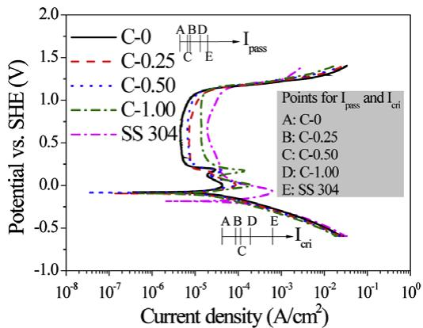  
Fig. 1. Polarization diagrams for alloys C-x and SS 304 at 25 -C.

Polarization diagram parameters of alloys C-x and SS 304 at 25 -C.
<table><tr><td>Alloys C-x and SS 304</td><td> $E _ { \mathrm { c o r r } }$   $( \mathsf { V } _ { \mathsf { S H E } } )$ </td><td> $I _ { \mathrm { c o r r } }$   $( \mu \mathrm { A } / \mathrm { c m } ^ { 2 } )$ </td><td> $E _ { \mathbf { p } \mathbf { p } }$   $( \dot { \mathsf { V } } _ { \mathrm { S H E } } )$ </td><td> $I _ { \mathrm { c r i t } }$   $( \mu \mathrm { A } / \mathrm { c m } ^ { 2 } )$ </td><td> $I _ { \mathrm { p a s s } }$   $( \dot { \mu } \mathsf { A } / \epsilon \mathrm { m } ^ { 2 } )$ </td></tr><tr><td>C-0</td><td>-0.081</td><td>15.8</td><td>0.002</td><td>42.8</td><td>4.5</td></tr><tr><td>C-0.25</td><td>-0.095</td><td>16.7</td><td>0.008</td><td>87.4</td><td>7.1</td></tr><tr><td>C-0.50</td><td>-0.084</td><td>13.4</td><td>0.017</td><td>117.2</td><td>6.4</td></tr><tr><td>C-1.00</td><td>-0.094</td><td>13.1</td><td>0.010</td><td>198.0</td><td>13.9</td></tr><tr><td>SS 304</td><td>-0.185</td><td>45.3</td><td>-0.071</td><td>603.0</td><td>19.1</td></tr></table>

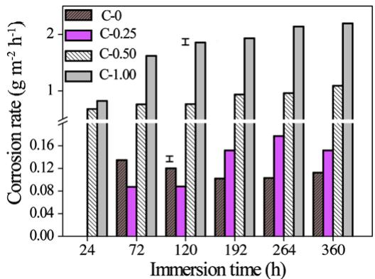  
Fig. 2. Diagram showing change in corrosion rate $( \mathrm { g } \mathrm { m } ^ { - 2 } \mathrm { h } ^ { - 1 } )$ in the 15-day-dipping and weight loss measurement for alloys C-x.

Fig. 1 shows polarization diagrams for the $\mathsf { A l } _ { x } \mathsf { C o C r F e N i }$ alloys and SS 304. The alloys have better overall general corrosion behaviour, with a larger $E _ { \mathrm { c o r r } }$ and smaller $I _ { \mathrm { c o r r } } , I _ { \mathrm { c r i } } ,$ and $I _ { \mathrm { p a s s } }$ than SS 304.

## 3.2. Effect of temperature on potentiodynamic polarization

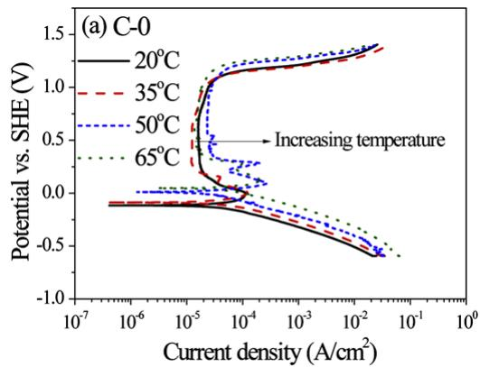

Fig. 3 shows polarization diagrams of $\mathsf { A l } _ { x } ( $ CoCrFeNi alloys at various temperatures. A rising temperature decreased the Tafel slopes of anode (Table 3), increased $I _ { \mathrm { c o r r } } ,$ and increased $E _ { \mathrm { c o r r } }$ and $E _ { \mathrm { t } }$ (the transpassive potential) slightly. The corrosion rate is directly related to $I _ { \mathrm { c o r r } } ,$ according to Arrhenius equation, $I _ { \mathrm { c o r r } } = A e x p ( - E _ { \mathrm { a } } / R T )$ [9,21], where the pre-exponential factor A is generally independent of temperature and is a constant of alloys, where R denotes the gas constant, T denotes temperature, and $E _ { \mathrm { a } }$ denotes activation energy for corrosion. In the case of small experimental temperature range, $E _ { \mathrm { a } }$ is assumed to be independent of $T .$ Consequently, $E _ { \mathrm { a } }$ can be obtained from $\ln ( I _ { \mathrm { c o r r } } )$ vs. $1 / T$ plot. Fig. 4 shows such plots for the alloys and SS 304, indicating that $E _ { \mathrm { a } }$ increases with x. This finding suggests that the corrosion rate is more sensitive to temperature for a larger Al content than for a smaller Al content. The $\ln ( I _ { \mathrm { c o r r } } )$ vs. $1 / T$ curves intersect with each other in a range of $2 3 { - } 2 7 ^ { \circ } C .$ Beyond this temperature range, $I _ { \mathrm { c o r r } }$ increases with x. The situation is reversed at temperatures lower than $2 3 ^ { \circ } \mathrm { C } ,$ which is inconsistent with a situation in which $E _ { \mathrm { a } } s$ for all alloys increase with x from

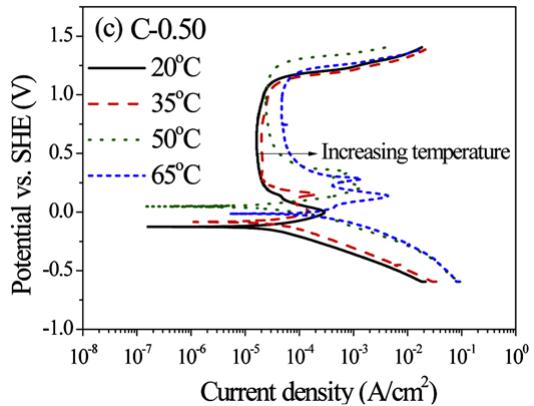

Table 3  
Fit data for Tafel slopes of alloys C-x in 20–65 -C.
<table><tr><td rowspan="3">Alloys C-x</td><td colspan="2"> $2 0 ^ { \circ } C$ </td><td colspan="2"> $3 5 ~ ^ { \circ } \mathrm { C }$ </td><td colspan="2"> $5 0 ^ { \circ } C$ </td><td colspan="2"> $6 5 ~ ^ { \circ } C$ </td></tr><tr><td> $\beta _ { \bf a } ^ { \mathrm { ~ a ~ } }$ </td><td> $\beta _ { \mathrm { c } } ^ { \textup { b } }$ </td><td> $\beta _ { \mathbf { a } }$  </td><td> $\beta _ { \mathrm { c } }$  </td><td> $\beta _ { \mathbf { a } }$  </td><td> $\beta _ { \mathsf { C } }$  </td><td> $\beta _ { \mathbf { a } }$  </td><td> $\beta _ { \mathsf { c } }$  </td></tr><tr><td>C-0</td><td>158</td><td>-218</td><td>128</td><td>-158</td><td>134</td><td>-162</td><td>89</td><td>-158</td></tr><tr><td>C-0.25</td><td>158</td><td>-178</td><td>103</td><td>-167</td><td>89</td><td>-168</td><td>92</td><td>-149</td></tr><tr><td>C-0.50</td><td>94</td><td>-158</td><td>113</td><td>-178</td><td>138</td><td>-159</td><td>89</td><td>-198</td></tr><tr><td>C-1.00</td><td>104</td><td>-148</td><td>93</td><td>-173</td><td>98</td><td>-242</td><td>100</td><td>-220</td></tr></table>

a Anodic Tafel slope $\beta _ { \mathfrak { a } }$ in mV/decade, the measured Tafel regions are with 40– 50 mV of overvoltage.  
b Cathodic Tafel slope bc in mV/decade, the measured Tafel regions are with 150– 170 mV of overvoltage.

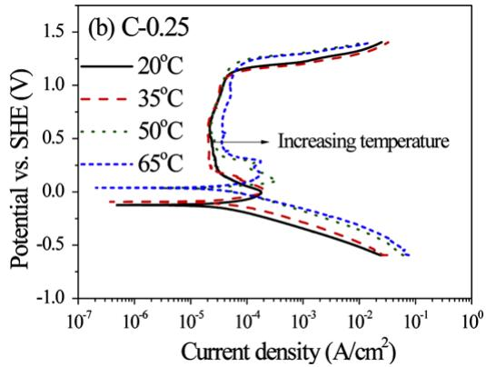

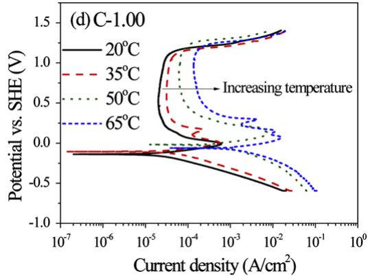  
Fig. 3. Polarization diagrams for (a) C-0, (b) C-0.25, (c) C-0.50, and (d) C-1.00 at various temperatures.

Table 4  
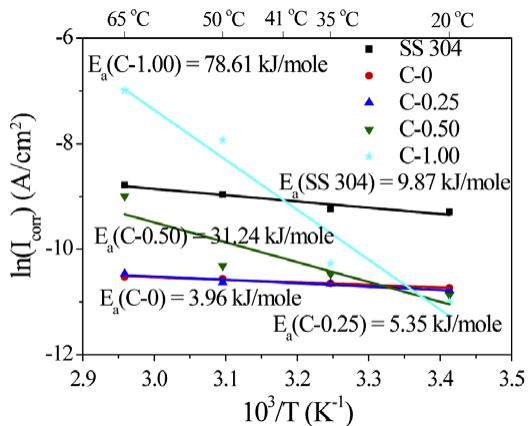  
Fig. 4. The Arrhenius plots for alloys C-x and SS 304 at 20– $. 6 5 ^ { \circ } \mathsf { C } .$

20 to $6 5 ^ { \circ } \mathsf { C } .$ . Hence, $E _ { \mathrm { a } } , \mathrm { i } . e .$ , an intrinsic property of metal, and A, i.e., a surface property of metal, are determinative factors of $I _ { \mathrm { c o r r } } .$ While E depends only on x, A depends on both x and temperature (Table 4). Therefore, although $E _ { \mathrm { a } }$ increases with x, A also increases with x. Combining the effects of $E _ { \mathrm { a } }$ and A explains the different corrosion behaviours of the alloys with an increasing x at temperatures exceeding $2 7 ^ { \circ } \mathsf C$ and lower than $2 3 ^ { \circ } \mathsf C$ . Thus, the performance of passive films, when Al is added, at higher temperatures becomes inferior to that without addition of Al. In determining $I _ { \mathrm { c o r r } } ,$ A is more important than $E _ { \mathrm { a } }$ at temperatures exceeding $2 7 ^ { \circ } \mathrm { C } ,$ while $E _ { \mathrm { a } }$ is more important than A at temperatures lower than 23 -C.

## 3.3. EIS test at 25 -C

Figs. 5 and 6 summarize the EIS results of alloys in a sulfuric solution and their schematic equivalent circuit diagrams, respectively. Table 3 lists related parameters of the equivalent circuit diagrams, where $R _ { s } , \ R _ { \mathrm { f } } ,$ and $R _ { \mathrm { c t } }$ denote impedances of the sulfuric solution, oxide layer, and adsorption layer, $Q _ { \mathrm { f } }$ and $Q _ { \mathrm { a d } }$ denote capacitances of constant phase element (CPE) for oxide layer and adsorption layer, and $L _ { \mathrm { a d } }$ denotes the inductance of the adsorption layer, respectively. Next, the oxide layer thickness is evaluated by using the Helmholtz model [22] and expressing the layer thickness of the oxide layer, d, as $d = \varepsilon \varepsilon _ { 0 } S / Q _ { \mathrm { f } }$ , where $\scriptstyle { \varepsilon _ { 0 } }$ denotes the permittivity of free space $( 8 . 8 5 \times 1 0 ^ { - 1 4 } \mathrm { F / c m ) }$ , e denotes the dielectric constant of the medium, and S denotes the surface area of the electrode. Assuming that e and S for all oxide layers of alloys are the same allows us to compare relative values of d for all samples by $1 / Q _ { \mathrm { f } } .$ Fig. 7 reveals that $1 / Q _ { \mathrm { f } }$ values are proportional to x, implying that d increases with Al content x. However, according to this figure, the impedance of oxide layer $R _ { \mathrm { f } }$ decreases with x and, in Fig. 8, the impedance of the oxide layer is inversely proportional to $I _ { \mathrm { p a s s } } .$ . Restated, a thinner oxide layer implies a larger value of impedance. To explain this phenomenon, besides the thickness of oxide layer, the density of oxide layer is also considered. As mentioned in Section 3.1, Al oxide easily forms a porous film on the metal surface [19]. Therefore, it is easily understood that in addition to causing a thicker oxide layer, Al element promotes the dispersive oxide layer. Combining these two effects obviously reveals that $R _ { \mathrm { f } }$ decreases with x.

The fits for A(x, T) and $E _ { a } ( x )$ in $I _ { \mathrm { c o r r } } ( x , T ) = A ( x , T ) \exp ( - E _ { \mathrm { a } } ( x ) / R T ) .$  
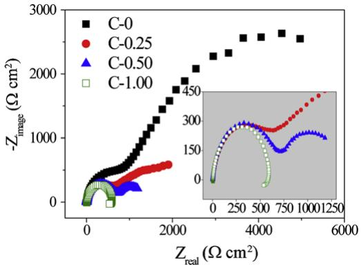  
Fig. 5. The Nyquist plots for alloys C-x at $2 5 ^ { \circ } \mathrm { C } .$

Fig. 6. EIS equivalent circuits (a) for alloys C-0, C-0.25, and C-0.50, and (b) for alloy C-1.00.  
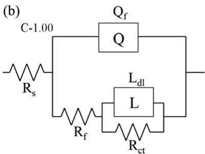

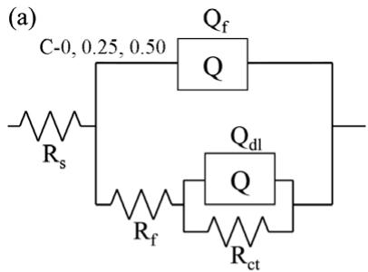

According to Fig. 6, only C-1.00 reveals a component of inductance in the equivalent circuit. In previous studies [23–26], alloys with Al and Ni readily react with $\mathrm { ( O H ) ^ { - } }$ and $( \mathsf { S O } _ { 4 } ) ^ { 2 - }$ in a sulfuric solution and adsorbed on the surface of the alloys, which increases the amount of the ions in the adsorption layer. Therefore, $Q _ { \mathrm { a d } }$ increases with $x ,$ as listed in Table 5. As x value increases to 1.00, the inductance appears in the equivalent circuit in Fig. 6(b). This effect normally occurs in the case of a severe corrosive condition [27]. Origin of the inductance can generally be influenced by some adsorbed intermediates or can be attributed to a space at the interfaces [28]. In C-1.00 with an Al and Ni-rich phase in a microstructure, which is seen as a reactive phase from metallograph, not only causes adsorption in these Al and Ni-rich areas in corrosion process, but also decreases the impedance in the low frequency area owing to their continuous dissolution. The fact that $R _ { \mathrm { c t } }$ decreases with x demonstrates a higher dissolution rate for alloys with a higher Al content.

<table><tr><td rowspan="2">Alloys</td><td colspan="4">A(x, T) (A/cm²)</td><td rowspan="2">Ea (kJ/mol)</td></tr><tr><td> $2 0 ^ { \circ } \mathsf C \left( 2 9 3 \mathrm K \right)$ </td><td> $3 5 ^ { \circ } \mathsf C \left( 3 0 3 \mathrm K \right)$ </td><td> $5 0 ^ { \circ } \mathrm { C } \left( 3 2 3 \mathrm { K } \right)$ </td><td> $6 5 ^ { \circ } \mathsf C \left( 3 3 8 \mathrm K \right)$ </td></tr><tr><td>C-0</td><td> $1 . 1 6 \times 1 0 ^ { - 4 }$ </td><td> $1 . 1 6 \times 1 0 ^ { - 4 }$ </td><td> $1 . 1 6 \times 1 0 ^ { - 4 }$ </td><td> $1 . 0 7 \times 1 0 ^ { - 4 }$ </td><td>3.96</td></tr><tr><td>C-0.25</td><td> $1 . 9 0 \times 1 0 ^ { - 4 }$ </td><td> $2 . 0 3 \times 1 0 ^ { - 4 }$ </td><td> $1 . 7 7 \times 1 0 ^ { - 4 }$ </td><td> $1 . 9 0 \times 1 0 ^ { - 4 }$ </td><td>5.35</td></tr><tr><td>C-0.50</td><td>7.17</td><td>5.64</td><td>3.70</td><td>8.41</td><td>31.24</td></tr><tr><td>C-1.00</td><td> $1 . 7 8 \times 1 0 ^ { 9 }$ </td><td> $7 . 4 6 \times 1 0 ^ { 8 }$ </td><td> $1 . 8 9 \times 1 0 ^ { 9 }$ </td><td> $1 . 3 1 \times 1 0 ^ { 9 }$ </td><td>78.61</td></tr><tr><td>SS 304</td><td> $1 . 1 8 \times 1 0 ^ { - 4 }$ </td><td> $1 . 2 8 \times 1 0 ^ { - 4 }$ </td><td> $1 . 7 0 \times 1 0 ^ { - 4 }$ </td><td> $2 . 0 7 \times 1 0 ^ { - 4 }$ </td><td>9.87</td></tr></table>

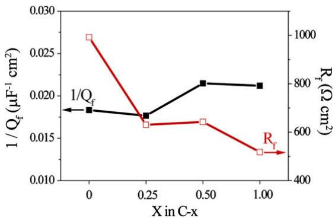  
Fig. 7. Impedance and relative thickness (1/Q ) of oxide layer vs. Al content x plots

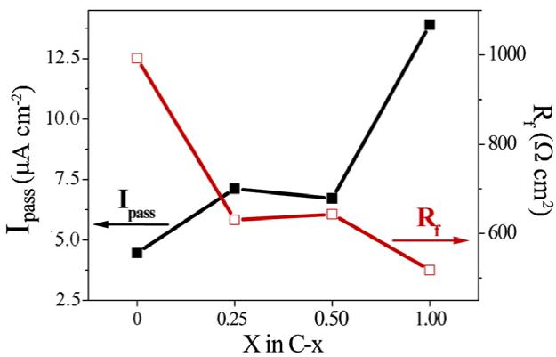  
Fig. 8. Impedance and $I _ { \mathsf { p a s s } }$ of oxide layer vs. Al content x plots.

3.4. Polarization behaviour for alloys in a chloride-containing $H _ { 2 } S O _ { 4 }$ solution

Fig. 9 shows polarization diagrams for the alloys in 0.5 M $\mathrm { H } _ { 2 } S 0 _ { 4 }$ solution containing various concentrations of chloride ions, as well as in simple 0.5 M $\mathrm { H } _ { 2 } S 0 _ { 4 }$ solution as a comparison. According to Fig. 9(a), oscillation occurs in a passive region for C-0 in 0.5 M $\mathrm { H } _ { 2 } S 0 _ { 4 }$ containing 0.5 and 1 M of chloride. This phenomenon has been attributed to the cycling process for small pitting and re-passivation with the duration of several seconds for each cycle [29]. Oscillation in the passive region in potentiodynamic polarization curve is a metastable state [30]. This metastable state generally reflects the difficulty of pitting, i.e., alloy C-0 has good anti-pitting ability, while those containing aluminum (C-0.25, C-0.50, and C-1.00) with no metastable state show an inferior anti-pitting ability (Fig. 9(b)–(d)).

From an adsorption viewpoint, adsorption competition always prevails on the alloy surface between chloride ions and dissolved oxygen atoms. Notably, no oxide layer forms once chloride ions adsorb on the alloy surface, in which the metal ions readily dissolve. Therefore, the adsorption of chloride ions increases the reacting current density (as indicated by a comparison of Figs. 1 and 9), subsequently increasing the rate of metal dissolution.

Rapid dissolution of alloys in chloride-containing solution is discussed next. When chloride ions are adsorbed on the interface of passive layer and a sulfuric solution, metastable ion complexes gradually form from the anions of a passive layer. These metastable ion complexes enable the anions to dissolve. Once the ion complexes on the passive layer/solution interface dissolve into the sulfuric solution, the inner ion complexes of the passive layer move to the passive layer/solution interface in order to correlate with the applied potential. The inability of the anions to form oxide implies the continuous formation of metastable ion complexes and dissolution of ions. Since Al easily forms $[ \mathsf { A l } ( \mathsf { S O } _ { 4 } ) ] ^ { + }$ with $( \mathsf { S O } _ { 4 } ) ^ { 2 - }$ , and $\mathsf { A l } ( \mathsf { O H } ) \mathsf { S O } _ { 4 }$ with $( \mathsf { S O } _ { 4 } ) ^ { 2 - }$ and (OH), respectively [31], these metastable ion complexes combine with Cl and dissolve afterwards. Therefore, pitting easily occurs on the surface of aluminum alloys. Next, the aluminiferous passive layer and non-aluminiferous passive layer are compared. Fig. 10 shows the pitting potential $( E _ { \mathrm { p i t } } )$ of the alloys and SS 304 in different solutions. The value of $E _ { \mathrm { p i t } }$ for C-0 is almost independent of chloride concentration. The value of $E _ { \mathrm { p i t } }$ for C-0.25 decreases abruptly for a chloride concentration exceeding 0.50 M. This value is close to that of SS 304. The values of $E _ { \mathrm { p i t } }$ for C-0.25, C-0.50, and C-1.00 decrease to $0 . 2 – 0 . 5 \mathrm { V } _ { \mathrm { S H E } }$ at a chloride concentration of 0.25 M (Fig. 10). A higher Al concentration in the alloys implies a lower value of $E _ { \mathrm { p i t } } .$ For C-0, deterioration of the passive layer is attributed to the evolution of oxygen. Meanwhile, for C-0.25, C-0.50, and C-1.00, the deterioration of passive layer is attributed to the pitting process. An increasing chloride ion concentration causes the chloride ions to cluster at the defect sites of the passive layer and severely attack the passive layer. Consequently, $E _ { \mathrm { p i t } }$ shifts to a more active region.

## 3.5. Metallographic examination and EDS analysis

Microstructures for not H SO -immersed alloys C-0, C-0.25, C-0.50, and C-1.00 are with single FCC, single FCC, duplex FCC–BCC, and BCC-ordered BCC phases, respectively [6]. Table 6 lists the EDS composition for each phase in different alloys.

Fig. 11(a) and (b) show the microstructure of C-0 before and after 3-day immersion in 0.5 M $\mathrm { H } _ { 2 } S O _ { 4 } ,$ respectively. Fig. 11(c) and (d) show the microstructure of C-0.25 before and after 3-day immersion in 0.5 M $\mathrm { H } _ { 2 } S O _ { 4 } ,$ respectively. General corrosion occurs for both C-0 and ${ \sf C } { \sf - } 0 . 2 5$ , as revealed by EDS analyses (see the bold values shown in Table 6).

Fig. 12(a) and (b) show the microstructure of C-0.50 before and after 3-day immersion in 0.5 M $\mathrm { H } _ { 2 } S O _ { 4 } ,$ respectively. According to these figures, after immersion the FCC phase remains smooth while the BCC phase shows a rough morphology. Fig. 12(c) shows a line-scanned area across the FCC and BCC phases for an immersed sample. Fig. 12(d) summarizes the line-scanned results, indicating that the BCC phase of C-0.50 before immersion is rich in Al and Ni. However, after immersion, it is poor in Al and Ni and rich in Cr.

EIS equivalent circuit parameters for alloys C-x.
<table><tr><td>Alloys C-x</td><td>Rs (Ωcm²)</td><td> $Q _ { \mathrm { f } } ( \mu \mathrm { F } / \mathrm { c m } ^ { 2 } )$ </td><td>nf</td><td> $R _ { \mathrm { f } } \left( \Omega \mathrm { c m } ^ { 2 } \right)$ </td><td> $Q _ { \mathrm { a d } } ( \mu \mathrm { F } / \mathrm { c m } ^ { 2 } )$ </td><td> $n _ { \mathrm { a d } }$ </td><td> $R _ { \mathrm { c t } } \left( \Omega \mathrm { c m } ^ { 2 } \right)$ </td></tr><tr><td>C-0</td><td>3.271</td><td>54.57</td><td>0.9094</td><td>992.2</td><td>636.7</td><td>0.7444</td><td>7691</td></tr><tr><td>C-0.25</td><td>3.758</td><td>56.61</td><td>0.9081</td><td>610.5</td><td>1525</td><td>0.6347</td><td>1932</td></tr><tr><td>C-0.50</td><td>2.994</td><td>46.55</td><td>0.9223</td><td>642.8</td><td>3221</td><td>0.6454</td><td>819.1</td></tr><tr><td>C-1.00</td><td>3.462</td><td>47.16</td><td>0.9614</td><td>518.1</td><td> $1 2 2 . 4 ( \mathrm { H } ) ^ { \mathrm { a } }$ </td><td></td><td>66.81</td></tr></table>

a Lad = 122.4 Henry.

Current density (A/cm²)  
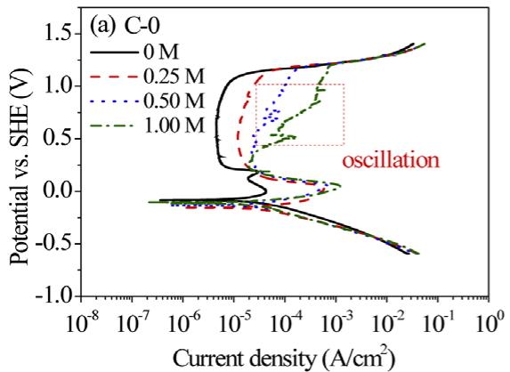

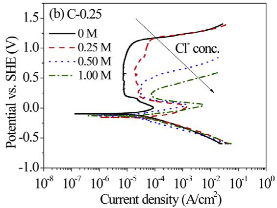

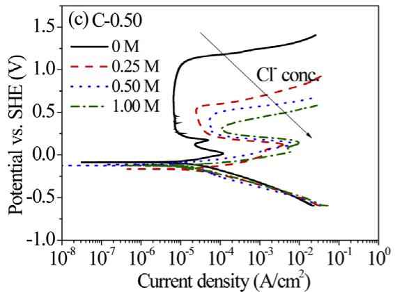

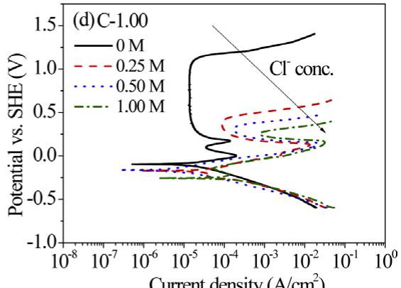  
Fig. 9. Polarization diagrams for (a) C-0, (b) C-0.25, (c) C-0.50, and (d) C-1.00 at 25 -C in chloride-containing sulfuric acid solution at various Cl molarity (M) values.

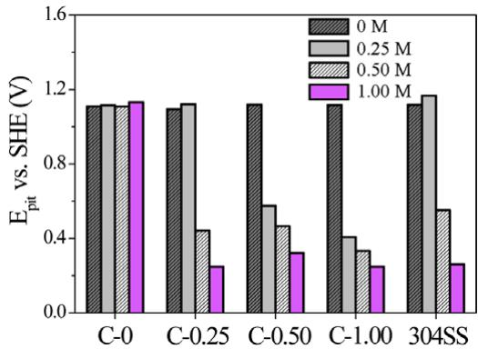  
Fig. 10. Histogram of $E _ { \mathrm { p i t } }$ for alloys C-x and SS 304 in solution of different Cl ion molarity (M).

Fig. 13 shows the microstructure and line-scan analysis of C-1.00 before and after immersion. Before immersion, BCC and ordered BCC phases cannot be resolved from the microstructure. The composition of BCC phase after alloy immersion is close to the overall alloy composition before immersion, indicating that the BCC phase is a corrosion–resistant phase. Moreover, the change in overall composition after immersion is attributed to the selective dissolution of Al and Ni in the ordered BCC phase of this alloy (see the bold values shown in Table 6).

Table 6  
EDS analyses (at. %) for alloys C-0, C-0.25, C-0.50, and C-1.00.
<table><tr><td>Alloys</td><td>Phases and states</td><td>Al</td><td>Co</td><td>Cr</td><td>Fe</td><td>Ni</td></tr><tr><td>C-0</td><td>Overall, not immersed</td><td>0</td><td>25.93</td><td>25.73</td><td>24.21</td><td>24.13</td></tr><tr><td></td><td>Overall, immersed</td><td>0</td><td>24.45</td><td>26.39</td><td>24.83</td><td>24.32</td></tr><tr><td>C-0.25</td><td>Overall, not immersed</td><td>6.16</td><td>23.27</td><td>23.58</td><td>23.59</td><td>23.40</td></tr><tr><td></td><td>Overall, immersed</td><td>6.18</td><td>23.65</td><td>24.41</td><td>23.04</td><td>22.71</td></tr><tr><td>C-0.50</td><td>Overall, not immersed</td><td>11.01</td><td>22.77</td><td>22.61</td><td>21.70</td><td>21.92</td></tr><tr><td></td><td>FCC matrix, not immersed</td><td>8.36</td><td>24.74</td><td>23.48</td><td>22.77</td><td>20.65</td></tr><tr><td></td><td>BCC, not immersed</td><td>13.94</td><td>21.11</td><td>20.48</td><td>20.53</td><td>23.94</td></tr><tr><td></td><td>Overall, immersed</td><td>8.35</td><td>22.75</td><td>27.19</td><td>23.60</td><td>18.11</td></tr><tr><td></td><td>FCC matrix, immersed</td><td>9.96</td><td>22.57</td><td>23.16</td><td>23.59</td><td>20.72</td></tr><tr><td></td><td>Wall-shaped BCC, immersed</td><td>3.82</td><td>22.50</td><td>36.33</td><td>25.58</td><td>11.77</td></tr><tr><td>C-1.00</td><td>Overall, not immersed</td><td>18.88</td><td>20.55</td><td>20.63</td><td>20.01</td><td>19.93</td></tr><tr><td></td><td>Overall, immersed</td><td>12.45</td><td>19.80</td><td>29.87</td><td>23.42</td><td>14.45</td></tr><tr><td></td><td>BCC, immersed</td><td>17.14</td><td>20.67</td><td>21.96</td><td>20.89</td><td>19.34</td></tr><tr><td></td><td>Ordered BCC, immersed</td><td>3.04</td><td>17.34</td><td>47.53</td><td>27.96</td><td>4.14</td></tr></table>

This selective corrosion in Al and Ni-rich phase in C-0.50 and C-1.00, which results in the corrosion attack on Al and Ni, is due to the large bonding in Al and Ni [32]. Alloys containing this bonding readily react with (OH) and $( \ S 0 _ { 4 } ) ^ { 2 \_ }$ to form Al and Ni complexes and dissolve in a sulfuric solution. Accordingly, after immersion, the remaining compound in the less corrosive–resistant Al and Ni-rich phase is an oxide, rich in Cr, in the residual passive film.

## 4. Conclusions

Owing to the spontaneous passivation of Al element in $\mathrm { H } _ { 2 } S O _ { 4 } ,$ the variation of Al reveals a more apparent effect in a passive region rather than in an active one. Therefore, in contrast with $I _ { \mathrm { p a s s } } ,$ which increases with x, no obvious trends occur for $E _ { \mathrm { c o r r } }$ and $I _ { \mathrm { c o r r } }$ vs. x variation. In particular, the weight loss experiment indicates that $I _ { \mathrm { p a s s } }$ is a proper index to evaluate the weight loss of samples since $\mathsf { A l } _ { x } \mathsf { C }$ oCrFeNi alloys are found to have passive behaviour in longterm dipping.

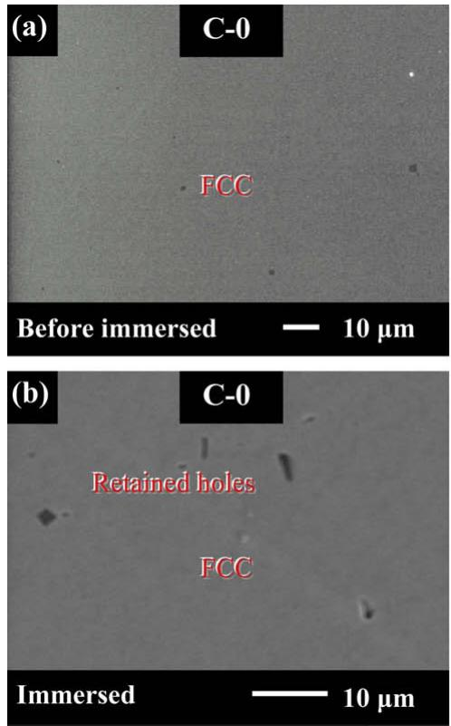

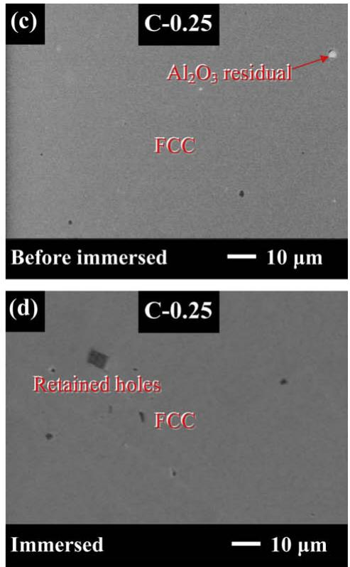  
Fig. 11. Metallograph of alloys C-0 (a and b) and C-0.25 (c and d). (a) and (c), before; and (b) and (d), after immersion. Retained holes were from cast procedure, and $\mathsf { A l } _ { 2 } \mathsf { O } _ { 3 }$ residuals were from polishing procedure.

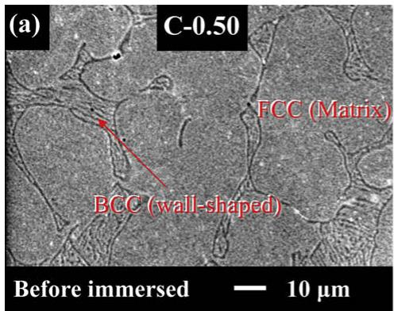

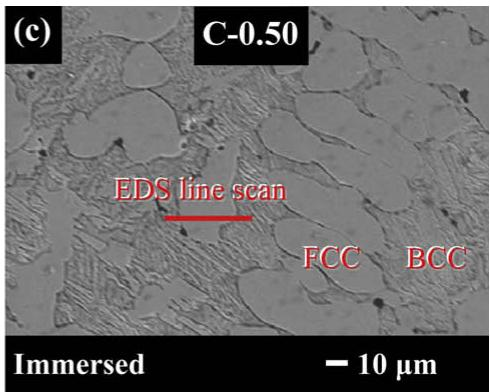

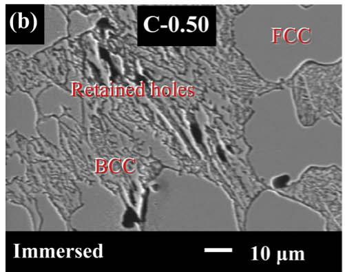

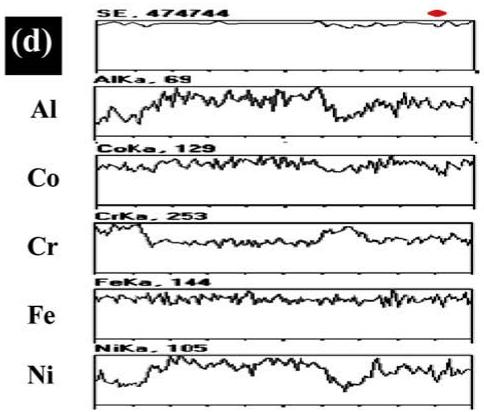  
Fig. 12. Metallograph of alloy C-0.50. (a), before; (b) and (c), after immersion; and (d), EDS line-scan results of the location indicated in (c). Retained holes were from cast procedure.

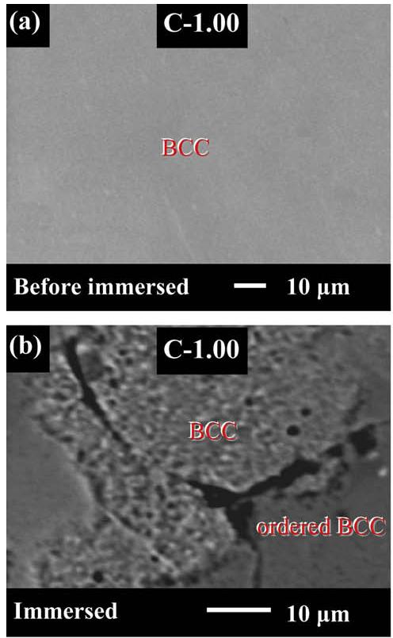

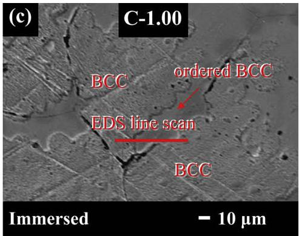

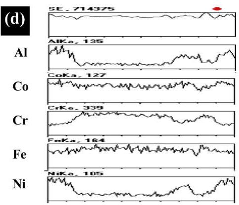  
Fig. 13. Metallograph of alloy C-1.00. (a), before; (b) and (c), after immersion; and (d), EDS line-scan results of the location indicated in (c).

EIS results indicate that the passive films of $\textstyle \operatorname { A l } _ { x } ($ CoCrFeNi alloys become increasingly thicker and more dispersive with an increasing x. Therefore, $I _ { \mathsf { p a s s } }$ increases with x. As x value increases to 1.00, the inductance effect appears in the equivalent circuit for severe dissolution of Al and Ni-rich phase. As for the effect of chloride on the anti-corrosion property, chloride eases the passive layer to form metastable ion complexes and further dissolve into $\mathrm { H } _ { 2 } S 0 _ { 4 } .$ With an increasing chloride concentration and Al content, the metastable ion complexes easily form, allowing $E _ { \mathrm { p i t } }$ to shift to a more active region. Additionally, the microstructure of both C-0 and C-0.25 is single FCC phase, while those of C-0.50 and C-1.00 are duplex FCC–BCC and complex BCC-ordered BCC phase, respectively. In C-0.50 and C-1.00, the secondary passivation phenomenon in polarization curve results from selective dissolution of the Al and Ni-rich phase.

Moreover, $I _ { \mathrm { c o r I } }$ increases with x at higher temperatures $( > 2 7 ^ { \circ } \mathsf { C } )$ while $I _ { \mathrm { c o r r } }$ decreases with x at lower ones (<23 -C). More closely examining Arrhenius plots of $I _ { \mathrm { c o r r } }$ reveals that both pre-exponential factor A and activation energy $E _ { \mathrm { a } }$ increase with Al content. However, A affects $I _ { \mathrm { c o r r } }$ more significantly than it does so for $E _ { \mathrm { a } }$ at higher temperatures $( > 2 7 ^ { \circ } \mathsf { C } )$ and, conversely, at lower temperatures $( < 2 3 ^ { \circ } \mathsf { C } )$

## Acknowledgements

The authors would like to thank the National Science Council of the Republic of China, Taiwan (Contract No. NSC96-2221-E007- 066-MY3) and the CSC Group Education Foundation of China Steel Corporation for financially supporting this research. Ted Knoy is appreciated for his editorial assistance. Professor Tung Hsu is acknowledged for his aid in English of this paper.

## References

[1] J.W. Yeh, S.K. Chen, S.J. Lin, J.Y. Gan, T.S. Chin, T.T. Shun, C.H. Tsau, S.Y. Chang, Nanostructured high-entropy alloys with multiple principal elements: novel alloy design concepts and outcomes, Adv. Eng. Mater. 6 (2004) 299–303.

[2] P.K. Huang, J.W. Yeh, T.T. Shun, S.K. Chen, Multi-principal-element alloys with improved oxidation and wear resistance for thermal spray coating, Adv. Eng. Mater. 6 (2004) 74–78.

[3] C.Y. Hsu, J.W. Yeh, S.K. Chen, T.T. Shun, Wear resistance and high-temperature compression strength of FCC CuCoNiCrAl Fe alloy with boron addition, Metall. Mater. Trans. A 35A (2004) 1465–1469.

[4] J. Tong, S.K. Chen, J.W. Yeh, T.T. Shun, C.H. Tsau, S.J. Lin, S.Y. Chang, Mechanical performance of the Al CoCrCuFeNi high-entropy alloy system with multiprincipal elements, Metall. Mater. Trans. A 36A (2005) 1263–1271.

[5] J.W. Yeh, S.K. Chen, J.Y. Gan, S.J. Lin, T.S. Chin, T.T. Shun, C.H. Tsau, S.Y. Chang, Formation of simple crystal structures in Cu–Co–Ni–Cr–Al–Fe–Ti–V alloys with multiprincipal metallic elements, Metall. Mater. Trans. A 35A (2004) 2533–2536.

[6] Y.F. Kao, T.J. Chen, S.K. Chen, J.W. Yeh, Microstructure and mechanical property of as-cast, -homogenized, -deformed Al CoCrFeNi $( 0 \leqslant \mathbf { X } \leqslant 2 )$ high-entropy alloys, J. Alloys Compd. (2009), doi:10.1016/j.jallcom.2009.08.090.

[7] H.P. Chou, Y.S. Chang, S.K. Chen, J.W. Yeh, Microstructure, thermophysical and electrical properties in Al CoCrFeNi (0 6 - 6 2) high-entropy alloys, Mater. Sci. Eng. B 163 (2009) 184–189.

[8] Y.Y. Chen, T. Duval, U.D. Hung, J.W. Yeh, H.C. Shih, Microstructure and electrochemical properties of high entropy alloys—a comparison with type-304 stainless steel, Corros. Sci. 47 (2005) 2257–2279.

[9] Y.Y. Chen, U.T. Hong, H.C. Shih, J.W. Yeh, T. Duval, Electrochemical kinetics of the high entropy alloys in aqueous environments—a comparison with type 304 stainless steel, Corros. Sci. 47 (2005) 2679–2699.

[10] C.P. Lee, C.C. Chang, Y.Y. Chen, J.W. Yeh, H.C. Shih, Effect of the aluminium content of Al CrFe MnNi high-entropy alloys on the corrosion behaviour in aqueous environments, Corros. Sci. 50 (2008) 2053–2060.

[11] C.P. Lee, Y.Y. Chen, C.Y. Hsu, J.W. Yeh, H.C. Shih, Enhancing pitting corrosion resistance of Al CrFe MnNi high-entropy alloys by anodic treatment in sulfuric acid, Thin Solid Films 517 (2008) 1301–1305.

[12] C.P. Lee, Y.Y. Chen, C.Y. Hsu, J.W. Yeh, H.C. Shih, The effect of boron on the corrosion resistance of the high-entropy alloys Al CoCrCuFeNiB , J. Electrochem. Soc. 154 (2007) C424–C430.

[13] V. Ashworth, P.J. Boden, Potential–pH diagrams at elevated temperatures, Corros. Sci. 10 (1970) 709–718.

[14] Y.Y. Chen, L.B. Chou, L.H. Wang, J.C. Oung, H.C. Shih, Electrochemical polarization and stress corrosion cracking of alloy 690 in 5-M chloride solutions at 25 -C, Corrosion 61 (2005) 3–11.

[15] M. Femenia, J. Pan, C. Laygraf, In situ local dissolution of duplex stainless steels in 1 M H2SO4 + 1 M NaCl by electrochemical scanning tunneling microscopy, J. Electrochem. Soc. 149 (2002) B187–B197.

[16] I.H. Lo, W.T. Tsai, Effect of selective dissolution on fatigue crack initiation in 2205 duplex stainless steel, Corros. Sci. 49 (2007) 1847–1861.

[17] F.D. Bogar, M.H. Peterson, A comparison of actual and estimated long-term corrosion rate of mild steel in seawater, Laboratory Corrosion Test and Standards, ASTM STP 866 (1985) 197–206.

[18] P. Marcus, Corrosion Mechanisms in Theory and Practice, second ed., Marcel Dekker, New York, 2002.

[19] V. Shankar Rao, V.S. Raja, Anodic polarization and surface composition of Fe– 16Al–0.14C alloy in 0.25 M sulfuric acid, Corrosion 59 (2003) 575–583.

[21] G.K. Gomma, Corrosion of low-carbon steel in sulphuric acid solution in presence of pyrazole–halides mixture, Mater. Chem. Phys. 55 (1998) 241– 246.

[20] L. Young, Anodic Oxide Films, first ed., Academic Press, London, 1961.

[22] C.F. Zinola, A.M. Castro Luna, The inhibition of Ni corrosion in H SO solutions containing simple non-saturated substances, Corros. Sci. 37 (1995) 1919– 1929.

[23] M.R.F. Hurtado, P.T.A. Sumodjo, A.V. Benedetti, Electrochemical studies with a Cu–5 wt.%Ni alloy in 0.5 M H SO , Electrochim. Acta 48 (2003) 2791–2798.

[24] F. M Reis, H.G. de Melo, I. Costa, EIS investigation on Al 5052 alloy surface preparation for self-assembling monolayer, Electrochim. Acta 51 (2006) 1780– 1788.

[25] T.M. Yue, L.J. Yan, C.P. Chan, C.F. Dong, H.C. Man, G.K.H. Pang, Excimer laser surface treatment of aluminum alloy AA7075 to improve corrosion resistance, Surf. Coat. Technol. 179 (2004) 158–164.

[26] I. Epelboin, C. Gabrielle, M. Keddam, H. Takenouti, Achievements and tasks of electrochemical engineering, Electrochim. Acta 22 (1975) 913– 920.

[27] M. Metikoš-Hukovic´, R. Babic´, S. Brinic´, EIS-in situ characterization of anodic films on antimony and lead–antimony alloys, J. Power Sources 157 (2006) 563–570.

[28] A.R. Trueman, Determining the probability of stable pit initiation on aluminium alloys using potentiostatic electrochemical measurements, Corros. Sci. 47 (2005) 2240–2256.

[29] Y.M. Tang, Y. Zuo, X.H. Zhao, The metastable pitting behaviours of mild steel in bicarbonate and nitrite solutions containing Cl, Corros. Sci. 50 (2008) 989– 994.

[30] R.T. Foley, T.H. Nguyen, The chemical nature of aluminum corrosion, J. Electrochem. Soc. 129 (1982) 464–467.

[31] S. Van Gils, C.A. Melendres, H. Terryn, E. Stijns, Use of in-situ spectroscopic ellipsometry to study aluminium/oxide surface modifications in chloride and sulfuric solutions, Thin Solid Films 455 (2004) 742–746.

[32] H. Nakazawa, H. Sato, Bacterial leaching of cobalt-rich ferromanganese crusts, Int. J. Miner. Process. 43 (1995) 255–265.