# Homogenization of $\operatorname { A l } _ { \mathit { x } } \operatorname { C o C r F e N i }$ high-entropy alloys with improved corrosion resistance

Yunzhu Shia,b, Liam Collinsc, Rui Fengb, Chuan Zhangd, Nina Balkec, Peter K. Liawb,⁎, Bin Yanga,⁎

a Collaborative Innovation Center of Steel Technology, University of Science and Technology Beijing, Beijing 100083, China

b Department of Materials Science and Engineering, The University of Tennessee, Knoxville, TN 37996, USA

c Center for Nanophase Materials Sciences, Oak Ridge National Laboratory, Oak Ridge, TN 37830, USA

d CompuTherm LLC, 8401 Greenway Boulevard, Suite 248, Middleton, WI 53562, USA

## A R T I C L E I N F O

Keywords:   
A. Alloys   
B. AFM   
C. Segregation   
C. Pitting corrosion

## A B S T R A C T

The present work investigates the homogenization efect of 1250 °C heat treatment on the Al CoCrFeNi highentropy alloys (HEAs). The multi-phase microstructures with chemical segregations are inevitable with the increased Al content in the alloys, which cause work function variations and localized corrosion. After heat treatment, the homogenization efect revealed by the microstructure simplification and chemical-segregation reduction leads to the decreased work function variations and the improved corrosion resistance. Thermodynamic calculations that are reliable to predict the phase transformations of the $\mathrm { \sf A l } _ { x } \mathrm { \sf C o C r F e N i ~ H E A s } ,$ indicates a further enhancement in corrosion resistance through annealing could be guided for many other HEAs systems.

## 1. Introduction

To date, most conventional alloy designs have been focused on the addition of alloying elements in low concentrations to one principal element, forming an alloy family, which leads to various performance improvements including the corrosion resistance. For example, by adding Cr, Ni, Mo, and/or Cu etc. into Fe-based alloys, stainless steels have been developed with reliable corrosion resistance [1]. However, due to the limited solid solubility, along with the alloying process, the presence of precipitates negatively impacts the corrosion behavior. In recent years, by breaking the classical alloy design, high-entropy alloys (HEAs) that contain five or more principal elements in equal or nearequal atomic percent (at.%) were developed [2–6]. Because of the high mixing entropy efect [7,8], instead of forming complex microstructures with intermetallic compounds, disordered solid solutions of face-centered cubic (FCC) [4,9], body-centered cubic (BCC) [4,9], or hexagonal closed-pack (HCP) [4,9–12] structures are favored in HEAs. Of particular importance, the high concentration, homogeneous distribution of passivating elements (such as Cr, Ni, and Mo) in the multi-elements solid solution is expected to improve the corrosion resistance [13,14]. Moreover, the already-known exceptional properties [15], such as combined noble strength-ductility $[ 1 6 , 1 7 ] ,$ , improved fatigue resistance [18–20], and high fracture toughness [21,22], highlight a remarkable potential in structural and energy-related applications of HEAs. For instance, as a well-studied HEAs system, Al-Co-Cr-Fe-Ni has attracted tremendous amount of attention to develop new-generation low-density structural materials for automobile and aerospace applications [23].

However, the large value of configurational entropy $( A S _ { \mathrm { m i x } } ^ { \mathrm { c o n f } } )$ of HEA does not always ensure that the random mixing of elements is achievable. According to the Gibbs-free energy,

$$
\varDelta G = \varDelta H - T \varDelta S\tag{1}
$$

where ΔH is the total enthalpy change, and ΔS is the total entropy change [24], the phase stability depends on enthalpy as well. Several HEAs have been shown to possess multiphase with significant elemental segregations [25,26], including the $\mathbf { A l } _ { x } \mathbf { C o C r F e N i }$ HEAs studied in the present work. The aim of the Al addition is to improve the strength and lower the density [23]. However, along with the addition, the induced segregation of elements in the multi-phases would negatively impact the corrosion resistant properties [27,28]. It has been reported that in the as-cast AlCoCrFeNi alloy [29], the (Al, Ni)-rich, Cr-depleted BCC phase sufered from localized corrosion in a 3.5 wt percent (wt.%) NaCl solution, which would be akin to the sensitization of stainless steels [30]. Similarly, in our previous study [31], the increased Al content in the Al CoCrFeNi HEAs caused the increased volume fraction of the (Al, Ni)-rich, Cr-depleted BCC phase, whose passive film was less protective than that of the FCC phase due to the higher amount of Al oxide, thus, degrading the resistance to localized corrosion in a 3.5 wt.% NaCl solution.

To improve/alert properties, heat treatments based on phase diagram are commonly adopted in conventional alloys. Through hightemperature solution treatment, the refined microstructure and homogenized elemental distribution would improve the corrosion resistance [32]. Comparing the HEAs with conventional alloys, the high-temperature solution treatment is anticipated to have more pronounced efect on microstructural and elemental homogenization because of the unique high-entropy efect, which could stabilize the random mixing of elements in single solid-solution, according to Eq. (1), especially at elevated temperature. In order to obtain an in-depth understanding of the entropy efect on homogenization and investigate the multiphase transformation process, the heat treatment of Al CoCrFeNi HEAs at 1250 °C for 1000 h, followed by rapid cooling, is carried out in the present study. The phase transformation process is revealed by microstructure characterization and thermodynamic calculation based on the recently developed thermodynamic database [33–35].

Based on the notion that the surface-electrochemical reactivity and corrosion behavior are influenced by the surface-electronic state [36], the electron work function (WF) that reflects the electronic energy level of the alloy surface is therefore usually related to electrode potentials or corrosion potentials [37].

Schmutz et al. [38] found that the WFs measured in air on a range of pure metals were linearly related to the open-circuit potentials measured in aqueous solutions. As a result, it is suggested that the measured WF demonstrated the relative nobility and possible corrosion tendency of each phase in alloys. Following their work, scanning Kelvin probe force microscopy (SKPFM) [39,40], as an atomic-force-microscopy (AFM) variant developed based on Kelvin probe (KP), has been used to characterize the nobility of the phases in Al alloys, stainless steels, Cu alloys, etc. in air and as such predict the likely localized corrosion behavior in solution [41–43]. However, several studies [44–46] indicate that the measured WFs on freshly polished surface in air should not be interpreted or need to be treated with caution to evaluate the corrosion behavior, since alloying element exhibited diferent performance, i.e., being activated or passivated depends on the environment (pH, kind of ions, etc.) and the involved reactions [47]. In the present study, SKPFM is employed to characterize the WF variations among phases of the freshly polished Al CoCrFeNi HEAs, before and after the heat treatment, with high spatial resolution (nm) aforded by the nanoscopic AFM tip. Based on the argument mentioned above, the relationship between the WFs measured in air and corrosion behavior in 3.5 wt.% NaCl solution of the Al CoCrFeNi alloys are discussed.

In the present study, we elaborate the homogenization efect of heat treatment on the Al CoCrFeNi (atom ratios of Al/(CoCrFeNi) are x/ $( 1 + 1 + 1 + 1 )$ , with $\begin{array} { r } { x = 0 . 3 , 0 . 5 , } \end{array}$ and 0.7, respectively) HEAs though a set of complementary microstructure characterizations and SKPFM mapping. The corrosion resistant properties of Al CoCrFeNi HEAs before and after the heat treatment are compared by potentiodynamic polarization tests. The intimate relationships among microstructure, WF and corrosion behavior are discussed in detail. Moreover, comparisons would be made between the microstructural observations and thermodynamic predictions to clarify the reliability of the phase diagram calculations [4,48].

## 2. Experimental procedures

## 2.1. Materials preparation

The Al CoCrFeNi alloys for the present study were in two conditions: As-forged and as-equilibrated. The atom ratios of Al/(CoCrFeNi) are $x / ( 1 + 1 + 1 + 1 )$ , with $\begin{array} { r } { x = 0 . 3 , \ 0 . 5 , } \end{array}$ , and $0 . 7 ,$ respectively. The cast alloys were prepared by arc-melting a mixture of pure metals (99.99 wt.%) in a water-cooled, copper hearth, using a Large Bell Jar (ABJ-900) arcmelter of Materials Research Furnaces, Inc. The melting processes were conducted in a vacuum of at least 0.01 Torr under a Tigettered argon atmosphere. The ingots were remelted at least four times to ensure homogeneity. For the as-forged samples, before forging, the Al CoCrFeNi rectangular cast ingots were annealed in a mufle furnace (FR-1236, $1 6 0 0 ^ { \circ } \mathrm { C } )$ at $1 2 5 0 ~ ^ { \circ } \mathrm { C }$ for 50 h and water quenched. The annealed ingots were thereafter forged at 1250 °C with the forging reduction of 50% to a finial thickness of about 10 mm, then air cooled. For the as-equilibrated samples, the forged samples were sealed in vacuum tubes and annealed in the mufle furnace at 1250 °C for 1000 h, and subsequently, water quenched.

## 2.2. Microstructural characterization

The phase structures of the Al CoCrFeNi HEAs were detected by high-energy X-ray difraction (HEXRD), conducted at the beamline 11- ID of the Advanced Photon Source (APS), Argonne National Laboratory. A monochromatic X-ray beam with the energy of 115 keV (wavelength of 0.11798 Å) and a beam cross-section of $1 0 0 \times 1 0 0 \mu \mathrm { m } ^ { 2 }$ was employed to study the crystal structures of the as-forged, polycrystalline samples with a size of $4 \times 4 \times 1 \mathrm { m m } ^ { 3 } .$ The microstructures were characterized by using a LEO Gemini 1525 field-emission scanningelectron microscope (SEM, ZEISS SUPRA 55) operated at 20 kV, with the backscattering-electron detector (BSE, K. E. Developments Ltd. Cambridge, UK) equipped. For microstructural observation, the cubic samples with a size of $1 0 \times 1 0 \times 4 \mathrm { m m } ^ { 3 }$ were wet ground with SiC papers up to 2000 grit, then mechanically polished using a 0.5 μm diamond paste. Transmission electron microscopy (TEM) observations were performed using a JEM-2010 (JEOL Ltd., Tokyo, Japan) with an accelerating voltage of 300 kV. For preparing the TEM samples, after thinning the 3 mm diameter discs using the SiC paper to about 30 μm, ion milling was used to obtain the electron-transparency area. The SEM and TEM measurements were combined with the energy dispersive spectrometer (EDS, Oxford Instruments, Abingdon, UK) to measure the elemental distribution. Electron backscattered difraction detector (EBSD, Bruker) installed in the ZEISS Auriga system was operated at 20 kV and analyzed by the TSL OIM Analysis software to determine the crystal type and orientation of individual phases. The sample preparations were same as the SEM samples. Volume fractions of diferent phases in the alloys were estimated from at least five individual areas of SEM and/or EBSD images [49,50]. The area fraction of each phase was obtained by the quantitative image analysis software (Image J). After the electrochemical polarization experiments, the corroded alloys were investigated by SEM again to detect the dissolution morphologies.

## 2.3. SKPFM measurements

SKPFM enables accurate measurements on the micro-/nano-scales of the local contact potential diference $\left( V _ { \mathrm { C P D } } \right)$ between a conductive AFM tip and the sample surface, thus reflecting the WF diferences among various phases. The SKPFM measurements were conducted, using a commercially-available AFM (Cypher, Asylum research) to obtain the $V _ { \mathrm { C P D } }$ maps of the as-forged and as-equilibrated Al CoCrFeNi alloys. The relationship between the detected $V _ { \mathrm { C P D } }$ and WF of the alloy surface is given by,

$$
V _ { \mathrm { C P D } } = ( \phi _ { \mathrm { t i p } } - \phi _ { \mathrm { s a m p l e } } ) / \mathrm { e }\tag{2}
$$

where $\phi _ { \mathrm { t i p } }$ and $\varPhi _ { \mathrm { s a m p l e } }$ are the WFs of the tip and the sample, respectively [51]. The cubic samples with a size of $4 \times 4 \times 2 \mathrm { m m } ^ { 3 }$ for SKPFM measurements were mechanically and successively ground with abrasive papers up to 2000 grit. Then they were mechanically polished, using the diamond paste to 0.5 μm, and vibration polished again by employing the 0.02 μm paste to remove polishing scratches. The SKPFM measurements were conducted in air at room temperature. Measurements were performed with as-received Pt/Ir coated tips (Budget Sensors, DPE) with a nominal resonance frequency and spring constant of 70 kHz and 2.0 N/m, respectively. The topography was recorded in a tapping mode during the first scan, and the tip was lifted up 20 nm in the second scan to obtain the $V _ { \mathrm { C P D } }$ signal. The dual-scan mode could keep the influence of stray capacities, which makes the measured $V _ { \mathrm { C P D } }$ dependent on the distance of the probe to the surface constant [52]. In the SKPFM measurements, an alternating current (AC) voltage was applied (1–3 V at the resonance frequency) on the tip to induce a harmonic oscillation of the cantilever. Then, a direct current (DC) bias feedback loop was used to adjust the voltage applied to the tip such that the electrostatic force between the tip and sample was fully compensated. This bias value at which this nulling point occurs is the $V _ { \mathrm { C P D } } ,$ which can subsequently be mapped from the output of the feedback loop for each spatial location of the image [53]. To determine the averaged WF of each phase, about 4–5 areas containing the objective phases were scanned.

## 2.4. Potentiodynamic polarizations

For the polarization test, the specimens were cut as $1 \times 1 \times 0 . 5 \mathrm { c m } ^ { 3 }$ bulk and cold-mounted in epoxy with copper lines spot welded on to the back for the electrical contact. Prior to each electrochemical experiment, the exposed surface (an area of 1 cm2) of specimens were ground with a series of SiC papers from 200 to 2000 grit number, and then, cleaned with alcohol, acetone, deionized water. The polarization experiments were performed, using the Potentiostat Workstation PARSTAT 2263. Tests were carried out, employing a three-electrode electrochemical cell with a saturated calomel electrode (SCE) as the reference electrode, a platinum sheet as the auxiliary electrode, and specimen as the working electrode. The test solution was a 3.5 wt.% NaCl solution. The electrochemical measurements were performed at room temperature $( 2 0 \pm 2 ^ { \circ } \mathbf { C } )$ . During the experiment, the working electrode was allowed to corrode freely for 30 min to reach a quasistationary value of the open circuit potential (OCP). The potentiodynamic-polarization tests were performed at a scan rate of 100 mV/min from an initial potential of −0.25 V vs. OCP until the current density increases to $1 \mathrm { m A } / \mathrm { c m } ^ { 2 }$

## 2.5. Thermodynamic calculations

The essence of the phenomenological CALculation of PHAse Diagrams (CALPHAD) approach is to obtain self-consistent thermodynamic descriptions (Gibbs-energy functions) of lower-order (binary and ternary) systems by fitting to the known thermodynamic and phase-equilibrium data. The thermodynamic description for higherorder systems was obtained via an extrapolation method, which enables estimates of phase diagrams and thermodynamic properties of multicomponent systems that are experimentally unavailable [48]. Thermodynamic description of the Al-Co-Cr-Fe-Ni system was developed using the CALPHAD approach. The current Al-Co-Cr-Fe-Ni database was obtained via extrapolation from the lower order constituent binary and ternary systems (thermodynamic database supplied by ThermoCalcTM, Theromo-Calc Software, Stockholm, Sweden) at the whole composition range. All calculations throughout this paper were carried out by Pandat30 software (CompuTherm LLC, Madison, WI) [33–35].

## 3. Results

## 3.1. Microstructural characterizations

HEXRD was used to characterize the crystal structures of the asforged Al CoCrFeNi alloys and the difraction patterns are shown in Fig. 1. The perpendicular bars at the bottom are from the Powder Diffraction File of LTO.29, representing the standard difraction patterns of Fe-Ni FCC-solid solution (blue lines), Fe-Cr BCC-solid solution (green lines), and NiAl intermetallic-compound (red lines). It can be seen that the difraction patterns of the as-forged Al CoCrFeNi alloys can be fitted to the above phases with small deviations. The $\mathrm { \mathbf { A l } _ { 0 . 3 } C o C r F e N i }$ alloy possesses a simple FCC structure (A1 phase) with a lattice constant of about 3.656 Å. The larger lattice constant compared to that of the Fe-Ni solid solution (3.597 $\mathring { \mathrm { A } } )$ indicates that the mixture of more elements leads to a larger volume of unit cell. By increasing the Al content, two BCC-based structures appear in $\mathrm { \mathbf { A l _ { 0 . 5 } C o C r F e N i } }$ . One is the disordered BCC solid solution (A2 phase), and the other is an ordered BCC phase (B2 phase) indicated by the (100) and (111) super-lattice peaks, which are exclusive to the B2 phase (similar to the NiAl-intermetallic compound [54]). The high resolution of HEXRD [55] allows the identifi- cation of fairly-close lattice constants for the A2 and B2 phases, which are 2.902 Å and $2 . 9 2 5 \mathring { \mathrm { A } } ,$ respectively, by identifying the (220) diffraction peak. The phase type remains the same when increasing the Al content to $0 . 7 ,$ which contains the A1 and A2/B2 phases. It can be seen that in the $\mathrm { \mathbf { A l } _ { 0 . 5 } C o C r F e N i }$ and $\mathrm { { A l } _ { 0 . 7 } { C o C r F e N i } }$ alloys, the FCC (220), (311), and (222) peaks shift to the lower angles, which might reflect the expansion of the lattice caused by the increased Al content, whose atomic radius is the largest among the 5 constituent elements in the solid solution. Since the interplanar spacing decreases with the increased crystal index, the higher the crystal index, the more obvious the shift.

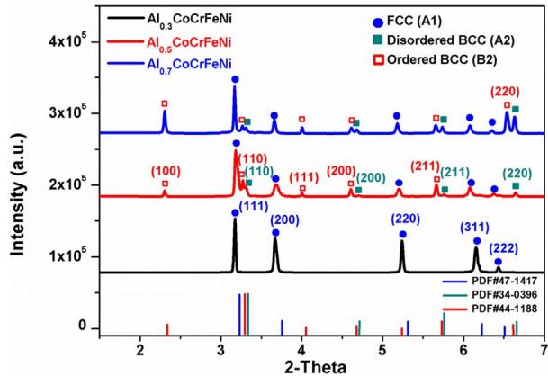  
Fig. 1. High-energy X-ray difraction pattern of the Al CoCrFeNi $( x = 0 . 3 , 0 . 5 ,$ and 0.7) alloys.

The BSE images and EBSD results of the as-forged Al CoCrFeNi alloys with diferent aluminum contents are presented in Fig. 2. The microstructure of the $\mathrm { { A l } _ { 0 . 3 } C o C r F e N i }$ alloy appears as a single A1 phase (Fig. 2(a1) and (a2)), which is in agreement with the HEXRD results. The randomly-oriented equiaxed grains with a size of about 50 μm are clearly recognized by the phase-identification map (with dark lines as grain boundaries) (Fig. 2(a2)) and inverse pole-figure (IPF) (Fig. 2(a3)). Elements are distributed homogeneously in the A1 solid solution, as indicated by the uniform contrast of each element in the EDS image (Supplementary Fig. 1(a)). The detailed compositions detected by EDS are listed in Table 1. As shown in Fig. 2(b1–b3), the as-forged $\mathrm { A l } _ { 0 . 5 } \mathrm { C o C r F e N i }$ alloy exhibits a two-phase microstructure. The randomly-oriented A1 phase with an average grain size about 15 μm, representing 95% of the volume fraction (vol.%), with irregularly-shaped islands of BCC-structured phases dispersed throughout the matrix, representing the remaining 5 vol.% (Fig. 2(b1 and b2)). The BSE image shows the contrast variation between the A1 and BCC-structured phases caused by the compositional diference (Fig. 2(b1)). According to the EDS mapping, (Supplementary Fig. 1(b)), the A1-matrix phase is enriched with Cr and $\mathrm { F e } ,$ the BCC-structured phases are (Al, Ni)-rich, while Co is uniformly distributed inside these phases. With the increased Al content to $x = 0 . 7$ , the as-forged $\mathsf { A l } _ { 0 . 7 }$ CoCrFeNi shows a typical dendrites (A1 phase)-interdendrites $( \mathsf { A } 2 / \mathsf { B } 2$ phases) microstructure with a dramatically increased volume fraction of the BCCstructured phases to 45%, as shown in Fig. 2(c1 and c2). The grains in the dendrite region are randomly orientated. However, the A2/B2 interdendrites prefer an orientation of [101], as indicated by the IPF map (Fig. 2(c3)). As for the elemental distribution, similar to $\mathrm { \mathbf { A l _ { 0 . 5 } C o C r F e N i } }$ the SEM-EDS mapping images (Supplementary Fig. 1(c)) identify that the A1 phase is (Cr, Co, Fe)-rich, and the BCC-structured phases are

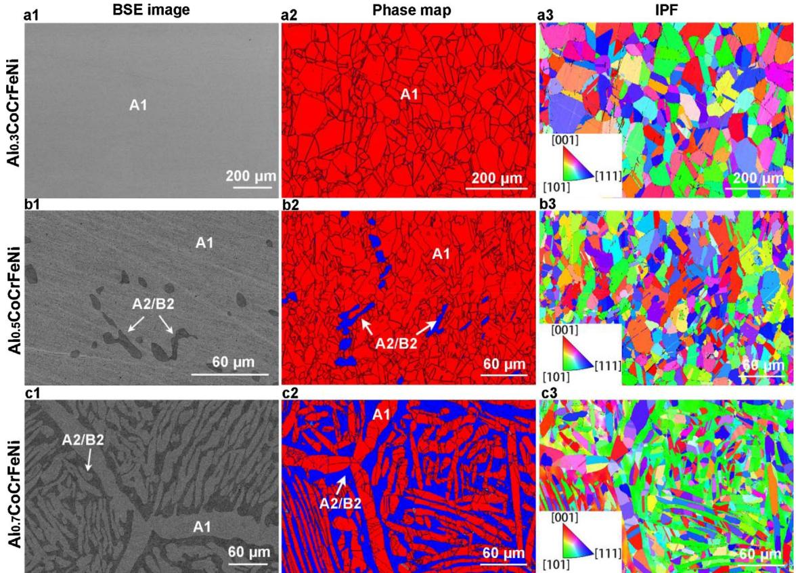  
Fig. 2. Microstructures of the as-forged $\mathrm { A l } _ { \boldsymbol { x } } \mathrm { C o C r F e N i } \left( \boldsymbol { x } = \boldsymbol { 0 . 3 } , \boldsymbol { 0 . 5 } , \right.$ and 0.7) alloys. (a1–c3) are the backscattered electron (BSE) image, phase map, and inverse pole-figure (IPF) of the asforged Al CoCrFeNi (a1–a3), Al CoCrFeNi (b1–b3), and Al CoCrFeNi (c1–c3), respectively.

enriched with Al and Ni.

As indicated by the HEXRD pattern (Fig. 1), the BCC-structured A2 and B2 phases simultaneously occur in $_ { \mathrm { A l } _ { 0 . 5 } \mathrm { C o C r F e N i } }$ and $_ \mathrm { A l _ { 0 . 7 } C o C r F e N i }$ HEAs. However, it is dificult to identify these two phases via micro-scaled characterization due to the similar crystal structure and insuficient resolution. Therefore, the in-depth observation of the BCC-structured phases was conducted by TEM (Fig. 3). For the $\begin{array} { r } { \mathsf { A l } _ { 0 . 5 } \mathsf { C o C r F e N i } , } \end{array}$ , the bright-field TEM image (Fig. 3(a)) shows that a plenty of nano-sized particles with diameters from 10 to 50 nm are distributed randomly in the matrix. The dark-field TEM image (Fig. 3(b)), which was produced using a super-lattice spot (100)

(indicated by the red circle, exclusive to the B2 structure), confirms that the B2 phase appears as the matrix (bright contrast) with the nanoscaled A2 phase (dark spots) spread randomly. The EDS (attached to the TEM system) results reveal the elemental separation in the BCC-structured phases. That is, the A2 phase is $( \mathrm { C r } , \mathrm { C o } ,$ Fe)-rich, and the B2 is (Al, Ni)-rich (Table 1). Similarly, for the $_ \mathrm { A l _ { 0 . 7 } C o C r F e N i }$ alloy, further phase characterization of the A2/B2 interdendrites region was investigated by TEM. The bright-field image (Fig. 3(c)) shows that a net-like phase and several nano-sized (5–20 nm diameters) spherical particles are distributed in the matrix. By observing the dark-field TEM image produced by the unique super-lattice spot (100), as shown in Fig. 3(d), the matrix is confirmed as the B2 phase. While the net-like phase and nano-particles have a disordered BCC structure, which is confirmed as the A2 phase. The TEM-EDS shows that in the interdendrites region, only the ordered B2 phase is (Al, Ni)-rich, while the disordered A2 phase is enriched in $\mathrm { C r } , \mathrm { C o } ,$ and Fe (Table 1).

SEM/TEM-EDS analysis results for phase compositions (at.%) of Al CoCrFeNi (x = 0.3, 0.5, 0.7) alloys.
<table><tr><td rowspan="2">Technique</td><td colspan="7">Element</td></tr><tr><td colspan="2">Phase</td><td>Al (at.%)</td><td>Co (at.%)</td><td>Cr (at.%)</td><td>Fe (at.%)</td><td>Ni (at.%)</td></tr><tr><td rowspan="10">SEM-EDS</td><td colspan="2"> $\mathrm { A l } _ { 0 . 3 } \mathrm { C o C r F e N i ~ ( a s \mathrm { - } f o r g e d ) }$ </td><td>7.0</td><td>23.2</td><td>23.4</td><td>23.4</td><td>23.0</td></tr><tr><td>Al0.3CoCrFeNi (as-equilibrated)</td><td>A1 A1</td><td>6.8</td><td>23.3</td><td>23.6</td><td>23.5</td><td>22.8</td></tr><tr><td> $\mathrm { A l } _ { 0 . 5 } \mathrm { C o C r F e N i ~ ( a s \mathrm { - } f o r g e d ) }$ </td><td>A1</td><td>10.0</td><td>23.2</td><td>23.3</td><td>23.1</td><td>20.3</td></tr><tr><td></td><td>A2/B2</td><td>24.5</td><td>18.6</td><td>12.8</td><td>14.5</td><td>29.6</td></tr><tr><td rowspan="3"> $\mathsf { A l } _ { 0 . 5 } \mathsf { C o C r F e N i } \ ( \mathsf { a s - e q u i l i b r a t e d } )$ </td><td>A1</td><td>10.5</td><td>22.1</td><td>22.9</td><td>22.7</td><td>21.9</td></tr><tr><td>B2</td><td>19.2</td><td>22.6</td><td>14.0</td><td>16.8</td><td>27.4</td></tr><tr><td>A1</td><td>15.4</td><td>21.9</td><td>20.1</td><td>21.6</td><td>21.0</td></tr><tr><td> $\mathrm { A l } _ { 0 . 7 } \mathrm { C o C r F e N i ~ ( a s \mathrm { - } f o r g e d ) }$ </td><td>A2/B2</td><td>22.2</td><td>19.7</td><td>18.0</td><td>17.1</td><td>23.1</td></tr><tr><td> $\mathsf { A l } _ { 0 . 7 } \mathsf { C o C r F e N i } \ ( \mathsf { a s - e q u i l i b r a t e d } )$ </td><td>A1</td><td>14.5</td><td>21.9</td><td>20.3</td><td>21.2</td><td>22.1</td></tr><tr><td rowspan="2"> $\mathrm { A l } _ { 0 . 5 } \mathrm { C o C r F e N i ~ ( a s \mathrm { - } f o r g e d ) }$ </td><td>A2/B2</td><td>21.9</td><td>19.4</td><td>16.8</td><td>17.4</td><td>24.6</td></tr><tr><td>A2</td><td>1.9</td><td>26.6</td><td>29.3</td><td>22.2</td><td>20.0</td></tr><tr><td rowspan="2">TEM-EDS  $\mathsf { A l } _ { 0 . 5 } \mathsf { C o C r F e N i } \ ( \mathsf { a s - e q u i l i b r a t e d } )$ </td><td>B2</td><td>26.4</td><td>18.1</td><td>8.5</td><td>15.1</td><td>32.0</td></tr><tr><td>A1</td><td>10.1</td><td>22.4</td><td>22.7</td><td>22.8</td><td>21.9</td></tr><tr><td rowspan="2"> $\mathrm { A l } _ { 0 . 7 } \mathrm { C o C r F e N i ~ ( a s \mathrm { - } f o r g e d ) }$ </td><td>B2</td><td>19.2</td><td>20.4</td><td>16.2</td><td>16.2</td><td>28.0</td></tr><tr><td>A2</td><td>4.8</td><td>21.3</td><td>46.0</td><td>22.8</td><td>5.1</td></tr><tr><td rowspan="2"></td><td>B2</td><td>29.3</td><td>20.0</td><td>5.4</td><td>13.3</td><td>32.0</td></tr><tr><td>A2</td><td>2.1</td><td>23.5</td><td>42.6</td><td>23.2</td><td>8.6</td></tr><tr><td> $\mathsf { A l } _ { 0 . 7 } \mathsf { C o C r F e N i } \ ( \mathsf { a s - e q u i l i b r a t e d } )$ </td><td>B2</td><td>19.9</td><td>20.2</td><td>13.0</td><td>18.5</td><td>28.2</td></tr></table>

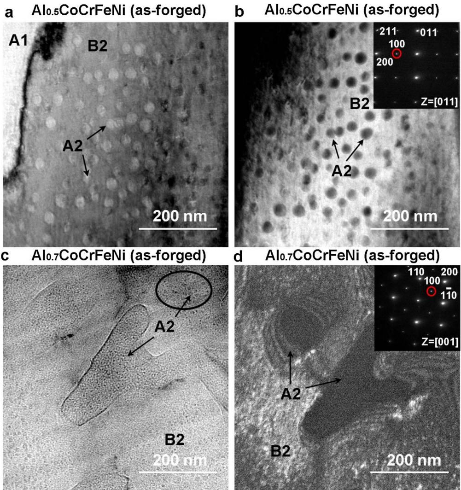

Fig. 3. Characterization of disordered/ordered BCC phases (A2/B2) by TEM in as-forged Al CoCrFeNi (x = 0.5 and 0.7) alloys: (a) bright-field TEM image and (b) dark-field TEM image of the as-forged Al CoCrFeNi, showing the A2 nano-particles distributed uniformly in the B2 matrix; (c) bright-field TEM image and (d) dark-field TEM image of the interdendrites region in the as-forged Al CoCrFeNi, showing a net-like A2 phase and several nano-sized spherical A2 particles distributed in the B2 matrix.

The heat treatment at 1250 °C for 1000 h leads to a dramatic change in the alloy microstructure. As shown in Fig. 4(a1–a3), the as-equilibrated $\mathrm { A l } _ { 0 . 3 } ( $ oCrFeNi alloy remains a single A1 phase but has a grain size 5 times larger than the as-forged condition. Several annealing twins formed during the heat treatment. For $\mathrm { \mathbf { A l _ { 0 . 5 } C o C r F e N i } }$ , the grain size of the A1 phase has increased dramatically from 15 μm to 200 μm after annealing, together with a decreased volume fraction of the BCCstructured phases to only 2% (Fig. 4(b1–b3)). In $\mathrm { { A l } _ { 0 . 7 } \mathrm { { C o C r F e N i } } }$ , the dendrites-interdendrites microstructure has changed into equiaxed grains with a size of 50 μm, as shown in Fig. 4(c1 and c2). The volume fraction of the A2/B2 phases has decreased to 22% from 45% of the asforged sample. The IPF map (Fig. 4(c3)) indicates a similar grain orientation as the forged condition, which is the randomly-orientated A1 phase and [101]-oriented A2/B2 phases.

The detailed changes in the BCC-structured phases after heat treatment were revealed further by the TEM study (Fig. 5). For the asequilibrated Al CoCrFeNi alloy, as shown in Fig. 5(a), the dark-field image produced by the super-lattice spot (100) indicates the disappearance of A2 nano-particles, which are shown in the as-forged condition, due to the dissolution during the heat treatment, and only the B2 phase remains. For the as-equilibrated $\mathrm { { A l } _ { 0 . 7 } { C o C r F e N i } }$ alloy, the TEM images of the BCC-structured phases (Fig. 5(b)) reveal a morphological transform of the A2 phase, which has changed from the net-like (Fig. 3(c and d)) to cuboidal participates with the side length ranging from 20 to 180 nm, randomly distributed in the B2 matrix. More notable changes are found in the elemental separation. Due to the high-entropy efect in the highly-mixed solid solution at elevated temperatures, the segregations of elements in diferent phases are not as distinct as in the as-forged alloys. Clearly identified by the TEM-EDS line-scan results, a sharp composition variation, especially the $\operatorname { C r } , \operatorname { A l } .$ and Ni elements, exists in the A2/B2 phase boundary of the as-forged $\mathrm { A l } _ { 0 . 7 }$ CoCrFeNi, as shown in Fig. 5(c). However, after the heat treatment, a mild compositional gradient exists across the A2/B2 phase boundary (Fig. 5(d)). The detailed spectrum results of phase compositions are shown in Table 1.

## 3.2. Work function measurements

The WF measurements between phases on the micron-/submicron-/ nano-scales were obtained using SKPFM. Since the tip conditions can vary between days or between diferent AFM tips, the WF of each Pt/Ircoated tip was calibrated by detecting the $V _ { \mathrm { C P D } }$ of the freshly-cleaved highly-oriented pyrolytic graphite (HOPG), which demonstrates a stable WF of $\phi _ { \mathrm { H O P G } } = ( 4 . 4 7 5 ~ \pm ~ 0 . 0 0 5 )$ eV [51]. The WF of each tip $( \phi _ { \mathrm { t i p } } )$ could then be found by:

$$
\phi _ { \mathrm { t i p } } = \mathrm { e } V _ { \mathrm { C P D ( H O P G ) } } + \phi _ { \mathrm { H O P G } }\tag{3}
$$

Therefore, the standardized WFs of phases could be calculated by Eq. (2) with the knowledge of the WF of tips. Gauss fitting was used to derive the mean $V _ { \mathrm { C P D } }$ value of each phase. The calculated mean WFs of various phases are listed in Table 2. The $V _ { \mathrm { C P D } }$ maps of the as-forged and as-equilibrated $\mathbf { A l } _ { x } \mathbf { C o C r F e N i }$ are shown in Fig. 6. The brighter areas correspond to the phases with higher $V _ { \mathrm { C P D } }$ and lower WFs. For $\mathrm { { A l } _ { 0 . 3 } \mathrm { { C o C r F e N i } } }$ , in both conditions, the single A1 phase presents a relatively-uniform $V _ { \mathrm { C P D } }$ distribution (Fig. 6(a and b)). A mean WF value of 4496 $( \pm 9 )$ meV is measured for the as-forged samples, which is about 50 meV lower than the as-equilibrated one (Table 2). The increased WF after annealing is assumed to be caused by the decreased structure defects and reduced short-range elemental segregations under the homogenization efect at high temperatures.

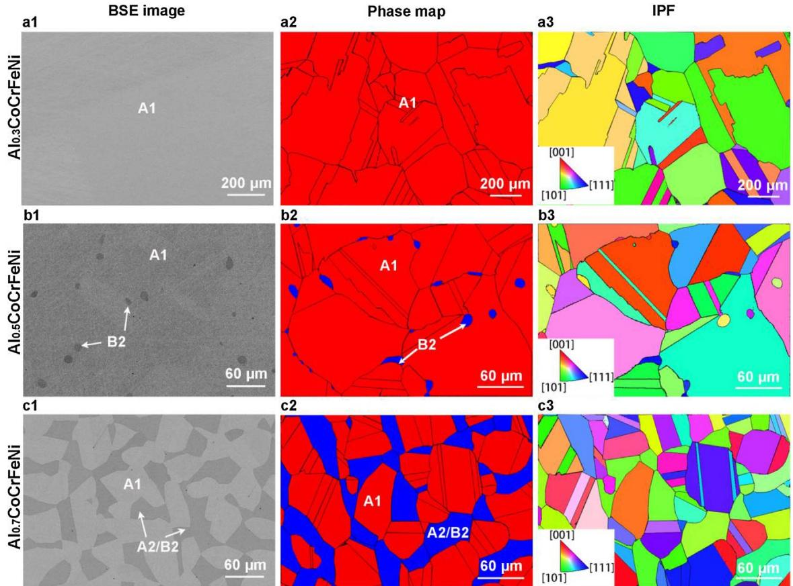  
Fig. 4. Microstructures of the as-equilibrated Al CoCrFeNi $( x = 0 . 3 , 0 . 5 ,$ and 0.7) alloys. (a1–c3) are the backscattered electron (BSE) image, phase map, and inverse pole-figure (IPF) of the as-equilibrated $\mathrm { { A l } _ { 0 . 3 } \mathrm { { C o C r F e N i } } }$ (a1–a3), $_ { \mathrm { A l } _ { 0 . 5 } \mathrm { C o C r F e N i } }$ (b1–b3), and $\mathrm { { A l } _ { 0 . 7 } { C o C r F e N i } }$ (c1–c3), respectively.

In the as-forged $\mathrm { \mathbf { A l } _ { 0 . 5 } C o C r F e N i }$ sample, the A1 phase and A2/B2 phases have distinctively diferent $V _ { \mathrm { C P D } }$ values, with steep potential gradients about 50 mV across the inter-phase, as shown in Fig. 6(c). The high-resolution SKPFM map (Fig. 6(d)) indicates that in the BCCstructured phases, the nano-sized (Cr, Co, Fe)-rich A2 participates have a lower $V _ { \mathrm { C P D } }$ than the B2, (Al, Ni)-rich matrix, representing a higher WF of the A2 phase. However, both the A2 and B2 phases have higher $V _ { \mathrm { C P D } } ,$ lower WFs than the A1 phase, with WFs diferences of about 25 meV and 55 meV, respectively (Table 2). After heat treatment, potential variation disappears in the BCC-structured phases, as shown in Fig. 6(e), due to the dissolution of the A2 phase, as described in the TEM analysis (Fig. 5(a)). Moreover, the dissolution of the $( \mathrm { C r } , \mathrm { C o } ,$ Fe)- rich A2 phase into the (Al, Ni)-rich B2 matrix reduces the chemical variation between the A1 and B2 phases, and leads to the decrease of WF diference between A1 and B2 to about 25 meV (Fig. 6(e)), indicating the homogenization efect of the heat treatment.

In the potential map of the as-forged $\mathrm { { A l } _ { 0 . 7 } \mathrm { { C o C r F e N i } } }$ (Fig. 6(f)), the line-scan profile across the phase boundary shows a dramatic drop of $V _ { \mathrm { C P D } } ,$ about 70 mV, from the A1 phase to A2/B2 phases. Moreover, the net-like phase, which is confirmed as the A2 phase according to the TEM image (Fig. 5(c)), has a lower $V _ { \mathrm { C P D } }$ than the bright B2 matrix, indicating a higher WF of the A2 phase. The WF diferences between A1 and A2, A1 and B2 are about 35 meV and 75 meV, respectively (Table 2). Obvious potential variation also exists in the as-equilibrated $\mathrm { A l } _ { 0 . 7 }$ CoCrFeNi alloy between the A1 and A2/B2 phases, as shown in Fig. 6(g), with $V _ { \mathrm { C P D } }$ diference of about 30 mV, which is much lower than those of the as-forged one. As the morphology of the A2 phase changes from the net-like shape to smaller-size cuboidal participates, the potential variation within the A2/B2 phases is reduced to about 10 mV (Fig. 6(h)), and hard to tell from the micro-scaled map (Fig. 6(g)). To be noticed, due to the limited resolution of AFM tips, the edges for the cuboidal participates are not sharp enough. Therefore, they are presented as spherical particles in the $V _ { \mathrm { C P D } }$ map. For all the above Al CoCrFeNi alloys, the high to low $V _ { \mathrm { C P D } }$ values of the phases follows a sequence as B2 [(Al, Ni)-rich ordered BCC phase] > A2 [(Cr, $\mathbf { C o } ,$ Fe)-rich disordered BCC phase] > A1 [(Cr, $\mathbf { C o } ,$ Fe)-rich disordered FCC]. Since a higher potential represents a lower WF (Eq. (2)), the nobility of the phases follow an opposite trend. The homogenization efect of the heat treatment apparently leads to the decrease of WF diferences among the phases.

## 3.3. Corrosion behavior in the 3.5 wt.% NaCl solution

The potentiodynamic polarization test, which is a standard electrochemical technique to characterize the corrosion property of materials, was performed. The obtained parameters standing for the corrosion properties are explained in detail in the supplementary Fig. 2. $\mathrm { F i g . ~ } 7$ present the polarization curves of the as-forged and as-equilibrated Al CoCrFeNi alloys with the scan rate of 100 mV/min in the 3.5 wt.% NaCl solution at room temperature. As illustrated by the curves, all the Al CoCrFeNi alloys change directly from the Tafel region into the stable passive region, without showing an active to passive transition, indicating that the protective film is formed spontaneously aAlo.sCoCrFeNi (as-equilibrated)

bAlo.7CoCrFeNi (as-equilibrated)  
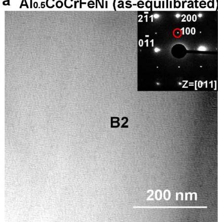

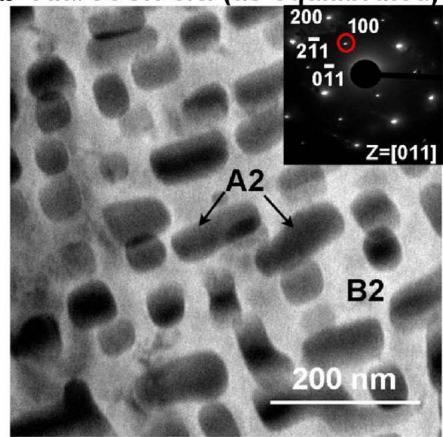

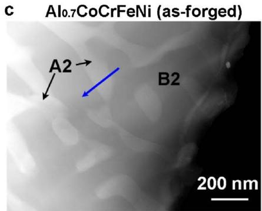

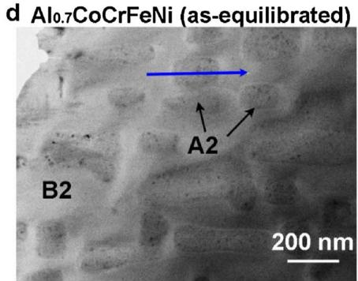  
Fig. 5. Characterization of disordered/ordered BCC phases (A2/B2) by TEM and TEM-EDS in Al CoCrFeNi $( x = 0 . 5$ and 0.7) alloys: (a) dark-field TEM image of the as-equilibrated $\begin{array} { r } { \mathsf { A l } _ { 0 . 5 } \mathsf { C o C r F e N i } . } \end{array}$ indicating the disappearance of the A2 nano-particles after annealing; (b) dark-field image of the as-equilibrated $\mathrm { A l } _ { 0 . }$ CoCrFeNi, showing a morphological transformation of the A2 phase after annealing, which changed from the net-like and nano-particles to cuboidal participates randomly distributed in the B2 matrix; (c) high angle annular dark field (HAADF) image and TEM-EDS line scans of the as-forged and (d) as-equilibrated $\mathrm { { A l } _ { 0 . 7 } \mathrm { { C o C r F e N i } } }$ alloys.

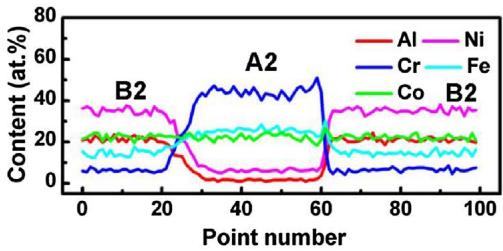

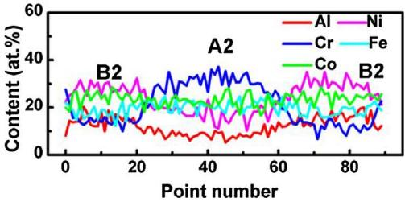

Electron-work functions of phases in Al CoCrFeNi $( x = 0 . 3 , 0 . 5 , 0 . 7 )$ alloys. Values within parenthesis are standard deviations.
<table><tr><td>Material</td><td>Conditions</td><td>Phase</td><td>WF (meV)</td></tr><tr><td> $\mathrm { A l } _ { 0 . }$  3CoCrFeNi</td><td>as-forged</td><td>A1</td><td> $4 4 9 6 \ : ( \pm 9 )$ </td></tr><tr><td></td><td>as-equilibrated</td><td>A1</td><td>4547(± 10)</td></tr><tr><td> $\mathrm { \mathbf { A l } _ { 0 . 5 } C o C r F e N i }$ </td><td>as-forged</td><td>A1</td><td>4451( ± 9)</td></tr><tr><td> $_ \mathrm { A l _ { 0 . 7 } C o C r F e N i }$ </td><td></td><td>A2</td><td>4426(± 6)</td></tr><tr><td rowspan="9"></td><td></td><td>B2</td><td>4396( ± 8)</td></tr><tr><td>as-equilibrated</td><td>A1</td><td>4523 ( ± 10)</td></tr><tr><td></td><td>B2</td><td>4494(± 7)</td></tr><tr><td>as-forged</td><td>A1</td><td>4445(± 11)</td></tr><tr><td></td><td>A2</td><td>4410 ( ± 9)</td></tr><tr><td></td><td>B2</td><td>4370 ( ± 7)</td></tr><tr><td>as-equilibrated</td><td>A1</td><td>4507(± 9)</td></tr><tr><td></td><td>A2</td><td>4479 (± 7)</td></tr><tr><td></td><td>B2</td><td> $4 4 7 0 ~ ( \pm 7 )$ </td></tr></table>

at the corrosion potential. The relevant parameters are summarized in Table 3. With the increase of the Al content in the alloys, the decreased corrosion potential $( E _ { \mathrm { c o r r } } )$ and the increased corrosion-current density $( I _ { \mathrm { c o r r } } )$ indicate the weakened resistance to general corrosion in the solution. Moreover, it can be seen that the increase of the current density in the passivation region $( I _ { \mathrm { p a s s } } )$ and decrease of the critical pitting potential $( E _ { \mathrm { p } } )$ reveal that the localized corrosion resistance of the alloy with a higher Al content is inferior to that with a lower one. $E _ { \mathrm { p } }$ is the potential where the current density exceeds $1 0 0 \mu \mathrm { A } / \mathrm { c m } ^ { 2 }$ and increases continually. Therefore, $E _ { \mathrm { p } }$ can be used as an index of resistance to the localized corrosion [56]. Below the $E _ { \mathrm { p } } ,$ current fluctuations occur in the passive region. According to our previous study [31], the current fluctuations are attributed to the nucleation, growth, and repassivation of metastable pits [57,58] on the surface and correlated with the heterogeneous properties of passive films formed on diferent phases. After the heat treatment, regardless of the aluminum content, all the three HEAs have a relatively-higher $E _ { \mathrm { p } }$ and lower $I _ { \mathrm { p a s s } }$ values (Table 3), indicating a better resistance to localized corrosion.

Fig. 8 shows the morphologies of the $\mathbf { A l } _ { x } \mathbf { C o C r F e N i }$ HEAs after the potentiodynamic polarization tests. As indicated by Fig. 8(a and $\mathbf { d } ) _ { \mathrm { { a } } }$ , the semi-sphere pits are sparsely formed in the single A1 phase of both the as-forged and as-equilibrated $\mathrm { A l } _ { 0 . 3 } \mathrm { C o C r F e N i }$ alloy. However, with the aluminum content increased to $0 . 5 ,$ the BCC-structured phases were preferentially corroded in the 3.5 wt.% NaCl solution, as shown in Fig. 8(b and e). As analyzed in our previous study [31], the preferential dissolution of Cr-depleted BCC phase is attributed to the formation of less protective passive film, which contains higher amount of Al oxide and lower amount of Cr oxide. After heat treatment, the corrosion pits are less in the equilibrated sample due to the decreased volume fraction of the BCC-structured phases and elemental homogenization. In the asforged $\mathrm { { A l } _ { 0 . 7 } \mathrm { { C o C r F e N i } } }$ , corrosion initiated at the boundaries between the A1 and B2 phases, propagated preferentially over the B2 regions, and left the A1 phase unafected [Fig. 8(c)]. It also can be seen that the B2 phase is selectively dissolved, left a net-like bright A2 phase. After the heat treatment, no more A2 phase left in the corroded regions, instead, the A2/B2 phases dissolve together [Fig. 8(f)]. The corrosion morphologies support the notion that the microstructure and local chemical segregation greatly influence the corrosion behavior. The homogenization efect of heat treatment could minimize the chances of localized corrosion to happen, thus, improving the corrosion resistance.

a Alo.3CoCrFeNi (as-forged)  
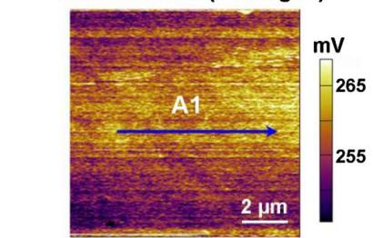

bAlo.3CoCrFeNi (as-equilibrated)  
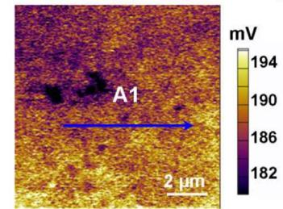

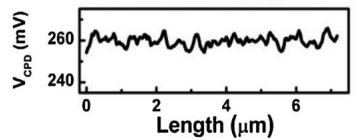

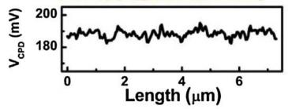  
dAlo.sCoCrFeNi (as-forged)

CAlo.sCoCrFeNi (as-forged)  
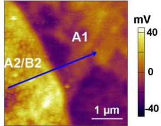

e Alo.sCoCrFeNi (as-equilibrated)  
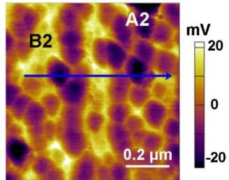

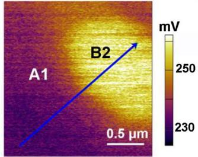

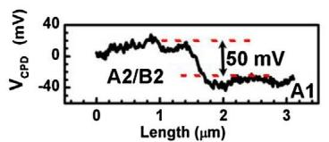  
fAlo.7CoCrFeNi (as-forged)

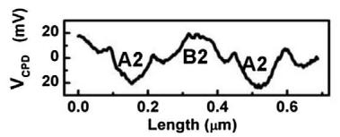

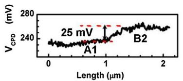  
9 Alo.7CoCrFeNi (as-equilibrated)h Alo.7CoCrFeNi (as-equilibrated)

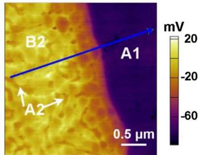

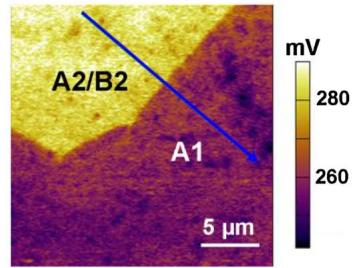

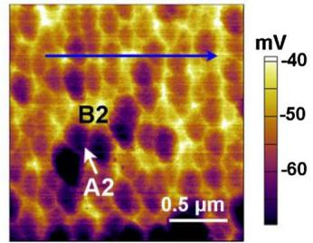

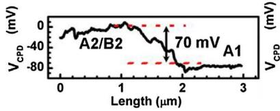

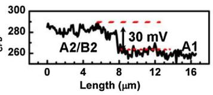

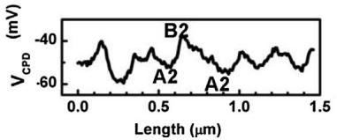  
Fig. 6. The $V _ { \mathrm { C P D } }$ maps and line profiles of the as-forged and as-equilibrated Al CoCrFeNi $( x = 0 . 3$ , 0.5, and 0.7) alloys. (a) and (b), for the as-forged and as-equilibrated Al CoCrFeNi. (c) and (d) are the $V _ { \mathrm { C P D } }$ maps and line profiles of the as-forged Al CoCrFeNi at the phase boundary (c), and inside the disordered/ordered BCC (A1/B2) phases (d). (e), $V _ { \mathrm { C P D } }$ map and line profile for the as-equilibrated $\begin{array} { r } { \mathbf { A l } _ { 0 . 5 } \mathbf { C o C r F e N i } , } \end{array}$ , potential variation disappears in the BCC phase due to the dissolution of the A2 phase. (f), $V _ { \mathrm { C P D } }$ map and line profile for the as-forged $\mathrm { A l } _ { 0 . 7 }$ CoCrFeNi, the net-like A2 precipitates with a lower V distributed inside the bright B2 matrix. (g) and (h) are the $V _ { \mathrm { C P D } }$ maps and line profiles of the as-equilibrated $\mathrm { A l } _ { 0 . }$ CoCrFeNi at the phase boundary (g), and inside A2/B2 phases (h).

## 4. Discussion

## 4.1. Homogenization efect of heat treatment

After the annealing at $1 2 5 0 ~ ^ { \circ } \mathrm { C }$ for 1000 h, the microstructures of the

Al CoCrFeNi HEAs have been changed obviously. In order to further understand the phase-transformation behavior before and after the heat treatment, equilibrium calculations are performed for the $\textstyle \operatorname { A l } _ { x } ($ CoCrFeNi alloys using the recently developed thermodynamic database [33–35]. Fig. 9 shows the equilibrium-calculation results of phase fractions as a function of temperature. At ${ 1 2 5 0 } ^ { \circ } \mathrm { C } ,$ the $\mathrm { { A l } _ { 0 . 3 } C o C r F e N i }$ is a total FCC phase, which agrees well with the microstructure of the as-equilibrated alloy (Fig. 4). With the aluminum content increased to $x = 0 . 5 ,$ , the calculated volume fractions of A1 and B2 phases are 97% and 3%, respectively, which nearly match the experimental result of the as-equilibrated $\mathrm { A l } _ { 0 . 5 }$ CoCrFeNi containing 98 vol.% of the A1 phase and 2 vol.% of the B2 phase. As for $_ { \mathrm { A l } _ { 0 . 7 } \mathrm { C o C r F e N i } }$ , the predicted phase fractions are 80 vol.% A1, 18 vol.% B2, and 2 vol.% A2 phases. The calculated volume fraction of A2/B2 phases (20%) is similar to the experimental result (22%), which also verifies the reliability of thermodynamic predictions. To be noticed, the rapid cooling rate and sluggish-difusion efect of HEAs inhibit the phase precipitation during the cooling-down process to room temperature. Therefore, the predicted phase fractions of the as-equilibrated condition agree well with the room-temperature microstructures of the $1 2 5 0 ^ { \circ } \mathrm { C }$ annealed alloys. Before the heat treatment, in the as-forged alloys, the microstructures are more complicated, and the chemical distribution is more segregated. The trends can also be predicted and explained by the equilibrium calculations $( { \mathrm { F i g . ~ } } 9 ) ,$ exhibited as the formation of several compounds when the temperature is below $6 0 0 ^ { \circ } \mathrm { C } .$ The processing of the as-forged alloys includes a short period of high-temperature treatment $( 1 2 5 0 ^ { \circ } \mathrm { C }$ for 50 h) and has a relatively-slow cooling rate (in air). With lowering the temperature, due to the diminishing efect of the high mixing entropy, the enthalpy efect enhances the chemical clustering, and the solubility of the FCC and BCC matrix phases decreased, leading to the phase precipitation and chemical segregation [7,8]. Overall, the heat treatment at $1 2 5 0 ~ ^ { \circ } \mathrm { C }$ for 1000 h has profound influence on the microstructural simplification and the chemical homogenization. The thermodynamic calculation is

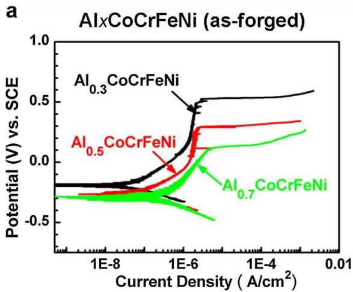

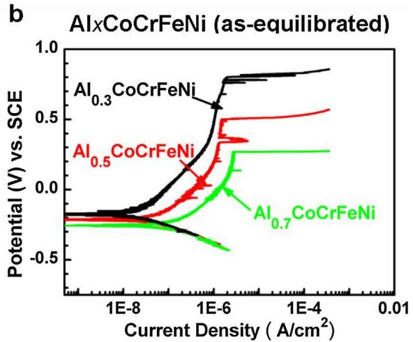  
Fig. 7. Potentiodynamic polarization curves of the as-forged (a) and as-equilibrated (b) Al CoCrFeNi $( x = 0 . 3 , 0 . 5 ,$ and 0.7) alloys, performed with the scan rate of 100 mV/min in the 3.5 wt.% NaCl solution at room temperature.

Electrochemical parameters of as-forged and as-equilibrated Al CoCrFeNi $( x = 0 . 3 , 0 . 5 , 0 . 7 )$ alloys of polarization tests in the 3.5 wt.% NaCl solution with a scan rate of 100 mV/min at room temperature. Values within parenthesis are standard deviations.
<table><tr><td>Alloys</td><td>Condition</td><td> $E _ { \mathrm { c o r r } } ( \mathrm { m V } _ { \mathrm { S C E } } )$ </td><td> $I _ { \mathrm { c o r r } } ( \mu \mathrm { A } / \mathrm { c m } ^ { 2 } )$ </td><td> $E _ { \mathrm { p } } ( \mathrm { m V } _ { \mathrm { S C E } } )$ </td><td> $I _ { \mathrm { p a s s } } ( \mu \mathrm { A } / \mathrm { c m } ^ { 2 } )$ </td></tr><tr><td> $\mathrm { { A l } _ { 0 . 3 } \mathrm { { C o C r F e N i } } }$ </td><td>As-forged</td><td> $- 1 8 9 \ : ( \pm 1 0 )$ </td><td> $6 . 3 2 \ : ( \pm 2 . 7 5 ) \times 1 0 ^ { - 2 }$ </td><td> $5 2 2 ( \pm 1 8 )$ </td><td> $1 . 4 3 \ : ( \ : \pm \ : 0 . 1 2 )$ </td></tr><tr><td> $\mathrm { \mathbf { A l } _ { 0 . 5 } C o C r F e N i }$ </td><td></td><td> $- 2 6 1 \ ( \pm 8 )$ </td><td> $1 . 8 7 \ : ( \pm 0 . 4 6 ) \times 1 0 ^ { - 1 }$ </td><td> $3 1 6 \ : ( \ : \pm \ : 3 2 )$ </td><td> $2 . 1 3 \ ( \ \pm \ : 0 . 3 4 )$ </td></tr><tr><td> $_ \mathrm { A l _ { 0 . 7 } C o C r F e N i }$ </td><td></td><td> $- 2 9 2 \ : ( \ : \pm \ : 8 )$ </td><td> $3 . 9 2 \ ( \pm 0 . 5 4 ) \times 1 0 ^ { - 1 }$ </td><td> $1 1 8 \ : ( \ : \pm \ : 1 2 )$ </td><td> $3 . 7 6 \ ( \ \pm \ : 0 . 2 4 )$ </td></tr><tr><td> $\mathrm { { A l } _ { 0 . 3 } \mathrm { { C o C r F e N i } } }$ </td><td>As-equilibrated</td><td> $- 1 8 0 \ ( \pm 1 2 )$ </td><td> $2 . 8 9 \ ( \pm 0 . 6 6 ) \times 1 0 ^ { - 2 }$ </td><td> $8 0 8 \ : ( \ : \pm \ : 1 6 )$ </td><td> $0 . 8 1 \ ( \ \pm \ 0 . 0 9 )$ </td></tr><tr><td> $\mathrm { \mathbf { A l } _ { 0 . 5 } C o C r F e N i }$ </td><td></td><td> $- 2 2 8 \ ( \ \pm \ 1 1 )$ </td><td> $7 . 1 4 \ ( \pm 2 . 8 6 ) \times 1 0 ^ { - 2 }$ </td><td> $4 9 6 \ : ( \pm 3 8 )$ </td><td> $1 . 2 4 \ ( \pm 0 . 1 2 )$ </td></tr><tr><td> $_ \mathrm { A l _ { 0 . 7 } C o C r F e N i }$ </td><td></td><td> $- 2 5 8 \ : ( \pm 8 )$ </td><td> $2 . 6 7 \ ( \pm 0 . 5 2 ) \times 1 0 ^ { - 1 }$ </td><td> $2 5 6 \ : ( \pm 1 0 )$ </td><td> $2 . 0 3 \ : ( \ : \pm \ : 0 . 2 8 )$ </td></tr></table>

a  
Alo.3CoCrFeNi  
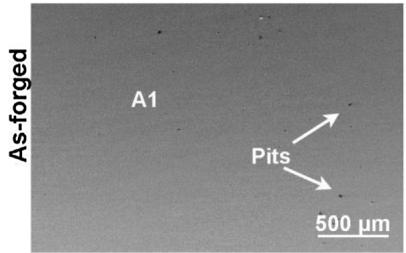  
d

b  
e  
Alo.5CoCrFeNi  
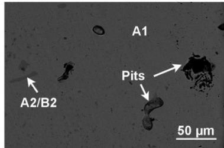

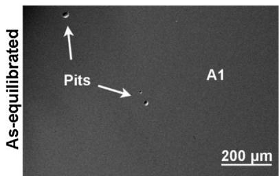

c  
Alo.7CoCrFeNi  
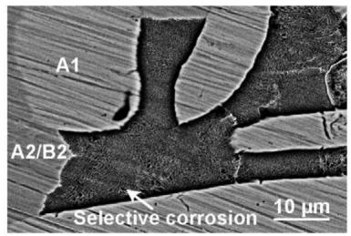  
f

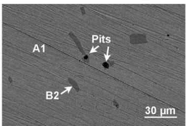

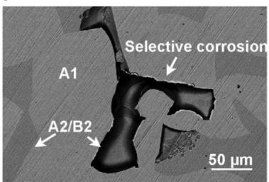  
Fig. 8. Surface morphologies of the as-forged (a-c) and as-equilibrated (d-f) AlxCoCrFeNi $( x = 0 . 3 , 0 . 5 ,$ and 0.7) alloys after the potentiodynamic polarization tests.

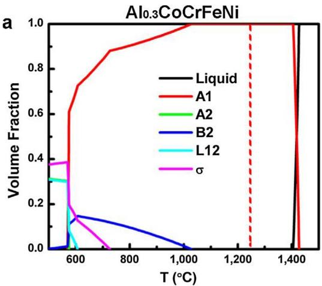

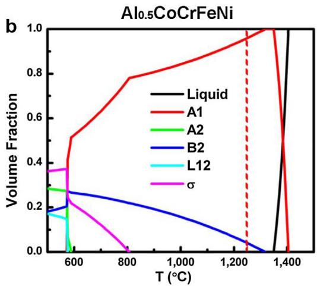

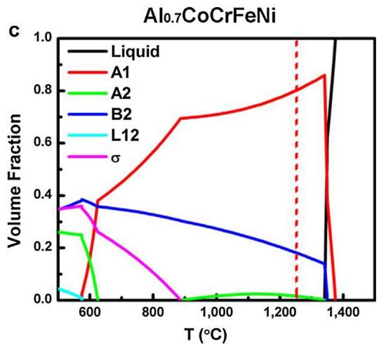  
Fig. 9. Equilibrium calculations of phase fractions as a function of temperature for the Al CoCrFeNi $( x = 0 . 3 , 0 . 5 ,$ and 0.7) alloys. (a) $\mathrm { { A l } _ { 0 . 3 } { C o C r F e N i } , }$ (b) $\mathrm { { A l } } _ { 0 . \varepsilon }$ CoCrFeNi, and (c) $_ { \mathrm { A l } _ { 0 . 7 } \mathrm { C o C r F e N i } }$ . The red-dash-lines are located at the temperature of 1250 °C.

helpful and reliable for a better understanding and prediction of the phase-transformation behavior.

## 4.2. Relationship between microstructure and WF

According to the microstructure characterization and SKPFM results, it is clearly revealed that WF has intimate relationships with the phase structures and compositions. Theoretically, for metallic materials, the WF is proportional to ${ n _ { \mathrm { e } } } ^ { 1 / 6 }$ , where $n _ { \mathrm { e } }$ is the density of valence electrons [59]. If we assumed that the composition is constant and only take the structure efect into consideration, the A1 phase with a closelypacked FCC structure should have a higher $n _ { \mathrm { e } }$ than the loosely-packed BCC crystal. This trend renders the A1 phase to possess a higher WF than the A2 and B2 phases. To be specific, the estimated ratio of the atomic-packing density of A1 to those of A2/B2 is,

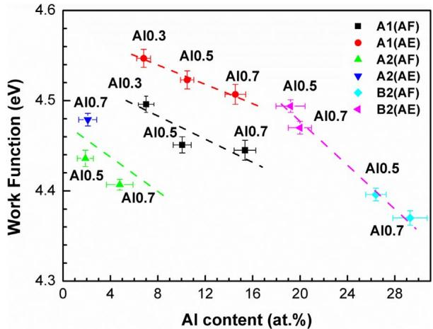  
Fig. 10. Changing trends of work functions for A1 (disordered FCC), A2 (disordered BCC) and B2 (ordered BCC) phases, in $\mathrm { A l } _ { 0 . }$ CoCrFeNi (Al0.3), Al CoCrFeNi (Al0.5) and $\mathrm { A l } _ { 0 . 7 }$ CoCrFeNi (Al0.7) HEAs of as-forged (AF) and as-equilibrated (AE) conditions, as a function of Al content.

$$
n _ { \mathrm { e } } ^ { 1 / 6 } ( \mathrm { A 1 } ) / n _ { \mathrm { e } } ^ { 1 / 6 } ( \mathrm { A 2 } , \mathrm { B 2 } ) = \frac { 4 } { a _ { \mathrm { A 1 } } ^ { 3 } } / \frac { 2 } { a _ { \mathrm { A 2 , B 2 } } ^ { 3 } } = 2 \bigg ( \frac { a _ { \mathrm { A 2 , B 2 } } } { a _ { \mathrm { A 1 } } } \bigg ) ^ { 3 }\tag{4}
$$

where a is the lattice constant with $a _ { \mathrm { A 1 } } = 3 . 6 5 6 \mathring { \mathrm { A } } , a _ { \mathrm { A 2 } } = 2$ .902 $\mathring { \mathsf { A } } ,$ and $a _ { \mathrm { B } 2 } = 2 . 9 2 5 { \mathring { \mathrm { A } } }$ The calculated ratio, $n _ { \mathrm { e } } ^ { 1 / 6 } ( \mathrm { A } 1 ) / n _ { \mathrm { e } } ^ { 1 / 6 } ( \mathrm { A } 2 )$ and $n _ { \mathrm { e } } ^ { 1 / 6 } ( \mathrm { A } 1 ) / n _ { \mathrm { e } } ^ { 1 / 6 } ( \mathrm { B } 2 )$ , is 1.003 and 1.024, respectively. From the aspect of compositions efect, among the 5 component elements $( { \mathrm { A l } } , { \mathrm { C o } } , { \mathrm { C r } } , { \mathrm { F e } } ,$ Ni), the WF of aluminum is the lowest [59]. The WFs of the phases in diferent alloys are plotted against the Al content in Fig. 10. It can be seen that for the same phase, the WF decreases with the increased aluminum content. When comparing all the phases, a general decreasing trend of WF with the increased Al content is also shown. After the heat treatment, the decreased WF diferences among the phases caused by the chemical homogenization, as described in Section 3.2, also indicates that the WF is compositional dependent. To be noticed, the WF of the A1 phase that possesses similar aluminum content increased after heat treatment. The increased WF is assumed to be caused by the decreased structure defects and reduced short-range elemental segregations attributed to the homogenization efect of heat treatment. As mentioned in Section 3.2, the limited resolution of AFM tips would afect the measurements of WF for the nano-sized phases, which might results in deviation from the real one. For instance, in the as-forged $\mathrm { A l } _ { 0 . }$ CoCrFeNi and as-equilibrated $\mathrm { { A l } } _ { 0 . { \cdot } }$ CoCrFeNi alloys, the cuboidal nano-sized A2 phase presented as spherical particles in the $V _ { \mathrm { C P D } }$ map, indicating the detected WF gradient is less sharp than the real one. Therefore, the detected WF of the A2 and B2 phases is assumed to be lower and higher than the reality, respectively. However, the measured WF of each phase can be reproducibly determined, which confirms the SKPFM results to be reliable.

## 4.3. Relationship between WF and corrosion

According to the previous studies done by Schmutz et al. $[ 3 8 , 4 1 - 4 3 ]$ , the measured WF could demonstrate the relative nobility and possible dissolution tendency of each phase in alloys. The phase that processes lower WF is more likely to be selectively dissolved in the solution. In the present study, based on the WF measurements (Fig. 6) and surface morphologies of $\mathbf { A l } _ { x } \mathbf { C o C r F e N i }$ HEAs after polarizations (Fig. 8), the B2 phase that has the lowest WF is prone to be the pittinginitiation site and is dissolved selectively. After heat treatment, the chemical homogenization leads to the decreased WF variations among phases, thus, decreasing the tendency of localized corrosion to happen. Therefore, it seems reasonable that the measured WF could be used to predict the localized corrosion behavior. However, as illustrated by the polarization curves in Figs. 7, the direct changes from the Tafel region into the stable passive region indicates spontaneously formed protective oxide films while immersion in the 3.5 wt.% NaCl solution. Since the surface condition has been changed after immersion, the measured WFs on the freshly polished surface in air need to be treated with caution to interpret the corrosion behavior in the 3.5 wt.% NaCl solution. According to our previous work [31], the preferential dissolution of the Al-rich B2 phase could be attributed to the formation of Cr-oxide depleted passive film. Therefore, the Al-rich B2 phase possesses both a less protective passive film and a lower WF. A further in-situ local electrochemical test would be helpful to truly confirm the localized corrosion mechanism. Based on the present investigation, the measured WF in the present study provides a reasonable understanding of localized corrosion. However, the quantitative interpretation should be supported by further local electrochemical study. Overall, the increased Al content in the $\mathbf { A l } _ { x } \mathbf { C o C r F e N i }$ HEAs leads to the complexity of the microstructures, which increases the WFs variations among phases. The heat treatment has profound efect on microstructural simplification and chemical homogenization, resulting in the decreased variation of WF and a better corrosion resistance.

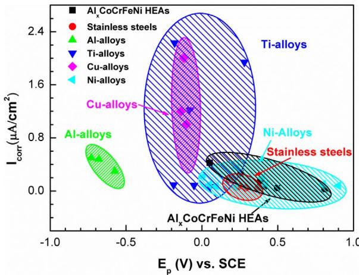  
Fig. 11. Comparison of corrosion properties between HEAs and conventional alloys [60–66] in the 3.5 wt.% NaCl solution. The higher pitting potential $( E _ { \mathrm { p } } )$ and lower corrosion-current density $( I _ { \mathrm { c o r r } } )$ of Al CoCrFeNi HEAs indicate that the localized and general corrosion-resistant properties of the Al CoCrFeNi HEAs are comparable or even superior to that of conventional corrosion-resistant alloys.

## 4.4. Comparison with conventional corrosion-resistant alloys

The corrosion properties of the Al CoCrFeNi HEAs are evaluated in a 3.5 wt.% NaCl solution. With the existence of similar Cl− content to the sea water, the 3.5 wt.% NaCl solution is commonly used to evaluate the resistance to localized corrosion in neutral environment. The parameters, $E _ { \mathrm { p } }$ and $I _ { \mathrm { c o r r } } .$ , which can represent the resistance to the localized and general corrosions, respectively, are compared between the as-forged/as-equilibrated Al CoCrFeNi HEAs and conventional corrosion-resistant alloys, including stainless steels, Al alloys, Ti alloys, Cu alloys, and Ni alloys [60–66]. As shown in Fig. 11, the HEAs located in the lower right part of the figure, indicating that the localized and general corrosion-resistant properties of the $\mathbf { A l } _ { x } \mathbf { C o C r F e N i }$ HEAs are comparable or even superior to some of the conventional corrosionresistant alloys in the 3.5 wt.% NaCl solution. The outstanding corrosion-resistant properties of the objective HEAs in the present study are related to the high Cr content and the relative homogeneous microstructure, which facilitate the formation of protective passive film.

However, as can be seen from Fig. 11, the corrosion resistance of Al CoCrFeNi HEAs is lower than some high-chromium Ni based alloys [66]. Therefore, considering the unique alloy design strategy of HEAs, the design of other alloy systems that possess simple microstructure and contain high passivating elements, such as Cr, Ni, Mo, Ti, etc. might improve the corrosion resistance further more.

## 5. Conclusions

The homogenization efect of 1250 °C heat treatment has been shown beneficial to improve the corrosion resistance of the Al CoCrFeNi HEAs in a 3.5 wt.% NaCl solutions. It has been revealed clearly that the corrosion properties are highly dependent on the microstructures and compositions. Based on the investigation in the present study, the following conclusions can be drawn.

(1) With the increased aluminum content, the microstructures of the Al CoCrFeNi HEAs become complicated, which change from single A1 phase to $\mathtt { A 1 } + \mathtt { A 2 } + \mathtt { B 2 }$ phases. The A1 and A2 phases are $( \mathbf { C r } ,$ Co, Fe)-rich, while B2 is (Al, Ni)-rich. The structural diference and chemical segregation cause the variations of WF. The high to low WFs follow a sequence as $\mathrm { A } 1 > \mathrm { A } 2 > \mathrm { B } 2$

(2) The heat treatment at $1 2 5 0 ~ ^ { \circ } \mathrm { C }$ has profound influence on simplifying the microstructure and reducing the elemental segregation, which leads to the decrease WF variations among phases. However, the measured WFs of the surfaces in air need to be treated with caution to interpret the corrosion behavior of Al CoCrFeNi HEAs in the 3.5 wt.% NaCl solution, due to the spontaneously formed oxide films on the alloys surfaces while immersion. The homogenized elemental distribution after heat treatment evidently improves the corrosion resistance.

(3) The recently developed thermodynamic database could be employed to predict the phase types and fractions and analyze the phase transformation processes of the $\operatorname { A l } _ { x } \operatorname { C o C r F e N i }$ HEAs, indicating that the further enhancement in corrosion resistance by alerting the microstructure through heat treatment could be achieved under the guidance of thermodynamic calculations for many other HEAs systems.

## Acknowledgements

The authors are grateful to Dr. Zhi Tang from the Alloy Technology Division, Alcoa Technical Center, who has provided the forged Al CoCrFeNi alloys, and are thankful to Prof. William Y. Wang from The Pennsylvania State University for providing valuable guidance in the work-function analysis. SKPFM measurements were carried out at the Center for Nanophase Materials Sciences, Oak Ridge National Laboratory, supported by the U.S. Department of Energy, Basic Energy Sciences, Scientific User Facilities Division. The authors would like to appreciate the financial support from the U.S. Department of Energy, Ofice of Fossil Energy, National Energy Technology Laboratory (DE-FE-0008855, DE-FE-0024054, and DE-FE-0011194), National Science Foundation (DMR-1611180), and the support from the “863” Program of China under Nos. 2008AA031702 and 2012AA03A507. Y.S. is grateful to the China Scholarship Council for the financial support during her visit to The University of Tennessee.

## Appendix A. Supplementary data

Supplementary data associated with this article can be found, in the online version, at https://doi.org/10.1016/j.corsci.2018.01.030.

## References

[1] L. Vitos, P.A. Korzhavyi, B. Johansson, Stainless steel optimization from quantum mechanical calculations, Nat. Mater. 2 (2003) 25–28.

[2] J.W. Yeh, S.K. Chen, S.J. Lin, J.Y. Gan, T.S. Chin, T.T. Shun, C.H. Tsau, S.Y. Chang, Nanostructured high-entropy alloys with multiple principal elements: novel alloy design concepts and outcomes, Adv. Eng. Mater. 6 (2004) 299–303.

[3] B. Cantor, I.T.H. Chang, P. Knight, A.J.B. Vincent, Microstructural development in equiatomic multicomponent alloys, Mater. Sci. Eng.: A 375–377 (2004) 213–218.

[4] Y. Zhang, T.T. Zuo, Z. Tang, M.C. Gao, K.A. Dahmen, P.K. Liaw, Z.P. Lu, Microstructures and properties of high-entropy alloys, Prog. Mat. Sci. 61 (2014) 1–93.

[5] Y. Zhang, Y.J. Zhou, J.P. Lin, G.L. Chen, P.K. Liaw, Solid-solution phase formation rules for multi-component alloys, Adv. Eng. Mater. 10 (2008) 534–538.

[6] O.N. Senkov, G.B. Wilks, D.B. Miracle, C.P. Chuang, P.K. Liaw, Refractory high entropy alloys, Intermetallics 18 (2010) 1758–1765.

[7] L.J. Santodonato, Y. Zhang, M. Feygenson, C.M. Parish, M.C. Gao, R.J. Weber, J.C. Neuefeind, Z. Tang, P.K. Liaw, Deviation from high-entropy configurations in the atomic distributions of a multi-principal-element alloy, Nat. Commun. 6 (2015) 5964.

[8] C.-J. Tong, Y.-L. Chen, J.-W. Yeh, S.-J. Lin, S.-K. Chen, T.-T. Shun, C.-H. Tsau, S.- Y. Chang, Microstructure characterization of Al CoCrCuFeNi high-entropy alloy system with multiprincipal elements, Metall. Mater. Trans. A 36 (2005) 881–893.

[9] M.C. Gao, Chapter 11: design of high-entropy alloys, in: M.C. Gao, J.W. Yeh, P.K. Liaw, Y. Zhang (Eds.), High-entropy Alloys: Fundamentals and Applications, Springer, Cham, Switzerland, 2016.

[10] M.C. Gao, B. Zhang, S.M. Guo, J.W. Qiao, J.A. Hawk, High-entropy alloys in hex agonal close-packed structure, Metall. Mater. Trans. A 47 (2016) 3322–3332.

[11] M. Feuerbacher, M. Heidelmann, C. Thomas, Hexagonal high-entropy alloys, Mater. Res. Lett. 3 (2015) 1–6.

[12] K.M. Youssef, A.J. Zaddach, C. Niu, D.L. Irving, C.C. Koch, A novel low-density high-hardness, high-entropy alloy with close-packed single-phase nanocrystalline structures, Mater. Res. Lett. 3 (2015) 95–99.

[13] H. Diao, L.J. Santodonato, Z. Tang, T. Egami, P.K. Liaw, Local structures of high entropy alloys (HEAs) on atomic scales: an overview, JOM 67 (2015) 2321–2325.

[14] Y. Shi, B. Yang, P. Liaw, Corrosion-resistant high-entropy alloys: a review, Metals 7 (2017) 43.

[15] X. Lim, Mixed-up metals make for stronger tougher, stretchier alloys, Nature 533 (2016) 306–307.

[16] O.N. Senkov, S.V. Senkova, C. Woodward, Efect of aluminum on the microstructure and properties of two refractory high-entropy alloys, Acta Mater. 68 (2014) 214–228.

[17] Z. Li, K.G. Pradeep, Y. Deng, D. Raabe, C.C. Tasan, Metastable high-entropy dualphase alloys overcome the strength–ductility trade-of, Nature 534 (2016) 227–230.

[18] M.A. Hemphill, T. Yuan, G.Y. Wang, J.W. Yeh, C.W. Tsai, A. Chuang, P.K. Liaw, Fatigue behavior of Al CoCrCuFeNi high entropy alloys, Acta Mater. 60 (2012) 5723–5734.

[19] Z. Tang, T. Yuan, C.-W. Tsai, J.-W. Yeh, C.D. Lundin, P.K. Liaw, Fatigue behavior of a wrought Al CoCrCuFeNi two-phase high-entropy alloy, Acta Mater. 99 (2015) 247–258.

[20] M. Seifi, D. Li, Z. Yong, P.K. Liaw, J.J. Lewandowski, Fracture toughness and fatigue crack growth behavior of as-cast high-entropy alloys, JOM 67 (2015) 2288–2295.

[21] B. Gludovatz, A. Hohenwarter, D. Catoor, E.H. Chang, E.P. George, R.O. Ritchie, A fracture-resistant high-entropy alloy for cryogenic applications, Science 345 (2014) 1153–1158.

[22] Z. Zhang, M.M. Mao, J. Wang, B. Gludovatz, Z. Zhang, S.X. Mao, E.P. George, Q. Yu, R.O. Ritchie, Nanoscale origins of the damage tolerance of the high-entropy alloy CrMnFeCoNi. Nat. Commun. 6 (2015).

[23] Z. Tang, M.C. Gao, H. Diao, T. Yang, J. Liu, T. Zuo, Y. Zhang, Z. Lu, Y. Cheng, Y. Zhang, K.A. Dahmen, P.K. Liaw, T. Egami, Aluminum alloying efects on lattice types, microstructures, and mechanical behavior of high-entropy alloys systems, JOM 65 (2013) 1848–1858.

[24] B. Fultz, Vibrational thermodynamics of materials, Prog. Mater. Sci. 55 (2010) 247–352.

[25] Y. Qiu, M.A. Gibson, H.L. Fraser, N. Birbilis, Corrosion characteristics of high en tropy alloys (HEAs), Mater. Sci. Technol. 31 (10) (2015) p.1743284715Y.000.

[26] Y. Qiu, S. Thomas, M.A. Gibson, H.L. Fraser, N. Birbilis, Corrosion of high entropy alloys, NPJ Mater. Degrad. 1 (2017).

[27] Y.-F. Kao, T.-D. Lee, S.-K. Chen, Y.-S. Chang, Electrochemical passive properties of Al CoCrFeNi (x = 0 0.25, 0.50, 1.00) alloys in sulfuric acids, Corros. Sci. 52 (2010) 1026–1034.

[28] Y.-F. Kao, T.-J. Chen, S.-K. Chen, J.-W. Yeh, Microstructure and mechanical property of as-cast, –homogenized, and –deformed Al CoCrFeNi (0 ≤ x ≤ 2) high-entropy alloys, J. Alloys Compd. 488 (2009) 57–64.

[29] Q.H. Li, T.M. Yue, Z.N. Guo, X. Lin, Microstructure and corrosion properties of AlCoCrFeNi high entropy alloy coatings deposited on AISI 1045 Steel by the electrospark process, Metall. Mater. Trans. A 44 (2012) 1767–1778.

[30] Y.Q. Wang, B. Yang, J. Han, H.C. Wu, X.T. Wang, Efect of precipitated phases on the pitting corrosion of Z3CN20.09M cast duplex stainless steel, Mater. Trans. 54 (2013) 839–843.

[31] Y. Shi, B. Yang, X. Xie, J. Brechtl, K.A. Dahmen, P.K. Liaw, Corrosion of Al CoCrFeNi high-entropy alloys: Al-content and potential scan-rate dependent pitting behavior, Corros. Sci. 119 (2017) 33–45.

[32] J.J. Noël, Efects of metallurgical variables on aqueous corrosion, ASM Handb. 13 (2003) 258–265.

[33] C. Zhang, F. Zhang, S. Chen, W. Cao, Computational thermodynamics aided highentropy alloy design, JOM 64 (2012) 839–845.

[34] F. Zhang, C. Zhang, S.L. Chen, J. Zhu, W.S. Cao, U.R. Kattner, An understanding of high entropy alloys from phase diagram calculations, Calphad 45 (2014) 1–10.

[35] C. Zhang, F. Zhang, H. Diao, M.C. Gao, Z. Tang, J.D. Poplawsky, P.K. Liaw, Understanding phase stability of Al-Co-Cr-Fe-Ni high entropy alloys, Mater. Des. 109 (2016) 425–433.

[36] H.L. Skriver, N.M. Rosengaard, Surface energy and work function of elemental metals, Phys. Rev. B 46 (1992) 7157–7168.

[37] W. Li, D.Y. Li, Influence of surface morphology on corrosion and electronic behavior, Acta Mater. 54 (2006) 445–452.

[38] P. Schmutz, G.S. Frankel, Characterization of AA2024-T3 by scanning kelvin probe force microscopy, J. Electrochem. Soc. 145 (1998) 2285–2295.

[39] M. Nonnenmacher, M.P. O’Boyle, H.K. Wickramasinghe, Kelvin probe force microscopy, Appl. Phys. Lett. 58 (1991) 2921–2923.

[40] L. Kelvin, V. Contact electricity of metals, Philos. Mag. Ser. 5 (46) (1898) 82–120.

[41] F. Andreatta, H. Terryn, J.H.W. de Wit, Corrosion behaviour of diferent tempers of AA7075 aluminium alloy, Electrochim. Acta 49 (2004) 2851–2862.

[42] M. Li, L.Q. Guo, L.J. Qiao, Y. Bai, The mechanism of hydrogen-induced pitting corrosion in duplex stainless steel studied by SKPFM, Corros. Sci. 60 (2012) 76–81.

[43] Q.N. Song, Y.G. Zheng, D.R. Ni, Z.Y. Ma, Studies of the nobility of phases using scanning Kelvin probe microscopy and its relationship to corrosion behaviour of Ni–Al bronze in chloride media, Corros. Sci. 92 (2015) 95–103.

[44] M. Rohwerder, F. Turcu, High-resolution Kelvin probe microscopy in corrosion science: scanning Kelvin probe force microscopy (SKPFM) versus classical scanning Kelvin probe (SKP), Electrochim. Acta 53 (2007) 290–299.

[45] A.B. Cook, Z. Barrett, S.B. Lyon, H.N. McMurray, J. Walton, G. Williams, Calibration of the scanning Kelvin probe force microscope under controlled environmental conditions, Electrochim. Acta 66 (2012) 100–105.

[46] N. Birbilis, Y.M. Zhu, S.K. Kairy, M.A. Glenn, J.F. Nie, A.J. Morton, Y. Gonzalez Garcia, H. Terryn, J.M.C. Mol, A.E. Hughes, A closer look at constituent induced localised corrosion in Al-Cu-Mg alloys, Corros. Sci. 113 (2016) 160–171.

[47] N. Birbilis, R.G. Buchheit, Investigation and discussion of characteristics for intermetallic phases common to aluminum alloys as a function of solution pH, J. Electrochem. Soc. 155 (2008) C117.

[48] O.N. Senkov, J.D. Miller, D.B. Miracle, C. Woodward, Accelerated exploration of multi-principal element alloys with solid solution phases, Nat. Commun. 6 (2015) 6529.

[49] J.E. Hilliard, J.W. Cahn, An Evaluation of Procedures in Quantitative Metallography I. Volume-fraction Analysis, General Electric Co. Research Lab., Schenectady, N.Y, 1959, p. 28.

[50] E. Underwood, The Mathematical Foundations of Quantitative Stereology, ASTM International, West Conshohocken, PA, USA, 1972, pp. 3–38 STP 36841S.

[51] W.N. Hansen, G.J. Hansen, Standard reference surfaces for work function measurements in air, Surf. Sci. 481 (2001) 172–184.

[52] J.H.W. de Wit, Local potential measurements with the SKPFM on aluminium alloys, Electrochim. Acta 49 (2004) 2841–2850.

[53] L. Collins, J.I. Kilpatrick, S.A. Weber, A. Tselev, I.V. Vlassiouk, I.N. Ivanov, S. Jesse, S.V. Kalinin, B.J. Rodriguez, Open loop Kelvin probe force microscopy with single and multi-frequency excitation, Nanotechnology 24 (2013) 475702.

[54] D.B. Miracle, Overview No. 104 the physical and mechanical properties of NiAl, Acta Metall. Mater. 41 (1993) 649–684.

[55] I. Kalay, M.J. Kramer, R.E. Napolitano, High-accuracy X-ray difraction analysis of phase evolution sequence during devitrification of Cu50Zr50 metallic glass, Metall. Mater. Trans, A 42 (2010) 1144–1153

[56] R. Ovarfort, Critical pitting temperature measurements of stainless steels with an improved electrochemical method, Corros. Sci. 29 (1989) 987–993.

[57] G.T. Burstein, P.C. Pistorius, S.P. Mattin, The nucleation and growth of corrosion pits on stainless steel, Corros. Sci. 35 (1993) 57–62.

[58] S.K. Kairy, P.A. Rometsch, K. Diao, J.F. Nie, C.H.J. Davies, N. Birbilis, Exploring the electrochemistry of 6xxx series aluminium alloys as a function of Si to Mg ratio Cu content, ageing conditions and microstructure, Electrochim. Acta 190 (2016) 92-103.

[59] H. Stanislaw, D. Tomasz, Work functions of elements expressed in terms of the Fermi energy and the density of free electrons, J. Phys.: Condens. Matter 10 (1998) 10815.

[60] G102-89, A. Standard Practice for Calculation of Corrosion Rates and Related Information from Electrochemical Measurements, ASTM International, West Conshohocken, PA USA, 2010.

[61] C.T. Kwok, F.T. Cheng, H.C. Man, Synergistic efect of cavitation erosion and corrosion of various engineering alloys in 3.5% NaCl solution, Mater. Sci. Eng.: A 290 (2000) 145–154.

[62] C. Delgado-Alvarado, P.A. Sundaram, A study of the corrosion behavior of gamma titanium aluminide in 3.5 wt% NaCl solution and seawater, Corros. Sci. 49 (2007) 3732–3741.

[63] X. Peng, Y. Zhang, J. Zhao, F. Wang, Electrochemical corrosion performance in 3.5% NaCl of the electrodeposited nanocrystalline Ni films with and without dispersions of Cr nanoparticles, Electrochim. Acta 51 (2006) 4922–4927.

[64] H. Ezuber, A. El-Houd, F. El-Shawesh, A study on the corrosion behavior of aluminum alloys in seawater, Mater. Des. 29 (2008) 801–805.

[65] P.P. Sarkar, P. Kumar, M.K. Manna, P.C. Chakraborti, Microstructural influence on the electrochemical corrosion behaviour of dual-phase steels in 3.5% NaCl solution, Mater. Lett. 59 (2005) 2488–2491.

[66] L. Liu, Y. Li, F. Wang, Influence of micro-structure on corrosion behavior of a Nibased superalloy in 3.5% NaCl, Electrochim. Acta 52 (2007) 7193–7202.