Research Article

# Effect of Molybdenum on the Corrosion Behavior of High-Entropy Alloys CoCrFeNi and CoCrFeNi Mo under Sodium Chloride Aqueous Conditions

Alvaro A. Rodriguez,1,2 Joseph H. Tylczak ,1,3 Michael C. Gao,1,4 Paul D. Jablonski,1,3 Martin Detrois,1,4 Margaret Ziomek-Moroz,1,3 and Jefrey A. Hawk1,3

1National Energy Technology Laboratory, 1450 Queen Ave. SW, Albany, OR 97321, USA 2ORISE, Oak Ridge, TN, USA

3U.S. Department of Energy, Washington, DC, USA 4AECOM, Los Angeles, CA, USA

Correspondence should be addressed to Joseph H. Tylczak; joseph.tylczak@netl.doe.gov

Received 30 September 2017; Revised 14 December 2017; Accepted 21 January 2018; Published 20 March 2018

Academic Editor: Alicia E. Ares

Copyright © 2018 Alvaro A. Rodriguez et al. ,is is an open access article distributed under the Creative Commons Attribution License, which permits unrestricted use, distribution, and reproduction in any medium, provided the original work is properly cited.

,e corrosion behavior of high-entropy alloys (HEAs) CoCrFeNi and $\mathrm { C o C r F e N i _ { 2 } M o _ { 0 . 2 5 } }$ was investigated in 3.5 wt. percent sodium chloride (NaCl) at 25°C by electrochemical methods. ,eir corrosion parameters were compared to those of HASTELLOY C-276 (UNS N10276) and stainless steel 316L (UNS 31600) to assess the suitability ofHEAs for potential industrial applications in NaCl simulating seawater type environments. ,e corrosion rates were calculated using corrosion current determined from electrochemical experiments for each ofthe alloys. In addition, potentiodynamic polarization measurements can indicate active, passive, and transpassive behavior of the metal as well as potential susceptibility to pitting corrosion. Cyclic voltammetry (CV) can confirm the alloy susceptibility to pitting corrosion. Electrochemical impedance spectroscopy (EIS) elucidates the corrosion mechanism under studied conditions. ,e results of the electrochemical experiments and scanning electron microscopy (SEM) analyses of the corroded surfaces revealed general corrosion on alloy $\mathrm { C o C r F e N i _ { 2 } M o } _ { 0 . 2 5 }$ and HASTELLOY C-276 and pitting corrosion on alloy CoCrFeNi and stainless steel 316L.

## 1. Introduction

Studies and investigations of multicomponent solid solutions in near-equal molar ratio lead to the development of highentropy alloys (HEAs), a new group of alloys containing at least five alloying elements with an atomic composition of 5–35% each. Even though 4 component alloys are more properly referred to as medium entropy, for this paper, both experimental alloys will be classified as HEAs. HEAs are also characterized by their configurational entropy of mixing $( \Delta S _ { \mathrm { c o n f } } )$ of at least 1.5R, where $R = 8 . 3 1 4 J { \cdot } \mathrm { m o l } ^ { - 1 } { \cdot } \dot { \mathrm { K } } ^ { - 1 }$ is the gas constant. $\Delta S _ { \mathrm { c o n f } }$ plays the most dominant role on the total mixing entropy [1], and ideal $\Delta S _ { \mathrm { c o n f } }$ is calculated using (1).,is equation is a good approximation for liquid alloys and many solid alloys close to their solidus temperatures [1]. $X _ { i }$ represents the mole fraction of element i [2–6].

$$
\Delta S _ { \mathrm { c o n f } } = - R \sum _ { i } \big ( X _ { i } \mathrm { l n } X _ { i } \big ) .\tag{1}
$$

High values of mixing entropy for an alloy favor the formation of single-phase solid solutions, over that of intermetallic compounds [2, 4]. High concentrations ofmultiple components ofer unique physical and metallurgical properties with potential for superior mechanical, electrochemical, and magnetic characteristics suitable for applications under high-strength and high-corrosive environments such as the chemical industry, natural gas distribution systems, and marine infrastructure [7].

Studies evaluating the mechanical, chemical, and corrosion behavior of high-entropy alloys were first published in 2004, increasing to more than 500 related articles since. ,e electrochemical kinetics and microstructure analysis of the HEA alloy $\mathrm { C u } _ { 0 . 5 } \mathrm { N i A l C o C r F e S i }$ were evaluated by Chen et al. in NaCl and $\mathrm { H } _ { 2 } \mathrm { S O } _ { 4 }$ solutions [7, 8]. ,is HEA had a higher resistance to general corrosion compared to stainless steel 304S at $2 5 ^ { \circ } \mathrm { C } .$ However, susceptibility to pitting corrosion was observed under the presence of chlorides. General corrosion resistance for the HEA and 304S decreased as temperature increased from $3 0 ^ { \circ } \mathrm { C }$ to ${ 7 0 } ^ { \circ } \mathrm { C } ,$ with little impact on 304S due to a passive film formation. Microstructure analysis of this HEA revealed a quasiamorphous material with a matrix of a noncrystalline phase, nanoscale deposits, and body-centered cubic (BCC) elements.

,e influence ofcopper content on the corrosion behavior of FeCoNiCrCu HEAs in 3.5% NaCl solution was evaluated by Hsu et al. Localized corrosion increased with copper concentration due to galvanic action between interdendrites and dendrites [9]. Comparatively, Lee et al. studied the efect of boron content on the corrosion performance of ${ \mathrm { A l } } _ { 0 . 5 } { \mathrm { C o C r C u F e N i B } } _ { x }$ HEAs. Electrochemical tests showed higher resistance of these HEAs to general corrosion compared to stainless steel 304, while corrosion current densities increased with higher boron content in aqueous solutions of $\mathrm { H } _ { 2 } \mathrm { S O } _ { 4 }$ [10]. Hsu et al. found an enhancement of hardness, wear resistance, and high-temperature strength of these alloys due to the formation ofboride precipitates as concentration of boron increased [11].

In 2008, Lee et al. studied the corrosion performance of $\mathrm { A l } _ { x } \mathrm { C r F e } _ { 1 . 5 } \mathrm { M n N i } _ { 0 . 5 }$ HEAs in NaCl and $\mathrm { H } _ { 2 } \mathrm { S O } _ { 4 }$ solutions by measuring their corrosion current density. ,e aluminumfree alloy from this system had a higher corrosion resistance in $\mathrm { H } _ { 2 } \mathrm { S O } _ { 4 }$ solutions. However, addition of NaCl promotes the susceptibility of the HEA to pitting corrosion due a breakdown of the existing passive layer [12].

Numerous HEA systems have been developed and evaluated by other researchers to understand the corrosion behavior of these multicomponent alloys under aqueous conditions. ,ese studies include the influence of aluminum on the pitting corrosion of $\mathrm { A l } _ { x } \mathrm { C r F e } _ { 1 . 5 } \mathrm { M n N i } _ { 0 . 5 }$ alloys in HCl solutions [13]: pitting corrosion evaluation of $\mathrm { C o _ { 1 . 5 } C r F e N i _ { 1 . 5 } T i _ { 0 . 5 } M o _ { 0 . 1 } }$ in sulfate solutions with chloride content [14], inhibition impact of inorganic/organic inhibitors in chloride solutions [15], and impact of molybdenum on $\mathrm { C o _ { 1 . 5 } C r F e N i _ { 1 . 5 } T i _ { 0 . 5 } M o _ { 0 . 1 } }$ HEAs [16].

Furthermore, an extended list of other investigations involves the corrosion behavior and pitting corrosion susceptibility of $( \mathrm { a } ) \mathrm { A l } _ { \boldsymbol { x } } \mathrm { C o C r F e N i }$ alloys in NaCl environments [17] and in sulfuric acids [18]; (b) corrosion resistance of $_ \mathrm { C o C r C u F e N i A l _ { 0 . 5 } B _ { x } }$ alloys in simulated syngas at high temperatures $[ 1 9 ] ; ( { \mathsf { c } } )$ influence of alloying and heat treatments on the corrosion of Al and Cu-containing HEA systems [20]; and (d) corrosion evaluation of $\mathrm { T i Z r } _ { 0 . 5 } \mathrm { N b } { \mathrm { C r } _ { 0 . 5 } } \mathrm { V } _ { x } \mathrm { M o } _ { y }$ alloys [21] and reviews on current research and development of HEAs [4, 6, 20, 22–27].

,e investigated HEA systems were CoCrFeNi and $\mathrm { C o C r F e N i _ { 2 } M o } _ { 0 . 2 5 }$ (referred as A35 and A36 resp. throughout this paper), as well as two commercial alloys, HASTELLOY

C-276 (UNS N10276) and stainless steel 316L (UNS 31600). ,e purpose of this study is to assess the potential industrial applications of HEAs by comparing their cost benefit and corrosion resistance to a Ni-Mo-Cr superalloy with excellent corrosion resistance such as HASTELLOY C-276 and an austenitic stainless-steel alloy primarily formed by Fe-Cr-Ni with high corrosion resistance characteristics such as 316L.

,e cost associated with fabrication can be divided into fixed and variable costs. Fixed costs remain the same unlike the production output. In contrast, variable costs are dependent of unit production. ,e cost of raw materials is classified as a variable cost, and it was calculated in this work based on composition of alloys, assuming that the influence of other variables such as labor, utilities, and sales commissions are similar. ,e raw material costs were calculated from current commodity market prices [28]. ,e cost of producing 1 lb. (454 g) of alloy is approximately \$1.07 for SS316, \$6.09 for C-276, \$8.39 for A35, and \$8.65 for A36. ,e expected high value of alloys A35 and A36 is influenced by the market price of Co; therefore, the price could drop to \$2.00-\$3.00.

,e selected HEAs have a face-centered cubic (FCC) crystal structure based on 3d transition metals [29, 30]. ,e passive elements such as Cr and Mo add high mixing entropy and low free energy, aspects that benefit the corrosion resistance of alloys. ,e corrosion behavior of these alloys was evaluated via electrochemical methods by carrying out experiments in 3.5 wt.% NaCl solution, simulating artificial seawater at room temperature $( 2 5 ^ { \circ } \mathrm { C } )$ . Table 1 shows the alloy composition, ASTM grain size, and configurational entropy as calculated from (1).

## 2. Materials and Methods

2.1. Alloy Design and Manufacture. ,e alloys were designed using the ,ermo-Calc Software utilizing the TCNI8 database [31]. ,e idea was to keep the FCC solid solution as the main phase in the microstructure as seen in Figure 1. ,e base alloy CoCrFeNi (A35) was predicted to form a single FCC structure in the as-cast state since the FCC phase is stable over an extremely wide temperature range (i.e., 502–1435°C). Addition of Mo to the base alloy was to enhance the pitting corrosion resistance, but it promoted formation of μ phase in small mole fractions of A36 (Figure 1(b)), starting at $9 6 7 ^ { \circ } \mathrm { C } $ ,e μ phase originates from the Co-Mo and Fe-Mo binaries, and it has a hexagonal crystal structure (prototype W6Fe7, Pearson symbol hR39, and space group R3m).

A combination of commercial purity starting materials and in-house refined Ni-Co-Cr master alloys [32, 33] were used to formulate alloys A35 and A36 with the nominal chemistries shown in Table 1 using a starting weight of approximately 8000 g. Each alloy was induction-melted under inert gas and poured with a 50°C superheat into a 75 mm cylindrical graphite mold having a nonreactive ceramic wash coat. After casting, the hot-tops of each ingot were removed with a band saw, and a 2 mm thick slice was taken for chemical analysis. ,e metal chemistries were determined by X-ray fluorescence (XRF) with the Rigaku ZSX Primus II utilizing National Institute of Standards and Technology (NIST) traceable standards (reported values are accurate to 0.01 wt.%); carbon and sulfur chemistries were determined with a LECO CS444LS using NIST-certi ed standards (reported values are accurate to 2 ppm). Oxygen and nitrogen chemistries were determined with a LECO TC436AR using NIST certi ed standards (reported values are accurate to 1 ppm). Each ingot was given a computationally optimized homogenization heat treatment to reduce the inhomogeneity to ± 1% ofnominal or better utilizing the method described in [34]. Še sidewalls of the ingots were conditioned on a lathe, and the ingots were bagged in protective stainless-steel foil pouches and preheated for 3 hours prior to fabrication. Alloy A35 was hot worked at 900°C while alloy A36 was hot worked at 1100°C due to the more refractory nature of the alloy. Hot working consisted of forging and rolling to reduce the round ingots into slab shapes, which were ultimately formed into strip product with a thickness of approximately 3.7 mm.

Table 1: Alloy compositions, grain size, and con gurational entropy.
<table><tr><td rowspan="2">Alloy</td><td colspan="6">wt.%</td><td colspan="5">ppm</td><td rowspan="2">ASTM grain size</td><td rowspan="2"> $\Delta S _ { \mathrm { c o n f } }$ </td></tr><tr><td> $\mathrm { F e }$ </td><td>Ni</td><td>Co</td><td>Mo</td><td> $\mathrm { C r }$ </td><td>Others</td><td>Others</td><td>0</td><td>N</td><td></td><td></td></tr><tr><td>A35</td><td>19.98</td><td>40.84</td><td>20.67</td><td>一</td><td>18.4</td><td></td><td></td><td>11</td><td>11</td><td>165</td><td>10</td><td>6</td><td>1.3R</td></tr><tr><td>A36</td><td>18.46</td><td>37.81</td><td>18.99</td><td>7.64</td><td>16.95</td><td></td><td></td><td>4</td><td>9</td><td>160</td><td>10</td><td>4</td><td>1.5R</td></tr><tr><td>C-276</td><td>5.5</td><td>57</td><td>2.5</td><td>16</td><td>15.5</td><td>4.00 W</td><td>800 Si</td><td></td><td></td><td>100</td><td></td><td>5</td><td>1.4R</td></tr><tr><td rowspan="2">SS316</td><td rowspan="2"></td><td rowspan="2"></td><td rowspan="2">0.21</td><td rowspan="2"></td><td rowspan="2"></td><td>1.00 Mn</td><td>3500 V</td><td></td><td></td><td></td><td></td><td></td><td rowspan="2"></td></tr><tr><td>0.35 Cu</td><td>310 P</td><td></td><td>536</td><td>178</td><td></td><td></td></tr><tr><td></td><td>68.59 10.47</td><td></td><td></td><td></td><td>16.61</td><td>1.39 Mn</td><td>2500 Si</td><td></td><td></td><td></td><td>200</td><td>7</td><td>1.0R</td></tr></table>

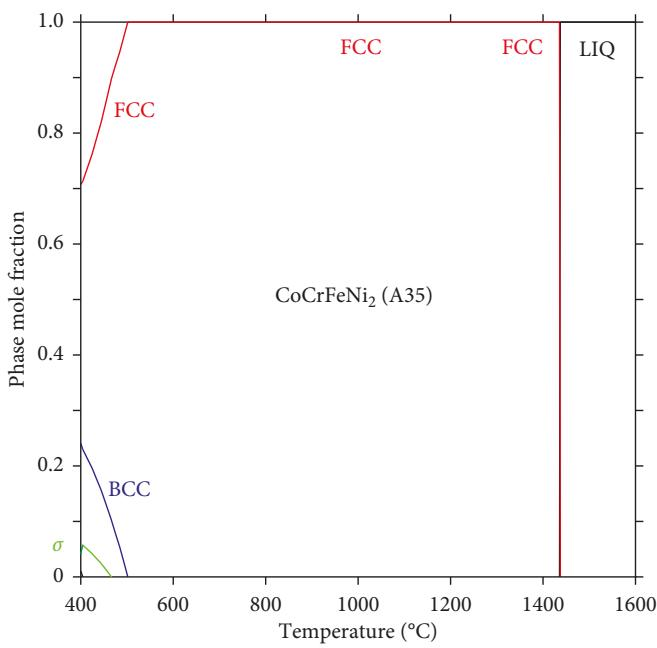

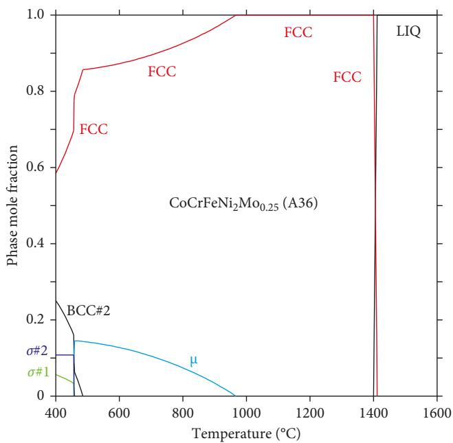  
Figure 1: Calculated equilibrium phase mole fraction versus temperature for (a) CoCrFeNi (A35) and (b) $\mathrm { C o C r F e N i _ { 2 } M o _ { 0 . 2 5 } }$ (A36) alloys using the bulk composition provided in Table 1 (only the elements Co, Cr, Fe, Ni, and Mo were included).  
(a)  
(b)

2.2. Microstructure Characterization. Metal specimens (10 mm 10 mm 3 mm) of HEAs A35 and A36 were cut from prepared corrosion specimens (machining is described below and seen in Figure 2) by mounting the top face of the rolled plates on a conductive epoxy using a hot compression method. Šerefore, the broad, rolled face is considered for observation of micrographs for convenience due to the thin nature of the plates. Preparation of the untested specimens for observation of the starting microstructures included mechanical wet grinding employing SiC paper through to 1200 grit followed by  nal polishing using alumina suspension on  ne polishing cloths through a $0 . 0 5 \mu$ size. Še metal surface of the samples was etched using an electrolytic method at 1.5 V for 60 sec in a bath of acetic acid, nitric acid, and water at room temperature (described as etchant 50 in standard ASTM E407-07) [35]. Še general grain structure was observed using optical microscopy while the corrosion tested samples were observed under an FEI Inspect F scanning electron microscope (SEM).

2.3. Electrochemical Testing. Experiments were conducted at 25°C in a nondeaerated test solution of 3.5 wt.% NaCl. A three-electrode electrochemical glass cell was used with the metal specimen as the working electrode, a standard calomel electrode (SCE) as the reference electrode, and a platinum sheet as the counter electrode. A Luggin capillary tube was employed to reduce uncompensated IR drop. Electrochemical experiments were carried out using a Gamry Reference 600+ potentiostat/galvanostat/ZRA and data processed with Gamry Echem Analyst software.

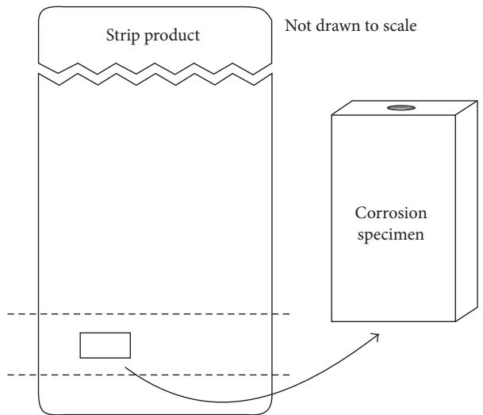  
Figure 2: Preparation of corrosion specimens from the hot rolled strip.

Corrosion specimens (15 mm 10 mm 3 mm) were machined from the strip product of the round ingots. Še strip plate had approximate dimensions of 33 cm by 15 cm with thickness of 3.77 mm. Specimens were cut from the delineated area (Figure 2) by  rst rough cutting the plate on a band saw, then squaring the material on a milling machine. Metal samples were further squared using carbide end mills and face mills to achieve a better  nish. A 3–48 threaded hole was then tap drilled on one of the 10 by 3 mm ends. For the last step, an abrasive slurry of silicon carbide and a lapping machine were used to remove tool marks from the sides and faces of the samples.

Prior to electrochemical testing, bare corrosion specimens were wet ground through a 600-grit  nish using SiC grinding paper, degreased with acetone, and air dried. Specimens were screwed tightly at the end of a threaded rod sample holder before immersion in the electrolyte solution.

Before each electrochemical test, metal specimens are kept at a potential of 800 mV more negative than the free potential for 2 minutes, and the open circuit potential $( E _ { \mathrm { o c } } )$ was measured for 30 minutes.

Potentiodynamic polarization measurements were carried out to evaluate the anodic electrochemical behavior and determine susceptibility to general and pitting corrosion of the alloys by applying a  xed voltage scan rate of 1 mV/s from an initial potential of −0.25 V versus $E _ { \mathrm { o c } }$ to a  nal potential of 1.6 V versus $E _ { \mathrm { o c } } .$

Cyclic potentiodynamic polarization measurements were performed to determine relative susceptibility to localized corrosion. Šese tests were performed at a  xed voltage scanning rate of 1 mV/s. Še initial potential scan started at −0.25 V versus $E _ { \mathrm { o c } }$ to an anodic potential of 1.5 V versus $E _ { \mathrm { o c } }$ where the potential value was reversed to the initial value.

Electrochemical impedance spectroscopy (EIS) is a nondestructive technique to evaluate the performance of passive  lm formation on an alloy. Measurements were carried out in the potentiostatic mode using a frequency range between 100 kHz and 10 mHz while applying an amplitude of the AC signal of 10 mV rms.

## 3. Results and Discussion

3.1. Microstructure Characterization. Še average grain size for the microstructure of HEAs A35 and A36 is 40 μm (std. dev.: 4.8) and 86 μm (std. dev.: 7.5), respectively. Šis was determined using the linear intersect technique on images presented in Figures 3(a) and 3(b). Še size di¦erence of the grain is attributed to the hot working process of A35 (900°C) versus A36 (1100°C). Še optical micrographs reveal an equiaxed grain structure indicating full recrystallization during the forging and rolling processes. Furthermore, SEM observation at higher magni cations (not shown) revealed a single-phase microstructure being in agreement with the predictions presented in Figure 1 with only small inclusions from casting. No μ phase was observed. Še electrochemical behavior of the alloys is a¦ected by changes in grain renement by introducing more grain boundaries, modifying grain orientation, and hindering dislocation motion [36]. Finer grain size leads to greater grain boundaries, acting as weak spots for preferential corrosion initiation sites. SEM images of the cross section of samples A35 and A36 can be seen in Figures 4(a) and 4(b), respectively, where the formation of a protective passive layer along the grain boundaries ofalloy A36 (also seen in Figures 5(d) and 5(e)) con rms the e¦ect of grain size on the corrosion resistance of this alloy after electrochemical polarization experiments. On the other hand, alloy A35 presents further attack ofa less e¦ective passive layer at initiation sites leading to localized corrosion.

3.2. Electrochemical Testing. Potentiodynamic polarization curves of all specimens are shown in Figure 6. Še corrosion resistance of alloys C-276 and SS316 under aqueous conditions has been extensively studied in the literature [37–39], and their corrosion mechanisms are not discussed here. HEAs A35 and A36 and commercial alloys C-276 and SS316 do not exhibit an anodic active region represented by a straight potential-current line in 3.5 wt.% NaCl. However, the cathodic reaction seen as a straight line indicates electrontransfer control. All the alloys present passive regions making them less susceptible to general corrosion. HEA A35 presents a pseudopassive curve with a breakdown potential of 0.32 V versus SCE where metastable pitting starts occurring. HEA A36 displays the highest breakdown potential at 0.91 V versus SCE, making it less susceptible to localized corrosion. Alloy C-276 exhibits three regions, a passive region with a breakdown potential of 0.74 V versus SCE, a transpassive region, and a secondary passive region with a potential of 1.12 V versus SCE. Finally, alloy SS316 has the lowest breakdown potential (0.27 V versus SCE) of all evaluated materials.

In this study, the NaCl solution has an initial pH of 8.4 before potentiodynamic polarization experiments were

(b)

(a)

50 μm  
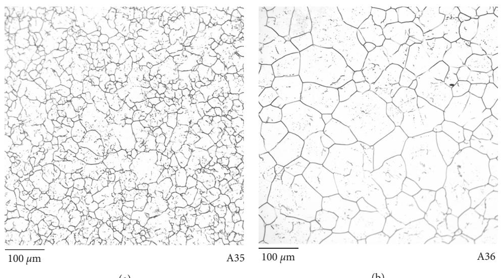  
Figure 3: Micrograph of the as-cast HEAs A35 (a) and A36 (b).

carried out. Še  nal pH of the solution was measured as 10.9 for alloy A35 and 10.1 for A36.

Alloy A35 underwent pseudopassive behavior between its corrosion potential $\left( E _ { \mathrm { c o r r } } \right) \mathrm { o f } - 0 . 2 9 \mathrm { V }$ versus SCE (−0.05 versus SHE) and its breakdown potential $( E _ { \mathrm { b r e } } )$ of 0.32 V versus SCE (0.56 V versus SHE). At these potentials and according to Pourbaix diagrams [40], Co, Fe, and Ni are active species while Cr is passive. Še passivation of the alloy is caused by the formation ofa stable chromium oxide layer on the surface in the form of $2 \mathrm { C r ~ + ~ } 3 \mathrm { H } _ { 2 } \mathrm { O } \ = \ 2 \mathrm { C r } _ { 2 } \mathrm { O } _ { 3 } + 6 \mathrm { H } ^ { + } + 6 e ^ { - }$ . Še breakdown of this oxide layer is the  rst step in the localized damage of this protective layer by the chemical attack of aggressive species such as chlorides. Še oxide  lm is locally attacked $\mathrm { C r _ { 2 } ^ { - } \mathrm { \bar { O } _ { 3 } ~ + ~ 5 H _ { 2 } O ~ = ~ 2 C r O _ { 4 } ^ { 2 - } ~ + ~ 1 0 H ^ { + } + 6 } } e ^ { - }$ at weak spots, where inclusions or mechanical §aws permit the transport of ions (accelerated by chloride ions) at these sites forming anodic active behavior [41].

At the $E _ { \mathrm { b r e } } ,$ nucleation, growth, and repassivation of metastable pits occur where the passive  lm has broken down possibly initiated by sulfur inclusions. Še standard cell potential $( E _ { \mathrm { c e l l } } ^ { 0 } )$ of the galvanic couple Ni-Co and Ni-Fe was determined by (2), and its Gibbs free energy $( \Delta G ^ { 0 } )$ is given by (3), where n is the number of electrons passed per atom of Ni reacted and F is the charge on a mole of electrons (96485.33 C/mol) [42, 43]. In both cases, Ni is the cathode, and the half reactions are shown below [44]:

$$
E _ { \mathrm { c e l l } } ^ { 0 } = E _ { \mathrm { c a t h o d e } } ^ { 0 } - E _ { \mathrm { a n o d e } } ^ { 0 } ,\tag{2}
$$

$$
\Delta G ^ { 0 } = - n \mathrm { F E } _ { \mathrm { c e l l } } ^ { 0 } ,\tag{3}
$$

$$
\mathrm { N i ^ { 2 + } } + 2 e ^ { - } = \mathrm { N i } , \qquad E ^ { 0 } = - 0 . 2 6 \mathrm { V } \mathrm { v e r s u s } \mathrm { S H E } ,
$$

$$
\begin{array} { r } { \begin{array} { r } { \mathrm { C o } ^ { 2 + } + 2 e ^ { - } = \mathrm { C o } , \quad E ^ { 0 } = - 0 . 2 8 \mathrm { V } \mathrm { v e r s u s } \mathrm { S H E } , } \end{array} } \end{array}\tag{4}
$$

$$
\begin{array} { r } { \mathrm { F e } ^ { 2 + } + 2 e ^ { - } = \mathrm { F e } , \qquad E ^ { 0 } = - 0 . 4 5 \mathrm { V } \mathrm { v e r s u s } \mathrm { S H E } . } \end{array}
$$

Predominant nickel dissolution species according to Pourbaix diagrams and later studied by Beverskog and Puigdomenech [45] appear as $\mathrm { N i } = \mathrm { N i } ^ { 2 + } + 2 e ^ { - }$ in the  rst stage, then transition as pH increases to ionic species precipitating in solution by hydrolysis $\mathrm { N i ^ { 2 + } + O H ^ { - } = N i O \bar { H } ^ { + } }$ and further react to $\mathrm { N i ^ { 2 + } } + \dot { 3 } \mathrm { O H ^ { - } } = \mathrm { N i } ( \mathrm { O H } ) _ { 3 } ^ { - }$ . Še ratio of

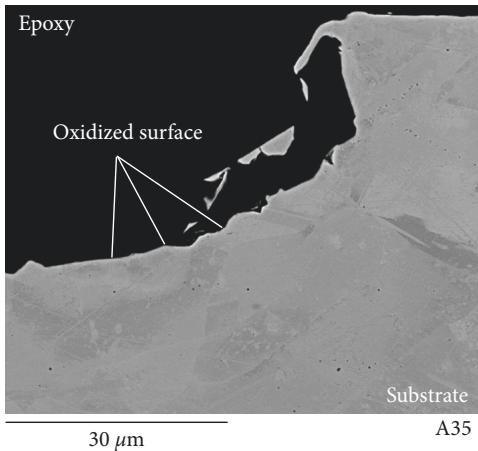

(a)  
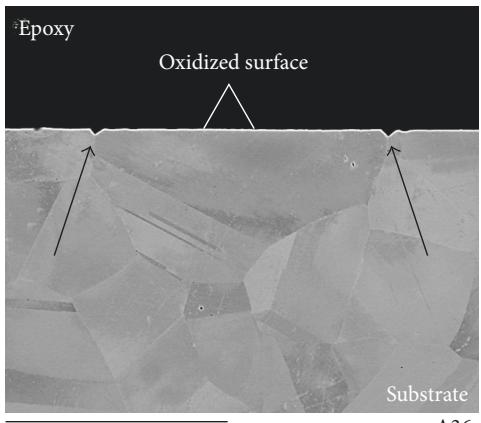  
(b)  
Figure 4: SEM micrographs of alloys A35 (a) and A36 (b) after potentiodynamic polarization experiments (cross sections).

A35  
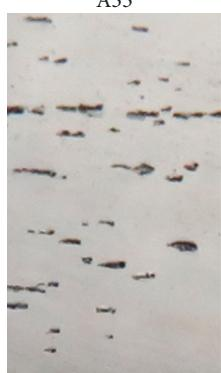  
0.2 cm

A36  
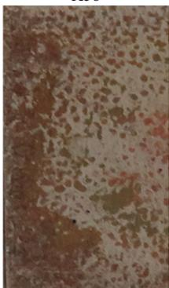

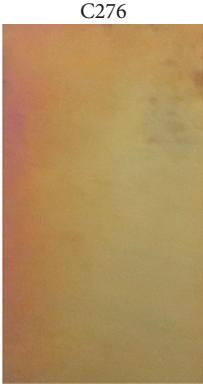  
(a)

SS316  
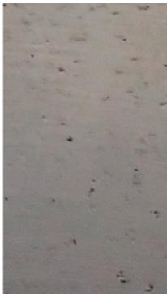

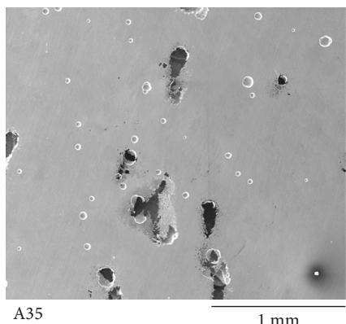

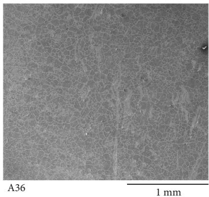  
(c)

(b)  
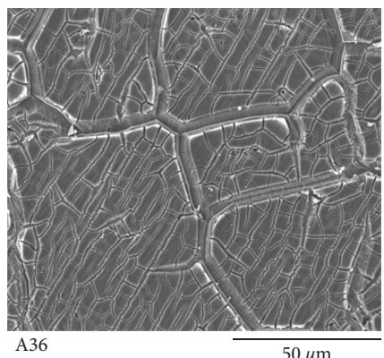  
(d)

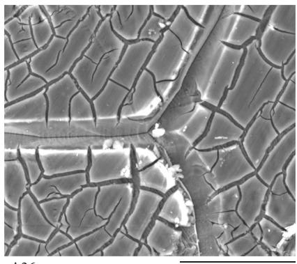  
20 μm  
(e)  
Figure 5: Photographs (a), SEM images of HEA A35 (b), and HEA A36 at di¦erent magni cations (c, d, e) after anodic polarization exposure of samples in 3.5 wt.% NaCl solution at 25°C.

Ni : Co and Ni : Fe in the alloy is 2 : 1, resulting on higher current density on the anode, favoring corrosion of Fe and Co. Results of $E _ { \mathrm { c e l l } } ^ { 0 }$ for the Ni-Co galvanic couple is 0.02 V versus SHE, while for Ni-Fe is 0.19 V versus SHE. Both reactions occur spontaneously as $\Delta G ^ { 0 }$ was calculated as −4.44 KJ/mol for Ni-Co and −36.66 KJ/mol for Ni-Fe.

Šermodynamically stable species ofFe and Co are formed from anodic oxidation processes, and Pourbaix diagrams indicate the following path for Fe and $\mathrm { C o } ,$ respectively: Fe $\mathrm { F e } ^ { 2 + } + 2 e ^ { - }$ and $2 \mathrm { F e } ^ { \sim } \ : \stackrel { \sim } { + } \ : 3 \mathrm { H } _ { 2 } \mathrm { O } \ : = \ : \mathrm { F e } _ { 2 } \mathrm { O } _ { 3 } \ : + \ : 6 \dot { \mathrm { H } ^ { + } } \ : + \ : 6 \dot { e ^ { - } } ; \mathrm { C o } \ : =$ $\mathrm { C o } ^ { 2 + } + 2 e ^ { - } ; \mathrm { a n d } \mathrm { C o } + 2 \bar { \mathrm { H } _ { 2 } } \mathrm { O } = \bar { \mathrm { C o } } ( \mathrm { O H } ) _ { 2 } + 2 \mathrm { H } ^ { + } + 2 e ^ { - }$ Še pseudopassive area of alloy A36 lies between its $E _ { \mathrm { c o r r } }$ of −0.26 V versus SCE (−0.02 versus SHE) and $E _ { \mathrm { b r e } }$ of 0.91 V versus SCE (1.15 V versus SHE). $\mathrm { C o } , \mathrm { F e } ,$ and Ni are active species at these potentials while Cr and Mo are passive. In addition to the formation of a layer of chromium oxide $( \mathrm { C r } _ { 2 } \mathrm { O } _ { 3 } )$ , responsible for the passive behavior, Mo increases the stability of the protective layer and enhances $E _ { \mathrm { b r e } }$ by precipitation of Mo species on the surface at pH values higher than $8 . 0 ~ [ 1 6 , 4 \bar { 6 , ~ } 4 7 ] ~ \mathrm { M o } ~ + ~ 2 \mathrm { H } _ { 2 } \mathrm { O } =$ $\mathrm { M o O } _ { 2 } ~ + ~ 4 \mathrm { H } ^ { + } + 4 e ^ { - }$ . Studies have shown that not only Mo interacts with S by removing it from the surface, but it contributes to localized repair of local weak spots [47]. Transpassivity of Mo occurs by further oxidation at higher potentials $\mathrm { \dot { M } o O _ { 2 } } ^ { \cdot } + 2 H _ { 2 } O = \mathrm { M o O } _ { 4 } ^ { 2 - } + 4 H ^ { + } + 2 e ^ { - } \ [ 4 1 , \stackrel { \sim } { 4 } 8 ]$

As it was discussed for alloy A35, Ni, Fe, and Co species preferentially dissolve in solution. Šis corrosion mechanism further contributes to Mo enrichment on alloy A36 surface leading to greater corrosion resistance properties.

Electrochemical parameters $( E _ { \mathrm { c o r r } } )$ , corrosion current density $( i _ { \mathrm { c o r r } } )$ , and breakdown potential $( E _ { \mathrm { b r e } } )$ are shown in Table 2 where the corrosion rate (CR) is determined by

$$
\mathrm { C R } = { \frac { I _ { \mathrm { c o r r } } \cdot K \cdot \mathrm { E W } } { d \cdot A } } ,\tag{5}
$$

where $I _ { \mathrm { c o r r } }$ is the corrosion current in amperes and calculated using the Tafel extrapolation method where the cathodic reaction is di¦usion controlled; K is a constant equal to $3 . 2 7 \times 1 0 ^ { 3 }$ with units of mm/y; the equivalent weight (EW) is a dimensionless unit that represents the mass of the metal species that will react with one Faraday of charge; d is the density of the metal in $\mathrm { g } / \mathrm { c m } ^ { 3 } ;$ ; and A is the area exposed to corrosion [49].

Calculated corrosion rate values are similar with very small variations from each other. Accordingly, results of $E _ { \mathrm { c o r r } }$ and $i _ { \mathrm { c o r r } }$ fall within comparable ranges in the transition process of cathodic and anodic half reactions in the polarization curves.

Localized attack in the form of pitting corrosion was seen in metal alloys A35 and SS316 after potentiodynamic polarization tests (Figure 5(a)). Še average pit size and pitting density area for A35 and SS316 are 0.19 μm (6.2%) and 0.03 μm (7.7%), respectively. In contrast, A36 and C-276 developed the formation of a passive  lm due to a high breakdown potential, increasing resistance to pitting or crevice corrosion. Even though chromium content promotes the formation of this passive  lm in aqueous solutions under potentiodynamic polarization, lm stability increases with content of molybdenum [38].

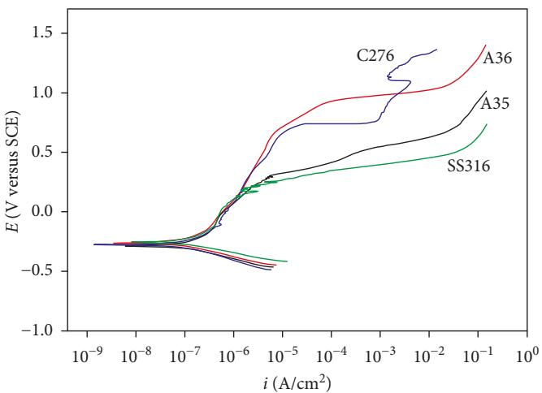  
Figure 6: Potentiodynamic polarization curves of HEAs A35 and A36 and commercial alloys C-276 and SS316 in 3.5 wt.% NaCl solution saturated at 25°C.

Table 2: Electrochemical parameters for HEAs A35 and A36 and commercial alloys C-276 and SS316 in 3.5 wt.% NaCl solution at 25°C.
<table><tr><td>Alloy</td><td> $\underline { { E _ { \mathrm { c o r r } } \left( \mathrm { V } \right. } }$  versus SCE)</td><td> $\underline { { E _ { \mathrm { { b r e } } } \left( \mathrm { { V } } \right. } }$  versus SCE)</td><td> $\underline { { i _ { \mathrm { c o r r } } \ ( A / \mathrm { c m } ^ { 2 } ) } }$ </td><td>CR (mpy)</td></tr><tr><td>A35</td><td>-0.29</td><td>0.32</td><td> $1 . 2 9 \times 1 0 ^ { - 7 }$ </td><td>0.052</td></tr><tr><td>A36</td><td>-0.26</td><td>0.91</td><td> $1 . 2 5 \times { { 1 0 } ^ { - 7 } }$ </td><td>0.048</td></tr><tr><td>C-276</td><td>-0.28</td><td>0.74</td><td> $1 . 2 8 \times { { 1 0 } ^ { - 7 } }$ </td><td>0.056</td></tr><tr><td>SS316</td><td>-0.25</td><td>0.27</td><td> $1 . 1 1 \times { { 1 0 } ^ { - 7 } }$ </td><td>0.049</td></tr></table>

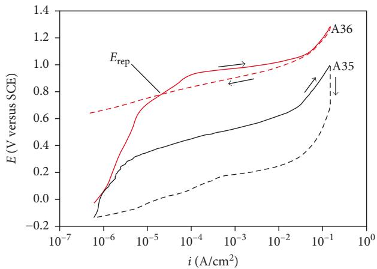  
(a)

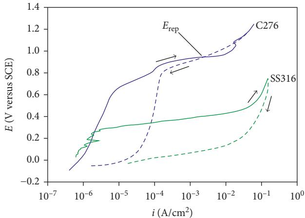  
(b)  
Figure 7: Cyclic anodic polarization curves of A35, A36, C-276, and SS316 alloys in 3.5 wt.% NaCl solution at $2 5 ^ { \circ } \mathrm { C } .$

SEM images revealed large pitting corrosion evolution in sample A35 (Figure 5(b)) and the formation of an inner amorphous corrosion layer in sample A36 (Figure 5 (c)). Similar to other studies [50], the  ne scale channels in Figures 5(d) and 5(e) (cracking of the inner amorphous corrosion layer) are attributed to the dehydration e¦ect during sample storage. However, the larger channels most likely follow the grain boundaries (arrows in Figure 4(b)).

Cyclic anodic polarization curves of A35, A36, C-276, and SS316 alloys are shown in Figure 7. Še behavior of the potential at which the hysteresis loop is completed upon reverse polarization scan determines the susceptibility to the initiation of localized corrosion.

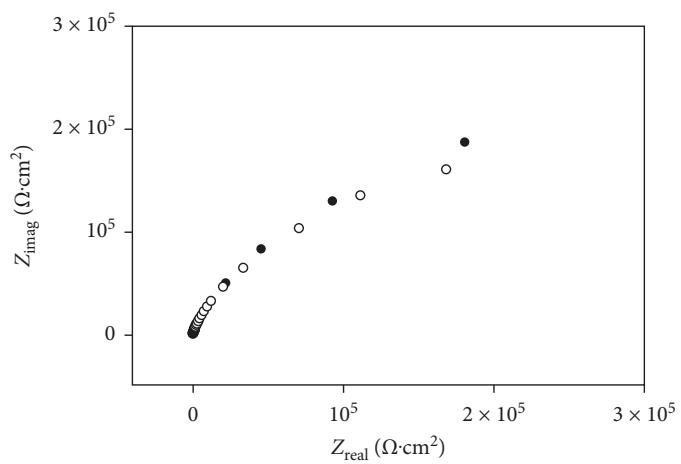

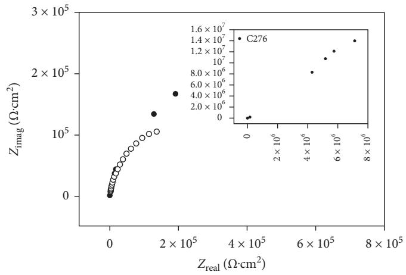  
(b)

(a)  
Figure 8: Nyquist plots of A35, A36, C-276, and SS316 alloys in 3.5 wt.% NaCl solution at 25°C.  
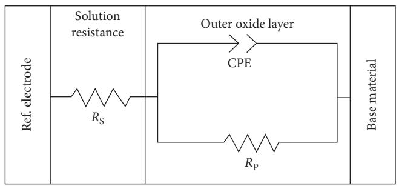  
(a)

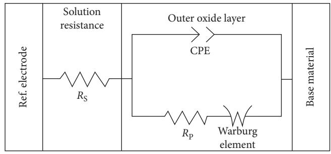  
(b)  
Figure 9: Equivalent electrical circuit (a) used for  tting experimental data ofalloy SS316, while circuit (b) was used for A35, A36, and C-276 alloys. $R _ { s }$ is the resistance of the electrolyte solution, $R _ { p }$ is the oxide layer resistance, and CPE accounts for a nonideal capacitor.

Table 3: Electrochemical parameters for A35, A36, C-276, and SS316 alloys in 3.5 wt.% NaCl solution at $2 5 \mathrm { ^ \circ C } .$
<table><tr><td>Alloy</td><td> $R _ { p } \ ( \Omega { \cdot } \mathrm { c m } ^ { 2 } )$ </td><td> $R _ { u } \ ( \Omega \cdot \mathrm { c m } ^ { 2 } )$ </td><td> $C _ { \mathrm { C P E } } \ \mathrm { ( F / c m } ^ { 2 } )$ </td><td>α</td><td> $W _ { d } ~ ( \mathrm { S } / \mathrm { s } ^ { 0 . 5 } )$ </td></tr><tr><td>A35</td><td> $3 . 4 9 \times 1 0 ^ { 5 }$ </td><td>1.51</td><td> $2 . 0 0 \times { { 1 0 } ^ { - 4 } }$ </td><td>0.88</td><td> $1 . 7 9 \times { { 1 0 } ^ { - 4 } }$ </td></tr><tr><td>A36</td><td> $3 . 4 5 \times 1 0 ^ { 5 }$ </td><td>2.36</td><td> $2 . 1 7 \times { { 1 0 } ^ { - 4 } }$ </td><td>0.89</td><td> $1 . 0 6 \times 1 0 ^ { 0 }$ </td></tr><tr><td>C-276</td><td> $3 . 7 1 \times 1 0 ^ { 5 }$ </td><td>8.23</td><td> $7 . 2 9 \times 1 0 ^ { - 4 }$ </td><td>0.89</td><td> $9 . 8 3 \times { { 1 0 } ^ { - 1 } }$ </td></tr><tr><td>SS316</td><td> $2 . 6 1 \times 1 0 ^ { 5 }$ </td><td>2.68</td><td> $4 . 3 7 \times { { 1 0 } ^ { - 4 } }$ </td><td>0.85</td><td></td></tr></table>

Although all alloys display hysteresis under this high anodic polarization, A36 and C-276 have signi cantly higher $E _ { \mathrm { b r e } }$ and repassivation potentials $( E _ { \mathrm { r e p } } )$ than the A35 and SS316 alloys. Consequently, A36 and C-276 are relatively more resistant to pitting corrosion than A35 and SS316 in this environment, due mainly to a small potential di¦erence between $E _ { \mathrm { r e p } }$ and $E _ { \mathrm { b r e } }$

A theoretical indication can also be con rmed by evaluating the pitting resistant equivalent (PRE) value of C-276 and SS316. Šese values are based on the chemical composition of an alloy, with values of 45 and 21 for C-276 and SS316, respectively [51].

Higher values provide higher corrosion resistance, but may lead to the potential formation of sigma and alpha prime phase. Values in the range of 40–45 will minimize formation of these phases and are desired in the industry [52].

Electrochemical impedance spectroscopy measurements of all alloys studied in this work are represented as Nyquist plots in Figure 8. Experimental data were  t using the equivalent electrical circuits in Figure 9, while electrochemical parameters for each alloy are shown in Table 3.

Še circuit model Rs (CPE//Rp) in Figure 8(a) was used for  tting the experimental impedance data for alloy SS316. Šis circuit includes the resistance of the electrolyte solution $R _ { s }$ in series with a parallel combination of a constant phase element (CPE)—accounting for a nonideal capacitor—and the oxide layer resistance $( \bar { R } _ { p } )$ . Experimental data for alloys A35, A36, and C-276 were fitted using the circuit model in Figure 8(b) where Warburg impedance element $( W _ { d } )$ represents difusive processes (mass transfer) on the surface.

,e charge transfer at the metal/electrolyte interface is directly related to the passive film properties of the surface. Higher corrosion resistance was observed for the C-276 alloy due to its passivation ability.

## 4. Conclusions

,e corrosion behavior of HEAs from the CoCrFeNi and $\mathrm { C o C r F e N i _ { 2 } M o _ { 0 . 2 5 } }$ systems was evaluated in a nondeaerated solution of3.5 wt.% NaCl at $2 5 \mathrm { ^ \circ C } ,$ and their performance was compared to commercial alloys C-276 and SS316 via electrochemical testing.

,e electrochemical behavior of the alloys is afected by changes in grain refinement. Finer grain size of alloy A35 presented an increase of weak spots for pitting initiation at preferential sites. On the other hand, alloy A36 formed a protective passive layer along the grain boundaries contributing to higher corrosion resistance.

Potentiodynamic polarization results indicated that chloride ions adsorb on the metal surface of alloys A35 and SS316 breaking down passivity. ,e attack of this passivity is localized and favors the formation of pits, seen during microscopic imaging analysis. ,e pit size observed on A35 and SS316 was 0.19 μm and 0.03 μm, respectively. A higher content of molybdenum in SS316 may result in a better stability of the passive layer compared to A35.

In the case of alloys A36 and C-276, potentiodynamic polarization results indicated that both passivate in NaCl forming a protective layer against pitting corrosion. Microscopic investigations revealed no formation of pits and a cracked film on the surface of alloy A36, due to a possible film dehydration efect after electrochemical experiments.

Alloy A35 underwent pseudopassive behavior between its $E _ { \mathrm { c o r r } } \ \mathrm { o f } \ - 0 . 2 9 \mathrm { V }$ versus SCE (−0.05 versus SHE) and its $E _ { \mathrm { b r e } }$ of 0.32 V versus SCE (0.56 V versus SHE). Passivation of the alloy is caused by the formation of $\mathrm { C r } _ { 2 } \mathrm { O } _ { 3 } ,$ yet chemical attack of chlorides initiates breakdown of this oxide layer and initiation of pitting corrosion. Ni acts as the cathode on the galvanic couple Ni-Co and Ni-Fe, where Ni species dissolve and precipitate in solution by hydrolysis. Higher concentration of Ni favors corrosion of Fe and Co species.

,e pseudopassive area ofalloy A36 lies between its $E _ { \mathrm { c o r r } }$ of −0.26 V vesus SCE (−0.02 versus SHE) and $E _ { \mathrm { b r e } } \thinspace \mathrm { o f } \thinspace 0 . 9 1 $ V versus SCE (1.15 V versus SHE). In addition to the formation ofa layer $\mathrm { { o f } C r _ { 2 } O _ { 3 } , }$ responsible for the passive behavior, Mo increases the stability of the protective layer and enhances $E _ { \mathrm { b r e } }$ by precipitation of MoO on the surface at pH values higher than 8.0. Transpassivity of Mo occurs by further oxidation at higher potentials: $\mathrm { M o O } _ { 2 } \ + \ 2 \mathrm { H } _ { 2 } \mathrm { O } \ = \ \mathrm { M o O } _ { 4 } ^ { 2 - } \ + \ 4 \mathrm { H } ^ { + } \ + \ 2 e ^ { - }$ . As it was discussed for alloy A35, Ni, Fe, and Co species preferentially dissolve in solution to further contribute to Mo enrichment on alloy A36 surface leading to greater corrosion resistance properties.

,e results obtained from cyclic polarization experiments revealed large hysteresis and less electropositive potentials for alloys A35 and SS316, indicating the susceptibility of pitting corrosion. Alloys A36 and C-276 developed a passive layer after potentiodynamic polarization and exhibited a small potential diference between $E _ { \mathrm { r e p } }$ and $E _ { \mathrm { b r e } } ,$ making them more resistant to pitting corrosion in NaCl.

Electrochemical impedance spectroscopy results indicate that alloy C-276 had the highest charge transfer value at the metal/electrolyte interface. ,is parameter represents favorable characteristics ofthe passive film and consequently higher corrosion resistance due to its passivation ability in NaCl.

,e role of molybdenum on the corrosion performance of HEAs A35 and A36 demonstrated its influence on the passivation ability of A36 by (1) providing a corrosion protective layer and (2) avoiding the evolution of pitting corrosion. ,e formation and stability of this passive layer was highly influenced by Mo content in C-276 (16 wt.% versus 7.64 wt% in A36).

## Disclosure

,is report was prepared as an account ofwork sponsored by the Department of Energy, National Energy Technology Laboratory, an agency of the United States government, through a support contract with AECOM. Neither the United States government nor any agency thereof, nor any of their employees, makes any warranty, expressed or implied, or assumes any legal liability or responsibility for the accuracy, completeness, or usefulness of any information, apparatus, product, or process disclosed or represents that its use would not infringe privately owned rights. Reference herein to any specific commercial product, process, or service by trade or name, trademark, manufacturer, or others does not necessarily constitute or imply its endorsement, recommendation, or favoring by the United States government or any agency thereof. ,e views and opinions of authors expressed herein do not necessarily state or reflect those ofthe United States government or any agency thereof.

## Conflicts of Interest

,e authors declare that they have no conflicts of interest.

## Acknowledgments

,e authors would like to thank Mr. Edward Argetsinger and Mr. Joseph Mendenhall for assistance in melting, Mr. Trevor Godell in machining the corrosion samples, and Mr. Matt Fortner and Christopher McKaig in sample preparation. ,is research was supported in part by an appointment to the U.S. Department of Energy (DOE) Postgraduate Research Program at the National Energy Technology Laboratory (NETL) administered by the Oak Ridge Institute for Science and Education. Research performed by AECOM Staf was conducted under the RES Contract DE-FE-0004000.

## References

[1] M. C. Gao, C. Zhang, P. Gao et al., “,ermodynamics of concentrated solid solution alloys,” Current Opinion in Solid State and Materials Science, vol. 21, no. 5, pp. 238–251, 2017, in press.

[2] G. R. Holcomb, J. Tylczak, and C. Carney, “Oxidation of CoCrFeMnNi high entropy alloys,” Journal of the Minerals, Metals & Materials Society (JOM), vol. 67, no. 10, pp. 2326– 2339, 2015.

[3] P. D. Jablonski, J. J. Licavoli, M. C. Gao, and J. A. Hawk, “Manufacturing of high entropy alloys,” Journal of ;e Minerals, Metals & Materials Society (JOM), vol. 67, no. 10, pp. 2278–2287, 2015.

[4] M. C. Gao, J.-W. Yeh, P. K. Liaw, and Y. Zhang, High-Entropy Alloys: Fundamentals and Applications, Springer, Cham, Switzerland, 2016.

[5] D. Miracle, J. Miller, O. Senkov, C. Woodward, M. Uchic, and J. Tiley, “Exploration and development of high entropy alloys for structural applications,” Entropy, vol. 16, no. 1, pp. 494– 525, 2014.

[6] M.-H. Tsai and J.-W. Yeh, “High-entropy alloys: a critical review,” Materials Research Letters, vol. 2, no. 3, pp. 107–123, 2014.

[7] Y. Y. Chen, U. T. Hong, H. C. Shih, J. W. Yeh, and T. Duval, “Electrochemical kinetics of the high entropy alloys in aqueous environments—a comparison with type 304 stainless steel,” Corrosion Science, vol. 47, no. 11, pp. 2679–2699, 2005.

[8] Y. Y. Chen, T. Duval, U. D. Hung, J. W. Yeh, and H. C. Shih, “Microstructure and electrochemical properties of high entropy alloys—a comparison with type-304 stainless steel,” Corrosion Science, vol. 47, no. 9, pp. 2257–2279, 2005.

[9] Y.-J. Hsu, W.-C. Chiang, and J.-K. Wu, “Corrosion behavior ofFeCoNiCrCux high-entropy alloys in 3.5% sodium chloride solution,” Materials Chemistry and Physics, vol. 92, no. 1, pp. 112–117, 2005.

[10] H. C. Shih, C. P. Lee, Y. Y. Chen, C. H. Wu, C. Y. Hsu, and J. W. Yeh, “Efect of boron on the corrosion properties of Al0.5CoCrCuFeNiBx high entropy alloys in 1N sulfuric acid,” ECS Transactions, vol. 2, no. 26, pp. 15–33, 2007.

[11] C.-Y. Hsu, J.-W. Yeh, S.-K. Chen, and T.-T. Shun, “Wear resistance and high-temperature compression strength of Fcc CuCoNiCrAl0.5Fe alloy with boron addition,” Metallurgical and Materials Transactions A, vol. 35, no. 5, pp. 1465–1469, 2004.

[12] C. P. Lee, C. C. Chang, Y. Y. Chen, J. W. Yeh, and H. C. Shih, “Efect of the aluminium content of AlxCrFe1.5MnNi0.5 high-entropy alloys on the corrosion behaviour in aqueous environments,” Corrosion Science, vol. 50, no. 7, pp. 2053– 2060, 2008.

[13] C. P. Lee, Y. Y. Chen, C. Y. Hsu, J. W. Yeh, and H. C. Shih, “Enhancing pitting corrosion resistance of AlxCr-Fe1.5MnNi0.5 high-entropy alloys by anodic treatment in sulfuric acid,” ;in Solid Films, vol. 517, no. 3, pp. 1301–1305, 2008.

[14] Y. L. Chou, Y. C. Wang, J. W. Yeh, and H. C. Shih, “Pitting corrosion of the high-entropy alloy Co1.5CrFeNi1.5- Ti0.5Mo0.1 in chloride-containing sulphate solutions,” Corrosion Science, vol. 52, no. 10, pp. 3481–3491, 2010.

[15] Y. L. Chou, J. W. Yeh, and H. C. Shih, “Efect of inhibitors on the critical pitting temperature of the high-entropy alloy Co1.5CrFeNi1.5Ti0.5Mo0.1,” Journal of the Electrochemical Society, vol. 158, no. 8, pp. C246–C251, 2011.

[16] Y. L. Chou, J. W. Yeh, and H. C. Shih, “,e efect of molybdenum on the corrosion behaviour of the high-entropy alloys Co1.5CrFeNi1.5Ti0.5Mox in aqueous environments,” Corrosion Science, vol. 52, no. 8, pp. 2571–2581, 2010.

[17] C.-M. Lin and H.-L. Tsai, “Evolution of microstructure, hardness, and corrosion properties of high-entropy Al0.5CoCrFeNi alloy,” Intermetallics, vol. 19, no. 3, pp. 288–294, 2011.

[18] Y.-F. Kao, T.-D. Lee, S.-K. Chen, and Y.-S. Chang, “Electrochemical passive properties of AlxCoCrFeNi (x � 0, 0.25, 0.50, 1.00) alloys in sulfuric acids,” Corrosion Science, vol. 52, no. 3, pp. 1026–1034, 2010.

[19] O. N. Do¨ gan, B. C. Nielsen, and J. A. Hawk, “Elevated-˘ temperature corrosion of CoCrCuFeNiAl0.5Bx high-entropy alloys in simulated syngas containing H2S,” Oxidation of Metals, vol. 80, no. 1, pp. 177–190, 2013.

[20] Z. Tang, L. Huang, W. He, and K. P. Liaw, “Alloying and processing efects on the aqueous corrosion behavior of high-entropy alloys,” Entropy, vol. 16, no. 12, pp. 895–911, 2014.

[21] J. Li, X. Yang, R. Zhu, and Y. Zhang, “Corrosion and serration behaviors of TiZr0.5NbCr0.5VxMoy high entropy alloys in aqueous environments,” Metals, vol. 4, no. 4, pp. 597–608, 2014.

[22] E. J. Pickering and N. G. Jones, “High-entropy alloys: a critical assessment of their founding principles and future prospects,” International Materials Reviews, vol. 61, no. 3, pp. 183–202, 2016.

[23] Y. Shi, B. Yang, and K. P. Liaw, “Corrosion-resistant highentropy alloys: a review,” Metals, vol. 7, no. 2, p. 43, 2017.

[24] Y. F. Ye, Q. Wang, J. Lu, C. T. Liu, and Y. Yang, “Highentropy alloy: challenges and prospects,” Materials Today, vol. 19, no. 6, pp. 349–362, 2016.

[25] J.-W. Yeh, “Alloy design strategies and future trends in highentropy alloys,” Journal of ;e Minerals, Metals & Materials Society (Jom), vol. 65, no. 12, pp. 1759–1771, 2013.

[26] Y. Zhang, T. T. Zuo, Z. Tang et al., “Microstructures and properties of high-entropy alloys,” Progress in Materials Science, vol. 61, pp. 1–93, 2014.

[27] D. B. Miracle and O. N. Senkov, “A critical review of high entropy alloys and related concepts,” Acta Materialia, vol. 122, pp. 448–511, 2017.

[28] InfoMine, “Mining markets and investment,” 2017, http://www. infomine.com/investment/.

[29] M. Gao and D. Alman, “Searching for next single-phase highentropy alloy compositions,” Entropy, vol. 15, no. 10, pp. 4504– 4519, 2013.

[30] B.-R. Chen, A.-C. Yeh, and J.-W. Yeh, “Efect of one-step recrystallization on the grain boundary evolution of CoCrFeMnNi high entropy alloy and its subsystems,” Scientific Reports, vol. 6, no. 1, p. 22306, 2016.

[31] ,ermo-Calc Software.

[32] M. Detrois and P. D. Jablonski, “Trace element control in binary Ni-25cr and ternary Ni-30co-30cr master alloy castings,” 2017.

[33] P. D. Jablonski, M. Cretu, and J. Nauman, “Considerations for the operation of a small scale ESR furnace,” in Proceedings of the Liquid Metal Processing & Casting Conference, pp. 157–162, Philadelphia, PA, USA, 2017.

[34] P. D. Jablonski and J. A. Hawk, “Homogenizing advanced alloys: thermodynamic and kinetic simulations followed by experimental results,” Journal of Materials Engineering and Performance, vol. 26, no. 1, pp. 4–13, 2017.

[35] ASTM, Standard Practice for Microetching Metals and Alloys, ASTM International, West Conshohocken, PA, USA, 2015.

[36] K. D. Ralston and N. Birbilis, “Efect of grain size on corrosion: a review,” Corrosion, vol. 66, no. 7, pp. 075005–075005-13, 2010.

[37] P. Crook, Corrosion of Nickel and Nickel-Base Alloys, vol. 13 of ASM Handbook, Corrosion: Materials, S. Cramer and B. Covino, Eds., ASM International, Materials Park, OH, USA.

[38] J. R. Davis, ASM Specialty Handbook: Stainless Steels, ASM International, Materials Park, OH, USA, 1994.

[39] J. Sedriks, Corrosion of Stainless Steels, John Wiley & Sons, Inc., Hoboken, NJ, USA, 2nd edition, 1996.

[40] M. Pourbaix, Atlas of Electrochemical Equilibria in Aqueous Solutions, NACE International, Houston, TX, USA, 1974.

[41] A. K. Mishra and D. W. Shoesmith, “,e activation/depassivation of nickel–chromium–molybdenum alloys: an oxyanion or a pH efect—Part II,” Electrochimica Acta, vol. 102, pp. 328–335, 2013.

[42] A. Bard and L. Faulkner, Electrochemical Methods-Fundamentals and Applications, John Wiley & Sons, Inc., Hoboken, NJ, USA, 2nd edition, 2001.

[43] NIST, “CODATA Value: Faraday constant,” 2017, https:// physics.nist.gov/cgi-bin/cuu/Value?f.

[44] P. Van´ysek, Electrochemical Series, in CRC Handbook of Chemistry and Physics, J. Rumble, Ed., CRC Press, Boca Raton, FL, USA.

[45] B. Beverskog and I. Puigdomenech, “Revised Pourbaix diagrams for nickel at 25–300°C,” Corrosion Science, vol. 39, no. 5, pp. 969–980, 1997.

[46] C. R. Clayton and Y. C. Lu, “A bipolar model of the passivity of stainless steels—III. ,e mechanism of MoO42− formation and incorporation,” Corrosion Science, vol. 29, no. 7, pp. 881–898, 1989.

[47] J. R. Hayes, J. J. Gray, A. W. Szmodis, and C. A. Orme, “Influence ofchromium and molybdenum on the corrosion of nickel-based alloys,” Corrosion, vol. 62, no. 6, pp. 491–500, 2006.

[48] U. Ojlpmakyul and A. Tyurin, ;e Revised Pourbaix Diagram for Molybdenum, 2014.

[49] ASTM, Standard Practice for Calculation of Corrosion Rates and Related Information from Electrochemical Measurements, ASTM International, West Conshohocken, PA, USA, 2015.

[50] Y. Hua, R. Barker, and A. Neville, “Comparison of corrosion behaviour for X-65 carbon steel in supercritical CO -saturated water and water-saturated/unsaturated supercritical CO ,” Journal of Supercritical Fluids, vol. 97, pp. 224–237, 2015.

[51] S. A. McCoy, B. C. Puckett, and E. L. Hibner, “High Performance Age-Hardenable Nickel Alloys Solve Problems in Sour Oil and Gas Service,” Stainless Steel World, vol. 4, pp. 48–52, 2002.

[52] NACE International, Petroleum and Natural Gas Industries— Materials for Use in H2S-Containing Environments in Oil and Gas Production, NACE International, Houston, TX, USA, 2015.

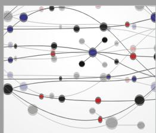  
The Scientific World Journal

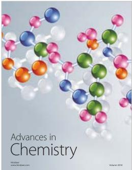

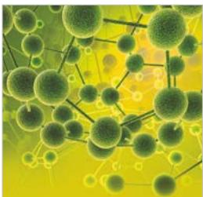  
International Journal of Analytical Chemistry

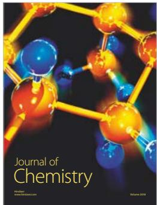  
Journal of Applied Chemistry

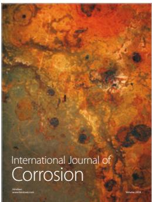

  
Scientica

  
International Journal of Biomaterials

Hindawi

Submit your manuscripts at www.hindawi.com

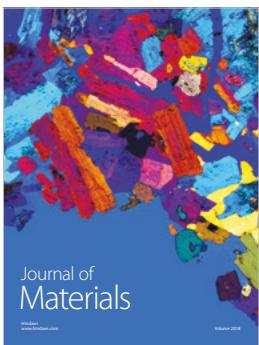

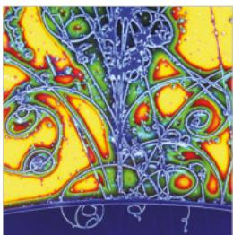  
Advances in High Energy Physics

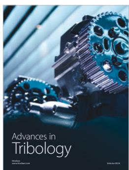

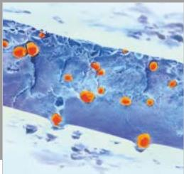  
International Journal of Polymer Science

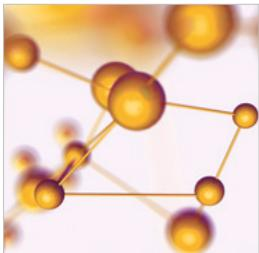  
Advances in Physical Chemistry

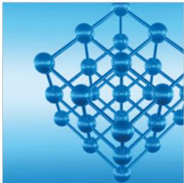  
Advances in Condensed Matter Physics

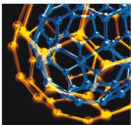  
Journal of Nanotechnology

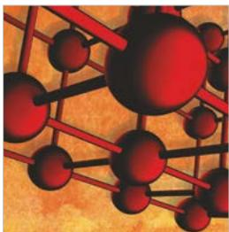  
Advances i Materials Science and Engineering