# Influence of Nitrogen on Electrochemical Passivation of High-Nickel Stainless Steels and Thin Molybdenum-Nickel Films

G.P. Halada, D. Kim, and C.R. Clayton\*

## ABSTRACT

The influence of molybdenum and nitrogen on passivation of the nickel-bearing austenitic stainless steels (SS) Fe-20% Cr-20% Ni, Fe-20% Cr-20% Ni-6% Mo, and Fe-20% Cr-20% Ni-6% Mo-0.2% N in deaerated 0.1 M hydrochloric acid (HCl) + 0.4 M sodium chloride (NaCl) was investigated using electrochemical and x-ray photoelectron spectroscopic (XPS) analyses. Electrochemical analyses showed molybdenum and nitrogen improved passivation characteristics through an apparent synergism. Evidence was found of a compositional reorganization of SS in the atomic layers of the alloy immediately below the passive film. Nickel and molybdenum appeared to become enriched in proportions that suggested molybdenum-nickel intermetallic bonding. This was augmented by alloyed nitrogen, which strongly governed the elemental enrichment process. The possible nature of the bonding of these elements was reviewed with respect to the Engel-Brewer model of intermetallic bonding. Variable-angle XPS and electrochemical polarization analysis in deaerated 0. 1 M HCl was performed on a MoNi radio frequency (RF) sputtered thin film that simulated the commonly observed composition of such a sublayer alloy for a nitrogen-bearing SS. To simulate nitrogen segregation, electrochemical deposition of nitrogen was performed on thin films of MoNi . Following polarization of nitrided and non-nitrided films, variable-angle XPS showed the alloy surface underwent further changes resulting from nickel dissolution. The endpoint composition of the alloy in each case below the passive film corresponded closely with known stable and intermediate intermetallic phases.

KEY WORDS: intermetallics, molybdenum, nickel, nitrogen, passivity, stainless steel, x-ray photoelectron spectroscopy

## INTRODUCTION

During anodic dissolution, the nitrogen in highnitrogen austenitic stainless steel (SS) is segregated to the surface, where it forms a relatively stable surface nitride phase.1-2 The presence of this nitride phase is associated with improvements in passivation and pitting resistance.1-7 Molybdenum, as an alloying element, is well known for its various roles in improving the passivation properties and pitting resistance of SS in acidic solution.7-9 Nitrogen, as an alloying element, has been shown to enhance effects of molybdenum in improving localized corrosion resistance and passivation characteristics through an apparent synergism that has not been explained.4,7,10-11

It has been reported previously that, during active dissolution and passivation, nickel, molybdenum, and nitrogen are enriched strongly in the alloy surface below the oxide passive film of austenitic SS.1,7,12-14 In some of the earliest studies using x-ray photoelectron spectroscopy (XPS) and austenitic SS exposed to high-temperature water15 or acidic environments,16 nickel was found to be enriched at the metal-solution interface in the metallic phase but not to any significant extent in the passive film. Since nickel does not participate directly in the formation of passive films of austenitic SS, most models of the passivity of austenitic SS try to explain the corrosion behavior in terms of chromium, molybdenum, and nitrogen. In recent studies, it was reported that metallic nickel underneath the passive film was

enriched during anodic polarization.7,9,14-15 This has led to speculation that one method by which nickel may contribute to passivation and improved pitting resistance is through reduction of the anodic dissolution rate following strong intermetallic bonding with chromium and molybdenum.

The Engel-Brewer model of intermetallic bonding would predict that bonding between hypo and hyper d-electron metals would be stronger for a hyper delectron metal such as nickel, with a hypo d-electron metal such as molybdenum in the second transition series as compared to chromium in the first transition series.16 Hence, the bonding model would suggest that strong anodic segregation of nickel and molybdenum would result from this preferential intermetallic bonding. The enhancement of nickel and molybdenum segregation in the presence of nitrogen would not be expected because, while molybdenum nitride is quite stable, nickel nitride is relatively unstable. However, the free energy-temperature data for molybdenum, nickel, and mixed molybdenum-nickel nitrides indicate the remarkable stability of the mixed-nitride phase $\mathrm { N i _ { 2 } M o _ { 3 } N }$ .17 This metallically conductive phase may derive strong lattice binding from nickel-molybdenum intermetallic bonding. Nitrogen, therefore, can be seen to facilitate segregation of nickel and molybdenum during anodic dissolution through the establishment of this mixed-nitride phase.

Previous work has indicated that, in the presence of nitrogen, iron anodic dissolution kinetics are accelerated, while those of chromium and molybdenum are retarded. The dissolution rate of nickel, however, is accelerated to a lesser extent. Therefore, it can be concluded that the overall segregation of nickel, chromium, and molybdenum in the presence of nitrogen is aided by the relatively higher selective dissolution of iron and the formation of a mixednitride phase consisting of nickel, molybdenum, and chromium. The greater abundance of chromium in the nitride phase would leave chromium able to further react with water to develop the main passive oxide film on SS. Such a reaction may occur as:

$$
\mathrm { 2 C r N + 3 H _ { 2 } O _ { a d s }  C r _ { 2 } O _ { 3 } + 2 N H _ { 3 } ( l i g a n d s ) }\tag{1}
$$

Previous work has shown that nitrogen-alloying and surface electrochemical nitriding of molybdenum and nickel containing SS in the same manner improve corrosion resistance in chloride (Cl–)-containing acidic media.1,7 Electrochemical nitriding of alloy surfaces has been shown to enhance the bipolar nature of the passive film through increased formation and incorporation of cation-selective species, such as molybdate $\left( \mathbf { M o O _ { 4 } } ^ { 2 - } \right)$ into the outer layers of the film. As first described by Sakashita and Sato and elaborated upon by others, a bipolar film consists of an anion-selective inner layer and a cation-selective

outer layer.18 Acting as an ionically conductive rectifier, the film supports the field that drives deprotonation. Hydrogen ions (protons) from bound water may pass out of the cation-selective outer layer, while oxygen migrates toward the metal-film interface, thickening the oxide diffusion barrier. It has been shown that electron acceptor anionic species such as $\mathbf { M o O _ { 4 } } ^ { 2 - }$ may be found in the cationselective layer.19 At higher anodic potentials, insoluble $\mathbf { M o O _ { 4 } } ^ { 2 - }$ complexes that block active dissolution may form, as long as a stable metal species is available to bind to the $\mathbf { M o O _ { 4 } } ^ { 2 - } . ^ { 2 0 }$ The enhanced production of $\mathbf { M o O _ { 4 } } ^ { 2 - }$ – most likely is a result of an increase in pH at the passive film-solution interface resulting from the reaction between the surface nitride and the electrolyte, as discussed above. Ammonia (NH ) produced by this reaction easily protonates to form ammonium ions $\mathrm { ( N H _ { 4 } ^ { + } ) }$ , thereby increasing localized pH and creating conditions favorable to $\mathbf { M o O _ { 4 } } ^ { 2 \cdot }$ formation.

The present study concerned the influence of the anodically segregated alloying elements nickel, molybdenum, and nitrogen on the passivation behavior of SS through the polarization and analysis of both high-nickel SS (Fe-20% Cr-20% Ni, Fe-20% Cr-20% Ni-6% Mo, and Fe-20% Cr-20% Ni-6% Mo-0.2% N) and surface-nitrided radio frequency (RF) sputterformed thin-film nickel-molybdenum intermetallics. To facilitate this study, it was necessary to fabricate nickel-molybdenum thin-film alloys that simulated the relative concentrations of these species in the anodically segregated sublayer of passivated austenitic SS. It has been demonstrated previously that an electrochemical surface nitriding process adequately simulates the nitrogen anodic segregation of a variety of complex SS. This process was applied to thin-film alloys of nickel and molybdenum in proportions observed in the sublayer of nitrogen-bearing austenitic SS that have undergone passivation, namely, a composition of Mo-80% Ni.

## EXPERIMENTAL

## Sample Preparation

Three different types of SS were used in this study: Fe-20% Cr-20% Ni, Fe-20% Cr-20% Ni-6% Mo, and Fe-20% Cr-20% Ni-6% Mo-0.2% N. Compositions of these alloys are listed in Table 1. These steels were annealed at 1,100°C for 3 h and quenched in water. Samples in coupon form (7 mm by 10 mm by 1 mm [0.276 in. by 0.394 in. by 0.039 in.]) were ground using 600-grit silicon carbide (SiC) paper, polished to a 0.25-µm diamond finish, and then cleaned ultrasonically in acetone and then in isopropanol. The samples then were rinsed with double-distilled water and mounted for electrochemical analysis.

Molybdenum-nickel thin films were made by RF sputtering a multiple composition target onto pol-

TABLE 1  
Chemical Composition of Stainless Steels Studied
<table><tr><td>Element</td><td>Fe-20% Cr-20% Ni</td><td>Fe-20% Cr-20% Ni-6% Mo</td><td>Fe-20% Cr- 20% Ni-6% Mo-0.2% N</td></tr><tr><td>Fe</td><td>59.58</td><td>54.83</td><td>53.88</td></tr><tr><td>Cr</td><td>20.12</td><td>19.86</td><td>19.74</td></tr><tr><td>Ni</td><td>20.18</td><td>19.98</td><td>19.74</td></tr><tr><td>Mo</td><td>0.01</td><td>5.99</td><td>5.96</td></tr><tr><td>N</td><td>0.011</td><td>0.011</td><td>0.19</td></tr><tr><td>C</td><td>0.004</td><td>0.006</td><td>0.005</td></tr><tr><td>Si</td><td>0.08</td><td>0.08</td><td>0.09</td></tr><tr><td>P</td><td>&lt; 0.003</td><td>0.01</td><td>0.009</td></tr><tr><td>S</td><td>22 ppm</td><td>21 ppm</td><td>22 ppm</td></tr><tr><td>Mn</td><td>0.18</td><td>0.20</td><td>0.14</td></tr><tr><td>W</td><td>0.02</td><td>0.03</td><td>0.03</td></tr></table>

TABLE 2  
Relative Sensitivity Factors, S, and Mean Free Paths, λ (Angstroms), for XPS Quantitative Analyses
<table><tr><td></td><td>Cr2p</td><td>Ni2p</td><td>Fe2p</td><td>Mo3d</td></tr><tr><td>S</td><td>1.00</td><td>1.38</td><td>1.21</td><td>1.29</td></tr><tr><td> $\lambda _ { \mathrm { { m e t a l } } }$ </td><td>13</td><td>10</td><td>15</td><td>15</td></tr><tr><td> $\lambda _ { \mathfrak { o } \xi }$ </td><td>16</td><td>13</td><td>17</td><td>21</td></tr></table>

ished molybdenum samples. The base pressure before RF sputtering was $\sim 7 \mathrm { ~ x ~ } 1 0 ^ { - 7 }$ torr $( 9 . 3 \mathrm { ~ x ~ } 1 0 ^ { - 5 }$ Pa). Argon gas was used at a pressure of $3 \times 1 0 ^ { - 2 }$ torr (4 Pa) for sputtering with a forward power of \~ 80 W. Representative films from each deposition batch were analyzed by XPS to determine composition. Sensitivity factors used in compositional analysis were derived empirically through XPS of alloys with known composition following scraping in a vacuum and are given in Table 2. Adhesion of the film, \~ 2 µm thick, was best on a pure molybdenum substrate, especially following heating to 150°C during deposition. Annealing in hydrogen to reduce surface oxides on films deposited on silicon or copper resulted in cracking and a loss of adhesion, while no cracking occurred on samples deposited on a molybdenum substrate.

## Electrochemical Polarization

Polarization was performed using a Princeton Applied Research (PAR) Model 173† potentiostat with a Model 276† computer interface controlled by a PAR Model 352† data acquisition and analysis system. A modified Greene cell(1) was used in which the platinum counter electrodes were placed in two separate compartments on opposite sides of the cell to prevent plating of platinum onto the working electrode during cathodic polarization. A porous frit was placed between each compartment and the main cell. All solutions used were deaerated with high-purity argon for at least 2 h before analysis. Potentials were measured against a saturated calomel electrode (SCE). Cathodic pretreatments were performed in 0.1 M hydrochloric acid (HCl) for 15 min at $- 7 0 0 \mathrm { m V } _ { \mathrm { s c E } } ,$ while the current was monitored, in order to remove the air-formed oxide film. The molybdenum-nickel samples then were polarized immediately to $- 1 8 0 ~ \mathrm { m V _ { s c E } }$ for 1 h to form a passive film, polarized potentiodynamically in the anodic direction at a rate of 1 $\mathrm { m V } / \mathbf { s } ,$ or were surface nitrided electrochemically, as described later. Preparation of the passive film on the high-nickel alloys was performed by potentiodynamic polarization at $- 1 0 0 ~ \mathrm { m V _ { s c E } }$ for 10 min, followed by rinsing under argon with deaerated doubledistilled water. Samples to be analyzed by XPS were removed from the cell, washed with deaerated double-distilled water, dried in argon, mounted onto an XPS sample holder, and transferred to the spectrometer under argon. The entire procedure was carried out in an argon-purged glove box to reduce the possibility of surface modification during transfer.

## Surface Nitriding

Recent work has shown the effects of electrochemical surface nitriding to be analogous to those created through the use of nitrogen as an alloying element in SS.21 The process of electrochemical surface nitriding involves contact adsorption of nitrate $\left( \mathrm { N O _ { 3 } } ^ { - } \right)$ followed by reduction of nitrogen to first form an intermediate surface nitride product, which, when exposed to nascent hydrogen formed by extended cathodic polarization, further reacts to form $\mathrm { N H } _ { 3 } .$ This does not rule out the parallel proton-consuming reaction proposed by Galvele:22

$$
\mathrm { N O } _ { 3 } ^ { - } + 1 0 \mathrm { H } ^ { + } + 8 \mathrm { e } ^ { - }  3 \mathrm { H } _ { 2 } \mathrm { O } + \mathrm { N H } _ { 4 } ^ { + }\tag{2}
$$

It has been proposed previously that a metal surface undergoing cathodic polarization undergoes the following reaction in a ${ \mathrm { N O } } _ { 3 } { \mathrm { \bar { . } } }$ bearing solution:23

$$
\mathbf { M } + \mathbf { N O } _ { 3 } ^ { - }  \mathbf { N O } _ { 3 \mathrm { a d s } } ^ { - } \mathbf { M }\tag{3}
$$

where $\mathrm { N O _ { 3 } ^ { - } \bar { } _ { a d s } }$ M represents $\mathrm { N O _ { 3 } } ^ { - }$ contact adsorbed on the active metal surface, followed by:

$$
\mathrm { N O } _ { 3 \mathrm { a d s } } ^ { - } \mathrm { M } + 6 \mathrm { H } ^ { + } + 5 \mathrm { e } ^ { - }  \mathrm { M N } + 3 \mathrm { H } _ { 2 } \mathrm { O }\tag{4}
$$

Surface nitriding was conducted by forcing the HCl solution out of the cell with argon (following cathodic pretreatment) with the sample maintained at open-circuit potential (OCP), followed by immediate replenishment of the cell with deaerated 0.1 M $\mathrm { H C l } + 0 . 5 \ : \mathrm { M }$ sodium nitrate $\mathrm { \left( N a N O _ { 3 } \right) }$ . Samples then were polarized immediately $\mathrm { \bf t o } - 7 0 0 \mathrm { m V } _ { \mathrm { s c E } }$ , and the current was monitored carefully until 750 mcoul of charge had passed. The cell then was flushed twice with deaerated 0.1 M HCl with the sample held at OCP, followed immediately by either potentiodynamic or potentiostatic polarization as described above. Potentiodynamic polarization of the nitrided samples was conducted from OCP to avoid any loss of surface nitrogen through the formation of $\mathrm { N H } _ { 3 }$ or $\mathrm { N H _ { 4 } } ^ { + }$ during $\mathrm { H } _ { 2 }$ evolution.

## XPS

XPS measurements were performed using a modified V.G. Scientific ESCA 3 Mk. II† spectrometer controlled by a VGX900† data acquisition system. The entrance and exit slit widths for the hemispherical analyzer were 4 mm (0.157 in.) resulting in a half angle for photoelectron emission of 0.095 radians. Photoelectron take-off angles reported for variableangle XPS were measured with respect to the sample surface. An $\mathrm { A l - K } _ { \alpha _ { 1 , 2 } }$ (1,486.6 eV) x-ray source and a 20 eV pass energy were used for all analyses providing a full width at half maximum (FWHM) for the $\mathrm { \ A u { 4 f _ { 7 / 2 } } }$ singlet of $1 . 3 5 \ \mathrm { e V } .$ Base pressures during analysis were \~ $1 \textbf { X } 1 0 ^ { - 9 }$ torr $( 1 . 3 3 \mathrm { ~ x ~ } 1 0 ^ { - 7 } \mathrm { ~ P a } )$ . The BE of the $\mathrm { A u 4 f } _ { 7 / 2 }$ singlet was found to be 83.8 eV and that of the $\mathrm { C u 2 p _ { 3 / 2 } }$ singlet was found to be 932.4 eV. All binding energies were corrected for charge shifting by referencing to the C1s line from the adventitious carbon at 284.6 eV. All data were smoothed using a seven- or nine-point quadratic/ cubic least squares program following the method developed by Savitsky and Golay,24 which has been modified by Sherwood25 to cover the truncation errors at the end of the spectra. The curve fitting program allowed the operator to synthesize peaks by specifying the peak’s position, height, width, and shape. The shape parameters included the peak’s Gaussian/ Lorentzian ratio and tail characteristics such as height, slope, and exponential-to-linear tail mix. The $\mathrm { K } _ { \alpha } , \mathrm { K } _ { \alpha 3 } ,$ and $\mathrm { K } _ { \alpha 4 }$ satellites were included automatically in the synthesis. A Shirley background

subtraction also was conducted for each multiplet in the spectral region under analysis.26 Since curve fitting can provide several solutions to the same spectrum, variable-angle XPS data, peak subtraction, double differentiation, and measurement of spinorbit

splitting were used to determine best fit. In addition, selected spectra were analyzed using an automated, incremental peak synthesis program which varied the peak height within an envelope over a complete range to determine best fit (checked through the chisquared value) to the smoothed data. This process aided in confirmation of fits by removing any peak that could be compensated for by a corresponding increase in the height of adjacent peaks.

Peak parameters and sensitivity factors were developed from standards. Fitting parameters used in this study and developed in this way have been given elsewhere.7,12-13 Equations for calculation of oxide film thickness based on photoelectron take-off angle (u), inelastic mean free path of emitted photoelectrons for an element (A) in both the underlying substrate $\left( \lambda _ { \mathrm { A } } ( \mathrm { E _ { A } } ) \right)$ and in the oxide layer $\left( \lambda _ { \mathrm { o x } } ( \mathrm { E _ { A } } ) \right)$ , sensitivity factors $\mathrm { ( S _ { A } ) }$ , and densities of both the substrate $\mathrm { ( N _ { A } ) }$ and oxide $\textstyle \left( \mathrm { N } _ { \mathrm { o x } } \right)$ , have been derived elsewhere. $\cdot ^ { 2 7 } \mathrm { ~ A ~ }$ ratio of the intensity of the photoelectron signal from element A in the substrate with that from the oxide overlayer eliminated the exponential factor relating to the attenuation due to the hydrocarbon contaminant and could be solved for film thickness (d) as:

$$
\begin{array} { r } { \mathbf { d } = \lambda _ { \mathrm { o x } } \left( \mathrm { E } _ { \mathrm { A } } \right) \sin \theta \times \ln \left( \mathrm { I } _ { \mathrm { A } , \mathrm { o x } } ^ { \mathrm { c } } / \mathrm { I } _ { \mathrm { A } , \mathrm { s u b } } ^ { \mathrm { c } , \mathrm { o x } } \right) } \\ { \left[ \left( \mathrm { S } _ { \mathrm { A } , \mathrm { s u b } } \lambda _ { \mathrm { A } } \big ( \mathrm { E } _ { \mathrm { A } } \big ) \mathrm { N } _ { \mathrm { A } } / \mathrm { S } _ { \mathrm { A } , \mathrm { o x } } \lambda _ { \mathrm { o x } } \big ( \mathrm { E } _ { \mathrm { A } } \big ) \mathrm { N } _ { \mathrm { o x } } \right) + 1 \right] } \end{array}\tag{5}
$$

Hence, even without knowledge of the absolute value of the unattenuated signal intensity, it was possible to calculate film thickness by varying take-off angle and solving for the unknown quantities.

## RESULTS AND DISCUSSION

## Electrochemical Analysis

Potentiodynamic polarization curves obtained for the three SS in deaerated 0.1 M HCl + 0.4 M sodium chloride (NaCl) at $2 2 ^ { \circ } \mathrm { C }$ are presented in Figure 1. Salient anodic electrochemical characteristics for these alloys, as well as for the molybdenum-nickel thin films, are given in Table 3. With the addition of 6 wt% Mo, the critical current density $\mathrm { ( i _ { c r i t } ) }$ decreased from $8 0 . 4 ~ \mu \mathrm { A } / \mathrm { c m } ^ { 2 }$ (518.6 µA/in.2) to $3 0 . 3 ~ \mu \mathrm { A } / \mathrm { c m } ^ { 2 }$ $( 1 9 5 . 4 ~ \mu \mathrm { A } / \mathrm { i n } . ^ { 2 } )$ . With the further addition of 0.2 wt% N, active dissolution was suppressed completely. This complete suppression of the active dissolution indicated the presence of some type of molybdenumnitrogen synergism, since it has been shown

TABLE 3  
Salient Anodic Electrochemical Characteristics for Polarized Samples
<table><tr><td>Sample</td><td> $\mathsf { E } _ { \mathsf { c o r r } } ( \mathsf { A } )$ </td><td> $\mathsf { E } _ { \mathsf { p p } }$ </td><td> $\mathsf { E } _ { \mathsf { p i t } }$ </td><td> $\mathsf { E } _ { \mathrm { t r } }$ </td><td> $\mathbf { i } _ { \mathrm { c r i t } }$ </td><td> $\dot { \mathsf { I } } _ { \mathsf { p a s s } }$ </td></tr><tr><td>Fe-20% Cr-20% Ni</td><td>-356</td><td>-196</td><td>239</td><td>一</td><td>80.4</td><td>4.2</td></tr><tr><td>Fe-20% Cr-20% Ni-6% Mo</td><td>-326</td><td>-195</td><td></td><td>849</td><td>30.0</td><td>5.0</td></tr><tr><td>Fe-20% Cr-20% Ni -6% Mo-0.2% N</td><td>-314</td><td></td><td>一</td><td>849</td><td></td><td>4.5</td></tr><tr><td>MoNi4</td><td>-308</td><td>-282</td><td>一</td><td>-135</td><td>35.0</td><td>28.0</td></tr><tr><td> ${ \mathsf { M o N i } } _ { 4 } ,$  nitrided</td><td>-280</td><td></td><td>一</td><td>-108</td><td></td><td>12.0</td></tr></table>

(A $\scriptstyle \phantom { + } | \mathsf { E } _ { \mathsf { c o r r } } =$ = corrosion or open-circuit potential, in m $\mathsf { V } _ { \mathsf { s c E } } ; \mathsf { E } _ { \mathsf { p p } } =$ passivation potential at active/passive transition in mVSCE; Epit = pitting potential in mVSCE; Etr = transpassive potential in mVSCE; icrit = critical current density in µA/cm2; $\dot { \mathsf { I } } _ { \mathsf { p a s s } }$ = passive current density in $\mathsf { 1 } \mu \mathsf { A } / \mathsf { c m } ^ { 2 }$

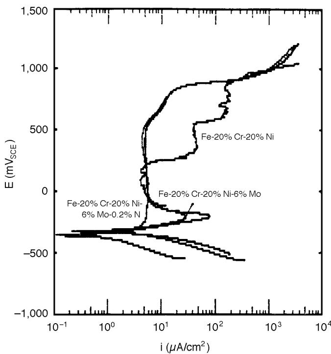  
FIGURE 1. Polarization curves for high-nickel SSalloys in 0. 1 M HCl + 0.4 M NaCl solution. Scan $r a t e = 1 ~ m V / s .$

previously that addition of 0.24 wt% N to an 18-8 SS decreased, but did not eliminate, the active nose of a 0.04 wt% N 18-8 alloy.3,6 Since the addition of 6 wt% Mo was already sufficient to eliminate pitting completely, nitrogen addition could not improve pitting resistance further . However, the corrosion potential $\scriptstyle \left( \mathrm { E } _ { \mathrm { c o r r } } \right)$ of the molybdenum alloys was slightly higher than that of the Fe-20% Cr-20% Ni steel. This result was consistent with the fact that molybdenum is more noble than iron. The passive current densities $( \mathrm { i } _ { \mathrm { p a s s } } )$ recorded for all three alloys were about the same.

Table 3 indicates the effects of surface nitriding on the potentiodynamic polarization of a $\mathbf { M o N i } _ { 4 }$ film in deaerated 0.1 M HCl. The polarization behavior of nitrided and non-nitrided alloys in deaerated 0.1 M HCl were inferior to that of pure molybdenum and

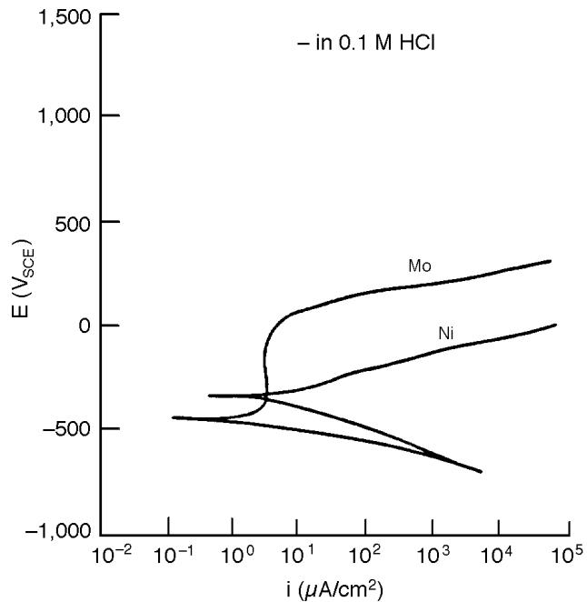  
FIGURE 2. Electrochemical polarization curves for pure molybdenum and nickel in 0.1 M HCl. Scan rate = 0.1 mV/s. Reprinted by permission from C.R. Clayton and Y.C. Lu, Corros. Sci. 29, 7 (1989): p. 881.

markedly superior to that of pure nickel, which pitted at OCP (Figure 2). Nitriding, however, resulted in a significant ennoblement of the alloy and caused conditions to prevail that led to a marked reduction in the passive current density and a small increase in the transpassive potential $\scriptstyle ( \mathrm { E } _ { \mathrm { t r } } )$ . As discussed elsewhere, cyclic polarization of nitrided and nonnitrided $\mathbf { M o N i } _ { 4 }$ samples in 0.1 M HCl indicated the formation of a transpassive film which continued to grow in the upper region of the reverse scan.28 To understand the nature of the surface conditions leading to this result, surface analysis must be relied upon.

## Variable-Angle XPS Analysis

Analysis of the Passive Film for the Passive Film

Formed on the High-Nickel Alloys — XPS spectra of the metallic elements in the passive film of SS passivated $\mathrm { a t } - 1 0 0 \mathrm { m V } _ { \mathrm { s c E } } \mathrm { f o r } 1 0$ min in deaerated 0.1 M HCl + 0.4 M NaCl solution at $2 2 ^ { \circ } \mathrm { C }$ were taken from a number of photoelectron take-off angles and for all expected elemental regions to provide data on the composition and structure of the passive film. By comparing data from these spectra (Figure 3), it was concluded that chromium compounds, including chromium sesquioxide $\left( \mathrm { C r } _ { 2 } \mathrm { O } _ { 3 } \right)$ , chromium hydroxide $\left( \mathrm { C r } [ \mathrm { O H } ] _ { 3 } \right)$ , and minor amounts of chromate $\mathrm { ( C r O } _ { 4 } { } ^ { 2 - } \mathrm { ) }$ and chromium trioxide $\left( \mathrm { C r O _ { 3 } } \right)$ made up the bulk of the passive film (> 60 at%). Based upon the peak ratios of data from different photoelectron take-off angles, the inner layer of the passive film was composed primarily of $\mathrm { { C r } _ { 2 } \mathrm { { O } _ { 3 } , } }$ and the outer layer was composed of $\mathrm { C r } ( \mathrm { O H } ) _ { 3 } .$ . Mo3d XPS spectra (Figure 4) for the molybdenum-bearing alloys indicated that $\mathbf { M o O _ { 2 } } , \mathbf { M o ^ { 5 + } }$ (possibly as a hydroxide), and $\mathbf { M o O _ { 3 } }$ appeared to reside in the inner $\mathrm { { C r } _ { 2 } \mathrm { { O } _ { 3 } } }$ layer and that $\mathbf { M o O _ { 4 } } ^ { 2 - }$ compounds were incorporated into the outer $\mathrm { C r ( O H ) _ { 3 } }$ layer. The structure of the passive films was consistent with the bipolar model of passivity of austenitic SS.9,18 Changes in the passive film composition resulting from additions of nitrogen to the alloy included the enhanced formation of iron

molybdate $\mathrm { ( F e M o O _ { 4 } ) }$ in the passive film formed on the molybdenum-bearing alloys. By analyzing the N1s XPS spectra of the Fe-20% Cr-20% Ni-6% Mo-0.2% N alloy (Figure 5), nitride was observed near the filmsubstrate interface, and $\mathrm { N H _ { 3 } }$ was situated in the outer layer. The thickness of the passive films of SS polarized at $- 1 0 0 \mathrm { m V } _ { \mathrm { s c E } }$ for 10 min in deaerated 0.1 M $\mathrm { H C l } + 0 . 4$ M NaCl solution were calculated from the XPS data according to Equation (5). While the oxide layer thickness was almost the same $\left( \mathrm { d } _ { \mathrm { o x } } = 1 0 . 6 5 \ : \mathrm { A } \right)$ for all three alloys, the hydroxide layer thickness differed depending on the molybdenum component $ { \mathrm { ( d _ { O H } } } = 4 . 9 7$ A for Fe-20% Cr-20% Ni alloy and $\mathbf { d } _ { \mathrm { O H } } = 2 . 6 1 \mathrm { ~ A ~ }$ for the two molybdenum alloys). This was consistent with deprotonation because of the presence of the cation-selective $\mathbf { M o O _ { 4 } } ^ { 2 - }$ species in the passive films on the two molybdenum-bearing alloys. The O1s photoelectron spectra were consistent with this thickness data.

Analysis of Sublayer Beneath the Passive Film Formed on the High-Nickel Alloys — The metal compositions underneath the passive film of the three high-nickel alloys studied are presented in Figure 6. For the Fe-20% Cr-20% Ni alloy, the metallic nickel composition changed very little (from 19.0 at% to 19.5 at%) following passivation, while the metallic

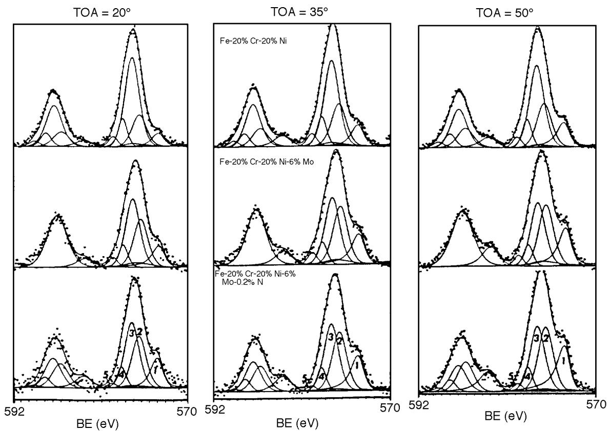  
FIGURE 3. Cr2p XPS spectra for the three high-nickel SS polarized $a t - 1 0 0 m V _ { s c E }$ for 10 min in $0 . 1 ~ M H C I + 0 . 4 ~ M ~ N a C I$ at room temperature. Peak identification: (1) Crº; (2) Cr2O₃; (3) Cr(OH)₃; (4) CrO3; ana $( 5 ) \ : C r O _ { 4 } { ^ { 2 - } }$

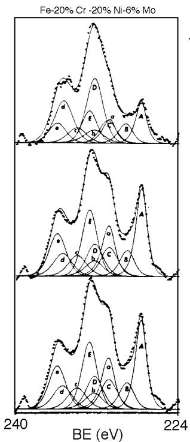

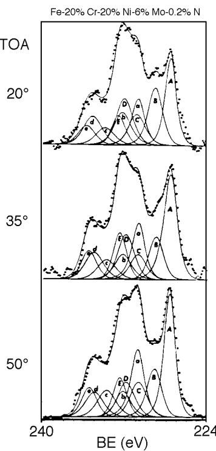  
FIGURE 4. Mo3dXPSspectraforthe SSpolarized $a t - 1 O O m V _ { s c E }$ for 10 min in 0.1 M HCl + 0.4 M NaCl at room temperature. Peak identification for $M o 3 d _ { 5 / 2 } .$ (A) Mo0; (B) MoO2; (C) Mo5+; (D) MoO4²2−; and (E), MoO₃; and for Mo3d3/2: (a) Mo0; (b) MoO2; (c) Mo5+; (d) $M o O _ { 4 } ^ { 2 - . }$ and (e) MoO3

chromium was enriched from 20.4 at% to 29.2 at%. This composition was close to that of the intermetallic compound $\mathrm { C r } _ { 3 } \mathrm { N i } _ { 2 }$ . This was less nickel enrichment than has been noted in previous work with type 304 SS (UNS S30400)(2),29 most likely because the 19.0 at% Ni of Fe-20% Cr-20% Ni was already high enough in principle to form an intermetallic phase, and therefore, little nickel enrichment would be expected. The Fe-20% Cr-20% Ni-6% Mo alloy exhibited metallic enrichments in the layer beneath the passive film of 21.6 at% to 23.9 at% for chromium, 19.4 at% to 27.4 at% for nickel, and 3.5 at% to 6.1 at% for molybdenum. This enrichment of nickel and molybdenum produced a compositional ratio of nickel to molybdenum of 4.7. Comparing these results with those of the Fe-20% $C \mathbf { r } – 2 0 \%$ Ni alloy, chromium was less enriched and nickel more enriched in the Fe-20% Cr-20% Ni-6% Mo alloy.

It is possible to explain these results by considering the formation of a molybdenum-nickel intermetallic phase of the type $\mathbf { M o N i } _ { 4 } ,$ according to the Engel-Brewer theory of intermetallic bonding.16 This strong molybdenum-nickel intermetallic bond was the driving force for the enrichment of molybdenum and nickel during polarization.

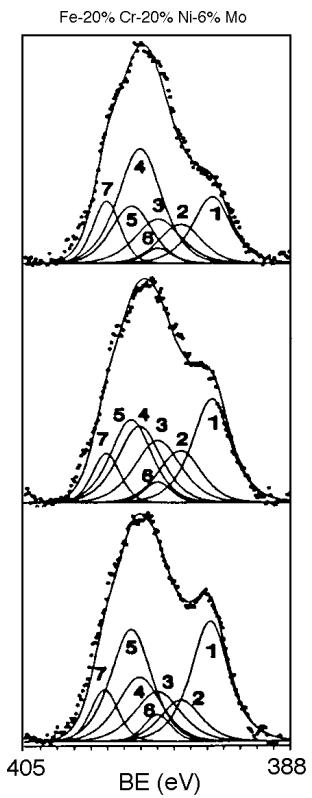

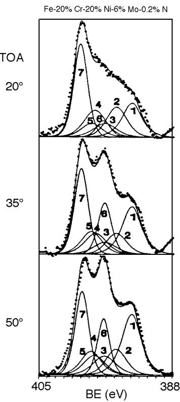  
FIGURE 5. N1s and Mo3p XPS spectra for the molybdenum-bearing alloys polarized $a t - 1 O O m V _ { s c E }$ for 10 min in 0.1 M HCl + 0.4 M NaCl at room temperature. Peak identification for $M O 3 p _ { 3 / 2 } .$ (1) Mo0; (2) $M o O _ { 2 } ; ( 3 ) M o ^ { 5 + } ;$ ; (4) MoO4²-; (5) MoO₃; and for N1s: (6) nitride; and (7) $N H _ { 3 } .$

In previous studies, the BE of the N1s electrons in molybdenum-bearing steel was found to be 397.2 eV, corresponding to nitrogen bound to chromium, molybdenum, and nickel as a mixed-nitride phase.7-8 As described above, a mixed molybdenumnickel nitride exhibits very high thermal stability, suggestive of strong lattice bonding. In this case, according to the Engel-Brewer model, strong interaction could be expected between molybdenum and nickel in a mixed surface nitride formed by preferential dissolution. This interaction may occur at the expense of the chromium-nickel interaction. Thus, with addition of 0.2 wt% N to the Fe-20% Cr-20% Ni-6% Mo alloy, nickel and molybdenum were enriched more highly (from 19.4 at% to 30.1 at% for nickel and from 3.6 at% to 7.0 at% for molybdenum), and chromium was less enriched (from 21.9 at% to 22 at%) compared to the results of the Fe-20% Cr-20% Ni-6% Mo alloy. To study this effect in greater detail, the interaction of nitrogen with film formation and surface segregation on RF sputter-formed molybdenum-nickel thin films was examined.

Analysis of Passive Film Formed on Nitrided and Non-Nitrided MoNi in 0.1 M HCl — Variable-angle XPS analysis of Mo3d photoelectrons from the passive

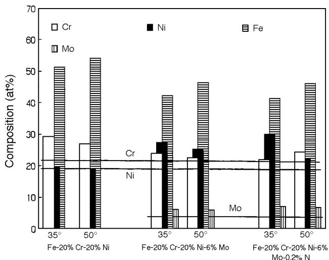  
FIGURE 6. Metallic element compositions underneath the passive film. Optimum photoelectron take-off angle for examination of metallic segregation is 35°.

film formed on nitrided and non-nitrided ${ \bf M o N i } _ { 4 }$ in 0.1 M HCl in 1 h $\mathrm { a t - } 1 8 0 ~ \mathrm { m V _ { s c E } }$ revealed a number of differences. Figure 7 summarizes the concentration of molybdenum ionic species in the passive film as a percentage of the overall molybdenum oxidized species. The passive film formed on ${ \bf M o N i } _ { 4 }$ contained a surface layer of $\mathbf { M o O _ { 4 } } ^ { 2 - }$ as well as a sizeable amount of molybdenum in the pentavalent state throughout the film. This pentavalent molybdenum most likely was present as a hydroxide species. The Mo3d photoelectron signal from molybdenum dioxide (MoO ), found earlier to be the basic component of the passive film on molybdenum, was strongest at the higher take-off angles, which indicated that it was present nearer the film-metal interface. A small amount of molybdenum trioxide $\left( \mathbf { M o O } _ { 3 } \right)$ also was incorporated into the film. By contrast, the Mo3d spectra from the film formed on the nitrided sample revealed a larger amount of $\mathbf { M o O _ { 4 } } ^ { 2 - }$ (in addition to the dioxide) incorporated into the passive film. The signal from pentavalent molybdenum was reduced greatly, as was that of $\mathbf { M o O } _ { 3 } ,$ , following nitriding. The smaller variation in multiplet composition with changing take-off angle for the nitrided sample indicated a monotonic film, rich in $\mathbf { M o O _ { 4 } } ^ { 2 \cdot }$ –. The nickel photoelectron spectra (Figure 8, based on data from Halada and Clayton28) revealed that this $\mathbf { M o O _ { 4 } } ^ { 2 - }$ was present as $\mathrm { N i M o O _ { 4 } } ,$ , an insoluble salt species. The strength of the Ni2p signal from $\mathrm { N i M o O _ { 4 } }$ was far greater in the case of the nitrided surface. O1s photoelectron spectra indicated the presence of oxide nearer the metal-film interface and stronger hydroxide signals near the film surface. This was consistent with fieldinduced deprotonation being more effective at the metal-film interface. In addition, the nitrided sample showed less hydroxide (compared to oxide). This

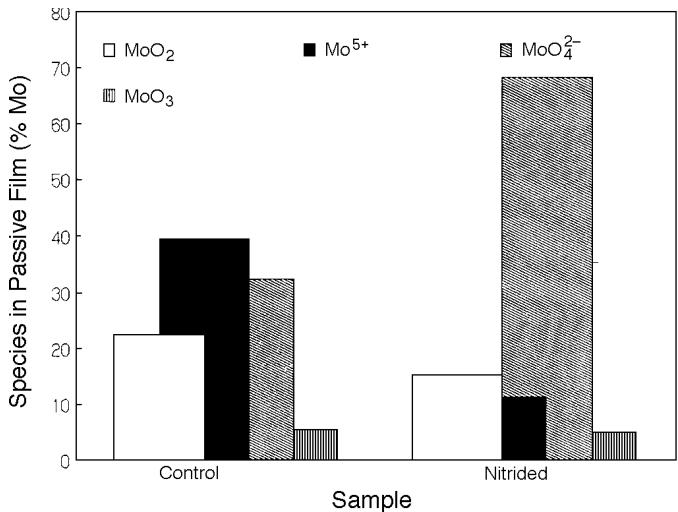  
FIGURE 7. Graphical representation ofthe percentage composition of oxidized molybdenum species in the passive films formed on nitrided and non-nitrided MoNi thin films in $0 . \mathrm { ~ 1 ~ } M H C I a t - 1 8 0 m V _ { s c E }$ for 1 h, derived from XPS data taken with a photoelectron take-off angle of 5°.

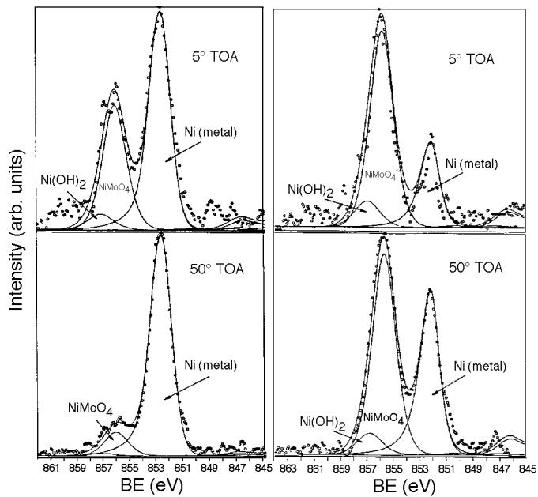  
FIGURE 8. Variable-angle $N i 2 p _ { 3 / 2 }$ XPSspectra from the passive film formed $a t - 1 8 0 m V _ { s c E }$ for 1 h on nitrided and non-nitrided MoNi4thin films. All take-off angles measured with respect to the sample surface. Peak identification as shown.

most likely was a result of the reduction in pentavalent molybdenum hydroxide $\mathbf { \left( M o [ O H ] _ { 5 } \right. }$ , as previously described). The enhancement in the high BE O1s peak following nitriding (composed of both water and the oxygen signal from $\mathrm { { N i M o O _ { 4 } } , }$ , the two having very similar binding energies and peak widths) most likely resulted from the enhancement in the $\mathbf { M o O _ { 4 } } ^ { 2 - }$ signal, though signal from both $\mathbf { M o O _ { 4 } } ^ { 2 - }$ oxygen and water

TABLE 4  
$M o 3 d _ { 5 / 2 }$ and O1s Normalized Photoelectron Peak Areas from the Passive Film Formed on Nitrided and Non-nitrided (Control) MoNi (as a Function of Photoelectron Take-Off Angle)
<table><tr><td></td><td colspan="2">MoO2</td><td colspan="2"> $\pmb { M 0 } ^ { 5 + }$ </td><td colspan="2"> $M O \circ 2 4 ^ { 2 - }$ </td><td colspan="2">MoO3</td></tr><tr><td> $\mathsf { T o A } ^ { ( \mathsf { A } ) }$ </td><td>Control</td><td>Nitrided</td><td>Control</td><td>Nitrided</td><td>Control</td><td>Nitrided</td><td>Control</td><td>Nitrided</td></tr><tr><td>5</td><td>22.6</td><td>15.3</td><td>39.5</td><td>11.4</td><td>32.4</td><td>68.3</td><td>5.5</td><td>5.0</td></tr><tr><td>20</td><td>30.6</td><td>17.6</td><td>38.9</td><td>10.4</td><td>27.9</td><td>67.7</td><td>3.0</td><td>3.8</td></tr><tr><td>50</td><td>35.9</td><td>21.2</td><td>35.1</td><td>8.5</td><td>25.0</td><td>67.6</td><td>4.0</td><td>2.7</td></tr><tr><td></td><td colspan="2">0²-</td><td colspan="2">OH-</td><td colspan="2"> ${ \mathsf { H } } _ { 2 } { \mathsf { O } } I { \mathsf { M } } { \mathsf { o } } { \mathsf { O } } _ { 4 } ^ { 2 - }$ </td><td colspan="2"></td></tr><tr><td>5</td><td>20.0</td><td>13.9</td><td>53.4</td><td>23.8</td><td>26.6</td><td>63.3</td><td></td><td></td></tr><tr><td>20</td><td>29.0</td><td>31.1</td><td>50.3</td><td>31.0</td><td>20.7</td><td>37.9</td><td></td><td></td></tr><tr><td>50</td><td>37.6</td><td>45.7</td><td>44.0</td><td>30.4</td><td>18.4</td><td>23.9</td><td></td><td></td></tr></table>

(A) TOA = take-off angle.

oxygen were part of the high BE singlet. The $_ { \mathrm { O 1 s } }$ oxide singlet corresponded in BE to that for $\mathbf { M o O } _ { 2 }$ but may have included a small contribution from $\mathbf { M o O } _ { 3 } .$ The correspondence between the normalized area of O1s photoelectron singlets and that of $\mathrm { M o 3 d _ { 5 / 2 } }$ photoelectron singlets with changing take-off angle for the passive film formed on both nitrided and nonnitrided alloys is given in Table 4. From these values, it was obvious that fairly large amounts of water may have remained trapped at the surface of the passive film formed on the nitrided alloy. This likely was because of the less dense nature of the film, enriched in $\mathbf { M o O _ { 4 } } ^ { 2 - }$ , which in turn may have been indicated by the higher rate of nickel dissolution through the film. Ni2p spectra from the nitrided surface (Figure 8) indicated a slight enrichment in nickel hydroxide (Ni[OH] ) near the solution-film interface, which also was indicative of enhanced nickel dissolution through the passive barrier formed on the nitrided system.

Oxide film thickness measurements based on the methods described earlier indicated that the thickness of the passive film formed on the non-nitrided ${ \bf M o N i } _ { 4 }$ was 28 A and that for the oxide formed on the nitrided surface was 24 A. In both cases, calculations used values for oxide densities found in the literature and used an average of densities for the substrate intermetallic compositions located beneath the passive layer.

Certain low BE peaks in the nitrided Mo3d photoelectron spectra appeared to be associated with the mixed-nitride species.28 The BE of these peaks did not match that of molybdenum-nitrogen species (MoN and $\mathbf { M o } _ { 2 } \mathbf { N } )$ , but did possess the asymmetries and scattering parameters associated with metallic nitride peaks. The ratio of the peak areas of the nitride to metallic molybdenum peaks was slightly greater at a 5-degree photoelectron take-off angle (0.39 vs 0.33 for a 50-degree take-off angle), indicating that the mixed nitride was at the passive film-metal interface. Additional spectroscopic analysis of mixed nitrides formed chemically will be necessary to further define these spectra.

The Mo3p/N1s photoelectron spectra from the passive film formed on the nitrided surface indicated the presence of nitride at the metal-film interface and $\mathrm { N H } _ { 3 }$ primarily in the outer regions of the passive layer. This was in agreement with the description of the kinetics of nitrogen reactions at the solutionmetal interface discussed earlier.

Analysis of Sublayer Beneath the Passive Film Formed on the MoNi Alloy Film — In the presence of iron and chromium, the MoNi structure may have been quite stable. However, in the absence of iron and chromium, the $\mathbf { M o N i } _ { 4 }$ alloy film underwent further compositional changes below the passive film formed at $- 1 8 0 ~ \mathrm { m V _ { s c E } } ,$ , resulting in a surface composition just below the passive film corresponding closely to $\mathbf { M o N i } _ { 3 } ,$ , a metastable intermetallic phase. The corresponding effects for the nitrogen-treated MoNi4 alloy film resulted in a surface composition close to MoNi, a stable intermetallic phase, and at a deeper level, a composition between that of $\mathbf { M o N i } _ { 3 }$ and $\mathbf { M o N i } _ { 2 } ,$ , another intermediate intermetallic phase.30

Figure 9 displays the molybdenum:nickel metallic ratio calculated from the photoelectron spectra at varying take-off angles and sensitivity factors empirically derived from work in the authors’ laboratory. Values for stoichiometries at 20- and 50-degree takeoff angles have been corrected through subtraction of stoichiometries in upper layers based upon the mean free paths of photoelectrons in the alloy. Hence, the 5-degree value indicated stoichiometry in approximately the uppermost 4 A of the alloy following passivation, the 20-degree value represented stoichiometry in the next 8A below that. Likewise, the stoichiometry for the 50-degree take-off angle was that for approximately the next 15 A into the alloy. These depth values were somewhat approximate since two different kinetic energy photoelectrons were involved, Mo3d and Ni2p, with differing mean free

paths. Use of sensitivity factors aided in correction for these differences, but absolute values for depth of analysis are difficult to determine for a specific stoichiometry, becoming less in agreement for increasing photoelectron take-off angles (with respect to the sample surface). Hence, 5-degree take-off angle alloy compositional information is most accurate. These data indicated a molybdenum:nickel metallic ratio approaching unity in the top metallic layers following nitriding. Though this fell somewhat short of the stoichiometry described by Jack for an extremely stable mixed surface nitride,17 the presence of a strong $\mathbf { N } ^ { 3 - }$ signal at high photoelectron take-off angles as well as the geometrically increasing enrichment in molybdenum suggested that stable short range ordered intermetallic nitrides were formed in the uppermost metallic atomic layer. This nitride layer altered the electrochemical kinetics of the alloy system through charge screening of the underlying alloy surface layers. The metallic nature of the nitride, indicated in its intermetallic nature and XPS tail scattering parameters, resulted in transfer of the surface charge influencing anodic dissolution to this chemically stable layer from the possibly less stable alloy surface layers beneath.

This work suggested that anodic segregation of nickel and molybdenum may be driven by the energy state of the intermetallic phase formed by selective dissolution. The relative stability of these surface phases in a given aqueous environment and the influence of other alloying elements on the stability of these phases demands further study to develop new approaches to alloy design for corrosion resistance.

## CONCLUSIONS

❖ Nitrogen in molybdenum-bearing SS was segregated as a surface nitride phase and suppressed the active dissolution through apparent molybdenumnitrogen synergism.

❖ Enrichment of chromium and nickel beneath the passive film formed on the Fe-20% Cr-20% Ni alloy in 0.1 M HCl was compositionally consistent with the formation of a $\mathrm { C r } _ { 3 } \mathrm { N i } _ { 2 }$ intermetallic compound. This explained the enrichment of chromium and the retention of nickel in the alloy surface layer just beneath the passive film.

❖ For the Fe-20% $\mathrm { C r ^ { - } { 2 0 \% } N i ^ { - } } 6 \%$ Mo steel, the metallic chromium enrichment decreased compared to the Fe-20% Cr-20% Ni alloy, and the enrichment of nickel. Molybdenum also was enriched beneath the passive film to a compositional level that suggested formation of a MoNi intermetallic.

❖ With 0.2 wt% N addition to the Fe-20% Cr-20% Ni-6% Mo alloy, metallic chromium enrichment decreased, and metallic nickel and molybdenum enrichments increased as compared to the Fe-20% Cr-20% Ni-6% Mo alloy.

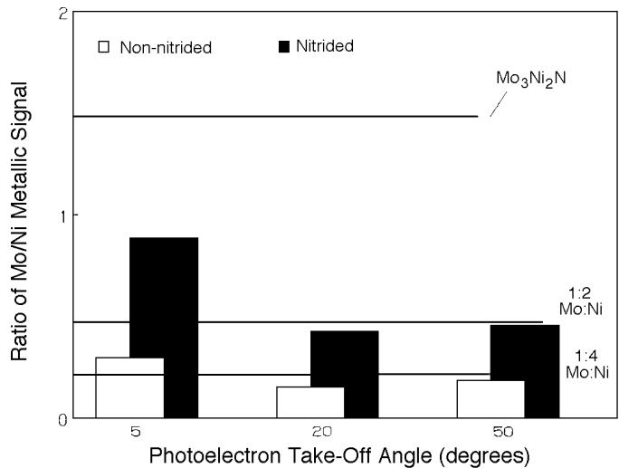  
FIGURE 9. Normalized metallic molybdenum:nickel ratio beneath the passive film formed at –180 mVsce for 1 h on nitrided and nonnitrided $M o N i _ { 4 }$ as a function of photoelectron take-off angle. Composition of mixed nitride and several intermetallic species are shown.

❖ Potentiodynamic polarization of a $\mathbf { M o N i } _ { 4 }$ thin film, with and without prior electrochemical nitriding, indicated behavior analogous to that previously observed in electrochemically nitrided and nitrogen-alloyed molybdenum and nickel-bearing SS alloys. Nitriding led to an initially stable surface nitride at an elevated OCP, a decrease in $\mathbf { i } _ { \mathrm { p a s s } } ,$ , and a slight increase in transpassive potential.

❖ XPS of the passive film formed on nitrided and non-nitrided $\mathbf { M o N i } _ { 4 }$ revealed a significant enhancement in $\mathbf { M o O _ { 4 } } ^ { 2 - }$ throughout the passive film following nitriding, which led to an enhancement in the cationselective constituent of the film. $\mathbf { M o O _ { 4 } } ^ { 2 - }$ was present as a relatively insoluble salt, $\mathrm { N i M o O } _ { 4 } .$ Reaction of surface nitride with the electrolyte resulting in a localized increase in pH was proposed to be the mechanism by which enhanced $\mathbf { M o O _ { 4 } } ^ { 2 - }$ formation and incorporation occurred. This agreed with data from the passive film formed on the Fe-20% Cr-20% Ni-6% Mo-0.2% N SS, which showed evidence of an increase in the amount of ferrous $\mathbf { M o O _ { 4 } } ^ { 2 - }$ in the film as compared to the composition of the passive layer formed on Fe-20% Cr-20% Ni-6% Mo under the same conditions.

❖ XPS of the passive film formed on the $\mathbf { M o N i } _ { 4 }$ also indicated a reduction in the relative amounts of pentavalent molybdenum species present in the passive layer following nitriding. This appeared to be related to deprotonation of hydroxide species.

❖ Calculation of the metal ratios beneath the passive film indicated enhancement of molybdenum (as well as retention of nickel), especially following anodic segregation of alloyed nitrogen or, analogously, electrochemical nitriding. This enhancement, combined with observation of a strong surface nitride signal, indicated some formation of stable mixed intermetallic nitrides. This intermetallic layer, along with the passive film enriched in stable $\mathbf { M o O _ { 4 } } ^ { 2 - }$ species, appeared to result in reduced anodic dissolution, providing an enriched source of oxide forming metallic species directly beneath the passive film and, hence, improved corrosion resistance.

❖ The existence of a surface nitride has implications to the charge-carrying capacity of the alloy. The metallic nature of the surface nitride would ensure screening of the substrate, since charge would reside on the first monolayer or two of the nitride, rather than on the alloy surface layers. Thus, the composition of the nitride would govern the electrochemical kinetics of the alloy system. These changes would vary with the development of the composition of the nitride phase.

## ACKNOWLEDGMENTS

This work was supported by the U.S. Office of Naval Research (A.J. Sedriks, contract officer) under contract no. N0001485K0437. The authors acknowledge the assistance of I. Olefjord of Chalmers Institute of Technology (Goteborg, Sweden). Collaboration with Olefjord was supported by the National Science Foundation through Joint U.S./Swedish Research Travel Grant no. INT8922461.

## REFERENCES

1. Y.C. Lu, R. Bandy, C.R. Clayton, R.C. Newman, J. Electrochem. Soc. 130 (1983): p. 1,774.

2. R. Bandy, Y.C. Lu, R.C. Newman, C.R. Clayton, “Role of Nitrogen in Improving Resistance to Localized Corrosion in Austenitic Stainless Steel,” Proc. Equilibrium Diagrams and Localized Corrosion Symp., eds. R. Frankenthal, J. Kruger (Pennington, NJ: The Electrochemical Society, 1984), p. 471.

3. J.J. Eckenrod, C.W. Korvach, ASTM STP 697 (West Conshohocken, PA: 1979), p. 17.

4. J.R. Kearns, H.E. Deverel, MP 26 (1987): p. 18.

5. K. Orozawa, N. Okato, in “Passivity and Its Breakdown on Iron-Based Alloys,” eds. R. Staehle, H. Okada (Houston, TX: NACE, 1976), p. 135.

6. C.R. Clayton, K.G. Martin, “Evidence of Anodic Segregation of Nitrogen in High-Nitrogen Stainless Steels and Its Influence on Passivity,” in High-Nitrogen Steels, ed. A. Hendry (London, England: Institute of Metals, 1989), p. 256.

7. R.D. Willenbruch, C.R. Clayton, M. Oversluizen, D. Kim, Y.C. Lu, Corros. Sci. 31 (1990): p. 179.

8. I. Olefjord, B. Brox, U. Jelvestam, J. Electrochem. Soc. 132 (1985): p. 2,854.

9. C.R. Clayton, Y.C. Lu, J. Electrochem. Soc. 133 (1986): p. 2,517.

10. R. Bandy, D. Van Rooyen, Corrosion 39, 6 (1983): p. 227.

11. J.E. Truman, M.J. Coleman, K.R. Pirt, Brit. Corros. J. 12 (1977): p. 236.

12. I. Olefjord, C.R. Clayton, ISIJ Int., 31, 2 (1991): p. 134.

13. L. Bosio, R. Cortes, P. Delichere, M. Froment, S. Joiret, Surf: Inter. Anal. 12 (1988): p. 380.

14. C.R. Clayton, J.E. Castle, Corros. Sci. 7, 1 (1977).

15. I. Olefjord, B.O. Elfstrom, Proc. 6th Euro. Cong. Metallic Corros., ed. T.P. Hoar (London, England: Soc. Chem. Indust., 1977), p. 21.

16. L. Brewer, Science 161 (1968): p. 115.

17. K.H. Jack, “Nitrogen Precipitation: Retrospect and Prospect,” in High-Nitrogen Steels, eds. J. Foct, A. Hendry (London, England: Institute of Metals, 1989), p. 117.

18. M. Sakashita, N. Sato, “Bipolar Fixed Charge-Induced Passivity,” in Passivity of Metals, eds. R.P. Frankenthal, J. Kruger (Pennington, N.J.: The Electrochemical Society, 1978), p. 479.

19. Y.C. Lu, C.R. Clayton, J. Electrochem. Soc. 133 (1986): p. 2,465.

20. R.C. Newman, Corros. Sci. 25 (1985): p. 341.

21. K. Shimizu, G.E. Thompson, G.C. Wood, Thin Solid Films 77 (1981): p. 313.

22. J.R. Galvele, “Present State of Understanding of the Breakdown of Passivity and Repassivation,” in Passivity of Metals, eds. R.P. Frankenthal, J. Kruger (Princeton, N.J.: The Electrochemical Society, 1978), p. 285.

23. D. Kim, C.R. Clayton, M. Oversluizen, Mat. Sci. Eng. A, A186 (1994): p. 163.

24. A. Savitsky, M.J.E. Golay, Anal. Chem. 36, 8 (1964).

25. P.M.A. Sherwood, “Data Analysis in X-Ray Photoelectron Spectroscopy,” in Practical Surface Analysis, eds. D. Briggs, M.P. Seah (New York, NY: John Wiley and Sons, 1983), p. 445.

26. D.A. Shirley, Phys. Rev. B, 5 (1972): p. 4,709.

27. I. Olefjord, B.O. Elfstrom, Corrosion 38 (1982): p. 46.

28. G.P. Halada, C.R. Clayton, “The Effect of Surface Nitriding on the Passivation of Mo-Ni Thin Films,” in Proc. Symp. Corrosion, Electrochemistry, and Catalysis of Metastable Metals and Intermetallics (Pennington, NJ: The Electrochemical Society Inc., 1994), p. 157.

29. D. Kim, “A Study of the Effect of Nitrogen and Molybdenum in the Corrosion Inhibition of Austenitic Stainless Steel” (Ph.D. diss., State University of New York at Stony Brook, 1992).

30. M.F. Singleton, P. Nash, “Molybdenum-Nickel,” in Binary Alloy Phase Diagrams, 2nd ed., ed. T.B. Massalski (New York, NY: ASM Int., 1992), p. 2,635.

## PENNSYLVANIA PROFESSOR NAMED TO CORROSION EDITORIAL BOARD

B.A. Shaw, associate professor in the Department of Engineering Science and Materials at Pennsylvania State University, has been named to the CORROSION Editorial Board.

Shaw will assist CORROSION Technical Editor J.B. Lumsden in overseeing the peer review process for CORROSION manuscripts.

Shaw joined the faculty at Penn State in January 1990 as an assistant professor and was promoted to associate professor in 1995. She is conducting research in the area of engineered materials with an emphasis on design and processing of alloys, coatings, and metal-matrix composites to enhance their corrosion resistance.

Prior to joining the Penn State faculty, Shaw spent a year at Martin Marietta Laboratories, researching such topics as corrosion inhibition of aluminum alloys and the effects of acid rain on painted steel surfaces.

Shaw holds her master's and doctorate in materials science and engineering from the Johns Hopkins University. She is a frequent author and symposia moderator and is a member of the National Research Council's Committee on Marine Structures.