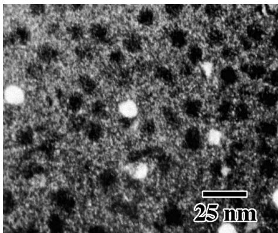
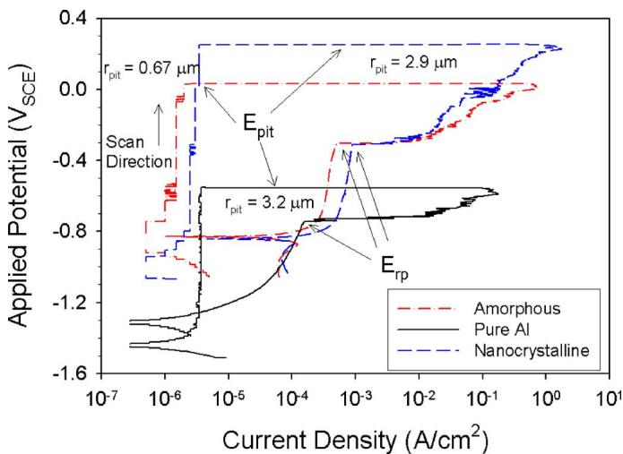
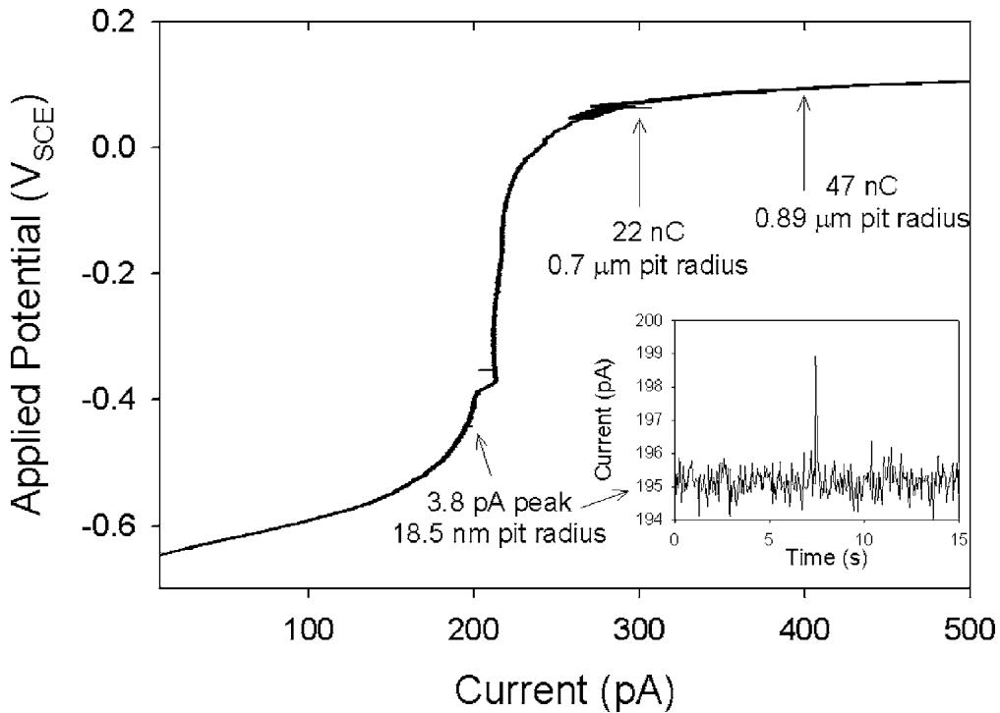
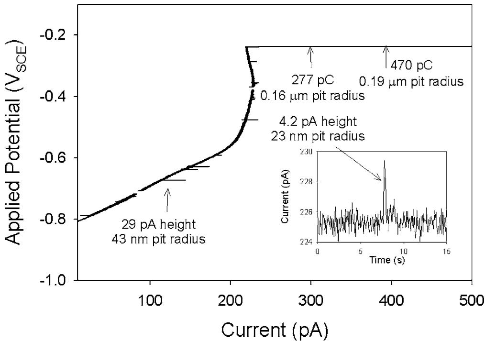
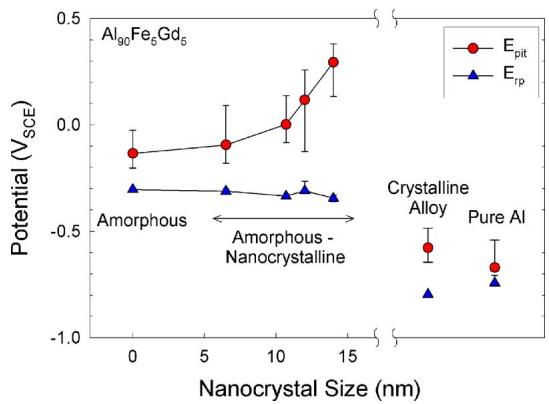
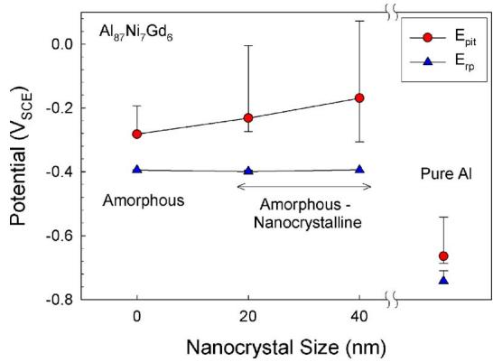
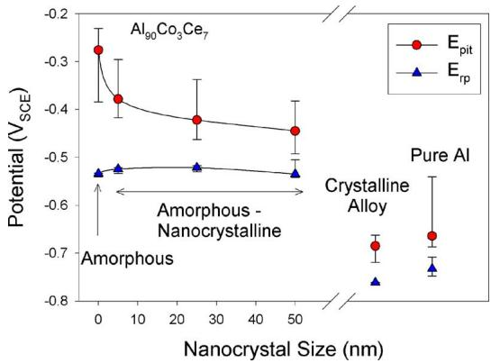
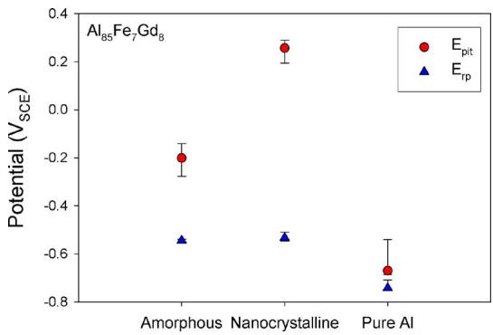

# Pitting of Al-Based Amorphous-Nanocrystalline Alloys with Solute-Lean Nanocrystals

Ashley M. Lucente\*,z and John R. Scully\*\*

University of Virginia, Charlottesville, Virginia, 22904, USA

The localized corrosion resistance of several Al-based metallic glasses, all containing 85–90% Al, transition metals, and rare earth elements, was examined in fully amorphous, partially nanocrystalline, and fully crystalline microstructures to assess the possible detrimental effects of partial and complete devitrification on corrosion. In all of the alloys examined, Al Fe Gd , Al Fe Gd , $\mathrm { A l _ { 9 0 } C o _ { 3 } C e _ { 7 } } ,$ and $\mathrm { A l } _ { 8 7 } \mathrm { N i } _ { 7 } \mathrm { G d } _ { 6 }$ , the pitting potential associated with the formation of micrometer-scale pits in deaerated 0.6 M NaCl remained elevated relative to pure polycrystalline Al in all partially devitrified amorphous-nanocrystalline- states despite the presence of up to 40 vol % solute-depleted face-centered cubic Al nanocrystals dispersed in the remaining amorphous matrix. In contrast, the pitting potentials of the fully crystallized glasses were similar to that of pure Al. © 2007 The Electrochemical Society. DOI: 10.1149/1.2712794 All rights reserved.

Manuscript submitted October 13, 2006; revised manuscript received January 9, 2007. Available electronically March 12, 2007.

Upon exposure to high temperatures, fully amorphous glassy alloys can form crystalline phases by several routes including primary crystallization, eutectoid crystallization, and polymorphous crystallization1,2 depending on the alloy composition. Regardless of the devitrification route, the stable crystalline state in many cases consists of a solute lean phase and one or more solute-rich intermetallic phases. Primary crystallization, the devitrification route favored by the alloys used in this study, occurs when isolated solutelean or nil-solute crystals of nm dimensions grow in a remaining amorphous matrix. Such nanocrystals as these solute-lean precipitates will be called hereafter- are typically enriched in the majority alloying element, adopt the crystal structure of this alloying element, and reject solutes which may be beneficial to the corrosion resistance. This is particularly true in Al-based glasses because Al exhibits little solubility for transition metals or rare earth elements.3 The rejected solute is concentrated in the remaining amorphous matrix and compositional gradients form at the matrix-nanocrystal interface.4 Such amorphous-nanocrystalline alloys often exhibit a high density of nanocrystals on the order of $\mathrm { i 0 ^ { 1 8 } ~ c m ^ { - 3 } }$ that can comprise 40 vol % of the composite alloy. Hence, nearly 40% of the surface area of amorphous-nanocrystalline alloys may also consist of Al-rich sites of nearly random orientation with a lattice parameter close to bulk face-centered cubic fcc- aluminum. Notably, such composite alloys exhibit greater specific strengths than conventional polycrystalline alloys.5,6 However, these materials differ from fully crystalline materials with nm-scale grain sizes in at least three respects: i- isolated crystals embedded in an amorphous matrix lack grain boundary triple points with the associated defective structure, ii- the remaining amorphous matrix surrounding a nanocrystal can collect slowly diffusing solute that is rejected from newly formed nanocrystals, and iii- the crystalline phase does not form a continuous path through the material.

A major concern for amorphous-nanocrystalline metallic glasses is the possibility that even partial devitrification compromises the superior resistance to corrosion typical of the fully amorphous condition. As in stainless steels and aluminum alloys, the chemical and structural heterogeneity may provide a location for pit initiation if it is less corrosion-resistant than the surrounding matrix and above a critical size.7,8 The segregation of beneficial alloying elements due to partial crystallization may also interfere with the creation of a uniform and protective oxide film, weakening the alloy’s resistance to general corrosion. However, there is some evidence that the effect of partial devitrification is strongly dependent upon the chemistry of the nanocrystal and the remaining amorphous matrix10,11 and some alloys do not suffer decreased corrosion resistance due to the presence of dispersed nanocrystalline phases.8,12-14 Here we report the effect of partial devitrification on the pitting behavior of four Albased metallic glasses that form solute lean nanocrystals in an amorphous matrix. We include results on the effects of complete crystallization. It is demonstrated that the effects observed are a general finding shared by this class of materials.

## Experimental

The amorphous alloys $( \mathrm { A l _ { 9 0 } F e _ { 5 } G d _ { 5 } , \ A l _ { 8 5 } F e _ { 7 } G d _ { 8 } , \ A l _ { 9 0 } C o _ { 3 } C e _ { 7 } }$ and $\mathrm { A l } _ { 8 7 } \mathrm { N i } _ { 7 } \mathrm { G d } _ { 6 } )$ were fabricated using a single roller melt spinning technique as discussed previously.13 High-purity 99.999%- polycrystalline aluminum foils Alfa Aesar- of the same dimensions as the metallic glass ribbons were tested for comparison. The amorphous ribbons were encapsulated in Pyrex or quartz tubes that were back-filled with argon gas and isothermally heat-treated as discussed previously.13 The heat-treatment times, temperatures, and resulting microstructures are listed in Table I. A dark-field transmission electron microscope DFTEM- image of the $\mathrm { A l _ { 9 0 } F e _ { 5 } G d _ { 5 } }$ alloy in the nanocrystalline state is shown in Fig. 1. Both the light and dark spots in this figure are nanocrystals. This is fairly representative of the alloys that form spherical nanocrystals.

All electrodes in each microstructure investigated were mounted on end in a low curing temperature epoxy to expose a 2 $\times \ 1 0 ^ { - 4 } \ \mathrm { c m } ^ { 2 }$ area. Approximately $\mathrm { \dot { 1 } 0 ^ { 8 } }$ nanocrystals were exposed on the amorphous-nanocrystalline surface, 10 grains on the polycrystalline Al surface, and $1 \dot { 0 ^ { 5 } }$ grains on the fully crystalline alloy surface. The electrodes were wet polished in 1 and 0.05 -m alumina suspensions for alloy samples- or 1 -m diamond and 0.05 -m silica suspensions for Al samples- and rinsed in deionized water. The 0.6 M 3.5 wt %- NaCl electrolyte was prepared using 18.2 M-cm resistivity deionized water and ACS certified reagents. Both the electrolyte and the empty cell were deaerated with nitrogen prior to experimentation. After introducing the electrolyte to the cell, the opencircuit potential was measured for 1 h. Anodic polarization scans were conducted at a scan rate of 0.1 mV/s with a reverse in scan direction when the current density reached 10 mA/cm2. All potentials were measured against a saturated calomel reference electrode SCE-. The pitting $( E _ { \mathrm { p i t } } )$ and repassivation $( E _ { \mathrm { r p } } )$ potentials were determined as the potentials at which the slope of the i vs E curve changed suddenly as shown in Fig. 2. Due to the low data acquisition rate in these experiments and thus slow detection of a rise in current-, the pitting potential as measured here generally corresponds to the removal of a 0.5 to 1 -m radius hemispherical volume. Pit initiation events that occur before the onset of stable pitting were observed in selected cases by increasing the data acquisition rate to 20 Hz and using a Gamry FAS2 potentiostat. The setup was capable of detecting 2 pA current spikes above a passive current of ${ \sim } 2 0 0 ~ \mathrm { p A } ~ ( 1 ~ \mu \mathrm { A } / \mathrm { c m } ^ { 2 } )$ which corresponds to the removal a volume corresponding to an 11 nm radius hemisphere, approximately the size of the solute depleted nanocrystals after certain heat-treatments.

Table I. Alloy heat-treatments.
<table><tr><td>Alloy</td><td>Temp (°C)</td><td>Time</td><td>Resulting microstructure</td></tr><tr><td rowspan="3"> $\mathrm { A l _ { 9 0 } F e _ { 5 } G d _ { 5 } }$ </td><td>150</td><td>8 min</td><td> $\mathrm { A M } + 6 . 5$  nm spherical NC</td></tr><tr><td>180</td><td> $2 5 { \mathrm { ~ h ~ } }$ </td><td>AM + 10 nm spherical  $\mathrm { N C } ^ { 1 3 }$ </td></tr><tr><td>280</td><td>5 min</td><td>AM + 12 nm spherical NC</td></tr><tr><td rowspan="7"> $\mathrm { A l _ { 9 0 } C o _ { 3 } C e _ { 7 } }$ </td><td>300</td><td>2 h</td><td>AM + 14 nm spherical NC</td></tr><tr><td>550</td><td>1 h</td><td>Fully crystalline, ~500 nm grains13</td></tr><tr><td>200</td><td>10 min</td><td>AM + 5 nm dendritic NC</td></tr><tr><td>200</td><td>1 h</td><td>AM + 25 nm dendritic NC</td></tr><tr><td>200</td><td>3 h</td><td>AM + 50 nm dendritic NC</td></tr><tr><td>500</td><td>15 days</td><td>Fully crystalline</td></tr><tr><td>250</td><td>10 min</td><td>AM + 20 nm spherical NC (low density)</td></tr><tr><td rowspan="2"> $\mathrm { A l } _ { 8 7 } \mathrm { N i } _ { 7 } \mathrm { G d } _ { 6 }$   $\mathrm { A l } _ { 8 5 } \mathrm { F e } _ { 7 } \mathrm { G d } _ { 8 }$ </td><td>250</td><td>24 h</td><td>AM + 40 nm spherical NC (high density)</td></tr><tr><td>210</td><td>24 h</td><td>AM + 100 nm dendritic NC</td></tr></table>

AM = amorphous, NC = fcc Al-rich nanocrystals.

## Results

Figures 3 and 4 show anodic polarization scans conduced with a high data acquisition rate 20 Hz- to detect any metastable pitting that might occur prior to the onset of stable pitting. Few if any small $( \sim 2 ~ \mathrm { p } \bar { \mathrm { A } }$ height- current spikes that might correspond to the initiation of small pits, at nanocrystals for instance, are typically observed, so it is unlikely that all of $\mathrm { t h e } \sim 1 0 ^ { 8 }$ surface nanocrystals have been selectively removed by pit initiation events before pit stabilization occurs. Moreover, the passive current density was similar for pure Al and both the amorphous and amorphousnanocrystalline conditions of the alloys, eliminating the possibility of selective passive dissolution of nanocrystals. The few metastable pitting events that are observed tend to be on the scale of tens of picoamperes, suggesting either that they initiate at unknown surface defects that are significantly larger than nanocrystals or that a small fraction of the $1 0 ^ { 8 ^ { \circ } }$ nanocrystal sites serve as defects that initiate a pit which rapidly grows to a size larger than the nanocrystal.

The pitting and repassivation potentials associated with micrometer-scale pitting were significantly more positive for all amorphous and partially devitrified variants of $\mathrm { A l _ { 9 0 } F e _ { 5 } G d _ { 5 } }$ relative to both pure Al and the fully crystalline alloy Fig. 5-. Notably, the improved resistance to pit stabilization associated with the amorphous state was preserved in the presence of a high density of nanocrystals regardless of average crystal size. In fact, increasing the nanocrystal size led to a slight increase in $E _ { \mathrm { p i t } }$ and no change in $E _ { \mathrm { r p } } .$ However, fully crystallized $\mathrm { A l _ { 9 0 } F e _ { 5 } G d _ { 5 } }$ completely loses its improved localized corrosion resistance relative to pure Al. This is indicated by the similarity between $E _ { \mathrm { p i t } }$ and $E _ { \mathrm { r p } }$ values for the fully crystalline alloy and high purity polycrystalline Al in Fig. 5. In fact, the crystalline alloy generally pits at or very slightly above its opencircuit potential. Figure 6 shows $E _ { \mathrm { p i t } }$ and $E _ { \mathrm { r p } }$ values for $\mathrm { A l _ { 8 7 } N i _ { 7 } G d _ { 6 } } .$ Like $\mathrm { A \bar { l } q _ { 0 } F e _ { 5 } G d _ { 5 } }$ , this alloy forms spherical nanocrystals, but the maximum possible nanocrystal size is much larger: 40 nm as opposed to $< 2 0$ nm. Also like $\mathrm { A l } _ { 9 0 } \mathrm { F e } _ { 5 } \mathrm { G d } _ { 5 } , E _ { \mathrm { p i t } }$ increases slightly with nanocrystal size but $E _ { \mathrm { r p } }$ is not affected. Figure 7 shows $E _ { \mathrm { p i t } }$ and $E _ { \mathrm { r p } }$ values for $\mathrm { A l _ { 9 0 } C o _ { 3 } C e _ { 7 } } ^ { \mathrm { ~ \tiny ~ { ~ r ~ } ~ } }$ Like the other alloys, $E _ { \mathrm { p i t } }$ of amorphousnanocrystalline $\mathrm { A l } _ { 9 0 } \mathrm { C o } _ { 3 } \mathrm { C e } _ { 7 }$ is elevated relative to pure Al, whereas $E _ { \mathrm { p i t } }$ of the fully crystalline alloy is not. The pitting potential of this alloy appears to decrease slightly rather than increasing slightly with partial devitrification. However, $E _ { \mathrm { r p } }$ is not affected by the presence of nanocrystals. Figure 8 shows $E _ { \mathrm { p i t } }$ and $E _ { \mathrm { r p } }$ values for ${ \mathrm { A l } } _ { 8 5 } { \mathrm { F e } } _ { 7 } { \mathrm { G d } } _ { 8 } .$ The partially nanocrystalline state of this alloy has a much higher $E _ { \mathrm { p i t } }$ than its amorphous precursor and pure Al in spite of the large size 100 nm- of the nanocrystals. Again, $E _ { \mathrm { r p } }$ is not affected by the presence of nanocrystals.

  
Figure 1. Dark-field TEM image of amorphous/nanocrystalline $\mathrm { A l _ { 9 0 } F e _ { 5 } G d _ { 5 } }$ with 10 nm nanocrystals. Here both the bright and dark spots represent nanocrystals and the gray matrix between them is amorphous. $\mathrm { A l _ { 9 0 } \mathrm { \overline { { F e } } _ { 5 } \mathrm { G d _ { 5 } } } }$ heattreated at 150°C for 24 h.29

## Discussion

Improvements in $E _ { \mathrm { p i t } }$ and $E _ { \mathrm { r p } }$ in the fully amorphous state relative to fully crystalline alloys can be attributed to alloying elements in solid solution15 as well as chemical and structural homogeneity.12 Solutes such as Cr, Mo, Nb, Ta, and Ti in solid solution all improve the pit stabilization resistance of crystalline $\mathrm { A l . } ^ { 1 5 }$ In conventional

  
Figure 2. Color online- Anodic polarization scan on polycrystalline 99.999% Al and amorphous and amorphous-nanocrystalline $\mathrm { A l } _ { 9 0 } \mathrm { F e } _ { 5 } \mathrm { G d }$ d in 0.6 M NaCl. The arrows show the pitting potential $\dot { ( } \boldsymbol { E } _ { \mathrm { p i t } } ) .$ , the repassivation potential $( E _ { \mathrm { r p } } )$ , the corrosion potential $( E _ { \mathrm { c o r r } } ) .$ , and the scan direction.

  
Figure 3. Anodic polarization scan on fully amorphous $\mathrm { A l _ { 9 0 } ^ { \circ } F e _ { 5 } G d _ { \underline { { \circ } } } }$ collected at 20 points/s. Inset: expanded view of a pit initiation event. Electrode area = 2  $1 0 ^ { - 4 } \mathrm { c m } ^ { 2 } .$

alloys such as stainless steels and aluminum alloys, pitting corrosion initiates at second phase particles that are chemically different from the surrounding alloy and often generate defects in the passive $\mathrm { { f i m } } ^ { 1 6 }$ despite the presence of alloying elements that enhance passivity. Similarly, crystalline precipitates have been found to be detrimental to the corrosion resistance of some glassy alloy such as $\mathrm { F e } _ { 7 0 } \mathrm { C r } _ { 1 0 } \mathrm { P } _ { 1 3 } \mathrm { C } _ { 7 }$ and $\mathrm { F e } _ { 3 2 } \mathrm { N i } _ { 3 6 } \mathrm { C r } _ { 1 4 } \mathrm { P } _ { 1 2 } \mathrm { B } _ { 6 }$ and $\mathbf { N i } _ { 6 5 } \mathbf { \dot { C } r _ { 1 0 } T a _ { 5 } P _ { 1 6 } B _ { 4 } }$ and $\mathrm { N i } _ { 5 5 } \mathrm { C r } _ { 1 5 } \mathrm { M o } _ { 1 0 } \mathrm { P } _ { 1 6 } \mathrm { B } _ { 4 } . ^ { 9 }$ However, the corrosion resistance of other glasses such as $\mathrm { C r _ { 4 0 } Z r _ { 6 0 } }$ and $\mathrm { C r _ { 3 3 } Z r _ { 6 7 } , ^ { 8 } F e _ { 7 3 . 5 - x } S i _ { 1 3 . 5 } B _ { 9 } N b _ { 3 } C u _ { 1 } C r _ { x } , ^ { 1 7 } }$ and $\mathrm { F e } _ { 7 3 . 5 } \mathrm { S i } _ { 1 3 . 5 } \mathrm { B } _ { 9 } \mathrm { N b } _ { 3 } \mathrm { C u } _ { 1 }$ and $\mathrm { \bar { C } ^ { o } _ { 7 3 . 5 } S i _ { 1 3 . 5 } B _ { 9 } N b _ { 3 } C u _ { 1 } } ^ { 1 8 }$ appears to benefit from partial devitrification to form solute depleted nanocrystals in an amorphous matrix. Preliminary studies of the pitting of partially nanocrystalline Al-based glassy alloys $\mathrm { A l _ { 9 0 } F e _ { 5 } G d _ { 5 } }$ and  
$\mathrm { A l _ { 8 7 } N i _ { 8 . 7 } Y _ { 4 . 3 } } ^ { 1 2 , 1 3 }$ indicated improvement in resistance to micrometer scale pit stabilization, slower pit growth in artificial pits, as well as easier repassivation of alloys compared to pure Al or the fully crystalline alloy when pits of 10 -m radius were examined. Assuming that the solute-lean nanocrystals behave similarly to the fully crystallized pure fcc Al, one notion is that improved resistance to pit initiation and stabilization attributed to beneficial solutes in solid solution might be completely lost at the nanocrystal sites. The evidence of elevated $E _ { \mathrm { p i t } }$ and $E _ { \mathrm { r p } }$ with respect to pure Al- despite the presence of nanocrystals over a range of sizes Fig. 5-8- suggests that Al-rich fcc nanocrystals either i- have similar susceptibility as seen in bulk fcc Al but lack the critical defect size required for pit stabilization, or ii- have different intrinsic susceptibilities to local  
  
Figure 4. Anodic polarization scan on amorphous-nanocrystalline $\mathrm { A l _ { 9 0 } F e _ { 5 } G d _ { 5 } }$ with 14 nm nanocrystals collected at 20 points/s. Inset: Expanded view of a pit initiation event. Electrode area = 2 $\times \ 1 0 ^ { - 4 } \ \mathrm { c m } ^ { 2 }$

  
Figure 5. Color online- Median pitting and repassivation potentials for $\mathrm { A l _ { 9 0 } F e _ { 5 } G d _ { \underline { { { z } } } } }$ and pure Al in deaerated 0.6 M NaCl. Error bars represent the 25th and 75th percentile of the data when expressed as the cumulative probability of obtaining the given pitting potential. Scan rate 0.1 mV/s.

corrosion compared to bulk fcc Al as a result of some “nanocrystal effect.” This first possibility seems plausible because electroactive defects in the oxide covering high-purity Al that may be responsible for pit initiation have been found to be $\sim 1 - 1 0 ~ { \mu \mathrm { m } }$ in radius19 and MnS inclusions in stainless steel are less detrimental when they are below 1 -m in size.7 Thus, nanocrystals may simply be below the critical flaw size for these glasses or lack pit initiating defects normally present in fcc Al. However, this does not mean that the nanocrystalline heterogeneity does not affect the very early stages of pit initiation and growth. Nanometer-scale pit initiating defects such as cation vacancy clusters20 could arguably still form at nanocrystals 21   
which tend to be otherwise defect-free.

Another possible explanation for the good pitting resistance of the amorphous-nanocrystalline states involves the selective removal of surface nanocrystals prior to the initiation and stabilization of micrometer-scale pits. Scanning probe microscopy studies have shown that even when little change in the overall corrosion properties is observed, the nm-scale corrosion features can be affected by nm-scale heterogeneity.11,22 If the majority of the $\sim 1 0 ^ { 8 }$ surface nanocrystals that are present on the $\dot { 2 } \times \mathrm { i } 0 ^ { - 4 } \mathrm { c m } ^ { 2 }$ electrode area used in this study were to somehow be removed prior to attaining the conditions for pit stabilization during anodic polarization testing, the electrode surface would be pockmarked with nm-scale holes but effectively fully amorphous. Thus, it might be possible that the pitting potentials that are measured for the partially nanocrystalline states would actually be the pitting potentials for the remaining amorphous region surrounding the nanocrystals in the various alloys. Because the passive current density is similar for the amorphous and partially nanocrystalline materials, it is likely that this selective removal of surface nanocrystals would occur in the form of rapid breakdown and repassivation of the oxide rather than selective passive dissolution, yielding a measurable current transient. This was not seen when anodic scans were conducted on the alloy at a higher data acquisition rate Fig. 3 and 4- even though the experimental conditions would enable their detection. The limited number of events that were observed represented much larger amounts of material loss, such that several surface nanocrystals and a good amount of surrounding amorphous matrix would have been attacked. The number of these events is also very small 10 in Fig. 4- relative to the number of exposed nanocrystals 108-. Thus, it is possible to conclude that at the measured pitting potential of the amorphous-nanocrystalline material, the surface is still partially nanocrystalline and the elevation or depression of the pitting potential must be explained by some other mechanism.

  
Figure 6. Color online- Median pitting and repassivation potentials for $\mathrm { A l _ { 8 7 } N i _ { 7 } G d _ { 6 } }$ and pure Al in deaerated 0.6 M NaCl. Error bars represent the 25th and 75th percentile of the data. Scan rate 0.1 mV/s.

  
Figure 7. Color online- Median pitting and repassivation potentials for $\mathrm { A l _ { 9 0 } C o _ { 3 } C e _ { 7 } }$ and pure Al in deaerated 0.6 M NaCl. Error bars represent the 25th and 75th percentile of the data. Scan rate 0.1 mV/s.

To a first approximation, the elevation of $E _ { \mathrm { r p } }$ of an Al-based alloy over $E _ { \mathrm { r p } }$ of pure Al is an indication of the effects of limitations to pit growth conferred by the alloying elements in solid solution.23 A substantial elevation in $E _ { \mathrm { r p } }$ can be seen between the amorphous alloys and pure Al, and the difference is strongly dependent upon the alloy composition. The fully crystalline alloys exhibit lower $\bar { E } _ { \mathrm { r p } }$ values than high purity Al. Thus it may be concluded that the alloying elements and the homogeneous structure of the amorphous alloys together impede pit growth. The similarity between $E _ { \mathrm { r p } }$ for the amorphous and nanocrystalline conditions suggests that the overall growth kinetics of large $( > 1 0 ~ \mu \mathrm { m }$ radius- pits are not significantly affected by the presence of nanocrystals. This was also observed by Sweitzer et al.,12 who studied the growth kinetics of large 1-D pits in amorphous and partially nanocrystalline $\mathrm { A l } _ { 9 0 } \mathrm { \bar { F e } } _ { 5 } \mathrm { G d } _ { 5 }$ and $\mathrm { A l _ { 8 7 } N i _ { 8 . 7 } Y _ { 4 . 3 } }$ . Connol $\mathbf { y } ^ { 2 4 , 2 5 }$ also found that the repassivation potential of a heterogeneous Al–Cu–Mg alloy corresponded to that of the matrix phase even though it is well known pits initiate readily at S-phase precipitates.16 This is because pits can grow into the matrix where $E _ { \mathfrak { f } \mathrm { R } }$ is controlled by the composition of the Al–Cu solid solution.26

  
Figure 8. Color online- Median pitting and repassivation potentials for $\mathrm { A l _ { 8 5 } F e _ { 7 } G d _ { 8 } }$ and pure Al in deaerated 0.6 M NaCl. Error bars represent the 25th and 75th percentile of the data. Scan rate 0.1 mV/s.

The elevation of $E _ { \mathrm { p i t } }$ over $E _ { \mathrm { r p } }$ is an indication of the extra benefit to pitting resistance conferred by a protective oxide film.23 As $\mathrm { F i g }$ 5-8 show, $E _ { \mathrm { p i t } }$ of the amorphous alloys is significantly higher than $E _ { \mathrm { r p } } ,$ thus a very simplified view is that pit initiation is also hindered by a protective passive film. If pits are readily initiated as in some stainless steels and conventional Al alloys-, $E _ { \mathrm { p i t } }$ can be dominated by pit growth considerations. If that were the case for the alloys examined here, the presence of surface nanocrystals may not have a significant effect on the pitting potential given the known benefit of the alloying elements in solid solution on growth considerations. Moreover, it would be difficult for pits initiated at nanocrystals to meet the $i ^ { * } r$ criterion27,28 for pit stabilization due to their small size. Therefore, other larger defects might control pit stabilization that is dominated by growth. However, Fig. 3 and 4 show that the pit initiation rate on the amorphous and amorphous-nanocrystalline alloys is fairly low the first pit observed to initiate often stabilizes-, thus any impact nanocrystals have on the initiation rate would affect the pitting potential. Increases in the pitting potential that exist for $\mathrm { A l } _ { 8 5 } \mathrm { F e } _ { 7 } \mathrm { G d } _ { 8 }$ Fig. 8- and to a lesser degree $\mathrm { A l _ { 9 0 } F e _ { 5 } G d _ { 5 } }$ Fig. 5- would seem to suggest that pit initiation is actually hindered by the presence of nanocrystals. By this argument, it is possible to infer that both low pit initiation and decreased pit growth contribute to the good micrometer-scale pitting resistance of the partially nanocrystalline examined here. And while $E _ { \mathrm { p i t } }$ and $E _ { \mathrm { r p } }$ are representative of large pits and thus may be somewhat rough measures of how nmscale surface features affect the pitting resistance, they do lend insight into those smaller scale processes.

The oxide bridging $\mathrm { m o d e l } ^ { 8 }$ has been used to explain the observation that the pitting potential of a partially devitrified glassy alloy increases with increasing nanocrystal size. The authors assumed that the buildup of a pitting-resistant alloying element in the remaining amorphous phase would allow for an increase in the concentration of this alloying element in the oxide, leading to an overall improvement in the pit initiation resistance of the material. This continuous protective oxide is assumed to be able to cover small nanocrystals, effectively eliminating the impact of the surface heterogeneity on the atomistic processes governing breakdown. A critical nanocrystal diameter of $\sim 2 0$ nm was proposed to be the maximum size which can be covered by the thin, compact continuous oxide; devitrified states with nanocrystals larger than this were found to be more susceptible to pitting. In the present study, no threshold nanocrystal size was observed within the limits of sizes explored. The pitting potential increased with partial devitrification in some alloys. This means that either the critical nanocrystal size for these alloys is greater that the maximum size that can be obtained by thermal treatment in these alloys or some other mechanism is contributing to the good pitting resistance. Regardless of the mechanism, it is clear that amorphousnanocrystalline Al-based alloys such as $\mathrm { A l _ { 9 0 } F e _ { 5 } G d _ { 5 } , \ A l _ { 8 5 } F e _ { 7 } G d _ { 8 } , }$ $\mathrm { A l _ { 8 7 } N i _ { 7 } G d _ { 6 } } ,$ , and $\mathrm { A l } _ { 9 0 } \mathrm { C o } _ { 3 } \mathrm { C e } _ { 7 }$ retain the good resistance to pit stabilization typical of the fully amorphous state.

## Conclusions

Partially nanocrystalline $\mathrm { A l _ { 9 0 } F e _ { 5 } G d _ { 5 } , \ A l _ { 8 5 } F e _ { 7 } G d _ { 8 } , \ A l _ { 8 7 } N i _ { 7 } G d _ { 6 } , }$ and $\mathrm { A l } _ { 9 0 } \mathrm { C o } _ { 3 } \mathrm { C e } _ { 7 }$ glasses containing solute lean fcc Al nanocrystals maintain the good micrometer-scale pitting resistance of the fully amorphous state. The pitting resistance quantified by the pitting and repassivation potentials- decreases to values close to that of pure Al in the fully crystallized state when the matrix consists of fcc Al and solutes are collected in intermetallic compounds. E-i data collected with a higher data acquisition rate show that the good performance of the amorphous-nanocrystalline materials is not due to the selective removal of surface nanocrystals by a metastable pitting process. Thus it may be concluded that isolated solute-lean Al-rich- fcc nanocrystals up to 100 nm in diameter do not diminish the good pitting resistance typical of this class of Al-transition metal-rare earth metal glasses. These materials as a class have no greater susceptibility to forming mm or nm scale pits in the amorphousnanocrystalline state than in the fully amorphous state.

## Acknowledgments

The support of NSF under grant DMR-0504983 is gratefully acknowledged.

The University of Virginia assisted in meeting the publication costs of this article.

## References

1. M. G. Scott, in Amorphous Metallic Alloys, F. E. Lubrosky, Editor. p. 144, Butterworths, Boston, MA 1983-.

2. U. Koster and P. Weiss, J. Non-Cryst. Solids, 17, 359 1975-.

3. ASM Metals Handbook Volume, 3, Alloy Phase Diagrams, ASM International, Materials Park, OH 1992-.

4. K. Hono, Y. Zhang, A. P. Tsai, A. Inoue, and T. Sakurai, Scr. Metall. Mater., 32, 191 1995-.

5. H. Chen, Y. He, G. J. Shiflet, and S. J. Poon, Scr. Metall. Mater., 25, 1421 1991-.

6. G. S. Choi, Y. H. Kim, H. K. Cho, A. Inoue, and T. Masumoto, Scr. Metall. Mater., 33, 1301 1995-

7. T. Suter and H. Böhni, Electrochim. Acta, 42, 3275 1997-.

8. M. Mehmood, B.-P. Zhang, E. Akiyama, H. Habazaki, A. Kawashima, K. Asami, and K. Hashimoto, Corros. Sci., 40, 1 1998-.

9. H. Habazaki, T. Sato, A. Kawashima, K. Asami, and K. Hashimoto, Mater. Sci. Eng., A, 304–306, 696 2001-.

10. J. C. J. Turn and R. M. Latanision, Corrosion (Houston), 39, 271 1983-.

11. M. Mehmood, E. Akiyama, H. Habazaki, A. Kawashima, K. Asami, and K. Hashimoto, Corros. Sci., 41, 477 1999-.

12. J. E. Sweitzer, J. R. Scully, R. A. Bley, and J. W. P. Hsu, Electrochem. Solid-State Lett., 2, 267 1999-.

13. J. E. Sweitzer, G. J. Shiflet, and J. R. Scully, Electrochim. Acta, 48, 1223 2003-.

14. U. Köster, D. Zander, Triwikantoro, A. Rudinger, and L. Jastrow, Scr. Mater., 44, 1649 2001-.

15. G. S. Frankel, M. A. Russak, C. V. Jahnes, M. Mirzamaani, and V. A. Brusic, J. Electrochem. Soc., 136, 1243 1989-.

16. Z. Szklarska-Smialowska, Pitting and Crevice Corrosion, Nace International, Houston, TX 2005-.

17. A. Pardo, E. Otero, M. C. Merino, M. D. Lopez, M. Vazquez, and P. Agudo, Corros. Sci., 43, 689 2001-.

18. A. Pardo, M. C. Merino, E. Otero, M. D. Lopez, and A. M’hich, J. Non-Cryst. Solids, 352, 3179 2006-.

19. I. Serebrennikova and H. S. White, Electrochem. Solid-State Lett., 4, B4 2001-.

20. L. F. Lin, C. Y. Chao, and D. D. Macdonald, J. Electrochem. Soc., 128, 1194 1981-.

21. C. Suryanarayana and F. H. Froes, Metall. Trans. A, 23, 1071 1992-.

22. R. A. Bley, J. R. Scully, and J. W. P. Hsu, Philos. Mag. Lett., 80, 85 2000-.

23. G. S. Frankel, R. C. Newman, C. V. Jahnes, and M. A. Russak, J. Electrochem. Soc., 140, 2192 1993-.

24. B. J. Connolly, Unpublished results.

25. D. A. Little, B. J. Connolly, and J. R. Scully, Corros. Sci., 49, 347 2007-.

26. G. O. Ilevbare, O. Schneider, R. G. Kelly, and J. R. Scully, J. Electrochem. Soc., 151, B453 2004-.

27. J. R. Galvele, J. Electrochem. Soc., 123, 464 1976-.

28. S. T. Pride, J. R. Scully, and J. L. Hudson, J. Electrochem. Soc., 141, 3028 1994-.

29. A. A. Csontos, MS. Thesis, University of Virginia, Charlottesville, VA 1996-.