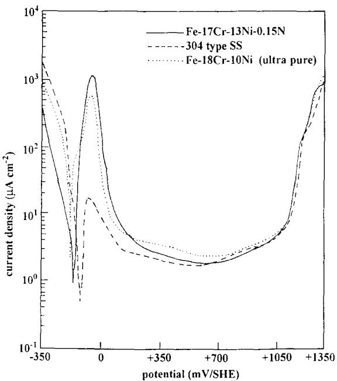
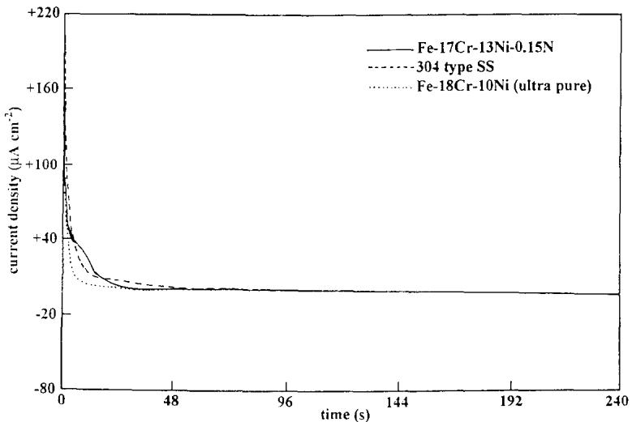
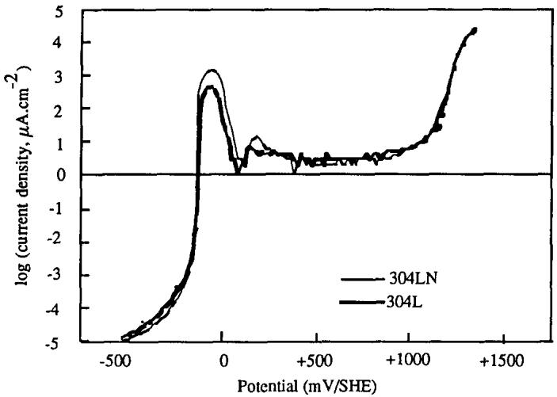
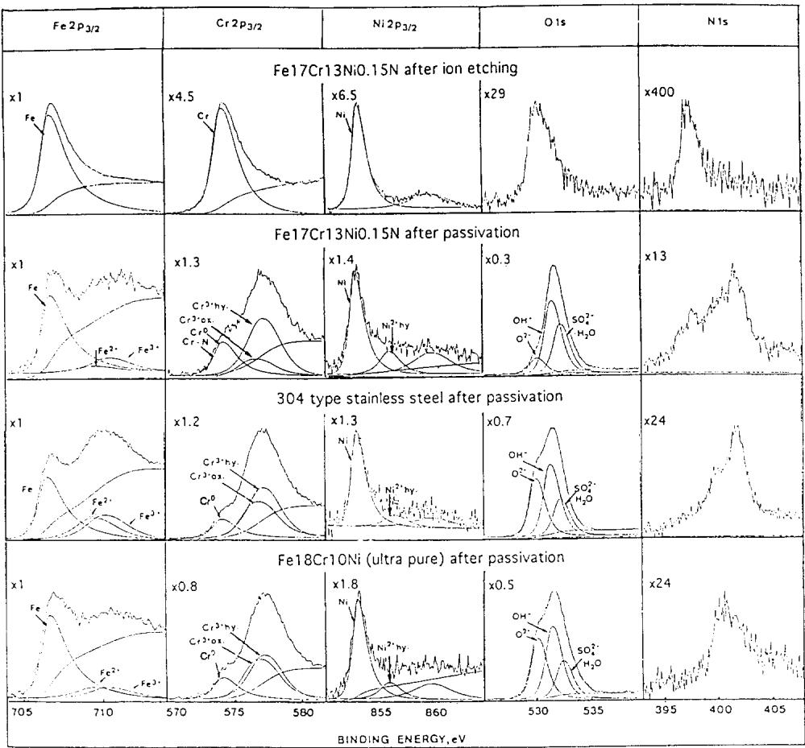
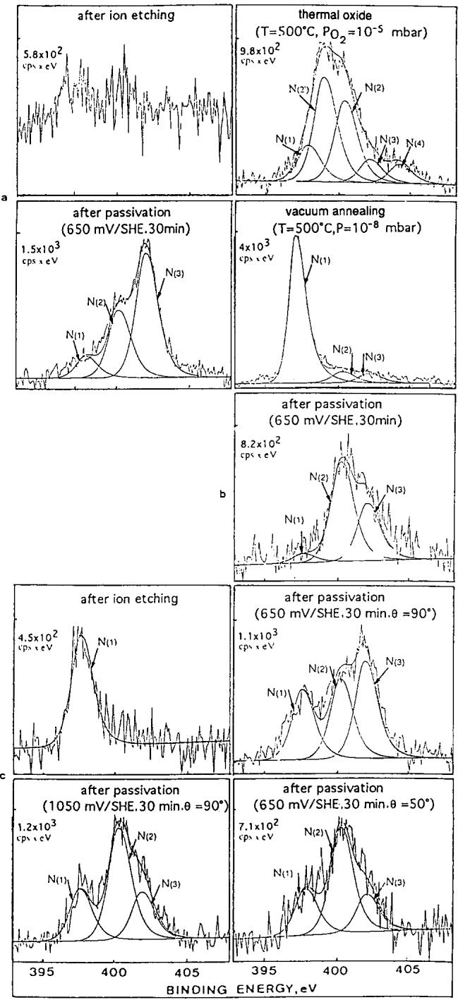
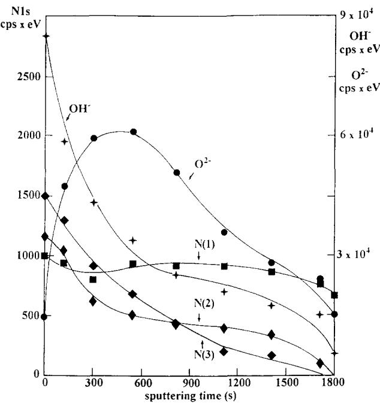
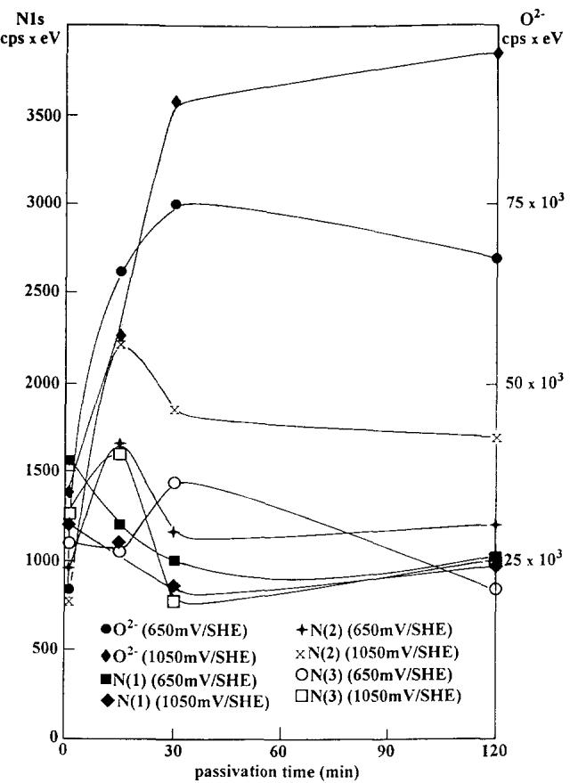

# THE ROLE OF NITROGEN IN THE PASSIVITY OF AUSTENITIC STAINLESS STEELS

A. SADOUGH VANINI\*†, J.-P. AUDOUARD‡ and P. MARCUS\*

\*Laboratoire de Physico-Chimie des Surfaces, CNRS (URA 425), Ecole Nationale Supérieure de Chimie de Paris, Université Paris VI, 11 rue Pierre et Marie Curie, 75005 Paris, France ‡IRSID-Unieux, BP 50, 42702 Firminy Cedex, France

Abstract—Three austenitic stainless steels (a Fe-17Cr-13Ni-0.15N alloy, an ultra pure Fe-18Cr-10Ni alloy and a type 304 stainless steel) were used in this study in order to investigate the effect of nitrogen on the electrochemical behaviour and on the nature of the passive film formed on the steels in acidic solution $( 0 . 5 \mathrm { M } \mathrm { H } _ { 2 } \mathrm { S O } _ { 4 } )$ . The presence of nitrogen in the alloy does not apparently have a significant influence on the response of the material to anodic polarization in the acid electrolyte. Surface analysis of the alloys by XPS after passivation shows that nitrogen is enriched at the surface by anodic segregation during dissolution and passivation of the nitrogen-bearing alloys. After passivation of the alloys three chemical states of nitrogen are detected in the N 1s spectrum. The peak at low binding energy (397.7 ± 0.1 eV) corresponds to nitrogen bonded essentially to chromium under the form of a nitride which is incorporated in the passive film. The N 1s peaks observed at higher binding energies (400.2 ± 0.1 and 402 ± 0.1 cV) correspond to nitrogen species located on the surface of the passivated alloys, which are produced by reaction of the alloy surface with the solution.

## INTRODUCTION

In the presence of both nitrogen and molybdenum, significant improvements in the resistance of stainless steels to general and localized corrosion have been reported.1-5 However, it remains unclear if nitrogen alone (i.e. in the absence of molybdenum) is capable of improving the corrosion resistance. It has been shown in a recent study that nitrogen implanted into a type 304 stainless steel does not improve the dissolution and passivation behaviour in acid solution.º Nitrogen can be added to stainless steels in order to stabilize the austenite phase and thus it is important to elucidate the role of this element in the passivity of the alloy. The aim of this work was to investigate, by electrochemical and surface analytical measurements, the effect of nitrogen on the dissolution and passivation of austenitic stainless steel without molybdenum. In order to clearly identify the effect of nitrogen, two synthetic alloys were studied, one without and the other with nitrogen. A type 304 stainless steel was also studied for comparison.

## EXPERIMENTAL METHOD

The Fe-17Cr-13Ni–0.15N alloy used in this work was provided by IRSID Unieux (France). As reference materials we used an ultra pure Fe-18Cr-10Ni alloy with less than 10 ppm of nitrogen in the bulk prepared at Ecole des Mines de St Etienne (France) and a type 304 stainless steel supplied by UGINE (France). The chemical analysis of the alloys is reported in Table 1. The alloys were mechanically polished with 0.5 μm diamond paste, giving them a mirror-like finish

Table 1. Elemental composition of the alloys (wt%)
<table><tr><td></td><td>Fe</td><td>Cr</td><td>Ni</td><td>N</td><td>Mo</td><td>Mn</td><td>Si</td><td>Cu</td><td>B,C,Al,P,S</td></tr><tr><td>Fe-17Cr-13Ni-0.15N</td><td>69.8</td><td>17</td><td>13</td><td>0.157</td><td></td><td></td><td></td><td></td><td></td></tr><tr><td>Fe-18Cr-10Ni (ultra pure)</td><td>72</td><td>18</td><td>10</td><td>&lt;10 ppm</td><td></td><td></td><td></td><td></td><td></td></tr><tr><td>Type 304 stainless steel</td><td>72.01</td><td>17.38</td><td>8.28</td><td>0.04</td><td>0.14</td><td>1.43</td><td>0.49</td><td>0.15</td><td>&lt;0.1</td></tr></table>

The electrochemical experiments were carried out in an inert gas glove box by using a 0.5 M $\mathrm { H } _ { 2 } \mathrm { S O } _ { 4 }$ solution which was de-aerated by purging with $\mathbf { N } _ { 2 } .$ Sample disks of 10 mm diameter were mounted in the electrochemical glass cell equipped with a platinum counter electrode and a mercurous sulfate reference electrode. The electrode potentials reported in this work are referenced to the standard hydrogen electrode (SHE). Following insertion of the samples into the electrochemical cell, they were cathodically reduced (-1 V, 300 s) prior to measurement of the anodic polarization curve. Polarization curves were recorded using a voltage sweep rate of $1 \mathrm { m } \mathrm { V } \mathrm { s } ^ { - 1 }$ while sample passivation prior to surface analysis was carried out by a potential step to 650 or 1050 mV(SHE) for different times of passivation (1, 15, 30 and 120 min). The passivated electrodes were removed from solution under applied potential, rinsed immediately in ultra-pure water, dried in nitrogen gas and then transferred to the surface analysis system using the transfer vessel and the fast entry port located on the preparation chamber of the spectrometer. A survey XPS spectrum of each sample was immediately recorded to determine its surface cleanliness. The presence of a C 1s signal reveals the existence of a contamination layer; the only metallic elements detected were the constituting elements of the alloys. High resolution XPS spectra were acquired for seven energy regions corresponding to the core levels: Fe $\begin{array} { r } { 2 { \bf p } _ { 3 / 2 } , \mathrm { C r } 2 { \bf p } _ { 3 / 2 } , \mathrm { N i } 2 { \bf p } _ { 3 / 2 } , \mathrm { O } 1 { \bf s } _ { 1 / 2 } , \mathrm { N } 1 { \bf s } _ { 1 / 2 } , \mathrm { S } 2 { \bf p } _ { 3 / 2 , 1 / 2 } } \end{array}$ and $\mathrm { C } 1 \mathbf { s } _ { 1 / 2 }$ The data processing was carried out using curve-fitting procedures based on reference spectra obtained for the clean and oxidized stainless steels. XPS measurements were obtained using an Al Kα Xray source $( \mathsf { h } \nu = 1 4 8 6 . 6 \mathsf { e V } )$ and a hemispherical analyser, with a pass energy of 20 eV for the high resolution spectra. The spectrometer (VG ESCALAB MK II) was calibrated using the $\mathbf { A u } 4 \mathrm { f } _ { 7 / 2 }$ (binding energy $( \mathbf { B E } ) = 8 4 . 0 \ : \mathrm { e V } )$ and Cu $2 \mathrm { p } _ { 3 / 2 } \left( \mathrm { B E } = 9 3 2 . 7 \mathrm { e V } \right)$ peaks.

Composition depth profiles of passive films on the stainless steels were obtained by ion sputtering the surface, using a VG AG60 ion gun mounted in the analysis chamber, under the following conditions: an ion beam voltage of 4 kV and a current density of $0 . 5 \mu \mathrm { A } \mathrm { c m } ^ { - 2 }$

## EXPERIMENTAL RESULTS AND DISCUSSION

## Electrochemical behaviour

Figure 1 shows the potentiodynamic (i-E) curves for the Fe-17Cr-13Ni-0.15N alloy, the ultra-pure alloy (Fe-18Cr-10Ni) and the 304 stainless steel in $0 . 5 \mathrm { M } \mathrm { H } _ { 2 } \mathrm { S O } _ { 4 }$ solution. The potential scan $( 1 \mathrm { m } \mathrm { V } \mathrm { s } ^ { - 1 } )$ was carried out from -350 to 1350 mV(SHE). The salient electrochemical features are reported in Table 2. The current at the peak maximum varies in the following order:alloy with 0.15% N > alloy without N » 304 stainless steel. The major difference is mainly associated with the presence of a small amount of molybdenum (0.14%) in the 304 stainless steel. The residual currents in the passive state are similar for the three alloys.

Table 2. Electrochemical data
<table><tr><td>Alloys</td><td>Corrosion potential (mV(SHE))</td><td>Potential at the peak maximum (mV(SHE))</td><td>Current at the peak maximum  $( \mu \mathbf { A } \ \mathsf { c m } ^ { - 2 } )$ </td><td>Current in the passive state  $( \mu \mathbf { A } \thinspace \thinspace \mathbf { c m } ^ { - 2 } )$ </td></tr><tr><td>Fe-17Cr-13Ni-0.15N</td><td>-159</td><td>-40</td><td>1225</td><td>2</td></tr><tr><td>Fe-18Cr-10Ni</td><td>-180</td><td>-40</td><td>600</td><td>2.7</td></tr><tr><td>Type 304 stainless steel</td><td>-130</td><td>-70</td><td>18</td><td>1.8</td></tr></table>

  
Fig. 1. Potentiodynamic curves for the three alloys in 0.5 M $\mathrm { H } _ { 2 } \mathrm { S O } _ { 4 } ( 1 \mathrm { m V } \mathrm { s } ^ { - 1 } )$

For the XPS analysis of passive films, the passivation was carried out by stepping the potential from the corrosion potential to the passivation potential of 650 mV(SHE). The recorded current versus time plots are shown in Fig. 2. Inspection of the curves reveals that the three alloys exhibit similar behaviours in potentiostatic experiments.

  
Fig. 2. Potentiostatic curves for the three alloys in 0.5 M $\mathrm { H _ { 2 } S O _ { 4 } }$ (at 650 mV(SHE)).

  
Fig. 3. Potentiodynamic curves for 304L and 304LN stainless steels in 1 M $\mathbf { H } _ { 2 } \mathbf { S } \mathbf { O } _ { 4 }$ at $6 0 \mathrm { { ^ \circ C } }$ (0.25 mV s−1).

If the results of the potentiodynamic and potentiostatic experiments are compared for the $\mathrm { F e } { - } 1 7 \mathrm { C r } { - } 1 3 \mathrm { N i } { - } 0 . 1 5 \mathrm { N }$ and the ultra-pure alloy, nitrogen added to the alloy does not apparently influence markedly on the response of the material to anodic polarization. Additional experiments have been carried out to compare the general corrosion behaviour of 304L and 304LN stainless steels (containing 0.068 and 0.145% N, respectively) in 1 M ${ \bf H } _ { 2 } { \bf S O } _ { 4 }$ at $6 0 \mathrm { { ^ \circ C } }$ . The results are presented in Fig. 3. They show that the addition of N to the 304L stainless steel is detrimental in the active state. No significant effect is observed in the passive state.

## Analysis of the passive films

The spectra recorded after argon ion sputter cleaning of the Fe-17Cr-13Ni– 0.15N alloy and after passivation of the three alloys at 650 mV(SHE) are shown in Fig. 4 for the take-off angle of $9 0 ^ { \circ }$ (angle of the sample surface with the direction in which the electrons are analysed). The detection of XPS signals emitted by the alloy elements (Fe,Cr,Ni) indicates that the passive film is very thin. The curve fitting of the spectra in Fig. 4 was performed in the way described previously, using reference spectra recorded with reference materials.'

The Fe $2 { \tt p } _ { 3 / 2 }$ signal has been resolved into $\mathsf { F e } ^ { 2 + }$ and $\mathsf { F e } ^ { 3 + }$ . The Cr $2 { \bf p } _ { 3 / 2 }$ region indicates a marked enrichment of ${ \mathrm { C r } } ^ { 3 + }$ in the passive film for the $\mathrm { F e { - } } 1 7 \mathrm { C r { - } } 1 3 \mathrm { N i - }$ 0.15N alloy as well as for the ultra pure and the 304 alloys. The chromium signal was resolved into chromium oxide $\dot { \mathrm { C r } } ^ { 3 + } { \bf o x } \left( { \bf C r } _ { 2 } { \bf O } _ { 3 } \mathrm { \Delta t y p e } \right)$ and chromium hydroxide $\mathbf { C r ^ { 3 + } h y } \left( \mathbf { C r ( O H ) } _ { 3 } \mathbf { t y p e } \right)$ .7 Nickel oxide is not detected in the passive films of the three alloys, in agreement with other reported results.7.8

The oxygen (O 1s) region clearly shows the presence of the oxide $( 0 ^ { 2 - } )$ and hydroxide (OH⁻) states. A third peak is present corresponding to oxygen in ${ \bf H } _ { 2 } \mathrm { O }$ and $\mathsf { S O } _ { 4 } ^ { 2 - }$ ions. These results are in agreement with XPS analysis of the passive film on austenitic stainless steels reported by others.8 It is observed here that the $O ^ { 2 - }$ signal is lower on the alloy with nitrogen than on the Fe-18Cr-10Ni alloy.

  
Fig. 4. XPS spectra recorded at a take-off angle of 90° (the curve fitting of the N 1s spectra is reported in Fig. 5).

For the clean, unpassivated Fe-17Cr-13Ni-0.15N alloy the N 1s spectrum, recorded after 10 min of ion etching, shows a N 1s signal at 397.6 eV. After passivation the nitrogen XPS signal is considerably more intense. This result shows that nitrogen is enriched at the surface and incorporated in the passive film and the previous observation of the lower $O ^ { 2 - }$ signal is an indication that the nitrogen enrichment in the film takes place at the expense of the oxide content. In the Cr $2 { \tt p } _ { 3 / 2 }$ spectrum of the nitrogen-containing alloy a broad intense peak at low binding energy is believed to be associatd with chromium in the underlying alloy and chromium located in the film and bonded to nitrogen.º The intensity of this peak is lower for the ultra pure and the 304 alloys, which indicates that chromium nitride is formed on the alloy containing nitrogen.

In an attempt to obtain a clearer picture of the chemical states of nitrogen in the passive film, the N 1s spectra were fitted by three peaks. The curve-fitted spectra are shown in Fig. 5. On the basis of previously reported resultsº the peak located at low binding energy (N(1) at $3 9 7 . 7 \pm 0 . 1 \mathrm { e V } )$ is assigned to nitride incorporated in the passive film. A significant N(1) peak is detected only on the alloys with bulk nitrogen (i.e. the Fe-17Cr-13Ni–0.15N and the 304 stainless steel which contains 0.04% of nitrogen). The intensity of N(1) is higher for the alloy with higher N content. This observation confirms that N(1) originates from bulk nitrogen. The peak located at a higher binding energy (N(2) at $4 0 0 . 2 \pm 0 . 1 \ : \mathrm { e V } )$ ) may originate from N–H or N–O.6.9 The third peak located at an even higher binding energy (N(3) at $4 0 2 \pm 0 . 1 \ : \mathrm { e V } )$ originates from nitrogen which may be under the form of $\mathrm { N H } _ { 4 } ^ { + } .$ 9 Similar N 1s binding energy (399.9 and 402.5 eV) have been reported for the molecular adsorption of inhibitors (-NR3 and -N⁺R4) on gold surfaces1⁰ and for ${ \mathrm { N } } _ { 2 } { \mathrm { H } } _ { 4 }$ on Fe(111).11 The results for the N 1s XPS spectra at different depths in the passive film on the alloy show that the intensities of the high binding energy species decrease rapidly upon ion sputtering (Fig. 6). This confirms the location of these species to be at the passive film surface and supports the view that they are produced by reaction with electrolyte. The peaks N(2) and N(3) were detected on the three alloys after passivation (Fig. 5). The fact that they are detected even on the ultra-pure alloy with a nominal nitrogen content less than 10 ppm indicates that these species may come not only from the bulk nitrogen but also from nitrogen-containing species present at trace level in the solution.

  
Fig. 5. Curve fitting of the N 1s spectra of: (a) the 304-type alloy, (b) the Fe-–18Cr-10Ni (ultra-pure) alloy and (c) the Fe-17Cr-13Ni–0.15N alloy. (cps) counts per second; (θ) takeoff angle of the electrons.

  
Fig. 6. XPS sputter depth profile for the passive film formed at 650 mV(SHE) (30 min) on the Fe-17Cr-13Ni-0.15N alloy.

Complementary experiments have revealed that N(2) and N(3) are also observed when the nitrogen atmosphere in the glove box is replaced by argon, showing that these species do not come from reaction with gaseous nitrogen or nitrogen dissolved in the electrolyte.

For comparison between wet and dry oxidation an oxide layer was formed on the 304 stainless steel in pure oxygen at 500°C $( \mathsf { p O } _ { 2 } = 1 0 ^ { - 5 }$ mbar) in the preparation chamber of the XPS spectrometer. The spectrum (Fig. 5a) shows that the intensity of the N(3) peak on the oxide layer is much lower than the intensity observed after the passivation experiments which supports the view that this species is formed by reaction with the aqueous solution. It is noted that two new peaks were detected after dry oxidation: one at $3 9 9 . 2 \ : \mathrm { e V } \left[ \mathrm { N } ( 2 ^ { \prime } ) \right]$ which may correspond to nitrogen bonded to $\mathbb { H } ^ { \check { 9 } , 1 2 , 1 3 }$ and the other at 404 eV [N(4)] which may correspond to nitrogen bonded to oxygen.9 The chemical state of nitrogen segregated on the alloy surface during high temperature annealing in UHV was also investigated on the 304 alloy. After cleaning the surface by argon ion sputtering, the alloy was heated for 60 min in ultra-high vacuum in the preparation chamber of the XPS system at $T = 5 0 0 ^ { \circ } \mathrm { C }$ .The N 1s spectrum is shown in Fig. 5a. An intense N 1s signal at the position of N(1) is observed. It corresponds clearly to N-metal bonds formed by surface segregation of bulk nitrogen.

To aid in locating the different nitrogen species in the passive film, composition depth profiles were recorded by ion sputtering and XPS analysis. The results are shown in Fig. 6 for the N-bearing alloy. The XPS signal emitted by ${ \mathsf { O } } ^ { 2 - }$ in the passive film is shown as an indicator of the depth scale during argon sputtering. For the three alloys, the $\mathrm { O H } ^ { - } / \mathrm { O } ^ { 2 - }$ intensity ratio decreases with sputtering time, confirming that the hydroxide layer constitutes the outer part of the film. The slow decrease of the intensity of the N(1) peak at low binding energy (397.7 eV), corresponding to N– metal bonds, indicates that the nitride is present in the inner part of the passive film near the passive film/alloy interface. The results for N(2) and N(3) at different depths in the passive film show the high binding energy nitrogen species to be mainly at the passive film surface, confirming that they are produced at least in part via reaction with the electrolyte.

Angle-dependent XPS measurements of the N 1s region were carried out in order to obtain additional information on the location of N(1), N(2) and N(3) in the passive film. The spectra for two take-off angles, $9 0 ^ { \circ }$ and $5 0 ^ { \circ }$ , are shown in Fig. 5c. The results show that the N(2) component is present on the passive film surface whereas N(1) is in the inner oxide part of the film. The results for N(3) are ambiguous as N(3) was found to be somewhat unstable during long exposure to the X-ray beam.

In order to investigate the effect of time of polarization and potential on the segregation of nitrogen in the passive film, passivation experiments were carried out for the Fe-17Cr-13Ni-0.15N alloy at two different potentials, 650 and 1050 mV(SHE), for 1, 15, 30 and 120 min. The N 1s XPS spectrum recorded after 30 min at 650 mV(SHE) and at 1050 mV(SHE) are shown in Fig. 5c. The recorded intensities of OH⁻, ${ \cal O } ^ { 2 - } , { \bf N } ( 1 )$ , N(2) and N(3) versus time of polarization are plotted in Fig. 7. Inspection of the curves reveals that the intensity of the N(1) signal decreases with the time of polarization for the first \~15-30 min and then becomes constant. The $O ^ { 2 - }$ signal first increases and becomes constant after \~15-30 min of passivation. These results are consistent with the view that N(1) is associated to nitride forming at the alloy/passive film interface during passive film growth and that the growth of the passive film covering the nitride causes the attenuation of the signal emitted by N(1) at the interface. The N(1) signal becomes constant when the passive film has reached a stationary thickness.

The larger scatter in the data recorded for N(2) and to a larger extent for N(3), which likely results from contamination of the solution by nitrogen containing species, makes it difficult to analyse the observed variation of these signals with potential and time.

  
Fig. 7. The recorded intensities of $O ^ { 2 ^ { - } }$ , OH", N(1), N(2) and N(3) signals versus time of polarization for the Fe-17Cr-13Ni–0.15N alloy.

## CONCLUSIONS

The electrochemical behaviour and the surface composition of Fe-17Cr-13Ni– 0.15N stainless steel have been investigated with special emphasis on the role of nitrogen. The addition of nitrogen does not improve the general corrosion behaviour of the alloy.

After passivation of the alloy, three chemical states of nitrogen are detected: the high and intermediate binding energy peaks are assigned to nitrogen species located at the surface of the passive film and are produced at least in part via reaction with the electrolyte. The peak at low binding energy corresponds to N-metal (essentially Cr) bonds under the form of nitride, present in the inner part of the passive film near the passive film/alloy interface. This nitride phase is formed by anodic segregation of the nitrogen contained in the alloy, during the dissolution stage preceding passivation.

## REFERENCES

1. Y. C. Lu, R. Bandy, C. R. Clayton and R. C. Newman, J. electrochem. Soc. 130, 1774 (1983).

2. J. E. Truman, M. J. Coleman and K. R. Pirt, Br. Corros. J. 12, 236 (1977).

3. R. Bandy and D. Van Rooyen, Corrosion 39, 227 (1983).

4. J. J. Eckenrod and C. W. Kovack, ASTM STP 679, p. 17. Philadelphia, PA (1977).

5. K. Osozawa and N. Okato, Passivity and its Breakdown on Iron and Iron Based Alloys, p. 135. NACE (USA-Japan Seminar, Honolulu), Houston, TX (1976)

6. P. Marcus and M. E. Bussell, Appl. Surf. Sci. 59, 7 (1992).

7. E. De Vito and P. Marcus, Surf. Interface Anal. 19, 403 (1992).

8. B. Brox and I. Olefjord, Proc. Stainless Steel 84, Göteborg, Sweden, p. 134. The Institute of Metals, London (1985).

9. C. R. Clayton, L. Rosenzweig, M. Oversluizen and Y. C. Lu, in Surfaces, Inhibition and Passivation (eds E. McCafferty and R. J. Brodd), p. 323. The Electrochemical Society, Pennington, NJ (1986).

10. A. Swift, A. J. Paul and J. C. Vickerman, Surf. Interface Anal. 20, 27 (1993).

11. M. Grunze, Surf. Sci. 81, 603 (1979).

13. C. R. Clayton and K. G. Martin, Proc. Conf. on High Nitrogen Steels (eds J. Foct and A. Hendry), p. 256. The Institute of Metals, London (1989).

12. R. D. Willenbruch, C. R. Clayton, M. Oversluizen, D. Kim and Y. Lu, Corros. Sci. 31, 17 (1990).