# The influences of microstructure and nitrogen alloying on pitting corrosion of type 316L and 20 wt.% Mn-substituted type 316L stainless steels

Yun Soo Lim a,\*, Joung Soo Kim a, Se Jin Ahn b, Hyuk Sang Kwon b, Yasuyuki Katada

a Steam Generator Materials Project, Korea Atomic Energy Research Institute, P.O. Box 105, Yusong, Taejon 305-600, South Korea

b Department of Materials Science and Engineering, Korea Advanced Institute of Science and Technology, Taejon 305-701, South Korea

c Joining and Interface Research Station, National Research Institute for Metals, Tsukuba 305-0047, Japan Received 7 January 2000; accepted 6 May 2000

## Abstract

The effects of nitrogen alloying on pitting corrosion of type 316LN and 20 wt.% Mnsubstituted type 316LN stainless steels were investigated by potentiodynamic polarization tests in Cl⁻ ion-bearing neutral and acidic solutions. Pitting resistance was markedly improved through the nitrogen alloying in both types of alloys, compared with the nitrogen-free alloys. It was confirmed that the added nitrogen was solid-solutioned in the austenitic phase without forming any nitrides under 20 min heat treatment at 1150°C. From the in situ observation on the initiation and growth of pits, pitting was found to occur consistently at the sites of inclusions. The pitting corrosion behaviors in both types of alloys were discussed with respect to the role of sulfides as initiators of pitting corrosion, and the changes of repassivation properties due to the nitrogen alloying in the alloys. © 2000 Published by Elsevier Science Ltd.

Keywords: Stainless steels; Polarization; TEM; Pitting corrosion; Inclusion

## 1. Introduction

The beneficial effects of nitrogen, as an alloying element, to the mechanical and corrosion properties of many austenitic stainless steels (SS) have been well recognized over the last two decades. In particular, it has been reported that nitrogen alloying can lead to improvements in pitting resistance of the alloys in Cl- ion-bearing neutral and acidic solutions [1,2]. In SS, however, the beneficial effects of nitrogen are limited by the maximum solubility of nitrogen in solid solution. For example, the nitrogen solubility in Fe–17Cr–14Ni SS is only about 0.17 wt.% at $1 6 0 0 ^ { \circ } \mathrm { C }$ under 1 atm ${ \bf N } _ { 2 }$ gas pressure [3]. Precipitation of nitrides, such as $\mathrm { C r } _ { 2 } \mathrm { N } ,$ , due to the excess nitrogen $( \mathrm { i . e . , }$ above the solubility limit) may lead to a localized depletion of Cr and hence induce localized corrosion around them.

The influence of Mn, a common alloying element in SS, on the resistance to pitting corrosion of SS is not clearly elucidated as yet. Some studies performed on Cr-Ni–Mn–Mo alloys containing up to 10 wt.% Mn found improved pitting resistance in $1 0 \% \mathrm { F e C l } _ { 3 }$ solution tests [4]. However, a contradictory result with Mn alloying was also reported [5]. The presence of MnS inclusions, formed due to Mn alloyed with SS and S present as an impurity, increases the susceptibility of SS to pitting corrosion. Hence, the AISI ¹ 300 series standard grade specifies the maximum Mn and S contents of 2 and 0.03 wt.%, respectively. However, Mn has a strong affinity to nitrogen and thus increases the solubility of nitrogen substantially [6,7]. At low contents, Mn is regarded as an austenite former [8], whereas at higher contents it is thought to favor ferrite [8,9].

The nucleation sites of pits are usually found to be associated with inclusions on SS. In particular, sulfide inclusions such as MnS and FeS were shown to be the potential sites in the extensive works of Wraglen [10], Eklund [11], and others [12– 14]. They have all clearly shown that the dissolution of a sulfide inclusion is the initial step of pit propagation at this site in Cl- ion-bearing neutral and acidic solutions. Therefore, it is useful to combine the electrochemical and metallographic studies to fully understand the pitting corrosion behaviors of the alloys.

In the present work, the effects of the nitrogen alloying on the pitting corrosion properties of type 316LN and 20 wt.% Mn-substituted type 316LN SS in neutral and acidic Cl- media were studied using potentiodynamic polarization tests. Since the microstructure including second phases of the alloy strongly affects the pitting corrosion behavior, they were investigated using microscopic equipment. The in situ monitoring of pitting was also carried out using an optical microscope to identify the pitting initiation sites and to understand the pitting growth features. Finally, the difference in pitting corrosion resistance between the two types of alloys was compared and discussed considering the microstructures, the inclusions involved, and the repassivation properties of the alloys.

## 2. Experimental method

## 2.1. Materials

Two types of model alloys, type 316LN SS and 20 wt.% Mn-substituted type 316LN SS, were obtained from the National Research Institute for Metals (NRIM), Japan, and the chemical compositions are shown in Table 1. The alloys were induction melted in a vacuum furnace and cast into ingots. The ingots were hot-rolled in a controlled atmosphere, and then cold-rolled to 2.154 mm thick sheets. Before the experiments, all specimens were solution annealed for 20 min at $1 1 5 0 ^ { \circ } \mathrm { C } ,$ and then water quenched. For type 316LN SS under consideration (L series in Table 1), nitrogen is the only major compositional variable because Cr, Ni and Mo are essentially constant and the carbon contents are extremely low. Similarly, for the high Mn-substituted type 316LN SS (M series in Table 1), 20 wt.% Fe was substituted for 20 wt.% Mn to increase the nitrogen solubility.

## 2.2. Potentiodynamic polarization tests

Cu-wire was spot-welded to one side of each specimen, mounted in epoxy resin, and ground to 2000 grade silicon carbide. To avoid crevice corrosion, the specimenmount interface was carefully coated with a thin film of silicone sealant. Approximately 1 $\mathrm { c m } ^ { 2 }$ of the surface was exposed to the test solution.

All the solutions were prepared from double-distilled water and the chemicals were analytical-grade reagents. Several test solutions, 1, 0.1 M KCl, and 0.5 M HCl, were chosen for the investigation. The test solutions were degassed by purging the solutions with purified ${ \bf N } _ { 2 }$ gas before and during each potentiodynamic polarization test.

Potentiodynamic polarization tests were performed using a three-electrode cell system consisting of a saturated calomel electrode (SCE) as a reference, a platinum electrode as a counter, and a specimen as the working electrode. The sample was kept immersed in the test solution for 2 h at open-circuit potential. After obtaining the stable corrosion potential $( E _ { \mathrm { c o r r } } )$ , the potential was raised in the anodic direction, from –100 mV below $E _ { \mathrm { c o r r } } .$ , at a scan rate of 0.2 mV/s. All the potentials were referred to an SCE. The potentiodynamic polarization tests in different solutions were carried out at room temperature, and repeated at least twice for each specimen to ensure reproducibility. The presence of pitting was confirmed by an optical microscope after the corrosion tests.

## 2.3. Microstructural characterization

For observation with an optical microscope, specimens were prepared by chemical etching with a solution of 10% $\mathrm { H C l } + 1 0 \% \ \mathrm { H N O } _ { 3 } + 1 5 \%$ acetic acid + 65% distilled water at room temperature. A scanning electron microscope (SEM) equipped with energy dispersive X-ray spectroscopy (EDS) was used to characterize the type and distribution of inclusions in the alloys. Several regions were randomly chosen for observation in each specimen. To analyze further the exact chemical compositions of the inclusions, a transmission electron microscope (TEM, JEOL 2000FX II, operating voltage 200 kV) equipped with EDS was also employed. Specimens for SEM/EDS observation were polished with diamond paste to a size of 1 μm. TEM/EDS specimens were prepared by thinning mechanically down to approximately 15 μm, followed by an ion milling process.

Tbb1 Chl an o s  t  soo anne)
<table><tr><td></td><td>Designation</td><td>Mn</td><td>Ni</td><td>Cr</td><td>Mo</td><td>Si</td><td>Al</td><td>C</td><td>0</td><td>P</td><td>S</td><td>N</td></tr><tr><td rowspan="5">316L (L series)</td><td>L1</td><td>&lt;0.01</td><td>14.23</td><td>16.64</td><td>2.25</td><td>0.01</td><td>0.045</td><td>0.0042</td><td>0.0020</td><td>&lt;0.001</td><td>0.001</td><td>0.002</td></tr><tr><td>L2</td><td>&lt;0.01</td><td>14.26</td><td>16.56</td><td>2.27</td><td>0.01</td><td>0.073</td><td>0.0020</td><td>0.0020</td><td>&lt;0.001</td><td>0.001</td><td>0.058</td></tr><tr><td>L3</td><td>0.01</td><td>14.10</td><td>16.40</td><td>2.23</td><td>0.01</td><td>0.064</td><td>0.0014</td><td>0.0020</td><td>0.001</td><td>0.001</td><td>0.116</td></tr><tr><td>L4</td><td>0.01</td><td>14.08</td><td>16.36</td><td>2.29</td><td>0.02</td><td>0.078</td><td>0.0025</td><td>0.0020</td><td>0.001</td><td>0.001</td><td>0.171</td></tr><tr><td>M1</td><td>20.26</td><td>14.39</td><td>16.62</td><td>2.26</td><td>0.01</td><td>0.009</td><td>0.0028</td><td>0.0050</td><td>&lt;0.001</td><td>0.002</td><td>0.004</td></tr><tr><td>20 wt.% Mn-sub- stituted 316L (M</td><td>M2</td><td>20.12</td><td>14.26</td><td>16.96</td><td>2.18</td><td>0.01</td><td>0.018</td><td>0.0019</td><td>0.0021</td><td>&lt;0.001</td><td>0.003</td><td>0.314</td></tr><tr><td>series)</td><td>M3</td><td>20.00</td><td>14.29</td><td>16.91</td><td>2.18</td><td>0.01</td><td>0.010</td><td>0.0024</td><td>0.0030</td><td>&lt;0.001</td><td>0.002</td><td>0.394</td></tr></table>

## 2.4. In situ observation of the pitting process

To obtain information on the sites of pit initiation and growing features of the stable pits in the alloys, an in situ experiment of the pitting process was performed using a scanning probe microscope (SPM; Model SPA300, Seiko Instruments Inc.). The SPM was originally designed to study surface properties of materials such as surface morphology and electrostatic potential distribution. It is also possible to conduct electrochemical tests using an electrochemical cell and an electrochemical controller contained within the SPM, and to view the corrosion process using an optical microscope positioned over the electrochemical cell.

A test solution of 0.1 M KCl was chosen with air-saturation at room temperature for the investigation. The specimen with a size of approximately $1 6 \times 1 6 ~ \mathrm { m m } ^ { 2 }$ was mechanically polished with diamond paste to a size of $1 ~ { \mu \mathrm { m } }$ . The specimen, except the test area of approximately $5 \times 5 ~ \mathrm { m m } ^ { 2 }$ , was painted carefully with a corrosionresistant enamel to avoid crevice corrosion between the specimen surface and the O-ring of the electrochemical cell. The potential was raised anodically from —500 mV, which is far below $E _ { \mathrm { c o r r } }$ of the alloys, at a scan rate of 0.2 mV/s. As soon as the pitting was initiated in the test area, the applied potential was switched off so that the stable pit(s) could grow in an autocatalytic manner.

## 3. Results

## 3.1. Potentiodynamic polarization tests

The potentiodynamic responses of the L series in 1 M KCl solution are shown in Fig. 1(a). As reported [1,2,15], the resistance to pitting corrosion of the L series, evaluated by the pitting potential, increased with increasing nitrogen content in the alloys. The M series, however, showed a very complicated behavior. The resistance to pitting corrosion of the M series was very inferior to those of the L series in 1 M KCl solution. Further, the M series exhibited numerous current transients in the anodic polarization regions below the pitting potentials, as shown in Fig. 1(b).

To further study the current transients that appeared in the anodic polarization for the M series, the anodic polarization behaviors of the M series were examined in the less concentrated solution of 0.1 M KCl. Current-potential traces in the passive range of the M series are presented in Fig. 2. Evidently, nitrogen effects on the pitting potential of the alloys are noticeable, i.e., the more the nitrogen alloyed, the higher the pitting potential. It can also be clearly seen from Fig. 2 that the occurrence of the current transients and the height of the individual current transients were significantly reduced by nitrogen alloying. It is known that the occurrence of current transients in the passive potential regime is caused by the initiation, temporary growth, and repassivation of individual metastable pits (or, the breakdown and subsequent repassivation of the passive film) [1,2,12]. From the results, it can be thought that the passivation properties of austenitic SS were changed advantageously, due to the nitrogen alloying, which resulted in an increase of the pitting potential and in the reduction of metastable pits.

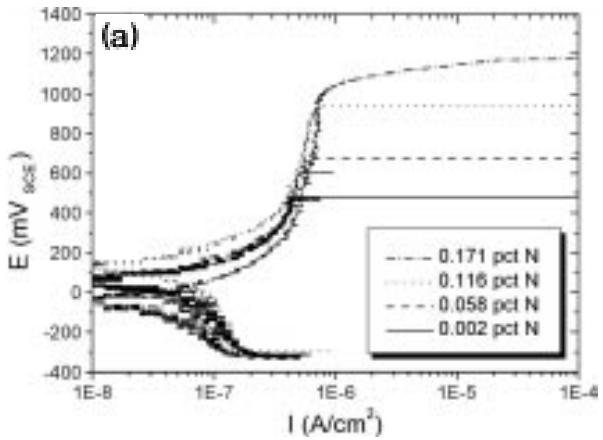

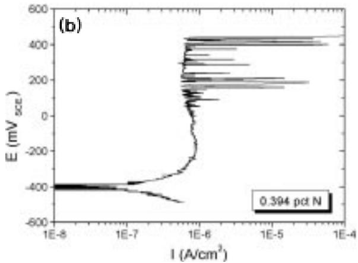  
Fig. 1. Anodic ploarization curves of (a) type 316LN SS with various nitrogen contents and (b) 20 wt.% Mn-substituted type 316LN SS with 0.394 wt.% N, tested in 1 M KCl solution at a scan rate of 0.2 mV/s.

To examine the active-passive transition behaviors of the designed alloys, the potentiodynamic polarization tests were also performed in 0.5 M HCl, and the results are shown in Fig. 3. Both types of alloys showed active-passive behavior in this solution. The L series underwent an active-passive transition with a clear passive region (Fig. 3(a)), however, the M series lacked any clear passive region (Fig. 3(b)). As for the tests in the Cl- ion-bearing neutral solution (Fig. 1(a)), the effect on nitrogen alloying of the L series is evident, i.e., the pitting potentials of the alloys increased proportionally with the nitrogen contents (Fig. 3(a)). The critical current densities $( i _ { \mathrm { c r i t } } )$ in the active dissolution region seemed to decrease due to the nitrogen alloying, however, the passivation current density $( i _ { \mathrm { p a s s } } )$ remained unchanged. The M series had similar tendencies to the L series; the pitting resistance of the M series increased with the nitrogen content. However, since the clear passive regions were not observed in this case, the pitting potential could not be defined. The critical current densities in the active regions decreased, and above the active dissolution region, the current density approached the value of the assumed' passivation current density with increasing nitrogen content.

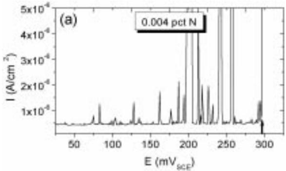

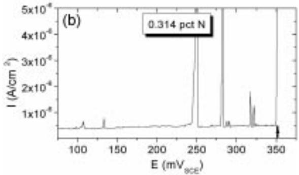

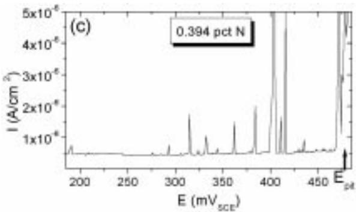  
Fig. 2. Current-potential traces illustrating the occurrence of anodic current transients in the passive regions of 20 wt.% Mn-substituted type 316LN SS with nitrogen contents of (a) 0.004 wt.%, (b) 0.314 wt.% and (c) 0.394 wt.%, tested in 0.1 M KCl at a scan rate of 0.2 mV/s. The arrows in the figures are located on the pitting potentials of the alloys.

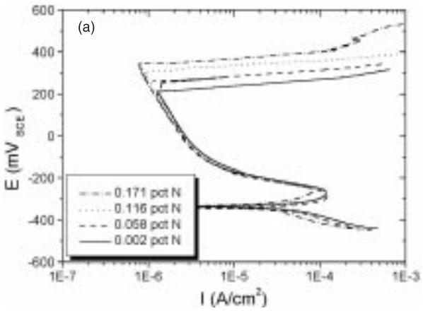

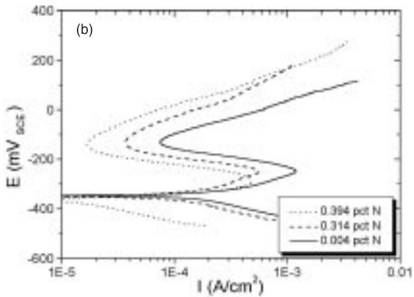  
Fig. 3. Anodic polarization curves of (a) type 316LN SS and (b) 20 wt.% Mn-substituted type 316LN SS with various nitrogen contents, tested in 0.5 M HCl solution at a scan rate of 0.2 mV/s.

From the above results, it can be concluded that nitrogen alloying improves the resistance to pitting corrosion in both types of model alloys (L and M series) in the test solutions. The pitting potential increased in a regular manner for the L series with increasing nitrogen content. However, the behavior was more complicated for the M series. The results showed that the pitting resistance of the M series is quite inferior to that of the L series. The pitting potential of the M1 alloy, for example, is much lower than that of the L1 alloy. The two alloys had almost the same chemical composition, except 20 wt.% Mn substitution. High Mn alloying in type 316LN SS was, therefore, detrimental to pitting resistance, even though higher nitrogen content could be alloyed. The critical current densities of the M series $( \sim 1 0 ^ { - 3 } \ \mathrm { A } / \mathrm { c m } ^ { 2 }$ , Fig. 3(b)) are also almost 10 times higher than those of the L series $( \sim 1 0 ^ { - 4 } \ \mathrm { A } / \mathrm { c m } ^ { 2 }$ 2 Fig. 3(a)) under the same experimental conditions.

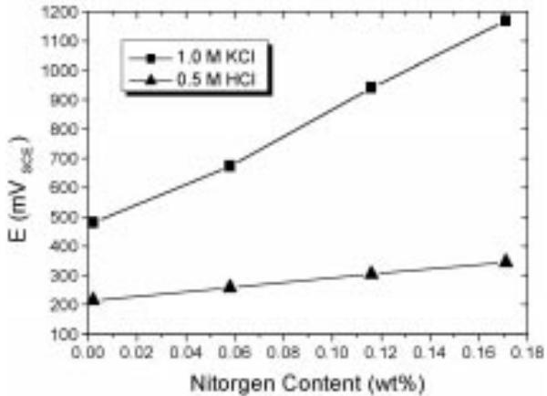  
Fig. 4. Pitting potentials of type 316LN SS as a function of nitrogen content in 1 M KCl and 0.5 M HCl solutions at a scan rate of 0.2 mV/s.

The pitting potentials obtained from the L series in 1 M KCl and 0.5 M HCl solutions are summarized in Fig. 4. From the figure, it can be seen that the pitting potential increases proportionally to the nitrogen content. The effect of nitrogen alloying on the pitting resistance was more pronounced in the neutral Cl- ionbearing solution than in the acidic Cl⁻ media. The rates of pitting potential increase were measured as 4.07 V per %N in 1 M KCl solution, and 0.78 V per %N in 0.5 M HCl solution.

Most of the pits observed in the early stage of growth exhibited a lace-like pit morphology, irrespective of the alloys and the corrosive environments. The pit morphology after significant growth, showing mechanical breakdown of the passive layer when the size of the subsurface pit becomes large, is shown in Fig. 5.

## 3.2. Microstructural characterization

It was confirmed that the microstructures of all the alloys (L and M series) consisted of a single austenitic phase. Any second phases such as sigma and chi, and nitride precipitates such as $\mathrm { C r } _ { 2 } \mathrm { N }$ were not found. The added nitrogen was, therefore, confirmed to be solid solutioned in the austenitic phase under the 20 min heat treatment at $1 1 5 0 ^ { \circ } \mathrm { C } ,$ even for the M3 alloy, which had the highest nitrogen content of 0.394wt.%.

Since both the L and M series have a single austenitic phase, their microstructures were observed to have similar morphologies with optical microscopy. Fig. 6(a) shows the typical microstructure of L1, and Fig. 6(b) of M2 alloy. The noticeable difference in the L and M series is the number density of non-metallic inclusions. Inclusions were hardly found in the L series as shown in Fig. 6(a), however, large and elongated ones were frequently found in the M series as shown in Fig. 6(b). The black spots in Fig. 6(b) seem to be the locations of previous inclusions that were preferentially attacked by the chemicals during etching. Since some inclusions are the potential sites of the initiation of pitting, they were examined carefully using SEM/EDS and TEM/EDS observations.

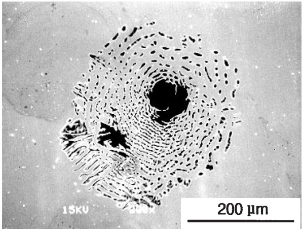  
Fig. 5. Pit morphology after significant growth of a pit, taken from 20 wt.% Mn-substituted type 316LN SS with 0.314 wt.% N.

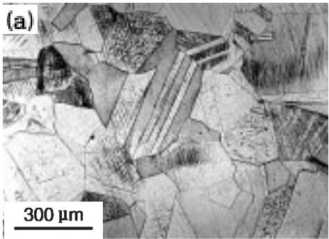

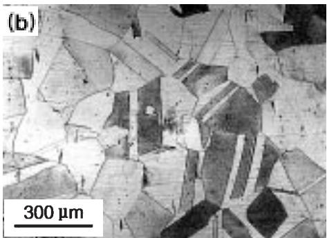  
Fig. 6. Optical micrographs of (a) type 316LN SS with 0.002 wt.% N, and (b) 20 wt.% Mn-substituted type 316LN SS with 0.314 wt.% N. Chemical etching with a solution of 10% HCl + 10% $\mathrm { H N O _ { 3 } } + 1 5 \%$ acetic acid + 65% distilled water.

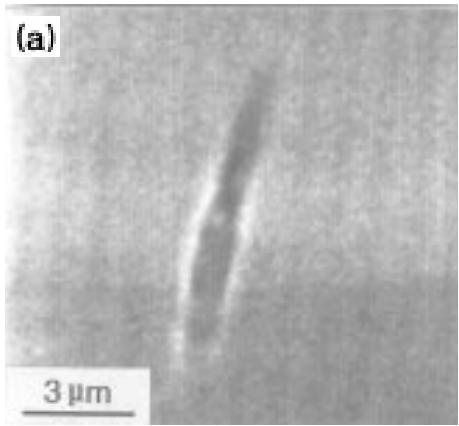

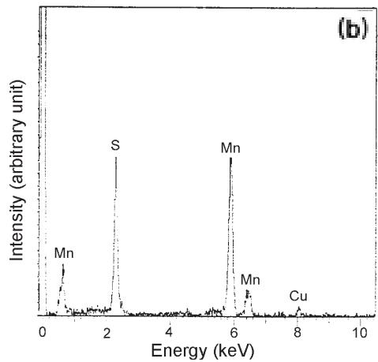  
Fig. 7. (a) SEM image and (b) TEM/EDX spectrum of a sulfide inclusion, which is commonly found in 20 wt.% Mn-substituted type 316LN SS with 0.314 wt.% N.

Two types of inclusions, MnS and alumina, were found in the M series. An SEM image and representative TEM/EDX spectrum from a sulfide inclusion are shown in Fig. 7, and those from an alumina are shown in Fig. 8. From the figures, it can be concluded that most of the inclusions found in the M series were stoichiometric MnS and $\mathbf { A l } _ { 2 } \mathbf { O } _ { 3 }$ . Sulfides had large and elongated/elliptical shapes, while Al compounds were always round or faceted. In some cases MnS was found attached to $\mathbf { A l } _ { 2 } \mathbf { O } _ { 3 }$ which indicates that MnS has nucleated and grown on $\mathbf { A l } _ { 2 } \mathbf { O } _ { 3 }$ , as shown in Fig. 9. Inclusions found in the L series were mostly $\mathbf { A l } _ { 2 } \mathbf { O } _ { 3 }$ . The formation of stoichiometric MnS in the M series can be attributed to high alloyed Mn in the M series. Sedriks [16] investigated the inclusions present in SS. He found that as the Mn content increases, the chemical composition of sulfides changes from (Cr,Mn)S to MnS.

## 3.3. In situ observation of the pitting process

From the in situ observation of pitting corrosion, pits were found to occur consistently at the sites of inclusions, irrespective of the types of the alloys. Surface defects such as scratches and/or small deposits that occurred during specimen preparation did not influence the pit initiation. A series of consecutive frames from in situ video recording showing the pitting process in the M2 alloy is shown in Fig. 10. The arrow in Fig. 10(a) indicates an inclusion before pit initiation. The black speck indicated by an arrow in Fig. 10(b) represents the pit that had just initiated, which is in an identical position to that indicated in Fig. 10(a). The time development of the pit growth after 20 s and 1 min, following pit initiation, is shown in Fig. 10(c) and (d), respectively. From the figures, it can be seen that the pit grew quickly once initiated.

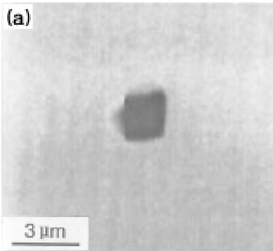

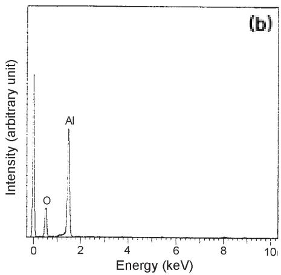  
Fig. 8. (a) SEM image and (b) TEM/EDX spectrum of an alumina inclusion, which is commonly found in 20 wt.% Mn-substituted type 316LN SS with 0.317 wt.% N.

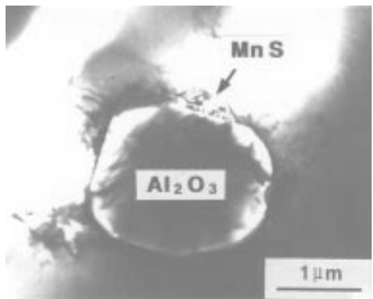  
Fig. 9. TEM bright field image of MnS attached to $\mathbf { A l } _ { 2 } \mathbf { O } _ { 3 }$ , showing that MnS had nucleated and grown on $\mathbf { A l } _ { 2 } \mathbf { O } _ { 3 }$ , taken from 20 wt.% Mn-substituted type 316LN SS with 0.317 wt.% N.

Of the two types of inclusions found in the present study, MnS is well known to be a pitting initiator in commercial SS [10–14]. Castle et al. [13,14] studied the early stage of pit initiation in type 316 SS, which had some sulfides (Mn and Cu sulfides)

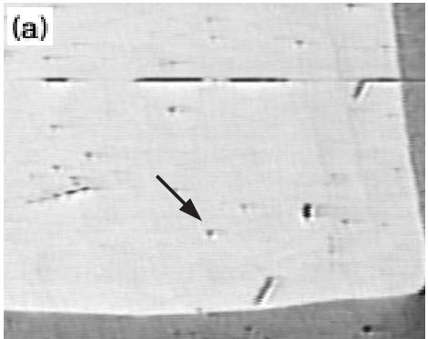

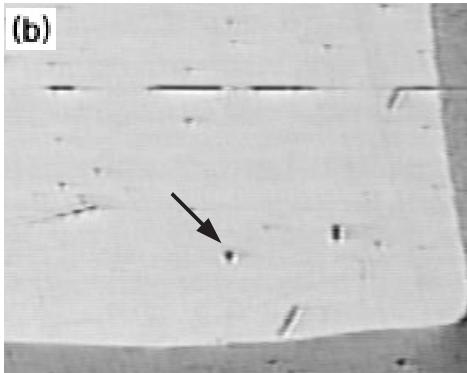

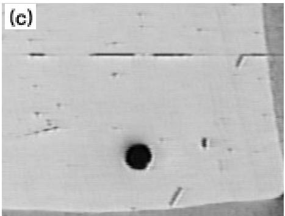

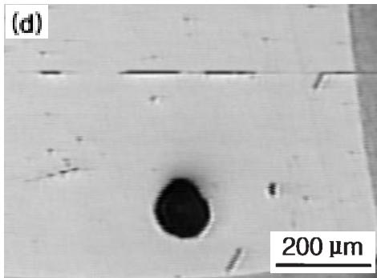  
Fig. 10. Selective frames from an in situ video recording showing the pitting process, obtained from 20 wt.% Mn-substituted type 316LN SS with 0.317 wt.% N, in aerated 0.1 M KCl solution: (a) before pit initiation, (b) just after pit initiation, (c) 20 s after pit initiation, and (d) 1 min after pit initiation. The arrows in (a) and (b) indicate an inclusion and an early stage of pit initiation, respectively.

and oxides (Al, Ti, and Cr oxides). Using SEM/EDS and Auger spectroscopy, they found that pits were always initiated at sites of Mn-enriched sulfides, irrespective of whether the sulfides were isolated or combined with some oxides. MnS should, therefore, be the site of the initiation of pitting under the present experimental conditions.

## 4. Discussion

The first finding of the present work is that pitting was initiated almost exclusively at non-metallic inclusions, probably MnS. Secondly, high Mn alloying (20 wt.% in the present case) was detrimental to pitting corrosion of type 316LN SS, even though the nitrogen solubility could be significantly raised. Lastly, the beneficial effects of the nitrogen alloying on the resistance to pitting corrosion, when nitrogen is solid-solutioned in the austenitic phase, were confirmed in the M series, as well as in the L series.

Eklund [11] pointed out that the sulfides are electronic conductors, and can therefore be polarized to the potential of a passive SS surface (i.e., to the open-circuit potential) in natural corrosive environments. At this potential, from the results of thermodynamic considerations, the sulfides themselves are not thermodynamically stable and tend to dissolve making a microcrevice at the periphery along the inclusion/metal interface. If there are Cl⁻ ions in the solution, the Cl- ions are preferentially adsorbed on the polarized surface of MnS, due to the high electronic conductivity of MnS [10], which should further facilitate its anodic dissolution.

Most of the MnS inclusions found in the M series, in the present study, were large and had an elongated-shape. Stewart and Williams [12] have investigated anodic current transients in neutral dilute NaCl solutions (0.028 M) for laser-treated type 304L SS with various sulfur contents. Laser surface melting (LSM) was shown to markedly improve the pitting resistance of the alloys, due to the refinement of size as well as the reduction of the (visible) volume fraction of sulfur-rich inclusions. They showed that the bulk sulfur content of an alloy does not in itself control pitting susceptibility, rather it is the size, shape and distribution of the sulfide inclusions that is significant. They concluded that sulfide inclusions below a certain critical size did not act as initiation sites for damaging pits. The above results can be interpreted as indicating that the Cl⁻ ion concentration within the pit attracted by anodic dissolution of the small inclusions never reaches the critical concentration for the precipitation of $\mathbf { M n C l } _ { 2 }$ salt films, and consequently repassivation of the metastable pit occurs. It is known that salt film precipitation is the precursor of pitting, and salt film formation is therefore important in stabilizing pit growth in SS [17,18]. Therefore, the surface layer resistant to pitting corrosion formed by LSM can provide an effective barrier between the corrosive environment and the underlying pitting susceptible alloy.

The early stage of pitting initiation could be understood by the current transients occurred in the passive potential regime (Fig. 2). As the pits developed at the sites of sulfide inclusions, the current transients should be closely correlated with the behavior of the passive film around them. The absence of current transients on the L series under the same conditions can be partly attributed to the sparseness or absence of the sulfide inclusions as a pitting source, and consequently relative high pitting potentials. Once a pit embryo nucleates, it could grow steadily at the high applied potential in L series, as pointed out by Palit et al. [1].

For a variety of SS in dilute Cl- solution, Williams et al. [19–21] showed that the frequency of propagating pits is proportional to the frequency of nucleation of metastable pits (or the frequency of current transients in the polarization test), and that the survival probability of a metastable pit drops drastically to zero as the applied potential (nominally, pitting potential in the polarization test) approaches a certain value. This explains why the M series is more susceptible to pitting corrosion than the L series. The number density of sulfide inclusions in the M series was much higher than that in the L series. Obviously, the passive film could be altered by the Mn alloying, affecting the resistance to pitting corrosion. The precise effects have not yet been reported.

Whether the metastable pit becomes stable and continuously grows, is dependent on the ability of the SS to repassivate the exposed base metal around the dissolving MnS inclusion. To understand the effects of N alloying on the resistance to pitting corrosion, it is necessary to know at what point repassivation of the exposed base metal within a pit should cease, and which factors affect the criteria for stable pit growth. The development of the pit embryo into a growing pit can be envisaged from the model for pit initiation at MnS proposed by Baker and Castle [14]. As MnS dissolves, the base metal is exposed to the corrosive environment, making a crevicelike cavity between the exposed base metal and MnS. Depending on the Cl- ion concentration, pH and applied potential, the repassivation of the exposed part of the base metal within the pit will occur. If the volume and size of the MnS inclusion are small [12] such that the concentration of Cl⁻ ions does not exceed the critical value for precipitation of $\mathbf { M n C l } _ { 2 }$ salt film, the exposed base metal will repassivate and the pit will cease growing. If, however, salt film saturation is attained within the cavity, an $\mathbf { M n C l } _ { 2 }$ salt film will form at the surface of the exposed base metal, and lead to a continuously growing pit by preventing the repassivation reaction. In the present study, the effects of nitrogen alloying on SS were realized as causing reductions in the frequency of the current transients and in the height of the individual current transient in the passive potential regime, and the resultant increase of the pitting potentials. As Jargelius-Pettersson [2] claimed, the observation strongly suggests that nitrogen promoted pit repassivation, i.e., in this case, easier formation of the passive film within the pit during MnS dissolution.

The cathodic dissolution of N for NH† production [22] is too sluggish at high applied potentials in the L series [23], and the amount of acid consumption by NH‡ production is rather marginal, as shown by Newman and Shahrabi [24]. The sites of initiation of pitting were not the base metal itself, but the sulfide inclusions. Therefore, the beneficial effects due to nitrogen dissolution might not be operative in the early stage of initiation of pitting in the present study.

## 5. Conclusions

1. Pitting was initiated almost exclusively at non-metallic inclusions in both types of alloys, in particular, MnS in 20 wt.% Mn-substituted SS. The volume, size and shape of the sulfides present in the alloys provided the suitable conditions for a pit embryo to evolve into a steadily growing pit under the present experimental conditions.

2. Nitrogen alloying had markedly beneficial effects on the resistance to pitting corrosion of the alloys in the solutions under investigation. High Mn alloying in type 316LN SS was detrimental to pitting corrosion, even though higher levels of nitrogen could be obtained.

3. The nitrogen effect was realized by the pronounced increase of the pitting potentials in both types of alloys. In addition, the current transients due to metastable pits in the passive potential regime were significantly suppressed by nitrogen alloying in 20 wt.% Mn-substituted type 316LN SS. From these results, it is believed that nitrogen alloyed to SS could facilitate the repassivation process of the exposed base metal within the pit during MnS dissolution.

## Acknowledgements

The authors are grateful to Dr. Hideki Uno, NRIM, Japan, for his contributing discussions.

## References

[1] G.C. Palit, V. Kain, H.S. Gadiyar, Corrosion 49 (12) (1993) 977.

[2] R.F.A. Jargelius-Pettersson, Corros. Sci. 41 (1999) 1639.

[3] D.S. Shahapurkar, W.M. Small, Metall. Trans. B 18B (1987) 225.

[4] R.J. Brigham, E.W. Tozer, Corrosion 32 (7) (1976) 274.

[5] R. Bandy, D. van Rooyen, Corrosion 39 (6) (1983) 227.

[6] C. Qiu, Metall. Trans. A 24A (1993) 629.

[7] C. Qiu, Metall. Trans. A 24A (1993) 2393.

[8] F.C. Hull, Weld. J. 52 (5) (1973) 193s.

[9] V. Raghavan, Metall. Trans. A 26A (1995) 237.

[10] G. Wranglen, Corros. Sci. 14 (1974) 331.

[11] G.S. Eklund, J. Electrochem. Soc. 121 (4) (1974) 467.

[12] J. Stewart, D.E. Williams, Corros. Sci. 33 (3) (1992) 457.

[13] J.E. Castle, R. Ke, Corros. Sci. 30 (4/5) (1990) 409.

[15] M. Janik-Czachor, E. Lunarska, Z. Szklarska-Smialowska, Corrosion 31 (11) (1975) 394.

[14] M.A. Baker, J.E. Castle, Corros. Sci. 34 (4) (1993) 667.

[16] A.J. Sedriks, Int. Metals Rev. 28 (5) (1983) 295.

[17] F. Hunkeler, G.S. Frankel, H. Bohni, Corrosion 43 (3) (1987) 189.

[18] G.S. Frankel, L. Stockert, F. Hunkeler, H. Boehni, Corrosion 43 (7) (1987) 429.

[19] D.E. Williams, C. Westcott, M. Fleischmann, J. Electrochem. Soc. 132 (8) (1985) 1796.

[20] D.E. Williams, C. Westcott, M. Fleischmann, J. Electrochem. Soc. 132 (8) (1985) 1804.

[21] P.H. Balkwill, C. Westcott, D.E. Williams, Mater. Sci. Forum. 44,45 (1989) 299.

[22] K. Osozawa, N. Okato, Effects of alloying elements, especially nitrogen, on the initiation of pitting in stainless steel, in: R.W. Staehle, H. Okada (Eds.), Passivity and Its Breakdown on Iron and Iron-Based Alloys, NACE, Houston, Texas, 1976, pp. 135–139.

[23] R. Bandy, D. van Rooyen, Corrosion 41 (4) (1985) 228.

[24] R.C. Newman, T. Shahrabi, Corros. Sci. 27 (8) (1987) 827.