PII: S0010-938X(96)00018-2

# THE INFLUENCE OF NITROGEN ON THE PASSIVATION OFSTAINLESS STEELS

I. OLEFJORD and L. WEGRELIUS

Department of Engineering Metals, Chalmers University of Technology, S-412 96 Göteborg, Sweden

Abstract—Two austenitic stainless steels, Fe-20Cr-20Ni-6Mo-0.011N and Fe-20Cr-20Ni-6Mo-0.2N were polarized in 0.1M HCl + 0.4MNaCl at 22 and $6 5 ^ { \circ } \mathbf { C } .$ Pitting is initiated on both steels. The high N-containing steel is repassivated while the pits are growing on the low N-containing steel at $6 5 \mathrm { ^ \circ C }$ The composition and the thickness of the passive films (determined by ESCA) formed during polarization to the potentials —75, + 500 and + 800 mV (SCE) are independent of the N content of the steels. Nitrogen segregates anodically to the metal-oxide interface during passivation. A model for a synergistic effect between Mo and N is suggested. Copyright ©1996 Elsevier Science Ltd.

Keywords: A. stainless steel, C. passive films, C. pitting corrosion.

## INTRODUCTION

Nitrogen added to austenitic stainless steels improves their pitting and crevice corrosion resistance.1-6 Several mechanisms for the role of nitrogen in stainless steels have been suggested. Janik-Czachor et $a l . ^ { 3 }$ proposed that N forms carbonitrides of the type $\mathbf { M e } _ { 2 } ( \mathbf { C } , \mathbf { N } )$ and as a consequence the number of high chromium containing carbide particles becomes lower and thereby the sensitivity to pitting corrosion is reduced since pitting is often initiated at the boundaries of carbide inclusions. Osozawa and $\mathrm { O k a t o } ^ { 4 }$ found that $\mathrm { N H } _ { 4 } ^ { + }$ ions appear in the aqueous solution after pitting tests of N-containing stainless steels. Jargelius and Wallin6 have shown that the amount of NH‡ ions in the electrolyte corresponds to the amount of N in the dissolved volume of the metal. Thus, $\mathrm { N H } _ { 4 } ^ { + }$ ions are formed by reaction between N and protons when the passive film is locally broken and the metal is dissolved. The reaction prevents lowering of the pH in the pits and may thereby enhance repassivation.

It has also been proposed that a beneficial effect of N is obtained by a synergistic effect with $\mathbf { M o } . ^ { 1 , 5 - 9 }$ Nitrogen bearing stainless steels, without Mo, do not show any influence of the N content on the polarization behaviour of the steels: Janik-Czachor et $\dot { a \vert . ^ { 3 } }$ found that the critical current density at passivation and the passivation potential of a series of Mo-free austenitic stainless steels (18Cr-5Ni-10Mn) containing 0.07–0.35 wt% N are independent of the N content; Sadough Vanini et al.10,11 found that N present in austenitic steels without Mo has no influence on the anodic polarization behaviour. Surface analysis performed by Clayton and $\mathbf { M a r t i n } ^ { 1 2 }$ has shown that passive films formed on high N-containing steels contain higher concentrations of Cr and Mo than comparable steels containing less N. They also suggest that during anodic polarization of high N-containing stainless steels, N segregates to the oxide-metal interface where it forms a relatively stable interstitial nitride phase enriched in Cr, Mo and Ni.7.13–16 This phase is proposed to act as a kinetic barrier to dissolution of the alloy. It has also been reported¹7 that N does not have an influence on the anodic dissolution and passivation of highly alloyed stainless steels. The polarization behaviour of the steels exposed to hydrochloric acid is not influenced by the N content in the steel. It was also shown that the composition and the thickness of the passive films formed during polarization for short times are independent of the N content. It was concluded that N does not influence the primary passivation behaviour of the steel. Instead it was stated that N may enhance repassivation of initiated pits. It is obvious that the behaviour of the steels cannot be generalized from these conflicting results.

The aim of this paper is to study the influence of N on initiation of pitting and repassivation of austenitic stainless steels polarized in hydrochloric acid. Two alloys with the same composition, except for their nitrogen content, are analysed. The composition of the reaction products is analysed by means of ESCA. A model for the synergistic effect between Mo and N is suggested.

## EXPERIMENTAL METHOD

The compositions of the stainless steels are given in Table 1. The steels were heat treated at 1100 and $1 2 5 0 ^ { \circ } \mathrm { C }$ followed by quenching in water in order to homogenize the structure. The samples, $\phi = 1$ 1 mm, were polarized in de-aerated 0.1 M HCl + 0.4M NaCl at 22 and $6 5 \mathrm { { ^ \circ C } }$ . The electrolyte was prepared from pro analysis grade chemicals and de-ionized water. Table 2 shows the N contents species present in the water used for preparation of the electrolyte.

The samples were pre-treated by polishing on emery paper and finally on 1 μm diamond paste. Polarization was performed in an electrochemical cell attached to the ESCA instrument. The arrangement allows the samples to be transferred to the analyser without air exposure. The electrolyte was de-aerated by Ar bubbling for 2 h before exposure. The samples were activated at — 700 mV for 10 min. The sweep rate at the potentiodynamic tests was $\bar { 1 } \mathrm { m V s ^ { - 1 } }$ . The samples prepared for the ESCA analyses were polarized by stepping the potential from the activation potential to the potentials —75, 500 and 800 mV (SCE). The potentials were maintained for 10 min and 2 h. Isopropanol was pumped through the cell in order to break the electrical circuit. The samples were rinsed with methanol before they were introduced into the ESCA systems. The reference electrode was saturated calomel electrode (SCE). All potentials in this paper refer to the SCE scale.

The ESCA instrument (PHI 5500) was operated by using monochromized AlK X-ray. High resolution spectra were recorded with 23.5 eV pass energy. The samples were analysed at the take-off angles 30°, 45° and 80°. The take-off angle is defined as the angle between the surface and the spectrometer entrance. The binding energy, BE, scale of the instrument was calibrated on Au and Cu: $B E ( { \mathrm { A u ~ 4 } } f _ { 7 / 2 } ) = 8 4 . 0 { \mathrm { e V } } , B E ( \mathrm { C u ~ } 2 p _ { 3 / 2 } ) = 9 3 2 . 7 { \mathrm { e V } }$

Table 1. The chemical composition of the steels
<table><tr><td rowspan="2">Sample</td><td colspan="10">Composition (wt%)</td></tr><tr><td>Fe</td><td>Cr</td><td>Ni</td><td>Mo</td><td>N</td><td>C</td><td>Si</td><td>Mn</td><td>P</td><td>S</td><td>W</td></tr><tr><td>Fe-Cr-Ni-Mo</td><td>Balance</td><td>19.86</td><td>19.98</td><td>5.99</td><td>0.011</td><td>0.006</td><td>0.08</td><td>0.20</td><td>0.010 21 ppm</td><td></td><td>0.03</td></tr><tr><td>Fe-Cr-Ni-Mo-N</td><td>Balance</td><td>19.74</td><td>19.96</td><td>5.96</td><td>0.19</td><td>0.005</td><td>0.09</td><td>0.14</td><td>0.009 22 ppm</td><td></td><td>0.03</td></tr></table>

Table 2. The contents of N species in the water
<table><tr><td> $\mathrm { N O } _ { 3 } ^ { - } ( \mathrm { m g l ^ { - 1 } } )$ </td><td> $\mathrm { N O _ { 2 } ^ { - } \ ( m g l ^ { - 1 } ) }$ </td><td> $\mathbf { N H } _ { 4 } ^ { + } ( \mathbf { m g l } ^ { - 1 } )$ </td></tr><tr><td> $\mathbf { \ < 0 . 0 0 5 }$ </td><td>0.08</td><td>0.03</td></tr></table>

## EXPERIMENTAL RESULTS

Figure 1 shows potentiodynamic polarization curves recorded from the two alloys exposed to 0.1 M HCl + 0.4 M NaCl at ${ \displaystyle 2 2 ^ { \circ } \mathbf { C } } .$ The cathodic branch below — 300 mV (SCE) represents hydrogen evolution. The alloys are passivated at about —200 mV (SCE). No visible difference between the polarization behaviour of the two materials is observed. The result implies that the kinetics of formation of the passive films on the two alloys are identical and hence independent of the N content of the alloys.

The effect of N on the corrosion properties of the steels is demonstrated in Fig. 2. The current vs time is shown for the two alloys, with high (0.19 wt%) and low (0.01 wt%) N contents, polarized to 500 mV (SCE) in the test solution at the temperatures 22 and $6 5 ^ { \circ } \mathrm { C }$ At $2 2 ^ { \circ } \mathbf { C }$ both the high and the low N-containing alloys are passivated, Fig. 2(a) and (b). The general behaviour of the current is the same for the two alloys. However, the diagram shows that the current fluctuates markedly on the low N-containing steel. It is obvious that pits are initiated and then they are repassivated. Even on the high N-containing steel low magnitude fluctuations of the current occur, indicating pit initiation and repassivation.

Exposure of the high N-containing alloy at $6 5 \mathrm { { ^ \circ C } }$ to 500 mV (SCE), Fig. 2(c), shows that the alloy is passivated. The current is only slightly higher than at room temperature. However, pronounced variations of the current appear, showing more clearly that initiation and repassivation of pits occur. The low N-containing alloy, on the other hand, shows a tendency for passivation within the first 10 s of polarization, but thereafter it exhibits a steadily increasing current due to propagation of active pits.

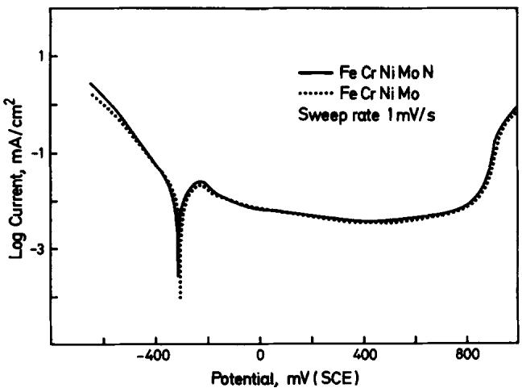  
Fig. 1. Potentiodynamic curves for the alloys exposed to de-aerated 0.1 M HCl + 0.4 M NaCl at room temperature, sweep rate 1.0 mV s-.

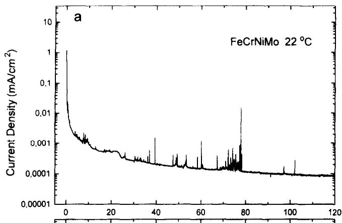

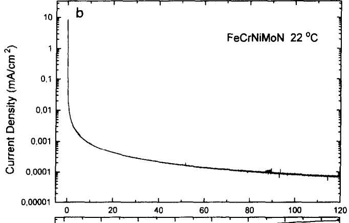

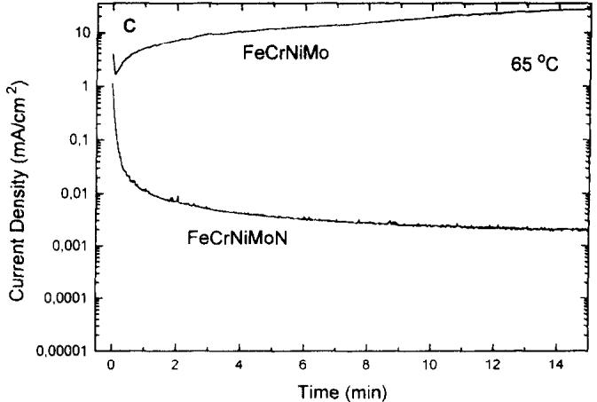  
Fig. 2. Current vs time for the alloys polarized to 500 mV (SCE) in 0.1 M HCl + 0.4 M NaCl at: (a) 22°C; (b) 22°C; (c) 65°C.

Figure 3 shows SEM micrographs of the low N-containing steel surface. The samples had been polarized to 800 mV for 2 h. The white spots on Fig. 3(a) image pits. Figure 3(b) (10,000 ×) shows that pits are formed on inclusion-free areas. The pits on the high Ncontaining alloy are too small to be seen in SEM.

High resolution ESCA spectra recorded from the two alloys after passivation at room temperature for 10 min at 500 mV (SCE) are shown in Fig. 4. The chemical states of the elements are obtained by using the Shirley curve fitting procedure. The dotted curves show the sum of the individual peaks. Both the oxide and the metallic states of the metallic elements Ni, $\mathbf { F e } ,$ Cr and Mo are detected. Nickel is mainly present in its metallic state, only low intensity peaks representing Ni hydroxide are found. The oxide states of iron are $\mathbf { F e } ^ { 2 \bar { + } }$ and $\mathsf { F e } ^ { 3 + }$ . Chromium is present in its trivalent state; signals from $\mathbf { C r ^ { 3 + } }$ bound to $\mathbf { O H } ^ { - }$ $\mathbf { C r } ^ { 3 + } ( \mathbf { h y } )$ , and $\mathbf { O } ^ { 2 - } \mathbf { - i o n s , \bar { C } r } ^ { 3 + } ( \mathbf { o x } )$ , are observable.

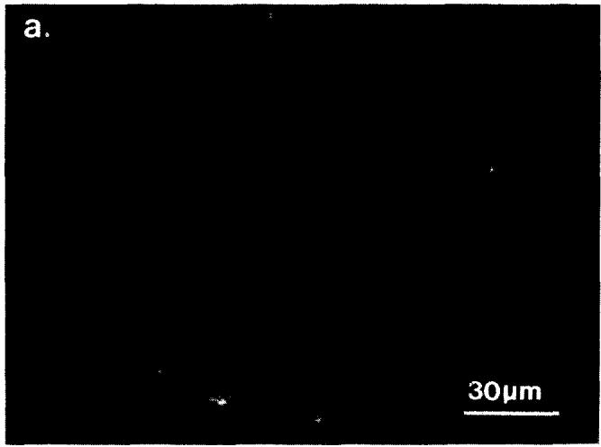

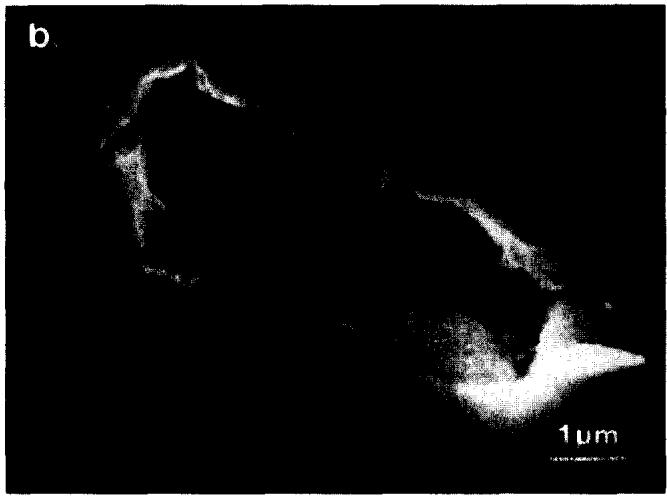  
Fig. 3. SEM micrographs taken from the low N-containing steel after polarization to 800 mV for 2 h.

Both the Mo $3 p _ { 3 / 2 }$ and the Mo 3d electron levels were recorded. The former overlaps with N 1s. The curve fitting of the Mo 3d spectra is based on a calibration study18 of Mo oxides. It appears that Mo is present in tetra- and hexavalent states. The shapes of the two Mo 3d spectra are fairly similar showing that the distribution of the different Mo species in the films of the two alloys are independent of the N content of the steels. The Mo $3 p _ { 3 / 2 }$ spectra are curve fitted by using the intensity ratio between the Mo $3 p _ { 3 / 2 }$ and the Mo 3d signals, experimentally determined from the N-free sample. The shadowed peaks at 397.7 eV in Fig. 4 represent N enriched at the oxide/metal interface. Its identity and location will be discussed later in this paper. The N signal intensity from the high Ncontaining alloy is noticeable, while the signal from the low N-containing steel is very weak. Further, both steels display N 1s peaks at 399.1 and 400.3 eV; their positions represent N in the species $\mathsf { N H } _ { 3 }$ and $\mathrm { N H } _ { 4 } ^ { + }$ , respectively.19.20 The intensities of these signals are independent of the N content in the steel and their origin will be discussed below.

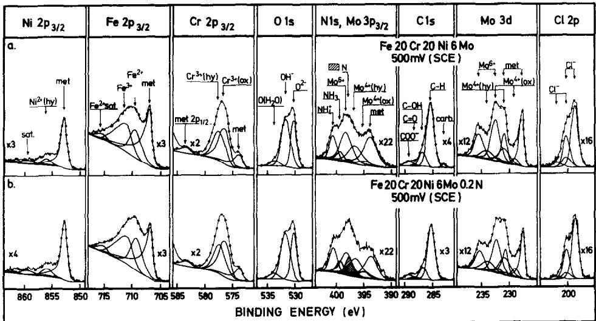  
Fig. 4. High resolution ESCA spectra recorded from alloys after passivation for 10 min at 500 mV: (a) 0.011 wt% N content steel; (b) 0.19 wt% N content steel.

Quantitative analysis is performed in order to determine the composition and the thickness of the oxide products and the distribution of the nitrogen species. The photoelectron yields, the attenuation lengths, the densities of the species and the electron take-off angles are taken into consideration. Details about the quantification procedure are given elsewhere.21–24

Figure 5 shows the thickness of the passive film vs the potential. The two alloys were polarized for 10 min at ${ \displaystyle 2 2 ^ { \circ } } C$ in the passive range from — 75 to 800 mV (SCE). It appears that N does not influence the thickness of the initially formed passive film. The oxide thickness increases linearly with the potential. At -75 and 800 mV the oxide products are 12 and 22 Å, respectively. The growth of the oxide products is $1 3 \mathring { \mathbf { A } } \mathbf { V } ^ { - 1 }$

The in-depth distribution of the elements in a thin film can principally be determined from angle dependent ESCA measurements. The procedure requires that the layer is uniform in thickness and covers a smooth surface. The requirement of smoothness cannot be completely fulfilled during the preparation and polarization of a metal. The samples were mechanically polished, which does not give a perfectly smooth surface. Electropolishing gives a smoother surface, but it causes anodic segregation of the alloying elements and thereby changing the passivation properties. Even during passivation the surface becomes roughened due to non-uniform anodic dissolution. In order to demonstrate the influence of the surface preparation condition on the angle-dependent results, a test was performed where the intensities of the signals from the oxide and the metal phases were recorded.

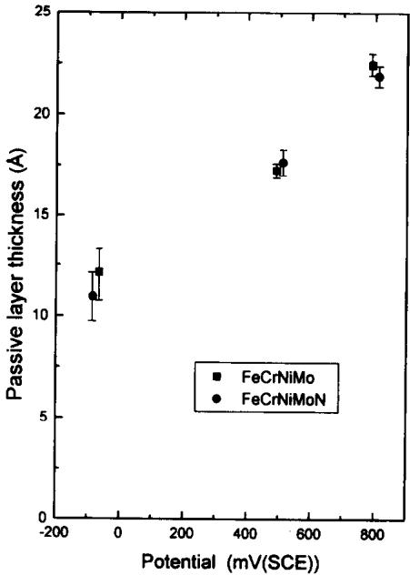  
Fig. 5. The thickness of the passive film vs the potential.

Figure 6 shows the measured intensity ratio, $I ^ { \infty } / I ^ { \mathrm { m e t } }$ , recalculated to Cr equivalents²¹ vs the angle after passivations for 10 min at 500 mV (SCE) of an electropolished surface (dashed line) and of a mechanically polished surface (dotted line). The solid line shows the calculated angle dependence from an assumed 16 $\mathring \mathbf { A }$ thick uniform $\mathbf { C r } _ { 2 } \mathbf { O } _ { 3 }$ layer located on an atomically flat Cr metal surface. It appears that neither the electropolished surface nor the mechanically polished surface gives the theoretical angle dependence, but the difference is relatively small.

Fig. 7(a) and (b) shows the cation concentration vs the take-off angle for the two alloys after passivation at 500 mV (SCE) for 10 min. The concentrations are estimated directly from the measured intensities without taking into consideration the true distribution of the elements. It appears that the concentration of $\mathbf { C r } ^ { 3 + } ( \mathbf { h y } )$ decreases with increasing take-off angle, whereas the concentrations of the elements $\mathrm { C r } ^ { 3 + }$ (ox) and $\mathsf { F e } ^ { 3 + }$ increase with the takeoff angle. The take-off angle dependence shows that at this potential the $\mathbf { C r } ^ { 3 + } ( \mathbf { h y } )$ ions are present in an outer layer, while $\dot { \mathbf { C } } \mathbf { r } ^ { 3 + }$ (ox) and $\mathsf { F e } ^ { 3 + }$ ions are situated in an inner oxide layer. It is not possible to notice any clear angle dependence for the ions $\mathbf { F e } ^ { 2 + } , \mathbf { M o } ^ { 4 + } , \mathbf { M o } ^ { 6 + }$ and $\mathbf { N i } ^ { 2 + }$ . These elements may be present in both the oxide and the hydroxide layers. The distribution and the concentration of the cations in the passive film seem to be independent of the N content of the steel. The solid lines, $\mathbf { C r } ^ { 3 + } ( \mathbf { h y } ) ^ { \mathbf { T H } }$ , in Fig. 7 show the expected angle dependence of $\mathbf { C r ^ { 3 + } }$ (hy) from a $6 . 5 \mathring \mathbf { A }$ thick layer of $\mathbf { M e ( O H ) } _ { 3 } \left( \mathbf { M e = c a t i o n } \right)$ containing 75% $\mathrm { C r } ( \mathrm { O H } ) _ { 3 }$ located on the surface of a 10 $\mathring \mathbf { A }$ thick layer of oxide of the type $\mathbf { M e } _ { 2 } \mathbf { O } _ { 3 }$ . The angle dependence of the measured $\mathbf { C r } ^ { 3 + } ( \mathbf { h y } )$ intensities are, in a qualitative way, in agreement with the expected angle dependence. The thickness of the hydroxide layer is obtained from the intensity ratio $\bar { I } ( { \bf O H } ^ { - } ) / I ( { \bf O } ^ { 2 - } )$ . The compositions of the oxide and hydroxide layers and their variation with the potential is extensively described in Ref. 25.

Angle-dependent ESCA measurements of the N 1s/Mo $3 p$ region were carried out in order to obtain information on the location of the nitrogen species. Figure 8 shows N 1s and

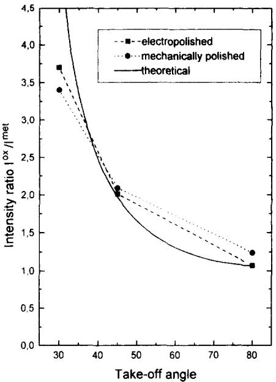  
Fig. 6. The measured intensity ratio $I ^ { \mathrm { o x } } / I ^ { \mathrm { m e t } } \mathrm { v s }$ the take-off angle after polarization for 10 min at 500 mV (SCE) of an electropolished surface and of a mechanically polished surface.

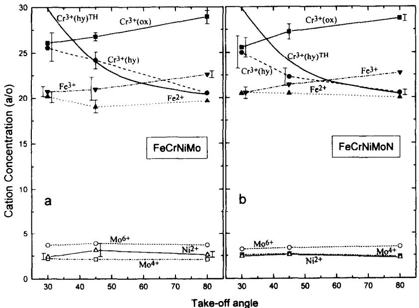  
Fig. 7. The cation content in the passive film vs the take-off angle. The solid curves $\mathrm { C r } ^ { 3 + } ( \mathbf { h } \mathbf { y } ) ^ { \mathrm { T H } }$ are theoretical concentrations calculated from a model where a 6.5 Å thick hydroxide layer covers a 10 Å thick oxide.

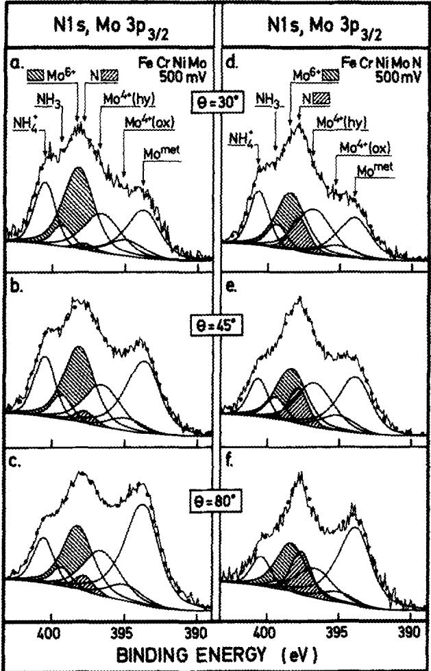  
Fig. 8. The angle-dependent ESCA measurements of the N 1s and Mo $3 p _ { 3 / 2 }$ signals recorded from the 0.011 wt% N and the 0.19 wt% N containing alloys after passivation at 500 mV (SCE) for 10 min.

Mo 3p signals recorded at various take-off angles from the two alloys after polarization at 500 mV (SCE) for 10 min. The shadowed peaks represent $\mathbf { M o } ^ { 6 + }$ and N signals. It appears that the intensity ratio $\mathbf { N } / \mathbf { M } \boldsymbol { \circ } ^ { 6 \ast }$ increases with the take-off angle showing that nitrogen is located close to the metal-oxide interface.

An attempt has been done to quantify the amount and the distribution of nitrogen in the surface region. The data points in Fig. 9 show the intensity ratios, $\mathbf { N } / ( 0 ^ { 2 - } + \mathbf { O H } ^ { - } )$ vs takeoff angle obtained after polarization of the high N-containing steel for 10 min at the potentials -75, 500 and 800 mV (SCE). The measured ratios are connected with dashed lines. The lower solid lines in the figure show the expected intensity ratios from 0.2 wt% N (bulk composition) uniformly distributed in the metal phase. It appears that the measured $\mathbb { N } / ( 0 ^ { 2 - } + \mathbf { \bar { O } } \mathbf { H } ^ { - } )$ ratios are about four times higher than expected from N in the bulk of the metal. Thus, it is obvious that N is enriched at the oxide-metal interface. The amount of N at the interface is estimated from the measured N/oxygen intensity ratio. It is easily found that the N content at the interface is less than a monolayer. The upper solid lines in Fig. 9 show the estimated angle dependent intensity ratios from a model where the atomic sites at the oxide-metal interface are partly occupied by N. The solid curves correspond to coverages of 12, 17 and 20% N at the potentials – 75, 500 and 800 mV (SCE), respectively. The agreements between the measured and the predicted angle dependency of the ratios are very good. It appears from Fig. 9 that these concentrations give the correct angle dependency. Figure10 summarizes the concentrations of N at the three potentials for the passivation times 10 min and 2 h. The amount of N at the interface increases with the potential and polarization time because oxidation of the alloy increases with the potential and exposure time.

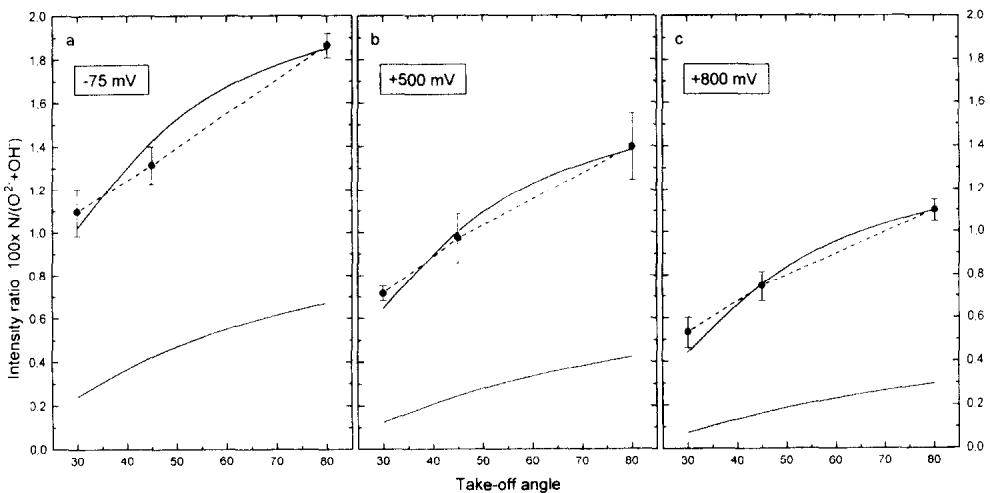  
Fig. 9. The measured intensity ratios, $1 0 0 \times \mathrm { { N } / ( O ^ { 2 - } + O H ^ { - } ) . }$ at the take-off angles 30, 45° and 80 after passivation of the 0.19 wt% N containing steel at - 75, 500 and 800 mV (SCE). The lower and the upper solid lines represent the estimated intensity ratios from the bulk composition of 0.20 wt%N and the calculated ratios from N covering 12, 17 and 20% of a monolayer at the oxide-metal interface, respectively.

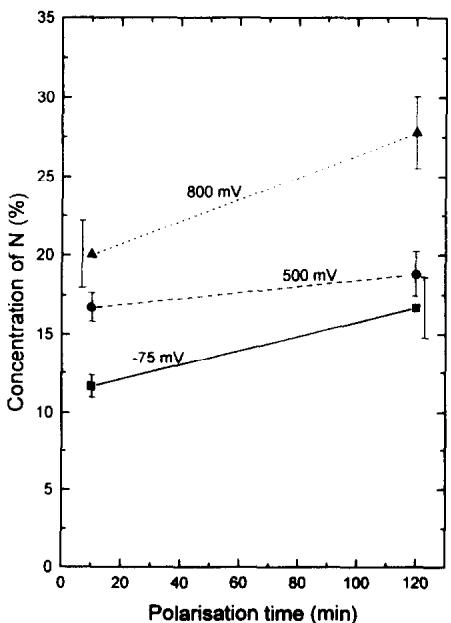  
Fig. 10. The coverage of nitrogen at the oxide-metal interface at the potentials —75, 500 and 800 mV (SCE) for the passivation times 10 min and 2 h.

As has been pointed out above, polarization of the steels at $6 5 \mathrm { ^ \circ C }$ causes growth of pits on the low N-containing alloy while the initiated pits on the high N-containing steel are repassivated. Figure 11 shows ESCA survey scans recorded from the two alloys after polarization to 500 mV (SCE) at $6 5 \mathrm { ^ \circ C }$ The spectrum recorded from the low N-containing steel shows strong $\mathbf { F e ( o x ) }$ and $\mathbf { C l } ^ { - }$ signals, showing that Fe chloride corrosion products are formed on the surface. Auger spectroscopy reveals that the pits and borders around them are covered by Fe chloride. The ESCA spectra recorded from the high N-containing alloy polarized at $6 5 ^ { \circ } \mathrm { C }$ show almost the same appearance as the spectra recorded after polarization at room temperature. High resolution spectra do not give any new information.

The ESCA spectra in Figs 4 and 8 show strong N 1s signals located at the positions of $\mathrm { { N H } } _ { 3 }$ and $\mathrm { N H } _ { 4 } ^ { + }$ . The intensities of these signals are independent of the N content of the steel.

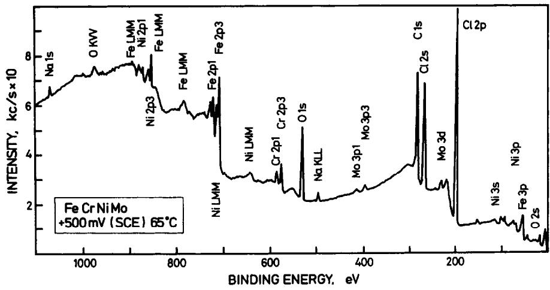

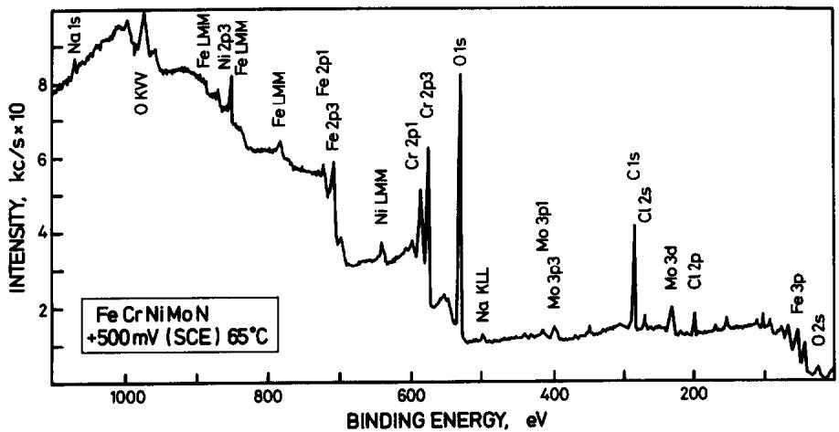  
Fig. 11. ESCA survey scans recorded from the low and high N-containing alloys after polarization to 500 mV (SCE) for 10 min at $6 5 \mathrm { ^ \circ C } .$

In order to find the origin of $\mathrm { N H } _ { 3 }$ and $\mathrm { N H } _ { 4 } ^ { + }$ , the N1s and Mo $3 p _ { 3 / 2 }$ signals were recorded at $4 5 ^ { \circ }$ take-off angle after polarization of the samples to potentials in the range — 700–800 mV (SCE), Fig. 12. The intensities of the N signals can be compared to the intensities of the Mo signals because the concentration of Mo and thickness of the oxide is independent of the N content at each potential. To rule out the possibility that $\mathrm { N H } _ { 3 }$ and $\mathrm { N H } _ { 4 } ^ { + }$ emanates from the environment of the preparation and handling system, a low N-containing sample was ion etched and subsequently transported to the chamber in which the electrochemical cell is enclosed without exposure to the electrolyte. The treatment gives only low intensity signals at the position of $\mathrm { N H } _ { 3 }$ and $\mathrm { N H } _ { 4 } ^ { + }$ , Fig. 12(a). Molybdenum, as well as the other metallic elements, are oxidized since the protecting gas in the chamber, in which the electrochemical cell is enclosed, contains water vapour. Figure 12(b) and (c) shows spectra of the two alloys after polarization in the cathodic region (— 700 mV) for 1 h. Strong signals from $\mathrm { N H } _ { 4 } ^ { + }$ are obtained from both the low N and the high N-containing alloys. Because the cathodic polarization does not dissolve the metal, it is impossible that the N source is the nitrogen in the alloys. Figure 12(d) and (e) shows the spectra recorded after passivation of the two alloys at - 75 mV. Even in this case the intensities of the $\mathrm { N H } _ { 4 } ^ { + }$ signals are relatively high and independent of the alloy composition. Polarization of the low N-containing alloy to 800 mV gives N signals from $\mathbf { N H } _ { 3 }$ and $\mathrm { N H } _ { 4 } ^ { + }$ , but in this case the surface is pitted so that the intensity comparison is not reliable.

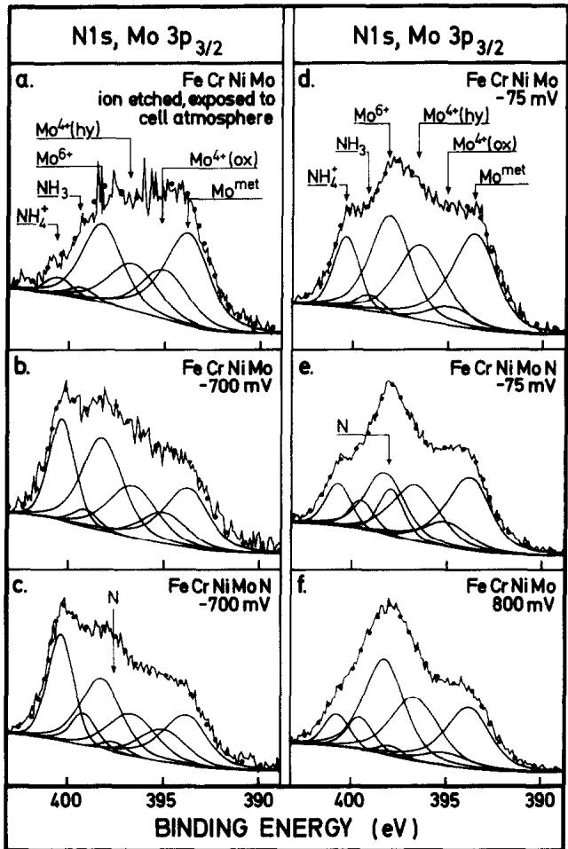  
Fig. 12. N 1s/Mo $3 p _ { 3 / 2 }$ signals recorded after polarization to potentials in the range — 700 800 mV (SCE) at 45° take-off angle.

The analysis shows that the detected compounds, ${ \bf N H } _ { 3 }$ and $\mathrm { N H } _ { 4 } ^ { + }$ , are probably not formed by reaction between N dissolved in the alloys and the protons in the electrolyte. Instead it is concluded that most of these compounds are formed during polarization by electrochemical reduction of $\mathbf { N O } _ { 3 } ^ { - }$ and $\mathbf { N O } _ { 2 } ^ { - }$ ions present as contaminants in the electrolyte. Table 2 shows the contents of these species in the water used for the experiments. It also shows that the water contains $\mathrm { N H } _ { 4 } ^ { + }$ ions, which can directly be adsorbed on the surfaces. In spite of the fact that the concentrations of the contaminants are very low, the amounts are at least three orders of magnitude larger than the amounts detected on the surfaces. However, it will be stated below that $\mathrm { { N H } } _ { 3 }$ and $\mathrm { N H } _ { 4 } ^ { + }$ are formed during the pitting and repassivation processes, but these species are formed in the pitted areas which only cover a small part of the surface and therefore do not markedly contribute to the intensities. Further, it will be concluded that $\mathbf { N H } _ { 3 }$ and $\mathrm { N H } _ { 4 } ^ { + }$ are dissolved into the electrolyte.

## DISCUSSION

The electrochemical analysis performed in this study confirms what is already known from practical use of super-austenitic steels, that the corrosion properties are improved by alloying with nitrogen. It is basically the resistance to localized corrosion which is improved. Dynamic polarization of the two Fe-20Cr-20Ni–6Mo steels with high (0.19 wt%) and low (0.01 wt%) N concentrations show no influence of N on the passivation kinetics during exposure in an aqueous solution containing 0.5 M $\mathbf { C l } ^ { - }$ at $\mathsf { p H } \approx 1$ The shapes of the polarization curves are almost identical. Furthermore, the composition and the thickness of the initially formed passive films are independent of the N content. On the other hand, polarization at room temperature for prolonged time at constant potential shows noticeable fluctuations of the current on the low N-containing alloy. It is also possible to observe fluctuations of the current on the high N-containing alloy, but the current spikes are not so easily distinguishable as on the low N-containing steel. At $6 5 \mathrm { { ^ \circ C } }$ the influence of N is even more pronounced; the high N-containing steel is passivated, while the low N-containing steel first shows a tendency to be passivated and then after a few seconds the current increases due to development of stationary growing pits. This shows that even the passive film formed on the 0.19 wt% N is not stable at high temperatures; it is broken down locally and healed by repassivation. In spite of the fact that the metal composition of the two alloys is the same, the pits initiated on the low N-containing steel grow so that the steel becomes heavily attacked. The influence of N on the repassivation process is, as suggested by Osozawa and Okata,4 that N reacts with $\mathbf { H } ^ { + }$ ions in the pits during formation of $\mathbf { N H } _ { 3 }$ and NH†. The reaction causes a decrease of the acidity in the pits and repassivation is thereby enhanced. In the following the results obtained in this work will be used to elucidate a mechanism for the reaction path of nitrogen.

The angle dependent ESCA measurements show that N is enriched at the metal-oxide interface. It has been shown that the enrichment of N on the high N-containing steel increases with potential and polarization time. The coverage obtained during polarization at − 75 mV (SCE) for 10 min is 12%, while it is $2 7 \%$ after polarization at 800 mV for 2 h. These amounts of accumulated N atoms correspond to the amounts of N present in 30–70 Å thick metallic layers. Nitrogen is consequently enriched at the interface by anodic segregation. It is expected that enrichment of N under the passive film contributes to the repassivation process at an early stage and inhibits the development of growing pits.

From surface analysis experiments it has been suggested that nitride compounds are formed at the metal/oxide interface. Clayton $e t \ a l . \ ^ { 7 , 1 \breve { 2 } - 1 6 , 2 6 }$ have suggested that nitrogen segregates to the oxide-metal interface, where it forms a relatively stable interstitial nitride phase of the type CrN containing Ni and Mo. The high Cr concentration in the nitride provides a rich supply of Cr for oxide film formation.7 Marcus et al.10,11.27 studied austenitic stainless steels $\{ { \mathrm { F e } } { - } 1 7 { \mathrm { C r } } { - } 1 3 { \mathrm { N i } } \}$ containing Mo and/or N (0.07–0.15 wt%) exposed to 0.5 M $\mathrm { H } _ { 2 } \mathrm { S O } _ { 4 }$ . They suggest that a Cr-rich nitride is formed as dispersed particles in the passive film. It was suggested that the nitride phase replaces $\mathbf { C r } _ { 2 } \mathbf { O } _ { 3 }$ and thereby deteriorates the passivation properties. The solubility of N in austenite at room temperature is very low and it could therefore be expected that nitride particles are formed at the oxide-metal interface. However, the angle-dependent ESCA analysis, performed in this work, clearly shows that the main contribution to the recorded N signal is the presence of N atoms in a monolayer under the passive film. It does not give any support for the idea that nitride particles are present in neither the oxide nor at the metal-oxide interface; a distribution of particles should not give the obtained angle dependency of the intensity ratio between the nitrogen and the oxygen signals.

The quantitative ESCA analysis performed in this work and from thermodynamic considerations it will be established that N atoms are enriched in the interface between the metal and the passive film due to anodic segregation. It will be concluded that Cr nitrides are not formed as a thin layer during passivation. Table 3 shows the binding energies of the signals from the elements of nitrides, oxides and the alloys after passivation. The free energies28.29 of formation of some of the compounds are also given. The nitrides were formed by reactive sputtering in $1 0 ^ { - 4 }$ Torr $\mathrm { N H } _ { 3 }$ gas and then directly moved to the ESCA instrument without exposure to air.

The binding energy of the N 1s peak determined from the polarization experiments is $3 9 7 . 7 \pm 0 . 2 \ : \mathrm { e V }$ This finding excludes the possibility that CrN exists as a separate phase at the interface, because the binding energy of the N 1s signal recorded from CrN is 1.1 eV lower than the N 1s signal from the passivated steel. The analysis of the passive film reveals that the oxide phase consists mainly of Cr and Fe oxides uniformly distributed in the inner oxide layer. If $\mathrm { C r } _ { 2 } \mathrm { N }$ or any other high Cr-containing nitride is formed as an intermediate compound at the metal/oxide interface the following reaction is expected to take place:

$$
\mathrm { C r } _ { 2 } \mathrm { N } + \mathrm { F e } _ { 2 } \mathrm { O } _ { 3 } = \mathrm { C r } _ { 2 } \mathrm { O } _ { 3 } + 2 \mathrm { F e } + \mathrm { N }\tag{1}
$$

The free energy for the reaction at room temperature is $\Delta G = - 2 1 3 . 6 + \Delta G ( 2 \mathrm { F e } + \mathrm { N } )$ kJ mol-1. The $| \Delta G |$ value $2 1 3 . 6 \mathrm { k J } \mathrm { m o l } ^ { - 1 }$ is much larger than the value of $| \Delta G ( { 2 } \mathrm { F e } + \mathrm { N } ) |$ , because pure Fe nitride is not formed. Thus, from a thermodynamic point of view $\mathrm { C r } _ { 2 } \mathbf { N }$ cannot be formed at the interface as long as oxygen is available.

Table 3 shows that pure $\mathrm { N i } _ { 3 } \mathrm { N }$ and $\mathrm { F e } _ { 4 } \mathrm { N }$ are not expected to be formed. However, these compounds may be stabilized by Cr and Mo. $\mathbf { J a c k } ^ { \hat { 2 } 9 }$ has estimated the free energy of formation of $\mathrm { N i _ { 2 } M o _ { 3 } N t o } - 7 5 \mathrm { k J m o l } ^ { - 1 }$ instead of $+ 3 0 \mathrm { \ k J \ m o l ^ { - 1 } }$ for pure $\bf N i _ { 3 } N$ Willenbruch $e t a l . ^ { 7 }$ have suggested a mixed nitride at the interface. It will be shown below that the Mo content at the interface is too low to form $\mathbf { N i } _ { 2 } \mathbf { M o } _ { 3 } \mathbf { N } .$

Table 3. The binding energies and free energies of formation of nitrides and oxides at room temperature
<table><tr><td>Compound</td><td>N 1s BE (eV)</td><td>Metallic element BE (eV)</td><td> $\Delta G _ { \mathrm { f } } ( \mathbf { k J m o l } ^ { - 1 } )$ </td><td>Reference</td></tr><tr><td> $\mathbf { F e - C r - N i - M o - N a l l o y }$  (passive)</td><td> ${ 3 9 7 . 7 \pm 0 . 2 }$ </td><td> $2 p _ { 3 / 2 } \mathrm { o f } \mathrm { F e } , \mathrm { C r } , \mathrm { N i } ; 7 0 6 . 9 , 5 7 3 . 9 , 8 5 2 . 9 ;$   $3 d _ { 5 / 2 }$  and  $3 p _ { 3 / 2 }$  of Mo: 227.6, 393.6</td><td></td><td></td></tr><tr><td>N dissolved in the alloy  $\mathrm { F e } _ { 4 } \mathrm { N }$ </td><td> ${ 3 9 7 . 3 \pm 0 . 1 }$ </td><td></td><td>+3.7</td><td>28</td></tr><tr><td> $\mathbf { F e _ { 2 } O _ { 3 } }$ </td><td></td><td> $2 p _ { 3 / 2 } \mathsf { o f } \mathsf { F e } ^ { 3 + } ; 7 1 1 . 2$ </td><td>-742.3</td><td>28</td></tr><tr><td> $\mathbf { C r N }$ </td><td>396.6</td><td> $2 p _ { 3 / 2 } \operatorname { o f } \mathbf { C } \mathbf { r } ; 5 7 5 . 4$ </td><td>-92.7</td><td>28</td></tr><tr><td> $\mathrm { C r } _ { 2 } \mathbf { N }$ </td><td>397.5</td><td> $2 p _ { 3 / 2 } \circ \mathbf { f } \thinspace \mathbf { C } \mathbf { r } ; 5 7 4 . 5$ </td><td>-102.2</td><td>28</td></tr><tr><td> $\mathbf { C r } _ { 2 } \mathbf { O } _ { 3 }$ </td><td></td><td> $2 p _ { 3 / 2 } \thinspace 0 \mathbf { f } \thinspace 0 \mathbf { r } ^ { 3 + } ; 5 7 7 . 2$ </td><td>-1058.1</td><td>28</td></tr><tr><td> $\mathsf { N i } _ { 3 } \mathsf { N }$ </td><td></td><td></td><td>+30</td><td>29</td></tr><tr><td> $\mathbf { M o } _ { 2 } \mathbf { N }$ </td><td></td><td></td><td>-54.8</td><td>28</td></tr><tr><td>MoN</td><td>397.8</td><td> $3 d _ { 5 / 2 }$  and  $3 p _ { 3 / 2 }$  of Mo: 228.6, 394.7</td><td></td><td></td></tr><tr><td> ${ \bf N i } _ { 2 } { \bf M o } _ { 3 } { \bf N }$   $\mathbf { N i } _ { 3 } \mathbf { M o } _ { 4 } \mathbf { N } _ { 2 }$ </td><td>397.8</td><td> $2 p _ { 3 / 2 } \mathrm { o f N i } ; 8 5 3 . 1 3 d _ { 5 / 2 }$  and of Mo:</td><td>-75</td><td>29</td></tr><tr><td></td><td></td><td> $3 p _ { 3 / 2 }$   $2 2 8 . 4 , 3 9 4 . 4$ </td><td></td><td></td></tr></table>

Previously, it has been predicted17,23,24,30t that the composition of the metal phase changes during anodic dissolution and passivation. This behaviour is demonstrated in Fig. 13 using the data from this work. Figure 13(a) shows the composition of the alloys (except for N). The measured metal compositions of the two alloys after polarization at the three potentials for 10 min and 2 h exposure are shown in Fig. 13(b) and (c), respectively. The compositions are determined from the recorded intensities taking into account the electron yield factors, densities of the species, attenuation lengths of the electrons and thickness of the oxide layers. It appears that during passivation the composition of the metal phase under the passive film changes markedly. Nickel is enriched while Fe, Cr and Mo are depleted at the interface. The decrease of the Cr and the Mo contents is due to enrichment of these elements in the passive film. Iron, on the other hand, is selectively dissolved. The figures show that N does not influence the metal composition under the passive film. (The N content is not shown in order to make it easy to compare the compositions of the two alloys.) The measured composition is called “apparent" because chemical gradients exist in the metal phase close to the boundary.

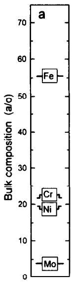

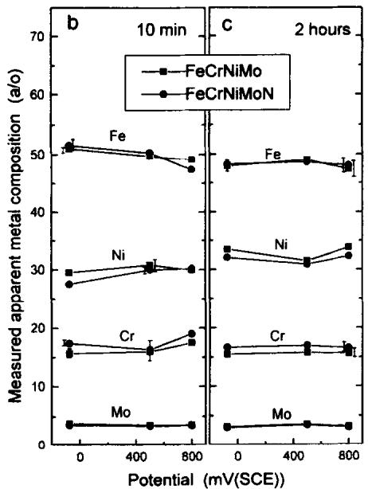

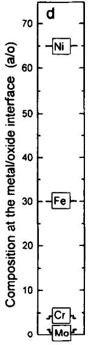  
Fig. 13. The composition of the metal phase in at%: (a) the composition of the alloy; (b, c) the apparent composition measured after polarization for 10 min and 2 h, respectively; (d) the estimated composition of the outermost atomic layer of the metal phase under the passive film.

It has been suggested23,24 that the metal composition varies over three atomic planes under the oxide film; an error function was adopted. An attempt to concentrate the composition variation over one or two planes results in unrealistic compositions (the Cr content becomes negative). Concentration variation over a larger distance than three atomic planes should give an unrealistic diffusion coefficient.24 Figure 13(d) shows the estimated composition in the outermost metallic layer located under the passive film. The low contents of Cr and Mo in that layer exclude from the stoichiometric point of view the idea that pure Cr and/or Mo nitrides are formed. The statement is built on the fact that the binding energies of Cr and Mo bound to N in nitrides are rather close to the binding energies of their metallic states, Table 3. If Cr and Mo nitrides exist at the interface the intensity contributions from these signals are therefore included in the intensities of the signals representing their metallic states. As indicated above, the angle-dependent ESCA measurement shows that N is uniformly distributed at the interface. The surface analysis also predicts that the N atoms at the interface interact with their nearby atoms in the oxide and metal phases because, as shown in Table 3, the signal representing N dissolved in the alloy is located at 0.4eV lower binding energy than the N 1s signal recorded after passivation. (The binding energy of N in the alloy was obtained by analysis of the high Ncontaining steel after ion etching.) The conclusion is that N segregates anodically to the interface during passivation.

The depletion of Cr below the passive film implies that the metal has to be oxidized to some extent before the film can be healed. It is not possible by ESCA to study directly the composition of the metal surface in the pits. Analysis23,24 of the metal phase after polarization to the active region of the alloys close to the corrosion potential shows enrichment of Ni, Mo and probably also Cr on the surface caused by selective dissolution of Fe. Molybdenum is the alloying element which influences most markedly the dissolution rate of stainless steels at active potentials. It has been suggested²3,24 that a thin intermetallic phase formed on the surface during active dissolution increases the activation energy and thereby lowers the dissolution rate of the alloy.

The mechanism for selective dissolution and enrichment of the alloying elements on the surface at the active potentials can be used to explain the synergistic effect between Mo and N on the pitting properties of stainless steels. Studies17.25 have shown that a steel of the type Fe-20Cr-20Ni (the same Cr and Ni contents as used in this work, but without Mo) is much more sensitive to pitting corrosion than the corresponding Mo-containing alloys with and without N. At room temperature the pitting potential of the Mo-free alloy is about 500 mV (SCE), while the Mo-containing alloy even without N is passive up to the transpassive potential (initiation and repassivation of pits occur). The pitting process is auto-catalysed by hydration of dissolved cations in the pit; the acidity in the pit is thereby increased by the formation of solvated H+ ions. During the initiation phase of pitting, exchange of ions between the pit volume and the surrounding electrolyte takes place, because no membrane of corrosion products covers the pit. As long as the growth rate of the pit is low the pH value of the electrolyte in the pit does not change noticeably because solvated $\mathbf { H } ^ { + }$ ions diffuse out of the pit volume. On the other hand, if the hydration rate is rapid due to high dissolution rate of the alloy the pH value of the liquid at the pit surface decreases. The mobility of the solvated cations is relatively low and the diffusion path increases with the depth of the pit. Thus, the repassivation reaction is inhibited when the pH of the pit surface drops below a critical value, $\mathsf { p H } _ { \mathsf { c r i t } }$

The growth rate of the pits formed on the Mo-containing steels is lower than on the Mofree alloys due to enrichment of Mo and the other alloying elements in their metallic state on the metal surface. The low propagation rate of the initiated pits formed on the Mocontaining alloys allows equalization of the concentrations of the cations in the pit. The local hydration at the surface becomes thereby limited so that repassivation can take place. The role of N is that it reacts with $\mathbf { H } ^ { + }$ ions during formation of $\mathrm { \bf N H } _ { 3 }$ and $\mathrm { N H } _ { 4 } ^ { + }$ , as suggested by Osozawa and Okato,4 and compensates to some extent for the drop in pH value caused by hydration. The probability of repassivation is thereby increased. The influence of N was demonstrated in experiments performed at $6 5 \mathrm { ‰}$ in this work; the pits initiated on the low Ncontaining steel propagate due to increased acidity while repassivation takes place on the high N-containing steel because the pH value exceeds $\mathtt { p H } _ { \mathtt { c r i t } }$

It has been reported that N may have a detrimental effect on the corrosion properties of ordinary stainless steels of the type 17Cr-13Ni containing $3  { \mathbf { M } }  { \mathbf { o } } ^ { 1 0 }$ and without $\dot { \mathbf { M } } \mathbf { o } ^ { 1 \tilde { \mathbf { l } } }$ exposed to 0.5 M $ { \mathbf { H } } _ { 2 }  { \mathbf { S } }  { \mathbf { O } } _ { 4 } + 0 . 8 - 1 . 5  { \mathbf { M } }$ NaCl. It was found that adding 0.15 wt% N to the steels causes increased dissolution rate in the active potential range, increased current density in the passive range, and a decreased pitting potential. First, the findings seem to be opposite to the results of this work. However, the model presented above explains at least partly the behaviour of the low alloyed steels: the active dissolution rate is high due to low concentrations of alloying elements; the pH on the free surface during active dissolution and in the initiated pits of the N-containing steel becomes higher than on the low Ncontaining steel, but still below $\mathsf { p H } _ { \mathsf { c r i t } } ;$ the dissolution rate in the active state is expected to increase with pH.31

## CONCLUSIONS

High alloyed stainless steels, 20Cr-20Ni–6Mo, containing 0.011 wt% N and 0.19 wt% N have been exposed to 0.1 M HCl + 0.4M NaCl for 10 min and 2 h at potentials in the range — 75–800 mV (SCE). It is concluded that:

1. Nitrogen influences markedly the pitting corrosion properties of the steels. At $6 5 \mathrm { ‰}$ the low N-containing steel is severely pitted while the high N-containing steel is passivated.

2. The shapes of the dynamic polarization diagrams of the steels recorded after activation are the same and independent of the N content of the steel.

3. The composition and the thickness of the passive films formed on the steels at room temperature are independent of the N content of the steel.

4. Nitrogen segregates anodically to the metal-oxide interface during passivation. The enrichment of N increases with the potential. The amounts correspond to 12% and 27% of an atomic laver at — 75 and 800 mV (SCE), respectively. It is concluded that Cr nitride is not formed.

5. It is suggested that the synergistic effect between Mo and N is due to enrichment of

Mo, Ni and Cr at the metal-electrolyte interface of initiated pits. The growth rate of the pits on the Mo-containing steel becomes lower than on the $\scriptstyle \mathbf { M o - f r e e }$ alloy. Nitrogen is expected to compensate for the pH drop in the pits by reaction with $\mathrm { ~ H ~ } ^ { + }$ and formation of $\mathrm { N H } _ { 3 }$ and NH†. Repassivation is enhanced by the increased pH value in the pits and the higher concentration of Cr, which forms the passive film.

Acknowledgements—The Swedish Research Council for Engineering Sciences (TFR) and Sandvik AB are gratefully acknowledged for financial support and producing the steels for the experiments, respectively.

## REFERENCES

1. O. Steensland, Iron Steel 42, 104 (1969).

2. A. G. Hartline, Met. Trans. 5, 2271 (1974).

3. M. Janik-Czachor, E. Lunarska and Z. Szklaraska-Smialowska, Corrosion 31, 349 (1975).

4. K. Osozawa and N. Okato, USA-Japan Seminar, Passivity and its Breakdown on Fe and Fe-base Alloys, Honolulu, 1975 (eds R. W. Staehle and H. Okada), p. 135. NACE, Houston, TX (1976).

5. J. E. Truman, M. J. Coleman and K. R. Pirt, Br. Corros. J. 12, 236 (1977).

6. R. F. A. Jargelius and T. Wallin, 10th Scandinavian Corrosion Congress, Stockholm, p. 161 (1986).

7. R. D. Willenbruch, C. R. Clayton, M. Oversluizen, D. Kim and Y. Lu, Corros. Sci. 31, 179 (1990)

8. R. Bandy and D. van Rooyen, Corrosion 39, 227 (1983).

9. O. Steensland, Corrosion Prevent. Control 15, 25 (1968).

10. A. Sadough Vanini, R. Chikhi and P. Marcus, UK Corrosion and Eurocorr—94, Bournemouth (1994).

11. A. Sadough Vanini, J.-P. Audouard and P. Marcus, Corros. Sci. 36, 1825 (1994).

12. C. R. Clayton and K. G. Martin, High Nitrogen Steels. Proc. Int. Conf., Lille (eds J. Foct and A. Hendry), p. 256 (1988).

13. Y. Lu, R. Bandy, C. R. Clayton and R. C. Newman, J. Electrochem. Soc. 130 (8), 1774 (1983).

14. R. C. Newman, Y. Lu, C. R. Clayton and R. Bandy, Proc. Int. Congr. on Metallic Corrosion, Toronto, Vol. 3, p. 394 (1984).

15. R. Bandy, Y. C. Lu, C. R. Clayton and R. C. Newman, Equilibrium Diagrams and Localized Corrosion (eds R. P. Frankenthal and J. Kruger), p. 369. Electrochemical Sociey, Pennington, NJ (1984).

16. C. R. Clayton, L. Rosenzweig, M. Oversluizen and Y. C. Lu, Inhibition and Passivation (eds E. McCafferty and R. J. Brodd), p. 369. Electrochemical Society, Pennington, NJ (1986).

17. L. Wegrelius and I. Olefjord, Mater. Sci. Forum 185-188, 347–356 (1995).

18. B. Brox and I. Olefjord, Surf. Interface Anal. 13, 3 (1988).

19. D. N. Hendrickson, J. M. Hollander and W. Jolly, Inorg. Chem. 8, 2642 (1969).

20. W. E. Swartz and R. A. Alfonso, J. Electron Spectrosc. Relat. Phenom. 4, 351 (1974).

21. I. Olefjord and L. Wegrelius, Corros. Sci. 31, 89 (1990).

22. I. Olefjord, Proc. Symp. The Application of Surface Analysis Methods to Environmental/Material Interactions, Seattle (1990).

23. I. Olefjord, B. Brox and U. Jelvestam, J. Electrochem. Soc. 132, 2854 (1985).

24. B. Brox and I. Olefjord, Proc. Stainless Steel'84, Göteborg, p. 134. The Institute of Metals (1984)

25. L. Wegrelius and I. Olefjord, Electrochemical and Surface Analyses of Stainless Steels Exposed to Hydrochloric Acid, to be published.

26. C. R. Clayton and Y. C. Lu, J. Electrochem. Soc. 133(12), 2465 (1986).

27. P. Marcus and M. E. Busell, Appl. Surf. Sci. 59, 7 (1992).

28. I. Barin, Thermochemical Data of Pure Substances. VCH, Weinheim (1993).

29. K. H. Jack, Met. Powder Rep. 42(7-8), 478 (1987).

30. I. Olefjord, Mater. Sci. Engng 42, 161 (1980).

31. K. F. Bonhoeffer and K. E. Heusler, Z. Phys. Chem. N. F. 8. 390 (1956).