8. A. Betti, L. Cavallaro, G. Trabanelli, F. Zucchi, Corrosion, Vol 18, p. 371t, 1962.

9. Z. Szklarska-Smialowska, Corrosion, Vol. 27, No. 6, p. 223, 1971.

10. E. Jungermann, J. F. Gerecht, I. J. Krems, J. Chem. Soc., Vol. 78, p. 172, 1956.

11. J. S. Riney, G. M. Schmid, N. Hackerman, Rev. Sci. Instr., Vol. 32, p. 588, 1961.

12. D. W. DeBerry, J. Brunson, submitted to J. Electrochem. Soc.

13. J. L. Cayias, R. S. Schechter, W. H. Wade, Adsorption at Interfaces, ACS Symposium Series 8, The American Chemical Society, Washington, DC, pp. 234-247, 1975.

14. J. R. Galvele, J. Electrochem. Soc., Vol. 123, p. 464, 1976.

15. A. G. Sedricks, Int. Metals Rev., Vol. 28, No. 5, p. 295, 1983.

16. N. Hackerman, Bull. Indian Sect. Electrochem. Soc., VIIi, No. 1, p. 9, 1959.

17. F. M. Donahue, K. Nobe, J. Electrochem. Soc., Vol. 114, p. 1012, 1967.

18. K. C. Tsai, N. Hackerman, J. Electrochem. Soc., Vol. 118, p. 28, 1971.

19. A. Weisstuch, D. A. Carter, C. C. Nathan, Mater. Prot. Perf., Vol. 10, No. 4, p. 11, 1971.

20. L. Horner, Chemiker Ztg., Vol. 100, p. 247, 1976.

21. D. C. Zecher, Mater. Prot. Perf., Vol. 15, p. 33, 1976.

22. N. Hacker, Corrosion, Vol. 18, No. 9, p. 332, 1962.

23. P. Somasundaran, T. W. Healy, D. W. Fuerstenau, J. Phys. Chem., Vol. 68, p. 3562, 1964.

24. R. G. Barradas, F. M. Kimmerle, J. Electroanal. Chem., Vol. 11, p. 128, 1966.

25. J. F. Scamehorn, R. S. Schechter, W. H. Wade, J. Coll. Inter. Sci., Vol. 85, p. 463, 1982.

# The Effect of Nitrogen on the Localized Corrosion Resistance of Duplex Stainless Steel Simulated Weldments

H. TSUGE, Y. TARUTANI, and T. KUDO\*

## Abstract

The effect of nitrogen, which is one of the most important elements in duplex stainless steels (SSs), was investigated for resistance to pitting corrosion and stress corrosion cracking (SCC) in various environments. The increase in nitrogen content increases the resistance of the base metal, which results from the improvement in the resistance of the γ-phase, which has lower chromium and molybdenum contents compared to α-phase. Nitrogen is an important element in sustaining the corrosion resistance of the heat affected zone (HAZ), which is heated to 1350 C or higher, because nitrogen promotes the formation of γ-phase during the cooling process after welding and avoids the precipitation of chromium carbides or nitrides at grain boundaries. When the nitrogen content is less than 0.08% in 22%Cr, 5.5%Ni, and 3%Mo base composition, the HAZ has little γ-phase to lead to the high susceptibility to intergranular corrosion and intergranular stress corrosion cracking (IGSCC) occurs even in a pure $C O _ { 2 } { - } C l ^ { - }$ environment containing no ${ \sf H } _ { 2 } { \sf S }$ Nitrogen has little effect on the precipitation behavior of the other phase in the base metal during aging heat treatment of around 700 C.

## Introduction

The recent search for new sources of hydrocarbons has led to the production from more severe environments. Such wells are deep and often constructed at offshore sites. The environments usually contain considerable amounts of carbon dioxide $( \mathsf { C O } _ { 2 } ) ,$ hydrogen sulfide (HS), and concentrated brine. Oil and gas production from these wells expose construction materials, such as tubulars and line pipes, to very severe corrosive conditions.

Low alloy steels are not suitable because inhibited systems are not desirable for offshore use or for the high temperature portion of the well. The corrosion resistance of highly alloyed materials, for example, duplex stainless steels (SSs), high nickel SSs, and nickel-base alloys have been evaluated for the purpose of selecting proper materials depending on the various well condition.1-6Among those highly alloyed materials, 22%Cr duplex SS line pipes have been widely used in the field that contains ${ \mathsf { C O } } _ { 2 }$ and chloride ions with small amounts of H₂S. Duplex SSs usually contain some amount of nitrogen to improve the corrosion and mechanical properties welded joints. Corrosion behaviors such as pitting, intergranular corrosion, and SCC of 22%Cr duplex SS have been investigated by many researchers.7,8 The effect of nitrogen on corrosion behavior, however, has not been clarified yet.

In this paper, the effect of nitrogen content on the corrosion resistance of 22%Cr duplex SSs was investigated with respect to the base metals, the low temperature HAZ, and the high temperature HAZ, which is heated to 1350 C or higher.

## Experimental

## Materials Used

The chemical compositions of the materials used are shown in Table 1. The materials, which compose 22%Cr, 5.5%Ni, and 3%Mo containing the 0.04 to 0.2% nitrogen, were melted in the laboratory. The ingots were forged, hot rolled to plates of 5 mm in thickness, and

TABLE 1 — Chemical Composition of 22Cr Duplex SSs (mass %)
<table><tr><td>Alloys</td><td>C</td><td>Si</td><td>Mn</td><td>P</td><td>S</td><td>Ni</td><td>Cr</td><td>Mo</td><td>N</td></tr><tr><td>A</td><td>0.014</td><td>0.49</td><td>1.72</td><td>0.004</td><td>0.004</td><td>5.57</td><td>21.89</td><td>3.22</td><td>0.047</td></tr><tr><td>B</td><td>0.012</td><td>0.49</td><td>1.74</td><td>0.004</td><td>0.004</td><td>5.58</td><td>21.72</td><td>3.16</td><td>0.077</td></tr><tr><td>C</td><td>0.010</td><td>0.51</td><td>1.77</td><td>0.004</td><td>0.004</td><td>5.60</td><td>21.92</td><td>3.22</td><td>0.123</td></tr><tr><td>D</td><td>0.016</td><td>0.49</td><td>1.83</td><td>0.004</td><td>0.005</td><td>5.56</td><td>21.75</td><td>3.30</td><td>0.137</td></tr><tr><td>E</td><td>0.008</td><td>0.50</td><td>1.73</td><td>0.004</td><td>0.004</td><td>5.51</td><td>21.70</td><td>3.14</td><td>0.164</td></tr><tr><td>F</td><td>0.015</td><td>0.50</td><td>1.70</td><td>0.003</td><td>0.004</td><td>5.51</td><td>21.70</td><td>3.16</td><td>0.238</td></tr></table>

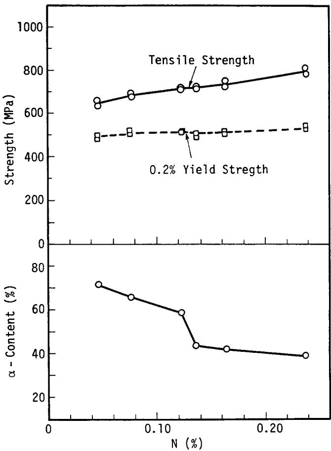  
FIGURE 1 — Effect of N content on mechanical properties and ferrite content of 22 Cr duplex SS.

## thensolution heat treated at 1050 C for 30 min, followed by water quenching.

The mechanical properties at room temperature and the ferrite content (α-content) are presented in Figure 1.

In order to investigate the corrosion behavior of the low temperature HAZ, in which the microstructure does not change, the specimens were heat treated at500 to 900 C for 0.1 to 30 h

In order to investigate the corrosion behavior of the high temperature HAZ, which is heated to1350 Cor higher, the specimens were heated in Ar gas by an induction heating machine. The temperature of the heat pattern shown in Figure 2 was measured by a thermocouple, which directly contacted the surface of the specimen.

## Test Method

The pitting potential was measured potentiodynamically in 5% NaCl deaerated solution at 60 C at a sweep rate of 20 mV/min with a potentiostat. The (reference) SCE and the platinum counter electrode were used in this study. The test specimen, a disk 15 mm in diameter and 2 mm in thickness, was polished with No. 600 emery paper, washed with water and alcohol, and then degreased with acetone. The potential at which the anodic current density increases dramatically by the occurrence of pitting was adopted as the pitting potential (Vc’).

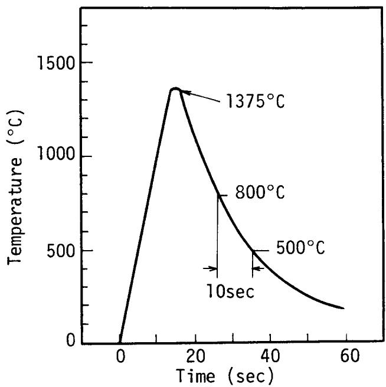  
FIGURE 2 — Heat pattern of simulated HAZ.

Pitting corrosion tests in $\mathsf { F e C l } _ { 3 }$ aerated solution were also conducted by the measurement of the CPT of the materials using 25 x 50 x 2 mm specimens polished with No. 600 emery paper. The pitting corrosion resistance was evaluated by the highest temperature below which the material did not suffer pitting corrosion attack after a 24 h exposure in 10 wt% $F e C l _ { 3 }$ 6H2O solution in water. The solution temperature was increased by 2.5 C until the CPT was reached. The criteria of this test was used for the determination of the presence of pits.

Uniaxial constant load SCC tests were conducted in a 15 L autoclave with a lever-type loading system, as shown in Figure 3. The constant load SCC test specimen had a nominal gage length of 20 mm and a diameter of 3 mm. The autoclave was purged with nitrogen to deaerate the solution, and then the vacuum was applied. Finally, the autoclave was purged with ${ \sf H } _ { 2 } { \sf S }$ and pressurized to the desired partial pressure before heating. SCC resistance was evaluated by the time to failure in 20% NaCl solution with 1 atm (101 kPa) H2S at 100 C. The U-bend SCC tests were also performed in 20% NaCl solution with 10 atm (1010 kPa) $\mathtt { C O } _ { 2 }$ and 0 to 0.1 atm (0 to 10.1 kPa) ${ \mathsf { H } } _ { 2 } { \mathsf { S } }$ at 100 C.

ASTM A262 Practices C (the Huey test) and E (the Strauss test) were selected for the evaluation of intergranular corrosion susceptibility. The Huey test was performed in five boiling periods of 48 h. The Strauss test duration was 16 h. These specimens were 10 x 40 x 3 mm and polished with No. 320 emery paper.

## Test Results

Duplex SSs have a characteristic morphological change in phase structure of welded joint, as shown in Figure 4. In general, there exist two kinds of HAZs at the welded joint; that is, the low temperature heat affected zone (HAZ) where the microstructure does not change and the high temperature HAZ, which is heated to 1350 C or higher, and different phase structure from the base metal. These HAZs are defined as $H A Z ( A )$ and (B) respectively in this paper.

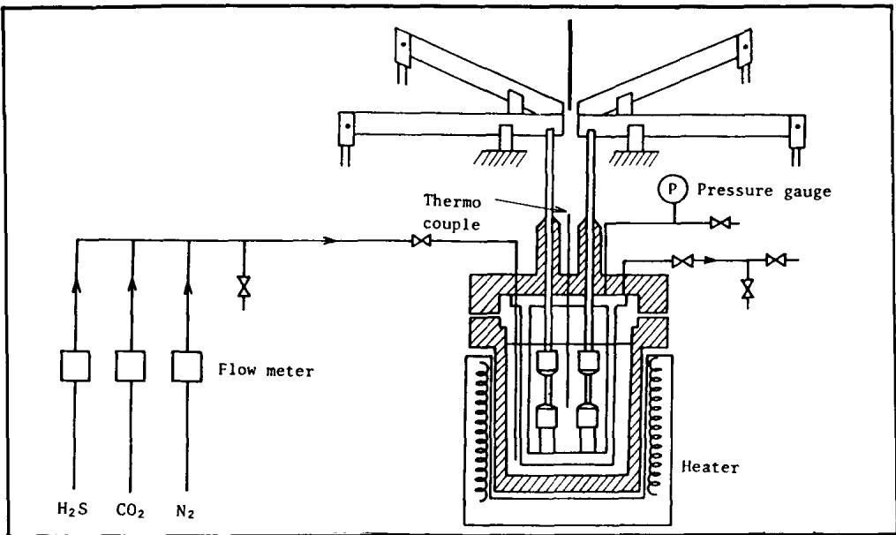  
FIGURE 3 — Experimental apparatus of constant load SCC.

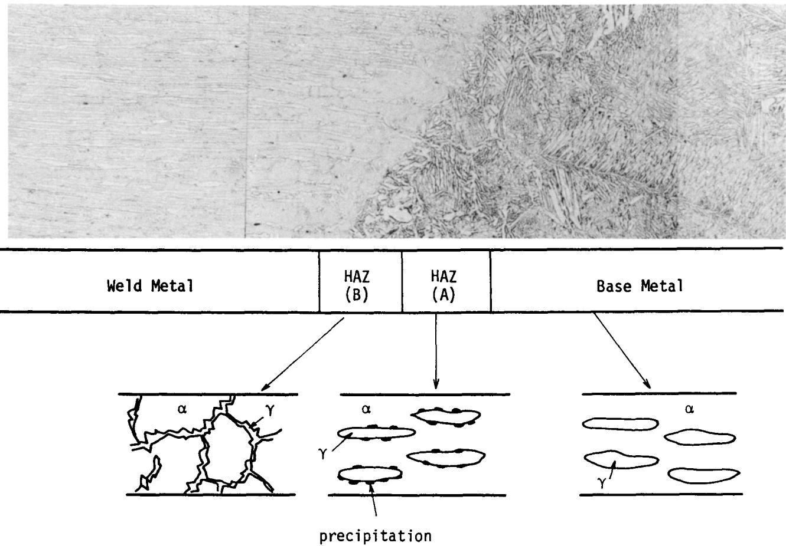  
FIGURE 4 — Schematic diagram of morphological phase change at welded joint of duplex SS.

Figure 5 shows the typical example of microstructure of the base metal and the HAZ(B) with different nitrogen contents. In the simulated HAZ(B), the phase structure is severely affected by the nitrogen content. The alloy with 0.077% nitrogen is almost entirely α-phase, while the precipitation of the needle-type austenite phase (γ-phase) is observed at grain boundaries of 0.137% or higher nitrogen-containing alloys.

## Corrosion Resistance of Base Metal

The effect of nitrogen content on the pitting potential of 22%Cr duplex SSs in NaCI solution is shown in Figure 6. The pitting potential of 22%Cr duplex SS increases above 0.12% nitrogen in 5% NaCl solution. The addition of a small amount of ${ \sf H } _ { 2 } { \sf S }$ deteriorates the pitting corrosion resistance, although the beneficial effect of nitrogen on the pitting resistance is still observed.

Corrosion test results in $\mathsf { F e C l } _ { 3 }$ solution are shown in Figure 7. The critical pitting temperature (CPT) of 22%Cr duplex SSs also increases with nitrogen, which is similar to that in the NaCi solution. A nitrogen content of more than 0.12% is necessary to obtain the CPT value higher than 30 C in $\mathsf { F e C l } _ { 3 }$ solution.

A stress corrosion cracking (SCC) test was conducted under the applied stress of 441 MPa, which is 90% of the 0.2% yield strength.

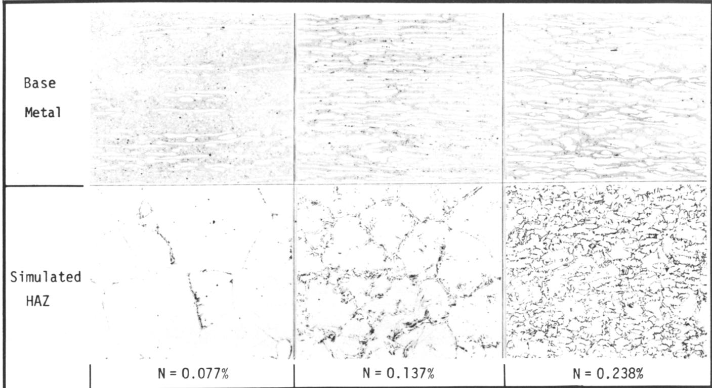  
FIGURE 5 — Microstructure observation of 22Cr duplex stainless steel.

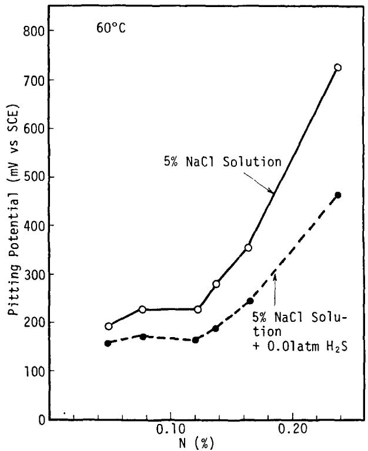  
FIGURE 6 — Effect of N content on pitting potential of 22Cr duplex SS.

Figure 8 shows the effect of the nitrogen content on the SCC susceptibility in 20% NaCi solution with 1 atm $H _ { 2 } S .$ The time to failure increases drastically with increasing nitrogen content. The materials containing above 0.14% nitrogen suffer no failure, although small cracks were observed on the surface of the specimen after a 200 h exposure.

From these results, it is clear that nitrogen is a beneficial element for increasing the resistance to pitting corrosion and SCC of

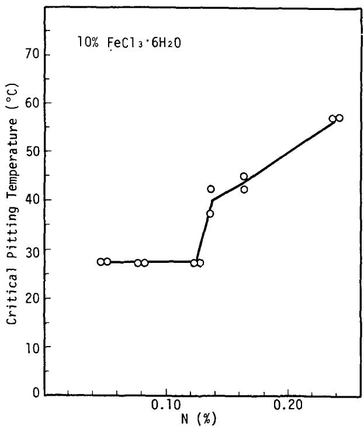  
FIGURE 7 — Effect of N content on critical pitting temperature of 22Cr duplex SS in $F e C l _ { 3 }$ solution.

the base metal.

The tensile strength of the base metal shown in Figure 1 increased with nitrogen content, while the 0.2% yield strength is \~500 MPa and is independent of the nitrogen content over the range of the nitrogen contents studied. It is suggested that the ferrite phase, of which the nitrogen content is small and constant, determines the 0.2% yield strength.

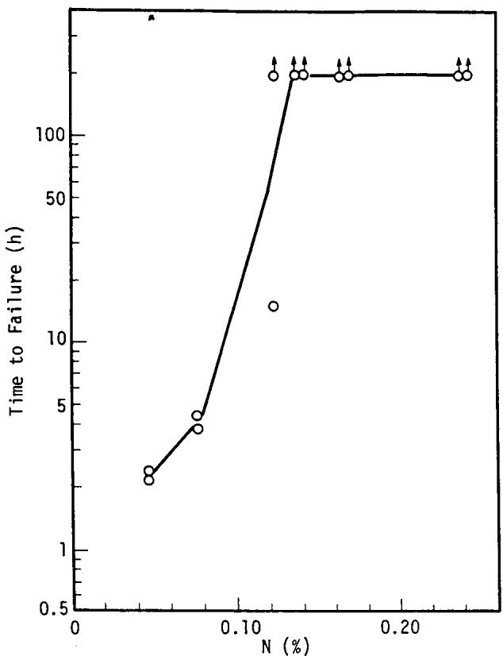  
FIGURE 8 — Effect of N content on SCC susceptibility of 22Cr duplex SS (100 C, 20% NaCI, 1 atm ${ \sf H } _ { 2 } { \sf S } ,$ 45 kg/mm²).

Corrosion Resistance of Low Temperature HAZ

Figure 9 exhibits the Strauss test results. No intergranular attacks were observed in any of the heating conditions examined independent of nitrogen content. The deterioration of the ductility by σ-phase precipitated ${ \bf i s } ,$ however, found after the high temperature aging around 900 C when the specimens are bent through 180 C. The difference in σ-phase precipitation behavior among the materials with 0.07 to 0.16% nitrogen is found to be not so large at the microstructure observation by the electric etching method using the 10% KOH solution.

The Huey test results are shown in Figure 10. There exists an area with an increased corrosion rate in the time-temperature diagram, the lower limit of which depends on the heating time. It is clear that nitrogen has little effect on the intergranular corrosion susceptibility by the Huey test. The typical corroded surface, shown in Figure 11, demonstrates that intergranular attack occurs not only at the α/γ grain boundaries but also at the α/α boundaries. The extraction replicas are shown in Figure 12. The fine particles, which were observed at grain boundaries after heating at 700 C for 1 h, are $C r _ { 2 3 } C _ { 6 }$ However, little $C r _ { 2 } N$ is observed in the material that was aged at 700 C for 30 h. These results indicate that intergranular corrosion is caused mainly by the precipitation of ${ \mathsf { C r } } _ { 2 3 } { \mathsf { C } } _ { 6 }$

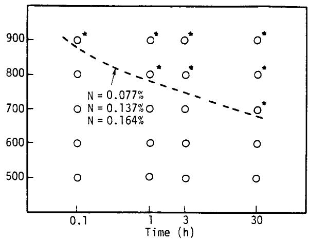  
FIGURE 9 — Strauss test results of 22Cr duplex SSs. (ASTM A262, Practice E); (0) No crack and (\*) embrittlement.

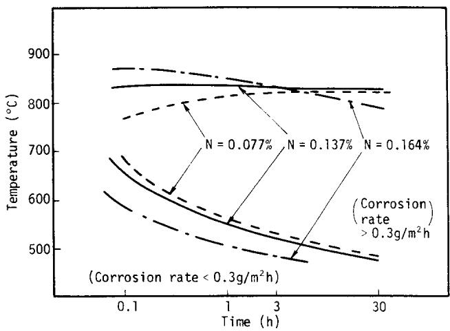  
FIGURE 10 — Huey test results of heat treated 22Cr duplex SSs (ASTM A262, Practice C).

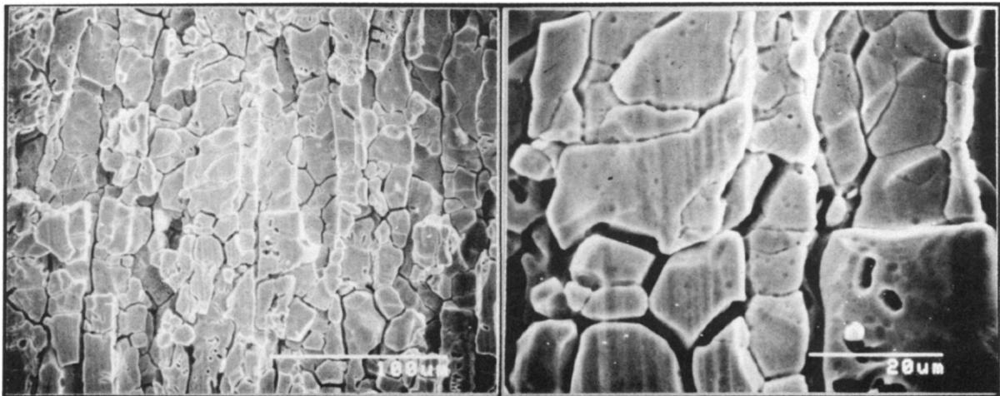  
FIGURE 11 — Corroded surface observation of 22Cr duplex SS after ASTM A262, Practice C Test; N = 0.137%, heat treated for 1 h at 600 C.

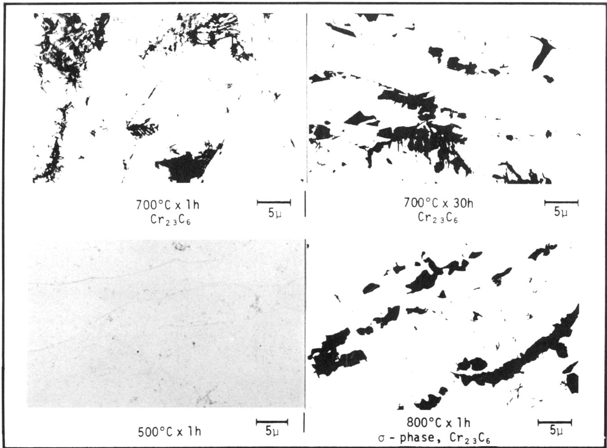  
FIGURE 12 — Extraction replica of heat treated 22Cr duplex SS; $\ N = 0 . 1 3 \%$

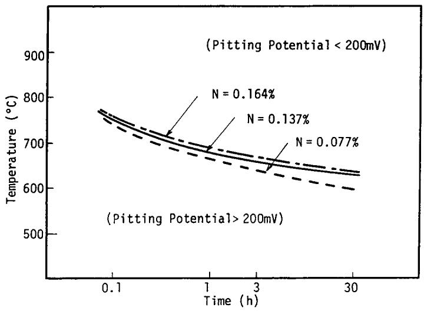  
FIGURE 13 — Effect of heating on the pitting potential of 22Cr duplex SSs (5% NaCI, 60 C).

The effect of heating on the pitting potential of 22%Cr duplex SS with various nitrogen contents is presented in Figure 13. There exists an area of decreased pitting corrosion resistance in the timetemperature diagram, the lower temperature limit of which depends on the heating time. The results show the small effect of nitrogen content on the pitting potential.

The high corrosion rate in the Huey test is found after the heat treatment in the range of 600 to 800 C, while the decreased pitting potential in NaCl solution is found above 700 C, as shown in Figure 14. It is considered that the susceptibility to intergranular corrosion by the Huey test is increased mainly by the precipitation of $C r _ { 2 3 } C _ { 6 }$ and that the pitting resistance is decreased by the precipitation of σ-phase, as well as ${ \mathsf { C r } } _ { 2 3 } { \mathsf { C } } _ { 6 } .$

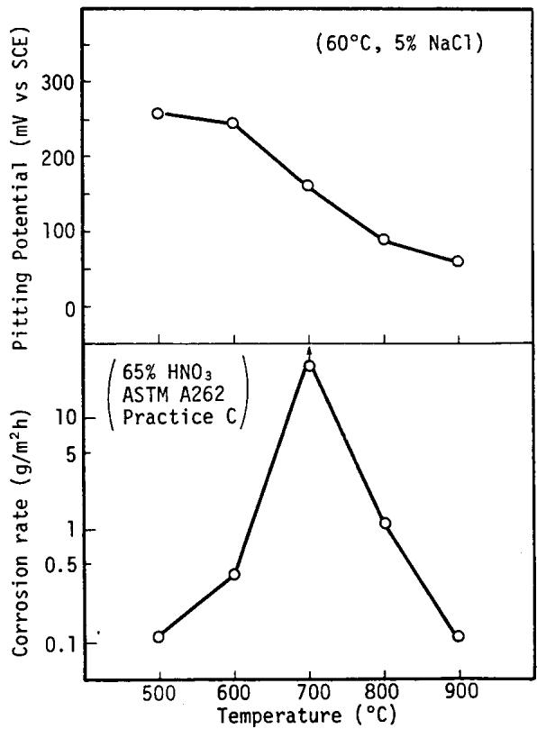  
FIGURE 14 — Effect of heating temperature on the pitting potential in NaCl solution and corrosion rate in ${ \bf H N O _ { 3 } }$ for 22Cr duplex SS (N = 0.137%, heated for 1 h).

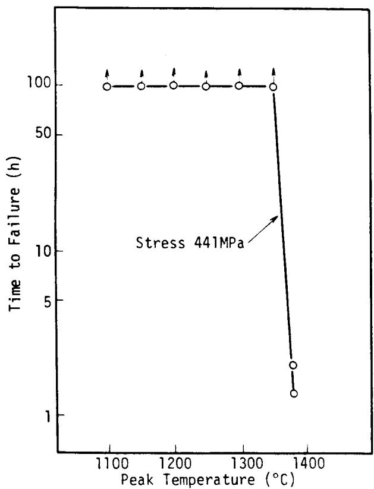  
FIGURE 15 — Effect of peak temperature at heat cycle on SCC susceptibility of 22Cr duplex SS; $\mathsf { N } = \mathsf { 0 } . 1 \mathsf { 3 } 7 \% ,$ 100 C, 20% NaCl + 1 atm $H _ { 2 } S .$

## Corrosion Resistance of High Temperature HAZ

In order to investigate the effect of nitrogen content on the corrosion behavior of the high temperature HAZ, i.e., HAZ(B) in Figure 4, the materials were heated with the simulated heat pattern shown in Figure 2. Figure 15 shows the effect of peak temperature at heat cycle on SCC susceptibility of 22%Cr duplex SS containing 0.14% nitrogen. SCC occurs only at the peak temperature of 1375 C. That microstructure with various peak temperatures is shown in Figure 16. The duplex phase transforms to single α-phase when the peak temperature exceeds 1350 C and then needle-shaped γ-phase precipitates during the cooling process. Therefore, the peak temperature of 1375 C was selected for the investigation of the effect of nitrogen content on the corrosion behavior of HAZ(B).

Figure 17 gives the effect of nitrogen content on intergranular corrosion of simulated HAZ(B) of 22%Cr duplex SSs. The alloys with nitrogen content below 0.077% suffer the intergranular attacks in the Strauss and Huey tests. The high sensitivity to intergranular corrosion of 0.077% or lower nitrogen alloys, whose structure is single α-phase after heating, results from the formation of the chromium depleted zone along α/α grain boundaries by the precipitation of ${ \tt C r } _ { 2 3 } { \tt C } _ { 6 }$ and/or $C r _ { 2 } N .$

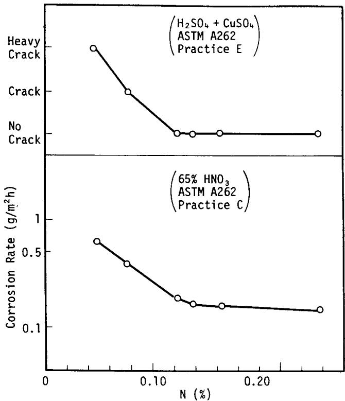  
FIGURE 17 — Effect of N content on intergranular corrosion of simulated HAZ of 22Cr duplex SSs.

It is indicated in Figure 18 that nitrogen is beneficial in the improvement of the pitting resistance in NaCl solution, as well as in $F e C l _ { 3 }$ solution. If the CPT value in the $\mathsf { F e C l } _ { 3 }$ solution is required to be more than 30 C at HAZ(B), a 0.14% or higher nitrogen content is necessary for a 22%Cr, 5.5%Ni, and 3%Mo base composition. The pitting potential and the CPT of the simulated HAZ(B) with a high nitrogen of 0.238% are lower than those of the base metal shown in Figures 6 and 7.

Figure 19 shows SCC test results in 20% NaCI solution with 1 atm (101 ${ \sf k P a } ) \sf H _ { 2 } S$ at 100 C. The SCC susceptibility of the simulated HAZ(B) is greater than that of the base metal shown in Figure 8. The materials suffer SCC in a short time under the high applied stress of 441 MPa. When the applied stress is decreased to 343 MPa, the alloys containing more than 0.123% nitrogen sustain the resistance to cracking. The alioys below the nitrogen content of 0.077%, which have the almost single α-phase, have high sensitivity to SCC even under the low applied stress of 343 MPa.

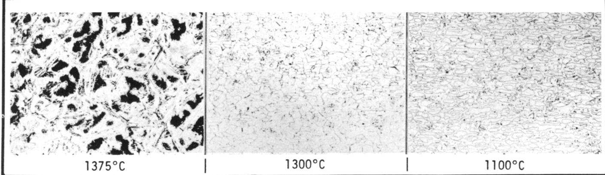  
FIGURE 16 — Microstructure of 22Cr duplex SS $( \mathsf { N } = 0 . 1 3 7 \% )$ on simulated HAZ with various peak temperatures.

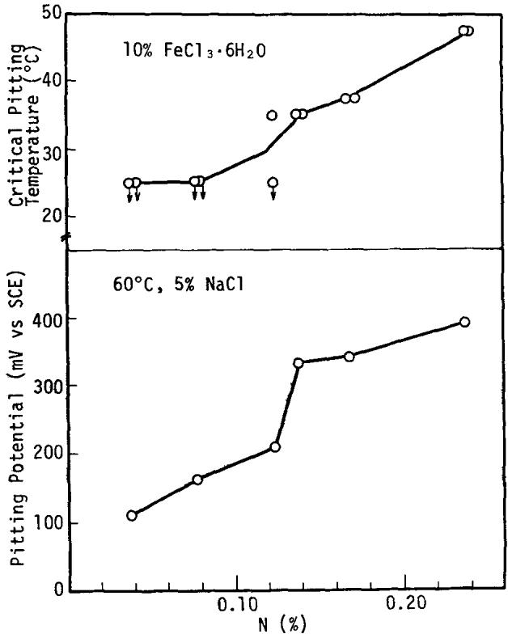  
FIGURE 18 — Effect of N content on the pitting corrosion resistance of simulated HAZ of 22Cr duplex SSs.

## SCC Resistance in $C O _ { 2 } { - } H _ { 2 } S { - } C I ^ { - }$ Environment

Table 2 displays the results on the SCC susceptibility of 22%Cr duplex SSs in $_ { \mathsf { C O } _ { 2 } \cdot \mathsf { H } _ { 2 } \mathsf { S } \cdot \mathsf { C l } ^ { - } }$ environments using the single U-bend method. SCC occurs on all materials in the condition of 0.1 atm (10.1 kPa) ${ \mathsf H } _ { 2 } { \mathsf S } + { \mathsf 1 } 0$ atm (1010 kPa) ${ \mathsf { C O } } _ { 2 }$ . The cracks propagate through not the austenite phase but ferrite phase. SCC susceptibility becomes lower as the partial pressure of ${ \sf H } _ { 2 } { \sf S }$ decreases. The simulated HAZ of the alloy with 0.047% nitrogen content still has SCC susceptibility when ${ \sf H } _ { 2 } { \sf S }$ is absent.

Figure 20 is an observation of SCC in the simulated HAZ of 22%Cr duplex SSs. In the condition of 10 atm (1010 kPa) ${ \mathsf { C O } } _ { 2 }$ the cracks of the alloy with 0.047% nitrogen content, which is sensitive to intergranular corrosion mentioned above, are intergranular, which is considered to propagate along the chromium-depleted zone at the α/α grain boundaries.

## Discussion

It has been shown that nitrogen is beneficial in improving the pitting corrosion resistance of the base metal. This beneficial effect of nitrogen can be attributed to improving the pitting corrosion resistant of the austenite phase, as discussed below. Chromium and molybdenum contents in the ferrite and austenite phases are almost constant independent of nitrogen content, as shown in Figure 21. The austenite phase has \~21%Cr-2.5%Mo, while the ferrite phase has 23%Cr-3.5%Mo. Assuming that the pitting index equation is $\complement \pm$ 3Mo + 16N (as proposed in Reference 9) and that the nitrogen exists only in the austenite phase of 60%, as shown in Figure 1, the nitrogen content required to get the same pitting corrosion resistance in austenite phase as that in the ferrite phase is \~0.18%. Therefore, the pitting corrosion is thought to initiate at the austenite phase below the nítrogen content of 0.18% from this rough estimation. Figure 22 shows the microscopic observation of pitting initiation of the 22%Cr duplex SS in NaCi solution. In the alloys with nitrogen contents of $0 . 1 3 7 \%$ pitting corrosion is observed to initiate in austenite phase. When the nitrogen content increases to 0.164%, it can be seen that pitting occurs at random on the ferrite and austenite phases. The estimation mentioned above almost agrees with the observation.

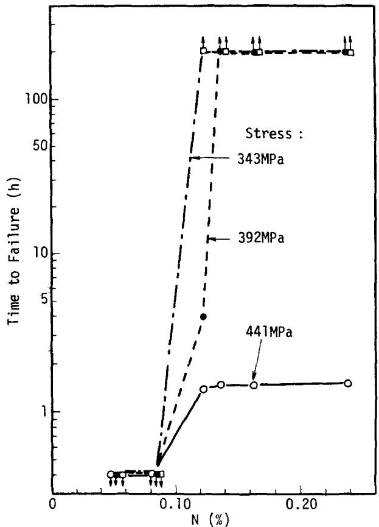  
FIGURE 19 — Effect of N content on SCC susceptibility of simulated HAZ of 22Cr duplex SSs (100 C, 20% NaCl + 1 atm ${ \sf H } _ { 2 } \hat { \sf s } )$

TABLE 2 — Results of SCC Susceptibility of 22%Cr Duplex SS
<table><tr><td>Test Condition Specimen</td><td>10 atm  $\pmb { \ c } \pmb { \bigcirc } _ { \mathbf { 2 } }$ </td><td>0.01 atm H2S + 10 atm  $\mathsf { c o } _ { 2 }$ </td><td>0.1 atm H2S + 10 atm  $\tilde { \mathsf { c o } } _ { \mathsf { 2 } }$ </td></tr><tr><td> $N \approx 0 . 0 4 7 \%$ </td><td>No SCC</td><td>No SCC</td><td>SCC</td></tr><tr><td> $\mathsf { N } \approx 0 . 0 7 7 \%$ </td><td>No SCC</td><td>No SCC</td><td>SCC</td></tr><tr><td> $\mathsf { N } \approx 0 . 1 2 3 \%$ </td><td>No SCC</td><td>No SCC</td><td>SCC</td></tr><tr><td> $\mathsf { N } \approx 0 . 1 3 7 \%$   $N \approx 0 . 1 6 4 \%$ </td><td>No SCC</td><td>No SCC</td><td>SCC</td></tr><tr><td> $\mathsf { N } \simeq 0 . 2 3 \mathsf { B } \%$ </td><td>No SCC No SCC</td><td>No SCC No SCC</td><td>SCC SCC</td></tr><tr><td></td><td></td><td></td><td></td></tr></table>

(1Base metal: Single U-bend method; 100 C, 20% NaCl. 500 h.

Simulated HAZ: Single U-bend method; 100 C, 20% NaCI, 500 h
<table><tr><td>Test Condition Specimen</td><td>10 atm  $\mathtt { c o } _ { \mathtt { 2 } }$ </td><td>0.01 atm H₂S + 10 atm  $\mathtt { c o } _ { 2 }$ </td><td>0.1 atm H₂S + 10 atm  $\mathtt { c o } _ { 2 }$ </td></tr><tr><td> $N = 0 . 0 4 7 \%$ </td><td>SCC</td><td>SCC</td><td>SCC</td></tr><tr><td> $\mathsf { N } \simeq 0 . 0 7 7 \%$ </td><td>No SCC</td><td>No SCC</td><td>SCC</td></tr><tr><td> $\textsf { N } = 0 . 1 2 3 \%$ </td><td>No SCC</td><td>No SCC</td><td>SCC</td></tr><tr><td> $N = 0 . 1 3 7 \%$ </td><td>No SCC</td><td>No SCC</td><td>SCC</td></tr><tr><td> $N = 0 . 1 6 4 \%$   $\Nu = 0 . 2 3 8 \%$ </td><td>No SCC No SCC</td><td>No SCC No SCC</td><td>SCC SCC</td></tr><tr><td></td><td></td><td></td><td></td></tr></table>

Thus, the role of nitrogen to the increase in pitting corrosion resistance is attributed to the improvement of the austenite phase of the duplex SS.

It was observed that nitrogen content has little effect on intergranular corrosion of the materials aged at the temperature around 700 C in the Huey test, which suggests that the determining factor of this corrosion may be primarily the precipitation of ${ \mathsf { C r } } _ { 2 3 } { \mathsf { C } } _ { 6 } .$ In fact, the precipitation of $C r _ { 2 3 } C _ { 6 }$ was observed at the $\alpha / \gamma$ and α/α grain boundaries.

As mentioned above, the dissolved nitrogen itself increases the corrosion resistance of the base metal. Moreover, nitrogen is an essential element to get the proper microstructure for the corrosion resistances and the mechanical properties at HAZ. Below the nitrogen content of 0.077%, the simulated HAZ(B) has the single ferrite phase, which leads to the sensitization at α/α grain boundaries resulting from the formation of chromium carbides and nitrides during the cooling process. Thus, HAZ(B), which has the single ferrite phase, is very sensitive to intergranular corrosion and intergranular stress corrosion cracking (IGSCC) can occur in $C O _ { 2 } { - } C I ^ { - }$ environments containing no $H _ { 2 } S .$ To get the dual phase, which is desirable for the corrosion resistance in high temperature HAZ, the nitrogen content is required at least to be 0.12% or higher for the 22%Cr, 5.5%Ni, and 3%Mo base composition.

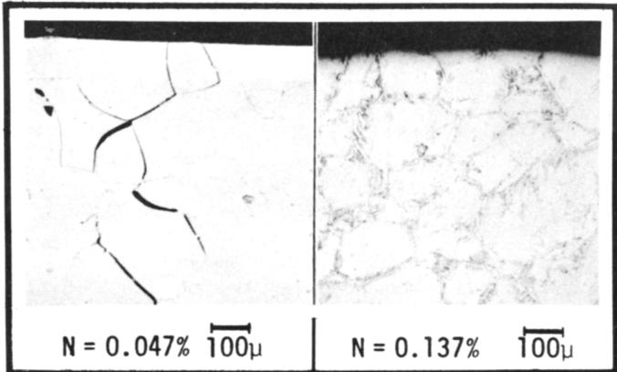  
FIGURE 20 — Microscopic observation of simulated HAZ of 22Cr duplex SS after single U-bend SCC test (100 C, 20% NaCl + 10 atm $\cos _ { 2 }$ 500 h).

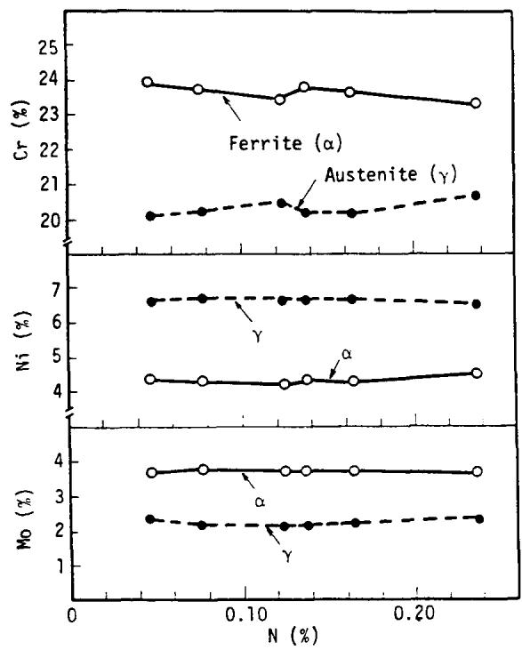  
FIGURE 21 — EPMA analysis of ferrite and austenite phases of 22Cr duplex SSs (N = 0.047 to 0.238%).

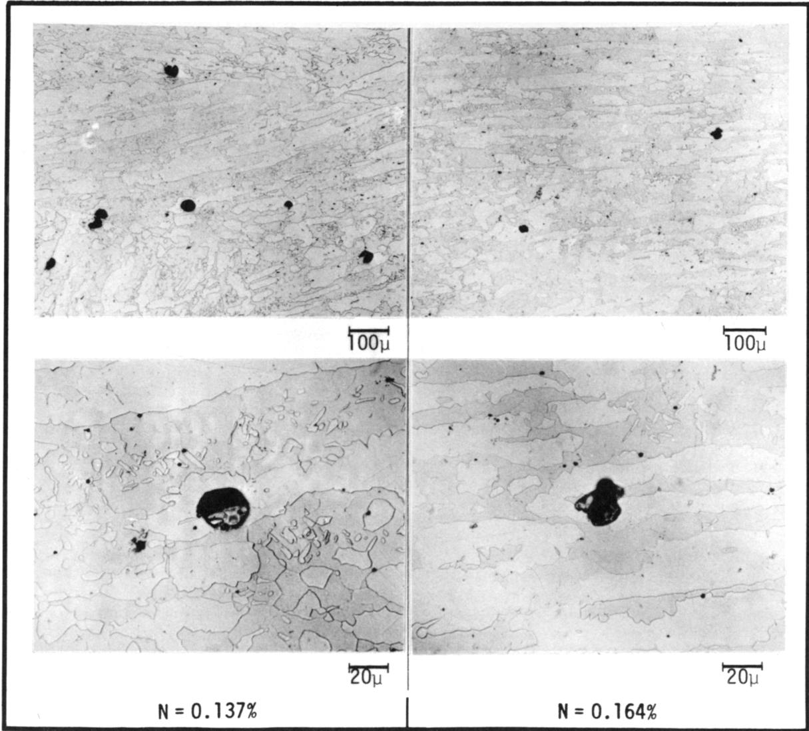  
FIGURE 22 — Microscopic observation of pitting initiation of 22Cr duplex SS (60 C, 5% NaCi).

## Conclusion

The effects of nitrogen content of 22%Cr duplex SS on the corrosion resistance of welds was investigated. The results obtained are as follows:

1. The increase in nitrogen content increases the resistance to pitting corrosion and SCC of the base metal, which results from the improvement in the resistance of austenite phase by the dissolved nitrogen itself.

2. Nitrogen has little effect on the intergranular corrosion at the low temperature HAZ in the Huey test

3. More than 0.12% nitrogen is required for the 22%Cr, 5.5%Ni, and 3%Mo base alloys to maintain the corrosion resistance at high temperature HAZ, which is heated to 1350 C or higher. When the nitrogen content is less than 0.077%, the HAZ, which contains little austenite phase, has the high susceptibility to intergranular corrosion and IGSCC.

## Acknowledgment

The authors would like to thank Y. lto and T. Moroishi of Technical Research Laboratories of Sumitomo Metal Industries, Ltd.

The authors also acknowledge M. Miura, S. Kiyama, and T.   
Nakagawa for their helpful discussion and their experimental work.

## References

1. J. Ored, S. Berngardsson, CORROSION/82, Paper No. 126, National Association of Corrosion Engineers, Houston, Texas, 1982.

2. G. Herbsleb, R. K. Poepperling, Corrosion, Vol. 36, No. 11, p. 611, 1980.

3. A. Desestret, CORROSION/83, Paper No. 165, National Association of Corrosion Engineers, Houston, Texas, 1983.

4. P. R. Rhodes, G. A. Welch, L. Abhego, Materials for Energy System, Vol. 5, No. 1, p. 3, 1983.

5. S. M. Wilhelm, R. D. Kane, CORROSION/83, Paper No. 154, National Association of Corrosion Engineers, Houston, Texas, 1983.

6. H. Miyuki, J. Murayama, T. Kudo, T. Moroishi, CORROSION/84, Paper No. 293, National Association of Corrosion Engineers, Houston, Texas, 1984.

7. G. Herbsleb, P. Schwaab, Duplex Stainless Steel, American Society for Metals, Metals Park, Ohio, p. 15, 1983.

8. S. Bernhardsson, J. Ordsson, C. Martension, Duplex Stainless Steel, American Society for Metals, Metais Park, Ohio, p. 267, 1983.

9. J. E. Truman, private communication, 1981.

# Influence of Grain Boundary Microstructure on the Susceptibility of Alloy 600 to Intergranular Attack and Stress Corrosion Cracking

S. M. PAYNE\* and P. McINTYRE\*\*

## Abstract

The influence of grain boundary microstructure on the susceptibility of thermally treated (TT) Inconel Alloy 600 to intergranular attack (IGA) and stress corrosion cracking (SCC) in 30%NaOH + $1 0 \% N a _ { 2 } S O _ { 4 }$ at 350 C was investigated. Both mill-annealed (MA) and laboratory solution-annealed alloys were aged at 700 C to establish the effect of initial processing on the material's response to thermal treatment. Treatments of 1 h or more at 700 C greatly improved the SCC resistance of solution-annealed material but did not improve the performance of MA material containing a high density of intragranular carbides. The poor behavior of this material after thermal treatment was associated with the formation of small $M _ { 2 3 } C _ { 6 }$ carbides qrowing at a high angle to the boundaries and the development of these into cellular colonies. This is attributed to the use of a MA temperature that was too low to take into solution sufficient carbon for the development of semicontinuous grain boundary carbides during the subsequent TT process.

## Introduction

Mill-annealed (MA) Inconel Alloy 600, an austenitic nickel-based alloy, has been widely used for the manufacture of pressurized water reactor (PWR) steam-generator tubing since 1967.1 However, a combination of intergranular attack (IGA) and stress corrosion cracking (SCC) has occurred at the outer surfaces of the tubes in some steam generators where caustic impurities from the secondary water have concentrated in crevices between the tubes and adjacent tube sheets or support plates.²

In recent years, thermal treatment (TT) after final MA has been used to improve the resistance of Alloy 600 to SCC in caustic environments.1 This treatment, at \~700 C for \~15 to 20 h, causes chromium carbides to precipitate at the grain boundaries and allows rehomogenization of the chromium content in the vicinity of most boundaries. It also reduces residual stresses and the effects of cold work introduced during the tubing manufacture. TT has been reported³ to significantly improve resistance to SCC for Alloy 600 with carbon contents in the range of 0.006 to 0.046% by weight. The