# MECHANISM OF INTERGRANULAR CORROSION OF Al-Cu ALLOYS\*

J. R. GALVELE and S. M. DE DE MICHELI Comisión Nacional de Energía Atómica, Departamento de Metalurgia, Avda. del Libertador 8250, Buenos Aires, Argentina

Abstract-The anodic behaviour of pure Al and some specially prepared Al-Cu alloys has been studied to check the mechanism of intergranular corrosion of aged Al-4%Cu. A clear relationship between pitting and intergranular corrosion has been found. Intergranular corrosion only occurs in the presence of certain anions, and over a narrow range of potentials. Difference in pitting potentials, rather than difference in electrode potentials, is the main factor in producing intergranular corrosion of $A l { - } 4 \% \mathrm { C u }$ The conditions of heat treatment, solution composition, and potential, at which intergranular corrosion appears, have been established.

Résumé—On a étudié le comportement de Al et de quelques alliages Al-Cu spécialement préparés afin de vérifier le mécanisme de la corrosion intergranulaire de $\mathbf { A l \bar { - } } 4 \%$ Cu vieilli. On a trouvé une relation nette entre piqûration et corrosion intergranulaire. Celle-ci n'a lieu qu'en présence de certains anions et dans un intervalle étroit de potentiel. La différence des potentiels de piqûration, plus que celle des potentiels d’électrode, est le facteur essentiel de la corrosion intercristalline de $\pmb { \mathrm { A l } } \mathbf { \mathrm { - } } \pmb { 4 } \%$ Cu. On a établi les circonstances de traitement thermique, de composition de solution et de potentiel de l’apparition de la corrosion intercristalline.

Zusammenfassung—Das anodische Verhalten von reinem Aluminium und einigen, besonders aufbereiteten Al-Cu Legierungen ist untersucht worden, um den Mechanismus von Korngrenzenkorrosion von gealtertem Al-4%Cu zu prüfen. Es wurde ein deutliches Verhältnis zwischen Lochfrass und Korngrenzenkorrosion gefunden. Korngrenzenkorrosion erfolgt nur bei Vorhandensein von bestimmten Anionen und über einen engen Potentialbereich. Unterschied in Lochfrass Potentialen zu einem grösseren Grade als Unterschied in Elektroden Potentialen ist die Hauptursache, Korngrenzenkorrosion von Al-4%Cu hervorzurufen. Die Bedingungen für Wärmebehandlung, Lösungszusammensetzung und Potential, bei welchem Korngrenzenkorrosion erscheint, wurden festgelegt.

## INTRODUCTION

THE INTERGRANULAR corrosion of aged Al-4%Cu alloys has been the subject of numerous investigations.1-7 It is generally agreed that the microstructure of the aged Al-Cu alloy is the one represented in Fig. 1. At this stage of heat treatment the changes in the structure of the grain bodies are not yet detectable by common metallographic techniques, and for the present purposes are usually considered as a single phase. At the grain boundaries, on the other hand, the precipitation rate is higher, and two phases can be observed, the θ phase, or $\mathbf { A l _ { 2 } C u } ,$ , surrounded by the other phase, a Cu-depleted zone, which, according to the equilibrium diagram (8), should approximate to $6 1 { - } 0 { \cdot } 2 \% \mathrm { C u }$ Consequently in the generally accepted mechanism of intergranular corrosion¹-7 the aged Al-4%Cu alloy is described as a three-phase system having anodic and cathodic zones. The copper-depleted zone along the grain boundaries is the anode (phase I), whilst the grain bodies (phase II) and the intermetallic $\mathbf { A l _ { 2 } C u }$ (phase III) are cathodes. The intergranular corrosion of $\mathbf { A l - C u }$ would then be a process in which a very small anode is in contact with a large cathode. In support of this mechanism measurements made by various authors³- showed that during corrosion there was a difference in potentials of the order of 100 mV between the grain boundaries and the grain bodies. Nevertheless, a mechanism of anodic and cathodic zones does not explain why the presence of Cl- is necessary to get intergranular corrosion, and intergranular corrosion should occur in almost any corrosive medium. Therefore any mechanism of intergranular corrosion of aged $A l { - } 4 \% \mathrm { C u }$ must explain the action of the Cl- ions.

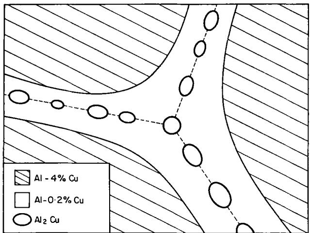  
FiG. 1. Schematic representation of the microstructure of an aged Al-4%Cu alloy.

The purpose of the present work was to find out the function of the Cl-in the intergranular corrosion of Al-Cu alloys. Specimens of each of the three phases present in the aged Al-4%Cu alloy were studied in Cl- solutions. It has been found that the intergranular corrosion of the aged $A l { \ - } 4 \% \mathrm { C u }$ alloy appears only over a certain potential range, and that it is related to the process of pitting of Al.

## EXPERIMENTAL

Specimens of solubilized Al-4%Cu were used to simulate the behaviour of the grain bodies of aged Al–4%Cu. For the study of the other two phases the intermetallic $\mathbf { A l _ { 2 } C \hat { u } }$ and Al-0·2%Cu alloy were used.

Measurements were performed on alloys prepared with Al 99.99% and Cu 99.999%. The analytical composition of the nominal alloy was, for $\mathbf { A l \mathcal { \mathrm { - } } 4 \% C u } ,$ 4-07%Cu; for Al–0·2%Cu, 0-27%Cu; and for the intermetallic $\mathbf { A l _ { 2 } C u }$ ,56·1%Cu. Several potentiostatic measurements on Al 99.99% and Al 99.9999% were also performed.

The specimens were prepared by cutting coupons of $1 0 \times 3 0$ mm from a 1 mm thick cold-rolled sheet of the alloys. The solubilized $A l { \ - } 4 \% C \mathbf { u }$ was prepared by heating the specimens for 2 h at ${ 5 5 0 ^ { \circ } } \mathrm { C }$ and water quenching. The aged specimens were prepared by heating the solubilized specimens for 3 h at $1 7 6 \mathrm { ^ \circ C }$ ; and the over-aged specimens were obtained by heating the solubilized material for 1 h at $4 3 0 ^ { \circ } \mathbf { C } .$ The $\mathbf { A l - } 0 { \cdot } 2 \% \mathbf { C u }$ and the pure Al specimens were annealed for 2 h at $6 0 0 ^ { \circ } \mathbf { C }$ and water quenched. The edges and the surface of the specimens were covered with a curedepoxy resin, leaving an uncovered area of about 1 cm². The specimens were electropolished in a $\mathbf { H C l O _ { 4 } }$ acetic anhydride bath, and stored in a desiccator for a few days before the experiments.

The specimens of the intermetallic $\mathbf { A l _ { 2 } C u }$ were cast rods of about 6 mm dia. The surface of the rods was covered with the cured-epoxy resin, and one end was mechanically taper polished with diamond powder, leaving an exposed area of about 1 cm².

The solutions were prepared with analytical grade reagents and were deaeratedª with purified $\mathbf { N _ { 2 } } .$

The potential was controlled with a Tacussel PRT 20-2-M potentiostat. All the measurements were made at ${ \mathfrak { 2 5 } } ^ { \circ } \mathbf { C }$ in a Pyrex glass cell, with a platinum counter electrode. The potentials were measured, through a Luggin capillary, with a saturated calomel electrode, and referred to the normal hydrogen electrode scale (nhe).

## RESULTS

## Anodic polarization curves in NaCl

Polarization curves were obtained for each of the three phases, in solutions containing various concentrations of NaCl. The measurements were made in steps of 10 mV, waiting at each point until a stationary current was observed. Figure 2 shows a typical example of the polarization curves obtained. The results with pure Al were similar to the ones reported by Kaesche¹º and Bond et $\pmb { a l . , } ^ { 1 1 }$ and the same type of anodic polarization curve was obtained with solubilized $A l { - } 4 \% \mathbf { C } \mathbf { u }$ $\mathbf { A l - 0 \cdot } 2 \% \mathbf { C u } ,$ and $\mathbf { A l _ { 2 } C u }$ . In all cases the specimens showed a passive range, where no attack was observed. But, as the potential was increased to the critical potential, there was a marked increase in the current, and pitting was then detected on the surface. Although the existence of critical potentials for pitting is supported by various authors,10-15 recent work has thrown doubts on the existence of such potentials,16-18 since pitting does not occur until after an induction period.

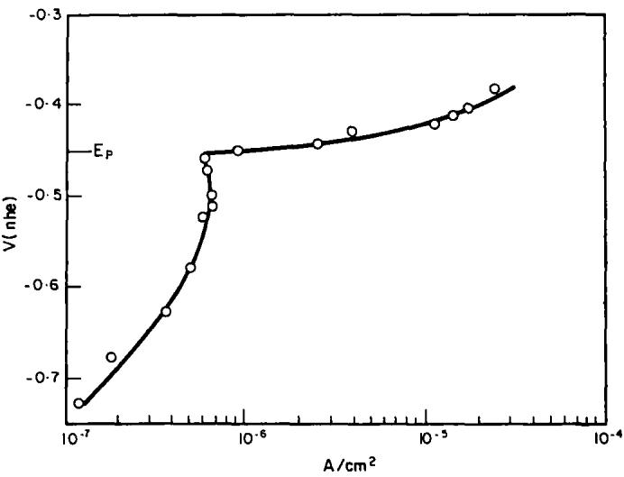  
FiG. 2. Anodic polarization curve of $9 9 . 9 9 \% \mathrm { A l }$ in deaerated 0-1M NaCl solution. Ep: potential at which pitting starts.

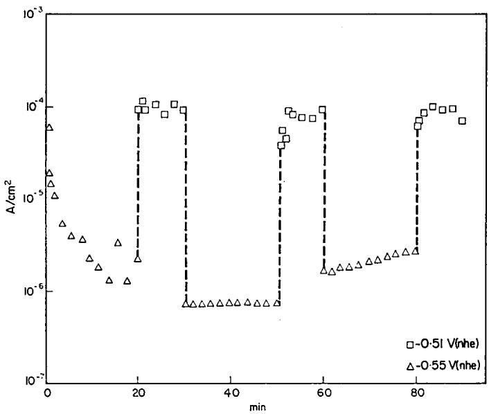  
FIG. 3. Behaviour of 99.99%Al in deaerated 1M NaCl solution when the potential is switched from the passive range to the pitting range. The pitting potential was — 0·53 V(nhe).

In view of this discrepancy of opinions, two types of experiments were made to study the pitting of Al in Cl- solutions.

In a first series of experiments 99.99%Al was immersed in deaerated 1M NaCl and the potential of the specimen was switched every 10 to 20 min from the passive range to the pitting range (Fig. 3). When the specimen is held at a low potential the current decreases to very small values, but if the potential is then switched to a higher value, which is in the pitting range, the current increases by two or more orders of magnitude, and pits form on the surface of the metal. If the potential is switched back to the low initial value, the pitting stops and the metal repassivates. This experiment can be repeated several times on the same specimen with the same results. If pitting of Al in Cl- solutions is a time-dependent process, independent of the potential, once pitting has started it would not be expected to stop when the potential is decreased.

A second series of experiments consisted in recording the changes in the anodic current for 5 h when specimens of 99.99%Al were held at various constant potentials in 1M deaerated NaCl (Fig. 4). When the potential was maintained in the range — 0·76 V(nhe) and — 0.53 V(nhe) the c.d. after 5 h remained below 1 $\scriptstyle \mu \mathbf { A } / \cos m ^ { 2 }$ and no pitting was observed. But with a potential only 10 mV higher than — 0.53 V the c.d. increased by more than three orders of magnitude and pitting commenced. These experiments showed that if there is an induction time for pitting of Al, a change in potential of 10 mV should decrease the induction time by at least four orders of magnitude. It can be concluded therefore that pitting of Al is related to a critical potential which does not depend on an induction period.

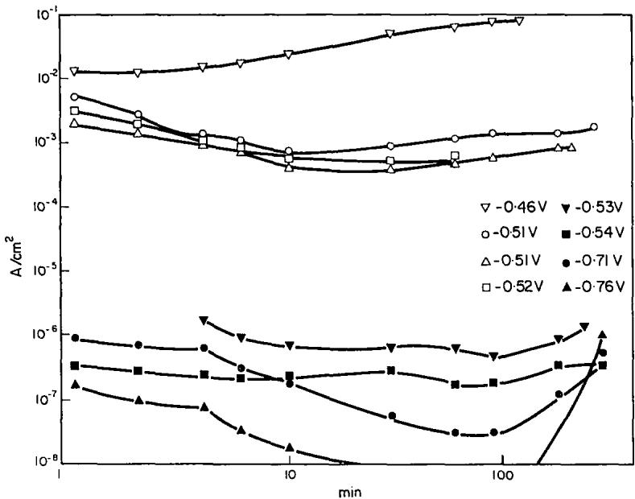  
FiG. 4. Current-time curves for 99.99%Al in deaerated 1M NaCl solution at various potentials.

## Pitting potentials

The critical pitting potentials of the three phases and of pure Al in various concentrations of deaerated NaCl are shown in Fig. 5. The pitting potential for all the three phases is linearly related to logarithm of the activity of NaCl, and in the range 0·01 to 5M NaCl the following relations were obtained:

Phase I, and high purity Al:

$$
E p _ { \mathrm { I } } = - \ 0 { \cdot } 5 3 6 \ - 0 { \cdot } 0 7 3 \log \left( \alpha _ { \mathrm { N a C l } } \right)
$$

where $E p _ { \mathrm { I } }$ is the breakdown potential in V(nhe).

Phase II:

$$
E p _ { \mathrm { { I I } } } = - \ 0 { \cdot } 4 0 4 \ - 0 { \cdot } 0 4 6 \ \log \ ( \mathrm { { a } _ { N a C l } ) , \mathrm { { a n d } } }
$$

Phase III:

$$
\begin{array} { r } { E p _ { \mathrm { I I I } } = - \ 0 { \cdot } 4 2 0 \ - 0 { \cdot } 0 5 5 \log \mathrm { ( a _ { N a C l } ) } . } \end{array}
$$

In all the cases studied the breakdown potentials for the Cu-rich phases were about 100 mV higher than the values for specimens with lower Cu content. The pitting potentials of the solubilized Al-4%Cu were similar to those of the intermetallic $\mathsf { A l } _ { 2 } \mathsf { C u } ,$ , and no difference was observed in the pitting potentials of the Al–0-2%Cu and high purity Al.

## Influence of heat treatment on intergranular corrosion

With the results shown in Fig. 5 it should be possible to predict the behaviour of heat-treated Al-4%Cu alloys in Cl- solutions at different potentials. As shown in this figure, there is a range of potentials where an alloy with a Cu-depleted zone will show attack in such zone while the two others remain passive. This sort of behaviour should be expected in a wide range of Cl- concentrations. For example, an aged $A l { - } 4 \% \mathrm { C u }$ alloy (Fig. 1) will corrode along the grain boundaries over a range of 100 mV while the grain bodies remain passive. In this case corrosion will concentrate in the few-micronsthick Cu-depleted zone.

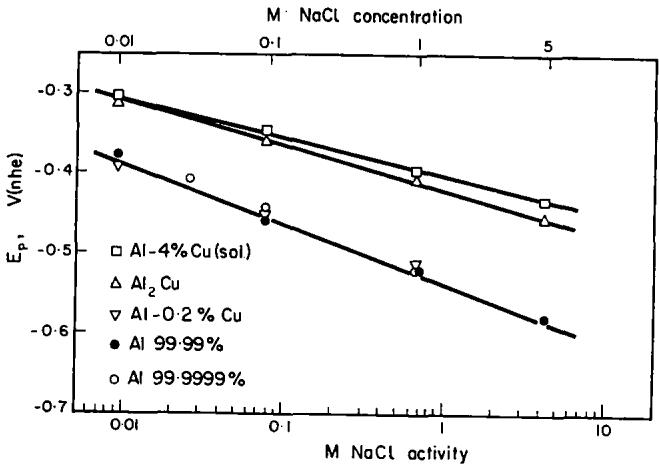  
FiG. 5. Effect of the chloride concentration on the pitting potential of pure aluminium and various Al-Cu alloys in deaerated NaCl solutions.

The results for aged $A l { \ - } 4 \% \mathrm { C u }$ confirm such prediction, and Fig. 6 shows a typical example of an anodic polarization curve in deaerated 1M NaCl; in this particular experiment the potential was changed in steps of 10 mV every minute. The values of the expected breakdown potentials of the grain boundaries and of the grain bodies are also included. It was found that when the first breakdown potential is reached, an increase in c.d. occurs, and intergranular corrosion begins. Increasing further the potential results in a slowdown in the current increase, probably due to the narrow front in which the attack is taking place, but when the second breakdown potential is reached there is a new increase in current and corrosion of the grain bodies begins.

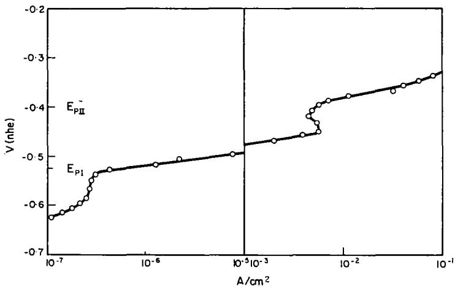  
FiG. 6. Anodic polarization curve of aged $A l { - } 4 \% C \mathbf { u }$ in deaerated 1M NaCl solutions. Measurements made in steps of 10 mV/min. $E p _ { \downarrow } \colon$ pitting potential measured for Al-0·2%Cu. Epu: pitting potential of solubilized $\Delta 1 - 4 \% C u$

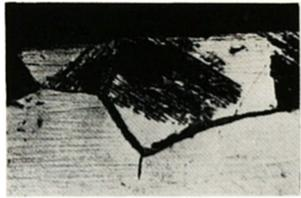  
(a)

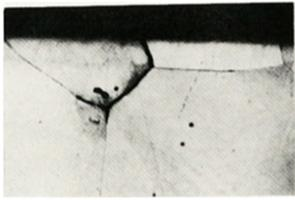

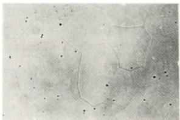

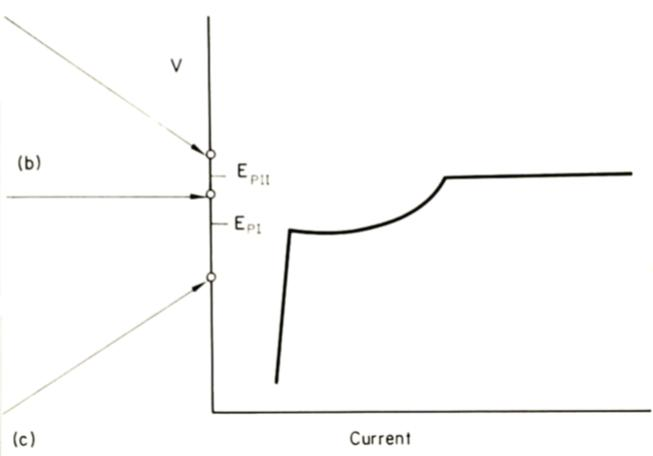  
FiG, 7. Anodic polarization curve and type of attack for aged $\mathbf { A l - 4 0 } \mathrm { \mathop { / } \mathbf { C } } \mathbf { u }$ indeaerated 1 M NaCl solution. Exposure conditions: $a \ = 2 0$ min $\mathbf { a t } - 0 { \cdot } 3 5 \ \mathbf { V } ( \mathbf { n h e } )$ , intergranular corrosion plus tunnel-like pitting, section (120 ×); b = 20 min at - 0-43 V(nhe), intergranular corrosion, section $( 1 2 0 \times ) ; c = 9 0$ min $\mathbf { a t } - 0 { \cdot } 6 6 \mathbf { \ V } ( \mathrm { n h e } )$ , specimen not corroded, normal view $( 3 0 \times )$

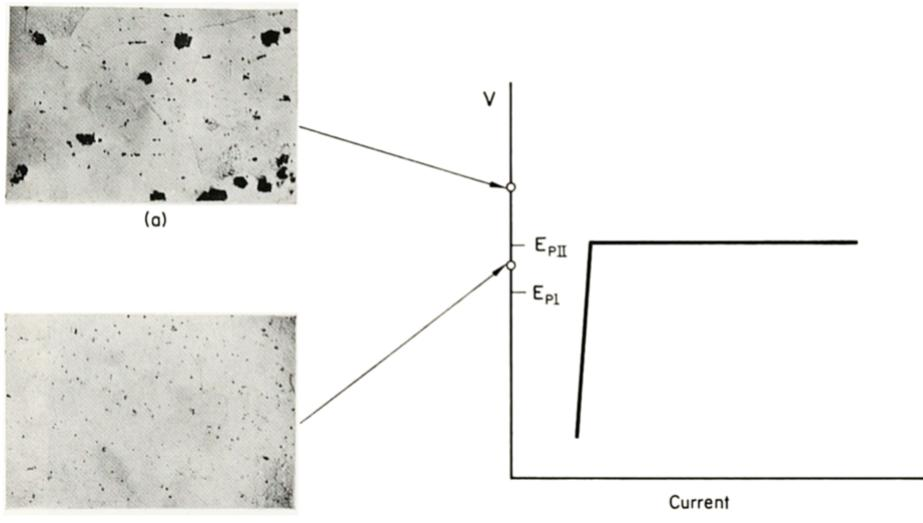  
(b)  
FiG. 9. Polarization curve and type of attack of solubilized $\mathbf { A l - 4 \% C u }$ in deaerated 1M NaCl solution. $a = 5$ min at — 0·26 V(nhe), pitting corrosion $( 3 0 \times ) ; b = 9 0$ min $\mathbf { a t } \ - \ 0 { \cdot } 4 6 \ \mathbf { V } ( \mathbf { n h e } ) ,$ no corrosion except for the pits produced during electropolishing (30 ×).

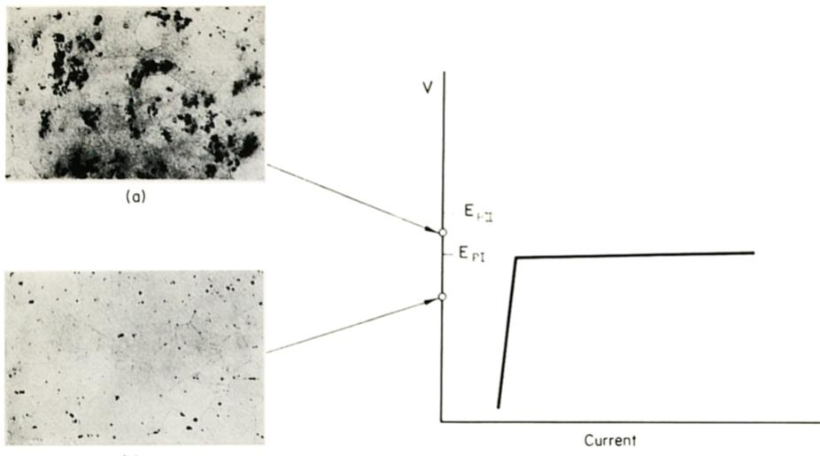  
(b)  
FiG. 11. Polarization curve and type of attack of over-aged $\mathbf { A l - } 4 \% \mathbf { C u }$ in deaerated 1M NaCl solution. $a \ = \ 1 0$ min $\mathrm { \bf { a t } } \mathrm { \bf { \sigma } } - { \bf 0 } { \cdot } { \bf 4 } { \bf 4 }$ V(nhe), generalized pitting $( 3 0 \times )$ b = 90 min at — 0·66 V(nhe), no corrosion except for pits produced during electropolishing (30 ×).

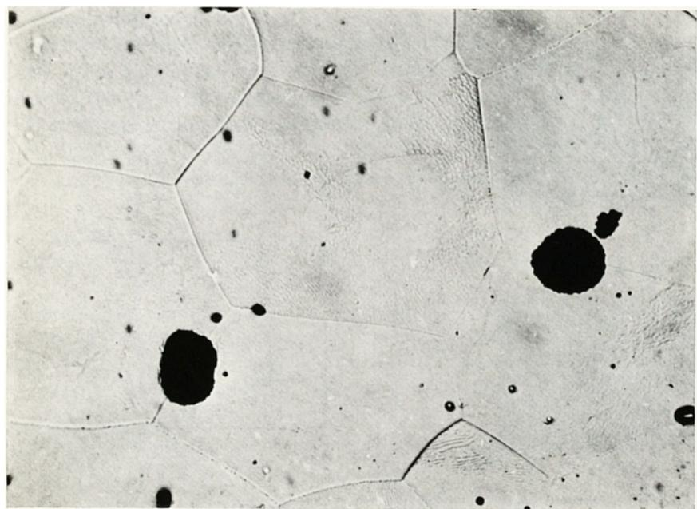  
FiG. 13. Type of attack of aged ${ \sf A l } { \ - } 4 \%$ Cu in 1M $\bf { N a N O _ { 3 } }$ solution, exposed 1 h at + 1·85 V(nhe). Pitting nucleates at the grain boundaries but no intergranular corrosion was observed (100 ×).

Similar results were obtained in other experiments where the potential was maintained constant, and Fig. 7 shows the type of corrosion observed for aged Al-4%Cu in 1M deaerated NaCl, under constant potential. Specimen c was exposed for 90 min at a potential of — 0·66 V(nhe), and did not show any type of attack. Another specimen b exposed for 20 min at — 0.43 V(nhe) showed intergranular corrosion. And a third specimen a exposed for 20 min at — 0·35 V(nhe), showed corrosion at the grain boundaries and in the grain bodies. The attack in the grain bodies took the form of tunnels, similar to the ones described by various authors for pure Al.19-si These experiments were repeated with several other specimens of aged Al-4%Cu and the same relation between the potential applied and the type of corrosion was always obtained.

The data in Fig. 5 can also be applied to predict the kind of corrosion for other heat treatments. A solubilized $\mathbf { A l - 4 \% C u }$ , for example, has only one phase (Fig. 8), and in this case localized corrosion should appear at potentials higher than Epn, but the metal should remain passive at lower potentials. This is confirme in Fig. 9, where 90 min exposure at — 0·46 V(nhe) did not produce any attack, except for the small pits produced during electropolishing of the specimens. But after 5 min exposure at — 0·26 V(nhe) severe pitting was observed.

In the over-aged condition, on the other hand, the grain bodies show a two-phase structure, as schematically represented in Fig. 10. According to Fig. 5 an alloy with this microstructure should suffer general corrosion at potentials higher than $E p _ { \mathrm { I } }$ . This was experimentally confirmed (Fig. 11), and a specimen exposed at a potential of — 0.44 V(nhe) showed severe pitting, while another specimen exposed for 90 min at — 0·66 V(nhe) was unattacked. This type of behaviour explains why Farmery and Evans² found that the “light zone" along the grain boundaries was not always related to intergranular corrosion. This precipitate-free zone is also present in the over-aged alloy. But the over-aged alloy will suffer corrosion not only in the grain boundaries but also in the grain bodies (Fig. 11). Besides, the increase in the anodic area, and the consequent reduction in the cathodic area, will favoi generalized corrosion rather than intergranular attack.

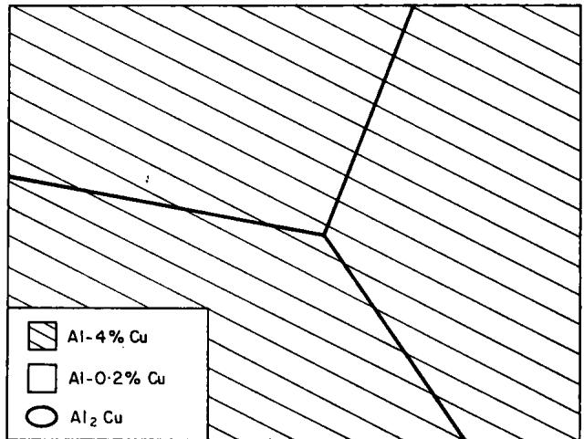  
FiG. 8. Schematic representation of the microstructure of solubilized Al-4%Cu alloy. Only one phase is present.

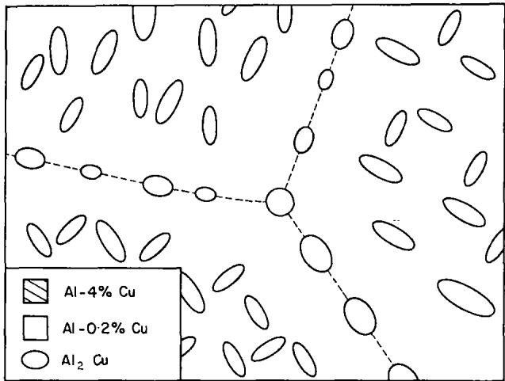  
FiG. 10. Schematic representation of the microstructure of over-aged Al-4%Cu alloy. Only Al-0-2%Cu and AlgCu are present.

TABLE 1. TYPE OF ATTACK OF AGED Al-4%Cu IN 1M DEAERATED NaCl SOLUTION
<table><tr><td></td><td colspan="3">Potential</td></tr><tr><td>Heat treatment</td><td>Below − 0·52 V(nhe)</td><td>Between - 0·52 and − 0·40 V(nhe)</td><td>Over - 0·40 V(nhe)</td></tr><tr><td>Solubilized</td><td>Passive</td><td>Passive</td><td>Pitting</td></tr><tr><td>Aged</td><td>Passive</td><td>Intergranular</td><td>Generalized*</td></tr><tr><td>Over-aged</td><td>Passive</td><td>Pitting</td><td>Pitting</td></tr></table>

\*The attack is a mixture of pitting plus intergranular corrosion.

Table 1 summarizes the behaviour of Al-4%Cu alloys with different heat treatments at various potentials in deaerated 1M NaCl solutions. No attack is observed for any heat treatment at potentials below — 0.52 V(nhe). Such a behaviour could not be predicted from the mechanism of anodic and cathodic zones. Between - 0.52 V(nhe) and — 0·40 V(nhe) the behaviour of all heat treatments is the same as that expected from the original anodic-zone mechanism, and above — 0·40 V(nhe) a behaviour not predicted by that mechanism is again found.

From a practical point of view, the low potentials are obtained when working in pure Cl- solutions in the absence of $\mathbf { O _ { 2 } } .$ The second range of potentials is obtained in $\mathbf { O _ { 2 } } \cdot$ -saturated solutions, and in order to reach the highest range of potentials either a stronger oxidizer or an external current will be required.

## Cathodic polarization curves

It is known in practice that $\mathbf { O _ { 2 } }$ plays an important role in the intergranular corrosion of Al-Cu alloys. For this reason the cathodic polarization curves in air-saturated 1M NaCl were determined for pure $\mathbf { A l } ,$ solubilized Al-4%Cu and $\mathbf { A l _ { \ell } C u }$ (Fig. 12). It was found that, as already mentioned by Ketcham and Haynie,' the cathodic reaction is kinetically easier in the Cu-rich phases than in pure $\mathbf { A l } ,$ which is decisive in the behaviour of Al alloys in Cl- solutions, as discussed later.

## Intergranular corrosion in absence of Cl-

To determine the possibility of pitting in media other than Cl- solutions, polarization curves were obtained for 99.99%Al and for solubilized Al-4%Cu in various solutions. From what had been observed in Cl- solutions, pure Al was expected to behave in the same way as the depleted zone of grain boundaries, and the solubilized alloy was used to simulate the behaviour of the grain bodies (Table 2). In 1M $\mathbf { N a I O _ { 3 } } ,$ $\mathrm { N a _ { 2 } S O _ { 4 } , H _ { 2 } S O _ { 4 } } ,$ and ammonium tartrate no pitting was observed up to $+ \ 3 \ \mathbf { V } ( \mathbf { n h e } )$ the highest potential used in the present work. Furthermore, no intergranular corrosion was detected in aged $A l { \ - } 4 \% \mathrm { C u }$ when polarized in those solutions at + 3 V(nhe). A similar behaviour is to be expected in all other solutions that produce compact anodic oxide films on Al. On the other hand pitting was observed in Br-, I-, ClO, and $\mathrm { { N O } } _ { 3 } ^ { - }$ solutions. In the first three solutions, as in the case of Cl- solutions, a difference of 130 to 200 mV was observed between the pitting potentials of pure Al and of the solubilized Al–4%Cu. When the aged $A l { \ - } 4 \% \mathrm { C u }$ alloy was exposed to a potential between both pitting potentials intergranular corrosion was detected.

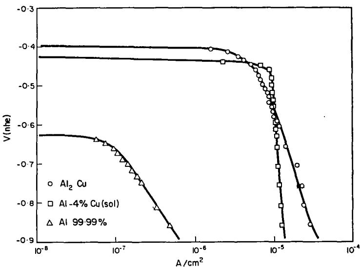  
FiG. 12. Cathodic polarization curves in air-saturated 1M NaCl solution of pure aluminium, solubilized $\mathbf { A l - 4 \% C u } ,$ , and intermetallic $\mathbf { A l _ { \ell } C u } .$

TABLE 2. RELATION BETWEEN PITTING POTENTIALS AND INTERGRANULAR CORROSION IN SOLUTIONS OTHER THAN NaCl
<table><tr><td rowspan="2">Electrolyte</td><td colspan="2">Pitting potentials V(nhe)</td><td>Intergranular  $\mathsf { c o r r o s i o n ^ { * } }$ </td></tr><tr><td>99.99%A1</td><td> $\mathbf { A l - 4 \% C u }$  (solub.)</td><td> $A l { \ - } 4 \% C \equiv$  (aged)</td></tr><tr><td>1M KBr</td><td>-0·42</td><td> $- \ 0 . 2 8$ </td><td> $\yen 6 s \left. 0 { \cdot }40 \right)$ </td></tr><tr><td>1M KI</td><td>- 0·26</td><td> $\mathbf { - \mathbf { 0 . 1 3 } }$ </td><td> $\yen 123$ </td></tr><tr><td> $1 \mathbf { M } \ \mathbf { N a C l O _ { 4 } }$ </td><td>- 0·17</td><td> ${ \bf + 0 . 0 3 }$ </td><td> $\Upsilon \mathrm { e s } \left( - 0 { \cdot } 1 4 \right)$ </td></tr><tr><td> $1 \ M \ N a \ N O _ { 3 }$ </td><td>+1·80</td><td> $+ \ 1 { \cdot } 8 5$ </td><td> $\bf { N o } \left( + \epsilon \mathrm { } 1 { \cdot } 8 5 \right)$ </td></tr><tr><td> $\mathbf { i M N a _ { 2 } S O _ { 4 } }$ </td><td> $> + \ 3 { \cdot } 0$ </td><td> $> + \ 3 { \cdot } 0$ </td><td> $\bf { N o } \left( + \epsilon \mathbf { 3 } { \cdot } \mathbf { 0 } \right)$ </td></tr><tr><td> $1 \mathbf { M } \ \mathbf { H } _ { \mathbf { \ell } } \mathbf { S } \mathbf { O } _ { \mathbf { \ell } }$ </td><td> $> + \ 3 { \cdot } 0$ </td><td> $> + \ 3 { \cdot } 0$ </td><td> $\mathbf { N o } \left( + \mathbf { \sigma } 3 { \cdot } 0 \right)$ </td></tr><tr><td> $0 { \cdot } 1 \mathbf { M } \ \mathbf { N a } \mathbf { I } { 0 } _ { \mathbf { \mathfrak { s } } }$ </td><td> $> + \ 3 { \cdot } 0$ </td><td> $> + \ 3 { \cdot } 0$ </td><td> $\bf { N o } \left( + \epsilon \epsilon ^ { 3 . 0 } \right)$ </td></tr><tr><td>1M Ammonium tartrate</td><td> $> + \ 3 { \cdot } 0$ </td><td> $> + \ 3 { \cdot } 0$ </td><td> $\mathbf { N o } \left( + \mathbf { \sigma } 3 { \cdot } 0 \right)$ </td></tr></table>

\*In parentheseş, potentials at which the intergranular corrosion susceptibility was tested.

As mentioned above pitting of pure Al and of solubilized $A l { - } 4 \% \mathrm { C u }$ was observed in ${ \bf N O } _ { 3 } ^ { - }$ solutions. No intergranular corrosion of the aged $A l { - } 4 \% \mathrm { C u }$ was detected. Aged Al-Cu showed pitting along the grain boundaries (Fig. 13), and the reason for this difference in behaviour could lie in the differences in pitting morphology.s The pits in Al in ${ \bf N O } _ { 3 } ^ { - }$ solutions are hemispherical, while in the other media they were found to be tunnel-like. It seems that in nitrate solutions corrosion starts in the grain boundaries, but cannot spread along the narrow depleted zone as it occurs in $\mathbf { C l O } _ { 4 } ^ { - }$ and in halide solutions.

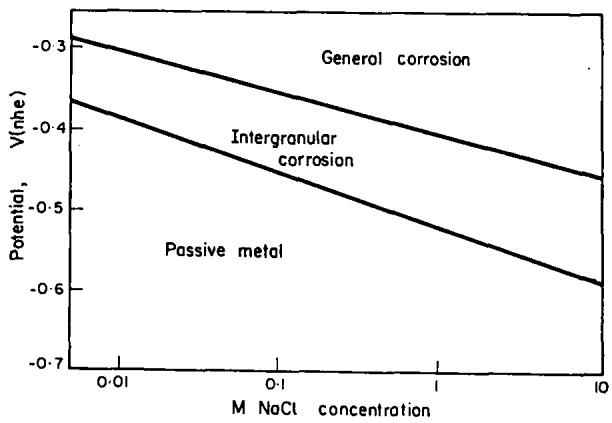  
FiG. 14. Simplified potential-concentration diagram showing the type of attack suffered by aged $A l - \overline { { 4 } } \% C u$

## DISCUSSION AND CONCLUSIONS

The present results show that intergranular corrosion of aged $A l { \ - } 4 \% \mathbf { C } \mathbf { u }$ occurs only in a narrow range of potentials. Figure 14 summarizes the results obtained with aged $\mathbf { A l - 4 \% C u } ,$ ,showing the type of attack expected at different potentials and Clconcentrations. If the metal is maintained in the passive metal region, no intergranular corrosion will occur and the metal will be cathodically protected, although its potential will be more positive than the potential of immunity in the potential-pH diagram for $\bf { A l - H _ { 2 } O }$ . From the old mechanism of intergranular corrosion by anodic and cathodic zones no protection would be expected at potentials higher than about $- \ 2 { \cdot } 0 \ \mathbf { V } ( \mathbf { n h e } ) .$ 24 Nevertheless, it was found in the present work that intergranular corrosion does not occur if the metal is kept in the range — 0·4 V(nhe) to — 0·6 V(nhe), depending on the Cl- concentration of the media. These results apply only to pure NaCl or KCl solutions. If other anions are present in the solution the zones in Fig. 14 should be displaced to higher potentials, this displacement should be equal to that caused to pitting potentials by the same anions.2ª

The behaviour of Al-Cu alloys in natural environments can be explained by the use of the anodic and cathodic polarization curves previously described. Figure 15 shows schematically the anodic and cathodic polarization curves for the Al-Cu system in chloride solutions. $\pmb { A _ { 1 } }$ is the anodic polaiization curve for pure Al and $\mathbf { A l - 0 \cdot 2 \% C u } .$ $\pmb { A _ { 2 } }$ is the anodic polarization curve for solubilized $A l { - } 4 \% \mathbf { C } \mathbf { u }$ and for $\mathbf { A l _ { 2 } C u } , C _ { 1 }$ is the cathodic polarization curve for the Al-Cu alloy in the absence of $\complement _ { 8 } , C _ { 8 }$ is the cathodic polarization curve for pure Al and for $\mathbf { A l - } 0 { \cdot } 2 \% \mathbf { C u }$ in the presence of ${ \bf O _ { 8 } }$ and $c _ { \mathfrak { s } }$ is the cathodic polarization curve for the Cu-rich phases in the presence of $\mathbf { O _ { 2 } }$ . In the absence of $\mathbf { O _ { 2 } } ,$ the corrosion potential of the aged $A l { - } 4 \% \mathbf { C } \mathbf { u }$ alloy will be $\mathbf { { } } E _ { \mathfrak { v } }$ and the alloy will remain passive. $\operatorname { I f } \mathbf { O _ { 2 } }$ is allowed into the system, the corrosion potential will develop to $E _ { 2 } ,$ a little higher than $E p _ { \mathtt { I } }$ . Under these conditions the Cu-rich phase will remain passive and the Cu-depleted zone will corrode. The rate of corrosion of the Cu-depleted zone will be equal to the limiting current of the cathodic reaction of $\mathrm { O } _ { 2 }$ reduction. Hence the higher the $\mathrm { O } _ { 2 }$ content, or the higher the cathodic area, the higher the corrosion rate of the grain boundaries. This explains the influence of the cathodic area on intergranular corrosion found by Colner and Francis.⁵ As for pure Al, the corrosion potential will be given by the intersection of $A _ { 1 }$ and $C _ { 2 } ,$ but due to the "slowness" of the cathodic reaction on pure Al the metal will not show much corrosion.

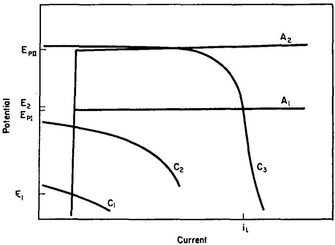  
FiG. 15. Current-potential relations for Al and Al-Cu in chloride solutions. $\pmb { A _ { 1 } }$ : anodic polarization of Al and $\mathbf { A l - 0 . 2 \% C u } ; A _ { 2 } ;$ anodic polarization of solubilized $A l  A \% C u$ and of $\mathbf { A l _ { 8 } C u } ; C _ { 1 } \colon$ cathodic polarization of solubilized $\mathbf { A l - 4 \% C u }$ in absence of oxygen; $\pmb { C _ { \Im } } \colon$ cathodic polarization of pure aluminium in air saturated solutions; $\pmb { C } _ { \pmb { \mathfrak { s } } } \colon$ cathodic polarization of solubilized $\dot { \mathbf { A l } } \mathbf { - } \pmb { 4 } \% \mathbf { C } \mathbf { u }$ in air saturated solution; $\pmb { { \cal E } } _ { 1 }$ : corrosion potential of $\mathbf { A l - C u }$ in deaerated solution; $\pmb { { \cal E } } _ { 8 } ^ { \prime }$ : corrosion potential of aged $\bf { \delta } \mathbf { A l - C u }$ in air saturated solution; $i _ { 1 }$ : limiting current for the cathodic reaction, and dissolution current of thé grain boundaries of the aged Al-Cu alloy.

Summing up, the results of the present work show that intergranular corrosion of Al-Cu alloys is not due to a difference in potentials between grain boundaries and grain bodies, but to a difference in the breakdown potentials of those phases. The mechanism of intergranular corrosion of Al-Cu is found to be of the same nature as the process of pitting of Al. It is concluded that intergranular corrosion of Al-Cu will occur only under the following conditions:

1. The alloy must have a solute-depleted zone along the grain boundaries.

2. The corrosive medium should contain anions capable of breaking down the passivity of the Al.

3. The breakdown potential of the depleted zone must be lower than that of the grain bodies.

4. The corrosion potential of the alloy must be over the breakdown potential of the depleted zone, and under the breakdown potential of the grain bodies.

When the pitting potential is too high, as in the case of nitrate solutions, other factors, like the morphology of pitting, could be important and are being studied at present.

Acknowledgements—We thank the Programa Multinacional de Metalurgia (Programa Regional de Desarrollo Científico y Técnico—O.A.S.) and the Consejo Nacional de Investigaciones Científicas y Teécnicas of Argentina for partial financial support.

## REFERENCES

1. U. R. EvANs, The Corrosion and Oxidation of Metals, p. 670. Arnold, London (1960).

2. H. K. FARMERY and U. R. EvANs, J. Inst. Metals 84, 413 (1955–56).

3. G. V. Akımov, Théories et Méthodes d'Essai de la Corrosion des Métaux, p. 291. Dunod, Paris (1957).

4. R. B. MeARs, R. H. BrowN and E. H. Dıx, Symposium on Stress-Corrosion Cracking of Metals, Philadelphia 1944, p. 323. ASTM-AIME (1945).

5. W. H. CoLNER and H. R. FRANCis, J. electrochem. Soc. 105, 377 (1958).

6. S. J. KETCHAM and W. BeCK, 1st International Congress on Metallic Corrosion, London 1961, p. 647. Butterworths, London (1962).

7. S. J. KETCHAM and F. H. HAYNIE, Corrosion 19, 242t (1963).

8. M. HanseN, Constitution of Binary Alloys, p. 87. McGraw Hill, New York (1958).

9. D. GILROY and J. E. O. MAYNE, J. appl. Chem. 12, 382 (1962).

10. H. KAESCHE, Z. phys. Chem. 34, 87 (1962).

11. A. P. BoND, G. F. BoLLING, H. A. DoMIAN and H. BILONI, J. electrochem. Soc. 113, 773 (1966).

12. JA. M. KoLOTYRKIN, Corrosion 19, 261t (1963).

13. V. HoSPADARUK and J. V. PETROCELLI, J. electrochem. Soc. 113, 878 (1966)

14. J. HoRvATH and H. H. UHLIG, J. electrochem Soc. 115, 791 (1968).

15. H. BöNI and H. H. UHLIG, J. electrochem. Soc. 116, 906 (1969).

16. H. J. ENGELL and N. D. STOLICA, Arch. Eisenhütt Wes. 30, 239 (1959).

17. A. I. AmmAR and S. DARwisH, Electrochim. Acta 13, 781 (1968).

18. T. P. HoAR and W. R. JAcoB, Nature, Lond. 216, 1299 (1967).

19. F. J. BuRGER, V. F. TuLL and P. H. HARRIs, Bull. Inst. Metals 3, 6 (1955–57).

20. C. EDELEANU, J. Inst. Metals 89, 90 (1960–61).

21. C. G. DuNN and R. B. BoLoN, J. electrochem. Soc. 116, 1050 (1969).

22. J. D. GROGAN, J. Inst. Metals 77, 133 (1946).

23. S. M. DE DE MICHELI and J. R. GALVELE, in preparation.

24. M. PouRBAix, Atlas of Electrochemical Equilibria, p. 171. Pergamon Press, Oxford (1966).