PII: S0010-938X(96)00022-4

# THE EFFECT OF PHASE COMPOSITIONS ON THE PITTING CORROSION OF 25 Cr DUPLEX STAINLESS STEEL IN CHLORIDE SOLUTIONS

L. F. GARFIAS-MESIAS,†1 J. M. SYKES‡\* and C. D. S. TUCK‡

† Department of Materials, University of Oxford, Parks Road, Oxford OX1 3PH, U.K. ‡ Langley Alloys Ltd, Alloys House, Cordwallis Park, Maidenhead SL6 7BU, U.K.

Abstract-The effect of annealing temperature on pitting resistance of 25% Cr duplex UNS S32550 was investigated. CPT and pitting potential were determined for this alloy after annealing at 1020, 1060, 1100 and 1 140°C. The higher values of CPT and pitting potential were found after annealing at the lower temperatures. Pitting was always observed preferentially in the ferrite phase. The results can be partially explained by the changes in chemical composition of ferrite and austenite phases. Copyright © 1996 Elsevier Science Ltd

Keywords: A. alloy, A. stainless steel, C. pitting corrosion.

## INTRODUCTION

The development of duplex stainless steels (DSS) has been linked strongly with the increasing requirements of the chemical industry for materials resistance to highly aggressive environments. Duplex stainless steels are widely used in marine environments because of their good resistance to pitting corrosion and stress corrosion cracking. The alloy content and the microstructure are both important variables in determining the pitting corrosion resistance of the DSS. In general, C, P, S and non-metallic inclusions have a negative effect on the pitting resistance, whereas Cr, Mo, N, Si and W are beneficial alloying elements against pitting corrosion. A common way to rank the piting susceptibility in stainless steels is by the use of the pitting resistance number (PREN).¹Indeed, this idea has begun to be applied to duplex steels in recent years.2,3 The PREN is linked to the content of three most important elements Cr, Mo and N, each of them weighted according to its influence on pitting:

$$
\mathrm { P R E N } = \% \mathrm { C r } + 3 . 3 \% \mathrm { M o } + 1 6 \% \mathrm { N }\tag{1}
$$

Although this is a considerable simplification of elemental influences on corrosion resistance, it has been found to be extremely useful as an index of likely alloy performance purely from the alloy chemical analysis.²

The difficulty with duplex steels is that there are two phases present with different compositions, with the three key elements partitioned between them (chromium and molybdenum are enhanced in the ferrite and nitrogen is enhanced in the austenite). Thus, it is clear³ that a PREN for each phase should be calculated, with the actual performance governed by whichever phase gives the lower figure. Bernhardsson³ has calculated from thermodynamic data how increasing the temperature at which the alloy is annealed can change the compositions and proportions of the two phases. These calculations show that, whereas the PREN for ferrite falls with temperature, that for austenite rises, so that there is an optimum annealing temperature where the two PREN curves cross. If PREN provides a reliable measure of pitting resistance then above this temperature pitting is expected to initiate in the ferrite phase and the alloy resistance falls as the PREN for ferrite falls. Below the optimum temperature the PREN of ferrite is improving, but the pitting resistance is limited by the austenite. The latter will have a smaller PREN than ferrite, and it will further fall with decreasing temperature. Solomon and Devine⁴ have discussed how changing the proportions of the two phases influences pitting resistance through altering the phase compositions.

The work described in this paper examines the pitting behaviour of UNS S32550 in chloride solutions, in order to determine how changing the ferrite/austenite ratio influences pitting resistance for a particular duplex steel, to find the optimum annealing temperature for maximum pitting resistance and whether the site of pitting switches from ferrite to austenite above the optimum annealing temperature, as predicted by the theory of Bernhardsson.

## EXPERIMENTAL METHOD

Materials

Alloy of the type UNS S32550 produced in a wrought form were annealed at four different temperatures. Table 1 shows the cast composition of the alloy used.The alloy was solution treated for 2 h using the following temperatures: 1020, 1060, 1100 and 1140°C to vary microstructure (ferrite/austenite ratio) and then water quenched. In order to study the influence of the solution treatment time and quenching method, the sample annealed at 1060°C was also annealed for 5 h followed by water or oil quenching.

Samples were supplied in the form of a bar approximately 10 mm in diameter. The outer part of the bar was removed after annealing by machining to produce samples in the form of rods 8.5 mm in diameter. The end face of each rod (the surface to be tested) was carefully machined to give a smooth finish and further wet ground to 4000 mesh finish then degreased. A few samples were polished to 1 μm finish before testing for metallographic observations and microanalysis. The chemical composition of the different phases was detected by using a Cameca SEMPROBE and using a current of 10 μA at 20 keV. Analysis was made at intervals of 2 μm.

Table 1. Cast composition of UNS S32550 alloy used in the present work
<table><tr><td></td><td></td><td></td><td></td><td colspan="2">Composition (wt%)</td><td></td><td></td><td></td><td></td></tr><tr><td>Cr</td><td>Ni</td><td>Mo</td><td>Cu</td><td>N</td><td>Mn</td><td>Si</td><td>C</td><td>S</td><td>P</td></tr><tr><td>25.92</td><td>5.9</td><td>3.19</td><td>1.62</td><td>0.2</td><td>0.96</td><td>0.47</td><td>0.03</td><td>0.007</td><td>0.024</td></tr></table>

## Critical pitting temperature determination

Critical pitting temperature determination (CPT) test was done using a method similar to the zero resistance amperometry (ZRA) test as suggested by Salinas-Bravo and Newman.5 In the test, two similar duplex stainless steel samples were connected through a sensitive micro-ammeter and the potential of one recorded again a standard calomel electrode (SCE) connected via a high impedance buffer amplifier. The test solution was 250 ml of 10% FeCl3 prepared according to the ASTM G 48 method in a glass cell. To avoid crevices, the cell was arranged so that both specimens could be lowered just to touch the liquid surface with only the end face wetted. This defined the area under test (no attack was ever seen on the sides of the bar), whilst avoiding any crevices. A potential output from the ammeter (1 $\mathbf { \nabla } \mu \mathbf { A } \equiv 1 0 \mathbf { m } \mathbf { V } )$ was used to record the current and the temperature, measured with a digital temperature sensor ic-LM35DZ (accurate $\mathrm { \ t o \ pm 0 . 2 5 ^ { \circ } C ) }$ calibrated within the range $0 { - } 1 0 0 ^ { \circ } \mathbf { C } .$ , and the potential were logged simultaneously on a PC by using a 16 bit ADC Card. In cach test, the CPT was determined by coupling a sample annealed at $1 0 2 0 ^ { \circ } \mathrm { C }$ (which was found to have the highest pitting resistance) with the test sample. The criterion used to determine the CPT of the samples was the temperature at which the current measured increased to a value of $5 \mu \mathbf { A }$ For this work, a heating rate of $0 . 5 ^ { \circ } \mathbf { C }$ min- was chosen. This was sufficiently slow to obtain an accurate CPT.

## Pitting potential determination

Potentiodynamic sweeps in hot 3.5% NaCl solution were carried out at a rate of ${ 1 \mathrm { m V } \mathrm { s } ^ { - 1 } }$ . The tests were carried out in a glass three-electrode cell held in a water bath at $6 5 \mathrm { ^ \circ C }$ In all experiments the rod under test was supported in a holder on the lid of the cell such that the end face just touched the surface of the test solution as described above. The counter electrode was a platinum wire, the reference electrode a saturated calomel electrode (SCE) at the same solution temperature; all potentials are given against the SCE. The potential at which the current density exceeded $5 0 \mu \mathrm { A c m } ^ { - 2 }$ was defined as the pitting potential, $E _ { \mathfrak { p } } .$ After testing, some samples were electrolytically etched for3 s in 40% KOH at applied voltage of 2 V, to allow the ferrite and austenite to be distinguished in the optical microscope, then examined for pits.

## EXPERIMENTAL RESULTS AND DISCUSSION

The effect of annealing temperature on the CPT of the duplex steel is shown in Fig. 1. The plots show the potential of the coupled electrodes against the SCE and the galvanic current between the two electrodes as a function of the temperature. When samples annealed at $1 0 2 0 ^ { \circ } \mathrm { C }$ were first coupled at $2 5 \mathrm { { ^ \circ C } }$ the galvanic current observed was very low, less than 1 $\mu \Lambda$ and constant. Similarly, the potential measured between the galvanic couple and the SCE was constant at about 480 mV. As the temperature was raised, the current was stable until just below the CPT when some small current activity (suggested to be metastable $\mathsf { e v e n t s } ^ { 5 } )$ started to appear until finally the current steadily increased when stable pitting events started. As current transients begin, the potential starts to fluctuate downwards until a steady decrease occurs simultaneously with the increase in the galvanic current between the samples. This simultaneous drop of potential and increase in couple current indicates the onset of pitting and is used to define the CPT. The CPT obtained for sample annealed at $1 0 2 0 ^ { \circ } \mathrm { C }$ was $6 2 . 3 ^ { \circ } \mathrm { C }$

The initial potential of coupled electrodes was changed when a sample annealed at

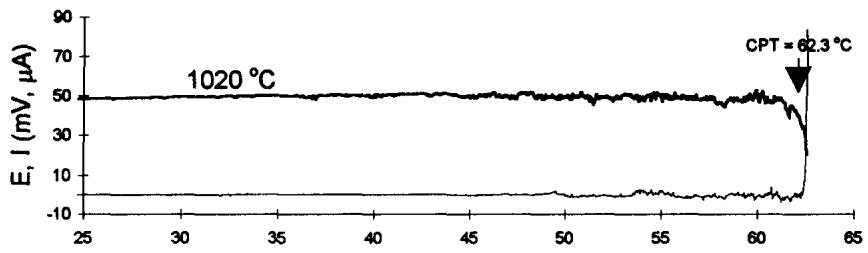

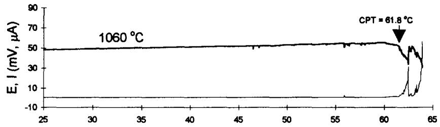

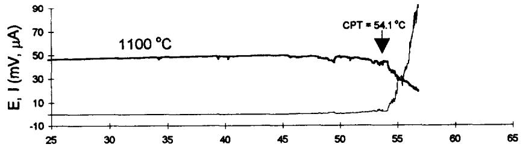

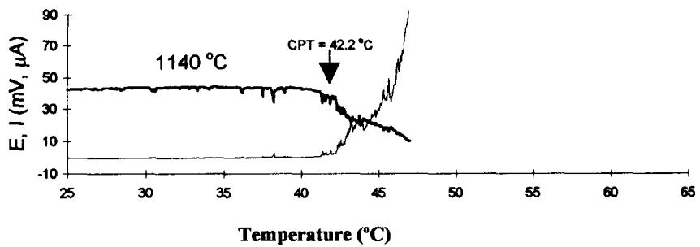  
Fig. 1. The critical pitting temperature of alloy UNS S32550 annealed at temperatures indicated, determined by using the ZRA test. () Potential (mV(SCE) × 10); () current (μA)

$1 0 2 0 ^ { \circ } \mathrm { C }$ was coupled with samples annealed at different temperatures, being 470, 460 and 425 mV (SCE) for samples annealed at 1060, 1100 and $1 1 4 0 ^ { \circ } C$ , respectively.

As the temperature of the solution was increased, the potential of the coupled electrodes and the galvanic current for the samples annealed at 1060, 1100 and $1 1 4 0 ^ { \circ } \mathrm { C }$ followed the same behaviour as described above for sample $1 0 2 0 ^ { \circ } \mathrm { C }$ The sample annealed at the lowest temperature $( 1 0 2 0 ^ { \circ } \mathrm { C } )$ gives the highest CPT value, $6 2 . 3 ^ { \circ } \mathrm { C }$ with a value of $6 1 . 8 ^ { \circ } \mathrm { C }$ for the sample annealed $4 0 ^ { \circ } \mathbf { C }$ higher, at $1 0 6 0 ^ { \circ } \mathrm { C }$ . On increasing the annealing temperature another $4 0 ^ { \circ } \mathbf { C } .$ a very drastic decrease in the CPT results, to the value of $5 4 . 1 ^ { \circ } \mathrm { C }$ for the sample annealed at $1 1 0 0 ^ { \circ } \mathrm { C } .$ A further increase in the annealing temperature $( \tan 1 1 4 0 ^ { \circ } \mathbf { C } )$ , results in a greater decrease in the CPT, to a value of $4 2 . 2 ^ { \circ } \mathrm { C }$ These results clearly showed that at low annealing temperatures (1020 and $1 0 6 0 ^ { \circ } \mathrm { C } )$ the influence of the annealing temperature on the CPT is small. However, at higher annealing temperatures (1100 and $1 1 4 0 ^ { \circ } \mathrm { C } )$ , the influence on the CPT of the alloy is greater. Throughout, the trend is that the lower CPT corresponds with increasing annealing temperature.

The effect of the annealing conditions (time and method of quenching) was studied by determining the CPT for the alloy annealed at $1 0 6 0 ^ { \circ } \mathrm { C }$ This alloy was annealed for 5 h followed by water or oil quenching (Fig. 2). The CPT for the sample annealed for 5 h followed by water quenching showed no difference with the value obtained for the sample annealed during 2 h. However, in the case of the oil-quenched sample, the CPT was $5 8 . 8 ^ { \circ } \mathrm { C }$ $3 \mathrm { ^ \circ C }$ less than the water-quenched.

Potentiodynamic curves for all samples in 3.5% NaCl solution at $6 5 ^ { \circ } \mathbf { C }$ are shown on Fig. 3. This temperature was chosen because it lies above the CPT of all the samples. The passive current was less than $5 \mu \mathbf { A } \thinspace \mathrm { c m } ^ { - 2 }$ . The highest value of pitting potential was obtained for the sample annealed at $1 0 2 0 ^ { \circ } \mathbf { C } \left( E _ { \mathsf { p } } = 3 2 2 \mathsf { m V } \left( \mathbf { S } \mathbf { C } \mathbf { E } \right) \right) ;$ annealing at $1 0 6 0 ^ { \circ } \mathrm { C }$ gave a lower value $( E _ { \mathrm { p } } { = } 2 5 5 \mathrm { m V ) }$ , that for the sample annealed at $1 1 0 0 ^ { \circ } \mathrm { C }$ was even lower $( E _ { \mathsf { p } } = 2 0 9 \ : \mathrm { m V } )$ and that for the sample annealed at $\mathrm { 1 1 4 0 ^ { \circ } C }$ was lowest of all $( E _ { \mathrm { p } } { = } 1 7 6 \mathrm { m V ) }$ . Again, pitting resistance falls with increasing annealing temperature.

When analysing these results, it is very important to know the phase where pitting corrosion occurs. Figures 4 and 5 show the etched surface of the samples annealed at 1020 and $1 1 4 0 ^ { \circ } \mathrm { C }$ after the potentiodynamic sweep. The austenite phase is shown as light grains

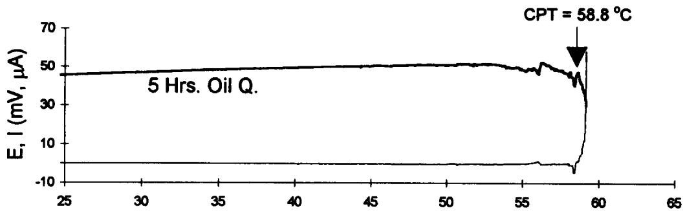

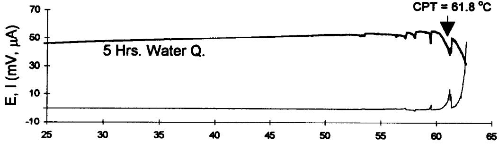  
Fig. 2. The critical pitting temperature of alloy UNS S32550 annealed at $1 0 6 0 ^ { \circ } \mathrm { C }$ and quenched under the conditions indicated, determined by using the ZRA test. () Potential (mV(SCE) × 10); () current (μA)

Potential (mV vs SCE)  
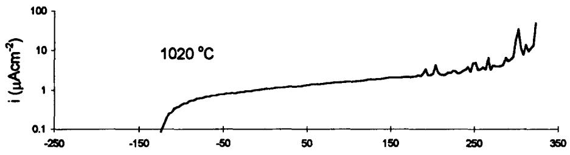

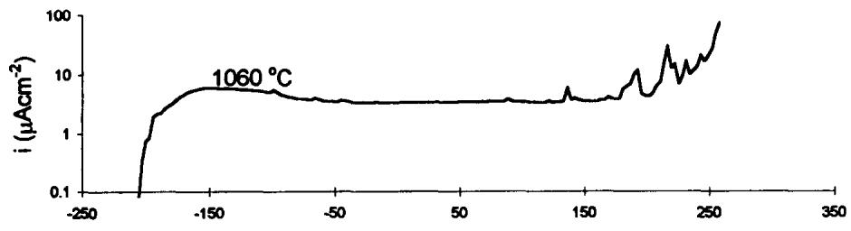

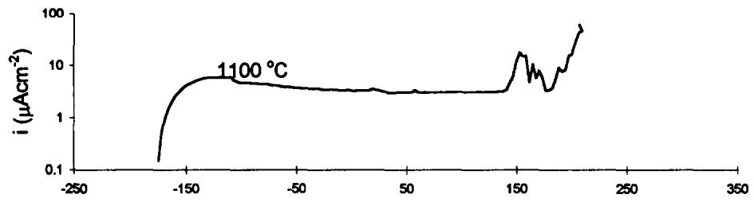

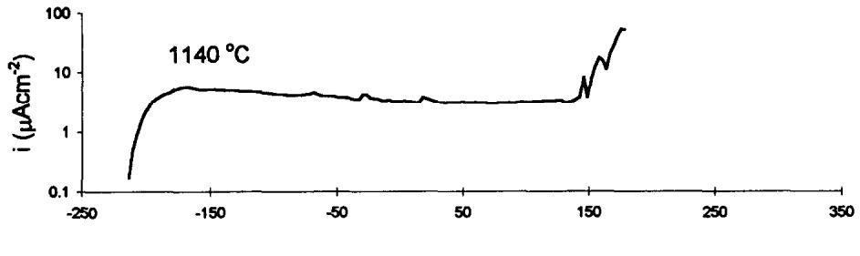  
Fig. 3. Anodic polarization of alloy UNS S32550 in a 3.5% NaCl, annealed at temperatures indicated. Test temperature $6 5 ^ { \circ } \mathrm { C } ,$ scan rate $\mathrm { | } \mathtt { m V } \mathtt { s } ^ { - 1 }$

in a matrix of ferrite (dark in comparison). The size of both the ferrite and austenite grains increases with raising the annealing temperature and the proportion of ferrite increases from 47 to 64%. It was found that for all the samples pitting was initiated in the ferrite or at the ferrite side of the ferrite-austenite boundary.

Analyses of the microstructure of the sample annealed at $1 0 6 0 ^ { \circ } \mathrm { C }$ for 5 h followed by oil quenching showed a small increase in the ferrite content of this sample compared with the water quenched. This small increase in the volume fraction of the weakest phase, could possibly account for the reduction of the CPT in the case of the oil quenched sample.

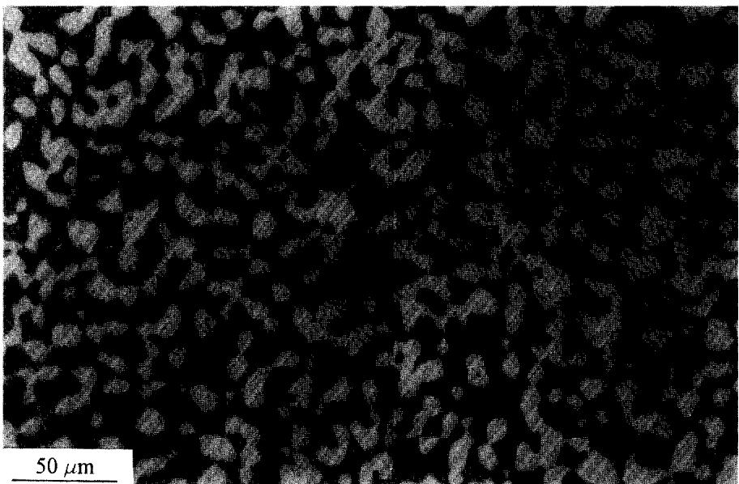  
Fig. 4. A photomicrograph of sample annealed at 1020°C after potentiodynamic test, showing attack on the ferrite matrix (dark phase).

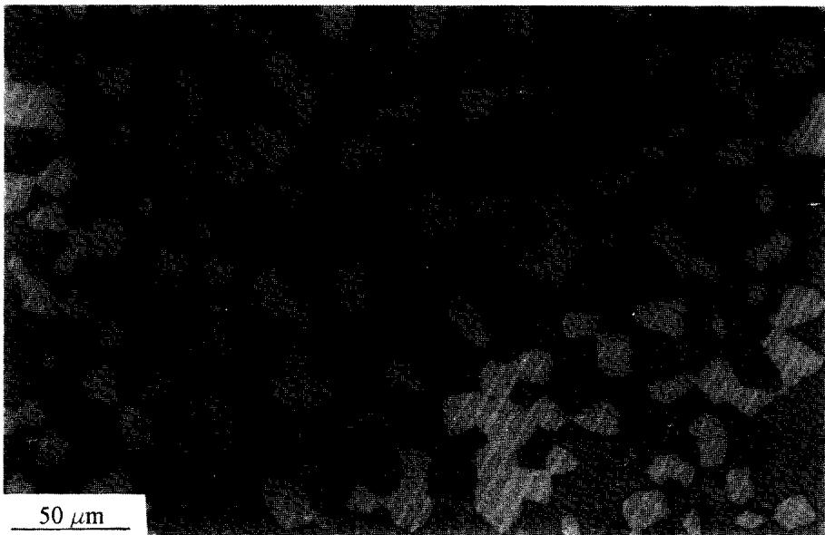  
Fig. 5. A photomicrograph of sample annealed at $1 1 4 0 ^ { \circ } \mathrm { C }$ after potentiodynamic test, showing attack on a localized area in the ferrite matrix (dark phase).

Pitting in the ferrite phase is contrary to the findings of most of previous works already published, where austenite was usually attacked.4,6 In order to assess the relative pitting resistance of the phases their compositions were determined.

The distribution of the alloying elements in samples annealed at 1020 and $1 1 4 0 ^ { \circ } \mathrm { C }$ are shown in Figs 6 and 7. It can be observed that the ferrite grains are larger than austenite grains in the sample annealed at the higher temperature $( > 1 0 \mu \mathrm { m } )$ , whereas in the sample annealed at $1 0 2 0 ^ { \circ } \mathrm { C }$ the austenite grains are just slightly larger than the ferrite. As expected, the composition profiles show that the ferrite grains are enriched in Cr and Mo and depleted in Ni and Cu. Similarly, in the austenite grains the Ni and Cu are enriched, whereas the Cr and Mo signals are lower. All elements were evenly distributed within the grains and no segregation of the alloying elements was noticed. The average composition of the important elements in austenite and ferrite in all four samples annealed at 1020, 1060, 1100 and $1 1 4 0 ^ { \circ } \mathrm { C }$ are shown in Table 2 together with the average bulk composition of the alloy analysed. The levels of N presented in the ferrite have been assumed to be around 0.05% saturation with the rest partitioned to the austenite.²

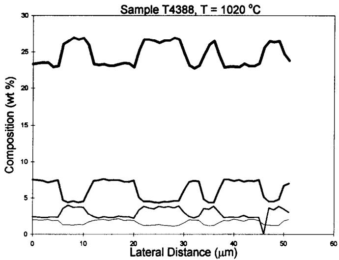  
Fig. 6. The chemical composition profile for sample annealed 2 h at $1 0 2 0 ^ { \circ } \mathrm { C }$ followed by water quenching.

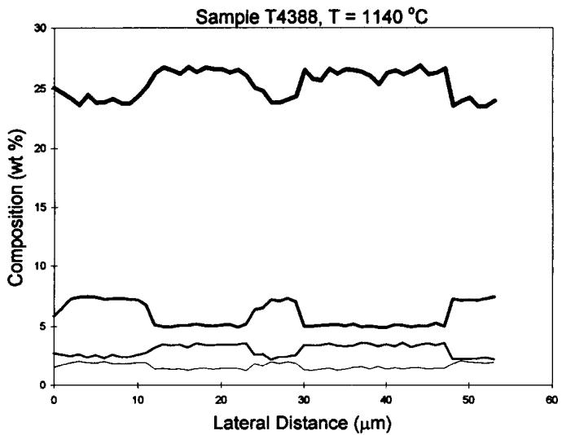  
Fig. 7. The chemical composition profile for sample annealed 2 h at $1 1 4 0 ^ { \circ } \mathrm { C }$ followed by water quenching.

The first important point to discuss is the relative PREN value of the two phases in each sample. The PREN for austenite in sample annealed at $1 0 2 0 ^ { \circ } \mathrm { C }$ (36.23) is lower by more than three units than the value of 39.35 calculated for the ferrite, suggesting that pitting should occur only in austenite, but experimental results showed that pitting is confined to the ferrite in all samples.

The same is true for samples annealed at 1060 and $1 1 0 0 ^ { \circ } \mathbf { C } .$ where the PREN for the ferrite is higher than the austenite by 2.3 and 0.5 units, respectively. Only in the sample annealed at $1 1 4 0 ^ { \circ } \mathrm { C }$ is the PREN of the austenite higher than in the ferrite. As expected, the PREN for the ferrite phase decreases as both the annealing temperature and the ferrite content increases, whereas in contrast, the PREN of austenite increases as the annealing temperature increases.

Figure 8 also shows the plots of the PREN calculated by using the average composition of the alloy (calculated from the analyses shown in Table 2) and the partition coefficients suggested by Charles² compared with the real values calculated directly from the analyses. The calculated values for ferrite and the real values obtained show good agreement at low and high annealing temperatures. The austenite lines shows good agreement at low temperatures, but some deviations at higher temperatures. The discrepancy at high temperatures arises because the partition coefficients of Cr and Mo were found to be sensitive to higher annealing temperatures. At lower annealing temperatures, the partition coefficients are less affected by temperature and are closer to those results reported before.

Table 2. Average composition of ferrite and austenite phases and bulk
<table><tr><td></td><td colspan="10">Composition in wt%</td></tr><tr><td>Annealing temperature</td><td>Phase</td><td>%</td><td>Cr</td><td>Ni</td><td>Mo</td><td> ${ \bf N } ^ { \bf a }$ </td><td>Cu</td><td>S</td><td>P</td><td>PRENb</td></tr><tr><td>1020°C</td><td>Ferrite</td><td>47</td><td>26.36</td><td>4.63</td><td>3.70</td><td>0.05</td><td>1.27</td><td>0.073</td><td>0.043</td><td>39.35</td></tr><tr><td></td><td>Austenite</td><td>53</td><td>23.14</td><td>7.36</td><td>2.35</td><td>0.33</td><td>1.95</td><td>0.035</td><td>0.025</td><td>36.23</td></tr><tr><td>1060℃</td><td>Ferrite</td><td>51</td><td>26.39</td><td>4.69</td><td>3.57</td><td>0.05</td><td>1.31</td><td>0.085</td><td>0.046</td><td>38.96</td></tr><tr><td></td><td>Austenite</td><td>49</td><td>23.26</td><td>7.24</td><td>2.33</td><td>0.36</td><td>1.85</td><td>0.037</td><td>0.027</td><td>36.64</td></tr><tr><td>1100℃</td><td>Ferrite</td><td>60</td><td>26.39</td><td>4.83</td><td>3.38</td><td>0.05</td><td>1.34</td><td>0.074</td><td>0.042</td><td>38.34</td></tr><tr><td></td><td>Austenite</td><td>40</td><td>23.44</td><td>7.15</td><td>2.30</td><td>0.43</td><td>1.84</td><td>0.042</td><td>0.022</td><td>37.82</td></tr><tr><td>1140℃</td><td>Ferrite</td><td>64</td><td>26.37</td><td>5.05</td><td>3.36</td><td>0.05</td><td>1.36</td><td>0.082</td><td>0.038</td><td>38.26</td></tr><tr><td></td><td>Austenite</td><td>36</td><td>24.04</td><td>7.15</td><td>2.33</td><td>0.47</td><td>1.83</td><td>0.037</td><td>0.027</td><td>39.19</td></tr><tr><td>Average</td><td>Both phases</td><td>一</td><td>25.06</td><td>5.89</td><td>2.97</td><td>0.20</td><td>1.57</td><td>0.060</td><td>0.035</td><td>38.06</td></tr></table>

¹Nitrogen in ferrite is taken as the saturation value ≈0.05%, the rest partitions to austenite.2

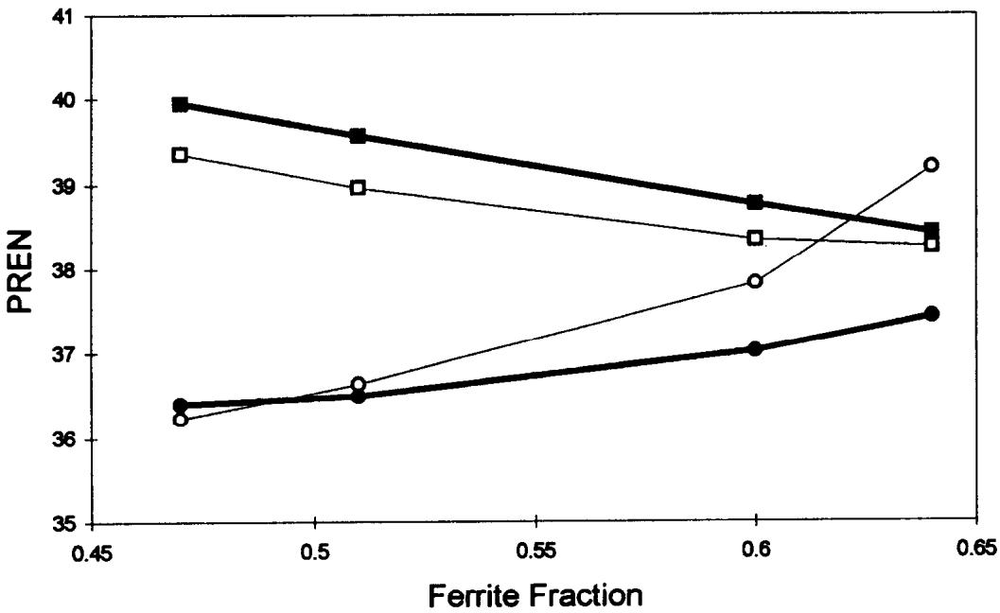  
Fig. 8. Calculated PREN values, using equation (1), for austenite and ferrite from theoretical and experimental values of Cr and Mo content.

It has been clearly shown that the pitting resistance of this duplex stainless steel decreases as the annealing temperature is increased consistent with the decreasing PREN for ferrite; this can be associated with the lower levels of the important alloying elements Mo and Cr which partition preferentially to the ferrite, but are diluted as the total concentration of ferrite increases.

The important question is whether pitting occurs in ferrite because austenite has higher pitting resistance than predicted, or because that for ferrite is lower.

The difference in relative resistance of ferrite and austenite might be influenced by the presence of high levels of Cu in the austenite (Table 2) which has been shown to enhance the pitting resistance of austenitic and duplex stainless steels.7-9 Cu has been suggested to improve the pitting resistance of DSS in acid environments,′ and the combination of Cu and N is believed to enhance corrosion resistance.8 Further work is in hand to assess experimentally the effect of Cu in the pitting resistance of these steels. On the other hand, the high levels of sulphur in the ferrite, which are more than double that in the austenite, probably reduces the pitting resistance of the ferrite phase. Similarly, the presence of phosphorus, which also has been suggested to have detrimental effects on the performance of these alloys,1º is higher in the ferrite than in the austenite. Therefore, pitting susceptibility of the ferrite phase may be reduced, relative to the austenite. Certainly, a weighting factor of — 123 applied to phosphorus and sulphur in PREN calculations,1º could account for preferential pitting of ferrite, but would imply poor performance rather than high pitting resistance, as shown here.

A full explanation of this behaviour may also require consideration of synergy between elements, rather than considering single elements in isolation. One weakness of the PREN approach is that it fails to take such effects into account. Lu et $a l . ^ { 1 1 }$ have shown a strong synergism between molybdenum and nitrogen in austenitic stainless steel. In these duplex steels molybdenum levels are highest in the ferrite, but nitrogen levels are much lower than in austenite. These enhanced levels of nitrogen could increase the potency of molybdenum such that a lower level of molybdenum actually has greater pit inhibiting power than the higher molybdenum content in the ferrite. Further work is needed to establish whether this synergism alone can account for the improved pitting resistance of the austenite phase

## CONCLUSION

1. The pitting potential and CPT of UNS S32550 duplex stainless steel are strongly influenced by the solution treatment temperature. Raising the annealing temperature lowers both parameters. The maximum CPT reached was $6 2 ^ { \circ } \mathbf { C }$ , obtained by annealing 2 h at 1020°C followed by water quenching.

2. Pitting corrosion of UNS S32550 in chloride solutions takes place preferentially in the ferrite phase rather than in the austenite phase.

3. High annealing temperatures (above $1 0 6 0 ^ { \circ } \mathrm { C } )$ increase the ferrite content and dilute the key alloying elements in the ferrite lowering the corrosion resistance of the ferrite.

4. PREN calculated from bulk composition is unlikely to be a good guide to assess pitting resistance of duplex stainless steels; a better understanding can be achieved through calculating PREN values for the two phases.

5. At low annealing temperatures, the partition coefficients of the alloying elements are in good agreement with those reported before.² Some deviation from these values is observed at higher annealing temperatures (higher ferrite contents).

6. PREN values for austenite and ferrite calculated from bulk analysis using known partition coefficients can provide a useful first approximation in assessing pitting resistance.

7. Additional factors beyond the concentration of Cr, Mo and N may need to be considered to fully understand the relative pitting resistances of austenite and ferrite. These could include levels of other beneficial elements such as copper, levels of harmful elements such as sulphur or phosphorus and synergism between elements such as nitrogen and molybdenum.

Acknowledgements—The authors would like to thank Langley Alloys Ltd for funding, provision of samples and permission to publish this research and Professor D. G. Pettifor for the provision of the laboratory facilities. One of the authors, L. F. Garfias-Mesias would like to thank the Consejo Nacional de Ciencia y Tecnologia (CONACyT. Mexico) for the financial support. We would like to acknowledge Dr O. Khaselev for useful discussions and Mr C. Salter for analyses of the samples in the Cameca SEMPROBE.

## REFERENCES

1. K. Lorenz and G. Medawar, Thyssen Forsch. 1, 97 (1969).

2. J. Charles, Proc. Duplex Stainless Steel Conf., Beaune France, p. 3 (1991).

3. S. Bernhardsson, Proc. Duplex Stainless Steel Conf., Beaune, France, p. 185 (1991).

4. H. D. Solomon and T. M. Devine, Duplex Stainless Steels (ed. R. A. Lula), p. 693. American Society for Metals (1983).

5. V. M. Salinas-Bravo and R. C. Newman, Corros. Sci. 36, 67 (1994).

6. J. O. Nilsson and A. Wilson, Mater. Sci. Technol. 9, 545 (1993).

7. P. Guha and C. A. Clark, Duplex Stainless Steels (ed. R. A. Lula), p. 355. American Society for Metals (1983).

8. P. Combrade and J. -P. Audouard, Proc. Duplex Stainless Steel Conf., Beaune, France, p. 257 (1991).

9. A. A. Hermas, K. Ogura, S. Takagi and T. Adachi, Corrosion 51, 3 (1995).

10. R. Dölling, V. Neubert and P. Knoll, Proc. Duplex Stainless Steel Conf., Beaune, France, p. 1341 (1991).

11. Y. C. Lu, M. B. Ives and C. R. Clayton, Corros. Sci. 35, 89 (1993).