# THE EFFECT OF ALLOY COMPOSITION ON THE LOCALIZEDCORROSION BEHAVIOR OF Ni­Cr­Mo ALLOYS

# A Dissertation Presented in Partial Fulfillment of the Requirements for the Degree Doctor of Philosophy in the Graduate School of The Ohio State University

By Fariaty Wong, M.S.

\*\*\*\*\*

The Ohio State University

2009

Dissertation Committee:

Prof. Rudy Buchheit, Advisor

Approved by

Prof. Gerald Frankel

Prof. John Morral

Prof. Jiyan Ma

Advisor Graduate Program in Materials Science and Engineering

Copyright by

Fariaty Wong

2009

## ABSTRACT

Ni­Cr­Mo alloys are one of the most versatile Ni­based alloys because they resist corrosion in a variety of environments. This versatility is due to the combination of Cr and Mo additions to the alloy. These alloying elements complement each other in producing a highly corrosion resistant alloy. The concentration of the elements in the alloy establishes the corrosion behavior of these alloys. In this study, Ni­Cr­Mo alloys with varying composition were studied using electrochemical methods. The dependency of pitting corrosion on the alloy chemistry was captured in empirical models that roughly rank the pitting susceptibility of the Ni­Cr­Mo alloys studied.  The same type of model was also constructed for capturing the effect of alloy composition on the repassivation potential. It was found that these models were specific in terms of alloying element effects on the type of environments exposed to the alloys particularly, pH and temperature. The addition of chromium was shown to contribute to the higher pitting potential on the Ni­Cr­Mo alloys in neural chloride environment while molybdenum was dominant in acidified chloride solutions. In regards to the repassivation potential, both chromium and molybdenum affect the repassivation potential more or less evenly in neutral pH

solutions. Under low pH high temperature conditions, molybdenum content has a greater effect on the repassivation potential value than chromium.

Stabilization of localized corrosion is increasingly difficult as alloying element content increases. However, metastable pitting occurs in most alloys and the metastable pitting behavior of several Ni­Cr­Mo alloys was studied through potentiostatic analysis. Higher chromium and molybdenum contents decreased the metastable pitting incidence; although, the effect of Mo content was observed to be more dominant. Molybdenum additions were found to suppress the growth of the metastable pits. The growth rate of the fastest growing pits was also reduced by increasing the Mo content. Chromium affects the metastable pits during the repassivation process where higher Cr content produces faster repassivation rates.

The last part of the study addressed the role of alloying additions on the repassivation behavior of Ni­Cr­Mo alloys. Alloys with similar Mo content but higher Cr or higher Ni contents exhibited higher repassivation potentials. Higher Mo­containing alloys were shown to be very corrosion resistant since they did not experience any localized corrosion after rigorous polarization tests given that enough Cr was present. The repassivation potential was determined by the surface overpotential and thermodynamic contribution. XPS analysis found evidence of Cr(III) oxide as the main passivating agent. Molybdenum species primarily Mo(VI) and Cr(III) hydroxide were detected on the crevice attack area and on layer of films that formed from transpassive dissolution of higher Cr or higher Mo­containing alloys.

Dedicated to my wonderful parents, brother, and Rich

## ACKNOWLEDGMENTS

I would like to thank my advisor, Prof. Rudy Buchheit for all the guidance and support. On top of everything, I greatly appreciate your sympathy and patience during the passing of my father and my father in law.  I would also like to thank Prof. Jerry Frankel. Thank you for all your advice and encouragement during my study here. My gratitude also goes to Prof. John Morral for the guidance and patience to be a part of my advisory committee.

Thanks to all FCC members. Particularly, Dr. Youngseok Kim, Ajit Mishra, Federico Gambina, Dr. Santi Chrisanti, Dr. Kevin Ralston. I would also like to express my gratitude to Brian Welk, Daniel Huber, Dr. Davion Hill and Jonathan Orsborn for helping me fabricating my alloys. Thanks to Dr. Belinda Hurley for all the help with XPS. Special thanks to Prof. Joe Payer and Case Western University for providing us the funding for the project.

Finally, I would like to thank my family for all the love and support especially, to my Father, who had always been supportive of me. Dad, this is for you. To my Mom, thank you for being so understanding and being such a wonderful mother. Thanks to my brother for all his inspirations and advice. I would also like to thank my in­laws, Cheryl and Rich, thank you for being such great in­laws. Lastly, I would like to thank my husband, Rich, for being so supportive and for always being there for me.

## VITA

June 2003… …B.S. (Materials Science and Engineering)   
The Ohio State University, Columbus, OH   
March 2004… …M.S. (Materials Science and Engineering)   
The Ohio State University, Columbus, OH   
September 2004 – present……… …...Ph.D. (Materials Science and Engineering)   
The Ohio State University, Columbus, OH

## PUBLICATIONS

1. R.G.Buchheit, H.Guan, S.Mahajanam, F.Wong, Progress in Organic Coatings 47 (2003) p. 174.

2. F. Wong, R.G. Buchheit, Progress in Organic Coatings 51 (2004) p. 91.

## FIELDS OF STUDY

Major Fields:  Materials Science and Engineering

## TABLE OF CONTENTS

ABSTRACT   
DEDICATION… …iv   
ACKNOWLEDGMENTS… ..v   
VITA… ...vi   
LIST OF TABLES… ….xi   
LIST OF FIGURES ..xiii   
CHAPTERS:   
1. INTRODUCTION…   
2. LITERATURE REVIEW… ..5   
2.1  INTRODUCTION… ..5   
2.2  PASSIVITY AND LOCALIZED CORROSION… .6   
2.2.1 Pitting Corrosion… …9   
2.2.2 Metastable Pitting… …11   
2.2.3 Crevice Corrosion… …12   
2.3  LOCALIZED CORROSION OF STAINLESS STEELS ..15   
2.3.1 Metastable and Stable Pitting Corrosion of Stainless Steels… ...15   
2.3.2 Crevice Corrosion of Stainless Steels… ..17   
2.3.3 The Alloying Effect on the Corrosion Behavior of Stainless Steels… …18   
2.3.3.1 Chromium and Molybdenum Additions 18   
2.3.3.2 Other Alloying Additions .20   
2.4  LOCALIZED CORROSION OF Ni­BASED ALLOYS …21   
2.4.1 Pitting Corrosion of the Ni­Based Alloys 22   
2.4.2 Metastable Pitting of Ni­Based Alloys 23   
2.4.3 Crevice Corrosion of Ni­Based Alloys 24   
2.4.4 Repassivation Behavior in Ni­Based Alloys 26   
2.4.5 Dissolution Kinetics .27   
2.5  THE EFFECT OF ALLOYING ADDITIONS ON THE CORROSION   
BEHAVIOR OF Ni­BASED ALLOYS …30   
2.5.1 Chromium. .30   
2.5.2 Molybdenum. .32   
2.5.3 Other Alloying Elements .34   
2.5.3.1 Tungsten .34   
2.5.3.2 Iron .35   
2.5.3.3 Copper …35   
2.6  UNRESOLVED ISSUES ..36   
2.6.1  Statistical Approach for Metastable Pitting of Ni­based Alloys .36   
2.6.2 Dissolution Kinetics of Ni­based Alloys .36   
2.6.3 The Inhibition Mechanism ofMolybdenum 37   
2.6.4 Molybdenum Synergistic Effect with Other Elements …37   
3. CORRELATIONS BETWEEN THE LOCALIZED CORROSION BEHAVIOR OF   
Ni­Cr­Mo ALLOYS AND ALLOYING COMPOSITION AT VARIOUS   
TEMPERATURES AND pH .56   
3.1  INTRODUCTION . .56   
3.2  EXPERIMENTAL PROCEDURES ..58   
3.3  RESULTS AND DISCUSSION.. .60   
3.3.1 Stainless Steel Pitting Resistance Equivalency Number (PREN). .60   
3.3.2 Cathodic Polarization Response of the Ni­Cr­Mo Alloys in Neutral Chloride   
Solution. ..61   
3.3.3 Anodic Polarization Response and Microstructural Analysis of the Ni­Cr­Mo   
Alloys in Neutral Chloride Solution .61   
3.3.4 Pitting Susceptibility in Neutral Chloride as a Function of Temperature .......63   
3.3.5 PREN­like Concept for Ni­Based Alloys in Neutral Chloride Condition.......64   
3.3.6 Correlation between Repassivation Potential and Alloy Composition in   
Neutral Chloride Condition .68   
3.3.7 $\mathrm { E _ { p } }$ and $\mathrm { E _ { r p } }$ Equations on Acidified Chloride Condition. .69   
3.4  CONCLUSIONS 70   
4. THE EFFECT OF COMPOSITION ON THE METASTABLE PITTING OF Ni­Cr­  
Mo ALLOYS IN CHLORIDE SOLUTION 90   
4.1  INTRODUCTION .90   
4.2  EXPERIMENTAL PROCEDURES ..93   
4.3  RESULTS AND DISCUSSION. .94   
4.3.1 Metastable Pits Growth, Repassivation, and Kinetics. ..94   
4.3.2 Metastable Pits Radii and Pit Stability . ..99   
4.3.3 Summary of Results from the Cumulative Distribution Plots… .102   
4.4  CONCLUSIONS .103   
5. THE EFFECT OF ALLOYING COMPOSITION ON THE REPASSIVATION   
BEHAVIOR OF Ni­Cr­Mo ALLOYS .123   
5.1  INTRODUCTION . .123   
5.2  EXPERIMENTAL PROCEDURES ..127   
5.3  RESULTS AND DISCUSSION. .128   
5.3.1  Potentiodynamic­Galvanostatic­Potentiodynamic (PD­GS­PD) Results......128   
5.3.2 Voltage Component Analysis… …130   
5.3.3 XPS Analysis .. .133   
5.3.4 Quantification of XPS Results… .136   
5.4  CONCLUSIONS .138   
6. CONCLUSIONS AND FUTURE WORK… .160   
6.1  CONCLUSIONS .160   
6.2  FUTURE WORK .163   
BIBLIOGRAPHY… ..165

## LIST OF TABLES

Table Page   
2.1: Compositions of Ni­based alloys that are discussed in this chapter. All in weight   
percent… 49   
3.1: Composition of the Fabricated Ni­Cr­Mo Alloys in Wt.%. The bold and italicized   
numbers are the composition of the alloys that are corrosion resistant in this   
study… ..83   
3.2: Regression Analysis Equations for Pitting Potential $\mathrm { ( E _ { p } ) }$ in mV as a Function of   
Alloying Content in Neutral Chloride Condition at Various Temperatures……..84   
3.3: Regression Analysis Equations for Repassivation Potential $\mathrm { ( E _ { r p } ) }$ in mV as a   
Function of Alloying Content in Neutral Chloride Condition at Various   
Temperatures .85   
3.4: Regression Analysis Equations for Pitting Potential $\mathrm { ( E _ { p } ) }$ in mV as a Function of   
Alloying Content in Acidified Chloride Condition at Various Temperatures…..86   
3.5: Regression Analysis Equations for Repassivation Potential $\mathrm { ( E _ { r p } ) }$ in mV as a   
Function of Alloying Content in Acidified Chloride Condition at Various   
Temperatures .87   
4.1: Details of the alloying composition of the Ni­Cr­Mo alloys studied… ..120   
5.1: Alloy composition of the studied Ni­Cr­Mo alloys separated by their Mo content   
..156   
5.2:  Summary of the results from the XPS spectra of the Ni­Cr­Mo alloys………...157

## LIST OF FIGURES

Figure Page   
2.1: A schematic anodic polarization that shows an active­passive transition behavior   
[3]… ..39   
2.2: A simplified Pourbaix diagram of iron­water system at $2 5 \mathrm { { ^ \circ C } }$ with concentration   
of the dissolved species of $1 0 ^ { - 6 }$ mol/l [1] .40   
2.3: A schematic reactions occurring at a growing pit in iron metal showing an   
autocatalytic process [3]… 41   
2.4: A typical metastable pitting current transients at a constant potential for 302 SS   
[26] .42   
2.5: Sequence of events for two crevice stabilization theories/models (Adapted from   
[38]) .43   
2.6: An iron Pourbaix diagram superimposed with chromium showing an expanding   
passivity region as shaded area is $\mathrm { C r } _ { 2 } \mathrm { O } _ { 3 }$ [3]… .44   
2.7: Cyclic polarization curves of Alloy C­276 with ${ \mathrm { N a C l } } { \mathrm { : } } { \mathrm { H } } _ { 3 } { \mathrm { P O } } _ { 4 }$ ratio variations at   
$9 5 \mathrm { { ^ \circ C } }$ [68]… 45   
2.8: Cumulative number of metastable events of Alloy 625 and C­22 at the applied   
potentials of 5 $\mathrm { m V _ { A g / A g C l } }$ (a) and ­25 $\mathrm { m V _ { A g / A g C l } }$ (b) showing variation with   
temperature [10].. .46   
2.9: Anodic curves of Alloy G­3, 625, and C­276 in a simulated crevice environment   
[55] .47   
2.10:  Polarization curves of Ni, Cr, Mo, and Alloy 625 in deaerated solution at pH 10   
showing the similarity between pure Cr and Alloy 625 passive behavior [90]….48   
3.1: A ternary diagram that maps the composition of the fabricated and commercially   
available Ni­Cr­Mo alloys .72   
3.2: Cathodic polarization curves of the fabricated Ni­Cr­Mo alloys in 0.5 M NaCl   
solution at $6 0 \mathrm { { ^ \circ C } }$ show consistency on the cathodic behavior. The cathodic curves   
are separated into 3 groups: (a) PREN from 30 to 55, (b) PREN from 56 to 75,   
and (c) PREN from 76 to 105 …73   
3.3: Anodic polarization curves of Ni­Cr­Mo alloys with PREN value from 30 to 55 in   
0.5 M NaCl at $6 0 \mathrm { { } ^ { \circ } C }$ ..74   
3.4: SEM pictures of Ni­Cr­Mo alloys with PREN value of between 30 and 55 after   
anodic polarization in 0.5 M NaCl at $6 0 ^ { \circ } \mathrm { C }$ . Alloy with lower chromium (a)   
shows open pits while alloy with lower molybdenum (b) shows corrosion   
products formed on top of the pits. …75   
3.5: Anodic polarization curves of Ni­Cr­Mo alloys with PREN value from 56 to 75 in   
0.5 M NaCl at $6 0 \mathrm { { } ^ { \circ } C }$ ..76   
3.6: SEM pictures of Ni­Cr­Mo alloys with PREN between 56 and 75 after anodic   
polarization in 0.5 M NaCl at $6 0 \mathrm { { } ^ { \circ } C }$ . Alloy with very low chromium (a) shows   
severe uniform corrosion including an intergranular­like corrosion. Alloy with   
lower chromium but moderate molybdenum (b) shows pitting. Alloy with   
moderate amount ofchromium and molybdenum shows no noticeable corrosion   
(c) ..77   
3.7: Anodic polarization curves of Ni­Cr­Mo alloys with PREN value from 76 to 105   
in 0.5 M NaCl at $6 0 \mathrm { { } ^ { \circ } C }$ ..78   
3.8: SEM pictures of Ni­Cr­Mo alloys with PREN value between 76 and 105 after   
anodic polarization in 0.5 M NaCl at $6 0 ^ { \circ } \mathrm { C }$ . Alloy with very low chromium (a)   
shows an intergranular­like and pitting corrosion. Alloy with higher chromium   
and molybdenum (b) shows no sign ofcorrosion ..79   
3.9: Plots of the experimental pitting potentials (Ep­exp) of the Ni­Cr­Mo alloys in 0.5   
M NaCl as a function of PREN at various temperatures: (a) $4 5 ^ { \circ } \mathrm { C } ,$ (b) $6 0 ^ { \circ } \mathrm { C } ,$ , (c)   
$7 5 ^ { \circ } \mathrm { C } ,$ (d) $9 0 \mathrm { { } ^ { \circ } C } .$ The solid line represents the calculated PREN value of Alloy C-  
22, which is 65 ...80   
3.10:  A ternary diagram that shows the composition maps of some Ni­Cr­Mo alloys that   
are corrosion resistant, and some that are susceptible to severe corrosion (uniform   
type of corrosion) and localized corrosion (pitting) .81   
3.11:  Contoured ternary diagrams that show the experimental pitting potentials (a),   
calculated pitting potentials (b), and the value difference between them (c) in mV   
showing the accuracy of the $\mathrm { E _ { p } }$ equation, which is obtained through multiple   
linear regressions, in predicting the pitting potential based on Cr and Mo weight   
percentages only. The calculated pitting potentials are based on $\mathrm { E _ { p } }$   
=11.14(wt.%Cr) +5.47(wt.%Mo) +214.09. The environment was 0.5 M NaCl at   
$6 0 \mathrm { { } ^ { \circ } C }$ 82   
4.1: Anodic polarization curves of the Ni­Cr­Mo alloys in 0.5M NaCl at $9 0 \mathrm { { } ^ { \circ } C }$ ..105   
4.2: Current transients of the Ni­Cr­Mo alloys in 0.5M NaCl at $9 0 \mathrm { { } ^ { \circ } C }$ with potential   
hold at 0.2 $\mathrm { V } _ { \mathrm { S C E } }$ 106   
4.3: Individual metastable pitting analysis shows the 3 different repassivation behavior   
of the Ni­Cr­Mo alloys: rapid repassivation (a), 2­stage repassivation (b), and   
interrupted repassivation (c) 107   
4.4: The number of metastable events normalized by area and time seems to decrease   
with an increasing Cr and Mo content .108   
4.5: Cumulative distribution plots of the peak current values of the metastable pits   
show that increasing Mo content reduces the metastable pit peak current (a). In   
the varying Cr content group (b), the peak current values are quite similar   
between the two alloys .109   
4.6: Cumulative distribution plots of metastable pit growth time for varying Mo group   
(a) and varying Cr group (b) show little variation .110   
4.7: Cumulative distribution plots of metastable pit repassivation time for varying Mo   
(a) and varying Cr (b) indicate the discrepancy between group I and group II   
maximum repassivation time values 111   
4.8: Cumulative distribution plots of metastable pit growth rates for Group I (a)   
showing some variation at higher percentage values, and Group II alloys (b)   
showing no variation 112   
4.9: The repassivation rate cumulative distribution plots showing faster rates for   
higher Cr content alloys in group I (a) and also group II (b) ..113   
4.10:  Cumulative distribution plots of metastable pit radius show that the pit size is   
smaller for higher Mo­containing alloys (a) and also for the higher Cr­containing   
alloy at higher cumulative percentage values (b) .114   
4.11:  The cumulative distribution plots of the metastable pits peak current density   
(ipeak) showing alloys with higher Mo contents have slightly lower max ipeak   
values in group I (a). Small variation is seen in group II (b) .115   
4.12:  The cumulative distribution plots of $\mathrm { I _ { p e a k } / r _ { p i t } }$ for all five Ni­Cr­Mo alloys   
examined in this study suggest that the pits formed during electrochemical testing   
were not stable .116   
4.13:  Median peak current, $\mathrm { { I _ { p e a k } } } .$ , values is shown to decrease as the Mo content   
increases .117   
4.14:  The values of the peak growth rate $\left( \mathrm { I _ { p e a k } / t _ { g } } \right)$ at the 95% CP shows a decreasing   
trend as the Mo content in the alloy increases .118   
4.15:  The median repassivation rate $\left( \mathrm { I } _ { \mathrm { r e p a s s } } / \mathrm { t } _ { \mathrm { r } } \right)$ values increases with the Cr content in the   
alloy .119   
5.1: Polarization curves of the lower Mo content group showing evidence of localized   
corrosion after the PD­GS­PD polarizations in acidified chloride mixture at   
$9 0 \mathrm { { } ^ { \circ } C }$ .140   
5.2: A significant drop in potential is observed on all three alloys during the 2­hour   
galvanostatic test at $1 0 0 \mu \mathrm { A } / \mathrm { c m } ^ { 2 }$ .141   
5.3: Polarization curves for higher Mo alloys showing no indication of localized   
corrosion after PD­GS­PD polarizations in acidified chloride mixture at   
$9 0 ^ { \circ } \mathrm { C } .$ 142   
5.4: Galvanostatic hold of the higher Mo alloys at $1 0 0 \mu \mathrm { A } / \mathrm { c m } 2$ for 2 hours showing   
the stability of the potential .143   
5.5: Voltage components of the lower Mo alloys indicating the influence of $\varepsilon _ { \mathrm { r } }$ and $\varepsilon _ { \mathrm { s } }$ in   
determining the repassivation potential of the alloys. .144   
5.6 XPS spectra of Ni­23%Cr­12%Mo alloy at the “x” position of the sample (a).   
Carbon peak is found at around 285.7 eV while Mo peaks are not seen (b).   
Oxygen and Cr(III) oxide peaks are shown(c) while Ni peak is not found during   
the scan (d) 145   
5.7: XPS specra of the Alloy C­22 at the crevice attack labeled “x” (a). Molybdenum   
are present in elemental, Mo(IV), and Mo(VI) oxidation states (b). Chromium(III)   
oxide and hydroxide peaks are shown (c). Ni scan shows no Ni peak (d)..…...146   
5.8: XPS specra of the Ni­30%Cr­13%Mo after the electrochemical test showing some   
formation of yellow­ish layer on the surface.  Analysis is done on the “x” spot (a).   
Molybdenum species are present in elemental, Mo(IV), and Mo(VI) oxidation   
states (b). Chromium(III) oxide and hydroxide peaks are shown (c). Ni scan   
shows a strong Ni elemental peak (d) ..147   
5.9: XPS specra of the Ni­20%Cr­21%Mo after the electrochemical test showing some   
formation of blue­ish layer on the surface.  Analysis is done on the blue layer “x”   
spot (a). Molybdenum is present in Mo(VI) oxidation state only (b).   
Chromium(III) oxide and hydroxide peaks are present (c). Ni scan shows no   
evidence of Ni peak (d). ..148   
5.10:  XPS specra of the Ni­20%Cr­21%Mo after the electrochemical test showing some   
formation of blue­ish layer on the surface.  Analysis is done on the bare “x” spot   
(a). Molybdenum species are absent in this spot (b). Chromium(III) oxide peak is   
observed(c). Ni scan shows no evidence of Ni peak (d) ..149   
5.11:  XPS specra of the Ni­20%Cr­25%Mo after the electrochemical test showing some   
formation of blue­ish layer on the surface.  Analysis is done on the blue layer   
denoted “x” (a). Molybdenum are present as elemental, Mo(IV), and Mo(VI)   
oxidation states (b). Chromium(III) oxide and hydroxide peaks are present (c).   
Ni scan shows a weak Ni elemental peak (d).. ..150   
5.12:  Quantification of the XPS peaks of Mo­elemental and Mo(IV) species with   
respect to the (Cr+Mo) content showing the presence of both Mo species on the   
crevice site and highest Cr and Mo­containing alloys .151   
5.13:  Quantification of the XPS peaks of Mo(VI) with respect to (Cr+Mo) content   
showing the presence of Mo(VI) on the crevice site and layers that formed   
through transpassive dissolution of the higher Cr and Mo­containing alloys.....152   
5.14:  Quantification of the XPS peaks of Cr(III)­oxide with respect to the (Cr+Mo)   
content showing the dependency of the amount of Cr(III)­oxide present to the   
bulk Cr content .153   
5.15:  Quantification of the XPS peaks of Cr(III)­hydroxide with respect to the (Cr+Mo)   
content showing the presence of this species on the crevice site and layers formed   
on higher Cr and higher Mo­containing alloys …154   
5.16:  Quantification of the XPS peaks of Ni elemental with respect to (Cr+Mo) content   
showing the presence of Ni0 2p peaks on higher (Cr+Mo) content alloys   
only.… ….155

## CHAPTER 1

## INTRODUCTION

Ni­Cr­Mo alloys are among the most corrosion resistant materials available for use in engineering design. The addition of Cr into steels has been known to improve corrosion properties lending to stainless steels (SS) [1]. Cr acts by forming a passive film that protects the substrate in aggressive environments [1,2]. Mo additions promote corrosion resistance even further. 316 SS is said to have higher pitting potential and lower passive current density in chloride environments than 304 SS owing to the presence of Mo [3].

Nickel alloys are known to be more resistant than stainless steels to stress corrosion cracking, and to chloride induced attack such as, pitting and crevice [4]. Nickel is also alloyed with Cu, Cr, Mo, W, and Fe [5]. Each alloying addition has its own role so that desired sets of properties are achieved.  A combination of Cr and Mo has been shown to produce a Ni alloy that can resist corrosion in oxidizing acid and reducing acid solutions [5,6]. In Ni­Cr­Mo alloys, Cr is known to provide protection through formation of passive films [5]; thus, it is responsible for the overall passivity of the alloys [7]. The

role of Mo on the other hand, is less clear.

The first objective of this study was to characterize the pitting and repassivation response of a range of Ni­Cr­Mo alloys to develop an empirical correlation that characterizes the effect of composition on localized corrosion behavior. The second objective was to study the role of Cr and Mo on the metastable pitting characteristics of Ni­Cr­Mo alloys. The last objective aimed to characterize the repassivation behavior of the Ni­Cr­Mo alloys once a localized attack stabilized.  X­ray photoelectron spectroscopy (XPS) was used for surface characterization of the repassivated alloys.

This dissertation consists of six chapters including the current chapter as an introduction. Chapter 2 is a literature review that provides a comprehensive review that focused on the role of alloying elements in Ni­based alloys including their localized corrosion characteristics particularly, pitting and crevice attack. Chapter 3 examines the effect of Cr and Mo on the pitting and repassivation potentials at different temperatures and pHs. Mathematical expressions that correlate the pitting and repassivation potentials to alloying content were constructed.

Chapter 4 shows the metastable pitting characteristics of Ni­based alloys with varying Cr and Mo contents. Metastable pit growth, repassivation, and kinetics were analyzed according to their alloying content. Chapter 5 addresses the role of Cr and Mo on the repassivation behavior. The Ni­Cr­Mo alloys were exposed to a crevice­inducing solution to promote a localized attack, and the repassivation response of the alloys with varying Cr and Mo content was investigated.  Voltage component analysis was performed to characterize the total potential drop between the reference electrode and the dissolving metal surface.  Surface characterization through XPS was performed to detect the presence of Ni, Cr, and Mo species.

Chapter 6 concludes the findings from this study regarding the role of alloying elements on the corrosion behavior of Ni­Cr­Mo alloys. Some future work has been suggested to further the knowledge of this topic.

## REFERENCES

1. A. J. Sedriks, Corrosion ofStainless Steels, John Wiley and Sons, New York, NY (1996).

2. D. A. Jones, Principles and Prevention of Corrosion, Prentice Hall, Upper Saddle River, NJ (1996).

3. J. M. Bastidas, C. L. Torres, E. Cano and J. L. Polo, Corrosion Science, 44, 625 (2002).

4. P. Crook, Corrosion of Nickel and Nickel­Base Alloys, ASM International, Materials Park, OH (2005).

5. P. Crook and D. Klarstrom, Introduction to Alloys Resistant to Aqueous Corrosion, ASM International, Materials Park, OH (2005).

6. W. Z. Friend, Corrosion of Nickel and Nickel­Based Alloys, John Wiley and Sons, New York, NY (1980).

7. J. R. Hayes, J. J. Gray, A. W. Szmodis and C. A. Orme, Corrosion, 62, 491­500 (2006).

## CHAPTER 2

## LITERATURE REVIEW

## 2.1  INTRODUCTION

Passive alloys such as Al alloys, SS, and Ni­based alloys have exceptional corrosion resistance due to their ability to form protective passive films. The composition and thickness of the passive film are determined by many factors including base metal, passivation potential, time, electrolyte composition, and temperature [1]. Although these alloys are very corrosion resistant after the passive film is formed, they are susceptible to localized corrosion once film is damaged or ruptured. Localized corrosion can occur at a rapid rate and is often difficult to detect and can lead to unexpected and catastrophic failure [2]. Some of the more common types of localized corrosion are pitting, crevice corrosion, intergranular corrosion, stress corrosion cracking and hydrogen embrittlement [2,3].

The degree of passivity is highly influenced by alloy composition. Stainless steel is a classic example of passivity enhanced by alloying. The alloy is “stainless” because addition of Cr in an amount greater  than 12  wt.% to iron significantly improves the corrosion resistance of the  alloy [4]. Chromium  and  molybdenum are  well­known for promoting passivity, mostly when added to iron and nickel alloys [5­13]. Because of the importance of passivity as a  means of corrosion control in engineering  alloys, it is essential to have a detailed understanding how alloying elements affect passivity and its breakdown.

The purpose of this chapter is to give a comprehensive review of the literature on pitting and crevice corrosion of SS and mostly, Ni­Cr­Mo alloys. The main topic will be on the effect of alloying elements on the pitting and crevice corrosion in Ni­Cr­Mo alloys. Classic papers that are the building blocks for the current pitting and crevice studies will be reviewed. The metastable pitting phenomenon and its relationship to stable corrosion will also be  discussed.  The  variation in repassivation behavior and  dissolution kinetics will be  reviewed  to further  understand  the  role  of the  elements once a  localized  attack occurred. Some  unresolved  issues in this subject will be  pointed  out  at the  end  of the chapter.

## 2.2  PASSIVITY AND LOCALIZED CORROSION

Spontaneous formation of a thin passivating oxide, which is sometimes hydrated is the foundation of electrochemical passivity and high corrosion resistance for many

metals and alloys [1]. Passive metals or alloys are usually used in corrosive environments because passivity reduces the dissolution rate by orders of magnitude, and significantly reduces the tendency for localized corrosion [1,3,14]. Passive films are comprised of oxide or oxyhydroxide compounds with thicknesses of few nanometers [1,2,14]. The classic notion of a passive film is one with protective “barrier” layer oxide that is formed by oxidation on the metal surface, and an outer layer that is an insoluble compound comprised of a phase precipitated from solution [2,3,15]. Protective passivity is attributed to the “barrier” layer component of the film.

In electrochemical measurements, passivity is denoted by a rapid fall in the current density when the material is anodically polarized [15]. Figure 2.1 illustrates a typical anodic polarization curve that shows a transition from active to passive behavior in a metal. The transition takes place at the $\mathrm { E _ { p p } } { } _ { : }$ , which is the primary passive potential, and a critical current density, $\mathrm { i } _ { \mathrm { c r i t } } .$ Above this potential, the metal becomes passive, and the degree of passivity is defined by the passivation current density, $\mathrm { i } _ { \mathrm { p a s s } } .$ Passivation is acquired when the metal surface is covered with the passivating film that essentially is comprised of metal oxide, $\mathrm { M _ { x } O _ { y } }$ [1]. In the transpassive region, the current density increases due to the breakdown of the passive film because the potential is high enough to oxidize certain elements in the film [16]. At very high potentials (not depicted in Figure 2.1), oxygen evolution takes place. In some cases like stainless steels and Crbearing nickel alloys, the transpassive region might overlap with the oxygen evolution region [3,14].

A Pourbaix diagram, which is represented by potential versus pH, provides useful information regarding regions of stability for different species of a metal [17]. Figure 2.2 is a Pourbaix diagram for iron in water at $2 5 \mathrm { { ^ \circ C } }$ [1]. In the domain of metallic stability, Fe is thermodynamically stable and immune to corrosion. Corrosion is possible in the dissolution region where soluble ions, $\mathrm { F e } ^ { 2 + }$ and $\mathrm { F e } ^ { 3 + }$ , are stable. When the metal is exposed to an environment with potential­pH values in the oxide formation region, the metal exhibits passivity by forming $\mathrm { F e } _ { 3 } \mathrm { O } _ { 4 }$ or ${ \mathrm { F e } } _ { 2 } { \mathrm { O } } _ { 3 } .$ , and the corrosion rate is reduced tremendously. While the Pourbaix diagram gives thermodynamic indication of reduced corrosion rate, it does not provide specific kinetic information, e.g., dissolution rates [1,3].

The disadvantage of using passive metals is that they are susceptible to localized corrosion such as, pitting and crevice once their passive film ruptures resulting in a locally accelerated attack. The breakdown of the passive film has been the subject of many corrosion studies [1,14,15,18,19]. Although, it is to be noted that passive film rupture does not inevitably lead to pitting or crevice [19].

The occurrence of passive film breakdown is marked by a rapid increase in current density. When the breakdown occurs at a more active potential, it is most likely caused by localized corrosion stabilization. On the other hand, when the breakdown appears at a more noble potential, transpassive dissolution might be the cause of the prompt current density increase [3,4]. During transpassivity, some elements in the passive film begin to oxidize to higher valence species and get dissolved into the solution due to higher solubility than the original species that form the passive film [20]. A

current density increase from transpassive dissolution however, does not usually cause material failure as it would in the case of localized attack.

## 2.2.1 Pitting Corrosion

There are three stages in the pitting process: pit initiation, metastable pitting, and stable pit growth [1,21]. The term pitting corrosion is typically referred to as the stable pit growth stage. The presence of certain aggressive species like chloride and aggressive environments, i.e. low pH, are essential to pit initiation; however, the actual mechanism of initiation is not well understood [2,3,16].

Pitting is an autocatalytic process meaning that once a pit is nucleated, the environment inside the nucleated pit favors continued propagation for pit growth [1,21]. Once a pit forms, dissolved oxygen is more accessible outside the pit, while inside the pit oxygen becomes depleted resulting in a separation of anodic (in the pit) and cathodic (at the passive film) reactions [1,3,21]. The existence of an insoluble cap/cover promotes the autocatalytic reaction to occur because it preserves a critical environment within the pit by hindering the transport of metal cations out, while allowing Cl ­  migration in creating a high, and presumably aggressive chloride concentration to develop in the pit [3]. Chloride ions migrate in to offset positive charge accumulation due to metal cation enrichment in the pit [3,21]. The environment inside the pit becomes acidic as cations hydrolyze causing a decrease in pH according to the following reaction [3]:

$$
\mathrm { M } ^ { 2 + } + 2 \mathrm { H } _ { 2 } \mathrm { O }  \mathrm { M } ( \mathrm { O H } ) _ { 2 } + 2 \mathrm { H } ^ { + }\tag{Eqn 2.1}
$$

Thus, metal dissolution is further accelerated in the pit environment due to an increase in the H + concentration implying a decrease in pH and an increase in chloride concentration [1]. The whole process is schematically depicted in Figure 2.3.

The metal hydrolysis reaction in the pit is the base for the pit acidification theory by Galvele [22]. This theory states that there is a minimum degree of pit acidification that corresponds to a critical value of the product of pit depth and pit current density, x i, needed for sustained pit dissolution. At the critical x.i value, a sudden change of pit chemistry takes place signified by a significant increase of metal cation concentration and apparent decrease of pH. Thus, from this theory, one can determine the required current density to maintain pits with a given size x. Galvele’s theory is not entirely applicable for the case where local chloride concentration is more important than local pH in determining pit stability as is the case in stainless steels [21]. Nonetheless, chloride concentration does approximately scale with local pH; thus, the critical x i concept is useful in estimating the tendency for pit stability in stainless steels [21].

The work of Sato also invokes the idea of critical chemistry determining the stability of growing pits [19]. He stated that stable pits are obtained when the local ion concentration buildup within the pit sites exceeds a critical ion concentration for stability. Below this critical value, the pits are unstable and will repassivate. Similar to Galveles critical acidification model, Sato states that the local ion concentration is proportional to the product of pit dissolution and pit size.

Pitting is found to be sensitive to metallographical features including inclusions, second phase particles, and surface defects [3,4]. Inclusions such as manganese sulfide in stainless steels have been reported to be detrimental to corrosion resistance [23,24]. Formation of second­phase particles is usually harmful for the alloy because pitting is more likely to initiate at areas near the second phase particles due to localized alloying element segregation [4,25].

## 2.2.2 Metastable Pitting

Metastable pits are commonly viewed as precursors to stable pits [21,26,27] and crevices [10,28]. The routine observation of metastable pitting suggests that stable pits go through and survive a period of metastability. Metastable pitting can be detected as current transients, which occur below the pitting potential. Figure 2.4 is an example of current transient due to metastable pitting on 302 SS. During the current increase, passive film breaks down but then repassivates back as indicated by the drop in current. This type of current transient can be observed during a potentiostatic test below the pitting potential. The life of metastable pitting is usually in a matter of seconds. During the lifetime of metastable pits, they exhibit constant current density [26].

When the metastable pit just formed, the pit size is too small to present a diffusion barrier sufficient to create an aggressive environment to form a stable pit [23]. Metastable pits are believed to have porous or perforated covers of metal or corrosion product that hinder the mass transport of ions but still allow the development of aggressive environment inside the pit [23,26]. When the cover ruptures and the pit size is still not big enough to act as a diffusion barrier, the electrolyte in the pit becomes diluted causing repassivation [23,26]. According to Frankel et al., a stable pit is formed if the cover stays for a sufficient time to allow salt film to precipitate [26], while Pistorius and Burstein suggest that a pit is stable when the pit has grown adequately to use its own depth as a diffusion barrier [23]. In the context of these arguments, metastable pitting is viewed as a necessary but not a sufficient condition for stable pitting since perforated covers and salt film precipitation are also needed for pit stability [29].

To initiate a crevice, the metastable pit has to form within a crevice prone area [30]. Crevice corrosion might also occur through the coalescence of a band of metastable pits formed at a critical depth [10].

A metastable pitting process is characterized by three stages: initiation, growth, and repassivation [26,31,33]. Therefore, parameters that are used to examine metastable pitting behavior include peak current, pit growth time, pit repassivation time, pit size, and peak pit current density [33,34]. Due to the stochastic nature of metastable pitting, cumulative distribution plots of these parameters are frequently used to gain a better understanding on the susceptibility of the alloys to stable pitting. Some studies have been conducted for the purpose of establishing criteria that determine the transition from metastable to stable pitting [27,32].

## 2.2.3 Crevice Corrosion

The mechanism for crevice corrosion is similar to that of pitting corrosion. The cathodic reaction for crevice takes place outside the crevice region due to depletion of oxygen in the crevice solution indicating a spatial separation between cathodic and anodic reactions [35]. A decrease of pH occurs locally in the crevice region due to metal cation hydrolysis while cation enrichment inside the crevice attracts Cl  from the bulk solution [3]. The aggressive environment in the crevice causes passive film to break down leading to rapid dissolution inside the crevice. The main requirement for crevice corrosion is an occluded area, often created by design in engineered structures [2]. Chloride enhances crevice corrosion but its presence is not required. This is different than pitting where chloride or other aggressive ions are required [2]. Crevice attack usually appears at potentials lower than pitting potentials [3].

Oldfield and Sutton introduced a quantitative mathematical model for the initiation stage of crevice corrosion in stainless steels [35]. The model is used to predict the decrease in pH within the crevice as a function of time until the pH reaches a limiting value due to a mass transport limitation or a critical pH that causes breakdown and alloy dissolution. They used a term called critical crevice solution (CCS) which is defined in terms of pH and chloride concentration. According to their model, the two influencing parameters for an alloy’s resistance are CCS and passive current density. Passivity breakdown followed by crevice corrosion occurs when the limiting crevice solution is more aggressive than the CCS.

Determining the CCS is the fundamental criterion for this model. In their study [36], CCS is arbitrarily chosen to be an active current peak of $1 0 \mu \mathrm { A } / \mathrm { c m } ^ { 2 }$ . The limitation of this model is the fact that they only considered migration as a method of mass transport in and out of the crevice even though a concentration gradient and convection might also present within the crevice.

Pickering on the other hand, established the potential drop or IR drop model for crevices [37]. Current drop across the crevice solution resistivity causes the potential at the bottom of the crevice to be lower than the outside. IR drop, passivation potential, and solution composition are the three key parameters in this model. A critical IR drop denoted by $\mathrm { I R } ^ { * }$ is the difference between the potential outside the crevice, which is in the passive region, and the passivation potential below which the metal is active; thus, if the IR drop between the outside and inside the crevice is greater than $\mathrm { I R } ^ { * }$ , the crevice is stable.

The composition of the solution is important due to its effect on the potential values, i.e $\mathrm { I R } ^ { * }$ and IR drop within the crevice.  This model treats the crevice solution similar to the bulk solution at pH close to the equilibrium pH for hydrolysis of cations accumulated in the crevice solution. The constraints from this model are that none of the mass transport methods (migration, diffusion, and convection) are taken into account. Furthermore, for an active­passive system, ohmic potential drop may stabilize pit/crevice growth due to a decrease in potential that brings the system to an active state.  However, this potential drop may instead destabilize crevice in a spontaneously passive system where active region does not exist because a drop in the potential would give a lower dissolution rate [2].

A schematic drawing that summarizes the two crevice stabilization theories is presented in Figure 2.5 [38]. The chemistry change model represents the Oldfield and Sutton model [35,36] while the potential change model is Pickering’s IR drop model [37].

## 2.3  LOCALIZED CORROSION OF STAINLESS STEELS

Stainless steels are one of the most important corrosion resistant alloys in commercial use. They are materials of construction for the chemical, petroleum, and power industries [4] due to their passive behavior in many environments. According to the Pourbaix diagram of iron (Figure 2.2), Fe is passive at higher pH. By adding Cr, the passivity region is expanded as illustrated in Figure 2.6. The diagram shows the passive film stability in stainless steels goes from pH around 2 to the alkaline region. Passivity is obtained mostly due to the formation of few nanometers of microcrystalline chromium oxide $\left( \mathrm { C r } _ { 2 } \mathrm { O } _ { 3 } \right)$ that is very protective and adherent to the passive film [39]. Other alloying elements such as, Ni, Mo, and N have also been observed to improve the corrosion resistance of SS [4,6,39,51,54,57,58].

Pitting and crevice corrosion of SS will be discussed in the succeeding subchapters followed by the role of alloying elements especially, Cr and Mo in affecting their corrosion behavior. The whole purpose of this discussion is to compare the corrosion behavior of SS to Ni­based alloys, particularly Ni­Cr­Mo alloys, since both materials have similarities in corrosion resistance tendencies.

## 2.3.1 Metastable and Stable Pitting Corrosion of Stainless Steels

A pitting process in SS is strongly influenced by the presence of inclusions, second phase particles, and defects [4,24,25,40,42]. MnS inclusions in SS are

electrochemically more active compared to the rest of the matrix; thus, in the presence of chloride ions, these inclusions act as pit initiation sites [4]. Some literature suggests that there are compositional changes or even Cr depletion around the MnS inclusions [41], while others have shown measurements indicating that those claims are inaccurate, or at least not to be generalized for stainless steels [24,40]. Formation of s phase, which is rich in Cr and Mo, in a duplex stainless steel is also detrimental where the a/s or g/s phase boundary becomes the initiation site for metastable pitting due to the depletion of Cr and Mo around the s phase [25]. Similarly in austenitic SS, the presence of sigma or chi phases that contain higher Cr and Mo than the matrix have been shown to lower pitting potential with the attack occurring at the phase boundary [4].

Pitting events in stainless steels are also very much affected by chloride concentration [23] and surface roughness [43]. Metastable pitting events are observed to decrease as the chloride concentration decreases [23]. Deeper and narrower pits are more readily activated for a certain chloride concentration; however, these types of pits make chloride transport difficult resulting in deactivation [23]. The pH of the electrolyte is found to have no effect on the frequency of metastable pitting [23]. In terms of surface roughness, a smoother surface reduces metastable pitting due to a reduced number of sites available for nucleation [43]. In a somewhat contrary statement, Burstein and Pistorius claimed that once a metastable pit had formed, the pit had a better chance of surviving and becoming stable on a smoother surface due to more open site characteristics that allowed better diffusion [43].

Pitting can be inhibited by the presence of anion inhibitors such as chromates [44,45], molybdates [44], bicarbonates [46,47], phosphates [45], sulfates [45], and nitrates [45]. These inhibitors reduce the number of pitting events and pit propagation rates of both metastable and stable pitting [44, 46]. As a result, the alloys have wider passivity range since pitting corrosion is shifted to more noble values and the repassivation rate of propagating pits increases [47]. The mechanism of the inhibition is often suggested to involve competitive adsorption and repair of a protective film on the metal surface [48].

## 2.3.2 Crevice Corrosion of Stainless Steels

The probability of crevice corrosion increases with increasing potential and/or increasing chloride concentration [28]. A highly alkaline bulk solution extends the amount of time necessary to initiate crevice corrosion because a larger chemistry change is required to reach the CCS; in addition, it is observed that corrosion potential of stainless steel tends to be lower in alkaline environments resulting in an extension in the passivity region [49].

Laycock et al. examined the crevice initiation of 316L SS (Fe­18wt.%Cr-10wt.%Ni­3wt.%Mo), and surface examination showed that the crevice corrosion of stainless steel initiates near the crevice mouth instead of the center [28]. This does not agree with the Oldfield and Sutton chemical change model, which predicts the crevice to initiate near the center due to low pH [35,36] . 316L SS is also observed to be spontaneously passive eliminating the possible potential drop model unless a very

aggressive environment is developed locally [28]. Apparently, the best model to describe the crevice corrosion initiation of 316L SS is the stabilization of metastable pitting by the occluded crevice geometry by Stockert and Boehni [30]. The metastable pitting model provides the best agreement with the experimental crevice corrosion data performed by Laycock, et al. [28].

## 2.3.3 The Alloying Effect on the Corrosion Behavior of Stainless Steels

## 2.3.3.1  Chromium and Molybdenum Additions

Alloying elements play very important roles in determining corrosion resistance of alloys. The role of Cr and Mo in pitting corrosion of austenitic SS is shown to increase resistance to pitting by shifting the pitting potential in the noble direction [4]. Each element contributes uniquely in building the corrosion resistance of SS.

The presence of Cr is known to play a significant role in creating passivity in SS mainly through formation of chromium oxide layer [4,50,51]. A critical threshold value of Cr concentration exists where a minimum amount of Cr is needed to provide sufficient passivity in ferrous alloy. This value is reported to be 11wt.% [4] to 12wt.% [52] . Below those values, the ferrous alloy is found to behave more like iron. Another benefit of adding Cr is the fact that Mo seems to participate in improving the corrosion resistance of the alloys in the presence of Cr [21,48].

Chromium protection comes from formation of chromium oxide in the passive film. How molybdenum element provides corrosion protection is however less clear. Whether Mo is incorporated in the passive film is uncertain [5,6,53]. Some reports claim that the contribution of Mo in affecting the pit solution chemistry is probably insignificant [29], others report Mo ions when the stainless steel is polarized close to the pitting potential [5] and find Mo to be enriched in the surface film of an active area [21,53]. Several ideas have been proposed to explain the mechanism of Mo protection in SS as will be addressed below.

Boucherit, et al. studied the influence of Cr and Mo elements on pitting corrosion of 316 SS by Raman spectroscopy [6]. They detected the presence of an outer molybdate layer in the passive film. Mo and Cr were said to act in synergy. When the passive film broke, the molybdate became a protective inner layer while the outer green rust layer consisted of bichromate ions that fill in the sites that might be occupied by Cl . A reduction in the ingress of chloride resulted in a decrease in corrosion rate. Another study has suggested that the presence of Mo as an alloying element in stainless steel has reduced the nucleation and propagation of metastable and probably stable pits due to formation of insoluble molybdates that reduce the free metal ion production inside the pit [9]. The idea of the presence of molybdates during active pitting or crevice in SS is criticized due to the fact that molybdates are thermodynamically stable only at higher pH and higher potential values than are found in acid pits and crevices [13,55].

Another possible mechanism for Mo inhibition would be the precipitation of a Mo­rich oxide on the pit walls causing a reduced dissolution rate and promote metastable pit repassivation [54]. However, Newman stated that it is less likely for Mo to inhibit active dissolution in an oxide form or in a dissolved form, i.e. ${ \mathrm { M o } } ^ { 3 + }$ , since iron can

dissolve faster than Mo [51]. Hence, he believed that the elemental form of Mo is responsible for the inhibition.

Other work suggested that chemical interactions involving Mo lead to enhanced corrosion resistance. One study suggests that increased corrosion resistance is due to the formation of Mo­chloro­complexes, which decrease the amount of free Cl  available on the surface [5]. Other studies point to a possible Mo ion interaction with otherwise detrimental adsorbed sulfur as the origin of improved pitting resistance of SS exposed to sulfate solutions [13].

The benefits of Cr and Mo alloying additions in Fe­base alloys for promoting corrosion resistance are well documented, however, it is to be noted that adding too much of Cr and Mo has an adverse effect on alloy performance. Cr metal is brittle and large fractions of Cr in alloys make the alloy brittle [3]. Addition of Mo beyond its solubility limit causes the formation of second phase precipitates, which themselves embrittle and reduce pitting resistance [4].

## 2.3.3.2  Other Alloying Additions

Reports on the effect of Ni additions on the corrosion resistance of SS are mixed. Ni additions to SS have been reported to decrease the depassivation pH and reduce the dissolution rate in the active regime leading to improved corrosion resistance; particularly crevice corrosion resistance [56]. Others have observed an increasing critical pitting potential with an increasing Ni content [52] while some have seen that Ni provides no added benefit to corrosion resistance [6].

Nitrogen alloying has also been found to inhibit active dissolution in stainless steels [4,57,58]. A study by Palit et al. found that N alloying in 316L stainless steel extended passivity, inhibit active dissolution, but introduce metastable pitting [58]. They also observed an enrichment of N, Cr and Ni on actively grown pits while Fe was depleted. The beneficial effect of N is apparently greatly improved in the presence of Mo suggesting a synergistic effect between them [4,57].

## 2.4  LOCALIZED CORROSION OF Ni­BASED ALLOYS

Nickel has a face­centered cubic (FCC) crystal structure with higher solubility towards most elements compared to the body­centered cubic iron [3]. This makes it easy to alloy nickel without having to worry about formation of intermetallic particles that might reduce corrosion resistance of the alloy. FCC nickel is easily formed and does not exhibit a ductile to brittle transition as the temperature falls [3].

Most nickel alloys are more corrosion resistant than stainless steels in reducing acids, more stress corrosion cracking resistant, and more resistant to chloride­induced pitting and crevice corrosion [7,59]. Nickel alloys are among just a few materials that can handle hot hydrofluoric acid solutions [59]. Pure nickel itself is known to have excellent resistance against corrosion in caustic solutions [7,60]. The disadvantage of using nickel alloys instead of stainless steels is cost. In some alloys, Fe additions are made not because they contribute to improvement in properties, but because they lower the Ni content and lower unit cost. Table 2.1 represents the composition of the Ni­base alloys that are discussed in this paper.

## 2.4.1 Pitting Corrosion of the Ni­Based Alloys

Pitting potentials of Ni­based alloys show a strong dependence on chloride concentration, especially when the concentration is greater than $1 0 ^ { - 3 } \mathrm { { M } }$ [60]. Pitting is also strongly temperature­dependent. The higher the temperature the more likely pitting would occur [61]. For the case of Alloy 625, the corrosion products inside the pits consist mainly of Cr, Mo, and Nb. Ni and Cl  are almost undetectable [62,63]. Above a certain temperature, the morphology of the pitting attack changes to shallow pits and a more uniform attack is observed indicating transpassive dissolution [62,63].

Many fabrication processes including cold rolling and welding alter the mechanical and corrosion properties of the alloy. In Ni­base alloys including Alloy C­22, exposure to temperatures of $6 0 0 \mathrm { { } ^ { \circ } C }$ to $9 0 0 ^ { \circ } \mathrm { C }$ promotes precipitation of carbides or secondary phases such as, m and P phases [64,65]. Formation of these phases is deleterious to corrosion resistance. Like stainless steels, the area adjacent to the precipitates can be depleted of beneficial elements (like Mo and W) causing this area to be susceptible to corrosion. It is noted that the corrosion rate of welded Alloy C­22 increases with increasing temperature [65].

The composition and structure of the passive film are also known to influence the pitting resistance of Ni­base alloys. Amorphous passive films are associated with increased pitting potential, while crystalline passive films are associated with decreased pitting potential. The reduced pitting potential is attributed to the presence of lattice defects such as dislocations and grain boundaries that are pathways for ions to diffuse in or out through the film [66,67]. Hence, formation of crystalline film at high temperatures could be the cause of the fall of pitting potential as susceptibility to pit nucleation is enhanced [66].

Cyclic polarization of Alloy C­276 conducted in mixed NaCl and $\mathrm { H } _ { 3 } \mathrm { P O } _ { 4 }$ solutions at $9 5 \mathrm { { ^ \circ C } }$ are shown in Figure 2.7 [68]. The curves show no sign of stable pitting attack on Alloy C­276 at these environments. The passivity range is about 800 mV implying remarkable passivity. Visual observations on Alloy 825, G­3, G­30, C­4, and C­22 after cyclic polarization scans in acidified 10% NaCl brine at $9 0 \mathrm { { } ^ { \circ } C }$ shows no evidence of pitting in Alloy C­22 while the others were severely pitted indicating the nobility of Alloy C­22 [69]. Alloy C­22 is also claimed to have a strongly repassivating system [70]. The penetration of pits into the alloy is said to be severely restrained due to the tendency toward repassivation [70].

## 2.4.2 Metastable Pitting of Ni­Based Alloys

Metastable pits tend to initiate at inclusions or solute depleted zones [4,10]. Smoothness of surface area, which can be affected by the micron­size grooves from surface polishing, is also found to affect the number of metastable pitting events with a rougher surface promotes nucleation of metastable pits in Ni­based alloys [43,71].

Temperature and applied potential are found to affect the metastable pitting behavior of Ni alloys [10]. The cumulative number of metastable pitting events of Alloy 625 and C­22 increases with increasing temperature as illustrated in Figure 2.8 [10]. The metastable event rates are also noted to increase with the applied potential by comparing

Figure 2.8(a) and (b). The authors proposed that the coalescence of a band of metastable pits formed at a critical depth lead to stabilization of crevice corrosion therefore drawing an association between the metastable pitting process and crevice corrosion in these alloys. Thus, higher number of metastable pitting events results in lower crevice stabilization parameter, $\mathrm { E } _ { \mathrm { c r e v } }$

Another metastable pitting study of Alloy C­22 asserts that a classical “pitting potential” is not observed in potentiodynamic polarization experiments because the metastable pit nucleation rate and survival probability are so low so that no stable pits could form [70]; although, the authors also postulate that stable pits nucleation is inevitable for alloys that exhibit metastable pitting provided that sufficient time is allowed for the transition to occur.

## 2.4.3 Crevice Corrosion of Ni­Based Alloys

Crevice corrosion is probably more of an issue than pitting for some Ni­base alloys, which are highly resistant to pitting. Hence, the issue has received significant attention in the corrosion literature. Crevice corrosion stabilization depends strongly on temperature and electrolyte composition, but the effect of bulk solution pH is not very pronounced [72]. Higher temperature and/or higher chloride­to­oxyanion ratio $\mathrm { ( N a _ { 2 } S O _ { 4 } }$ $+ \mathrm { N a N O } _ { 3 } )$ results in more active crevice stabilization potentials for Alloy 625 and C­22 [72]. Surface analysis demonstrates that the depth of crevice corrosion attack is greater in Alloy 625 than C­22 [10].

Anodic polarization curves for Alloy 625, Alloy C­276, and Alloy G­3 in a simulated crevice environment at ambient temperature are shown in Figure 2.9 [55]. The simulated crevice environment consisted of deaerated 6 M Cl ­ solution acidified to a pH of ­0.25, which is the reported CCS pH for Alloy 625. Alloy G­3 has the highest passive current density followed by Alloy 625 while Alloy C­276 exhibits the lowest passive current density. Hence, it can be concluded that the crevice corrosion resistance between the three alloys are in the order of Alloy C­276 > Alloy 625 > Alloy G­3. The nobility of Alloy C­276 is suggested due to its highest Mo content compared to the others. The effect of temperature was not considered in this study [55]; hence, a future study regarding temperature variation, especially high temperature, in a crevice­inducing environment would be informative considering temperature is known as one of the key influencing factors on localized corrosion behavior in Ni­based alloys.

The two basic crevice models depicted in Figure 2.5 seem to accurately explain the crevice stabilization in Ni­based alloys. Repassivation of the existing crevice on Alloy 825 does not show any significant increase in pH or decrease in Cl­ concentration inside the crevice [38]. Rather, the difference between potentials inside and outside the crevice gets smaller indicating potential drop model promotes the crevice in Alloy 825. Acidification and a sufficient potential drop within the crevice appear to be required for the crevice stabilization of Alloy 625 and C­22 [10].

In terms of environmental effects, it is reported that nitrates [73,74] and sulfates [75] increase the resistance of Alloy C­22 to crevice corrosion through inhibition. There is a critical nitrate to chloride ratio in low pH environments above which crevice

corrosion might be inhibited [74]. It is claimed that metal dissolution is significantly lowered in the presence of sulfate; furthermore, the formed pits/crevices are smaller and shallower [75].

## 2.4.4 Repassivation Behavior in Ni­Based Alloys

Pitting and crevice repassivation potentials are important parameters used in characterizing and assessing tendencies for localized corrosion susceptibility particularly, for long­term service situations [68,76]. Below the repassivation potential $\mathrm { ( E _ { r p } ) }$ pits stop growing while above $\mathrm { i t } ,$ no new pits initiate (until breakdown potential). Existing pits can grow above $\mathrm { E _ { r p } }$ [76]. As such, $\mathrm { E _ { r p } }$ is an important conservative characterization of localized corrosion susceptibility [60,68]. Often the repassivation potential and corrosion potential $\mathrm { ( E _ { c o r r } ) }$ are used to establish an electrochemical framework for assessing corrosion tendency. When $\mathrm { E _ { c o r r } }$  of the metal is more noble than $\mathrm { E _ { r p } , }$ localized corrosion is expected to develop, but if the $\mathrm { E _ { c o r r } }$   is more active than $\mathrm { E _ { r p } , }$ active localized corrosion tendency is low [60].

$\mathrm { E _ { r p } , }$ sometimes also referred to as critical potential, is known to be highly dependent on temperature and chloride concentration as shown by the following equation [61]:

$$
\mathrm { E _ { r p } = A ( T ) \cdot B ( T ) l o g [ C l ^ { - } ] }\tag{Eqn. 2.2}
$$

Both A(T) and B(T) are constants that vary with temperature. Whenever inhibition by nitrates is taken into account, the log of the nitrate to chloride ratio is added to the right hand side of Eqn. 2.2 [77]. $\mathrm { E _ { r p } }$ increases with decreasing temperature and/or decreasing chloride concentration [61]. In the presence of nitrates, repassivation potential increases with nitrate to chloride concentration ratio [77].

The log­linear relationship between crevice repassivation potential $\mathrm { ( E _ { r c r e v } ) }$ and [Cl ­ ] is found not to be valid below a certain [Cl ] concentration value because at very low concentrations, crevice corrosion only occurs at the highest potentials [78]. Alloy C­22 has the highest $\mathrm { E } _ { \mathrm { r c r e v } }$ for any particular [Cl ­ ] when compared to Alloy 625 and 825 [78]. This could be due to a higher Mo content in Alloy C­22 , which promotes early onset of passivation by decreasing the rate of active dissolution [79]. Repassivation of Alloy C­22 is highly sensitive to temperature, at least when compared to Alloy 625, as indicated by a significant increase in $\mathrm { E } _ { \mathrm { r c r e v } }$ as the temperature is lowered from $9 5 \mathrm { { ^ \circ C } }$ [72].

The repassivation potential for pitting, $\mathrm { E _ { r p i t } } .$ decreases with increasing pit depth for shallow pits [76]. In deep pits, it is observed to be relatively independent of pit depth [76]. Apparently, the repassivation in shallow pits is governed by the chemistry change, while in deep pits, ohmic potential drop dictates the repassivation behavior.

Fabrication processes such as welding and thermal aging, lowered the $\mathrm { E } _ { \mathrm { r c r e v } }$ of Alloy C­22 compared to the mill­annealed condition making the alloy more susceptible to crevice corrosion mostly due to formation of second phases and depleted zones, which are known to be detrimental  [80].

## 2.4.5 Dissolution Kinetics

Characterization of pit dissolution kinetics are important in corrosion resistant alloys because of the precarious nature of pit and crevice stability [13,51,81,83]. The use of an artificial pit or crevice electrodes that simulates a natural localized attack is a common experimental approach. An artificial pit electrode is typically constructed using the “lead­in­pencil” geometry [13,83,84] consisting of a thin metal wire embedded in epoxy or a plastic material. An artificial crevice electrode is obtained by sandwiching a metal foil between transparent plastic sheets with epoxy [81,82]. Both types of artificial electrodes create approximately one­dimensional dissolution geometry.

Among engineering alloys, there is more literature on dissolution kinetics of Al alloys [81,82,85] and stainless steels [13,83] than there is on Ni­based alloys [84]. Thus, a review on the dissolution kinetics of other alloys will be discussed for information purposes. Cavanaugh, et al. studied anodic dissolution of Alloy C­276; however, they focused more on the relative dissolution rates of the alloying elements and the corrosion products produced inside an occluded area, which was build to imitate an active pit, rather than the mechanistic aspects of the pit growth [86].

Heimgartner and Bohni conducted a study examining pit growth mechanism on pure nickel [84]. They found that current densities for small pits are dependent on potential indicating an ohmic controlled dissolution while larger pits seem to be diffusion controlled and independent of potential. Several factors affect the time it takes to transition from ohmic to diffusion controlled including potentials, position of the pit, agitation of the electrolytes, and pit size.

A study on the growth of 2­D pits in thin film Al found that anodic dissolution in the pit is constant with time [85]. Similar to the Ni results, the pit current density varies linearly with potential at low potentials and is ohmic­controlled. At high potentials, the pit current density becomes independent of potential and is mass transport limited. Another study on Al asserts that hydrogen evolution reaction appears to control the solution conductivity inside a crevice and addition of dichromate ions do not inhibit active dissolution [81].

A dissolution kinetics study on Al alloys was performed to investigate the role of alloying elements on crevices [82]. Results found that adding Cu into Al ennobled the dissolution kinetics such that the dissolution overpotential, which is the potential needed to achieve a certain current density, increased while adding Zn enhanced the dissolution kinetics. Mg alloying however did not appear to alter the dissolution kinetics of the Al alloys.

The effect of alloying additions on the active dissolution kinetics in SS has been reported [13,51,83]. Dissolution kinetics increases with an increasing Cr content, but higher Cr content alloy appears to favor repassivation compared to the lower Cr alloy [83]. Addition of Mo is observed to lower the active dissolution rate, and this inhibition effect decreases in acidic solutions [13,51]. Newman also states that Mo has a small effect on the passivation potential. This statement contradicts the results from Brookes, et al. that claims that Mo encourages an earlier onset of passivation on a surface defect [79].

## 2.5  THE EFFECT OF ALLOYING ADDITIONS ON THE CORROSION

## BEHAVIOR OF Ni­BASED ALLOYS

## 2.5.1 Chromium

Chromium by itself is brittle [3], but when alloyed with other metals, it is wellknown for its ability to enhance passivity. Both commercial stainless steels and nickelbased alloys owe their corrosion resistance to chromium additions [3]. According to Horvath and Uhlig, the addition of Cr increased the affinity of the alloy for oxygen rather than chloride [52]; hence, increasing the Cr content has been observed to increase the pitting potential in both iron­ and nickel­base alloys. Chromium is also recognized to provide passivity in oxidizing conditions such as nitric acid [87], and increase the resistance towards high temperature oxidation [88].

Extensive studies on the effect of Cr on Ni­base alloy passivity have been conducted [8,12,89]. Cr is the key element in enforcing passivity in Ni­Cr­Mo alloys owing to the formation of $\mathrm { C r } _ { 2 } \mathrm { O } _ { 3 }$ film that protects the surface [8]. This is evident in the polarization curves for Ni, Cr, Mo and Alloy 625 which are shown in Figure 2.10 [90]. The figure shows that the passivity behavior of Alloy 625 is strongly influenced by Cr.

Ni­Cr­Mo alloys that contain high amount of Cr have been observed to have thicker oxides than the low Cr alloys [12]. Thick oxides consist of an inner layer of Cr-Ni and outer layer of Mo­Cr oxides. The presence of an inner layer rich in Cr provides the primary protection from corrosion. Alloys that are low in Cr have lower Cr content in the inner layer giving less protection [12]. This notion is consistent with the better

corrosion resistance that is observed on Alloy C­22 when compared to Alloy C­276, which has a lower Cr content [12,89,91]. Hayes et al. state that increasing Cr content beyond a critical threshold value of about 11wt.% provides significant effect in improving corrosion resistance [8] while Lloyd  claims that a much lower passive dissolution currents are observed on alloys with Cr content greater than 20wt.% [12]. I is to be noted that adding too much Cr might promote the formation of second phase particles that could be detrimental.

High Cr alloys also exhibit higher film resistances and a lower density of film defects as the film thickens [92]. This is claimed to be the cause of open circuit ennoblement of Alloy C­22. In the repassivation potential section (section 2.4.4), it is mentioned that an ennoblement of corrosion potential or open circuit is not beneficial because if the repassivation potential for either pitting or crevice is lower than the corrosion potential, then localized corrosion could occur. However, in Alloy C­22, an increase in corrosion potential due to a decrease in film defect density would likely increase the repassivation potential as well [92].

The structure and composition of passive films changes as the potential increases. At about 488 mVSHE (Standard Hydrogen Electrode), Cr dissolution produces Cr(III), making Cr(III) as the primary passivating element in the film in this potential range [12]. At higher potentials (788 mVSHE), Cr is oxidized to Cr(VI), which will be released to the solution [12].

Alloy 600 contains 15.9 wt.% Cr but no Mo. The alloy exhibits good resistance against crevice due to formation of a Cr­enriched layer in the oxide [93]; thus, this result distinctly shows the protection provided by Cr without the support from Mo. Depletion of Cr in the crevice accelerates the corrosion attack.

## 2.5.2 Molybdenum

Similar to the case in SS, the exact mechanism for protection by molybdenum has not been clearly established.  Nevertheless, Mo additions in Ni­base alloys have been shown to be beneficial [4,8,10,12,55,78]. Mo improves the resistance of alloys in reducing environments, especially hydrochloric acid making Mo containing alloys more resistant to chloride­induced pitting and crevice corrosion [7,60,92]. Like the case of $\mathrm { C r } ,$ Mo is also claimed to have higher affinity for oxygen than chloride [52] resulting in good corrosion resistance.

In metastable pitting, Mo, together with W, decreases metastable pitting rates. Thus, the cumulative number of events also decreases after a given time giving an overall better crevice corrosion resistance [10]. This is evidenced by comparing Alloy 625 and C­22, which contains more Mo and also an addition of W.

Increasing the Mo content is also found to increase the repassivation potential for crevice attack [38,78] or pitting attack [8]. It also increases the critical chloride concentration needed to initiate localized corrosion [78]. Furthermore, at high potentials, the presence of Mo in an oxide layer provides more resistance than Cr because Cr(VI) is released to the solution while Mo with Mo(VI) as the dominating species acts as the main passivating element at noble potentials and maintains low passive currents [12,91].

Mo additions in Ni­based alloys are observed to lower passive current densities, decrease the tendency for the passivation potential to increase with increasing acidity, and lower anodic dissolution rate in the active region [55]. Alloy C­276 provides better resistance against crevice corrosion compared to Alloy 625 or Alloy G­3 due to its highe Mo content, which is believed to produce a protective $\mathrm { M o O } _ { 4 } ^ { 2 - }$ product [55]. In SS, the theory that suggests formation of $\mathrm { M o O } _ { 4 } ^ { 2 - }$ product as the reason for the crevice corrosion resistance has been criticized since the presence of $\mathrm { M o O } _ { 4 } ^ { 2 - }$ at the crevice potential range of SS is unlikely [13]. According to the Pourbaix diagram for Mo, molybdates are present at higher potential and higher pH values. For Ni­based alloys, the crevice potential is high enough that formation of $\mathrm { M o O } _ { 4 } ^ { 2 - }$ is possible, although, the pH value inside the crevice is definitely lower than the $\mathrm { M o O } _ { 4 } ^ { 2 - }$ stability region. It was proposed that the formation of $\mathrm { M o O } _ { 4 } ^ { 2 - }$  occurs when the solution pH is still close to neutral, which is at the beginning stages of a crevice; therefore, the presence of $\mathrm { M o O } _ { 4 } ^ { 2 - }$ in Ni­based alloys is thermodynamically possible [55] .

Formation of molybdates at active sites appears to be the most favored possible mechanism for molybdenum protection in Ni­based alloys [38,55,86]. This is supported by the fact that pitting or crevice potentials in Ni­based alloys are typically higher than SS; thus, formation of Mo(VI) is possible in the potential range of Ni alloys dissolution [55]. Molybdates that are produced within the crevice are claimed to prevent the migration of Cl  into the crevice [38]. Furthermore, molybdate is also said to slow down the propagation of pits and promote repassivation once the applied potential decreases [8].

For stainless steels, it is stated that Mo is beneficial due to formation of molybdate in the outer layer of passive film that promotes the growth of an inner Cr­rich layer producing a bilayer film and resists the incorporation of anions like Cl ­ and OH ­ [94]. A similar situation is possible in Ni­base alloys and could explain the greater corrosion resistance Alloy C­22 over C­276. Alloy C­22 has a distinct bilayer passive film with inner layer rich in Cr and outer layer Mo enriched while Alloy C­276 does not [91].

In Ni­based alloys, molybdenum is also known to have synergistic effects in resisting corrosion when paired with chromium [3,55,92] and tungsten [12,92].

## 2.5.3 Other Alloying Elements

## 2.5.3.1  Tungsten

Tungsten is corrosion resistant in reducing acids, i.e. hydrochloric and sulfuric. Corrosion protection given by tungsten is somewhat parallel to the corrosion protection given by Mo [88]. However, tungsten performs better than molybdenum in oxidizing acids like nitric [95]. Tungsten additions have been observed to maintain passivity by promoting the growth of a Cr­rich region at the inner layer under oxidizing conditions [92] and to decrease defect density within the oxide [12].

Tungsten tends to segregate at the outer layer of the passive film with Mo and enhance film thickness [12]. The synergistic effect between W and Mo is illustrated by a slower dissolution rate for Mo­W containing alloy than the Mo containing alloy only [12].

Alloying 3 wt% of tungsten in Alloy C­22 seems to provide a lower passive current at high potentials when compared to Alloy C­2000, which contains no W [12].

## 2.5.3.2  Iron

Addition of nickel to iron­base alloys as in stainless steels is advantageous because it increases the corrosion resistance of the alloy. Conversely, adding iron in nickel­base alloys would decrease the corrosion resistance of a nickel­iron alloy compared to pure nickel. Not surprisingly the corrosion rate has been observed to increase in Ni­Fe alloys as the Fe content in the alloy increases [96]. Thus, the primary purpose of incorporating iron into Ni­base alloys most of the time is for cost reduction [3,87].

## 2.5.3.3  Copper

Nickel and copper form a continuous solid solution at all compositions [87]. Monel, which consists of Ni­30wt%Cu, was the first commercially available Ni­base alloy [87,97]. Ni­Cu alloys are mainly used for mild­reducing conditions, particularly hydrofluoric acid [3,59,87]. Addition of Cu as low as 1.5 to 2 wt% is also found to be advantageous in sulfuric acid [87]. Cu alloying ennobles the corrosion potential, and increases the critical current density and passive current density [98]. Ennoblement by copper additions has been attributed to a decreased affinity for OH  or oxygen [98].

When Cu is alloyed together with Cr and Mo in Ni­base alloys, the alloys are usually produced only in cast form since high Cr and relatively high Cu contents make them rather difficult to be formed into wrought alloys [88]. Ni­Cr­Mo­Cu alloys have good resistance to most organic and mineral acids in oxidizing or reducing condition except in hydrochloric acid probably due to relatively low Mo content [88].

## 2.6  UNRESOLVED ISSUES

## 2.6.1 Statistical Approach for Metastable Pitting of Ni­based Alloys

Pitting events are random and difficult to predict. The critical pitting potential is normally a distributed characteristic, and this is especially so in corrosion resistant alloys. Thus, statistical approaches are appropriate for characterizing pitting events to better understand localized corrosion phenomenology. Statistical approaches in pitting characterization, particularly metastable pitting (because of its greater rate of occurrence than stable pitting) have been explored for SS and Al­alloys. However, this approach has not been widely used with Ni­base alloys.

## 2.6.2 Dissolution Kinetics of Ni­based Alloys

Similarly, the study of Ni­based alloy dissolution kinetics is also found to be lacking in the literature.  This type of study would be beneficial to better understand the dissolution processes and the effect of alloy composition on those processes.

## 2.6.3 The Inhibition Mechanism of Molybdenum

The precise role of molybdenum in the corrosion inhibition mechanisms remains unclear [12,55]. There are multiple hypotheses on how Mo affects the corrosion resistance of SS and Ni­based alloys. Some claim Mo is beneficial while others suggest Mo does not contribute much in resisting localized attack in Ni alloys [52]. Nonetheless, Mo has been consistently found to be very valuable in high temperature environments.

## 2.6.4 Molybdenum Synergistic Effect with Other Elements

The role of Mo may overshadowed by the superior role of Cr in bringing the overall passivity to the alloys. However, the presence of both Mo and Cr in the same alloy has been noticed to have a synergistic effect as the alloy performs better compared to the ones that lack either element. The benefit of alloying Mo could be just to support and complement Cr; therefore, the advantageous effect of Mo is mostly not as pronounced as Cr. The good compatibility between Cr and Mo could be due to their identical structure which is body­centered cubic and similar lattice parameters.

Similar to Cr­Mo, Mo­W is also said to have a synergistic effect. Mo and W behave very similar in terms of preventing pitting or crevice attack. The two elements have been noted to provide passivity by promoting the growth of a chromium­rich inner layer. In terms of structure, they are also very much alike. Both are considered as refractory elements due to their high melting temperatures, and both have body­centered cubic structures with lattice parameter only about 0.02 Å difference. However, most Nibased alloys that have been studied contained either Mo­W or Mo only. Studies that

examine the role of W in the absence of Mo in Ni­based alloys could not be found. It would also be interesting to see how W and Cr would interact in the absence of Mo. Whether or not W could complement Cr as well as Mo is another compelling issue.

It appears that Mo not only functions to provide corrosion protection by its own virtue but also to strengthen the protection given by other elements. The mechanisms of these synergistic reactions are still not understood.

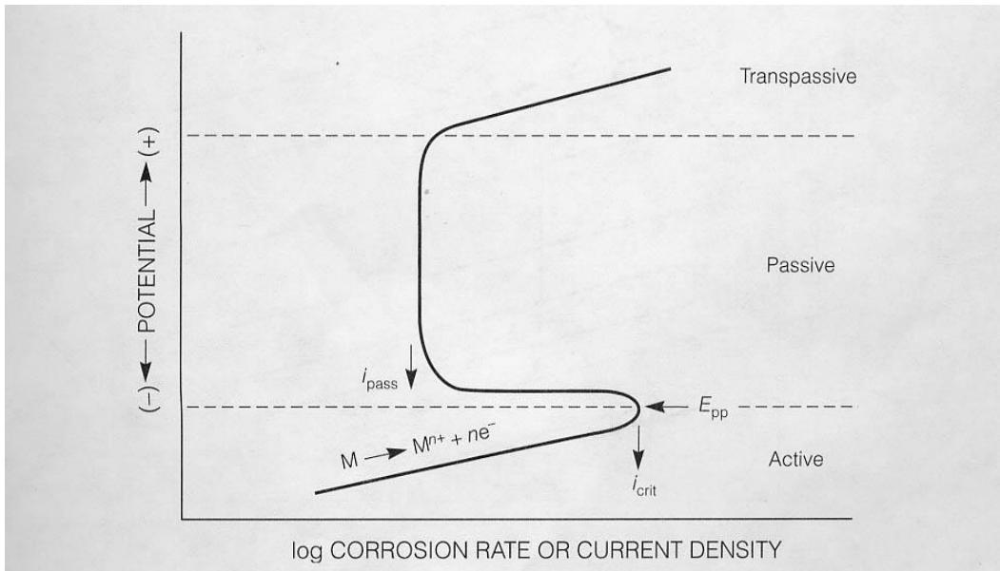  
Figure 2.1:  A schematic anodic polarization that shows an active­passive transition behavior [3].  
JONES, DENNY A., PRINCIPLES AND PREVENTION OF CORROSION, 2nd Edition, © 1996. Reprinted by permission of Pearson Education, Inc., Upper Saddle River, NJ

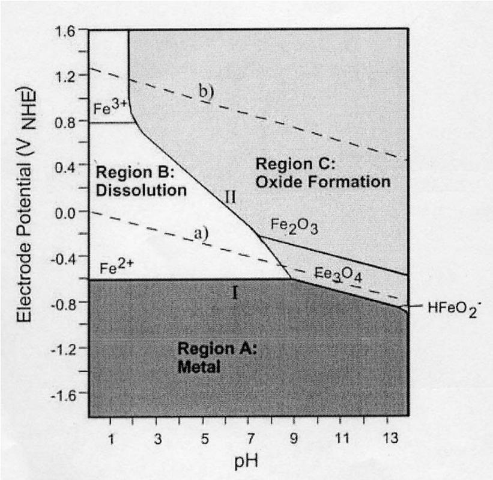  
Figure 2.2: A simplified Pourbaix diagram of iron­water system at $2 5 \mathrm { { ^ \circ C } }$ with concentration of the dissolved species of $1 0 ^ { - 6 }$ mol/l [1].  
With kind permission from Springer Science+Business Media: <J. Solid State Electrochem., From Bacon to Barriers: a review on the passivity of metals and alloys, 6, 2002, p.147, P. Schmuki, Fig.2 >.

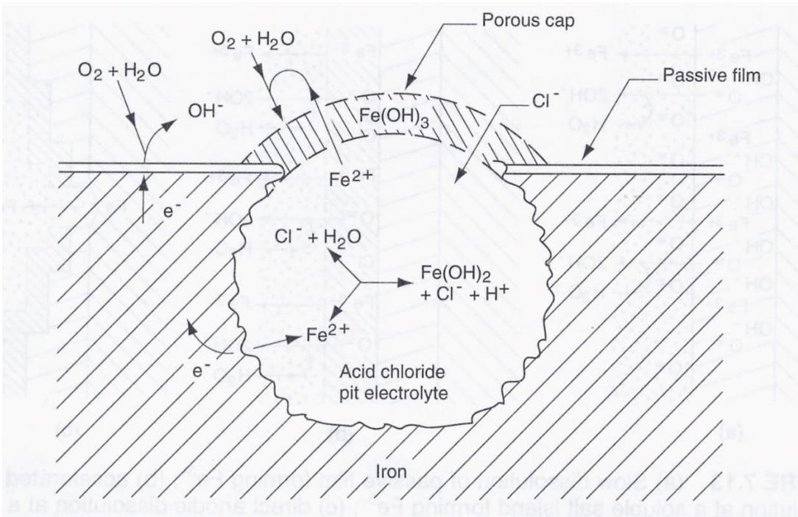  
Figure 2.3:  A schematic reactions occurring at a growing pit in iron metal showing an autocatalytic process [3].

JONES, DENNY A., PRINCIPLES AND PREVENTION OF CORROSION, 2nd Edition, © 1996. Reprinted by permission of Pearson Education, Inc., Upper Saddle River, NJ

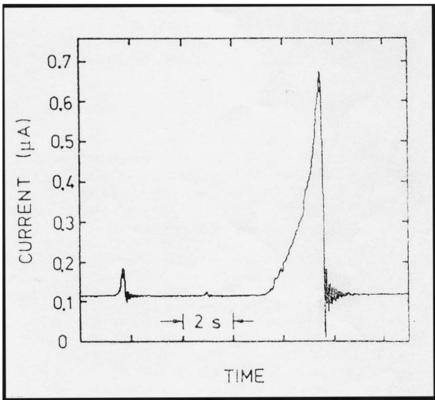  
Figure 2.4:  A typical metastable pitting current transients at a constant potential for 302 SS [26].  
Reprinted with permission from NACE.

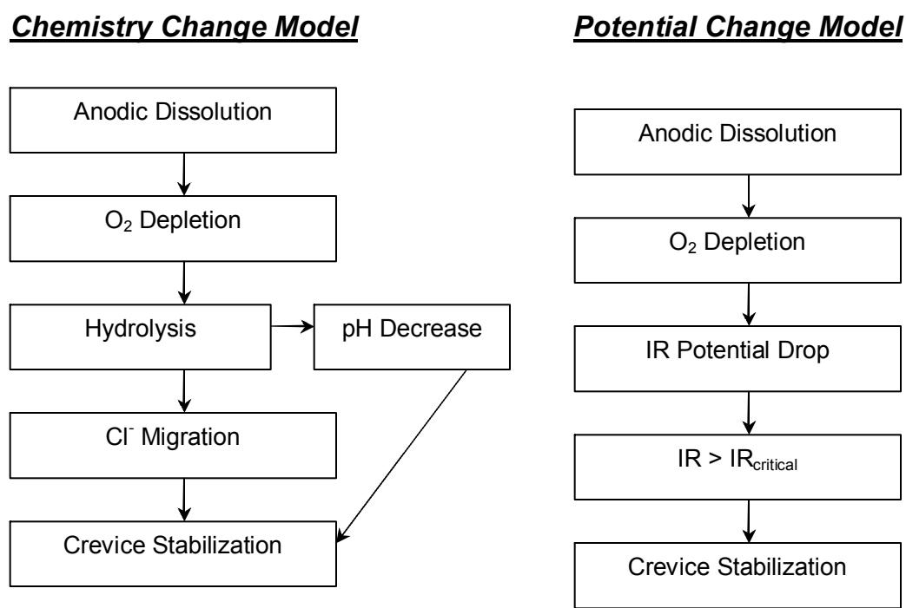  
Figure 2.5:  Sequence of events for two crevice stabilization theories/models (Adapted from [38]).

Reprinted with permission from NACE.

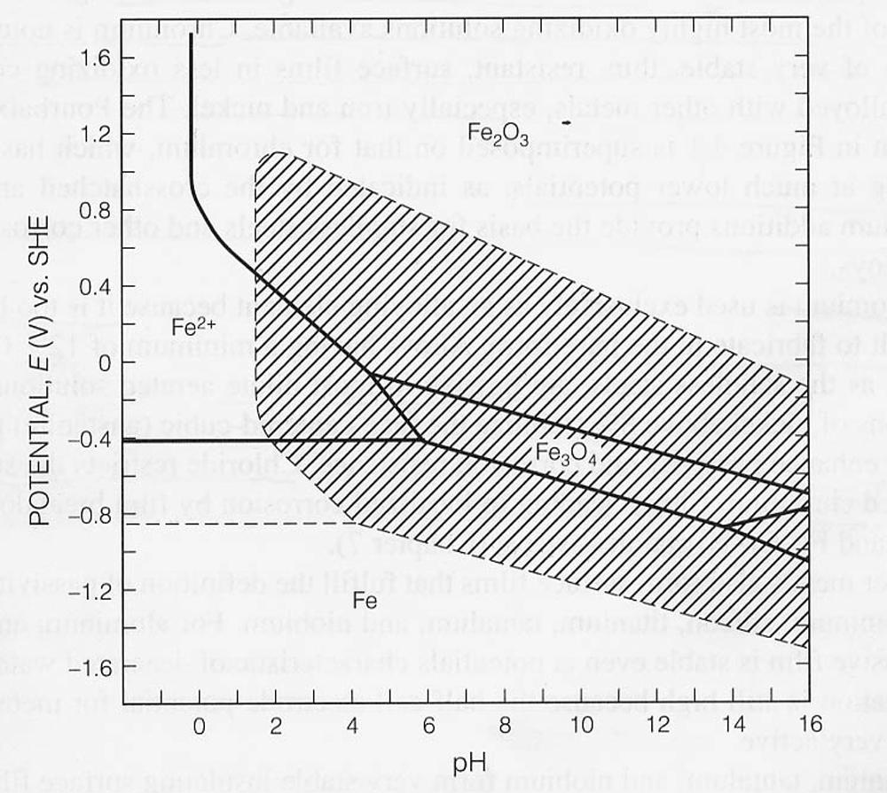  
Figure 2.6:  An iron Pourbaix diagram superimposed with chromium showing an expanding passivity region as shaded area is $\mathrm { C r } _ { 2 } \mathrm { O } _ { 3 }$ [3].

JONES, DENNY A., PRINCIPLES AND PREVENTION OF CORROSION, 2nd Edition, © 1996. Reprinted by permission of Pearson Education, Inc., Upper Saddle River, NJ

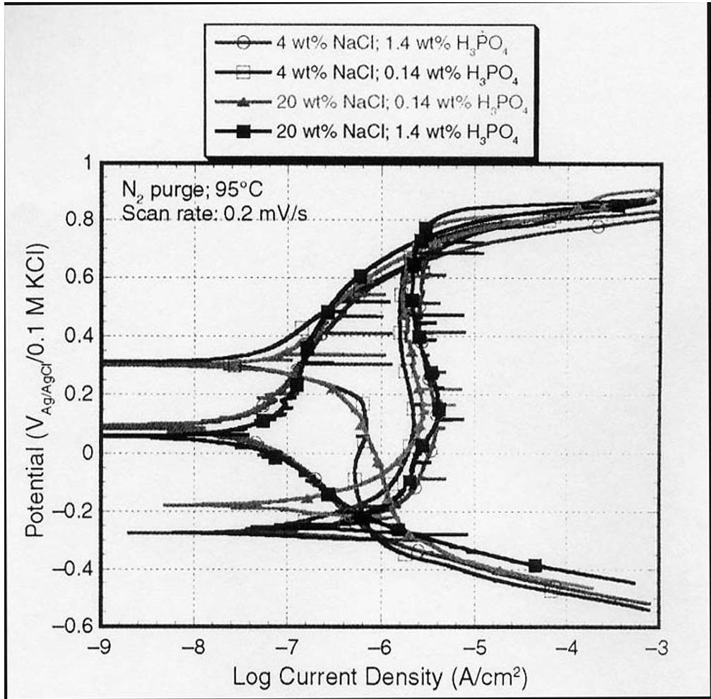  
Figure 2.7:  Cyclic polarization curves of Alloy C­276 with ${ \mathrm { N a C l } } { \mathrm { : } } { \mathrm { H } } _ { 3 } { \mathrm { P O } } _ { 4 }$ ratio variations at $9 5 \mathrm { { ^ \circ C } }$ [68].

Reprinted with permission from NACE.

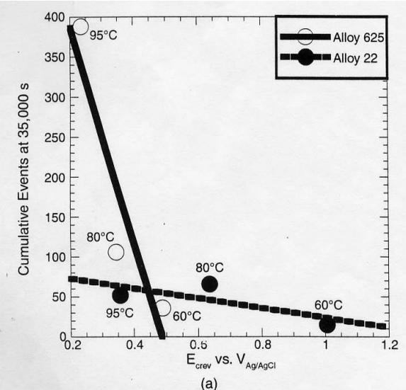

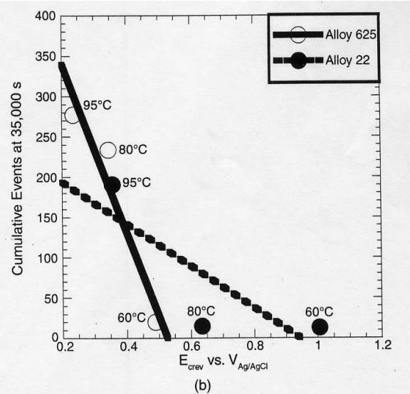  
Figure 2.8:  Cumulative number of metastable events of Alloy 625 and C­22 at the applied potentials of 5 $\mathrm { m V _ { A g / A g C l } }$ (a) and ­25 $\mathrm { m V _ { A g / A g C l } }$ (b) showing variation with temperature [10].

Reprinted with permission from NACE.

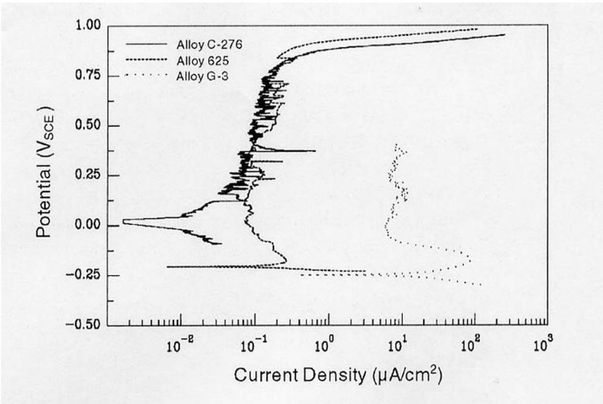  
Figure 2.9:  Anodic curves of Alloy G­3, 625, and C­276 in a simulated crevice environment [55].  
Reprinted with permission from NACE.

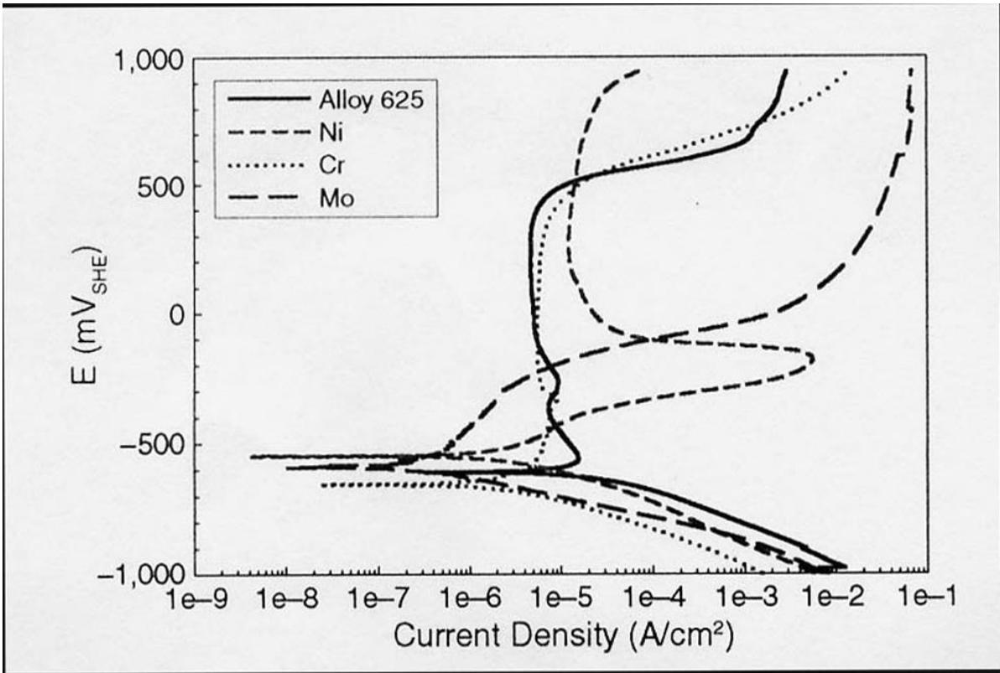  
Figure 2.10:  Polarization curves of Ni, Cr, Mo, and Alloy 625 in deaerated solution at pH 10 showing the similarity between pure Cr and Alloy 625 passive behavior [90].

Reprinted with permission from NACE.

<table><tr><td rowspan=1 colspan=1>Alloy Name</td><td rowspan=1 colspan=1>Alloying Elements Variations</td></tr><tr><td rowspan=1 colspan=1>C-22</td><td rowspan=1 colspan=1>Ni-22Cr-13Mo-3W-4Fe</td></tr><tr><td rowspan=1 colspan=1>625</td><td rowspan=1 colspan=1>Ni-22Cr-9Mo-3.6Fe-3.6Nb</td></tr><tr><td rowspan=1 colspan=1>C-276</td><td rowspan=1 colspan=1>Ni-16.5Cr-17Mo-4.5W-7Fe</td></tr><tr><td rowspan=1 colspan=1>825</td><td rowspan=1 colspan=1>Ni-22Cr-3Mo-30Fe</td></tr><tr><td rowspan=1 colspan=1>G-3</td><td rowspan=1 colspan=1>Ni-23.5Cr-8Mo-21Fe</td></tr><tr><td rowspan=1 colspan=1>G-30</td><td rowspan=1 colspan=1>Ni-30Cr-5Mo-2.8W-15Fe-5Co</td></tr><tr><td rowspan=1 colspan=1>C-4</td><td rowspan=1 colspan=1>Ni-16Cr-16Mo-3Fe-2Co</td></tr><tr><td rowspan=1 colspan=1>600C-2000</td><td rowspan=1 colspan=1>Ni-16Cr-8FeNi-23Cr-16Mo-1.6Cu</td></tr></table>

Table 2.1:  Compositions of Ni­based alloys that are discussed in this chapter. All in weight percent.

## REFERENCES

1. P. Schmuki, J. Solid State Electrochem., 6, 145­164 (2002).

2. G. S. Frankel, MSE 735 Notes, Part 7 (Winter 2003).

3. D. A. Jones, Principles and Prevention of Corrosion, Prentice Hall, Upper Saddle River, NJ (1996).

4. A. J. Sedriks, Corrosion ofStainless Steels, John Wiley and Sons, New York, NY (1996).

J. M. Bastidas, C. L. Torres, E. Cano and J. L. Polo, Corrosion Science, 44, 625 (2002).

6. N. Boucherit, A. H.­L. Goff and S. Joiret, Corrosion, 48, 569­579 (1992).

P. Crook, Corrosion of Nickel and Nickel­Base Alloys, ASM International, Materials Park, OH (2005).

8. J. R. Hayes, J. J. Gray, A. W. Szmodis and C. A. Orme, Corrosion, 62, 491­500 (2006).

9. G. O. Ilevbare and G. T. Burstein, Corrosion Science, 43, 485­513 (2001).

10. B. A. Kehler and J. R. Scully, Corrosion, 61, 665 (2005).

11. J. S. Kim, W. H. A. Peelen, K. Hemmes and R. C. Makkus, Corrosion Science, 44, 635­655 (2002).

12. A. C. Lloyd, J. J. Noel, S. McIntyre and D. W. Shoesmith, Electrochimica Acta, 49, 3015­3027 (2004).

13. R. C. Newman, Corr. Sci., 25, 341 (1985).

14. D. D. Macdonald, Pure Appl. Chem., 71, 951­978 (1999).

15. D. D. Macdonald, J. Electro. Soc., 139, 3434­3449 (1992).

16. R. G. Buchheit, MSE 681 Notes, Part 8 (Autumn 2001).

17. M. Pourbaix, p. 263, 312., NACE, Houston, TX (1974).

18. S. J. Ahn, H. S. Kwon and D. D. Macdonald, J. Electro. Soc., 152, B482­B490 (2005).

19. N. Sato, J. Electro. Soc., 129, 255­260 (1982).

20. I. Betova, M. Bojinov, T. Laitinen, K. Makela, P. Pohjanne and T. Saario, Corrosion Science, 44, 2675­2697 (2002).

21. G. S. Frankel, J. Electro. Soc., 145, 2186 (1998).

22. J. R. Galvele, J. Electro. Soc., 123, 464­474 (1976).

23. P. C. Pistorius and G. T. Burstein, Corrosion Science, 36, 525­538 (1994).

24. P. Schmuki, H. Hildebrand, A. Friedrich and S. Virtanen, Corrosion Science, 47, 1239­1250 (2005).

25. C. J. Park, V. S. Rao and H. S. Kwon, Corrosion, 61, 76­83 (2005).

26. G. S. Frankel, L. Stockert, F. Hunkeler and H. Boehni, Corrosion, 43, 429­436 (1987).

27. S. T. Pride, J. R. Scully and J. L. Hudson, J. Electro. Soc., 141, 3028 (1994).

28. N. J. Laycock, J. Stewart and R. C. Newman, Corrosion Science, 39, 1791­1809 (1997).

29. M. H. Moayed and R. C. Newman, Mats. and Corr., 56, 166 (2005).

30. L. Stockert and H. Boehni, Mat. Sci. Forum, 44&45, 313­328 (1989).

31. F. Sato and R. C. Newman, Corrosion, 54, 955 (1998).

32. D. E. Williams, J. Stewart and P. H. Balkwill, Corr. Sci., 36, 1213 (1994).

33. Y. Kim and R. G. Buchheit, Electro. Acta, 52, 2437 (2007).

34. Y. Kobayashi, S. Virtanen and H. Bohni, J. Electro. Soc., 147, 155 (2000).

35. J. W. Oldfield and W. H. Sutton, Br. Corros. J., 13, 13­22 (1978).

36. J. W. Oldfield and W. H. Sutton, Br. Corros. J., 13, 104­111 (1978).

37. H. W. Pickering, Corrosion Science, 29, 325­341 (1989).

38. N. Sridhar and D. S. Dunn, Corrosion, 50, 857­872 (1994).

39. R. C. Newman, Corrosion, 57, 1030­1041 (2001).

40. Q. Meng, G. S. Frankel, H. O. Colijn and S. H. Goss, Corrosion, 60, 346­355 (2004).

41. M. P. Ryan, D. E. Williams, R. J. Chater, B. M. Hutton and D. S. McPhail, Nature, 415, 770­774 (2002).

42. D. E. Williams and Y. Y. Zhu, J. Electro. Soc., 147, 1763­1766 (2000).

43. G. T. Burstein and P. C. Pistorius, Corrosion, 51, 380­385 (1995).

44. G. O. Ilevbare and G. T. Burstein, Corrosion Science, 45, 1545­1569 (2003).

45. Y. Zuo, H. Wang, J. Zhao and J. Xiong, Corrosion Science, 44, 13­24 (2002).

46. M. Drogowska, H. Menard and L. Brossard, J. Appl. Electro., 27, 169­177 (1997).

47. J.­J. Park, S.­I. Pyun, W.­J. Lee and H.­P. Kim, Corrosion, 55, 380­387 (1999).

48. Z. Szklarska­Smialowska, p. 297, NACE, Houston, TX (1986).

49. S. Wang and R. C. Newman, Corrosion, 60, 448­454 (2004).

50. P. Schmuki, S. Virtanen, H. S. Isaacs, M. P. Ryan, A. J. Davenport, H. Bohni and T. Stenberg, J. Electrochem. Soc., 145, 791 (1998).

51. R. C. Newman, Corr. Sci., 25, 331 (1985).

52. J. Horvath and H. H. Uhlig, J. Electro. Soc., 115, 791­795 (1968).

53. K. Hashimoto, K. Asami and K. Teramoto, Corr. Sci., 19, 3 (1979).

54. R. Qvarfort, Corr. Sci., 40, 215 (1998).

55. R. S. Lillard, M. P. Jurinski and J. R. Scully, Corrosion, 50, 251 (1994).

56. S. Azuma, T. Kudo, H. Miyuki, M. Yamashita and H. Uchida, Corr. Sci., 46, 2265 (2004).

57. L. F. Garfias­Mesias, J. M. Sykes and C. D. S. Tuck, Corrosion Science, 38, 1319 (1996).

58. G. C. Palit, V. Kain and H. S. Gadiyar, Corrosion, 49, 977 (1993).

59. R. B. Rebak and P. Crook, Adv. Mat. Process, 157, 37­42 (2000).

60. D. S. Dunn, G. A. Cragnolino and N. Sridhar, Corrosion, 56, 90­104 (2000).

61. K. J. Evans, A. Yilmaz, S. D. Day, L. L. Wong, J. C. Estill and R. B. Rebak, JOM, 57, 61 (2005).

62. P. Kritzer, N. Boukis and E. Dinjus, Corrosion, 54, 689­699 (1998).

63. P. Kritzer, N. Boukis and E. Dinjus, Corrosion, 54, 824­834 (1998).

64. D. S. Dunn, Y.­M. Pan, K. T. Chiang, L.Yang, G. A. Cragnolino and X. He, JOM, 57, 49 (2005).

65. F. Hua and G. Gordon, Corrosion, 60, 764 (2004).

66. D. H. Hur and Y. S. Park, Corrosion, 62, 745­750 (2006).

67. B. Stellwag, Corrosion, 53, 120­128 (1997).

68. S. Ghosh and T. Ramgopal, Corrosion, 61, 609­619 (2005).

69. G. M. Gordon, Corrosion, 58, 811­825 (2002).

70. N. Priyantha, P. Jayaweera, G. R. Englehardt, A. Davydov and D. D. Macdonald, Corrosion, 61, 857­871 (2005).

71. Y. Zuo and S. Fu, Corrosion, 54, 313­316 (1998).

72. B. A. Kehler, G. O. Ilevbare and J. R. Scully, Corrosion, 57, 1042­1065 (2001).

73. A. Csontos, T. Ahn, A. Passarelli, Y. Pan, D. Dunn and L. Yang, JOM, 57, 36­42 (2005).

74. J. J. Gray, J. R. Hayes, G. E. Gdowski and C. A. Orme, J. Electro. Soc., 153, B156­B161 (2006).

75. G. O. Ilevbare, Corrosion, 62, 340­356 (2006).

76. N. Sridhar and G. A. Cragnolino, Corrosion, 49, 885­894 (1993)

77. G. O. Ilevbare, K. J. King, S. R. Gordon, H. A. Elayat, G. E. Gdowski and T. S. E. Gdowski, J. Electro. Soc., 152, B547­B554 (2005).

78. D. S. Dunn, Y.­M. Pan, L. Yang and G. A. Cragnolino, Corrosion, 61, 1078­1085 (2005).

79. H. C. Brookes, J. W. Bayles and F. J. Graham, J. Appl. Electrochem., 20, 223 (1990).

80. D. S. Dunn, Y.­M. Pan, L. Yang and G. A. Cragnolino, Corrosion, 62, 3­12 (2006).

81. E. Akiyama and G. S. Frankel, J. Electrochem. Soc., 146, 4095 (1999).

82. T. Ramgopal and G. S. Frankel, Corrosion, 57, 702 (2001).

83. U. Steinsmo and H. S. Isaacs, Corr. Sci., 35, 83 (1993).

84. P. Heimgartner and H. Bohni, Corrosion, 41, 715 (1985).

85. G. S. Frankel, Corr. Sci., 30, 1203 (1990).

86. M. A. Cavanaugh, J. A. Kargol, J. Nickerson and N. F. Fiore, Corrosion, 39, 144 (1983).

87. P. Crook and D. Klarstrom, Introduction to Alloys Resistant to Aqueous Corrosion, ASM International, Materials Park, OH (2005).

88. W. Z. Friend, Corrosion of Nickel and Nickel­Based Alloys, John Wiley and Sons, New York, NY (1980).

89. G. Mori, S. Sutthiruangwong, M. Czerny and T. Partlic, Corrosion, 60, 1082­ 1091 (2004).

90. E. Asselin, A. Alfantazi and S. Rogak, Corrosion, 61, 579 (2005).

91. A. C. Lloyd, D. W. Shoesmith, N. S. McIntyre and J. J. Noel, J. Electro. Soc., 150, B120­B130 (2003).

92. A. C. Lloyd, J. J. Noel, N. S. McIntyre and D. W. Shoesmith, JOM, 57, 31 (2005).

93. N. Saito, H. Sakamoto and K. Sugimoto, Corrosion, 54, 700­712 (1998).

94. C. R. Clayton and Y. C. Lu, J. Electro. Soc., 133, 2465­2473 (1986).

95. C. A. Hampel, Corrosion, 14, 557t (1958).

96. R. R. Sayano and K. Nobe, Corrosion, 25, 260 (1969).

97. R. B. Rebak, "Presentation to The Ohio State University Student Chapter of The Electrochemical Society", slide 2 (2006).

98. J. Osterwald and H. H. Uhlig, J. Electro. Soc., 108, 515 (1961).

## CHAPTER 3

## CORRELATIONS BETWEEN THE LOCALIZED CORROSION BEHAVIOR OFNi­Cr­Mo ALLOYS AND ALLOYING COMPOSITION AT VARIOUSTEMPERATURES AND pH

## 3.1  INTRODUCTION

Ni alloys based on Ni­Cr­Mo solid solutions are among the most versatile of the corrosion resistant alloys due to their ability to resist aqueous corrosion over a broad range of conditions [1­3]. Molybdenum is known to provide corrosion resistance in reducing acidic environments while chromium is recognized for its ability to resist corrosion under oxidizing conditions [3]. The ability to resist corrosion on both reducing and oxidizing environments makes Ni­Cr­Mo alloys good candidates for a range of demanding applications including long­term nuclear waste storage [4].

Chromium additions to Ni­based alloys have been shown to increase pitting potential [5] and improve the resistance towards high temperature oxidation [6]. Cr additions also stabilize passivity in Ni­Cr­Mo alloys due to formation of $\mathrm { C r } _ { 2 } \mathrm { O } _ { 3 }$ film that protects the surface very well resulting in low passive current density [3] and higher breakdown potential [2]. The role of molybdenum additions in increasing corrosion resistance is still less clear. Some have suggested that molybdenum improves passivity by stifling the propagation of localized corrosion once the passive film breakdown has occurred [2]. Others have found that adding Mo to Ni­based alloys decreases the passive current density, stabilizes passivity under acidic conditions, and decreases the anodic dissolution rate in the active region of the polarization curve [7].

In general, experimental studies show that the addition of chromium and molybdenum increase the pitting and crevice corrosion resistance of the Ni­Cr­Mo alloys. Some of the widely known Ni­Cr­Mo alloys, including Alloy C­276, Alloy 625, and Alloy 22, exhibit very high resistance to pitting in oxidizing chloride environments [8]. Recent work shows that the metastable corrosion event rates are higher for Alloy 625 than Alloy 22 at the same temperature and applied potential. As a result, Alloy 625, which has lower Mo content, is more susceptible to localized attack [9]. Another study found that passive currents on Alloy 22 decay to much lower values than on Alloy C­276 indicating a more passive behavior of Alloy 22 [10]. This was attributed to the higher chromium content on Alloy 22, which contributed to the growth and maintenance of a protective inner chromium/nickel oxide barrier layer at the alloy/oxide interface. These two studies illustrate the superior corrosion resistance of Alloy 22 against Alloy 625 or Alloy C­276 and point to specific roles of Cr and Mo in overall corrosion resistance.

The objectives of the present study are to characterize and describe through simple and compact mathematical relations the effect of alloy composition on the pitting and repassivation behavior of ${ \mathrm { N i - C r - M o } }$ alloys. The experiments conducted also allow some understanding of how the roles of Cr and Mo change with changes in the environment chemistry. This was accomplished by constructing equations that represent a correlation between localized corrosion behavior, i.e. pitting potential and repassivation potential, and alloying concentration based on temperature and solution pH.

## 3.2  EXPERIMENTAL PROCEDURES

Nickel (99.99%), chromium (99.99%), and molybdenum (99.95%) pieces were weighed according to pre­selected targeted compositions and then melted together using vacuum arc melting. The fabricated alloys included 24 unique compositions as represented in Table 3.1. Microstructural examination, using scanning electron microscope (SEM), was carried out to ensure the melted pieces were forming solid solution alloys. Re­melting procedures were performed as necessary to achieve homogeneous defect­free ingots.

A two­stage homogenization heat treatment was carried out at $1 2 0 4 ^ { \circ } \mathrm { C }$ for 24 hours and $1 2 6 0 ^ { \circ } \mathrm { C }$ for 42 hours followed by water­quenching for fast cooling to ensure a homogeneous microstructure [11]. Evaluations of the actual compositions of the Ni­Cr­Mo alloys were performed using a semi­quantitative energy dispersive spectroscopy

(EDS). A ternary diagram showing the composition of the fabricated alloys and the commercially available Ni­Cr­Mo alloys is depicted in Figure 3.1.

The alloys were cut into smaller sections to construct multi­electrode arrays in a 1¼" diameter mount. Electrical connection was made by soldering. The electrodes were mounted using Dexter Hysol TM epoxy (EE4183 resin and HD3561 hardener) with a weight ratio mixture of 100g resin to 12.5g hardener. The mounted electrodes had exposed areas ranging from 0.004 to 0.05 cm 2. Samples were ground and polished with surface finish of 1 micron diamond paste prior to polarization. If the samples were to be used for another polarization run, the samples were ground and polished up to 1 micron diamond paste followed by polishing the finished surface with low viscosity epoxy, Buehler Epo­thin TM, with a weight ratio of 10g resin by 3.9g hardener to fill up the crevices that might form during the previous polarization run. After letting the Epo­thin dry overnight, the samples were re­ground and re­polished with the same surface finish (1 micron). Then the samples were ready for the next polarization run.

Electrochemical measurements were performed using model 910B Multichannel Microelectrode Analyzer (MMA TM) (Scribner Associates, Inc., Southern Pines, NC) with forward and reverse scan rate of 2 mV/s. A 3­electrode setup was used with saturated calomel electrode (SCE) as the reference electrode, and graphite rods as counter electrodes. The first type of environment was 0.5 M NaCl , neutral pH, at four different temperatures: $4 5 ^ { \circ } \mathrm { C } , 6 0 ^ { \circ } \mathrm { C } , 7 5 ^ { \circ } \mathrm { C } .$ , and $9 0 \mathrm { { } ^ { \circ } C }$ . The second type was acidified chloride solution with pH value of 2.75. The low pH electrolyte consisted of 5 M of lithium chloride (LiCl), 0.26 M of sodium sulfate $\mathrm { ( N a _ { 2 } S O _ { 4 } ) }$ , and 0.24 M of sodium nitrate

$\left( \mathrm { N a N O } _ { 3 } \right)$ , which was a 10:1 ratio of chloride anions to total oxyanions [12]. The pH of the electrolyte was adjusted to pH 2.75 with HCl. The temperatures for the acidified chloride environment were $6 0 ^ { \circ } \mathrm { C } , 8 0 ^ { \circ } \mathrm { C } ,$ , and $9 5 \mathrm { ^ \circ C }$

Whenever microstructural examination was required, the polarized samples were cleaned with ethanol in ultrasonic bath for about 4 minutes or less and then, put in a dessicator for at least 24 hours prior to SEM analysis.

## 3.3  RESULTS AND DISCUSSION

## 3.3.1 Stainless Steel Pitting Resistance Equivalency Number (PREN)

PREN is used in association with stainless steels as numerical estimator that relates pitting behavior of the alloys to alloying element content [13]. Previous literature has reported PREN equivalency to be: $( \mathrm { w t . \% C r } ) + 3 . 3 ( \mathrm { w t . \% M o } ) + 1 6 ( \mathrm { w t . \% N } )$ [9,13,14]. Even though the PREN expression was developed for stainless steels (Fe­Cr­Ni alloys), its use has been extended to Ni­base alloys [9]. In this case, the PREN expression seems to give a relatively accurate assessment of corrosion resistance. For example, Alloy 22 with PREN of 65 is noticeably more resistant to localized corrosion than Alloy 625 with PREN of 50 [9]. The tabulated PREN values for the Ni­Cr­Mo alloys fabricated on this study are shown in Table 3.1. Here the PREN expression has been modified by eliminating the term associated with nitrogen from the original PREN expression. For simplicity, the alloys are separated into 3 groups based on the PREN values determined using the original PREN expression.

## 3.3.2 Cathodic Polarization Response of the Ni­Cr­Mo Alloys in Neutral Chloride Solution

The cathodic polarization curves of the first group of alloys with PREN value from 30 to 55 in 0.5 M NaCl solution at $6 0 \mathrm { { } ^ { \circ } C }$ are represented in Figure 3.2(a). The only alloy that deviates from the group is Ni­13.31Cr­5.24Mo. The main cause of this behavior is believed to be artifactual. Figures 3.2(b) and (c) show cathodic curves of Ni-Cr­Mo alloys with PREN value of 56 to 75 and 76 to 105, respectively. Overall, these three groups of curves demonstrate the consistency in the cathodic polarization response of the Ni­Cr­Mo alloys across the range of compositions examined in this study.

## 3.3.3 Anodic Polarization Response and Microstructural Analysis of the Ni­Cr­Mo Alloys in Neutral Chloride Solution

The anodic polarization curves of alloys with PREN from 30 to 55 show the occurrence of pitting corrosion as shown in Figure 3.3. These alloys have relatively low chromium and/or low molybdenum contents. Figures 3.4(a) and (b) are SEM images showing open pits and pits covered by the corrosion products that formed from anodic polarization. The images confirm the incidence of pitting in this group of alloys as also indicated through the hysteresis loop in the electrochemical results.

The second group of alloys is ${ \mathrm { N i - C r - M o } }$ alloys with PREN from 56 to 75. The anodic polarization curves for this group are shown in Figure 3.5. Some alloys in this group show oxygen evolution or transpassive dissolution at approximately 600 mV as evidenced by an increase in current density but no hysteresis loop. An alloy with Ni­

10.42Cr­17.66Mo has no passive region during the anodic polarization scan (the curve on the farthest right). Scanning electron micrograph of the alloy is shown in Figure 3.6(a) indicating that this low chromium alloy experienced attack that resembles intergranular corrosion. Even though a preferential attack of the grain boundaries is not expected for these types of alloy and environment, intergranular attack on Alloy C­22 was observed in another study after being polarized in the transpassive dissolution potential region for several days [19]. Further study would be needed to investigate the cause of the differential dissolution of grains in Ni­based alloys. A study by Hayes et al. found that the critical content for complete passivation of the surface in Ni­Cr­Mo alloys is approximately 11% [2]. The samples examined in this study support this value as being a critical one. Alloys with less than 11% Cr corrode quite rapidly compared to other alloys [15].

Alloys that have 13 to 18 wt.% of chromium and moderate amount of molybdenum exhibit pitting corrosion as depicted by a hysteresis loop in the reverse polarization scan. An SEM of one of the alloys showing occurrence of pitting in this composition range is shown in Figure 3.6(b). Alloys that consist of chromium content greater or equal to 20 wt.% and molybdenum content of greater or equal to 12 wt.% exhibit little or no hysteresis. An SEM image of Ni­22.59Cr­12.27Mo, which has the fabricated ternary alloy with a composition near to Alloy C­22, is shown in Figure 3.6(c). As might be expected, no pits were detected on this sample at micrometer length scales.

The last group of Ni­Cr­Mo alloys has PREN values of 76 to 103. Figure 3.7 shows anodic polarization curves of the alloys. It appears that alloys with chromium contents less than 20 wt.% experienced pitting even though they had high molybdenum contents. An SEM image of a low chromium alloy, Ni­9.52Cr­21.07Mo, is shown in Figure 3.8(a) showing pitting and intergranular­like type of attack even though the anodic polarization curve shows a passive region. Alloys that are composed of high chromium and high molybdenum are corrosion resistant as suggested by the SEM image in Figure 3.8(b).

An instrument limitation associated with the 100 µA/channel current measurement limit is observed as a vertical line in Figures 3.3, 3.5, and 3.7 at current densities ranging from 0.001 to $0 . 1 \mathrm { A } / \mathrm { c m } ^ { 2 }$ depending on the sample area. This current limitation could affect pit size and the number of pits formed with attendant effects on repassivation behavior.

## 3.3.4 Pitting Susceptibility in Neutral Chloride as a Function of Temperature

The pitting behavior of the Ni­Cr­Mo alloys in 0.5 M NaCl was also measured at $4 5 ^ { \circ } \mathrm { C } , 7 5 ^ { \circ } \mathrm { C } ,$ and $9 0 ^ { \circ } \mathrm { C }$ . Figures 3.9(a) to (d) are plots of pitting potential $\left( \mathrm { E _ { p } { - } e x p } \right)$ versus calculated stainless steel PREN for each temperature. Alloys that did not show a distinct pitting potential prior to the onset of transpassivity were assigned a pitting potential value of 600 mV, which is the characteristic value for the onset of transpassivity. As expected, the number of alloys with $\mathrm { E _ { p } { \mathrm { - } } e x p }$ below 600 mV increases with temperature.  The composition of the Ni­Cr­Mo alloys that show no signs of localized corrosion occurring at all four temperatures are shown in bold and italicized numbers in Table 3.1. They have chromium contents between 20 to 30 wt% and molybdenum content between 12 to 25

wt.%. Figure 3.10 maps the position of these corrosion resistant alloys in the Ni­Cr­Mo ternary diagram plot. If the amount of chromium and molybdenum are too high, the alloys are more likely to have inhomogeneous microstructure and lose corrosion resistance. Early experiments in this study found that these very high chromium and very high molybdenum alloys experienced mild localized corrosion. Microstructural analysis of the alloys showed a two­phase microstructure with one phase of a higher Mo content than the other.

Due to the lack of regular dependency between the PREN and the $\mathrm { E _ { p } { \mathrm { - } } e x p }$ values, it is evident that the stainless steel PREN does not rank the pitting susceptibility of the Ni­Cr­Mo alloys accurately. The expectation was that the PREN would increase linearly with the pitting potential. This suggests that a Cr factor of 1 and a Mo factor of 3.3 are not best suited for estimating the pitting susceptibility of Ni­Cr­Mo alloys.

## 3.3.5 PREN­like Concept for Ni­Based Alloys in Neutral Chloride Condition

Stainless steel PREN is a mathematical expression that relates the degree of pitting resistance to the content of the alloying elements [13]. In the original work of Lorenz and Medawar, the pitting behavior of austenitic chromium­nickel steels in artificial seawater and tap water at $2 0 \mathrm { { } ^ { \circ } C }$ was studied[16]. They identified chromium and molybdenum as the most influential elements in austenitic steels with respect to corrosion resistance with 3 wt.% of chromium giving the same effect as 1 wt.% of molybdenum in pitting resistance leading to the original PREN expression. Stainless steel with higher PREN are expected to have better pitting resistance than the ones with lower PREN.

The simplicity of this concept makes it appealing for use in technological settings where one can rank pitting susceptibility of stainless steels based on their alloying element content only. However, it is important to appreciate that the PREN concept is just a rough tool for estimating pitting behavior since it does not recognize the possibility of an interaction between alloying elements such as a synergistic effect between nitrogen and molybdenum in stainless steels [13]. Furthermore, pitting susceptibility is also dependent on microstructure, impurities like sulphide, and environment and they are not recognized in the PREN expression.

From Figure 3.9, it is apparent that the stainless steel PREN does not accurately rank the pitting susceptibility of the Ni­Cr­Mo alloys. Some alloys that consist of high molybdenum but low chromium have high PREN values, but their experimental pitting potentials are lower than alloys with lower PREN. This suggests the need for a revised mathematical expression for correlating pitting potential to alloy composition.

In this study, correlation was made between experimental pitting potential and alloy composition using multiple linear regression analysis performed with Aable TM software. Pitting potentials were determined from anodic polarization data sets. In the regression analysis, the composition was treated as a set of independent variables consisting of the weight percentages of Ni, Cr, and Mo, while the dependent variable was the experimental pitting potential in mV. Alloy composition is fully specified by stating Cr and Mo weight percentages since this is a ternary alloy. The $\mathrm { E _ { p } }$ equations obtained from the regression analysis consisted of 3 variables (wt.%Ni, wt.%Cr, wt.%Mo) but can be modified into 2­variable:

$$
\begin{array} { r l } & { \mathrm { E } _ { \mathrm { p } } = \mathrm { C } + \alpha ( w t . \% N i ) + \beta ( w t . \% C r ) + \gamma ( w t . \% M o )  } \\ & { } \\ & { \mathrm { E } _ { \mathrm { p } } = ( \mathrm { C } + 1 0 0 \alpha ) + ( \beta - \alpha ) ( w t . \% C r ) + ( \gamma - \alpha ) ( w t . \% M o ) } \end{array}\tag{Eqn. 3.1}
$$

Eqn. 3.2

where C is a constant, and $\alpha , \beta ;$ , and $\gamma$ are the $\mathrm { N i , C r , }$ and Mo factors/coefficients, respectively from the multiple linear regression analysis.

Figure 3.11(a) illustrates a ternary diagram where the black dots represent the composition of the alloys tested and the colored contours represent a surface defined by the experimental pitting potentials measured in 0.5 M NaCl at $6 0 ^ { \circ } \mathrm { C }$ . Through multiple linear regression analysis and by excluding some outliers, an $\mathrm { E _ { p } }$ equation is obtained where $\mathrm { E _ { p } \ ( i n \ m V ) ^ { = } 1 1 . 1 4 ( w t . ^ { \circ } \% C r ) } + 5 . 4 7 ( \mathrm { w t . ^ { \circ } \% M o } ) + 2 1 4 . 0 9$ .  The colored contour in Figure 3.11(b) depicts the calculated pitting potential values from the $\mathrm { E _ { p } }$ equation. The difference between the experimental pitting potential and the calculated pitting potential from $\mathrm { E _ { p } }$ equation is depicted in Figure 3.11(c). A resemblance is observed between the experimental pitting and the calculated pitting values as the difference between them are less than 50 mV indicating the accuracy of the $\mathrm { E _ { p } }$ equation in predicting the pitting potential values based on chromium and molybdenum content only. It is to be noted that the color bar for the experimental pitting potential is ranging from 350 to 600 mV while the calculated pitting potential is ranging from 400 to 650 mV.

For the regression analysis, an alloy that showed no passive region on the anodic curve was excluded from the analysis. Some replicate experiments were performed, and the results were included in the multiple linear regression analysis which means that for 1 alloy composition there were multiple pitting potential values. This method was also applied to the data sets collected at other temperatures. The $\mathrm { E _ { p } }$ equations and their

correlation factors for Ni­Cr­Mo alloys in a neutral chloride environment at four different temperatures are shown in Table 3.2. A low correlation factor for the $4 5 \mathrm { { ^ \circ C } }$ data set is expected due to minimal variation in pitting potential at this temperature.

From Table 3.2, it is evident that Cr factor is more significant than Mo factor at all temperatures, which is the opposite of that in the stainless steel PREN expression. This suggests that for Ni­Cr­Mo alloys in neutral chloride solutions, chromium is more effective in retarding pitting than molybdenum. This is attributed to the formation of chromium rich passive film that forms on the Ni­based alloys in neutral pH range giving an outstanding protection. In this analysis, unique pitting potential­composition relationships were developed for each temperature in which tests were conducted. The differences in these relationships indicate that the role of the alloying elements depends on temperature.  The Cr/Mo ratio shows the dominance of Cr over Mo reaches a maximum at $6 0 \mathrm { { } ^ { \circ } C }$ with a 2.0 ratio. At other temperatures, the ratio is in the range of 1.3 to 1.7 resulting in an average Cr/Mo ratio of 1.6 implying that 16 wt.% of Mo affects the pitting potential as much as 10 wt.% Cr.

The dominant effect of chromium in promoting passivity is well established in the literature [2,17], which shows that pitting potential in Ni­Cr alloys increases with the chromium content [5], and that high chromium content in Alloy C­22 is the key element in producing low passive currents [10].

## 3.3.6 Correlation between Repassivation Potential and Alloy Composition in

## Neutral Chloride Condition

The same regression method was used to characterize repassivation potential $\mathrm { ( E _ { r p } ) }$ data sets. The results are shown in Table 3.3. These equations show that both Cr and Mo affect the repassivation behavior nearly equally in neutral chloride environments. Molybdenum exhibits a slightly greater effect on $\mathrm { E } _ { \mathrm { r p } }$ at lower temperatures, while chromium is more influential at $9 0 \mathrm { { } ^ { \circ } C }$ . Other work has reported the benefit of adding molybdenum is to inhibit the propagation of localized corrosion after a breakdown has occurred leading to possibly a higher repassivation potential [2,7]. The role of chromium in repassivation however is not very likely due to the fact that the drive for chromium hydrolysis is much higher than nickel or molybdenum hydrolysis [20]. This means that chromium hydrolysis produces more $\mathrm { H } ^ { + }$ and acidifies pits even more therefore impedes the repassivation process.

Overall, the pitting and repassivation potentials for Ni­Cr­Mo alloys are highly influenced by Cr alloying additions in neutral chloride condition. However, Mo is also influential in promoting repassivation. These observations are consistent with the literature where Pourbaix diagrams in neutral pH show that chromium is stable as a passive $\mathrm { C r } _ { 2 } \mathrm { O } _ { 3 }$ while molybdenum is in a soluble form $\mathrm { _ { o f M o O _ { 4 } } } ^ { 2 - }$  [18]. The presence of $\mathrm { M o O } _ { 4 } ^ { 2 - }$  has been said to delay the initiation and reduce the propagation rates of crevice corrosion in Ni­based alloys [7].

## 3.3.7 $\mathbf { E _ { p } }$ and $\bf { E } _ { r p }$ Equations on Acidified Chloride Condition

To examine the role of Cr and Mo in low pH environment, the Ni­Cr­Mo alloys were exposed to chloride solution mixture, as described in the experimental procedure, at pH 2.75 in elevated temperatures. $\mathrm { E _ { p } }$ and $\mathrm { E _ { r p } }$ values from cyclic polarizations were used in multiple linear regression analysis to develop relationship with alloy composition. The Ni­Cr­Mo alloys that show superior corrosion resistance are composed of chromium between 20 to 30 wt.% and molybdenum between 12 to 25 wt.%, which is the same group of alloys that are also corrosion resistant in neutral chloride environment.

The $\mathrm { E _ { p } }$ equations for the alloys in acidified chloride condition are shown in Table 3.4. The Cr factor is higher than Mo at $6 0 ^ { \circ } \mathrm { C } ;$ however, at $8 0 \mathrm { { } ^ { \circ } C }$ and $9 5 \mathrm { ^ \circ C }$ , the role is reversed suggesting a stronger influence of Mo at elevated temperatures. This result shows how pH and temperature greatly affect the correlation between pitting potential and alloy composition.

The $\mathrm { E _ { r p } }$ equations, which are shown in Table 3.5, show that the Cr factor is slightly greater than Mo at $6 0 \mathrm { { } ^ { \circ } C }$ . At temperature higher than $6 0 \mathrm { { } ^ { \circ } C }$ , it appears that the Mo factor increases with temperature implying the key role of Mo in promoting repassivation on Ni­based alloys in acidified chloride solution at elevated temperatures.

To conclude this section, electrochemical measurements show that molybdenum plays a significant role in providing corrosion resistance in low pH conditions for Ni­Cr­Mo alloys. By comparing this result to the experiments carried out in neutral chloride, it is shown that pitting and repassivation behavior of the Ni­Cr­Mo alloys are highly dependent on temperature and pH. Furthermore, this finding also shows that an empirical equation that is used to relate pitting susceptibility to alloy composition is environmentdependant and should be used with these important limitations in mind.

## 3.4  CONCLUSIONS

1. Chromium and molybdenum additions on Ni­Cr­Mo alloys significantly affect the localized corrosion behavior particularly, pitting corrosion, of the alloys. Both alloying additions play an important role in affecting the repassivation process once a breakdown occurs.

2. Anodic polarization of the Ni­Cr­Mo alloys in neutral and acidified chloride solutions shows that nickel alloys with chromium content of 20 to 30 wt.% and molybdenum content of 12 to 25 wt.% have superior corrosion resistance especially against pitting.

3. PREN­like equations $( \mathrm { E _ { p } }$ equations) that relate pitting susceptibility of Ni­Cr­Mo alloys to their alloying content are obtained through multiple linear regression analysis. Similarly, repassivation behavior is represented through their alloying compositions via $\mathrm { E _ { r p } }$ equations.

4. In neutral chloride condition, chromium has a higher efficiency in affecting the pitting potential of the Ni­Cr­Mo alloys than molybdenum as shown by the Cr/Mo ratios from the $\mathrm { E _ { p } }$ equations for temperatures ranging from 45 to $9 0 \mathrm { { } ^ { \circ } C }$

5. $\mathrm { E _ { r p } }$ equations show that the effect of Cr and Mo are equally distributed in neutral chloride at 45 to $9 0 \mathrm { { } ^ { \circ } C }$

6. In acidified chloride (pH of 2.75) condition, molybdenum factor is higher in affecting both pitting and repassivation potentials at 80 and $9 5 \mathrm { { ^ \circ C } }$ while at $6 0 ^ { \circ } \mathrm { C }$ chromium factor is slightly higher.

7. It is evident that pitting and repassivation potentials are greatly dependent on not only composition but temperature and pH as well. Thus, empirical equations that are used to correlate corrosion susceptibility to alloying content should be used carefully.

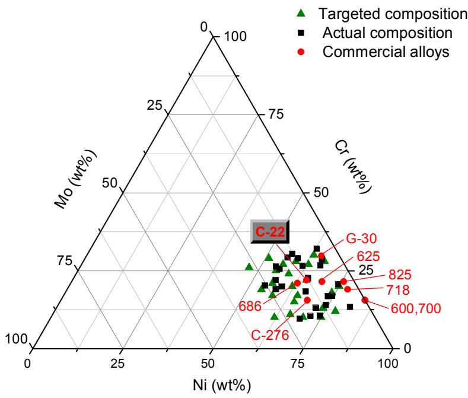  
Figure 3.1:  A ternary diagram that maps the composition of the fabricated and commercially available Ni­Cr­Mo alloys.

(a)  
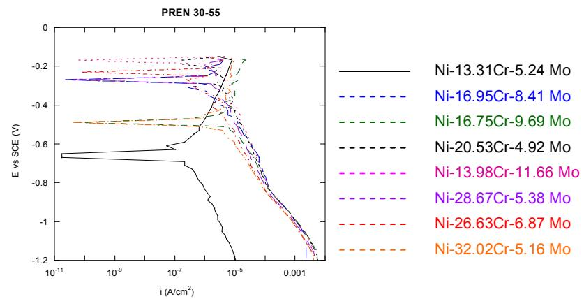

(b)  
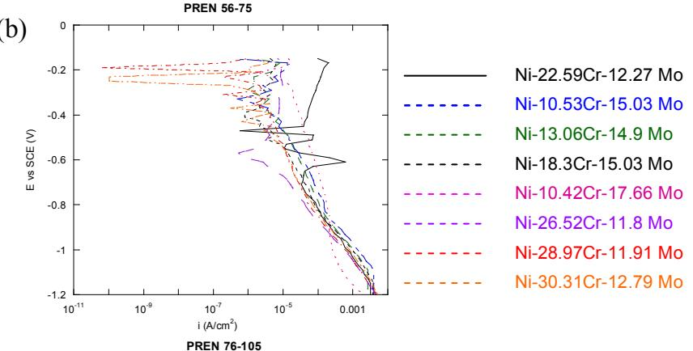

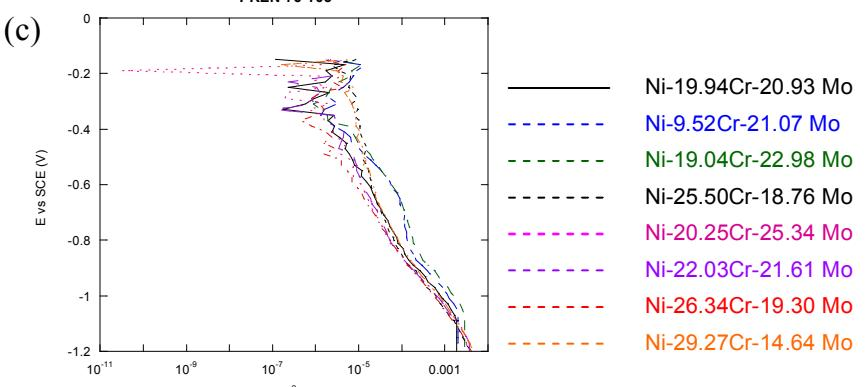  
i (A/cm Figure 3.2:  Cathodic polarization curves of the fabricated Ni­Cr­Mo alloys in 0.5 M NaCl solution at $6 0 \mathrm { { } ^ { \circ } C }$ show consistency on the cathodic behavior. The cathodic curves are separated into 3 groups: (a) PREN from 30 to 55, (b) PREN from 56 to 75, and (c) PREN from 76 to 105.

PREN 30­55  
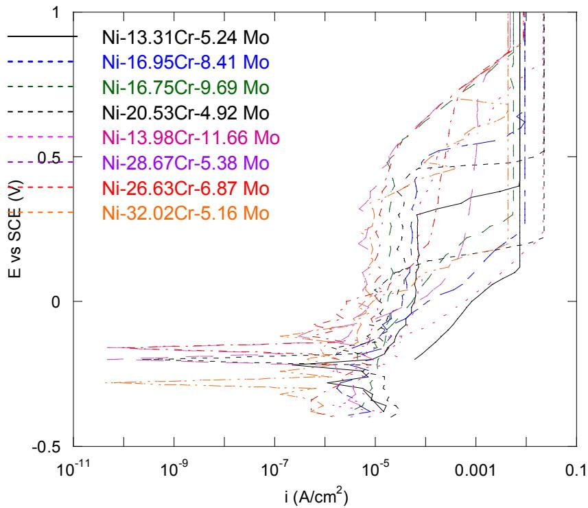  
Figure 3.3:  Anodic polarization curves of Ni­Cr­Mo alloys with PREN value from 30 to 55 in 0.5 M NaCl at $6 0 ^ { \circ } \mathrm { C }$

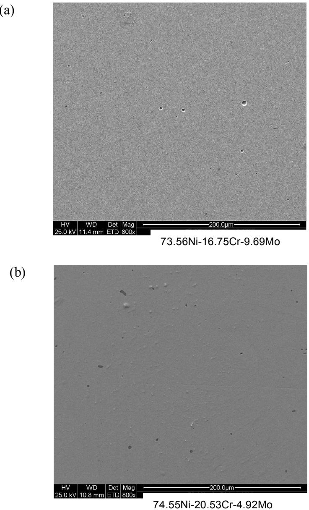  
Figure 3.4:  SEM pictures of Ni­Cr­Mo alloys with PREN value of between 30 and 55 after anodic polarization in 0.5 M NaCl at 60°C. Alloy with lower chromium (a) shows open pits while alloy with lower molybdenum (b) shows corrosion products formed on top of the pits.

PREN 56­75  
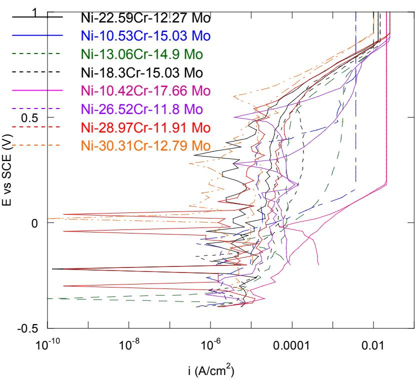  
Figure 3.5:  Anodic polarization curves of Ni­Cr­Mo alloys with PREN value from 56 to 75 in 0.5 M NaCl at ${ \bf \bar { 6 0 ^ { \circ } C } } .$

(a)  
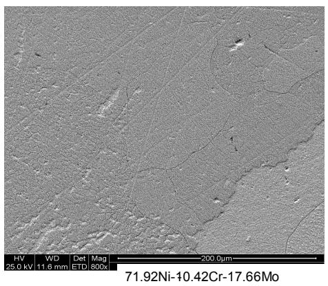

(b)  
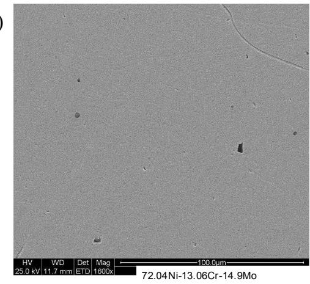

(c)  
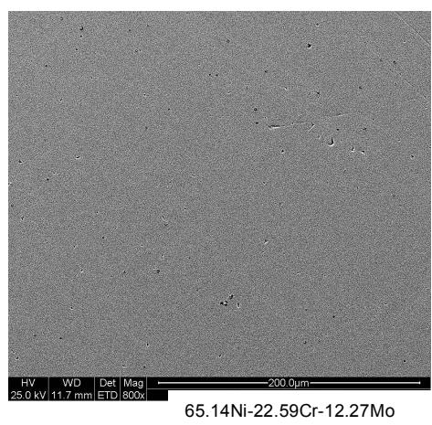  
Figure 3.6:  SEM pictures of Ni­Cr­Mo alloys with PREN between 56 and 75 after anodic polarization in 0.5 M NaCl at $6 0 \mathrm { { } ^ { \circ } C }$ . Alloy with very low chromium (a) shows severe uniform corrosion including an intergranular­like corrosion. Alloy with lower chromium but moderate molybdenum (b) shows pitting. Alloy with moderate amount of chromium and molybdenum shows no noticeable corrosion (c).

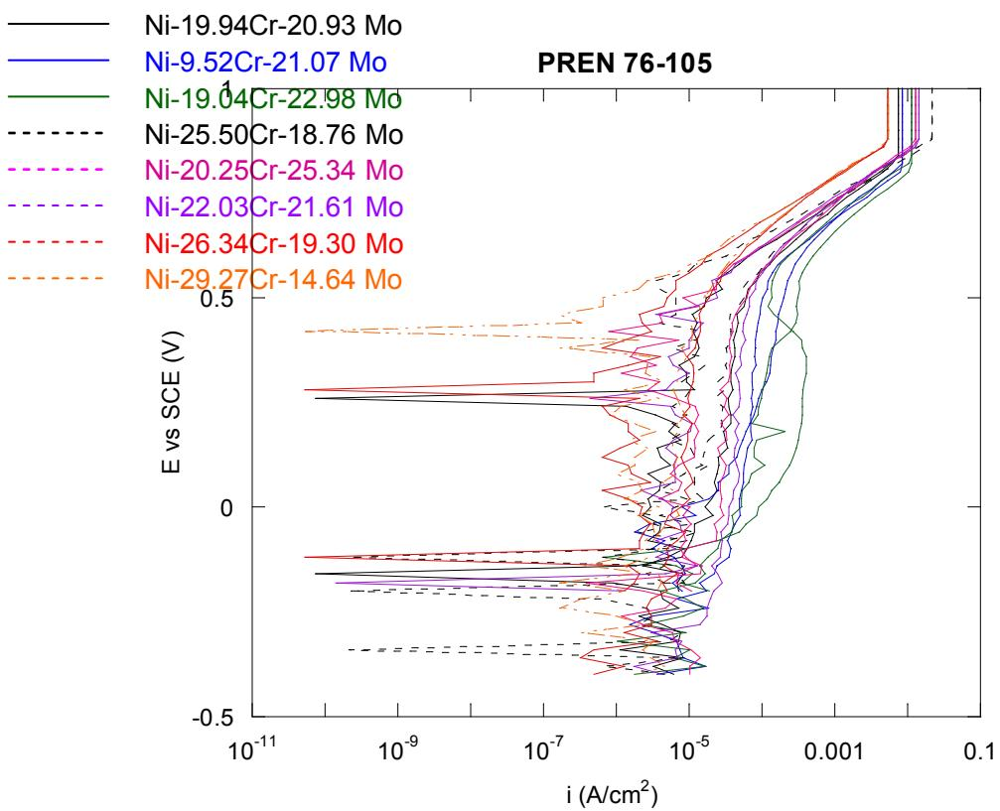  
Figure 3.7:  Anodic polarization curves of Ni­Cr­Mo alloys with PREN value from 76 to 105 in 0.5 M NaCl at $6 0 ^ { \circ } \mathrm { C } .$

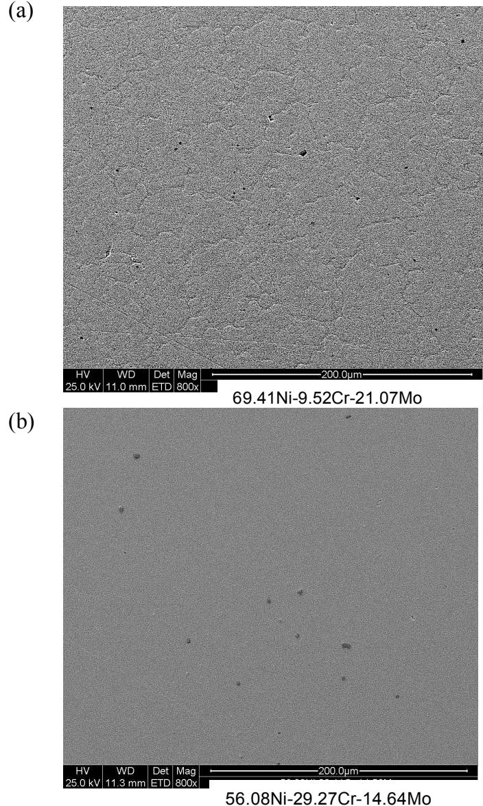  
Figure 3.8:  SEM pictures of Ni­Cr­Mo alloys with PREN value between 76 and 105 after anodic polarization in 0.5 M NaCl at $6 0 ^ { \circ } \mathrm { C }$ . Alloy with very low chromium (a) shows an intergranular­like and pitting corrosion. Alloy with higher chromium and molybdenum (b) shows no sign of corrosion.

(a)  
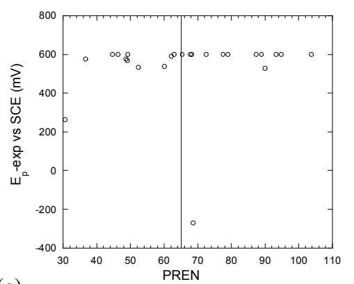  
(b)

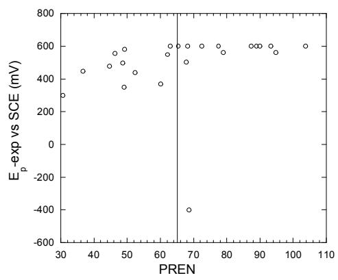  
(d)

(c)  
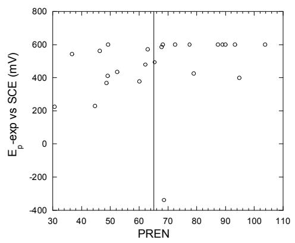

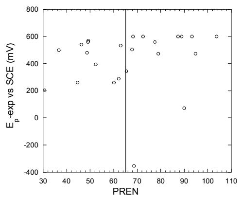  
Figure 3.9:  Plots of the experimental pitting potentials $\mathrm { ( E _ { p - e x p } ) }$ of the Ni­Cr­Mo alloys in 0.5 M NaCl as a function of PREN at various temperatures: (a) $4 5 ^ { \circ } \mathrm { C } ,$ (b) $6 0 ^ { \circ } \mathrm { C } ,$ (c) $7 5 ^ { \circ } \mathrm { C }$ (d) $9 0 \mathrm { { } ^ { \circ } C }$ . The solid line represents the calculated PREN value of Alloy C­22, which is 65.

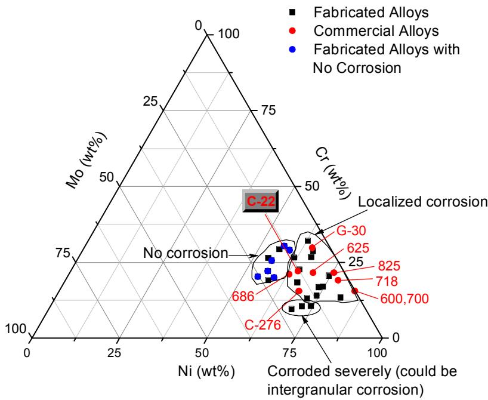  
Figure 3.10:  A ternary diagram that shows the composition maps of some Ni­Cr­Mo alloys that are corrosion resistant, and some that are susceptible to severe corrosion (uniform type of corrosion) and localized corrosion (pitting).

(a)  
(b)  
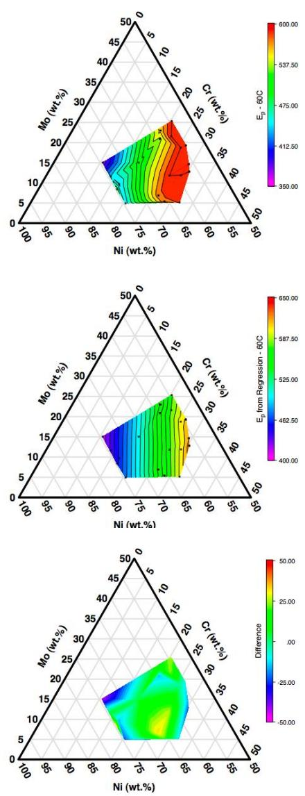  
(c)  
Figure 3.11:  Contoured ternary diagrams that show the experimental pitting potentials (a), calculated pitting potentials (b), and the value difference between them (c) in mV showing the accuracy of the $\mathrm { E _ { p } }$ equation, which is obtained through multiple linear regressions, in predicting the pitting potential based on Cr and Mo weight percentages only. The calculated pitting potentials are based on $\mathrm { E _ { p } = 1 1 . 1 4 ( w t . ^ { \circ } \% C r ) + 5 . 4 7 ( w t . ^ { \circ } \mathrm { { \Omega } \mathrm { { M o } ) } } }$ +214.09. The environment was 0.5 M NaCl at $6 0 \mathrm { { } ^ { \circ } C }$

<table><tr><td>Ni</td><td>Cr</td><td>Mo</td><td>PREN</td></tr><tr><td>65.14</td><td>22.59</td><td>12.27</td><td>63.08</td></tr><tr><td>81.45</td><td>13.31</td><td>5.24</td><td>30.60</td></tr><tr><td>74.64</td><td>16.95</td><td>8.41</td><td>44.70</td></tr><tr><td>74.44</td><td>10.53</td><td>15.03</td><td>60.13</td></tr><tr><td>73.56</td><td>16.75</td><td>9.69</td><td>48.73</td></tr><tr><td>59.14</td><td>19.94</td><td>20.93</td><td>89.01</td></tr><tr><td>69.41</td><td>9.52</td><td>21.07</td><td>79.05</td></tr><tr><td>57.97</td><td>19.04</td><td>22.98</td><td>94.87</td></tr><tr><td>55.75</td><td>25.50</td><td>18.76</td><td>87.41</td></tr><tr><td>74.55</td><td>20.53</td><td>4.92</td><td>36.77</td></tr><tr><td>74.36</td><td>13.98</td><td>11.66</td><td>52.46</td></tr><tr><td>72.04</td><td>13.06</td><td>14.90</td><td>62.23</td></tr><tr><td>66.67</td><td>18.30</td><td>15.03</td><td>67.90</td></tr><tr><td>54.40</td><td>20.25</td><td>25.34</td><td>103.87</td></tr><tr><td>56.36</td><td>22.03</td><td>21.61</td><td>93.34</td></tr><tr><td>71.92</td><td>10.42</td><td>17.66</td><td>68.70</td></tr><tr><td>61.68</td><td>26.52</td><td>11.80</td><td>65.46</td></tr><tr><td>59.12</td><td>28.97</td><td>11.91</td><td>68.27</td></tr><tr><td>65.94</td><td>28.67</td><td>5.38</td><td>46.42</td></tr><tr><td>56.91</td><td>30.31</td><td>12.79</td><td>72.52</td></tr><tr><td>66.50</td><td>26.63</td><td>6.87</td><td>49.30</td></tr><tr><td>54.35</td><td>26.34</td><td>19.30</td><td>90.03</td></tr><tr><td>56.08</td><td>29.27</td><td>14.64</td><td>77.58</td></tr><tr><td>62.82</td><td>32.02</td><td>5.16</td><td>49.05</td></tr></table>

Table 3.1:  Composition of the Fabricated Ni­Cr­Mo Alloys in Wt.%. The bold and italicized numbers are the composition of the alloys that are corrosion resistant in this study.

<table><tr><td>Temp (C)</td><td>Multiple Linear Regression Results</td><td>R</td><td>Cr/Mo Ratio</td></tr><tr><td>45</td><td> $E _ { \mathrm { p } } = 0 . 8 8 ( \mathrm { w t . } \% \mathrm { C r } ) + 0 . 6 8 ( \mathrm { w t . } \% \mathrm { M } 0 ) + 5 6 6 . 7 9$ </td><td>0.46</td><td>1.3</td></tr><tr><td>60</td><td> $\mathsf { E } _ { \mathsf { p } } = 1 1 . 1 4 ( \mathsf { W I } . \mathsf { \% C r } ) + 5 . 4 7 ( \mathsf { w t } . \mathsf { \% } \mathsf { M o } ) + 2 1 4 . 0 9$ </td><td>0.88</td><td>2.0</td></tr><tr><td>75</td><td> $\mathsf { E } _ { \mathsf { p } } = 1 4 . 9 3 ( \mathsf { w t } . \mathsf { \% } \mathsf { C r } ) + 1 1 . 6 2 ( \mathsf { w t } . \mathsf { \% } \mathsf { M o } ) + 1 0 . 6$ </td><td>0.91</td><td>1.3</td></tr><tr><td>90</td><td> $\mathsf { E } _ { \mathsf { p } } = 1 8 . 4 5 ( \mathsf { w t . } \mathsf { \% C f } ) + 1 0 . 9 6 ( \mathsf { w t . } \mathsf { \% M o } ) - 7 1 . 2 1$ </td><td>0.89</td><td>1.7</td></tr><tr><td>Temp  $\underline { { ( ^ { \circ } \mathbf { C } ) } }$ </td><td>Multiple Linear Regression Results</td><td> $\overline { R ^ { z } }$ </td><td>Cr/Mo Ratio</td></tr><tr><td>45</td><td> $E _ { \mathrm { r p } } = 2 8 . 8 6 ( \mathsf { w t . } \mathsf { \% C r } ) + 3 1 . 3 4 ( \mathsf { w t . } \mathsf { \% M o } ) \cdot 6 9 3 . 6 7$ </td><td>0.92</td><td>0.9</td></tr><tr><td>60</td><td> $\mathsf { E } _ { \mathsf { r p } } = 3 4 . 6 2 ( \mathsf { w t . } ^ { \circ } / \mathsf { o C r } ) + 3 8 . 5 5 ( \mathsf { w t . } ^ { \circ } / \mathsf { o M o } ) - 1 0 1 1 . 3 9$ </td><td>0.93</td><td>0.9</td></tr><tr><td>75</td><td> $\mathsf { E } _ { \mathsf { r p } } = 4 2 . 6 4 ( \mathsf { W L } \% \mathsf { C } \mathsf { r } ) + 4 4 . 0 5 ( \mathsf { w t . } \% \mathsf { M } 0 ) - 1 3 0 7 . 4 5$ </td><td>0.94</td><td>1.0</td></tr><tr><td>90</td><td> $\mathsf { E } _ { \mathsf { r p } } = 2 9 . 1 7 ( \mathsf { W I } . \% \mathsf { C } \mathsf { C } \mathsf { r } ) + 2 4 . 6 1 ( \mathsf { W } \mathsf { I } . \% \mathsf { M } 0 ) \cdot 8 4 8 . 5 1$ </td><td>0.96</td><td>1.2</td></tr><tr><td>60</td><td> $E _ { \mathrm { p } } = 1 2 . 3 9 ( \mathsf { w t . } \mathsf { \% C r } ) + 9 . 2 7 ( \mathsf { w t . } \mathsf { \% } \mathsf { M o } ) + 1 3 3 . 8 7$ </td><td>0.81</td><td>1.3</td></tr><tr><td>80</td><td> $\mathsf { E } _ { \mathsf { p } } = 1 3 . 5 8 ( \mathsf { w t . } \mathsf {  { \% } C r } ) + 1 9 . 8 2 ( \mathsf { w t . } \mathsf {  { \% } M o } ) - 1 0 5 . 5 7$ </td><td>0.87</td><td>0.7</td></tr><tr><td>95</td><td> $\mathsf { E } _ { \mathsf { p } } = 1 6 . 4 6 ( \mathsf { w t . } \mathsf {  { \% } C r } ) + 2 2 . 8 8 ( \mathsf { w t . } \mathsf {  { \% } M o } ) - 2 1 9 . 3 4$ </td><td>0.82</td><td>0.7</td></tr><tr><td>Temp (°C)</td><td>Multiple Linear Regression Results</td><td> $\overline { R ^ { z } }$ </td><td>Cr/Mo Ratio</td></tr><tr><td>60</td><td> $\mathsf { E } _ { \mathsf { r p } } = 3 6 . 4 1 ( \mathsf { w t . } \% \mathsf { C r } ) + 3 4 . 1 0 ( \mathsf { w t . } \% \mathsf { M o } ) - 1 0 3 7 . 3 4$ </td><td>0.92</td><td>1.1</td></tr><tr><td>80</td><td> $\mathsf { E } _ { \mathsf { r p } } = 2 4 . 5 6 ( \mathsf { w t . \% 6 } \mathsf { C r } ) + 2 7 . 6 8 ( \mathsf { w t . \% } \mathsf { M 0 } ) \cdot 7 2 7 . 6 5$ </td><td>0.92</td><td>0.9</td></tr><tr><td>95</td><td> $\mathsf { E } _ { \mathsf { r p } } = 2 7 . 0 8 ( \mathsf { w t . \% C } \mathsf { C r } ) + 4 1 . 3 2 ( \mathsf { w t . \% M 0 } ) \cdot 9 9 7 . 1 9$ </td><td>0.89</td><td>0.7</td></tr></table>

Table 3.2: Regression Analysis Equations for Pitting Potential $\mathrm { ( E _ { p } ) }$ in mV as a Function of Alloying Content in Neutral Chloride Condition at Various Temperatures.

Table 3.3:  Regression Analysis Equations for Repassivation Potential $\mathrm { ( E _ { r p } ) }$ in mV as a Function of Alloying Content in Neutral Chloride Condition at Various Temperatures.

Table 3.4 :  Regression Analysis Equations for Pitting Potential $\mathrm { ( E _ { p } ) }$ in mV as a Function of Alloying Content in Acidified Chloride Condition at Various Temperatures.

Table 3.5:  Regression Analysis Equations for Repassivation Potential $\mathrm { ( E _ { r p } ) }$ in mV as a Function of Alloying Content in Acidified Chloride Condition at Various Temperatures.

## REFERENCES

1. P. Crook and D. Klarstrom, Introduction to Alloys Resistant to Aqueous Corrosion, ASM International, Materials Park, OH (2005).

2. J. R. Hayes, J. J. Gray, A. W. Szmodis and C. A. Orme, Corrosion, 62, 491­500 (2006).

3. A. C. Lloyd, J. J. Noel, S. McIntyre and D. W. Shoesmith, Electrochimica Acta, 49, 3015­3027 (2004).

4. F. Hua and G. Gordon, Corrosion, 60, 764 (2004).

5. J. Horvath and H. H. Uhlig, J. Electro. Soc., 115, 791­795 (1968).

6. W. Z. Friend, Corrosion of Nickel and Nickel­Based Alloys, John Wiley and Sons, New York, NY (1980).

7. R. S. Lillard, M. P. Jurinski and J. R. Scully, Corrosion, 50, 251 (1994).

8. S. Ghosh and T. Ramgopal, Corrosion, 61, 609­619 (2005).

9. B. A. Kehler and J. R. Scully, Corrosion, 61, 665 (2005).

10. A. C. Lloyd, D. W. Shoesmith, N. S. McIntyre and J. J. Noel, J. Electro. Soc., 150, B120­B130 (2003).

11. J. R. Crum, J. M. Poole and E. L. Hibner, United States Patent, Inco Alloys International, Inc. (1991).

12. B. A. Kehler, G. O. Ilevbare and J. R. Scully, Corrosion, 57, 1042­1065 (2001).

13. R. F. A. Jargelius­Pettersson, Corrosion, 54, 162 (1998).

14. L. F. Garfias­Mesias, J. M. Sykes and C. D. S. Tuck, Corrosion Science, 38, 1319 (1996).

15. A. P. Bond and H. H. Uhlig, J. Electrochem. Soc., 107, 488 (1960).

16. V. K. Lorenz and G. Medawar, Thyssenforschung, 1, 97­108 (1969).

17. A. C. Lloyd, J. J. Noel, N. S. McIntyre and D. W. Shoesmith, JOM, 57, 31 (2005).

18. M. Pourbaix, Atlas of Electrochemical Equilibria in Aqueous Solutions, NACE, Houston, TX (1974).

19. N. Priyantha, P. Jayaweera, G. R. Englehardt, A. Davydov and D. D. Macdonald, Corrosion, 61, 857­871 (2005).

20. D.C. Harris, Quantitative Chemical Analysis, W.H. Freeman and Company, New York, NY (1991).

CHAPTER 4

## THE EFFECT OF COMPOSITION ON THE METASTABLE PITTING OF Ni-Cr­Mo ALLOYS IN CHLORIDE SOLUTION

## 4.1  INTRODUCTION

The corrosion behavior of Ni­Cr­Mo solid solution alloys is strongly influenced by composition. Alloys with high Cr and Mo contents can be highly corrosion resistant and localized corrosion is difficult to stabilize. As a result, study of metastable pitting events is a means to characterize the effect of alloy composition on localized corrosion behavior.

There are three distinct stages in a pitting process. In a sequential order, they consist of pit initiation, metastable pitting, and stable pitting [1­3]. Some reports state that metastable pitting might also occur prior to the onset of stable crevice attack [4,5]. Because we can learn many of the same things about the relationship between alloy composition and pitting from studies of metastable pitting, it may be more advantageous to look at metastable pitting rather than stable pitting in the most corrosion resistant alloys.

The occurrence of metastable pitting is commonly noted in passive metals such as, aluminum [6,7] and stainless steels [8,9]. It may represent an important damage accumulation process in its own right should it operate over long periods of time. Metastable pits are short­lived but do exhibit distinct initiation, growth, and repassivation behaviors. Metastable pits are usually observed below the critical pitting potential and commonly detected as current transients during potentiostatic polarization at such potentials. A general statement relating the stable pit initiation rate, L, to the metastable pitting rate, l, has been given by Williams, et al. [8]:

$$
\Lambda = \lambda \exp ( - \mu \tau _ { \mathrm { c } } )\tag{Eqn. 4.1}
$$

where $\lambda ( \mathrm { c m } ^ { - 2 } \mathrm { s } ^ { - 1 } )$ is the initiation frequency of the metastable pits, $\mu ( \mathrm { s } ^ { - 1 } )$ is the probability that the metastable pit will repassivate , and $\tau _ { \mathrm { c } } \left( \mathrm { s } \right)$ is the critical age beyond which the pit becomes stable.  The applicability of this relationship to pitting processes can be argued, but the expression does provide a useful framework for studying and characterizing statistical aspects of pitting.

As in stable localized corrosion, alloy composition also greatly affects the metastable pitting behavior [7,10,11]. The beneficial effect of alloying on metastable pitting has been studied on Al with Cu additions [7]. Kim and Buchheit found that the metastable pit initiation and growth rates are reduced by the addition of Cu as long as Cu is maintained in the solid solution. Cr and Mo additions in SS are observed to reduce the current transient height, promote an earlier start of the repassivation process, and

decrease the frequency of transients as a function of time [10]. Other alloying additions can be detrimental for metastable pitting as observed in Al alloy with Zn addition. Zn appears to produce faster growth rate, longer growth time, and larger pit size [11].

Cr and Mo additions to Ni lead to alloys with excellent localized corrosion resistance. Cr is the main element in stabilizing passivity in Ni­Cr­Mo alloys [12,13] and has been shown to increase the pitting potential in other Ni­based alloys [14]. It is found that the passive film that forms on Ni­Cr­Fe or Ni­Cr­Mo alloys consists predominantly of Cr oxide layers that are located at the film­substrate interface [15]. On the other hand, Mo additions appear to influence localized corrosion site kinetics and have been shown to increase the repassivation potential [12] and delay crevice initiation [16].

Several studies have been conducted to analyze the metastable pitting behavior of Ni­Cr­Mo alloys. Priyantha et al. found that Alloy C­22 has a low metastable pit nucleation rate and a low survival probability for becoming a stable pit [17]. A study by Kehler and Scully investigated the metastable pitting behavior inside Alloy 625 and Alloy C­22 crevices [5]. They concluded that the metastable event rates are higher for Alloy 625 than for Alloy C­22 due to higher Mo content and the presence of W in Alloy C­22. This result indicates that Alloy 625 has higher crevice susceptibility when compared to Alloy C­22. They also observed that Alloy 625 has a deeper crevice attack than Alloy C­22.

The objective of the present study is to characterize the effect of Cr and Mo additions on localized corrosion behavior through rigorous characterization of metastable pitting. Metastable pit growth, growth rates, repassivation, and repassivation rates were examined through potentiostatic tests at $9 0 \mathrm { { } ^ { \circ } C }$ . The dependence of pit size on Cr and Mo content was calculated based on the current­time plots. The pit size was also used to reconcile possible discrepancies in pit current density among the alloys studied.

## 4.2  EXPERIMENTAL PROCEDURES

Alloys fabrication was described in Chapter 3. Table 4.1 represents the details on alloy composition of the fabricated samples analyzed in this study. The alloys were individually mounted using the Dexter Hysol TM epoxy. Samples were divided into 2 groups: the first group comprised of Ni­based alloys with Cr contents ranging from 20 to 22 wt.% with varying Mo content (25, 21, and 13 wt.%). It is to be noted that the Ni alloy with 22wt.%Cr­13 wt.%Mo is a commercial Alloy C­22; hence, it also contained 3wt.%W and 4wt.%Fe.  The second group had the same Mo content (12 wt.%), but varying Cr content (23 and 29 wt.%).

All samples were polished to 1 micron diamond paste surface finish. Prior to potentiostatic tests, potentiodynamic polarizations with 0.2 mV/s scan rate were performed to determine the critical pitting potential of each alloy and the potential value for the potentiostatic experiments to generate current time records to observe metastable pitting. Potentiostatic experiments were performed on Ni­Cr­Mo alloys using Gamry Reference 600 TM at $9 0 \mathrm { { } ^ { \circ } C }$ in 0.5 M NaCl. The Gamry Reference 600 TM system has a detection limit of 60 pA with $2 0 \times 1 0 ^ { - 1 8 }$ Amps current resolution. The electrochemical tests used a regular 3­electrode setup with saturated calomel electrode (SCE) as the reference electrode and graphite rods as counter electrodes. The data sampling period was set at 3 Hz. Potentiostatic experiments were carried out for 4 hours. Current transients from the five alloys were collected from potentiostatic measurements and subject to several different types of post­measurement analysis.

## 4.3  RESULTS AND DISCUSSION

## 4.3.1 Metastable Pits Growth, Repassivation, and Kinetics

Anodic polarization curves for the five alloys in 0.5M NaCl at $9 0 \mathrm { { } ^ { \circ } C }$ are shown in Figure 4.1. The alloys present very similar behavior. They all have passive current densities of about $1 0 ^ { - 6 } \mathrm { A / c m } ^ { 2 }$ and breakdown potentials ranging from 0.32 to $0 . 3 5 \mathrm { V } _ { \mathrm { S C E } }$ Metastable pits usually form right below the breakdown potential; hence, it was determined that potentiostatic tests would be conducted at $0 . 2 \mathrm { V } _ { \mathrm { S C E } }$ . At this potential, metastable pitting is expected without risk of stable pitting. After the polarization, the alloys were inspected using an optical microscope for any signs of crevice. Due to the relatively high Cr and Mo content on these alloys, crevice attack was not commonly observed although, if crevices were seen, the data sets were eliminated from the analysis.

Current transients from the potentiostatic tests are shown in Figure 4.2. The background current decays to low values at longer times. In this study, a current peak is considered to be a metastable pit when the peak is equal to or greater than 1 nA above the local background current. It is shown here that metastable pits occur mostly at the beginning of the tests and show a reduced incidence after 5000 s. The decreasing number of events is believed to be due to an exhaustion number of sites available for initiation as is also observed in SS [3].

Analysis of the current time records shows that there are 3 different types of metastable pitting events, which are distinguished based on their repassivation response, as depicted on Figure 4.3. These are referred to as rapid repassivation (a), 2­stage repassivation (b), and interrupted repassivation (c). Rapid repassivation was the most commonly observed metastable pitting type.  Here, the current rises up to a peak value and repassivation is characterized by a prompt decrease in current indicating immediate repassivation. Figure 4.3(a) also serves to show the diagrammatic definitions of characteristics that can be used to define the metastable pitting process. The peak current $\mathrm { ( I _ { p e a k } ) }$ is the current value at the maximum minus the background current. The time for the current to reach the peak is defined to be the growth time $\left( \mathrm { t _ { g } } \right)$ , and the time for the current to decrease to the background current value is defined as the repassivation time (tr).

The second type of metastable pitting, Figure 4.3(b), shows a 2­stage repassivation, which is also observed in aluminum alloys [7]. The initial stage consists of a rapid drop in current but not low enough to be equal as the local background current. This current drop is denoted by $\mathrm { { I _ { r e p a s s 1 } } }$ . The rapid current drop is followed by a slower decay down to the background current, which is marked as $\mathrm { I } _ { \mathrm { r e p a s s 2 } }$ in this Figure.  The time needed for both stages of current drop is denoted by $\mathrm { t _ { r l } }$ and $\mathbf { t } _ { \Gamma 2 } .$ , respectively. For these types of pits, the first stage of repassivation is more crucial than the second stage as the big drop in current occurs during the first stage. Thus, once the first stage repassivation takes place, there is very little possibility that the metastable pit would stabilize.

Interrupted repassivation type (Figure 4.3(c)) occurs when the first metastable pit that forms does not have enough time to repassivate completely while a second metastable pit has started to form. It can not be confirmed whether these two current peaks correspond to a single location on the alloy or two separate locations. Nevertheless, for the analysis part of this study, these peaks are treated as two individual peaks.

The number of metastable pit events taking place is found to be dependent on the content of both Cr and Mo as illustrated in Figure 4.4. From this plot, it is shown that the beneficial effect of adding Cr and Mo is to reduce the occurrence of metastable pits. At (Cr+Mo) content of about 41 wt.%, the alloy with higher Mo content has lower number of events compared to the alloy with a higher Cr content. This finding supports the idea that one important effect of Mo additions on corrosion resistance is to decrease the number of metastable pitting events [3,5,18].

Cumulative distribution plots of the peak current values of the metastable pits are shown in Figure 4.5(a) and (b). The plot for group I, which is the varying Mo group, in Figure 4.5(a) shows that peak current values are slightly lower for alloys with higher Mo content. In group II that has varying Cr alloys (Figure 4.5(b)), peak current values are not altered. It can be concluded that the values of peak currents in metastable pitting is dependent on Mo content and independent of Cr content. This result supports the idea that Mo functions to restrict pit growth in Ni­Cr­Mo alloys. Even though, the exact mechanism is yet to be clarified.

The median $\mathrm { { I _ { p e a k } } }$ values for the Ni­Cr­Mo alloys range from 2.5 to 9 nA. In a study of Fe­Cr and Fe­Cr­Mo alloys, the authors found that the average $\mathrm { { I _ { p e a k } } }$ ranged from

7 nA to 0.01 nA for Fe­Cr and 0.8 nA to 0.01 nA for Fe­Cr­Mo with higher Cr and Mo contents resulting in lower $\mathrm { { I _ { p e a k } } }$ values [10]. A lower instrument detection limit, which was 0.002 nA, and higher sampling rate at 7.5 Hz might be the reason for the much lower Fe­Cr and Fe­Cr­Mo average $\mathrm { { I _ { p e a k } } }$ values in that study while in the present study, 1 nA is the minimum peak height requirement to be considered a metastable pit. For Al alloys, the values are significantly higher where Al­0.2wt.%Cu has a median $\mathrm { { I _ { p e a k } } }$ value of 30 nA [7]. These comparisons are ways in which localized corrosion susceptibility could be characterized through metastable pitting characteristics of an alloy.

In varying Mo group (group I), metastable pit growth time $\left( \mathrm { t _ { g } } \right)$ is slightly longer for Alloy C­22 with 13wt.% Mo compared to the higher Mo alloys as shown by the cumulative distribution plot in Figure 4.6(a). However, the discrepancy is not significant enough to assume that the composition variation between the alloys is responsible for the sluggishness of the pit growth in Alloy C­22. The cumulative distribution plots of the growth time in group II did not vary from sample to sample as represented in Figure 4.6(b). The disparity in growth time between the pits is in 0.3 s increments due to the 3 Hz sampling rate.  Even though this sampling rate value might cause some issues concerning the $\mathfrak { t } _ { \mathrm { g } }$ and maybe $\mathrm { { I _ { p e a k } } }$ , the effect of alloying additions on metastable pitting behavior could still be captured through these experiments.

The repassivation time for the rapid repassivating, interrupted repassivating, and the first stage of the 2­stage repassivating pits is shown as $\mathrm { \Delta t _ { r l } }$ in Figure 4.7. The maximum $\mathrm { \Delta t _ { r l } }$ for group II (Figure 4.7(b)) appears to be 2 to 3 times higher than group I (Figure 4.7(a)), which indicates that higher Mo content or the presence of W, for Alloy

C­22, in group I alloys might promote pit repasivation. Shorter repassivation time on those alloys could also be the result of their lower peak height values, which then, allow them to repassivate faster.

The cumulative distribution plots of the repassivation time for the last stage of the 2­stage repassivating pits are represented as $\mathbf { t } _ { \mathrm { r } 2 }$ in Figure 4.7. After the first stage, the active pit is already close to complete repassivation; hence, the second stage of the repassivation is not significant considering that the probability of a transition to stable corrosion is relatively low at this stage.

By dividing the peak current by the time of growth, the growth rate of the metastable pits is obtained and the distribution plots are shown in Figure 4.8. This figure shows that alloys with identical Mo content (Figure 4.8(b)) exhibit similar pit growth rate behavior. However, in varying Mo group (Figure 4.8(a)), the growth rates of the fastest growing pits are comparatively slower on the higher Mo alloys suggesting that Mo inhibits the growth rate of the faster­growing metastable pits. A similar finding was observed in SS where Kobayashi, et al. found that the main effect of Mo was to decrease the size and number of the largest transients while the smaller transients were independent of Mo content [10]. It appears that Mo has the ability to impede the dissolution process of the larger and faster­growing pits.

Even though the role of Mo in reducing anodic dissolution kinetics has been proven in both Ni­based alloys and SS, the precise mechanism of this phenomenon has not been well established.  Several studies on stable pitting/crevice have suggested that Mo decreases the active dissolution rate by submonolayer surface enrichment of Mo

[20,21], formation of insoluble molybdates in the active pits [3,16,22], precipitation of a thick­porous layer of Mo­rich oxide on the pit walls [23], or formation of Mo­chloro complexes that reduce the number of free chloride ion concentration near the polarized surface [18].

The repassivation rate behavior of the metastable pits is depicted by the cumulative distribution plots on Figure 4.9(a) and (b). The repassivation rates are clearly dependent on alloy composition as apparent from Fig. 4.9. Repassivation rates appear to increase as the amount of Cr increases. In group I, Ni­22Cr­13Mo has the fastest repassivation rates compared to the other 2 alloys with 20 wt.%Cr. While among the group II alloys, below the 75% cumulative percentage, the 29 wt.%Cr has faster repassivation rates than the 23 wt.%Cr. Therefore, it can be said that the role of Cr on the metastable pitting behavior is to accelerate the repassivation process so that the probability of the metastable pits becoming stable pits is lessened. The involvement of Cr during the repassivation stage could be due to its ability to promote stability for the passive film once Mo suppresses the dissolution process. Although, another study believed that the role of Cr and Mo is to promote an earlier start of repassivation and not to speed up the repassivation kinetics on metastable pitting [10].

## 4.3.2 Metastable Pits Radii and Pit Stability

A pit radius can be calculated by using the Faraday’s law.  It is assumed that the pit has a hemispherical shape. Thus, by means of the current transient plots for all the alloys, metastable pit radius $( \mathrm { r _ { p i t } } )$ formed can be calculated via the following equation [6]:

$$
r _ { p i t } = ( \frac { 3 Q } { 2 \pi F } ) ^ { 1 / 3 } ( \rho _ { m i x } ) ^ { - 1 / 3 } ( E W ) ^ { 1 / 3 }
$$

where Q is the charge generated up to $\mathrm { { I _ { p e a k } } } .$ , and F is the Faraday’s constant with a value of 96487 C/eq. The $\rho _ { \mathrm { m i x } }$ is the density of the alloy. EW is the equivalent weight for the alloy.

The cumulative distribution plots of metastable pit radius are represented in Figures 4.10(a) and (b). The metastable pit radius varies with the content of Mo with higher Mo­containing alloys produced smaller pit radii as shown in Figure 4.10(a). In the Cr varying group (Figure 4.10(b)), the higher Cr­containing alloy has smaller pit radii at the higher cumulative percentage values than the lower Cr alloy. However, the pit radius variation in both groups is in a matter of less than 1 micron therefore, it can be said that the effect of alloy chemistry on the metastable pit radius is not very significant. The metastable pit radius for all five alloys is ranging from 0.11 to 1.9 micron. These values are in good agreement with the literature where they found metastable pit radius ranging from 0.21 to 3.1 micron for Alloy 625 and Alloy C­22 [5].

Using the pit radii, the distribution plots of the metastable pits peak current density $\left( \mathrm { i } _ { \mathrm { p e a k } } \right)$ is depicted in Figure 4.11. From these plots, it is observed that there is not much variation in $\mathrm { i _ { p e a k } }$ among the alloys. Although, higher Mo alloys have slightly lower maximum $\mathrm { i _ { p e a k } }$ values compared to the other alloys. In 316 SS, as described by Williams et al., the role of Mo is to decrease the probability a metastable pit would transition into a stable pit by decreasing the current density in the developing metastable pits [8]. In a

contrary note, a study on 302 SS, which has very small amount of Mo, showed that metastable pits that transitioned into stable pits had lower current densities than the nontransitioned ones [24]. Since the transitioning from metastable to stable pitting was not encountered in this study, the effect of current density values on the metastable to stable pit transition in Ni­Cr­Mo alloys is still to be determined.

The stability criterion for stable pitting in SS has been stated to be when $\mathrm { I _ { p e a k } / r _ { p i t } }$ value is greater than 4 x $1 0 ^ { - 2 }$ A/cm [8] while in Al, the transition is at $\mathrm { I _ { p e a k } / r _ { p i t } }$ of $1 0 ^ { - 2 }$ A/cm [6]. The $\mathrm { I _ { p e a k } / r _ { p i t } }$ value for all five Ni­Cr­Mo alloys examined in this study ranges from $3 \mathrm { ~ x ~ } 1 0 ^ { - 5 }$ to $1 \mathrm { ~ x ~ } 1 0 ^ { - 2 }$ A/cm. Assuming that the stability criterion for Ni­Cr­Mo alloys is more closely related to that for SS than Al considering the behavior of Ni­Cr­Mo alloys in resisting corrosion is more similar to SS than Al, the populations of pits examined in this study fall below the accepted thresholds for pit stability. Furthermore, current­time records of all five alloys could also be used to confirm the absence of stable pitting during the potentiostatic tests. The cumulative distribution plots of the $\mathrm { I _ { p e a k } / r _ { p i t } }$ for each alloy are shown in Figure 4.12.

The present study shows that the inhibiting effect of Mo that has been widely observed in stable pitting/crevice corrosion study is also detected during this metastable pitting study. The similarities on the effect of alloying elements during metastable and stable corrosion studies confirm that a rigorous metastable pitting study can be used to provide valuable information in an effort to better understand the role of alloying additions on localized corrosion. This is particularly useful for very corrosion resistant alloys like Ni­Cr­Mo alloys since pit stabilization can be rather difficult.

## 4.3.3  Summary of Results from the Cumulative Distribution Plots

The cumulative distribution plots have been used to characterize the statistical aspects of the metastable pitting behavior of the Ni­Cr­Mo alloys with Cr content ranging from 20 to 29% and Mo content ranging from 12 to 25%. Those plots show that alloying composition greatly affects the metastable pitting behavior of the Ni­Cr­Mo alloys. The median peak current value is found to vary with Mo content in the alloys as illustrated in Figure 4.13. The median $\mathrm { { I _ { p e a k } } }$ dropped from approximately 9 nA to 3 nA by increasing the Mo content from 12% to 25%.

The faster growing pits are also observed to be dependent on Mo content as discussed in section 4.3.1. The variation on the growth rate of the faster growing pits (at 95% Cumulative Percentage value) with respect to Mo content is shown in Figure 4.14. The growth rate of the faster growing pits is significantly reduced (up to 90%) by adding more Mo into the Ni­Cr alloys. This finding is important in regards to characterizing the role of Mo during a metastable pitting process which is believed to inhibit the growth process.

The metastable pit repassivation rates have been found to vary with the Cr content in the Ni­based alloys. Figure 4.15 shows the increasing trend of the median repassivation rate, $\mathrm { I _ { r e p a s s } / t _ { r } } ,$ , values with the Cr content. The repassivation rate goes up from 2 nA/s to approximately 13 nA/s by increasing the Cr content from 20% to 29%. A faster repassivation kinetics is imperative during a metastable pitting process as this means shorter lifetime for the metastable pits and reduces the risk of becoming stable pits.

## 4.4  CONCLUSIONS

It appears that both Cr and Mo have significant affect on the occurrence of metastable pitting in Ni­Cr­Mo alloys. The number of metastable pitting events is reduced by an increasing the amount of Cr and Mo in the alloy. The data suggest that increasing Mo concentration in the 12 to 25 wt.% range has greater influence in reducing the number of events than increasing Cr concentration in the 20 to 29 wt.% range. Peak pit current values are also found to be lower for alloys with higher Mo concentration. Pit growth time does not seem to be altered much by alloy composition. The maximum pit repassivation time observed for lower Mo alloys is 2 to 3 times longer than higher Mo or W added alloys. Metastable pit growth rate is independent of composition at the lower growth rates. However, in alloys with higher Mo concentration, the rate of the fastest growing pits is slowed compared to alloys with lower Mo concentration. Repassivation rate is found to be sensitive to Cr content in the alloy with faster pit repassivation rates associated with high­Cr alloy compositions.

Metastable pit radius is lower for higher Mo alloys or even in higher Cr alloys. However, the variation does not appear to be significant in values. Variation in the metastable pit peak current density also does not seem to be very significant; nonetheless, the higher Mo alloys have lower maximum pit current density values than the other alloys. Assuming that the pit stability criterion for Ni­Cr­Mo alloys is similar to that for stainless steels, it is apparent that the pits formed during the tests were below the criteria and thus, were metastable.

The findings from this metastable pitting study may be closely related to stable pitting or even crevice corrosion. It is noted that the effect of Mo inhibition on active dissolution, which has been observed in many localized corrosion studies, is also evident in this quantitative metastable pitting study.

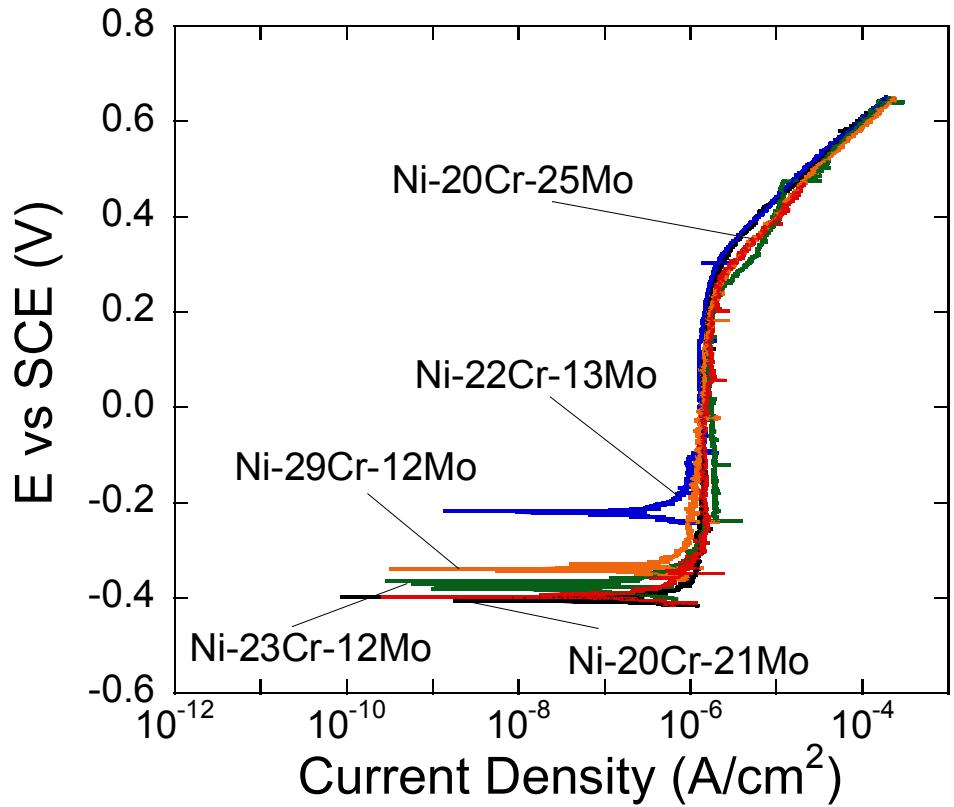  
Figure 4.1:  Anodic polarization curves of the Ni­Cr­Mo alloys in 0.5M NaCl at $9 0 \mathrm { { } ^ { \circ } C }$

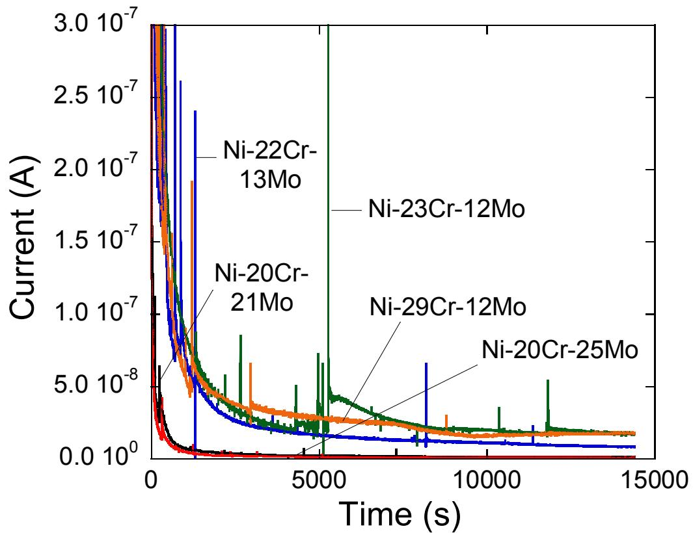  
Figure 4.2:  Current transients of the Ni­Cr­Mo alloys in 0.5M NaCl at $9 0 \mathrm { { } ^ { \circ } C }$ with potential hold at $0 . 2 \mathrm { V } _ { \mathrm { S C E } }$ .

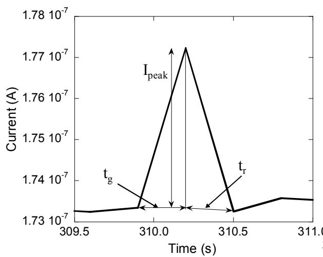  
(a)

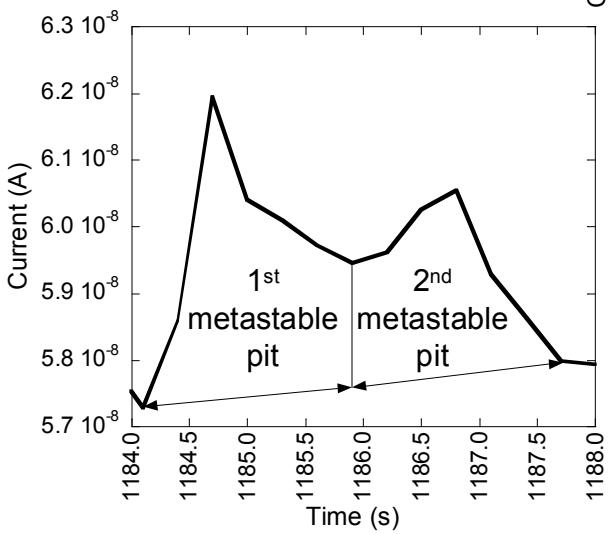  
(c)

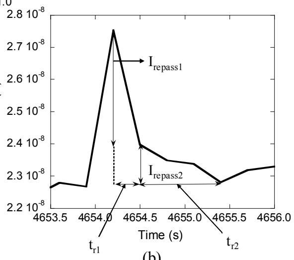  
(b)  
Figure 4.3:  Individual metastable pitting analysis shows the 3 different repassivation behavior of the Ni­Cr­Mo alloys: rapid repassivation (a), 2­stage repassivation (b), and interrupted repassivation (c)

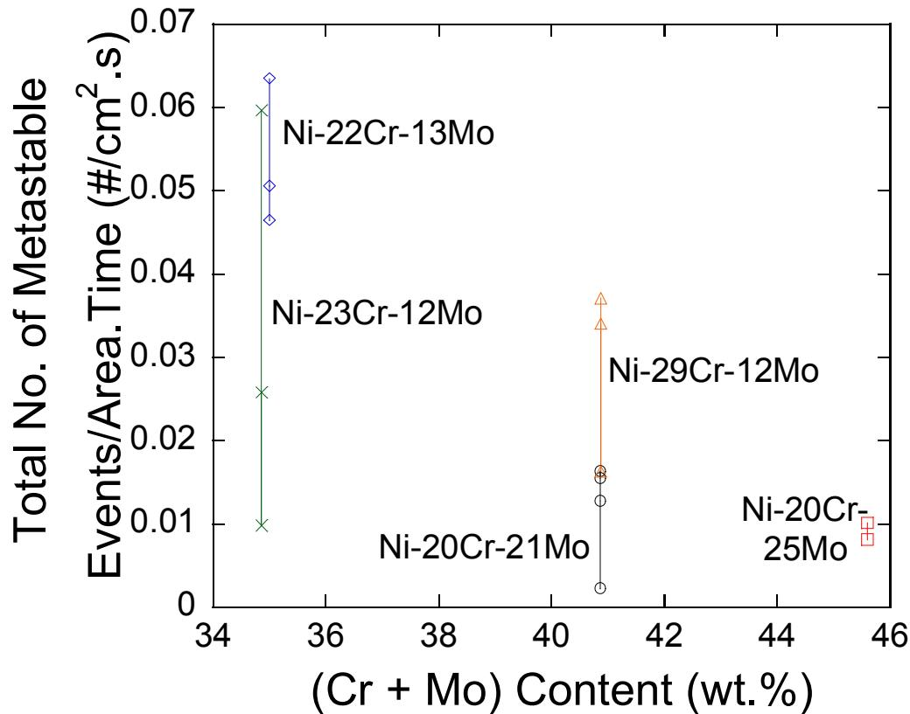  
Figure 4.4:  The number of metastable events normalized by area and time (with vertical lines indicating data scattering) decreases with an increasing Cr and Mo content.

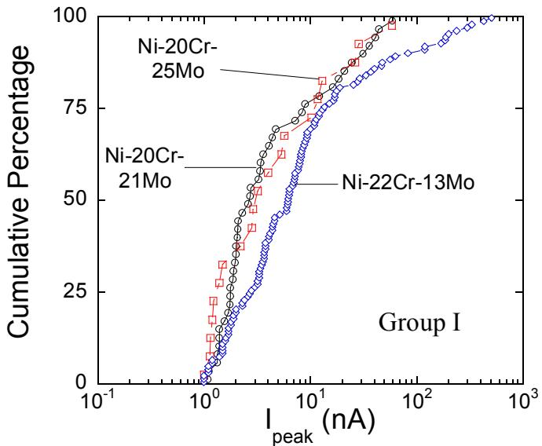

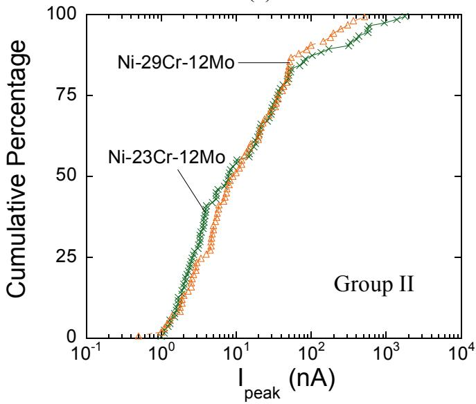  
(b)  
Figure 4.5:  Cumulative distribution plots of the peak current values of the metastable pits show that increasing Mo content reduces the metastable pit peak current (a). In the varying Cr content group (b), the peak current values are quite similar between the two alloys.

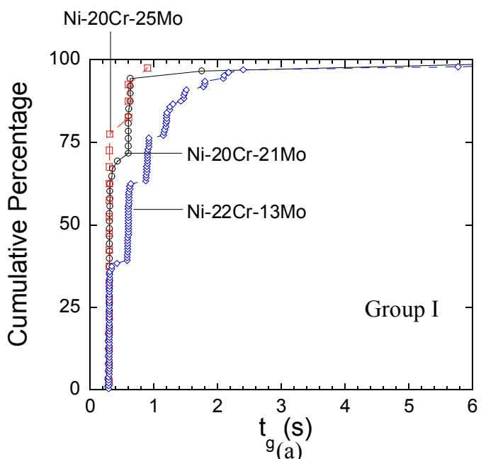

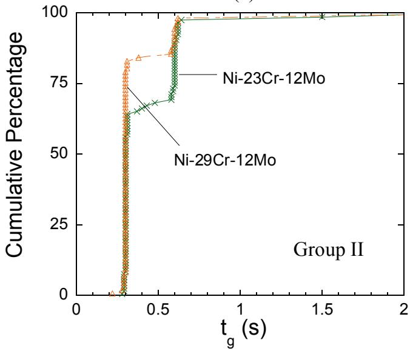  
(b)  
Figure 4.6:  Cumulative distribution plots of metastable pit growth time for varying Mo group (a) and varying Cr group (b) show little variation.

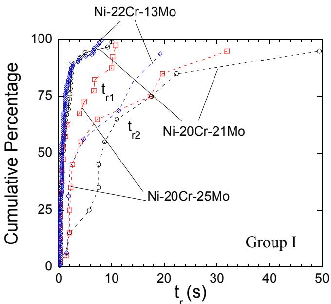

Ni­23Cr­12Mo (a)  
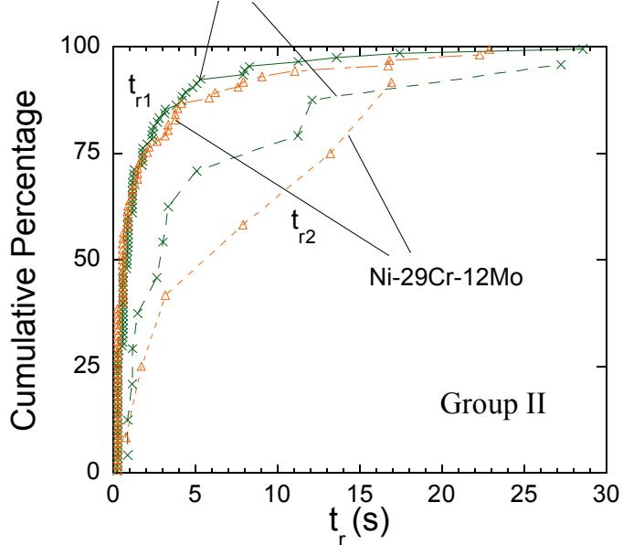  
(b)  
Figure 4.7:  Cumulative distribution plots of metastable pit repassivation time for varying Mo (a) and varying Cr (b) indicate the discrepancy between group I and group II maximum repassivation time values.

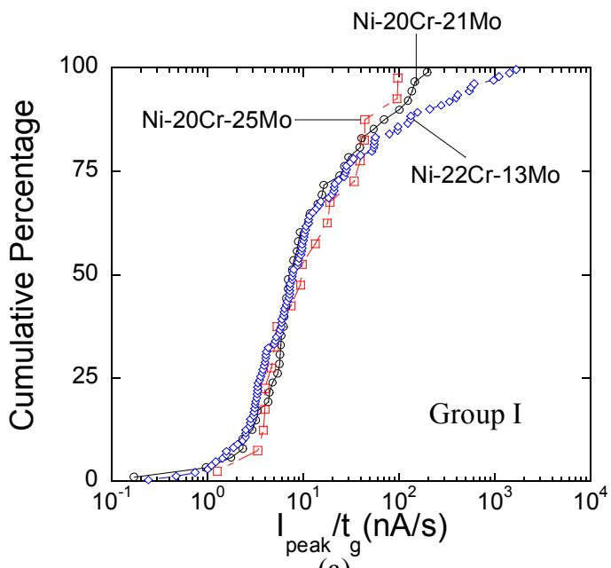

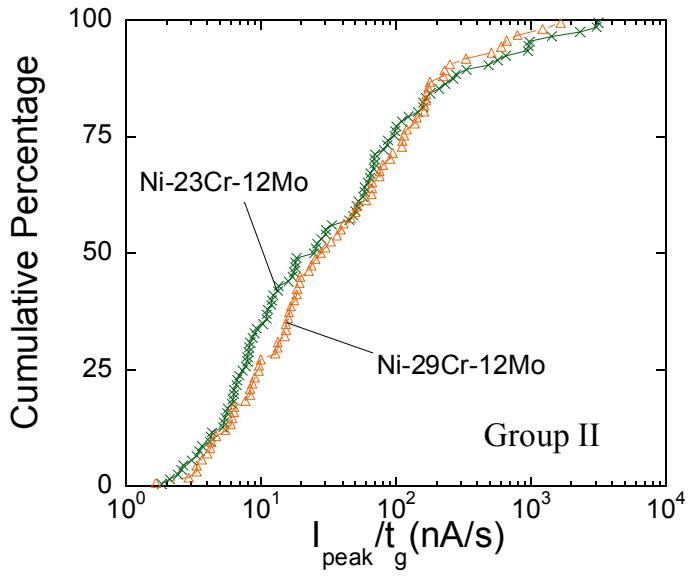  
(b)  
Figure 4.8. Cumulative distribution plots of metastable pit growth rates for Group I (a) showing some variation at higher percentage values, and Group II alloys (b) showing no variation.

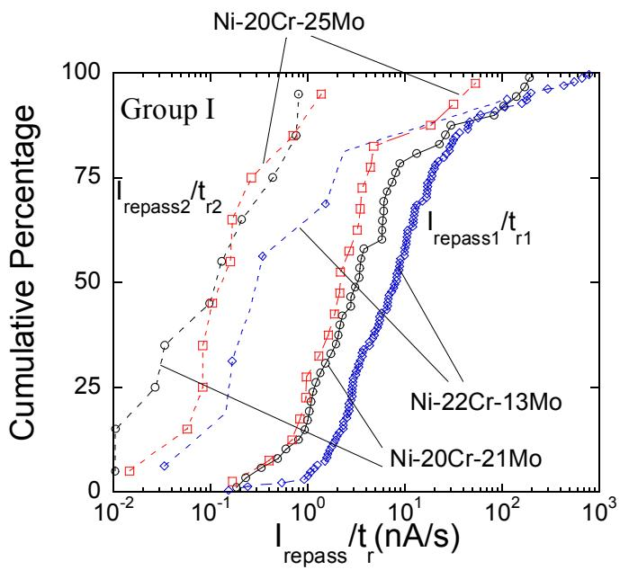

(a)  
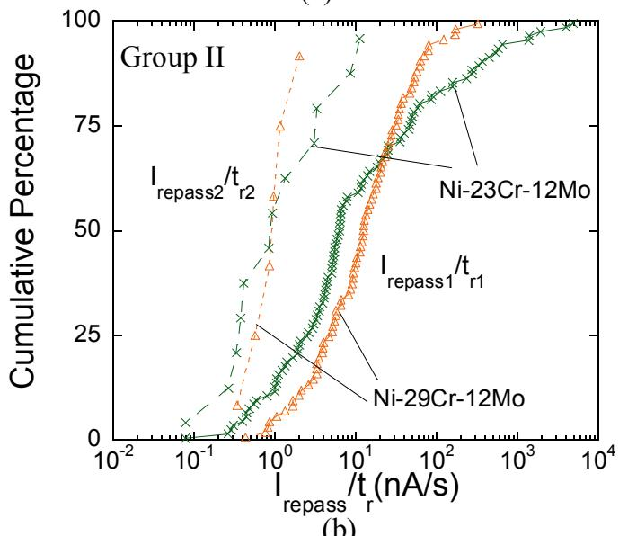  
(b)  
Figure 4.9. The repassivation rate cumulative distribution plots showing faster rates for higher Cr content alloys in group I (a) and also group II (b).

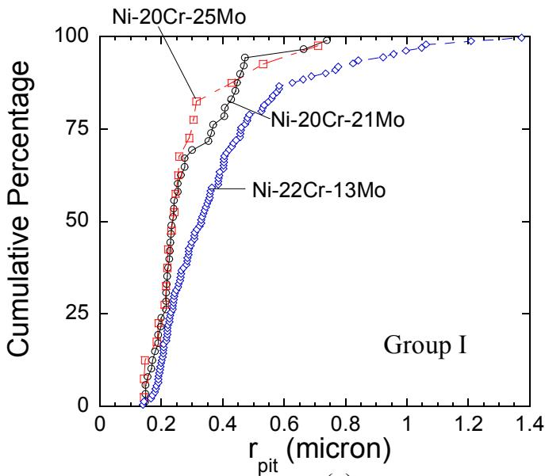  
(a)

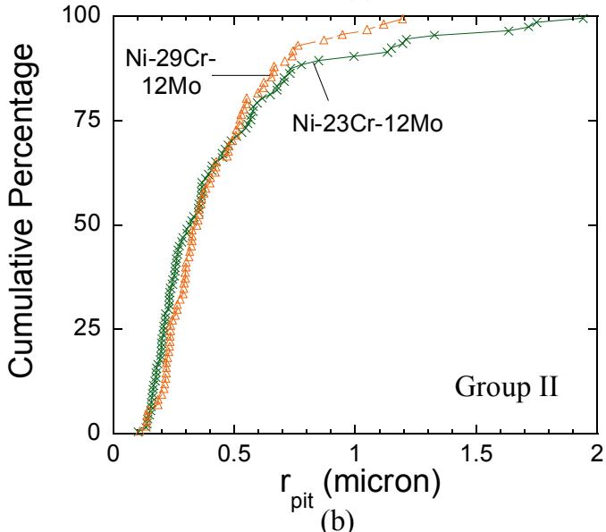  
Figure 4.10:  Cumulative distribution plots of metastable pit radius show that the pit size is smaller for higher Mo­containing alloys (a) and also for the higher Cr­containing alloy at higher cumulative percentage values (b).

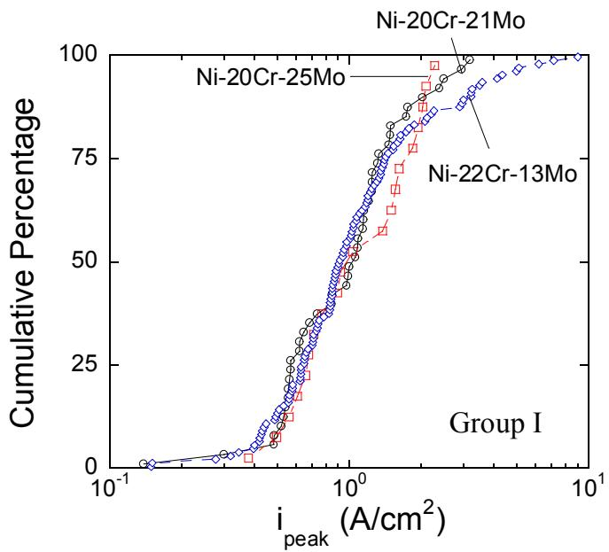

(a)  
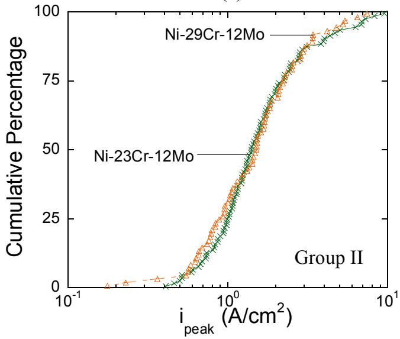  
(b)  
Figure 4.11. The cumulative distribution plots of the metastable pits peak current density $\left( \mathrm { i } _ { \mathrm { p e a k } } \right)$ showing alloys with higher Mo contents have slightly lower max $\mathrm { i _ { p e a k } }$ values in group I (a). Small variation is seen in group II (b).

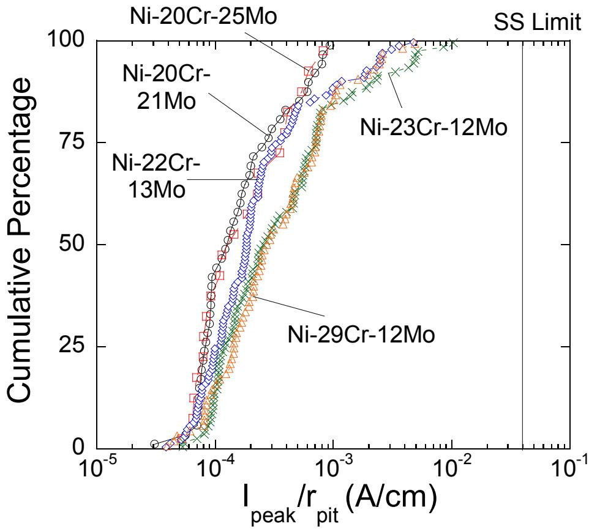  
Figure 4.12. The cumulative distribution plots of $\mathrm { I _ { p e a k } / r _ { p i t } }$   for all five Ni­Cr­Mo alloys examined in this study suggest that the pits formed during electrochemical testing were not stable.

  
Figure 4.13:  Median peak current, $\mathrm { { I _ { p e a k } } }$ , values is shown to decrease as the Mo content increases.

  
Figure 4.14:  The values of the peak growth rate $\left( \mathrm { { I _ { p e a k } / t _ { g } } } \right)$ at the 95% CP shows a decreasing trend as the Mo content in the alloy increases.

  
Figure 4.15:  The median repassivation rate $\left( \mathrm { { I } _ { r e p a s s } / t _ { r } } \right)$ values increases with the Cr content in the alloy.

<table><tr><td>Group I</td><td></td><td>Cr content (wt.%) Mo content (wt.%)</td></tr><tr><td>Fabricated</td><td>20</td><td>21</td></tr><tr><td>Fabricated</td><td>20</td><td>25</td></tr><tr><td>Commercial Alloy 22</td><td>22</td><td>13</td></tr><tr><td></td><td></td><td></td></tr><tr><td>Group II</td><td>Cr content  $( \mathbf { w t . \% } )$ </td><td>Mo content  $( \mathbf { w t } . \% )$ </td></tr><tr><td>Fabricated</td><td>23</td><td>12</td></tr><tr><td>Fabricated</td><td>29</td><td>12</td></tr></table>

Table 4.1:  Details of the alloying composition of the Ni­Cr­Mo alloys studied.

## REFERENCES

P. Schmuki, J. Solid State Electrochem., 6, 145 (2002).

2. G. S. Frankel, J. Electro. Soc., 145, 2186 (1998).

3. G. O. Ilevbare and G. T. Burstein, Corr. Sci., 43, 485 (2001).

4. L. Stockert and H. Boehni, Mat. Sci. Forum, 44&45, 313 (1989).

B. A. Kehler and J. R. Scully, Corrosion, 61, 665 (2005).

6. S. T. Pride, J. R. Scully and J. L. Hudson, J. Electro. Soc., 141, 3028 (1994).

7. Y. Kim and R. G. Buchheit, Electro. Acta, 52, 2437 (2007).

8. D. E. Williams, J. Stewart and P. H. Balkwill, Corr. Sci., 36, 1213 (1994).

9. P. C. Pistorius and G. T. Burstein, Corr. Sci., 36, 525 (1994).

10. Y. Kobayashi, S. Virtanen and H. Bohni, J. Electro. Soc., 147, 155 (2000).

11. F. Sato and R. C. Newman, Corrosion, 54, 955 (1998).

12. J. R. Hayes, J. J. Gray, A. W. Szmodis and C. A. Orme, Corrosion, 62, 491 (2006).

13. E. Asselin, A. Alfantazi and S. Rogak, Corrosion, 61, 579 (2005).

14. J. Horvath and H. H. Uhlig, J. Electro. Soc., 115, 791 (1968).

15. G. Lorang, N. Jallerat, K. V. Quang and J.­P. Langeron, Surface and Interface Analysis, 16, 325 (1990).

16. R. S. Lillard, M. P. Jurinski and J. R. Scully, Corrosion, 50, 251 (1994).

17. N. Priyantha, P. Jayaweera, G. R. Englehardt, A. Davydov and D. D. Macdonald, Corrosion, 61, 857 (2005).

18. J. M. Bastidas, C. L. Torres, E. Cano and J. L. Polo, Corr. Sci., 44, 625 (2002).

19. N. Boucherit, A. H.­L. Goff and S. Joiret, Corrosion, 48, 569 (1992).

20. R. C. Newman, Corr. Sci., 25, 341 (1985).

21. R. C. Newman, Corr. Sci., 25, 331 (1985).

22. M. A. Cavanaugh, J. A. Kargol, J. Nickerson and N. F. Fiore, Corrosion, 39, 144 (1983).

23. R. Qvarfort, Corr. Sci., 40, 215 (1998).

24. G.S. Frankel, L. Stockert, F. Hunkeler, H. Boehni, Corrosion, 43, 429 (1987).

## CHAPTER 5

## THE EFFECT OF ALLOYING COMPOSITION ON THE REPASSIVATION BEHAVIOR OF Ni­Cr­Mo ALLOYS

## 5.1  INTRODUCTION

Pitting is known to be autocatalytic indicating that once pitting attack occurs, the dissolution process will continue to take place until either failure of the metal or repassivation of the pit. Pit dissolution is controlled by one of two mechanisms: ohmic drop or mass transport [1­3]. Ohmic drop controls the dissolution at lower potentials while mass transport controls the process at higher potentials [2]. One implication of this statement is that the rate­limiting step for the dissolution of smaller pits is likely to be ohmic control, and it has also been shown that the current densities of the smaller pits are indeed dependent on potential [2,3]. Mass transport appears to limit the dissolution rate of the larger pits, and their current densities are observed to be independent of potential [2,3].

A study of dissolution kinetics can provide a better understanding regarding the rate controlling mechanism of the process and can also be used to examine the role of alloying elements during an active dissolution reaction [4]. Localized attack can be artificially created through an electrochemical reaction [5], electrode design [3], or both [1,4,6]. Using these induced pits/crevices, the active dissolution process can be investigated.

The difference between the reference electrode and the potential of the dissolving surface is called the total potential drop, $\varepsilon _ { \mathrm { t o t } } ,$ , which is defined as follows [4,7,8]:

$$
\varepsilon _ { \mathrm { t o t } } = \varepsilon _ { \mathrm { r } } + \varepsilon _ { \mathrm { s } } + \varepsilon _ { \mathrm { i R } }\tag{Eqn. 5.1}
$$

where $\varepsilon _ { \mathrm { r } }$  is the thermodynamic difference between the reference electrode and an electrode of the same kind that is located at the position of the reference electrode [8], $\varepsilon _ { \mathrm { s } }$ is the surface overpotential, and $\varepsilon _ { \mathrm { i R } }$   is the ohmic potential drop. The effect of alloying additions on these individual voltage component values can give key information concerning the protection mechanism provided by certain alloying elements [4].

In Al alloys, it has been observed that Cu alloying suppresses dissolution kinetics and raises the repassivation potential while addition of Zn is found to enhance the dissolution kinetics and lowers the repassivation potential [4]. From voltage component analysis, the authors claim that the alloying additions appear to influence the total potential drop through the surface overpotential values. In stainless steels, researchers have stated that the role of Mo is more pronounced during active dissolution by reducing the kinetics rather than through Mo enrichment in passive film [6,9]. However, due to the complex speciation of Mo, the oxidation state of Mo during dissolution is still unclear.

A similar issue is encountered with respect to the role of Mo in Ni­Cr­Mo alloys dissolution.

The repassivation potential is the potential at which the pit growth is ceased [7]. During the repassivation of an active pit, the accumulation of aggressive anions in the pit has to be transported to the bulk solution so that critical environment for pitting to progress is lost, and pit growth slows [10]. Repassivation potential is controlled by two factors where the first factor is the tendency for the metal to repassivate, which depends on the critical environment needed for repassivation to occur [11]. The second factor is the ability of the alloys to maintain the critical environment for pit growth [11]. The latter factor includes the cation hydrolysis and the dissolution kinetics [11]. For the case of Al alloys, it is found that the ennoblement of repassivation potential through alloying is due to the fact that the ability of the Al alloys to sustain the critical conditions for pit growth is reduced [11]. Thus, it can be said that slower dissolution kinetics generally lead to an early onset of repassivation [9].

Determination of repassivation potential, $\mathrm { E _ { r p } , }$ is important particularly for corrosion resistant alloys such as, Alloy C­22, which is a candidate container material for storage of nuclear waste, because it measures how the alloy responds to the existing corrosion attack [12­15]. Temperature and chloride content are known to be the influencing factors for the determination of repassivation potential [13]. The presence of inhibitors such as nitrates and sulphates is also stated to affect the repassivation potential [16,17].

Several studies have been conducted to define the repassivation potential [13,17,18]. A cyclic potentiodynamic polarization (CPP) is the most commonly used method in analyzing the anodic behavior of metallic alloys and their response to the localized attack [13,19]. The drawback from the CPP method is the fact that high potential application would cause transpassive dissolution of the whole exposed surfac particularly in corrosion resistant alloys [13]. Meanwhile, a deep localized attack is needed for the determination of a repassivation potential [17].

Another method is the Tsujikawa­Hisamatsu­Electrochemical (THE) method that consists of three parts: potentiodynamic, galvanostatic, and potentiostatic [18]. In this test, potentiodynamic polarization is performed until a pre­set current density is obtained; this is followed by a 2­hour galvanostatic at that current density value.  During galvanostatic polarization, localized corrosion propagates [17]. Following galvanostatic polarization, 2­hour potentiostatic steps with 10 mV increment are applied until the repassivation potential is obtained.  The repassivation potential is defined as the highest potential at which the current density does not increase as a function of time during the 2­ hour potentiostatic step [18]. The definition has been proven to be problematic in some cases where the current density does not increase at higher potential value but as the potential is lowered, the current density increases [17]. A new definition was introduced by Mishra and Frankel where a repassivation potential is the potential at which the current density reached the passive current density measured during the forward scan [17]. They also modified the THE technique by changing the potentiostatic polarization into a potentiodynamic polarization.

In the present study, the repassivation behavior of Ni­Cr­Mo alloys with varying compositions was studied.  The role of Cr and Mo on the repassivation potential was the main focus. The modified THE technique was used to determine the repassivation potential. XPS analysis was utilized to perform some surface characterization on the polarized samples.

## 5.2  EXPERIMENTAL PROCEDURES

The Ni­Cr­Mo alloys were fabricated as described in Chapter 3. Four fabricated alloys and a commercial Alloy C­22 were studied and mounted individually using Dexter Hysol TM epoxy. The compositions are represented in Table 5.1.

The samples were flat­surfaced metallic alloys. They were exposed to a rather aggressive electrolyte, which was an acidified chloride solution used in Chapter 3. Kehler, et al. introduced the use of this type of electrolyte during their crevice corrosion stabilization and repassivation study of Alloy 625 and Alloy C­22 [14]. The purpose of using this electrolyte was to enhance the likelihood that a crevice corrosion attack might occur. The solution consisted of 5 M LiCl and 0.5 M combination of ${ \mathrm { N a } } _ { 2 } { \mathrm { S O } } _ { 4 }$ (0.24 M) and NaNO3 (0.26 M). The pH of the solution was adjusted to 2.75 by using HCl. The temperature was set at $9 0 ^ { \circ } \mathrm { C } .$ . Electrochemical test was performed based on the modified THE technique, which consisted of potentiodynamic­galvanostatic­potentiodynamic (PD-GS­PD) polarizations [17]. The upward scan was set at 0.3 mV/s while the reverse scan was at 0.167 mV/s. Galvanostatic control started when the current density reached 100 mm/cm 2 and was held for 2 hours.

Following the electrochemical tests on the flat­surfaced samples, the samples were taken out of their epoxy, washed with DI water and ethanol, dried, and put in a dessicator prior to XPS analysis. The XPS instrument was a Kratos Axis $\mathrm { U l t r a } ^ { \mathrm { T M } }$ spectrometer with Al Ka radiation, emission current intensity of 10 mA, anode X­ray source operated at 13 kV, and 0.1 eV step size. Area of analysis was $7 0 0 \times 3 0 0 ~ \mathrm { \textmu m } ^ { 2 }$ The pressure of the chamber was maintained at $3 \mathrm { ~ x ~ } 1 0 ^ { - 9 }$ torr. Scans were done for Ni 2p, Cr 2p, Mo 3d, O 1s peaks.

## 5.3  RESULTS AND DISCUSSION

## 5.3.1 Potentiodynamic­Galvanostatic­Potentiodynamic (PD­GS­PD) Results

Figure 5.1 shows the polarization curves of the lower Mo­containing alloys after the PD­GS­PD polarizations in 2.75 pH solution at $9 0 \mathrm { { } ^ { \circ } C }$ . The repassivation potentials, $\mathrm { E } _ { \mathrm { r p } } ,$ for 30wt.%Cr and 23wt.%Cr alloys are ­37.3 mV and ­23.8 mV, respectively. For the commercial Alloy C­22, the $\mathrm { E _ { r p } }$ is found to be at ­197.4 mV. The fact that Alloy C­22 has a lower repassivation potential than Ni­23Cr­12Mo is unexpected however, this may be due to a higher Ni content on the Ni­23Cr­12Mo. This is also evidenced on the surface of the samples after the polarizations where the crevice attack on Alloy C­22 is observable while for the other two alloys, the crevices are in micrometer sized. It appears that repassivation on the two fabricated alloys occurs rather promptly. A slight decrease of the potential during the reverse scan triggers repassivation rapidly, indicating a possible critical repassivation condition for these alloys.

It is to be noted that the current density in this study is obtained by dividing the current by the nominal sample area instead of the actively dissolving area so it is a nominal current density rather than an actual current density. Thus, dissolution kinetics of the active area cannot be analyzed. An artificial pit study by Newman and He found that Mo ennobles the dissolution kinetics of Ni­22Cr alloys similar to the Mo effect in stainless steels [20]. Their alloys consisted of Ni­22Cr with varying Mo content: 0, 3, 6, 9, and 13 wt.%, although they mentioned that creating an artificial pit for 13wt.% Mo alloy was very difficult, suggesting a possible formation of a resistive porous corrosion product on the alloy. The difficulty in creating a pit in these Cr and Mo­rich alloys that are very corrosion resistant was also encountered during our study, which led us to the current experimental setup with its limitation, which is an uncontrolled and unknown actively dissolving area.  Furthermore, the attack was crevice corrosion occurring at the interface of the metal sample and epoxy mounting material.

The potential versus time records during the galvanostatic polarization is shown in Figure 5.2. It is evident that a large decrease in potential occurs during the 2­hour galvanostatic hold at $1 0 0 \mu \mathrm { A } / \mathrm { c m } ^ { 2 }$ . This result indicates that localized corrosion is propagating during this time.  Alloy C­22 exhibited the decrease in potential immediately at the start of the galvanostatic polarization while the potential of the other two alloys did not decrease until about 500 to 700 seconds in galvanostatic polarization mode. The potential of the 30wt.%Cr alloy returns to the initial high value of about 0.7 $\mathrm { V } _ { \mathrm { S C E } }$  after about an hour of galvanostatic polarization. This likely indicates that the 30wt.% Cr alloy repassivated after the initial breakdown and the high current imposed by the galvanostatic mode was accomplished by transpassive dissolution. However, this potential increase is temporary and lasts for 1000 seconds before decreasing again. This active­passive­active behavior shows how difficult it is to sustain localized corrosion in this alloy; even galvanostatic polarization after breakdown could not maintain the active state.

Polarization behavior of the higher Mo content alloys after exposure in acidified chloride at $9 0 \mathrm { { } ^ { \circ } C }$ is illustrated in Figure 5.3. These alloys appear to be very corrosion resistant as shown by the polarization plots such that the current is reduced to values lower than the passive current density during the reverse scan. Figure 5.4 shows the potential versus time plots during the galvanostatic hold, and these 21wt.%Mo and 25wt.%Mo alloys are extremely passive such that passivity is maintained at high potentials.

By comparing Figures 5.1 and 5.3, the role of Mo in promoting corrosion resistance of the Ni­Cr­Mo metallic alloys in low pH­chloride mixture solution at high temperature is quite evident. From the PD­GS­PD tests, a high Cr­containing alloy does not seem to restrain localized corrosion as much as a high Mo­containing alloy does given that the Cr content is above the critical amount (20wt.% in Chapter 3). This finding agrees with the results from Chapter 3 where Mo was found to have a significant effect on increasing $\mathrm { E _ { p } }$ value in low pH and high temperature conditions.

## 5.3.2  Voltage Component Analysis

The total potential drop between the dissolving surface and the reference electrode is affected by a thermodynamic contribution, a surface overpotential, and an

ohmic potential drop [4,7]. Ramgopal and Frankel provide a detailed explanation on how to separate and estimate the components of the total potential drop [4]. Following their development, the ohmic potential drop, $\mathbf { \delta E } _ { \mathrm { i R } } .$ is defined as:

$$
\begin{array} { r } { \mathbb { E } _ { \mathrm { i R } } = \dot { \mathbf { l } } _ { \mathrm { n e t } } \mathbf { R } } \end{array}\tag{Eqn. 5.2}
$$

where $\mathrm { { \dot { \mathbf { l } } _ { n e t } } }$   is the net current measured by the potentiostat normalized by the active area. Because Ni­Cr­Mo alloy dissolution occurs above the hydrogen reversible potential, no correction for the occurrence of this reaction is needed, and $\mathrm { \dot { \mathbf { l } } _ { n e t } }$ is taken to be $\mathrm { i } _ { \mathrm { a } , }$ the anodic current density. The parameter R is the solution resistance in $\Omega { \mathrm { - c m } } ^ { 2 }$ . The surface overpotential, $\varepsilon _ { \mathrm { s } , }$ is given by:

$$
\boldsymbol { \mathfrak { E } } _ { \mathrm { s } } = \boldsymbol { \beta } \log ( \mathrm { i } _ { \mathrm { a } } / \mathrm { i } _ { 0 } )\tag{Eqn. 5.3}
$$

where $\beta$ is the Tafel slope, and $\dot { \mathbf { l } } _ { 0 }$ is the exchange current density for metal dissolution. This equation shows that a surface overpotential contribution is mainly a result from activation polarization. Concentration polarization is not considered here since an abundant amount of metallic species are available at the metal/solution interface and therefore, not limiting and negligible compared to activation polarization.

The thermodynamic contribution, $\varepsilon _ { \mathrm { { r } } } ,$ is calculated as the reversible potential of the alloy, which is the sum of the reversible potential of each element multiple by the weight percent of the corresponding element in the alloy. By combining Equation 5.1, 5.2, and 5.3, the total potential drop is:

$$
\begin{array} { r l } { \pmb { \Sigma } _ { \mathrm { t o t } } = } & { { } \pmb { \Sigma } _ { \mathrm { r } } + \beta \log ( \dot { \mathrm { l } } _ { \mathrm { a } } / \dot { \mathrm { l } } _ { 0 } ) + \dot { \mathrm { l } } _ { \mathrm { n e t } } \mathbf { R } } \end{array}\tag{Eqn. 5.4}
$$

indicating that the total potential drop is affected thermodynamically through $\varepsilon _ { \mathrm { r } }$  and kinetically through $\beta$ and $\dot { \mathbf { l } } _ { 0 }$ where both control the $\varepsilon _ { \mathrm { s } }$ value [7]. To obtain $\beta ,$ i0, and R, the following equation is used to fit into the experimental data:

$$
\begin{array} { r } { \varepsilon _ { \mathrm { { t o t } } } = \mathrm { ~ \ r ~ A ~ } + \beta } \log ( \mathrm { i _ { n e t } } ) \mathrm { ~ \ r ~ + \mathrm { i _ { n e t } } \mathrm { { R } } \ell }  \end{array}\tag{Eqn 5.5}
$$

where A is a constant and given by:

$$
\mathbf { A } = \varepsilon _ { \mathrm { r } } - \beta \log ( \mathrm { i } _ { 0 } )\tag{Eqn. 5.6}
$$

The experimental data used for the fitting are the reverse potentiodynamic scan data prior to and immediately after it crosses the passive current density. The current density value here represents the nominal sample area instead of the actively dissolving area due to the difficulty in producing a controlled active dissolution in these alloys. Using the equations above, each voltage component that affects the total potential drop can be determined.

Figure 5.5 shows that the positioning of the experimental data on the potential axis depends on the $\varepsilon _ { \mathrm { r } }$  and $\varepsilon _ { \mathrm { s } }$ values for the lower Mo­containing alloys. It has been reported that the repassivation potential is controlled by the $\varepsilon _ { \mathrm { r } }$ and $\varepsilon _ { \mathrm { s } }$ values due to the extremities of the position of these components on the potential axis [7]. Although, $\varepsilon _ { \mathrm { r } }$ does not vary much among the alloys studied.

Meanwhile, the localized corrosion growth rate is said to be mostly influenced by the potential component that has the highest dE/di slope [7]. From Figure 5.5, it is shown that the ohmic potential drop component in Alloy C­22 has the highest dE/di slope compared to the other voltage components indicating that the localized corrosion growth rate for Alloy C­22 is ohmically controlled.  This finding is similar to the case of Al

alloys where the pit growth kinetics is proven to be controlled by the ohmic potential drop [4].

Repassivation occurs very promptly on the 23wt.%Cr and 30wt.%Cr alloys causing lack of data points available for decent voltage component analysis as can be seen in Figure 5.5. Hence, further study on the effect of alloying additions on the voltage component analysis of Ni­Cr­Mo alloys is needed. A study on leaner Cr or Mocontaining alloys may produce a more meaningful analysis as Cr and Mo­rich alloys have been shown to be too resistant against an induced active dissolution. Uncontrolled and unknown active area also limits the applicability of this analysis.

The voltage component analysis of the higher Mo­containing alloys was not performed since these alloys did not experience any type of localized dissolution after the PD­GS­PD polarizations. Transpassive dissolution occurs at the high potential region, but active anodic dissolution did not take place in these corrosion resistant alloys.

## 5.3.3 XPS Analysis

XPS characterization was used to study the chemistry of surface films formed after the PD­GS­PD polarizations. The XPS spectra of Ni­23%Cr­12%Mo alloy at the spot marked “x” in Figure 5.6(a) are illustrated in Figure 5.6(b)­(d). This spot is not attacked and away from the sample edges. A carbon peak is observed at approximately 285.7 eV in all the five alloys studied as a standardized peak. A scan for Mo peak, Figure 5.6(b), shows no evidence of Mo in this un­attacked spot. A strong oxygen peak is evident in Figure 5.6(c) at approximately 532.7 eV while the Cr(III) oxide peak at

576.5 eV appears rather weak. The nickel peak is not observed during the scan in Figure   
5.6(d).

XPS spectra of Alloy C­22 at the crevice attack site denoted “x” in Figure 5.7(a) are represented in Figure 5.7(b)­(d). Molybdenum species are present in the attack area with 0 (227.9 eV), +4 (230.9 eV), and +6 (232.4 & 235.5 eV) oxidation states as shown in Figure 5.7(b). Figure 5.7(c) shows the existence of oxygen and Cr peaks. Two Cr peaks are observed where one is an oxide, $\mathrm { C r } _ { 2 } \mathrm { O } _ { 3 }$ peak, and the latter one is a hydroxide, Cr(OH)3 peak at 586.80 eV. Nickel peak is absent in Figure 5.7(d).

Ni­30%Cr­13%Mo alloy formed a yellow­ish layer on the surface after electrochemical testing, which suggests transpassive dissolution. The layer does not form uniformly on the surface, and some metallic areas appear bare as illustrated in Figure 5.8(a). XPS analysis was carried out on the un­attacked yellow­ish layer area denoted by the “x” symbol. Mo was observed in elemental, +4, and +6 oxidation states (Figure 5.8(b)). Chromium oxide and hydroxide peaks exist in this scan (Figure 5.8(c)). A strong Ni peak at 852.60 eV is observed in this high Cr­containing alloy (Figure 5.8(d)). An enrichment of Ni in the outer surface of the high Cr containing Ni­Mo alloys has been reported in the literature [21].

XPS analysis of the Ni­20%Cr­21%Mo alloy was done on the blue­ish layer that formed after electrochemical testing and is illustrated in Figure 5.9(a). Similar to the yellow­ish layer on the 30wt.%Cr, this blue­ish layer suggests transpassive dissolution of the alloy. Only Mo(VI) is found in this case with no evidence of elemental Mo or Mo(IV)

(Figure 5.9(b)). Cr(III) on both oxide and hydroxide forms are present (Figure 5.9(c)).   
Ni peak is absent (Figure 5.9(d)).

XPS spectra for the apparently bare area of the Ni­20%Cr­21%Mo were collected (Figure 5.10(a)). Mo appears to be absent on this area as no peak is detected (Figure 5.10(b)). Cr(III) is present in the oxide form only, Figure 5.10(c). A Ni peak is also absent as shown in Figure 5.10(d).

Ni­20%Cr­25%Mo alloy also formed a blue­ish layer suggesting transpassive dissolution in the electrochemical testing. XPS spectra for the “x” spot in Figure 5.11(a) are depicted in Figure 5.11(b)­(d). Mo is found in the elemental, Mo(IV), and Mo(VI) oxidation states (Figure 5.11(b)). Cr(III) oxide and hydroxide peaks are observed (Figure 5.11(c)). A weak Ni peak is present (Figure 5.11(d)).

Table 5.2 summarizes the XPS results for all five Ni­based alloys. The presence of Mo species on the attacked site and on the top layers that formed after being polarized show the effect of Mo on the dissolution process of Ni­Cr­Mo alloys. Elemental Mo has been suggested as the primary inhibiting species in active dissolution of stainless steels [22]. Mo in +4 oxidation state is probably present as $\mathbf { M o O } _ { 2 }$ . Previous work has suggested the formation of $\mathbf { M o O } _ { 2 }$ as the cause for inhibition in Mo­containing alloys [23]. Other studies have suggested the presence of Mo(VI) as $\mathrm { M o O } _ { 4 } ^ { 2 - }$ ­ , as the main species providing corrosion inhibition [24­27]. A study by Lloyd et al. shows an increase in Mo(VI) content in the passive film of Ni­Cr­Mo alloys as the potential increases, and they suggested that Mo(VI) exists as $\mathbf { M o O } _ { 3 }$ [21].

It appears that Cr(III) in oxide form is consistently present in the passive film of the Ni­Cr­Mo alloys indicating its role as the main passivating element for Ni­Cr­Mo alloys. The XPS peak indicating Cr(III)­hydroxide is found to be absent on the sites where Mo species are also absent. The existence of Ni in the passive film is rarely seen except for the highest Cr­containing alloy and the highest Mo­containing alloy. The absence of Ni 2p peak from the XPS spectra of Ni­Cr­Mo alloys has also been reported by others where they found that after polarization at high potentials, the Ni 2p peak disappeared while the Ni 3p peak remained [21]. The authors believe that the absence of the peak is due to the leaching of Ni in the oxide outer regions [21].

## 5.3.4 Quantification of XPS Results

To estimate the amount of species present in the surface, peak areas were determined by background subtraction and integration. The quantity was plotted against the sum of the Cr and Mo content of the alloy. Figure 5.12 shows the quantity of Mo in the elemental and Mo(IV) states as a function of the cumulative Cr and Mo content. These species are present in the crevice site of Alloy C­22, the yellow­ish layer of Ni-30%Cr­13%Mo, and the blue­ish layer of Ni­20%Cr­25%Mo. The 30wt.%Cr alloy appears to contain the most Mo in elemental form while the amount of Mo(IV) on all three alloys is quite similar.

Figure 5.13 illustrates the amount of Mo(VI) with respect to the (Cr+Mo) content. The amount of Mo(VI) present is considerably larger than Mo in elemental or Mo(IV) indicating +6 as the primary oxidation state for Mo on the surface of Ni­Cr­Mo alloys.

Mo(VI) is absent on the un­attacked site (Ni­23%Cr­12%Mo) and the bare part of the non­corroding alloy (Ni­20%Cr­21%Mo). The crevice site of Alloy C­22 contains the highest quantity of Mo(VI) which shows an enrichment of Mo(VI) in an actively dissolving site.  The amount of Mo(VI) on the layers that formed after polarization is found to decrease with (Cr+Mo) content. The reason for this behavior may be due to the transpassive dissolution where higher Cr and Mo content could lead to the dissolution of higher valence species at high potential region [28,29]

The amount of Cr(III) as an oxide $\left( \mathrm { C r } _ { 2 } \mathrm { O } _ { 3 } \right)$ as a function of (Cr+Mo) content is depicted in Figure 5.14. Alloy C­22 at the crevice site and Ni­23%Cr­12%Mo appear to have a similar Cr(III)­oxide content. The bare area of Ni­20%Cr­21%Mo has the smallest amount of Cr(III)­oxide. The yellow­ish layer of Ni­30%Cr­13%Mo contains the greatest amount of Cr(III)­oxide. It appears that the quantity of Cr(III)­oxide presen is dependent on the Cr content of the bulk composition. Cr(III)­oxide is present in all alloys, and the amount is considerably larger than other species found, which shows that this Cr oxide is responsible for providing passivity for the Ni­Cr­Mo alloys as has been stated in the literature [21,30].

Cr(III) in hydroxide form (Cr(OH)3) is not present on un­attacked site of Ni-23%Cr­12%Mo and bare area of Ni­20%Cr­21%Mo as shown in Figure 5.15. This trend is similar to what was observed for the presence of Mo(VI). Cr(III)­hydroxide is observed on the crevice area of Alloy C­22 and on the top layers formed on the higher (Cr+Mo) content alloys. The amount of Cr(III)­hydroxide is higher for the higher Mocontaining alloys. It seems that the formation of Cr in hydroxide form is supported by

the presence of Mo as mentioned above where Cr(III)­hydroxide is only present when Mo species is present. It is possible that the role is reversed such that Mo species is present when Cr(III)­hydroxide is formed.  Additional study would be needed to confirm this.

The highest Cr­containing alloy has more Ni than the Ni­20%Cr­25%Mo while other alloys contain no Ni elemental peaks as depicted in Figure 5.16. This finding means that a high (Cr+Mo) content is necessary for Ni in elemental form to be present with higher Cr content being more vital than higher Mo content.

## 5.4  CONCLUSIONS

It is found that higher Mo­containing alloys in this study have very good corrosion resistance as they did not experience any localized attack after the rigorous PD-GS­PD polarizations. Repassivation potential is higher for the 23 wt.%Cr and 30 wt.% Cr alloys than Alloy C­22. From the voltage component results, it is observed that the repassivation potential is dependent on the surface overpotential and the reversible potential of the alloy. The localized corrosion growth rate of Alloy C­22 is ohmically controlled. The lower Mo­containing fabricated alloys repassivated rather promptly during the reverse scan making it difficult to do a voltage component analysis on them.

XPS analysis shows the presence of Mo and Cr species on the actively dissolving site of Alloy C­22. Mo and Cr are also found in layers of film that formed on the higher Mo and higher Cr­containing alloys after the polarizations which is believed to form due to transpassive dissolution. Mo and Cr­hydroxide peaks are absent on the un­attacked

site of the corroding alloy or the bare area of the non­corroding alloy. Mo mainly exists in +6 oxidation state, and it is found to be enriched in a crevice site. Cr(III) oxide peak is observed in all alloys and sites and therefore, believed to be the main passivating species for Ni­Cr­Mo alloys. The presence of Ni in the polarized passive film is rare and only seen in the highest Cr and highest Mo alloys.

  
Figure 5.1: Polarization curves of the lower Mo content group showing evidence of localized corrosion after the PD­GS­PD polarizations in acidified chloride mixture at $9 0 \mathrm { { } ^ { \circ } C }$

  
Figure 5.2:  A significant decrease in potential is observed on all three alloys during the 2­hour galvanostatic polarization at $1 0 0 \mu \mathrm { A } / \mathrm { c m } ^ { 2 }$

  
Figure 5.3:  Polarization curves for higher Mo alloys showing no indication of localized corrosion after PD­GS­PD polarizations in acidified chloride mixture at $9 0 ^ { \circ } \mathrm { C } .$

  
Figure 5.4:  Galvanostatic hold of the higher Mo alloys at 100 $\mu \mathrm { A } / \mathrm { c m } ^ { 2 }$ for 2 hours showing the stability of the potential.

  
Figure 5.5:  Voltage components of the lower Mo alloys indicating the influence of $\dot { \varepsilon } _ { \mathrm { r } }$ and $\varepsilon _ { \mathrm { s } }$ in determining the repassivation potential of the alloys.


  
(b)

(a)  
  
(c)

  
(d)  
Figure 5.6:  XPS spectra of Ni­23%Cr­12%Mo alloy at the $\mathbf { \Delta } ^ { \mathfrak { c } \mathfrak { c } } \mathbf { x } ^ { \mathbf { , \vec { \ } { \mathbf { \Delta } } \mathbf { \Xi } } ) }$ position of the sample (a). Carbon peak is found at around 285.7 eV while Mo peaks are not seen (b). Oxygen and Cr(III) oxide peaks are shown(c) while Ni peak is not found during the scan (d).


(a)  
  
(c)

(b)  
  
(d)  
Figure 5.7:  XPS specra of the Alloy C­22 at the crevice attack labeled $ { { } ^ { \circ } \mathbf { x } } ^ { \prime \prime } \left( \mathrm { a } \right)$ Molybdenum are present in elemental, Mo(IV), and Mo(VI) oxidation states (b). Chromium(III) oxide and hydroxide peaks are shown (c). Ni scan shows no Ni peak (d).

  
(a)

  
(b)

  
(c)

  
(d)  
Figure 5.8:  XPS specra of the Ni­30%Cr­13%Mo after the electrochemical test showing some formation of yellow­ish layer on the surface.  Analysis is done on the “x” spot (a). Molybdenum species are present in elemental, Mo(IV), and Mo(VI) oxidation states (b). Chromium(III) oxide and hydroxide peaks are shown (c). Ni scan shows a strong Ni elemental peak (d).

  
(a)

  
(b)

  
(c)

  
(d)  
Figure 5.9:  XPS specra of the Ni­20%Cr­21%Mo after the electrochemical test showing some formation of blue­ish layer on the surface.  Analysis is done on the blue layer $\mathbf { \Delta } ^ { \mathfrak { c } \mathfrak { c } } \mathbf { \Delta } _ { \mathbf { X } } ^ { \mathfrak { s } \mathfrak { s } }$ spot (a). Molybdenum is present in Mo(VI) oxidation state only (b). Chromium(III) oxide and hydroxide peaks are present (c). Ni scan shows no evidence of Ni peak (d).


  
(c)

  
(d)  
Figure 5.10:  XPS specra of the Ni­20%Cr­21%Mo after the electrochemical test showing some formation of blue­ish layer on the surface.  Analysis is done on the bare “x” spot (a). Molybdenum species are absent in this spot (b). Chromium(III) oxide peak is observed(c). Ni scan shows no evidence of Ni peak (d).

  
(a)

  
(b)

  
(c)

  
(d)  
Figure 5.11:  XPS specra of the Ni­20%Cr­25%Mo after the electrochemical test showing some formation of blue­ish layer on the surface.  Analysis is done on the blue layer denoted $ { { } ^ { \circ } \mathbf { x } } ^ { \prime \prime } \left( \mathrm { a } \right)$ . Molybdenum are present as elemental, Mo(IV), and Mo(VI) oxidation states (b). Chromium(III) oxide and hydroxide peaks are present (c). Ni scan shows a weak Ni elemental peak (d).

  
Figure 5.12:  Quantification of the XPS peaks of Mo­elemental and Mo(IV) species with respect to the (Cr+Mo) content showing the presence of both Mo species on the crevice site and highest Cr and Mo­containing alloys.

  
Figure 5.13:  Quantification of the XPS peaks of Mo(VI) with respect to (Cr+Mo) content showing the presence of Mo(VI) on the crevice site and layers that formed through transpassive dissolution of the higher Cr and Mo­containing alloys.

  
Figure 5.14:  Quantification of the XPS peaks of Cr(III)­oxide with respect to the (Cr+Mo) content showing the dependency of the amount of Cr(III)­oxide present to the bulk Cr content.

  
Figure 5.15:  Quantification of the XPS peaks of Cr(III)­hydroxide with respect to the (Cr+Mo) content showing the presence of this species on the crevice site and layers formed on higher Cr and higher Mo­containing alloys.

  
Figure 5.16:  Quantification of the XPS peaks of Ni elemental with respect to (Cr+Mo) content showing the presence of ${ \mathrm { \Delta } } { \mathrm { \ddot { N i } } } ^ { 0 } 2 { \mathrm { p \ } }$ peaks on higher (Cr+Mo) content alloys only.

<table><tr><td>Lower Mo</td><td>Cr content  $( \mathbf { w t . \% } )$ </td><td>Mo content  $( \mathbf { w t } . \% )$ </td></tr><tr><td>Fabricated</td><td>23</td><td>12</td></tr><tr><td>Fabricated</td><td>30</td><td>13</td></tr><tr><td>Commercial Alloy 22</td><td>22</td><td>13</td></tr><tr><td></td><td></td><td></td></tr><tr><td>Higher Mo</td><td>Cr content  $( \mathbf { w t . \% } )$ </td><td>Mo content  $( \mathbf { w t } . \% )$ </td></tr><tr><td>Fabricated</td><td>20</td><td>21</td></tr><tr><td>Fabricated</td><td>20</td><td>25</td></tr></table>

Table 5.1:  Alloy composition of the studied Ni­Cr­Mo alloys separated by their Mo content.

<table><tr><td rowspan=1 colspan=1>Alloy</td><td rowspan=1 colspan=1> ${ \mathsf { N i } } ^ { 0 }$ </td><td rowspan=1 colspan=1> ${ \mathsf { C r } } ^ { + 3 } ( \circ \times )$ </td><td rowspan=1 colspan=1> $\mathsf { C r } ^ { + 3 } ( \mathsf { h y } )$ </td><td rowspan=1 colspan=1> ${ \mathsf { M o } } ^ { 0 }$ </td><td rowspan=1 colspan=1> ${ \mathsf { M } } { \mathsf { o } } ^ { + 4 }$ </td><td rowspan=1 colspan=1> ${ M O } ^ { + 6 }$ </td></tr><tr><td rowspan=1 colspan=1>Ni-23%Cr-12%Mo (unattacked site)</td><td rowspan=1 colspan=1>x</td><td rowspan=1 colspan=1> $\surd ( w e a k )$ </td><td rowspan=1 colspan=1>x</td><td rowspan=1 colspan=1>X</td><td rowspan=1 colspan=1>x</td><td rowspan=1 colspan=1>X</td></tr><tr><td rowspan=1 colspan=1>Ni-22%Cr-13%Mo (crevice site)</td><td rowspan=1 colspan=1>x</td><td rowspan=1 colspan=1> $\surd$ </td><td rowspan=1 colspan=1> $\surd$ </td><td rowspan=1 colspan=1>√</td><td rowspan=1 colspan=1> $\surd$ </td><td rowspan=1 colspan=1>√</td></tr><tr><td rowspan=1 colspan=1>Ni-30%Cr-13%Mo (yellow layer)</td><td rowspan=1 colspan=1> $\surd$ </td><td rowspan=1 colspan=1> $\surd$ </td><td rowspan=1 colspan=1> $\surd$ </td><td rowspan=1 colspan=1>√</td><td rowspan=1 colspan=1> $\surd$ </td><td rowspan=1 colspan=1>√</td></tr><tr><td rowspan=1 colspan=1>Ni-20%Cr-21%Mo (blue layer)</td><td rowspan=1 colspan=1>x</td><td rowspan=1 colspan=1> $\surd$ </td><td rowspan=1 colspan=1> $\surd$ </td><td rowspan=1 colspan=1>X</td><td rowspan=1 colspan=1>X</td><td rowspan=1 colspan=1>√</td></tr><tr><td rowspan=1 colspan=1>Ni-20%Cr-21%Mo (bare)</td><td rowspan=1 colspan=1>x</td><td rowspan=1 colspan=1> $\surd$ </td><td rowspan=1 colspan=1>x</td><td rowspan=1 colspan=1>X</td><td rowspan=1 colspan=1>x</td><td rowspan=1 colspan=1>x</td></tr><tr><td rowspan=1 colspan=1>Ni-20%Cr-25%Mo (blue)</td><td rowspan=1 colspan=1>√(weak)</td><td rowspan=1 colspan=1> $\surd$ </td><td rowspan=1 colspan=1> $\surd$ </td><td rowspan=1 colspan=1>√</td><td rowspan=1 colspan=1>√</td><td rowspan=1 colspan=1>√</td></tr></table>

Table 5.2:  Summary of the results from the XPS spectra of the Ni­Cr­Mo alloys.

## REFERENCES

1. E. Akiyama and G. S. Frankel, J. Electrochem. Soc., 146, 4095 (1999).

2. G. S. Frankel, Corr. Sci., 30, 1203 (1990).

3. P. Heimgartner and H. Bohni, Corrosion, 41, 715 (1985).

4. T. Ramgopal and G. S. Frankel, Corrosion, 57, 702 (2001).

5. G. Ruijini and M. B. Ives, Corrosion, 45, 572 (1989).

6. R. C. Newman, Corr. Sci., 25, 341 (1985).

7. G. S. Frankel, J. O. Dukovic, V. Brusic, B. M. Rush and C. V. Jahnes, J. Electrochem. Soc., 139, 2196 (1992).

8. J. S. Newman, Electrochemical Systems, Prentice Hall, Englewood Cliffs, NJ (1991).

9. H. C. Brookes, J. W. Bayles and F. J. Graham, J. Appl. Electrochem., 20, 223 (1990).

10. H.­H. Strehblow, Werkstoffe un Korrosion, 27, 792 (1976).

11. G. S. Frankel, R. C. Newman, C. V. Jahnes and M. A. Russak, J. Electrochem. Soc., 140, 2192 (1993).

12. D. S. Dunn, G. A. Cragnolino and N. Sridhar, Corrosion, 56, 90­104 (2000).

13. K. J. Evans, A. Yilmaz, S. D. Day, L. L. Wong, J. C. Estill and R. B. Rebak, JOM, 57, 61 (2005).

14. B. A. Kehler, G. O. Ilevbare and J. R. Scully, Corrosion, 57, 1042­1065 (2001).

15. N. Sridhar and G. A. Cragnolino, Corrosion, 49, 885­894 (1993).

16. G. O. Ilevbare, K. J. King, S. R. Gordon, H. A. Elayat, G. E. Gdowski and T. S. E. Gdowski, J. Electro. Soc., 152, B547­B554 (2005).

17. A. K. Mishra and G. S. Frankel, Corrosion, 64, 836 (2008).

18. S. Tsujikawa and Y. Hisamatsu, Corr. Eng. Japan, 29, 37 (1980).

19. G. S. Frankel, J. Electro. Soc., 145, 2186 (1998).

20. R.C. Newman, D.X. He, Presented to Electrochemical Society Spring Meeting, Corrosion General Session, Denver (2006) per http://yucca\_web.ymp.gov/science/pdf/presentations/47833.pdf

21. A. C. Lloyd, J. J. Noel, S. McIntyre and D. W. Shoesmith, Electrochimica Acta, 49, 3015­3027 (2004).

22. R. C. Newman, Corr. Sci., 25, 331 (1985).

23. R. Qvarfort, Corr. Sci., 40, 215 (1998).

24. M. A. Cavanaugh, J. A. Kargol, J. Nickerson and N. F. Fiore, Corrosion, 39, 144 (1983).

25. G. O. Ilevbare and G. T. Burstein, Corrosion Science, 43, 485­513 (2001).

26. R. S. Lillard, M. P. Jurinski and J. R. Scully, Corrosion, 50, 251 (1994).

27. N. Sridhar and D. S. Dunn, Corrosion, 50, 857­872 (1994).

28. I. Betova, M. Bojinov, T. Laitinen, K. Makela, P. Pohjanne and T. Saario, Corrosion Science, 44, 2675­2697 (2002).

29. M. Bojinov, G. Fabricius, T. Laitinen and T. Saario, Electrochimica Acta, 44, 4331­4343 (1999).

30. J. R. Hayes, J. J. Gray, A. W. Szmodis and C. A. Orme, Corrosion, 62, 491­500 (2006).

## CHAPTER 6

## CONCLUSIONS AND FUTURE WORK

## 6.1  CONCLUSIONS

The role of Cr and Mo on the localized corrosion behavior of Ni­Cr­Mo alloys has been studied.  It is apparent that both alloying additions contribute to the corrosion resistant properties of Ni­Cr­Mo alloys. The following is the summary of key findings:

1. Anodic polarization measurements showed that Ni alloys with Cr content between 20 to 30 wt.% and Mo content between 12 to 25 wt.% showed excellent corrosion resistance in both neutral and acidified chloride solutions.

2. PREN­like equations for Ni­based alloys showed that Cr had a greater effect on the pitting potential than Mo in neutral chloride environments. With respect to the repassivation potential, the effect of Cr and Mo were approximately the same in neutral chloride.  Pitting and repassivation potentials in low pH and higher

temperature solutions appeared to be highly dependent on Mo content. These PREN­like equations should be used with caution because the pitting and repassivation potentials depend on temperature and pH as well as composition.

3. An increasing amount of Cr and Mo was observed to decrease the occurrence of metastable pitting events with Mo exerting the greater effect. Higher Mo contents reduced the peak current density values of metastable pits. Slower growing pits were found to be independent of composition while the faster growing ones were dependent on Mo content where the rate of the fastest growing pits was decreased in higher Mo containing alloys. Repassivation rate of the metastable pits seemed to increase as the Cr content increases in the alloys.

4. The effect of alloying composition on the metastable pit radius and peak current density was not significant based on the alloys studied (20 to 29 wt.% Cr and 12 to 25 wt.% Mo). However, the higher Mo and Cr­containing alloys had lower pit radius. The maximum value of the metastable pit peak current density for higher Mo alloys also lower when compared to the other alloys. From this metastable pitting study, it was found that the effect of Mo on the metastable pit characterization parameters was significant.

5. A study of the repassivation potential found that higher Mo content alloys prevent the dissolution process given that enough Cr was available (at least 20 wt.%). The repassivation potential was found to be dependent on surface overpotential and reversible potential values of the alloy. Repassivation potential was found to be ennobled for higher Cr or higher Ni containing alloys with similar Mo content. The growth rate of the localized corrosion appeared to be ohmically controlled in Alloy C­22. Ni­23Cr­12Mo and Ni­30Cr­13Mo alloys repassivated very promptly during the reverse scan resulting in difficulty in performing voltage component analysis due to lack of repassivation data points. Dissolution kinetics study could not be performed because of the difficulty in creating a controlled actively dissolving area on these Cr and Mo­rich alloys.

6. XPS analysis showed the presence of Mo on the attacked/crevice site.  Higher Mo and higher Cr alloys formed a blue­ish and yellow­ish layer of films, respectively after electrochemical polarizations suggesting the occurrence of transpassive dissolution. These layers consisted of elemental Mo, Mo(IV), and Mo(VI) species. Mo peaks were not found on an un­attacked site.  Mo(VI) was found to be enriched in the crevice area.  Cr existed primarily in Cr(III)­oxide, which was believed to be the main passivating species; although, the Cr(III)­ hydroxide form was also observed on the crevice site and transpassive dissolution layers. Ni peaks were only observed on the higher (Cr+Mo) content alloys.

## 6.2  FUTURE WORK

The roles of Cr and Mo on the localized corrosion behavior of Ni­based alloys have been characterized through this work. However, there are still a number of issues that remain unsolved.  The unresolved issues are the following:

1. The effect of W addition into the Ni­Cr­Mo alloys is still yet to be studied.  Even though some studies have stated that W and Mo behave similarly, most studies have focus more on Mo additions than W. From the Pourbaix diagram, W is present as a stable oxide in low pH region; thus, a characterization study on the role of W on pitting would be interesting.

2. Mo is found to inhibit metastable pit growth kinetics and suppress the peak current values in this study; however, the exact mechanism of the inhibition is still unclear.

3. The synergistic effects between the alloying elements particularly, Cr­Mo and Mo­W is well known. Nonetheless, an in depth study on this effect has never been done. How and why this synergy exist still yet to be solved.

4. Repassivation potential and dissolution kinetics study on the Ni­Cr­Mo alloys should be further examined through additional composition variation to better understand the controlling mechanism of the localized corrosion growth rate on the Ni­based alloys.

5. The effect of Mo on preventing the dissolution process is quite new considering most literature claim that the beneficial effect of Mo exists after the dissolution starts.

## BIBLIOGRAPHY

S. J. Ahn, H. S. Kwon and D. D. Macdonald, J. Electro. Soc., 152, B482­B490 (2005).

E. Akiyama and G. S. Frankel, J. Electrochem. Soc., 146, 4095 (1999).

E. Asselin, A. Alfantazi and S. Rogak, Corrosion, 61, 579 (2005).

S. Azuma, T. Kudo, H. Miyuki, M. Yamashita and H. Uchida, Corr. Sci., 46, 2265 (2004).

J. M. Bastidas, C. L. Torres, E. Cano and J. L. Polo, Corrosion Science, 44, 625 (2002).

I. Betova, M. Bojinov, T. Laitinen, K. Makela, P. Pohjanne and T. Saario, Corrosion Science, 44, 2675­2697 (2002).

M. Bojinov, G. Fabricius, T. Laitinen and T. Saario, Electrochimica Acta, 44, 4331­4343 (1999).

A. P. Bond and H. H. Uhlig, J. Electrochem. Soc., 107, 488 (1960).

N. Boucherit, A. H.­L. Goff and S. Joiret, Corrosion, 48, 569­579 (1992).

H. C. Brookes, J. W. Bayles and F. J. Graham, J. Appl. Electrochem., 20, 223 (1990).

R. G. Buchheit, MSE 681 Notes, Part 8 (Autumn 2001).

G. T. Burstein and P. C. Pistorius, Corrosion, 51, 380­385 (1995).

M. A. Cavanaugh, J. A. Kargol, J. Nickerson and N. F. Fiore, Corrosion, 39, 144 (1983).

C. R. Clayton and Y. C. Lu, J. Electro. Soc., 133, 2465­2473 (1986).

P. Crook, Corrosion of Nickel and Nickel­Base Alloys, ASM International, Materials Park, OH (2005).

P. Crook and D. Klarstrom, Introduction to Alloys Resistant to Aqueous Corrosion, ASM International, Materials Park, OH (2005).

J. R. Crum, J. M. Poole and E. L. Hibner, United States Patent, Inco Alloys International, Inc. (1991).

A. Csontos, T. Ahn, A. Passarelli, Y. Pan, D. Dunn and L. Yang, JOM, 57, 36­42 (2005).

M. Drogowska, H. Menard and L. Brossard, J. Appl. Electro., 27, 169­177 (1997).

D. S. Dunn, G. A. Cragnolino and N. Sridhar, Corrosion, 56, 90­104 (2000).

D. S. Dunn, Y.­M. Pan, K. T. Chiang, L.Yang, G. A. Cragnolino and X. He, JOM, 57, 49 (2005).

D. S. Dunn, Y.­M. Pan, L. Yang and G. A. Cragnolino, Corrosion, 62, 3­12 (2006).

K. J. Evans, A. Yilmaz, S. D. Day, L. L. Wong, J. C. Estill and R. B. Rebak, JOM, 57, 61 (2005).

G. S. Frankel, Corr. Sci., 30, 1203 (1990).

G. S. Frankel, J. Electro. Soc., 145, 2186 (1998).

G. S. Frankel, MSE 735 Notes, Part 7 (Winter 2003).

G. S. Frankel, J. O. Dukovic, V. Brusic, B. M. Rush and C. V. Jahnes, J. Electrochem. Soc., 139, 2196 (1992).

G. S. Frankel, R. C. Newman, C. V. Jahnes and M. A. Russak, J. Electrochem. Soc., 140, 2192 (1993).

G. S. Frankel, L. Stockert, F. Hunkeler and H. Boehni, Corrosion, 43, 429­436 (1987).

W. Z. Friend, Corrosion ofNickel and Nickel­Based Alloys, John Wiley and Sons, New York, NY (1980).

J. R. Galvele, J. Electro. Soc., 123, 464­474 (1976).

L. F. Garfias­Mesias, J. M. Sykes and C. D. S. Tuck, Corrosion Science, 38, 1319 (1996).

S. Ghosh and T. Ramgopal, Corrosion, 61, 609­619 (2005).

G. M. Gordon, Corrosion, 58, 811­825 (2002).

J. J. Gray, J. R. Hayes, G. E. Gdowski and C. A. Orme, J. Electro. Soc., 153, B156­B161 (2006).

C. A. Hampel, Corrosion, 14, 557t (1958).

K. Hashimoto, K. Asami and K. Teramoto, Corr. Sci., 19, 3 (1979).

J. R. Hayes, J. J. Gray, A. W. Szmodis and C. A. Orme, Corrosion, 62, 491­500 (2006).

D.C. Harris, Quantitative Chemical Analysis, W.H. Freeman and Company, New York, NY (1991).

P. Heimgartner and H. Bohni, Corrosion, 41, 715 (1985).

J. Horvath and H. H. Uhlig, J. Electro. Soc., 115, 791­795 (1968).

F. Hua and G. Gordon, Corrosion, 60, 764 (2004).

D. H. Hur and Y. S. Park, Corrosion, 62, 745­750 (2006).

G. O. Ilevbare, Corrosion, 62, 340­356 (2006).

G. O. Ilevbare and G. T. Burstein, Corrosion Science, 43, 485­513 (2001).

G. O. Ilevbare and G. T. Burstein, Corrosion Science, 45, 1545­1569 (2003).

G. O. Ilevbare, K. J. King, S. R. Gordon, H. A. Elayat, G. E. Gdowski and T. S. E. Gdowski, J. Electro. Soc., 152, B547­B554 (2005).

R. F. A. Jargelius­Pettersson, Corrosion, 54, 162 (1998).

D. A. Jones, Principles and Prevention of Corrosion, Prentice Hall, Upper Saddle River, NJ (1996).

B. A. Kehler, G. O. Ilevbare and J. R. Scully, Corrosion, 57, 1042­1065 (2001).

B. A. Kehler and J. R. Scully, Corrosion, 61, 665 (2005).

J. S. Kim, W. H. A. Peelen, K. Hemmes and R. C. Makkus, Corrosion Science, 44, 635­ 655 (2002).

Y. Kobayashi, S. Virtanen and H. Bohni, J. Electro. Soc., 147, 155 (2000).

P. Kritzer, N. Boukis and E. Dinjus, Corrosion, 54, 824­834 (1998).

P. Kritzer, N. Boukis and E. Dinjus, Corrosion, 54, 689­699 (1998).

N. J. Laycock, J. Stewart and R. C. Newman, Corrosion Science, 39, 1791­1809 (1997).

R. S. Lillard, M. P. Jurinski and J. R. Scully, Corrosion, 50, 251 (1994).

A. C. Lloyd, J. J. Noel, N. S. McIntyre and D. W. Shoesmith, JOM, 57, 31 (2005).

A. C. Lloyd, J. J. Noel, S. McIntyre and D. W. Shoesmith, Electrochimica Acta, 49, 3015­3027 (2004).

A. C. Lloyd, D. W. Shoesmith, N. S. McIntyre and J. J. Noel, J. Electro. Soc., 150, B120­ B130 (2003).

G. Lorang, N. Jallerat, K. V. Quang and J.­P. Langeron, Surface and Interface Analysis, 16, 325 (1990).

V. K. Lorenz and G. Medawar, Thyssenforschung, 1, 97­108 (1969).

D. D. Macdonald, J. Electro. Soc., 139, 3434­3449 (1992).

D. D. Macdonald, Pure Appl. Chem., 71, 951­978 (1999).

Q. Meng, G. S. Frankel, H. O. Colijn and S. H. Goss, Corrosion, 60, 346­355 (2004).

A. K. Mishra and G. S. Frankel, Corrosion, 64, 836 (2008).

M. H. Moayed and R. C. Newman, Mats. and Corr., 56, 166 (2005).

G. Mori, S. Sutthiruangwong, M. Czerny and T. Partlic, Corrosion, 60, 1082­1091 (2004).

J. S. Newman, Electrochemical Systems, Prentice Hall, Englewood Cliffs, NJ (1991).

R. C. Newman, Corr. Sci., 25, 331 (1985).

R. C. Newman, Corr. Sci., 25, 341 (1985).

R. C. Newman, Corrosion, 57, 1030­1041 (2001).

R.C. Newman, D.X. He, Presented to Electrochemical Society Spring Meeting, Corrosion General Session, Denver (2006) per http://yucca\_web.ymp.gov/science/pdf/presentations/47833.pdf

J. W. Oldfield and W. H. Sutton, Br. Corros. J., 13, 104­111 (1978).

J. W. Oldfield and W. H. Sutton, Br. Corros. J., 13, 13­22 (1978).

J. Osterwald and H. H. Uhlig, J. Electro. Soc., 108, 515 (1961).

G. C. Palit, V. Kain and H. S. Gadiyar, Corrosion, 49, 977 (1993).

C. J. Park, V. S. Rao and H. S. Kwon, Corrosion, 61, 76­83 (2005).

J.­J. Park, S.­I. Pyun, W.­J. Lee and H.­P. Kim, Corrosion, 55, 380­387 (1999).

H. W. Pickering, Corrosion Science, 29, 325­341 (1989).

P. C. Pistorius and G. T. Burstein, Corrosion Science, 36, 525­538 (1994).

M. Pourbaix, Atlas of Electrochemical Equilibria in Aqueous Solutions, NACE, Houston, TX (1974).

S. T. Pride, J. R. Scully and J. L. Hudson, J. Electro. Soc., 141, 3028 (1994).

N. Priyantha, P. Jayaweera, G. R. Englehardt, A. Davydov and D. D. Macdonald, Corrosion, 61, 857­871 (2005).

R. Qvarfort, Corr. Sci., 40, 215 (1998).

T. Ramgopal and G. S. Frankel, Corrosion, 57, 702 (2001).

R. B. Rebak, "Presentation to The Ohio State University Student Chapter ofThe Electrochemical Society", slide 2 (2006).

R. B. Rebak and P. Crook, Adv. Mat. Process, 157, 37­42 (2000).

G. Ruijini and M. B. Ives, Corrosion, 45, 572 (1989).

M. P. Ryan, D. E. Williams, R. J. Chater, B. M. Hutton and D. S. McPhail, Nature, 415, 770­774 (2002).

N. Saito, H. Sakamoto and K. Sugimoto, Corrosion, 54, 700­712 (1998).

F. Sato and R. C. Newman, Corrosion, 54, 955 (1998).

N. Sato, J. Electro. Soc., 129, 255­260 (1982).

R. R. Sayano and K. Nobe, Corrosion, 25, 260 (1969).

P. Schmuki, J. Solid State Electrochem., 6, 145­164 (2002).

P. Schmuki, H. Hildebrand, A. Friedrich and S. Virtanen, Corrosion Science, 47, 1239­ 1250 (2005).

P. Schmuki, S. Virtanen, H. S. Isaacs, M. P. Ryan, A. J. Davenport, H. Bohni and T. Stenberg, J. Electrochem. Soc., 145, 791 (1998).

A. J. Sedriks, Corrosion of Stainless Steels, John Wiley and Sons, New York, NY (1996).

N. Sridhar and G. A. Cragnolino, Corrosion, 49, 885­894 (1993).

N. Sridhar and D. S. Dunn, Corrosion, 50, 857­872 (1994).

U. Steinsmo and H. S. Isaacs, Corr. Sci., 35, 83 (1993).

B. Stellwag, Corrosion, 53, 120­128 (1997).

L. Stockert and H. Boehni, Mat. Sci. Forum, 44&45, 313­328 (1989).

H.­H. Strehblow, Werkstoffe un Korrosion, 27, 792 (1976).

Z. Szklarska­Smialowska, p. 297, NACE, Houston, TX (1986).

S. Tsujikawa and Y. Hisamatsu, Corr. Eng. Japan, 29, 37 (1980).

S. Wang and R. C. Newman, Corrosion, 60, 448­454 (2004).

D. E. Williams, J. Stewart and P. H. Balkwill, Corr. Sci., 36, 1213 (1994).

D. E. Williams and Y. Y. Zhu, J. Electro. Soc., 147, 1763­1766 (2000).

Y. Kim and R. G. Buchheit, Electro. Acta, 52, 2437 (2007).

Y. Zuo and S. Fu, Corrosion, 54, 313­316 (1998).

Y. Zuo, H. Wang, J. Zhao and J. Xiong, Corrosion Science, 44, 13­24 (2002).