# Electrochemical Investigations of Pitting Corrosion in Nitrogen-Bearing Type 316LN Stainless Steel✫

G.C. Palit, V. Kain, and H.S. Gadiyar\*

## ABSTRACT

Nitrogen (N) alloying was found to inhibit active dissolution and to introduce a secondary loop with fluctuating currents in the anodic polarization curve of type 316LN stainless steel (SS) (UNS S31653) in 1 N hydrochloric acid (HCI) solution. Potentiostatic tests in this potential range confirmed the occurrence of current transients as a result of metastable pits, resulting in secondary loop formation. Higher minimum chloride (CF) concentration and low acidic pH were shown to be required for stable pit formation in type 316LN SS compared to similar alloys without N alloying. Results showed no selective anodic dissolution of any of the alloying elements in actively growing pits in type 316LN SS. Although ammonium ions (NH4⁺) wère found within pits under suitable applied potentials in 1 N HCl and under natural corrosion in ferric chloride (FeCl₃) solutions, the more anodic the potential, the less was its yield. The formation of NH₄⁺ ions was found to be greater at more active potentials under uniformly dissolving conditions, and an apparent Tafel slope for the reduction reaction N + 4H+ + 3e → NH⁺ for the dissolution of N from the steel was estimated to be 0.125 V. Significant enrichments of N, chromium (Cr), and nickel (Ni) to a marginal extent were observed by Auger electron spectroscopy (AES) of the actively growing pitted surface. The iron (Fe) component, however, showed considerable depletion. The unattacked surface region surrounding the pit maintained normal passive film characteristics. Based on

observations, a mechanism elaborating the beneficial effect of alloyed N on pitting corrosion resistance of SS was developed.

KEY WORDS: alloying, anodic polarization, chloride chromium, corrosion resistance, inclusions, iron, molybdenum, nickel, nitrogen, nonselective dissolution, passivity, pitting, stainless steel, stress corrosion cracking, type 304 stainless steel, type 316L stainless steel, type 316LN stainless steel

## INTRODUCTION

Over the past several years, nitrogen (N) has become an important alloying addition to many wrought austenitic stainless steels (SS). Initially, N was added to replace more costly nickel (Ni) as an austenite former. An additional motivation arose from the increased use of low-carbon (C) grades of wrought austenitic SS in power generation applications, particularly in boiling water reactor (BWR) and pressurized water reactor (PWR) plant piping.

To avoid weld-related corrosion problems (i.e., sensitization), use of alloys of low C content has become a necessity. N has become a common alloying addition to rebuild the strength of the alloys with low C content to that of the higher C-content alloys.1 The addition of N to austenitic SS is known to improve resistance to intergranular corrosion (IGC) and pitting2 and to stress corrosion cracking (SCC) under some conditions. In the presence of molybdenum (Mo), these effects are pronounced. This impact has made type 316LN SS (UNS S31653)(1) the most favorable

TABLE 1  
Composition of SS Samples (wt%)
<table><tr><td colspan="10"></td></tr><tr><td></td><td>Cr</td><td>Ni</td><td>Mo</td><td>C</td><td>N</td><td>S</td><td>P</td><td>Mn</td><td>Si</td><td>Cu</td><td>Balance Fe</td></tr><tr><td>Type 304</td><td>18.1</td><td>9.3</td><td>&lt; 0.4</td><td>0.065</td><td></td><td>&lt; 0.017</td><td>0.025</td><td>1.1</td><td>0.63</td><td>&lt; 0.1</td><td></td></tr><tr><td>Type 316L</td><td>16.44</td><td>12.32</td><td>2.29</td><td>0.03</td><td>0.07</td><td>0.02</td><td>0.04</td><td>1.48</td><td>0.38</td><td>一</td><td></td></tr><tr><td>Type 316LN</td><td>17.4</td><td>13.2</td><td>2.57</td><td>0.019</td><td>0.16</td><td>0.03</td><td>0.021</td><td>1.73</td><td>0.64</td><td>一</td><td>64.23</td></tr></table>

alternate alloy for BWR piping and other severe environments.3 Large increases in pitting resistance have been reported from the addition of about 0.25 wt% N to austenitic SS.4 However, only a few detailed electrochemical studies have been made of the commercially available type 316LN SS.

The objective of the present investigation was to study the beneficial effect of N on the passivity and pitting corrosion behavior of type 316LN SS in neutral and acidic chloride (Cl–) media.

## EXPERIMENTAL

The chemical compositions of the commercialgrade SS studied are shown in Table 1. The three varieties of wrought alloys, available in 2.5-mm-thick sheet form, were cold-rolled to 1-mm thickness and cut into rectangular coupons 25 mm by 15 mm by 1 mm. Coupons were sealed in silica (SiO ) tubes under a helium (He) atmosphere, solution-annealed in a furnace at 1,100°C for 20 min, and quenched with water. For polarization studies, SS wire was spotwelded to one side of each coupon and covered with polytetrafluoroethylene (PTFE) tubing. The tip was not covered to allow electrical connection with a potentiostat. The coupons were mounted in epoxy resin and ground using 600-grit emery paper. Scratchfree samples were produced by diamond polishing. To minimize crevice corrosion, the specimen-mount interface was covered with a thin film of lacquer. Approximately 3 cm2 of the specimen surface was exposed to the solution. For immersion tests, the coupons were polished using successive grades of emery papers up to 600 grit, and edges were rounded. The immersion coupons also were diamond-polished, washed thoroughly with distilled water, and dried before exposure to the experimental solution.

All the solutions were prepared from doubledistilled water and chemicals of pure analytical reagent (AR) grade. Cl– concentration was controlled by sodium chloride (NaCl) or hydrochloric acid (HCl), and the pH was adjusted accordingly using a pH meter. The solution was deaerated by bubbling purified hydrogen (H2) before and during each polarization experiment.

For polarization studies, a three-electrode cell consisting of a saturated calomel electrode (SCE) as the reference and two smooth platinum (Pt) electrodes as auxiliary electrodes was used. The cell was similar to that described by Greene.5 The potential was controlled using a potentiostat. Current and potential were recorded when required by a strip chart recorder. The charge passed during the experiment also was recorded using a current integrator.

For polarization studies using the potential step technique, the sample was kept immersed in the experimental solution for 5 min at open-circuit potential (OCP). The anodic potential was increased in steps of 20 mVSCE, and the current readings were recorded after waiting at each set potential for 1 min. When the set potential reached the pitting potential during the course of the experiment, an abrupt increase in current was observed. All potentials were reported with respect to a saturated calomel electrode (SCE) unless otherwise mentioned. Polarization studies in different solutions were carried out at least twice, with reproducibility generally good. Specifically, the variation in pitting potential between duplicate runs was within 20 mVSCE.

Potentiostatic anodic polarizations were performed in various Cl– solutions to determine the pit nucleation potential precisely. In a typical experiment, the electrode was introduced into the cell, and the potential was set and maintained while the current was recorded along with the total charge passed during the experiment. At applied potentials just below the stable pit nucleation potential, metastable pitting (indicated by anodic current oscillations) was observed in the early stages of the experiment as a result of repetitive new pit formation and repassivation. These pits ultimately repassivated with time and remained inactive. The minimum potential required for stable pit initiation and growth was considered to be the pit nucleation potential.

To determine pitting susceptibility using an immersion test, the sample was immersed in 500 mL of the required solution and kept in the cell open to the atmosphere for the specified period of time. Variation of the corrosion potential with time was recorded using a chart recorder.

Solutions which remained after pitting corrosion experiments by immersion or potentiostatic polarization were analyzed for total iron (Fe), chromium (Cr), Ni, Mo, and manganese (Mn) content using conventional analytical techniques. Ammonium $( N H _ { 4 } ^ { + } )$ ions, if present in the corroded solution, were analyzed using the Kjeldahl method.(2) Weight loss was used to determine the uniform corrosion rate.

Measurements of the samples for analysis by Auger electron spectroscopy (AES) were made in a vacuum of $1 0 ^ { - 9 }$ torr or better. In-depth composition analyses of the surface film and of the substrate were performed by repeated sputtering with argon (Ar) ion bombardment followed by AES. The electron beam (3 keV, 25 $\mu \mathsf { A } )$ of diameter 5 µm was scanned over the surface. The angle of incidence was $5 0 ^ { \circ }$ . The Ar ion current density was about 25 $\mu { \sf A } / { \sf c m } ^ { 2 }$ , the energy of ions was 2 keV, the Ar pressure was $1 . 0 \times 1 0 ^ { - 5 }$ torr, and the beam was scanned at a $4 5 ^ { \circ }$ angle. Since no investigation was performed to correlate sputtering rates with passive film thickness, only the sputtering time was reported. The following Auger peaks were considered: Fe, 651 eV; Cr, 529 eV; Ni, 848 eV; oxygen (O), 503 eV; N, 379 $\mathsf { e V } ;$ sulfur (S), 152 eV; and Mo, 186 eV.

## RESULTS

Since Cl– ions are known to act as aggressive species for pitting corrosion in a majority of metals and alloys, polarization studies were performed on types 304 (UNS S30400), 316L (UNS S31603), and 316LN varieties of SS in 1 N HCl solution at room temperature. All three varieties showed active-passive behavior in this environment (Figure 1). Types 304 and 316L SS underwent an active-passive transition but lacked any clear passive region. Above the corrosion potential, active dissolution through a poorly protective film was observed. When potential was increased, a narrow passive region was observed, followed by the pitting potential $( \mathsf { E } _ { \mathsf { p } } )$ . The presence of pitting was confirmed by optical microscopy. The same observation was reported by Troselius in studying pitting corrosion of types 304L (UNS S30403) and 316 (UNS S31600) SS with a number of other alloys using potentiodynamic polarization techniques in 1 N HCl solution at ambient temperature.6 To verify whether a protective film formed at the narrow passive region characterized by a distinct minimum in the polarization curve, a potentiostatic anodic polarization experiment was performed at an applied potential of 0 mVSCE for type 316L SS in 1 N HCl solution (Figure 2). A protective

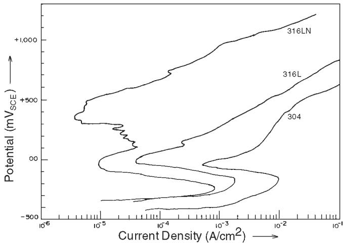  
FIGURE 1. Anodicpolarization curvesoftypes304 316L and 316LN SS in 1 N HCI solution.

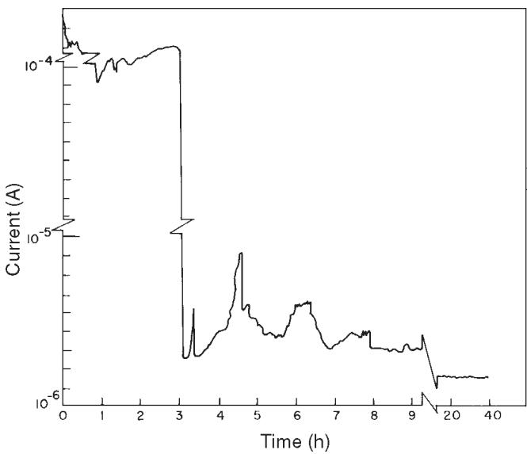  
FIGURE 2. Currentvs time curve fortype 316L SS in 1 N HCl at applied potential of $O m V _ { S C E }$

film formed on type 316L SS. This film became more stable with attainment of a low steady current after 8 h.

Although the nature of the active-passive polarization curves for types 304 and 316L SS was more or less similar (Figure 1), the anodic current at each corresponding applied potential was 1 order of magnitude lower for type 316L SS than for type 304 SS. This was a result of the presence of Mo in type 316L SS. Mo inhibits anodic dissolution and resists pitting corrosion, as reported by Sugimoto, et al.7 Mo addition assisted in forming a more resistant film in the presence of adequate Cr in the alloy.

Anodic polarization behavior of type 316LN SS in 1 N HCl as shown in Figure 1 suggested active-

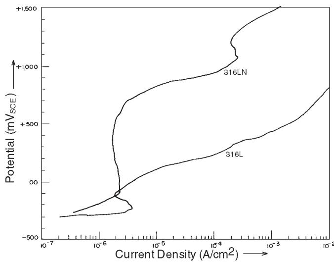  
FIGURE 3. Anodic polarization curves of types 316L and 316LN SS in 0.1 N HCI solution.

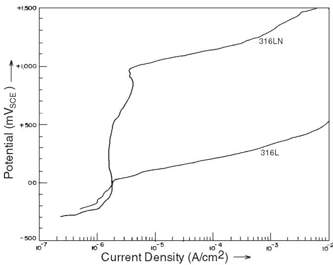  
FIGURE 4. Anodic polarization curves of types 316L and 316LN SS in 1 N NaCI solution.

passive behavior occurred with subsequent distinct passivity breakdown and pitting at +500 mVSCE. Repeated experiments in 1 N HCl solution showed the existence of a small anodic loop with significant current fluctuations in the potential range of $0 ~ \mathrm { m V } _ { \tt S C E } \mathrm { t o }$ $+ 3 0 0 ~ \mathsf { m V } _ { \mathsf { s c E } }$ , beyond the normal active-passive transition loop. Because of the presence of N (0.16 wt%) in this alloy, a more stable passive region was observed. The critical current density for passivation was about half that of type 316L SS. Pawel, et al., reported a progressive change in the shape of the anodic loop (active dissolution prior to passivation) as N content is increased.8 In that work, an inflection point was observed near $- 5 0 ~ \mathrm { m V } _ { \tt s H E }$ for 0.17 wt% N-containing SS in 1 N sulfuric acid (H2SO4) + 0.5 N NaCl solution that was absent in the present work. Pawel, et al., interpreted this phenomenon by preferential dissolution of $\mathsf { F e } ,$ so that Cr became enriched at or near the surface and, thus, made the surface more resistant to pitting $( \mathfrak { i . e . , E _ { p } }$ more anodic). Pawel, et al., also observed that the critical current density for passivation increased with N content in the alloy, contrary to observations in the present work. Such a difference in observations may have been a result of the low Mo content in Pawel’s alloys compared to Mo content of type 316LN SS in the present study.

Figure 3 shows the anodic polarization behavior of types 316LN and 316L SS in 0.1 N HCl solution. Unlike the behavior in 1 N HCl solution, type 316LN SS showed extended passive behavior from OCP with no onset of pitting up $\mathsf { t o } + 1 , 0 0 0 \mathsf { m V } _ { \mathsf { s c } \mathsf { E } }$ . Type 316L SS, however, showed a small active-passive “nose” with subsequent pitting at a more anodic potential of $- 6 0 \ : \mathrm { m V } _ { \tt S C E }$ . Bond, et al., reported a similar nature of anodic polarization curves for SS of identical composition in 0.1 N HCl solution.9 Thus, it appeared type 316LN SS in a less-concentrated HCl solution showed stable passivity with no pitting corrosion. A distinct passive-to-active transition for type 316 SS under freely corroding conditions was reported at $\mathsf { p H } < 0 . 7 5$ for a relatively concentrated Cl– solution (3.5% NaCl, i.e., 0.6 N).2

Figure 4 shows the comparative anodic polarization behaviors of types 316LN and 316L SS in 1 N NaCl solution. The absence of passivity breakdown in type 316LN SS and the occurrence of pitting at +40 $\mathsf { m V } _ { \mathsf { S C E } }$ in type 316L SS were evident, indicating greater resistance to pitting corrosion in N-alloyed type 316LN SS in neutral 1 N NaCl solution, than in 1 N HCl.

It was thought that pH of the solution may have had an important effect on the tendency for pitting corrosion in this material since pitting corrosion on type 316 LN SS was observed under anodic polarization in 1 N HCl, but not in 1 N NaCl. The effect of pH on pitting corrosion resistance in solutions of fixed 1 N Cl– concentration was studied systematically (Figure 5). The maximum pH for pitting corrosion in type 316LN SS was 2.0 at this Cl– concentration level. This finding differed from observations on conventional alloys. Leckie did not find much effect of pH on the pitting potential of 18% Cr-8% Ni SS in Cl– solutions in the acidic to neutral pH range.10

After the polarization run in 1 N NaCl solution, scanning electron microscopy (SEM) of type 316LN SS showed only superficial attack at isolated places on the surface with no deep pits. This superficial attack may have resulted from transpassive dissolution of alloyed

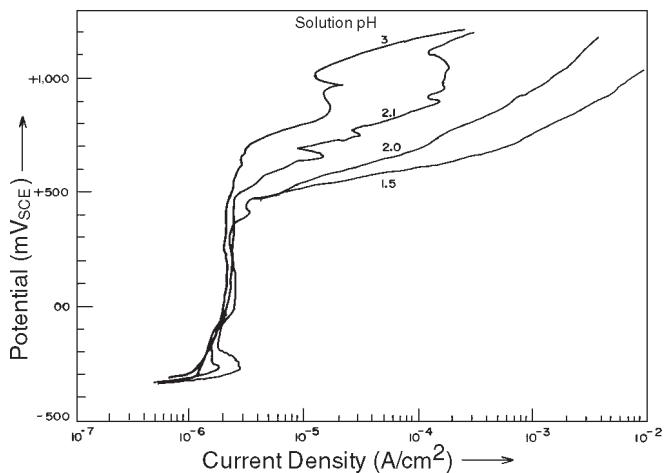  
FIGURE 5. Anodic polarization curves of type 316LN SS in 1 N NaCl solutions of varying pH.

Cr at high anodic potential. To determine whether any threshold Cl– concentration existed for pitting corrosion to occur, polarization runs for type 316LN SS were performed in neutral solutions of higher Cl– concentration. In the solution saturated with NaCl (\~ 6.2 N) pitting occurred at an applied potential of +350 mVSCE (Figure 6). In less-concentrated solutions (1.5 N to 2.5 N NaCl), however, the pitting potential was more or less steady at a value of $+ 1 , 0 0 0 \mathrm { m V _ { s c E } }$ . Deep pits were observed by optical microscopy. In 3 N and 4 N NaCl solutions, pitting potentials were +720 mVSCE and +500 $\mathsf { m V } _ { \mathsf { s c E } } ,$ respectively. Thus, aggressive Cl– ion concentration affected the pitting corrosion tendency (i.e., pitting potential) of type 316LN SS, as in any other metal or alloy.11

To explain the small anodic loop with current fluctuations in the potential range of $0 ~ \mathrm { m V } _ { \tt S C E } \mathrm { t o }$ $+ 3 0 0 ~ \mathsf { m V } _ { \mathsf { S C E } }$ in the polarization of type 316LN SS in 1 N HCl solution, potentiostatic pitting experiments were performed at different set potentials over the entire polarization range. Potentials selected for these experiments were the critical passivation potential of $- 2 6 0 \mathrm { m V } _ { \tt S C E } ,$ anodic potentials up to $+ 4 0 0 ~ \mathsf { m V } _ { \mathsf { s c E } }$ in steps of 100 mV from $0 \vee _ { \mathtt { s c e } } { \tan \mathtt { v } } _ { \mathtt { s c e } }$ , and also OCP, which remained more or less steady at $- 3 5 0 ~ \mathsf { m V } _ { \mathsf { s c E } }$ during the entire run. The variation of current with time at each set potential and the charge passed due to anodic current in all these experiments were recorded.

At OCP $( - 3 5 0 \mathrm { \ m V _ { s c E } } )$ and at the applied critical passivation potential $( - 2 6 0 \mathrm { \ m V _ { s c E } ) }$ , type 316LN SS showed uniform active dissolution. Specifically, at $- 2 6 0 ~ \mathsf { m V } _ { \mathsf { s c E } } ,$ the uniform dissolution current was maximum and remained more or less steady at $0 . 6 5 ~ \mathsf { m A } / \mathsf { c m } ^ { 2 }$ throughout the experiment (Figure 7). This uniform corrosion rate was equivalent to

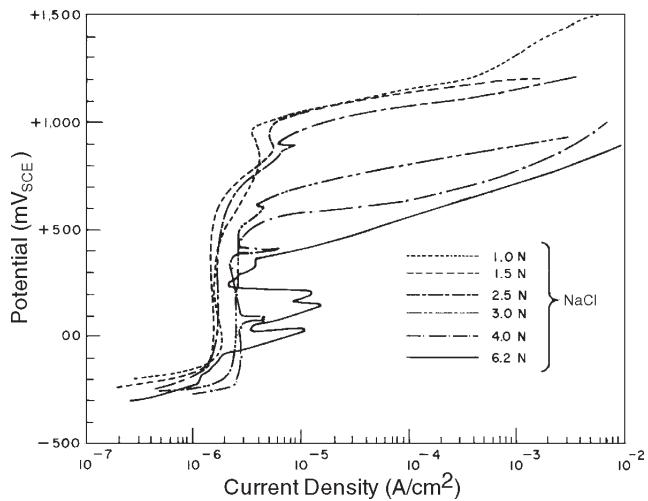  
FIGURE 6. Anodic polarization curves of type 316LN SS in NaCl solutions of varying concentration.

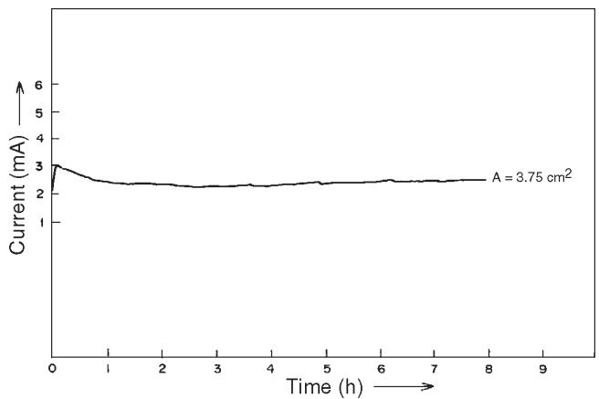  
FIGURE 7. Current vs time curve for type 316LN SS in 1 N HCl at applied potential $o f - 2 6 0 m V _ { s c E } .$

6.4 mm/y. Under OCP, the corrosion rate was   
0.75 mm/y.

At an applied potential of $0 \mathsf { m V } _ { \mathsf { s c E } } .$ , an irregular variation of current with time was observed for the initial 3.5 h (Figure 8). Beyond that period, the sample was passivated completely. Figure 8 also shows characteristic current transients from metastable pitting between applied potentials of $+ 1 0 0 \mathrm { \ m V _ { s c E } }$ to $+ 3 0 0 ~ \mathsf { m V } _ { \mathsf { s c E } }$ . All these metastable pits were repassivated with continued exposure. At set potentials of $+ 1 0 0 \mathsf { m V } _ { \mathtt { S C E } } , + 2 0 0 \mathsf { m V } _ { \mathtt { S C E } }$ , and $+ 3 0 0 ~ \mathsf { m V } _ { \mathsf { s c E } }$ metastable pits were passivated completely within initial exposure periods of 7 h to 9 h (Figure 8). At the beginning, many higher current pulses were observed, but after 2 h to 4 h, all current pulses over 10 µA disappeared. Part of this chart is reproduced at higher magnification in Figure 9, which shows that metastable pitting transients exhibited by type 316LN SS had a

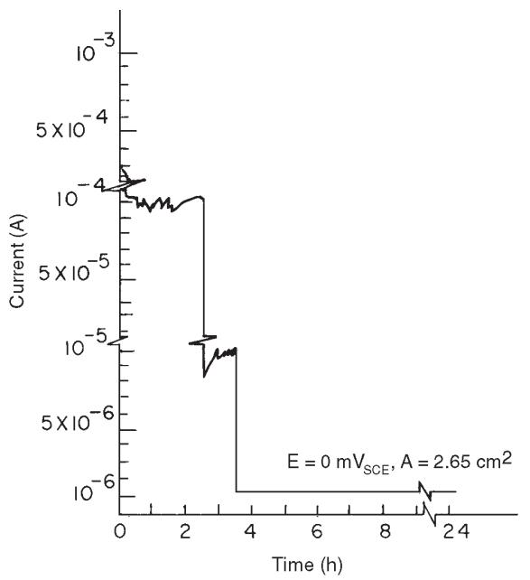

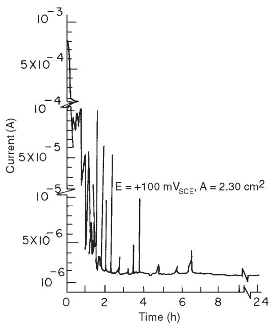

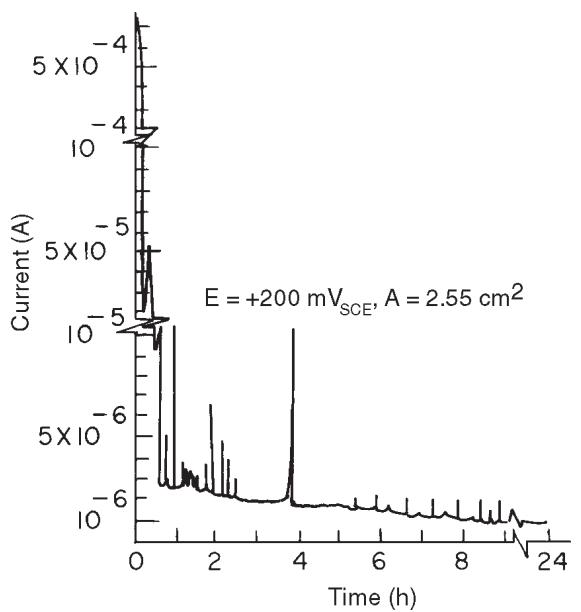

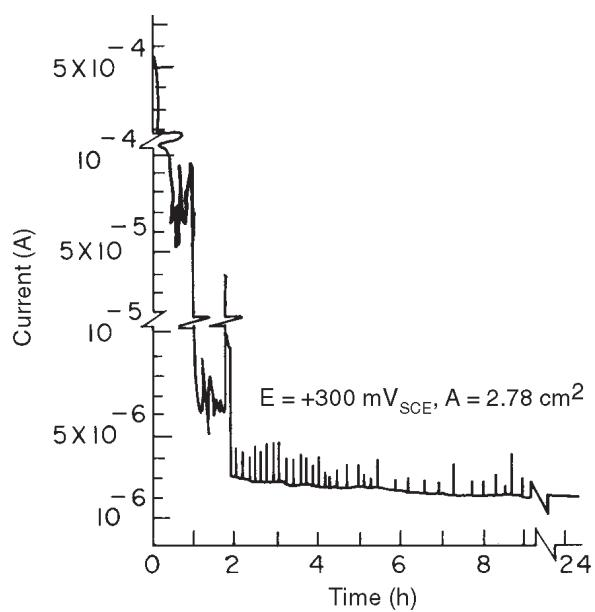  
FIGURE 8. Currentvs time curves for type 316LN SS in 1 N HCl at applied potentials of $0 m V _ { s c E } , + 1 0 0 m V _ { s c E }$ $+ 2 0 0 m V _ { s c E } ,$ and $+ 3 0 0 m V _ { s c E } .$

characteristic shape. The current increased above the background passive current as the pit nucleated and grew. After a short growth period, the pit repassivated, and the current decreased quickly to the level of the original passive current. The lifetimes of metastable pits in this work were ≤ 6 min, but typically were < 1 min. From those current transients, it was shown that the current (I) increased as the square of time: ${ \mathsf { I } } = \mathsf { a } \mathsf { t } ^ { 2 }$ . At an applied potential of $+ 1 0 0 \ : \mathrm { m V } _ { \tt S C E }$ in 1 N HCl solution, the value of a was determined to be 0.40 (for t in min) as shown in Figure 9. This relation indicated

that the true current density on the pit surface was nearly constant with time. Similar behavior of repassivated pits in N-containing SS was reported by Osozawa, et al., in neutral Cl– solution.12

At applied potentials of $+ 4 0 0 ~ \mathsf { m V } _ { \mathsf { s c E } }$ and $+ 7 0 0 ~ \mathrm { m V } _ { \tt S C E }$ , stable pitting was observed with no occurrence of current transients. Current values reached 7 mA/cm2 and 60 $m \mathsf { A } / \mathsf { c m } ^ { 2 } ,$ respectively (Figure 10).

The potentiostatic experiments showed that the small anodic loop with current fluctuations in the

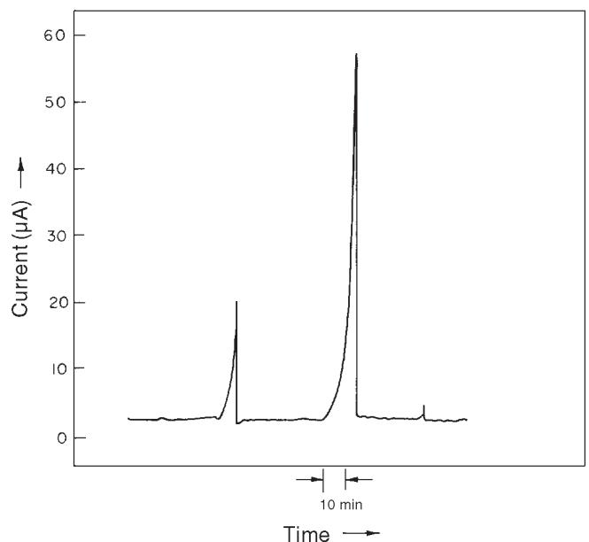  
FIGURE 9. Metastable pitting current transients of type 316LN SS in 1 N HCl at applied potential of +100 $m V _ { s c E } .$

potential range of $0 \mathsf { m V } _ { \mathsf { s c E } } \mathsf { t o } + 3 0 0 \mathsf { m V } _ { \mathsf { s c E } }$ observed in type 316LN SS was a result of the occurrence of metastable pits. While determining the polarization curves, potential steps of 20 mV/min taken in the anodic direction did not provide sufficient time at each set potential to repassivate the metastable pits (Figure 11). In potentiostatic runs in this potential range, however, such repassivation always was possible, as demonstrated in Figure 8.

In addition to potential-step and potentiostatic experiments, chemical immersion tests were performed to study pitting corrosion of type 316LN SS. The potential of freely corroding metal was monitored and analyzed to ascertain changes in the pitting corrosion process. Type 316LN SS samples were exposed in 4%, 6%, and 20% ferric chloride (FeCl3) solutions at ambient temperature for 6 days and in boiling 11% $H _ { 2 } S O _ { 4 } + 3 \% H C l + 1 \% F e C l _ { 3 } + 1 \% C U C l _ { 2 }$ solution (wt%) for 24 h.13-14 These solutions are used generally to check pitting corrosion tendency in highly resistant materials. Specifically, 6 wt% $\mathsf { F e C l } _ { 3 }$ solution is used in ASTM Standard G 48-76.15

The corrosion potential behavior of type 316LN SS during immersion in 4% and 6% $\mathsf { F e C l } _ { 3 }$ solutions is presented in Figures 12 and 13, respectively. The corrosion potentials which were reasonably positive showed occurrence of surges in the negative direction within a few minutes after the immersion. This was a result of the early stages of pit initiation and growth, followed by repassivation. The potential decreased relatively slowly for a few minutes when pits were initiated and grown, but increased within 5 s to 10 s to its previous value when pit repassivation occurred.

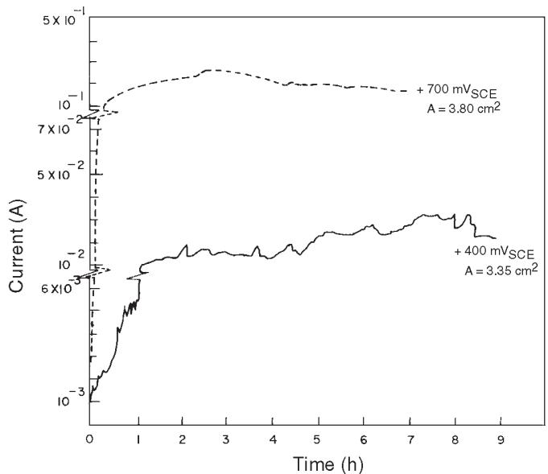  
FIGURE 10. Current vs time curve for type 316LN SS in 1 N HCl at applied potentials of +400 $m V _ { s c E }$ and $+ 7 0 0 m V _ { s c E } .$

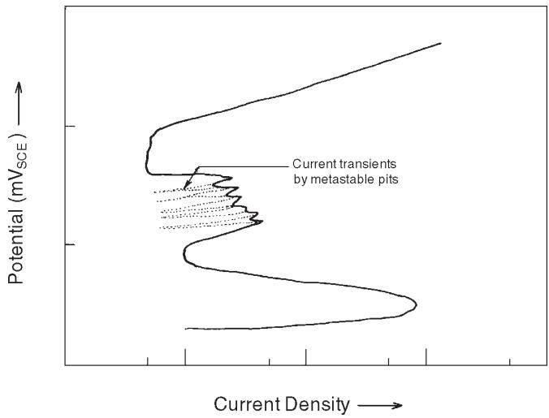  
FIGURE 11. Schematic representation of anodic polarization curve of type 316LN SS in 1 N HCI solution indicating a secondary loop with fluctuating current caused by superposition of metastable pit current transients.

This is evident in Figure 13, where an enlarged part of the potential fluctuation curve is shown.

It has been reported previously that the rate of $\mathsf { F e } ^ { 3 + }$ ion reduction is slow on a passivated SS surface and that there is a low exchange current density and a high cathodic Tafel slope.16-17 This sluggishness hinders the anodic growth of a pit until the potential drops to much lower values. Only then is the cathodic process sufficiently rapid to maintain pitting. After the pit has repassivated, the required cathodic current due to $\mathsf { F e } ^ { 3 + }$ reduction becomes minimal again to balance dissolution under the passive condition, so that the potential becomes restored to its previous more noble value.

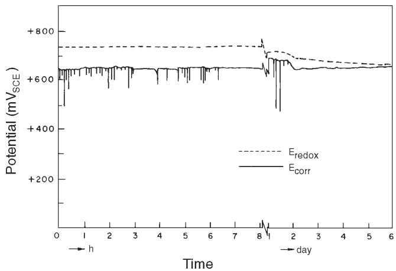  
FIGURE 12. Variation of corrosion potential $( E _ { c o r r } )$ of type 316LN SS and redox potential $( E _ { r e d o x } )$ with time of immersion in 4% $F e C l _ { 3 }$ solution.

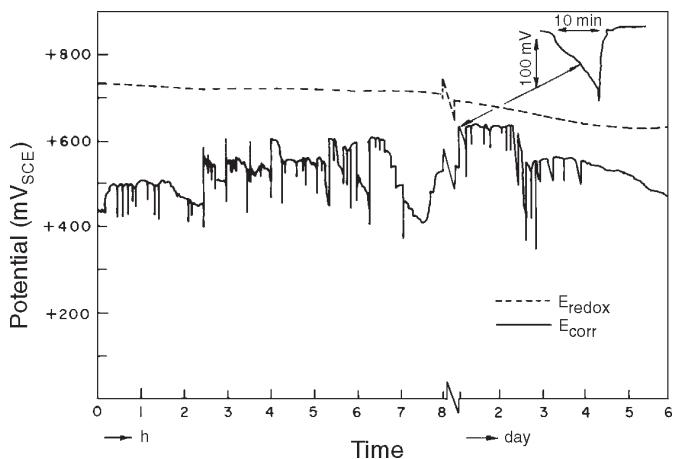  
FIGURE 13. Variation of corrosion potential $( E _ { c o r r } )$ of type 316LN SS and redox potential $( E _ { r e d o x } )$ with time of immersion in 6% $F e C l _ { 3 }$ solution.

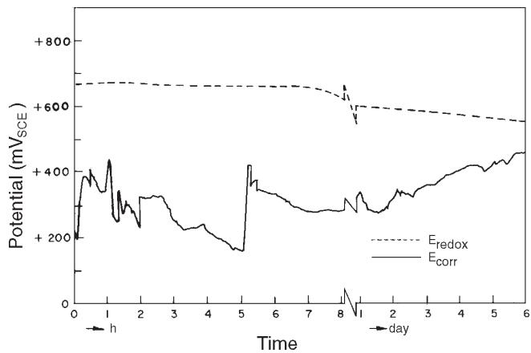  
FIGURE 14. Variation of corrosion potential $( E _ { c o r r } )$ of type 316LN SS and redox potential $( E _ { r e d o x } )$ with time of immersion in 20% $F e C l _ { 3 }$ solution.

This type of pit initiation and repassivation was observed in type 316LN SS in 4% and 6% $\mathsf { F e C l } _ { 3 }$ solutions during the initial 2 days to 4 days of immersion. After initial occurrence of potential transients from pitting, the corrosion potential remained steady at a value of +650 $\mathsf { m V } _ { \mathsf { s c E } }$ in $4 \% \ F e C l _ { 3 }$ solution. In 6% $\mathsf { F e C l } _ { 3 }$ solution, the value was $+ 4 5 0 ~ \mathsf { m V } _ { \mathsf { s c E } }$ at the end of the run but drifted to more active values with time, as a result of stable pit growth.

In 20% $\mathsf { F e C l } _ { 3 }$ solution (Figure 14), the corrosion potential dropped immediately to + 300 $\mathsf { m V } _ { \mathsf { S C E } }$ and then fluctuated in the range of +250 $\mathsf { m V } _ { \mathtt { S C E } }$ to $+ 4 5 0 \mathrm { \ m V _ { s c \in \cdot } }$ As pitting occurred readily in this highly aggressive solution and the pit anodes increased in area, the cathode-anode area ratio fluctuated with time because of spontaneous repassivation and reinitiation of pits, thus resulting in fluctuations in corrosion potential. The corrosion potential finally steadied to a typical range. Pits in this highly concentrated $\mathsf { F e C l } _ { 3 }$ solution were very stable, and the corroded sample showed a high average corrosion rate. Corrosion rates of duplicate runs determined by weight-loss method showed average values of $< 0 . 0 1$ mm/y, 0.04 mm/y, and 1.1 mm/y for type 316LN SS in 4%, 6%, and 20% $\mathsf { F e C l } _ { 3 }$ solutions, respectively. These values were $> 2$ orders of magnitude lower than values of type 304 SS exposed in comparatively concentrated $\mathsf { F e C l } _ { 3 }$ solutions.18-19 Redox potential values, determined by dipping a fresh Pt electrode in the respective solutions, drifted gradually in the active direction during the experiments (Figures 12 through 14). These values ultimately remained steady at $+ 6 5 0 ~ \mathsf { m V } _ { \mathsf { s c E } }$ +625 $\mathsf { m V } _ { \mathsf { s c E } }$ , and $+ 5 5 0 \mathrm { \ m V } _ { \tt S C E }$ in $4 \% , 6 \% ,$ and 20% $\mathsf { F e C l } _ { 3 }$ solutions, respectively, at the end of the run. This finding showed the highly oxidizing nature of the solutions. The steady decrease in redox potentials was caused by the generation of corrosion products, mainly $\mathsf { F e } ^ { 2 + }$ ions, in the solutions.

The sample exposed in 11% $\mathsf { H } _ { 2 } \mathsf { S O } _ { 4 } + 3 \%$ HCl + 1% $\mathsf { F e C l } _ { 3 } + 1 \% \mathsf { C u C l } _ { 2 }$ solution showed a high uniform corrosion rate, on the order of 70 mm/y, with no pitting corrosion. The corrosion potential of type 316LN SS, which was $+ 2 0 0 ~ \mathsf { m V } _ { \mathsf { s c E } }$ at the beginning, shifted rapidly within a few minutes to an active value of –180 mVSCE and remained steady thereafter (Figure 15). The enhanced dissolution without passivity and pitting in type 316LN SS was a result of the high acidity of this boiling solution in the presence of oxidizing Cl– salts. The solution contained $1 . 3 \ : \mathsf { M } \ : \mathsf { H } _ { 2 } \mathsf { S } \mathsf { O } _ { 4 }$ and 0.35 M HCl. The redox potential determined by dipping a Pt electrode in the solution showed a steady increase from $+ 1 0 0 \ : \mathrm { m V } _ { \tt S C E }$ to +400 $\mathsf { m V } _ { \mathsf { s c E } }$ within the initial 3 h of the experiment. Thereafter, it fluctuated between

+300 $\mathsf { m V } _ { \mathtt { S C E } }$ and $+ 4 0 0 ~ \mathsf { m V } _ { \mathsf { s c E } }$ . This solution was only suitable as a pitting test for very resistant alloys.

To investigate the fundamentals of localized corrosion such as pitting, it is important to have a knowledge of solution chemistry within the local anode. Solutions obtained after the pitting corrosion experiments were analyzed for dissolved alloying elements and possibly $\mathsf { N H } _ { 4 } ^ { + }$ , which may have formed inside the pit. The dissolved products were taken mainly from the pits because surrounding passive surface has a negligible dissolution rate.20 Chemical immersion tests included in this study used 1 N HCl and 20% FeCl3 solutions, both at ambient temperature, and boiling $1 1 \% H _ { 2 } S O _ { 4 } + 3 \% H C l + 1 \% F e C l _ { 3 } + 1 \%$ $\mathsf { C u C l } _ { 2 }$ solution as described earlier. Also included were pitting corrosion experiments at different applied potentials including $- 2 6 0 ~ \mathsf { m V } _ { \mathsf { s c E } }$ (critical passivation potential), $+ 4 0 0 ~ \mathsf { m V } _ { \mathsf { s c E } }$ , and +700 $\mathsf { m V } _ { \mathtt { S C E } }$ in 1 N HCl and in saturated NaCl solution at +360 $\mathsf { m V } _ { \mathsf { s c E } }$ and $+ 3 8 0 ~ \mathsf { m V } _ { \mathsf { s c E } }$ and in 4 N NaCl at $+ 3 7 0 ~ \mathrm { m V } _ { \tt S C E }$ . Potentials were applied to generate pit anolytes under different experimental conditions. In acidic solutions, the corrosion products were all in dissolved form, whereas in neutral solutions, the corrosion products were precipitated in colloidal form. HCl was added to dissolve them before analysis.

Metallic concentrations in the corrosion products generated under various experimental conditions are summarized in Table 2. The quantities of dissolved metallic ions equivalent to total amount of metals in the corroding liquid agreed well with the weight loss of the corroded sample in each experiment. The abundance of metallic components, on a wt% basis, with respect to total amount of metal in the corrodent, more or less correlated well with that of base-metal composition of type 316LN SS listed in Table 1. Dissolved species in the corrodent resulted mainly from pitting corrosion, except in experiments 1, 2, and 3, where uniform active dissolution occurred rather than localized pitting corrosion. This indicated no selective dissolution occurred in pitting corrosion of type 316LN SS and supported similar observations of Suzuki, et al., in pitting corrosion of type 316L SS.21

Assuming the valence of metallic ions in the pit anolyte to be $\mathsf { F e } ^ { 2 + } , \mathsf { C r } ^ { 3 + } , \mathsf { N i } ^ { 2 + } , \mathsf { M o } ^ { 3 + }$ , and $\mathsf { M n } ^ { 2 + }$ , and calculating respective concentrations from the coulometric data in Table 2 as elucidated by Stolica for each pitting corrosion experiment, it was evident that the experimental results agreed well with the preassumed calculation.22 This suggested that these were the major ions generated in the pit during localized corrosion. This finding also showed the dissolution always proceeded at \~ 100% current efficiency and involved the formation of ions of the usual valence in the pit developed at various set potentials. Novokovsky reported that, even under

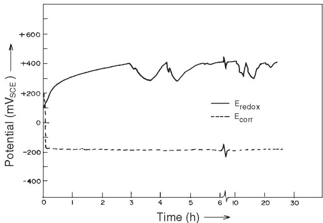  
FIGURE 15. Variation of corrosion potential $( E _ { c o r r } )$ of type 316LN SS and redox potential $( E _ { r e d o x } )$ with time of immersion in boiling 11% $H _ { 2 } S O _ { 4 } + 3 \% H C I + 1 \% F e C I _ { 3 } + 1 \% C u C I _ { 2 }$ solution.

galvanostatic conditions with a sharp growth of the potential up to +2.5 V and higher in 18% Cr- 9% Ni steel, a visible salt plug at the pit bottom was observed.23 Under this condition, neither the current efficiency nor the valence of the metal ions in the corrosion product changed.

Analysis of dissolved metallic components in the corrodents after experiments 1, 2, and 3 provided some indication of preferential dissolution of Fe, but not Cr or Ni, from the steel. In these experiments, uniform active dissolution of metal occurred either at OCP or near the critical passivation potential as elaborated in Table 2. Since a large depth of attack was associated with these experiments, no conclusive inference could be drawn.

Because Osozawa, et al.,12 suggested generation of $\mathsf { N H } _ { 4 } ^ { + }$ ions inside the pit was responsible for greater resistance to pitting corrosion of N-bearing SS, solutions after the experiments displayed in Table 2 were analyzed for presence of N as ammonium ion. Quantitative estimations also were made. The concentration analysis of N present as $\mathsf { N H } _ { 4 } ^ { + }$ for each experiment was converted to a percentage of the corrosion product (assuming the contribution from all other elements except Fe, Cr, Ni, Mo, and Mn to be negligible). The percentage of N in the corrosion product then was related to the percentage of N in the bulk alloy. The results of N analysis under various experimental conditions are summarized in Figure 16 in terms of the ratio defined by the percentage of N found as $\mathsf { N H } _ { 4 } ^ { + }$ in the corrosion products divided by the percentage of N in the bulk alloy. This ratio was indicative of the rate of intensity of reduction of N to $\mathsf { N H } _ { 4 } ^ { + }$ . Under a uniformly corroding condition in experiments 1 and 3 as illustrated in Table 2 and in the immersion experiment in boiling $1 1 \% \mathsf { H } _ { 2 } \mathsf { S O } _ { 4 } + 3 \%$ HCl $+ 1 \% F e C l _ { 3 } + 1 \% \mathrm { C u C l _ { 2 } } ,$ , the ratio of percentage of N in corrosion product divided by the percentage of N in the bulk alloy increased as the potential set or attained in the experiment became more active. This was understandable because the reduction reaction of N to NH + was enhanced at a more active potential. More specifically, the logarithm of the reduction reaction rate obeyed a linear relation with potential, either set in potentiostatic run or attained in the immersion test. The slope determined from the linear portion of the curve

TABLE 2  
Metallic Concentration in Corrosion Products Generated
<table><tr><td></td><td>Experimental</td><td>Sample Weight Loss</td><td>Charge Consumed</td><td></td><td></td><td></td><td></td><td></td><td></td><td>Total Metallic Component in Corrodent</td></tr><tr><td>Experiment</td><td>Condition Uniform corrosion at</td><td>(mg)</td><td>(cou)</td><td></td><td>Fe</td><td>Cr</td><td>Ni</td><td>Mo</td><td>Mn</td><td>(mg)</td></tr><tr><td>1</td><td>OCP (-360 mVsce) for 7 days in 1 N HCl</td><td>38.5</td><td>一</td><td>Component in corrodent (mg) Component (wt% basis)</td><td>27.6</td><td>5.52</td><td>4.14</td><td>0.69</td><td>0.474</td><td>38.42</td></tr><tr><td>2</td><td>Uniform corrosion at -260 mVsce for 8 h in 1 N HCI</td><td>27</td><td>81</td><td>Component in corrodent (mg) Component</td><td>20.42</td><td></td><td></td><td></td><td>0.26</td><td>25.47</td></tr><tr><td>3</td><td>Uniform corrosion at -260 mVsce for 26 h in 1 N HCl</td><td></td><td></td><td>(wt% basis) Component in corrodent (mg) Component</td><td>80.16</td><td>7.45</td><td>9.32</td><td>2.05</td><td>1.0</td><td></td></tr><tr><td>4</td><td>Pitted at +400 mVsce for 10 h in 1 N HCl</td><td></td><td>642</td><td>(wt% basis) Component in corrodent (mg)</td><td>66.18</td><td>15</td><td>16</td><td>2.85</td><td>1.56</td><td></td></tr><tr><td></td><td>Pitted at +700 mVsce for 7 h</td><td></td><td></td><td>Component (wt% basis) Component in</td><td>68.8</td><td>14</td><td>12.85</td><td>3.1</td><td>1.5</td><td></td></tr><tr><td>5</td><td>in 1 N HCI Pitted at</td><td>900.5</td><td>3,602</td><td>corrodent (mg) Component (wt% basis)</td><td>516.2 61.5</td><td>169.1 20</td><td>115.7 13.8</td><td>24.92 2.96</td><td>13.88 1.65</td><td>839.80</td></tr><tr><td>6</td><td>+360 mVsce for 4 h in sat. NaCl</td><td>221</td><td>841</td><td>Component in corrodent (mg) Component (wt% basis)</td><td>131.32 61.9</td><td>38.6</td><td>33.48</td><td>6.18</td><td>2.6</td><td>212.18</td></tr><tr><td>7</td><td>Pitted at +380 mVsce for 5.5 h in sat. NaCl</td><td>495</td><td>1,906</td><td>Component in corrodent (mg) Component (wt% basis)</td><td>293.8</td><td>91</td><td>67.6</td><td>14.04</td><td>6.45</td><td>472.89</td></tr><tr><td>8</td><td>Pitted at +370 mVsce for 5 h in 4N NaCI</td><td>226</td><td>851</td><td>Component in corrodent (mg)</td><td>132.6</td><td></td><td></td><td></td><td></td><td></td></tr></table>

was found to be 125 mV/decade, as shown in Figure 16. This was considered as a kind of Tafel slope for the reaction:

$$
\mathsf { N } + 4 \mathsf { H } ^ { + } + 3 \mathsf { e } \to \mathsf { N H } _ { 4 } ^ { + }\tag{1}
$$

The graphical plot of percentage of N in the pit anolyte divided by the percentage of N in the bulk alloy for potentiostatic controlled experiments at various set potentials is included in Figure 16. Also included is the chemical immersion test of type 316LN SS in 20% $\mathsf { F e C l } _ { 3 }$ solution, where the potential attained fluctuated between $+ 2 5 0 ~ \mathsf { m V } _ { \mathsf { s c E } }$ and $+ 4 5 0 ~ \mathsf { m V } _ { \mathsf { s c E } }$ . Shallow round pits of maximum diameter 2 mm to 3 mm formed during these potentiostatic controlled experiments. Hisamatsu, et al., also observed shallow pits in acidic Cl– solution for type 304 SS under potentiostaticcontrolled conditions.24 In the chemical immersion test in 20% $\mathsf { F e C l } _ { 3 }$ solution, comparatively deep pits formed in type 316LN SS. The maximum pit diameter attained was about 1,500 µm. Electrochemical control under this immersion condition may have shifted from initial anodic to ultimate cathodic control via mixed control, as explained by Greene and Fontana in their study of pitting corrosion of austenitic SS in $\mathsf { F e C l } _ { 3 }$ solution by an artificial pit method.25

According to Greene and Fontana, with the progress of pitting corrosion, either a single pit enlarges or more pits appear on the surface, resulting in a decrease in the ratio of true cathode-anode area. This leads to a comparative increase in cathodic polarization, so that pitting corrosion under immersion condition ultimately becomes cathodic controlled. Schwenk noted that pitting corrosion of SS under a simple immersion condition in solutions containing redox species resembles that of a potentiostatic character at the beginning, but its behavior changes to more of a galvanostatic character during its subsequent growth.26 Under this prevailing condition, deep grown pits ultimately could form, as demonstrated by Hisamatsu, et al.24

The tendency toward formation of $\mathsf { N H } _ { 4 } ^ { + }$ as a reduction product of alloyed N from the SS in the pit dissolution process in this work decreased as more anodic potential either was applied or attained during the course of the experiment (Figure 16). $\mathsf { N H } _ { 4 } ^ { + }$ formation was observed even at an applied potential of $+ 7 0 0 ~ \mathrm { m V } _ { \tt S C E }$ , whereas Newman, et al., calculated theoretically the approximate potential of $\mathsf { N H } _ { 4 } ^ { + }$ formation to be more active.27 To explain this anomalous behavior, the potential attained at the bottom of the growing pit also had to be taken into consideration.

Szklarska-Smialowska has argued that the potential in the pit in the initial stage of pit development is not very different from that of the passivated metal.28 At high anodic potential, the dissolution can occur only at the high limiting current of metal dissolution caused by high Cl– concentration and low pH in the pit anolyte. As the pit bottom potential gradually decreases compared to the external electrode surface potential, active dissolution in the pit starts leaving the range of limiting current.29

Intermittent gas bubbles began appearing from the pits after an hour from the start of the experiment in all cases in the present work. Pickering and Frankenthal also observed ${ \mathsf { H } } _ { 2 }$ bubbles emanating from the pits of Fe and SS under conditions of applied potential and under natural corrosion (OCP) conditions in the presence of a chemical redox couple.30 The potential attained at the pit bottom was determined to be $- 0 . 2 1 \mathrm { V } _ { \tt S H E }$ by insertion of a microprobe when the applied potential was set even at $+ 1 . 2 V _ { \mathsf { s H E } }$ . The average pit growth rate comprised widely differing momentary rates in phase, with a potential oscillation in the pit either due to evolution of $\mathsf { H } _ { 2 }$ bubbles or motion of a bubble within the pit. They proposed that a constriction at the bottom of a growing pit caused by a H2 bubble gave rise to a path of high resistance and was responsible for the large impedance resistance (IR) drop. A mathematical model of this idea was developed by Lau and Chang, and elaborate analysis was reported elsewhere.31 Such a potential oscillation to the active region might explain the potential shift required at the bottom of a largely growing pit for the generation of $\mathsf { N H } _ { 4 } ^ { + }$ in the pit. This may have formed as a result of the reduction of alloyed N even at a highly

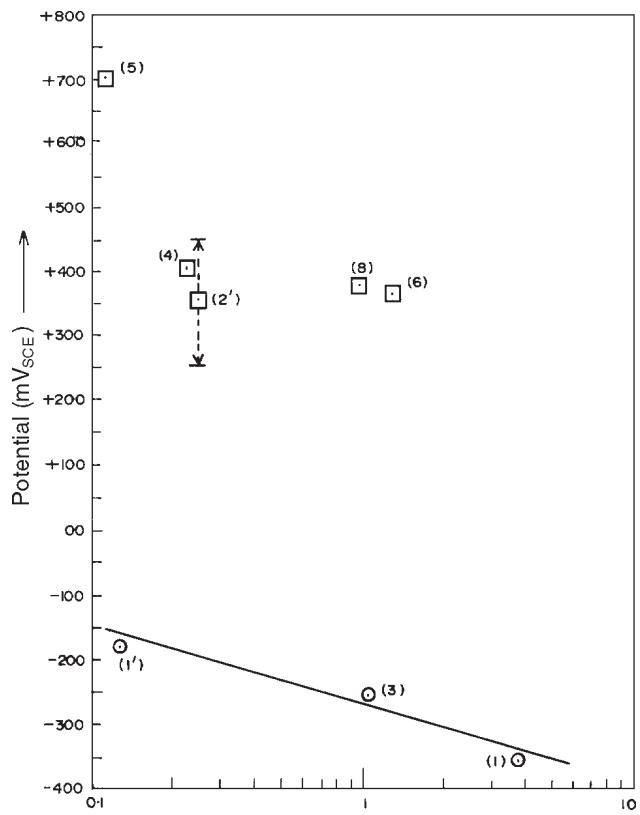  
FIGURE 16. Ratioofwt%ofNcomponentin corrosionproduct to wt% of N in bulk alloy as a function of potential set and maintained in the experiment: (1) 1 N HCl, 7 days; (3) 1 N HCl, 26 h; (4) 1 N HCl, 10 h; (5) 1 N HCl, 7 h; (6) 6.2 N NaCl, 4 h; (8) 4 N NaCl, 5 h; (1') 11% H2SO₄+ 3% HCl+ 1% $F e C l _ { 3 } + 1 \% C u C l _ { 2 }$ (immersion); (2') 20% $F e C l _ { 3 }$ (immersion). (Details are in Table 2.)

anodic applied potential of $+ 7 0 0 ~ \mathsf { m V } _ { \mathsf { s c E } }$ in type 316LN SS. The integrated time spent by the pit bottom at the required active potential for generation of $\mathsf { N H } _ { 4 } ^ { + }$ ions27 was less at more anodic applied potential. Thus, generation of $\mathsf { N H } _ { 4 } ^ { + }$ in the pit was less as the applied potential became more anodic.

An in-depth composition profile analysis was performed on pit surfaces and on the surrounding passive region using AES to determine the enrichment or depletion of alloy elements on the actively growing pitted surface. After experiment 4 (elaborated in Table 2), the specimen was removed from the electrolyte without switching off the potentiostat. The specimen was rinsed with distilled water and stored in a desiccator before being introduced in the ultra-high vacuum apparatus for AES analysis. Formation of shallow round pits of diam 3 mm enabled determination of surface composition analysis inside the pit and on the passive surface. To convert Auger electron peak amplitudes into concentrations, elemental sensitivity factors were used.32 Sputterinduced composition changes were neglected. Values reported in these figures were not strictly quantitative as a result.

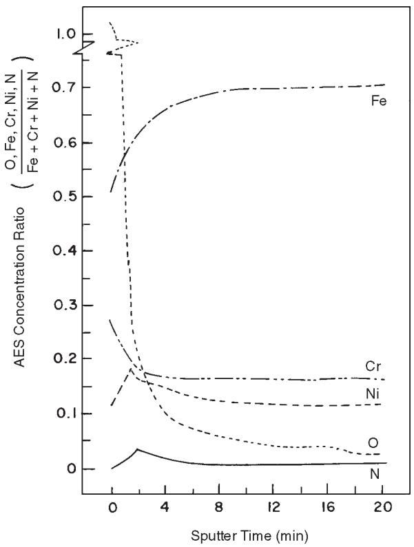  
(a)

The in-depth composition profiles were represented as elemental concentration ratios in the surface film and in the metal substrate. Figure 17 shows an in-depth composition profile of a pitted surface and the surrounding unattacked region. The unattacked region surrounding the pit showed typical passive film characteristics (Figure 17[a]). $\mathsf { O } _ { 2 }$ content in the film decreased with the depth of ion sputtering. Considerable depletion of the Fe component was observed in the passive film. Its concentration gradually increased with depth and ultimately reached the steady base-metal composition. Enrichment of Cr in the passive layer also was observed. This decreased gradually toward the film-metal interface.

It followed that the depth of the Cr-enriched layer was of the same order as the apparent thickness of the oxide film. The depletion of Fe and the enrichment of Cr in the passive film was explained by Leygraf, et al., as resulting from selective dissolution of Fe from the SS passive surface.33 This conclusion was reached after gamma-spectroscopic analysis of electrolyte containing dissolution products of the passive surface. N and Ni were depleted on the passive surface and enriched in the metal-passive film interface. The

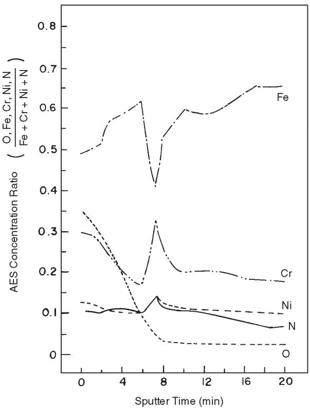  
(b)  
FIGURE 17. AES concentration ratio of alloy components in type 316LN SS as a function of sputtering time: (a) on the surrounding unattacked region and (b) on the pitted surface. Specimen pitted at +400 $m V _ { s c E }$ in 1 N HCl for 10 h.

present observations agreed with those of Lu, et al.,34 on N and Ogawa, et al.,35 on Ni in the passive films developed in their respective studies.

In-depth composition analysis within the pit (Figure 17[b]) indicated comparatively low $\mathsf { O } _ { 2 }$ concentrations. This may have been a result of a dehydrating effect of the metal salt present within the pit. Further rinsing with distilled water did not restore its original passive condition. An increase in average surface film thickness in the pit was possibly the result of a porous nature of the restored film within the pit, as well as further growth of depassivated areas during the rinsing operation. The Fe component showed significant depletion on the pit surface, progressively increasing with the depth of sputtering. Considerable depletion of the Fe component at the film-metal interface was observed before reaching the base-metal composition.

In contrast, the Cr component showed considerable enrichment on the pitted surface and its concentration declined with depth of sputtering. At the film-metal interface, considerable Cr enrichment was observed. On the pit surface, if Fe preferentially dissolved from the substrate through the existing nonprotective film, Fe depletion and Cr enrichment would have resulted in the substrate as well as in the film. Enrichment of the Ni component was observed marginally on the pitted surface and, to some extent, at the film-metal interface. N was observed to be enriched significantly on the pitted surface, where its concentration was up to 50 times higher than in the surrounding passive film or base-metal composition. This enrichment was maintained apparently to a great depth in the metal substrate. A N enrichment peak at the film-metal interface was noted also.

In-depth composition profiles of $\mathsf { O } _ { 2 } ,$ S, and Mo components on the pit surface and on the surrounding passive region were represented qualitatively as plots of peak height vs sputtering time and shown in Figures 18 and 19, respectively. The $\mathsf { O } _ { 2 }$ profile in the pit was broad and depleted in $\mathsf { O } _ { 2 }$ compared to the surrounding passive region. On the pit surface, an appreciable S peak was observed (Figure 18) but disappeared rapidly with ion sputtering. This may have been caused by dissolution of a S-bearing compound in the pit. Electron probe microanalysis (EPMA) showed S-bearing compounds were invariably present in this steel as duplex oxide-sulfide inclusions, which were known as the most preferential sites for pit nucleation.36 Presence of a small amount of S in the passive film surrounding the pit (Figure 19) may have been a result of adsorption of S-bearing corrosion product from the pit.

Although enrichment of Mo on the actively dissolving surface of SS has been reported previously,35,37-38 the present study showed (Figure 18) no such enrichment of Mo component on the pitted surface. Such a difference, as explained by Goetz and Landolt, may have been a result of the low Mo content in the alloy and limitations of the surface analysis procedure in the present study.39 Marginal enrichment of Mo in the inside surface of the passive film surrounding the pit was observed (Figure 19), but this may have been caused by superposition of a Cl– peak. The Cl– profile was not shown in Figures 18 and 19 because it would have overlapped with the 186-eV peak of Mo and, therefore, could not have been differentiated.

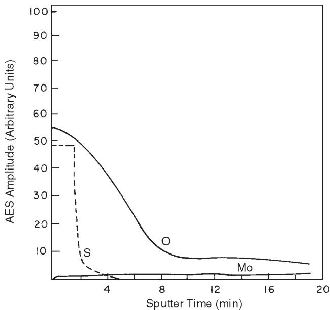  
FIGURE 18. AES depth profile on the pit-grown surface in type 316LN SS. Experimental conditions were as in Figure 17.

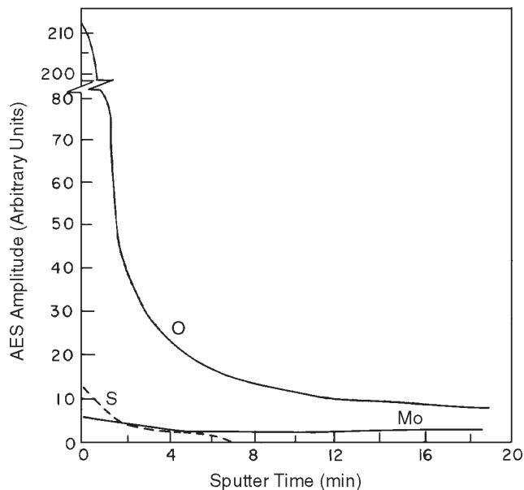  
FIGURE 19. AES depth profile on the unattacked surface surrounding the pit in type 316LN SS. Experimental conditions were as in Figure 17.

## DISCUSSION

The beneficial effect of alloyed N in inducing pitting corrosion resistance in SS was well established in the present work. The critical potential for stable pitting corrosion increased in the anodic direction in N-alloyed steel. Further, it was observed that a minimum NaCl concentration of 1.5 N in neutral solution or the maximum threshold pH of 2 in 1 N NaCl solution were required for stable pit growth in type 316LN SS even when anodically polarized. Thus, a more aggressive solution was necessary for stable pit growth in SS containing N.

The observation of metastable pitting at comparatively low potentials in the present study indicated N mainly affected the early stage of pit propagation, rather than pit initiation. Osozawa, et al., reported previously that Cr addition did not alter noticeably the size of repassivated pits, whereas pit size became appreciably smaller on the addition of N.12 Thus, N had a greater effect than Cr in suppressing the growth of metastable pits. Hisamatsu also reported film breakdown was necessary but not sufficient for stable pit initiation.40

Based on the present results, the beneficial effect of N in pitting corrosion of SS was believed to result from its role in the early stage of pit propagation. NH4+ formed in the pit. It has been shown that cathodic dissolution of N to NH4+ will, at a sufficiently positive potential, become too slow to keep up with the increasing rate of alloy dissolution in the pit so that enrichment of N atoms in the active surface results.27 Enriched N is known to reversibly block the active sites on the anodically dissolving surface in the incipient local chemistry of a pit.27 A chemical interaction between N and Mo or Cr might be involved. Although this blockage of active sites is not a passivation process, it prevents (or delays to high potentials) the attainment of the extremely high current density necessary for stable pit initiation.27 Mo also is known to inhibit active-state dissolution at the very early stage of pit propagation,41 thus explaining synergistic effects between Mo and N as reported previously.4,27,42 Mo specifically enhances the degree of anodic polarization of the anodic reaction in the pit environment, possibly by exerting its influence in reducing the dissolution rate of a Cr-enriched Cl– salt layer formed inside the pit as proposed by Galvele, et al.43 However, this effect was not reported by Newman, et al.27

During the initial burst of current as a result of active dissolution in the pit embryo, predominantly Fe dissolution may occur such that the remaining pit surface becomes relatively enriched in Cr and may repassivate more easily than in the absence of N. The observed trend of the N effect on Cr accumulation on the corroded surface was reported also by Pawel,

et al.,8 in SS both at active and passive dissolution potentials.They observed that this effect was greatest for active dissolution at potentials near that of the lowpotential loop.

AES surface analysis in the pit in type 316LN SS (Figure 17[b]) indicated this significant enrichment of Cr and to some extent Ni persisted on the active pit surface in the present work. During active dissolution in the growing pit, the potential at the pit bottom may have oscillated to the active region due to evolution of H2 bubbles, as demonstrated by Pickering and Frankenthal.30 This attainment of active potential at the pit bottom might explain the observed enrichment of Cr and Ni and the well-known enrichment of Mo on the pitted surface. Olefjord, et al., demonstrated that Cr, Ni, and Mo were enriched in the surface region during active dissolution of SS, and thereby controlled the dissolution rate, controlled over-potential, and provoked passivation of the alloy.37 In the present study, significant enrichment of N on the pit grown surface also was observed. This was primarily a result of the sluggish cathodic dissolution of N to NH4+ at more noble applied potential, even though the pit bottom attained an active potential intermittently during its entire growth process.30 Nonselective dissolution of alloying elements within the pit at the same time as enrichment of Cr, Ni, and possibly Mo at the pitted surface might be explained by the fact that solid-state dissolution processes, as proposed by Pickering and Wagner,44 were too slow to permit maintaining selective dissolution inside the pit for prolonged times. Thus, preferential dissolution was replaced after a short period by simultaneous dissolution of alloy components.45

Thus, alloyed N indirectly helped to inhibit pitting corrosion in SS, either by restricting active dissolution so that the required high current density could not be attained in the pit embryo27 or by enhancing repassivation of the pit caused by a dissolutiongenerated Cr-enriched layer on the pit surface.8 Both mechanisms may have operated simultaneously. This explained extensive metastable pit formation in N-containing type 316LN SS.

Other possible explanations, such as that the consumption of acid in pit nuclei by N dissolution12 or that N enrichment on the passivated surface34 provided better resistance to N-alloyed steel, were not proved.

## CONCLUSIONS

❖ Types 304 and 316L SS show psuedopassivity in a limited anodic potential range, followed by stable pitting, but type 316LN SS exhibited a secondary loop with fluctuating currents resulting from metastable pitting during anodic polarization in 1 N HCl solution. Since the frequency of metastable pits becames lower ❖ Under a uniformly dissolving condition, the generation rate of $\mathsf { N H } _ { 4 } ^ { + }$ ions was found to be greater at more active potentials. An apparent Tafel slope for the reduction reaction $\mathsf { N } + 4 \mathsf { H } ^ { + } + 3 \mathsf { e } \to \mathsf { N H } _ { 4 } ^ { + }$ for the N dissolution from the steel was determined and found to be 0.125 V.

with time, extended passivity was observed eventually in type 316LN SS. The corrosion rate and active peak current density were reduced slightly from the presence of N in type 316LN SS.

❖ A threshold Cl– concentration and a threshold pH of the bulk solution existed for stable pit formation in type 316LN SS.

❖ There was no selective anodic dissolution of any of the alloying elements within actively growing pits in type 316LN SS. Presence of N in the form of NH4+ ions was found in the pits grown at different anodic potentials, but its generation rate decreased with higher applied potential.

❖ AES analysis showed significant enrichment of N and Cr and, to some extent, Ni on the actively grown pitted surface. The Fe component showed considerable depletion. The unattacked surface region surrounding the pit had normal passive film characteristics.

❖ N in steel was enriched at relatively anodic potential in the incipient local chemistry of a pit, thereby reversibly blocking the active sites on the anodically dissolving surface. This prevented attainment of the extremely high current density necessary for pit initiation.27 Otherwise, Cr may have become enriched at the active surface as a result of selective dissolution of Fe in the pit initiation stage, so that early repassivation was favored without further pit growth. Thus, the present observations showed N indirectly inhibited stable pit initiation, either through its effect on transient dissolution kinetics or through its effect on repassivation process in the pit. It was shown that both processes may work together for the ultimate act of pit inhibition by N alloying.

## ACKNOWLEDGMENTS

The authors acknowledge the assistance of S. Banerjee, head of the Metallurgy Division; C.K. Gupta, associate director of the Materials Group, Analytical Chemistry Division; and L. Kumar, all of the Bhabha Atomic Research Centre. This work was part of the INDO-U.S. collaboration program coordinated by the Department of Science and Technology, Government of India.

## REFERENCES

1. D. Peckner, I.M. Bernstein, Handbook of Stainless Steels (New York, NY: McGraw-Hill, 1977).

2. J.R. Kearns, H.E. Deverell, MP 26, 6 (1987): p. 18.

3. M. Kowaka II, H. Nagano, K. Yoshikawa, M. Miura, K. Ohta, S. Nagata, “Development of Low-Carbon SS 316,” paper no. 43, EPRI WS-79-174, Seminar on Counter Measures for Pipe Cracking in BWRs, held in Palo Alto, CA, Jan. 22-24, 1990 (Palo Alto, CA: EPRI, 1980).

4. J.E. Tonman, M.J. Coleman, K.R. Pirt, Brit. Corros. J. 12, 4 (1977): p. 236.

5. N.D. Greene, Experimental Electrode Kinetics (Troy, NY: Rensselaer Polytechnic Institute, 1965).

6. L. Troselius, Corros. Sci. 11, 7 (1971): p. 473.

7. K. Sugimoto, Y. Sawada, Corros. Sci. 17, 5 (1977): p. 425.

8. S.J. Pawel, E.E. Stansbury, C.D. Lundin, Corrosion 45, 2 (1989): p. 125.

9. A.P. Bond, E.A. Lizlovs, J. Electrochem. Soc. 115, 11 (1968): p. 1,130.

10. H.P. Leckie, J. Electrochem. Soc. 117, 9 (1970): p. 1,152.

11. J.R. Galvele, J. Electrochem. Soc. 123, 4 (1976): p. 464.

12. K. Osozawa, N. Okato, in Passivity and Its Breakdown on Iron and Iron-Based Alloys, eds. R.W. Staehle, H. Okada (Houston, TX: NACE, 1976), p. 135.

13. R. Bandy, D. Van Rooyen, Corrosion 39, 6 (1983): p. 227.

14. P.E. Manning, S.M. Corey, Metal Progress 122, 2 (1982): p. 31.

15. ASTM Standard G 48-80, “Standard Test Methods for Pitting and Crevice Corrosion Resistance of Stainless Steels and Related Alloys by the Use of Ferric Chloride Solution–Part 10,” in Annual Book of ASTM Standards (Philadelphia, PA: ASTM, 1980).

16. A.C. Makrides, J. Electrochem. Soc. 111, 4 (1964): p. 400.

17. T. Ishikawa, G. Okamoto, “On the Electrochemical Study of Austenitic Stainless Steel in Sulfuric Acid and Containing Various Kinds of Oxidizing Agents,” paper no. I-9, Proc. First Int. Cong. Metallic Corrosion, held in London, England, April 10-15, 1961 (London, UK: Butterworth’s, 1962), p. 104.

18. H.H. Uhlig, J.R. Gilman, Corrosion 20, 9 (1964): p. 289t.

19. B.E. Wilde, Corrosion 42, 3 (1986): p. 147.

20. K.J. Vetter, H.H. Strehblow, in Localized Corrosion, NACE-3, eds. R.W. Staehle, B.F. Brown, J. Kruger, A.K. Agrawal (Houston, TX: NACE, 1974), p. 240.

21. T. Suzuki, M. Yamabe, Y. Kitamura, Corrosion 29, 1 (1973): p. 18.

22. N. Stolica, Corros. Sci. 9, 4 (1969): p. 205.

23. V.M. Novokovsky, A.N. Sorokina, “Electrochemistry of Pitting and Corrosion Cracking of Stainless Steel,” in Proc. Third Int. Cong. Metallic Corrosion, held in Moscow, USSR, 1966 ( Moscow, USSR: MIR Publishers, 1969), p. I-159.

24. Y. Hisamatsu, T. Yoshii, Y. Matsumura, in Localized Corrosion, NACE-3, eds. R.W. Staehle, B.F. Brown, J. Kruger, A.K. Agrawal (Houston, TX: NACE, 1974), p. 427.

25. N.D. Greene, M.G. Fontana, Corrosion 15, 1 (1959): p. 39t.

26. W. Schwenk, Corrosion 20, 4 (1964): p. 129t.

27. R.C. Newman, T. Shahrabi, Corros. Sci. 27, 8 (1987): p. 827.

28. Z. Szklarska-Smialowska, in Localized Corrosion, NACE-3, eds. R.W. Staehle, B.F. Brown, J. Kruger, A.K. Agrawal (Houston, TX: NACE, 1974), p. 312.

29. Z. Szklarska-Smialowska, J. Mankowski, Corros. Sci. 12, 12 (1972): p. 925.

30. H.W. Pickering, R.P. Frankenthal, in Localized Corrosion, NACE-3, eds. R.W. Staehle, B.F. Brown, J. Kruger, A.K. Agrawal (Houston, TX: NACE, 1974), p. 261.

31. S. Lau, Y.A. Chang, Scripta Metall. 7, 7 (1973): p. 745.

32. L.E. Davis, N.C. MacDonald, P.W. Palmberg, G.E. Riach, R.E. Weber, Handbook of Auger Electron Spectroscopy, 2nd ed. (Eden Prairie, MN: Physical Electronics Industries, 1976).

33. C. Leygraf, G. Hultquist, I. Olefjord, B.O. Elfstrom, V.M. Knyazheva, A.V. Plaskever, Ya.M. Kolotyrkin, Corros. Sci. 19, 5 (1979): p. 343.

34. Y.C. Lu, R. Bandy, C.R. Clayton, R.C. Newman, J. Electrochem. Soc. 130, 8 (1983): p. 1,774.

35. H. Ogawa, H. Omata, I. Itoh, H. Okada, Corrosion 34, 2 (1978): p. 52.

36. K.J. Blom, J. Degerbeck, MP 22, 7 (1983): p. 52.

37. I. Olefjord, B. Box, U. Jelvestam, J. Electrochem. Soc. 132, 12 (1985): p. 2,854.

38. Ya.M. Kolotyrkin, V.M. Knyazheva, Passivity of Metals, eds. R. Frankenthal, J. Kruger (Princeton, NJ: The Electrochemical Society, 1978), p. 678.

39. R. Goetz, D. Landott, Electrochim. Acta 29, 5 (1984): p. 667.

40. Y. Hisamatsu, in Passivity and its Breakdown on Iron and Iron-Based Alloys, eds. R.W. Staehle, H. Okada (Houston, TX: NACE, 1976), p. 99.

41. R.C. Newman, Corros. Sci. 25, 5 (1985): p. 331.

42. R. Bandy, D. Van Rooyen, Corrosion 41, 4 (1985): p. 228.

43. J.R. Galvele, J.B. Lumsden, R.W. Staehle, J. Electrochem. Soc. 125, 8 (1978): p. 1,204.

44. H.W. Pickering, C. Wagner, J. Electrochem. Soc. 114, 7 (1967): p. 698.

45. J.E. Holliday, H.W. Pickering, J. Electrochem. Soc. 120, 4 (1973): p. 470.