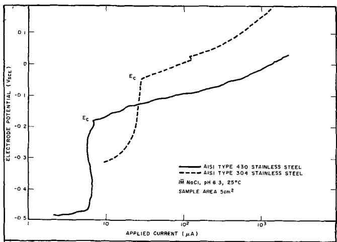
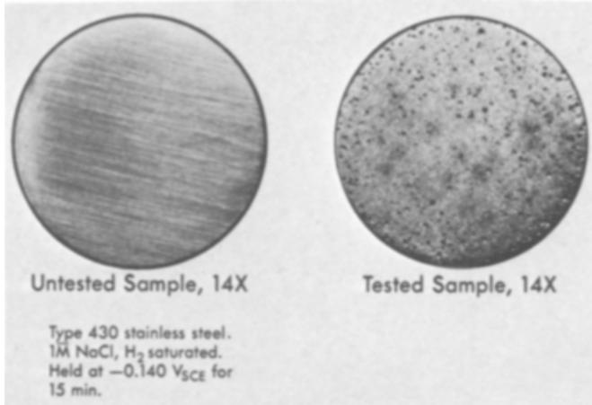
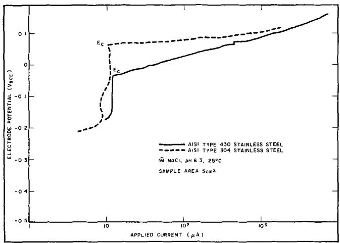
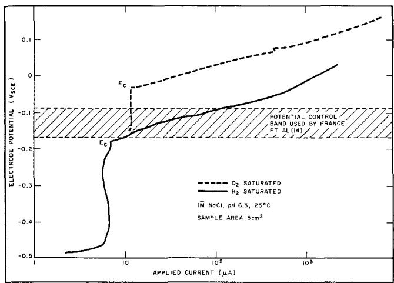
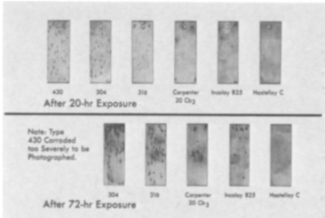
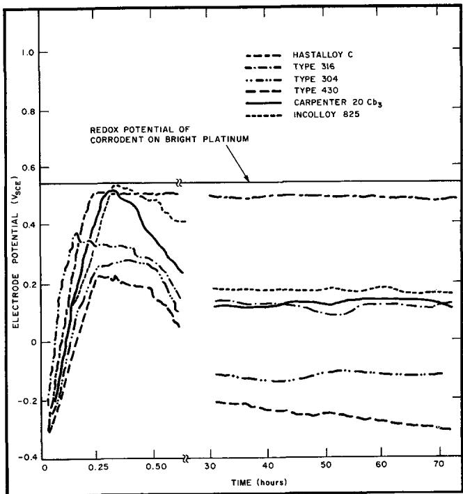
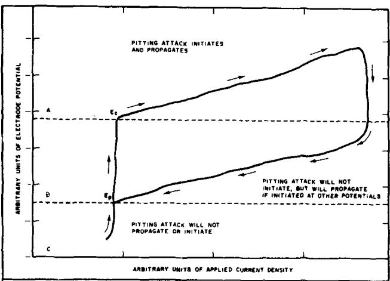

# On the Correspondence between Electrochemical and Chemical Accelerated Pitting Corrosion Tests

B. E. Wilde\* and E. Williams

Applied Research Laboratory, United States Steel Corporation, Monroeville, Pennsylvania

## ABSTRACT

For some years now, many workers have been active in the development of a stainless steel that is resistant to pitting and crevice corrosion in halide media. Electrochemical techniques combined with statistical multiple-regression analysis have beeen used to derive a relationship between pitting susceptibility and chemical composition. Recent publications in the literature have suggested, however, that the use of electrochemical accelerated tests for pitting corrosion studies leads to erroneous conclusions about the pitting susceptibility of alloys. This paper describes the results of a program designed to investigate the above reports and firmly establish whether indeed electrochemical techniques can be used as valid accelerated tests in pittingcorrosion studies.

Extensive experimental investigation in 1M sodium chloride on Type 430 stainless steel have shown an excellent correlation between electrochemical and chemical techniques, both in visually observed pitting susceptibility and metal weight loss data. Further, data obtained in 1M sodium chloride containing different dissolved gases have indicated why other authors failed to obtain any correspondence between electrochemical and chemical accelerated pitting tests, Values of the critical breakdown potential were found to vary from -0.035 VscE to -0.185 Vsce for the same steel in 1M NaCl saturated with oxygen and hydrogen, respectively.

Controlled potential chemical tests have shown, that although pitting can occur at potentials active to the breakdown potential, the corrosion potential in a given redox system rises to values more noble than this latter potential, as a necessary prerequisite for pit initiation.

Electrochemical techniques have been used extensively in the study of passivity breakdown and the development of alloys resistant to pitting corrosion. Brennert (1), Mahla and Nielson (2), and Kolotyrkin (3) have employed measurements of the "critical breakdown potential for passivity," $\pmb { { \cal E } } _ { \mathrm { c } } ,$ to predict the resistance of alloys to pitting corrosion in halide media. Streicher (4) has successfully employed an electrolytic test to assess the pitting resistance of a number of alloys to chloride containing environments. The unique feature in these techniques is that they greatly accelerate the corrosion process, and thereby greatly facilitate laboratory studies (5-13). We have used the breakdown technique in our laboratory as a screening tool in alloy development programs, on the premise that, if we can raise $\pmb { { \cal E } } _ { \mathbf { c } }$ (by alloy chemistry changes) to potentials more noble than the corrosion potential of the alloy in the intended environment, we would get no pitting.

Recently, however, articles have appeared in the literature in which the validity of using $\pmb { { \cal E } } _ { \mathrm { c } }$ as an index of pitting corrosion in the above manner, has been questioned. France and Greene (14) report a lack of correlation between electrochemical and chemical exposure tests on AISI Type 430 stainless steel and zirconium in halide media. These authors argue that an electrostatic build-up of aggressive chloride ions

• Electrochemical Society Active Member at the metal interface occurs during electrochemical polarization, which does not necessarily occur at a freely corroding interface thereby leading to differing behavior, Steigerwald (15) has reported that although $\pmb { { \cal E } } _ { \mathrm { c } }$ relates to pitting performance in some manner, he has observed pitting to propagate at potentials active to $\mathbf { \delta E _ { c , \delta } }$ for Fe/Cr alloys in acidified FeCl3.

In view of the apparent conflict between the above reports and numerous laboratory tests, we undertook a study to demonstrate the correspondence between accelerated electrochemical and chemical pitting tests, no attempt being made to extend this correspondence to long term corrosion behavior. This paper describes the results of this study and an attempt to explain the discrepancies noted above.

## Materials and Experimental Work

Effort was made as far as possible to duplicate the conditions reported by France and Greene (14) to be certain that the experimental technique was not a variable. Cylindrical electrodes of AISI 430 and 304 stainless steel were machined (0.25 in. diameter by 0.75 in. long) from solution-annealed stock having the composition shown in Table I.The electrodes were abraded through 2.0 emery paper, washed in detergent, rinsed in distilled water, and dried. Polarization experiments were conducted in a glass cell with bright-platinum auxiliary electrodes. The specimens were mounted on a Stern-Mackrides-type holder (16).

Table I. Chemical compositions of steels used in this study
<table><tr><td>Designation</td><td>C</td><td>Si</td><td>Mn</td><td>P</td><td>s</td><td>Cr</td><td>Ni</td><td>Cu</td><td>Mo</td><td>w</td></tr><tr><td>AISI Type 430 stainless steel</td><td>0.094</td><td>0.32</td><td>0.56</td><td>0.026</td><td></td><td>16.35</td><td>0.17</td><td>0.08</td><td>0.02</td><td>ND</td></tr><tr><td>AISI Type 304 stainless steel</td><td>0.079</td><td>0.56</td><td>1.33</td><td>0.027</td><td>0.01 0.034</td><td>18.1</td><td>8.22</td><td>0.22</td><td>0.36</td><td>ND</td></tr><tr><td>AISI Type 316 stainless steel</td><td>0.08</td><td>0.40</td><td>1.7</td><td>0.036</td><td>0.018</td><td>17.2</td><td>11.6</td><td>0.2</td><td>2.2</td><td>ND</td></tr><tr><td>Carpenter 20 Cb3</td><td>0.027</td><td>0.39</td><td>0.37</td><td>0.016</td><td>0.004</td><td>20.56</td><td>33.71</td><td>3.38</td><td>2.24</td><td>ND</td></tr><tr><td>Incoloy 825</td><td>0.028</td><td>0.27</td><td>0.71</td><td>0.002</td><td>0.004</td><td>21.1</td><td>42.60</td><td>2.0</td><td>3.13</td><td>ND</td></tr><tr><td>Hastelloy C</td><td>0.06</td><td>0.73</td><td>0.67</td><td>0.007</td><td>0.005</td><td>15.44</td><td>56.27</td><td>ND</td><td>13.6</td><td>5.2</td></tr></table>

ND = Not determined.

The corrodent was reagent grade 1M sodium chloride dissolved in distilled water (6.3 meg ohm $\mathsf { c m } ^ { - 1 } )$ to give a final pH of 6.3 at 25°C. Tests were conducted under thermostatic control at ${ \bf 2 5 ^ { \circ } \pm 1 ^ { \circ } C } .$ All potentials were measured with reference to a saturated calomel electrode connected to the cell with a Luggin Haber probe. No effort was made to correct for liquid junction potentials. Polarization measurements were conducted potentiodynamically by using equipment and procedures described elsewhere (17, 18) at a sweep rate of 0.600 V/hr similar to the traverse rate used $\mathbf { b } \mathbf { y }$ France and Greene in their step technique. The continuous scan procedure was adopted in the interests of better reproducibility (18).

Accelerated chemical exposure tests were conducted in: (a) 1M sodium chloride solution containing 178 g/1 K4Fe(CN)₆ and 2.23 g/l K3Fe(CN)₆ to give a final corrosion potential at -0.100 Vsce on a Type 430 stainless steel electrode, (b) the standard "ferric chloride test"(19), that is, 108 g/1 $\mathbf { F e C l _ { 3 } } \cdot \mathbf { 6 H _ { 2 } O _ { 1 } }$ with the pH adjusted to 0.9 with HCl.

All solutions, unless otherwise stated, were saturated with hydrogen gas at a flow rate of 1.5 l/min, giving a dissolved oxygen content of 0.076 ppm.

## Results and Discussion

Polarization measurements and environmental variables.—Potentiodynamic anodic polarization curves for the two steels in hydrogen saturated 1M sodium chloride are shown in Fig. 1.The electrolyte volume in each test was regulated to 600 ml, and the curves were constructed by exposing the specimen to the corrodent for 60 min, followed by scanning in the noble direction. In contrast to data reported elsewhere (14) no activepassive transitions were observed, and the corrosion potentials on Type 430 stainless steel were slightly more noble having a value of —0.492 VscE. Clear breakdown potentials were observed however on both steels, the value onType 430 stainless steel coinciding closely with that published previously (14), (-0.185V). The value of $\pmb { { \cal E } } _ { \mathrm { c } }$ on Type 304 stainless steel was -0.050 $\mathbf { v } _ { \mathbf { s c E } } .$ Prolonged exposure to potentials more noble than $\pmb { { \cal E } } _ { \mathbf { c } }$ resulted in severe pitting corrosion, as shown in Fig. 2. Although not shown in Fig. 2, no evidence of crevice corrosion was observed on any sample, and each polarization curve was reproducible to ± 10 mV with respect to $\pmb { { \cal E } } _ { \mathbf { c } }$ on repeat runs.

Since previous accelerated chemical test data were obtained using oxygen as the oxidizer (14), anodic polarization curves were obtained for the two steels in oxygen saturated 1M sodium chloride, at a flow rate of 1.5 l/min, to see if the oxidizer affected the passive state. Typical curves are shown in Fig. 3, from which it is clear that both steels evidenced a value of $\pmb { { \cal E } } _ { \mathrm { c } }$ considerably more noble than that recorded in hydrogen saturated solutions. It is interesting to note that the passive current for Type 430 stainless steel is not significantly affected by the presence of oxygen in the electrolyte, whereas that for Type 304 stainless steel is decreased. In view of the influence of oxygen on $\mathbf { E _ { c } } ,$ several other gases were used during polarization to see if any effect could be noted. The results of these experiments have been reported elsewhere (20), but are briefly summarized in Table II. It is evident from Table II, that $\pmb { { \cal E } } _ { \mathrm { c } }$ varies considerably with the nature of the stirring gas, which we treat as significant and not experimental artifacts in view of the stated reproducibility of our curves. Since nitrogen and argon are nonionic and do not participate in any electrode process, we do not at this time have any explanation of the effect. We might suggest however, that these gases may be involved in an adsorption process on the surface and, in this way, impede the adsorption of chloride ions that appears to be necessary for pit initiation (4, 21) to a degree varying with the nature of the gas. The important fact, however, is that $\pmb { \cal E } _ { \mathrm { c } }$ is not a unique function of alloy composition and is dependent markedly on environmental variables.

  
Fig. 1. Potentiodynamic anodic-polarization curves for steels exposed to hydrogen-saturated 1M NaCI sweep rate, 0.600 V/hr.

  
Fig. 2. Macrophotographs of AISI Type 430 stainless steel samples before and after polarization at potentials noble to $\pmb { \varepsilon } _ { \mathrm { c } } .$

  
Fig. 3. Potentiodynamic anodic-polarization curves for steels exposed to oxygen-saturated 1M NaCl sweep rate, 0.600 V/hr.

Table II. Variation in $\pmb { \mathrm { \hat { E } } } _ { \pmb { c } }$ with the nature of the dissolved gases (20) in 1M NaCl at 25°C
<table><tr><td>Ec VSCE</td></tr><tr><td>Type 430 Gas stainless steel</td><td>Type 304 stainless steel</td></tr><tr><td></td><td></td></tr><tr><td>Hydrogen -0.185 Nitrogen -0.130</td><td>-0.050 -0.020</td></tr><tr><td>Argon -0.100</td><td>0.050</td></tr><tr><td>Oxygen -0.035</td><td>0.065</td></tr></table>

  
Fig. 4. Semischematic presentation of why previous authors (14) failed to pit AISI Type 430 stainless steel in chemical pitting tests with oxygen.

To explore the possible dynamic nature of this effect a Type 430 stainless steel was exposed to a solution of oxygen saturated 1M sodium chloride. The steadystate corrosion potential, $\pmb { { \cal E } } _ { \mathrm { c o r r } } ,$ was —0.140 VscE in close agreement with that observed previously (14). Although on the basis of $\pmb { { \cal E } } _ { \mathrm { c } }$ obtained in hydrogenated solutions the sample should have pitted, no pitting was observed over a period of 100 hr. The sample was then connected to a potentiostat, and the applied potential regulated at -0.140 VscE for a further 100 hr, over which time no pitting was observed. At this point, without interrupting the applied potential, the oxygen flow was stopped and replaced by hydrogen at 1.50 1/min, and after 16 hr pronounced pitting occurred with a rapid increase in applied anodic current. These data clearly indicate the protective influence of oxygen with regard to passivity breakdown, and also that this influence can be destroyed merely by aspirating oxygen out of solution with hydrogen. Further they indicate the extreme caution which must be exercised when using breakdown data to predict pitting corrosion susceptibility.

On the basis of the above data, we can satisfactorily explain the reasons why France and Greene (14) did not get any correspondence between electrochemical and chemical accelerated pitting tests for Type 430 stainless steel as summarized in Fig. 4. It will be shown in a following section, that when controlled potential chemical tests are conducted with an oxidizer that does not interact with the passive film on the sample, complete agreement between the tests is obtained.

Accelerated chemical exposure tests.—The breakdown potentials of a series of alloys was determined, as previously described, in nitrogen-saturated 1M sodium chloride. The alloys were so chosen as to have a wide range of values of $\mathbf { E _ { c } } ,$ as shown in Table III. Each alloy was exposed to the "standard ferric chloride test" (19), for periods of 20 and 72 hr. Sheet specimens, $( 0 . 0 \dot { 6 } 0 \mathrm { ~ x ~ } 1 \bar { \mathrm { ~ x ~ } } 3 \mathrm { ~ i n . } )$ were exposed, suspended in the solution by Tefion tape threaded through a hole in the top of the sample. At the same time, electrodes of each material were immersed and the potential/time behavior recorded. This corrodent contains chloride ions at a normality of 1.185 and is therefore similar to the 1M sodium chloride used to determine $\mathbf { E _ { c } } ,$ except that the redox potential on bright platinum was 0.555 Vsce due to the presence of trivalent iron. In this solution, alloys whose corrosion potential went more noble than the breakdown potential should evidence pit initiation. Visual inspection after 20 and 72 hr indicated all the alloys had pitted except Hastelloy C as shown in Fig. 5. The potential transients are shown in Fig. 6, and are characterized by a relatively rapid (over 15 min) increase in ${ \pmb E _ { \mathrm { c o r r } } }$ to values between 0.220 and 0.525 VscE. On all samples except Hastelloy $\mathbf { c } ,$ the corrosion potential then decreased in an oscillatory manner to values often much more active than $\pmb { { \cal E } } _ { \mathrm { c } } ,$ and in certain cases to values approaching those reported by Steigerwald (15) on similar material, e.g., -0.150 VscE for the 18 w/o Cr Type 304 stainless steel, and —0.300 VscE for the 17 w/o Cr Type 430 stainless steel. It is clear from inspection of Fig. 6 and Table III, that pitting did indeed occur at potentials more active than Ec for Types 304 and 430 stainless steel. However, it should be noted that at small times, all the samples except Hastelloy C, exhibited corrosion potentials more noble than their respective $\pmb { E } _ { \mathrm { c } }$ and would therefore be expected to initiate pits. The initial passivation process, where the $\pmb { { \cal E } } _ { \mathrm { c o r r } }$ increases to values close to the solution redox potential, can be quite rapid as shown in the next sec-$\mathfrak { t i o n } ,$ where pit initiation occurred in less than 60 sec after immersion, followed by propagation at potentials more active than $\pmb { { \cal E } } _ { \mathrm { c } } ,$ thus, both confirming and explaining Steigerwald's finding.

Tabie 1I1. Experimental data on alloys used in chemical pitting tests in aqueous ferric chloride
<table><tr><td rowspan="2">Alloy designation</td><td rowspan="2">Ec (in 1M NaCl + N2) VSCE</td><td colspan="2">Corrosion potential during test</td></tr><tr><td>VSCE Maximum</td><td>Minimum</td></tr><tr><td>Type 430 stainless steel</td><td>-0.130</td><td>0.230</td><td>-0.310</td></tr><tr><td>Type 304 stainless steel</td><td>-0.020</td><td>0.280</td><td>-0.140</td></tr><tr><td>Type 316 stainless steel</td><td>0.100</td><td>0.385</td><td>0.090</td></tr><tr><td>Carpenter 20 Cb</td><td>0.500</td><td>0.520</td><td>0.120</td></tr><tr><td>Incoloy 825</td><td>0.525</td><td>0.530</td><td>0.180</td></tr><tr><td>Hastelloy C</td><td>&gt;0.900</td><td>0.530</td><td>0.530</td></tr></table>

  
Fig. 5. Photographs of samples removed from the ferric chloride test indicating complete correlation with predictions of pitting susceptibility based on $\pmb { \varepsilon } _ { \mathrm { c } } .$

  
Fig. 6. Potential vs. time behavior of alloys exposed to acidified FeCl3 solution.

To further emphasize this point that $\pmb { { \cal E } } _ { \mathsf { c } }$ relates specifically to the pit initiation process and not to the propagation process, a series of controlled potential measurements were made. A schematic of a typical "cyclic" polarization curve (22) for Type 430 stainless steel in nitrogenated 3.5 w/o NaCl is shown in Fig. 7, to indicate the potential regions where pits once initiated, will propagate. Pits were initiated anodically at potentials noble to $\pmb { { \cal E } } _ { \mathbf { c } }$ in area A, then the applied potential was switched to those shown in areas B and C. It was clear that propagation occurred in area B, (i.e., active to $\pmb { { \cal E } } _ { \mathrm { c } } )$ over a period of 100 hr, whereas no propagation was noted in area C. Pourbaix (22) has used such plots to develop the concept of the "protection potential $\pmb { \cal { E } } \mathfrak { p } , \mathbf { \ d ^ { , } }$ which represents the potential more active than which pit propagation cannot be sustained and repassivation occurs.

From the above data, two significant factors emerge: (i) that there is complete correspondence in predictions of pitting susceptibility between electrochemical polarization data and exposure data obtained in an accelerated chemical test, and (ii) that although pitting corrosion can be sustained at potentials active to $\mathbf { E _ { c } } ,$ a necessary prerequisite in this process is that the corrosion potential of the sample at some time must become more noble than Ec to initiate pits. This latter $\pmb { \cal E } _ { \mathrm { c } }$ process can occur quite rapidly in solutions of oxidizers and may be missed if a continuous potential check is not made, leading to the erroneous conclusion that pitting corrosion can initiate at potentials active to $\pmb { \cal E } _ { \mathbf { c } } .$

Controlled potential chemical pitting tests.—It was shown above that oxygen stabilized the passive state with regard to breakdown by chloride ions, e.g., values of Ec obtained in oxygenated solutions were consider- $\pmb { \cal E } _ { \mathrm { c } }$ ably more noble than those obtained in hydrogenated solutions. On this basis it is understandable why no correspondence was obtained between controlled potential pitting tests conducted potentiostatically in ${ \bf { \bar { H } } } _ { 2 }$ saturated solutions and with oxygen as the oxidizer (14) in 1M sodium chloride solutions. To demonstrate further the correspondence between electrochemical and chemical pitting tests, a Type 430 stainless steel sample was exposed to a hydrogen saturated solution of 1M NaCl containing ${ \bf K } _ { 4 } { \bf F e } ( { \bf C } { \bf N } ) _ { \textrm { \bf 6 } }$ and $\bf { K } _ { 3 } F e ( C N ) _ { 6 }$ to give a corrosion potential of —0.100 $\mathtt { V } _ { \mathtt { S C E } } .$ Selection of the ferro- and ferricyanide salts for a redox system was made on the premise that being large anions they would be less likely than oxygen to be involved in adsorption processes which stabilized the passive state. Within 60 sec after immersion, pit nuclei were clearly visible because the $\mathbf { F e ^ { 2 } } ^ { + }$ corrosion product formed a patch of “Prussian blue" at the pit site, as reported by Stoffel et al. (22). Continued exposure resulted in an oscillatory shift of $\pmb { E } _ { \mathrm { c o r r } }$ in the active direction as observed in the $\pmb { \mathrm { F e C l } _ { 3 } }$ tests. Equivalent tests on the same material, conducted potentiostatically at —0.1 VscE in hydrogen saturated 1M sodium chloride, resulted in distinct pit nuclei after approximately 45 sec. These tests were conducted for 24 hr and a comparison made of the weight loss behavior and general appearance in both the electrochemical and chemical test. These data are shown in Table IV, from which it is seen that excellent agreement was observed between both tests.

  
Fig. 7. Schematic presentation of data to support the argument that pit propagation can continue at potentials more active than $\pmb { \varepsilon _ { \mathrm { < } } } .$

Table IV. Weight-loss data on AISI Type 430 stainless steel after electrochemical and chemical corrosion tests
<table><tr><td></td><td colspan="3">Type of test</td></tr><tr><td></td><td></td><td>1M NaCl Electrochemical + 1M NaCl in HgO +</td><td>{Fe(CN)e]t- [Fe(CN)e]3-</td></tr><tr><td>Solution temperature</td><td> ${ \bf 2 5 ^ { \circ } } \pm { \bf 1 ^ { \circ } } C$ </td><td></td><td> ${ \bf 2 5 ^ { \circ } } \pm { \bf 1 ^ { \circ } C }$ </td></tr><tr><td>Exposure time</td><td>24 hr</td><td></td><td>24 hr</td></tr><tr><td>Specimen potential</td><td> $- 0 . 1 0 0 { \bf V } \mathrm { s c } \tt s$  96.4</td><td></td><td> $- 0 . 1 0 0 { \bf V } \mathrm { s c t }$ </td></tr><tr><td>Corrosion rate (mpy)</td><td>6.3</td><td></td><td>128 6.7</td></tr><tr><td>Initial pH Final pH</td><td>8.3</td><td></td><td>6.9</td></tr><tr><td></td><td>Pitting</td><td></td><td>Pitting</td></tr><tr><td>Type of corrosion</td><td></td><td></td><td></td></tr></table>

## Conclusions

Evidence has been presented which demonstrates the complete correspondence between the pitting corrosion behavior of Type 430 stainless steel in accelerated electrochemical and chemical tests. On the basis of polarization measurements and controlled potential corrosion studies, discrepancies previously reported between the two test methods can be satisfactorily explained.

The specific relation of the critical breakdown potential to pit initiation and not to pit propagation has been demonstrated, along with confirmation of the previously reported fact that pit propagation may proceed at potentials active to the breakdown potential.

It has been shown that extreme caution must be used when utilizing ${ \pmb E } _ { \mathrm { c } }$ as an index of pitting corrosion susceptibility, since the absolute magnitude of $\pmb { { \cal E } } _ { \mathrm { c } }$ has been demonstrated to vary not only with the welldocumented environmental and experimental variables, but also with the nature of the gases dissolved in the corrodent.

## Manuscript received Oct. 23, 1969.

Any discussion of this paper will appear in a Discussion Section to be published in the December 1970 JOURNAL.

## REFERENCES

1. S. Brennert, J. Iron Steel Inst., 135, 101 (1937).

2. E. M. Mahla and N. A. Nielsen, Trans. Electrochem. Soc., 89. 167 (1946).

3. Ya. M. Kolotyrkin, This Journal, 108, 209 (1961).

4. M. A. Streicher, ibid., 103, 375 (1956).

5. W. Schwenk, Corrosion, 20, 129t (1964).

6. J. Horvath and H. H. Uhlig, This Journal, 115, 791 (1968).

7. H. P. Leckie and H. H. Uhlig, ibid., 113, 1262 (1966).

8. V. Hospadaruk and J. V. Petrocelli, ibid., 113, 878 (1966).

9. M. Pourbaix, L. Klimzack-Mathieiu, Ch. Mertens, J. Meunier, Cl Vanleugenhaghe, L. deMunck, L. Laureys, L. Neelemans, and M. Warzee, Corrosion Sci., 3, 239 (1963).

10. Ya. M. Kolotyrkin, "First International Congress on Metallic Corrosion," p. 10, Butterworths, London (1962).

11. Ya. M. Kolotyrkin, Corrosion, 19, 261t (1963).

12. T. P. Hoar, D. C. Mears, and G. P. Rothwell, Corrosion Sci., 5, 279 (1965).

13. D. E. Davies and M. M. Lotlikar, Brit. Corros. J., 1,149(1966).

14. W. D. France and N. D. Greene, Corrosion, 26, 1 (1970).

15. R. F. Steigerwald, ibid., 22, 107, (1966).

16. M. Stern and A. C. Makrides, This Journal, 107, 782 (1960).

17. B. E. Wilde and N. D. Greene, Corrosion, 25, 300 (1969).

18. W. D. Henry and B. E. Wilde, ibid., 25, 515 (1969).

19. H. A. Smith Metal Progr., 33, 596 (1938).

20. B. E. Wilde and E. Williams, This Journal, 116, 1539 (1969).

21. E. Brauns and W. Schwenk, Archiv. Eisenhuttenw., 32,387(1961).

22. M. Pourbaix, Private communication, CEBELCOR, Brussels, Belgium.

23. H. Stoffels and W. Schwenk, Werkstoffe u. Korrosion, 12, 493 (1961).

## Technical Notes

# Diffusion Coefficients in Propylene Carbonate, Dimethyl Formamide, Acetonitrile, and Methyl Formate

J. M. Sullivan,1 D. C. Hanson, and R. Keller\*

Rocketdyne, A Division of North American Rockwell Corporation, Canoga Park, California

Diffusion coefficients in aprotic solvents are of interest for estimates of transport limitations in nonaqueous lithium batteries. Integral diffusion coefficients of LiClO₄ and some other solutes were measured in four aprotic solvents, and viscosity data were obtained.

The solvents propylene carbonate (PC), dimethyl formamide (DMF), and acetonitrile (AN) were distilled, and were analyzed by a vapor phase chromatographic technique employing a Porapak Q column. Solvent batches were used that contained $4 0 ~ \pm ~ 2 0$ ppm water and less than 60 ppm organic impurities according to this analysis; impurity contents were somewhat higher in the case of methyl formate (MF), namely, about 100 ppm water and 500 ppm methanol.

High grade commercial products were analyzed and used without further purification as solutes, except for vacuum drying of the lithium compounds. Lithium hexafluoroarsenate was supplied in a methyl formate stock solution by Honeywell's Livingston Electronic Laboratory, Montgomeryville, Pennsylvania.

A method that involves determining the weight change of a porous disk filled with the solution to be tested was employed for measuring diffusion coefficients. This method is described in detail in ref. (1) and was first used by Schulze (2). It has been revived by Wall et al. who studied its application to measure diffusion coefficients for aqueous electrolyte solutions (3), diffusion coefficients of polymers in aqueous environment (4), and in various nonaqeuous solutions (5). In this present work, the method has been applied to measure diffusion coefficients in aprotic electrolyte systems.

A porous disk was filled with the solution to be studied and suspended in a large volume of pure solvent. The apparent weight is measured as a function of time, and an average or integral diffusion coefficient, D, determined from equation

$$
\log [ W ( t ) - W ( \infty ) ] = \alpha D t + b\tag{[1]}
$$

• Electrochemical Society Active Member.

1 Present address: Fundamental Research Branch, Tennessee Valley Authority, Muscle Shoals, Alabama.

where W(t) is the apparent weight of the suspended disk at time t, and $\bar { \ l } \bar { w _ { \mathrm { ~ } } } ( \bar { \infty } )$ the weight after equilibrium has been reached; α is an apparatus constant.

The recommended Micro-Porous Filter Disks (2-in. diameter, ½4-in. thick, porosity No. 10) were obtained from the Selas Corporation of America. They were evacuated, filled with the solution to be studied, and allowed to soak overnight. Each disk was suspended by a fine wire from the arm of an analytical balance in about 1½ liters of pure solvent. The solvent container was placed in a constant temperature mineral oil bath maintained at $\mathbf { 2 5 . 0 0 ^ { \circ } } \pm \mathbf { 0 . 0 2 ^ { \circ } } \mathbf { C } .$ A flow of nitrogen was swept over the solvent. An aqueous 1.5M KCl solution was used for the determination of the frit constant α [in accordance with ref (1), the differential diffusion constant for one-half of the initial KCl concentration in the frit was employed, i.e., $D = 1 . 8 7$ x 10 −5 cm² sec−1 at 25°C].

The results of diffusion coefficient measurements are given in Table I; the estimated accuracy is 1-2%.

Viscosities were determined by a conventional technique involving measurement of the efflux time of the solutions through a capillary. Results are given in Table II.

There was direct correlation between the diffusion coefficient and the solvent viscosity. If the products of these two values, $\tilde { \cal D } \textbf { x } \mathfrak { n } _ { ( \mathrm { s o l v e n t } ) } ,$ are formed, they deviate not more than ±16% from the average for the reported values(the consistency is significantly smaller if the viscosity of the solution rather than of

Table 1. Diffusion coefficients in aprotic solvents at 25°C
<table><tr><td>Diffusion coefficient, Electrolyte cm² sec-1</td></tr><tr><td></td></tr><tr><td> $\bf { 1 M \ L i C l O _ { 4 } / P C }$  2.58 × 10-6</td></tr><tr><td>0.7M LiCl + 1M AlCl3/PC 3.04 × 10-8</td></tr><tr><td>1M LiCIO+/DMF 7.29 × 10-6 5.87 × 10-8</td></tr><tr><td>1M LiCl/DMF 1M LiCiO4/AN 1.71 × 10-5</td></tr><tr><td>1M LiClO4/MF 1.68 × 10-5 1.1M LiAsF6/MF 1.54 × 10-5</td></tr></table>