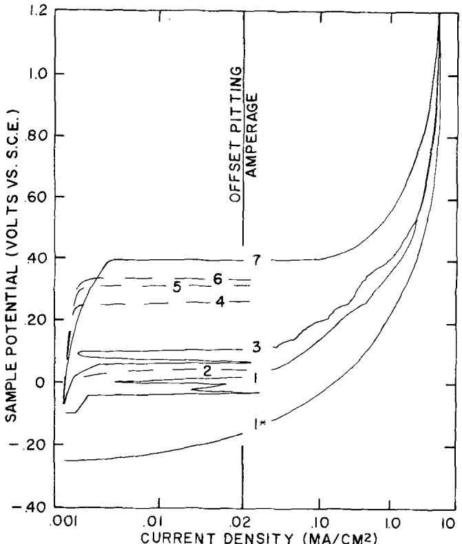
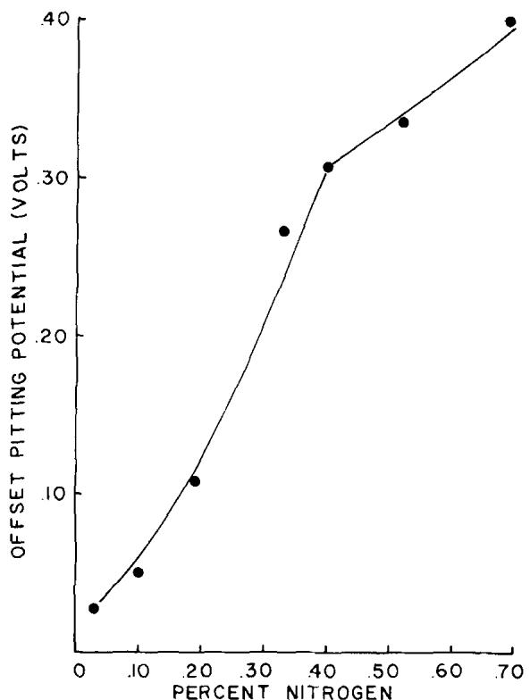
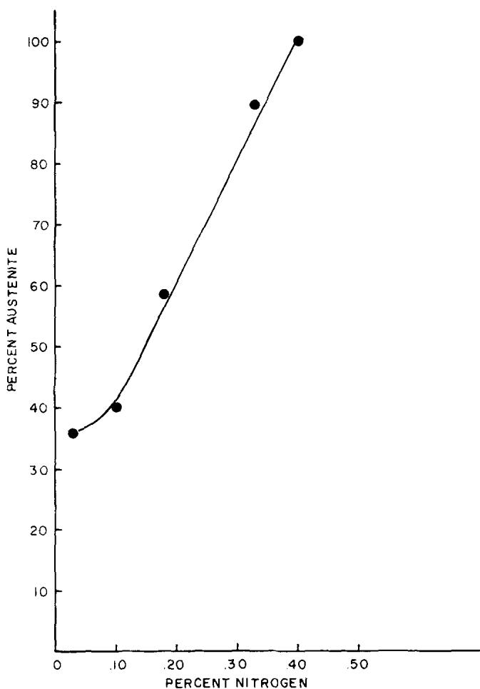
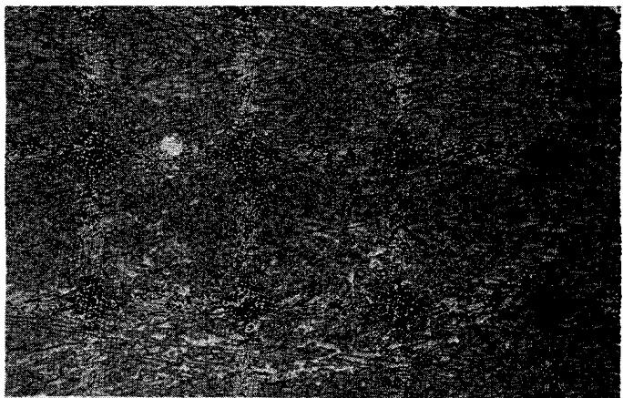
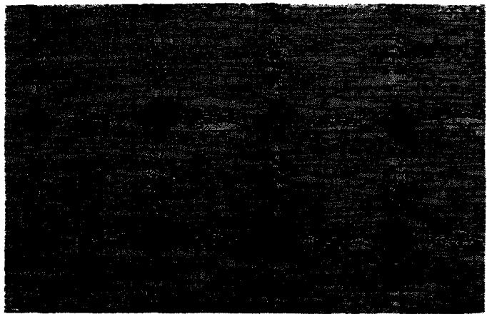
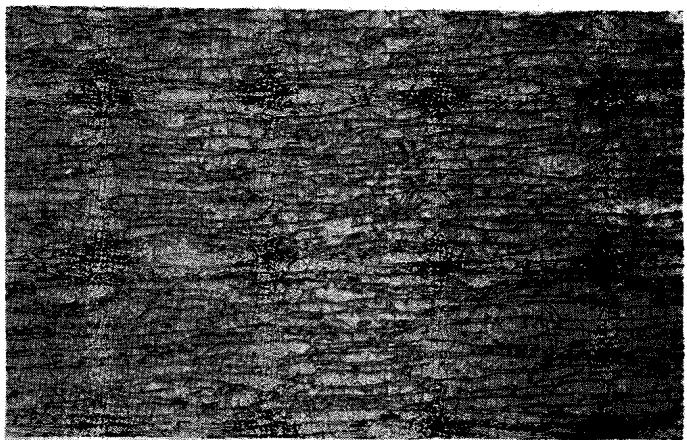
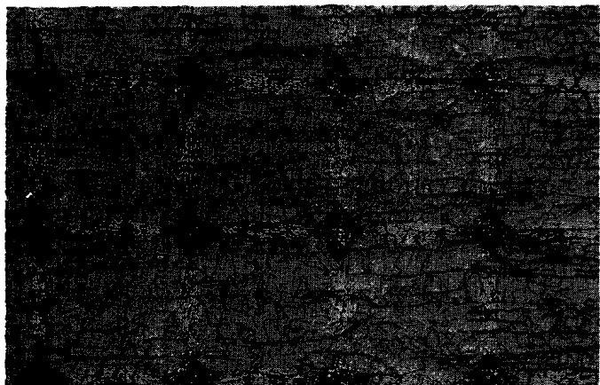
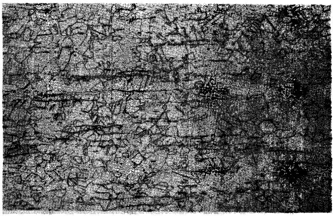
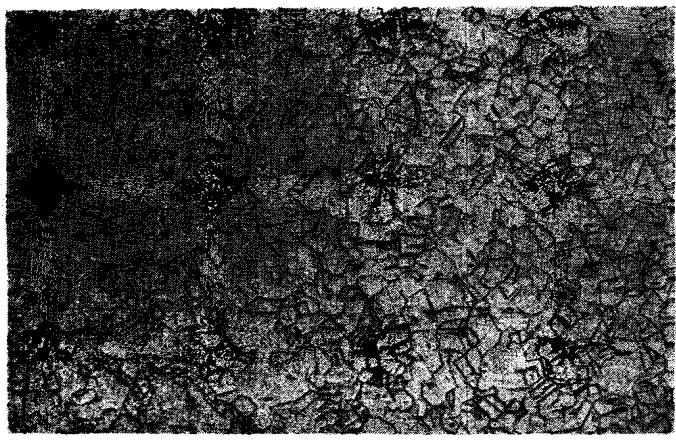
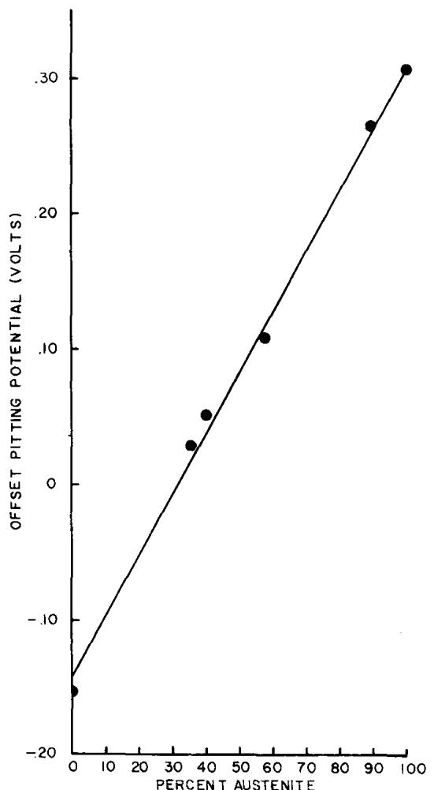

# The Effect of Nitrogen Additions Upon the Pitting Resistance of 18 Pct Cr, 18 Pct Mn Stainless Steel

A. G. HARTLINE, III

The effect of nitrogen additions upon the pitting resistance of 18 pct Cr, 18 pct Mn stainless steel has been investigated by potentiokinetic techniques in a 1000 ppm NaCl solution. Nitrogen additions increased the pitting resistance of the steel irrespective of structure, however, the ferritic steel was less pit resistant than the (duplex) steels containing both austenite and ferrite which, in turn, were less pit resistant than the totally austenitic steels. For steels having a duplex structure, the effect of nitrogen on the pitting resistance was observed to follow a linear function of the relative amount of austenite in these steels due to the area effects of the austenite and ferrite which are galvanically coupled in these steels. The addition of nitrogen was found to increase the amount of austenite at a rate of approximately 200 times the percent nitrogen addition from 36 pct austenite for the 0.02 pct N steel to 100 pct for the 0.40 pct nitrogen steel. The addition of nitrogen to the totally austenitic steels increased the pitting resistance at the rate of approximately 0.31 volts per pct nitrogen added, but no mechanism was found for the increased resistance.

NITROGEN bearing stainless steels have attracted recent interest because of the increasing cost of nickel, the expanded interest in CrMn steels, and the demands for higher strength austenitic stainless steels. Nitrogen additions were made in the Cr(Ni)Mn stainless steels to augment the austenitizing power of Mn. While the primary interest in the development of Cr(Ni)Mn stainless steel was for cost reduction, sufficient nitrogen solubility existed in these steels to take advantage of the strengthening effect of the nitrogen addition. The development of the Cr(Ni)Mn stainless steel culminated in a series of steels possessing similar corrosion resistance and equal or greater strength than the AISI 300 series stainless steels. While the general austenitizing and strengthening effects of N additions have been studied, the effects of N upon the degree of austenite stabilization and the pitting resistance of the Cr(Ni)Mn steels have not been extensively studied.

Early investigations¹-ª indicated that nitrogen additions had little or no effect upon the pitting resistance of stable austenitic stainless steels; however, these results were obtained from alloys having such low nitrogen solubilities that the effect of nitrogen additions might not have been discernible. However, studies⁴-⁸ of less stable alloys showed improvement in pitting resistance as the result of nitrogen additions. This increased pitting resistance was attributed to the elimination of ferrite (which is normally detrimental to the pitting resistance of austenitic stainless steels).

H. H. Uhlig⁴ examined the effect of crystal structure and nitrogen additions to the 18 Cr, 8 Ni (Type 304) stainless steel. While this grade is usually considered austenitic, Uhlig transformed the alloy to ferrite by lowering the carbon and nitrogen contents and then quenching from elevated temperatures where the ferritic phase was stable. Uhlig found that the change in crystal structure did not appreciably change the pitting resistance and, in fact, the ferritic structure displayed minimally better pitting resistance than the commercia. austenitic grade. Uhlig also added 0.24 pct nitrogen to Type 304. Tests in ferric chloride indicated that this addition increased the pitting resistance of Type 304 from 2 to 10 times when compared with the commercial austenitic grade or the ferritic samples.

M. A. Streicher® also investigated the effect of nitrogen and other alloy additions to Type 304 and found that increasing the molybdenum, nitrogen and/or silicon contents and reducing the carbon content increased the pitting resistance of this steel. This investigation concluded that the benefit of nitrogen additions to Type 304 was through the elimination of the ferrite produced by the addition of molybdenum or silicon from the microstructure. This conclusion follows from the work of Odar and Smith¹º where 18 Cr, 8 Ni alloys containing austenite and ferrite displayed inferior pitting resistance to the totally austenitic steel. Streicher found that increased pitting resistance resulted from the addition of nitrogen to the totally austenitic steels, but the benefit was relatively small unless accompanied with the addition of molybdenum and/or silicon.

While recent studies-1² have further indicated the benefit of nitrogen additions to the Cr(Ni)Mn family of stainless steels, the exact effect of nitrogen has been partially masked because of changes in alloy content, particularly additions of chromium and molybdenum. The conclusions are also clouded because these studies like those above appear partially contradictory. The lack of information on the effect of nitrogen upon the pitting resistance of the Cr(Ni)Mn stainless steels is of particular concern since they have both significantly greater solubility for nitrogen than the Cr-Ni stainless steels and the use of nitrogen is more prevalent in these alloy grades than for the Cr-Ni stainless steels.

The corrosion resistance data obtained by investigators such as Heger1ª or Nighawan et al¹⁴ have provided a comparison between the corrosion resistant Cr(Ni)Mn stainless steels and the Cr-Ni stainless steels. These studies have shown that the Cr(Ni)Mn steels with or without nitrogen have corrosion or pitting resistance equivalent to steels such as AISI 304 or 316. The above investigations were encumbered by large changes in the Cr, Mn, Mo, and Ni contents so that the effect of nitrogen upon the pitting resistance of Cr(Ni)Mn stainless steels was not discernible. The basic Cr-Mn steels were chosen for investigation to eliminate the effects of additional elements described above so that the independent effect of nitrogen upon pitting resistance could be examined. The objective of the work described below was to investigate the effect on nitrogen upon the pitting resistance of Cr-Mn stainless steels and to develop an understanding of the effect of nitrogen additions upon the relative amount of austenite in these steels.

This study was designed to determine the effects of nitrogen additions upon the pitting resistance and upon the relative amounts of austenite and ferrite in duplex, (austenite plus ferrite) and totally austenitic Cr-Mn stainless steels. For the purpose of this study, duplex steels are those having any mixture of both austenite and ferrite. The Cr-Mn steels were chosen for evaluation because of their high solubility for nitrogen and because the relative amounts of austenite and ferrite may be adjusted both through thermal treatment and by the addition of nitrogen.

The 18 Cr, 18 Mn composition was chosen for evaluation because the data of Koster¹⁵ indicated that the nitrogen-free composition was duplex when annealed at 1950°F (1070°C) and could be totally ferritized by annealing near 2300°F (1260°C). The data developed by Carney1⁶ indicated that the composition had a large solubility for nitrogen and could be totally austenitized through this addition. The composition, therefore, provided the two essential elements required for this study: high nitrogen solubility and diversity of crystal structure and phase balance.

Investigations¹7,18 have indicated that nitrogen additions provided a gradual improvement in pitting resistance and moreover the improvement was more readily observed in the more aggressive solutions than in solutions having a low chloride concentration. To mimimize data scatter encountered by immersion testing and to allow discrimination between relatively small nitrogen increments, the determination of pitting resistance was performed using potentiokinetic techniques that provided a variety of pitting environments which become more severe as the sample becomes more anodic. The determination of amount of austenite in the duplex alloys was performed by X-ray techniques to minimize error and the combination of these techniques provide an accurate analysis of the effects of nitrogen upon the pitting resistance and relative amount of austenite in 18 Cr, 18 Mn stainless steel.

## METHODS AND PROCEDURE

The 18 Cr, 18 Mn, N steels evaluated in this study were prepared from commercial grades of low carbon ferroalloys and electrolytic metals. The series of compositions listed in Table I were melted in a 20- pound (9.2 kg) air induction furnace. The C, Cr, and Mn were held to close tolerances, the Ni, Cu, and Mo were held to residual levels, and the nitrogen content was systematically increased using nitrided Mn. The nitrogen content was increased until ingot porosity was observed indicating that the alloy meIt was fully saturated with nitrogen. In this manner, the complete range of nitrogen contents amenable to the 18 pct Cr, 18 pct Mn composition was studied. While the carbon content systematically increased with increasing nitrogen as the result of the nitrided Mn addition, it was not felt that the range of 0.016 pct carbon would bias the data and was not considered in the interpretation of the data.

The mechanical processing of the ingots consisted of: grinding the ingots to remove surface imperfections, hot rolling the ingots at 2200°F (1205°C) to 0.150-in. (3.8 mm) thick sheet followed by an air anneal at 1950°F (1070°C) for 15 min. The annealed sheet was then pickled in 10 pct HNO,:2 pct HF at 150°F to remove the hot rolling and annealing scale, cold rolled 50 pct to 0.075- in. (1.9 mm) thickness, and then annealed at 1950°F (1070°C) for seven minutes in air, and pickled as above to remove the annealing scale. Microscopic examination of the annealed 0.075-in. (1.9 mm) strip indicated that nitrogen adsorption during the 1950°F (1070°C) final anneal had produced an austenitized zone approximately 0.001 in. (0.025 mm) thick at the surface which was removed by another pickling treatment until a reduction in thickness of 0.003 in. (0.075 mm) was obtained.A final heat treatment of 2300°F (1260°C) for 15 min. followed by a water quench was given to a sample of Alloy No. 1 to ferritize the duplex structure, after which the sample was again pickled to remove the scale and austenitized zone. Samples of the steels were subsequently sheared for evaluation by potentiokinetic and X-ray techniques.

Determination of the pitting resistance of the ferritic, duplex. and austenitic steels was obtained by a standard method in compliance with the ASTM recommended practice. Samples for potentiokinetic evaluation were obtained from the processed strip described above. Prior to testing, the samples were degreased in a hot (120°F (50°C)) concentrated solution of Alconox cleaner and thoroughly rinsed in water and alcohol.

Potentiokinetic evaluation of the alloys was conducted in a cell which has been described by M. J. Johnson¹9 which is similar to the Stern-Makrides² sample holder specified in the ASTM recommended practice. The cell is a high glass cylinder having aflat ground side through which a hole nas been blown to produce tapered sides

Table 1. Composition of 18 pct Cr, 18 pct Mn Steels Evaluated
<table><tr><td>Steel</td><td>C</td><td>Mn</td><td>P</td><td>S</td><td>Si</td><td>Cr</td><td>Ni</td><td>Cu</td><td>N</td></tr><tr><td>1</td><td>0.022</td><td>18.25</td><td>0.012</td><td>0.011</td><td>0.34</td><td>17.95</td><td>0.07</td><td>0.20</td><td>0.03</td></tr><tr><td>2</td><td>0.026</td><td>18.20</td><td>0.006</td><td>0.014</td><td>0.32</td><td>17.88</td><td>0.07</td><td>0.22</td><td>0.10</td></tr><tr><td>3</td><td>0.027</td><td>18.14</td><td>0.006</td><td>0.017</td><td>0.38</td><td>17.88</td><td>0.07</td><td>0.23</td><td>0.18</td></tr><tr><td>4</td><td>0.030</td><td>18.20</td><td>0.009</td><td>0.010</td><td>0.37</td><td>17.88</td><td>0.08</td><td>0.22</td><td>0.33</td></tr><tr><td>5</td><td>0.032</td><td>18.00</td><td>0.011</td><td>0.009</td><td>0.37</td><td>18.10</td><td>0.08</td><td>0.22</td><td>0.40</td></tr><tr><td>6</td><td>0.038</td><td>17.80</td><td>0.009</td><td>0.012</td><td>0.29</td><td>17.83</td><td>0.08</td><td>0.22</td><td>0.52</td></tr><tr><td>7*</td><td>0.037</td><td>18.25</td><td>0.008</td><td>0.013</td><td>0.40</td><td>18.25</td><td>0.07</td><td>0.24</td><td>0.69</td></tr></table>

\*Ingot porosity observed.

minimizing the entrapment of corrosion products. The sample was attached to the cell by clamping to a flat Teflon gasket with a 1/16 in. (1.6 mm) raised ring seal around a 1 cm² hole in the cell. The platinum counter electrode, KCl saIt bridge and saturated Calomel electrode were of standard design with the capillary of the salt bridge located approximately 2 mm from the sample surface. Electrical connection to the sample was made externally to the cell. A Wenking potentiostat used in conjunction with an X-Y recorder provided a graphic display of the anodic polarization data. The voltage increase was obtained using a motor drive to produce a 0.7 volt per hour scanning rate

After the sample was secured to the cell, internal electrical connection was established by adding 150 to 200 ml of a solution of1000 ppm Cl" as NaCI. . To avoid pH effects, the pH was standardizedat 5.0 through the addition of acetic acid. After the external electrical connection was established, the sample was permitted to remain in contact with the solution for 30 min. at - 0.3 to - 0.1 volts to passivate or reach equilibrium. The sample was then made more anodic at the rate of 0.7 volts per hour until pitting occurred, as indicated by a large increase in current. The total voltage range scanned was approximately -0.3 to 1.0 volts. From these data the pitting potential was obtained.

The pitting potential was experimentally defined as that voltage where the anodic polarization data exceeded 0.02 mA without repassivation, i.e., decreases of current below 0.02 mA. While the pitting potential is generally defined as that voltage where a current surge is observed, the above method, which may be called an offset pitting potential, was employed to simplify the

  
Fig. 1-Anodic polarization data for 18 pct Cr, 18 pct Mn stainless steels of increasing nitrogen content. Offset pitting potential has been determined by the intersection of the anodic polarization data with the offset pitting amperage. 1\* indicates data for Alloy 1 after thermal ferritization.

  
Fig. 2—The effect of nitrogen additions upon the offset pitting potential of 18 pct Cr, 18 pct Mn stainless steels.

  
Fig. 3—The effect of nitrogen additions upon the relative amount of austenite observed in 18 pct Cr, 18 pct Mn stainless steels.

  
Alloy 1  
0.038% N

  
Alloy 2  
0.10% N

  
Alloy 3  
0.18% N

  
Alloy 4  
0.33% N

  
Alloy 5  
0.40% N

  
A1loy 6  
0.52% N  
Fig. 4-Microstructures of 18 pct Cr-18 pct Mn stainless steels of varying nitrogen contents. The addition of 0.40 pct nitrogen produced a nearly austenitic structure. Magnification 740 times.

determination of the pitting potential. The offset method permits the determination of a potential where both crevice pitting at the metal Teflon interface and general pitting have begun. For instance, where the anodic polarization data exceeded 0.02 mA and then repassi-

vated as shown in Fig. 1 for Alloys 1 and 3, it was felt that the passive film had reformed and the higher pitting potential was recorded. The offset method also simplified the potential determination for Alloys 1 (ferritized) and 7 shown in Fig. 1, where the onset of pitting might be assigned to a number of potentials. Reproducibility of the anodic polarization data was determined by a single replication. The offset pitting potential agreed to within 0.04 volts for the compositions examined.

  
Fig. 5—The effect of the austenite content on the offset pitting potential of 18 pct Cr, 18 pct Mn stainless steel.

The determination of the relative amounts of austenite and ferrite was made by metallographic examination for the totally austenitic or ferritic steels and the duplex alloys were examined by X-ray techniques on samples of final annealed and pickled strip that were prepared for examination by electropolishing to a depth of 0.003 to 0.005 in. (0.075 to 0.125 mm) to eliminate any surface effects. The samples were mounted on a diffractometer and the peak intensities of the austenite and ferrite (222) and (220) peaks were measured using CrKα radiation and the degree of texture was measured for each phase using MoKα radiation. The peak intensities were subsequently corrected to random orientation and the ratio of peak intensities determined the phase balance of the steel using standard sample comparisons.

## RESULTS

The effects of nitrogen additions upon the (offset) pitting potential of the 18 pct Cr, 18 pct Mn stainless steel are shown in Fig. 2. The addition of nitrogen was found to increase the pitting potential or provide greater pitting resistance. These data indicated that the pitting potential increased rapidly for nitrogen additions up to

0.40 pct after which the effect of nitrogen was diminished. The effect of nitrogen additions upon the relative amount of austenite is shown in Fig. 3. The addition of nitrogen was found to increase the amount of austenite by a factor of 200 times the percent nitrogen added with the exception of small nitrogen additions which were accommodated without markedly altering the amount of austenite in the nitrogen-free alloy. The addition of 0.40 pct nitrogen was found to nearly austenitize the steel as observed by metallographic examination, Fig. 4. It was found that effect of nitrogen additions upon the pitting resistance could be divided into two regions: 1) The elimination of ferrite in the structure of the duplex steels and 2) The addition of nitrogen to the totally austenitic steels. The effect of nitrogen additions in the first region is shown in Fig. 5. These data displayed that the pitting resistance increased linearly with the amount of austenite in the duplex structure. The effect of nitrogen additions in the second region has been shown in Fig. 2 for nitrogen contents in excess of 0.40 pct. These data displayed that the pitting resistance of austenitic 18 Cr, 18 Mn stainless steel was increased by the addition of nitrogen. This improved pitting resistance was displayed between 0.40 pct N where the steel became austenitic and 0.69 pct N where the steel was saturated with nitrogen resulting in ingot porosity.

## DISCUSSION

It is clear from the results described above that the addition of nitrogen increases the pitting resistance of 18 Cr, 18 Mn steel. The addition of nitrogen to duplex steels eliminated ferrite (which decreased the pitting resistance) and was in agreement with the results obtained by Streicher° and by Odar and Smith.1º This study also has shown that the addition of nitrogen increases the pitting resistance of totally austenitic steels. While this was in agreement with the studies of both Uhlig⁴ and Streicher,º the effect of nitrogen observed in this work was more pronounced than that observed by Streicher® in that no molybdenum or silicon addition was required in addition to the nitrogen for increased pitting resistance. Finally, the totally ferritic steel was found to be inferior to the nitrogen austenitized steel. While this effect of structure is not in agreement with that observed by Uhlig for the 18 Cr, 8 Ni steel, the addition of 0.40 pct nitrogen in the austenitic 18 Cr. 18 Mn steel imparts additional corrosion resistance to this steel such that comparison with the ferritic 18 Cr, 18 Mn steel without nitrogen cannot be made directly.

The relation between the pitting potential and amount of austenite in steels bears further explanation. Since the austenite and ferrite are galvanically coupled, the potential of the couple lies between the potential of the austenite and the ferrite as described by Fontana and Greene²¹ for galvanic couples of dissimilar metals. Fontana and Greene describe the effect of altering the areas of the metals galvanically coupled and conclude that as the area of the more noble metal is increased the corrosion potential increases. The addition of nitrogen to the duplex steels increases the amount and the area of the austenite, the more noble phase in these alloys. Therefore, the pitting potential of duplex alloys has increased by the mechanism described above and

has been described in terms of the amount of austenite in the sample.

The addition of nitrogen to totally austenitic 18 Cr, 18 Mn steels produced an increased pitting resistance which resulted in approximately a 0.31 volt per percent nitrogen added. While this effect has been observed, no mechanism has been uncovered for the increased pitting resistance.

## SUMMARY AND CONCLUSIONS

The effects of nitrogen upon the pitting resistance of 18 Cr, 18 Mn stainless steel have been determined by potentiokinetic techniques. The pitting resistance of the thermally ferritized steel was inferior to the duplex steels which were inferior to the austenitic steels. The addition of nitrogen increased the pitting resistance of the duplex steels and was a linear function of the amount of austenite in these steels. This increased pitting potential was related to the effects of nitrogen in the austenite and relative areas of the austenite and ferrite which were galvanically coupled. The addition of nitrogen to the totally austenitic steels increased their pitting resistance but no mechanism was found for the increase. The addition of nitrogen was found to increase the relative amount of austenite by a factor of 200 times the percent nitrogen added.

1. Nitrogen in Chromium Alloy Steels, p. 17, Electro Metallurgical Company of Union Carbide, 1941.

2. H. Spahn, H. Spekchardt, and W. Wessling: Chem. Ing. Tech., 1966, vol. 38, pp. 407-17.

3. T. G. Gooch: Metal Constr., 1969, vol. 1, no. 12, Pp. 569-74.

4. H. H. Uhlig: Trans. ASM, 1942, vol. 30, pp. 947-80.

5. O. Steensland: J. Iron Steel, 1969, vol. 42, no. 2, pp. 104-08.

6. W, Tofaunte and A. Schottky: Arch. Eisenhüttenw., 1942, vol. 15, p. 515.

7. Y. S. Medvedev and T. D. Tomilina: Zashch, Metal., 1969, vol. 5, no. 4, pp. 394-99.

8. H. Bennek: Arch. Eisenhüttenw., 1942, vol. 15, p. 515.

9. M. A. Streicher: J. Electrochem, Soc., 1956, vol. 103, no. 7, pp. 375-90.

10. S. P. Odar and H. A. Smith: Trans. AIME, 1939, vol. 135, pp. 526-28.

11. G. V. Kortvshenko, V. I. Grigorkin, and A. V. Zaslavskii: Izv. Vyssh. Ucheb. Zaved. Chern. Met., 1969, vol. 12, no.8, pp. 124-26.

12. A. Condylis, F. Bayon, and A. Desestret: Rev. Met., 1970, vol. 5, pp. 399-412.

13. J.J. Heger: Mechanical Properties and Corrosion Resistance of a High-Strength Chromium-Manganese-Nitrogen-Stainless Steel, ASTM, STP 369, 1965, pp. 54-61.

14. B. B. Nighawan, P. K. Gupte, S. S. Bhatnagar, B. K. Guha, and S. S. Dhanjal: J. Iron Steel Inst., 1967, vol. 205, pp. 292-304.

15. W. Koster: Arch. Eisenhüttenw., 1934, vol. 7, pp. 687-88.

16. D. J, Carney: U.S. Patent No. 2,778,731.

17. H. Bennek: Arch, Eisenhüttenw., 1942, vol. 15, p. 515.

18. K. Bungandt: Stahl Eisen, 1950, vol, 70, pp. 582-96.

19. M. J. Johnson: Relative Critical Potentials for Pitting Corrosion of Some Stainless Steels, ASTM, STP-516, 1972, pp. 262-72.

21. M. Fontana and N. Greene: Corrosion Engineering, pp. 330-35, McGraw-Hill Co., 1967.

20. M. Stern and A. C. Makrides: J. Electrochem, Soc., 1960, vol. 107, p. 782.