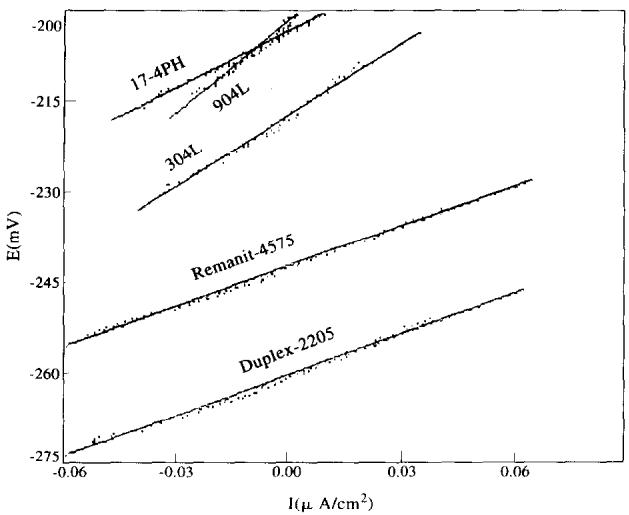
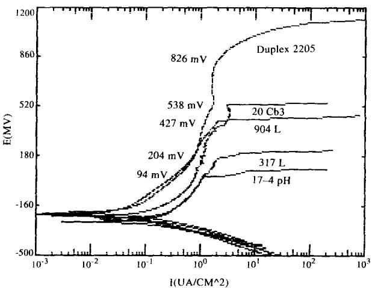
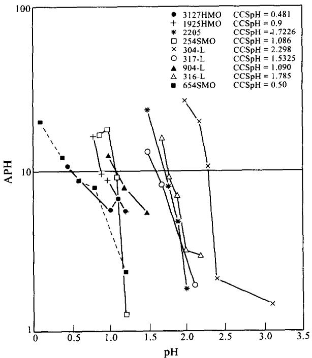
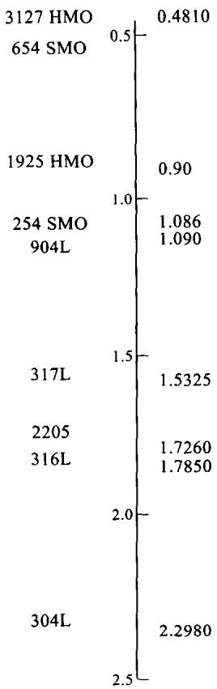
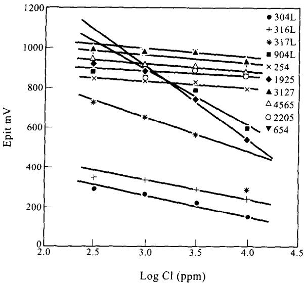
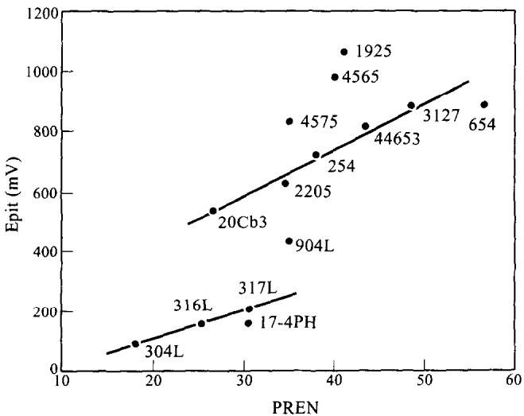
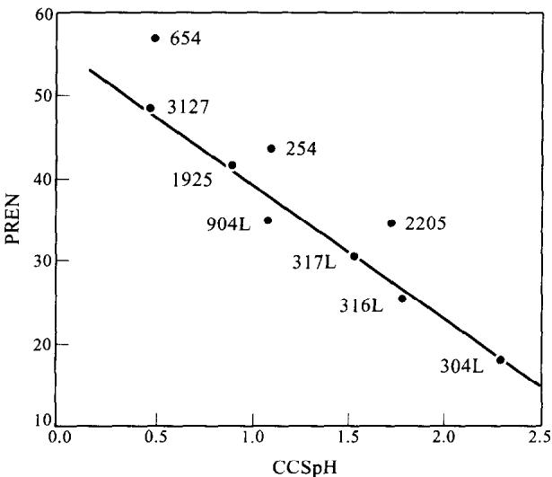

# THE EFFECT OF DOMINANT ALLOY ADDITIONS ON THE CORROSION BEHAVIOR OF SOME CONVENTIONAL AND HIGH ALLOY STAINLESS STEELS IN SEAWATER

A.U. MALIK, N.A. SIDDIQI, S. AHMAD and I.N. ANDIJANI

Saline Water Conversion Corporation, Research and Development Center, P.O. Box 8034, Al-Jubail 31951, Saudi Arabia

Abstract—The corrosion behavior of some conventional and high alloy austenitic, ferritic and duplex stainless steels has been studied at 50°C in Gulf seawater. The alloys were tested under salt spray conditions and corrosion rates were determined by applying the electrochemical polarization resistance technique. The pitting behavior was studied using the potentiodynamic polarization technique. Both exposure and accelerated tests were employed to study crevice corrosion. The effect of surface finish on crevice attack was investigated in detail. Critical crevice solution pH (CCSpH), an important crevice corrosion parameter, was determined by a method based on the Oldfield and Sutton mathematical modelling of corrosion in chloride media [J.W. Oldfield and W.H. Sutton, Br. Corros. J. 13, 13 (1978)]. The relationship between pitting potential $E _ { \mathrm { p i t } }$ and pitting resistance equivalent $P R E _ { \mathrm { N } }$ is discussed. The results of the study indicate that the presence of alloying elements such as Cr, Mo and N has a significant and beneficial influence on the pitting and crevice corrosion resistance of stainless steels.

## INTRODUCTION

Under conditions of ambient temperature — no deposit formation and not-too-low seawater velocities $( \geq 1 ~ \mathbf { m } / \mathbf { s } )$ austenitic stainless steels have been formidable construction materials for marine and offshore structures due to their excellent corrosion resistance, high strength, easy fabrication and moderate cost. After carbon steels, austenitic stainless steels AISI 304 and AISI 316 are perhaps the most extensively used structural materials for marine installations including desalination plants. AISI 316L is a preferred material for marine applications due to its outstanding resistance to localized corrosion, however, the greatest shortcoming with these types of stainless steel is their vulnerability to pitting and/or crevice corrosion in the presence of chloride under static or stagnation conditions.1-11 The breakdown of the passive film on steel occurs in the presence of chloride ions which subsequently results in the initiation of pits. Pitting proceeds by an autocatalytic process in which there is a local increase in chloride and acid concentrations due to corrosion product hydrolysis in cavities.6 The pitting behavior of austenitic steels has been the subject of numerous studies due to its importance in seawater processing plants (desalination plants), marine installations and chemical plants.3,12–15 Crevice corrosion is the direct result of the stagnant solution accumulated within crevices or holes on metal surfaces. Crevice corrosion has been quite frequently encountered in marine structures, pipelines, pumps and shafts, valves, and at any location where there is possibility of water stagnation or deposit formation.15–19 Crevice corrosion attack involves several mechanistic steps such as the production of metal ions in the stagnant solution, hydrolysis and formation of critical crevice solution.2º The critical solution is an important parameter for determining the crevice corrosion tendencies of a material in a particular environment.21-24 Slow or long duration tests using multi-crevice washers or accelerated tests based on electrochemical technique have been used for studying crevice corrosion behavior.9,27 Crevice corrosion studies have been carried out emphasizing different aspects including alloy composition, effect of alloying element, effect of surface finish, temperature or influence of environment.24-26,28

In chloride containing environments where stainless steels are prone to localized corrosion under certain conditions, costly nickel-base alloys such as Hastelloy, Incolloy and Inconels were used as substitutes up to the late 1960s. Since the early 1970s it was realized that the addition of larger amounts of chromium or molybdenum $( > 6 \% )$ to steels brings about the same effect as that exhibited by nickel alloys.29.30 A new family of stainless steels emerged in the late 1970s and 1980s with superior corrosion resistance characteristics.31 These alloys—ferritic, martensitic and austenitic——have found applications in marine environments where conventional steels are prone to localized corrosion. The effectiveness of molybdenum and nitrogen, as more powerful alloying elements than chromium, in resisting pitting was shown by Lorenz and Medawar.32 The relative effectiveness of chromium, molybdenum and nitrogen on pitting or crevice corrosion can be assessed qualitatively by pitting resistance equivalent, $P R E _ { \mathrm { N } } ,$ which is represented by the empirical equation:33

$$
P R E _ { \mathrm { N } } = \% \mathrm { C r } + 3 . 3 \times \% \mathrm { M o } + 1 6 \times \% \mathrm { N } .
$$

A high nitrogen multiple of 30 has been used for selected alloys instead of $1 6 . ^ { 3 4 } \mathrm { ~ A ~ }$ $P R E _ { \mathrm { N } }$ above 38 is supposed to provide good resistance to marine corrosion.35

Hack³º studied the crevice corrosion behavior of austênitic and ferritic stainless steels in seawater at $3 0 \mathrm { { ^ \circ C } }$ and showed that some high alloy steels are not only more resistant than AISI 316 but also exhibit resistance equivalent to more costly Ni-base alloys. Austenitic stainless steel required 8% Mo to prevent crevice corrosion whereas ferritic steels required 25% Cr and about 3.5% Mo. Using an accelerated technique, Oldfield³⁶ studied the influence of alloying element additions on the crevice corrosion behavior of a number of commercial steels in a marine environment. Amongst the commercial steels, 254SMO provided the best resistance. Corrosion resistance increases if the Mn level is less than 0.5% or there is a decrease in the S level. $\mathrm { O l d f i e l d } ^ { 9 }$ reported the effect of temperature and surface roughness on the seawater crevice corrosion resistance of commercial and model stainless steels including 316 and 20Cr-6Mo types containing two ranges of nickel: 10–30% and 20-40%. The following conclusions were drawn from the study regarding resistance to crevice corrosion initiation: (i) better resistance with rough surfaces in comparison to ground or polished surfaces; (ii) resistance increases as the temperature decreases from 70 to $5 0 ^ { \circ } \mathrm { C } ;$ and (iii) little influence of variation in nickel contents. For resistance to corrosion propagation: (i) Ni has been found extremely beneficial in improving the resistance of 316 type steels; and (ii) Ni above 20% did not have any significant effect.

In the present work, the influence of dominant alloy additions such as Ni, Cr and Mo on the pitting and crevice corrosion behavior of some conventional and high alloy austenitic, ferritic and duplex steels in Gulf seawater has been investigated. The object of this study is to review the role of alloying additions in improving the local corrosion resistance of conventional and high alloy stainless steels.

# EXPERIMENTAL METHOD

## Materials

Conventional stainless steels (410, 304L, 316L, 317L, 904L, 17-4PH) and high alloy stainless steels (254 SMO, 654 SMO, 1925 hMo, 3127 hMo, 20 Cb3, Remanit 4565, Remanit 4575, Monit 44635 and Duplex 2205) wcre obtained commercially in shect and/or rod forms. The flat, circular-flat or cylindrical specimens were used during the experiments without any further heat treatment. The chemical composition of the alloys is given in Table 1.

Gulf seawater was collected in bulk amounts from the intake point of Al-Jubail desalination plant and stored in large polyethylene containers. The chemical composition of the seawater and its important characteristics are given in Table 2.

Chloride-containing aqueous solutions of varying concentration (300, 500, 1000 and 5000 ppm) were prepared by dissolving analytical grade NaCl in distilled water and adjusting the pH to 7.8 by the addition of NaOH.

## Techniques and procedures

Salt spray tests were carried out in a salt spray fog chamber following ASTM B117-73. The coupons were exposed to salt spray for time periods varying from 3000 to 5000 h.

For electrochemical polarization experiments, circular-flat or cylindrical test specimens were used. The exposed area of the test specimens which was screwed in to the sample holder was 1 cm². The details of experimental set-ups for potentiodynamic polarization and polarization resistance were the same as in a previous publication.37

Table 1. Composition of stainless steels
<table><tr><td>UNS No.</td><td>Alloys</td><td>Product</td><td>Fe</td><td>Cr</td><td>Mo</td><td>Ni</td><td>C</td><td>Cu</td><td>Mn</td><td>Others</td></tr><tr><td>S30403</td><td>304L</td><td></td><td>Balance</td><td>18</td><td></td><td>10</td><td>0.03</td><td>0.2</td><td>1</td><td>0.045P, 0.02S, 1.OSi</td></tr><tr><td>S31603</td><td>316L</td><td></td><td>Balance</td><td>16</td><td>3</td><td>11</td><td>0.02</td><td>0.2</td><td>1</td><td>0.045P, 0.02S, 1.OSi</td></tr><tr><td>S31703</td><td>317L</td><td></td><td>Balance</td><td>18</td><td>3</td><td>13</td><td>0.02</td><td>0.2</td><td>2</td><td>0.045P, 0.02S,</td></tr><tr><td>N08904</td><td>904L</td><td>AVESTA</td><td>Balance</td><td>20</td><td>5</td><td>24.5</td><td>0.02</td><td>1</td><td>1.5</td><td>1.OSi 0.045P, 0.02S</td></tr><tr><td>S31254</td><td>SMO 254</td><td>AVESTA</td><td>Balance</td><td>20</td><td>6</td><td>18</td><td>0.02</td><td>0.7</td><td>一</td><td>0.2N, 0.002Si</td></tr><tr><td>S32654</td><td>SMO 654</td><td>AVESTA</td><td>Balance</td><td>25</td><td>7</td><td>22</td><td>0.015</td><td>0.4</td><td>0.5</td><td>0.5N</td></tr><tr><td>N08925</td><td>hMo 1925</td><td>VDM</td><td>Balance</td><td>21</td><td>6</td><td>25</td><td>0.01</td><td>0.9</td><td>0.9</td><td>0.2N, 0.002Si</td></tr><tr><td>N0828</td><td>hMo 3127</td><td>VDM</td><td>Balance</td><td>27</td><td>6.5</td><td>32</td><td>0.02</td><td>1</td><td>2</td><td>0.003S, Nb, Pb</td></tr><tr><td></td><td>Remanit 4565</td><td>THYSSEN</td><td>Balance</td><td>22-25</td><td>46</td><td>16-18</td><td>0.02</td><td>0.1</td><td>5</td><td>0.5N, 0.003Si, 0.1Nb</td></tr><tr><td>S44635</td><td>Monit 44635</td><td>AVESTA</td><td>Balance</td><td>25</td><td>4</td><td>4</td><td>0.025</td><td>0.2</td><td>0.4</td><td>0.035N, Ti, Nb, Pb, Si</td></tr><tr><td></td><td>Remanit 4575</td><td>THYSSEN</td><td>Balance</td><td>27-29</td><td>2-3</td><td>3-4.5</td><td>0.01</td><td></td><td>0.1</td><td>0.025N, Ti, Pb, Si, Nb</td></tr><tr><td>S31803</td><td>Duplex 2205</td><td>AVESTA</td><td>Balance</td><td>22</td><td>3</td><td>6</td><td>0.02</td><td>0.2</td><td>1.5</td><td>0.15,0.6 (Cb + Ta)</td></tr><tr><td>S41000</td><td>410</td><td></td><td>Balance</td><td>13</td><td></td><td></td><td></td><td></td><td>1</td><td>0.04P, 0.035S, 1Si</td></tr><tr><td>S17400</td><td>17-4PH</td><td>ARMCO</td><td>Balance</td><td>16</td><td></td><td>4.5</td><td>0.07</td><td>4</td><td>1</td><td>0.3Cb, 0.04P, 1Si</td></tr><tr><td>N08020</td><td>20Cb3</td><td>CARPENTER</td><td>Balance</td><td>19</td><td>2</td><td>33</td><td>0.02</td><td>3</td><td>0.4</td><td>0.4Si, 5Cb + Ta</td></tr></table>

Table 2. Gulf seawater composition, pH 8.2
<table><tr><td>Ions</td><td>Concentration, mg 1–1</td></tr><tr><td>Calcium  $\mathrm { C a } ^ { + \ ^ { + } }$ </td><td>508</td></tr><tr><td>Magnesium  $\mathbf { M } \mathbf { g } ^ { + } \mathbf { \Sigma } ^ { + }$ </td><td>1618</td></tr><tr><td>Sodium  $\mathbf { N a } ^ { \dagger }$ </td><td>13440</td></tr><tr><td>Potassium  $\textbf { K } ^ { \prime }$ </td><td>483</td></tr><tr><td>Strontium</td><td> ${ \bf { S } } { \bf { r } } ^ { + \mathrm { ~  ~ } }$  17</td></tr><tr><td>Bicarbonate</td><td> $\mathbf { H } { \mathbf { C } } { \mathbf { O } } _ { 3 } ^ { - }$  176</td></tr><tr><td>Chloride  $\mathbf { { C l } ^ { - } }$ </td><td>24090</td></tr><tr><td>Sulphate  $\mathrm { S O } _ { 4 } ^ { - }$ </td><td>3384</td></tr><tr><td>Bromide  $\mathbf { B r } ^ { - }$ </td><td>83</td></tr><tr><td>Fluoride F⁻</td><td>1</td></tr><tr><td>Total dissolved solids TDS</td><td>43800</td></tr></table>

Crevice corrosion exposure tests

Exposure tests were carried out using conventional stainless steels in natural seawater at room temperature and at $5 0 ^ { \circ } \mathrm { C } .$ Three surface conditions were selected: wheel ground; 180 grit SiC ground; and asreceived. The alloys were cut to approximately $1 0 0 ~ \times ~ 7 0 ~$ mm with a 12 mm hole being drilled through the center.

The crevice corrosion test assembly consisted of stainless steel nut, bolt and washers and two Teflon crevice formers with 6 mm annuli. The nuts and bolts were covered by Belzona elastomer. In all the tests carried out in this work, the assembly was torqued to 9.49 Nm (7 ft lb).

## Accelerated tests

To complement the exposure testing, accelerated testing for resistance to crevice corrosion initiation was carried out. The specimens were taken in the rod or sheet form. A wire was soldered to one end for electrical connection and the whole unit was mounted in epoxy resin to provide a crevice free mount. The exposed end was ground to 600 grit SiC finish and rinsed with distilled water.

All the experiments were carried out in a corrosion cell containing a saturated calomel electrode (SCE) with potassium chloride salt bridge as reference and graphite as counter electrodes (EG and G Model K 0047)

De-aeration of the solution was achieved by bubbling high purity nitrogen through a filter stick. The test cell was heated on a mantle with the test solution maintained at $5 0 ^ { \circ } \mathrm { C }$ The test solutions were made up with natural seawater with sodium chloride additions that varied according to the working $\mathrm { p H }$ value (Table 3). The pH adjustments were made immediately before each experiment using hydrochloric acid.

After polishing, the specimens were left for 30 min in the air and then were passivated by immersion for 15 min in 17% $\mathrm { H N O } _ { 3 }$ before each experiment

The value of critical corrosion solution (CCS) is determined through a series of potentiodynamic polarization experiments in which the simulated crevice solution is continuously de-aerated and is of increasing aggressiveness (Table 3).

Table 3. Simulated crevice solutions used in CCS determinations
<table><tr><td>Chloride concentration</td><td>pH range</td></tr><tr><td> $\mathrm { S e a w a t e r } + 1 . 5 { \bf M } \mathrm { N a C l }$ </td><td> $2 . 4 - 2 . 1$ </td></tr><tr><td> $\mathtt { S e a w a t e r } + 2 . 5 \mathbf { M } \ N \mathbf { a } \mathbf { C } \mathrm { i }$ </td><td> $2 . 1 - 1 . 7$ </td></tr><tr><td> $\mathrm { S e a w a t e r } \ + \ 3 . 5 \mathbf { M } \ \mathrm { N a C l }$ </td><td> $1 . 7 \dots 1 . 3$ </td></tr><tr><td> $\mathrm { S e a w a t e r } + 4 . 5 { \bf M } \mathrm { N a C l }$ </td><td> $1 . 3 \sim 1 . 0$ </td></tr><tr><td> $\mathrm { S e a w a t e r } + 5 . 5 { \bf M } \mathrm { N a C l }$ </td><td> $< 1 . 0$ </td></tr></table>

The electrodes were exposed to the electrolyte and polarized at —600 mV. The potential was then changed at a rate of $1 0 \mathrm { m V s ^ { - 1 } }$ until a potential of + 100 mV (SCE) was obtained. The anodic peak height in current density units is recorded for a given chloride concentration and pH. The critical solution is taken to be that which first produces an anodic current peak of 10 $\mathsf { \Pi } ^ { \prime } \mu \mathbf { A } \mathsf { c m } ^ { - 2 } ( 1 0 \mu \mathbf { \bar { A } } \mathsf { c m } ^ { - 2 }$ is considered to be equal to a corrosion penetration rate of ${ \sim } 0 . 0 9 \mathrm { m m } \mathbf { y } ^ { - \bar { 1 } } )$ 38

## EXPERIMENTAL RESULTS

Salt spray tests

The alloy specimens were taken out from the salt spray chamber after exposure for 3024 and 4824 h, respectively, and were weighed subsequently. Weight changes in the range of $1 0 - 5 0 \mu \mathrm { g } \mathrm { c m } ^ { - 2 }$ were noted indicating very nominal changes during salt spray exposures. None of the specimens showed any sign of scaling or corrosion product deposition. The corrosion rate values computed from weight losses have the range of 0.001 – 0.005 mpy. The results of salt spray tests are summarized in Table 4.

## Polarization resistance measurements

Polarization resistance measurements were carried out using alloy coupons immersed in natural seawater or in aqueous solutions containing different concentrations of chloride at $5 0 ^ { \circ } \mathbf { C } .$ Some typical polarization resistance plots are shown in Fig. 1. Table 5 lists the corrosion rate values computed from the linear polarization resistance plots. These values are based on the cathodic and anodic Tafel values which were obtained from previously carried out Tafel plot runs. The polarization resistance data provide the following information regarding the behavior of the alloys in Cl−-containing solutions or seawater: (1) the variations in corrosion rates of an alloy with change in chloride concentration usually do not follow a regular pattern; (2) as expected, the corrosion rates of high alloyed stainless steels are usually lower than the conventional austenitic steels — the corrosion rates vary from 0.02 to 0.12 mpy depending upon the alloy system; (3) the corrosion rate of an alloy in seawater is not necessarily higher than that in aqueous solutions containing chloride of much lower concentrations; and (4) among the different types of steel studied, the corrosion rates in seawater at $5 0 \mathrm { { ^ \circ C } }$ follow the sequence:

Table 4. Corrosion rate values for highly alloyed stainless steel coupons exposed to salt spray fog chamber
<table><tr><td>Alloy Corrosion rate 3024 h</td></tr><tr><td>316L 2.91 4.445</td></tr><tr><td>904L 2.05 2.43</td></tr><tr><td>SMO 254 1.36 1.86</td></tr><tr><td>hMo 1925 3.52 2.28</td></tr><tr><td>hMo 3127 3.52</td></tr><tr><td>20 Cb3 3.90 2.63</td></tr><tr><td>Remanit 4565 5.28 4.48</td></tr><tr><td>Monit 44635 2.09 1.93</td></tr><tr><td>Remanit 4575 4.12 1.09</td></tr><tr><td>Duplex steel 2205 0.20 2.17</td></tr></table>

  
Fig. 1. Typical polarization resistance curves for different types of stainless steels in seawater at $5 0 ^ { \circ } \mathbf { C } .$

$$
\begin{array} { r l } & { 3 1 2 7 \mathrm { h } \mathbf { M } \mathrm { o } < 9 0 4 \mathrm { L } < 2 5 4 \mathrm { S } \mathbf { M } \mathrm { O } < \mathrm { R e m a n i t } 4 5 6 5 < \mathrm { R e m a n i t } 4 5 7 5 < 1 9 2 5 \mathrm { h } \mathbf { M } \mathrm { o } } \\ & { < \mathrm { D u p l e x } 2 2 0 5 < \mathrm { M o n i t } 4 4 6 3 5 < 1 7 - 4 \mathrm { P H } < 3 1 6 \mathrm { L } < 3 1 7 \mathrm { L } } \\ & { < 2 0 \mathrm { C b } 3 < 6 5 4 \mathrm { S } \mathbf { M } \mathrm { O } < 4 1 0 . } \end{array}
$$

In 1000 ppm Cl−-containing aqueous solutions, the following sequence is noted:

$$
\begin{array} { r l } & { 3 1 2 7 \mathrm { h } \mathbf { M } \mathrm { o } < 9 0 4 \mathbf { L } < 2 0 C \mathrm { b } 3 < 2 5 4 \mathrm { S M O } < \mathbf { M } \mathrm { o n i t } 4 4 6 3 5 < 1 9 2 5 \mathrm { h } \mathbf { M } \mathrm { o } } \\ & { < 1 7 - 4 \mathrm { P H } < \mathbf { R } \mathrm { e m a n i t } 4 5 7 5 < \mathrm { D u p l e x } 2 2 0 5 < 3 1 6 \mathbf { L } < 3 1 7 \mathrm { L } } \\ & { < 6 5 4 5 \mathbf { M } \mathrm { O } < 4 1 0 . } \end{array}
$$

Potentiodynamic polarization measurements

Some representative potentiodynamic polarization curves for the steels in seawater are shown in Fig. 2. Table 5 lists the values of corrosion potential $E _ { \mathrm { c o r } }$ and pitting potential $E _ { \mathrm { p i t } }$ for different steels in both the media. The pitting potential $E _ { \mathrm { p i t } }$ is assessed as that potential at which a consistent increase in current density occurs, indicating the initiation of non-passivating pits. In general, $E _ { \mathrm { p i t } }$ is shifted to more negative (or active) values with increasing chloride concentration. High alloy steels appear to have significantly higher pitting potential than conventional stainless steels.

In seawater, the pitting potential $E _ { \mathrm { p i t } }$ for different steels at $5 0 \mathrm { { ^ \circ C } }$ follows the sequence:

$$
\begin{array} { r l } & { 1 9 2 5 \mathbf { h } \mathbf { M } \mathrm { o } > \mathbf { R e m a n i t } 4 5 6 5 > 6 5 4 \mathbf { S } \mathbf { M } \mathrm { O ~ a n d ~ } 3 1 2 7 \mathbf { h } \mathbf { M } \mathrm { o } > \mathbf { R e m a n i t } 4 5 7 5 > 2 5 4 \mathbf { S } \mathbf { M } \mathrm { O } } \\ & { \qquad > \mathbf { M } \mathrm { o n i t } 4 4 6 3 5 > \mathbf { D u p l e x } 2 2 0 5 > 2 0 \mathbf { C b } 3 > 9 0 4 \mathbf { L } > 3 1 7 \mathbf { L } } \\ & { \qquad > 1 7 - 4 P H > 3 1 6 L > 3 0 4 L > 4 1 0 . } \end{array}
$$

Table 5. Corrosion rate and corrosion and pitting potential of alloys in various concentrations of $\mathbf { C l } ^ { - }$ solutions and in seawater at $5 0 \mathrm { { ^ \circ C } }$
<table><tr><td>Alloys</td><td>Parameters</td><td>300ppm ci⁻</td><td>500ppm ci⁻</td><td>1000ppm ci⁻</td><td>5000ppm ci⁻</td><td>Seawater Natural</td><td> $P R E _ { \mathsf { N } }$ </td></tr><tr><td>304L</td><td> $E _ { \mathrm { c o r } } ( \mathbf { m } \mathbf { V } )$ </td><td>-185</td><td>-206</td><td>-208</td><td>-216</td><td>-217</td><td>18</td></tr><tr><td></td><td>Corrosion rate (mpy)</td><td>0.082</td><td>0.105</td><td>0.121</td><td>0.138</td><td>0.173</td><td></td></tr><tr><td></td><td> $E _ { \mathrm { p i t } } \left( \mathbf { m } \mathbf { V } \right)$ </td><td>287</td><td>260</td><td>218</td><td>140</td><td>94</td><td></td></tr><tr><td>316L</td><td> $E _ { \mathrm { c o r } } \left( \mathrm { m V } \right)$ </td><td>-238</td><td>-221</td><td>-210</td><td>-229</td><td>-243</td><td>25</td></tr><tr><td></td><td>Corrosion rate (mpy)</td><td>0.077</td><td>0.068</td><td>0.087</td><td>0.062</td><td>0.097</td><td></td></tr><tr><td></td><td> $E _ { \mathrm { p i t } } \left( \mathrm { m V } \right)$ </td><td>344</td><td>330</td><td>284</td><td>232</td><td>154</td><td></td></tr><tr><td>317L</td><td> $E _ { \mathrm { c o r } } ( \mathbf { m } \mathbf { V } )$ </td><td>-210</td><td>-249</td><td>-199</td><td>-224</td><td>-192</td><td>30</td></tr><tr><td></td><td>Corrosion rate (mpy)</td><td>0.089</td><td>0.093</td><td>0.091</td><td>0.083</td><td>0.123</td><td></td></tr><tr><td></td><td> $E _ { \mathrm { p i t } } \left( \mathrm { m V } \right)$ </td><td>720</td><td>647</td><td>556</td><td>275</td><td>204</td><td></td></tr><tr><td>904L</td><td> $E _ { \mathrm { c o r } } ( \mathrm { m V } )$ </td><td>-206</td><td>-188</td><td>-194</td><td>-195</td><td>-202</td><td>35</td></tr><tr><td></td><td>Corrosion rate (mpy)</td><td>0.029</td><td>0.025</td><td>0.044</td><td>0.0815</td><td>0.023</td><td></td></tr><tr><td></td><td> $E _ { \mathrm { p i t } } \left( \mathrm { m V } \right)$ </td><td>876</td><td>860</td><td>780</td><td>587</td><td>427</td><td></td></tr><tr><td>410</td><td> $E _ { \mathrm { c o r } } ( \mathrm { m V } )$ </td><td>-267</td><td>-247</td><td>-407</td><td>-478</td><td>-511</td><td>13</td></tr><tr><td></td><td>Corrosion rate (mpy)</td><td>0.121</td><td>0.146</td><td>4.07</td><td>5.31</td><td>32.48</td><td></td></tr><tr><td></td><td> $E _ { \mathrm { p i t } } \left( \mathrm { m V } \right)$ </td><td>144</td><td>101</td><td>-120</td><td>-43</td><td>-145</td><td></td></tr><tr><td>17-4PH</td><td> $E _ { \mathrm { { c o r } } } \left( \mathrm { { m V } } \right)$ </td><td>-214</td><td>-211</td><td>-227</td><td>-225</td><td>-240</td><td>30.5</td></tr><tr><td></td><td>Corrosion rate (mpy)</td><td>0.125</td><td>0.071</td><td>0.071</td><td>0.064</td><td>0.095</td><td></td></tr><tr><td></td><td> $E _ { \mathrm { p i t } } \left( \mathrm { m V } \right)$ </td><td>221</td><td>263</td><td>251</td><td>281</td><td>1516</td><td></td></tr><tr><td>SMO 254</td><td> $E _ { \mathrm { { c o r } } } ( \mathrm { { m V } ) }$ </td><td>-161</td><td>-167</td><td>-170</td><td>-121</td><td>-166</td><td>43.5</td></tr><tr><td></td><td>Corrosion rate (mpy)</td><td>0.042</td><td>0.042</td><td>0.066</td><td>0.047</td><td>0.025</td><td></td></tr><tr><td></td><td> $E _ { \mathrm { p i t } } \left( \mathbf { m } \mathbf { V } \right)$ </td><td>840</td><td>830</td><td>821</td><td>785</td><td>813</td><td></td></tr><tr><td>SMO 654</td><td> $E _ { \mathrm { c o r } } ( \mathrm { m V } )$ </td><td>-185</td><td>-120</td><td>-185</td><td>-315</td><td>-278</td><td>57</td></tr><tr><td></td><td>Corrosion rate (mpy)</td><td>0.043</td><td>0.027</td><td>0.090</td><td>2.02</td><td>4.42</td><td></td></tr><tr><td></td><td> $E _ { \mathrm { p i t } } \left( \mathbf { m } \mathbf { V } \right)$ </td><td>979</td><td>975</td><td>972</td><td>908</td><td>883</td><td></td></tr><tr><td>hMo 1925</td><td> $E _ { \mathrm { { c o r } } } ( \mathbf { m } \mathbf { V } )$ </td><td>-144</td><td>-134</td><td>-142</td><td>-187</td><td>-160</td><td>41</td></tr><tr><td></td><td>Corrosion rate (mpy)</td><td>0.056</td><td>0.069</td><td>0.0685</td><td>0.084</td><td>0.0645</td><td></td></tr><tr><td></td><td> $E _ { \mathrm { p i t } } ( \mathbf { m } \mathbf { V } )$ </td><td>917</td><td>867</td><td>738</td><td>530</td><td>1060</td><td></td></tr><tr><td>hMo 3127</td><td> $E _ { \mathrm { c o r } } ( \mathbf { m } \mathbf { V } )$ </td><td>-204</td><td>-133</td><td>-211</td><td>-198</td><td>-172</td><td>48.3</td></tr><tr><td></td><td>Corrosion rate (mpy)</td><td>0.030</td><td>0.027</td><td>0.037</td><td>0.056</td><td>0.013</td><td></td></tr><tr><td></td><td> $E _ { \mathrm { p i t } } \left( \mathrm { m V } \right)$ </td><td>997</td><td>980</td><td>973</td><td>933</td><td>883</td><td></td></tr><tr><td>20 Cb3</td><td> $E _ { \mathrm { { c o r } } } \left( \mathrm { { m } \mathbf { V } } \right)$ </td><td>-199</td><td>-218</td><td>-216</td><td>-181</td><td>-149</td><td>26.5</td></tr><tr><td></td><td>Corrosion rate (mpy)</td><td>0.054</td><td>0.053</td><td>0.054</td><td>0.109</td><td>0.223</td><td></td></tr><tr><td></td><td> $E _ { \mathrm { p i t } } \left( \mathbf { m } \mathbf { V } \right)$ </td><td>912</td><td>631</td><td>761</td><td>830</td><td>538</td><td></td></tr><tr><td>Remanit 4565</td><td> $E _ { \mathrm { c o r } } ( \mathbf { m } \mathbf { V } )$ </td><td>-133</td><td>-129</td><td>-170</td><td>-190</td><td>-176</td><td>40</td></tr><tr><td></td><td>Corrosion rate (mpy)</td><td>0.055</td><td>0.074</td><td>0.077</td><td>0.074</td><td>0.034</td><td></td></tr><tr><td></td><td> $E _ { \mathrm { p i t } } \left( \mathbf { m } \mathbf { V } \right)$ </td><td>937</td><td>912</td><td>900</td><td>869</td><td>976</td><td></td></tr><tr><td>Monit 44635</td><td> $E _ { \mathrm { { c o r } } } \left( \mathbf { m } \mathbf { V } \right)$ </td><td>-111</td><td>-155</td><td>-149</td><td>-234</td><td>-228</td><td>38</td></tr><tr><td></td><td>Corrosion rate (mpy)</td><td>0.035</td><td>0.067</td><td>0.066</td><td>0.076</td><td>0.068</td><td></td></tr><tr><td></td><td> $E _ { \mathrm { p i t } } \left( \bf m \bf V \right)$ </td><td>1006</td><td>1003</td><td>942</td><td>940</td><td>721</td><td></td></tr><tr><td>Remanit 4575</td><td> $E _ { \mathrm { c o r } } ( \mathbf { m } \mathbf { V } )$ </td><td>-245</td><td>-210</td><td>-246</td><td>-147</td><td>-244</td><td>35</td></tr><tr><td></td><td>Corrosion rate (mpy)</td><td>0.036</td><td>0.046</td><td>0.078</td><td>0.095</td><td>0.063</td><td></td></tr><tr><td></td><td> $E _ { \mathrm { p i t } } \left( \mathbf { m } \mathbf { V } \right)$ </td><td>809</td><td>842</td><td>953</td><td>966</td><td>826</td><td></td></tr><tr><td>Duplex 2205</td><td> $E _ { \mathrm { { c o r } } } ( \mathrm { { m V } ) }$ </td><td>-208</td><td>-199</td><td>-196</td><td>-220</td><td>-263</td><td>34</td></tr><tr><td></td><td>Corrosion rate (mpy)</td><td>0.041</td><td>0.015</td><td>0.073</td><td>0.080</td><td>0.065</td><td></td></tr><tr><td></td><td> $E _ { \mathrm { p i t } } \left( \mathbf { m } \mathbf { V } \right)$ </td><td>885</td><td>855</td><td>872</td><td>851</td><td>629</td><td></td></tr></table>

  
Fig. 2. Potentiodynamic polarization plots for different steels in seawater at $5 0 \mathrm { ^ \circ C C } .$

The pitting potential $E _ { \mathrm { p i t } }$ for different steels in 1000 ppm $C 1 ^ { - }$ solutions at $5 0 ^ { \circ } \mathrm { C }$ follows the sequence:

$$
\begin{array} { r l } & { 3 1 2 7 \mathrm { { h M o } > 6 5 4 S M O > R e m a n i t 4 5 7 5 > M o n i t 4 6 3 5 > R e m a n i t 4 5 6 5 } } \\ & { ~ > \mathrm { { D u p l e x 2 2 0 5 > 2 5 4 S M O > 2 0 C b 3 > 1 9 2 5 h M o > 3 1 7 L > 9 0 4 L } } } \\ & { ~ > 3 1 6 L > 1 7 - 4 { \mathrm { P H } } > 3 0 4 \mathrm { { L } } . } \end{array}
$$

Crevice corrosion exposure tests

The results of the exposure tests carried out on the wheel ground, 180 grit SiC ground and as-received samples exposed to natural seawater at room temperature and $5 0 \%$ are summarized in Tables 6–8.

Table 6. Natural seawater exposure test results for wheel ground samples
<table><tr><td>Alloys</td><td colspan="2">Duration (days)</td><td colspan="2">Sites attacked</td><td colspan="2">Time to break down (h)</td><td colspan="2">Max. depth of attack (mm)</td><td colspan="2">Crevice corrosion index (CCI)</td></tr><tr><td></td><td>50℃</td><td>25℃</td><td>50℃</td><td>25℃</td><td>50℃</td><td>25℃</td><td>50℃</td><td>25℃</td><td>50℃</td><td>25°℃</td></tr><tr><td>304L</td><td>150</td><td>180</td><td>1</td><td>6</td><td>21</td><td>22</td><td>0.12</td><td>0.29</td><td>0.12</td><td>1.74</td></tr><tr><td>316L</td><td>150</td><td>180</td><td>1</td><td>2</td><td>21</td><td>576</td><td>0.09</td><td>0.46</td><td>0.09</td><td>0.92</td></tr><tr><td>317L</td><td>150</td><td>180</td><td>0</td><td>0</td><td>None</td><td>None</td><td></td><td></td><td></td><td></td></tr><tr><td>904L</td><td>150</td><td>180</td><td>0</td><td>0</td><td>None</td><td>None</td><td></td><td></td><td></td><td></td></tr><tr><td>254SMO</td><td>150</td><td>180</td><td>0</td><td>0</td><td>None</td><td>None</td><td></td><td></td><td></td><td></td></tr><tr><td>654SMO</td><td>150</td><td>180</td><td></td><td>0</td><td></td><td>None</td><td></td><td></td><td></td><td></td></tr><tr><td>1925hMo</td><td>150</td><td>180</td><td>0</td><td>1</td><td>None</td><td>22</td><td></td><td>ND</td><td></td><td></td></tr><tr><td>3127hMo</td><td>150</td><td>180</td><td>1</td><td>0</td><td>19</td><td>None</td><td>ND</td><td></td><td></td><td></td></tr><tr><td>R4565</td><td>150</td><td>180</td><td>1</td><td>0</td><td>21</td><td>None</td><td>ND</td><td></td><td></td><td></td></tr><tr><td>R4575</td><td>150</td><td>180</td><td>1</td><td>1</td><td>21</td><td>22</td><td>ND</td><td>ND</td><td></td><td></td></tr><tr><td>M44635</td><td>150</td><td>180</td><td>1</td><td>0</td><td>1320</td><td>None</td><td>ND</td><td></td><td></td><td></td></tr><tr><td>D2205</td><td>150</td><td>180</td><td>2</td><td>1</td><td>2000</td><td>72</td><td>0.102</td><td>ND</td><td>0.204</td><td></td></tr></table>

ND = no depth.

Table 7. Natural seawater exposure test results for 180 grit SiC ground samples
<table><tr><td>Alloys</td><td>Duration (days)</td><td colspan="2">Sites attacked</td><td colspan="2">Time to break down (h)</td><td colspan="2">Max depth of attack (mm)</td><td colspan="2">CCI</td></tr><tr><td></td><td></td><td>50℃</td><td> $2 5 \mathrm { ^ \circ C }$ </td><td>50℃</td><td>25℃</td><td> ${ \mathfrak { s o } } \mathfrak { C }$ </td><td>25℃</td><td>50℃</td><td>25℃</td></tr><tr><td>304L</td><td>180</td><td>9</td><td>2</td><td>22</td><td>242</td><td>0.39</td><td>&lt;0.01</td><td>3.5</td><td>0.02</td></tr><tr><td>316L</td><td>180</td><td>8</td><td>1</td><td>1920</td><td>44</td><td>0.16</td><td>ND</td><td>1.28</td><td></td></tr><tr><td>317L</td><td>180</td><td>1</td><td>1</td><td>22</td><td>44</td><td>ND</td><td>ND</td><td></td><td></td></tr><tr><td>904L</td><td>180</td><td>2</td><td>1</td><td>2160</td><td>92</td><td>0.07</td><td>ND</td><td>0.14</td><td></td></tr><tr><td>254SMO</td><td>180</td><td>1</td><td>0</td><td>1392</td><td>None</td><td>0.028</td><td></td><td>0.028</td><td></td></tr><tr><td>654SMO</td><td>180</td><td>1</td><td>0</td><td>24</td><td>None</td><td>ND</td><td></td><td></td><td></td></tr><tr><td>1925hMo</td><td>180</td><td>1</td><td>1</td><td>150</td><td>432</td><td>ND</td><td>ND</td><td></td><td></td></tr><tr><td>3127hMo</td><td>180</td><td>1</td><td>1</td><td>150</td><td>67</td><td>ND</td><td>ND</td><td></td><td></td></tr><tr><td>R4565</td><td>180</td><td></td><td>1</td><td></td><td>44</td><td></td><td>ND</td><td></td><td></td></tr><tr><td>R4575</td><td>180</td><td>1</td><td>1</td><td>216</td><td>161</td><td>0.26</td><td>ND</td><td>0.26</td><td></td></tr><tr><td>M44635</td><td>180</td><td>1</td><td>1</td><td>1224</td><td>44</td><td>ND</td><td>ND</td><td></td><td></td></tr><tr><td>D2205</td><td>180</td><td>1</td><td>1</td><td>125</td><td>1152</td><td>ND</td><td>ND</td><td>一</td><td></td></tr></table>

ND = no depth.

For wheel ground samples at $5 0 ^ { \circ } \mathrm { C } ,$ out of 11 conventional and high alloy stainless steels, four did not corrode at all. The maximum depth of attack was in SS 304L. Alloy 3127 hMo, Monit 44635, Remanit 4575 and Remanit 4565 showed only surface corrosion. In all cases the breaking down of the passive film took less than 24 h except Monit 44635 and Duplex 2205. For 180 grit SiC ground samples at $5 0 ^ { \circ } \mathrm { C } ,$ two of the high alloy steels corroded, e.g. 254 SMO and Remanit 4575, at one site attack only. 304L and 316L corroded at nine and eight sites attack, respectively; 904L also corroded at two sites attack. The rest of the alloys corroded as superficial. For asreceived samples at $5 0 ^ { \circ } \mathrm { C } ,$ except 654 SMO, 3127 hMo and Duplex 2205, all other alloys corroded. SS 904L and 254 SMO corroded only as superficial. The maximum depth of attack was in SS 304L.

Table 8. Natural seawater exposure test results for as-received samples
<table><tr><td rowspan="2">Alloys</td><td rowspan="2">Duration (days)</td><td colspan="2">Sites attacked</td><td colspan="2">Time to break</td><td colspan="2">Max depth of attack (mm)</td><td colspan="2">CCI</td></tr><tr><td>50℃</td><td>25℃</td><td></td><td>down (h) 50℃ 25℃</td><td>50℃</td><td>25℃</td><td>50°℃</td><td>25℃</td></tr><tr><td>316L</td><td>180</td><td>4</td><td>0</td><td>47</td><td></td><td>0.17</td><td></td><td>0.68</td><td></td></tr><tr><td>317L</td><td>180</td><td>2</td><td>0</td><td>23</td><td></td><td>0.06</td><td></td><td>0.12</td><td></td></tr><tr><td>904L</td><td>180</td><td>2</td><td>0</td><td>47</td><td></td><td>ND</td><td></td><td></td><td></td></tr><tr><td>254SMO</td><td>180</td><td>1</td><td>0</td><td>168</td><td></td><td>ND</td><td></td><td></td><td></td></tr><tr><td>654SMO</td><td>180</td><td>0</td><td>0</td><td>None</td><td></td><td></td><td></td><td></td><td></td></tr><tr><td>1925hMo</td><td>180</td><td>5</td><td>0</td><td>2080</td><td></td><td>0.05</td><td></td><td>0.25</td><td></td></tr><tr><td>3127hMo</td><td>180</td><td>0</td><td>0</td><td>None</td><td></td><td></td><td></td><td></td><td></td></tr><tr><td>D2205</td><td>180</td><td>0</td><td>0</td><td>None</td><td>一</td><td>一</td><td></td><td>1</td><td></td></tr></table>

ND = no depth.

Except for AISI 304L and 316L steels, none of the alloys showed a significant measurable depth of attack at $2 5 \mathrm { { ^ \circ C } }$ under the three different surface conditions. AISI 304L corroded under wheel ground and 180 grit SiC ground surface conditions. AISI 316L only corroded under the wheel ground surface condition at maximum depth of attack.

## ACCELERATED TESTS

Polarization curves have been obtained for both the conventional and high alloy stainless steels as a function of the electrolyte aggressiveness. The excellent resistance of high alloy steels was reflected by the experimental results, in which the lower concentrations of added chloride ions in natural seawater produced no appreciable corrosion current. For getting measurable anodic peak heights, the most aggressive solution was needed together with low pH values. In each case the critical solution composition is taken to be that which first produces an active peak current of 10 μA cm ² which corresponds to a corrosion penetration rate of \~0.09 mm y

Figure 3 shows the variation of active peak height (APH) with CCSpH value for different alloys in natural seawater plus NaCl solution at $5 0 \%$ . The critical value is when the solution produces APH equivalent to 10 μA cm−2. Values obtained for the critical crevice solution (CCS) of the alloys are given in terms of rank in Fig. 4 starting with 304L SS and ending with 3127 hMo.

  
Fig. 3. Plots of active peak height (APH) vs pH for different steels in natural seawater and NaCl solution.

  
Fig. 4. Predicted ranking of conventional and high alloy stainless steels.

## DISCUSSION

The salt spray tests, which represent the testing of the materials under severe salt environment conditions, carried out on conventional as well as super-austenitic, super-ferritic and Duplex steels, show extremely low corrosion rates even after exposures of about 5000 h (Table 4). These results indicate virtual immunity of the alloys toward salt environments comprising of salt or salt-aerosol atmosphere. In a relative sense, the corrosion rates of high alloy stainless steels (SMO 254, 1925 hMo, Remanit 4575, Monit 44635 and Duplex 2205) are significantly lower than the conventional austenitic stainless steels (316L and 904L).

The corrosion rate data for stainless steels in seawater indicate that the rates are greatly dependent on the composition of the steels particularly on Cr, Mo and Ni contents. Considering the pitting resistance equivalent $P R E _ { \mathbf { N } }$ of the various steels studied it has been found that the super stainless steels which customarily have high $P R E _ { \mathrm { N } }$ show lower corrosion rates (Table 5). Similar trends appear to exist between corrosion rate and $\mathrm { C r } + \mathrm { N i }$ , and between corrosion rate and $P R E _ { \mathbf { N } }$ for the steels in chloride-containing aqueous solutions. The pitting potential $E _ { \mathrm { p i t } }$ shifts to a more negative value with increasing chloride concentration. The plots of log $[ \mathbf { C } \mathbf { l } ^ { - } ]$ and $E _ { \mathrm { p i t } }$ (Fig. 5) follow a linear relationship in most of the alloy systems. The conventional austenitic steels have much higher slopes than the super stainless steels indicating a relatively small shift in pitting potential with variation in $\mathbf { C l } ^ { - }$ concentration in the case of high alloy stainless steels. Two different linear plots of $E _ { \mathrm { p i t } }$ VS $P R E _ { \mathrm { N } }$ are obtained for conventional and super stainless steels, respectively (Fig. 6). As the magnitude of $P R E _ { \mathrm { N } }$ increases, the value of $E _ { \mathrm { p i t } }$ also increases. This behavior is the natural consequence of the dependence of pitting resistance on the $P R E _ { \mathrm { N } }$ of the steels. Materials having greater $P R E _ { \mathbf { N } }$ have a lower tendency to pitting or require much higher potential to initiate pitting in the alloys.

  
Fig. 5. Plots of pitting potential $E _ { \mathrm { p i t } }$ vs log $[ C 1 ^ { - } ]$ for different steels in chloride containing aqueous solutions.

  
Fig. 6. Plots of PREN of different steels vs pitting potential in seawater.

Crevice geometry, specific environments and surface conditions are the important factors in determining resistance to crevice corrosion. The greater the magnitude of parameters like tightness, chloride solution concentration, temperature or surface smoothness, the more severe is the crevice corrosion. The exposure test results of high alloy stainless steels showed good crevice corrosion resistance. As-received surface samples at $2 5 \mathrm { { ^ \circ C } }$ solution temperature showed no crevice corrosion for high alloy as well as conventional stainless steels within a period of 180 days, which indicates that in this condition, crevices do not act as sites for corrosion initiation. However, at $5 0 ^ { \circ } \mathrm { C } ,$ except for 654 SMO, 3127 hMo and Duplex 2205, all other alloys corroded. The maximum depth of attack was in SS 316L. High alloy steel hMo 1925 suffered corrosion on five sites but the maximum depth of attack was 0.05 mm with 0.25 CCI. SS 904L and 254 SMO corroded only superficially.

It was noticed that at $2 5 ^ { \circ } \mathbf { C } .$ 180 grit SiC finished specimens did not corrode to a measurable depth of attack except SS 304L, which has a very small yet measurable crevice corrosion depth. It implies that the conventional stainless steels could resist the seawater crevice corrosion under controlled conditions. Under wheel ground surface conditions at $2 5 ^ { \circ } \mathrm { C } ,$ only 304L and 316L gave considerable corrosion depths while the maximum depth of attack was in 316L but the number of sites attacked in 304L (six) was more than that in 316L (two) and hence the CCI (CCI = number of site attack × maximum depth of attack) is higher in the case of 304L. This implies that the crevice corrosion propagation of 304L is higher because of the absence of molybdenum in the alloy.

A very small crevice corrosion product build up was observed on 317L, 904L, Remanit 4565, Monit 44635, 1925 hMo, 3127 hMo, Remanit 4575 and Duplex 2205 at room temperature and on 3127 hMo, 1925 hMo, 654 SMO, Monit 44635, and Remanit 4565 only at $5 0 ^ { \circ } \mathbf { C }$ , however, after crevice formers were disassembled and samples were cleaned, no measurable depth of attack was found when corroded areas were examined microscopically. This is because of the high propagation resistance of the alloys due to the strong repassivation of the protective passive film on the metal surface. Therefore, the crevice corrosion initiation of an alloy does not necessarily relate to its propagation rate.

From the data it appears that at $5 0 ^ { \circ } \mathbf { C } ,$ 180 SiC finished specimens suffered much higher crevice attacks than the similar surface finished samples at room temperature. At $5 0 ^ { \circ } \mathbf { C } ,$ 304L, 316L and 904L corroded on eight, nine and two sites, respectively, and Remanit 4575 and 254 SMO corroded on one site. At room temperature, only 304L corroded.

The results for wheel ground samples at $5 0 ^ { \circ } \mathbf { C }$ showed the corrosion of three alloys, namely 304L (0.12), 316L (0.09) and Duplex 2205 (0.204), whereas at $2 5 \mathrm { ^ \circ C }$ the first two alloys with the same surface finish suffered corrosion, e.g. 304L (0.24) and 316L (0.46). However, the crevice attack on 304L and 316L at room temperature appears to be more than that at $5 0 ^ { \circ } \mathrm { C } ;$ this perhaps could be attributed to shorter exposure time (30 days less) at $5 0 ^ { \circ } \mathrm { C }$ The alloys which show only superficial corrosion in any conditions have high $P R E _ { \mathrm { N } } ,$ e.g. 654 SMO (56.5), 3127 hMo (48.2), 1925 hMo (43.9), Remanit 4565 (48), etc. Qualitatively speaking, stainless steels having high Cr, Mo and N contents or $P R E _ { \mathrm { N } }$ greater than 38 are more resistant to crevice corrosion.35

The plots of active peak height (APH) and CCSpH values for steels in natural seawater and NaCl solution indicate lowest CCSpH for 3127 hMo (0.481) and 654 SMO (0.50) and highest for 304L (2.298) and 316L (1.785). These results show the excellent resistance of super-austenitic 3127 hMo and 654 SMO towards more aggressive crevice forming solutions and the vulnerability of 304L to crevice attack. The lower slopes of the former indicate lower corrosion rates. Plots of $P R E _ { \mathrm { N } }$ and CCSpH of conventional and high alloy steels show a linear relationship (Fig. 7) indicating a strong but negative dependence of critical crevice solution aggressivity on Cr, Mo and N contents. A comparative study of the results of exposure and accelerated corrosion tests in seawater indicates that the stainless steels show similar crevice corrosion behavior under the two test conditions.

  
Fig. 7. Plot of PREN vs CCSpH for steel in natural seawater and NaCl solution.

## CONCLUSIONS

(1) The corrosion rates of conventional austenitic stainless steels and superaustenitic, super-ferritic and Duplex stainless steels in seawater at $5 0 \mathrm { { ^ \circ C } }$ are extremely low and are more or less similar.

(2) The corrosion rates determined from long duration salt spray tests are about one order of magnitude lower than those determined from electrochemical polarization techniques. This has been attributed to the time lag for stabilization of protective oxide layer in the two methods.

(3) The pitting potential $E _ { \mathrm { p i t } }$ is a logarithmic function of Cl concentration. An increase in Cl− concentration results in a shift to more negative (or active) ${ \cal E } _ { \mathrm { p i t } }$

(4) The pitting potential $E _ { \mathrm { p i t } }$ is a linear function of $P R E _ { \mathrm { N } }$ of the steels. Although conventional and super-stainless steels behave similarly, two separate linear relationships with different slopes are observed.

(5) Both conventional austenitic stainless steels as well as super-stainless steels can be used without risk of corrosion for seawater applications involving crevice/depositfree systems. Besides superstainless steels, conventional stainless steels containing more than 6 Mo% can be used with little risk of corrosion for seawater applications involving crevice forming systems.

(6) Crevice corrosion may initiate in high alloy stainless steels but usually the subsequent propagation step is not followed.

(7) CCSpH appears to be a linear function of $P R E _ { \mathrm { N } }$ showing a strong but negative dependence of critical solution aggressivity on Cr, Mo and N contents of the steels.

(8) At a constant torque, the surface finish (from rough to smoother) and increasing temperature enhance the possibility of corrosion in crevice forming systems.

## REFERENCES

1. A.J. Sedricks, Corrosion of Stainless Steels, Wiley, New York (1979).

2. Z. Szklarska-Smialowska, Industrial Problems Treatment and Control Techniques, Pergamon Press Oxford (1987).

3. B. Todd, Chemistry and Industry, p. 14 (1977).

4. J.W. Oldfield and B. Todd, Desalination 55, 261 (1985).

5. H.H. Uhlig, Corrosion Handbook, Wiley, New York (1948).

6. M.G. Fontana, Corrosion Engineering, McGraw Hill, New York (1986).

7. R.W. Staehle, B.F. Brown, J. Kruger and A. Agrawal (eds), Localized Corrosion, 3rd edn, p. 252 NACE, Houston, Texas (1974).

8. R.M. Kain, Corrosion 40, 313 (1984).

9. J.W. Oldfield, Acon 1, 1 (1988).

10. H.E. Deverall and J. Maurer, Mater. Perf. 17, 3 (1978).

11. H.P. Hack, Mater. Perf. 22, 24 (1983).

12. T. Hodgkeiss, A. Maciver and P.Y. Chong, Desalination 66, 147 (1987).

13. T. Hodgkeiss and N.G. Ary, Desalination 55, 229, (1985).

14. W.S. Lee, J.W. Oldfield and B. Todd, Desalination 44, 209 (1983).

15. B.J. Moriz and W.I. Pollocks (eds), Process Industries Corrosion, NACE, Houston, Texas (1986).

16. F.L. Laque, Marine Corrosion, p. 164. Wiley and Sons, New York (1975).

17. J. Degerbeck, 6th Scand. Corros. Cong., Gothenburg, Paper 36 (1971)

18. R. Gullberg, U. Blom and M. Tyrell, 6th Int. Cong. Metallic Corrosion, p. 14. Sydney (1975).

19. M.G. Fontana, Process Industries Corrosion, NACE, Houston, Texas (1975).

20. M. Watson and J. Postelwaite, Corrosion 46, 522 (1990).

21. J.M. Defranous and R. Tricot, Memoires Scientific Revue Metall. 69, 317 (1972).

22. J.L. Crolet, J.M. Defranous, L. Seraphin and R. Tricot, Memoires Scientific Revue Metall. 71, 797 (1974).

23. P. Sury, Corros. Sci. 20, 291 (1980).

24. J.W. Oldfield and W.H. Sutton, Br. Corros. J. 15, 31 (1980).

25. T.S. Lee, R.M. Kain and J.W. Oldfield, Mater. Perf. 23, 9 (1984).

26. J.W. Oldfield and W.H. Sutton, Br. Corros. J. 13, 104 (1978).

27. M.D. Carpenter, R. Francis, L.M. Philips and J.W. Oldfield, Br. Corros. J. 21, 45 (1986).

28. R.M. Kain, Corrosion '91, Paper 508, NACE, Houston, Texas (1991).

29. E.J. Kubel Jr, Curbing Corrosion in Marine Environments, Advanced Materials and Process (1988).

30. H.P. Hack, Mater. Perf. 22, 29 (1983).

31. J. Olsson and H.G. Rutzner, Werkstoffe und Korrosion 40, 279 (1989)

32. K. Lorenz and G Medawar, Thyssen Forschung 1, 93 (1969)

33. G. Herbsleb, Workstoffe und Korrosion 33, 334 (1982).

34. U. Henbner, M. Rockel and E. Wallis, Werkstaffe und Korrosion 40, 418 (1989).

35. T.J. Glover, Mater. Perf. 27, 53 (1988).

36. J.W. Oldfield, Corrosion 46, 574 (1990).

37. A.U. Malik, P.C. Mayan Kutty, N.A. Siddiqi, I.N. Andijani and S. Ahmed, Corros. Sci. 33, 1809 (1992).

38. J.W. Oldfield and W.H. Sutton, Br. Corros. J. 13, 13 (1978).