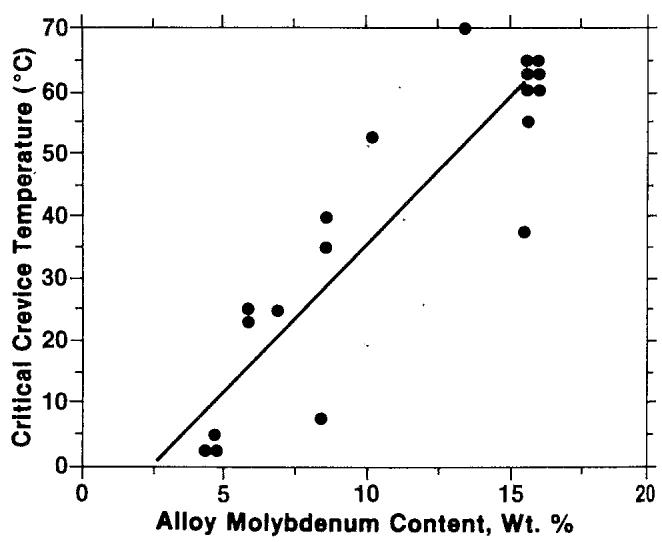
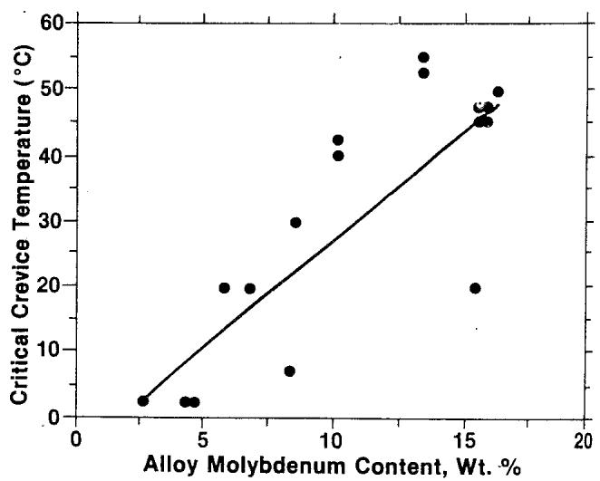
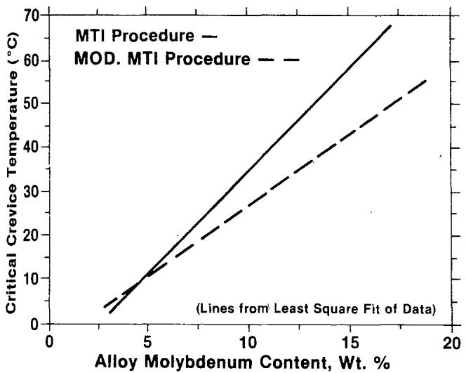
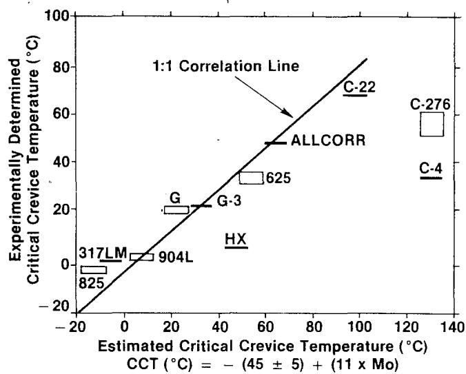
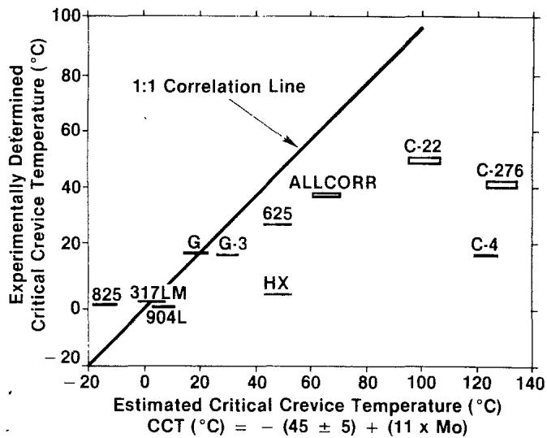
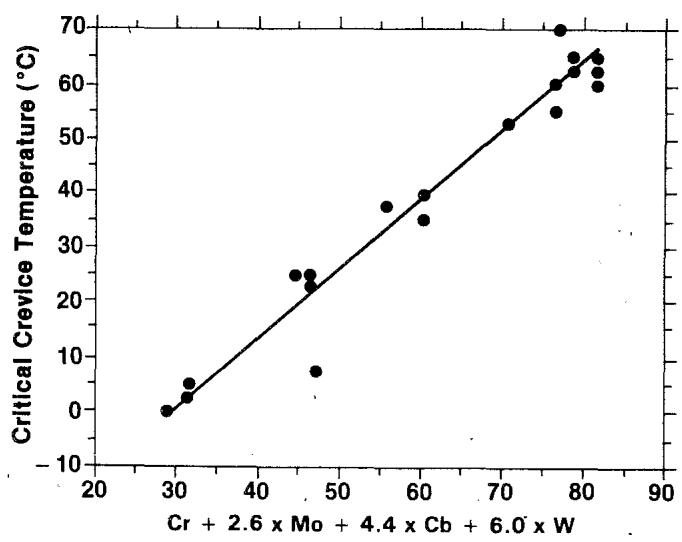
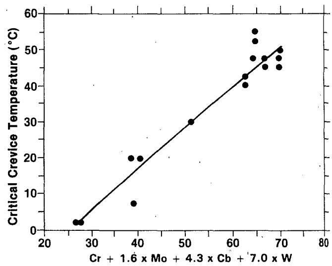

Thank you for using our service!

Interlibrary Services The Ohio State University Libraries (614)292-6211 liblend@osu.edu

Article Express documents are delivered 24/7 directly to your ILLiad account from scanning libraries around the world. If there is a problem with a PDF you receive, please contact our office so we might report it to the scanning location for resolution.

## NOTICEWARNING CONCERNING COPYRIGHT RESTRICTIONS

The copyright law of the United States (Title 17, United States Code) governs the making of photocopies or other reproductions of copyrighted material.

Under certain conditions specified in the law, libraries and archives are authorized to furnish a photocopy or other reproduction. One of these specified conditions is that the photocopy or reproduction is not to be “used for any purpose other than private study, scholarship, or research." If a user makes a request for, or later uses, a photocopy or reproduction for purposes in excess of “fair use," that user may be liable for copyright infringement.

This institution reserves the right to refuse to accept a copying order if, in its judgment, fulfillment of the order would involve violation of copyright law.

## Lib 18TH

From: OSU Interlibrary Services <liblend@osu.edu> Sent: Thursday, March 22, 2018 7:46 AM To: Lib 18TH Subject: DOCUMENT DELIVERY REQUEST 1529791

## DOCUMENT DELIVERY

ILLiad Transaction Number: 1529791

Call Number: TA462.A1 M322 v.26no.1-6 Location: 18th Ave Library Basement Compact Shelving

Journal Title: Materials performance   
Journal Vol: 26   
Journal Issue: 3   
Journal Year: 1987   
Article Pages: 37-40

Article Title: Modification of Critical Crevice Temperature Test Procedures for Nickel Alloys in a Ferric Chloride. Environment

Notes: 3/21/2018 6:31 PM - ke.36: This is a conference paper. other information is "Houston, TX: NACE International, 1986"

If you need to contact us, please refer to this Document Delivery Transaction Number: 1529791.

E-Mail: liblend@osu.edu Phone: 614-292-6211

# Modification of critical crevice temperature test procedures for nickel alloys in a ferric chloride environment\*

Edward L. Hibner\*

Techniques exist presently for ranking alloys for crevice corrosion resistance by determining their critical crevice temperature (CCT) in 6 to 10% $F e C I _ { 3 }$ environments. Laboratory studies were conducted on nickel alloys to evaluate the effect of $F e C l _ { 3 }$ concentration and test procedure on CCT results. A modified test procedure was developed that yields more reproducible , results with less data scatter than is incurred with existing techniques. The severity of the environment increased with increasing $F e C l _ { 3 }$ content from 6 to 10%. The CCT results correlated with the alloy Cr, Mo, Cb, and W content.

## Introduction

USING IDENTICAL TEST PROCEDURES, both the Materials Technology Institute (MTl) of the chemical process industry and the Pulp and Paper Research Institute of Canada (PPRIC) have been involved in ranking alloys by critical crevice temperature (CCT) valves in 6 and 10% FeCl₃ environments, respectively.1,2 Modifications were made to the MTI test procedures, which yield the most reproducible CCTs for nickel alloys in 6% FeCl3 (i.e., 10% $\mathsf { F e C l } _ { 3 } { \bullet } 6 { \mathsf { H } } _ { 2 } { \mathsf { O } } )$ for 24-h exposure. The modified MT! test procedure will provide an excellent way to rank candidate alloys as to crevice corrosion resistance in severe oxidizing chloride environments. An accurate estimate of an alloy's CCT can be made based on its CR, Mo, Cb, and W content.

## Procedure

The test material came from commercially produced 0.062-in. (1.57-mm) and 0.125-in. (3.25-mm) sheet. Table 1 shows the nominal chemical compositions of the evaluated alloys. Crevice corrosion specimens were $2 \times 2$ in. (51 × 51 mm) by sheet thickness. The specimens were fitted with multiple crevice devices produced by TFE-fluorocarbon washers of the type described by Anderson.³ Before initial testing, all specimens were given a 120-grit surface finish with aluminum oxide paper and cleaned with acetone. The test solutions were prepared by dissolving reagent-grade $\mathsf { F e C l } _ { 3 } { \bullet } \mathsf { 6 H } _ { 2 } \mathsf { O }$ into distilled water. CCTs were determined by both the MTI procedure in

Manual No. 3 of May 1980 and a modification thereof. In the MTi procedure, duplicate specimens are exposed to 10% $\mathsf { F e C l } _ { 3 } \circ \mathsf { G H } _ { 2 } \mathsf { O }$ for 24 h at a fixed temperature. If no attack of any type is observed, the sample is considered to be immune at that temperature and is further exposed, without resanding, for another 24 h at a 2.5 C higher temperature. This procedure is continued until attack is observed. As mentioned, PPRiC uses an identical test procedure, but the CCT values are determined in 10% ${ \mathsf { F e C l } } _ { 3 }$ (not hexahydrate). The MTl procedure was modified by resanding and cleaning the crevice corrosion specimens before further exposure of the specimen at highei temperatures. Least squares fit was used to determine lines in the CCT plots.

## Results and discussion

In review, the CCT test is a method designed to determine the relative resistance of alloys to crevice corrosion in oxidizing chloride environments by measuring the minimum (critical) temperature for crevice corrosion initiation. The higher the CCT, the greater the crevice resistance. At room temperature, 6% $\mathsf { F e C l } _ { 3 }$ (10% $F e C l _ { 3 } \circ 6 H _ { 2 } O )$ has a natural pH of 1.2 to 1.3.

## Data scatter

Table 2 contains CCT values for nickel alloys evaluated in 6% FeCl3 by both the MTI and the modified MTI procedure. The results are compared to PPRIC literature CCT values, determined in 10% $F e C l _ { 3 }$ (not hexahydrate), for Alloys 825, G, 625, and C-276. Generally, CCT values determined by the original MTl procedure in 6% $F e C l _ { 3 }$ agree better with the literature CCT values determined in 10% $\mathsf { F e O } \mathsf { C l } _ { 3 }$ than those from the modified MTI procedure do.

Greater data scatter was observed by the MTI procedure than by the modified MTi procedure. Using the MTi procedure, 6 of the 14 alloys (heats) displayed variances of 2.5 to 5.0 C in duplicate specimens. With the modified MTI procedure, only 3 of 15 alloys (heats) displayed variances of only 2.5 C in duplicate specimens.

Figures 1 and 2 áre plots of the CCT vs alloy Mo content as determined by the MTI and modified MTI procedures, respectively. Figure 3 compares the lines taken from Figures 1 and 2. Lower CCT values were obtained with the modified procedure than by the originai MTI procedure. The difference was greater with higher alloy Mo content. Perhaps the higher CCT values associated with the original MTi and PPRIC procedure and the greater data scatter observed for the original MTl procedure relate to surface passivation. In the MTI procedure, the

TABLE 1 — Nominal chemical composition major alloying elements (wt%)
<table><tr><td>Alloy</td><td>(UNS No.)</td><td>Fe</td><td>Cu</td><td>Ni</td><td>Cr</td><td>Mo</td><td></td><td>Others</td></tr><tr><td></td><td></td><td></td><td></td><td></td><td></td><td></td><td></td><td></td></tr><tr><td>825</td><td>(N08825)</td><td>30.0</td><td>2.2</td><td>42.0</td><td>21.5</td><td>3.0</td><td>0.9 Ti</td><td></td></tr><tr><td>317LM</td><td>(S31703)</td><td>61.0</td><td>一</td><td>14.0</td><td>19.0</td><td>4.25</td><td></td><td></td></tr><tr><td>904L</td><td>(N08904)</td><td>45.0</td><td>1.5</td><td>25.5</td><td>21.0</td><td>4.7</td><td></td><td></td></tr><tr><td>G</td><td>(N06007)</td><td>19.5</td><td>2.0</td><td>44.0</td><td>22.0</td><td>6.5</td><td></td><td>2.0 Cb,(1) 2.5 Co, 1.0 W</td></tr><tr><td>G-3</td><td>(N06985)</td><td>19.5</td><td>1.9</td><td>49.0</td><td>22.2</td><td>7.0</td><td>1.0 W</td><td></td></tr><tr><td>HX</td><td>(N06002)</td><td>18.5</td><td>一</td><td>48.0</td><td>22.0</td><td>9.0</td><td>1.5 Co, 0.6 W</td><td></td></tr><tr><td>625</td><td>(N06625)</td><td>2.5</td><td></td><td>61.0</td><td>21.0</td><td>9.0</td><td>3.6 Cb(1)</td><td></td></tr><tr><td>C-22</td><td>(N06022)</td><td>4.0</td><td></td><td>58.0</td><td>21.0</td><td>13.5</td><td>2.5 Co, 3.0 W</td><td></td></tr><tr><td>C-276</td><td>(N10276)</td><td>5.0</td><td></td><td>59.0</td><td>15.5</td><td>16.0</td><td>4.0 W</td><td></td></tr><tr><td>C-4</td><td>(N06455)</td><td>一</td><td></td><td>68.0</td><td>16.3</td><td>15.3</td><td></td><td></td></tr><tr><td>ALLCORR(2)</td><td></td><td></td><td></td><td>56.0</td><td>31.0</td><td>10.0</td><td>2.0 W</td><td></td></tr><tr><td>(No UNS no. assigned)</td><td></td><td></td><td></td><td></td><td></td><td></td><td></td><td></td></tr></table>

(1)Includes Ta.

(2)Registered trade name.

TABLE 2 — CCT data for nickel alloys evaluated in 6% FeCl3 (i.e., 10% FeCl3•6 H2O) for 24-h periods using MTI and modified MTI procedures; the data are compared to literature CCT values for, 10% FeCl3 (not hexahydrate)
<table><tr><td rowspan="2">Alloy</td><td rowspan="2">MTI</td><td colspan="2">CCT (C)</td></tr><tr><td>Modified MTI</td><td>Literature(1)</td></tr><tr><td></td><td></td><td></td><td></td></tr><tr><td>825</td><td>0.0, 0.0</td><td>2.5, 2.5</td><td>-3</td></tr><tr><td>904L</td><td>2.5, 5.0</td><td>2.5, 2.5</td><td>一</td></tr><tr><td>317LM</td><td>2.5, 2.5</td><td>2.5, 2.5</td><td>1</td></tr><tr><td>HX</td><td>7.5, 7.5</td><td>5.0, 5.0</td><td></td></tr><tr><td>G</td><td>23.0, 25.0</td><td>20.0, 20.0</td><td>15 to 21</td></tr><tr><td>G-3</td><td>25.0, 25.0</td><td>20.0, 20.0</td><td>一</td></tr><tr><td>C-4</td><td>37.5, 37.5</td><td>20.0, 20.0</td><td></td></tr><tr><td>625</td><td>35.0, 40.0</td><td>30.0, 30.0</td><td>45 to 50</td></tr><tr><td>C-22</td><td>70.0, 70.0</td><td>52.5, 55.0</td><td></td></tr><tr><td>ALLCORR</td><td>52.5, 52.5</td><td>40.0, 42.5</td><td></td></tr><tr><td>C-276 (Heat 1)</td><td>60.0, 65.0</td><td>45.01, 42.5</td><td>52 to 58</td></tr><tr><td>C-276 (Heat 2)</td><td>62.5, 65.0</td><td>.45.0, 45.0</td><td></td></tr><tr><td>C-276 (Heat 3)</td><td>62.5, 65.0</td><td>47.5, 47.5</td><td></td></tr><tr><td>C-276 (Heat 4)</td><td>55.0, 60.0</td><td>47.5, 47.5</td><td></td></tr><tr><td>C-276 (Heat 5)</td><td>一</td><td>50.0, 50.0</td><td></td></tr><tr><td></td><td></td><td></td><td></td></tr></table>

(1)Reference 2.

specimens are reimmersed (uncleaned or sanded) at higher temperatures after the initial exposure until attack is observed. This amounts to testing a specimen with a passive film, which must be broken down for attack to occur.

To examine data scatter as a function of surface passivation resulting from the continued reimmersion of specimens, tests were conducted on Alloy C-276 from the same piece of sheet, 0.062 in. (1.6 mm), by the MTI procedure in 10% $\mathsf { F e C l } _ { 3 } { \bullet } 6 \mathsf { H } _ { 2 } \mathsf { O } .$ Triplicate specimens were evaluated with initial immersion temperatures of 30.0, 40.0, 47.5, and 50.0 C. As perthe MTI procedure, specimens were reimmersed without resanding until attack occurred.

As shown in Table 3, the lower the initial immersion temperature, the higher the CCT values, and data scatter was as high as 12.5 C for triplicate specimens. The modified procedure eliminates this problem by providing a fresh, unpassivated surface for immersion at higher temperatures.

  
FIGURE 1 — CCT for nickel alloys in 6% $\mathsf { F e C l } _ { 3 }$ by the MTI procedure.

  
FIGURE 2 — CCT for nickel alloys in 6% $F e C l _ { 3 }$ by the modified MTI procedure.

  
FIGURE 3 — CCT for nickel alloys in 6% $F e C l _ { 3 } .$

TABLE 3 — Alloy C-276 evaluated for CCT by the MTI procedure
<table><tr><td>Initial immersion temperature (C)</td><td>CCT (C)</td><td>Maximum temperature variance (C)</td></tr><tr><td></td><td></td><td></td></tr><tr><td>30.0</td><td></td><td></td></tr><tr><td>40.0</td><td>77.5, 80.0, 82.5 72.5, 75.0, 85.0</td><td>5.0 12.5</td></tr><tr><td>47.5</td><td>60.0, 62.5, 65.0</td><td>5.0</td></tr><tr><td>50.0</td><td>50.0, 50.0, 50.0</td><td>0.0</td></tr><tr><td></td><td></td><td></td></tr></table>

## Relationship to alloying elements

While it is known that other alloying elements such as Cb, W, and N affect pitting and crevice corrosion rèsistance, researchers have traditionally related alloy Cr and Mo content mathematically to pitting and crevice corrosion resistance.4,5

Figures 4 and 5 are plots of experimentally determined CCTs by the MTI and modified MTI procedures, respectively, vs an estimated CCT, based on the equation developed by Brigham for 18% Cr austenitic stainless steels (SSs) evaluated in 10% $\mathsf { F e C l } _ { 3 }$ (not hexahydrate).4

$$
\mathsf { C C T } ( \mathsf { C } ) = - \left( 4 5 + 5 \right) + ( 1 1 \times \mathsf { M o } )\tag{1}
$$

For CCT values generated by the MTI procedure (Figure 4) good correlation exists, except for alloys HX, C-4, and C-276. For CCT values generated by the modified MTI procedure (Figure 5), good correlation exists only for those alloys containing 9% Mo. This suggests that other alloying elements significantly affect crevice corrosion resistance.

Kolts related alloy chromium and molybdenum contents of austenitic FeNiCrMo alloys to the critical pitting temperature (CPT) in 4% NaCl $+ ~ 1 \% ~ 5 8 _ { 2 } ( 5 0 _ { 4 } ) _ { 3 } + 0 . 0 1$ M HCl, i.e., the minimum (critical) temperature at which pitting initiates related to $C r + 2 . 4 \ M \circ . ^ { 5 }$ No effect of alloy Cb or W content on the CPT was examined. It was noted that the $\mathsf { C r } + 2 . 4$ Mo relationship does not apply to ferritic SS or to alloys containing adequate amounts of tungsten or nitrogen, which affect pitting corrosion resistance.

  
FIGURE 4 — CCT experimentally determined in 6% FeCl₃ by the MTI procedure vs estimated CCT for 10% $F e C l _ { 3 }$ based on an equation for 18% chromium austenitic SSs.

  
FIGURE 5 — CCT experimentally determined in 6% FeCl₃ by the modified MTI procedure vs estimated CCT for 10% FeCl₃ based on an equation for 18% chromium austenitic SSs.

In thisstudy, relationships were generated using least squares linear fit to correlate the alloy ${ \bar { \mathsf { C r } } } , { \mathsf { M o } } , { \mathsf { C b } } ,$ and W content to CCT values determined by the MTI and modified MTI procedures. Nickel alloys can be related to the CCT in 6% $\mathsf { F e C l } _ { 3 }$ as follows: $( 1 ) \mathsf { C r } + 2 . 6 \mathsf { M o } + 4 . 4 \mathsf { C b } + 6 . 0 \mathsf { W }$ for the MTI procedure; and $( 2 ) \textsf { C r } + 1 . 6 \textsf { M o } + 4 . 3 \textsf { C b } + 7 . 0 \textsf { W }$ for the modified MTI procedure. Figures 6 and 7 are plots of CCT values vs the above elemental relationships, and the two lines are nearly superimposable. This indicates that the general effect of the four elements on crevice corrosion resistance in the ferric chloride environment is the same, regardless of procedure. 1

## Summary

1. The CCT determined by the current MTI procedure is a function of initial immersion temperature; i.e., the lower the initial immersion temperature, the higher the CCT value obtained. Significant data scatter incurred. 1

  
FIGURE 6— CCT for nickel alloys in 6% FeCl3 by the MTI procedure.

2. The MTI procedure for CCT determination has been modified to decrease data scatter. For duplicate specimens, 43% of the alloys evaluated by the original MTl procedure , varied up to 5 C, compared to 20% of the alloys tested by the modified procedure, which varied only 2.5 C. The modification was to resand and clean specimens júst before immersion at the next higher temperature.

3. The modified MTI procedure produces lower CCT values than those determined by the original MTl procedure. The difference increases with increasing alloy Mo content.

4. For alloys containing 16% Mo evaluated by the original MTI procedure and alloys containing 9% Mo evaluated by the modified procedure, the CCT values obtained experimentally agreed with predicted values based on an equation for 18% Cr austenitic SSs. Significant differences existed for higher Mo alloys.

  
FIGURE 7 — CCT for nickel alloys in 6% $F e C l _ { 3 }$ by the modified MTI procedure.

: 5. Nickel alloys can be related to the CCT in 6% FeClg as follows: (1) $\mathsf { C r } + 2 . 6 ~ \mathsf { M o } + 4 . 4 ~ \mathsf { C b } + 6 . 0 ~ \mathsf { W }$ for the MTI procedure; and (2) Cr + 1.6 Mo + 4.3 Cb + 7.0 W for the modified MTI procedure. The general effect of alloying elments on crevice corrosion resistance was the same, regardless of procedure.

## References

1. Materials Technology Institute, Manual No. 3, May 1980.,

2. A. Garner, Pulp and·Paper Research Institute of Canada, Vol. 82, No. 12, p. 109, 1981.

3. D. B. Anderson, "Statistical Aspects of Crevice Corrosion in Sea Water," ASTM-ASM Symp. Pitting Corros., Detroit MI, October 1974.

4. R. J. Brigham, Corrosion, Vol. 30, No. 11, p. 396, 1974.

5. J. Kolts, J. B. C. Wu, A. I. Asphahani, Metal Prog., p. 25, September 1983.