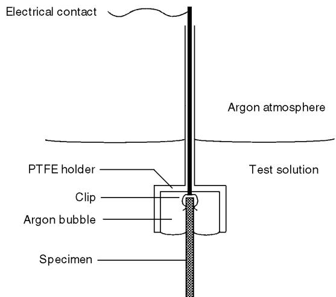
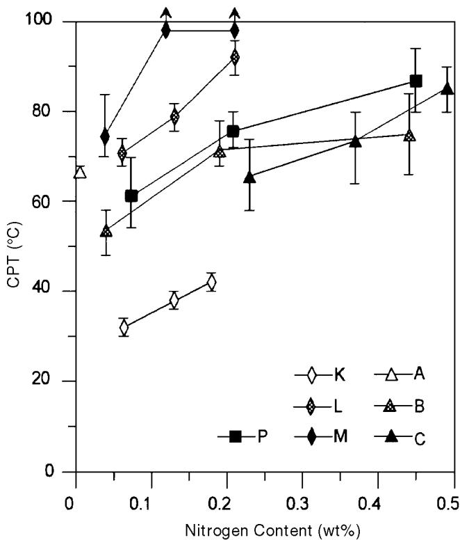
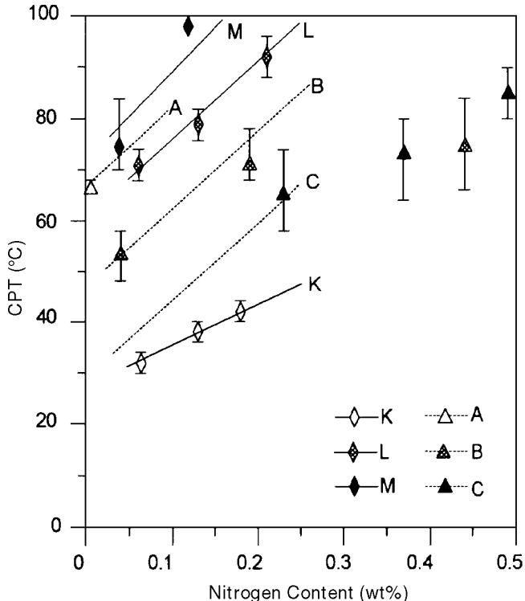
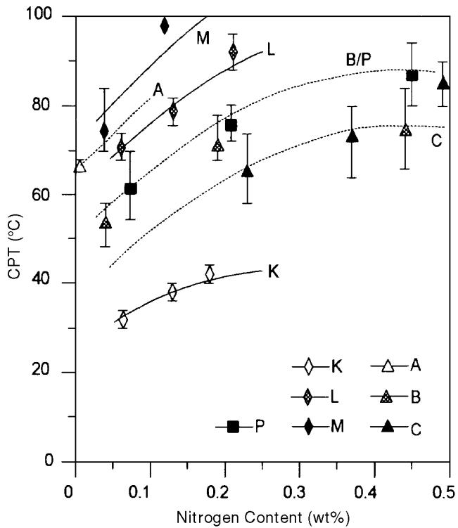
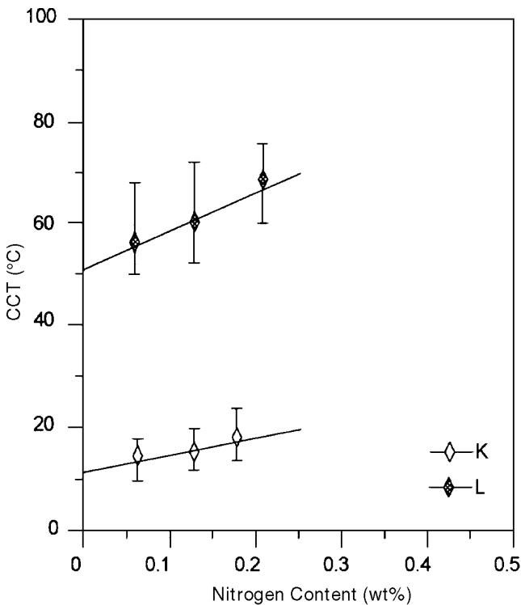
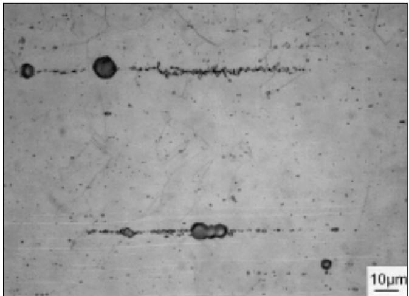
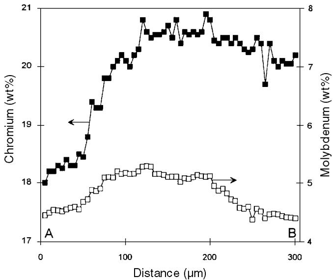
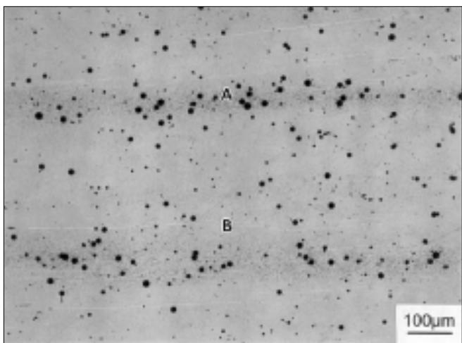

# Application of the Pitting Resistance Equivalent Concept to Some Highly Alloyed Austenitic Stainless Steels

R.F.A. Jargelius-Pettersson

## ABSTRACT

The influence of alloying levels in the ranges from 0.01% to 0.5% N, 4.5% to 6% Mo, and 0.2% to 10% Mn on pitting corrosion resistance was investigated for austenitic stainless steels (SS) with a base composition of 20% Cr and 18% or 25% Ni. Results were analyzed in terms of the pitting resistance equivalent (PRE) concept, which relates pitting behavior to alloying content. The synergistically beneficial effect of molybdenum and nitrogen alloying was demonstrated, while the detrimental effect of manganese alloying was offset by higher attainable nitrogen content.

KEY WORDS: alloying, corrosion, critical crevice temperature, critical pitting temperature, manganese, molybdenum, nitrogen, pitting, pitting resistance equivalent, stainless steel

## INTRODUCTION

In recent years, a number of new, highly alloyed austenitic stainless steel (SS) grades have been developed to meet increasing demands placed on corrosion resistance of such materials. Nitrogen alloying, particularly in combination with high levels of molybdenum, has been found to have a remarkably beneficial effect on a wide range of corrosion properties, most notably pitting corrosion resistance.

It has become common practice to express the effect of alloying elements on pitting resistance of SS in terms of a pitting resistance equivalent (PRE). Lorentz and Medawar originally found good correlation between the pitting potential of a wide range of SS and the sum of % Cr + 3.3 x (% Mo), indicating molybdenum additions were more than three times as effective as chromium additions in increasing pitting resistance.1 This assumed a certain base level of chromium since molybdenum additions have very little effect in iron-nickel-molybdenum (Fe-Ni-Mo) alloys.2 If analysis were extended to lower chromium contents rather than being applied only to SS with ≥ 17% Cr, it would be necessary to introduce the concept of chromium-molybdenum synergism.

Analysis in terms of PRE subsequently has been applied to results from electrochemical and immersion testing to determine the critical temperature for pitting (CPT) in sodium chloride (NaCl) or ferric chloride (FeCl3) and to pitting potentials. Using the general equation:

$$
\mathrm { P R E } = \mathrm { \% } \mathrm { C r } + \mathbf { a } \times ( \mathrm { \% } \mathbf { M o } ) + \mathbf { b } \times ( \mathrm { \% } \mathbf { N } )\tag{1}
$$

the molybdenum factor (a) has been reported as 3,2-3 3.3,4-7 or even as high as 5 in acidic solutions.8 The nitrogen factor (b) has been reported as 12.8,2 13,4 $1 6 , ^ { 5 } 2 7 , ^ { 3 } 3 0 , ^ { 6 - 7 }$ and between 9 and 36, with an average value of 19.4.9 One investigation reported an acceptable degree of linearity between CPT and PRE using a wide range of these factors.10 In the case of the critical temperature for crevice corrosion (CCT), values of a = 2.3,2 3.3,11 4.1,4 and b = 3.3,2 16,11 and $2 7 ^ { 4 }$ have been reported.

TABLE 1  
Composition of the Alloys Investigated (wt%), CPT, and CCT in 0.2 M NaCl at 600 mVsce
<table><tr><td>Alloy</td><td>C</td><td>Si</td><td>Mn</td><td>P</td><td>S</td><td>Cr</td><td>Ni</td><td>Mo</td><td>N</td><td>CPT</td><td>CCT</td></tr><tr><td>K1</td><td>0.014</td><td>0.53</td><td>1.31</td><td>0.010</td><td>&lt; 0.003</td><td>20.1</td><td>24.8</td><td>0.08</td><td>0.064</td><td>32.0</td><td>14.8</td></tr><tr><td>K2</td><td>0.014</td><td>0.55</td><td>1.43</td><td>0.009</td><td>&lt; 0.003</td><td>20.0</td><td>24.9</td><td>0.04</td><td>0.13</td><td>38.0</td><td>15.6</td></tr><tr><td>K3</td><td>0.013</td><td>0.55</td><td>1.43</td><td>0.010</td><td>&lt; 0.003</td><td>20.0</td><td>24.9</td><td>0.04</td><td>0.18</td><td>42.0</td><td>18.4</td></tr><tr><td>L1</td><td>0.020</td><td>0.54</td><td>1.42</td><td>0.010</td><td>&lt; 0.003</td><td>19.8</td><td>24.9</td><td>4.50</td><td>0.061</td><td>70.7</td><td>56.4</td></tr><tr><td>L2</td><td>0.015</td><td>0.49</td><td>1.45</td><td>0.009</td><td>&lt; 0.003</td><td>19.9</td><td>25.0</td><td>4.55</td><td>0.13</td><td>78.7</td><td>60.4</td></tr><tr><td>L3</td><td>0.014</td><td>0.54</td><td>1.44</td><td>0.009</td><td>&lt; 0.003</td><td>19.8</td><td>25.0</td><td>4.59</td><td>0.21</td><td>92.0</td><td>68.8</td></tr><tr><td>M1</td><td>0.016</td><td>0.55</td><td>1.49</td><td>0.013</td><td>0.003</td><td>20.0</td><td>25.4</td><td>5.97</td><td>0.039</td><td>74.5</td><td></td></tr><tr><td>M2</td><td>0.014</td><td>0.57</td><td>1.46</td><td>0.013</td><td>0.002</td><td>19.9</td><td>25.3</td><td>6.05</td><td>0.12</td><td>&gt; 98</td><td></td></tr><tr><td>M3</td><td>0.014</td><td>0.53</td><td>1.46</td><td>0.013</td><td>0.002</td><td>20.1</td><td>24.8</td><td>6.04</td><td>0.21</td><td>&gt; 98</td><td></td></tr><tr><td>A1</td><td>0.015</td><td>0.49</td><td>0.18</td><td>0.008</td><td>0.004</td><td>19.8</td><td>18.4</td><td>4.76</td><td>0.005</td><td>66.7</td><td></td></tr><tr><td>B1</td><td>0.014</td><td>0.55</td><td>5.35</td><td>0.012</td><td>0.004</td><td>20.1</td><td>18.4</td><td>4.61</td><td>0.04</td><td>53.6</td><td></td></tr><tr><td>B2</td><td>0.015</td><td>0.55</td><td>5.41</td><td>0.013</td><td>0.004</td><td>20.0</td><td>18.3</td><td>4.60</td><td>0.19</td><td>71.5</td><td></td></tr><tr><td>B3</td><td>0.014</td><td>0.56</td><td>5.24</td><td>0.012</td><td>0.004</td><td>20.2</td><td>18.5</td><td>4.38</td><td>0.44</td><td>75.0</td><td></td></tr><tr><td>C1</td><td>0.017</td><td>0.72</td><td>11.0</td><td>0.010</td><td>0.005</td><td>20.2</td><td>18.2</td><td>4.66</td><td>0.034</td><td></td><td></td></tr><tr><td>C2</td><td>0.019</td><td>0.68</td><td>10.8</td><td>0.011</td><td>0.005</td><td>20.6</td><td>18.5</td><td>4.70</td><td>0.23</td><td>65.6</td><td></td></tr><tr><td>C3</td><td>0.020</td><td>0.65</td><td>11.0</td><td>0.011</td><td>0.005</td><td>20.0</td><td>18.6</td><td>4.71</td><td>0.37</td><td>73.5</td><td></td></tr><tr><td>C4</td><td>0.019</td><td>0.63</td><td>10.5</td><td>0.011</td><td>0.005</td><td>20.1</td><td>18.5</td><td>4.69</td><td>0.49</td><td>85.2</td><td></td></tr><tr><td>P1</td><td>0.016</td><td>0.50</td><td>1.51</td><td>0.016</td><td>0.008</td><td>19.9</td><td>24.5</td><td>4.33</td><td>0.075</td><td>63</td><td></td></tr><tr><td>P2</td><td>0.016</td><td>0.50</td><td>1.51</td><td>0.016</td><td>0.008</td><td>19.9</td><td>24.5</td><td>4.33</td><td>0.21</td><td>76</td><td></td></tr><tr><td>P3</td><td>0.016</td><td>0.50</td><td>1.51</td><td>0.016</td><td>0.008</td><td>19.9</td><td>24.5</td><td>4.33</td><td>0.45</td><td>87</td><td></td></tr></table>

## EXPERIMENTAL

Other alloying elements also have been demonstrated to affect pitting corrosion resistance, but these seldom are included in the PRE formula. Manganese generally is regarded as detrimental,12-14 and it has been given a negative coefficient in two evaluations of PRE expressions.15-16 However, some works have found the effect to lack statistical significance,1,8 and one investigation demonstrated both effects in that manganese reduced the “worst case” pitting resistance without affecting the median.17 In the case of nickel, the picture has been less clear. Beneficial18-19 and negligible1,8,12 effects have been reported. Nadezhdin and Wensley introduced a negative factor of 0.33 x (% Ni) in their “Localized Corrosion Resistance Index.”11

This simple picture, however, completely ignores the concept of interaction between alloying elements, particularly the synergistic effect between nitrogen and molybdenum, which has been reported in a large number of works and which acquires increasing significance in more highly alloyed steels.20-26

In the present work, the effect of nitrogen alloying on pitting corrosion resistance was investigated for two groups of austenitic SS: 20% Cr-25% Ni, with 0% Mo, 4.5% Mo, or 6% Mo; and 20% Cr-18% Ni-4.5% Mo, with 0% Mn, 5% Mn, or 10% Mn. This represents an extension and analysis of previous work.26-27

The wide range of alloys studied permitted examination of possible synergistic effects between nitrogen and molybdenum, the effect of large manganese additions (compared to manganese contents in the range 0% to 1.5% in the majority of investigations reported), and the influence of higher nitrogen content attainable in the presence of manganese.

Compositions of the alloys investigated are shown in Table 1. The series designated K, L, and M and A, B, and C were prepared as laboratory heats and then forged, extruded (or hot-rolled in the case of the K and L series), and cold-rolled to 3-mm (0.12-in.) strips. Materials in Series P were produced by nitriding SS powder, followed by consolidation and extrusion.28

For Series K and L, a final laboratory annealing for 20 min at 1,100°C gave a uniform structure. For Series M, times of 1 h (Steels M2 and M3) or 5 h (Steel M1) at the same temperature were necessary to remove strings of intermetallic precipitates present in the as-rolled structure, while 5 h at 1,150°C was used for Series A, B, and C for the same reason. Sigma phase could not be eliminated from the alloy C1 by annealing, so this steel was excluded from investigation. Materials in Series P were extruded at 1,230°C, then annealed at 1,000°C for 20 min (Steel P1), 1,250°C for 10 min (Steel P2) or 1,250°C for 1.2 s (Steel P3). All the steels were water-quenched after solution treatment. Metallographic evaluation used to confirm that the microstructures were fully austenitic.

CPT in deaerated 0.2 M NaCl solution at a constant potential of 600 mV vs a saturated calomel electrode (SCE) was measured by raising the temperature 2°C every 15 min until an irreversible current increase indicated the onset of stable pitting. Specimens were 40 mm by 15 mm by 3 mm (1.6 in. by 0.6 in. by 0.12 in.) and were wet-ground to 600- grit silicon carbide (SiC) at least 18 h before testing. These were fastened in a specimen holder in which all electrical contacts to the specimen were under an argon bubble and, thus, not susceptible to crevice corrosion (Figure 1). The area of the specimen exposed to the electrolyte was ≈ 10 cm2 (1.6 in.2). This included the flat surface and edges of the test coupons. In all cases, at least three measurements were made and averaged. For determination of CCT, two such specimens were clamped together to produce a metal-metal crevice.

  
FIGURE 1. Schematic of the specimen holder as designed to avoid crevice corrosion.

  
FIGURE 2. CPTin 0.2 M NaCl at $6 0 0 m V _ { s c E }$ as a function of nitrogen content. Error bars denote maximum and minimum measured values. Symbols denote the average of at least three measurements and are joined by lines for clarity.

## RESULTS

## Pitting Corrosion

Results of CPT measurements are included in Table 1 and plotted as a function of nitrogen content in Figure 2. In all cases, alloyed nitrogen had a marked beneficial effect on pitting resistance as expressed by CPT. Comparison of results for Series K, L, and M showed a more pronounced effect of nitrogen was observed in the presence of a higher level of molybdenum, demonstrating the synergistic effect of these alloying elements. CPT values for the powder metallurgically produced Series P was somewhat lower than its conventional equivalent (Series L). When Series A, B, C, and L were compared, it was apparent that increasing manganese content had a detrimental effect on pitting corrosion. CPT for Steel A1 (0.2% Mn) was slightly above an extrapolation of the line for Series L (1.4% Mn), while CPT values for Series B with 5% Mn and Series C with 10% Mn were considerably lower. Alloys in Series L also had a higher nickel content, but the effect of this element appeared small or negligible compared to that of manganese.

It also could be seen from Figure 2 that the beneficial effect of nitrogen was attenuated at higher nitrogen levels. This was evident for Series B in that Steel B3 with 0.44% N showed only a slightly higher CPT than Steel B2. Series P alloys produced using the powder metallurgy technique showed the same trend of a falloff in the effect of nitrogen when it was present at high levels. For the Series C alloys containing 10% Mn, the trend was different in that the slope of the curve tended upward at the highest nitrogen levels. Whether this resulted from a synergistic interaction between nitrogen and manganese when both were present at high levels or whether it could be attributable to secondary factors remained a matter of speculation.

## Evaluation of CPT and PRE by Linear Regression

Linear regression including a synergistic (% Mo) x (% N) term was performed for steels with 0% N to 0.25% N (i.e., the range in which there were the most data points). Steel M3 was excluded because the CPT clearly lay above the measurable limit (98°C), for Steel M2, this value was included to provide a minimum estimate of the CPT. Steels in Series P were eliminated because of the existence of secondary microstructural factors. Multiple linear regression analysis for the remaining alloys (Steels A1, K1 through K3, L1 through L3, M1 and M2, B1 and B2, and C2) yielded the relation:

$$
\begin{array} { r l } { { } } &  { \mathrm { C P T } = 3 1 . 3 ^ { ( 4 . 9 ) } + 7 . 5 ^ { ( 1 . 1 ) } \mathrm { x } \ \mathrm { ( } ^ { \% } \ \mathrm { M o ) } + \ 8 1 . 5 ^ { 3 7 } \mathrm { x } \ { \mathrm { ( } ^ { \% } \ \mathrm { N ) } } } \\ { { } } &  { \mathrm { + } \ 1 5 . 8 ^ { ( 8 . 3 ) } \mathrm { x } \ { \mathrm { ( } ^ { \% } \ \mathrm { M o ) } } { \mathrm { ( } ^ { \% } \ \mathrm { N ) } } - \ 3 . 5 ^ { ( 0 . 4 ) } \mathrm { x } \ { \mathrm { ( } ^ { \% } \ \mathrm { M n ) } } } \end{array}\tag{2}
$$

The superscripts in parentheses denote the standard errors of the individual coefficients. The analysis assumed the effect of nickel to be negligible. A comparison between this regression analysis and the experimental data is shown in Figure 3, the error coefficient (r2) was 0.986. The corresponding PRE relation could be obtained by assuming a factor of 3.3 for molybdenum, since the absence of chromium variations in the present investigation prevented evaluation of the relative effects of chromium and molybdenum. This yielded:

$$
\begin{array} { c } { { \mathrm { P R E } = \mathrm { C r } + 3 . 3 \times ( \% \mathrm { M o } ) + 3 6 \times ( \% \mathrm { N } ) + 7 \times } } \\ { { ( 9 \% \mathrm { M o } ) ( \% \mathrm { N } ) - 1 . 6 \times ( \% \mathrm { M n } ) } } \end{array}\tag{3}
$$

At higher nitrogen levels (> ≈ 0.25%), an estimation of the effect of nitrogen could be obtained from the gradients of the lines connecting Steels B2/B3, P2/P3, C2/C3, and C3/C4. This yielded nitrogen factors of 14, 46, 56, and 98, respectively. These factors could not be divided into a simple and a synergistic nitrogen coefficient because of the absence of molybdenum variations. However, Equation (2) contained a simple nitrogen factor of 82 and yielded a synergistic factor of 71 at 4.5% Mo, giving a combined factor of 153. Therefore, it was apparent that both coefficients must be reduced appreciably at the higher nitrogen levels.

## Evaluation of CPT and PRE Using a Parabolic Nitrogen Term

All steels were included in this analysis, in which a negative (% N)2 term was introduced to incorporate the decreasing effect of nitrogen at high levels. Double weight was attached to results for Series K and L because of the smaller scatter in these results, yielding:

$$
\begin{array} { r l r } {  { \mathbf { C P T } = 2 9 . 6 + 7 . 5 \times ( \% \mathbf { M o } ) + 1 1 6 \times ( \% \mathbf { N } ) + 1 4 \times } } \\ & { } & { \ \mathrm { ( \% \mathbf { M o } ) ( \% N ) - 2 . 8 \times ( \% \mathbf { M } n \mathbf { n } ) - 2 0 4 \times ( \% N ) ^ { 2 } } } \end{array}\tag{4}
$$

Results of this regression, in which $\mathbf { r } ^ { 2 } = 0 . 9 6 3$ , are compared to data points in Figure 4. The depression in CPT resulting from the microstructural inhomogeneity in Series P was calculated as 8.8°C and included in the figure. Similar treatment to above yielded the relation:

$$
\begin{array} { r } { \mathrm { P R E = C r \ } + 3 . 3 \times ( \% \mathrm { M o } ) + 5 1 \times ( \% \mathrm { N } ) + 6 \times } \\ { ( \% \mathrm { M o } ) ( \% \mathrm { N } ) - 1 . 6 \times ( \% \mathrm { M n } ) - 9 0 \times ( \% \mathrm { N } ) ^ { 2 } } \end{array}\tag{5}
$$

## Crevice Corrosion

CCT for Series K and L are shown as a function of nitrogen content in Figure 5. Comparison with the pitting data in Figure 2 showed CCT to be appreciably lower than CPT in all cases and also indicated the effect of nitrogen alloying to be less significant. Performing a multiple linear regression analysis including a (% Mo)(% N) synergistic term yielded:

  
FIGURE 3. Comparison between experimentally determined CPT (points) and those calculated using Equation (2) for steels with < 0.25% N. Average molybdenum and manganese contents were used for the calculated values for each alloy series.

  
FIGURE 4. Comparison between experimentally determined CPT (points) and those calculated using Equation (4). The CPT depression in Series P due to the larger inclusion population was evaluated as $\delta . 8 ^ { \circ } C ,$ , giving a calculated line that corresponded closely to that for Series B.

  
FIGURE 5. CCT in 0.2 M NaCl at 600 $m V _ { s C E }$ for a clamped metalmetal crevice, plotted as a function of nitrogen content. Error bars denote maximum and minimum measured values, and lines show values calculated using Equation (6)

$$
\begin{array} { r l r } { \mathrm { ~ } } & { { } } & { \mathrm { C C T } = 1 1 . 6 ^ { ( 2 . 0 ) } + 8 . 8 ^ { ( 0 . 6 ) } \mathrm { x } \left( \% \mathrm { M o } \right) } \\ { \mathrm { ~ } } & { { } } & { \mathrm { ~ } + 3 3 ^ { ( 1 5 ) } \mathrm { x } \left( \% \mathrm { N } \right) + 1 0 ^ { ( 4 . 2 ) } \mathrm { x } \left( \% \mathrm { M o } \right) \left( \% \mathrm { N } \right) } \end{array}\tag{6}
$$

Comparison with Equation [2] showed the effect of nitrogen to have been reduced significantly, although a strong synergistic effect still remained. Assuming the same relative effect of molybdenum in relation to chromium as for pitting corrosion, this yielded a crevice resistance equivalent (CRE) given by:

$$
\begin{array} { c } { { \mathrm { C R E } = \mathrm { C r } + 3 . 3 \times ( \% \mathrm { M o } ) + 1 2 \times ( \% \mathrm { N } ) + 4 \times } } \\ { { ( { } ^ { \mathrm { 0 } } \% \mathrm { M o } ) \times ( \% \mathrm { N } ) } } \end{array}\tag{7}
$$

## DISCUSSION

Results of the CPT measurements showed molybdenum and nitrogen had a considerable beneficial effect on resistance of SS to pitting and crevice corrosion. The PRE and CRE expressions (Equations [3], [5], and [7]) derived to illustrate these alloying effects demonstrated an important point, namely the need to include the widely recognized synergistic interaction between nitrogen and molybdenum.

In general, however, extreme care should be used in applying PRE expressions. As emphasized in a number of works,6-10 such formulae give only a rough estimate of the localized corrosion resistance of an alloy. Most equations, including the above, lack general validity and, thus, cannot be applied indiscriminately to the entire range of SS available. The problem is exacerbated further if different SS types (i.e., austenitic, duplex, and even ferritic) are treated in the same manner.

Pitting corrosion also is affected strongly by microstructural inhomogeneity. This is most apparent in sensitized steels in which the precipitation of various carbide, nitride, and intermetallic phases is associated with a decrease in localized corrosion resistance.27 However, even in solution-annealed material, there are a number of critical factors which are not taken into consideration in the PRE formulae.

## Nonmetallic Inclusions

As discussed in detail by Sklarska-Smialowska, nonmetallic inclusions frequently act as initiation sites for localized corrosion.29 Sulfide inclusions are particularly damaging and account for the observed detrimental effect of alloy sulfur content on pitting resistance.8,12-13 In the present study, an example of the significance of nonmetallic inclusions was provided by comparison of the conventionally produced Series L and the powder metallurgy produced equivalent Series P. The latter was produced by laboratory nitriding of small quantities of SS powder and, as a result, contained higher levels of oxygen, an average of 260 ppm compared to 140 ppm for Series L. The Series P alloys also had higher contents of sulfur and phosphorus than the conventionally produced materials (Table 1). These factors were reflected in the larger amount of nonmetallic inclusions in the microstructure of Series P alloys. Metallographic examination indicated a significant amount of pitting occurred on these inclusions (Figure 6), which explained average CPT depression of \~ 10°C for steels in Series P compared to their counterparts in Series L.

## Microsegregation

Segregation banding, or periodic variations in composition, may occur in SS that have been homogenized insufficiently. This is liable to be a greater problem in laboratory heats, which have suffered more limited deformation, than in production heats. Evidence of severe segregation was noted for Steels A1 and M1, and microprobe analyses were performed at 5-µm intervals on transverse cross sections through both materials. Coincident variations of up to 0.7% Cr and 0.8% Mo with a periodicity of ≈ 100 µm were observed in Steel M1. Corresponding figures for Steel A1 were 2.5% Cr and 0.9% Mo. This is illustrated for Steel A1 in Figure 7. An indication of the consequences this degree of segregation may have for pitting corrosion resistance could be obtained by calculating PRE values for the depleted and enriched areas. Using Equation (2) yielded predicted PRE values for enriched and depleted areas, respectively, of 42 and 39 for Steel M1 and 38 and 33 for Steel A1 (assuming no segregation of the low levels of nitrogen present). This corresponded to a difference in CPT of ≈ 7°C in both cases.

  
FIGURE 6. Pitting on nonmetallic inclusion strings in Alloy P1 . Small pits for metallographic investigation were produced by immersion in a solution comprising 15 g FeCl₃ and 15 g AICl₃ in 100 mL glycerol + 100 mL ethanol.³0

Since pitting invariably occurred at the weakest point in the microstructure, the measured CPT values (Figure 2) were effectively those for the depleted regions of Steels A1 and M1. Had these alloys been homogenous, CPT values would have been higher, with the consequence that the factors for molybdenum and manganese also would be increased.

## CONCLUSIONS

❖ Nitrogen alloying had a marked beneficial effect on pitting corrosion resistance of the austenitic SS investigated. The effect was more marked in the presence of higher levels of molybdenum (i.e., there was a synergistic effect between the two alloying elements). Manganese alloying was detrimental to pitting resistance, but this could be compensated by the higher levels of nitrogen attainable in manganese-alloyed steels. The effect of nitrogen was most pronounced in the range from 0% to 0.2% but continued to the highest levels investigated (0.5%). ❖ A considerable degree of complexity was required to describe empirically the pitting corrosion resistance of even this relatively narrow group of alloy compositions. This underlined the point that the PRE concept is a rough tool for estimating pitting resistance of alloys, and that its importance should not be overestimated.

(a)  
  
(b)  
FIGURE 7. Segregation in Steel A1: (a) microprobe evaluation of chromium and molybdenum segregation and (b) pitting primarily in bands depleted in chromium and molybdenum. Pits were produced by the technique described in Figure 6.

## ACKNOWLEDGMENTS

The author acknowledges financial support and assistance of Avesta Sheffield AB, AB Sandvik Steel, ABB Powdermet (now Powdermet Sweden AB), AGA AB, Fagersta Stainless AB, and the Swedish Board for Technical Development (now NUTEK).

## REFERENCES

1. K. Lorentz, G. Medawar, Tyssenforschung 1, 3 (1969): p. 97-108.

2. M. Renner, U. Heubner, M.B. Rockel, E. Wallis, Werkst. Korros. 37 (1986): p. 183-190.

3. T. Kitada, Y. Kobayashi, M. Tsuji, T. Taira, K. Ume, M. Ito, Nippon Kokan Tech. Rpt. Overseas 51 (1987): p. 37-45.

4. N. Suutala, M. Kurkela, “Localized Corrosion Resistance of High-Alloy Austenitic Stainless Steels and Welds,”Proc. Stainless Steels ’84 (London, England: Institute of Metals, 1984), p. 240-247.

5. J.E. Truman, Proc. U.K. Corrosion ’87 (London, England: Institute of Corrosion Science and Technology, 1987), p. 111-29.

6. G. Herbsleb, Werkst. Korros. 33 (1982): p. 334-340.

7. P. Gumpel, E. Michel, Thyssen Edelst. Techn. Ber. 12, 2 (1986): p. 181-189.

8. C. Voigt, G. Reidel, H. Werner, M. Gunzel, K.-P. Erkel, Werkst. Korros. 38 (1987): p. 725-737.

9. C. Voigt, H. Werner, M. Gunzel, R. Simmchen, Korros. 22 (1991): p. 3-10.

10. E. Alfonsson, R. Qvarfort, “Investigation of the Applicability of Some PRE Expressions for Austenitic Stainless Steels,” Proc. Conf. Electrochemical Methods in Corrosion Research, EMCR ’91 July 1-4, 1991, Helsinki, Finland (Zurich, Switzerland: Trans Tech Pub. Ltd., 1992), p. 483-491.

11. A. Nadezhdin, A. Wensley, MP (1992): p. 57-59.

12. R.J. Brigham, E.W. Tozer, Corrosion 30, 5 (1974): p. 161-166.

13. J. Degerbeck, Werkst. Korros. 29 (1979): p. 179-188.

14. J.W. Oldfield, Corrosion 46, 7 (1990): p. 574-581.

15. M.O. Speidel, R.M. Pedrazzoli, “High-Nitrogen Stainless Steels in Chloride Solutions,” CORROSION/92, paper no. 398 (Houston, TX: NACE, 1992).

16. G. Rondelli, B. Vicentini, A. Cigada, Werkst. Korros. 46 (1995): p. 628-632.

17. V. Mitrovic-Scepanovic, R.J. Brigham, Corrosion 52,1 (1996): p. 23-27.

18. A.P. Bond, E. A. Lizlovs, J. Electrochem. Soc 115, 11 (1968): p. 1,130-1,135.

19. F. Yoshii, M. Nishikawa, S. Kawamura, Trans. ISIJ 16 (1976): p. 481-485.

20. M.A. Streicher, J. Electrochem. Soc. 103, 7 (1956): p. 375-390.

21. H.J. Dundas, A.P. Bond, “Effects of Delta Ferrite and Nitrogen Contents on the Resistance of Austenitic Steels to Pitting Corrosion,” CORROSION/75, paper no. 159 (Houston, TX: NACE, 1975).

22. G. Herbsleb, K.-J. Westerfeld, Werkst. Korros. 27, 7 (1976): p. 479-486.

23. J.E. Truman, M.J. Coleman, P.R. Pirt, Brit. Corros. J. 12, 4 (1977): p. 236-238.

24. K. Shiobara, J. Jpn. Inst. Met. 42, 9 (1978): p. 916-922.

25. R. Bandy, D. van Rooyen, Corrosion 39, 6 (1983): p. 227-236.

26. R.F.A. Jargelius, T. Wallin, “Effect of Nitrogen Alloying on the Pitting and Crevice Corrosion Resistance of CrNi and CrNiMo Austenitic Stainless Steels,” Proc. 10th Scand. Corros. Cong. (Stockholm, Sweden: Swedish Corrosion Institute, 1986), p. 161-164.

27. R. F. A. Jargelius-Pettersson, ISIJ Int. 36, 7 (1996): p. 818- 824.

28. A. Hallén, R.F.A. Jargelius, C. Westman, Swedish Institute for Metals Research, Report IM-2362 (Stockholm, Sweden: Swedish Institute for Metals Research, 1988).

29. Z. Szklarska-Smialowska, Pitting Corrosion of Metals (Houston, TX: NACE, 1986).

30. G. Bianchi, A. Cerquentti, F. Mazza, S. Torchio, Corros. Sci. 10 (1970): p. 19-27.

## CORROSION RESEARCH CALENDAR

is a technical research journal devoted to furthering the knowledge of corrosion science and engineering. Within that context, CORROSION accepts notices of calls for papers and upcoming research grants, meetings, symposia, and conferences. All pertinent information, including the date, time, location, and sponsor of an event should be sent as far in advance as possible to: Ira D. Perry, Managing Editor, CORROSION, P.O. Box 218340, Houston, TX, 77218-8340. Notices which are not accompanied by the contributor’s name, daytime telephone number, and complete address will not be considered for publication.

## 1998

\* March 22-27 —CORROSION/98, San Diego, CA; Contact NACE, 281/228- 6200.

March 29-April 3 — American Concrete Institute Spring Convention — Houston, TX; Contact Angie Legaspi, 810/848-3700.

\* April 15-17 — NACE European Region Conference and Exhibition, “Environment and Corrosion,” — Bath, United Kingdom; Contact NACE U.K. Section Conference Chairman Peter M. Sly, 011 44 1480 407600.

May 3-8 — Electrochemical Society Meeting — San Diego, CA; Contact Brian Rounsavill, 609/737-1902.

May 4-7 — Offshore Technology Conference — Houston, TX; Contact OTC, 214/952-9494.

May 5-7 — Western States Corrosion Seminar — Pomona, CA; Contact Bill Stead, 909/982-8686.

\* Sponsored by NACE International.

May 18-20 — 8th Middle East Corrosion Conference, Sponsored by Bahrain Society of Engineers and the NACE West Asian & African Region; Contact Robin Tems, Phone: 011 966 3 874 6130 or Fax: 011 966 3 873 0988.

May 24-28 一 Laboratory of Engineering Materials of Helsinki University of Technology and Institute of Materials Research 5th Conference, Finland and Sweden; Finland: + 358 9 4513530 or Sweden: + 4684404866.

May 25-27 — NACE East Asian and Pacific Region Conference, CORROSION ASIA ’98 — Marina Mandarin, Singapore; Contact Lawrie Grace, Phone: 011 65 862 3551 or Fax: 011 65 861 6436.

May 26-29 — International Symposium on Corrosion in the Pulp and Paper Industry — Ottawa, ON, Canada; Contact Douglas Singbeil, 604/222-3200.

June 17-24 — American Water Works Association Annual Conference and Exposition — Dallas, TX; Contact AWWA, 303/347-6160.

July 5-10 — Gordon Research Conference on Aqueous Corrosion, Colby Sawyer College — New London, NH; Contact J. Douglas Sinclair, Phone: 908/582-3345 or Website: http:// home.att.net/-jdsinclair/.

\* July 5-11 — 5th International Conference on Composites Engineering — Las Vegas, NV; Contact David Hui, 504/280-6652.

\* September 13-18 — NACE Fall Committee Week — Phoenix, AZ; Contact NACE, 281/228-6200.

September 21-23 — International Union of Testing and Research Laboratories for Material Structures 2nd Conference — Melbourne, Australia; Contact Liz Gray, Phone: 61 3 9252 6000 or Fax: 61 3 9252 6400.

\* September 27-30 — NACE Central Region Conference — Tulsa, OK; Contact John Cole, 918/627-3188.

△NACE INTERNATIONAL THE CORROSION SOCIETY