# Effect of Alloying Elements and Residuals on Corrosion Resistance of Type 444 Stainless Steel

N.J.E. Dowling,\* Y.-H. Kim, S.-K. Ahn, and Y.-D. Lee\*\*

## ABSTRACT

The principal criteria for the corrosion resistance of intermediate-grade ferritic stainless steels (SS) were examined in a neutral chloride (Cl–) solution. The effect of increasing quantities of chromium and molybdenum was estimated for several heats in terms of the breakdown potential (E ). The effect of inclusions (particularly the oxide-sulfide type) in type 444 SS ([UNS S44400] 19% Cr-2% Mo-Nb or 19% Cr-2% Mo alloy), combined with the alloying element trend, permitted derivation of an expression that integrated both phenomena. The expression represents the mutually opposing effects of the chromium/molybdenum passive film reinforcement as represented by the pitting resistance equivalent number (PREN), as well as incorporating the deleterious contribution of the inclusion density (C, /mm2). Aluminum reduced the total inclusion content, which was associated with an increase in E . Since no aluminum was detected in the passive film of high aluminum steels, it appeared likely that the prime effect of this element on corrosion resistance was via inclusion suppression. Corrosion studies of welded type 444 SS demonstrated that dual stabilization with low individual concentrations of titanium and niobium provided optimum corrosion resistance. This apparent synergism of niobium and titanium was independent of the surface of the welded materials, which were examined in the as-received, pickled,

or polished states. The effect of the surface state in all cases was shown to exercise a critical effect on passive behavior.

KEY WORDS: aluminum, breakdown potential, chromium, corrosion resistance, inclusions, molybdenum, niobium, pitting resistance equivalent, stainless steel, titanium, type 444 stainless steel

## INTRODUCTION

The development of ferritic stainless steels (SS) has focused mainly on advances in clean steel technology through processes such as argon-oxygen desulfurization (AOD) and vacuum oxygen desulfurization (VOD).1 In terms of corrosion performance, these efforts have been rewarded by a significant increase in resistance to pitting and crevice corrosion in addition to the more usual problems of sensitization associated with chromium carbide $\mathrm { ( C r _ { 2 3 } C _ { 6 } ) }$ precipitation. In addition to the considerable reduction in interstitial elements (sulfur, oxygen, carbon, and nitrogen), the use of low-level alloying has increased,2 such that more than 50% of applications for ferritic SS patents in Japan, Europe, and the United States from 1969 to 1996 specified the addition of some minor component at < 1%. The most frequent goal of this tinkering is to extend the corrosion resistance of a certain grade with limited characteristics to cover a specific use, which lies just outside the normal operational specifications. Although the range of low-level alloying elements is wide (including lanthanides and rare-earth elements for specific tasks), the majority of multiapplication alloys limit

TABLE 1  
Elemental Compositions of Experimental Heats
<table><tr><td>Heat</td><td>C</td><td>Si</td><td>Mn</td><td>P</td><td>S</td><td>Cr</td><td>Mo</td><td>Nb</td><td>N</td><td>Nb/C + N</td></tr><tr><td>F18-2Nb</td><td>0.008</td><td>0.24</td><td>0.26</td><td>0.002</td><td>0.003</td><td>17.88</td><td>2.10</td><td>0.22</td><td>0.009</td><td>12.94</td></tr><tr><td>F19-0Nb</td><td>0.009</td><td>0.24</td><td>0.25</td><td>0.002</td><td>0.003</td><td>19.22</td><td>0</td><td>0.22</td><td>0.008</td><td>12.94</td></tr><tr><td>F19-1Nb</td><td>0.01</td><td>0.25</td><td>0.26</td><td>0.002</td><td>0.003</td><td>18.9</td><td>0.97</td><td>0.23</td><td>0.008</td><td>12.78</td></tr><tr><td>F19-3Nb</td><td>0.008</td><td>0.22</td><td>0.26</td><td>0.002</td><td>0.003</td><td>18.92</td><td>3.07</td><td>0.22</td><td>0.009</td><td>12.94</td></tr><tr><td>F22-1Nb</td><td>0.01</td><td>0.26</td><td>0.26</td><td>0.002</td><td>0.003</td><td>21.96</td><td>0.99</td><td>0.23</td><td>0.010</td><td>11.50</td></tr><tr><td>F24-0Nb</td><td>0.013</td><td>0.26</td><td>0.26</td><td>0.002</td><td>0.003</td><td>24.05</td><td>0</td><td>0.24</td><td>0.008</td><td>11.43</td></tr><tr><td>F19-2Nb</td><td>0.0011</td><td>0.26</td><td>0.26</td><td>0.002</td><td>0.003</td><td>19.03</td><td>2.03</td><td>0.23</td><td>0.014</td><td>9.20</td></tr><tr><td>F19-2CuNb</td><td>0.009</td><td>0.26</td><td>0.27</td><td>0.002</td><td>0.003</td><td>19.03</td><td>2.04</td><td>0.24</td><td>0.009</td><td>13.33</td></tr></table>

microalloying to niobium, titanium, aluminum, and copper. These elements were the subject of the present study in the context of the medium-grade type 444 ferritic SS (UNS S44400)(1) of the basic composition 19% Cr-2% Mo.

In general terms, pitting corrosion of mediumgrade, unwelded SS, of which the most important class is the sulfides, is controlled by inclusion type, size, and distribution.3 Immediately following the initiation event, however, pit propagation is controlled mainly by alloy composition of the metal matrix. Most research into medium-grade SS in the last 20 years has focused largely on austenitic materials as a direct result of their simple fabrication characteristics to the detriment of the often more economical ferritic equivalents. However, recent advances in process manufacturing have made ferritic SS a more viable option in numerous environments.4-5 The present study examined the corrosion resistance of medium-grade ferritic SS in neutral chloride (Cl–) environments and the utility of microalloying in the unwelded and welded states.

## MATERIALS AND METHODS

## Metallurgy and Specimen Fabrication

Elemental compositions of the principal heats are provided in Table 1 and were analyzed for corrosion resistance with respect to their chromium and molybdenum contents. The heats were manufactured in 30-kg ingots, which subsequently were surfaceground and hot-rolled to 6 mm. After annealing at 1,100°C, the metal was cold-rolled to 2-mm thickness and subsequently annealed at 1,050°C. Specimens were cut using a special punch to give discs 1.6 mm in diameter. Welded specimens were cut similarly in circular punched discs. However, great care was taken to place the fusion line in the center of each disc, thus leaving half the disc occupied by the weld metal and the other half a mixture of heat-affected zone (HAZ) and base metal.

## Electron Spectroscopy for Chemical Analysis

Specimens were polished to a 1-µm diamond finish, degreased in acetone, and immersed in aerated 3% sodium chloride (NaCl) solution for 24 h. Subsequently, the specimens were rinsed briefly in distilled water, then rinsed in absolute alcohol, and dried in a stream of dry air. Depth profile analysis was carried out at 45° with a Perkin-Elmer Model Phi 5400† instrument. The sputtering rate was estimated to be 2 nm/min. The internal correction standard was C1s at 284.6 eV (the hydrocarbon [HC] peak). Depth profiles were obtained from base metal and the weld HAZ.

## Scanning Electron Microscopy and Electron Probe Microanalysis

A metallurgically fine structure was revealed using a JEOL Model JXA-8600† superprobe. Specimens were polished to a 0.05-µm diamond finish and degreased prior to electrochemical polarization in 3% NaCl solution (deaerated). The samples were introduced into an EG&G† disc specimen holder where only the central region was exposed. The samples were subjected subsequently to a polarization sweep to the breakdown potential (E ) at which the test was stopped when the current exceeded $1 0 ^ { - 5 } \mathrm { A } / \mathrm { c m } ^ { 2 }$ . In this way, subsequent examination of the surface by scanning electron microscopy (SEM) revealed the origins of the corrosion initiation without complete dissolution of the surrounding region. Electron probe microanalysis (EPMA) enabled a survey of the initiation zones including the predominating and associated inclusions. Prior to SEM and EPMA, the specimens were sputter-coated with a thin film of gold. Surface analysis generally was carried out at a magnification of 2,700x.

## Cyclic Polarization Studies

Specimens not subject to post-test metallurgical analysis were polished to 600 grit (silicon carbide

TABLE 2  
Fundamental Polarization Characteristics of Experimental Heats in 3.5% NaCl at 30°C
<table><tr><td>Heat</td><td> $\mathsf { E } _ { \mathsf { b } }$ </td><td>OCP</td><td>Er</td><td> $\mathbf { I _ { c o r r } }$ </td></tr><tr><td>F18-2Nb</td><td>0.439</td><td>-0.281</td><td>0.196</td><td> $8 . 1 2 \times 1 0 ^ { - 8 }$ </td></tr><tr><td>F19-0Nb</td><td>0.310</td><td>-0.184</td><td>-0.128</td><td> $8 . 4 \times 1 0 ^ { - 9 }$ </td></tr><tr><td>F19-1Nb</td><td>0.366</td><td>-0.184</td><td>0.253</td><td> $9 . 3 \times 1 0 ^ { - 9 }$ </td></tr><tr><td>F19-3Nb</td><td>0.543</td><td>-0.170</td><td>0.113</td><td> $1 . 9 3 \times 1 0 ^ { - 8 }$ </td></tr><tr><td>F22-1Nb</td><td>0.465</td><td>-0.203</td><td>0.222</td><td> $1 . 0 1 \times 1 0 ^ { - 8 }$ </td></tr><tr><td>F24-0Nb</td><td>0.438</td><td>-0.156</td><td>0.225</td><td> $1 . 2 3 \times 1 0 ^ { - 8 }$ </td></tr><tr><td>F19-2Nb</td><td>0.437</td><td>-0.28</td><td>0.193</td><td> $4 . 1 7 \times 1 0 ^ { - 8 }$ </td></tr><tr><td>F19-2CuNb</td><td>0.451</td><td>-0.171</td><td>0.067</td><td> $8 . 1 \times 1 0 ^ { - 9 }$ </td></tr></table>

[SiC] paper), degreased with 95% ethanol, and dried in a stream of dry air. The metal coupons then were kept in a dry, dust-free place for 24 h immediately prior to use. Subsequently, the specimens were subjected to a dry air stream and introduced directly into an $\mathrm { E G } \& \mathbf { G } ^ { \dagger }$ disc specimen holder with special precautions against crevice formation. The test solution of 3.5% NaCl was deaerated with high-purity nitrogen at $3 5 ^ { \circ } \mathrm { C }$ using a water bath. The specimens were polarized initially from –20 mV with respect to the corrosion potential $\mathrm { ( E _ { c o r r } ) }$ to a maximum potential of 0.8 $\mathrm { V } _ { \mathrm { S C E } } .$ . The reverse polarization sweep was triggered at $0 . 5 \times 1 0 ^ { - 3 } \mathrm { A } / \mathrm { c m } ^ { 2 }$ . The final potential was set to $\mathrm { E } _ { \mathrm { c o r r } }$ with a sweep rate of 20 mV/min. The electrochemical vessels were deaerated systematically for 60 min prior to polarization. On the occasions when crevice corrosion occurred, the associated results were rejected, and no further reference is made to them in this work. Considerable difficulties were encountered only with heat-tinted weld specimens, which had a thick surface oxide film and necessitated embedding in an epoxy resin followed by sealing the edges with a commercial product. Nevertheless, dissolution of the welded specimens generally occurred in the HAZ region.

## Welding Parameters

To evaluate the corrosion properties of actual bead on plate (BOP), weld specimens were manufactured by an autogenous gas-tungsten arc (GTA) weld process. The welding current and speed were 100 A at 60 cm/min, which corresponded to a weld heat input of 1.2 kJ/cm. Pure argon purge gas was used at a rate of 15 L/min to minimize oxidation of the weld surface and was supported with back shielding again with high-purity argon at a flow rate of 15 L/min.

## Inclusion Analyses

Inclusion studies were carried out after polishing to a 1-µm mirror finish. Subsequent analyses were by two different methods. Image analysis, using a Cambridge Instruments Model Quantimet 570† at 500x magnification and SEM-EPMA analyses, was

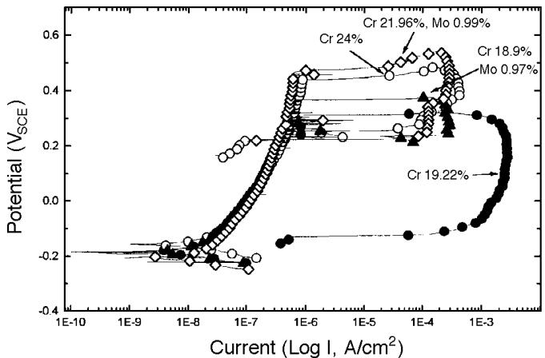  
FIGURE 1. Effect of chromium addition on ferritic SS polarization with and without molybdenum in 3% NaCl at 300°C (deaerated).

carried out as previously described to confirm the nature of the inclusions.

## RESULTS

## Macroelement

## (Chromium, Molybdenum) Pitting Studies

Chromium-containing alloys, where the chromium concentration > 12%, tend to form passive films that reduce the dissolution rate.6 The intactness of this film depends principally upon the concentration of chromium and also upon singular elements such as molybdenum, which are incorporated specifically to increase the film resistance in reducing acids and Cl–-containing environments. Polarization results of the experimental alloys in neutral Cl– (≈ pH 6.6) solutions indicated a steep and clear increase in $\mathrm { E _ { b } }$ as a function of chromium and molybdenum concentrations (Table 2). Figure 1 shows the relative effect on the polarization diagrams of increasing chromium concentrations with and without molybdenum. An increase from 19% Cr to 24% Cr gave an $\mathrm { E _ { b } }$ increase of 128 mV (25 mV/%Cr), while an increase of 3% Cr from 19% Cr-1% Mo to 22% Cr-1% Mo, increased E by 99 mV (33 mV/%Cr). This difference in $\mathrm { E _ { b } , }$ while not large, supported the concept of a synergistic effect between molybdenum and chromium with respect to $\mathbf { E _ { b } } .$ Chromium compounds form the principal part of any passive7 film in the form of chromic oxide $\mathrm { ( C r _ { 2 } O _ { 3 } ) }$ and chromic hydroxide (Cr[OH]3),8 and in increasing quantities depending upon the bulk steel chromium concentration.9

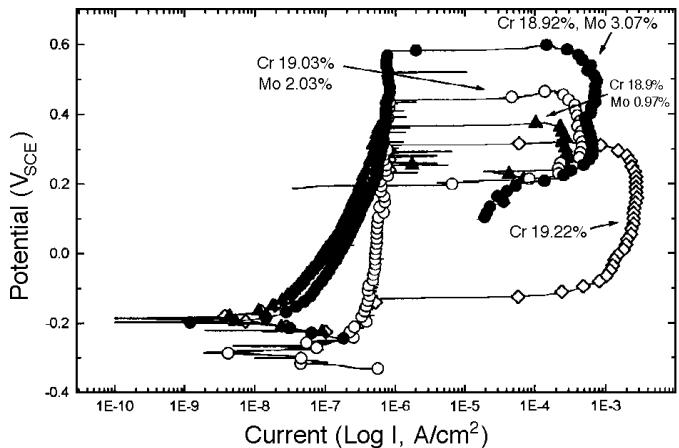  
FIGURE 2. Effectof molybdenum addition on ferritic SSpolarization in 3% NaCl at 300°C (deaerated).

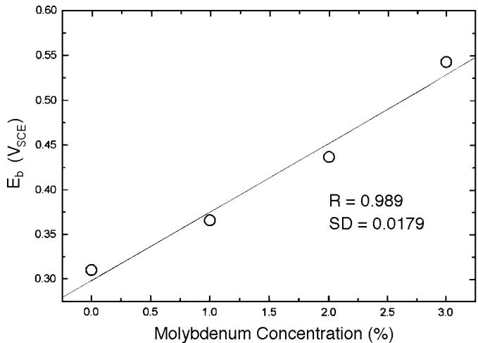  
FIGURE 3. E as a function of molybdenum concentration in ferritic SS (18% Cr to 19% Cr).

However, the contribution of molybdenum contrasts with that of chromium in that molybdenum specifically may exclude penetrating Cl– ions from the passive film,10 thus contributing to a reinforcement of the latter’s intactness. Figure 2 shows the evolution of the electrochemical polarization curve as a function of molybdenum addition for 18% Cr to 19% Cr ferritic SS. The relationship between $\mathrm { E _ { b } }$ and molybdenum concentration was almost linear over this range (Figure 3).

## Passive Film Composition

Results of the polarization data were interpreted according to the surface elemental analysis provided by the investigations using electron spectroscopy for chemical analysis (ESCA, Table 3). As described in numerous studies, the passive film contained principally $\mathrm { { C r } _ { 2 } { O } _ { 3 } . }$ Figure 4 shows the chromium, iron, molybdenum, and oxygen surface elemental profiles of Heat F19-3. The exponential increase in iron after ≈ 1 min of sputtering pinpointed the passive film-solid metal interface, while discrete peaks of oxygen (maximum 80%), molybdenum (maximum 0.26%), and chromium (maximum 35%) appeared within the passive film itself. Results presented in Table 3 confirmed that the maximum chromium concentration in the passive film was a function of the bulk concentration, as shown by Boudin, et al.9 The passive films under free corrosion conditions in aerated 3% NaCl solution after 24 h immersion were estimated to vary between 25 Å to 30 Å in thickness (Table 3).

Distribution of the element maxima with depth was remarkably consistent between the heats. Results presented in Table 3 show that, while oxygen and molybdenum achieved their maxima within the passive film in the outer extremity at a depth of $\approx 5 \mathrm { \AA } .$ , the chromium passive film concentration maximum occurred at around 12 Å to 16 Å. The film growth reactions in all cases were assumed to follow the overall scheme where the hydrated metal ions eventually formed stable oxides that underwent a condensation reaction to form a compact surface barrier layer generally described as:

$$
2 \mathrm { C r } \big ( 0 \big ) + 3 \mathrm { H } _ { 2 } \mathrm { O }  \mathrm { C r } \big ( \mathrm { I I I } \big ) _ { 2 } \mathrm { O } _ { 3 } + 6 \mathrm { H } ^ { + } + 6 \mathrm { e } ^ { - }\tag{1}
$$

$$
\mathrm { M o } \mathrm { ( 0 ) } \ + \ 2 \mathrm { H } _ { 2 } \mathrm { O }  \mathrm { M o } \mathrm { ( I V ) } \mathrm { O } _ { 2 } + \ 4 \mathrm { H } ^ { + } + 4 \mathrm { e } ^ { - }\tag{2}
$$

$$
\mathrm { M o ( I V ) O _ { 2 } } + 2 \mathrm { H _ { 2 } O }  \mathrm { M o ( V I ) O _ { 4 } } ^ { 2 - } + 4 \mathrm { H } ^ { + } + 2 \mathrm { e } ^ { - }\tag{3}
$$

However, Clayton and Lu suggested that Mo(VI)O2– is formed in a solid-state reaction from the $_ \mathrm { H _ { 2 } O }$ molecules, and OH– is omnipresent in the outer extremities of the passive film.11 The present data supported the hypothesis that excess $_ \mathrm { H _ { 2 } O }$ and OH– were present in the outer extremities of the passive film since the quantity of oxygen at a depth of 5 Å exceeded that required to satisfy the relationships: Cr:O (2:3) and Mo:O (1:4). The observed atomic ratio of $[ \mathrm { O } ] / [ \mathrm { C r } + \mathrm { M o } ]$ , however, was in the region of 5.2 instead of the expected 1.5, which suggested the outer layers of the passive film were hydrated strongly. However, Reactions 1 through 3 imply that a reduction in pH is associated with passive film formation, which would affect the solubility of the barrier constituents below pH 6.12

At a low chromium concentration and in the absence of molybdenum (Heat F19-0, Figure 5), the outer part of the passive film was enriched with ferrous/ferric ions, which increased with decreasing chromium concentration.13 It was deduced from Table 3 that the iron concentration in the outer layers of the passive film was to some degree inversely proportional to the pitting resistance equivalent (PREN). Compact passive films are associated with higher alloying and prevent the migration of ferrous ions to the film-electrolyte interface. Since corrosion of SS proceeds from the movement of cation and anion vacancies through the superficial layer, the electronic state of the film is of some critical importance. As expected, these results consistently showed that the passive film existed with an outer layer enriched in Mo(VI) with Fe(II/III) and an inner layer with Cr(III) predominating.11 In the absence of molybdenum and at higher alloying levels (Heat F24-0Nb), however, no evidence was found for the existence of film where $\mathrm { C r ^ { 3 + } }$ was distributed unevenly. The absence of iron in the outer layers in Heat F24-0Nb suggested the passive film in this case was relatively homogenous, with the sole exception of the highly hydrated outer perimeter.

TABLE 3  
Passive Film Constituents and Depth Location Maxima (Å from Surface) in Experimental Heats
<table><tr><td>Heat</td><td>[0] (at%)</td><td>0 (Depth)</td><td>[Cr] (at%)</td><td>Cr (Depth)</td><td>[Mo] (at%)</td><td>Mo (Depth)</td><td>[Fe] (at%)</td><td>Fe (Depth)</td><td>Total Film Thickness</td></tr><tr><td></td><td></td><td></td><td>31</td><td></td><td>0.7</td><td>5</td><td>6</td><td></td><td></td></tr><tr><td>F18-2Nb F19-0Nb</td><td>82 75</td><td>5 5</td><td>24</td><td>16 16</td><td>0</td><td>NA(A)</td><td>12</td><td>5 5</td><td>32 30</td></tr><tr><td>F19-1Nb</td><td>82</td><td>5</td><td>27</td><td>16</td><td>0.35</td><td>5</td><td>7</td><td>5</td><td>25</td></tr><tr><td>F19-3Nb</td><td>84</td><td>5</td><td>36</td><td>16</td><td>0.26</td><td>5</td><td>1</td><td>5</td><td>25</td></tr><tr><td>F22-1Nb</td><td>72</td><td>8</td><td>32</td><td>12</td><td>1</td><td>8</td><td>1</td><td>5</td><td>25</td></tr><tr><td>F24-0Nb</td><td>78</td><td>5</td><td>35</td><td>12</td><td>0</td><td>NA</td><td>0</td><td>5</td><td>25</td></tr><tr><td>F19-2Nb</td><td>82</td><td>5</td><td>31</td><td>16</td><td>0.71</td><td>8</td><td>7</td><td>5</td><td>26</td></tr><tr><td>F19-2CuNb</td><td>81</td><td>5</td><td>30</td><td>16</td><td>0.63</td><td>12</td><td>11</td><td>5</td><td>27</td></tr></table>

(A) NA, not applicable.

## Inclusion Distribution and Alloying (Aluminum)

Pitting corrosion in SS is subject to the type, number, and size of intermetallic inclusions present in the steel matrix.14 The inclusions in these experimental heats were dominated by large (> 8 µm) chromium and manganese oxides and somewhat smaller, fine niobium nitrides and carbides. Several experimental alloys (Table 4) contained aluminum at low levels to control residual oxygen and produce low inclusion-area (clean) steels, which were less subject to pitting. Secondary beneficial effects of aluminum were not defined as well. However, these may be associated with nitride formation15 in stabilized steels where more niobium or titanium is made available for carbide and sulfide suppression.

To identify the pit origins in the SS, short polarizations of the highly polished alloys were carried out. In all cases, the sweep was arrested before severe damage of the steel matrix occurred, thus leaving the initiation sites relatively undamaged.

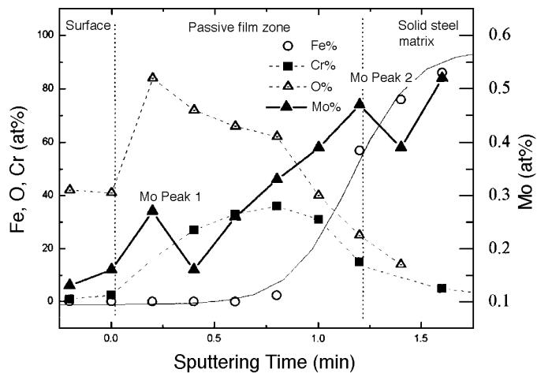  
FIGURE 4. XPS depth profile of a ferritic SS containing 3% Mo.

These initiation sites were identified subsequently as exclusively associated with complex inclusions. The benefit of performing such experiments to identify inclusion-initiated pitting has been described in detail by Pickering and Frankenthal.16 Figure 6 shows $\mathrm { { C r } _ { 2 } O _ { 3 } }$ and alumina $\left( \mathsf { A l } _ { 2 } \mathbf { O } _ { 3 } \right)$ oxide inclusions, the metal interfaces of which were dissolved partially during the short polarization sweep. The $\mathrm { { A l } _ { 2 } \mathrm { { O } _ { 3 } } }$ inclusion in Figure 6 is shown to be partially surrounded by a dark surface stain, which was probably a ferrous hydroxide (FeOOH) corrosion product (EPMA). Figure 7 shows the partial crevice left by the dissolution of a manganese sulfide/silicon dioxide (MnS/ $\mathrm { S i O _ { 2 } } )$ complex inclusion. Surface analysis revealed that the manganese oxidized to manganese dioxide $\left( \mathbf { M n O } _ { 2 } \right)$ or manganous hydroxide $\left( \mathrm { { M n } [ \mathrm { { O H } ] _ { 2 } } } \right)$ . The latter compound is more stable12 and is detected after partial dissolution of MnS.17

Electrochemical studies of a series of experimental heats with the same macroelemental composition (i.e., 19% Cr, 2% Mo) revealed that even at low-sulfur concentrations (30 ppm), the overall number of inclusions determined the pitting resistance. Table 4 provides compositions of the heats examined for microelement variation. The first four heats (Heats

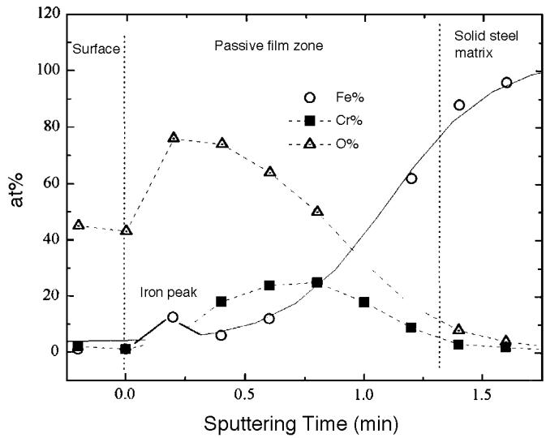  
FIGURE 5. XPS depth profile of a ferritic SS in the absence of molybdenum.

F19-2[a] through [d]) were identical in composition with the exception of the oxygen, aluminum, and inclusion content. Figure 8 presents the distribution of the pitting potentials of these heats as a function of inclusion content. Statistical data over multiple polarizations, where $\mathbf { n } = ( 3 , . . . , 5 )$ , showed $\mathrm { E _ { b } }$ was related highly to the inclusion content. Physical examination of the specimens showed that the large oxide inclusions surrounded by sulfide shells were the most frequent site of corrosion initiation. Linear regression of the 18 polarization sweeps showed that a power relation existed between $\mathrm { E _ { b } }$ and the inclusion density (C, /mm2) where:

$$
\mathrm { E _ { b } } = 0 . 6 4 5 - 0 . 1 0 5 \times \mathrm { l o g _ { 1 0 } } ( \Psi )\tag{4}
$$

No effort was made to distinguish statistically between the types of inclusions at high- and lowinclusion densities. However, qualitative analysis showed that manganese-chromium oxides dominated when the steel contained trace quantities of aluminum. While at higher aluminum concentrations, $\mathrm { { A l } _ { 2 } \mathrm { { O } _ { 3 } } }$ was represented strongly. Since the sulfur, chromium, molybdenum, and niobium in Heats F19-2(a) through (d) remained constant, the $\mathrm { E _ { b } }$ trend could be interpreted exclusively in terms of the oxide content.

## Stabilization Strategies in Welded Materials

The corrosion resistance limitation of SS weld sections is a problem of critical importance where the principal areas of corrosion interest are:18 (1) sensitization through grain-boundary chromium depletion; (2) the appearance of secondary phases; and (3) surface heat tinting through ineffective gas shielding. While all heats were examined in the

welded and polished state (Table 1), the effect of surface tinting was observed in only a limited number (Table 4).

Weld metal transverse microstructures of all test specimens showed large grains with columnar structure (evidence of epitaxial growth). In the HAZ, adjacent to the fusion line, coarsened grains were observed. These were significantly larger than those of the base metal. No surface defects or other subsurface abnormalities were observed in any polished transverse weld sections. To establish the effect of welding on corrosion resistance, all heats listed in Table 1 were welded, polished to 600 grit as previously, and subjected to electrochemical polarization in neutral 3.5% NaCl. In all cases, $\mathrm { E _ { b } }$ of the welded materials was significantly lower than those of the parent base metal, following no discernible trend according to chromium or molybdenum content. The niobium content in these welded steels (Table 1), of at least 0.22% $( \mathrm { N b } / [ \mathrm { C } + \mathrm { N } ] > 9 . 2 )$ , did not alleviate the difference in $\mathrm { E _ { b } }$ between the unwelded base metal and the polished welds.

To identify the weld region with the highest susceptibility to localized attack, several specimens were polished to 0.05 µm and subsequently were polarized according to the schema outlined above. After recovery from the electrochemical cell, these specimens were etched electrochemically in 50% nitric acid $\mathrm { ( H N O _ { 3 } ) }$ for 3 min at a potential of 3 V to reveal the grain structure around the pit and, more critically, the distance of the pit from the fusion line. However, some morphological distinctions were possible between the alloys. Figure 9 shows the simple form of a pit formed in the HAZ of Heat F22-1Nb (PREN = 24.5). The light $\mathrm { H N O } _ { 3 }$ etch revealed that grain boundaries in the immediate proximity to the pit were more prone to dissolution than the inclusions, which suggested that, even in a niobium-stabilized alloy, some sensitization was possible. In contrast with the highly alloyed heat, however, F18-2Nb (PREN = 23, Figure 10) showed a veil form of primary and secondary pits, which evolved from lateral growth of a single pit. Examination of weld transverse sections showed development of the side lobes commonly associated with this kind of pit develop ment (Figure 11).19 Heats with lower alloy contents (e.g., F18-2Nb) were subject to lateral pit growth producing the veil-type morphology demonstrated in Figure 10, while higher alloys (e.g., F22-1Nb) were more prone to a simple pit morphology with no evidence of such a complex expansion. Observation of the highly-polished, pitted, and ultimately $\mathrm { H N O } _ { 3 ^ { - } }$ etched welds showed the pitting location exclusively in the HAZ ≈ 600 mm from the fusion line (Figure 12). This simple observation defined the HAZ as the most favorable location for pit propagation when unaffected by the usual surface constraints associ ated with welding. However, no evidence was

TABLE 4  
Compositions in Type 444 SS Heats for Comparison of Minor Alloying Element Effects(A) (Basic Composition: 19% Cr, 2.03% Mo, 0.26% Si, 0.27% Mn, 0.002% P)
<table><tr><td>Heat</td><td>C (ppm)</td><td>S (ppm)</td><td>Stabilizing Element</td><td>AI (ppm)</td><td>0 (ppm)</td><td>N</td><td> $N b ( + T i ) / C + N$ </td><td>Inclusions (/mm²)</td></tr><tr><td>F19-2Nb (a)</td><td>90</td><td>30</td><td> ${ \sf N b } = 0 . 2 3$ </td><td>0</td><td>360</td><td>NA(B)</td><td>NA</td><td>413</td></tr><tr><td>F19-2Nb (b)</td><td>110</td><td>30</td><td> ${ \sf N b } = 0 . 2 3$ </td><td>0</td><td>360</td><td>0.014</td><td>9.2</td><td>164</td></tr><tr><td>F19-2Nb (c)</td><td>100</td><td>30</td><td> ${ \sf N b } = 0 . 2 3$ </td><td>56</td><td>28</td><td>0.006</td><td>14.3</td><td>65</td></tr><tr><td>F19-2Nb (d)</td><td>90</td><td>30</td><td> ${ \sf N b } = 0 . 2 3$ </td><td>1,350</td><td>22</td><td>0.007</td><td>14.3</td><td>19</td></tr><tr><td>F19-2T(C)</td><td>90</td><td>30</td><td> $\Gamma \mathrm { i } = 0 . 2$ </td><td>0</td><td>60</td><td>0.008</td><td>11.76</td><td>NA</td></tr><tr><td>F19-2Nb(C)</td><td>100</td><td>30</td><td> ${ \sf N b } = 0 . 2 2$ </td><td>0</td><td>360</td><td>0.009</td><td>12.94</td><td>NA</td></tr><tr><td>F19-2NbT(C)</td><td>80</td><td>30</td><td> ${ \sf N b } = 0 . 1 5$   ${ \bar { \mathsf { T i } } } = 0 . 0 2 6$ </td><td>0</td><td>160</td><td>0.009</td><td>10.35</td><td>NA</td></tr></table>

(A) Comparative inclusion effects on type 444 SS were observed for Heats (a) to (d) (Figure 8).  
(B) NA, not applicable.  
(C) Welded specimens.

obtained for the condition known as knife-line attack, which has been observed in high-carbon titanium- and niobium-stabilized steels. The carbon maximum of 130 ppm in these experimental steels was clearly too low.

## Effect of Surface State and Stabilization on Weld Corrosion

In contrast with the preceding observations, which were carried out on polished specimens (relatively ideal surface conditions) ferritic SS weld corrosion is affected largely by industrial considerations. Site fabrication problems often are associated with shield gas effectiveness, cooling rate, and the avoidance of weld-pool contamination. Both synthetic heat-treated specimens and actual welds acquire heat tints, which are characterized by chromium and iron oxides.20 Under-scale chromium depletion of the metal-oxide interface results in thin and ineffective passive films with enhanced corrosion susceptibility. A study of the effect of the thickness and composition of these scales indicated a temperature-time relation between 800°C to 1,200°C, which associated chromium depletion with temperature and the consequential decrease in corrosion resistance.21

Since stabilization with titanium and niobium is effective in reducing classical weld sensitization, a comparative study was designed to examine the effectiveness of single and dual alloying using these elements to control weld oxidation and subsequent corrosion susceptibility. The steel compositions of three grades of type 444 SS with niobium-, titanium-, and Nb + Ti stabilization are presented in Table 4. With the exception of the stabilizing elements, these steels’ only significant variation in composition was in oxygen concentration, which coincided with titanium addition. Furthermore, titanium concentrations appeared, to some degree, to vary inversely with oxygen level. In contrast, niobium addition provoked no such changes in oxygen concentration.

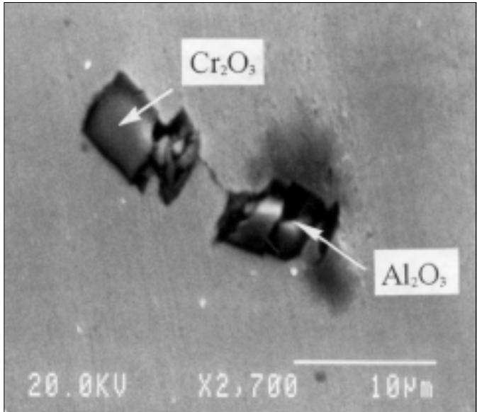  
FIGURE 6. SEM micrograph of common oxides in type 444 SS after corrosion initiation but not propagation.

All three type 444 ferritic SS heats were stabilized to levels above $[ \mathrm { N b } + \mathrm { T i } ] / [ \mathrm { C } + \mathrm { N } ] = 1 0$ , which is considered adequate for 19% Cr alloys with relatively low carbon levels (\~ 100 ppm). The polarization behaviors of three surface states: as-welded, pickled, and polished are presented in Figures 13 through 15. Pickling was carried out using a proprietary process with sulfuric acid $\mathrm { ( H _ { 2 } S O _ { 4 } ) }$ and fluoride salts. None of the as-welded steels exhibited any passive region, while the only passive member of the pickled welds was the dual-stabilized steel. All of the polished weld materials demonstrated a passive region (up to a minimum of $0 . 2 5 \mathrm { V } _ { \mathrm { s c E } } )$ . In general terms, the polarization diagrams (Figures 13 through 15) indicated the high net corrosion susceptibility of the as-welded materials, followed to a lesser degree by the pickled welds, and finally, the most intact surface: the pol-

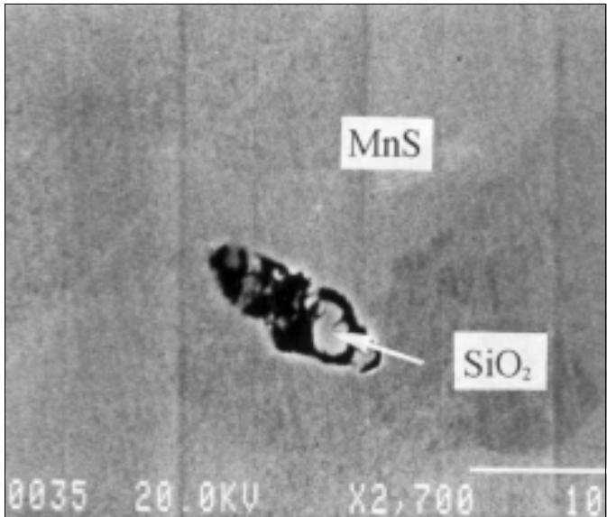  
FIGURE 7. SEM micrographofan oxysulfide inclusion intype444SS after corrosion initiation but not propagation.

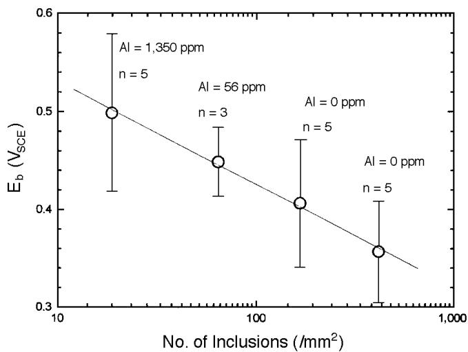  
FIGURE 8. Effect of increasing inclusion content on $E _ { b }$ in 3% NaCl at 300° C (deaerated).

ished welds. While addition of titanium increased $\mathrm { E _ { b } }$ to a slightly greater degree than niobium addition, dual stabilization with low titanium and a proportionately lowered niobium provided the highest value of $\mathrm { E _ { b } }$

Direct comparison of the results was complicated by the absence in many cases of the principle characteristic of SS corrosion, namely $\mathrm { E _ { b } , }$ , upon which much previous work has been based. Therefore, results are summarized in Table 5 where, in lieu of a comparison of $\mathrm { E _ { b } }$ values according to heat and surface state, a measure of their relative resistance to corrosion is provided by the current density (a selected potential), which, in this case, was 0 VSCE. Table 5 shows that in all states (as-welded, pickled,

and polished) dual stabilization provided the lowest current density.

Surface depth profiling of the heat-tinted metal surfaces revealed a layer of iron oxide (probably ferric oxide $\left[ \mathrm { F e } _ { 2 } \mathrm { O } _ { 3 } \right] )$ obscuring the surface, which was accompanied by chromium depletion at the oxide scale-solid metal matrix interface. It was concluded that chromium was evaporated during the welding process, and its replacement in the passive film subsequently was hindered by scale formation. Since the scale oxide was extremely porous and hydroscopic, it was assumed that post-weld active behavior of the steel occurred through this region, analogous to grain-boundary sensitization.

Post-polarization inspection of the welded metal specimens showed a distinct difference in surface aspect. While the polished specimens were subject to localized surface pitting with deep pits usually aligned with the weld, the pickled and as-welded specimens were subject to uniform corrosion of the HAZ, which removed a large quantity of surface oxide immediately above the metal (revealing bright metal underneath). This oxide removal was most pronounced in the HAZ immediately adjacent to the fusion line.

## DISCUSSION

Ferritic SS such as type 444 SS (19% Cr-2% Mo) display good corrosion resistance compared to other medium-grade SS.1,22 As with all SS alloys, however, optimization necessitates taking into account not only the potential applications but fabrication constraints, including cold work and welding, which degrade effectiveness of the base metal. In consequence, a given application requires some assessment of both macro- (chromium and molybdenum) and micro- (sulfur, carbon, nitrogen, and oxygen) effects which, for economic reasons, favor minimum limits for chromium and molybdenum while controlling the residual elements with a combination of clean steel technology and microalloying.

## Macroelement Effects

The relationship between SS content and the resultant actual corrosion resistance in a given environment is a question of considerable philosophical and commercial interest. With a number of important exceptions, the PREN permits a ranking of corrosion resistance according to alloy content. In austenitic SS, Alfonsson and Qvarfort have shown that several linear correlations between chromium, molybdenum, and nitrogen contents and pitting temperatures are possible where the weighting factors were adjusted to take into account the principal effects on the metallurgical structure and passive film.23 The most frequent citations require a weighting factor of 3.3 for molybdenum and 16 for nitrogen (PREN = %Cr +

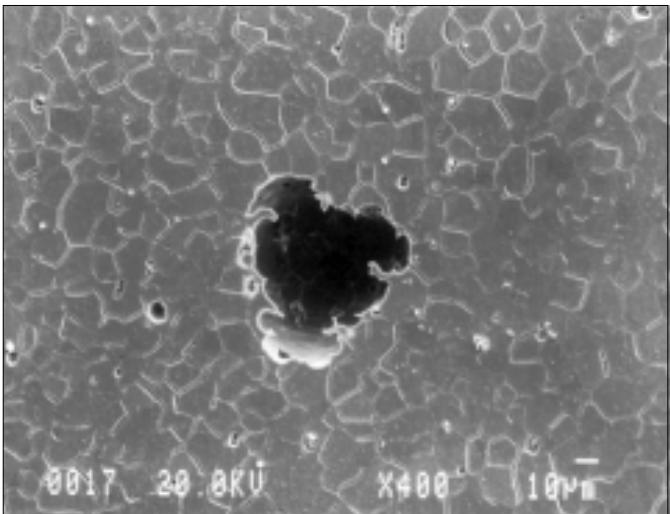  
FIGURE 9. SEM micrographofasimplepitin a22%Cr-1%Moferritic SS weld.

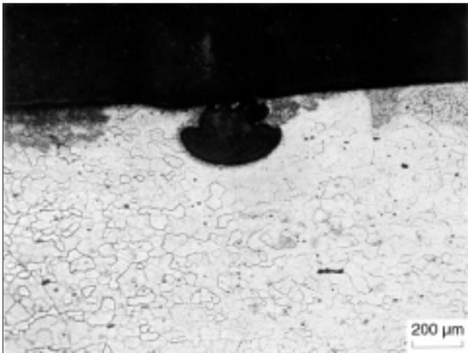  
FIGURE 11. Optical micrographofpittransversesection in a 18%Cr-2% Mo ferritic SS weld

3.3% Mo + 16% N). In ferritic SS, however, the weighting factor for molybdenum is somewhat lower, and the contribution of nitrogen is omitted because of the low solubility of that element in a bodycentered cubic (bcc) matrix and the tendency to form nitrides, which are deleterious to corrosion resistance.

PREN values for the ferritic experimental alloys in this study (PREN = %Cr + x% Mo) were considered as a function of $\mathrm { E _ { b } }$ . Simple linear regression of these values provided an estimation of the degree of fit of the data in terms of the standard deviation (SD) and R-factor, as a function of the molybdenum weighting factor (x). Variation in the molybdenum weighting factor (x = 0 to 4) as a function of the degree of fit indicated that the optimal (x) value was ≈ 2.5 (Figure 16). Thus, the optimal equation for ranking intermediate-grade SS under these conditions was PREN = %Cr + 2.5% Mo. The $\mathrm { E _ { b } }$ data was recalculated subsequently in terms of this arrangement, and results are presented in Figure 17.

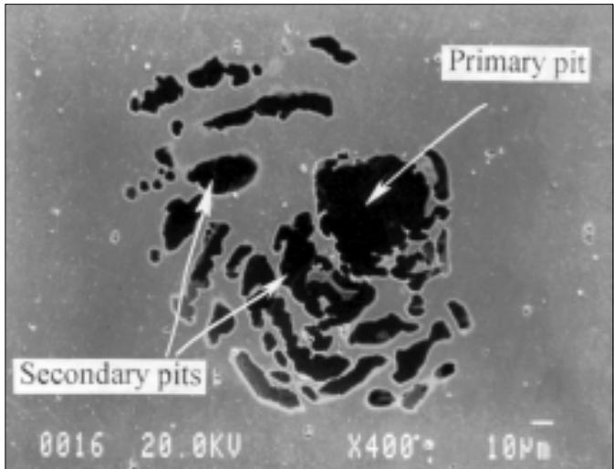  
FIGURE 10. Optical micrograph of a pit with a surface veil in a 18% Cr-2% Mo ferritic SS weld.

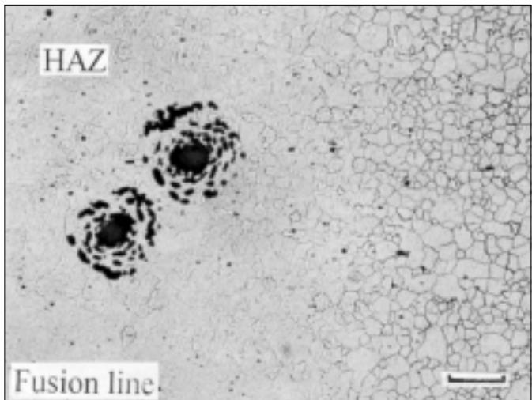  
FIGURE 12. Surface morphology ofpits located nearthe HAZ-weldmetal junction in a 18% Cr-2% Mo ferritic SS weld.

Given the optimal PREN expression and constant experimental conditions, a high degree of linearity was observed (Figure 17) between the chromium and molybdenum compositions of the different heats and their respective $\mathrm { E _ { b } }$ values. The simple regression line of these data was identified as:

$$
\begin{array} { r l } { \mathrm { E } _ { \mathrm { b } } = } & { { } - 0 . 2 8 3 + 0 . 0 3 0 5 \Big [ \% \mathrm { C r } + 2 . 5 \% \mathrm { M o } \Big ] } \end{array}\tag{5}
$$

Industrial PREN values of type 444 SS fall in the range from 23 to 24.5, which, given an average and predominantly oxide inclusion content of 300 $/ \mathrm { m m } ^ { 2 }$ with limited sulfur $( < 0 . 0 0 4 \% )$ , gives a theoretical $\mathrm { E _ { b } }$ of 0.45 $\mathrm { V } _ { \mathrm { S C E } }$ , according to Equation (5). This value corresponds well with those reported by Steigerwald, et al.,1 and Felloni, et al.,24 despite certain experimental differences with the present study and an absence of inclusion values for these data.

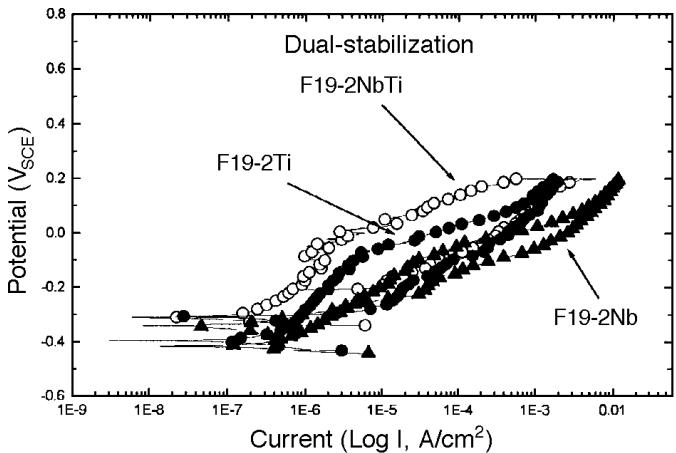  
FIGURE 13. Polarization of niobium- titanium- and dual-stabilized (Nb + Ti) variants of type 444 SS in 3% NaCl (deaerated) in the aswelded state.

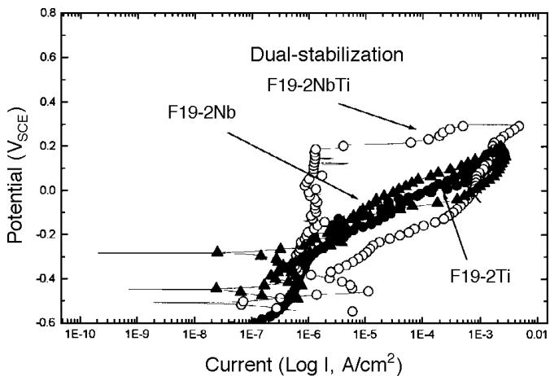  
FIGURE 14. Polarization of niobium- titanium- and dual-stabilized $( N b + T i )$ variants of type 444 SS in 3% NaCI (deaerated) in the pickled state. (Only the dual-stabilized material displayed passive behavior).

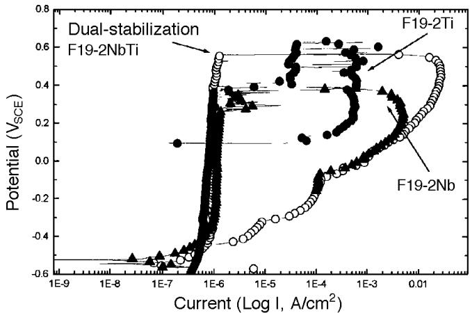  
FIGURE 15. Polarization of niobium- titanium- and dual-stabilized $( N b + T i )$ variants of type 444 SS in 3% NaCI (deaerated) in the polished state.

These changes in corrosion resistance correlated well with ESCA results of the passive film, which determined the compactness of the oxide layer (Table 3). The chromium and molybdenum content did not have a discernible effect on total thickness, which varied between 25 Å and 32 Å. Surface analytical data also revealed the presence of two molybdenum peaks (Figure 4) that accumulated at the outer extremity of the passive film (≈ 5 µm from the surface) and at the film-metal matrix interface. While the outer molybdenum Peak 1 located in the passive film was most prominent when the matrix contained 3% Mo, no actual increase in molybdenum concentration was observed (Table 3). This suggested that only the molybdate (MoO2–) accumulating at the film-metal interface (Peak 2) contributed to the corrosion resistance as detected by $\mathrm { E _ { b } } .$ , since higher molybdenum concentrations uniformly resulted in an increasing corrosion resistance (Figure 3).

The coincidence of molybdenum and the electronic bipolarity of passive films has been studied previously.11 However, speculation on the role of this bipolarity on the movement of anion and cation vacancies has not been confirmed by interpretable changes in the electronic state of the passive film semiconductor properties. In addition, the contribution of the other commonly found element (iron) in the passive film is somewhat ambiguous. At higher PREN values, iron in the extreme passive film layer was below detectable limits. Therefore, it is possible to conclude that the presence of iron in the passive film was merely a result of the diffusion of ferrous iron through the more porous films present on lower alloy materials. These cations subsequently oxidized to insoluble $\mathrm { F e ^ { 3 + } }$ salts in the high $\mathrm { E _ { b } }$ outer layer. The $\mathrm { F e ^ { 3 + } }$ then would occupy and block the external passive region since the pH and $\mathrm { E _ { b } }$ remained high.12 Once installed in the outer regions of the passive film, however, the iron contributes almost exclusively to the n-type behavior of the capacitance,13 which would tend to drive any corrosion propagation reaction in the early stages.

## Interaction of Alloying and Residual Elements

Despite the remarkable absence of the minor elements in expressions such as PREN, which purport to rank SS, their contribution to $\mathrm { E _ { b } }$ were not negligible (Figure 8). Since initiation is almost exclusively associated with galvanic couples or crevice geometries arising from the inclusion-metal interface, their type and number are critical to assessing the

TABLE 5  
Comparison Between Stabilization Modes in Type 444 SS in Neutral 3.5% NaCl as a Function of Exchange Current Density (A/cm²) at 0 $V _ { s c E }$
<table><tr><td>Surface State</td><td> $\bar { \mathsf { T i } } \bar { \mathsf { - } }$  Stabilized</td><td>Nb- Stabilized</td><td>Dual- Stabilization</td></tr><tr><td>Polished</td><td> $8 . 2 7 \times 1 0 ^ { - 7 }$ </td><td> $1 . 0 5 \times 1 0 ^ { - 6 }$ </td><td> $7 . 8 9 \times 1 0 ^ { - 7 }$ </td></tr><tr><td>Pickled</td><td> $5 . 0 \times 1 0 ^ { - 5 }$ </td><td> $4 . 0 2 \times 1 0 ^ { - 5 }$ </td><td> $9 . 7 \times 1 0 ^ { - 7 }$ </td></tr><tr><td>As-welded</td><td> $5 . 1 4 \times 1 0 ^ { - 5 }$ </td><td> $4 . 9 7 \times 1 0 ^ { - 4 }$ </td><td> $4 . 9 \times 1 0 ^ { - 6 }$ </td></tr></table>

corrosion resistance of the SS grade. In an attempt to model these variations, Yazawa, et al., has proposed an expression for a calculated breakdown potential $\mathrm { ( E _ { b c } ) }$ , which reflects the elemental composition of the different materials:25

$$
\begin{array} { c } { { \mathrm { E _ { b c } = 2 9 . 4 C r + 2 1 8 . 8 M o + 3 8 2 . 3 N b } } } \\ { { + 3 5 4 . 5 \mathrm { T i } - 3 8 . 2 \mathrm { C u } - 6 . 5 4 0 \mathrm { C } } } \\ { { + 1 , 3 6 4 . 8 \mathrm { N } - 4 2 1 . 7 } } \end{array}\tag{6}
$$

Values of $\mathrm { E } _ { \mathrm { b c } }$ for the experimental heats presented were calculated according to Equation (6), and the result is presented in Figure 18 compared with the actual breakdown data for the respective heats. The slopes of the two systems appeared to differ marginally. However, the calculated result spread according to the expression overlapped the experimental data (Equation [6]). Thus, it was concluded that the experimental data was in broad agreement with the expression, although the limits for this coincidence was limited by PREN values from 21 to 27. Outside this region, the expression engendered an increasing error.

Aside from the effects of selected minor elements on corrosion resistance, which is the object of Equation (6), it is essential to rationalize the effect of both the macroelements embodied in the theoretical evaluation of an alloy using the PREN and the negative contribution provided by the common occurrence of mixed oxide-sulfide inclusions. Oxide and sulfide inclusions have a deleterious effect on corrosion resistance of SS (Figure 8).26 The introduction of both aluminum and titanium into the melts had a clear suppression effect on oxygen and sulfur and consequently on C and corrosion resistance (Table 4, Figure 8). However, the extended use of this approach in industrial heats has well-defined metallurgical limitations. Furthermore, the total elimination of inclusions on an industrial scale is not practicable at present and in consequence, their effect on the corrosion resistance of a given SS may be considerable. An expression incorporating the contribution of the alloying elements (those with desirable properties) as well as the inclusion-forming residuals, therefore, is necessary to estimate the corrosion resistance of the steel. Therefore, a linear double regression is proposed which links $\mathrm { E _ { b } } , \Psi$ , and the PREN:

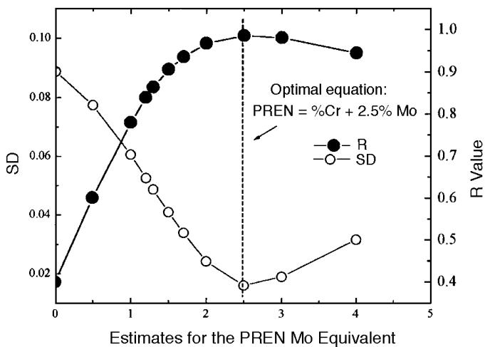  
FIGURE 16. Estimates for the PREN molybdenum equivalent weighting factor in intermediate-chromium ferritic SS

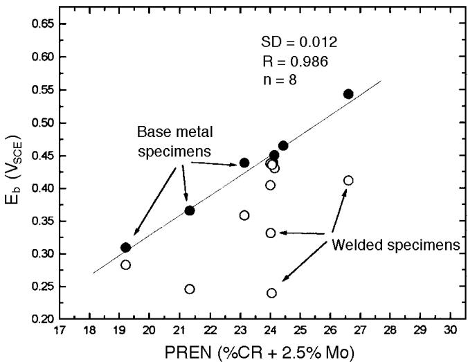  
FIGURE 17. Summary of $E _ { b }$ of parent metal and welded polished specimens as a function of variable PREN (PREN = %Cr + 2.5% Mo).

$$
\mathrm { E _ { b } = a _ { 0 } + a _ { 1 } \left( l o g _ { 1 0 } 4 \right) + a _ { 2 } P R E N }\tag{7}
$$

where the coefficients $\mathbf { a } _ { 0 } , \mathbf { a } _ { 1 } ,$ , and $\mathbf { a } _ { 2 }$ are unknown. The usual solutions for the three unknowns are provided by Equations (8) through (10):

$$
\mathbf { a } _ { 0 } \mathbf { n } + \mathbf { a } _ { 1 } \Sigma \Bigl ( \mathbf { L } \mathbf { o g } _ { 1 0 } \boldsymbol { \Psi } \Bigr ) + \mathbf { a } _ { 2 } \Sigma ( \mathrm { P R E N } ) = \Sigma \Bigl ( \mathbf { E } _ { \mathbf { b } } \Bigr )\tag{8}
$$

$$
\begin{array} { r l } & { \mathrm { \bf ~ a } _ { 0 } \Sigma \Bigl ( \log _ { 1 0 } \Psi \Bigl ) + \mathrm { \bf ~ a } _ { 1 } \Sigma \Bigl ( \log _ { 1 0 } \Psi ^ { 2 } \Bigl ) + \mathrm { \bf ~ a } _ { 2 } \Sigma \Bigl ( \log _ { 1 0 } \Psi \times \mathrm { P R E N } \Bigl ) } \\ & { \quad \quad \quad = \Sigma \Bigl ( \log _ { 1 0 } \Psi \times \mathrm { E } _ { \mathrm { b } } \Bigl ) } \end{array}\tag{9}
$$

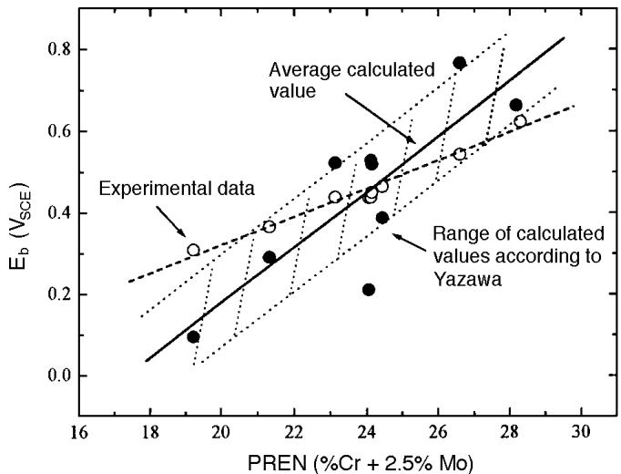  
FIGURE 18. Comparisonofexperimentalresultswiththosecalculated from the expression determined by Yazawa, et $a / . ^ { 2 5 }$

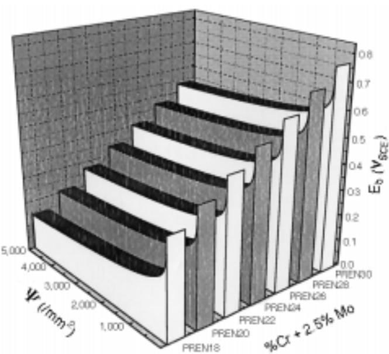  
FIGURE 19. Theoretical relationshipderivedfrom experimentaldata between the effect of inclusions and chromium and molybdenum concentrations (PREN) on $E _ { b } .$

$$
\begin{array} { r l } & { \mathrm {  ~ a _ 0 ~ } ^ { \sum } \Bigl ( { \mathrm { P R E N } } \Bigr ) + \mathrm {  ~ a _ 1 ~ } ^ { \sum } \Bigl ( { \log _ { 1 0 } } { \Psi } \times { \mathrm { P R E N } } \Bigr ) + \mathrm {  ~ a _ 2 ~ } ^ { \sum } \Bigl ( { \mathrm { P R E N } } ^ { 2 } \Bigr ) } \\ & { \qquad = \Sigma \Bigl ( { \mathrm { P R E N } } \times \mathrm { E _ { b } } \Bigr ) } \end{array}\tag{10}
$$

where the final result for 18 data sets (variations of PREN and C) are given by:

$$
\mathbf { E _ { b } } = \mathbf { - } 0 . 2 1 2 5 + 0 . 0 6 3 5 \left( \log _ { 1 0 } \Psi \right) - 0 . 1 0 5 \left( \mathbf { P R E N } \right)\tag{11}
$$

Figure 19 shows the calculated $\mathrm { E _ { b } }$ results for a range of PREN and C values. The data show that the critical region is from 0 inclusions/mm2 to 500 inclusions $/ \mathrm { m m } ^ { 2 }$ . An error certainly exists in that the contribution of the inclusions cannot be linear as suggested in Figure 19. It was anticipated that the breakdown influenced by C diminishes with increasing PREN values. Currently, however, no such information is available to estimate this effect.

Weld corrosion is one of the chief problems of SS. The discontinuities in crystal size and orientation, combined with intergranular carbide precipitation and HAZ tinting, almost invariably result in a reduction in corrosion resistance of the weldment. In consequence, the wide use of the stabilizing elements27 or titanium28 have much improved corrosion resistance of the HAZ. The results presented suggest that dual stabilization with both elements provides optimum corrosion resistance, as suggested by Grubb and Fritz.29 However, it is important to recognize that the titanium-substituted steel was more corrosion resistant than niobium-substituted steel, probably because of the precipitation of sulfur as insoluble titanium sulfide $\mathrm { ( T i . S ) }$ in addition to the more usual task of carbide stabilization.

In low $\mathbf { C } + \mathbf { N }$ materials, the expected calculation for titanium is $8 \mathrm { ~ x ~ } ( \mathrm { C } + \mathrm { N } )$ and niobium is $1 0 \mathrm { ~ x ~ } ( \mathrm { C } + \mathrm { N } )$ The reduced concentrations of both elements in the dual-stabilized heat (Table 4) provided a combined reduction in the $[ \mathrm { N b + T i } ] / [ \mathrm { C + N } ]$ ratio. Therefore, it was concluded that a synergistic effect was in effect, which provided a net increase in the weld corrosion resistance. This effect may have been because of the tendency of titanium to form insoluble sulfides and the partial suppression of oxides accompanied by the usual precipitation of carbides by the niobium.

The deleterious effect of weld tints on type 444 SS has been described in previous studies.30 The partial recovery of corrosion resistance after chemical elimination of the weld scale by pickling revealed that while the complete removal of the scale did not occur, the chromium-depleted layer clearly was reduced. The resulting reduction in the corrosion current density at 0 $\mathrm { V } _ { \mathrm { S C E } }$ clearly showed that some partial reestablishment of the passive film was possible, although full recovery was not observed (Table 5).

## CONCLUSIONS

❖ The corrosion performance of intermediate-grade ferritic SS was predictable using an expression incorporating both the alloying element concentrations as well as C.

❖ The suppression of oxysulfide inclusions, partially by process technology and partly by aluminum/titanium addition, was shown to provide a significant improvement in the corrosion resistance. However, no evidence was obtained for the effect of aluminum or titanium on the passive film.

❖ The dual-stabilized variant of type 444 ferritic SS rather than single stabilization with either niobium or titanium offered the best weld corrosion resistance where intergranular attack of the HAZ was the principal attack.

❖ The effectiveness of post-weld pickling was shown to be maximized in the case of dual-stabilized steels. This demonstrated the resistance of titanium carbide (TiC) and niobium carbide (NbC) to fluoride salts in acid solution during the pickling process and their subsequent contribution to the corrosion resistance in neutral Cl– environments.

## REFERENCES

1. R.F. Steigerwald, A.P. Bond, H.J. Dundas, E.A. Lizlovs, Corrosion 33 (1977): p. 279-295.

2. W. Gordon, A. Van Bennekom, Mater. Sci. Technol. 12 (1996): p. 126-131.

3. G. Wranglen, Corros. Sci. 14 (1974): p. 331.

4. T. Adachi, M. Nishikawa, K. Hayashi, I. Sugimoto, Nisshin Steel Tech. Rep. 9 (1992): p. 118-131.

5. J.E. Carew, A. Abdullah, Corros. Sci. 34 (1993): p. 217-231.

6. A.J. Sedriks, Corrosion 42 (1986): p. 376.

7. G. Okamoto, T. Shibata, Passivity of Metals Corrosion Monograph Series, eds. R.P. Frankenthal, J. Kruger (Pennington, NJ: The Electrochemical Society, 1978) p. 646.

8. G.P. Halada, D. Kim, C.R. Clayton, Corrosion 52 (1996): p. 36-46.

9. S. Boudin, C. Bombart, G. Lorang, M. Da Cunha Belo, “Depth Composition of Passive Films,” in Modifications of Passive Films, EFC Publication 12, Institute of Materials, eds. P. Marcus, B. Baroux, M. Keddam (London, England: Institute of Materials, 1994), p. 35.

10. C. Hubschmidt, H.J. Mathieu, D. Landolt, “Comparative Analysis by AES and XPS of Passive Films,” in Modifications of Passive Films, EFC Publication 12, Institute of Materials, eds. P. Marcus, B. Baroux, M. Keddam (London, England: Institute of Materials, 1994), p. 1.

11. C.R. Clayton, Y.C. Lu, J. Electrochem. Soc. 133 (1986): p. 2,465-2,473.

12. M. Pourbaix, Atlas of Electrochemical Equilibria in Aqueous Solutions (Houston, TX: NACE/CEBELCOR, 1974), p. 286.

13. N.E. Hakiki, S. Boudin, B. Rondot, M. Da Cunha Belo, Corros. Sci. 37 (1995): p. 1,809-1,822.

14. Z. Szklarska-Smialowska, A. Szummer, M. Janic-Czachor, Brit. Corros. J. 5 (1970): p. 159-161.

15. M. Colombie, A. Condylis, A. Desestret, R. Grand, R. Mayoud, Rev. Metal. 12 (1973): p. 949-961.

16. H.W. Pickering, R.P. Frankenthal, “Mechanism of Pit and Crevice Propagation on Iron and Stainless Steels,” in Localized Corrosion, eds. B.F. Brown, J. Kruger, F.W. Staehle (Houston, TX: NACE, 1974).

17. N.J.E. Dowling, C. Duret-Thual, G. Auclair, J.-P. Audouard, P. Combrade, Corrosion 51 (1995): p. 343-355.

18. S. Kou, Welding Metallurgy (New York, NY: Wiley Interscience, 1987).

19. P. Ernst, N.J. Laycock, M.H. Moayed, R.C. Newman, Corros. Sci. 39 (1997): p. 113-1,136.

20. J.R. Kearns, “Corrosion of Heat-Tinted Austenitic Alloys,” CORROSION/85, paper no. 50 (Houston, TX: NACE, 1985)

21. S. Turner, F.P.A. Robinson, Corrosion 45 (1989): p. 710-716.

22. T. Utsunomiya, I. Sugimoto, T. Adachi, Y. Uematsu, Nisshin Steel Tech. Rep. 70 (1994): p. 45-58.

23. E. Alfonsson, R. Qvarfort, Mater. Sci. Forum 111-112 (1992): p. 483-492.

24. L. Felloni, R. Fratesi, O. Ruggeri, G. Samogna, Corrosion 41 (1985): p. 169-177.

25. Y. Yazawa, S. Hasuno, Y. Sone, “Effect of Alloying Elements on Atmospheric Corrosion Resistance of Ferritic Stainless Steels,” Proc. Conf. Stainless Steels, June 10-13, 1991, Chiba (Chiyodaku, Tokyo: ISIJ Int., 1991), p. 337-342.

26. M.A. Baker, J.E. Castle, Corros. Sci. 33 (1992): p. 1,295-1,312.

27. C.A.C. Sousa, S.E. Kuri, Mater. Lett. 25 (1995): p. 57-60.

28. J. Honeycombe, T.G. Gouch, Brit. Corros. J. 18 (1983): p. 25- 34.

29. J.F. Grubb, J.D. Fritz, “Stabilization and Sensitization of Stainless Steel,” CORROSION/97, paper no. 185 (Houston, TX: NACE, 1997).

30. S. Azuma, H. Mikuki, J. Murayama, T. Kudo, Boshoku Gijutsu 39 (1990): p. 603-609.