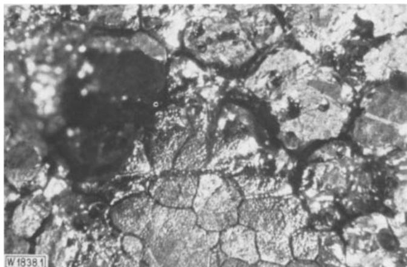
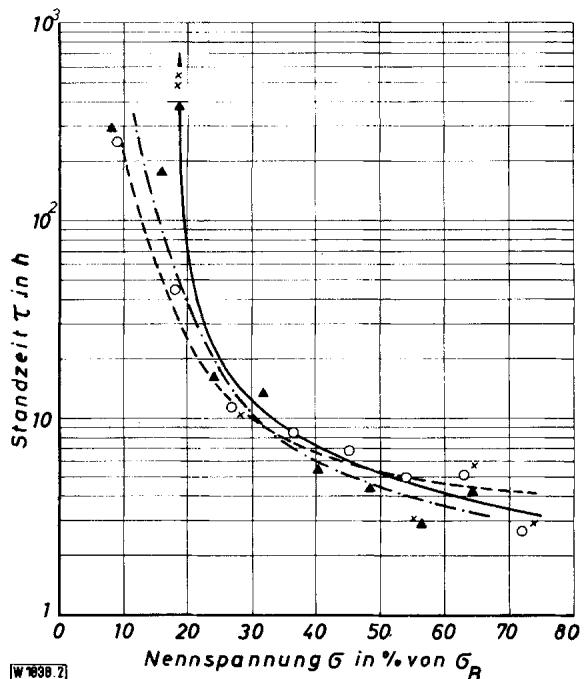
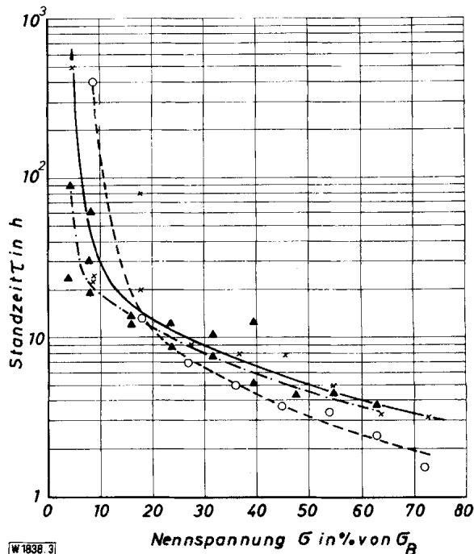
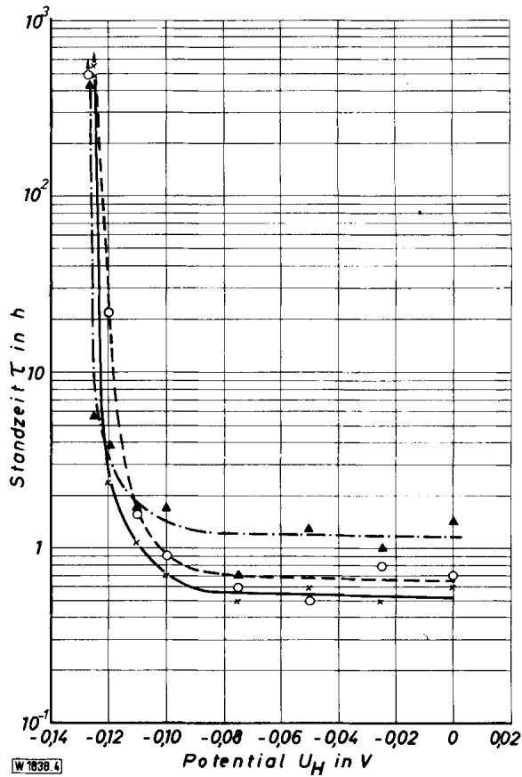
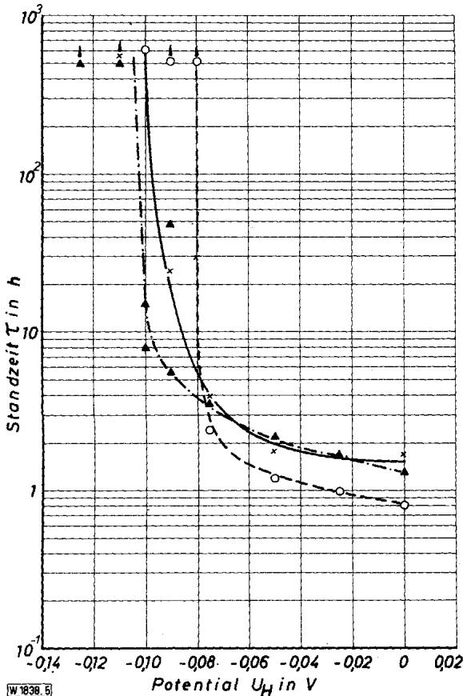

# Der Einfluß von Stickstoff auf die korrosionschemischen Eigenschaften lösungsgeglühter und angelassener austenitischer 18/10 Chrom-Nickel- und 18/12 Chrom-Nickel-Molybdän-Stähle

III. Loch- und Spannungsrißkorrosionsverhalten in wäßrigen Lösungen von NaCl und $\pmb { M } _ { \pmb { \mathrm { g } } } \mathbf { C l } _ { 2 } ^ { * } )$

Von G. Herbsleb und K.-J. Westerfeld

Mitteilung aus dem Forschungsinstitut der Mannesmann $\mathbf { A } \mathbf { G } ^ { * * } )$

## 1. Einleitung

In zwei vorausgegangenen Arbeitęn wurden das Ausscheidungsverhalten (1) und die Anfälligkeit gegen interkristalline Korrosion in Kupfersulfat-Schwefelsäure-Lösungen und in siedender 65%iger Salpetersäure (2) lösungsgeglühter (15 min $1 0 5 0 \mathrm { ~ } ^ { \circ } \mathrm { C } / \mathrm { W }$ sowie 15 min $1 3 0 0 ^ { \circ } \mathbf { C } / \mathbf { W } )$ und nachträglich angelassener (0,5 bis 10000 h 400 bis $8 5 0 ~ ^ { \circ } \mathbf { C } / \mathbf { L } )$ Chrom-Nickel-Stähle mit (Gew.-%) 0,019 bis 0,029 C, rd. $^ { 1 8 , 5 } { \sf C r } ,$ rd. 11 Ni und 0,022 bis 0,138 N sowie Chrom-Nickel-Molybdän-Stähle mit (Gew.-%) 0,020 bis 0,031 C, rd. 17,2 Cr, rd. 2,6 Mo, rd. 13 Ni und 0,028 bis 0,130 N beschrieben. Die Arbeiten über den Einfluß von Stickstoff auf das Korrosionsverhalten dieser Stähle wurden mit Untersuchungen über das Loch- und Spannungsrißkorrosionsverhalten in wäßrigen Lösungen von Natriumchlorid und Magnesiumchlorid abgeschlossen.

Die Lochkorrosion hochlegierter Stähle ist potentialabhängig und tritt erst oberhalb bestimmter Grenzpotentiale, die als Lochfraßpotentiale bezeichnet und fast ausschließ- lich zur Kennzeichnung einer Neigung dieser Werkstoffe zur Lochkorrosion herangezogen werden, auf. Hierbei ist zwischen Grenzpotentialen für die Lochbildung $( \mathbf { U _ { b } } )$ und Lochpassivierung $\bar { ( \mathbf { U _ { p } } ) }$ zu unterscheiden. Häufig wird in der Nähe des Lochfraßpotentials repassivierbare Lochkorrosion, die durch ein Grenzpotential $\bar { \mathbf { U } } _ { \mathbf { r } }$ gekennzeichnet werden soll, beobachtet. Daneben sind die Lochzahldichte sowie die Lochtiefe und -größe kennzeichnende Meßwerte der Lochkorrosion.

Für die Ermittlung der Lochzahldichte wurden in der Vergangenheit chemische Untersuchungsverfahren, z. B. das Eisen (III)-chlorid-Standard-Verfahren (3) und das Turnbullsblau-Verfahren (Indikator-Prüfung) (4-6) verwendet. Lochfraßpotentiale werden mit elektrochemischen Untersuchungsverfahren ermittelt, wobei die Meßschaltung die Untersuchungsergebnisse beeinflußt (7). Versuche mit potentiostatischer Außenschaltung sind entweder als potentiostatische Halteversuche (chronopotentiostatische Versuche), Wechselversuche oder potentiokinetische Versuche mit zeitlich ansteigendem und/oder abfallendem Potential zur Ermittlung von $\mathbf { U _ { b } } , \mathbf { U _ { r } }$ und ${ \bf { U _ { p } } }$ geeignet.

Halteversuche mit galvanostatischer Außenschaltung liefern als Meßwert ein unteres, als Lochpassivierungspotential $\mathbf { U _ { p } }$ anzusehendes Grenzpotential(8, 9). Durch Versuche mit geneigter Widerstandsgeraden kann die kathodische Teilstrom-Potential-Kurve bei einem chemisch geführten Korrosionsvorgang nachgeahmt werden (7-9).

Durch die Legierungselemente Chrom und Molybdän wird das Lochfraßpotential zu positiveren Werten verschoben, der Beständigkeitsbereich der Werkstoffe also erweitert. Durch Molybdän wird offenbar die Widerstandsfähigkeit der Passivschicht gegen den Angriff durch Chloridionen trainierbar"(7). Nickel und Mangan haben dagegen nur einen geringen Einfluß (10), jedoch können Einschlüsse von Mangansulfid und andere sulfidische oder gemischte oxidisch-sulfidische Einschlüsse als Lochkeime wirken (11).

An kornzerfallsanfälligen hochlegierten Stählen läuft die Lochkorrosion modifiziert als interkristalline Korrosion ab. Das Lochfraßpotential solcher Werkstoffe kann wesentlich unedler als im lösungsgeglühten Zustand sein (12).

Nach Untersuchungen in der Eisen(III)-chlorid-Lösung (3) und Ermittlung des Massenverlustes sowie der Lochzahl zeigen niedriggekohlte (0,007 und 0,013 Gew.-% C) austenitische Chrom-Nickel-Stähle mit Stickstoffgehalten von 0,165 und 0,24 Gew.-% bessere Beständigkeit gegen Lochkorrosion als solche mit gleichzeitig niedrigen Stickstoff-(0,001 Gew.-% N) und Kohlenstoffgehalten (13). Die austenitischen Stähle mit geringen Stickstoff- und Kohlenstoffgehalten enthielten jedoch noch δ-Ferrit, so daß die Werkstoffe vom Gefüge her nicht vergleichbar sind.

Durch weitere Untersuchungen wurde die Frage nach dem Einfluß von Stickstoff auf die Lochkorrosionsbeständigkeit chemisch beständiger Stähle nicht einheitlich beantwortet. Ein günstiger Einfluß von Stickstoff soll nur in besonders aggressiven Angriffsmitteln wie Eisen(III)- chlorid- und Hypochlorit-Lösungen vorliegen (14) und unter anderen Angriffsbedingungen kaum festzustellen sein (15). Jedoch soll Stickstoff die Lochkorrosionsbeständigkeit von austenitischen Chrom-Nickel-Stählen mit niedrigem Kohlenstoffgehalt, die gleichzeitig Molybdän und Silizium enthalten, in Meerwasser erhöhen (15, 16).

Durch Gewichtsverlustmessungen in Eisen(III)-chlorid-Lösung (3) und elektrochemische Untersuchungsverfahren - Ermittlung der Induktionszeiten durch Halteversuche bei Potentialen $\bar { \mathbf { U } } > \mathbf { U _ { \mathbf { b } } }$ und potentiokinetische Ermittlung der Lochfraßpotentiale (Potentialänderungsgeschwindigkeit $\mathbf { u } = 0 , 0 5 \ \mathbf { V } \cdot \dot { \mathbf { h } } ^ { - 1 } )$ in 5%iger Natriumchlorid-Lösung bei 40 und $8 0 ~ ^ { \circ } \mathrm { C } \mathrm { ~ - ~ }$ wurde eine mit zunehmendem Stickstoffgehalt zunehmende deutliche Verbesserung der Lochkorrosionsbeständigkeit niedriggekohlter, molybdänhaltiger, austenitischer Chrom-Nickel-Stähle mit $^ { 0 , 0 3 }$ bis 0,35 Gew.-%N gefunden (17, 18). Bei molybdänfreien Stählen, gleichfalls mit niedrigem Kohlenstoffgehalt, wurde ein solcher Einfluß nicht festgestellt. Dagegen wurde bei der Indikator-Prüfung (4-6) kein Einfluß von 0,2 Gew.-%N auf die Lochkorrosionsbeständigkeit molybdänhaltiger, austenitischer Chrom-Nickel-Stähle festgestellt (19).

Auch die transkristalline Spannungsrißkorrosion der chemisch beständigen austenitischen Chrom-Nickel-Stähle in Chloridlösungen ist potentialabhängig (20), jedoch ist hier als zusätzlicher Parameter die Zugspannung zu berücksichtigen. Das Grenzpotential der Spannungsrißkorrosion ist zugspannungsabhängig, entsprechend gibt es eine potentialabhängige kritische Zugspannung (21). Die kritischen Grenzpotentiale werden durch Erhöhen des Molybdängehaltes (22), vor allem aber des Nickelgehaltes (23), beeinflußt. Die Beständigkeit austenitischer Chrom-Nickel-Stähle in der für Prüfzwecke üblicherweise verwendeten siedenden 42%igen Magnesiumchlorid-Lösung (Siedepunkt $1 4 4 ^ { \circ } \mathrm { C } )$ wird durch ansteigende Kohlenstoffgehalte deutlich erhöht (24), Stickstoff in Gehalten von 0,026 bis 0,208 Gew.-% hat dagegen keinen Einfluß (19, 24–26). Eine hohe Beständigkeit austenitischer Chrom-Nickel-Stähle wird dagegen durch Absenken des Stickstoffgehaltes auf $\mathbf { \chi } _ { < 0 , 0 2 }$ Gew.-% N erreicht (27). Hierauf hat offenbar der Kohlenstoffgehalt einen Einfluß, da der günstige Einfluß des niedrigen Stickstoffgehaltes erst bei höheren Kohlenstoffgehalten um 0,06 Gew.-% C auftritt (28).

Bei der Untersuchung der Anfälligkeit gegen Spannungsrißkorrosion sind neben elektrochemischen auch chemische Veränderliche zu beachten. Chemische Untersuchungen ohne Potentialkontrolle sind problematisch, wenn der Elektrolyt kein definiertes Redoxsystem enthält. Die Untersuchung von Chrom-Nickel-Stählen in Magnesiumchlorid-Lösungen ist nur wenig elektrochemisch kontrolliert. Chemische Verfahren sind für Vergleichs- und Reihenuntersuchungen brauchbar, jedoch ist für eine bessere Unterscheidung der Versuchsergebnisse eine elektrochemische Kontrolle, z. B. durch potentiostatische Halteversuche, zur Ermittlung der Potentialabhängigkeit notwendig.

## 2. Versuchswerkstoffe und Versuchsdurchführung

Die untersuchten Stähle wurden bereits beschrieben (1). Zur besseren Verständlichkeit sind die chemischen Zusammensetzungen der Werkstoffe, die als gewalzte Bleche von 3 mm Dicke und Rundmaterial (12 mm Ø) vorlagen, nochmals in der Tabelle 1 angegeben. Um eine gleichmäßige und einheitliche Korngröße zu erreichen, wurden die für Lochkorrosionsversuche verwendeten Bleche um 20% bis auf eine Enddicke von $^ { 2 , 4 }$ mm kaltverformt und wärmebehandelt. Proben für die Indikator-Prüfung hatten die Abmessung $5 0 \times 1 5$ mm, solche für elektrochemische Untersuchungen die Abmessung 15 x 15 mm.

Hinsichtlich des Lochkorrosionsverhaltens wurden folgende Wärmebehandlungszustände untersucht:

a) Indikator-Prüfung

15 min 1050 °C/W (Stähle A bis F)

15 min 1050 °C/W + 3000 h 400 bis 850 °C/L (Stähle A bis F)

b) elektrochemische Versuche

15 min 1050 °C/W (Stähle A, C, D, F)

15 min 1300 °C/W (Stahl A)

15 min 1050 °℃/W + 300 h 600 °C/L

(Stähle A und C)

15 min $\lvert 0 5 0 \ ^ { \circ } \mathrm { C } / \mathrm { W } + 3 0 0 \ \mathrm { h } \ 6 5 0 \ ^ { \circ } \mathrm { C } / \mathrm { L }$

(Stähle D und F).

Die wärmebehandelten Proben wurden in Salpetersäure-Salzsäure-Beize gebeizt, in Wasser und Aceton gewaschen und luftpassiv für die Versuche verwendet.

Für Versuche zur Spannungsrißkorrosion wurde Rundmaterial der Stähle A bis F in Abschnitte von 85 mm Länge unterteilt, einheitlich 15 min $1 0 5 0 \mathrm { ~ } ^ { \circ } \mathbf { C } / \mathbf { W }$ lösungsgeglüht und Rundzerreißstäbe hergestellt. Auch bei sorgfältiger mechanischer Bearbeitung ist eine oberflächliche Kaltverformung unvermeidlich. Um diesen störenden Einfluß auszuschalten, wurde eine etwa 0,2 mm dicke Oberflächenschicht in einem Schwefelsäure-Phosphorsäure-Polierelektrolyten abgetragen. Der Übergang zwischen den Abdichtungen der Probe bis zur Prüfstrecke wurde durch Auftragen und Einbrennen eines Epoxidharzes zusätzlich geschützt. Die Proben hatten einen Durchmesser von rd. 3,5 mm, dies entspricht einem Probenquerschnitt von rd. 10 mm².

Die Lochkorrosionsbeständigkeit in der Indikator-Prüfung (4-6) wurde in wäßrigen $1 0 ^ { - 3 }$ bis 5 m Natriumchlorid-Lösungen mit Zusatz von $\mathrm { j e } \overline { { 3 } } \cdot 1 0 ^ { - 2 }$ m $\mathrm { K } _ { 3 } [ \mathrm { F e } ( \mathrm { C N } ) _ { 6 } ]$ und ${ \bf K } _ { 4 } [ { \bf F e } ( { \bf C N } ) _ { 6 } ]$ an jeweils drei Vergleichsproben, die sich in mit 50 ml Lösung gefüllten, abgedeckten Glasschalen befanden, geprüft. Solche Proben, die nach 24 h keine blauen Pünktchen zeigten, wurden weitere 24 h in der Lösung belassen. Der Korrosionsangriff wurde durch folgende Arten gekennzeichnet (5):

Art 0: keine blauen Punkte; lochkorrosionsbeständig.

Art 1: sehr wenige kleine Pünktchen, die mit der Zeit nicht größer werden und mikroskopisch keine Lochkorrosion erkennen lassen; repassivierbare Lochkorrosion.

Art 2: wenige kleine Pünktchen, die mit der Zeit nicht merklich größer werden und mikroskopisch schwache Lochkorrosion erkennen lassen; schwache Lochkorrosion.

Art 3: blaue Pünktchen, die mit der Zeit größer werden; Lochkorrosion.

Tabelle 1. Chemische Zusammensetzung der Versuchswerkstoffe
<table><tr><td>Stahl</td><td>%C</td><td>%Si</td><td>% Mn</td><td>% P</td><td>% S</td><td>% Cr</td><td>% Ni</td><td>% Mo</td><td>%N</td></tr><tr><td>A</td><td>0,019</td><td>0,49</td><td>1,01</td><td>0,017</td><td>0,007</td><td>18,60</td><td>11,05</td><td>0,03</td><td>0,022</td></tr><tr><td>B</td><td>0,029</td><td>0,40</td><td>1,10</td><td>0,015</td><td>0,006</td><td>18,62</td><td>10,30</td><td>0,02</td><td>0,030</td></tr><tr><td>C</td><td>0,023</td><td>0,60</td><td>0,95</td><td>0,017</td><td>0,004</td><td>18,40</td><td>11,15</td><td>0,03</td><td>0,138</td></tr><tr><td>D</td><td>0,020</td><td>0,53</td><td>1,67</td><td>0,018</td><td>0,008</td><td>17,35</td><td>13,70</td><td>2,69</td><td>0,044</td></tr><tr><td>E</td><td>0,031</td><td>0,33</td><td>1,43</td><td>0,017</td><td>0,009</td><td>17,35</td><td>12,50</td><td>2,58</td><td>0,028</td></tr><tr><td>F</td><td>0,028</td><td>0,53</td><td>1,69</td><td>0,018</td><td>0,008</td><td>17,12</td><td>13,60</td><td>2,62</td><td>0,130</td></tr></table>

Tabelle 2. Ergebnisse der Indikator-Prüfung nach Wärmebehandlung 15 min $1 0 5 0 ^ { \circ } C / \mu$ und 15 min $1 0 5 0 ^ { \circ } \mathrm { C } / \mathrm { W } + 3 0 0 0$ h 400 bis 850 °C/L in 10−³ m bis 5 m Natriumchlorid-Lösung
<table><tr><td></td><td>Stahl NaCl-Konzen- tration</td><td>Lösungs- glühung  $\mathrm { \overline { { 1 0 5 0 } } } ^ { \circ } \mathrm { \overline { { C } } / \Delta w }$ </td><td> ${ \pmb q 0 0 } ^ { \circ } \breve { \mathsf C }$ </td><td>Anlaßglühung 450 °℃</td><td> ${ \mathfrak { s o o } } ^ { \circ } { \mathbf { C } }$ </td><td></td><td> ${ \mathfrak { s s o } } ^ { \circ } { \mathfrak { C } }$ </td><td>600°C</td><td> ${ \bf \delta } \otimes { \bf 0 } ^ { \circ } { \bf C }$ </td><td></td><td> $7 0 0 ^ { \circ } \mathbf { C }$ </td><td> ${ 7 5 0 } ^ { \circ } { \bf C }$ </td><td> ${ 8 0 0 } ^ { \circ } C$ </td><td> ${ 8 5 0 ~ ^ { \circ } C }$ </td></tr><tr><td>A</td><td>[Mol/1]  $1 0 ^ { - 3 }$ </td><td>0</td><td>一</td><td></td><td></td><td></td><td></td><td></td><td>1</td><td></td><td></td><td></td><td></td><td></td></tr><tr><td></td><td> $1 0 ^ { - 2 }$ </td><td>0</td><td>i</td><td>0</td><td></td><td>0 0/1</td><td>0 0</td><td>00</td><td>000 一</td><td></td><td>00033</td><td>00033</td><td>1/0</td><td>00033</td></tr><tr><td></td><td> $1 0 ^ { - 1 }$ </td><td>0/1</td><td></td><td></td><td></td><td></td><td>3</td><td></td><td>一</td><td></td><td></td><td></td><td>0</td><td></td></tr><tr><td></td><td></td><td></td><td></td><td></td><td>33</td><td>う</td><td>3°)</td><td>23 )</td><td>一 33</td><td></td><td></td><td></td><td></td><td></td></tr><tr><td></td><td>15</td><td>33</td><td>00033</td><td>0033</td><td></td><td>う</td><td>3°)</td><td>3 3*)</td><td>一</td><td>一</td><td></td><td></td><td>033</td><td></td></tr><tr><td>B</td><td></td><td></td><td></td><td></td><td></td><td></td><td></td><td></td><td></td><td></td><td></td><td></td><td></td><td></td></tr><tr><td></td><td> $1 0 ^ { - 3 }$ </td><td>00033</td><td>000３３ 11-11-1 –</td><td>00</td><td></td><td>0</td><td>0</td><td>0</td><td>I 0</td><td></td><td>000</td><td>00</td><td>0000</td><td>00</td></tr><tr><td></td><td> $1 0 ^ { - 2 }$ </td><td></td><td></td><td></td><td></td><td>2</td><td>0</td><td>0</td><td>一 0</td><td></td><td></td><td></td><td></td><td></td></tr><tr><td></td><td> $\bar { 1 0 } ^ { - 1 }$ </td><td></td><td></td><td>033</td><td></td><td>3</td><td>3 つ</td><td>2</td><td>1 2</td><td></td><td></td><td></td><td></td><td></td></tr><tr><td></td><td>15</td><td></td><td>一…—·</td><td></td><td></td><td>33</td><td>3 )</td><td>3</td><td>一 3</td><td>小</td><td></td><td></td><td></td><td></td></tr><tr><td>c</td><td></td><td></td><td></td><td></td><td></td><td></td><td>3 </td><td>3 う</td><td>一 3</td><td></td><td>03</td><td>003</td><td>3</td><td>003</td></tr><tr><td></td><td> $\overline { { 1 0 ^ { - 3 } } }$ </td><td>00033</td><td>00</td><td>0</td><td></td><td>0</td><td>0</td><td>0</td><td>1 0</td><td>i</td><td>0</td><td>00</td><td></td><td></td></tr><tr><td></td><td> $1 0 ^ { - 2 }$ </td><td></td><td></td><td>0</td><td></td><td>0</td><td></td><td>0</td><td>一 0</td><td></td><td></td><td></td><td></td><td>00</td></tr><tr><td></td><td> $\mathbf { \bar { 1 0 } ^ { - 1 } }$ </td><td></td><td>0</td><td>0</td><td>一 1</td><td></td><td>3</td><td></td><td>一</td><td></td><td></td><td></td><td></td><td>0</td></tr><tr><td></td><td>15</td><td></td><td>0/ 3</td><td>33</td><td>1</td><td>3</td><td>3 *)</td><td>3 2</td><td>一</td><td></td><td></td><td></td><td></td><td></td></tr><tr><td>D</td><td></td><td></td><td>3</td><td></td><td></td><td>3</td><td>3°)</td><td>3 )</td><td>033 1</td><td></td><td>0033</td><td>033</td><td>000３３</td><td>33</td></tr><tr><td></td><td> $1 0 ^ { - 3 }$ </td><td>00003</td><td>0</td><td>00013</td><td></td><td>0 1</td><td>0</td><td>0</td><td>一</td><td>0</td><td>0</td><td>0</td><td>0</td><td>0</td></tr><tr><td></td><td> $1 0 ^ { 2 }$ </td><td></td><td></td><td></td><td></td><td>0 1</td><td>0</td><td>3</td><td>一 0</td><td></td><td>0</td><td>0</td><td>0</td><td>00</td></tr><tr><td></td><td> $\bar { 1 } 0 ^ { - 1 }$ </td><td></td><td></td><td></td><td></td><td>013</td><td>0</td><td>33 2</td><td>一 0</td><td></td><td>0</td><td>12 0</td><td>0</td><td></td></tr><tr><td></td><td>15</td><td></td><td>0003</td><td></td><td></td><td></td><td>2 3 )</td><td></td><td>1 3 一</td><td></td><td>3</td><td></td><td>3</td><td>1/ (3)</td></tr><tr><td>E</td><td></td><td></td><td></td><td></td><td></td><td></td><td></td><td>3</td><td>3</td><td>1</td><td>3</td><td>)</td><td>3</td><td>3 う</td></tr><tr><td></td><td> $\mathbf { 1 0 } ^ { - 3 }$ </td><td>00</td><td></td><td>0000３</td><td>I</td><td></td><td>0</td><td>0</td><td>1 00</td><td>一</td><td>0</td><td>0</td><td>0</td><td>0</td></tr><tr><td></td><td> $1 0 ^ { - 2 }$ </td><td></td><td>00003</td><td></td><td>… ---</td><td>00</td><td>0</td><td>3</td><td>一</td><td>1</td><td>0</td><td>0</td><td>0</td><td>0</td></tr><tr><td></td><td> $1 0 ^ { - 1 }$ </td><td>0</td><td></td><td></td><td></td><td>0</td><td>0</td><td>3</td><td>1 0</td><td>3</td><td>0</td><td></td><td>0</td><td>0</td></tr><tr><td></td><td>15</td><td>0/1</td><td></td><td></td><td></td><td>0/2</td><td>2</td><td>3</td><td>1</td><td>2 一</td><td></td><td>33)</td><td></td><td>2</td></tr><tr><td>F</td><td></td><td>3</td><td></td><td></td><td>3</td><td></td><td>3</td><td>3</td><td>33 一</td><td>2 1</td><td>33 *)</td><td>333 3</td><td>33 *</td><td>33 *)</td></tr><tr><td></td><td> $1 0 ^ { - 3 }$ </td><td>0</td><td></td><td></td><td></td><td>-1 -</td><td>0</td><td>0</td><td>一</td><td>0 一</td><td>0</td><td>0</td><td>0</td><td>0</td></tr><tr><td></td><td> $1 0 ^ { - 2 }$ </td><td>0</td><td></td><td>00003</td><td></td><td>000</td><td>3 1 3</td><td>3 7 33</td><td>1 1 1</td><td></td><td>0</td><td>0</td><td>0</td><td>0 0</td></tr><tr><td></td><td> $1 0 ^ { - 1 }$  15</td><td>0 0/1</td><td>00003</td><td></td><td></td></table>

Bereich der interkristallinen Korrosion im Strauß-Test  
Bereich der interkristallinen Korrosion im verschärften Strauß-Test  
\*) Die Proben zeigten nach der Prüfung interkristallinen Korrosionsangriff

Die für jede Natriumchlorid-Lösung und jeden Wärmebehandlungszustand anfallenden drei Einzelergebnisse wurden in der Regel zu einem Gesamtergebnis zusammengezogen, lediglich bei starken Abweichungen sind Einzelergebnisse angegeben.

Für potentiostatische Halteversuche wurden Wenking-Potentiostaten¹), für potentiokinetische Versuche (Potentialänderungsgeschwindigkeit $\mathbf { u } = 0 , 1 2 \ \mathbf { V } \cdot \mathbf { h } ^ { - 1 } ;$ die gleichen Potentiostaten in Verbindung mit einem Schrittmotorpotentiometer²) und für galvanostatisçhe Messungen (Polarisationsstromdichte $\mathrm { i } = 2 0 \mu \mathrm { A } \cdot \mathrm { c m } ^ { - 2 } )$ eine Gleichspannungsquelle³)mit regelbaren Vorwiderständen von 500 Ω bis 500 MΩ in Verbindung mit einem Röhrenvoltmeter mit hohem Eingangswiderstand⁴) für Potentialmessungen verwendet. Die elektrochemischen Messungen erfolgten in mit dem verwendeten Elektrolyten (1 m Natriumchlorid-Lösung) gefüllten Umlaufzellen. Der Elektrolyt wurde

mit nachgereinigtem Stickstoff durchspült. Gegenelektroden waren Platinnetzelektroden ohne Diaphragma. Potentiale wurden gegen eine außerhalb der Zelle befindliche und mit dieser durch einen Heber verbundene, gesättigte Kalomelelektrode gemessen und sind auf die Normalwasserstoff-Skala umgerechnet und in $, , \pmb { \nu _ { \hat { \mathbf { H } } } } ^ { \ast }$ angegeben.

Versuchsapparatur und Meßeinrichtungen zur Untersuchung der Spannungsrißkorrosion wurden bereits eingehender beschrieben (20). Die Versuche wurden in einer Dauerstandsapparatur, in der die Proben eingespannt und die mechanischen Spannungen durch Gewichte über einen Hebelarm aufgegeben wurden, durchgeführt. Angegebene Nennspannungen beziehen sich auf die Anfangsquerschnitte der unbelasteten Proben, sie konnten auf etwa 0,5% genau vorgegeben werden. In die Probengefäße wurden seitlich eine Haber-Luggin-Kapillare sowie die Gegenelektrode eingeführt. Der Elektrolyt wurde durch eine in ein Glasrohr eingeschmolzene Heizspirale beheizt. Potentiale wurden gleichfalls gegen eine gesättigte Kalomelelektrode gemessen und auf die Normalwasserstoff-Skala umgerechnet. Für die potentiostatischen Halteversuche wurden Wenking-Potentiostaten wie oben angegeben verwendet.

Angriffsmittel war eine 42%ige Magnesiumchlorid-Lösung. Alle Versuche erfolgten bei Siedetemperatur $( 1 4 4 ^ { \circ } \mathrm { { C } ) }$ , die Lösung wurde während der Versuche mit nachgereinigtem Stickstoff durchspült. Die Rundzer-

reißproben wurden in die Meßzelle eingebaut, diese mit heißer Lösung gefüllt und zum Sieden erhitzt. Zum Erzielen gleichmäßiger Ausgangsbedingungen wurden die Proben bei elektrochemisch kontrollierten Versuchen einheitlich ohne Belastung 30 min bei $\mathbf { U } _ { \mathbf { H } } = - 0 { , } 2 5 \mathbf { \Omega } \mathbf { V }$ gehalten, danach auf das Versuchspotential eingestellt und nach 5 min Polarisationsdauer die Nennlast aufgegeben. Bei außenstromlosen Versuchen wurde die Nennlast 30 min nach Siedebeginn der Lösung aufgegeben. Die Proben wurden bis zum Bruch in der Lösung gehalten und die Lebensdauer ermittelt. Proben, die nach etwa 500 h nicht gerissen waren, wurden ausgebaut.

## 3. Versuchsergebnisse und Erörterung

## 3. 1. Lochkorrosion

In der Tabelle 2 sind die Ergebnisse der Indikator-Prüfung an, wie oben angegeben, lösungsgeglühten sowie lösungsgeglühten und angelassenen Proben der Stähle A bis F angegeben. Die Grenzen der Kornzerfallsfelder (2) des Strauß-Testes (29) sind durch eine gestrichelte, die des verschärften Strauß-Testes (30, 31) durch eine strichpunktierte Linie gekennzeichnet.

Die lösungsgeglühten molybdänfreien Stähle A bis C erfahren stabile Lochkorrosion beim Überschreiten eines vom Stickstoffgehalt unabhängigen Grenzgehaltes von $1 0 ^ { - 1 }$ m Natriumchlorid im angreifenden Medium. Der bekannte, günstige Einfluß von Molybdän kommt darin zum Ausdruck, daß bei den molybdänhaltigen Stählen D bis F stabile Lochkorrosion erst oberhalb eines Grenzgehaltes von 1 m Natriumchlorid auftritt. Bei den Stählen E und F wird bei diesem Natriumchloridgehalt noch an einigen Proben repassivierbare Lochkorrosion beobachtet⁵) Auch bei den molybdänhaltigen Stählen hat Stickstoff bei der Indikator-Prüfung auf die Lochkorrosion keinen Einfluß.

Bei Anlaßtemperaturen, die außerhalb des Bereiches der Kornzerfallsanfälligkeit im verschärften Strauß-Test liegen, entsprechen die an den molybdänfreien Stählen A bis C ermittelten Ergebnisse der Indikator-Prüfung denen, die auch im lösungsgeglühten Zustand ermittelt wurden. Die bei höheren Glühtemperaturen vorliegenden Ausscheidungen chromreicher Karbide der Art $\mathbf { M } _ { 2 3 } \mathbf { C } _ { 6 }$ sind also keine bevorzugten Orte der Lochkeimbildung. Bei den gleichen Stählen ist die Anfälligkeit gegen Lochkorrosion im Kornzerfallsbereich verstärkt, hier läuft die Lochkorrosion modifiziert als interkristalline Korrosion ab.

Bei niedrigen Glühtemperaturen entspricht auch das Lochkorrosionsverhalten der molybdänhaltigen Stähle D bis F dem des lösungsgeglühten Zustandes. Im Kornzerfallsbereich ist die Anfälligkeit gegen Lochkorrosion ebenso wie bei den molybdänfreien Stählen deutlich stärker und der Lochkorrosionsangriff gleicht in seiner Erscheinungsform einer interkristallinen Korrosion. Anders als die molybdänfreien erfahren aber molybdänhaltige Stähle bei höheren Glühtemperaturen, die oberhalb des Kornzerfallsfeldes liegen, einen starken Lochkorrosionsangriff der, wie auch durch metallografische Untersuchungen festgestellt wurde, modifiziert als interkristalline Korrosion abläuft.

Ursache für die verstärkte Anfälligkeit gegen Lochkorrosion nach Glühen bei Temperaturen oberhalb des Kornzerfallsfeldes ist die in diesem Temperaturbereich erfolgende Ausscheidung intermetallischer Verbindungen (1). Dabei erhebt sich die Frage, in welchem Ausmaß die nachgewiesenen intermetallischen Verbindungen - X-Phase, σ- Phase und Laves-Phase bei den Stählen D und E sowie χ-Phase, Laves-Phase, Z-Phase und möglicherweise auch Chromnitrid $\mathbf { C r } _ { 2 }$ N bei Stahl F — Lochkorrosion erzeugen können.

Besonders lochkorrosionsfördernd ist die Ausscheidung der chromfreien Laves-Phase $\mathbf { F e } _ { 2 } \mathbf { M o }$ . Sie wird in Chloridlösungen selektiv korrodiert, dabei entsteht ein aktives Grübchen. Durch die Auflösung der an den Korngrenzen ausgeschiedenen Laves-Phase entsteht das interkristalline Erscheinungsbild des Angriffs. Weiterhin kann eine lochkorrosionsfördernde Wirkung der Laves-Phase dadurch angenommen werden, daß der Gehalt an dem für die Beständigkeit gegen Lochkorrosion wesentlichen Legierungselement Molybdän im Stahl abgesenkt wird. Beide Einflüsse bewirken, daß der Grenzgehalt, der für die Erzeugung stabiler Lochkorrosion erforderlich ist, bei den 3000 h 700 bis $8 5 0 ~ ^ { \circ } \mathbf { C } / \mathbf { L }$ geglühten Proben der Stähle D bis F ebenso wie für die molybdänfreien Stähle A bis C nach der gleichen Wärmebehandlung zwischen $1 0 ^ { - 1 }$ und 1 m Natriumchlorid liegt.

X-, σ- und Z-Phase haben offenbar auf die Lochkorrosionsanfälligkeit der bei hohen Temperaturen geglühten molybdänhaltigen Stähle keinen wesentlichen Einfluß.Von anderen Autoren (19) wurde an einem Stahl mit (Gew.-%) 0,04 C, 21 Cr, 16 Ni, 3 Mo, 0,024N und 0,1 Nb, der langzeitig bei $1 0 0 0 ^ { \circ } \mathrm { C }$ geglüht war, trotz nachweisbarer Ausscheidungen von σ- und Z-Phase im Korn bei galvanostatischer (i = 30 μA $\cdot \mathrm { c m } ^ { - 2 } )$ Prüfung in belüftetem künstlichen Meerwasser überhaupt keine Anfälligkeit gegen Lochkorrosion festgestellt. Das gleiche Ergebnis ist auch bei Ausscheidung der hochchromhaltigen χ-Phase zu erwarten. Für σ- und χ-Phase ist dieses Ergebnis verständlich, da vor allem wegen des hohen Chromgehaltes die Lochfraßpotentiale dieser intermetallischen Verbindungen positiver als die der Matrix sein sollten und bei dem Redoxpotential der verwendeten Prüflösung sowie Gehalten zwischen $1 0 ^ { - 1 }$ und 1 m Natriumchlorid sicherlich nicht überschritten werden.

Tabelle 3. Durch elektrochemische Versuche an lösungsgeglühten (15 min $1 0 5 0 ^ { \circ } \mathrm { C } / \mathrm { W } )$ Stählen A, C, D und F in 1 m Natriumchlorid-Lösung $( 2 0 ^ { \circ } \mathbf { C } )$ ermittelte Grenzpotentiale
<table><tr><td>Stahl</td><td>Potentiokinetische Messung  $( \mathbf { u } = 0 , 1 2 \mathbf { V } \cdot \mathbf { h } ^ { - 1 } )$ </td><td>Galvanostatische Messung  $( \mathrm { i } = 2 0 \mu \mathrm { A } \cdot \mathrm { c m } ^ { - 2 } )$ </td></tr><tr><td rowspan="5">A</td><td> $\mathbf { U _ { r } } \left[ \mathbf { V } _ { \mathbf { H } } \right]$   $\mathbf { U _ { b } } \left[ \mathbf { V _ { H } } \right]$ </td><td> $\mathbf { U } _ { \mathbb { P } } \left[ \mathbf { V } _ { \mathbf { H } } \right]$ </td></tr><tr><td> $_ { 0 , 2 0 }$  0,21</td><td>0,31</td></tr><tr><td> $_ { 0 , 2 2 }$  0,26</td><td>0,14</td></tr><tr><td>0,19</td><td>0,10</td></tr><tr><td></td><td>0,20</td></tr><tr><td rowspan="2">C</td><td>0,24 0,20 0,21</td><td>0,16</td></tr><tr><td>0,19 0,22</td><td>0,18</td></tr><tr><td rowspan="2">D 0,43</td><td></td><td></td></tr><tr><td>0,78 0,41 0,51</td><td>0,26 0,26</td></tr><tr><td rowspan="2">0,38</td><td>0,41</td><td>0,24</td></tr><tr><td></td><td></td></tr><tr><td rowspan="2">F</td><td>0,49 0,73</td><td>0,35</td></tr><tr><td>0,43 0,83 0,45 0,67</td><td>0,35 0,34</td></tr></table>

In der Tabelle 3 sind die Ergebnisse potentiokinetischer und galvanostatischer Messungen zur Ermittlung des Lochfraßpotentials an den Stählen A und C sowie D und F mit jeweils bis auf den Stickstoffgehalt einander entsprechenden chemischen Zusammensetzungen angegeben. Bei potentiokinetischen Messungen an molybdänfreien Stählen wird kein Einfluß des Stickstoffgehaltes auf die Grenzpotentiale für repassivierbare $\bf ( U _ { \overline { { f } } } )$ und stabile $\bf ( U _ { b } )$ Lochkorrosion gefunden. Dagegen hat der Stickstoffgehalt bei molybdänhaltigen Stählen einen, wenn auch nur verhältnismäßig schwach ausgeprägten, günstigen Einfluß auf die Beständigkeit gegen Lochkorrosion. Dies drückt sich in einer Verschiebung von $\mathbf { U _ { b } }$ bei Stahl F gegenüber dem $\mathbf { U _ { \mathbf { b } } } \mathbf { \tilde { \Sigma } } ^ { \mathbf { W } \mathbf { e r t } }$ für Stahl D zu positiveren Potentialen aus. $\mathbf { U _ { r } }$ wird auch bei molybdänhaltigen Stählen durch Stickstoff nicht beeinflußt. Der günstige Einfluß von Stickstoff auf die Lochkorrosionsbeständigkeit molybdänhaltiger Stähle ist in grundsätzlicher Übereinstimmung mit den Ergebnissen anderer Autoren (17, 18), wenngleich auch die bei den eigenen Untersuchungen gefundenen Effekte wesentlich weniger stark ausgeprägt sind.

Bei den molybdänhaltigen Stählen sind auch die durch galvanostatische Messungen ermittelten Lochpassivierungspotentiale $\mathbf { U _ { p } }$ bei dem stickstoffhaltigen Stahl F gegenüber dem stickstofffreien Stahl D etwas in positiver Richtung verschoben. Dieses Ergebnis erscheint aber eher zufällig, da wohl ein Einfluß von Molybdän, nicht aber ein solcher von Stickstoff auf die Lochpassivierung verständlich ist.

Durch elektrochemische Messungen wurde auch der Einfluß der Korngröße auf das Lochfraßpotential von Stahl A (Korngröße 5 nach ASTM nach Lösungsglühen 15 min $1 0 \dot { 5 } 0 \dot { } \mathrm { ~ c ~ } / \mathrm { w ~ }$ und Korngröße 1 nach Lösungsglühen 15 min 1300 $^ { \circ } { \dot { \mathbf { C } } } / { \pmb { w } } )$ untersucht. Nach den in der Tabelle 4 angegebenen Ergebnissen potentiokinetischer Versuche beeinflußt die Korngröße das Lochfraßpotential nicht.

Tabelle 4. Einfluß der Lösungsglühtemperatur auf die Lochfraßpotentiale $\mathbf { U _ { r } }$ und $\mathbf { U _ { b } }$ von Stahl A in 1 m Natriumchlorid-Lö- sung $( 2 0 ^ { \circ } \mathbf { C } )$ (potentiokinetische Messungen)
<table><tr><td>Lösungsglühung  $1 5 \mathrm { \ m i n \ 1 0 } 5 0 ^ { \circ } \mathrm { \bar { C } } { \bf { W } }$   $( \mathbf { u } = \mathbf { 0 } , \mathbf { 1 } 2 { \bf V } \cdot \mathbf { h } ^ { - 1 } )$ </td><td>Lösungsglühung  $1 5 \mathrm { m i n } 1 3 0 0 ^ { \circ } \mathrm { C } _ { i \mathrm { W } }$   $( \mathbf { u } = \mathbf { 0 } , \mathbf { 0 } 4 ~ \mathbf { V } \cdot \mathbf { h } ^ { - 1 } )$ </td></tr><tr><td> $\mathbf { U _ { f } } \mathbf { \Gamma } [ \mathbf { V } _ { \mathbf { H } } ]$   $\mathbf { U _ { b } } \mathbf { I V _ { H } } ]$  0,200</td><td> $\mathbf { U _ { f } } \mathbf { f V } _ { \mathbf { H } } \mathbf { l }$   $\mathbf { U _ { \hat { \theta } } } [ \mathbf { V _ { H } } ]$ </td></tr><tr><td> $^ { 0 , 2 1 0 }$ </td><td>0,225</td></tr><tr><td>0,260</td><td> $\mathbf { 0 } , 2 4 5$  0,300</td></tr><tr><td>0,220 0,190</td><td>0,140</td></tr><tr><td></td><td>0,200  $\mathbf { 0 , 1 7 0 }$  0,315</td></tr></table>

Der Einfluß sensibilisierender Wärmebehandlungen auf die Lochfraßpotentiale der Stähle A, C, D, und F wurde durch potentiokinetische Versuche in 1 m Natriumchloridlösung untersucht, vgl. Tabelle 5. Im Strauß-Test (29) und verschärften Strauß-Test (30, 31) waren alle Stähle im vorliegenden Wärmebehandlungszustand kornzerfallsanfällig (Bewertungsziffer der Kornzerfallsanfälligkeit bei beiden Prüfungen: 3) (3). Die Lochfraßpotentiale $\mathbf { U _ { b } }$ der molybdänhaltigen Stähle, die im lösungsgeglühten Zustand verhältnismäßig positiv sind, werden durch die sensibilisierende Glühung erniedrigt. Bei den molybdänfreien Stählen reicht das angewendete potentiokinetische Untersuchungsverfahren zum Erkennen der Auswirkung einer sensibilisierenden Glühung auf die $\mathbf { U _ { b } } \mathbf { - } \mathbf { W }$ erte nicht aus. Bei molybdänhaltigen und molybdänfreien Stählen wird aber das Lochpassivierungspotential $\mathbf { U _ { p } }$ deutlich erniedrigt.

Bei nur verhältnismäßig schwacher Sensibilisierung kann durch potentiostatische Halteversuche besser als durch

Tabelle 5. Einfluß sensibilisierender Wärmebehandlungen auf das Lochfraßpotential von Chrom-Nickel- bzw. Chrom-Nickel-Molybdän-Stählen in 1 m Natriumchlorid-Lösung $( 2 0 ^ { \circ } \mathbf { C } ) .$ Potentiokinetische Versuche mit $\mathbf { u } = 0 , 1 2 \mathbf { V } \cdot \mathbf { h } ^ { - 1 }$ ; galvanostatische Versuche mit $\mathbf { i } = 2 0 \mu \mathbf { A } \cdot \mathbf { c m } ^ { - 2 }$
<table><tr><td colspan="3">Stahl 15 min  $\mathbf { 1 0 5 0 } ^ { \circ } \mathbf { C } / \mathbf { W }$   $1 5 \mathrm { m i n } 1 0 5 0 ^ { \circ } \mathrm { C } / \mathrm { W } + 3 0 0 \mathrm { h }$ </td><td colspan="3"> $6 0 0 ^ { \circ } { \bf C } / { \bf L } \left( { \bf A } , { \bf C } \right)$   $1 5 \mathrm { m i n } 1 0 5 0 ^ { \circ } \mathrm { C } / \mathrm { W } + 3 0 0 \mathrm { ~ h ~ }$   $6 5 0 ^ { \circ } \mathbf { C } / \mathbf { L } \left( \mathbf { D } , \mathbf { F } \right)$ </td></tr><tr><td>A</td><td> $\mathbf { U } _ { \mathbf { r } } [ \mathbf { V } _ { \mathbf { H } } ]$  0,20 0,21</td><td> ${ \bf U } _ { \bf \hat { \theta } } [ { \bf V } _ { \bf H } ]$  0,31</td><td> $\mathbf { \Delta } _ { \mathbf { \mathcal { Q } } _ { \mathbf { \mathcal { Q } } } } ^ { \mathbf { U } } [ \mathbf { \bar { V } } _ { \mathbf { H } } ]$   $\mathbf { U } _ { \mathbf { r } } \mathbf { \Gamma } \mathbf { | \mathbf { V } _ { H } | }$ </td><td></td><td> $\mathbf { U _ { b } } [ \mathbf { V _ { H } } ]$   $\mathsf { U } _ { \mathsf { p } } [ \mathsf { V } _ { \mathsf { H } } ]$ </td></tr><tr><td rowspan="2">C</td><td>0,22</td><td>0,26 0,19</td><td>0,14 0,10</td><td>0,25</td><td>0,31 0,05</td></tr><tr><td></td><td>0,24</td><td>0,20</td><td></td><td></td></tr><tr><td rowspan="3"></td><td>0,20</td><td>0,21</td><td>0,16</td><td>0,22 0,32</td><td>0,08</td></tr><tr><td>0,19</td><td>0,22</td><td>0,18</td><td></td><td></td></tr><tr><td>0,43</td><td>0,78</td><td>0,26</td><td></td><td></td></tr><tr><td rowspan="3">D</td><td>0,41</td><td>0,51</td><td>0,26</td><td>0,23</td><td>0,29 0,10</td></tr><tr><td>0,38</td><td>0,41</td><td>0,24</td><td></td><td></td></tr><tr><td></td><td></td><td></td><td></td><td></td></tr><tr><td rowspan="3">E</td><td>0,49</td><td>0,73</td><td>0,35</td><td></td><td></td></tr><tr><td>0,43</td><td>0,83</td><td>0,35</td><td>0,27</td><td>0,10</td></tr><tr><td>0,45</td><td>0,67</td><td>0,34</td><td></td><td></td></tr></table>

potentiokinetische Versuche unterschieden werden. Für Stahl F wurden z. B. durch potentiostatische Halteversuche über 24 h nach Wärmebehandlung 15 min 1300 °C/W und 15 min $1 3 0 0 ~ ^ { \circ } \mathbf { C } / \mathbf { W } + 3 0 0 0 \ \mathbf { h } \ 6 5 0 \ ^ { \circ } \mathbf { \bar { C } } / \mathbf { L }$ (Bewertungsziffer des Korngrenzenangriffs: Strauß-Test 1; verschärfter Strauß-Test 3) die Anzahī der Lochfraßstellen auf den Schnitt- und Walzflächen der Proben ermittelt, Tabelle 6. An lösungsgeglühten Proben entstehen Lochfraßstellen auf den Walzflächen bei $\mathbf { U _ { H } } = 0 , 2 7 5 \ \mathbf { V }$ , an sensibilisierten Proben aber bereits bei $U _ { \mathbf { \bar { H } } } = \mathbf { 0 } , 2 \ \mathbf { V } .$ Potentiokinetische Versuche geben diese nur geringen Unterschiede der Anfälligkeit gegen Lochkorrosion nicht wieder. Abb. 1 zeigt die Oberfläche der über 24 h bei ${ \bf U _ { H } } = 0 { , } 2 4$ V geprüften sensibilisierten Probe. Der interkristalline Charakter des Angriffs ist deutlich erkennbar.

Tabelle 6. Einfluß einer schwach sensibilisierenden Wärmebehandlung auf die Lochkorrosion von Stahl A in 1 m Natriumchlorid-Lösung - Ergebnisse potentiokinetischer Halteversuche
<table><tr><td colspan="3">Wärmebehandlung 15 min  $1 3 0 0 ^ { \circ } \mathbf { C } / \mathbf { W }$ </td></tr><tr><td>Potential [VH]</td><td>Ort der Lochkorrosion u. Anzahl der Lochfraßstellen Schnittflächen (Fläche  $1 , 5 ( c m ^ { 2 } )$ </td><td>Walzflächen  $( \mathrm { F l } \mathrm { \ddot { a } c h e } 4 , 5 \mathrm { c m } ^ { 2 } )$ </td></tr><tr><td>0,240</td><td></td><td></td></tr><tr><td>0,250 0,260</td><td>20</td><td></td></tr><tr><td>0,270</td><td>&gt;20</td><td></td></tr><tr><td>0,275</td><td>&gt;20</td><td>1</td></tr><tr><td>0,280</td><td>&gt;20</td><td>&gt;20</td></tr><tr><td>0,300</td><td>&gt;20</td><td>&gt;20</td></tr><tr><td></td><td></td><td></td></tr><tr><td>Wärmebehandlung 15 min</td><td> $1 3 0 0 ^ { \circ } \mathrm { C } / \mathrm { W } + 3 0 0 0 \mathrm { ~ h ~ } 6 5 0 ^ { \circ } \mathrm { C }$ </td><td></td></tr><tr><td>0,150</td><td>1</td><td></td></tr><tr><td>0,165</td><td>2</td><td></td></tr><tr><td>0,180</td><td></td><td></td></tr><tr><td>0,200</td><td>&gt;20</td><td>2</td></tr><tr><td>0,220</td><td>&gt;20</td><td>&gt;20</td></tr><tr><td>0,240</td><td>&gt;20</td><td>&gt;20</td></tr></table>

x  x Stah1 D - - - - -  Stahl E ▲ − · − ▲ Stahl F

  
Abb. 1. Modifiziert als interkristailine Korrosion ablaufende Lochkorrosion an sensibilisiertem Stahl A (15 min $1 3 0 0 ^ { \circ } \mathbf { C } / \mathbf { W } + 3 0 0 0 \mathrm { ~ h ~ }$ $6 5 0 ^ { \circ } \mathrm { C } / \mathrm { L } )$ in 1 m Natriumchlorid-Lösung $( 2 0 \mathrm { ^ \circ C } , \mathrm { U } _ { \mathrm { H } } = 0 , 2 4 \mathrm { V } ;$ Versuchsdauer 24 h)

## 3.2. Spannungsrißkorrosion

Die Ergebnisse außenstromloser Versuche an Zugproben (lösungsgeglüht) mit unterschiedlichen Nennspannungen, angegeben in % von $\sigma _ { \mathbf { B } }$ bei Raumtemperatur, in siedender 42%iger Magnesiumchlorid-Lösung werden für die molybdänfreien Stähle A bis C in Abb. 2 und für die molybdänhaltigen Stähle D bis F in Abb. 3 gezeigt.

Die Standzeiten bis zum Bruch nehmen mit abnehmender Nennspannung ${ \mathfrak { o } } _ { \mathfrak { a } } \mathbf { z } \mathbf { u } .$ wobei sich keine Hinweise auf das Vorliegen einer unteren mechanischen Grenzspannung für das Auftreten von Spannungsrißkorrosion ergeben. Eine bemerkenswerte, aber nach den bisher vorliegenden Kenntnissen über die Spannungsrißkorrosion austenitischer Chrom-

  
x¯— x Stahl A  
-- - -0 StahI B  
▲ − · − ▲ Stahl C

Abb. 2. Abhängigkeit der Standzeit τ der molybdänfreien Stähle A bis C in siedender, 42%iger Magnesiumchlorid-Lösung von der Spannung σ  
  
Abb. 3. Abhängigkeit der Standzeit τ der molybdänhaltigen Stähle D bis F in siedender, 42%iger Magnesiumchlorid-Lösung von der Spannung σ

  
Abb. 4. Standzeit-Potential-Kurven der molybdänfreien Stähle A bis C in siedender, 42%iger Magnesiumchlorid-Lösung (σ = 295N· mm−²)

$$
\mathbf { x } \_ { \mathrm { ~ \tiny ~  ~ } } \mathbf { x } \_ { \mathrm { ~ \tiny ~ S t a h l ~ A ~ } } ( \sigma = 0 , 5 5 \cdot \sigma _ { \mathbf { B } } )
$$

\- - - - -  Stahl B (σ = 0,54 · σB)

▲ − · − ▲ Stahl C (σ = 0,49 · σB)

Nickel-Stähle unverständliche Ausnahme hiervon macht Stahl A. Stickstoff hat auf die Lebensdauer-Nennspannungs-Kurven keinen Einfluß.

Die Versuchsergebnisse sollten durch elektrochemisch kontrollierte Versuche im Potentialbereich ${ \bf U _ { H } } = - 0 , 1 2 5$ bis 0 V bei nur einer Nennspannung $( \sigma _ { \mathbf { a } } = 2 9 5 ~ \mathrm { N } \cdot \mathbf { \dot { m } } \mathbf { \dot { m } } ^ { - 2 } )$ weiter differenziert werden. Der Potentialbereich der Spannungsrißkorrosion ist zu negativeren Potentialen hin scharf begrenzt. Das Grenzpotential der Stähle A bis C liegt bei ${ \bf U } _ { \bf H } = - 0 , 1 2 5 { \bf V } , { \cal A b b . } \ { \bar { 4 } } ,$ und wird durch Stickstoff nichi beeinflußt. Durch ansteigenden Molybdängehalt wird das Grenzpotential in positiver Richtung verschoben (22), vgl. die auf Abb. 5 gezeigten Versuchsergebnisse für die Stähle D bis F. Der stickstoffhaltige Stahl F hat unter den molybdänhaltigen Stählen das negativste Grenzpotential und damit eine verminderte Beständigkeit gegen transkristalline Spannungsrißkorrosion. Ein günstiger Einfluß von Stickstoff auf die Beständigkeit gegen diese Korrosionsart kann aus den Versuchsergebnissen nicht entnommen werden. Andererseits ist aber auch angesichts der Streuung der Meßwerte nicht zu folgern, daß Stickstoff die Beständigkeit molybdänhaltiger austenitischer Chrom-Nickel-Stähle gegen Spannungsrißkorrosion vermindert.

  
Abb. 5. Standzeit-Potential-kurven der molybdänhaltigen Stähle D bis F in siedender, 42%iger Magnesiumchlorid-Lösung $( \sigma \propto 2 9 5 ~ \mathrm { N } \cdot \mathrm { m m } ^ { - 2 } )$  
x —— x Stahl D $( \pmb { \sigma } = 0 , 5 5 ^ { \prime } \cdot \pmb { \sigma _ { \mathbf { B } } } )$  
---  Stahl E (σ = 0,54 · σR)  
▲  · − ▲ Stahl F (σ = 0,47 · σB)

## 4. Zusammenfassung

In der vorliegenden Arbeit wird der Einfluß von Stickstoff auf die Beständigkeit lösungsgeglühter (15 min 1050 °C/W sowie 15 min $1 3 0 0 \textdegree C / \textmd W )$ und nachträglich angelassener

(3000 h 400 bis $8 5 0 ~ ^ { \circ } \mathbf { C } / \mathbf { L }$ , 300 h 600 bzw. $6 5 0 ~ ^ { \circ } \mathbf { C } / \mathbf { L } )$ Chrom-Nickel-Stähie mit (Gew.-%) 0,019 bis 0,029 C, rd. 18,5 Cr, rd. 11 Ni und 0,022 bis 0,138N sowie Chrom-Nickel-Molybdän-Stähle mit (Gew.-%) 0,020 bis 0,031 C, rd. 17,2 Cr, rd. 2,6Mo, rd. 13Ni und $^ { 0 , 0 2 8 }$ bis 0,130 N gegen Lochkorrosion sowie von lösungsgeglühten (15 min $\mathrm { i } 0 5 0 ^ { \circ } \mathrm { C } / \mathrm { W } )$ Stählen der angegebenen chemischen Zusammensetzung gegen Spannungsrißkorrosion untersucht.

Die angegebenen Stickstoffgehalte haben einen allerdings nur schwach ausgeprägten günstigen Einfluß auf die Beständigkeit lösungsgeglühter austenitischer Chrom-Nickel-Molybdän-Stähle gegen Lochkorrosion. Dieser zeigt sich bei elektrochemischen Untersuchungen in einer Verschiebung des Lochfraßpotentials zu positiveren Werten, konnte aber in einem Indikator-Prüfverfahren nicht nachgewiesen werden.

An Stählen, die im Strauß-Test kornzerfallsanfällig sind, läuft die Lochkorrosion modifiziert als interkristalline Korrosion ab. Das Lochfraßpotential kornzerfallsanfälliger ist gegenüber dem lösungsgeglühter Stähle zu negativeren Werten verschoben. Molybdänhaltige Stähle zeigen nach Glü- hen bei höheren Temperaturen und längeren Zeiten eine verstärkte Anfälligkeit gegen Lochkorrosion, ohne daß sie in diesem Wärmebehandlungszustand gegen interkristalline Korrosion im Strauß-Test anfällig sind. Die verstärkte Anfälligkeit dieser Werkstoffe gegen Lochkorrosion wird auf den durch Ausscheidung von Laves-Phase, $\mathbf { F e } _ { 2 } \mathbf { M o } _ { 3 }$ abgesenkten Molybdängehalt zurückgeführt. Der direkte chemische Angriff dieser intermetallischen Verbindung hat auch einen interkristallinen Korrosionsangriff ohne Vorliegen einer Chromverarmung zur Folge. X-, σ- und Z-Phase, die ohne Chromverarmung der die Ausscheidungen umgebenden Matrix ausgeschieden werden, beeinflussen die Lochkorrosionsbeständigkeit nicht.

Außenstromlose Versuche in siedender 42%iger Magnesiumchlorid-Lösung mit unterschiedlichen Nennspannungen $\{ \pmb { \sigma _ { \mathrm { \pmb { a } } } } = 2 4 , 5$ bis 395 $\mathbf { N } \cdot \mathbf { m } \mathbf { m } ^ { - 2 } )$ sowie elektrochemisch kontrollierte Versuche mit potentiostatischer Außenschaltung im Potentialbereich $\bf U _ { H } ^ { - } < 0 ~ \bf V _ { \tau } ( \sigma _ { a } = 2 9 5 ~ N \cdot m m ^ { - 2 } )$ ergeben keinen Einfluß von Stickstoff auf die Beständigkeit einachsig gespannter Zugproben der untersuchten austenitischen Chrom-Nickel- und Chrom-Nickel-Molybdän-Stähle im lösungsgeglühten Zustand (15 min 1050 °C/W) gegen transkristalline Spannungsrißkorrosion.

(Eingegangen: 24.11.1975)

## Schrifttum

1. D. Blazejak, G. Herbsleb und K.-J. Westerfeld: Werkstoffe u. Korrosion 27 (1976) 6; S. 398–403.

2. G. Herbsleb und K.-J. Westerfeld: Werkstoffe u. Korrosion 27 (1976) 6; S. 404\~415.

3. H. A. Smith: Metal Progr. 33, 596 (1938);

4. W. Schwenk: DECHEMA-Monogr. Bd. 45, 187 (1962).

5. H. Stoffels und W. Schwenk: Werkstoffe u. Korrosion 12 (1961) 403.

6. G. Herbsleb und W. Schwenk: Werkstoffe u. Korrosion 18 (1967) 685.

7. G. Herbsleb und W. Schwenk: Werkstoffe u. Korrosion 26 (1975) 5.

8. G. Herbsleb und W. Schwenk: Corrosion Sci. 13, 739 (1973).

9. G. Herbsleb und W. Schwenk: Werkstoffe u. Korrosion 24 (1973) 764.

10. P. Forchhammer und H.-J. Engell: Werkstoffe u. Korrosion 20 (1969) 1.

11. Stahl u. Eisen 93, 837 (1973). (Umschaubericht, dort weitere Literaturangaben).

12. G. Herbsleb und W. Schwenk: Werkstoffe u. Korrosion 19 (1968) 103.

13. H. H. Uhlig: Trans. Amer. Soc. Metals 30, 947 (1942).

14. K. Bungardt: Stahl u. Eisen 70, 582 (1950).

15. M. A. Streicher: J. electrochem. Soc. 103, 375 (1956).

16. I. L. Rosenfeld und I. S. Danilov: Z. phys. Chem. 226, 257 (1964).

17. 0. Steensland: Corrosion Prevention & Control 15, 25 (1968).

18. O. Steensland: Iron & Steel 42, 104 (1969).

19. K. Lorenz und G. Médawar: Thyssen-Forschung 1, 97 (1969)

20. E. Brauns und H. Ternes: Werkstoffe u. Korrosion 19 (1968) 1.

21. G. Herbsleb und W. Schwenk: Werkstoffe u. Korrosion 18 (1967) 888.

22. G. Herbsleb und H. Ternes: Werkstoffe u. Korrosion 20 (1969) 379.

23. H. R. Copson: In Physical Metallurgy of Stress Corrosion Fracture", Hrsg. Th. N. Rhodin. New York, London, 1959; S.247-272.

24. H. Krainer: Berg- u. Hüttenm. Mh. 105, 280 (1960).

25. H. Jesper und W. Wessling: Werkstoffe u. Korrosion 16 (1965) 453.

26. H. Wiegand, F. W. Hirth, R. Naumann und H. Speckhardt: Werkstoffe u. Korrosion 22 (1971) 612.

27. H. H. Uhlig und R. White: Trans. Amer. Soc. Metals 57, 830 (1950).

28. A. W. Loginow und J. F. Bates: Corrosion, Houston, 25, 15 (1969).

29. DIN 50 914: Prüfung nichtrostender Stähle auf Beständigkeit gegen interkristalline Korrosion; Kupfer-Schwefelsäure-Verfahren. Hrsg. Deutscher Normenausschuß. Ausg. Sept. 1970. Vgl. auch: Euronorm 114/72: Ermittlung der Beständigkeit nichtrostender austenitischer Stähle gegen interkristalline Korrosion; Korrosionsversuch in Schwefelsäure-Kupfersulfat-Lö- sung (Prüfung nach Monypenny-Strauß). Ausg. Dez. 1972.

30. MW-Prüfblatt E 1: Prüfung nichtrostender Stähle auf Beständigkeit gegen interkristalline Korrosion im verschärften Strauß- Test“. Mannesmannröhren-Werke AG, Okt. 1972.

31. W. Schwenk, H.-J. Schüller und P. Schwaab: Werkstoffe u. Korrosion 15 (1964) 621.

# Schwingungsrißkorrosion (SwRK) an Zugstäben aus einer Nickel-Kobalt-Basis-Legierung in chloridionenhaltigen Medien bei $2 0 0 ^ { \circ } \mathbf { C }$

Von Kh. G. Schmitt-Thomas und A. Leidig\*)

## 1. Einleitung

Nickel-Basis-Werkstoffe mit den Legierungselementen Kobalt und Chrom - vielfach zusätzlich mit den aushärtenden Elementen Titan und Aluminium - haben sich als Hochtemperaturwerkstoffe allgemein bewährt. Diese Werkstoffe sind nicht nur durch die angestrebte hohe Warmfestigkeit unter statischen und dynamischen Beanspruchungen gekennzeichnet, sondern auch durch ihre Resistenz gegen Heißgaskorrosion und andere korrosive Einflüsse. Vorzugsweise finden Werkstoffe des Typs Nimonic 90 und Nimonic 105 für Gasturbinenschaufeln Verwendung. Neben den korrosiven Einflüssen durch das Brenngas sind Korrosionseinflüsse durch chloridionenhaltige Medien in Ansatz zu bringen. Die Untersuchung von Schadensfällen hat ergeben, daß beispielsweise Gasturbinen auf Seeschiffen und Gasturbinen in Flugtriebwerken, die vielfach in Seeatmosphäre zum Einsatz kommen, erheblichen Korrosionsschäden unterworfen sind.

Zur Erhöhung der Betriebssicherheit entsprechend hoch und komplex beanspruchter Komponenten und Bauteile stellt sich die Aufgabe, den Einfluß von chloridionenhaltigen Medien auf die Festigkeit von Ni-Co-Basiswerkstoffen unter dynamischen Beanspruchungen zu untersuchen. In einer von uns entwickelten Druckkammer werden dazu SwRK-Versuche bei Sattdampftemperaturen von $2 0 0 ^ { \circ } \mathsf C$ durchgeführt. Diese für den Ni-Co-Basiswerkstoff relativ niedrigen Temperaturen sollten dazu dienen, festzustellen, ob bereits in diesem Bereich bei unterschiedlichen Auslagerungszuständen kritische Unterscheidungen im Schwingungsrißkorrosionsverhalten möglich sind (1 -3). Für die Beurteilung und das Verständnis des Werkstoffverhaltens werden neben mechanischen und elektrochemischen Kenngrößen vorzugsweise mikrofraktographische Auswertungen herangezogen.

## 2. Versuchswerkstoff

## 2.1. Werkstoffkennwerte

Der Werkstoff Nimonic 90 wurde als gewalzter Stabstahl im lösegeglühten Zustand angeliefert und genügt in seiner chemischen Zusammensetzung den Anforderungen der Richtanalyse It. Stahl-Eisen-Liste 2.4632 (Tabelle 1).

Tabelle 1. Chemische Zusammensetzung des Versuchswerkstoffs Nimonic 90 mit Richtanalyse lt. Stahl-Eisen-Liste 2.4632
<table><tr><td rowspan="2">Werkstoff Nimonic 90</td><td colspan="8">Chemische Zusammensetzung in Gew.-%</td></tr><tr><td>C</td><td>Co</td><td>Ti</td><td>Fe</td><td>Si</td><td>Al</td><td>Mn</td><td>Cr</td><td>Ni</td></tr><tr><td>Analy- senwerte</td><td> $_ { 0 , 0 9 }$ </td><td></td><td>18,10 2,70</td><td>1,14</td><td>0,15</td><td>1,60</td><td>0,08</td><td></td><td>20,80 Rest</td></tr><tr><td>Richt- werte</td><td> $_ { 0 , 1 0 }$ </td><td>15,0 20,0</td><td>1,8 3,0</td><td>5,0</td><td>1,5</td><td>0,8 2,0</td><td>1,0</td><td>18,0 21,0</td><td>Rest</td></tr></table>

Die Legierung wurde für die Untersuchung mit drei unterschiedlichen Wärmebehandlungen gezielt auf verschiedene Auslagerungszustände mit den zugeordneten mechanischen Kennwerten gebracht. Wegen der nur begrenzt zur Verfügung stehenden Werkstoffmenge werden nur für einen Wärmebehandlungszustand (A1) Zugstäbe geprüft. Für die

Tabelle 2. Mechanische Kennwerte von Nimonic 90
<table><tr><td>Wärmebehandlung</td><td>L</td><td>A1</td><td>A2</td></tr><tr><td>Härte HV 50</td><td>230</td><td>300</td><td>358</td></tr><tr><td>Zugfestigkeit  $( \mathbf { N } / \mathbf { m } \mathbf { m } ^ { 2 } )$ </td><td></td><td>1200</td><td></td></tr><tr><td>0,2%-Dehngrenze  $\sigma _ { 0 , 2 } ( \mathrm { N } / \mathrm { m m } ^ { 2 } )$ </td><td></td><td>790</td><td></td></tr><tr><td>Bruchdehnung δ 5 (%)</td><td></td><td>32,5</td><td></td></tr><tr><td>Brucheinschnürung ↓ (%)</td><td></td><td>42,3</td><td></td></tr></table>