# Pitting-Resistant Alloys in Highly Concentrated Chloride Media\*

R. BANDY and D. VAN ROOYEN\*

## Abstract

The pitting resistance of a series of experimental stainless steels with varying amounts of nickel, chromium, molybdenum, manganese, and nitrogen and a number of commercial stainless steels and nickel based alloys has been studied in highly concentrated chloride media. The results show that nitrogen enhances the pitting resistance of stainless steel, and exceptional corrosion resistance is achieved with high levels of nitrogen in combination with suitable amounts of molybdenum and chromium. For example, an alloy with 20% nickel, 24% chromium, 6% molybdenum, 0.44% nitrogen, and balance iron exhibits corrosion resistance noticeably better than Hastelloy alloy G and at least as good as Hastelloy alloy C-276(1) in the environments investigated.

## Introduction

Effects of alloying elements on pitting resistance of stainless steel have been studied by many investigators. According to Kolotyrkin's early review paper,1 the beneficial elements are Cr, Mo, Ni, and N. Si is also known to improve the resistance in some cases.2,3 Lorenz, et al.,4 however, reported a relatively small influence of Ni, N, and Si additions. The role of Mn is not certain, since no effect was reported by Lorenz, et al., while an increase of about 100 mV in pitting potential was reported as the Mn content increased from 1.9 to 11.2%.⁵ As far as Cr and Mo are concerned, there seems to be a universal agreement on their strong beneficial effects on pitting resistance.1,4-13

Beneficial effects of nitrogen were reported for 18-8 stainless steel at a level of 0.24%,14 and also when it was added with Mo and Si.13 Some of the studies15,16 done with Cr-Ni-Mn alloys also reported improvement due to N additions, but the exact role of N was partially clouded because of changes in the content of Cr and Mo. Eckenrod, et al.,17 reported that increasing N to 0.25% in 18 Cr-8 Ni steels resulted in improved corrosion resistance as characterized by lower critical and passive currents, a wider passive region, and higher pitting potentials. The resistance of tempered 25 Cr 5 Ni 2 Mo steel also increased sharply when it was alloyed with 0.5% and especially 0.7% N,18 although one would expect a strong effect of the stabilization of austenite in this case. In the study of the pitting resistance of 18 Cr-18 Mn stainless steel, Hartline19 reported dual effects of N. For steels having a duplex structure, as in the previous example, the effect of N was to increase the amount of austenite, which is superior to ferrite in Cl- environments, at a rate of about 200 times the percent nitrogen. The nitrogen addition to the totally austenitic stainless steel increased the pitting resistance at the rate of about 0.31 V per percent nitrogen added. Those observations lead to a conclusion that N would be a beneficial element in a number of alloys if they are properly heat treated.

In the work that is described in this paper, effects of N, Mo, Ni, and Mn in high Cr steels were studied with the objective of establishing more firmly their effects on pitting resistance. In this process, we found at least one combination that showed pitting resistance comparable to that of Hastelloy alloy C276 at a much lower cost. Special attention was paid to combined effects of Mo and N, as expected from other work.20,21Another objective in this study was to examine the effects of Mn substitution for part of Ni. Mn, which is a moderate austenite former, increases the nitrogen solubility.22

## Experimental Procedure

The stainless steels evaluated in this study were prepared from commercially pure grades of Fe, Ni, ferrochrome, Mn, Mo, Si, manganese or chromium nitride, and chromium carbide. Melting was done in a vacuum induction furnace. The melting procedure consisted of: (1) melting Fe, Ni, Mo, Mn, and ferrochrome in a vacuum; (2) bleeding nitrogen into the furnace; and (3) introducing MnN or CrN, wrapped in iron foil, into the melt, as needed. After casting, only solid sections of the ingots were taken to prepare test specimens. The sections were first soaked for 30 minutes and hot rolled. The temperatures were 1205 C and 1095 C, depending upon hot ductility of the heats. The hot rolled specimens were pickled in a solution containing 10% HNO₃ and 2% HF at 65 C to remove the hot working scale, cold rolled to 2 mm, annealed at 1065 C for 5 minutes, water quenched, and pickled again in the same HNO₃-HF solution at 65 C. A small section was cut from each heat and used for chemical analysis. Table 1 shows the compositions of the experimental heats.

Since a relatively large number of experimental alloys was prepared, it was necessary to conduct some rapid tests to screen them. These were immersion tests in ferric chloride solution or a combination of acid, ferric, and cupric chlorides, and anodic polarization tests in 1 N NaCl solution at 30 C, conducted as follows.

TABLE 1 — Composition of the Experimental Alloys
<table><tr><td>Specimen</td><td>N</td><td>Mo</td><td>C</td><td>Ni</td><td>Si</td><td>Cr</td><td>Mn</td><td>Other(2)</td></tr><tr><td>1</td><td>0.088</td><td>1.01</td><td>0.008</td><td>~6(1)</td><td>~0.5(1)</td><td>~18.8(1)</td><td>3.47</td><td>一</td></tr><tr><td>2</td><td>0.063</td><td>1.98</td><td>&lt;0.03(1)</td><td>~6(1)</td><td>~0.5(1)</td><td>~18.8(1)</td><td>~3.5(1)</td><td>一</td></tr><tr><td>3</td><td>0.216</td><td>1.02</td><td>0.023</td><td>6.50</td><td>0.45</td><td>18.83</td><td>4.44</td><td></td></tr><tr><td>4</td><td>0.228</td><td>1.01</td><td>0.005</td><td>6.10</td><td>0.42</td><td>~18.8(1)</td><td>3.41</td><td></td></tr><tr><td>5</td><td>0.189</td><td>2.09</td><td>0.003</td><td>~6(1)</td><td>~0.5(1)</td><td>~18.8(1)</td><td>2.94</td><td></td></tr><tr><td>6</td><td>0.318</td><td>1.02</td><td>&lt;0.03(1)</td><td>6.47</td><td>0.57</td><td>~18.8(1)</td><td>5.39</td><td></td></tr><tr><td>7</td><td>0.268</td><td>2.13</td><td>&lt;0.03(1)</td><td>6.18</td><td>0.62</td><td>~18.8(1)</td><td>4.28</td><td></td></tr><tr><td>8</td><td>0.348</td><td>2.08</td><td>&lt;0.03(1)</td><td>6.11</td><td>0.03</td><td>~18.8(1)</td><td>9.02</td><td>V: 0.94; Combined</td></tr><tr><td>9</td><td>0.043</td><td>2.01</td><td>&lt;0.03(1)</td><td>15.83</td><td>~0.5(1)</td><td>~18.8(1)</td><td>~3.5(1)</td><td>N: 0.029</td></tr><tr><td>10</td><td>0.039</td><td>4.02</td><td>&lt;0.03(1)</td><td>14.53</td><td>0.33</td><td>~18.8(1)</td><td>3.70</td><td></td></tr><tr><td>11</td><td>0.060</td><td>2.51</td><td>&lt;0.03(1)</td><td>26.42</td><td>0.77</td><td>~18.8(1)</td><td>3.15</td><td></td></tr><tr><td>12</td><td>0.268</td><td>2.10</td><td>0.012</td><td>6.00</td><td>0.30</td><td>17.80</td><td>15.60</td><td></td></tr><tr><td>13</td><td>0.310</td><td>3.84</td><td>0.010</td><td>15.78</td><td>0.30</td><td>18.58</td><td>2.38</td><td></td></tr><tr><td>14</td><td>0.235</td><td>2.16</td><td>0.017</td><td>14.90</td><td>0.23</td><td>18.07</td><td>12.02</td><td></td></tr><tr><td>15</td><td>0.244</td><td>1.48</td><td>0.016</td><td>15.03</td><td>0.27</td><td>18.60</td><td>8.74</td><td></td></tr><tr><td>16</td><td>0.371</td><td>3.72</td><td>0.027</td><td>15.08</td><td>0.24</td><td>18.41</td><td>7.52</td><td></td></tr><tr><td>17</td><td>0.061</td><td>5.72</td><td>0.013</td><td>24.68</td><td>0.44</td><td>18.75</td><td>4.66</td><td></td></tr><tr><td>18</td><td>0.304</td><td>1.85</td><td>~0.02</td><td>14.67</td><td>0.33</td><td>18.71</td><td>16.65</td><td></td></tr><tr><td>19</td><td>0.306</td><td>3.56</td><td>~0.02</td><td>15.92</td><td>0.44</td><td>18.02</td><td>14.46</td><td></td></tr><tr><td>20</td><td>0.250</td><td>2.18</td><td>~0.02</td><td>24.46</td><td>0.32</td><td>18.19</td><td>11.66</td><td></td></tr><tr><td>21</td><td>0.255</td><td>5.00</td><td>~0.02</td><td>25.92</td><td>0.42</td><td>17.93</td><td>13.13</td><td></td></tr><tr><td>22</td><td>0.349</td><td>2.30</td><td>~0.02</td><td>25.21</td><td>0.31</td><td>18.80</td><td>22.46</td><td></td></tr><tr><td>23</td><td>0.339</td><td>6.75</td><td>~0.02</td><td>26.13</td><td>0.48</td><td>19.23</td><td>20.40</td><td></td></tr><tr><td>24</td><td>0.396</td><td>6.42</td><td>~0.02</td><td>26.65</td><td>0.62</td><td>18.32</td><td>21.99</td><td></td></tr><tr><td>25</td><td>0.338</td><td>1.39</td><td>~0.02</td><td>5.90</td><td>0.49</td><td>18.36</td><td>9.94</td><td>V: 0.69</td></tr><tr><td>26</td><td>0.339</td><td>5.84</td><td>0.010</td><td>25.09</td><td>0.25</td><td>17.35</td><td></td><td></td></tr><tr><td>27</td><td>0.390</td><td>6.11</td><td>0.011</td><td>25.90</td><td>0.29</td><td>18.35</td><td></td><td></td></tr><tr><td>28</td><td>0.422</td><td>5.94</td><td>0.011</td><td>25.36</td><td>0.30</td><td>24.75</td><td></td><td></td></tr><tr><td>29</td><td>0.442</td><td>5.87</td><td>0.014</td><td>19.09</td><td>0.26</td><td>20.14</td><td></td><td></td></tr><tr><td>30</td><td>0.440</td><td>6.06</td><td>0.018</td><td>19.90</td><td>0.30</td><td>24.32</td><td></td><td></td></tr><tr><td></td><td></td><td></td><td></td><td></td><td></td><td></td><td></td><td></td></tr></table>

(1)Estimation.  
(2)Balance is Fe.

## Ferric Chloride Test

Specimens were cut from the processed strip into 2.5 cm × 5 cm slices, ground flat, polished to 600 grit, rinsed in distilled water, dried, and kept in a desiccator until testing. Reagent grade FeCl-6H2O was dissolved in distilled water to prepare 6 W/O ferric chloride solutions. The immersion test was done for six days at 30 C. Specimens that showed very slight weight loss were put into the solution again. Some commercial alloys were tested as controls to compare their resistance to pitting with that of the experimental alloys.

## Polarization Test

Strips of 1.25 cm × 1.25 cm of the experimental alloys, as well as the commercial alloys, were subjected to anodic polarization in dearated 1 N NaCI solution at 30 C. A Type 308 rod was welded to one side of each specimen and covered with rubber tubing, except the tip for electrical connection to a potentiostat. The specimens were then mounted in epoxy, ground to 600 grit, and rinsed with distilled water. The specimen/mount interface was covered with a thin film of lacquer, and approximately 1 cm² of the specimen was exposed. They were then kept in a desiccator until testing. The testing procedure consisted of: (1) introduction of the solution to a one liter polarization cell; (2) setting the temperature of the solution; (3) deoxygenating the solution with prepurified nitrogen at the rate of 90 ml/min starting 30 minutes before immersion of the specimen; (4) cleaning the specimen with distilled water just prior to transferring to the cell; and (5) anodic polarization 50 minutes after the immersion at a scanning rate of 20 mV/min, using a PAR Model 173 potentiostat and ELS-CINT Model ABA-26 Automatic Baseline Advance. The temperature of the solution in the polarization cell was held constant with the help of a Braun contact thermometer in conjunction with a Versa-Therm Model 2149-2 temperature controller. All potential scans were started from the corrosion potential and the data were autographically recorded on a Hewlett-Packard Model 7047-A X-Y recorder. All potential data were recorded vs. a saturated calomel electrode.

The experimental alloys that exhibited good corrosion resistance in the preliminary tests and some of the commercial alloys were further tested by anodic polarization in more aggressive environments in terms of higher chloride ion concentration, higher temperature, and lower pH. The experimental procedures were similar to those described in the previous paragraph, except that these tests were done with a PAR Model 350 Corrosion Measurement System, using a scan rate of 6 mV/min.

The corrosion resistance of the experimental alloy showing the most promising results in the above tests were further compared with that of some of the highly corrosion resistant nickel base alloys such as Hastelloy alloy G and especially alloy C-276, by conducting a crevice corrosion test in ferric chloride solution.23 The specimens and solutions were prepared as described in the ferric chloride immersion test in the previous section. However, in these tests artificial crevices were induced on the specimens, using TFE-flourocarbon blocks and rubber bands, according to the ASTM standard procedures.23 The test was conducted at 50 C for 96 hours.

To determine the corrosion rate of a few selected alloys, polarization resistance and Tafel constants²4 were measured on the PAR Model 350 Corrosion System using a scan rate of 6 mV/min and following conventionai methods.25 The Corrosion Measurement System has a built-in microprocessor which performed automatic computation of the polarization resistance and Tafel slope from the polarization data.

TABLE 2 — Corrosion Rate (mm/y) in FeCl₃ Solution and Critical Pitting Potential (mV vs. S.C.E.) in Deaerated 1 N NaCI Solution at 30 C
<table><tr><td></td><td>FeCl3 (mm/y)</td><td> $\tt E c$  (mV)</td><td>Specimen</td><td>FeCl_3 (mm/y)</td><td>Ec (mV)</td></tr><tr><td>Specimen 1</td><td>2.38</td><td>29</td><td>23</td><td>2.19</td><td>165</td></tr><tr><td>2</td><td>2.57</td><td>93</td><td>24</td><td>26.90</td><td>-8</td></tr><tr><td>3</td><td>0.33</td><td>317</td><td>25</td><td>14.11</td><td>268</td></tr><tr><td>4</td><td>0.28</td><td>267</td><td>26</td><td>0</td><td>一</td></tr><tr><td>5</td><td>0.34</td><td>325</td><td>27</td><td>0</td><td></td></tr><tr><td>6</td><td>0.34</td><td>405</td><td>28</td><td>0</td><td></td></tr><tr><td>7</td><td>0.77</td><td>404</td><td>29</td><td>0</td><td></td></tr><tr><td>8</td><td>14.73</td><td>101</td><td>30</td><td>0</td><td></td></tr><tr><td>9</td><td>0.65</td><td>105</td><td>Ti</td><td>0</td><td></td></tr><tr><td>10</td><td>1.61</td><td>112</td><td>Alloy 20 CB-3</td><td>2.63</td><td>327</td></tr><tr><td>11</td><td>0.96</td><td>198</td><td>Alloy 625</td><td>0</td><td>一</td></tr><tr><td>12</td><td>0</td><td>163</td><td>Ti Code 12</td><td>0</td><td>一</td></tr><tr><td>13</td><td>1.11</td><td>398</td><td>Type 316</td><td>1.11</td><td>158</td></tr><tr><td>14</td><td>2.37</td><td>16</td><td>Type 304</td><td>8.72</td><td>108</td></tr><tr><td>15</td><td>0</td><td>249</td><td>Type 216</td><td>0</td><td>262</td></tr><tr><td>16</td><td>0</td><td>605</td><td>AL 6X</td><td>0</td><td>562</td></tr><tr><td>17</td><td>0</td><td>456</td><td>Alloy C-276</td><td>0</td><td></td></tr><tr><td>18</td><td>1.35</td><td>2</td><td>Alloy G</td><td>0</td><td></td></tr><tr><td>19</td><td>12.93</td><td>-32</td><td>Alloy S</td><td>0</td><td>一</td></tr><tr><td>20</td><td>1.99</td><td>52</td><td>SAF2205</td><td>0</td><td>254</td></tr><tr><td>21</td><td>0</td><td>-(1)</td><td>3 RE 60</td><td>2.97</td><td>231</td></tr><tr><td>22</td><td>5.25</td><td>74</td><td></td><td></td><td></td></tr></table>

(1)It did not show any breakdown in scanning to 708 mV.

## Copper Chloride-Ferric Chloride Acid Test

A solution of 7(vol)% $H _ { 2 } S O _ { 4 } +$ 3(vol)% HCl + 1 Wt% $F e C l _ { 3 } + 1$ Wt% CuCl2 was made from reagent grade materials, and tests were run with coupons similar to tests in $F e C l _ { 3 }$ above. The temperature was boiling and the duration was 24 hours.

## Results and Discussion

## Preliminary Immersion and Polarization Tests

The results of the preliminary immersion tests in ferric chloride and the anodic polarization tests in deaerated 1 N NaCl solution at 30 C are shown in Table 2. The weight loss of the specimens in ferric chloride varied widely and some of the experimental and commercial alloys did not suffer any measurable weight loss. Most of the alloys exhibited active-passive behavior during anodic polarization. The critical pitting potential, $\mathsf { E C } , ^ { 2 8 }$ in Table 2 is defined as the potential beyond which the anodic current density increases very rapidly, thus indicating breakdown of passivity and propagation of actively growing pits. Therefore, a metal with a more noble Eç value in an environment is more resistant to localized corrosion compared to a metal with a less noble Ec value in the same environment.

Weight loss data in the ferric chloride solution correlated well with the anodic polarízation data in sodium chloride solution in that alloys with small weight loss values were generally accompanied by more noble Ec values. There were, however, a few exceptions. For example, alloy 15 with no weight loss in ferric chloride displayed a rather low EC value of 249 mV, and alloy 25 suffered a weight loss of 14.1 mm/y in spite of an EC value of 268 mV. Some of the experimental alloys with a relatively large amount of manganese, such as alloys 12, 15, 16, 17, and 21, showed no weight loss in ferric chloride. However, all of them except alloy 21 broke down during anodic polarization in the sodium chloride solution.

Alloys 26 through 30, which contain appreciable amounts of nitrogen and little manganese, suffered no weight loss or breakdown of passivity. These results were sufficiently definitive to enable a selection of the more resistant alloys for more rigorous testing.

## Polarization Tests in More Aggressive Environments

Tests in more aggressive environments gave a better separation of corrosion resistance, as is evident from Table 3, which shows the $\mathtt { E C }$ values of selected alloys in deaerated 1 N NaCI + 0.5 N HCl at 50 C (pH 0.69). In Column 2, the numbers in parentheses indicate the current densities at Ec for each alloy. As expected, the Ec values of most alloys in Table 3 were generally smaller than those in Table 2, except for the alloys which did not break down in either of the two environments, such as the nickel- and titanium- based alloys and four of the high nitrogen bearing experimental alloys, i.e., alloys 26, 28, 29, and 30. Alloy 21, which suffered no attack in the tests mentioned in Table 2, showed a rather low Ec value of 145 mV. A comparison of the results in Tables 2 and 3 reveals that nitrogen causes a significant improvement in the corrosion resistance, whereas manganese appears not to impart any significant corrosion resistance to stainless steels in the chloride environment.

Additional tests were conducted on the high nitrogen bearing alloys and nickel based alloys such as alloys C-276 and G in more aggressive media. Among the experimental alloys, alloys 28 and 30 exhibited consistently good corrosion resistance, especially at high temperature tests (described later). Alloy 30 was chosen for more detailed investigation because of the lower cost of its ingredients compared to alloy 28. Figure 1 shows the anodic polarization curves for alloy 30, alloys C-276 and G in deaerated 1 N NaCI + 0.5 N HCl at 70 C. The polarization curve for stainless steel Type 316 is also included in the figure for comparison. Alloy 30 and alloy C-276 did not suffer any breakdown in this solution, whereas alloy G exhibited a small range of passivity up to about 0.2 V followed by a rapid increase in current density. The anodic scan was reversed in all cases. The pronounced hysteresis in the polarization curve of alloy G indicates its relatively poor resistance to localized corrosion.26At the end of the test, the specimen surfaces were examined under a microscope and pits were visible in 316 stainless steel and alloy G. Also, very active protection potentials, $\mathsf { E } _ { \mathsf { p } } , { } ^ { 2 6 }$ were found for these 2 alloys $i . \pmb { \theta . } ,$ the potential at which the forward and reverse scans intercept, implying that active pits in 316 stainless steel and alloy G would possibly continue to grow in this environment with little prospect for repassivation. The current-time data during polarization were automatically integrated by the microprocessor and displayed as electric charge in coulombs. A value of 248.7 of the amount of hysteresis of the polarization. Stainless steel 316 undergoes an active-passive transition, but lacks any clear passive region, and the marked hysteresis is accompanied by a charge flow of 4,565 coulombs. In comparison, neither alloy C-276 nor alloy 30 displayed any hysteresis, and the charge flow was only 1.5 and 1.4 coulombs, respectively. The rapid increase in current density for these alloys around 0.9 V is not due to breakdown of passivity, but due to electrolysis of water.

TABLE 3 — Corrosion Performance of Selected Alloys
<table><tr><td>Speclmen</td><td>EC (mV)(1)</td><td>30 C FeCl_3 (mm/y)</td><td>30 C 1 N NaCI, EC (mV)</td></tr><tr><td>72</td><td>-185 (450)</td><td>0</td><td>163</td></tr><tr><td>13</td><td>-155 (98)</td><td>1.11</td><td>398</td></tr><tr><td>15</td><td>-152 (300)</td><td>0</td><td>249</td></tr><tr><td>16</td><td>-88 (190)</td><td>0</td><td>605</td></tr><tr><td>17</td><td>149 (106)</td><td>0</td><td>456</td></tr><tr><td>21</td><td>145 (10)</td><td>0</td><td>_(2)</td></tr><tr><td>26</td><td>(2)</td><td>0</td><td>_ (2)</td></tr><tr><td>27</td><td> $2 8 1  ( 3 . 8 )$ </td><td>0</td><td>_ (2)</td></tr><tr><td>28</td><td>− (2)</td><td>0</td><td>_ (2)</td></tr><tr><td>29</td><td>_ (2)</td><td>0</td><td>− (2)</td></tr><tr><td>30</td><td>- (2)</td><td>0</td><td>_ (2)</td></tr><tr><td>Ti</td><td>_ (2)</td><td>0</td><td>- (2)</td></tr><tr><td>Alloy 20 CB-3</td><td>-62 (440)</td><td>2.63</td><td>327</td></tr><tr><td>Alloy 625</td><td>− (2)</td><td>0</td><td>- (2)</td></tr><tr><td>Ti Code 12</td><td>− (2)</td><td>0</td><td>_(2)</td></tr><tr><td>Type 216</td><td>-105 (96)</td><td>0</td><td>262</td></tr><tr><td>AL 6X</td><td>195 (4)</td><td>0</td><td>562</td></tr><tr><td>Alloy C-276</td><td>- (2)</td><td>0</td><td>- (2)</td></tr><tr><td>Alloy G</td><td>_ (2)</td><td>0</td><td>- (2)</td></tr><tr><td>Alloy S</td><td>- (2)</td><td>0</td><td>-(2)</td></tr><tr><td>SAF 2205</td><td>- 184 (74)</td><td>0</td><td>254</td></tr></table>

(1)Value in 50 C - 0.5 NH Cl + 1 N NaCI solution. The numbers in parentheses are the corresponding current densities in μA/cm².  
(2)It did not show any breakdown in scanning to 908 mV (indicated by -).

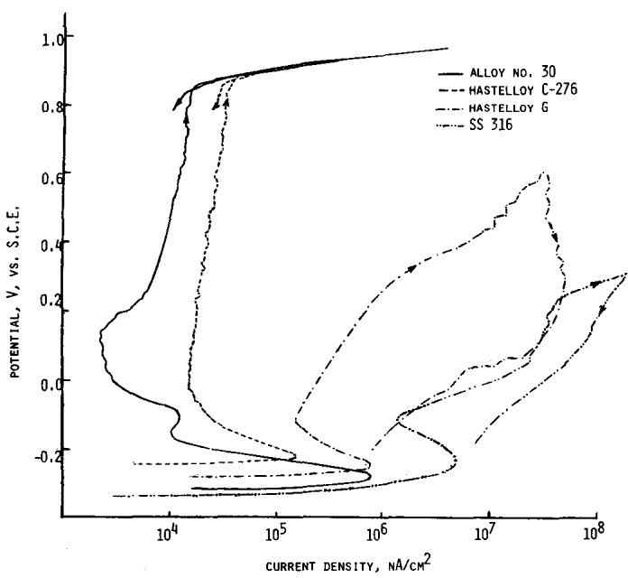  
FIGURE 1 — Anodic polarization curves for Alloy No. 30, Alloys C-276 and ${ \mathfrak { a } } ,$ and Type 316 stainless steel in deaerated 1 N NaCl + 0.5 N HCI at 70 C.

Figure 1 also shows that alloy 30 had a somewhat smaller passive current density, ipassive, than alloy C-276 in this environment. Table 4 shows the ipassive values for alloys C-276, G, and alloy 30 at three different temperatures in deaerated 1

TABLE 4 — Passive Current Density, ipassive, for Alloys C-276 and G and Alloy 30 in Deaerated 1 N NaCl + 0.5 N HCl (pH 0.69) at Three Different Temperatures
<table><tr><td rowspan="2">ipassive (μA/cm²) for Alloys</td><td colspan="3">Temperature</td></tr><tr><td>Room Temperature</td><td></td><td></td></tr><tr><td> $( \mathsf { a } \mathsf { t } \pm 0 . 2 \mathsf { V } \mathsf { S } \mathsf { C } \mathsf { E } )$ </td><td>(~ 25 C)</td><td>70 C</td><td>90 C</td></tr><tr><td>Alloy C-276</td><td>6</td><td>25</td><td>70</td></tr><tr><td>Alloy 30</td><td>1.5</td><td>7.5</td><td>15</td></tr><tr><td>Alloy G</td><td>10</td><td>1000</td><td>5000</td></tr></table>

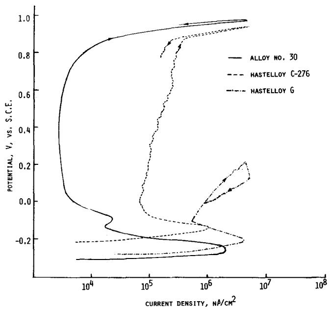  
FIGURE 2 — Anodic polarization curves for Alloy No. 30 and Alloys C-276 and G in deaerated 2 N NaCI + 0.5 N HCl at 70 C.

N NaCI + 0.5 N HCI. Since the passive region generally extended over a wide range of potential, the ipassive varied slightly over the range, and therefore the values of ipassive in Table 4 were obtained in each case at + 0.2 V. Cíearly, the ipassive values in all three alloys increased with temperature; the rise was very steep for alloy G and relatively slow for the other two alloys. However, alloy 30 displayed lower ipassive values than alloy C-276 at all three temperatures.

The anodic polarization curves for alloys C-276, G, and alloy 30 in deaerated 2 N NaCI + 0.5 N HCI at 70 C are illustrated in Figure 2. The polarization curve for alloy G does not show any distinct passive region and exhibits marked hysteresis and low protection potential (\~ OV). Alloy C-276 and alloy 30 did not break down in this aggressive environment. The values of ipassive were again obtained at 0.2 V. Interestingly, the ipassive value of alloy 30 at 1.7 $\mu \mathsf { A } / \mathsf { c m } ^ { 2 }$ was less than that in 1 N NaCI + 0.5 N HCl at the same temperature (Figure 1). The value for alloy C-276, however, increased from 25 $\mu _ { \Delta I C M } 2$ in Figure 1 to roughly 100 $\mu _ { A / \ c m } ^ { 2 }$ in Figure 2. The implication is that alloy C-276 may be affected by an increase in chloride ion concentration, while alloy 30 remains unaffected at the higher Cl- concentration.

## Crevice Corrosion Test

The results of the rubber band crevice corrosion tests in ferric chloride solution at 50 C are shown in Figures 3a through d for stainless steel Type 316, alloy G, alloy C-276, and alloy 30, respectively. While the Type 316 stainless steel almost disintegrated, and alloy G suffered significant crevice corrosion underneath the TFE-fluorocarbon block, alloy C-276 and alloy 30 appeared to be immune to crevice corrosion in this environment. This test confirms the results of polarization tests, showing that the corrosion resistance of alloy 30 is much better than that of alloy G.

d  
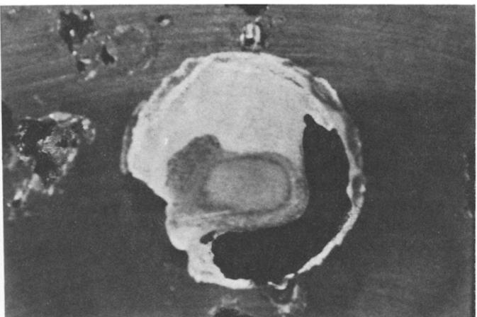

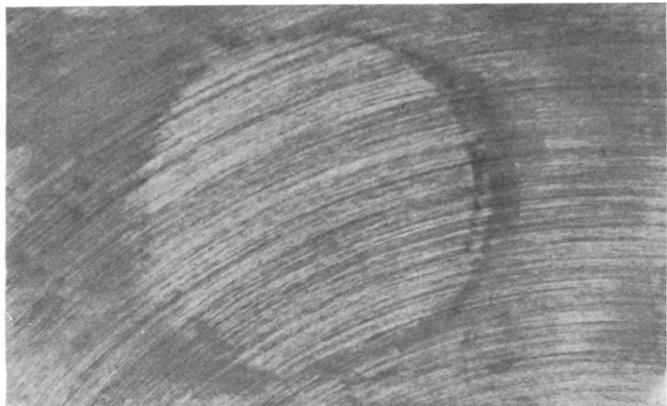  
C

a  
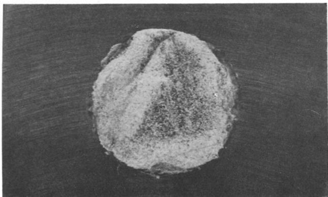

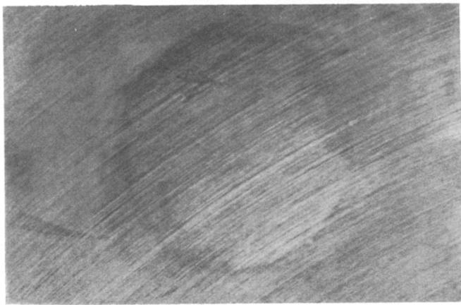  
FIGURE 3 — Results of rubberband crevice corrosion test on Type 316 stainless steel, Alloys G and C-276 and Alloy No. 30 in ferric chloride solution at 50 C.

TABLE 5 — Composition of Some of the Commercial Alloys Tested (%)
<table><tr><td colspan="10"></td></tr><tr><td>Alloy Type SS 316</td><td>Fe Balance</td><td>Mo 2-3</td><td>Ni 10-14</td><td>Cr 16-18</td><td>C &lt;0.08</td><td></td><td>Co 1</td><td>W 一</td><td>Other</td></tr><tr><td>Alloy C-276</td><td>5.69</td><td>15.80</td><td>Balance</td><td>15.61</td><td>0.003</td><td>1.40</td><td>3.64</td><td>0.19 V</td><td></td></tr><tr><td>Alloy G</td><td>19.69</td><td>6.42</td><td>Balance</td><td>21.89</td><td></td><td>0.014</td><td>2.29</td><td>0.65</td><td>2.24 (Cb + Ta), 1.78 Cu</td></tr><tr><td>AL-6X</td><td>Balance</td><td>6.45</td><td>24.64</td><td>20.35</td><td></td><td>0.018</td><td></td><td></td><td>1.39 Mn, 0.41 Si, 0.018 N</td></tr><tr><td>Sandvik Alloy(1) SAF 2205</td><td>Balance</td><td>3.0</td><td>5.5</td><td>22.0</td><td>&lt;0.03</td><td></td><td></td><td>0.14N</td><td></td></tr></table>

(1)Typical composition, source—Sandvik.

The compositions of Type 316 stainless steel, alloys G and C-276, and some other alloys are given in Table 5. Alloy 30 (Table 1) has roughly 2.5% more chromium and 0.4% less molybdenum than alloy G. However, alloy 30 has 0.44% nitrogen which seems to be responsible for its much superior corrosion performance compared to alloy G. Although alloy 30 has about 9% more chromium than alloy C-276, it has approximately 9% less molybdenum. The higher chromium content probably gives the lower passive current density for alloy 30 compared to alloy C-276. However, the fact that the ipassive for alloy 30 is less sensitive to temperature and chloride ion concentration relative to alloy C-276 is probably due to the additional nitrogen. In view of the low Ni content of alloy 30, it should be considerably less expensive than alloy C-276.

## Polarization Resistance and Tafel Constant Tests

A typical polarization resistance plot²4 for alloy 30 in deaerated 1 N NaCl + 0.5 N HCl at room temperature is shown in Figure 4. The data were obtained using the conventional 3-electrode method,25 using a scan rate of 6 mV/min. The polarization resistance data were obtained from a very narrow region (typically ± 20 mV) on either side of the corrosion potential.

If the reversible potentials for anodic and cathodic reactions are far from the corrosion potential, Ecorr, of a corroding electrode, and both anodic and cathodic reactions are controlled by charge transfer, the applied current (l) is related to the electrode potential (E) and corrosion current, $\mathsf { I } _ { \mathsf { C o r r } } , \mathsf { b y } ^ { 2 4 }$

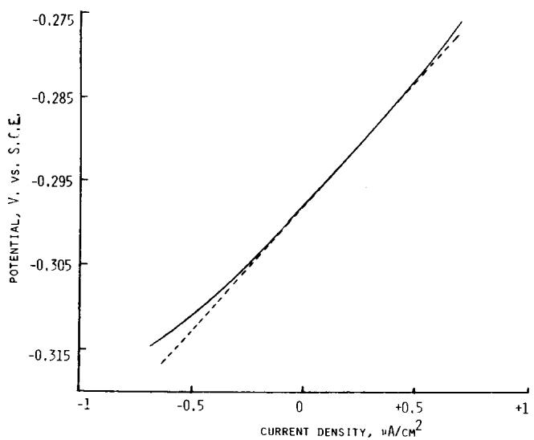  
FIGURE 4 — Polarization resistance diagram for Alloy No. 30 in deaerated 1 N NaCI + 0.5 N HCl at room temperature.

TABLE 6 — Polarization Resistance, Tafel Constants and Corrosion Rate of Type 316 Stainless Steel, Alloys C-276 and G, and Alloy 30 in Deaerated 1 N NaCI + 0.5 N HCl at Room Temperature
<table><tr><td colspan="3">Polarization</td><td rowspan="2">Corrosion Rate(1) Icorr (μA/cm²)</td></tr><tr><td>Alloy Type</td><td>Resistance, Rp(Ω)</td><td>Constant, B(mV)</td></tr><tr><td>SS-316</td><td>587</td><td>49.5</td><td>84.3</td></tr><tr><td>Alloy C-276</td><td> $1 . 1 7 7 \times 1 0 ^ { 4 }$ </td><td>49.0(1)</td><td>4.2</td></tr><tr><td>Alloy G</td><td> $1 . 8 4 0 \times 1 0 ^ { 4 }$ </td><td>75.5</td><td>4.1</td></tr><tr><td>Alloy 30</td><td> $2 . 9 5 0 \times 1 0 ^ { 4 }$ </td><td>46.9</td><td>1.6</td></tr></table>

(1)approximate value.

$$
\left( { \frac { \mathsf { d } } { \mathsf { d } \mathsf { E } } } \right) \mathsf { E } _ { \mathsf { c o r r } } = { \frac { 1 } { \mathsf { R } _ { \mathsf { p } } } } = { \frac { \mathsf { I } _ { \mathsf { c o r r } } ( \mathsf { b } _ { \mathsf { a } } + \mathsf { b } _ { \mathsf { c } } ) } { \mathsf { b } _ { \mathsf { a } } \mathsf { b } _ { \mathsf { c } } } } = { \frac { \mathsf { I } _ { \mathsf { c o r r } } } { \mathsf { B } } }\tag{1}
$$

where $\mathsf { b } _ { \mathsf { a } }$ and ${ \sf b _ { \sf C } }$ are related to the anodic and cathodic Tafel constants, $\beta _ { \mathfrak { a } }$ and $\beta _ { \mathsf { c } } ,$ through the expressions: $\beta _ { \mathsf { a } } = 2 . 3 0 3 \mathsf { b } _ { \mathsf { a } } ;$ $\beta _ { \mathsf { c } } = 2 . 3 0 3 \ \mathrm { b } _ { \mathsf { c } } ;$ and the polarization resistance $\mathsf { R } _ { \mathsf { P } } ,$ is obtained from the slope of the current-potential data in the vicinity of the corrosion potential, as illustrated in Figure 4. The polarization resistance data for alloy 30, alloys C-276 and G, and Type 316 stainless steel in deaerated 1 N NaCl + 0.5 N HCl at room temperature were also obtained and are shown in Table 6. In order to determine the values of Tafel constants, cathodic and anodic polarization in the Tafel regions was also conducted on these alloys in the same environment. A typical cathodic Tafel plot for alloy 30 is shown in Figure 5, which yields a slope of 108 mV. Anodic polarization on the alloys did not yield any distinct Tafel region because of the active-passive transition within 80 to 100 mV of corrosion potential. Assuming an anodic Tafel slope, $\beta _ { \mathsf { a } } ,$ of infinity²4 (i.e., passive metal surface), one obtains ${ \textsf { B } } = { \textsf { b } } _ { \mathsf { c } }$ in Equation (1). Using these values, the corrosion rates of each alloy were calculated from Equation (1) and are shown in Table 6. Alloys C-276 and G and alloy 30 appeared to have comparable corrosion rates, and Type 316 stainless steel had a corrosion rate of roughly two orders of magnitude greater than that of the other three alloys. These values of corrosion rates should not, however, be accepted without caution, because these stainless alloys often behave like redox electrode (e.g., a hydrogen or oxygen electrode) and electrochemical measurements can then give erroneous corrosion rates.24 Since the main purpose of our investigation was development of alloys with enhanced resistance to localized corrosion, no attempt was made to obtain weight loss data in order to compare them with electrochemically obtained corrosion rates.

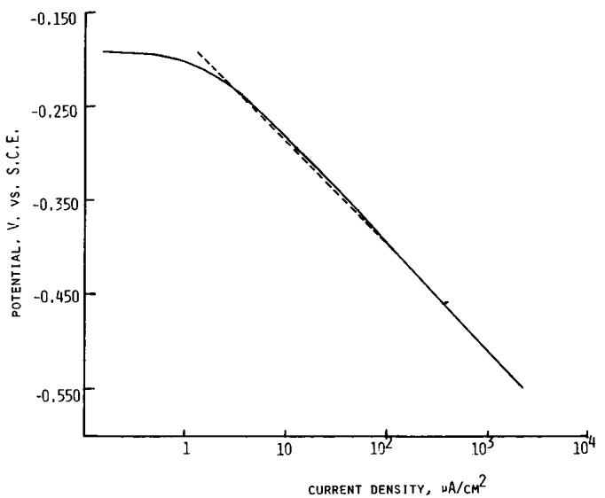  
FIGURE 5 — Cathodic polarization curve and Tafel slope for Alloy No. 30 in deaerated 1 N NaCl + 0.5 N HCI at room temperature.

Immersion Test in 7 vol.% $H _ { 2 } S O _ { 4 } + 3$ vol.% HCl $+ 1 W t \% F e C l _ { 3 } + 1 W t \% C u C l _ { 2 }$

In order to compare even more critically the pitting resistance of alloy 30 and alloy C-276, a 24-hour immersion test at boiling was performed in the above solution with flat coupons $1 \sim 1 2 c m ^ { 2 }$ area) of the above two alloys. Both alloys suffered some surface deterioration accompanied by small pits as shown in Figures 6a and b for alloy 30 and alloy C-276, respectively. The alloy 30, however, suffered a much lower weight loss (1.8 mdd) than alloy C-276 (78.1 mdd). A repeat test in the above solution, but with about half the original strength of HCi gave essentially similar results. The above tests suggest that alloy 30 should perform at least as well as alloy C-276 in highly aggressive chloride media, if not better, from the chloride pitting standpoint.

Microstructure. The experimental alloys with relatively large amounts of nickel, nitrogen, and manganese were all fully austenitic; some of the low nickel bearing alloys, for instance alloys 1 through 8 and 25, revealed some ferrite when examined by a Magnegage. The microstructure of high nitrogen bearing alloy 30 is shown in Figure 7. Nitrogen, which is an austenite stabilizer, shifts the α-γ phase boundaries in Fe-Cr-Ni alloys, as described in Figure $8 . 2 \dot { 7 }$ The dashed lines in the figure shows the effect of up to 0.25% nitrogen on the α-γ phase boundaries of three stainless steels with 2% Mo and varying amounts of Cr and Ni expressed as % values. The three solid lines in the figure represent three other stainless steels with 3% Mo and three different levels of N, with a maximum up to 0.25%. Figure 8 also shows the correlation between the ferrite content, shown as 0 and 10% ferrite boundaries and the chromium and nickel equivalents of the steel given by²7

$$
\mathsf { C r e q u i v a l e n t } = \% \mathsf { C r } + 1 . 5 \% \mathsf { S i } + \% \mathsf { M o }
$$

$$
\small \mathrm { N i ~ e q u i v a t e n t } = \% \ \mathsf { N i } + 3 0 \% \ ( \% \mathsf { C } + \% \mathsf { N } ) + 0 . 5 \ \% \mathsf { M n } .
$$

It is evident from Figure 7 that alloy 30 has some inclusions. The surface of the polished but unetched specimen, when examined under the microscope, revealed about an equal distribution and size of inclusions as in the etched micrograph. Etchants such as electrolytic oxalic acid or electrolytic chromic oxide gave essentially similar structure and inclusion distribution. The matrix and the inclusions were analyzed by Energy dispersive X-rays (EDAX) and the resulting spectra (Figures 9 and 10, respectively) show that the inclusions have more Mo and Cr and less Fe than the matrix.

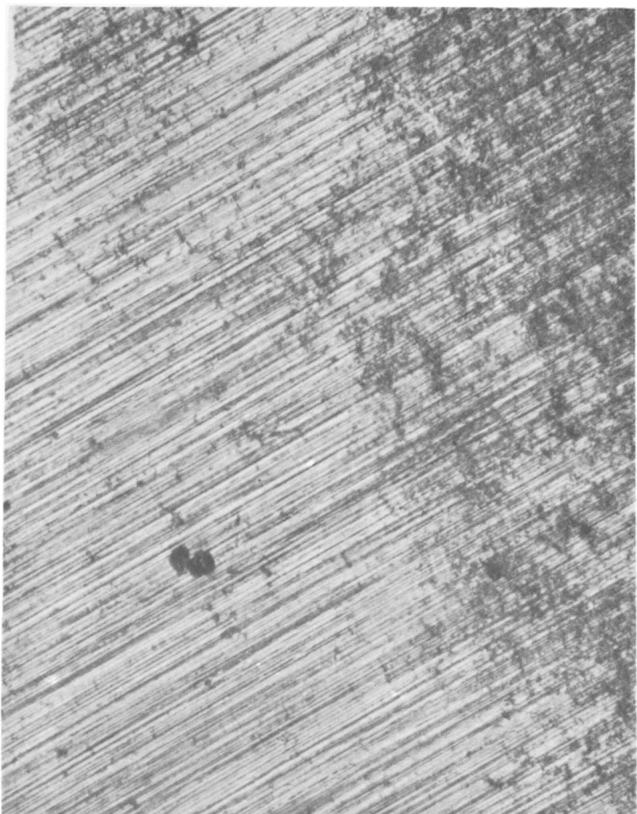  
a

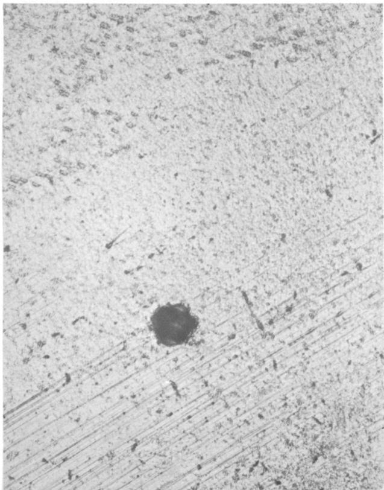  
b  
FIGURE 6(a) — Result of 24-hr. immersion of alloy 30 in boiling 7 vol.% $H _ { 2 } S O _ { 4 } + 3$ vol.% HCl + 1 Wt% ${ \mathsf { F e C l } } _ { 3 } +$ 1 Wt% CuCl2 solution. (b) Result of 24-hr immersion of Alloy C-276 in same solution as in 6a.

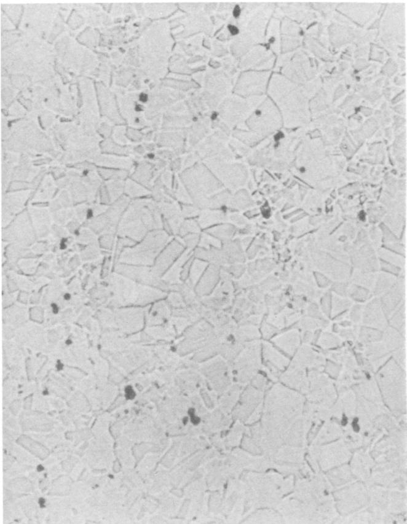  
FIGURE 7 — Microstructure of Alloy 30 10% oxalic acid etch 400X.

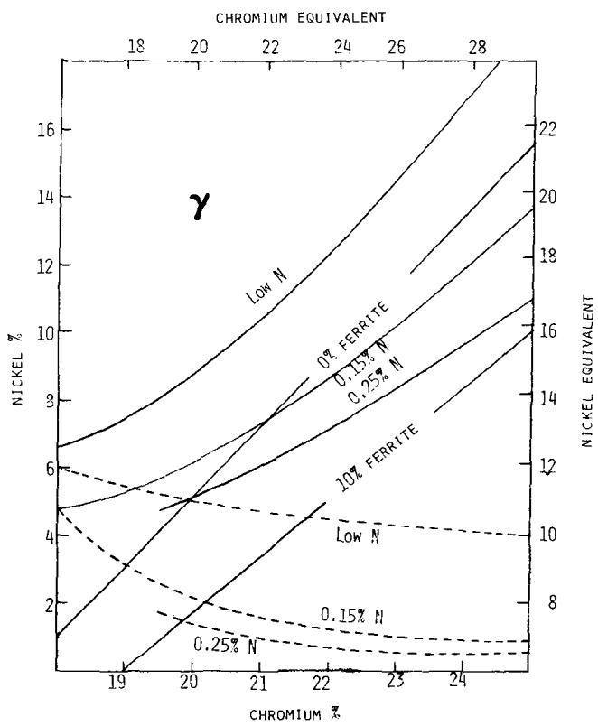  
FIGURE 8 — Effect of nitrogen on phase boundaries in Fe-Cr-Ni alloys.

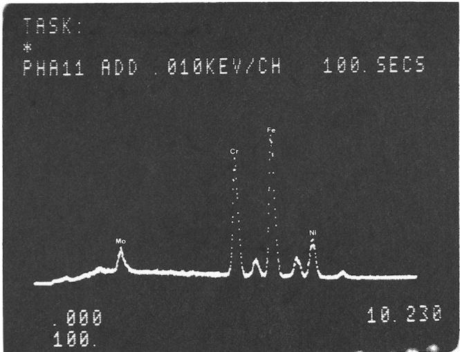

FIGURE 9 — Energy dispersive X-ray analysis of the matrix in Figure 7.  
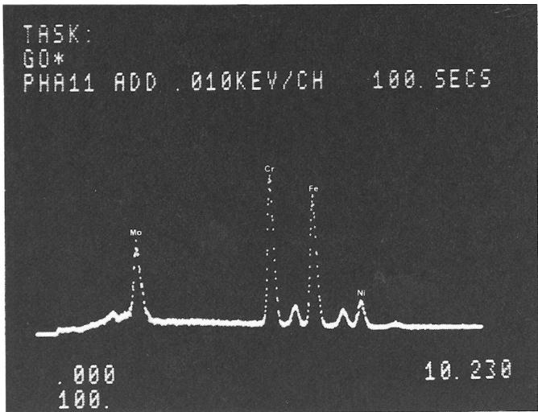  
FIGURE 10 — Energy dispersive X-ray analysis of one of the inclusions shown in Figure 7.

Role of Nitrogen. The role of nitrogen in enhancing the corrosion resistance is not clear. Nitrate ions are known to inhibit the anodic dissolution processes in many envíronments. Therefore, further tests were conducted with some commercial stainless steels in 1 N NaCl + 0.5 N HCl at 50 C (pH 0.69) with and without 0.1 N $N a N O _ { 3 } .$ The results for AL-6X and Sandvik SAF 2205 (compositions in Table 5), shown in Figures 11 and 12, respectively, clearly demonstrate that $N a N O _ { 3 }$ substantially improves the pitting resistance of both alloys in this environment, evidently due to the beneficial effect of ${ \mathsf { N O } } _ { 3 } -$ ions. However, whether nitrogen atoms play any specific role in this process is a matter of speculation. When one compares the polarization behavior of alloy 30 (Figure 1) and AL-6X (Figure 11) in 1 N NaCl + 0.5 N HCl, the effect of dissolved nitrogen in the metal becomes obvious. Alloy 30 has about 4% more Cr and 4% less Ni than AL-6X alloy. However, the markedly superior corrosion resistance of alloy 30 with 0.44 N to that of AL-6X alloy with only 0.018 N may be ascribed primarily to the extra nitrogen in the former alloy, as was done earlier when alloy 30 was compared to alloy G which has about

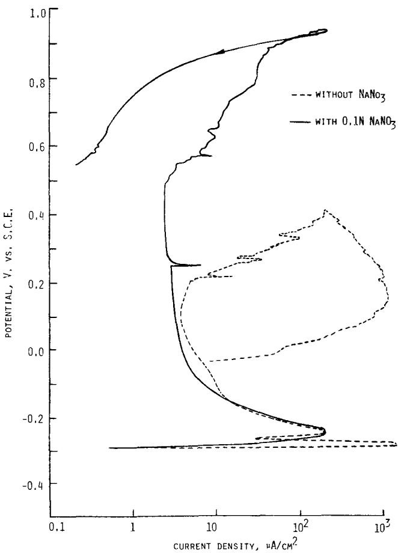  
FIGURE 11 — Anodic polarization curves for AL-6X in deaerated 1 N NaCI + 0.5 N HCI at 50 $\pmb { \ c } ,$ with and without 0.1 N NaNO₃

2.4% less Cr, 0.4% more $M O ,$ and much more Ni than alloy 30. Truman, et $a 1 . , 2 8$ recently studied the effect of nitrogen addition on pitting corrosion of a series of austenitic stainless steels and observed that when the Cr and Mo contents were sufficiently high, a large increase in pitting resistance resulted from a small increase in nitrogen, apparently due to synergistic effects. The maximum Mo content of the alloys that they investigated was 3% and the effect of nitrogen was especially evident in a steel with 22% Cr, 3% Mo, 20% Ni, and 0.455 N. However, our results show that still further enhancement of pitting resistance can be achieved by increasing the Mo content to, for example, about 6%. At this level, corrosion resistance similar to alloy C-276 can evidently be achieved, as in the case of alloy 30.

It is believed that N additions can, and ${ \mathsf { d o } } ,$ increase the localized corrosion resistance of an entire range of Fe-Cr-Ni-Mo alloys. Examples already exist, such as Types 304 N and 316 N stainless steels, where the role of nitrogen originally was to impart increased strength $\cdot ^ { 2 7 }$ Also, Avesta 254 SMO nitrogen bearing stainless steel (20 Cr, 18 Ni, 6.1 Mo, 0.2 N) has very good corrosion resistance.29Studies, with another high molybdenum and nitrogen bearing stainless steel (20 Cr, 22 Ni, 5 Mo, 0.2 N) in sea water show that nitrogen plays an important role in improving the corrosion resistance.30 In another $\mathsf { s t u d y } , ^ { 3 1 }$ the effects of Mo and N on $\mathtt { c l ^ { - } }$ pitting corrosion were investigated in the welds of commercial and high nitrogen containing (0.34 N) austenitic stainless steels. Nitrogen was found to improve the resistance to pitting corrosion in both commercial and high nitrogen bearing stainless steels, independent of the molybdenum content.

The effect of manganese addition was also studied by the above cited investigators³1 who observed that manganese also improved the pitting corrosion resistance of the weld metals. Our studies, however, suggest that manganese does not consistently or necessarily contribute to the corrosion resistance.

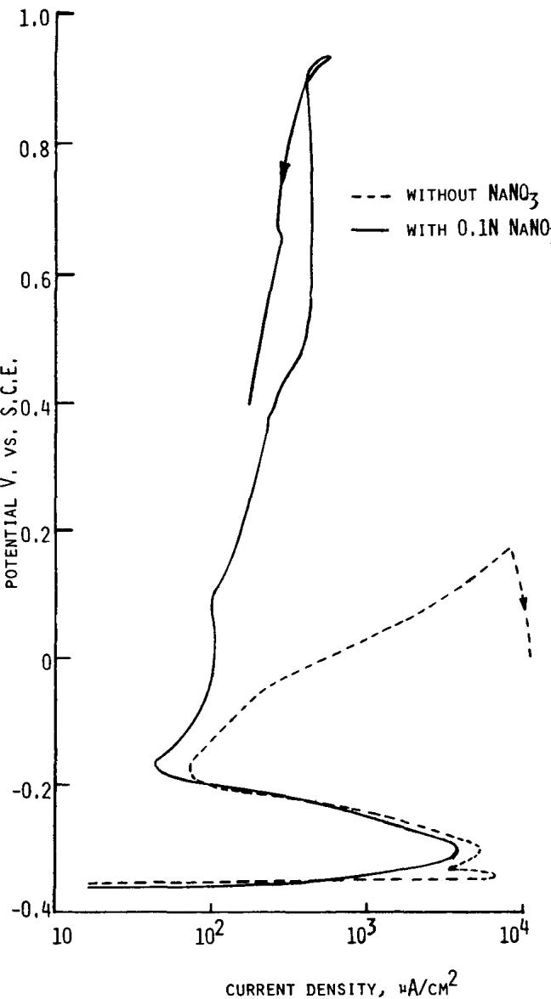  
FIGURE 12 — Anodic polarization curves for Sandvik alloy SAF 2205 in deaerated 1 N NaCl + 0.5 N HCl at 50 C, with and without 0.1 N NaNO₃.

It is generally believed that stainless steel achieves passivity due to the presence of a chromium-rich oxide film. Truman, et al.,28 believe that an oxide of nitrogen could not coexist and strengthen such a lattice, but a metal nitride might. An increased availability of nitrogen in the atomic form at the surface of the high nitrogen-bearing alloy could favor the formation of nitrides. However, the improved pitting corrosion resistance of AL-6X and SAF 2205 alloys due to the addition of ${ \mathsf { N O } } _ { 3 } -$ ions in an acidic chloride environment seems to imply that an absorbed layer of nitrogen ions or atomic nitrogen on the oxide film might also contribute to enhanced passivity. It is believed that further studies, especially in the areas of spectroscopic analyses of the surface films, are necessary to determine the composition of the films and the chemical state of nitrogen. Another aspect of the role of nitrogen that requires further study is its effect on the metal near the surface, which may also be important in explaining the mechanism whereby corrosion resistance is improved. Therefore, it is necessary to determine the distribution and the chemical state of nitrogen across the depth of the oxide film and a few atomic layers of the metal substrate.

There is an obvious economic advantage in using nitrogen in stainless steel. Nitrogen can be substituted in part for more expensive argon during refining, and the austenite forming tendency of nitrogen can be used to replace some of the more expensive austenite stabilizers such as nickel.

The present alloy development program was initiated in response to the need for more corrosion resistant alloys for use in the geothermal industry, where some vital plant components made of low alloy or commercial stainless steels suffer repeated corrosion failures.32,33 However, because of its significant corrosion resistance, the nitrogen bearing stainless steel has the potential of wider application in many other industrial areas where there is a need for austenitic stainless steels with corrosion resistance comparable to that of high nickel base alloys, but at a reduced cost. Our laboratory investigations involved only very small heats of the order of 500 g. Therefore, further studies are needed to make bigger heats of some of the experimental alloys and investigate various other aspects of alloy development such as weldability, formability, machinability, etc.

## Conclusions

1. The corrosion resistance of austenitic Fe-Cr-Ni-Mo stainless steels in chloride and acid chloride media can be significantly improved by addition of nitrogen. One high nitrogen bearing (0.44 N) alloy offers corrosion resistance comparable to that of Hastelloy alloy C-276.

2. Since nitrogen can replace some of the nickel in the alloy and part of the argon used during manufacturing of the alloy, considerable cost saving is possible by using nitrogen as a constituent of the alloy.

3. Manganese does not seem to significantly improve the corrosion resistance of stainless steel in the environment under investigation.

4. Further work is needed to manufacture larger heats of some of the nitrogen bearing alloys and test them in order to assess their commercial viability.

## Acknowledgments

The authors wish to acknowledge Y. S. Park for some of the tests, and the technical assistance of Clifford Schnepf and Ronald Graeser. The authors are grateful to the Division of Geothermal Energy for their financial support in the form of Department of Energy Contract No. DE-AC02-76CH00016.

## References

1. Kolotyrkin, J. M., Corrosion, Vol. 19, p. 261t (1963).

2. Tomashov, N. D., Tchernova, G. P., and Markova, N., Corrosion, Vol. 20, p. 166t (1964).

3. Wallen, B. and Olsson, J., Handbook of Stainless Steels, p. 16.01, edited by Peckner, D. and Bernstein, 1. M., McGraw-Hill (1977).

4. Lorenz, K. and Medawar, G., Tyssenforschun, Vol. 1, p. 97 (1969).

5. Forchammer, P. and Engell, H. J., Werkstoffe u. Korros., Vol. 20, p. 1 (1969).

6. Lizlovs, E. A. and Bond, A. P., J. Electrochem. Soc., Vol. 116, p. 574 (1969).

7. Baumel, A., Schiff. u. Hafen, Vol. 19, p. 635 (1967).

8. Kaesche, H., Die Korrosion der Metalle, Springer Verlag Berlin, p. 251 (1966).

9. Steigerwald, R., Corrosion, Vol. 22 (1966).

10. Stolica, N. D., Corr. Sci., Vol. 9, p. 205 (1969)

11. Kolotyrkin, J. M., Golovina, G. V., and Florianovitch, G. M., Dokl. Akad. Nauk SSSR, Vol. 148, p. 1106 (1963).

12. Horvath, J. and Uhlig, H. H., J. Electrochem. Soc., Vol. 115, p. 791 (1968).

13. Streicher, M. A., J. Electrochem. Soc., Vol. 103, No. 7, p. 375-90 (1956).

14. Uhlig, H. H., Trans. ASM, Vol. 30, p. 947-80 (1942)

15. Kortvshenko, G. V., Grigorkin, V. I., and Zaslavski, A. V., Izv. Vyssh. Ucheb. Zaved. Chern. Met., Vol. 12, No. 8, p. 124- 6 (1969).

16. Condylis, A., Bayon, F., and Desestret, A., Rev. Met., Vol. 5, p. 399-412 (1970).

17. Eckenrod, J. J. and Kovach, C. W., ASTM Spec. Tech. Publ. STP 679, p. 17-41 (1977).

18. Lukina, O. I., Freiman, L. I., Fel'dgandler, E. G., and Savkina, L. Ya., Zashch. Met., Vol. 15, No. 5, p. 545-51 (1979).

19. Hartline, A. G., Met. Trans., Vol. 5, p. 2271-6 (Nov. 1974)

20. Wallen, B. and Liljas, M., Acciaio Inossid., Vol. 45, No. 3, p. 3-11 (1978).

21. Fukuzuka, T., Shimogori, K., Fujiwara, K., and Sugie, K. Kobe Steel Interim Report (Oct. 1979).

22. Langenberg, F. C. and Day, M. J., Electr. Furn. Conf. Proc., Vol. 15, p. 7-15 (1957).

23. ASTM Standard G48-76, Standard Test Methods for Pitting and Crevice Corrosion Resistance of Stainiess Steels and Related Alloys by the Use of Ferric Chloride Solution.

24. Mansfeld, F., The Polarization Resistance Technique for Measuring Corrosion Currents, in Advances in Corrosion Science and Technology, Voi. 6, Fontana, M. G. and Staehle, R. W., eds., Plenum Press, New York (1976).

25. Greene, N. D., Experimental Electrode Kinetics, Rensselaer Polytechnic Institue, Troy, New York (1965).

26. Pourbaix, M., The Electrochemical Basis for Localized Corrosion in Localized Corrosion, NACE-3 (1971).

27. Peckner, D. and Bernstein, I. M., Handbook of Stainless Steels, McGraw-Hill, New York (1977).

28. Truman, J. E., Coleman, M. J., and Pirt, K. R., Br. Corros. J., Vol. 12, p. 236 (1977).

29. Avesta 254 SMO (Preliminary Data Sheet)—Information Bulletin No. 7719, Avesta Jernverks AB, Sweden.

30. Fukuzuka, T., et al., Trans. Iron and Steel Inst., Japan, Vol. 20, No. 9, B403 (1980).

31. Ogawa, T., et a/., Yusetsu Gakkaishi, Vol. 49, No. 8, p. 564- 71 (1980); cited in Corrosion Abstracts.

32. Ellis, P. F. and Conover, M. F., Material Selection Guidelines for Geothermal Energy Utilization Systems, prepared for U.S. Department of Energy under Contract No. DE-AC02-79ET27026 (1981).

33. Crane, C. H. and Kenkeremath, D. C., Geothermal Materials Program Strategy, prepared for U.S. Department of Energy under Contract No. DE-AC-07-08-ID 12183 (1980).

# An ESCA Study of Sulfidation of Fe-25 Wt% Cr Alloy in $H _ { 2 } S$ at 50 to 400 C\*

P. B. V. NARAYAN, J. W. ANDEREGG, and O. N. CARLSON\*

## Abstract

The surface reaction of polycrystalline Fe-25 Wt% Cr alloy with ${ \sf H } _ { 2 } \bar { \sf S }$ was studied in situ with ESCA in the temperature range of 50 to 400 C at pressures of 0.005 to 5 torr of $H _ { 2 } S _ { 3 }$ with and without preexposure to oxygen. On the oxidized surface, ${ \mathsf { C r } } _ { 2 } { \mathsf { O } } _ { 3 }$ is stable at 200 C, but is converted to $\mathsf { C r } _ { 2 } \mathsf { S } _ { 3 }$ at $\mathsf { P } _ { \mathsf { H } , \mathsf { S } } = 5$ torr at 300 C and sulfidized at a lower $\mathsf { P } _ { \mathsf { H } , \mathsf { S } }$ at 400 C. Chromium sulfides are more readily formed on clean alloy surface, whereas iron sulfides are more readily formed on the oxidized surface. The surface iron content is gradually increased as sulfidation proceeds. During annealing in vacuum, the surface chromium content increases more rapidly and at lower temperatures in the presence of surface oxygen than in the presence of surface sulfur.

## Introduction

Iron-chromium-nickel alloys such as Incoloy 800 and Type 310 SS with high chromium contents are being evaluated for use in various coal gasification or other coal conversion processes.1-3 The presence of chromium in steels imparts corrosion or oxidation resistance to the alloy by formation of a protective oxide film on the surface. Chromium oxide $( \mathsf { C r } _ { 2 } \mathsf { O } _ { 3 } )$ is thermodynamically stable on iron or nickel base alloys, even at relatively low chromium concentrations. However, Natesan and Chopra² report that 20 to 25% chromium is needed for satisfactory oxidation resistance at 900 C and 0.1 atm oxygen pressure, and that a high chromium content is required for the oxidation process to change from internal oxidation to an external protective layer. Dapkunas³ also noted that chromium concentrations of at least 20 and preferably 25 Wt% Cr are required in alloys for coal gasifier internals. Therefore, an Fe-25 Wt% Cr alloy was chosen for this investigation.

In an atmosphere containing $H _ { 2 } S$ the chromium oxide layer does not provide the desired resistance to sulfidation, particularly at higher temperatures and $H _ { 2 } S$ partial pressures.

Apparently the protective oxide layer is destroyed by the sulfidizing atmosphere thus exposing the alloy to sulfide attack. Previous studies46 of the sulfidation of Fe-Cr alloys in an $H _ { 2 } S$ atmosphere invoived the use of conventional techniques of analyses, notably metallography, X-ray diffraction, and electron microanalysis, which ascertains the final “equilibrium" products of corrosion. Recently, surface sensitive techniques such as ESCA and AES have been used to study the initial stages of surface reactions of Fe-Cr alloys in the presence of oxygen,7-9and CO.1º However, ESCA has not been used in a systematic study of the sulfidation of Fe-Cr alloys in an ${ \sf H } _ { 2 } { \sf S }$ atmosphere.

This paper describes the results of a study in which ESCA was used as the main technique for analysis of the sulfidized surfaces of an Fe-25 Wt% Cr alloy over a temperature range of ambient to 400 C. The reaction of $H _ { 2 } S$ with the unprotected alloy surface and one containing a thin oxide layer was investigated as a function of temperature and $H _ { 2 } S$ pressure.

## Experimental Procedure

The Fe-25 Wt% Cr alloy was prepared by arc melting the desired amounts of electrolytic iron (99.9 + % pure) and iodiderefined chromium (99.99% pure). The ingot was hot rolled at 900 C into a sheet of 0.038 cm thickness, and then cold rolled