www.elsevier.com/locate/electacta

# Localized corrosion of $\mathrm { A l } _ { 9 0 } \mathrm { F e } _ { 5 } \mathrm { G d } _ { 5 }$ and $\mathrm { A l _ { 8 7 } N i _ { 8 . 7 } Y _ { 4 . 3 } }$ alloys in the amorphous, nanocrystalline and crystalline states: resistance to micrometer-scale pit formation

J.E. Sweitzer, G.J. Shiflet, John R. Scully \*

Department of Materials Science and Engineering, University of Virginia, Charlottesville, VA 22904-4745, USA

## Abstract

The role of isothermal aging on the localized corrosion behavior of $\mathrm { \bf A l q _ { 0 } F e _ { 5 } G d _ { 5 } }$ and $\mathrm { A l _ { 8 7 } N i _ { 8 . 7 } Y _ { 4 . 3 } }$ alloys was characterized in 0.6 M NaCl solution. The pitting $( E _ { \mathrm { p i t } } )$ and repassivation $( E _ { \mathrm { r p } } )$ potentials were both increased /400 mV by the presence of transition and rare earth metal additions in supersaturated solid solution and amorphous structure. A statistical distribution in $E _ { \mathrm { p i t } }$ observed on small electrodes was due, in part, to the sensitivity of this critical potential to the presence of a population of critical surface flaws that serve as pit initiation sites. Mechanistic insight on the spacing of critical flaws was enabled by varying the tested electrode surface area. $E _ { \mathrm { r p } }$ was not dependent on electrode surface area due to the similarity of pit depths in all electrode sizes. The critical potentials were also characterized after heat treating the amorphous ribbons isothermally at $1 5 0 ~ ^ { \circ } \mathrm { C }$ for 25 h and $5 5 0 ~ ^ { \circ } \mathrm { C }$ for 1 h. The former produced Al-rich nanocrystals embedded in the remaining amorphous matrix while the latter produced a fully crystalline condition containing intermetallic phases. Notably, the improved resistance to the formation of micrometer-scale pits was not lost compared with the fully amorphous condition when small Al-rich nanocrystals were present in an amorphous matrix. However, improvement in pitting corrosion resistance was completely lost in the fully crystallized condition as indicated by values for $E _ { \mathrm { p i t } }$ and $E _ { \mathrm { r p } }$ that were similar to those of high purity, polycrystalline aluminum. # 2003 Elsevier Science Ltd. All rights reserved

Keywords: Amorphous alloy; Devitrification; Metallic coatings; Nanocrystalline; Pitting corrosion

## 1. Introduction

## 1.1. Opportunity for new metallic coatings

The opportunity exists to create new metallic coatings that exhibit a broad range of corrosion functions including active corrosion inhibition (i.e., self-healing), corrosion barrier properties, sacrificial cathodic prevention, as well as resistance to crevice corrosion (e.g., alkaline or acidic dissolution) at faying surfaces in military components. One class of alloys that may be suitable for such coatings is a recently discovered Al-rich glass alloy system based on rare earth and transition metal compositions. Multi-functionality is possible because some of the same alloying elements that promote amorphous phase formation upon rapid cooling also have attributes that could improve a range of corrosion properties.

This paper focuses on the ability of two selected amorphous Al-based metallic alloys to resist formation of micrometer scale pits. One critical issue is the concern that devitrification compromises the improved localized corrosion resistance associated with the amorphous state. The effects of heat treatment-induced devitrification on the pitting corrosion behavior of $\mathrm { A l } _ { 9 0 } \mathrm { F e } _ { 5 } \mathrm { G d } _ { 5 }$ and $\mathrm { A l _ { 8 7 } N i _ { 8 . 7 } Y _ { 4 . 3 } }$ alloys were investigated in nearneutral NaCl solution.

## 1.2. Physical metallurgy and thermal stability

It has been well established that a limitation of older as well as recently discovered Al-base metallic glasses is that they exist in a metastable form [1/6]. At room temperature the amorphous phase of Al-based glasses has been shown to be stable for up to 2 years [3]. However, such alloys tend to crystallize if heated with sufficient thermal energy to accelerate the kinetics of crystallization, nucleation and growth [3,6]. During a low temperature heat treatment, such homogeneous single phase amorphous alloys can transform into a nanocrystalline composite with the remaining amorphous phase as the matrix. Upon further heating, this amorphous/nanocrystalline composite microstructure then transforms into a fully crystalline state with the formation of transitional or equilibrium phases [2/4]. It is interesting to note that as-spun Al-base amorphous alloys and nanocrystalline composites exhibit improved mechanical properties. Hono [7] has reported tensile strengths of 800 MPa for aluminum-based alloys in the amorphous state and as high as 1500 MPa in a partially crystalline state after isothermal heat treatment. In contrast, the tensile strength of 99.99% pure Al is 45 MPa and that of 2024-T3 is 485 MPa [8].

Using differential scanning calorimetry (DSC), Goyal et al. [4] reported that all of the Al/Ni/Y alloy systems studied containing ]/80 at.% Al had a four stage crystallization process and the resulting phases were identified using X-ray diffraction (XRD) analysis. During the first stage indicated by an exothermic peak at 576 K, supersaturated a-Al precipitates formed in the amorphous matrix by a primary crystallization process. In the second stage (612 K), the remaining amorphous phase transformed eutectically into ${ \mathsf { x } } { \mathsf { - A l } }$ and $\mathrm { A l } _ { 3 } \mathrm { Y }$ Stage three (655 K) can be thought of as the solid state precipitation of the ternary AlNiY phase from saturated a-Al. This ternary phase, being metastable, transforms into $\mathrm { A l } _ { 3 } \mathrm { Y }$ and $\mathbf { A l } _ { 3 } \mathbf { N i }$ in the fourth stage (748 K), yielding equilibrium phases. Kwong et al. [5] and Cao et al. [1] reported a very similar crystallization sequence for AlNiY alloys with ]85 at.% Al.

Csontos [3] also found that the $\mathrm { A l } _ { 9 0 } \mathrm { F e } _ { 5 } \mathrm { G d } _ { 5 }$ alloy had a three stage crystallization process. Microstructure changes were reported to occur at each transition temperature. The first exothermic peak (473 K) indicates the primary crystallization of a homogeneously dispersed, roughly spherical nanocrystalline phase embedded in the amorphous matrix. The second exotherm (663 K) indicates the transformation of the nanocrystals into lower energy metastable transition phases. These metastable transition phases transform into equilibrium phases of different compositions during the third exotherm temperature (753 K). Solute partitioning has been reported in the partially crystallized state containing ${ \mathsf { x } } { \mathsf { - A l } }$ nanocrystals embedded in an amorphous matrix [3,7,9/11]. Transition metal (TM) and rare earth elements (RE) are rejected from the a-Al phase due to the low solubility of these elements in fcc aluminum [8]. The concentration of RE at the interface of the a-Al nanocrystal is higher than the bulk composition while there is a general increase above the bulk concentration for TM in the amorphous matrix away from the interfacial region [3,9,11]. The increased concentration of RE at the interface and subsequent concentration gradient away from the nanocrystal suggests that the RE diffuses more slowly than the TM, most likely due to its larger atomic radii [3,7,9/11].

A 25 h heat treatment at $1 5 0 ~ ^ { \circ } \mathrm { C }$ was used in this study to obtain a partially crystallized state containing /10 nm nanocrystals embedded in a remaining amorphous matrix, hereafter referred to as the nanocrystalline state. The volume fraction of precipitates can be as high as 40/50%, The measured concentrations of Al, Fe, and Gd in the nanocrystal was 95, 3 and B/2 at.%, respectively [3]. The Al concentration decreased to almost 87 at.% in the amorphous matrix, and approached the bulk concentration well into the matrix. A general build up of TM in the amorphous matrix to 7 at.% was observed, while a concentration gradient occurs for the rare earth element from the interface to the matrix. The RE maximum was 7 at.% at the nanocrystal/matrix interface and decreased to a concentration just below the bulk concentration in the matrix. This behavior has also been reported for other Al/TM RE alloy systems [7,9,10].

Performing a higher temperature heat treatment resulted in a fully crystalline microstructure with solute additions collected in equilibrium, intermetallic phases at the grain boundaries such as Al3(Ni,Y) [2,4], $ { \mathrm { A l } _ { 2 } } (  { \mathrm { N i } } ,  { \mathrm { Y } } )$ and $\mathrm { A l Y } _ { 2 }$ [2], $\mathbf { A l } _ { 2 } ( \mathrm { F e } , \mathrm { G d } )$ [12] and $\mathrm { \bf A l _ { 4 } G d }$ [3]. Csontos [3] found that nanocrystallization of $\mathbf { A l } _ { 9 0 } \mathrm { F e } _ { 5 } \mathbf { G } \mathbf { d } _ { 5 }$ could be observed at temperatures as low as $1 0 0 ~ ^ { \circ } \mathrm { C }$ but not at temperatures above $4 0 0 ~ ^ { \circ } \mathrm { C } .$ Above this temperature, the nanocrystallization kinetics were so rapid that the transformation was bypassed in favor of the formation of transition/equilibrium phases. At a temperature of $5 5 0 ~ ^ { \circ } \mathrm { C } ,$ , the microstructure of the amorphous $\mathrm { A l } _ { 9 0 } \mathrm { F e } _ { 5 } \mathrm { G d } _ { 5 }$ alloy became fully crystalline within 1 min and continual grain growth occurred with increasing annealing time. Similar kinetics was observed for the $\mathrm { A l _ { 8 7 } N i _ { 8 . 7 } Y _ { 4 . 3 } }$ alloy as well.

## 1.3. Corrosion properties and objective

Amorphous Al/TM/RE alloys have excellent corrosion resistance [2,6,12,14,15]. The mechanisms of the improved corrosion resistance of metallic glasses are related to amorphous structure [14,16] and/or alloying additions in supersaturated solid solution [6,12,17/21]. Pitting of polycrystalline high purity aluminum and precipitation of age hardened aluminum alloys is commonly initiated at precipitate phases, constituent particles and grain boundaries [22/32]. Homo- and heterophase grain boundaries in crystalline alloys are areas of high local stresses, impurity segregation, precipitation and nanochemical heterogeneity that promote preferential nucleation of pits [22/25,27/30]. The amorphous structure eliminates microstructural heterogeneities as sites of localized corrosion initiation and accelerated attack [12,14,16,33,34]. Alloy additions may further improve resistance to localized corrosion by forming an improved passive film [2,18,19,33/39], changing the kinetics of dissolution at localized sites [20], or both. A more protective film may form on an amorphous material that is enriched in oxidized solute, with effects including hindering the migration of Cl- ions through the film [18,19]. Alloy additions also reduce the ability of pits to dissolve at a sufficient rate and supply acidity via cation hydrolysis to maintain the critical local environment necessary for pit growth [20,21]. However, little is known about the corrosion properties of Al-base amorphous alloys in various states of devitrification. All of the benefits cited above could potentially be lost after the formation of crystals with the structure and composition of the solvent element (e.g. fcc aluminum). An important question is whether the formation of Al-rich nanocrystals in an amorphous matrix leads to a loss in the resistance to formation of micrometer scale pits. The objective of this paper is to investigate the ability of partially devitrified $_ { \mathrm { A l - N i - Y } }$ and Al/Fe/Gd alloys to resist formation of micrometer scale pits.

## 2. Experimental procedures

## 2.1. Materials

Two ternary AlTMRE metallic glass alloys, Al Ni/Y and Al/Fe/Gd, were investigated. In particular, the compositions included $\mathrm { \bf A l _ { 8 7 } N i _ { 8 . 7 } Y _ { 4 . 3 } , \Delta A l _ { 8 5 } N i _ { 1 0 } Y _ { 5 } } ,$ and $\mathrm { \bf A l _ { 8 5 } N i _ { 5 } Y _ { 1 0 } }$ from the $_ { \mathrm { A l - N i - Y } }$ family and $\mathrm { A l } _ { 8 5 ^ { - } }$ $\mathrm { F e _ { 7 } G d _ { 8 } , \ A l _ { 9 0 } F e _ { 4 . 5 } G d _ { 5 . 5 } }$ , and $\mathrm { \bf A l _ { 9 0 } F e } _ { 5 } \mathrm { \bf G d } _ { 5 }$ from the Al Fe/Gd family. Preliminary testing over these ranges of TM and RE compositions in several different aqueous environments revealed negligible differences in corrosion behavior in this range. Two alloys, $\mathrm { A l _ { 8 7 } N i _ { 8 . 7 } Y _ { 4 . 3 } }$ and $\mathrm { A l } _ { 9 0 } \mathrm { F e } _ { 5 } \mathrm { G d } _ { 5 } ,$ were emphasized for more in-depth characterization and crystallization studies. Al/Ni/Y and Al/Fe/Gd alloys were fabricated using a single roller melt technique. Ingots of composition $\mathrm { A l } _ { 8 7 ^ { - } }$ $\mathrm { N i } _ { 8 . 7 } \mathrm { Y } _ { 4 . 3 }$ and $\mathbf { A l } _ { 9 0 } \mathrm { F e } _ { 5 } \mathbf { G } \mathbf { d } _ { 5 }$ were produced by arc-melting elemental chips under an argon atmosphere. The purity of Al, Y, and Gd was 99.9%, Fe was 99.98%, and that of Ni was 99.99%. The metallic glass ribbons were prepared in a helium atmosphere using a 0.20 m diameter copper wheel with an approximate circumferential velocity of $4 5 \mathrm { ~ m ~ s ~ } ^ { - 1 }$ . The ribbons were formed with dimensions of $1 5 { - } 2 0$ mm thick, 1/2 mm wide and up to several meters in length [9]. The as-spun ribbons were confirmed to possess a wholly amorphous structure using various techniques including X-ray and electron diffraction, dark field transmission electron microscopy (DFTEM), and high resolution electron microscopy [3]. High purity (99.999%) polycrystalline aluminum foils of the same dimensions as the metallic glass ribbons were tested for comparison. The Al foils were manufactured to dimensions of 2.5/2.5 cm and 20 mm thick and cut into /1.4 mm/2.5 cm/20 mm segments, similar to the dimensions of spun-melt ribbons.

## 2.2. Heat treatments

Amorphous spun-melt ribbons were encapsulated in Pyrex or quartz tubes that were back-filled with argon gas. To partially crystallize the ribbons to form nanocrystals, the encapsulated samples were isothermally heat treated at 150 8C for 25 h in a $\operatorname* { P r e c i s i o n } ^ { \circledast }$ Gravity Convection Oven Model 16EG. A dark field transmission electron microscope (TEM) image of the $\mathrm { A l } _ { 9 0 ^ { - } }$ $\mathrm { F e } _ { 5 } \mathrm { G d } _ { 5 }$ alloy in the nanocrystalline state is shown in Fig. 1(a). A fully crystallized condition (Fig. 1(b)) was achieved by heat treating for 1 h at $5 5 0 ~ ^ { \circ } \mathrm { C }$ in a Thermolyne† 480 000 furnace. Samples were allowed to air cool following their respective heat treatments. A TEM micrograph of crystalline $\mathrm { A l } _ { 9 0 } \mathrm { F e } _ { 5 } \mathrm { G d } _ { 5 }$ used in this study is shown in Fig. 1(b) after a 1 h isothermal heat treatment at $5 5 0 ~ ^ { \circ } \mathrm { C } .$ The microstructure consists of Al grains with equilibrium intermetallic phases at the grain boundaries. The grain size is approximately 400/600 nm. A TEM micrograph of the 99.999% pure polycrystalline Al foil is shown in Fig. 2. The grain size of high purity Al was approximately 10/80 mm in the short transverse direction of the sheet. Grains were elongated in the rolling direction [13,40].

## 2.3. Electrochemical testing

Alloy ribbon and Al foil samples were mounted on end in Buehlcr† Epoxide resin exposing a surface area of $\sim 2 \times 1 0 ^ { - 4 } ~ \mathrm { c m } ^ { \bar { 2 } }$ consisting of the foil cross-section (e.g. short transverse by long transverse surface of Al foil). These electrodes will be referred to as micro-band (mb) electrodes. This brand of epoxy was chosen, particularly for the metastable alloys, because it is a cold mounting compound. During curing the resin is reported to have a peak temperature of only $2 8 ~ ^ { \circ } \mathrm { C }$ $( 8 2 ~ ^ { \circ } \mathrm { F } )$ which was below the temperature associated with nanocrystal formation even at long times. Mounted samples were wet polished through 600 grit SiC paper. Final surface preparation included a successive polish to a 0.05 mm finish in alumina suspensions. Complementary free standing (fs) electrodes with a larger exposed area, $\sim 1 0 ^ { - 1 } ~ \mathrm { c m } ^ { 2 }$ , were also tested to investigate the effects of surface area on critical potentials. The only surface preparation for these electrodes was a methanol rinse. The fs electrode exposes the as-spun metal ribbon, which has been shown to have less micro-scale rough ness than a polished microelectrode when expressed as root mean square (RMS) average roughness over several surface profiles using atomic force microscopy. The polished surface (0.05 mm finish) had an average RMS roughness of 124 A˚ for amorphous $\mathrm { A l } _ { 9 0 } \mathrm { F e } _ { 5 } \mathrm { G d } _ { 5 }$ and $\mathrm { A l _ { 8 7 } N i _ { 8 . 7 } Y _ { 4 . 3 } }$ while the as-spun materials had an average RMS roughness of $3 6 . 3 \mathrm { ~ \AA ~ } ^ { 1 }$ on the side of the ribbon that contacted the wheel and an average RMS roughness of 21.5 A˚ on the opposite side. This issue will be discussed later when addressing pit stabilization potentials for the micro- and freestanding electrodes since a rougher surface will typically form stable pits more easily [41].

a)  
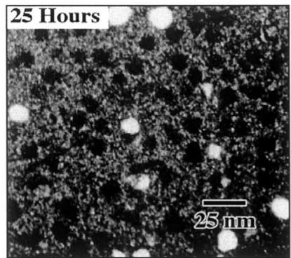  
b)

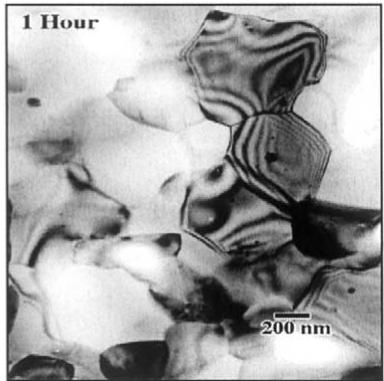  
Fig. 1. Dark field TEM image of nanocrystalline $\mathbf { A l } _ { 9 0 } \mathrm { F e } _ { 5 } \mathbf { G } \mathbf { d } _ { 5 }$ obtained by heat treating an amorphous ribbon at $1 5 0 ~ ^ { \circ } \mathrm { C }$ for 25 h (a) and bright field transmission electron microscope image of crystalline $\mathrm { \bf A l _ { 9 0 } F e } _ { 5 } \mathrm { \bf G d } _ { \underline { { { i } } } }$ obtained by heat treating an amorphous ribbon at $5 5 0 ~ ^ { \circ } \mathrm { C }$ for 1 h (b) [3].

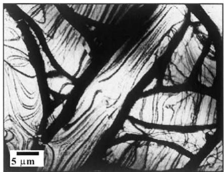  
Fig. 2. Dark field transmission electron micrograph of pure polycrystalline Al foil.

The working electrodes were tested using a 300 ml electrochemical flat cell equipped with a platinum mesh counter electrode, gas inlet and outlet ports, and a reference electrode port. All potentials were measured versus a saturated calomel electrode (SCE) scale with accuracy of $\pm 2 ~ \mathrm { \ m V }$ . A 0.6 M (3.5 wt.%) NaCl electrolyte was prepared using deionized water of 18 MV cm resistivity and ACS certified reagents. This electrolyte was deaerated with $\Nu _ { 2 }$ gas and the open circuit potential was measured for approximately 1 h followed by an anodic scan at 0.1 mV $\mathrm { s } ^ { - 1 }$ , and a reverse in scan direction at 0.05 mA. A PAR Model 273A or Model 283 potentiostat under computer control was utilized with $\mathrm { C o r r W a r e } ^ { \mathrm { T M } }$ corrosion measurement software. $E _ { \mathrm { p i t } }$ was taken at the potential at which the current density, current normalized to total exposed area, reached a value two orders of magnitude higher than the passive current density, $i _ { \mathrm { p a s s } } ,$ which ranged from 1 to $5 \mu \mathrm { \AA } \mathrm { c m } ^ { - 2 }$ . These parameters are clearly seen in the $E -$ log i diagram for a high purity aluminum microelectrode (Fig. 3(a)). $E _ { \mathrm { r p } }$ was taken as the potential where a distinct change in slope and characteristic shape of the reverse potentiodynamic scan was seen. $E _ { \mathrm { p i t } }$ and $E _ { \mathrm { r p } }$ reflected micrometer scale pit formation and repassivation, respectively (Fig. 3(b)). Cumulative probability distribution plots were constructed from $E _ { \mathrm { r p } }$ and $E _ { \mathrm { p i t } }$ data to compare the critical potential distributions for the amorphous, nanocrystalline, and crystalline alloys to pure polycrystalline aluminum foils. The survival probability $P _ { \mathrm { s } } ,$ defined as $n / N { + 1 }$ where n is the number of specimens surviving, i.e. not undergoing pit stabilization at applied potential $\operatorname { E } _ { N - n }$ and N is the total number of specimens in the test population, was also used to compare the localized corrosion behavior of the alloys [42]. Pit depths on the mb electrodes were estimated at the end of $E { - } I$ scans using Faraday’s law assuming a single pit since the entire surface area of the electrode was observed to be recessed2. The actual pit depths were measured from sectioned electrodes. Scanning electron microscopy was used to measure the pit diameters of the fs electrodes.

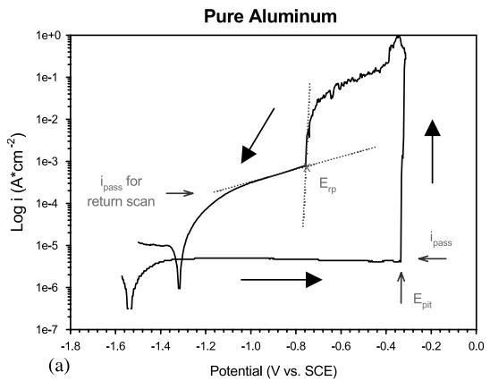

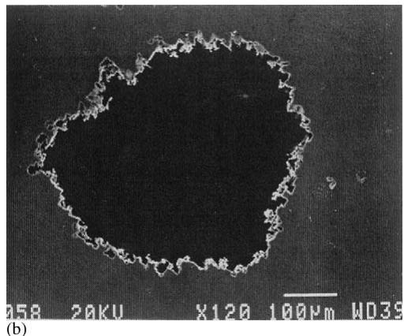  
Fig. 3. (a) E /log i behavior showing the determination of $E _ { \mathrm { p i t } }$ and $E _ { \mathrm { r p } }$ from an anodic potentiodynamic polarization experiment for pure Al. Electrode area is $1 0 ^ { - 4 } ~ \mathrm { { c m } } ^ { 2 } .$ The arrows show the direction of the potential scan. (b) Example of stable pit formed in polycrystalline Al after $E { \mathrm { - l o g } } ( i )$ scan to determine $E _ { \mathrm { r p } }$

## 3. Results

## 3.1. Critical potentials associated with micrometer-scale pitting

More positive mean values for $E _ { \mathrm { p i t } }$ and $E _ { \mathrm { r p } }$ were achieved for amorphous and nanocrystalline $\mathrm { A l } _ { 8 7 ^ { - } }$ $\mathrm { N i } _ { 8 . 7 } \mathrm { Y } _ { 4 . 3 }$ and $\mathrm { A l } _ { 9 0 } \mathrm { F e } _ { 5 } \mathrm { G d } _ { 5 }$ compared with that of pure polycrystalline Al as well as crystalline $\mathrm { A l _ { 8 7 } N i _ { 8 . 7 } Y _ { 4 . 3 } }$ and $\mathbf { A l } _ { 9 0 } \mathrm { F e } _ { 5 } \mathbf { G } \mathbf { d } _ { 5 }$ (Table 1). The alloys lost their improved localized corrosion resistance in the fully crystalline state as indicated by similar values for $E _ { \mathrm { p i t } }$ and $E _ { \mathrm { r p } }$ for the fully crystallized alloys and Al. No significant changes were seen in the passive current density and correlations between $E _ { \mathrm { p i t } }$ and $i _ { \mathrm { p a s s } }$ were not obtained for any of the alloys.

The values of $E _ { \mathrm { p i t } }$ and to a lesser extent $E _ { \mathrm { r p } }$ were found to vary over successive measurements under each condition. The distributions are more evident on a cumulative probability plot. Fig. 4(a) shows the cumulative probability distribution for $E _ { \mathrm { { c o r r } } } , E _ { \mathrm { { p i t } } }$ and $E _ { \mathrm { r p } }$ for pure Al in the mb electrode configuration. It shows the probability of obtaining a critical potential at or below the value on the x-axis. The median $E _ { \mathrm { p i t } }$ value for pure Al in the mb configuration was -/0.348 V, which is elevated above reported $E _ { \mathrm { p i t } }$ values for pure Al in 0.6 M NaCl. However, there is a finite probability that $E _ { \mathrm { p i t } }$ was as low as $E _ { \mathrm { r p } } .$ Moreover, the mean $E _ { \mathrm { p i t } }$ and $E _ { \mathrm { r p } }$ values for the larger surface area, fs electrodes, -/0.650 and - 0.806 V, respectively, are in good agreement with the published values for these conditions using large electrodes $[ 1 8 - 2 0 , 4 3 , 4 4 ] .$ The mean value of $E _ { \mathrm { r p } }$ for pure Al in the mb electrode configuration was -/0.754 V and was quite reproducible as indicated by the steep slope on the cumulative probability distribution plot.

Mean values of critical potential ranges (V vs. SCE) reported for indicated materials at the 99% confidence level
<table><tr><td>Material</td><td> $E _ { \mathrm { p i t } } \left( \mathrm { V } _ { \mathrm { S C E } } \right)$ </td><td> $E _ { \mathrm { r p } } \left( \mathrm { V } _ { \mathrm { S C E } } \right)$ </td></tr><tr><td> $P u r e \ A l$ </td><td></td><td></td></tr><tr><td> ${ \mathrm { F r e e ~ s t a n d i n g ~ } } ^ { \mathrm { a } }$ </td><td> $- 0 . 6 5 0 { \scriptstyle \pm 0 . 0 3 4 }$ </td><td> $- 0 . 8 0 6 { \scriptstyle \pm 0 . 0 3 3 }$ </td></tr><tr><td> $\mathbf { M i c r o e l e c t r o d e } ^ { \mathrm { ~ b ~ } }$ </td><td> $- 0 . 3 7 6 { \scriptstyle \pm 0 . 1 1 3 }$ </td><td> $- 0 . 7 5 4 { \scriptstyle \pm 0 . 0 0 9 }$ </td></tr><tr><td> $A m o r p h o u s ^ { \mathrm { ~ b ~ } }$ </td><td></td><td></td></tr><tr><td> $\mathrm { A l _ { 8 7 } N i _ { 8 . 7 } Y _ { 4 . 3 } }$ </td><td> $- 0 . 2 3 7 \pm 0 . 0 3 0$ </td><td> $- 0 . 3 5 8 { \scriptstyle \pm 0 . 0 1 1 }$ </td></tr><tr><td> $\mathbf { A l } _ { 9 0 } \mathrm { F e } _ { 5 } \mathbf { G } \mathbf { d } _ { 5 }$ </td><td> $- 0 . 0 9 9 { \scriptstyle \pm 0 . 0 9 3 }$ </td><td> $- 0 . 3 0 4 \pm 0 . 0 0 7$ </td></tr><tr><td> $N a n o c r y s t a l l i n e ^ { \mathrm { ~ b ~ } }$ </td><td></td><td></td></tr><tr><td> $\mathrm { A l _ { 8 7 } N i _ { 8 . 7 } Y _ { 4 . 3 } }$ </td><td> $- 0 . 1 3 3 \pm 0 . 1 6 7$ </td><td> $- 0 . 3 7 1 { \scriptstyle \pm 0 . 0 1 8 }$ </td></tr><tr><td> $\mathrm { \bf A l _ { 9 0 } F e } _ { 5 } \mathrm { \bf G d } _ { 5 }$ </td><td> $- 0 . 0 4 4 { \scriptstyle \pm 0 . 1 3 0 }$ </td><td> $- 0 . 3 3 4 { \scriptstyle \pm 0 . 0 0 9 }$ </td></tr><tr><td> $F u l l y \ c r y s t a l l i n e ^ { \mathrm { ~ b ~ } }$ </td><td></td><td></td></tr><tr><td> $\mathrm { A l _ { 8 7 } N i _ { 8 . 7 } Y _ { 4 . 3 } }$ </td><td> $- 0 . 1 4 3 \pm 0 . 1 9 4$ </td><td> $- 0 . 7 6 0 { \scriptstyle \pm 0 . 0 0 8 }$ </td></tr><tr><td> $\mathrm { \bf A l _ { 9 0 } F e } _ { 5 } \mathrm { \bf G d } _ { 5 }$ </td><td> $- 0 . 4 9 9 \pm 0 . 1 6 3$ </td><td> $- 0 . 7 9 8 \pm 0 . 0 0 6$ </td></tr></table>

Results reported for alloys are from mb electrodes.  
a Free standing electrode surface area is $1 0 ^ { - 1 } \mathrm { c m } ^ { 2 } .$  
b Microelectrode surface area is $1 0 ^ { - 4 } \mathrm { c m } ^ { 2 } .$

Fig. 4(b) shows the cumulative probability distribution for $E _ { \mathrm { { c o r r } } } , ~ E _ { \mathrm { { p i t } } }$ and $E _ { \mathrm { r p } }$ for $\mathrm { A l } _ { 9 0 } \mathrm { F e } _ { 5 } \mathrm { G d } _ { 5 }$ in the mb electrode configuration. It is interesting to note that $E _ { \mathrm { p i t } }$ and $E _ { \mathrm { r p } }$ are elevated compared with Al while $E _ { \mathrm { c o r r } }$ remains near -/1 V. To compare all alloys to Al, $E _ { \mathrm { r p } }$ was used due to its tight statistical distribution and lack of dependence on electrode surface area. The cumulative probability distributions in Figs. 5 and 6 clearly demonstrate the enhancement of $E _ { \mathrm { r p } }$ for both the amorphous and nanocrystalline states in both alloys. Fig. 5 shows the cumulative probability of obtaining a given repassivation potential for pure Al compared with amorphous $\mathrm { A l _ { 8 7 } N i _ { 8 . 7 } Y _ { 4 . 3 } }$ and $\mathrm { A l } _ { 9 0 } \mathrm { F e } _ { 5 } \mathrm { G d } _ { 5 } . \ E _ { \mathrm { r p } }$ for both amorphous alloys is approximately 400 mV more positive than that of pure Al. Fig. 5 also shows that the behavior for $\mathrm { A l _ { 8 7 } N i _ { 8 . 7 } Y _ { 4 . 3 } }$ and $\mathbf { A l } _ { 9 0 } \mathrm { F e } _ { 5 } \mathbf { G } \mathbf { d } _ { 5 }$ are similar. For this reason the next series of plots will focus only on $\mathrm { \bf A l _ { 9 0 } F e _ { 5 } G d _ { 5 } }$

Fig. 6 shows the $\mathrm { E _ { r p } }$ distributions for the amorphous, nanocrystalline and fully crystalline states of $\mathrm { A l } _ { 9 0 ^ { - } }$ $\mathrm { F e } _ { 5 } \mathrm { G d } _ { 5 }$ in comparison to pure polycrystalline Al. Upon repassivation, the average pit size is large ( 100 mm), therefore, the repassivation potentials were associated with pits that included considerable area fractions of the remaining amorphous matrix and many nanocrystals when tested in the nanocrystalline condition. That is to say that repassivated pits are much larger than the size of individual nanocrystals. Notably, the nanocrystalline alloy retained the improved resistance to micrometer size pit stabilization that was seen for the amorphous alloy as evident from similar values for $E _ { \mathrm { r p } }$ for the amorphous and nanocrystalline conditions (Fig. 6). The median values for $E _ { \mathrm { r p } }$ for the nanocrystalline materials were very similar to those of their amorphous counterparts and were enhanced as compared with the crystalline materials. The $E _ { \mathrm { r p } }$ distribution for the crystalline state of $\mathrm { A l } _ { 9 0 } \mathrm { F e } _ { 5 } \mathrm { G d } _ { 5 } ,$ also plotted in Fig. 6, shows that the median $E _ { \mathrm { r p } }$ value decreased over 400 mV to a value that is actually slightly less than that of pure polycrystalline Al. This was seen for both alloys in the fully crystalline state (Table 1). Pit growth tests for the crystalline alloys suggest that repassivation is not by non-maintenance of the critical depassivating environment owing to slow pit dissolution but by $\mathrm { H } ^ { + }$ consumption and OH production since repassivation did not occur until the onset of net cathodic kinetics during downward potential stepping. Intermetallics in the fully crystalline alloys were observed to increase the rate of the cathodic reaction that occurred within pits. Despite this, $E _ { \mathrm { r p } }$ still occurred at quite negative potentials suggesting that modest acidity was capable of maintaining pit growth. In contrast, repassivation of the amorphous and nanocrystalline alloys occurred by dilution of the critical depassivating environment and onset of repassivation as dissolution kinetics slowed in pits. This was indicated by an abrupt drop in anodic current towards passive current densities during downward potential stepping. This indicated the requirement for a very severe pit chemistry in order to maintain acid pitting in such amorphous and amorphous/nanocrystalline alloys.

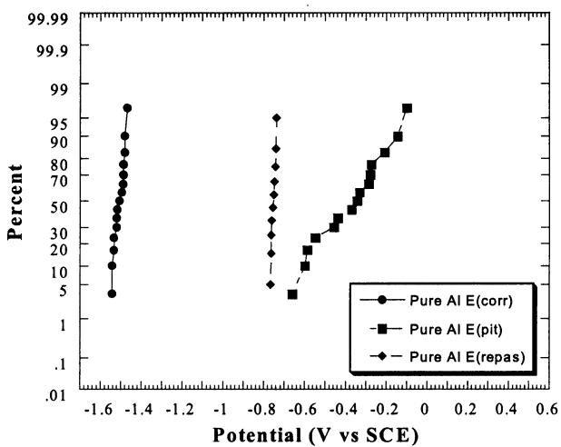

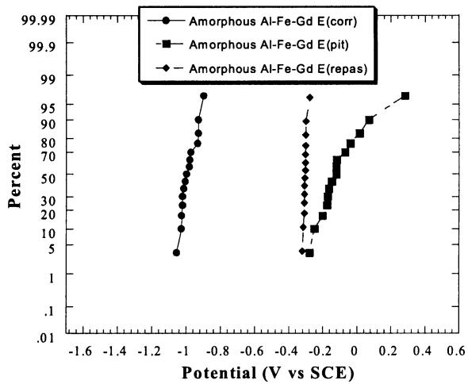  
Fig. 4. (a) Cumulative probability plot of $E _ { \mathrm { c o r r } } , E _ { \mathrm { p i t } } ,$ and $E _ { \mathrm { r p } }$ for high purity polycrystalline Al mb electrode (surface area of $1 0 ^ { - 4 } \mathrm { c m } ^ { 2 } )$ in deaerated 0.6 M NaCl. (b) Cumulative probability plot of $E _ { \mathrm { c o r r } } , E _ { \mathrm { p i t } } ,$ and $E _ { \mathrm { r p } }$ for $\mathrm { A l } _ { 9 0 } \mathrm { F e } _ { 5 } \mathrm { G d } _ { 5 }$ mb electrode (surface area of $1 0 ^ { - 4 } \mathrm { c m } ^ { 2 } )$ in deaerated 0.6 M NaCl.

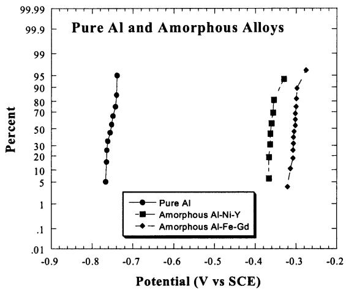  
Fig. 5. Cumulative probability plot of $E _ { \mathrm { r p } }$ for pure Al and amorphous alloy mb electrodes (surface area of $1 0 ^ { - 4 } ~ \mathrm { c m } ^ { 2 } )$ in deaerated 0.6 M NaCl showing the improved pit corrosion resistance of both amorphous alloys.

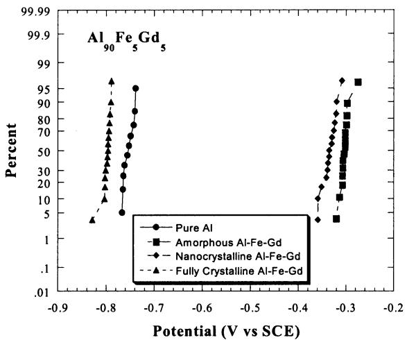  
Fig. 6. Cumulative probability plot of $E _ { \mathrm { r p } }$ values for amorphous, nanocrystalline, and crystalline $\mathrm { \bf A l _ { 9 0 } F e } _ { 5 } \mathrm { \bf G d } _ { 5 }$ mb electrodes (surface area of $1 0 ^ { - 4 } \mathrm { c m } ^ { 2 } )$ in comparison to pure Al in deaerated 0.6 M NaCl.

Fig. 7 shows the survival probability, $P _ { \mathrm { s } } ,$ versus potential for $\mathrm { A l } _ { 9 0 } \mathrm { F e } _ { 5 } \mathrm { C d } _ { 5 }$ . The probability of pit stabilization $( 1 - P _ { \mathrm { s } } )$ is greater at more negative potentials for the fully crystalline condition compared with the nanocrystalline alloy. In general, the fully crystalline materials indicate a greater probability of stable pitting at a lower potential, while the amorphous and nanocrystalline alloys would have to be exposed to a much higher potential to achieve the same probability of stable pit formation. Interestingly, nanocrystalline $\mathrm { A l } _ { 9 0 } \mathrm { F e } _ { 5 } \mathrm { G d } _ { 5 }$ had the lowest probability of breakdown and stabilization of micrometer scale $\mathrm { p i t s } ^ { 3 }$ compared with amorphous $\mathrm { \bf A l _ { 9 0 } F e } _ { 5 } \mathrm { \bf G d } _ { 5 } .$ The crystalline alloy had a lower probability of surviving compared with pure Al specimens. The explanation for this behavior is likely linked to the microstructural differences between the two samples.

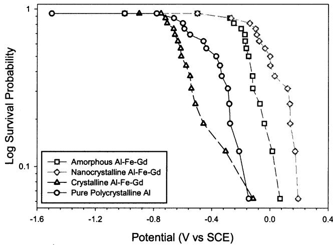  
Fig. 7. Survival probabilities with respect to stable pitting as a function of electrode potential for amorphous, nanocrystalline, and crystalline $\mathrm { A l _ { 9 0 } F e _ { 5 } G d _ { 5 } }$ in comparison to high purity, polycrystalline Al in deaerated 0.6 M NaCl (mb electrode).

## 3.2. Insight on spacing of critical flaws

A tight statistical distribution for $E _ { \mathrm { r p } }$ was always observed regardless of electrode size for pure polycrystalline Al as well as for both alloys. Moreover, small Al mb electrodes exhibited $E _ { \mathrm { r p } }$ values that were similar to those on large fs electrodes (Table 1). In contrast, the statistical distribution in $E _ { \mathrm { p i t } }$ was always larger (Fig. 4(a and b), Table 1) in studies using small surface area mb electrodes compared with larger surface area fs electrodes. Median $E _ { \mathrm { p i t } }$ was elevated above expected values for the crystalline Al mb electrodes when compared with large fs crystalline Al electrodes. Larger statistical distributions in $E _ { \mathrm { p i t } }$ were also seen in the cumulative probability plots for the alloys in the fully crystalline state using the mb electrode. It is reasonable to speculate that this behavior is due to the microstructural heterogeneity of the crystalline condition that exists on the length scale of the mb electrode surface dimensions.

The elevation in $E _ { \mathrm { p i t } }$ and change in the distributions may give insight on the size of the critical flaw that leads to stabilization. Fig. 8(a) shows the cumulative prob ability for achieving a given $E _ { \mathrm { p i t } }$ value in the case of mb $( 1 0 ^ { - \bar { 4 } } \ \mathrm { c m } ^ { 2 } )$ and fs $( 1 0 ^ { - 1 }$ cm2) electrodes of pure Al compared with amorphous $\mathrm { A l _ { 8 7 } N i _ { 8 . 7 } Y _ { 4 . 3 } }$ . A large statistical distribution of $E _ { \mathrm { p i t } }$ values was observed for pure polycrystalline Al mb electrodes, while the distribution for the larger surface area fs Al electrodes was much tighter. In contrast, a tight distribution is seen for both the small mb and large free standing electrodes in the case of the amorphous $\mathrm { A l _ { 8 7 } N i _ { 8 . 7 } Y _ { 4 . 3 } }$ alloy. In other words, there is little effect of electrode size on $E _ { \mathrm { p i t } }$ . The distribution in $E _ { \mathrm { p i t } }$ for amorphous $\mathbf { A l } _ { 9 0 } \mathrm { F e } _ { 5 } \mathbf { G } \dot { \mathbf { d } } _ { 5 }$ was larger and influenced more by surface area as seen in Fig. 8(b), but is still less distributed than data for polycrystalline Al. Fig. 9 summarizes the elevation in $E _ { \mathrm { p i t } }$ with decreasing electrode area as a function of alloy and heat treatment. For pure Al the elevation in $E _ { \mathrm { p i t } }$ for a mb is almost 300 mV; from -/0.647 V, a value in good agreement with the literature [18/20,43,44], to -/0.350 V. The elevation in the mean values for the amorphous and nanocrystalline $\mathrm { A _ { 8 7 } N i _ { 8 . 7 } Y _ { 4 . 3 } }$ microelectrodes is relatively insignificant at 38 and 40 mV, respectively (Fig. 9(a)). A similar trend was also found for the $\mathrm { A l } _ { 9 0 } \mathrm { F e } _ { 5 } \mathrm { G d } _ { 5 }$ alloy in the amorphous and nanocrystalline states albeit with a greater elevation in $E _ { \mathrm { p i t } }$ as seen in Fig. 9(b). It is interesting to note that the trend is towards greater elevation of $E _ { \mathrm { p i t } }$ for small surface area crystalline compared with fully amorphous electrodes. That is to say, when the degree of mm scale microstructural heterogeneity is increased by heat treatment then small area mb electrodes produce the greatest relative elevation in $E _ { \mathrm { p i t } }$ compared with larger electrodes.

It is interesting to note that $E _ { \mathrm { r p } }$ is only slightly or negligibly changed by electrode surface area. Fig. 10 verifies the similarity of $E _ { \mathrm { r p } }$ for mb $( 1 0 ^ { - 4 } \thinspace \mathrm { c m } ^ { 2 } )$ and fs electrodes $( 0 . 1 ~ \mathrm { c m } ^ { 2 } )$ of pure Al and amorphous $\mathrm { A l } _ { 8 7 ^ { - } }$ $\mathrm { N i } _ { 8 . 7 } \mathrm { Y } _ { 4 . 3 }$ . The difference in median $E _ { \mathrm { r p } }$ values for mb and free standing electrodes was only /50 mV for pure Al and $\sim 2 0 \ \mathrm { m V }$ for amorphous $\mathrm { A _ { 8 7 } N i _ { 8 . 7 } Y _ { 4 . 3 . } }$ Pits of several hundred micrometer diameter were repassivated at this critical potential (Fig. 11).

## 4. Discussion

4.1. Corrosion behavior as a function of the degree of crystallization

The finding that the nanocrystalline state of the Al TMRE alloys retains the corrosion resistance of their amorphous counterparts is extremely promising for potential future applications of these high strength materials. In conventional precipitation age hardened materials, strength must often be sacrificed for improved corrosion resistance. $E _ { \mathrm { p i t } }$ and $E _ { \mathrm { r p } }$ were enhanced for both the amorphous and nanocrystalline alloys as compared with their crystalline counterparts and pure polycrystalline Al (Figs. 4 and 5, Table 1). The amorphous structure of these alloys eliminates grain boundaries and second phase particles as sites of pit initiation [22/32], while TM or RE in solid solution may improve the resistance to localized corrosion [2,17 19,33/39,43] by enriching solute in the passive film [18,19,43], altering dissolution kinetics in pits [20,46,47], changing the severity of the critical pit solution, or helping form insoluble compounds that destabilize pit growth [21]. It is difficult to determine whether $E _ { \mathrm { p i t } }$ data indicate that the oxide film is less prone to initiation when the metal is amorphous or that $E _ { \mathrm { p i t } }$ is raised due to pit growth and stabilization considerations. Data suggest that the critical flaw promoting pit stabilization for the amorphous alloys may not be as prone to initiation as the critical flaw responsible for pit stabilization in fully crystalline materials and requires a more positive potential. Moreover, once a pit has been initiated in the amorphous alloys a more severe depassivating pit chemistry may be required to sustain growth. This is suggested by elevated $E _ { \mathrm { r p } }$ data.

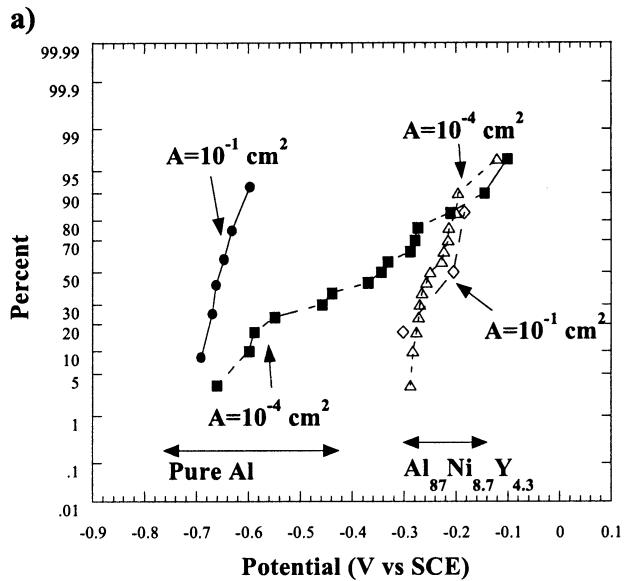

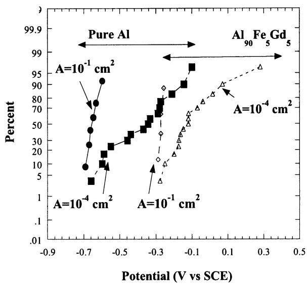  
Fig. 8. Cumulative probability plots of $E _ { \mathrm { p i t } }$ values for amorphous $\mathrm { A l _ { 8 7 } N i _ { 8 . 7 } Y _ { 4 . 3 } }$ (a) and $\mathbf { A l } _ { 9 0 } \mathrm { F e } _ { 5 } \mathbf { G } \mathbf { d } _ { 5 }$ (b) in comparison to polycrystalline Al for large and small surface area electrodes (deaerated 0.6 M NaCl). (m) Free standing polycrystalline Al, (j) mb polycrystalline Al, (2) free standing amorphous alloy, (^) mb amorphous alloy. Free standing test surface $\mathrm { a r e a } = \mathrm { l } 0 ^ { - 1 } \mathrm { \dot { c } m } ^ { \mathrm { 2 } }$ , mb area $\sim 1 0 ^ { - 4 } \mathrm { c m } ^ { 2 }$

Regarding pit initiation and growth in high strength nanocrystalline alloys, it is reasonable to assert that pits will be initiated more readily at the Al-rich fcc nanocrystals, if they lack TM or RE solute as conventional phase equilibrium considerations suggest. However, these pits may quickly face inhibited growth due to the solid solution solute gradient that exists at the nanocrystal/amorphous matrix interface. Moreover, in the presence of the highly enriched solute concentration gradient at the interface, an even more severe depassivating pit chemistry may be required. Therefore, nanopits that reach the high TM and RE regions at the nanocrystal/amorphous interface and grow into the amorphous matrix might be expected to require much higher applied potentials than pure Al in order to achieve and maintain stable pit growth conditions. This hypothesis will be examined in a subsequent paper focusing on artificial pit growth studies simulating the conditions for active pit growth.

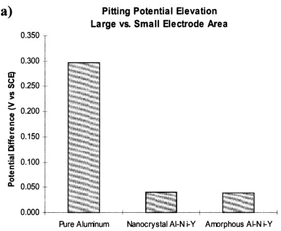

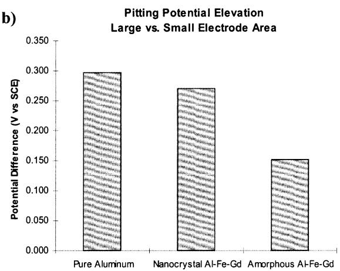  
Fig. 9. Elevation in $E _ { \mathrm { p i t } }$ given by the difference in the mean values of $E _ { \mathrm { p i t } }$ for microelectrodes compared with free standing electrodes. Cases shown are for amorphous and nanocrystalline $\mathrm { A l _ { 8 7 } N i _ { 8 . 7 } Y _ { 4 . 3 } ( a ) }$ and $\mathrm { A l _ { 9 0 } F e _ { 5 } G \dot { d } _ { \le } }$ 5 (b) in comparison to pure polycrystalline Al (deaerated 0.6 M NaCl).

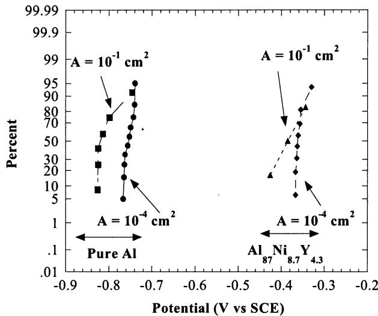  
Fig. 10. Cumulative probability distributions of $E _ { \mathrm { r p } }$ for large and small pure Al and amorphous $\mathrm { A l _ { 8 7 } N i _ { 8 . 7 } Y _ { 4 . 3 } }$ electrodes in deaerated 0.6 M NaCl demonstrating that $E _ { \mathrm { r p } }$ is independent of initial electrode surface area.

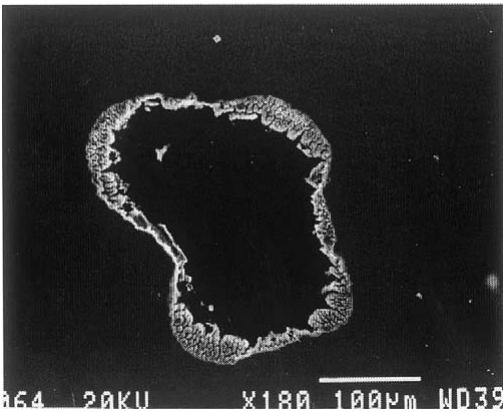  
Fig. 11. SEM/SEI micrograph of pit formed and repassivated in the amorphous $\mathrm { A l _ { 8 7 } N i _ { 8 . 7 } Y _ { 4 . 3 } }$ material using a free standing electrode.

The fully crystalline alloys possessed slightly worse corrosion behavior than pure polycrystalline Al as characterized by similar values for $E _ { \mathrm { p i t } }$ and $E _ { \mathrm { r p } }$ (Table 1, Figs. 6 and 7). The almost pure Al, crystalline matrix of the heat treated alloy, devoid of TM and RE [2/4], (Fig. 4) did not retain the localized corrosion resistance exhibited by the solid solution, amorphous matrix. Grain boundaries and intermetallic phases have been introduced as susceptible initiation sites [22/32] and pit growth is no longer hindered by TM and RE in solid solution because the beneficial alloy additions have been removed from solid solution and collected in intermetallic compounds formed.

Two possible explanations for the finding that high purity polycrystalline Al performs slightly better than the crystalline alloys (Figs. 6 and 7) are the higher population of grain boundaries and the presence of intermetallic phases in the crystalline alloy. Fig. 1(b), Fig. 2 show micrographs of the crystalline alloy and the pure Al foil. The size of the crystalline $\mathrm { A l } _ { 9 0 } \mathrm { F e } _ { 5 } \mathrm { G d } _ { 5 }$ grains is over 1000 times smaller than that found in the high purity polycrystalline aluminum tested here. Considering that grain boundaries are often critical flaws [28], a smaller grain size exposes more pitting initiation sites thereby degrading the corrosion resistance as compared with pure Al. Intermetallic phases may also degrade the pitting resistance of the crystalline alloys compared with pure Al as they introduce another easy pit initiation site [48,49].

## 4.2. Insight on critical flaws responsible for pit formation

The mb electrodes showed larger statistical distributions in $E _ { \mathrm { p i t } } ,$ and elevation in median $E _ { \mathrm { p i t } }$ values especially in the case of the crystalline materials. This elevation in $E _ { \mathrm { p i t } }$ is not likely due to differences in surface roughness between the microelectrodes and the free standing electrodes. Conventional arguments suggest that stable pit formation would be an easier process on electrodes with greater surface roughness due to mass transport considerations [41,50,51]. The surface of the polished mb electrode has greater small scale roughness compared with the fs electrodes and isolated polishing scratches in mb electrodes may be as prevalent and severe as ripples in fs electrodes. $E _ { \mathrm { p i t } }$ values measured for amorphous $\mathrm { A l _ { 8 7 } N i _ { 8 . 7 } Y _ { 4 . 3 } }$ mb electrodes were not elevated compared with the fs electrode (Fig. 8(a) and Fig. 9(a)). This effect is demonstrated by plotting the difference between the median values of $E _ { \mathrm { p i t } }$ for the mb electrodes and the fs electrodes for pure Al, amorphous and nanocrystalline $\mathrm { A l _ { 8 7 } N i _ { 8 . 7 } Y _ { 4 . 3 } }$ and $\mathbf { A l } _ { 9 0 } \mathrm { F e } _ { 5 } \mathbf { G } \mathbf { d } _ { 5 }$ in Fig. 9(a) and (b). One hypothesis links the elevation in the $E _ { \mathrm { p i t } }$ to differences in the structure between pure Al, the amorphous and the nanocrystalline alloys. The premise here is that by decreasing the electrode size to dimensions on the order of the spacing of the critical flaws that promote pit initiation and stabilization, then the total number of flaws on the at-risk exposed surface decreases. This may raise $E _ { \mathrm { p i t } }$ in a given upward scan because the possibility exists that some specimens will contain fewer flaws [52]. A greater probability of missing such a defect in the exposed ‘at-risk’ surface of a small electrode also creates the possibility of large data scatter due to specimen-to-specimen variation in defects. Conversely, if enough small electrodes are tested then there is a finite probability that some of the small electrodes will contain a fatal flaw and the foot of the cumulative probability plot for small electrodes will present data similar to that of large electrodes as seen in Fig. 8. This was also observed during pitting in stainless steel with MnS inclusions and AA 2024-T3 containing S-Al CuMg constituent particles, both well known pit sites [52,53]. Fig. 2 shows a TEM micrograph of the pure Al foil. The grain size is about 10/80 mm, which is on the order of the thickness of the Al mb electrode. Considering that grain boundaries are a likely critical site for pit initiation, $E _ { \mathrm { p i t } } ,$ , would be elevated because the average number of exposed grains would be decreased from the order of $1 0 ^ { 3 }$ for a fs electrode $( 0 . 1 \ \mathrm { c m } ^ { 2 } )$ to $1 0 ^ { 1 }$ for a mb $( 1 0 ^ { - 4 } \mathrm { c m } ^ { 2 } )$ as seen in Fig. 9. Similar arguments can be expressed regarding intermetallic particle spacing and large surface scratches or ridges in splat cooled ribbons if these sites control pit initiation.

The elevation in $E _ { \mathrm { p i t } }$ for the amorphous $\mathrm { A l _ { 8 7 } N i _ { 8 . 7 } Y _ { 4 . 3 } }$ mb electrodes (Fig. 8(a)) were insignificant compared with the fs electrode. This suggests that critical depassivating flaw, although more benign than grain boundaries or intermetallics, is far more closely spaced than any spacing on the order of the electrode dimensions. It is reasonable to speculate that as the electrode size is decreased to mb electrode dimensions, an ample population of these unknown critical flaws is still present on the amorphous surface. Therefore, $E _ { \mathrm { p i t } }$ is not affected. Consequently, $E _ { \mathrm { p i t } }$ does not change over the range of electrode surface areas explored. For amorphous Al90- $\mathrm { F e } _ { 5 } \mathrm { G d } _ { 5 }$ (Fig. 8(b)), a significant elevation in $E _ { \mathrm { p i t } }$ was found for mb electrodes for reasons not yet understood. The elevation in $E _ { \mathrm { p i t } }$ for amorphous $\mathbf { A l } _ { 9 0 } \mathrm { F e } _ { 5 } \mathbf { G } \mathbf { d } _ { 5 }$ microelectrodes is most likely not due to inhomogeneities in the bulk material since TEM studies show a completely homogeneous matrix [2,3,9,11]. One hypothesis to explain this higher deviation and scatter in $E _ { \mathrm { p i t } }$ for amorphous $\mathbf { A l } _ { 9 0 } \mathrm { F e } _ { 5 } \mathbf { G } \mathbf { d } _ { 5 }$ mb electrodes compared with amorphous $\mathrm { A l _ { 8 7 } N i _ { 8 . 7 } Y _ { 4 . 3 } }$ mb electrodes is the differences in surface morphology. Very different surface morphologies have been discovered on the as-spun ribbons as seen in Fig. 12(a) and (b). The images in Fig. 12(a) and (b) are of the side of the ribbon not in contact with the rotating wheel during the melt-spinning process. Both sides are exposed during testing of fs electrodes. The side in contact with the wheel has been shown to be similar for amorphous $\mathbf { A l } _ { 9 0 } \mathrm { F e } _ { 5 } \mathbf { G } \mathbf { d } _ { 5 }$ and $\mathrm { A l _ { 8 7 } N i _ { 8 . 7 } Y _ { 4 . 3 } }$ and is very smooth except for large ridges. Fig. 12(a) shows the featureless, smooth surface for amorphous $\mathrm { A l } _ { 9 0 } \mathrm { F e } _ { 5 } \mathrm { G d } _ { 5 }$ . If the critical flaw for an amorphous material is visible using AFM, this image would indicate that the spacing of a critical flaw is on the order of the dimensions of a microelectrode, thereby explaining the elevation in $E _ { \mathrm { p i t } }$ for this case. Fig. 12(b) shows the dominant surface morphology for amorphous $\mathrm { A l _ { 8 7 } N i _ { 8 . 7 } Y _ { 4 . 3 } }$ . Surface inhomogeneities in the form of hemispherical roughness are present and are closely spaced compared with the microelectrode dimensions. If these inhomogeneities are critical flaws, Fig. 12(b) explains the tight statistical distribution and lack of $E _ { \mathrm { p i t } }$ elevation for amorphous $\mathrm { A l _ { 8 7 } N i _ { 8 . 7 } Y _ { 4 . 3 } }$ in the mb electrode configuration since both the surface area of large fs as well as the small mb electrode would contain many of these surface flaws.

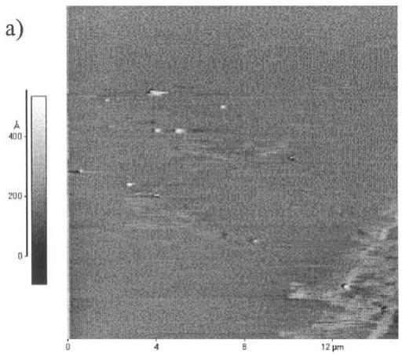

## 4.3. Insight on reproducibility and similarity of $E _ { r p }$

$E _ { \mathrm { r p } }$ was independent of initial electrode surface area (Table 1 and Fig. 10) and the population of small initiation sites exposed on a polished surface. However, $E _ { \mathrm { r p } }$ is likely dependent on the depth of the largest pit [54]. The reproducibility of $E _ { \mathrm { r p } }$ suggests that pits of similar depths were repassivated on all electrodes. The pit depths of pure Al microelectrodes subjected to anodic polarization were determined from anodic charge to be 538 mm (650 mm actual) while the pit diameter observed on fs electrodes was observed to be approximately 479 mm (Fig. 3(b)). The pit depths of amorphous $\mathrm { A l } _ { 8 7 } \mathrm { N i } _ { 8 7 } \mathrm { Y } _ { 4 . 3 }$ mb electrodes were 223 mm (315 mm actual), while the pit diameter observed on a fs electrode 308 mm (Fig. 11). Hence, similar pit depths are found on all electrodes and similar $E _ { \mathrm { r p } }$ should be expected despite different electrode surface areas [54]. Therefore, changes in $E _ { \mathrm { r p } }$ as a function of alloy and heat treatment likely reflect intrinsic material differences and reflect the critical pit chemistry required for pit stabilization [55], not differences in geometric conditions affecting mass transport properties that likely govern repassivation by the acid pitting mechanism [54].

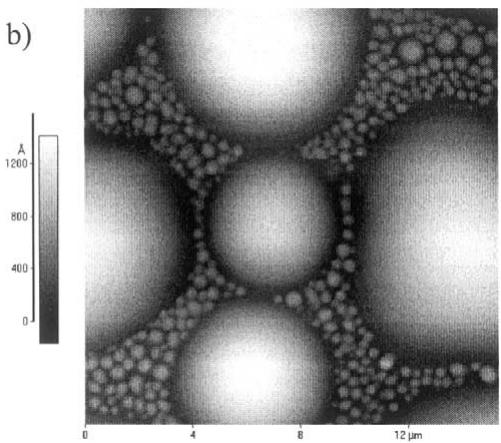  
Fig. 12. Atomic force microscope images of the surface morphologies of as-spun amorphous $\begin{array} { r l } {  { \mathrm { A l } _ { 9 0 } \mathrm { F e } _ { 5 } \mathrm { G d } _ { \underline { { s } } } } } \end{array}$ (a) and amorphous $\mathrm { { A l } _ { 8 7 } \mathrm { { N i } _ { 8 . 7 } \mathrm { { Y } _ { 4 . 3 } \ ( b ) } } }$ .

## 5. Conclusions

1) Solid solution TM and/or RE alloy additions as well as the amorphous structure of the as-solidified Al Fe/Gd and Al/Ni/Y alloys significantly enhances $E _ { \mathrm { r p } }$ compared with polycrystalline Al suggesting that these materials are more resistant to corrosion damage caused by the growth of micrometer scale pits.

2) The nanocrystalline alloys retained the pit corrosion resistance of the amorphous alloys as indicated by retention of elevated $E _ { \mathrm { r p } }$ even when 1015 nm nanocrystals are embedded in the amorphous matrix.

3) Complete crystallization, involving depletion of TM and RE formerly in solid solution and the formation of intermetallic phases, degrades the corrosion resistance of the Al/TM/RE alloys as characterized by lower values of $E _ { \mathrm { p i t } }$ and $E _ { \mathrm { r p } }$ compared with the fully amorphous condition and critical potentials similar to polycrystalline Al.

4) $E _ { \mathrm { r p } }$ was very reproducible in both large (0.1 cm2) and small $( 1 \dot { 0 } ^ { - 4 } \mathrm { c m } ^ { 2 } )$ electrodes owing to formation and repassivation of similar sized pits in both large and small electrodes. Therefore, differences in $E _ { \mathrm { r p } }$ as a function of alloy heat treatment reflect intrinsic differences and differences in critical pit chemistries, not alteration of geometric conditions that might affect the mass transport factors governing pit repassivation.

5) The spacing, population and identity of critical flaws compared with the electrode test area have a significant effect on the value and the variability of $E _ { \mathrm { p i t } }$ . This study suggests that the critical depassivating flaw for the amorphous material is not only more benign but smaller and more finely spaced than the proposed critical flaws, grain boundaries and second phase particles in the fully crystalline materials.

## Acknowledgements

A multi-university research initiative (Grant No. F49602-01-1-0352) entitled ‘The development of an environmentally compliant multifunctional coating for aerospace applications using molecular and nano-engineering methods’ under the direction of Lt. Col. Paul C. Trulove at AFOSR partially supported this study while the remainder of the support was from the National Science Foundation (DMR-0204840). Electrochemical instrumentation and software in the Center for Electrochemical Science and Engineering are supported by EG&G Instruments and Scribner Associates, Inc.

## References

[1] B. Cao, S. Li, D. Yi, J. Less Common Met. 171 (1991) 1.

[2] R. Chmielewski, R. Sodhi, S.J. Thorpe, Corrosion, Electrochemistry, and Catalysis of Metastable Metals and Intermetallics, The Electrochemical Society, Pennington, NJ, 1993, p. 84.

[3] A.A. Csontos, Phase transformations in Al-based metallic glasses, M.S. thesis, University of Virginia, Charlottesville, VA, 1996.

[4] A. Goyal, B.S. Murty, S. Ranganathan, J. Mater. Sci. 28 (1993) 6091.

[5] V. Kwong, Y.C. Koo, S.J. Thorpe, T. Aust, Acta Metall. Mater. 39 (7) (1991) 1563.

[6] G.J. Shiflet, Glassy metals, in: Kirk-Othmer Encyclopedia of Chemical Technology, Wiley, 1994, p. 656.

[7] K. Hono, Y. Zhang, A. Inoue, T. Sakurai, Mater. Trans. JIM 36 (7) (1995) 909.

[8] J.R. Davis, Aluminum and Aluminum Alloys, ASM International, Materials Park, OH, 1993, p. 784.

[9] A. Csontos, G. Shiflet, Nanostruct. Mater. 9 (1997) 281.

[10] K. Hono, Y. Zang, A.P. Tsai, A. Inoue, T. Sakurai, Scr. Metall. Mater. 32 (2) (1995) 191.

[11] A. Csontos, G. Shiflet, in: E. Ma, B. Fultz, R. Shell, J. Morral, P. Nash (Eds.), Chem. Phys. Nanostruc. Related Non-Equil. Mater, TMS-AIME, Warrendale, PA, 1997, pp. 13/22.

[12] R.G. Buehheit, G.E. Stoner, G.J. Shiflet, The Application of Surface Analysis Methods to Environmental Material Interactions, vols. PV 91-7, The Electrochemical Society, 1990, p. 490.

[13] R. Bley, J. Hsu, J.R. Scully, Philos. Mag. Lett. 80 (2) (2000) 85.

[14] M.D. Archer, C.C. Corke, B.H. Harji, Electrochim. Acta 32 (1) (1987) 13.

[15] H.S. Chen, Metallic glasses update, in: Micromechanics of Advanced Materials, TMS, Murray Hill, NJ, 1995.

[16] Z. Szklarska-Smialowska, Pitting Corrosion of Metals, NACE, Houston, TX, 1986, p. 431.

[17] G.S. Frankel, M.A. Russak, C.V. Jahnes, M. Mirzamaani, V.A. Brusic, J. Electrochem. Soc. 136 (4) (1989) 1243.

[18] W.C. Moshier, G.D. Davis, J.S. Ahearn, H.F. Hough, J. Electrochem. Soc. 134 (11) (1987) 2677.

[19] B.A. Shaw, G.D. Davis, T.L. Fritz, B.J. Rees, J. Electrochem. Soc. 138 (11) (1991) 3288.

[20] G.S. Frankel, R.C. Newman, C.V. Jahnes, M.A. Russak, J. Electrochem. Soc. 140 (1993) 2193.

[21] Z. Szklarska-Smialowska, Corros. Sci. 33 (1992) 1193.

[22] M.S. Hunter, G.R. Frunk, D.L. Robinson, Second International Congress on Metal Corrosion, NACE, Houston, TX, 1963.

[23] I.L. Muller, J.R. Galvele, Corros. Sci. 17 (1977) 179.

[24] A. Garner, D. Tromans, Corrosion 35 (2) (1979) 55.

[25] K. Urushino, K. Sugimoto, Corros. Sci. 19 (1979) 225.

[26] R.G. Buchheit, R.P. Grant, P.F. Hlava, B. McKenzie, G.L. Zender, J. Electrochem. Soc. 144 (8) (1997) 2621.

[27] N.D. Tomashov, G.P. Chernova, N. Markova, Corrosion 20 (5) (1964) 166t.

[28] Z. Szklarska-Smialowska, M. Janik-Czachor, Corros. Sci. 7 (1967) 65.

[29] N.D. Tomashov, G.P. Chernova, N. Markova, Zaschita Metallov 6 (1970) 21.

[30] E. Brauns, W. Sehwenk, Eisenhuettenw 22 (1961) 387.

[31] J.R. Scully, D.E. Peebles, A.D. Romig, D.R. Frear, C.R. Hills, Metall. Trans. 23A (1992) 2641.

[32] G.S. Chen, M. Gao, R.P. Wei, Corrosion 52 (1) (1996) 8.

[33] A. Mansour, C. Melendres, J. Electrochem. Soc. 142 (6) (1995) 1961.

[34] A.N. Mansour, C.A. Melendres, S.J. Poon, Y. He, G.J. Shiflet, J. Electrochem. Soc. 143 (2) (1996) 614.

[35] A.N. Mansour, A.N. Mansour, C.A. Melendres, M. Pankuch, S.J. Poon, Y. He, G.J. Shiflet, Surf. Sci. Spectra 2 (3) (1993) 184 194.

[36] A.N. Mansour, S.J. Poon, Y. He, G.J. Shiflet, Surf. Sci. Spectra 2 (1) (1993) 31.

[37] H.J. Lee, E. Akiyama, H. Habazaki, A. Kawashima, K. Asami, K. Hashimoto, Corros. Sci. 38 (8) (1996) 1269.

[38] S. Virtanen, H. Bo¨ hni, Corros. Sci. 35 (1 /4) (1993) 27.

[39] H. Habazaki, A. Kawashima, K. Asami, K. Hashimoto, The Application of Surface Analysis Methods to Environmental/ Material Interactions, vols. PV 91-7, The Electrochemical Society, 1990, p. 467.

[40] J.F. Shackelford, Introduction to Material Science for Engineering, 4th ed, Prentice Hall, Upper Saddle River, NJ, 1996, p. 239.

[41] G.T. Burstein, P.C. Pistorius, Corrosion 51 (5) (1995) 380.

[42] T. Shibata, T. Takeyama, Corrosion 33 (1997) 243.

[43] G.D. Davis, B.A. Shaw, B.J. Rees, M. Ferry, J. Electrochem. Soc. 140 (4) (1993) 951.

[44] S.T. Pride, J.R. Scully, J.L. Hudson, J. Electrochem. Soc. 141 (11) (1994) 3028.

[45] P.C. Pistorius, G.T. Burstein, Phil. Trans. R. Soc. London A341 (1992) 531.

[46] R.C. Newman, Corros. Sci. 25 (5) (1985) 341.

[47] G.S. Frankel, Corros. Sci. 30 (1990) 1203.

[48] A.P. Bond, G.F. Bulling, H.A. Domain, H. Billom, J. Electrochem. Soc. 13 (1996) 773.

[49] C.A. Gehring, M.H. Peterson, Corrosion 37 (4) (1981) 232.

[50] D.E. Williams, C. Westcott, H. Fleischmann, J. Electrochem. Soc. 132 (8) (1985) 1796.

[51] P.E. Manning, D.J. Duquette, W.F. Savage, Corrosion 35 (1979) 151.

[52] G.O. Ilevbare, G.T. Burstein, Corros. Sci. 38 (12) (1996) 2257.

[53] T. Suter, R.C. Alkire, J. Electrochem. Soc. 148 (1) (2001) B36 B42.

[54] G.S. Frankel, J.R. Scully, C.V. Jahnes, J. Electrochem. Soc. 143 (1996) 1834.

[55] J.E. Sweitzer, J.R. Scully, R.A. Bley, J.W.P. Hsu, Electrochem. Solid State Lett. 2 (6) (1999) 267.