# THE ROLE OF MOLYBDENUM ADDITIONS TO AUSTENITIC STAINLESS STEELS IN THE INHIBITION OF PITTING IN ACID CHLORIDE SOLUTIONS\*

K. SUGIMOTO and Y. SAWADA

Department of Metallurgy, Faculty of Engineering, Tohoku University, Sendai, Japan

Abstract—In order to clarify the mechanism for increased resistance to pitting in acid chloride solutions by addition of Mo to Cr-Ni stainless steels, the anodic polarization curves, a.c. electrode impedances, ellipsometric parameters and X-ray photo-electron spectra have been measured on the Mo-containing steels passivated in 1N HCl. The results showed that the presence of an adequate amount of Cr is indispensable for the improvement of pitting resistance by the Mo addition. The passive films of the Mo-containing steels were found to be composed of a complex oxyhydroxide containing Crª+ Fe³+, Ni²+, Moª+ and Cl- and showed a rather higher d.c. resistance in HCl solution than in $\mathbf { H _ { 8 } S O _ { 4 } }$ solution. The thickness of the passive film increases with increase in Mo content.

## INTRODUCTION

IT HAs long been known that additions of Mo to austenitic Cr-Ni stainless steels, to a marked degree, improve resistance to chloride pitting.1-1s The mechanism by which the increased resistance is obtained is not well understood. According to the literature, the following propositions have been made as to the effect of alloyed Mo: (1) thickening of the passive films of the steels,14 (2) forming a heteropoly acid† film which is less readily hydrolysed and more readily polymerized,1⁵ (3) impeding the adsorption of Cl- on to the surface of the steel by increasing the oxygen affinity of the steel,8 and (4) forming an amorphous oxide film with a glassy structure.1º Each of these effects is thought to be important and has to be taken into account in elucidating the mechanism for the improvement of pitting resistance by alloying with Mo. In addition, however, the electrochemical behaviour of Mo in the potential region of passivity for Mo-containing Cr-Ni steels must also be an important factor to be considered.

In previous work, it has been reported that alloyed Mo in Cr-Ni stainless steels causes the transpassive reaction in the potential range where the Mo-containing Cr-Ni steels passivate.17 A theoretical examination of thermodynamic data shows that the product of the transpassive reaction of Mo depends on the pH of test solutions; that is, $\mathbf { M o O _ { 3 } }$ is formed in solutions with pH < ca. 3.5 and $\mathbf { M o O } _ { 4 } ^ { 2 - }$ (or HMoO{) in solutions with pH > ca. 3.5.18 Consequently, alloyed Mo in Cr-Ni stainless steels will be retained in the passive films as a Mo(VI) oxide or dissolve into solutions as $\mathbf { M o O } _ { 4 } ^ { 2 - }$ according to the pH of the solutions used when the Mo-containing Cr-Ni steels are polarized up to the potentials at which the steole pasivate.

Since $\mathbf { M o O } _ { 4 } ^ { 2 - }$ can serve as a very effective pitting inhibitor, pitting of the Mocontaining steels in neutral chloride solutions may be inhibited by $\mathbf { M o O } _ { 4 } ^ { 2 - }$ ions which are formed by dissolution of Mo in the steels.17,19 In the case of acid chloride solutions in which $\mathbf { M o O } _ { 4 } ^ { 2 - }$ ions are thermodynamically unstable, an increase in pitting resistance by the addition of Mo to the steels should be brought about by the improvement of properties of the passive films by Mo(VI) oxide present in the films.

The purpose of the present investigation is to clarify the origin of increased pitting resistance with increasing Mo content in acid chloride solutions by examination of the composition and characteristics of the passive films formed in these solutions. For this purpose, measurements of anodic polarization curves in HCl solution and, in some cases, in $\mathbf { H _ { 2 } S O _ { 4 } }$ solution, were performed on the $\mathbf { C r { - } N i }$ stainless steels with varying amounts of Mo, several pure components of the steels, and combinations of the two alloying components. On the basis of the results of these polarization measurements, subsequent experiments were carried out to determine the critical composition at which Mo makes the steels highly resistant to pitting. Measurements of a.c. impedance, ellipsometric parameters, and X-ray photo-electron spectra were then conducted on the passive films formed on the surfaces of the Mo-containing Cr-Ni steels in order to investigate how the electrical properties, thickness, optical constants, and chemical composition of the films change with the Mo content of the steels. On the basis of these experimental results, the role of alloyed Mo in the steels in the inhibition of pitting in acid chloride solutions is considered and discussed.

## EXPERIMENTAL METHOD

Specimens

Rolled sheets of austenitic 20Cr-25Ni steels containing 0–5 wt% Mo were used as specimens and the analytical compositions of these steels are listed in Table 1. All of these specimens were heated in vacuo at 1050°C for 2 h and then water-quenched to 0°C. In addition, 25Ni-5Mo steels containing 5–20 wt % Cr, Fe–-Cr alloys (Cr:15–70 wt %), Fe-Mo alloys (Mo:4–59wt %), Ni–Mo alloys (Mo:5–20 wt%, and pure Fe, Cr, Ni and Mo were also used as specimens. These specimens were subjected to suitable heat treatments to obtain homogeneous and annealed structures. The specimens were cut to a size of $4 0 \times 2 0 \times 1 . 5$ mm for the electrochemical polarization and the a.c. impedance measurements, 30 × 20 × 1.5 mm for ellipsometry, and $1 8 \times 5 \times 0 . 3$ mm for X-ray photo-electron spectroscopy (XPS or ESCA).

Specimens, except for those used for ellipsometry, were mechanically polished with emery paper up to No. 6/0 and with cloth using a dilute suspension of chromium oxide, degreased with absolute ethyl alcohol, washed in distilled water, and finally dried by air blasting. The specimens used for ellipsometry were finished with polishing by use of diamond paste and degreased in ultrasonic baths of petroleum ether and absolute ethyl alcohol.

The surfaces of specimens were masked with PTFE seal tapes attached to an epoxy-resin under coating except for an area of $1 \ \times \ 1 \ \mathrm { c m } ^ { \bullet }$ for electrochemical polarization measurements and a.c. impedance measurements and $2 \times 1 ~ { \mathsf { c m } } ^ { \mathrm { ~ \circ ~ } }$ for ellipsometry, while those for XPS measurements were not masked.

TABLE 1. COMPOSITIONS OF THE STEELS STUDIED (Wt %)
<table><tr><td>Specimen</td><td>C</td><td>Si</td><td>Mn</td><td>P</td><td>S</td><td>Cr</td><td>Ni</td><td>Mo</td></tr><tr><td>20Cr-25Ni</td><td>0.053</td><td>0.54</td><td>1.53</td><td>0.009</td><td>0.010</td><td>20.06</td><td>25.58</td><td>0.01</td></tr><tr><td>20Cr-25Ni-1Mo</td><td>0.057</td><td>0.48</td><td>1.48</td><td>0.009</td><td>0.010</td><td>19.99</td><td>25.88</td><td>1.05</td></tr><tr><td>20Cr-25Ni-3Mo</td><td>0.064</td><td>0.52</td><td>1.47</td><td>0.009</td><td>0.010</td><td>20.16</td><td>25.52</td><td>2.97</td></tr><tr><td>20Cr-25Ni-5Mo</td><td>0.059</td><td>0.46</td><td>1.44</td><td>0.008</td><td>0.010</td><td>19.96</td><td>25.66</td><td>5.06</td></tr></table>

Electrolytic solutions

1NHCl $( \mathbf { p } \mathbf { H } = \mathbf { 0 } . 0 2 )$ was mainly used as the test solution and, in some cases, 1] $\aleph \mathbf { H _ { 2 } S O _ { 4 } } ( \mathbf { p H } = 0 . 4 )$ was used for comparison. All solutions used were de-aerated by bubbling purified nitrogen for more than 30 min.

## Electrochemical polarization measurements

In the measurement of anodic polarization curves, the electrode potential was regulated by a potentiostat and current recording was made after holding the potential for 1 min at each setting of the potential which was increased successively in steps of 25 mV from the corrosion potential. The reference electrode, to which all potentials are referred, was a saturated calomel electrode. Measurements were carried out in de-oxygenated solutions at room temperature $( 2 5 ^ { \circ } \mathbf { C } )$ under stationary conditions.

## A.C. impedance measurements

The a.c. electrode impedances of various stainless steels were measured at a fixed potential in the passive region by using an apparatus for measuring Lissajou's ellipse, coupled to a potentiostat or a galvanostat.2º The applied a.c. amplitude was held at ca. 5 mV. For the frequency range 104–1 Hz, Lissajou's figures were recored on the Braun tube of a synchroscope and, for the range $\mathbf { 1 - 1 0 ^ { - 3 } \ H z , }$ on an X-Y chart recorder. The series capacitive reactance, $1 / \omega C _ { \cdots }$ and the series resistance, $\pmb { R } _ { \pmb { \imath } } ,$ were obtained by analysis of the resulting ellipse and the complex impedance, $Z = R _ { * } - \mathrm { j } \mathrm { / o c } _ { w }$ was plotted at each potential, It is clear that the resistance at zero frequency, $R _ { \odot  \infty }$ of the complex impedance diagram is the d.c. resistance of the passive film, which is thought to be directly proportional to the corrosion resistance of the film.²1

## Ellipsometric measurements

To determine the thickness and optical constants of passive films formed on the Mo-containing 20Cr-25Ni steels, the ellipsometric measurements were carried out on the steel surfaces during anodic polarization in solutions. The electrochemical-optical cell had the same shape as that used by Sato'et al. and two optical windows whose angle of incidence was $6 0 ^ { \circ } .$ A Mizojiri Kogaku type MD-36M ellipsometer was used for the measurements. Ellipsometric parameters, ∆ and $\Psi ,$ at the extinction point were measured after specimens had been held at each potential for 1 h. The wavelength of the monochromatic light used for the measurement was 5461 Å, its angle of incidence being 60.00°. The film thickness and the optical constants were calculated from the values of ∆ and ψ with the aid of a NEAC 2200 MOD VII computer on the basis of exact Drude's equations.ªª

## XPS measurements

In order to investigate the kinds and valencies of the constituent atoms of passive films formed on specimens in HCl solution, the surfaces of specimens treated at various potentials for 1 h were analyzed by means of XPS using a Kokusai Denki type KES-X-2001 electron spectrometer. Specimens were irradiated with Al Kα radiation with a mean energy of 1486.6eV. The voltage and the current applied to an X-ray tube were 10KV and 20mA, respectively. The specimen container was evacuated to $\mathbf { \bar { 1 0 ^ { - 7 } } }$ Torr and held at r.t. The photo-electron spectra of the $2 p _ { 1 } / _ { 8 }$ and $2 \pmb { p } _ { \pmb { \imath } } / \bullet$ levels for Fe, Cr, Ni and Cl, the $3 d _ { 8 i \geq }$ and $3 d _ { 5 / 2 }$ levels for Mo, and the 1s level for O and C were measured. The binding energies at the peaks observed in the photo-electron spectra obtained were corrected by using the value of the energy of C 1s level observed as the background spectrum, assuming the difference in energy between the 1s level of C and the Fermi level of metallic Pd to be 285.0eV.

## EXPERIMENTAL RESULTS

## Anodic polarization curves

Figure 1 shows anodic polarization curves for 20Cr-25Ni stainless steels containing 0-5 wt $\% \mathbf { M o }$ in 1N HCl at $2 5 \mathrm { ^ \circ C } .$ As clearly seen in the Figure, an increase in the Mo content shifts the pitting potential in the noble direction and pitting does not occur on the steel with 5 wt $\% \mathbf { M o }$ up to the potential for the onset of transpassive dissolution $( c a . + 0 . 8 5 \ : \mathrm { V } )$ . Investigations to find the cause of this increase in resistance to pitting by Mo alloying were made.

The anodic polarization curves in 1N HCl of pure Fe, Cr, Ni and Mo which are the main components of the Mo-containing 20Cr-25Ni steel are compared in Fig. 2 with those for the 20Cr-25Ni steel and the 20Cr-25Ni-5Mo steel. Pure Fe and Ni show the active dissolution from their corrosion potentials and are not passivated. Pure Mo exhibits the transpassive dissolution above — 0·03 V and dissolves at a high rate in the passive region of the 20Cr-25Ni-5Mo steel. The occurrence of the transpassive dissolution of Mo above — 0.03 V was also observed on the anodic polarization curve of Mo in 1N $\mathbf { H _ { 2 } S O _ { 4 } } .$ A thick dark blue oxide layer formed on the surface of a Mo electrode during the transpassive dissolution. This layer was found to be composed of Mo(VI) oxide, e.g. $\mathbf { M o O _ { 3 } } ,$ by means of XPS. The layer was so fragile and porous that it could not inhibit the dissolution of a Mo electrode. Pure Cr did not show pitting in this solution and maintained its passivity up to + 0.85 V above which the transpassive dissolution occurred. It should be noted that the passive region of Cr completely covers that of the 20Cr-25Ni-5Mo steel.

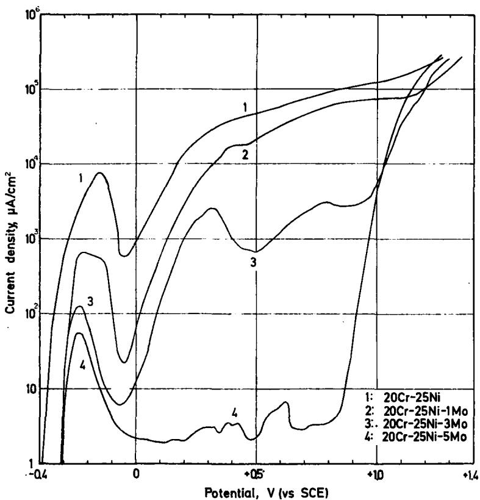  
FiG. 1. Anodic polarization curves for 20Cr-25Ni stainless steels containing 0–5 wt%Mo in 1N HCl at ${ \bf 2 5 ^ { \circ } C } .$

These results show that Cr makes the greatest contribution to the increase in the pitting resistance among the components of the 20Cr-25Ni-5Mo steel. It seems strange that alloyed Mo increases dramatically the pitting resistance of stainless steels while pure Mo dissolves at a high rate in the potential region where the 20Cr-25Ni-5Mo steel passivates. This suggests that Mo takes part in increased resistance to pitting only as an alloying element.

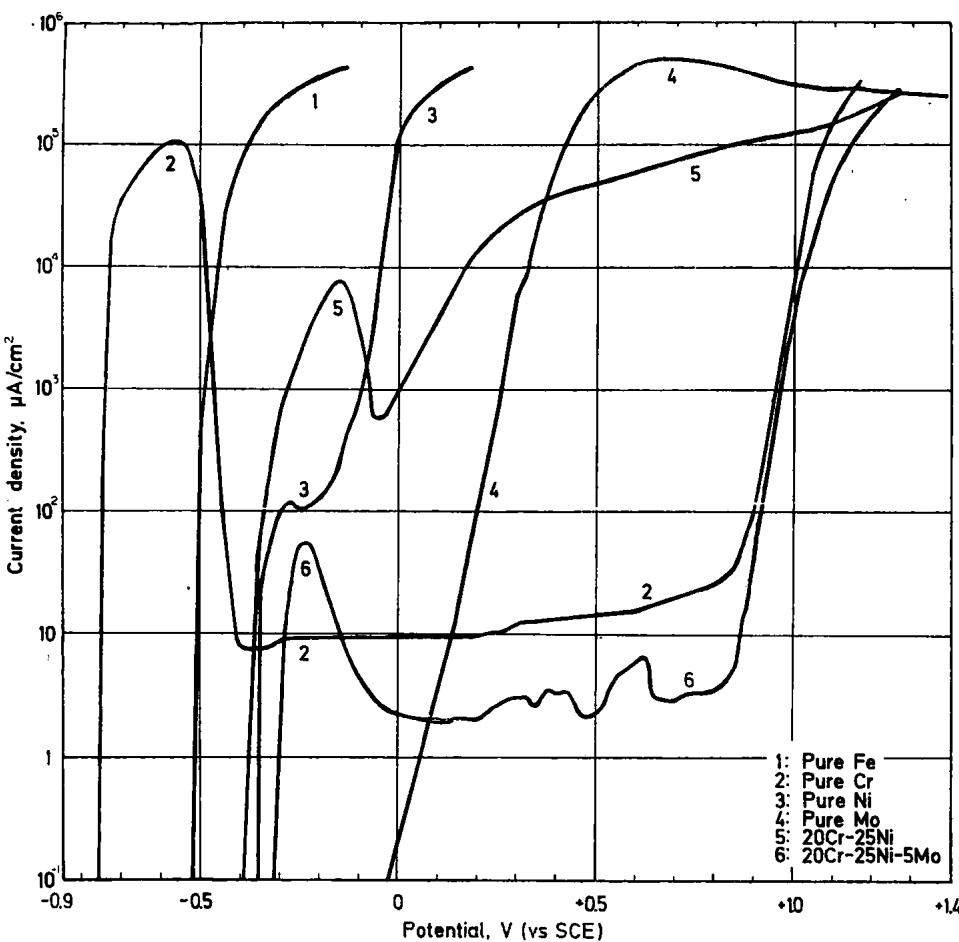  
FiG. 2. Anodic polarization curves for pure Fe, Cr, Ni and Mo and 20Cr-25Ni stainless steels with and without Mo in 1N HCl at $\mathsf { \pmb { 2 5 } } ^ { \circ } \mathsf { \bf C } .$

An examination was carried out to find a combination between Mo and Fe, Cr or Ni which could exhibit a higher resistance to chloride pitting, by measuring anodic polarization curves of the binary alloys of Fe-Cr, Fe-Mo, and Ni-Mo in 1N HCl.

Figure 3 shows the anodic polarization curves of Fe-Cr alloys containing 15- 70 wt $\% 0 .$ The pitting potential of the alloys shifts in the noble direction with increase in Cr content. When the alloys contained $> 4 0$ wt $\% \mathrm { \Omega }$ , pitting did not occur in the alloys. It should be noted that, in the case of the Fe-Cr alloys without Mo, the amount of Cr needed to attain complete inhibition of pitting in 1N HCl is about twice that of the 20Cr-25Ni-5Mo steel.

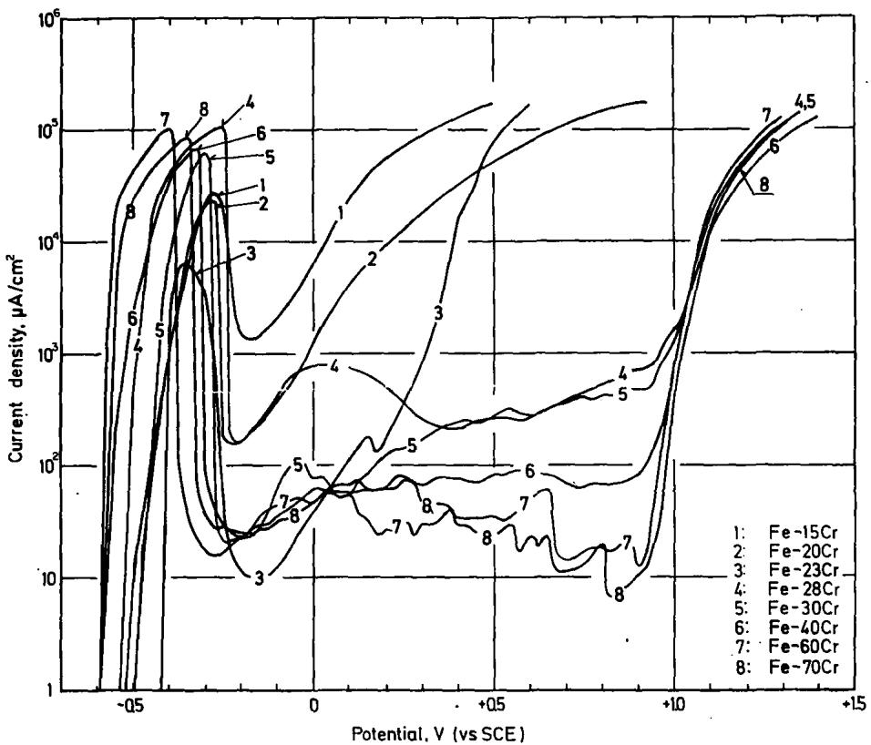  
FiG. 3. Anodic polarization curves for Fe-Cr binary alloys containing 15-70 wt % Cr in 1N HCl at $2 5 ^ { \circ } \mathbf { C } .$

Figure 4 shows the anodic polarization curves of Fe-Mo alloys containing 4 20 wt%Mo. The alloys of this type dissolve actively from their corrosion potentials and are not passivated in 1N HCl at all. Combinations of Fe and Mo do not bring about improved pitting resistance. Since Fe-Mo alloys can be passivated in 1N $\mathbf { H _ { 2 } S O _ { 4 } } ,$ the effect of Mo alloyed with Fe on the current density in the passive state was examined by using the anodic polarization curves measured in 1N $\mathbf { H _ { 2 } S O _ { 4 } }$ . The results are shown in Fig. 5. It is shown that the current density in the passive region of the alloy increases with increasing Mo content. Therefore, Mo is an alloying element which decreases the corrosion resistance of the passive film when alloyed with Fe. This decrease in the corrosion resistance is thought to be caused by the transpassive reaction of alloyed Mo as judged by the fact that pure Mo causes transpassive dissolution above - 0.03 V in 1N $\mathbf { H _ { 2 } S O _ { 4 } }$

Although the presentation of the real anodic polarization curves is omitted, the curves of Ni-Mo alloys containing 5–20 wt $\% \mathbf { M o }$ in 1N HCl and 1N $\mathbf { H _ { 8 } S O _ { 4 } }$ showed the same behaviour as that of Fe-Mo alloys. All Ni-Mo alloys used could not be passivated in 1N HCl and their current densities in the passive state in 1N $\mathbf { H _ { 2 } S O _ { 4 } }$ increased with increase in Mo content. This implies that combinations of Ni and Mo similar to those of Fe-Mo alloys do not result in an increase in pitting resistance.

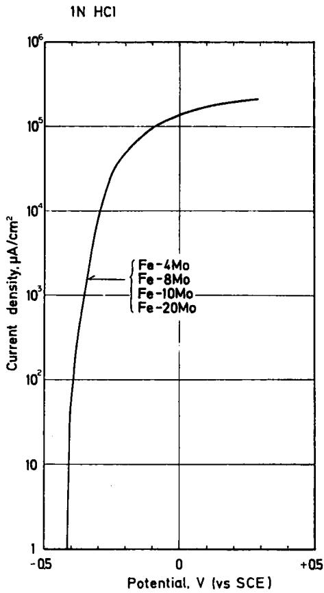  
FiG. 4. Anodic polarization curves for Fe-Mo binary alloys containing 4–20 wt % Mo in 1N HCl at ${ \mathfrak { z s o } } _ { \mathbb { C } } .$

Since alloying with Mo produces an excellent improvement in the pitting resistance of the 20Cr-25Ni steel, it can be predicted that Mo added to alloys will exhibit an inhibiting action to pitting only when the amount of $\mathbf { C r }$ above an adequate level is contained in the alloys. To substantiate this prediction, the anodic polarization curves of the 25Ni-5Mo steels containing 5-20 wt $\% \mathbf { C r }$ were measured in 1N HCl and the result is shown in Fig. 6. As already shown in Fig. 1, this type of steel with 20 wt $\% \mathbf { C r }$ and 5 wt $\% \mathbf { M o }$ is not subject to pitting in this solution. However, even if the steel contained 5 wt $\% \mathbf { M o } ,$ , the pitting resistance decreases with decreasing Cr content. The steel with 17wt $\% 0 \mathbf { r }$ becomes susceptible to pitting above + 0.40 V and the steels which contain $< 1 4$ wt $\% 0 \%$ cannot be passivated in this solution.

From the results of Figs. 1 and $\mathbf { 6 , }$ the existence of an interaction between Mo and Cr in the stęels for the inhibition of pitting can be understood. In the presence of an adequate amount of $\mathbf { c _ { r } } ,$ Mo becomes a beneficial alloying element for pitting inhibition. Increase in Mo content decreases the corrosion resistance of the passive film, however, when the steel contains a very small amount of Cr. Experimental evidence that the pitting resistance of the Mo-containing Cr-Ni steels depends on both Cr and Mo contents of the steels has been reported by Streicher¹² on the basis of immersion corrosion tests.

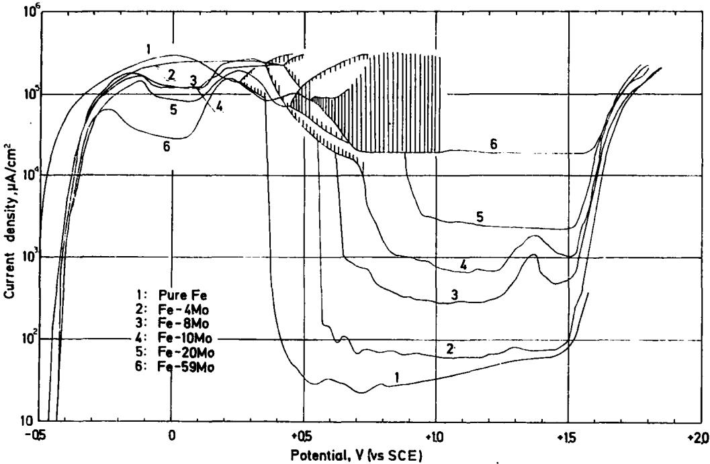  
FiG. 5. Anodic polarization curves for Fe-Mo binary alloys containing 4–59 wt % Mo in IN $\mathbf { H _ { 2 } S O _ { 4 } }$ at $2 5 ^ { \circ } \dot { C } .$

## A.C. impedance of passive film

The complex impedance diagrams measured at + 0.5 V in 1N HCl and 1N $\mathbf { H _ { 8 } S O _ { 4 } }$ for the 20Cr-25Ni-5Mo steel are shown in Fig. 7. The passivation treatment of the specimen was performed as follows: at first, specimens were passivated at + 0.5 V for 3 h in test solutions by use of a potentiostat. The power source was switched over to a galvanostat and constant currents which were equal to the currents immediately after 3 h oxidation by a potentiostat were applied. After confirming that the specimen potential remained at + 0.5 V under the galvanostatic condition, the measurement of a.c. impedance of the specimen was started.

The reason why the measurement of a.c. impedance was carried out under the polarization by a galvanostat was to minimize the influence of the impedance of a power source on the data measured. The internal impedance of the galvanostat used in this experiment was approximately 10 MΩ, which was much larger than the impedance of passivated specimens at the extremely low frequencies, which were frequently in the range 200400 kΩ.cm².

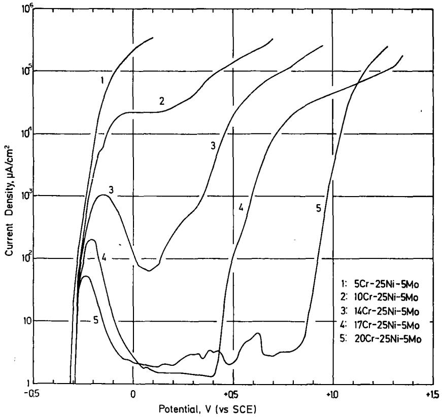  
FiG. 6. Anodic polarization curves for 25Ni-5Mo stainless steels containing 5-20 wt% Cr in 1N HCl at ${ \mathfrak { 2 5 } } ^ { \circ } \mathbf { C } .$

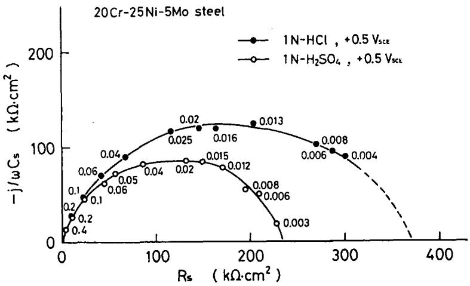  
FiG. 7. Complex impedance diagrams for the 20Cr-25Ni-5Mo steel passivated at + 0.5V in 1N HCl and 1N $\bf { H } _ { 8 } S O _ { 4 }$ . Numbers in the diagrams denote frequencies in Hz.

As shown in Fig. 7, the resistance of the electrode at zero frequency, $R _ { \infty  0 } ,$ is ca. 380 $\bf { k } \Omega . \mathsf { c m } ^ { 2 }$ in 1N HCl and ca. 240 kΩ.cm² in 1N $\mathbf { H _ { 2 } S O _ { 4 } } .$ The d.c. resistance of the passive film of the 20Cr-25Ni–5Mo steel formed in 1N HCl was thus larger than that formed in 1N $\mathbf { H _ { 2 } S O _ { 4 } }$ . Since the shapes of the impedance loci obtained in both solutions are not perfect but distorted hemi-cycles, the passive films formed in these solutions should be approximated by the electrical equivalent circuits with various time constants.

To make clear the influence of alloyed Mo on the impedance of the passive film, the impedance diagrams of the 20Cr-25Ni and 20Cr-25Ni-5Mo steels were measured at + 0.5 V in 1N $\bf { H _ { 2 } S O _ { 4 } }$ and the result is shown in Fig. 8. The values of $R _ { \infty \to 0 }$ were ca. 260 $\scriptstyle \pmb { \Omega } . \mathbf { c m ^ { 2 } }$ for the 20Cr-25Ni steel and ca. 240 kΩ.cm² for the 20Cr-25Ni-5Mo steel. The d.c. resistance of the passive film formed in 1N $\mathbf { H _ { 2 } S O _ { 4 } }$ decreases slightly with increasing Mo content of the steels.

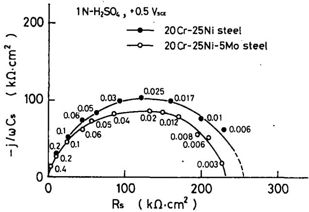  
FiG. 8. Complex impedance diagrams for 20Cr-25Ni stainless steels with and without Mo passivated at + 0.5V in 1N $\mathbf { H _ { 8 } S O _ { 4 } } .$ Numbers in the diagrams denote frequencies in Hz.

Thickness and optical constants of passive film

In order to determine the variation of the thickness and optical constants of the passive film with Mo content, in situ ellipsometric measurements were made on the 20Cr-25Ni steels containing 0-5 wt $\% \mathbf { M o }$ which were potentiostatically passivated in 1N $\bf H _ { 2 } S O _ { 4 } \ ( 2 0 ^ { \circ } C )$ . In these measurements, to avoid surface roughening by the dissolution in the active potentials, the potential of specimens was set directly at — 0.01 V which was a potential in the passive range and then the potential was increased successively in the noble direction in steps of 100 mV after holding the potential at each setting for 1 h.

The potential dependence of the ellipsometric parameters, $\Delta$ and $\Psi ,$ in the passive range is shown in Fig. 9, in which the vertical axes, d∆ and dΨ, denote the difference between the parameters at the start potential of — 0.01 V, $\Delta _ { 0 }$ and $\Psi _ { \mathfrak { d } } ,$ and those at each potential, $\pmb { \Delta }$ and Ψ, respectively.

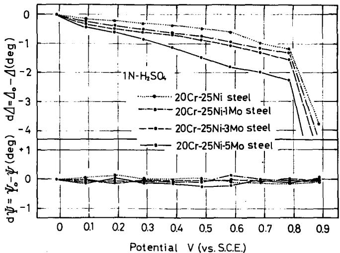  
FiG. 9. Variation of the ellipsometric parameters, Δ and $\Psi ,$ with potential for 20Cr-25Ni stainless steels containing 0-5 wt $\%$ in 1N $\mathbf { H _ { 2 } S O _ { 4 } }$ at ${ \dot { 2 } } 0 ^ { \circ } \mathbf { C } .$

For all specimens measured, $\Delta$ decreases linearly with increasing potential, whereas Ψ does not depend on the potential. The rate of decrease in $\Delta$ with increasing potential becomes larger with increase in Mo content. If the optical constants of the passive films of the steels used show little change with the change in Mo content because of small amount of $\mathbf { M o } ,$ the decrease in $\Delta$ at constant Ψ should mean the growth of film at a given potential becomes larger with increase in the Mo content. This will be confirmed later.

In order to determine the effect of Cl- in solutions on the nature of the passive films, the same measurements as stated above were carried out in IN HCl using the 20Cr-25Ni-5Mo steel which was not subject to pitting in this solution. Figure 10 represents the changes in d $\Delta$ and dΨ with potential measured in 1N HCl and 1N $\bf { H _ { 2 } S O _ { 4 } }$ . The rate of decrease in $\Delta$ with increase in potential was larger in 1N $\mathbf { H _ { 2 } S O _ { 4 } }$ than 1N HCl.

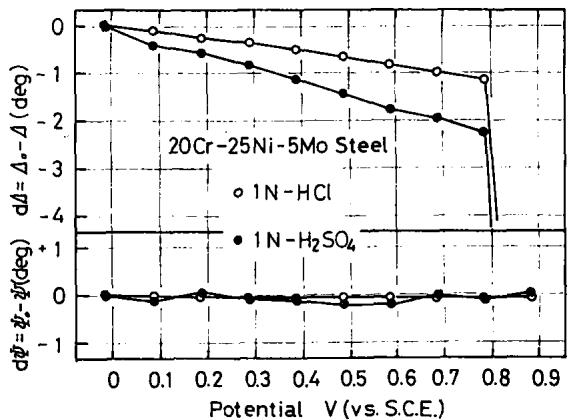  
FiG. 10. Variation of the ellipsometric parameters, ∆ and $\Psi ,$ with potential for the 20Cr-25Ni-5Mo stainless steel in 1N HCl and 1N $\mathbf { H _ { 2 } S O _ { 4 } }$ at $\pmb { 2 0 } \pmb { \circ } \pmb { C } .$

To calculate the thickness and the optical constants of the passive film from ∆ and Ψ measured during the anodic oxidation, the optical constants of the steel substrates are indispensable. However, in the case of stainless steels, the passive films of which are stable and hard to reduce, the determination of the optical constants of the substrates is always difficult because the film-free surfaces cannot be obtained easily.

This difficulty can be overcome by measuring $\Delta$ and Ψ on the film-free surfaces of stainless steels in dehydrated methanol immediately after the film-removing treatment in a $0 . 5 \%$ bromine-methanol solution.²ª This method was first explored²4 to determine the optical constant of the substrate of AISI 304 stainless steel and a value of ${ \tilde { n } } _ { 3 } =$ $2 . 6 7 - 4 . 0 3 i$ (at 5461 Å) was obtained. Accordingly, this method was applied to determine the optical constants of the substrates of the Mo-containing 20Cr-25Ni steels in the present study and $\tilde { n } _ { 8 } = 2 . 4 3 - 4 { \cdot } 1 9 i$ for the 20Cr-25Ni steel and $\widetilde { n } _ { 3 } =$ 2.43 — 4.14i for the 20Cr-25Ni-5Mo steel was obtained. The difference in the optical constant of the substrate caused by changes in the Mo content of the steels seemed to be very small.

Using the above optical constants for the substrates and the optical constant of $n _ { 1 } = 1 . 3 3 7$ for solution used, the theoretical $\Delta - \Psi$ charts were calculated assuming that surface films with various optical constants in the range $1 . 5 \le n _ { 2 } \le 3 . 0$ and $0 . 0 \leq k _ { 2 } \leq 0 . 8$ grow in thickness from 0 to 100 Å. By comparing the experimental $\Delta - \Psi$ locus with the theoretical $\Delta \sim \Psi$ charts, the thickness and the complex refractive index of the passive film for each steel were determined and the data are listed in Table 2. For the passive films formed in 1N $\mathbf { H _ { 2 } S O _ { 4 } } ,$ the optical constants were 2.3 — 0.2i in the Mo composition range investigated, being almost independent of Mo content. However, the thickness and growth rates of the films tend to increase with increasing Mo content. From a comparison between the film formed on the 20Cr-25Ni-5Mo steel in 1N HCl and that formed on the same steel in 1N $\mathbf { H _ { 2 } S O _ { 4 } } ,$ it is obvious that the real part of the optical constant, thickness, and growth rate of the former are smaller than those of the latter.

## Chemical composition of passive films

In order to investigate the change in the chemical composition of passive films with the Mo content of the steels, XPS spectra were measured on the surfaces of the 20Cr-25Ni steels containing 0–5 wt $\% \mathbf { M o }$ after 1 h anodic passivation at + 0.30 V in 1N HCl.

The binding energies at the peaks observed in the XPS spectrum for the specimens are listed in Table 3. As clearly seen from this Table, the value of binding energy for the electron level of each element measured scarcely depends on Mo content. Plural peaks were observed in each spectrum for the $2 p _ { 3 / 2 }$ levels of Fe, Cr and Ni and the $3 d _ { \mathfrak { s } / 2 } - 3 d _ { 5 / 2 }$ levels of Mo. Between the two peaks observed in the spectrum for each electron level, one with higher energy is thought to result from an atom in the oxidized state and the other with lower energy from the same atom in the metallic state, as exemplified by the spectra of the Mo $3 d _ { 3 / 2 } - 3 d _ { 5 / 2 }$ levels as follows.

Figure 11 illustrates a comparison of the spectra of the Mo $3 d _ { 8 / 2 } - 3 d _ { 5 / 2 }$ levels for the 20Cr-25Ni-5Mo steel, passivated in 1N HCl at + 0.30 V for 1 h, $\mathbf { M o O _ { 3 } }$ powder, and a freshly polished sheet of metallic Mo. It can clearly be understood that among the four peaks observed in the spectrum of the 20Cr-25Ni-5Mo steel the peaks at 235.5 and 232.3 eV originate from Mo oxidized to the hexavalent state and the peaks at 230.4 and 227.7 eV come from metallic Mo. A similar comparison of the XPS spectra for the $2 p _ { 3 / 2 }$ level of Fe, Cr and Ni for the passivated 20Cr-25Ni-5Mo steel revealed that the binding energy of the oxide peak observed in the spectrum for each component of the steel agreed approximately with that of the Fe $2 p _ { 8 / 2 }$ peak of $\mathbf { F e _ { 2 } O _ { 3 } } ,$ 711.6 eV, the Cr $2 p _ { \mathbf { 3 / 2 } }$ peak of $\bf C r _ { 2 } O _ { 3 } ,$ 577.1 eV, and the Ni $2 p _ { \mathrm { { s / 2 } } }$ peak of Ni(OH)g, 856.5 eV, respectively.2⁵ Therefore, Mo, Fe, Cr and Ni in the passive film of the steel appear to exist in the state of $\mathbf { M o ^ { 6 + } , F e ^ { 3 + } , C r ^ { 3 + } }$ and $\mathbf { N i ^ { 2 + } }$ , respectively. This interpretation holds for the passive films of the other steels listed in Table 3.

TABLE 2. OPTICAL CONSTANTS, THICKNESS AND GROWTH RATE FOR THE PASSIVE FILMS OF MO-CONTAINING 20Cr-25Ni STEELS DETERMINED FROM THE ELLIPSOMETRIC PARAMETERS MEASURED AT THE WAVELENGTH 5461 Å
<table><tr><td>Specimen</td><td>Solution</td><td>of passive film</td><td>Optical constant Film thickness(Å)  $- \ : 0 . 0 8 v - + 0 . { \dot { 7 } } 9 { \dot { 2 } }$ </td><td>Growth  $\mathrm { r a t e } ( { \hat { \mathbf { A } } } / \mathbf { V } )$ </td></tr><tr><td>20Cr-25Ni Steel</td><td> $\mathbf { 1 N \mathbf { - H _ { 2 } S O _ { 4 } } }$ </td><td>2.3–0.2 i</td><td>11-18</td><td>9</td></tr><tr><td>20Cr-25Ni–1Mo Steel</td><td> $1 \mathbf { N } \mathbf { - } \mathbf { H _ { 2 } S O _ { 4 } }$ </td><td>2.3-0.2 i</td><td>14-22</td><td>10</td></tr><tr><td>20Cr-25Ni-3Mo Steel</td><td> $\bf { 1 N - H _ { \mathrm { { z } } } S O _ { 4 } }$ </td><td>2.3-0.2 i</td><td>12-21</td><td>11</td></tr><tr><td>20Cr-25Ni-5Mo Steel</td><td> $1 \mathbf { N } \mathbf { - } \mathbf { H _ { 2 } S O _ { 4 } }$ </td><td>2.3–0.2 i</td><td>15-30</td><td>19</td></tr><tr><td>20Cr-25Ni-5Mo Steel</td><td> $\mathbf { 1 } \mathbf { N } \mathbf { - } \mathbf { H } \mathbf { C } \mathbf { l }$ </td><td>2.0-0.2 i</td><td>17-26</td><td>11</td></tr></table>

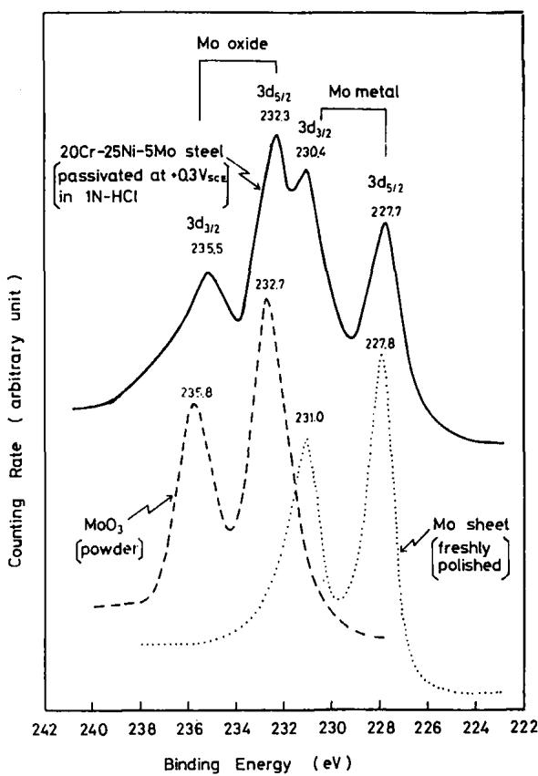  
FiG. 11. Comparison of the XPS spectra of the Mo $3 d _ { 8 } / _ { 8 } { - 3 d _ { 5 } } / _ { 8 }$ levels for the 20Cr-25Ni-5Mo steel passivated at + 0.30V in 1N HCl for 1 h, MoO₃ powder, and a freshly polished sheet of metallic Mo.

TINS  E I PS F RS  IRE IRA  
studd  s t   s  .
<table><tr><td></td><td></td><td></td><td>Electrons analysed (binding energy, eV)</td></tr><tr><td></td><td colspan="10"></td><td colspan="5"></td></tr><tr><td>Specimen</td><td>Passivation treatment</td><td>Fe 2p312 oxide  metal</td><td></td><td>Cr 2p{318 oxide</td><td>metal</td><td>Ni 2ps/2 oxide</td><td>metal</td><td>oxide 3d312</td><td>3d5/8</td><td>metal 3d312</td><td>3ds/2</td><td>O 1s</td><td>Cl2p1/2 and 2ps/3 2P1/12</td><td>2p312</td></tr><tr><td>20Cr-21Ni steel</td><td>1N HCl</td><td>s</td><td>w</td><td>s</td><td>sh</td><td>w</td><td>s</td><td></td><td></td><td></td><td></td><td>s</td><td>sh</td><td>s</td></tr><tr><td></td><td>+ 0.3V 1h</td><td>711.7</td><td>707.7</td><td>577.4</td><td>574.2 sh</td><td>857.6</td><td>853.8</td><td></td><td></td><td></td><td>531.8</td><td>530.5</td><td>199.9</td><td>198.5</td></tr><tr><td>20Cr-25Ni-1Mo steel</td><td>1N HCl</td><td>s 712.0</td><td>w 707.8</td><td>s 577.5</td><td>574.3</td><td>W 856.8</td><td>s 853.9</td><td>w 235.1</td><td>S 232.5</td><td>sh 230.4 227.8</td><td>W</td><td>sh</td><td>w</td><td>s</td></tr><tr><td>20Cr-25Ni-3Mo</td><td>+ 0.3V 1h</td><td>s</td><td>w</td><td>S</td><td>sh</td><td>W</td><td>s</td><td>w</td><td>s</td><td>sh</td><td>531.8</td><td>530.4 sh</td><td>199.8</td><td>198.6</td></tr><tr><td>steel</td><td>1N HCl</td><td>712.1</td><td>707.5</td><td>577.5</td><td>574.3</td><td>857.7</td><td>853.7</td><td>235.4</td><td>232.3</td><td>230.2 227.3</td><td>W 531.7</td><td>530.3</td><td>sh</td><td>s 198.4</td></tr><tr><td>20Cr-25Ni-5Mo</td><td>+ 0.3V 1h</td><td>s</td><td>w</td><td>S</td><td>sh</td><td>W</td><td>s</td><td>W</td><td>s</td><td>sh</td><td></td><td></td><td>199.8</td><td></td></tr><tr><td>steel</td><td>1N HCl</td><td>712.0</td><td>707.6</td><td>577.4</td><td>574.2</td><td>856.3</td><td>853.5</td><td>234.9</td><td>232.2</td><td>230.7 227.7</td><td>W 531.9</td><td>s</td><td>sh sh</td><td>s</td></tr><tr><td>20Cr-25Ni-5Mo</td><td>+ 0.3V 1h</td><td></td><td></td><td></td><td>sh</td><td>w</td><td>s</td><td>w</td><td>S</td><td>w</td><td></td><td>530.4 S</td><td>200.3 sh</td><td>198.6</td></tr><tr><td></td><td>1N H2SO,</td><td>S 712.4</td><td>S 707.6</td><td>S 577.5</td><td>574.4</td><td>856.7</td><td>853.8</td><td>235.5</td><td>232.1</td><td>231.0 227.6</td><td>w 532.1</td><td></td><td></td><td></td></tr><tr><td>steel</td><td>± 0V 1h</td><td>s</td><td></td><td></td><td></td><td></td><td></td><td>W</td><td>S</td><td></td><td>W</td><td>530.7</td><td></td><td></td></tr><tr><td>Fe-4Mo alloy</td><td>1N HCl</td><td>711.0</td><td></td><td></td><td></td><td></td><td></td><td>235.2</td><td>232.1</td><td></td><td>227.8</td><td></td><td></td><td></td></tr><tr><td></td><td>+ 0.1V 10min</td><td></td><td></td><td></td><td></td><td></td><td></td><td></td><td></td><td>W</td><td>s</td><td>sh</td><td>S</td><td></td></tr><tr><td>Mo sheet</td><td>freshly polished</td><td></td><td></td><td></td><td></td><td></td><td></td><td></td><td></td><td>231.0</td><td>227.9</td><td>533.3 531.3</td><td></td><td></td></tr><tr><td></td><td></td><td></td><td></td><td></td><td></td><td></td><td></td><td>W 235.8</td><td>S 232.7</td><td></td><td></td><td></td><td>S</td><td></td></tr><tr><td>MoO₃ powder</td><td></td><td></td><td></td><td></td><td></td><td></td><td></td><td></td><td></td><td></td><td></td><td>531.1</td><td></td><td></td></tr><tr><td></td><td></td><td></td><td></td><td></td><td></td><td></td><td></td><td></td><td></td><td></td><td></td><td></td><td></td><td></td></tr></table>

On the basis of the results obtained by Auger electron spectroscopy, Lumsden et $a l . ^ { 2 8 }$ reported that AISI 316 stainless steel (ca. 2.3 wt %Mo) passivated at 442 mV (vs NHE) in 1.0M $\mathrm { N a C l + 0 . 1 M \ N a _ { 2 } S O _ { 4 } }$ solution contained no Mo in its passive film. However, the present study by XPS showed undoubtedly the existence of oxidized Mo, which was probably in the hexavalent state, in the passive films of the steels containing 1-5 wt $\% \mathbf { M o }$

As shown in Table 3, the spectra of the O 1s level for all of the steels used have two peaks at ca. 531.8 and 530.5 eV. This means that the passive films of the steels contain two types of oxygen differing in the method of chemical bonding. One with higher binding energy comes from oxygen in the M-OH (M: metal element) or O-OH bond and the other with lower binding energy arises from that in the M-O bond.2⁵ It can be suggested that the passive films of the steels used are composed of a complex oxyhydroxide rather than an oxide. The intensity ratio between these two peaks in the O 1s spectrum depended slightly on the Mo content and the intensity of the peak with lower energy increased with increasing Mo content.

Pronounced spectra of the Cl $2 p _ { 1 / 2 } - 2 p _ { 3 / 2 }$ electron levels were obtained for all the steels treated in 1N HCl, showing the existence of chlorine in the passive film which came from the solution. Since the binding energies of the Cl $2 p _ { 8 / 2 }$ electron level for the steels listed in Table 3 are almost equal to that for NaCl powder, 198.5 eV,17 chlorine in the passive films should exist as Cl-.

In order to clarify the quantitative relationship between the constituent atoms of the passive films, the peak area ratios of an oxide peak observed in the spectrum for the $2 p _ { \mathfrak { s } / 2 }$ level of Fe and Ni and the $3 d _ { 5 / 2 }$ level of Mo vs that in the spectrum of the $2 p _ { 3 / 2 }$ level of Cr were calculated for each steel. These ratios as a function of Mo content are shown in Fig. 12, in which the results obtained for the steels passivated at $\pm \boldsymbol { \mathfrak { 0 } } \ : \mathbf { V }$ in 1N $\mathbf { H _ { 2 } S O _ { 4 } }$ for 1 h are also illustrated. It is clear that the ratio of Mo $3 d _ { 5 / 2 } / \mathrm { C r } 2 p _ { 9 / 2 }$ increases with increasing Mo content in both cases of the passivation in 1N HCl and 1N $\bf { H _ { 2 } S O _ { 4 } }$ . Therefore, the amount of Mo contained in the passive films should increase with increasing Mo content. Although the possibility of a high concentration of Mo in the passive films of AISI 304 and 316 steels has been suggested by Rhodin²7 and Barnes et al.,2º this possibility can hardly be expected for the films of the steels used in the present study because the ratio of Mo $3 d _ { 5 / 2 } / \mathrm { C r } 2 p _ { 3 / 2 }$ is considerably smaller than that of Fe $2 p _ { 8 / 2 } / \mathrm { C r } 2 p _ { 9 / 2 } ,$ as shown in Fig. 12.

As to the effect of the solutions used for the passivation treatment on the composition of the passive films, the films formed in 1N HCl were thought to have a higher $\mathbf { C r ^ { 3 + } }$ content and lower $\pmb { F e ^ { 3 + } }$ and $\pmb { M } \circ ^ { \pmb { \otimes } + }$ contents than those formed in $\mathbf { 1 N H _ { 2 } S O _ { 4 } } ,$ because the ratios of Fe ${ 2 p _ { 3 / 2 } } / \mathrm { C r } ~ 2 p _ { 3 / 2 }$ , Mo $3 d _ { 5 / 2 } / \mathrm { C r } 2 p _ { \mathbb { 3 } / 2 } ,$ and Ni $2 p _ { 8 / 2 } / \mathbf { C r } 2 p _ { \tilde { 8 } / 2 }$ for the steels passivated in 1N HCl were smaller than those for the steels passivated in 1N $\bf { H _ { 2 } S O _ { 4 } }$ . However, the difference in the Mo content between the passive films in the two solutions is not substantially large.

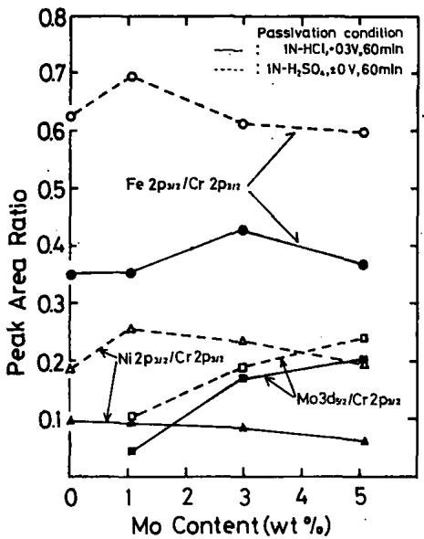  
FiG. 12. Variation of area ratios of oxide peaks in XPS spectra with the Mo content for Mo-containing 20Cr-25Ni steels passivated in 1N HCl and 1N $\mathbf { H _ { 9 } S O _ { 4 } }$

Figure 13 shows the area ratio of the peaks in the spectrum of the Cl $2 p _ { 1 / 2 } - 2 p _ { \mathbb { 3 / 2 } }$ levels vs those of the O 1s level as a function of Mo content. The ratio of the Cl $2 p _ { 1 / 2 } -$ ${ 2 p _ { \tt S I O } } / { 0 }$ 1s was almost independent of the Mo content up to 3 wt $\textcircled { \scriptsize { \cdot } }$ but'slightly decreased when the steel contained 5 wt $\% \mathbf { M o }$ . Consequently, the amount of Clcontained in the passive films of the 20Cr-25Ni-5Mo steel which has good resistance to chloride attack is thought to be lower than that for steels containing < 3 wt $\% \mathbf { M } \bullet$ which show poor resistance to such attack.

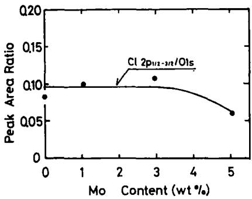  
FiG. 13. Variation of the peak area ratio, Cl $2 p _ { 1 / 8 } - 2 p _ { 9 / 2 / 0 }$ 1s, with the Mo content for the XPS spectrum of the 20Cr-25Ni-5Mo steel passivated $\mathbf { a t } + \mathbf { 0 . 3 0 V }$ in 1N HCl for 1 h.

In order to clarify the variation of the passive film composition with potential, XPS spectra were measured on the 20Cr-25Ni-5Mo steel which was anodically oxidized for 1 h in the range $- 0 . 3 5 - + 0 . 7 0 \ : \mathrm { v }$ in 1N HCl. The binding energies of the peaks observed in an XPS spectrum for each alloying component are tabulated in Table 4. It is shown that the value for the oxide peak for each component is almost independent of the oxidation potential. The oxidation state of each component atom of the passive films probably shows little change with potential within the range examined.

Figure 14 shows the area ratio of an oxide peak observed in each spectrum for the $2 p _ { 8 / 2 }$ level of Fe and Ni, the $3 d _ { 5 / 2 }$ level of Mo, and the peaks in the spectrum for the $2 p _ { 1 / 2 } - 2 p _ { 3 / 2 }$ levels of Cl and the 1s level of O vs an oxide peak in the spectrum for the $2 p _ { \mathsf { 3 / 2 } }$ level of Cr as a function of potential. Almost all the ratios shown in this Figure, excepting the ratio of Ni $2 p _ { \mathrm { { s / 2 } } } / \mathrm { { C r } } ~ 2 p _ { \mathrm { { \ s / 2 } } } ,$ change greatly in the potential range of the active dissolution, ${ \bf e . g . } \ - \ 0 . 3 5 { \mathrm { - - } } \ 0 . { \dot { 1 } } 0 \ ^ { \cdot }$ V, but moderately in the range of passivity, $\mathbf { e . g . \pm 0 . + 0 . 7 0 }$ V, with raising potential.

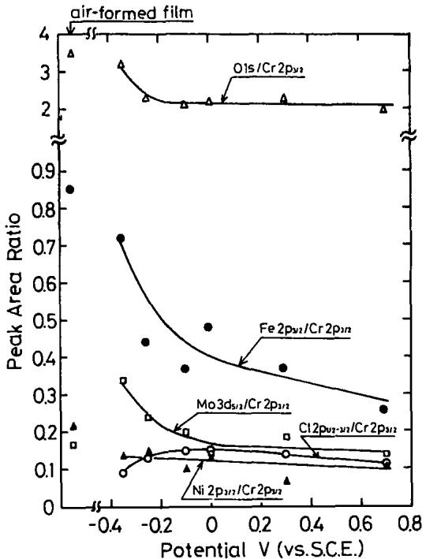  
FiG. 14. Variation of the peak area ratios with potential for the XPS spectrum of the 20Cr-25Ni-5Mo steel passivated in 1N HCl at $2 5 ^ { \circ } \mathbf { C } .$

The ratio of Fe ${ 2 p _ { 3 / 2 } } / \mathrm { C r } ~ 2 p _ { 9 / 2 }$ exhibits the largest change and decreases with the rise of potential even if within the range of passivity. Accordingly, an accumulation of $\mathbf { C r ^ { 3 + } }$ and a shortage of $\mathbf { F e ^ { 3 + } }$ in the passive film will be promoted by raising the potential, but the amount of $\mathbf { M o ^ { 6 + } , \ N i ^ { 2 + } }$ , Cl⁻ and $\mathbf { O ^ { 2 - } }$ contained in the film will be scarcely affected by the change in potential. On the basis of the fact that the ${ \bf C l ^ { - } }$ content of the passive film is independent of potential, it can be suggested that the improved resistance to pitting of the 20Cr-25Ni-5Mo steel results from the protective function of its passive film which impedes the take-up of Cl- all over the range of passivity.

JS E  G S  IE& IS S-- HL I RES E  I S E R SG IIS ICL
<table><tr><td>Film formation</td><td colspan="10">Electrons analysed (binding energy, eV)</td><td colspan="5"></td></tr><tr><td rowspan="2">potential (V vs SCE)</td><td colspan="2">Fe 2ps12</td><td colspan="2">Cr 2ps12</td><td colspan="2">Ni 2ps/8</td><td colspan="4">Mo3d3/s and 3d{/3</td><td colspan="4"></td></tr><tr><td>oxide</td><td>metal</td><td>oxide</td><td>metal</td><td>oxide</td><td>metal</td><td>oxide 3dg/2</td><td>3ds12</td><td>3d312</td><td>metal 3ds/2</td><td>O 1s</td><td></td><td>Cl 2p1&#x27;2 and 2pa/2 2p{1/2</td><td>2pa/s</td></tr><tr><td>-0.35</td><td>s 712.2 s</td><td>W 707.5 W</td><td>s 577.2 s</td><td>sh 574.1 sh</td><td>W 856.4</td><td>s 853.7</td><td>w 235.1</td><td>s 232.2</td><td>sh 230.3</td><td>w 227.6</td><td>s 531.8</td><td>530.3</td><td>W 200.4</td><td>s 198.5</td></tr><tr><td>- 0.25</td><td>711.8 s</td><td>707.5 w</td><td>577.1 s</td><td>574.2 sh</td><td>w 856.9 w.</td><td>s 853.8 s</td><td>W 235.3 W</td><td>S 232.4 S</td><td>sh 230.7</td><td>W 227.8 w</td><td>s 531.5</td><td>sh 530.4</td><td>sh 200.5</td><td>s 198.3</td></tr><tr><td>- 0.10</td><td>712.3 S</td><td>707.6 w</td><td>577.4 s</td><td>574.2 sh</td><td>856.3 W</td><td>853.9 S</td><td>235.5 W</td><td>232.1</td><td>w 230.7</td><td>228.0 W</td><td>s 531.6</td><td>sh 530.3 sh</td><td>sh 199.8 sh</td><td>s 198.2 s</td></tr><tr><td>± 0</td><td>712.5 S</td><td>707.6 w</td><td>577.3 S</td><td>574.4 sh</td><td>856.7 W</td><td>853.6 s</td><td>235.2 w</td><td>S 232.3 S</td><td>W 230.9 sh</td><td>227.5 W</td><td>s 531.7</td><td>530.4</td><td>200.1</td><td>198.2 s</td></tr><tr><td>+ 0.30</td><td>712.0 S</td><td>707.6 w</td><td>577.4 s</td><td>574.2 sh</td><td>856.3 W</td><td>853.5</td><td>234.9 W</td><td>232.2</td><td>230.7</td><td>227.7</td><td>S 531.9</td><td>sh 530.4 sh</td><td>sh 200.3 w</td><td>198.6 s</td></tr><tr><td>+ 0.70</td><td>711.6</td><td>707.7</td><td>577.3</td><td>574.5</td><td>856.8</td><td>s 853.8</td><td>235.4</td><td>S 231.6</td><td>sh 230.6</td><td>W 227.5</td><td>s 531.9</td><td>530.2</td><td>200.4</td><td>198.4</td></tr></table>

whuu =   == e. St = S

## DISCUSSION

Measurements of the anodic polarization curves in 1N HCl for the Mocontaining Cr-Ni stainless steels with various compositions lead to the conclusion that additions of Mo improve the pitting resistance of the steels in the presence of Cr above a certain level which depends on the amount of Mo added. Mo decreases the corrosion resistance of the passive films when added to iron base alloys without Cr. Therefore, in order to clarify the mechanism for the improvement of the resistance to pitting by alloyed Mo, it must be explained why the existence of Cr in steels is indispensable for deriving the beneficial effect of the Mo addition, and in particular, why the transpassive dissolution of Mo in the passive films is suppressed by the presence of Cr in the films of the steels. Since this type of improvement was thought to be concerned with the composition and structure of the passive films, a consideration was given at first to the chemical composition of the passive films formed on the 20Cr-25Ni-5Mo steel having a high corrosion resistance in 1N HCl.

According to the XPS studies, the passive film of the 20Cr-25Ni-5Mo steel is considered to be an oxyhydroxide which contains $\mathbf { F e ^ { 3 + } , ~ C r ^ { 3 + } }$ , Ni²+ and $\mathbf { M o ^ { 8 + } }$ as cations. Among these ions, $\mathbf { C r ^ { 3 + } }$ and $\mathbf { M o ^ { 6 + } }$ should play a very important role in improving the corrosion resistance of the films. The corrosion resistance of the steels should increase when films which are mainly composed of Cr(III) oxyhydroxide and Mo(VI) oxide are formed on the surfaces of the steels. It must be remembered, however, that Mo(VI) oxide, e.g. $\mathbf { M o O _ { 3 } } ,$ cannot form by itself a compact surface film having a good resistance to corrosion, as can be seen from Fig. 2, which shows that pure Mo dissolves with a large rate producing an unprotective oxide film of $\mathbf { M o O _ { 3 } }$ in the potential range above $\pm \ 0 \ \mathbf { V } .$ The observed phenomenon that the current density in the passive state of the Fe-Mo binary alloy increases with increase in Mo content is thought to result from the nature of the $\mathbf { M o O _ { 3 } }$ oxide. On the other hand, Cr(III) oxyhydroxide, e.g. CrOOH, can compose very compact surface films which are stable to the attack of Cl- and acids as can be seen from the fact that pure Cr is not subject to pitting in 1N HCl. Therefore, the formation of a surface film which is mainly composed of a Cr(III) oxyhydroxide should result in increased resistance to pitting as in the case of Fe-Cr alloys with high Cr contents.

In previous work concerning the analysis of the chemical composition of Fe-Cr alloys by XPS, it has been suggested that the passive films of the alloys with high Cr contents were composed of oxyhydroxides of Cr and Fe and the amount of Cr increased with increasing Cr content.2⁵ Since sites where $\mathbf { F e ^ { 3 + } }$ exist in high concentrations in the passive films are thought to be less resistant to the attack of Cl-, the pitting resistance of Fe-Cr alloys will be considerably improved by overcoming this drawback with an increase of Cr(III) oxyhydroxide in the films.

Even if Mo is added to the Cr-Ni stainless steels, these steels are subject to pitting when the Cr content is low, because the passive films of the steels with low Cr content consist mostly of Fe or Ni oxides (or oxyhydroxides) which are not stable in acid solutions containing Cl-. Since Cr concentrates in the films of the steels with increasiņg Cr content, the surface film made up of a Cr(III) oxyhydroxide containing $\mathbf { M o ^ { 8 + } }$ $\pmb { F e ^ { 8 + } }$ , and $\mathbf { N i ^ { 2 + } }$ in the state of solid solution may be formed on Mo-containing $\mathbf { C r - N i }$ steels with relatively high Cr content. This type of film should be as compact as the film on Fe-Cr alloys with higher Cr content. When a compact film is formed on the

Mo-containing stainless steels, the transpassive dissolution of alloyed Mo will be inhibited because Mo is fixed in the film. The Mo(VI) oxide which is fixed in the state of solid solution in the film is thought to promote the ability of a Cr(III) oxyhydroxide film for the corrosion protection, since the stability of the Mo(VI) oxide is very high in acid solutions with Cl-. Even if the $\mathbf { C r ^ { 3 + } }$ content of the passive film is relatively small, a high resistance of the film to pitting should result from a film containing an adequate amount of $\mathbf { M o ^ { 8 + } }$ in the state of solid solution in the film.

On the basis of the results of measurements of the electrode impedance, the d.c. resistance of the passive film on the 20Cr-25Ni-5Mo steel in HCl solution is considerably larger than that formed in $\bf { H _ { 2 } S O _ { 4 } }$ solution. This means that there is a difference in properties between the surface films formed in 1N HCl and 1N $\mathbf { H _ { 2 } S O _ { 4 } } .$ One of the possible ways to explain this difference is the formation of a kind of insoluble oxychloride or basic chloride of Mo. Unfortunately, it has been impossible to prove the formation of these compounds because the values of the binding energy of the Mo $3 d _ { \mathfrak { s } / 2 } - 3 d _ { \mathfrak { s } / 2 }$ electrons for the film formed in 1N HCl are nearly equal to those for the film formed in 1N $\mathbf { H _ { 2 } S O _ { 4 } }$ (see Table 3). As shown in Fig. 12, however, quantitative analysis showed clear differences in chemical composition between the two films. The film formed in HCl solution shows a higher concentration of $\mathbf { C r ^ { 3 + } }$ and a lower concentration of $\mathtt { F e ^ { 3 + } }$ than that formed in $\mathbf { H _ { 2 } S O _ { 4 } }$ solution. Since the difference in Mo content between the two films is very small, the film formed in HCl solution, which contains a higher amount of $\mathbf { C } \mathbf { r } ^ { 3 + }$ , may become more compact than that formed in $\bf { H _ { 2 } S O _ { 4 } }$ solution. Therefore, the effect of alloyed Mo may appear more distinctly in HCl solution than in $\mathbf { H _ { 2 } S O _ { 4 } }$ solution. This prediction deriyes support from the fact that there is only a little difference in d.c. resistance in $\bf { H _ { 2 } S O _ { 4 } }$ solution between the 20Cr-25Ni steels with and without Mo (see Fig. 13).

From the results of ellipsometry, it can be seen that the thickness of the passive film increases with increase in the Mo content. Since an increase in film thickness generally prolongs the induction period of the initiation of pitting, thickening of the film by alloyed Mo may lead to increased corrosion resistance of steels.

## SUMMARY

In order to explain the reason that the addition of Mo to the Cr-Ni stainless steels results in improved resistance to pitting in acid solutions containing Cl-, the pitting inhibition of the passive films have been examined by measurements of the anodic polarization curves, a.c. electrode impedances, ellipsometric parameters and X-ray photoelectron spectra of the steels, with varying Mo content, passivated in 1N HCl.

(1) The presence of a certain amount of Cr is essential to increase the pitting resistance of steels in acid chloride solutions by Mo alloying.

(2) The passive films of the Mo-containing Cr-Ni steels consist of complex oxyhydroxide containing $\mathbf { C r ^ { 3 + } }$ , Fe³+, Ni²+ and $\mathbf { M o ^ { 6 + } }$ . The Mo content of the films increases almost linearly with increasing the Mo content of the steels.

(3) Compact surface films which are composed of Cr(III) oxyhydroxide containing a relatively large amount of $\scriptstyle \mathbf { F e ^ { 3 + } }$ and small amount of $\mathbf { M o ^ { 6 + } }$ and a trace amount of $\mathbf { N i ^ { 2 + } }$ may be formed on the 20Cr–25Ni–5Mo steel which shows no pitting in 1N HCl at room temperature. Mo(VI) oxide which is contained in Cr(III) oxyhydroxide in the state of solid solution is suppressed from its transpassive dissolution and contributes to the remarkably increased resistance to attacks of Cl- and acids due to the stability of Mo(VI) oxide by its nature in acid solution.

(4) The thickness of the passive film of Cr-Ni steels increases with increase in Mo content both in $\bf { H _ { 2 } S O _ { 4 } }$ and HCl solutions and further, the d.c. resistance of the passive film of a Cr-Ni steel alloyed with Mo in HCl solution is larger than that in $\mathbf { H _ { 2 } S O _ { 4 } }$ solution, although the thickness of the film formed in HCl solution is thinner than that of the film formed in $\mathbf { H _ { 2 } S O _ { 4 } }$ solution. These facts also show one of the reasons that the addition of Mo to stainless steel is effective for the inhibition of pitting in HCl solution.

Acknowledgement—The authors are indebted to Mr. S. Matsuda, Mr. S. Soma and Mr. Y. Hara of Tohoku University for their technical assistance throughout this work. Thanks are also due to Prof. S. Ikeda and Dr. K. Kishi of Osaka University for the XPS analyses.

## REFERENCES

1. H. H. UHLIG and J. WuLFF, Trans. AIME 135, 494 (1939).

2. M. A. STREICHER, J. electrochem. Soc. 103, 375 (1956).

3. J. M. KoLOTYRKIN, Corrosion 19, 261 (1963).

4. N. TomASHOV, G. CHERNOVA and O. MARCOVA, Corrosion 20, 166t (1964).

5. V. HosPODARUK and J. V. PETROCELLI, J. electrochem. Soc. 113, 878 (1966).

6. J. HoRvATH and H. H. UHLIG, J. electrochem. Soc. 115, 791 (1968).

7. A. P. BoND and E. A. LizLovs, J. electrochem. Soc. 115, 1130 (1968).

8. P. FoRCHHAMMER and H. J. ENGELL, Werkstoffe und Korros. 20, 1 (1969).

9. R. J. BRIGHAm, Corrosion 28, 177 (1972).

10. R. J. BRIGHAm and E. W. TozER, Corrosion 29, 33 (1972).

11. R. J. BrIGHAM and E. W. TozeR, Corrosion 30, 161 (1974).

12. M. A. STREICHER, Corrosion 30, 77 (1974).

13. G. HERBSLEB and W. SCHWENK, Werkstoffe und Korros. 26, 5 (1975).

14. A. P. BoND and E. A. LizLovs, J. electrochem. Soc. 115, 1130 (1968).

15. N. A. NIELSEN and T. N. RHoDIN, Z. Elektrochem. 62, 707 (1958).

16. T. P. HoAR, J. electrochem. Soc. 117, 17C (1970).

17. K. SuGImOTO and Y. SAwADA, submitted to Corrosion.

18. E. DELTOMBE, N. DE ZouBOV and M. PoURBAIx, Atlas of Electrochemical Equilibria in Aqueous Solutions (Ed. M. PouRBaIx) Pergamon Press, Oxford, p. 272 (1966).

19. K. SuGImOTO and Y. SAWADA, Boshoku Gijutsu 20, 264 (1971).

20. Y. HARA, K. SuGImoTo and Y. SAwADA, submitted to J. Japan. Inst. Metals.

21. K. SuGImOTO and Y. SAWADA, Boshoku Gijutsu 24, 669 (1975).

22. N. SAτo and K. KuDo, Electrochim. Acta 16, 447 (1971).

23. F. L. McCRACKIN and J. P. CoLsoN, Ellipsometry in the Measurement of Surfaces and Thin Films, Symp. Proc., Washington (1963) Natl. Bur. Std. Misc. Publ., 61 (1964).

24. S. MATSUDA, K. SUGimOTO and Y. SAWADA, J. Japan Inst. Metals 39, 40 (1975).

25. K. SuGImOTO, K. KIsHI, S. IKEDA and Y. SAWADA, J. Japan Inst. Metals 38, 54 (1974)

26. J. B. LUMsDEN and R. W. STAEHLE, Scripta Metallurgica 6, 1205 (1972).

27. T. N. RHoDIN, Corrosion 12, 123t and 465t (1956).

28. G. J. BARNEs, A. W. ALDAG and R. C. JERNER, J. electrochem. Soc. 119, 648 (1972).