# THE CHEMICAL COMPOSITION OF THE PASSIVE FILM ON Fe-24Cr AND Fe-24Cr-11Mo STUDIED BY AES, XPS AND SIMS

S. MISCHLER, A. VOGEL, H. J. MATHIEU and D. LANDOLT

Materials Department, Swiss Federal Institute of Technology (EPFL), CH-1007 Lausanne, Switzerland

Abstract—A systematic study of the composition and of the thickness of passive films formed at 65°C on Fe-24Cr and Fe-24Cr-11Mo model alloys in an acid sulfate electrolyte in the presence and absence of chloride ion at different potentials has been carried out. Non-destructive XPS, AES depth profiling and dynamic SIMS were applied to the study of the average concentration and the depth distribution of cations and anions in the films. The apparent film thickness and the average metal ion concentration were found to be little affected by the presence or absence of chloride ion in the electrolyte. Molybdenum influenced the depth distribution of chloride ion in the films.

## INTRODUCTION

SrAinLEss steels owe their corrosion resistance to the presence of a thin surface oxide film. The characterization of such films, therefore, is an important field of corrosion science. Surface analysis methods, in particular AES, XPS and SIMS have been applied to the study of the chemical composition of passive oxide films on stainless steels for a number of years and results obtained by different research groups have been reviewed in the literature. 1.2 It is generally accepted that passive oxide films on iron-chromium alloys consist predominantly of trivalent chromium oxide.³ Their thickness is 2–3 nm typically and depends on applied potential.ª The presence in the films of cations of iron, of molybdenum or of other alloying elements has also been documented depending on alloy composition.⁵-7 Incorporation of chloride ions has been observed by some authors but not by others.

Molybdenum is frequently added to ferritic and austenitic stainless steels to improve their resistance to pitting corrosion in chloride media. It is not known at present whether passive films on molybdenum containing alloys formed in chloride media have the same composition as those formed in other media and how they differ from films on similar alloys not containing molybdenum. Such information could possibly be of use for the elucidation of pit initiation mechanisms on stainless steels and the role of molybdenum in this.

Most of the published studies of passive films use only one surface analysis method and cover a limited range of experimental conditions. Results, however, are more easily interpreted when they can be compared on a relative basis.

Preferably, they ought to be substantiated by different analysis techniques. For these reasons, a study was initiated in our laboratory with the aim of providing a comprehensive set of experimental data for the determination of the influence of applied potential, of alloyed molybdenum and of the presence of chloride ion in the electrolyte on the composition and thickness of the passive films formed on anodically polarized high purity iron-chromium alloys with and without alloyed molybdenum. AES depth profiling, non-destructive XPS and dynamic SIMS were employed for the characterization of the films. The average concentration and the depth distribution of metal cations and of electrolyte anions in the film and the film thickness were determined.

## EXPERIMENTAL METHOD

The composition of the two alloys used is given in Table 1. The Fe-24Cr–11Mo alloy contained a higher molybdenum concentration than the usual ferritic stainless steels in order to facilitate analysis of this element in the passive film. The alloys which are single phase were heat treated at 1300°C for 58 h to homogenize the elemental concentration. Grain size after heat treatment was in the millimeter range. The alloys contained a few chromium oxide inclusions.

The electrodes were machined in the form of rods from which rotating disk electrodes were fabricated. For the determination of polarization curves the disk electrode of 3.57 mm diameter (electrode area $0 . 1 \mathrm { c m } ^ { 2 } )$ was embedded in epoxy. For potentiostatic measurements involving surface analysis identical electrodes were used but without epoxy insulation. By bringing the disk into contact with the electrolyte surface and slightly pulling back, a meniscus was formed which prevented contact of the side of the rod with the electrolyte. The rotation rate was 3000 rpm in all experiments.

Two electrolytes were used, 0.1 M $\mathrm { H } _ { 2 } \mathrm { S O } _ { 4 } + 0 . 4 \mathrm { M } \mathrm { N a } _ { 2 } \mathrm { S O } _ { 4 }$ referred to as electrolyte A and 0.1 M $\mathrm { H _ { 2 } S O _ { 4 } } + 0 . 4 \mathrm { M N a _ { 2 } S O _ { 4 } } + 0 . 1 2 \mathrm { M }$ NaCl referred to as electrolyte B. All experiments were carried out in de-aerated solutions under argon. The temperature was $6 5 \mathrm { { ^ \circ C } }$ This temperature was chosen because preliminary experiments had shown that passive films formed at that temperature were slightly thicker than those formed at $2 5 \mathrm { ‰}$ and thus easier to study. At the temperature of the experiments the Fe-Cr alloy but not the $\mathbf { F e { \mathrm { - } } C r { \mathrm { - } } M o }$ alloy exhibited pitting in the electrolyte B.

Electrode pretreatment consisted of mechanical polishing with SiC paper and with 1 μm alumina powder. The electrodes were washed with ethanol and doubly distilled water before being used. Polarization curves were determined by applying potential steps and plotting the current measured after 400 s. The measurements were started at a cathodic potential of –650 mV (all potentials in this paper are given with respect to the normal hydrogen electrode). A potentiostat (Solartron 1286) controlled by a function generator (AMEL 568) was used. Electrodes used for surface analysis were mechanically polished and polarized potentiostatically. Three polarization conditions were studied; the condition (CA) involved cathodic polarization at -650 mV for 1 min. The polarization condition (PL) involved cathodic polarization at $- 6 5 0 \mathrm { m V }$ for 1 min followed by anodic polarization for 1 h at 200 mV. The polarization condition (PH) was the same as (PL) but anodic polarization was at 500 mV. The current was monitored as a function of time using an HP 310 computer. At the end of a polarization experiment the electrode was removed from the electrolyte with the potential still applied, rinsed with doubly distilled water and dried with argon. It was stored in a desiccator under argon for a maximum of 2 h before being introduced into the surface analysis apparatus and immediately analysed.

AES and XPS analysis was performed in a PHI 550/590A AES/XPS apparatus containing a CMA and differentially pumped ion guns. SIMS analysis was performed in a PHI 545/Atomic Adida 3000-30 AES/SIMS apparatus with a quadrupole mass analyser. Both surface analysis apparatus were equipped with a fast entry lock. AES depth profiles were recorded using the peaks indicated in Table 2. Also given in the table are the electron escape depth in the oxide and the sensitivity factor. Each film was analysed on two locations and each experiment was repeated twice. From these measurements a mean profile was calculated. The standard deviation was generally better than $7 \%$ . Sputter time was converted into sputtered depth using ${ \mathrm { T a } } _ { 2 } { \mathrm { O } } _ { 5 }$ films for calibration and multiplying by a factor of 0.8 which corresponds to the relative sputter rate of passive films on stainless steel with respect to tantalum oxide.8 To calculate elemental concentrations from AES profiles the sensitivity factors of Table 1 were used. All AES profiles were corrected for the influence of the electron escape depth using a procedure proposed by Hofmann.º The binding energies of the XPS peaks considered are given in Table 3 together with area sensitivity factors used for quantification. Also indicated are the electron mean free paths in the metal and in the oxide, respectively.1º The background was subtracted following the procedure due to Sherwood."1 Different problems related to the quantitative analysis of passive films on Fe-Cr alloys by AES and XPS have been discussed in detail previously.12 Specific aspects related to the analysis of passive films by SIMS will be treated elsewhere.13

TABLE 1. ALLOY COMPOSITION
<table><tr><td>Element</td><td> $\mathrm { F e } { - } 2 4 \mathrm { C r } ^ { \ast }$  wt% (at%)</td><td>Fe-24Cr-11Mo† wt% (at%)</td></tr><tr><td>Cr</td><td>24.3 (25.6)</td><td>24.3 (26.8)</td></tr><tr><td>Mo</td><td>0.063</td><td>10.9 (6.5)</td></tr><tr><td>Si</td><td>0.043</td><td></td></tr><tr><td>Mn</td><td>0.002</td><td>0.12</td></tr><tr><td>W</td><td></td><td>0.015</td></tr><tr><td>C</td><td>0.0033</td><td>0.009</td></tr><tr><td>S</td><td>0.006</td><td>0.005</td></tr></table>

\*Data furnished by supplier.  
†Data from microprobe analysis.

TABLE 2. AES PEAKS CONSIDERED
<table><tr><td>Element</td><td>Transition</td><td>Kinetic energy (eV)</td><td> $\Lambda ^ { * }$  (nm)</td><td>Sensitivity factort</td></tr><tr><td>Cr</td><td>LMM</td><td>528</td><td>1.05</td><td>0.33</td></tr><tr><td>Fe</td><td>LMM</td><td>703</td><td>1.22</td><td>0.30</td></tr><tr><td>Mo</td><td>MVV</td><td>221</td><td>0.68</td><td>0.43</td></tr><tr><td>0</td><td>KLL</td><td>503</td><td>1.03</td><td>0.83</td></tr><tr><td>S</td><td>LMM</td><td>152</td><td>0.58</td><td>1.33</td></tr><tr><td>Cl</td><td>LMM</td><td>1.81</td><td>0.63</td><td>1.10</td></tr><tr><td>C</td><td>KLL</td><td>273</td><td>0.75</td><td>0.33</td></tr></table>

${ } ^ { * } \Lambda = \lambda$ cos $\phi ,$ values of the electron mean free path λ calculated after Seah and Dench¹º for a $\mathrm { C r } _ { 2 } \mathrm { O } _ { 3 }$ matrix, $\phi = 4 9 ^ { \circ }$ for the present arrangement.  
†The AES sensitivity factors are taken from Ref. 26 except that for Cr which has been determined experimentally on a sputtered Fe-24Cr alloy.

TABLE 3. XPS BINDING ENERGIES
<table><tr><td>Element</td><td>Peak</td><td>Compound</td><td>Binding energy (eV)</td><td>Sensitivity factor</td><td> $\Lambda ^ { * } \mathrm { o x i d e }$  (nm)</td><td> $\Lambda ^ { * } \mathrm { m e t a l }$  (nm)</td></tr><tr><td>Cr</td><td> $2 p _ { 3 / 2 }$ </td><td> $\mathbf { C r }$ </td><td>574.1</td><td>0.87</td><td>1.22</td><td>0.74</td></tr><tr><td></td><td></td><td> $\mathrm { C r } _ { 2 } \mathrm { O } _ { 3 }$ </td><td>576.7</td><td></td><td></td><td></td></tr><tr><td>Fe</td><td> $2 p _ { 3 / 2 }$ </td><td> $\mathsf { F e }$ </td><td>706.9</td><td>1.00</td><td>1.09</td><td>0.67</td></tr><tr><td>Mo</td><td> $3 d _ { 5 / 2 }$ </td><td> $\mathbf { M o }$ </td><td>203.9</td><td>1.08</td><td>1.48</td><td>0.89</td></tr><tr><td>0</td><td> $3 d _ { 5 / 2 }$ </td><td> $\mathbf { M o O } _ { 3 }$ </td><td>227.7</td><td>0.58</td><td></td><td></td></tr><tr><td>S</td><td> $1 s$ </td><td> $\mathrm { C r } _ { 2 } \mathrm { O } _ { 3 }$ </td><td>530.7</td><td></td><td>1.25</td><td>0.77</td></tr><tr><td></td><td> $2 p$ </td><td> ${ \bf N a } _ { 2 } { \bf S }$   $\mathsf { S }$ </td><td>161.5</td><td></td><td>1.53</td><td>0.96</td></tr><tr><td></td><td></td><td></td><td>164.0</td><td>0.32</td><td></td><td></td></tr><tr><td>Cl</td><td></td><td> ${ \bf N a } _ { 2 } { \bf S O } _ { 4 }$ </td><td>168.5</td><td></td><td>1.51</td><td>0.94</td></tr><tr><td></td><td> $2 p$ </td><td> $\mathbf { N a C l }$ </td><td>198</td><td></td><td></td><td></td></tr><tr><td></td><td></td><td> $\mathbf { F e C l } _ { 3 }$ </td><td>198.8</td><td>0.44</td><td></td><td></td></tr><tr><td></td><td></td><td> $\mathbf { P V C }$ </td><td>199.9</td><td></td><td></td><td></td></tr><tr><td>C</td><td>1s</td><td>PE</td><td>284.6</td><td></td><td>1.45</td><td>0.91</td></tr></table>

$^ { * } \Lambda = \lambda$ cos $\phi ,$ values of the electron mean free path λ calculated after Seah and Dench¹º for a $\mathrm { C r } _ { 2 } \mathrm { O } _ { 3 }$ matrix or on iron matrix, respectively, $\phi = 4 9 ^ { \circ }$ for the present arrangement.

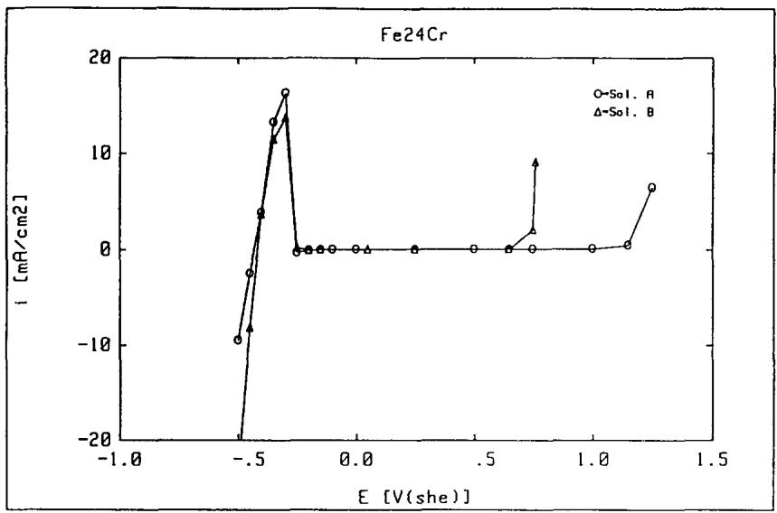

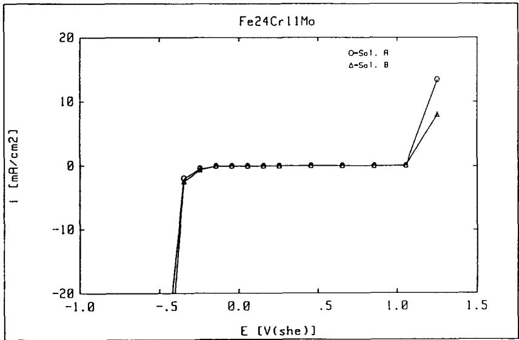  
FiG. 1. Polarization curves of Fe–24Cr and Fe-24Cr-11Mo alloys.

## EXPERIMENTAL RESULTS

## Electrochemical behavior

In Fig. 1 anodic polarization curves of Fe-24Cr and Fe–24Cr–11Mo measured in electrolytes A and B are given. Pitting in solution B is observed with Fe-24Cr only. For comparison anodic polarization curves of pure Mo and Cr are shown in Fig. 2. Transpassive dissolution of Mo starts at close to 0.5 V in both electrolytes, transpassive dissolution of Cr at approximately 1 V. The potential for transpassive dissolution of Cr is of a similar value to that for transpassive dissolution of the non-pitting alloys in Fig. 1.

Figure 3 shows current-time transients measured for the polarization conditions (PL) and (PH), respectively. Plotted on a logarithmic scale straight lines are observed. The slope at times $> 5 0 0 \mathrm { s } \mathrm { i s } 0 . 9 \pm 0 . 2$ for all conditions studied. For the condition (PH) the absolute value of the current is the same for the two alloys, while for the condition (PL) that for Fe-24Cr-11Mo is slightly lower. The same currenttime transients are observed in electrolytes A and B. According to $\mathrm { V e t t e r } ^ { 1 4 }$ a steady state current is reached when the rate of film formation becomes equal to the rate of film dissolution. In the present case no steady state is observed, even at current densities as low as $1 \mu \mathbf { A } \operatorname { c m } ^ { - 2 }$ . This suggests that the dissolution rate of the passive films under present conditions is extremely low. Pitting, generally, manifests itself on potentiostatic current-time transients by a current increase associated with pit

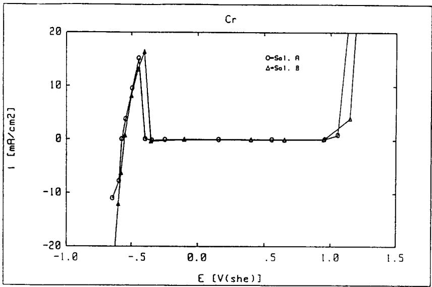

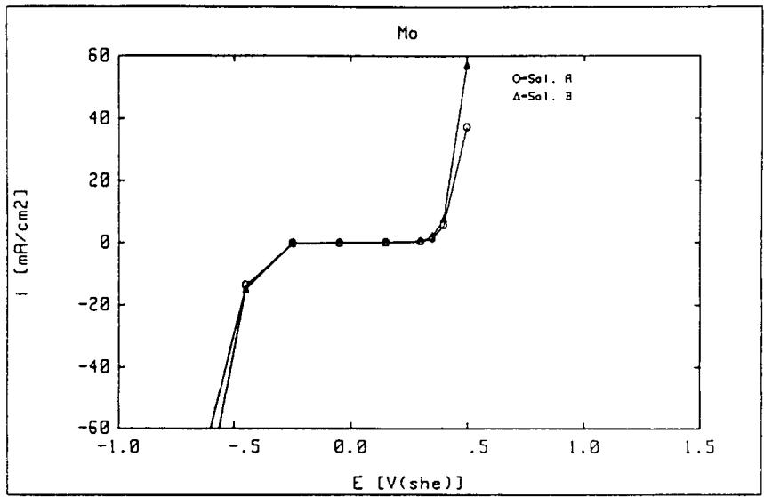  
FiG. 2. Polarization curves of Cr and Mo in electrolytes A and B, respectively.

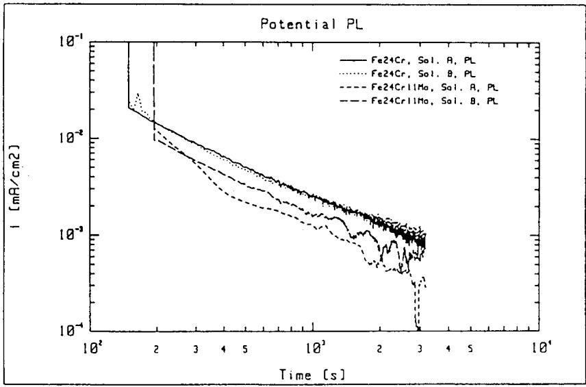

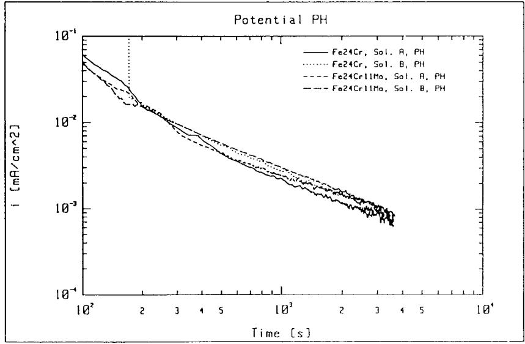  
FiG. 3. Current-time transients at passivation potentials (PL) and (PH).

initiation and growth. Since no such effect is observed in Fig. 3 pitting at the potentials (PL) and (PH) can be excluded.

## The average concentration and depth distribution of cations

Figure 4 shows measured XPS spectra of Cr $2 p _ { 3 / 2 }$ , Fe $2 p _ { 3 / 2 }$ and Mo 3d after background subtraction. Also indicated are the metallic peaks calculated according to the procedures described elsewhere. 12 The peak energy of $\mathrm { C r } 2 p _ { 3 / 2 }$ corresponds to that of trivalent chromium oxide (Table 3). The intensity of the metallic Cr $2 p _ { 3 / 2 }$ peak decreases with increasing potential. From the signal intensity ratio of metallic and oxidized Cr species the film thickness was estimated using the electron mean free paths given in Table 3. Results are presented in Fig. 5 together with those obtained from AES profiles as described below. For details of the calculation procedures used the reader is referred to Refs 12 and 15.

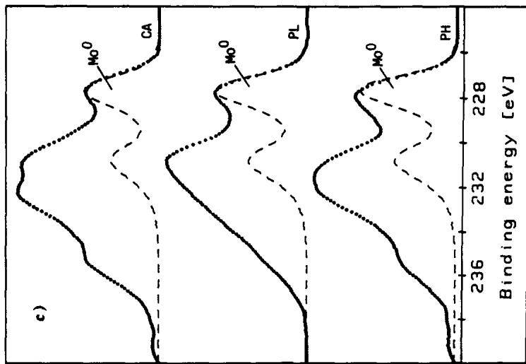

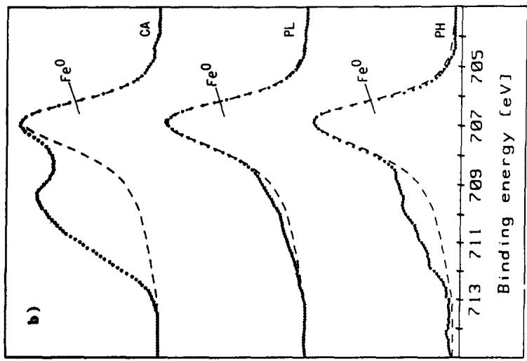  
d (   d ()    (  os  d es pnt - o  (a  ) as r  .

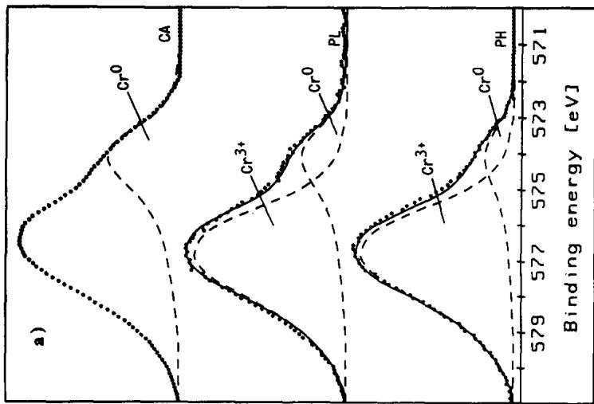

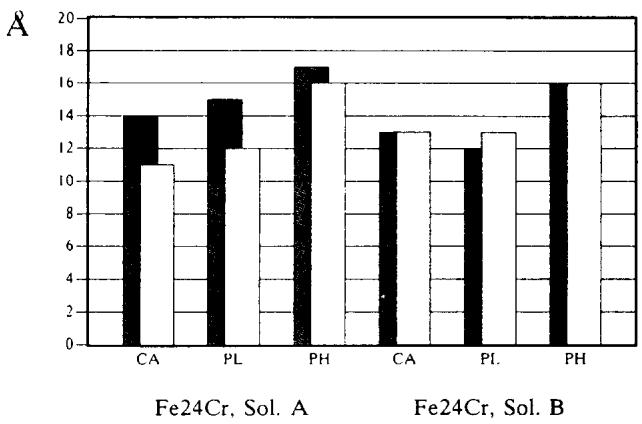

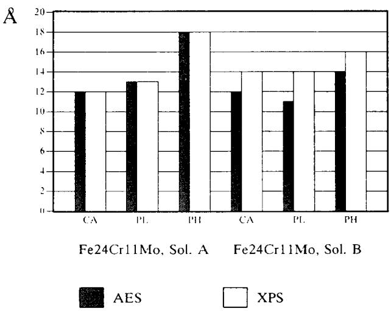  
FıG. 5. Film thickness in Å determined by AES and XPS on Fe-24Cr and Fe-24Cr–11Mo polarized at different potentials.

The Fe $2 p _ { 3 / 2 }$ and the Mo 3d peaks were deconvoluted into a metallic and an oxidized part without subdividing the latter into different valence states. The average atomic fraction of the Fe, Cr and Mo cations in the film was calculated using the area sensitivity factors of Table 3. The results are summarized in Fig. 6. The cathodically polarized sample (CA) contains significantly more Fe than the anodically polarized samples (PL) and (PH). Similarly, more molybdenum is present on the cathodically polarized sample (CA) than on the passivated samples. The concentration of Fe, Cr and Mo in the metal layers just underneath the film was estimated for the two alloys,15, but because such data are subject to considerable uncertainty they will not be discussed here. Indeed, the absolute value of the calculated metal concentration underneath passive films depends heavily on the procedure used for peak deconvolution and background subtraction and on the precision of the values of the electron mean free path employed.

AES depth profiling was used to obtain information on the depth distribution of different elements and to get additional information on film thickness. Figure 7(a) shows the AES depth profiles of O, Cr and Fe measured on Fe-24Cr-11Mo polarized at (PH) in electrolyte B. The profiles shown are corrected for the electron escape depth.12 The oxygen profile exhibits a well defined oxide-metal interface. Carbon is present as a surface contamination only, the carbon signal goes to zero at an apparent depth of approximately 0.3 nm. The Mo signal in the film (Fig. 7b) is weak but increases at the oxide metal interface. In the alloy it yields an apparent concentration of 8 at% which is higher than the nominal alloy concentration of 6 at%. The difference is attributed to Mo enrichment by preferential sputtering of Cr and Fe.16 The sulfur profile will be discussed below. From the AES profiles an apparent film thickness was computed using the 50% value of the maximum of the corrected

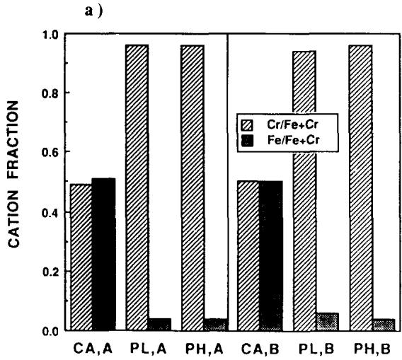

b)  
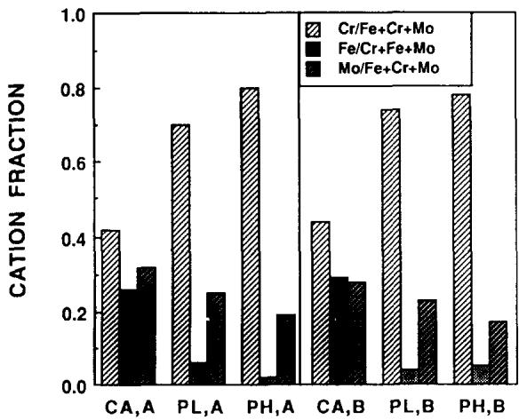  
FiG. 6. XPS average cation fraction of Cr, Fe and Mo in passive films on (a) Fe-24Cr and (b) Fe-24Cr-11Mo polarized at different potentials in electrolytes A and B, respectively.

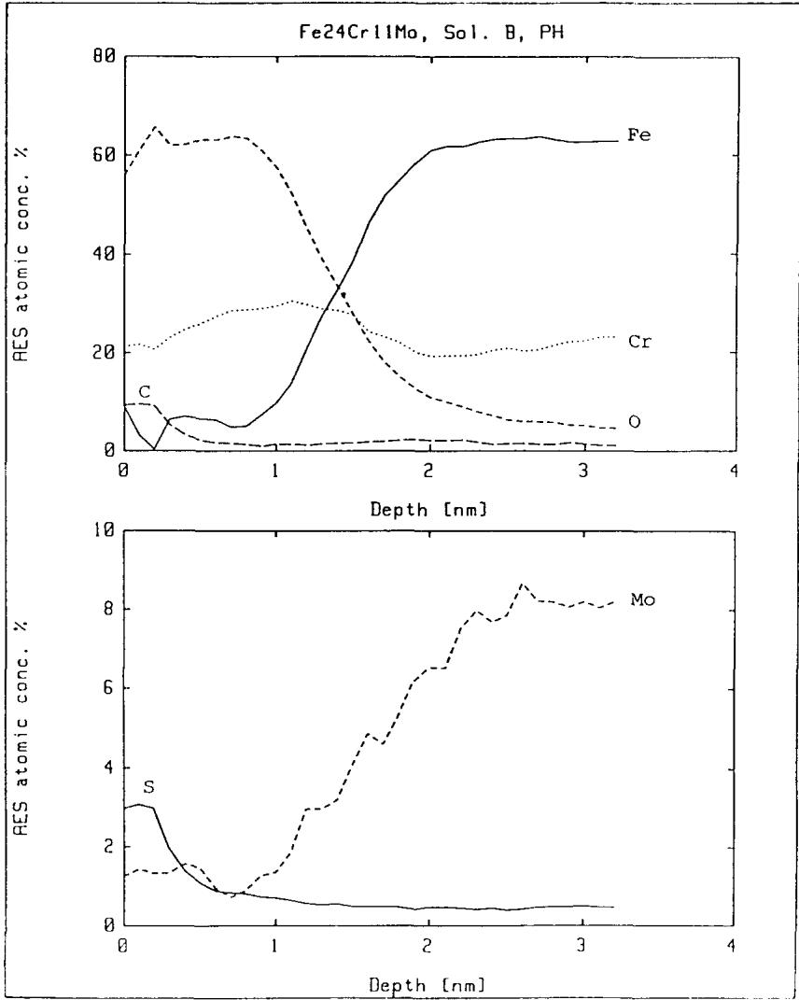  
FiG. 7. AES concentration-depth profiles measured on Fe-24Cr-11Mo polarized at potential (PH) in solution B.

oxygen amplitude as a measure. The calculated values are given in Fig. 5. They agree reasonably well with the corresponding XPS data.

Figure 8 shows the amplitude ratio Cr/Cr + Fe measured on the Fe-24Cr alloy polarized in the electrolytes A and B, respectively. The data confirm the higher Cr content of the films formed at (PL) and (PH) compared to (CA) in agreement with the XPS results. The ratio profiles of Fig. 8 go through a maximum at a depth of (a) 0.8–0.9 nm and (b) 0.3–0.4 nm, respectively. This suggests that the iron oxide observed by XPS is predominantly located in the outer part of the film. The preferential sputter behavior of mixed oxides of iron and chromium is not known and, therefore, a slight influence on profile shapes cannot be excluded. Ratio profiles Cr/Cr + Fe + Mo for the Fe-24Cr–11Mo alloy are given in Fig. 9. The profiles are qualitatively similar to those of the Fe-24Cr alloy. Figure 10 shows the ratio profiles

Mo/Fe + Cr + Mo measured on the Fe-24Cr–11Mo alloy polarized in electrolytes A and B at different potentials. The profiles exhibit a maximum close to the outer surface and they go through a minimum at the oxide-metal interface. This suggests that Mo is mostly located in the outer part of the passive film. The apparent increase of the measured ratio Mo/Mo + Fe + Cr at a depth ≥1 nm is attributed to preferential sputtering of Fe and Cr with respect to Mo. For both electrolytes, the passive films of the sample (PL) contains more Mo than those of the samples (PH). This is consistent with previous observations? and with the XPS data of Fig. 6. The Mo/Fe + Cr + Mo ratio profiles on the samples (CA) differ for the two electrolytes,

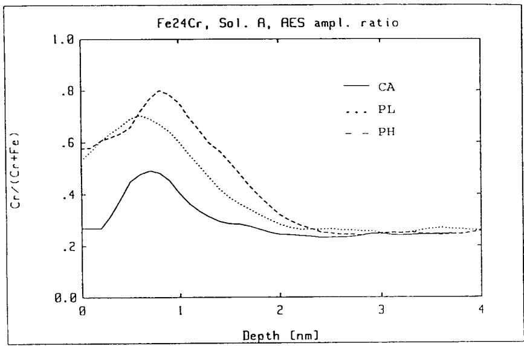

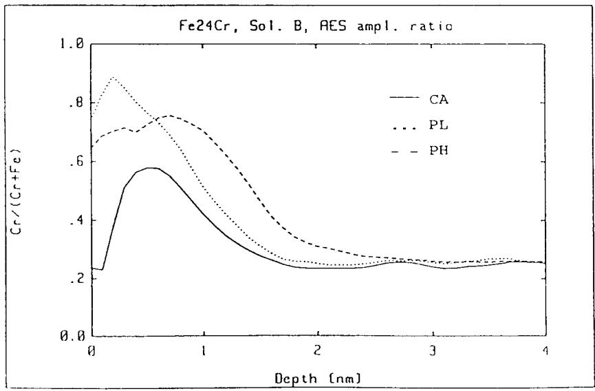  
FiG. 8. AES amplitude ratio profiles Cr/Cr + Fe) measured on Fe-24Cr polarized in solutions A and B, respectively.

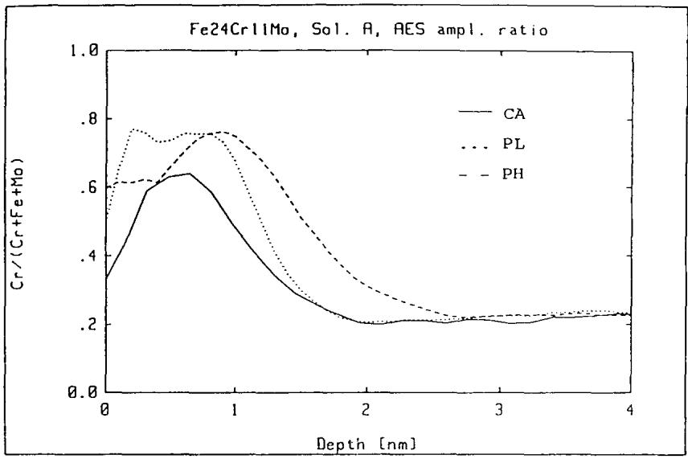

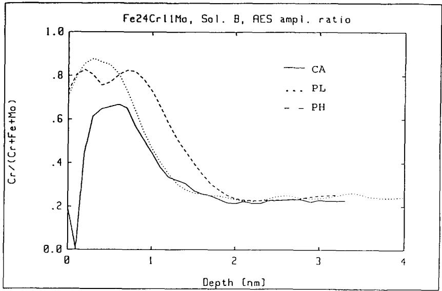  
FiG. 9. AES amplitude ratio profiles Cr/(Cr + Fe + Mo) measured on Fe-24Cr-11Mo polarized in solutions A and B, respectively.

but the XPS data (Fig. 8) do not confirm this. The differences are attributed to the fact that film forming conditions (CA) are less well defined than (PL) and (PH).

## Depth distribution of anions

Figure 11 shows measured XPS spectra of (a) sulfur and (b) chloride, respectively. A well pronounced S 2p signal is apparent for the anodically polarized samples (PL) and (PH) but not for the cathodically polarized sample (CA). The energy of the peak corresponds to that of hexavalent sulfur. Similarly, a Cl 2p peak is observed for the samples (PL) and (PH) but not for the sample (CA). The peak energy is approximately 199 eV in reasonable agreement with published data¹ for chloride ion (198-199) eV. The measured intensity of the Cl 2p signal was too weak for quantitative analysis. The sulfur concentration in the film could be determined quantitatively. The apparent sulfur concentration in the passive films (PL) and (PH) on both alloys was found to be 3–5% for both potentials and electrolytes used. The data indicate that sulfate ions are incorporated in the passive film during its formation. The absence of a significant sulfur concentration on the (CA) samples is consistent with the fact that surface films in this case form mostly outside the electrolyte after completion of the polarization experiment.

Information on the depth distribution of S and Cl is obtained from AES and SIMS

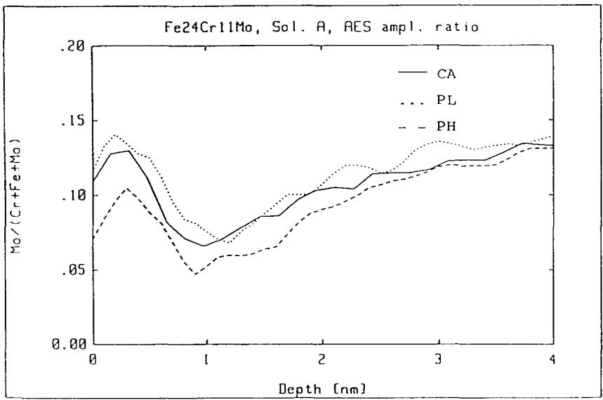

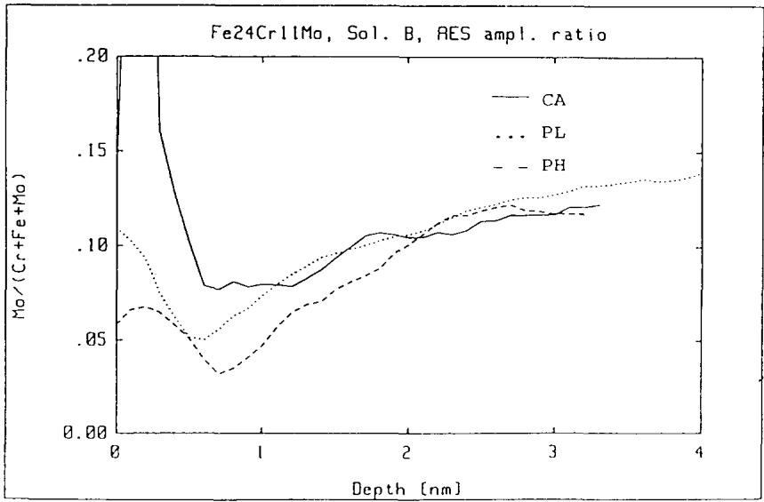  
FiG. 10. AES araplitude ratio profiles Mo/Cr + Fe + Mo) measured on Fe-24Cr-11Mo polarized in solutions A and B, respectively.

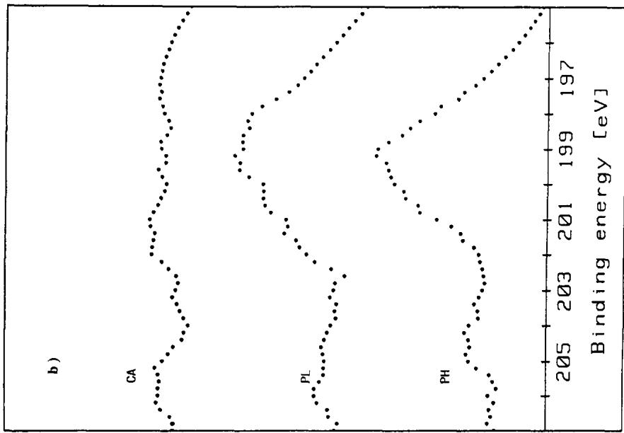

()   (  os  d     s   ..  
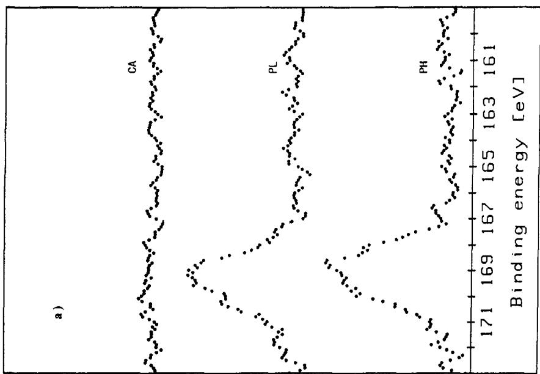

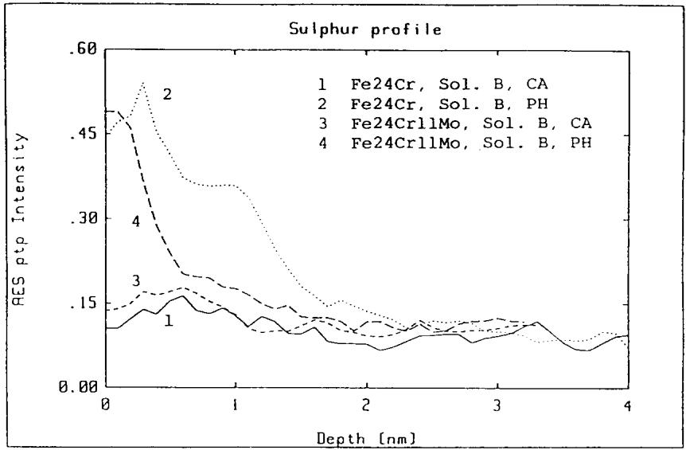  
FiG. 12. AES amplitude-depth profiles of sulfur measured on Fe-24Cr and Fe-24Cr-11Mo polarized at potentials (CA) and (PH), respectively, in solution B.

profiles. Figure 12 shows AES profiles (corrected for escape depth) of the S LMM peak at 152 eV for the polarization conditions (CA) and (PH) in electrolyte B. The data confirm qualitatively the XPS results; the signal intensity for the samples (PH) is much higher than for the samples (CA). The sulfur profiles of the Fe-24Cr and the Fe-24Cr–11Mo alloys differ, sulfur being present in deeper layers of the passive film on Fe-24Cr. It may be recalled that the thickness of the oxide films under these conditions is approximately the same for the two alloys (Fig. 5).

A chloride AES profile could be measured on the Fe-24Cr alloy only because of interference of the Mo MVV peak at 186 eV with the Cl LMM peak at 181 eV. Figure 13 shows measured profiles corrected for escape depth for three polarization conditions in electrolyte B. On the sample (CA) a weak Cl signal is observed at the outer surface, probably resulting from a contamination or from incomplete removal of electrolyte during rinsing. The samples (PL) and (PH) contrary to (CA) exhibit a well pronounced maximum of the Cl signal at a distance of approximately 0.4 nm from the outer film surface. From this it may be concluded that the passive films formed by anodic polarization in electrolyte B contained chloride ions. The shape of the profiles indicates that they were located predominantly in the outer part of the film.

Negative SIMS profiles of different anionic species were measured. Figure 14 shows OH" profiles (mass 17) for the Fe-24Cr alloy. No influence of applied potential is observed. From the shape of the profiles it is concluded that the OH ions are adsorbed at the surface rather than being incorporated into the film. A more detailed discussion of different oxygen containing species detected by SIMS in passive films on Fe-Cr and Fe-Cr-Mo alloys will be published elsewhere.13 Sulfur could not be analysed by SIMS because the quadrupole mass analyser used could not distinguish the almost identical mass/charge ratios of $^ { 3 2 } \mathrm { O } _ { 2 } ^ { - }$ and $^ { 3 2 } \mathbf { S } ^ { - }$ . The SIMS signal of $^ { 3 4 } \mathrm { { S } ^ { - } }$ resulting from the $^ { 3 4 } \mathsf { S }$ isotope which is present in a concentration of 4.21% in natural sulfur, overlaps with that of $\mathbf { O } _ { 2 } \mathbf { H } _ { 2 } ^ { - }$ . The study of chloride ion by

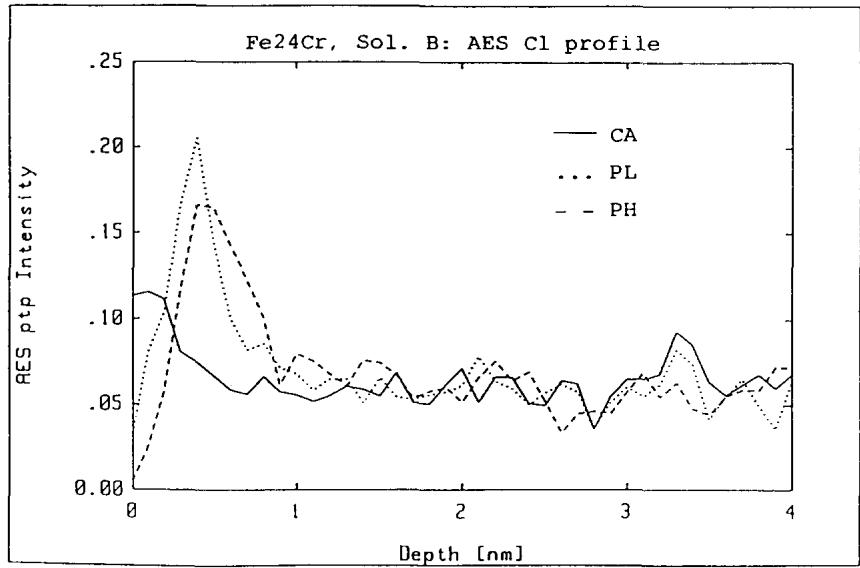  
FiG. 13. AES amplitude-depth profiles of chloride measured on Fe-24Cr polarized at potentials (CA), (PL) and (PH), respectively, in solution B.

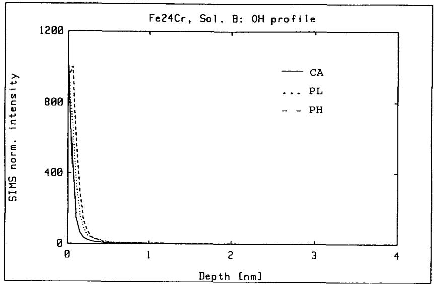  
FiG. 14. SIMS intensity–depth profiles of OH⁻ (mass 17) measured on Fe-24Cr polarized at potentials (CA), (PL) and (PH), respectively, in solution B.

SIMS is not impeded by other species. Figure 15 shows negative SIMS profiles of chloride (mass/charge ratio 35) on (a) Fe-24Cr and (b) Fe-24Cr-11Mo, respectively. On the Fe-24Cr alloy polarized at (CA) Cl− is detected at the outer film surface only. The signal is attributed to adsorbed chloride in agreement with AES data. On the same alloy polarized at (PL) and (PH), respectively, the maximum signal intensity is located in the interior of the film, the effect being most pronounced for the condition (PH). On Fe–24Cr–11Mo (Fig. 15b) a similar behaviour is observed but the chloride maxima for (PL) and (PH) are closer to the outer film surface. Qualitatively, the SIMS profiles of Fig. 15(a) are in good agreement with the AES results of Fig. 13. This indicates that the shape of the SIMS profiles is not significantly disturbed by matrix effects and is indeed representative of the variation of concentration with depth.

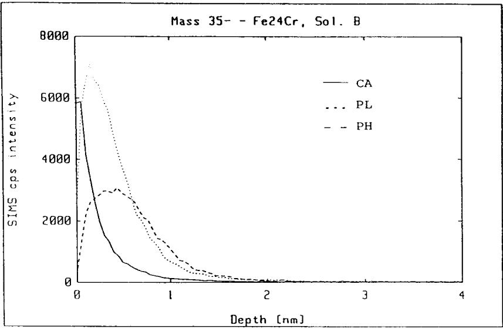

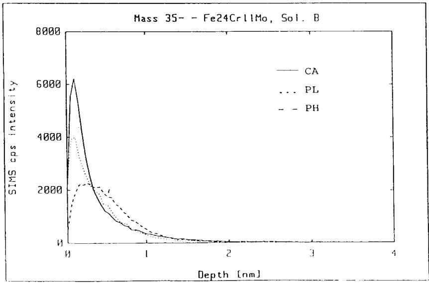  
FiG. 15. SIMS intensity-depth profiles of Cl⁻ (mass 35) measured on Fe-24Cr and on Fe-24Cr-11Mo polarized at potentials (CA), (PL) and (PH), respectively, in solution B.

## DISCUSSION

The characterization of passive films by AES, XPS and SIMS is subject to the limitations inherent in all ex situ methods.¹ An important consideration, therefore, is to what extent results are affected by the rinsing and sample transfer procedures used and what reproducibility can be achieved. The former point has been discussed elsewhere.15,18 Suffice here to mention that SIMS experiments performed with the $^ { 1 8 } \mathrm { O }$ isotope indicate that at potentials (PH) the post-oxidation of passive films is negligible. For the potentials (PL) such experiments are not available but it may be reasonably supposed that the behavior is similar. The presented data for (PH) and (PL), therefore, are believed to be representative of the passive film. The (CA) data, on the other hand, represent the film formed in air during rinsing and transfer and their reproducibility is limited. It is clear from a comparison of the results that the chemical composition of the two types of films differs substantially.

Three parameters were varied in the present study: the potential, alloyed Mo and the presence of Cl⁻ in the electrolyte. The observed influence of applied potential on film thickness in the passive region (Fig. 5) and on the Mo content of the films (Fig. 6) is in qualitative agreement with the literature2,7 although observed differences between (PL) and (PH) are slight. Alloyed Mo under the present conditions does not affect the thickness of the passive film in a significant way (Fig. 5), but it alters its composition because of incorporation of Mo (Fig. 6). The growth-dissolution behavior of the passive films as revealed by the measured current-time transients (Fig. 3) is apparently the same in presence and absence of alloyed Mo. This indicates that at the potentials applied in this study the electrochemical properties of the passive film are not significantly affected by the molybdenum. In all experiments the applied potentials were well below the critical pitting potential and no current instabilities of the type associated in the literature with metastable pitting19 were observed in this study.

The presence of chloride ion in the electrolyte had little effect on the measured thickness of the passive films, although the data of Fig. 5 suggest that films formed in electrolyte B are slightly thinner. The electrolyte composition apparently affects the distribution of molybdenum in the films; more molybdenum was found in the outer part of the film formed in electrolyte A than in electrolyte B as is evidenced by the ratio profiles Mo/Fe + Cr + Mo of Fig. 10.

The XPS, AES and SIMS data suggest that under the conditions of the present study electrolyte anions are incorporated into the passive films formed on Fe-24Cr and Fe-24Cr-11Mo. The presence of sulfate is deduced from XPS and AES, the presence of Cl⁻ from all three methods. The distribution of these species in the film is not uniform, however, they are concentrated in the outer part of the film. The thickness of the chloride containing region of the passive films can be estimated from Fig. 15 taking the 50% value of the maximum amplitude of the Cl⁻ profile as a measure. One obtains in this way 0.5 nm (PL) and 0.8 nm (PH), respectively for the Fe-24Cr alloy, 0.4 nm (PL) and 0.7 nm (PH), respectively, for the Fe–24Cr–11Mo alloy. Since the overall film thickness at a given potential is comparable for the two alloys it is concluded that Mo affects the chloride ion distribution in the film relatively more than the overall film thickness. A similar effect of Mo on the sulfur profile at potential (PH) appears in Fig. 12.

Different interpretations of the observed concentration-depth distribution of chloride ion, are a priori possible. Firstly, surface analysis methods such as AES, XPS and SIMS yield average values of concentration over the analysed area which in the present study is 200 × 200 µm for AES, 700 × 700 μm for SIMS and 3 × 3 mm for XPS. It cannot be excluded that on a smaller scale the concentration is non-uniform.

For example, if the films contain pores or defects of nanometer size, adsorption of electrolyte anions at the pore walls could possibly lead to the observation of a concentration profile over a finite thickness. In the present case, this is unlikely, however, because one would expect to find the concentration maximum at the surface rather than at some distance from it (Figs 8 and 9). Another possible way to interpret the observed chloride profiles is by postulating trapping of anions in a gel like outer film consisting of precipitated hydroxides. Such a hypothesis is in contradiction with the SIMS data of Fig. 14, however. They show only adsorbed hydroxyl ions but no hydroxide film of a thickness of several atomic layers.

A third and perhaps more plausible interpretation is that electrolyte anions are truly incorporated into the passive film where they can occupy positions of oxygen ions. This poses no conceptual difficulties in the case of chloride ions,20,21 but is more difficult to visualize for sulfate. The structure of the passive films on the alloys used is not known but according to McBee and $\mathrm { K r u g e r } ^ { \frac { 1 } { 2 2 } }$ the films are expected to be amorphous. An amorphous structure is expected to facilitate the accommodation of electrolyte anions but the problem needs further elucidation. If electrolyte anions are incorporated into the film one may ask why they are located predominantly in the outer part and why molybdenum affects their depth-distribution. At present no satisfactory explanation for this behavior is available. According to Takahashi et al. ,23 who studied anodic films on aluminium in a phosphate electrolyte, the extent of incorporation of electrolyte anions in the outer part of the barrier film depends on the transference number of the metal ions in the oxide. Passive films on Fe-Cr and Fe-Cr-Mo alloys are believed to be n-type semi-conductors.24,25 Another approach, therefore, might consider the effect of Mo on the space charge in the film.26 Further studies using in situ experimental techniques will be needed to elucidate these questions.

## CONCLUSIONS

Surface analysis data obtained by AES, XPS and SIMS on passive films formed under well defined electrochemical conditions in the presence and absence of chloride ions on two ferritic iron-chromium alloys with and without molybdenum lead to the following conclusions which are strictly valid for the experimental conditions of this study.

(1) Alloyed molybdenum has only a minor effect on the thickness of the passive film and on its growth-dissolution kinetics.

(2) The presence or absence of chloride ion in the electrolyte does not significantly change the average metal ion concentration in the film and has only a minor effect on the film thickness.

(3) Molybdenum and chloride ions rather than being distributed uniformly in the film are concentrated in its outer part.

(4) Alloyed molybdenum influences the chloride distribution in the film.

Acknowledgements—This work was financially supported by Fonds national suisse, Berne, Switzerland. The authors thank N. Xanthopulos for help with surface analysis and C. Hubschmid for helpful discussions.

## REFERENCES

1. D. LANDoLT, Proc. Int. Conf. on Localized Corrosion, Orlando, U.S.A. (1987).

2. H. FiscímEisTER and U. RoLL, Fresenius Z. Anal. Chem. 319, 639 (1984).

3. K. AsAMI, K. HAsHIMOTo and S. SHImoDAIRA, Corros. Sci. 18, 551 (1978).

4. H. STREHBLow, Surf. Interf. Anal. 12, 363 (1989).

5. I. OLEFJoRD and B. Brox, Passivity of Metals and Semiconductors (ed. M. FRomENT), p. 561. Elsevier, Amsterdam (1983).

6. I. OLEFJORD and B. ELFSTROM, Corrosion 18, 46 (1982).

7. R. GoETz and D. LANDoLT, Electrochim. Acta 29, 667 (1984).

8. R. L. TAPPING, R. D. DAvıDsoN and T. E. JAcKmAN, Surf. Interface Anal. 7, 105 (1985).

9. S. HoFMANN and J. M. SANz, Thin Film and Depth Profile Analysis (ed. H. OeCísNER), Chap. 7. Springer, Berlin (1984).

10. M. P. SEAH and W. A. DENCH, Surf. Interface Anal. 1, 2 (1979).

11. P. M. A. SHERwooD, Practical Surface Analysis (eds D. BrIGGs and M. P. SEA), p. 445. Wiley, Chichester (1983).

12. S. MIsCHLER, H. J. MATHIEU and D. LANDOLT, Surf. Interface Anal. 11, 182 (1988).

13. H. J. MATHIEU, A. VoGEL and D. LANDOLT, to be published.

14. K. J. VETTER, Electrochemical Kinetics, p. 754. Academic Press, New York (1967).

15. S. MiscHLER, Thesis No. 760, EPFL Lausanne (1988).

16. H. J. MATHIEU and D. LANDOLT, Appl. Surf. Sci. 3, 348 (1979).

17. C. D. WAGNER, W. M. RiGGs, L. E. DAvIs and G. E. MuILENBERG, in Handbook of X-Ray Photoelectron Spectroscopy, Perkin Elmer Corp., Eden Prairie (1979).

18. D. LANDOLT, S. MISCHLER, A. VoGEL and H. J. MATHIEU, CorrOs. Sci. 31, 431 (1990)

19. H. BöíNı and L. SrockERT, Werkst. Korros. 40, 63 (1989).

20. H. STREHBLow, Werkst. Korros. 35, 437 (1984).

21. T. P. HoAR, D. C. MEARs and G. P. RoTHwELL, Corros. Sci. 5, 279 (1965).

22. C. L. McBEE and J. KruGER, Electrochim. Acta 17, 1337 (1972).

23. H. TAKAHASHI, F. FUJIMOTo, H. KoNNO and M. NAGAYAMA, J. electrochem. Soc. 131, 1856 (1984).

24. A. IrHzo, Y. SEGUI, N. BUI and F. DABosI, Corrosion NACE 42, 141 (1986).

25. V. KönIG and J. W. ScHULzE, Werkst. Korros. 39, 595 (1988).

26. E. L. DAvIs, N. C. MAcDoNALD, P. W. PALMBERG, G. E. RiCH and R. E. WEBER, Handbook of Auger Electron Spectroscopy, 2nd edn. Physical Electronics Industries, Eden Prairie (1976).