# A BIPOLAR MODEL OF THE PASSIVITY OF STAINLESS STEELS—II. THE INFLUENCE OF AQUEOUS MOLYBDATE

Y. C. Lu,\* C. R.CLAYToN and A. R. BRoOKs

\*Department of Materials Science and Engineering, State University of New York at Stony Brook, Stony Brook, NY 11794, U.S.A.

Abstract—The passive films formed on Fe-19Cr-9Ni in solutions of 0.3 M NaCl (pH 5.4) and 0.3 M NaCl + 0.16 M $\mathbf { N a } _ { 2 } \mathbf { M o O } _ { 4 }$ (pH 9.0) have been characterized by variable angle XPS. Additional studies were conducted to determine the effect of the pH change on the passive film and which agent was responsible for the deprotonation found in the film produced in the molybdate solution. It is proposed that the $\mathbf { M o O } _ { 4 } ^ { 2 - }$ anions reinforce the action of $\mathrm { C r O } _ { 4 } ^ { 2 - }$ in enhancing the bipolarity of the film and thereby significantly increasing the deprotonation of the inner $\mathrm { C r } ( \mathrm { O H } ) _ { 3 }$ region, forming a more protective $\mathbf { C r } _ { 2 } \mathbf { O } _ { 3 }$ barrier layer.

## INTRODUCTION

FoR MANY years, it has been known that molybdates may act as corrosion inhibitors, increasing, for example, the resistance of stainless steels to localized corrosion. Several workers¹-6 have explored the possible effect of aqueous molybdate ions on corrosion product membranes and passive films. Sakashita and $\bf { S a t o , }$ 1 studying the ion-selective nature of thick porous corrosion product membranes, suggested that passivity should in principle be reinforced when the film becomes bipolarized with an anion-selective inner layer and a cation-selective outer layer. Under these conditions, the outer layer would allow univalent cations such as $\mathrm { ~ H ~ } ^ { + }$ to escape while inhibiting the ingress of anions such as OH- and $\mathbf { C l } ^ { - }$ . Significantly, in another work by Sakashita and $\mathsf { S a t o } , \mathsf { \Omega } ^ { 2 }$ hydrated $\mathrm { F e } ^ { 3 + }$ and $\mathrm { C r } ^ { 3 + }$ oxide membranes were found to be anion-selective in mono-monovalent solutions but cation-selective in the presence of multivalent anions such as $\mathbf { M o O } _ { 4 } ^ { 2 - }$ . This indicated that the adsorption of molybdate on the membrane produced a cation-selective outer layer which it was suggested should enhance deprotonation of the film. Applying this model to the study of thin passive films, this group3,7,8 has shown that with the cation migration from the metal hindered by the anion-selective inner layer, a positive space charge will develop, causing the $\mathrm { \partial } ^ { \cdot \mathrm { \ i } }$ ions formed by deprotonation of $\mathrm { O H } ^ { - }$ to migrate to the metal surface and create a dehydrated oxide. We also note that Larkin, Rozenfeld and $\mathrm { o t h e r s } ^ { 4 - 6 }$ have performed quantum chemical calculations that indicated the molybdate ion acts as an electron acceptor, which when adsorbed on the surface of the film, would strengthen the metal-oxygen bonds of the film. Consequently, both the structural strengthening of the passive film's crystal lattice and an increase in the negative fixed charge on the $\mathbf { M o O } _ { 4 } ^ { 2 - }$ species would be expected. The latter would be important in enhancing the cation-selective property of $\mathbf { \bar { M } o O } _ { 4 } ^ { 2 - }$

More specifically in our recent work on Mo-bearing alloys,3.7 it was shown that the addition of Mo to a stainless steel produced a less hydrated passive film with a more developed chromium oxide barrier layer. As previously discussed,8 this inner oxide layer appears to be the primary barrier layer responsible for the passivation of stainless steels and appears to be an amorphous mixed chromium oxide consisting of $\mathrm { C r } _ { 2 } \mathrm { O } _ { 3 }$ and $\mathrm { C r } { \bf O } _ { 3 }$ . It was also found that the Mo oxidizes by solid state reactions to a hydrated Mo oxide $\left[ \mathrm { o r } \mathbf { M o O ( O H ) } _ { 2 } \right]$ and $\mathbf { M o O } _ { 4 } ^ { 2 - }$ which resides in the outer hydroxide layer as $\mathbf { F e M o O } _ { 4 }$ . The proposed reaction for this behavior was given' as:

$$
\mathrm { \bf M o O ( O H ) } _ { 2 } + 4 \mathrm { O H } ^ { - }  \mathrm { M o O } _ { 4 } ^ { 2 - } + 3 \mathrm { H } _ { 2 } \mathrm { O } + 2 \mathrm { e } ^ { - } .\tag{1}
$$

Further work on defining the series of solid state reactions is being completed and will be published in a future study.º

This behavior is similar to that produced by the chromium constituent of stainless steel which has been shown in a previous work to form a relatively low concentration of chromates in the passive films. The proposed reaction for this behavior was given8 as:

$$
\mathrm { C r ( O H ) } _ { 3 } + 5 \mathrm { O H } ^ { - }  \mathrm { C r O } _ { 4 } ^ { 2 - } + 4 \mathrm { H } _ { 2 } \mathrm { O } + 3 \mathrm { e } ^ { - } .\tag{2}
$$

In the previous work,7 it was proposed that $\mathbf { M o O } _ { 4 } ^ { 2 - }$ aided $\mathrm { C r O } _ { 4 } ^ { 2 - }$ in reversing the anion-selectivity of the outer hydroxide layer, thereby enhancing its efficiency. Under this condition, univalent cations would be able to escape through the outer film allowing the anodic potential to deprotonate the film by removing protons from OH⁻. In addition, the cation-selectivity of the outer film would hinder the ingress of OH⁻ and Cl⁻ effectively stopping rehydration.

The object of this paper is to further evaluate the model previously proposed for the role of Mo in the corrosion resistance of Mo bearing alloys, by comparing it with the passivating behavior of aqueous molybdates, thereby developing a comprehensive understanding for the action of Mo as both an alloying agent and a corrosion inhibitor. For this study, variable angle XPS was used to analyse the composition of the passive films formed on Fe-19Cr-9Ni stainless steel at -0.180 V(SCE) in de-aerated NaCl solutions. The primary film studied was the one resulting when the film formed in 0.3 M NaCl after passivation for 60 min is subjected to an additional 15 min of passivation following the addition of molybdate. Since the addition of $\mathbf { N a } _ { 2 } \mathbf { M o O } _ { 4 }$ to the NaCl solution causes a pH change from 5.4 to 9.0, a second study was performed which repeated the experiment using a 0.3 M NaCl solution adjusted to pH 9.0 with NaOH in order to determine the effect of the increase in pH on the nature of the passive film. Comparison of the films formed in 0.3 M NaCl solution (pH 5.4) for 60 and 75 min were also made. Since the partial reduction of molybdate to hydrated Mo dioxide was observed, further work was performed to determine which Mo species was responsible for the deprotonation.

## EXPERIMENTAL METHOD

The composition of Fe-19Cr-9Ni stainless steel (SS) investigated in this paper is given in Table 1. The samples $( 7 \times 1 0 \times 1 \ \mathrm { m m } )$ were sealed in a pre-evacuated quartz tube and annealed at 1100+C for 3 h followed by a water quench, carried out by breaking the quartz tube under water. Since previous work1º by this group found that electropolishing could cause surface artifacts due to anodic segregation, the samples were mechanically polished up the grades from 600 grit to a 0.25 μm diamond polish finish.

Polarization was performed in a conventional Greene cell which was de-aerated by purging with argon for 2 h. All potentials were measured against a saturated calomel electrode (SCE). Specimens were cathodically polarized at —1.150 V(SCE) for 15 min to reduce the polish-formed film. The specimens were then either potentiodynamically polarized in the anodic direction at 1 $\mathbf { m } \mathbf { V } \thinspace \thinspace \mathsf { s } ^ { - 1 }$ to obtain the polarization curves or were pulsed to —0.180 V(SCE) and maintained there for a specified period of time in order to grow the passive films to be studied by XPS. The entire procedure was executed in an argon-purged glove box. It has been previously shown that the transfer of freshly passivated stainless steel through the atmosphere can lead to a minor structural modification of the iron component of the passive film." Following the passivation treatment, the specimens were removed from the cell, washed with de-aerated doubly distilled water, dried in argon, and mounted onto the XPS holder. The samples were then transferred under argon from the glove box to the spectrometer. Each of the XPS analyses were performed on separate freshly prepared samples.

TABLE 1. CoMPOSITION OF Fe-19Cr-9Ni STAINLESS STEEL
<table><tr><td>Chemical</td><td>Cr</td><td>Ni</td><td>C</td><td>N</td><td>S</td><td>Fe</td></tr><tr><td>wt%</td><td>19.2</td><td>9.0</td><td>&lt;0.05</td><td>&lt;0.002</td><td>&lt;0.025</td><td>balance</td></tr></table>

The solutions used in this study were 0.3 M NaCl (pH 5.4), 0.3 M NaCl + 0.16 M ${ \bf N a } _ { 2 } { \bf M o O } _ { 4 }$ (pH 9), and 0.3 M NaCl (pH 9 adjusted by adding 0.1 M NaOH). The solution used for the cathodic branch of all the polarization curves was 0.3 M NaCl (pH 5.4). At the open circuit potential, the solution was adjusted with NaOH or $\mathbf { N a } _ { 2 } \mathbf { M o O } _ { 4 }$ to the appropriate concentration for passivation. This was done to protect against the possible reduction of molybdate during cathodic polarization. The two doped films were grown for 60 min in 0.3 M NaCl at –180 mV; then the solution was adjusted to the pertinent composition and a further 15 min of passivation was carried out. No notable change in current density was observed during the adjustment of the solutions, indicating that the procedure did not unduly disrupt the previously formed film.

The decision to apply the molybdate solution after the formation of the passive film in the 0.3 M NaCl (pH 5.4) solution was made to insure that the molybdate resided in the outer region of the film as was found in our previous work.7 Thus it was possible to compare the effect on passivity of the aqueous molybdate and the Mo alloy addition.

All XPS measurements were performed with a V.G. Scientific ESCA 3 MK II controlled by a V.G. 1000 data system. A Mg ${ \bf K } _ { a 1 2 }$ (1253.6 eV) source was used for XPS and operated at 200 W. The base pressure was 1 to $2 \times 1 0 ^ { - 9 }$ torr. All XPS measurements were carried out at high and low take-off angles (50° and 20°, measured with respect to the plane of the sample) to observe the inner and outer layers of the films, respectively.12 For reference the binding energy of the Au 4f 7/2 line was taken as 83.8 eV and was found to have a FWHM of 1.4 eV under the experimental conditions. The XPS spectra were corrected for charge shifting by taking the carbon 1s spectrum from the adventitious carbon as 284.6 eV. The entrance and exit slit widths of the hemispherical analyser were 4 mm. According to Seah,13 this would make the half angle of the spectrometer for photo-electron emission 0.095 radians.

All data were smoothed utilizing a 15 point quadratic/cubic least squares program following the method developed by Savitsky and Golay,14 which has been modified to cover the truncation errors at the end of the spectra. Since the Cr 2p peak produces a $\mathrm { { \bf M g K } } _ { a 3 4 }$ satellite on the high binding energy side of the Cr 2p peak, a satellite subtraction program dependent on the pass energy of the analyser was used to eliminate the satellite.

The background caused by the rising tail on the high binding energy side of the spectra was simulated using the curve fitting parameters. The two background parameters of the synthesis program, which provide a straight background with a specifiable slope, would be primarily set to the background of the low energy side of the spectra with some consideration to the high energy side for slight adjustments. The resulting difference would then be handled by adjusting the intensities of the standardized peaks to compensate for the rising high energy tails. This would prove consistent within an elemental series since the same background procedure would have been used in developing the parameters for the standards.

The curve-fitting program allowed the operator to synthesize peaks by specifying the peak's position, height, width and shape. The optional shape parameters included the peak's Gaussian/Lorentzian ratio and tail characteristics which are height, slope and exponential to linear tail mix.1⁵As stated above, the program also included y-axis intercept and background slope parameters bringing the total of fitting parameters used to nine. The parameters used came from the group's work on standards supplemented by those given in the literature. In general, our instrumentation gave FWHM 10–25% narrower than those given in Allen et al.16

To aid in the correct fitting of the peaks, the simpler peaks such as oxygen were fitted first to provide information as to how the more complex peaks should be fitted. Since curve fitting can provide several solutions to the same spectrum, spectral resolution was enhanced by applying variable angle XPS in order to determine the best fit. As an additional precaution against spurious fittings, restrictions were placed on manipulating the remaining fitting parameters. The peak position was allowed ${ \bf a } \pm 0 . 1 \ \mathrm { e V }$ margin, since from our standards work this was the uncertainty in values obtained. The FWHM also was considered to have an uncertainty $_ { \mathrm { o f } \pm 0 . 1 e \mathbf { V } }$ , and a correction of 0.3 eV was made if the standard was taken with Al ${ \bf K } _ { \alpha 1 2 }$ radiation instead of Mg ${ \bf K } _ { \alpha 1 2 }$ radiation. While our software provides no specific statistical tests for peak independence, comparisons of the peak area ratios of peaks to the peak areas of their neighboring peaks have failed to show a correspondence indicating any dependence of one peak on another due to possible satellite or energy loss phenomena.

## EXPERIMENTAL RESULTS

The potentiodynamic traces for the solutions involved are presented in Fig. 1. The pertinent electrochemical features of the traces are tabulated in Table 2.

## General interpretation of XPS spectra

Selected spectra of Cr, Mo and O are presented in Figs 2–8. To aid in the comparison of the $2 0 ^ { \circ }$ and $5 0 ^ { \circ }$ spectra, the peak areas for each of the main spectra obtained from the passive films in Tables 3-5 have been presented. The peak areas were normalized to the total peak area of the oxidized metal signals. This semiquantitative analysis provides a convenient guide to the relative abundance of the various species in the inner and outer regions of the passive films. No attempt was made to convert the peak areas to atomic percentages.

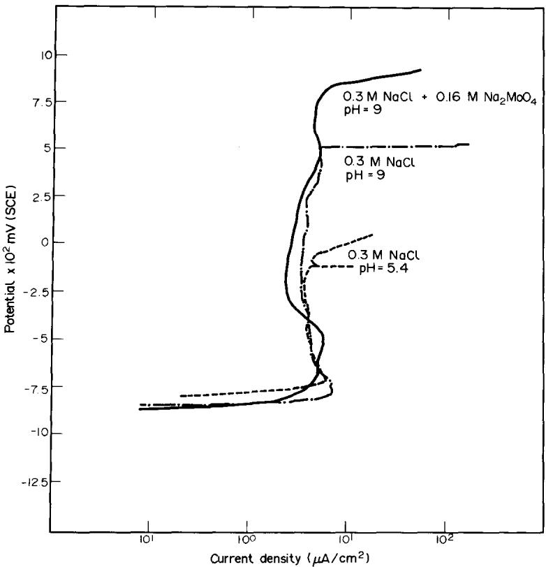  
FıG. 1. Polarization diagrams for Fe-19Cr-9Ni alloy obtained in de-aerated 0.3 M NaCl (pH 5.4), 0.3 M NaCl (pH 9.0) and 0.3 M NaCl + 0.16 M $\mathbf { N a } _ { 2 } \mathbf { M o O } _ { 4 }$ (pH 9.0).

TABLE 2. ANODIC POLARIZATION PARAMETERS FOR Fe-19Cr–9Ni ALLOY IN AERATED 0.3 M NaCl (pH 5.4), 0.3 M NaCl (pH 9.0), AND 0.3 M $\mathrm { N a C l } + 0 . 1 6$ M $\mathbf { N a } _ { 2 } \mathbf { M o O } _ { 4 }$ (pH 9.0) SOLUTIONS
<table><tr><td>Solution</td><td> $E _ { \mathrm { c o r r } }$  (mV)</td><td> $\begin{array} { c } { E _ { \mathrm { { p p } } } } \\ { ( \mathrm { { m V } ) } } \end{array}$ </td><td> $I _ { \mathrm { c r i t } }$   $( \mu \mathbf { A } \mathbf { c m } ^ { - 2 } )$ </td><td> $I _ { \mathrm { p a s s i v e } }$   $( \mu \mathbf { A } \mathbf { c m } ^ { - 2 } )$ </td><td> $E _ { \mathrm { t r a n s } }$   $( \mathrm { m V } )$ </td><td> $E _ { \mathfrak { p i t } }$  (mV)</td></tr><tr><td>0.3MNaCl(pH5.4)</td><td>-792</td><td>-705</td><td>6.4</td><td>3.7</td><td>一</td><td>-50</td></tr><tr><td>0.3MNaCl(pH9.0)</td><td>-843</td><td>-775</td><td>7.2</td><td>3.3</td><td></td><td>525</td></tr><tr><td>0.3MNaCl+0.16M  $\mathrm { N a _ { 2 } M o O _ { 4 } ( p H 9 . 0 ) }$ </td><td>-863</td><td>一</td><td>5.7</td><td>2.3</td><td>838</td><td>一</td></tr></table>

## Cr $2 p _ { 3 / 2 }$ spectra

Five components were found in each case corresponding to the following species: (i) metallic Cr from the substrate, (ii) $\mathrm { C r ^ { 3 + } }$ , corresponding to $\mathrm { C r } _ { 2 } \mathrm { O } _ { 3 } , ( \mathrm { \bar { i } \bar { i } \bar { i } } ) \mathrm { C r } ^ { 3 + }$ corresponding to $\mathrm { C r ( O H ) } _ { 3 } , ( \mathrm { i v ) \mathrm { C r } ^ { 6 + } }$ , corresponding to $\mathrm { C r } { \bf O } _ { 3 }$ , and $\mathbf { ( v ) \thinspace C r ^ { 6 + } }$ , corresponding to $\mathrm { C r O } _ { 4 } ^ { 2 - }$

In general, the spectra of $\mathrm { C r } _ { 2 } \mathrm { O } _ { 3 }$ and $\mathrm { C r } \mathrm { O } _ { 3 }$ were stronger at $5 0 ^ { \circ }$ indicating that they form as a mixed oxide phase at the metal-film interface. Previous RHEED analysis by this group on non-Mo bearing stainless steels,8 indicate that this phase is probably amorphous. The spectra of the Cr(OH)3 and $\mathrm { C r O } _ { 4 } ^ { 2 - }$ were not as prominent at $5 0 ^ { \circ }$ suggesting that they form a layer above the oxide one.

The film formed in 0.3 M NaCl (pH 9.0) showed the greatest hydration of all the films studied as indicated by the $\mathrm { C r } _ { 2 } \mathrm { O } _ { 3 } / \mathrm { C r } ( \mathrm { O H } ) _ { 3 }$ ratios. Using the same ratio, the film found to be deprotonated the most was the one produced in 0.3 M NaCl + 0.16 M $\mathrm { N a } _ { 2 } \mathrm { M o O } _ { 4 } \left( \mathrm { p H } 9 . 0 \right)$

## Fe $2 p _ { 3 / 2 } s p e c t r a$

Three valence states formed the components of the spectra: metallic, 2+ and 3 +.

Comparing the $\mathrm { F e } ^ { 3 + } / \mathrm { F e } ^ { 2 + }$ ratios, all the films showed a stronger contribution from the $\mathsf { F e } ^ { 2 + }$ than the $\mathsf { F e } ^ { 3 + }$ at both take-off angles. Unlike the other films, the one exposed for 15 min to the ${ \bf N a } _ { 2 } { \bf M o O } _ { 4 }$ solution showed no angular dependence in its $\mathrm { F e } ^ { \cdot 3 + } / \mathrm { F e } ^ { 2 + }$ ratio.

## Ni $2 p _ { 3 / 2 }$ spectra

Besides the metallic state, some films exhibited evidence of Ni oxidizing to the 3+ valence state. The film exposed to the molybdate solution for 15 min displayed no oxidation of Ni, while the NaOH doped solution shows the greatest oxidation relative to the metal signal. Only slight oxidation was found in the other films. However, it should be noted that the signal to noise of these spectra were poor, making their analysis difficult.

## Mo $3 d _ { 5 / 2 }$ spectra

At room temperature, the Mo spectra show two components: 4+ and $^ { 6 + }$ . At $7 0 \mathrm { { } ^ { \circ } C }$ , the $\mathbf { M o ^ { 4 + } }$ disappears. On the basis of other work currently in progress in this laboratory, the 4+ is assumed to be a hydrated form of $\mathbf { M o O } _ { 2 } \left( \mathbf { M o O } ( \mathbf { \bar { O } H } ) _ { 2 } \right)$ while the 6+ is identified as $\mathbf { M o O } _ { 4 } ^ { 2 - }$ . Comparing the relative ratios of the two valence states,

A 1  MIN

P4S           S.A AL  I R   R S I  T . =    0 = +1  0 = \_2  = +/+ = (/210)

0 =     = +1 \_  = \_/-  = ++ = (/210)

=    0 = + \_ 0 = \_/-  = +2/+  = '(0)

AP  N    T --  O  AS   I RS       I) AI  -     H     N    S  II  MO  L N  O S  E

$$
\begin{array} { r l } { \mathbf { \bar { \mu } } _ { 1 } ^ { \mathrm { R } } } & { : = } & { | \begin{array} { l } { \mathbf { \bar { \mu } } _ { 1 } ^ { \mathrm { R } } } \\ { \mathbf { \bar { \mu } } _ { 2 } ^ { \mathrm { R } } } \end{array} | } \\ & { = } & { | \begin{array} { l } { \mathbf { \bar { \mu } } _ { 1 } ^ { \mathrm { R } } } \\ { \mathbf { \bar { \mu } } _ { 2 } ^ { \mathrm { R } } } \end{array} | } \\ & { : = } \\ & { | \begin{array} { l } { \mathbf { \bar { \mu } } _ { 3 } ^ { \mathrm { R } } } \\ { \mathbf { \bar { \mu } } _ { 4 } ^ { \mathrm { R } } } \end{array} | } \\ & { : = } \\ & { | \begin{array} { l } { \mathbf { \bar { \mu } } _ { 4 } ^ { \mathrm { R } } } \\ { \mathbf { \bar { \mu } } _ { 5 } ^ { \mathrm { R } } } \end{array} | } \\ & { = } \\ & { | \begin{array} { l } { \mathbf { \bar { \mu } } _ { 5 } ^ { \mathrm { R } } } \\ { \mathbf { \bar { \mu } } _ { 7 } ^ { \mathrm { R } } } \end{array} | } \\ & { = } \\ & { | \begin{array} { l } { \mathbf { \bar { \mu } } _ { 4 } ^ { \mathrm { R } } } \\ { \mathbf { \bar { \mu } } _ { 7 } ^ { \mathrm { R } } } \end{array} | } \\ & { \leq } \\ & { | \begin{array} { l } { \mathbf { \bar { \mu } } _ { 5 } ^ { \mathrm { R } } } \\ { \mathbf { \bar { \mu } } _ { 8 } ^ { \mathrm { R } } } \end{array} | } \\ & { = } \\ & { | \begin{array} { l } { \mathbf { \bar { \mu } } _ { 7 } ^ { \mathrm { R } } } \\ { \mathbf { \bar { \mu } } _ { 7 } ^ { \mathrm { R } } } \end{array} | } \\ & { \leq } \\ &  | \begin{array} { l } { \mathbf { \bar { \mu } } _ { 1 } ^ { \mathrm { R } } } \\ { \mathbf { \bar { \mu } } _ { 8 } ^ { \mathrm { R } } } \\ { \mathbf { \bar { \mu } } _ { 7 } ^ { \mathrm { R } } } \end{array} \end{array}
$$

$$
\begin{array} { r l } { \frac { 1 } { 2 \tau _ { 2 } } } & { { } = } & { \frac { 1 } { 2 \tau _ { 2 } } \{ \begin{array} { l l } { 1 } & { 0 } \\ { 0 } & { 1 } \end{array} \} , } \\ { \frac { 1 } { 2 \tau _ { 2 } } } & { { } = } & { \frac { 1 } { 2 \tau _ { 2 } } \{ \begin{array} { l l } { 1 } & { 0 } \\ { 0 } & { 1 } \end{array} \} , } \\ { \frac { 1 } { 2 \tau _ { 2 } } } & { { } = } & { \frac { 1 } { 2 \tau _ { 2 } } \{ \begin{array} { l l } { 1 } & { 0 } \\ { 0 } & { 1 } \end{array} \} , } \\ { \frac { 1 } { 2 \tau _ { 2 } } } & { { } = } & { \frac { 1 } { 2 \tau _ { 2 } } \{ \begin{array} { l l } { 1 } & { 0 } \\ { 0 } & { 1 } \end{array} \} , } \\ { \frac { 1 } { 2 \tau _ { 2 } } } & { { } = } & { \frac { 1 } { 2 \tau _ { 2 } } \{ \begin{array} { l l } { 1 } & { 0 } \\ { 0 } & { 1 } \end{array} \} , } \\ { \frac { 1 } { 2 \tau _ { 2 } } } & { { } = } & { \frac { 1 } { 2 \tau _ { 2 } } \{ \begin{array} { l l } { 1 } & { 0 } \\ { 0 } & { 1 } \end{array} \} , } \\ { \frac { 1 } { 2 \tau _ { 2 } } } & { { } = } & { \frac { 1 } { 2 \tau _ { 2 } } \{ \begin{array} { l l } { 1 } & { 0 } \\ { 0 } & { 1 } \end{array} \} , } \\ { \frac { 1 } { 2 \tau _ { 2 } } } & { { } = } & { \frac { 1 } { 2 \tau _ { 2 } } \{ \begin{array} { l l } { 1 } & { 0 } \\ { 0 } & { 1 } \end{array} \} , } \\ { \frac { 1 } { 2 \tau _ { 2 } } } & { { } = } & { \frac { 1 } { 2 \tau _ { 2 } } \{ \begin{array} { l l } { 1 } & { 0 } \\ { 0 } & { 1 } \end{array} \} , } \\ { \frac { 1 } { 2 \tau _ { 2 } } } & { { } = } &  \frac { 1 } { 2 \tau _ { 2 } } \{ \begin{array} { l l } { 1 } & { 0 } \\   \end{array} \end{array}
$$

the greatest relative percentage of $\mathbf { M o O } _ { 4 } ^ { 2 - }$ occurs at $2 0 ^ { \circ }$ indicating it is in the outer region of the film closer to the solution than the substrate.

## O 1s spectra

In all the spectra three components could be clearly discerned: $\mathrm { O } ^ { 2 - } , \mathrm { O H } ^ { - }$ and adsorbed $\mathbf { H } _ { 2 } \mathbf { O }$ . From the sensitivity factors involved, the oxygen contribution from the molybdenum species is roughly 1.19 times the Mo signal. The low concentration of the Mo species found indicated that its contribution to the oxygen envelope was only 2-3% and it was not included in the syntheses. The $\mathrm { O } ^ { 2 - } / \mathrm { O H } ^ { - }$ ratios are angularly dependent which suggests the oxides are located at the metal-film interface while the hydroxides are in the outer region. It should be noted that the highest production of oxides occurred in the films formed in the molybdate solutions. The lowest ratio of $\mathrm { C r } _ { 2 } \mathrm { O } _ { 3 } / \mathrm { C r } ( \mathrm { O H } ) _ { 3 }$ occurred in the film produced in the 0.3 M NaCl (pH 9) solution. This trend is also observable in the chromium spectra.

## Cl 2p spectra

These spectra appeared strongest in the case of the 0.3 M NaCl (pH 5.4) solution suggesting the adsorption or partial incorporation of Cl⁻ ions in the passive film. The films formed in the molybdate and the pH adjusted solutions showed the least chlorine.

## DISCUSSION

This study is concerned with the changes caused to passive films already formed in 0.3 M NaCl (pH 5.4) by additional 15 min passivations in different solutions. To ensure that this additional 15 min of passivation required for the studies did not result in any significant aging phenomena, two films formed in the 0.3 M NaCl (pH 5.4) solution for different passivation times were investigated. The differing times were 60 and 75 min. By comparing the Cr and O spectra from the 60 min film in Fig. 2 to the spectra of the 75 min film in Figs 3 and 4, one sees that there are no significant differences between the films formed by passivating for 60 or for 75 min in 0.3 M NaCl (pH 5.4).

One should explore three questions to determine whether the changes brought about in the films by additional 15 min passivations in different solutions were due to the presence of molybdate, a reduced Mo species or to the pH of the molybdate solution. First, are the films produced in the 0.3 M NaCl (pH 9.0) solution and the molybdate (pH 9.0) the same? If so, then the resulting films are probably the product of the pH change. Secondly, if the films are not the same, what species from the molybdate solution is responsible for the difference? Thirdly, if the film produced in the molybdate solution is not the product of the pH change and a Mo species is responsible for the difference, what mechanism is forming the film? In the following three subsections, an attempt is made to answer these questions.

## pH Effects on 0.3 M NaCl film

As stated previously, Sakashita and $\mathsf { S a t o } ^ { 2 }$ have found that anion-selective films reverse to cation-selective when oxyanions of the form $\mathbf { M e O } _ { 4 } ^ { 2 - }$ are adsorbed on the film. They have also reported¹7 that this reversal of the ion selectivity of a film can be produced by increasing the pH of a solution beyond a certain level. The specific pH at which this occurs is called the iso-selective pH or point of iso-selectivity $\left( \mathsf { p H } _ { \mathsf { p i s } } \right)$

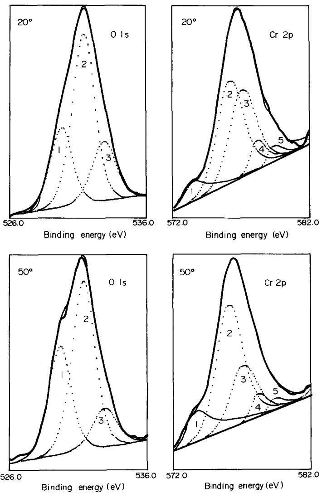  
FiG. 2. O 1s and Cr 2p spectra obtained from the passive film formed on Fe-19Cr-9Ni alloy at –180 mV(SCE) in 0.3 M NaCl (pH 5.4) for 60 min. The peak numbers correspond to: O 1s: 1, O²- 529.9 eV; 2, OH⁻ 531.4 eV; 3, H2O 532.9 eV. Cr 2p: 1, Metal 574.1 eV; $2 , \mathbf { C r } _ { 2 } \mathbf { O } _ { 3 } 5 7 6 . 3 \mathbf { e V } ; 3 , \mathbf { C r } ( \mathbf { O H } ) _ { 3 } 5 7 7 . 0 \mathbf { e V } ; 4 , \mathbf { C r O } _ { 3 } 5 7 8 . 1 \mathbf { e V } ; 5 , \mathbf { C r O } _ { 4 } ^ { 2 - } 5 7 9 . 3 \mathbf { e V } .$

According to Sato, 18 the $\mathsf { p H } _ { \mathsf { p i s } }$ of the oxides and hydroxides of the first row transition metals generally fall in a range of 10–13. However, he also reported that the $\mathsf { p H } _ { \mathsf { p i s } }$ of $\mathtt { F e } ^ { ( 2 + , 3 + ) }$ oxide membranes drops to 5.8. Therefore it was necessary to determine whether the changes brought about in the films analysed in this study were due to the presence of molybdate or to the pH of the molybdate solution.

The results (given in Figs 3 and 4, and Tables 4 and 5) show the two films are significantly different. The molybdate film shows the greatest development of the chromium oxide layer relative to the chromium hydroxide layer of all the films studied. This behavior is consistent with the development of cation-selectivity in the outer layers of the film. By contrast, the film produced in the 0.3 M NaCl (pH 9.0)

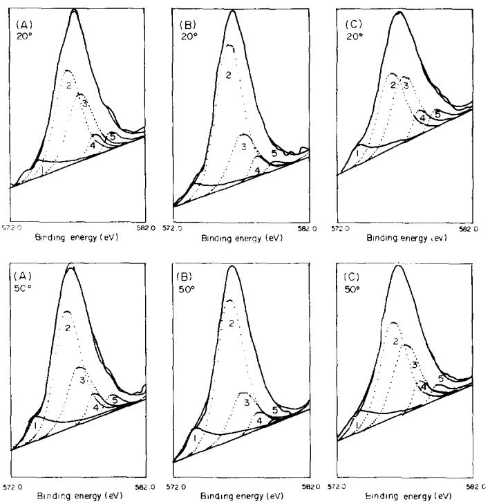  
FiG. 3. O 1s photo-electron spectra obtained from the passive films formed on Fe-19Cr-9Ni alloy at −180 mV(SCE): (A) in 0.3 M NaCl (pH 5.4) for 75 min; (B) in 0.3 M NaCl (pH 5.4) for 60 min then in 0.3 M NaCl + 0.16 M $\mathbf { N a } _ { 2 } \mathbf { M o O } _ { 4 }$ (pH 9.0) for 15 min; (C) in 0.3 M NaCl (pH 5.4) for 60 min then in 0.3M NaCl (pH 9.0) for 15 min. 1 $, { \bf O } ^ { 2 - } 5 2 9 . 9 \mathrm { e V } ; 2 , { \mathrm { O H } } ^ { - }$ 531.4 eV; 3, H2O 532.9 eV.

solution shows the least development of the chromium oxide layer relative to the chromium hydroxide layer than any of the other films studied. This behavior suggests that the film has not reverted to a cation-selective film and that the $\mathrm { \ p H _ { \mathrm { p i s } } }$ of this film is higher than pH 9.0.

It is surprising, however, that the film produced in the 0.3 M NaCl (pH 9.0) is not bipolar, considering the relative increase of chromate seen in this film. As would be expected from reaction 2, the increase in the $\mathrm { { \ o H ^ { - } } }$ concentration drives the reaction to the right producing the largest relative ratio of chromate to total $\mathrm { C r } ^ { 3 + }$ species (Tables 3-5) found in any of the films studied. From the discussion on bipolarity in the introduction, one would expect increased deprotonation due to the presence of significant amounts of chromates. However, the expected deprotonation of the chromium hydroxide layer did not occur. This failure to deprotonate the hydroxide layer in the film indicates that the bipolar effect of the chromate was overpowered by hydroxyl ion influx.

The electrochemical data (Fig. 1) show that the 0.3 M NaCl (pH 9.0) solution is a less aggressive pitting environment than the 0.3 M NaCl (pH 5.4) solution. The pitting resistance is improved despite the fact that the XPS data for a passive film formed at -180 mV show evidence of rehydration of the Cr-rich inner region of the film. The mechanism involved is indicated by the point that this film showed the least Cl⁻ contamination of all the films. The sole mechanism here appears to be the competition for adsorption offered by OH⁻ to the Cl⁻ due to the increase of more than three orders of magnitude in the OH⁻ concentration. This mechanism has been reported earlier by Rozenfeld and Maksimtchuk,19 and has been discussed by Szklarska-Smialowska.20

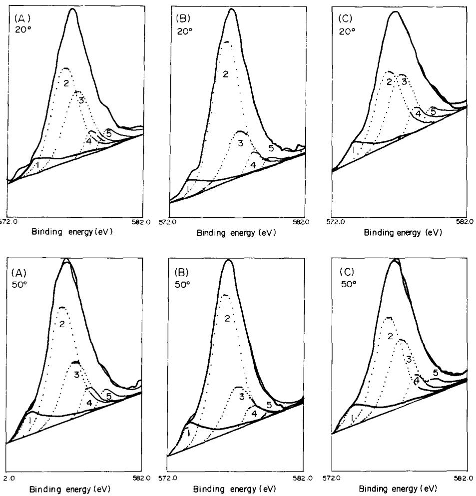  
FiG. 4. Cr 2p photo-electron spectra obtained from the passive films formed on Fe-19Cr-9Ni alloy at −180 mV(SCE): (A) in 0.3 M NaCl (pH 5.4) for 75 min; (B) in 0.3 M NaCl (pH 5.4) for 60 min then in 0.3 M NaCl + 0.16M Na2MoO4 (pH 9.0) for 15 min; (C) in 0.3 M NaCl (pH 5.4) for 60 min then in 0.3 M NaCl (pH 9.0) for 15 min. 1, Metal 574.1 eV; $2 , \mathrm { C r } _ { 2 } \mathrm { O } _ { 3 } 5 7 6 . 3 \ : \mathrm { e V } ; 3 , \mathrm { C r } ( \mathrm { O H } ) _ { 3 } 5 7 7 . 0 \ : \mathrm { e V } ; 4 , \mathrm { C r O } _ { 3 } 5 7 8 . 1 \ : \mathrm { e V } ; 5 , \mathrm { C r O } _ { 4 } ^ { 2 - } 5 7 9 . 3 \ : \mathrm { e V } ,$

## Determination of deprotonating agent

As in the previous work on Mo bearing alloys,7 Mo was found both as $\mathbf { M o O ( O H ) } _ { 2 }$ and $\mathbf { M o O } _ { 4 } ^ { 2 - }$ , as can be seen in Fig. 5. This raises the question as to which Mo species is the cause of the deprotonation. To see if the reversal of reaction 1 is temperature dependent, an additional 15 min molybdate doping experiment at ${ 7 0 ^ { \circ } } \mathbf { C }$ was performed. At the higher temperature, the $\mathbf { M o O } _ { 4 } ^ { 2 \cdot }$ species proved to be stable, as can be seen in Fig. 6. Since significant evidence of deprotonation was also found in Figs 7 and 8, it was concluded that the molybdate was responsible for the deprotonation.

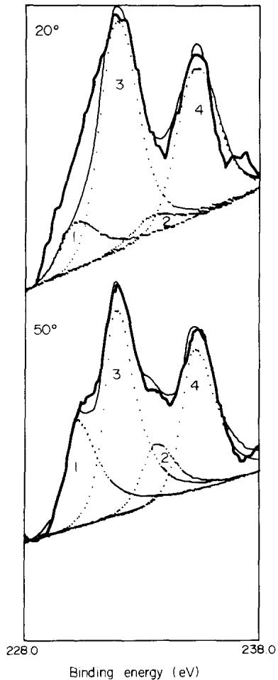  
FiG. 5. Mo 3d photo-electron spectra obtained from the passive film formed at room temperature on Fe-19Cr-9Ni alloy at -180 mV(SCE) in 0.3 M NaCl (pH 5.4) for 60 min followed by a further passivation of 15 min in 0.3 M NaCl + 0.16 M Na2MoO4 (pH 9.0). $1 , \mathbf { M } \mathbf { o } ^ { 4 + } 3 d _ { \widetilde { s } / 2 } ^ { ' } 2 3 0 . 2 \mathbf { e V } ; \widetilde { 2 } , \mathbf { M } \mathbf { o } ^ { 4 + } 3 d _ { 3 / 2 } 2 3 3 . 4 \mathbf { e V } ; 3 , \mathbf { M } \mathbf { o } ^ { 6 + } 3 d _ { \widetilde { s } / 2 } 2 3 1 . 9 \mathbf { e V } ; 4 , \mathbf { M } \widetilde { \mathbf { o } ^ { 6 + } 3 } d _ { 3 / 2 } 2 3 5 . 1 \mathbf { e V } .$

## Fifteen minute molybdate film

Tables 3-5 offer strong evidence that increased deprotonation occurs when molybdates are contained in the film. This is indicated by the significant increases in the chromium oxide to hydroxide ratios when molybdate is present. Supplemental to this is the reduction in the concentration of Cl⁻ entering the films when compared to the film formed in 0.3 M NaCl (pH 5.4). Inspection of Fig. 5 indicates that the relative position of the molybdate is in the outer region of the film. This behavior strongly resembles that found in previous work on stainless steels.3,7,8

According to Sato18 and the pH work done in this paper, one would expect the 0.3 M NaCl (pH 5.4) film to be anion-selective at the pH studied. This means it contains fixed positive charges on its surface and along its diffusion pathways, which hinder the transport of cations across the film while allowing anions to penetrate the film. In previous work,3,7 it was proposed that the adsorption of molybdate on the outer region of the passive film will either replace or mask the original positive charges thereby eliminating the anion selective properties of that region of the film. In addition, the strongly electronegative oxygens of the molybdate will act as fixed negative charges, effectively making the outer region of the film cation selective. This bipolarizes the film with an outer cation-selective region and an inner anion-selective region. As noted in the introduction, this essentially causes a rectification of the film's ion transport in that protons will be able to escape from the film while the ingress of anions will be hindered. The resultant bipolar film should show strong deprotonation of the inner chromium hydroxide layer, insignificant anion penetration and molybdate residing in the outer region of the film. All three of these results are observed in the film produced by the additional passivation in the $0 . 3 \mathbf { M } \mathbf { N a C l } + 0 . 1 6 \mathbf { M } \mathbf { N a } _ { 2 } \mathbf { M } \mathbf { o O } _ { 4 }$ solution.

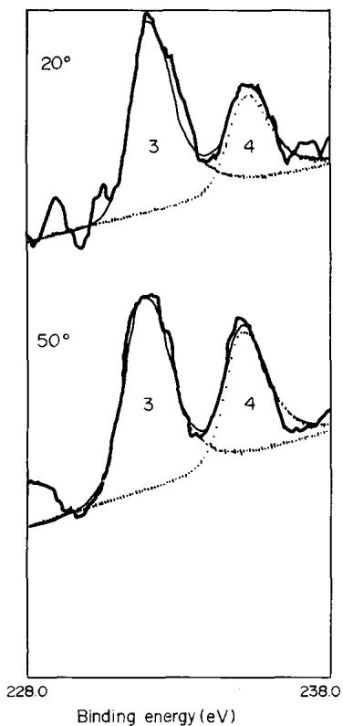  
FiG. 6. Mo 3d photo-electron spectra obtained from the passive film formed at $7 0 \mathrm { { } ^ { \circ } C }$ on Fe-19Cr-9Ni alloy at −180 mV(SCE) in 0.3 M NaCl (pH 5.4) for 60 min followed by a further passivation of 15 min in 0.3 M $\mathrm { N a C l } + 0 . 1 6 \mathrm { ~ M ~ } \mathrm { N a _ { 2 } M o O _ { 4 } }$ (pH 9.0). The only two peaks observed are the $\mathbf { M o ^ { 6 + } 3 } d _ { 5 / 2 } \left( 2 3 1 . 9 \mathrm { e V } \right)$ and $3 d _ { 3 / 2 } \left( 2 3 5 . 1 \mathrm { e V } \right)$ , numbered as in Fig. 5.

Examination of the deprotonation reaction suggests that deprotonation of a previously formed film should cause a reduction in the film's thickness. Essentially, the reaction proceeds through three stages. In the first two, field-induced migration causes the protons to migrate through the cation selective outer region and out of the film:

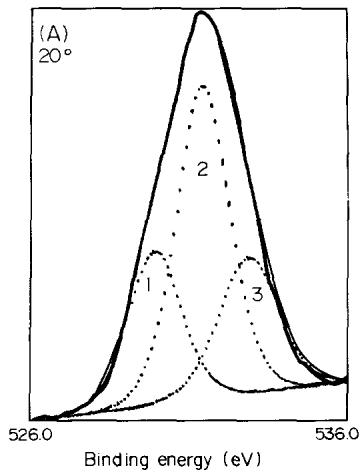

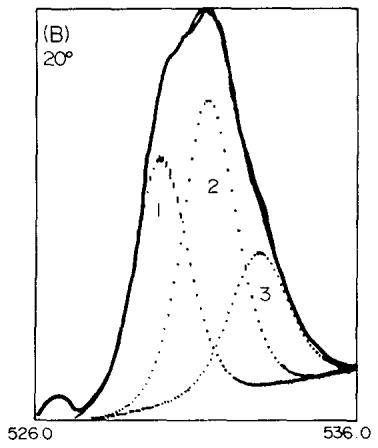

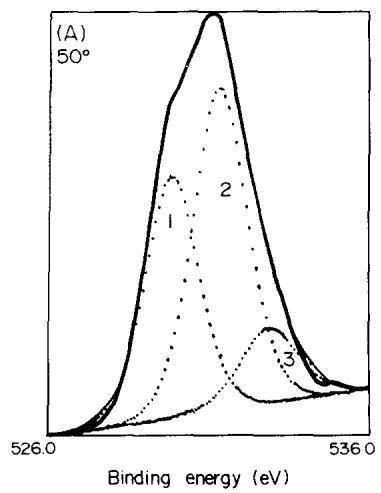

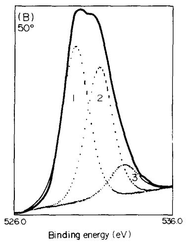  
FiG. 7. O 1s photo-electron spectra obtained from the passive films formed at $7 0 \mathrm { { } ^ { \circ } C }$ on Fe−19Cr–9Ni alloy at − 180 mV(SCE): (A) in 0.3 M NaCl (pH 5.4) for 75 min; (B) in 0.3 M NaCl (pH 5.4) for 60 min then in 0.3 M NaCl + 0.16 M $\mathbf { N a } _ { 2 } \mathbf { M o O } _ { 4 }$ (pH 9.0) for 15 min. 1, O²− 529.9 eV; 2, OH− 531.4 eV; 3, ${ \bf H } _ { 2 } { \bf O }$ 532.9 eV.

$$
2 \mathrm { C r ( O H ) } _ { 3 }  \mathrm { C r } _ { 2 } \mathrm { O } _ { 3 } + 3 \mathrm { O H } ^ { - } + 3 \mathrm { H } ^ { + }\tag{3}
$$

$$
3 { \bf O } { \bf H } ^ { - }  3 { \bf O } ^ { 2 - } + 3 { \bf H } ^ { + } .\tag{4}
$$

Influenced by the substrate's electric field, the $O ^ { 2 - }$ then migrates through the anion selective region to the substrate, where it reacts with Cr to form more $\mathrm { C r } _ { 2 } \mathrm { O } _ { 3 }$

$$
2 \mathrm { C r } _ { \mathrm { s u b s t r a t e } } + 3 \mathrm { O } ^ { 2 - }  \mathrm { C r } _ { 2 } \mathrm { O } _ { 3 } + 6 \mathrm { e } ^ { - } .\tag{5}
$$

Therefore the overall deprotonation reaction becomes:

$$
\mathrm { C r } _ { \mathrm { s u b s t r a t e } } + \mathrm { C r } ( \mathrm { O H } ) _ { 3 } \to \mathrm { C r } _ { 2 } \mathrm { O } _ { 3 } + 3 \mathrm { H } ^ { + } + 6 \mathrm { e } ^ { - } .\tag{6}
$$

From equation (6), $\mathrm { C r } ( \mathrm { O H } ) _ { 3 }$ deprotonates to equal moles of $\mathbf { C r } _ { 2 } \mathbf { O } _ { 3 }$ . Since the densities of $\mathrm { C r } ( \mathrm { O H } ) _ { 3 }$ and $\mathrm { C r } _ { 2 } \mathrm { O } _ { 3 }$ are different (2.9 and $5 . 1 \ \mathrm { g } \ \mathrm { c m } ^ { 3 }$ , respectively), it is evident that the deprotonation of $\mathrm { C r } ( \mathrm { O H } ) _ { 3 }$ to $\mathrm { C r } _ { 2 } \mathrm { O } _ { 3 }$ also results in a volume reduction of 16%. However, since only part of the film is composed of $\mathrm { C r } ( \mathrm { O H } ) _ { 3 }$ and only part of the $\mathrm { C r } ( \mathrm { O H } ) _ { 3 }$ layer deprotonates, the reduction in the overall film thickness should be less but still noticeable.

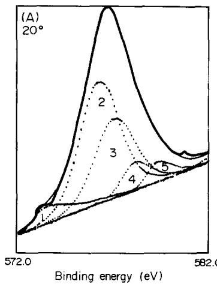

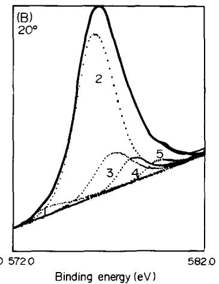

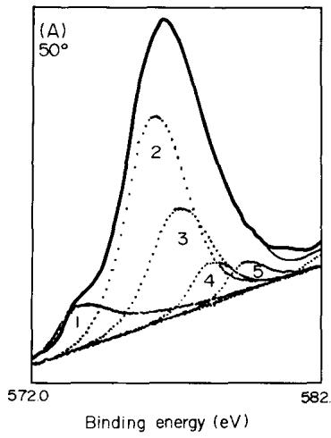

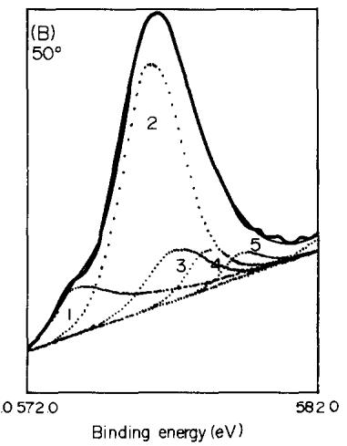  
FIG. 8. Cr $2 p$ photo-electron spectra obtained from the passive films formed at ${ 7 0 ^ { \circ } } \mathbf { C }$ on Fe–19Cr–9Ni alloy at −180 mV(SCE): (A) in 0.3 M NaCl (pH 5.4) for 75 min; (B) in 0.3 M NaCl (pH 5.4) for 60 min then in 0.3 M NaCl + 0.16 M $\mathbf { N a } _ { 2 } \mathbf { M o O } _ { 4 }$ (pH 9.0) for 15 min. 1, Metal 574.1 eV; 2, $\mathbf { C r } _ { 2 } \mathbf { O } _ { 3 }$ 576.3 eV; 3, Cr(OH)₃ 577.0 eV; 4, CrO3 578.1 eV; 5, CrO2− 579.3 eV.

This is verified by comparing the metal to ionic species ratios presented in Tables 3–5. In XPS, the metal signal from the substrate is attenuated by the overlayer. This allows one to relate attenuation of the metal signal to the film thickness; the thinner the overlayer the greater the ratio of the metal signal to the ionic signal. In Tables 3–5, the metal to ionic species ratios for each angle are calculated by summing all metal signals and dividing by the sum of all ionic signals. These show that the greatest metal to ionic signal was obtained when the film formed in 0.3 M NaCl (pH 5.4) is exposed to the molybdate solution. The ratios for the film produced by the additional passivation in the 0.3 M NaCl (pH 9.0) solution show no reduction in attenuation, indicating that the effect is not produced by the pH change of the solution.

It should be noted that the thinning of the film is not caused by the dissolution of the previous formed film. If the thinning was due simply to dissolution, the current density would be expected to increase when the solutions were changed for the additional 15 min passivation studies. However, as noted in the results section, no appreciable change in the current density was observed upon the changing of the solution.

Comparing this film to the one formed in the 0.3 M NaCl (pH 9.0) solution, one notices a complete reversal of the results. The presence of molybdate causes significant deprotonation, indicating that it is a far stronger cation selective agent than the chromate species. If one compares the film exposed to molybdate for 15 min to the films formed in previous work on Mo bearing alloys,7 one finds similar levels of deprotonation. This indicates that the bipolarity introduced after the film is fully formed in a non-molybdate solution can still operate and the same modifications expected from the Mo bearing alloy case may be achieved.

## CONCLUSIONS

(1) Molybdate is seen to absorb onto the passive film formed on Fe-19Cr-9Ni stainless steel in 0.3 M NaCl + 0.16 M $\mathbf { N a } _ { 2 } \mathbf { M o O } _ { 4 }$ at pH 9.

(2) At room temperature, partial reduction of molybdate is observed resulting in the formation of a hydrated molybdenum dioxide, probably MoO(OH)2. This reduction was not observed when the passivation was performed at ${ 7 0 } ^ { \circ } \mathbf C$

(3) The absorption of molybdate on the film changes the inherent anion selectivity of the outer region of the film to cation selective. This effectively produces a bipolar film, which allows univalent cations to migrate out of the passive film while hindering the ingress of anions such as $\mathbf { C l } ^ { - }$ and $\mathrm { O H ^ { - } }$ . This results in: (a) deprotonation of the $\mathrm { C r } ( \mathrm { O H } ) _ { 3 }$ component of the passive film leading to a significantly enhanced barrier layer composed of $\mathbf { C r } _ { 2 } \mathbf { O } _ { 3 }$ and $\mathrm { C r } { \bf O } _ { 3 } ;$ (b) improvement in pitting resistance due to the reduction of $\mathbf { C l ^ { - } }$ adsorption and subsequent penetration of the passive film.

(4) Increasing pH gives enhanced protection in Cl⁻ containing solutions by reducing Cl⁻ adsorption and penetration of the passive film. This is due to neither of the above mechanisms but stems from the increased competition between $\mathrm { O H ^ { - } }$ and Cl⁻ for adsorption sites. While this does lead to an improvement in the film's pitting resistance, it is not as effective as molybdate adsorption.

Acknowledgements—This work was supported by the National Science Foundation under Grant No. DMR 8418873 (administered by Dr Bruce MacDonald). The VGS Electron Spectrometer and VGS 1000 Data System were acquired from NSF equipment awards DMR 7718319 and 8117321.

## REFERENCES

1. M. SAKASHITA and N. SATO, in Passivity of Metals (eds R. P. FRANKENTHAL and J. KRUGER), p. 740. The Electrochemical Society, Corrosion Monograph Series, Princeton, NJ (1978).

2. M. SAKAsHITA and N. SATo, Corros. Sci. 17, 473 (1977).

3. Y. C. Lu and C. R. CLAYToN, J. Chin. Soc. Corr. Prot. 18, 30 (1988).

4. B. M. LARKIN and I. L. RozENFELD, Prot. Metals 15, 552 (1979).

5. B. M. LARKIN and I. L. RozENFELD, Prot. Metals 17, 408 (1981).

6. S. F. TImAsHEv, Prot. Metals 16, 176 (1980).

7. C. R. CLAYToN and Y. C. Lu, J. Electrochem. Soc. 133, 2465 (1986).

8. A. R. Brooks, C. R. CLAYToN, K. Doss and Y. C. Lu, J. Electrochem. Soc. 133, 2459 (1986).

9. C. R. CLAYToN and Y. C. Lu, Corros. Sci. 29, 881 (1989).

10. K. Doss, A. Brooks and C. R. CLAytoN, Proc. Int. Congress on Metallic Corrosion, Vol. 1, p. 138. National Research Council, Toronto, Canada (1984).

11. C. R. CLAYTON, K. G. K. Doss, Y. F. WANG, J. B. WARREN and G. K. HUBLER, Ion Implantation into Metals (eds V. AsHwoRTí, W. A. GRANT and R. P. M. PRoCToR), p. 67. Pergamon Press, Oxford (1982).

12. J. E. CAsTLE and C. R. CLAYToN, Corros. Sci. 17, 7 (1977).

13. M. P. SEAí, Surf. Interface Anal. 2, 222 (1980).

14. A. SAvITsKY and M. J. E. GoLAY, Analyt. Chem. 36, 1627 (1964).

15. P. M. A. SHERwooD, Practical Surface Analysis (eds D. BRIGGs and M. P. SEAí), p. 445. John Wiley, New York (1983).

16. G. C. ALLEN, M. T. CURTIs, A. J. HooPER and P. M. TuCkER, J. Chem. Soc., Dalton Trans. 1675 (1973).

17. M. SAKAsHITA and N. SATO, Corrosion 35, 351 (1979).

18. N. SATo, Corros. Sci. 27, 421 (1987).

19. I. L. RozENFELD and V. P. MAKsımTCHUK, Dokl. Akad. Nauk. SSSR 131, 354 (1960).

20. Z. SzKLARsKA-SmIALowsKA, Pitting Corrosion of Metals, p. 297. NACE, Houston (1986).