# CORROSION BEHAVIOUR OF MOLYBDENUM-IMPLANTED STAINLESS STEEL

M.B. IVES, U. G. AKANO1, Y.C. LU, GUO RUIJIN², S.C. SRIVASTAVA³

Institute for Materials Research, McMaster University Hamilton, Ontario, L8S 4M1, Canada

## ABSTRACT

A low-molybdenum austenitic stainless steel (UNS S30100) has been surface implanted with molybdenum ions, using various doses of 50 keV and 140 keV ions at room temperature. It is found that in aqueous sulphate/chloride solutions similar to the constitution of sea-waters the implantation does not affect the potentiostatically-determined critical pitting potential, but does change the density and morphology of corrosion pits. Pitting initiation after the addition of chloride at a fixed potential indicates little change in the time for measurable current increase, but the rate of increase of the current is much lower for implanted material. Detailed examination using optical microscopy, scanning electron microscopy, transmission electron microscopy and selected area diffraction suggests that the pits produced in implanted material are hemispherical with smooth covers of unattacked alloy. The use of half-implanted samples demonstrates that molybdenum implantation causes the formation of smooth-covered pits rather than "lacy" attack characteristic of stainless steel attack in chloride solutions. The energy of implantation also affects the density of pit nucleation, suggesting that passive films formed after implantation at low energies are not able to completely protect the steel surfaces.

## KEYWORDS

austenitic stainless steel; molybdenum; ion implantation; pitting corrosion; Rutherford backscatter spectroscopy.

## INTRODUCTION

It is known that the addition of molybdenum to austenitic stainless steels increases their pitting corrosion resistance in chloride-containing aqueous environments. This is demonstrated, for example, by a shift of the critical pitting potential towards a more noble value (1),(2),(3) and by the incrcase in the critical pitting temperature with increasing molybdenum alloy content (4),(5). It is known that molybdenum incorporates itself into the protective passive film (6),(7), and some have reported that the presence of molybdenum in these alloys appears to promote a generally thicker passive film, with the thickness tending to be proportional to the molybdenum content of the alloy (8). But how this improves the resistance to chloride attack remains unclear, although models describing competitive adsorption have becn proposed.

Ashworth et al. (9),(10),(11) have studied the properties of molybdenum-implanted Type UNS S30400 stainless steel, finding that such a treated alloy behaved like the higher-molybdenum steel, type UNS S31600, at least as far as pitting resistance is concerned. It was found that after three successive polarization sweeps, some 36% of the implanted dose had been removed from the surface. However, it was not possible to determine in what manner the molybdenum had been dissolved, or the precise mechanism through which it improves the pitting resistance of the alloy.

The present study was made in order to elucidate the mechanism by which molybdenum controls pitting susceptibility, by implanting known quantities of molybdenum ions into the near-surface region of a lowmolybdenum stainless steel.

## EXPERIMENTAL PROCEDURES

A 2 mm thick sheet of annealed UNS S30100 austenitic stainless steel was the starting material for this study. The chemical analysis of this alloy is shown in Table 1.

Table 1: Composition of the Alloy Used (in weight %)
<table><tr><td>C .108</td><td>Si .55</td><td>Mn 1.01</td><td>P .04</td><td>S .012</td><td>Cr 17.0</td><td>Mo 0.17</td><td>Ni 8.1</td><td>Co .16</td><td>Cu .19</td><td> $\mathbf { _ { 0 } ^ { 0 } } _ { . 0 1 2 }$ </td><td> $\mathbf { \Delta } _ { . 0 5 } ^ { \aleph _ { 2 } }$ </td><td></td></tr><tr><td></td><td></td><td></td><td></td><td></td><td></td><td></td><td></td><td></td><td></td><td></td><td></td><td></td></tr></table>

Samples were cut into 10 mm circular discs, designed either to fit into a specially constructed Teflon sample holder or to be coated at the edges and back with a protective epoxy (Lepage "5-minute"), for the electrochemical measurements. One side of each disc was metallographically polished to 1 micron diamond finish before ion implantation.

The steel samples were ion-implanted at room temperature, using the McMaster 400 keV ion implanter, described elsewhere (12) equipped with a universal ion source capable of producing sharply focused gaseous and solid ion beams. The ion beam was rastered across the sample using a pair of electrostatic beam sweep plates, so that the beam covered an area of $3 0 ~ \mathrm { c m } ^ { 2 }$ at a current density of $1 0 ^ { - 6 } \mathrm { \ A } / \mathrm { c m } ^ { 2 } .$ The molybdenum source used consisted of a heated molybdenum wire over which oxygen gas is passed to improve ionization. Two implantation energies, viz. 50 keV and 140 keV, were used in this work.

Rutherford backscattering spectroscopy (RBS) was used to analyze the implanted samples for the retained molybdenum dose and distribution, either before or after anodic dissolution. Each backscattering spectrum was obtained, at a scattering angle of 160°, using 4 x $1 0 ^ { - 6 }$ C of 2.0 MeV helium ions produced in a Van der Graaf accelerator.

Figure 1 is a typical RBS spectrum of a molybdenum-implanted stainless steel specimen. It shows the contributions from the host metal (iron) atoms and the implanted molybdenum peak centred at channel 382. From this spectrum it may be determined that the maximum molybdenum concentration is beneath the alloy surface, denoted by the arrows, as would be expected from the physics of the implantation process. By integrating the area under the molybdenum peak, the total retained dose can be determined. The concentration of implanted ions, as a function of distance into the alloy surface, can be obtained from the RBS spectrum, by taking into account the sputter erosion of the surface by the implantation beam. The best fit to the data was obtained by assuming a sputter efficiency of 2.3 atoms/ion. Figure 2 shows such a relationship for two samples implanted with approximately the same dose, but at different implantation energies. It is seen that implanting at 140 keV produces a deeper and more uniform implant distribution.

Table 2 summarizes the data obtained on all the samples studied in this work, including the measured retained dose and the surface and maximum molybdenum concentrations. The implantation clearly produces local molybdenum concentrations far in excess of those normally present in molybdenumcontaining commercial stainless steels. However, these high concentrations are localized, since the peaks in concentration are typically between 10 and 20 nm, and significant concentrations are rarely deeper than 40 nm, as seen in Fig. 2.

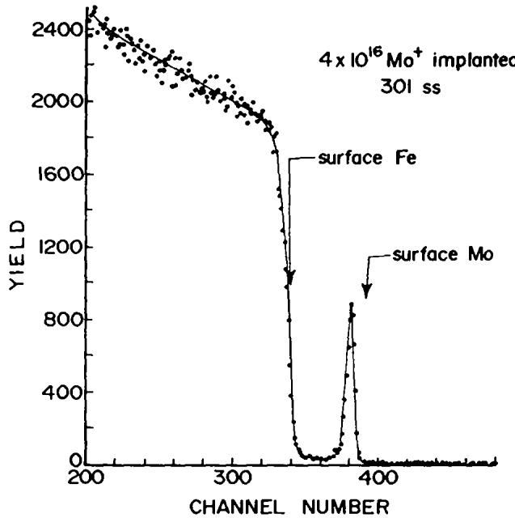  
Fig. 1. Rutherford Backscattering spectrum obtained from a sample of UNS S30100 stecl implanted with 50 keV molybdenum ions to a dose of 5 x $1 0 ^ { l \bar { 6 } } / \mathrm { c m } ^ { 2 }$

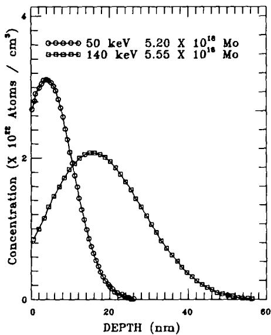  
Fig. 2. Distribution of molybdenum within the implanted alloy, comparing the same dose for different implanting energies.

Table 2: Samples and The Corresponding lon-Implantation Parameters
<table><tr><td colspan="2">ニニニ二 I Sample# Energy keV</td><td>Retained Implanted Molybdenum  $( \mathbf { X } \ \mathbf { i 0 } ^ { 1 6 } \ c m ^ { - 2 } )$ </td><td colspan="2">=リ= Relative Mo Fraction  $\Nu _ { \varkappa _ { 0 } } / \Nu _ { \sf F e } ( \% )$ </td></tr><tr><td colspan="3"></td><td>Surface</td><td>Peak</td></tr><tr><td colspan="3"></td><td></td><td></td></tr><tr><td>1 2</td><td>50 50</td><td>0.23 0.56</td><td>0.23 1.06</td><td>0.88</td></tr><tr><td>3 50</td><td></td><td>2.20</td><td>5.3</td><td>2.3</td></tr><tr><td>4</td><td>50</td><td>4.00</td><td>14.1</td><td>10.0</td></tr><tr><td>5</td><td>50</td><td>5.20</td><td>21.0</td><td>18.6 24.8</td></tr><tr><td>6 50</td><td></td><td>5.30</td><td>23.0</td><td>27.2</td></tr><tr><td>7</td><td>50</td><td>9.70</td><td>44.0</td><td>44.0</td></tr><tr><td></td><td></td><td></td><td></td><td></td></tr><tr><td>9 10</td><td>140</td><td>3.10</td><td>2.4</td><td>14.1</td></tr><tr><td>11</td><td>140</td><td>5.55</td><td>10.6</td><td>24.7</td></tr><tr><td></td><td>140</td><td>7.15</td><td>17.6</td><td>30.0</td></tr><tr><td>12</td><td>140</td><td>8.22</td><td>28.2</td><td>36.0</td></tr><tr><td>13</td><td>140</td><td>3.22</td><td></td><td></td></tr></table>

## EXPERIMENTAL RESULTS

## Electrochemical Tests

Samples implanted with less than $0 . 5 \mathrm { ~ x ~ } 1 0 ^ { 1 6 } / \mathrm { c m } ^ { 2 }$ (Samples #1 and #2 in Table 2) did not behave appreciably differently to the unimplanted alloy, and were not studied further. The anodic polarization characteristics of samples implanted with a dose in excess of $2 . 2 \times 1 0 ^ { 1 6 } / \mathrm { c m } ^ { 2 }$ in the standard sulphate/ chloride solution is typified by the observations shown in Fig. 3, which compares sample #10, implanted with $5 . 5 5 \times 1 0 ^ { 1 6 }$ molybdenum ions $/ \mathrm { c m } ^ { 2 }$ and an unimplanted control sample. It is seen that implantation of sufficient molybdenum changes the open circuit potential approximately 100 mV in the active direction. The change in apparent critical pitting potential, $\mathtt { E } _ { \mathtt { c } }$ is however less reproducible. Sample #10, shown in Fig. 3, shows a lower $\mathbf { E } _ { c }$ than the base unimplanted alloy, but other similarly-dosed samples showed any of a slightly lower, slightly higher, or almost identical value of $\mathbf { E } _ { \mathbf { c } } ,$ with no clear trend. More significant is the observation that after continuing the potential scan beyond $\mathbf { E } _ { \mathbf { c } } ,$ the current always increases at a significantly slower rate than the unimplanted alloy. In summary, it may be concluded that the anodic polarization characteristics are not significantly affected by the ion implantation treatment, except for the slower increase in anodic current following passivity breakdown. As an alternative electrochemical test, pit initiation was studied by monitoring the variation of the anodic current with time after the addition of chloride to the solution, with the sample maintained at a constant potential (500 mV(SCE) which would be within the passive range for the alloy immersed in the 0.1M sodium sulphate. Figure 4 shows the current-time curves of implanted sample #9 (Table 2) and a blank alloy control sample. Chloride was added at the 30 min mark, to create a 0.6M sodium chloride solution. Breakdown of the control sample, as indicated by a sharp increase in anodic current, is seen to occur within one minute. However, the implanted alloy also exhibits breakdown within only a little longer period, but the increase in current is much slower. For the samples of Fig. ${ \mathfrak { s } } ,$ the implanted sample exhibits less than 100-fold increase after 10 minutes in the chloride solution, whereas after the same time lapse the current in the unimplanted UNS S30100 current is many orders of magnitude greater. Initiation tests on other samples implanted with more than $2 \dot { \mathrm { ~ x ~ } } 1 0 ^ { 1 6 } / \mathrm { c m } ^ { 2 }$ molybdenum ions showed similar behaviour.

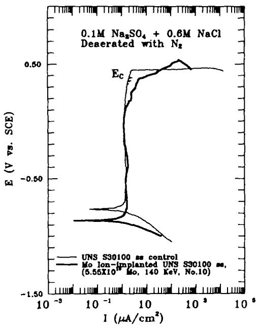  
Fig. 3. Potentiostatically-controlled anodic polarization characteristics of an unimplanted control sample and implanted alloy sample #10 (Table 2).

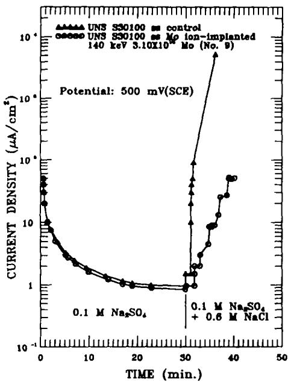  
Fig. 4. Current density as a function of time, before and after the addition of chloride ions, for a control sample and implanted alloy sample #9 (Table 2).

## Microstructural Examination

A combination of optical and electron-optical microscopy revealed both the extent of local attack on the implanted samples and the detailed form of the particular pits produced in samples with high doses of implanted molybdenum. The low-dose samples (#1 and #2) showed no difference in pitting attack morphology to the unimplanted control samples.

A comparison of the pitting characteristics of the implanted and unimplanted material was demonstrated particularly vividly on a sample which had been ion-implanted over only half its surface area, by masking the sample in the implanter. Figure 5(a) shows an optical micrograph of this sample, after anodic polarization at 600 mV(SCE) for a time necessary to pass 1 C/cm² of total charge through the sample.

The differences in attack of the unimplanted and implanted regions of the surface, and the straight boundary between them, are clearly seen. In particular, the unimplanted alloy exhibits relatively large irregular pits, exhibiting a "lacy" surround, as originally reported some years ago by Rosenfeld and Danilov (13), and typical of pits produced in this alloy under potentiostatic control, as shown in more detail in Fig. 5(b). In contrast, the implanted region shows a much higher density of smaller pits which, on examination at higher resolution with scanning electron microscopy, are seen (Fig. 6(a).) to be completely circular in outline and covered by smooth caps. In addition, a few pits were found to have formed along the boundary between the implanted and unimplanted region and exhibited features appropriate to both regions, as shown in Fig. 6(b).

(a)  
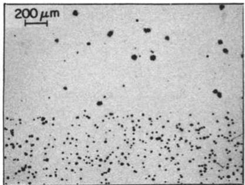  
(b)

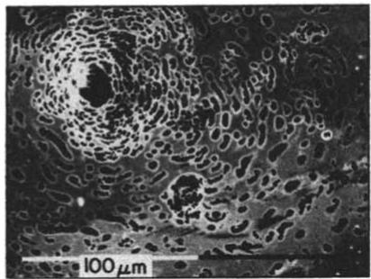  
Fig. 5. (a) Optical micrograph of a UNS S30100 sample half-implanted with molybdenum at 50 keV and anodically polarized. (b) Typical pit formed on unimplanted UNS S30100 alloy.

(a)  
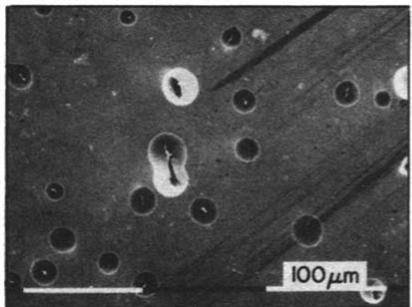

(b)  
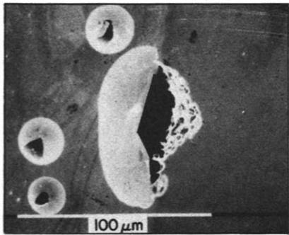  
Fig. 6. Scanning electron micrographs of typical pits produced on (a) the implanted side of the half-implant sample shown in Fig. 5(a); (b) at the boundary between implanted and unimplanted alloy.

(a)  
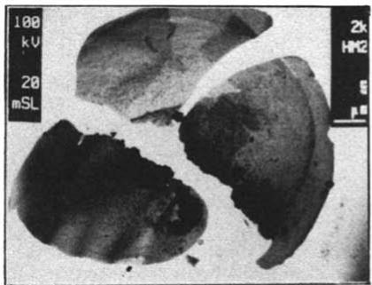

(b)  
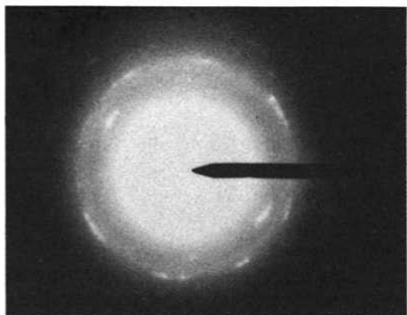  
Fig. 7. Transmission electron microscopy of an extracted pit cover: (a) Bright field micrograph of cover fragments; (b) Selected area electron diffraction pattern.

A number of aspects of these pit fcatures were examined in greater detail. High-resolution Auger electron spectroscopy (AES) was not particularly helpful in determining the nature of the covers. A cover was extracted for examination by floating it onto an aluminum grid and placing in a Philips EM-301 electron microscope. Figure 7(a) shows the bright field transmission image of the pieces of the broken cover. Energy dispersive X-ray analysis showed high concentrations of the component metal ions of the alloy, suggesting that the cover comprises a significant amount of alloy metal. This conclusion was confirmed by examination of the selected area diffraction pattern, shown in Fig. 7(b), which suggests that the cover has a fine mosaic structure. Indexing the spots in this pattern could not be related to any metal oxide in the system, further supporting the metallic nature of the covers.

## Radiation Damage Effects

The high density of pits produced on the implanted side of the sample shown in Fig. 5(a) was confirmed to be a consequence of radiation damage: Anodic polarization of a similar sample half-implanted with 50 keV $\kappa ^ { 8 4 }$ ions (which have a mass similar to $\mathbf { \hat { M } } \mathbf { o } ^ { \otimes 6 } )$ produced the attack shown in Fig. 8. The difference in density of small pit features is seen to be similar in Figs. 5(a) and 8, while "lacy" large pits also occur on both sides of the krypton-implanted sample. The implanted krypton thus causes radiation damage to the alloy substrate without the pit-moderating influence provided by molybdenum.

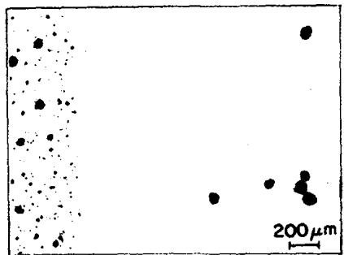  
Fig. 8. Optical micrograph of sample half-implanted with krypton and anodically polarized identically to the sample of Fig. 5(a).

In passing, it is worth observing that the passivating films formed on the 50 keV implanted samples (both molybdenum or krypton) would appear to inherit a high density of weak points, which subsequently produce fine pits once the anodic potential is increased above the critical pitting potential. This supports the "weak link" concept of the local breakdown of passive films (14).

When alloy samples were implanted with 140 keV, instead of 50 keV, molybdenum ions the density of pits on anodically polarized samples was much less. Figure 9(a) shows a region of one typical such sample, showing some surface staining due to corrosion product. This sample, even though polarized for 15 minutes after breakdown, showed very few regions like this with pits of any kind. This is consistent with the fact that radiation damage is reduced as the energy of the implanted ion is increased, as has been observed by Howe et al (15) for the thermal oxidation of iron, and by Ashworth et al.(16) for the growth of native oxides on iron. But while the density of pits is greatly reduced by using the higher implantation energy, the morphology of the pits is similar. Figure 10 shows an optical micrograph of one such pit on a sample which was only rinsed after anodic treatment by dipping into distilled water with no agitation, and dried in air. This procedure appears to avoid tearing the pit covers. Figure 10 suggests that the covers have relaxed following removal from solution, since they have a slightly crinkled appearance, which is exaggerated by the Nomarski interference contrast technique (17), and which if viewed in the scanning electron microscope would appear like the pits in Fig. 6(a).

(a)  
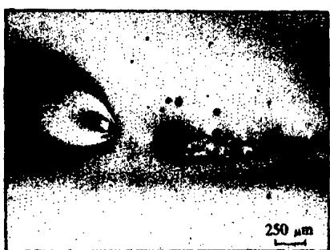  
(b)

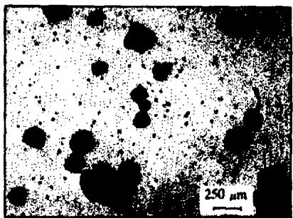  
Fig. 9. Pits produced after long anodic polarization above the critical pitting potential: (a) on molybdenum-implanted alloy; (b) on unimplanted alloy.

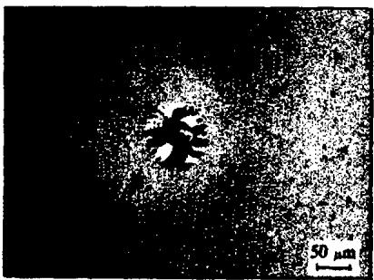  
Fig. 10. Nomarski interference contrast in optical micrograph of a typical pit on implanted steel surface.

## DISCUSSION

Despite the fact that the layer of implanted molybdenum is very thin, it does seem to be sufficient, particularly when implantation is carried out at the higher energy (140 keV) and an ion dose in excess of $0 . 5 \times 1 0 ^ { 1 6 } / \mathrm { c m } ^ { 2 }$ , to markedly improve the density of pitting attack on UNS S30100 stainless steel. Comparison of Fig. 9(a) with the pits in Fig. 9(b), representing a similarly-treated unimplanted sample, clearly shows this, and also indicates that the pit growth rates are reduced considerably by molybdenum implantation of sufficient dose and energy.

Of additional interest in the observations of this study is the particular morphology of the pits produced in implanted material. Comparison of Figs. 5(b) and 6 demonstrates the differences in pit morphology after anodic treatment of unimplanted and implanted material. The unimplanted alloy exhibits "lacy" edges to the pits, while the implanted alloy pits are circular in plan view and have smooth covers, which include alloy metal, and little more than a small hole at their centre. It is assumed that the tears and folds seen at some of the covers are artifacts produced during processing of the sample.

We can suppose that the process of forming the "lacy" pits follows the scheme outlined in Fig. 11. After initial breakdown of the protective passive film by agglomeration of aggressive (chloride) ions (a) a pit develops into the unprotected alloy below (b). The next stage is described by Pickering(18)(19), using the concept of IR drop within the pit mouth, which leads to an active potential which can permit dissolution of the vertical walls, leading to undercutting (c). The final stage involves the dissolution of the underside of the undercut alloy, resulting in a new perforation, which when it has occurred at many locations around the pit, results in the lacy effect (d). This model is similar to one proposed recently by Egert (20) for surfaces with protective metallic coatings.

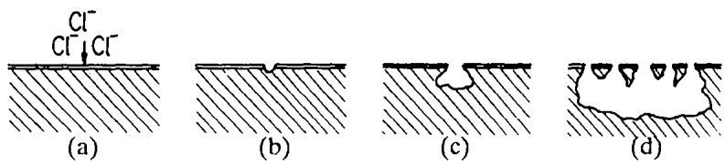  
Fig. 11. Schematic development of "lacy" pits by undercutting mechanism.

Howcver, the process of pit development in the molybdenum-implanted matcrial will be different due to the highly alloyed surface layer. Consequently, if a pit forms undercutting can still occur but the breakthrough from below is impeded by the highly-protective alloy laycr. That there is an attempt at attack on the underside of the covers by thc highly corrosive pit solution is shown in Fig. 12. The pock-marks on the curled underside are clcarly scen, but no perforation is possible due to the highlyalloyed material. This model explains the metallic nature of the covers, as concluded from the detailed electron microscopic analysis.

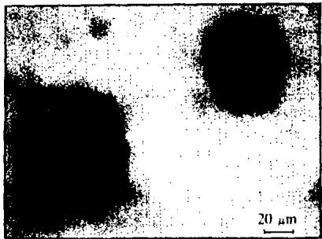  
Fig. 12. Optical micrograph of curled-up covers from pits on a sample similar to that shown in Figs. 5(a) and 9(a).

It follows that one rcason for the slow growth rate of the covered pits is that the growth is controlled by mass transport through the central perforation, rather than being due to the increasingly aggressive solution including, for example, a decreased pH, within the extremely "occluded" cell. Dissolution of the highly concentratcd molybdenum might also contribute to inhibition of the anodic dissolutíon within the occluded pit. The crinkling effect (Fig. 10) could also be an indication of the relaxation occurring after clastic stretching of the covers by the corrosion product build-up within the constricted pit.

## CONCLUSIONS

It is concluded that implanting molybdenum into an austenitic stainless stecl, at sufficient energy to avoid significant radiation damage and at doses sufficicnt to produce a ncar-surface maximum concentration of greater than 10 at%, can significantly reduce the pitting corrosion susceptibility under anodic polarization control in marine-like environments. The feasibility of such processing for commercial purposes is, however, not proven.

The morphology of pits produced in molybdenum surface-implanted stainless steels is very different to that produced on untreated commercial alloys. Pits are less dense, and those that do form are constrained in their growth by the presence of a persistent cover of implanted alloy, and, perhaps, by an inhibiting excess of molybdenum ions within the pit.

## ACKNOWLEDGMENTS

This research was supported under a contract with Chemetics International Ltd. and the University Research Incentive Fund of the Province of Ontario, the provision of funds for which are gratefully acknowledged. The support of one of us (S.C.S.) by the Government of India is also recognised.

## REFERENCES

1. K. Sugimoto and Y. Sawada, Corrosion 32, 347 (1976)

2. Ja M. Kolotyrkin, Corrosion 19, 261 (1963)

3. A.P. Bond and E.A. Lizlovs, J. Electrochem. Soc. 115, 1130 (1968)

4. R.J. Brigham, Corrosion 28, 177 (1972)

5. Guo Ruijin, S.C. Srivastava, M.B. Ives, in Proceedings 10th. International Congress on Metallic Corrosion, Oxford & IBH Publishing Co., Calcutta, 1987, p. 3225

6. M. Moriya and M.B. Ives, J. Microscopy, 133, 155-170, (1984)

7. C.R. Clayton and Y.C. Lu, J. Electrochem. Soc. 133, 2465 (1986)

8. K. Sugimoto and Y. Sawada, Corrosion Sci. 17, 425 (1977)

9. V,. Ashworth, W.A. Grant, R.P.M. Proctor, R.T.P. Wellington, Corrosion Sci. 16, 393 (1976)

10. V. Ashworth, D. Baxter, W.A. Grant, R.P.M. Proctor, Corrosion Sci. 16, 775 (1976)

11. V. Ashworth, W.A. Grant, R.P.M. Proctor, E.J. Wright, Corrosion Sci. 18, 681 (1978)

12. U.G. Akano, PhD Dissertation, McMaster University (1987)

13. J.L. Rosenfeld and J.S. Danilov, in Proceedings, 3rd. International Congress on Metallic Corrosion, Moscow (1969) p.139

14. See, for example, H.H. Uhlig and R.W. Revie, "Corrosion and Corrosion Control", Third edition, Wiley-Interscience, 1985, p.74

15. C.I. Howe, B. McEnaney, V.D. Scott and G. Dearnley, in "Ion Implantation into Metals", ed. V. Ashworth et al., Pergamon Press (1982) p.211

16. V. Ashworth, W.A. Grant and R.P.M. Proctor, Ind. Eng. Chem. Prod. Res. Dev. 17, 177 (1978)

17. R.D. Allen, G.B. David and G. Nomarski, Z. wiss. Mikr. 69 193 (1969)

18. H.W. Pickering, Corrosion Science, 29, 325 (1989)

19. A. Valdes and H.W. Pickering, in "Advances in Localised Corrosion", NACE, Houston, in press.

20. C.M. Egert, Corrosion, 44, 36 (1988)