# Pitting and Crevice Corrosion of Iron Aluminides in a Mild Acid-Chloride Solution✫

J.G. Kim and R.A. Buchanan\*

## ABSTRACT

Aqueous corrosion (pitting and crevice) characteristics of iron aluminides in a mild acid-chloride (Ct) solution (200 ppm CH $I ^ { 5 . 5 \times 1 0 ^ { - 3 } } M$ sodium chloride {NaCI}] at pH 4 [6.25 x 10-⁵ M sulfuric acid $\{ H _ { 2 } S O _ { 4 } \} J )$ were studied as functions of alloying additions and thermomechanical processing methods. Electrochemical results indicated beneficial effects of chromium (Cr) and molybdenum (Mo). Immersion tests confirmed the electrochemical results and revealed the time dependence of localized corrosion behavior. The crevice corrosion behavior of iron aluminides was investigated using electrochemical and immersion crevice tests. The difference between crevice and pitting susceptibilities was minimal for the Mo-containing iron aluminide but significant for the iron aluminides without Mo. X-ray photoelectron spectroscopy (XPS) of surfaces passivated in the mild acid-chloride solution revealed the passive films of iron aluminides were composed mainly of oxidized aluminum $( A I _ { 2 } O _ { 3 } )$ that coexisted with chromium oxide $( C r _ { 2 } O _ { 3 } )$ and molybdenum oxide $( M O O _ { 3 } ) .$ XPS results also indicated the role of Mo in improving the localized corrosion resistance of the Cr-containing iron aluminides. Mo facilitated the formation of a high Al content in the passive film and impeded the adsorption of Ct on the surface.

KEY WORDS: chloride, chromium, crevice, corrosion, iron aluminide, molybdenum, pitting, X-ray photoelectron spectroscopy

## INTRODUCTION

New intermetallic compounds based on the ironaluminum $( \mathsf { F e } _ { 3 } \mathsf { A l } )$ stoichiometry have been developed at the Oak Ridge National Laboratory (ORNL). The ordered intermetallic iron aluminides have excellent oxidation and sulfidation resistance at high temperatures because of their ability to form protective aluminum oxide $( \mathsf { A l } _ { 2 } \mathsf { O } _ { 3 } )$ scales.1 Another advantage of iron aluminides is their low density $( \rho = 6 . 6 \ g / \mathsf { c m } ^ { 3 } )$ compared to steels and to nickel (Ni)-based alloys $\left( \rho = 7 . 8 \ g / \mathsf { c m } ^ { 3 } \right.$ to 8.5 g/cm3). However, the initial iron aluminides’ relatively low room-temperature (RT) ductility and sharp loss of strength above 600°C have slowed their development as structural materials.2 Both RT ductility and strength at $6 0 0 ^ { \circ } \mathsf { C }$ have been enhanced by alloying elements and heat treatment.2-4

The objective is to develop low-cost, low-density intermetallic alloys that have optimum combinations of strength, ductility, and corrosion resistance for use as components in advanced fossil energy conversion systems. Iron aluminides have a potentially wide range of uses where more expensive stainless steels (SS) and Ni-based alloys are used presently (e.g., automobile exhaust systems, steam turbines, porous metal filters for hot-gas cleanup, devices used in sulfurcontaining environments, and immersion heaters).5

These new intermetallic alloys have been evaluated in terms of tensile strength, ductility, creep properties, weldability, and oxidation and sulfidation resistance.6-15

However, very little work has been done to evaluate the new alloys in terms of their resistance to aqueous corrosion. It is believed that aqueous corrosion characterization is essential to the continued development of the iron aluminides.

The present study involved immersion corrosion tests, cyclic potentiodynamic polarization tests, opencircuit corrosion potential (OCP) measurements, crevice corrosion tests, and x-ray photoelectron spectroscopy (XPS) studies.

## EXPERIMENTAL

## Materials

The iron aluminides were produced at the ORNL.2 Alloy specimens of 500 g (1.10 lbm) were prepared by arc-melting the constituent elements in a water-cooled copper (Cu) crucible in a chamber backfilled with argon. The specimens were remelted six times for homogeneity and then were drop cast into a Cu mold to form ingots. The ingots were hot-forged 50% at $1 , 0 0 0 ^ { \circ } \mathsf { C } ,$ hot-rolled 50% at $8 0 0 ^ { \circ } \mathsf { C } ,$ and warm-rolled 70% at $6 5 0 ^ { \circ } \mathsf { C }$ to a final thickness of 0.75 mm. Compositions of the iron aluminides (at%) are given in Table 1. Two different heat treatments were used: (a) annealing in air for 1 h at $8 5 0 ^ { \circ } \mathsf { C }$ (recrystallization) plus 7 days at $5 0 0 ^ { \circ } \mathsf { C }$ (ordering) followed by cooling in air, which produced the ${ \mathsf { D } } { \mathsf { O } } _ { 3 }$ -ordered structure; and (b) stress relieving at $7 5 0 \textdegree$ for 1 h, followed by an oil quench, which produced the B2-ordered structure.

## Electrolyte

An aerated mild acid-chloride (Cl–) solution was used to simulate an aggressive acid rain-type, atmospheric corrosion situation. Rainfall with pH < 5.6 is considered acid rain.16 Roughly two-thirds of the acidity is attributable to sulfur dioxide $( \mathsf { S O } _ { 2 } )$ , which oxidizes to sulfuric acid $\left( \mathsf { H } _ { 2 } \mathsf { S O } _ { 4 } \right)$ , while the remaining one-third is attributable to nitrogen oxides (NOx), which oxidize to nitric acid $( \mathsf { H N O } _ { 3 } )$ . The electrolyte in this study consisted of distilled water adjusted to pH 4 (6.25 x 10–5 M ${ \sf H } _ { 2 } { \sf S O } _ { 4 } )$ containing 200 ppm Cl– (5.5 x 10–3 M sodium chloride [NaCl]).

## Polarization Tests

Each specimen was mounted in Maraglas 655† epoxy (chosen because of its sealing characteristics) that was cured in an oven at $8 0 ^ { \circ } \mathsf { C }$ for 24 h. The specimen was finished by grinding on 600-grit silicon carbide (SiC) paper. To prevent the initiation of crevice corrosion between the epoxy and specimen, the

TABLE 1  
Compositions of Iron Aluminides (at%)
<table><tr><td>Material</td><td>Fe</td><td>Al</td><td>Cr</td><td>Mo</td><td>B</td><td>Zr</td></tr><tr><td>FA-61</td><td>72</td><td>28</td><td>一</td><td></td><td>一</td><td>一</td></tr><tr><td>FA-77B</td><td>70</td><td>28</td><td>2</td><td></td><td>一</td><td>1</td></tr><tr><td>FA-72C</td><td>68</td><td>28</td><td>4</td><td></td><td></td><td></td></tr><tr><td>FA-78</td><td>66</td><td>28</td><td>6</td><td></td><td></td><td></td></tr><tr><td>FA-84</td><td>69.95</td><td>28</td><td>2</td><td>一</td><td>0.05</td><td></td></tr><tr><td>FA-85</td><td>67.95</td><td>28</td><td>2</td><td>2</td><td>0.05</td><td>一</td></tr><tr><td>FA-86</td><td>68.95</td><td>28</td><td>2</td><td>1</td><td>0.05</td><td>一</td></tr><tr><td>FA-138</td><td>67.5</td><td>28</td><td>4</td><td>0.5</td><td></td><td></td></tr><tr><td>FA-139</td><td>67</td><td>28</td><td>4</td><td>1</td><td></td><td></td></tr><tr><td>FA-140</td><td>66</td><td>28</td><td>4</td><td>2</td><td></td><td></td></tr><tr><td>FAL-Mo</td><td>65.9</td><td>28</td><td>5</td><td>1</td><td>0.04</td><td>0.08</td></tr></table>

epoxy-specimen interface was painted with Amercoat 90† epoxy (also chosen because of its sealing characteristics), leaving an exposed area of 1 cm2 on the material surface. The painted sample was cured in an oven for 10 h at $7 0 \%$ . Just before introduction into the polarization cell, the exposed metal surface was polished by hand with cloth and a 9-µm diamond paste to remove the air-formed oxide film created during the epoxy curing process. The interface seal was abraded slightly but not damaged.

Electrochemical polarization of the sample was accomplished with an EG&G Instruments Model 273† potentiostat connected to a computer system. The potential was measured against a saturated (potassium chloride [KCl]) silver-silver chloride reference electrode $( 1 9 6 \mathrm { m V } _ { \tt S H E } )$ contained in a capillary-tipped glass tube filled with the test electrolyte by using an electrometer with an input impedance sufficiently high to draw negligible current in the measuring circuit.17 All potentials were converted to the standard hydrogen electrode (SHE) scale.

For each material and electrolyte combination, the corrosion sample was allowed to stabilize in the electrolyte, which was sparged continuously with oxygen $( \mathsf { O } _ { 2 } )$ , until the potential change was $< 1 ~ \mathrm { m V / m i n }$ . This potential then was taken as the OCP. The sample then was scanned potentiodynamically at a rate of 600 mV/h to a potential corresponding to a current density of $1 0 ^ { - 3 } \mathsf { A } / \mathsf { c m } ^ { 2 }$ . At this point, the scan direction was reversed. The downscan was continued until either the protection potential $( \mathsf { E } _ { \mathsf { p } } )$ was identified or it was demonstrated that no hysteresis loop was developing.

Polarization tests were conducted in an aerated electrolyte to evaluate the critical potentials related to localized corrosion under conditions more applicable to normal, aerated service conditions. Wilde and Williams have shown that the corrosion potentials $( \mathsf { E } _ { \mathsf { c o r r } } )$ and pitting potentials $( \mathsf { E } _ { \mathsf { p i t } } )$ for types 304 (UNS S30400)(1) and 430 (UNS S43000) SS in 1 M NaCl are very dependent on whether the solution is aerated $( \mathsf { O } _ { 2 } -$ saturated) or deaerated (H2-saturated), with both potentials being more positive (noble) in the aerated electrolyte.18 Based on their results, they explained why other authors obtained no correspondence between electrochemical tests conducted in a deaerated NaCl electrolyte and chemical tests conducted in the same electrolyte but with dissolved $\mathsf { O } _ { 2 }$ as the oxidizer.19 Furthermore, in developing correlations with long-term immersion tests of creviced specimens in natural (aerated) seawater, Wilde conducted cyclic polarization tests of creviced specimens in aerated, not deaerated, 3.5 wt% NaCl.20

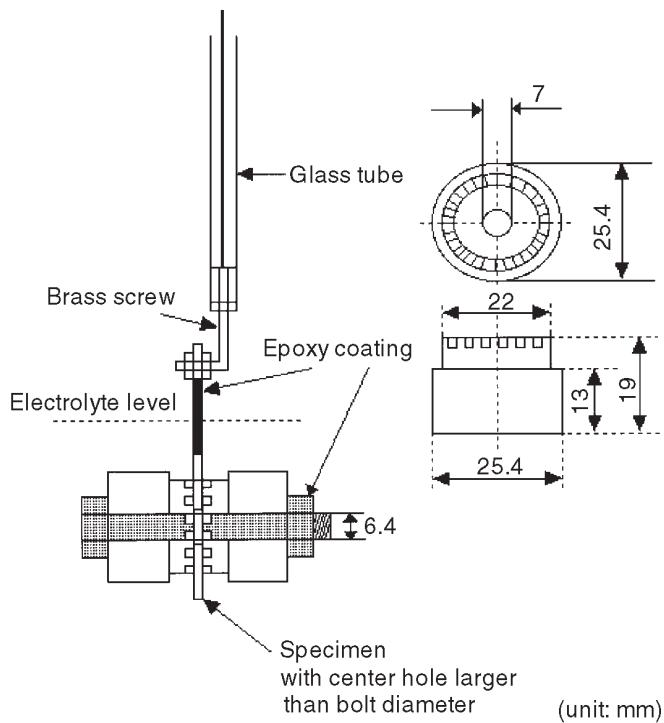  
FIGURE 1. MCA with working electrode.

Therefore, it appeared reasonable that, in attempting to predict the long-term localized corrosion behavior of a material in an aerated electrolyte, the more rapid cyclic anodic polarization tests should be conducted in the electrolyte under aerated conditions.

## Immersion Tests

Specimens were ground with 120-grit SiC paper and finally finished with 600-grit paper. The specimens were supported on glass racks within flasks. Gas sparging of the solution was not performed. The solutions were aerated under ambient conditions. After each test period, the specimens were rinsed with distilled water, rinsed with acetone, and scrubbed with a nylon brush to remove corrosion products. Then, the specimens were dried in an oven at $8 0 ^ { \circ } \mathsf { C }$ for \~ 1 h and weighed to ± 0.001 g. During the immersion tests, initiation times for localized corrosion were determined visually.

## Crevice Corrosion Tests

The multiple crevice assembly (MCA) attached to a working electrode is shown in Figure 1. This arrangement was used in the development of the cyclic polarization curves. A similar arrangement was used for immersion testing. The MCA consisted of two serrated washers that provided a number of plateaucontact sites when fastened to the sheet specimen. An epoxy-coated SS bolt and nut were used to fasten the crevice-forming washers to the specimen, with the bolt diameter being smaller than the specimen hole so that no electrical contact was made. Each acetal-resin washer contained 30 plateaus; thus, the MCA produced a total of 60 crevice sites on each specimen. The ratio of the exposed (crevice-free) area to the shielded (crevice) area for each specimen was 24.7:1. All crevice assemblies were tightened to a torque of 1.13 m-N (10 in-lb). The metal surfaces were finished with 600-grit SiC paper.

## XPS Tests

XPS analyses were performed with a Perkin-Elmer PHI-5100† system including AutoCom Model 8501† software. The exciting radiation was magnesium (Mg) ka x-rays (1,253.6 eV), the photoelectron takeoff angle $4 5 ^ { \circ }$ , and the analyzer pass energy 17.9 eV. Binding energy calibration was performed using a pure Cu standard with the Cu $2 \mathsf { p } _ { 3 / 2 } \ : ( 9 3 2 . 6 7 \pm 0 . 1 \ : \mathsf { e V } )$ and Cu ${ 3 \mathsf { p } _ { 3 / 2 } } \left( 7 5 . 1 3 \pm 0 . 1 ~ \mathsf { e V } \right)$ peaks. The peaks analyzed were close to their theoretical binding energy positions and, therefore, were identified easily. Consequently, a charging correction was not applied. During the analysis, the vacuum inside the chamber was \~ 5.9 x $1 0 ^ { - 9 } \mathrm { t o r r } ( \sim 7 . 9 \times 1 0 ^ { - 1 0 } \mathrm { k P a } )$ . The specimens were flat disks of 15-mm diam, 0.6-mm thickness. These disks were ground through 600-grit SiC paper. The samples were immersed in 200 ppm Cl– solution (pH = 4) for 18 h. Immediately after the 18-h immersion, the specimens were taken out of the solution, washed with distilled water, dried with methanol, and introduced into the chamber. The spectra of Fe ${ \cal { 2 } } { \sf p } _ { 3 / 2 } ,$ Al 2p, Cr ${ \sf 2 p } _ { 3 / 2 } ,$ and Mo $3 { \mathrm { d } } _ { 5 / 2 }$ (all in the oxides) as well as Cl $2 { \mathsf { p } } _ { 3 / 2 }$ and O 1s were evaluated. Concentration analyses were performed by the peak-height method after linear background subtraction. The peak-height sensitivity factors used, assumed to be the same for oxide and metal, were contained in the software and are listed in Table 2. The XPS analysis of the series of alloy specimens was not replicated; therefore, the trends exhibited by the results should be viewed as qualitative.

TABLE 2  
XPS Height Sensitivity Factors
<table><tr><td>Peak</td><td>Sensitivity Factor</td></tr><tr><td> $\mathsf { F e 2 p } _ { 3 / 2 }$ </td><td>2.00</td></tr><tr><td>Al 2p</td><td>0.18</td></tr><tr><td> $\mathsf { C r } 2 \mathsf { p } _ { 3 / 2 }$ </td><td>1.50</td></tr><tr><td>Mo 3d5/2</td><td>1.74</td></tr><tr><td>Cl  $2 { \mathsf { p } } _ { 3 / 2 }$ </td><td>0.61</td></tr><tr><td>O 1s</td><td>0.66</td></tr></table>

## RESULTS AND DISCUSSION

## Polarization Behaviors

— Figure 2 compares the behavior of the constituent elements, pure Fe and Al, with that of an iron aluminide. Only the aluminide passivated in this solution.

Cyclic anodic polarization curves are presented in Figure 3 for the following iron aluminides $( \mathsf { D O } _ { 3 }$ heat treatment): FA-61 (Fe-28% Al-0% Cr), FA-77B (Fe-28% Al-2% Cr), FA-72C (Fe-28% Al-4% Cr), and FA-78 (Fe-28% Al-6% Cr).

For the iron aluminides shown, $\mathsf { E } _ { \mathsf { p } }$ values were below $\mathsf { E } _ { \mathsf { c o r r } }$ . However, the breakdown potential (Eb) increased with Cr content, indicating increased relative resistance to initiation of localized corrosion. Figure 4 shows $\mathsf { E } _ { \mathsf { b } }$ increased significantly with increasing Cr content.

—Effects of Mo on the anodic polarization behavior of the iron aluminides containing 2% Cr $( \mathsf { D O } _ { 3 }$ heat treatment) are shown in Figure 5. From these data, $\mathsf { E } _ { \mathrm { c o r r } } , \mathsf { E } _ { \mathrm { b } } , \mathsf { E } _ { \mathrm { p } } ,$ and the difference $( \mathsf E _ { \mathsf { p } } - \mathsf E _ { \mathsf { c o r r } } )$ are given in Table 3. The overall resistance to pitting corrosion increases as $\mathsf { E } _ { \mathsf { b } }$ and $( \mathsf E _ { \mathsf { p } } - \mathsf E _ { \mathsf { c o r r } } )$ increase. Mo additions raised $\mathsf { E } _ { \mathsf { p } } .$ This was an important result in terms of increasing the resistance of iron aluminides to localized, Cl–-induced, aqueous corrosion. In view of these promising results, additional alloys containing a higher 4% Cr level with 0.5% Mo, 1% Mo, and 2% Mo additions were produced by ORNL for corrosion studies $( \mathsf { D O } _ { 3 }$ heat treatment). The polarization results are presented in Figure 6. The polarization characteristics were improved relative to the 2% Cr materials (Figure 5). The data obtained from these tests are summarized in Table 4. The best response occurred with the 4% Cr + 2% Mo material, where $\mathsf { E } _ { \mathsf { p } }$ was found to be ≈ 90 mV > OCP (Figure 6). Figure $\vec { 7 }$ indicates the effect of Mo addition on $\mathsf { E } _ { \mathsf { b } }$ and $\mathsf { E } _ { \mathsf { p } } .$ The increase in $\mathsf { E } _ { \mathsf { p } }$ was more prominent (i.e., Mo assisted the repassivation of film breakdown).

— With reference to the polarization curves in Figure 3 $( \mathsf { D O } _ { 3 }$ heat treatment) and Figure 8 $( \mathsf { D O } _ { 3 }$ heat treatment, then 10% coldworked), some differences were noted between the annealed and cold-worked materials. Generally, for the 2% Cr, 4% Cr, and 6% Cr materials, the cold-working process led to different $\mathsf { E } _ { \mathsf { c o r r } }$ r values, somewhat higher passive current densities, and lower $\mathsf { E } _ { \mathsf { b } }$ values. The most dramatic change occurred for the 0% Cr iron aluminide, which did not undergo any passivation in the cold-worked condition.

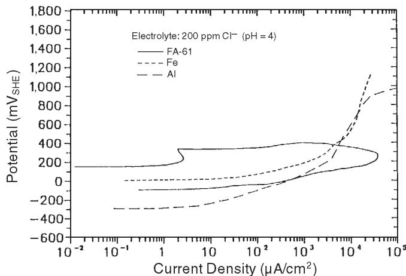  
FIGURE 2. Cyclic anodic polarization curves of pure Fe Al and FA-61 in aerated 200 ppm CF (pH = 4).

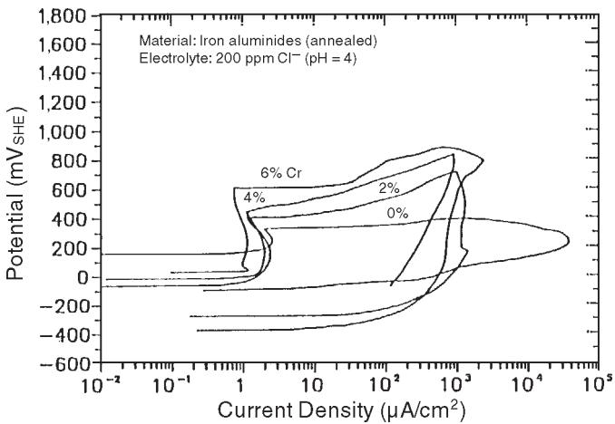  
FIGURE 3. Cyclic anodicpolarization curves ofannealed (1 h at 859° C plus 7 days at 500° C) iron aluminides in aerated 200 ppm CF (pH = 4).

To improve both RT tensile strength and ductility, the heat treatment performed on the iron aluminides was modified. The new heat treatment consisted of 1 h in air at 750°C followed by an oil quench (B2-ordered structure). The new treatment enhanced both yield strength and ductility compared to the previous heat treatment.2-4 The B2 and $\mathsf { D O } _ { 3 }$ crystal structures are shown in Figure 9.

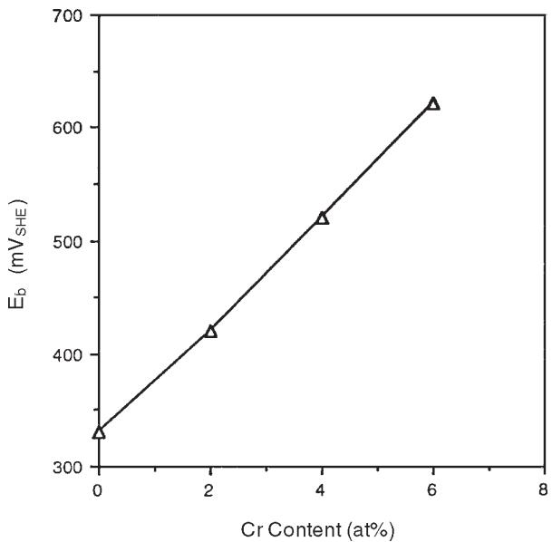  
FIGURE 4. Effect of Cr content on $E _ { b } .$

TABLE 3  
Electrochemical Corrosion Characteristics in 200 ppm CH $( p H = 4 )$ Solution
<table><tr><td>Material</td><td> $\mathsf { E } _ { \mathsf { c o r r } }$ </td><td> $\mathsf { E } _ { \mathsf { b } }$ </td><td> $\ E _ { \mathsf { P } }$ </td><td> $\mathsf { E } _ { \mathsf { P } } - \mathsf { E } _ { \mathsf { c o r r } }$ </td></tr><tr><td>2% Cr</td><td>-50</td><td>420</td><td>-250</td><td>-200</td></tr><tr><td>2% Cr-1% Mo</td><td>20</td><td>450</td><td>30</td><td>10</td></tr><tr><td>2% Cr-2% Mo</td><td>130</td><td>500</td><td>150</td><td>20</td></tr></table>

TABLE 4  
Polarization Data for Iron Aluminides in 200 ppm CH $( p H = 4 )$ Solution
<table><tr><td>Material</td><td> $\mathsf { E } _ { \mathsf { c o r r } }$ </td><td> $\mathsf { E } _ { \mathsf { b } }$ </td><td> $\Xi _ { \mathsf { P } }$ </td><td> $\mathsf { E } _ { \mathsf { P } } - \mathsf { E } _ { \mathsf { c o r r } }$ </td></tr><tr><td>4% Cr-0.5% Mo</td><td>70</td><td>480</td><td>-150</td><td>-220</td></tr><tr><td>4% Cr-1.0% Mo</td><td>50</td><td>540</td><td>20</td><td>-30</td></tr><tr><td>4% Cr-2.0% Mo</td><td>160</td><td>580</td><td>250</td><td>90</td></tr></table>

The B2 structure is the ordered body-centered cubic with 2 atoms per unit cell. The B2 structure itself can be ordered further by stacking eight B2 unit cells to produce the ${ \mathsf { D O } } _ { 3 }$ structure, in which alternate B2 unit cells have an Fe atom at the center instead of an Al atom.21 For 28 at% Al, the B2-FeAl phase exists above a critical temperature $\left( \sim 5 5 0 ^ { \circ } \mathrm { C } \right)$ , whereas the ${ \sf D O } _ { 3 } – { \sf F e } _ { 3 } { \sf A l }$ phase exists below it. The oil quench at $7 5 0 \textdegree$ suppressed the transformation from B2 to $\mathsf { D O } _ { 3 } ,$ and the B2 phase was retained at RT.22

The effect of the change in structure (DO vs B2) on corrosion behavior was evaluated. After heat

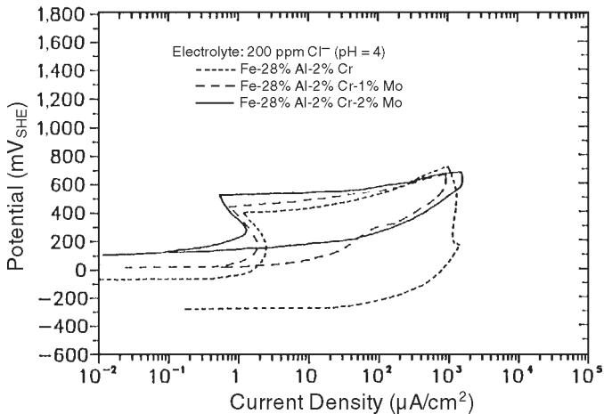  
FIGURE 5. EffectofMocontentonthecyclicanodicpolarization behavior of 2 at% Cr iron aluminides, FA-77 (Fe-28% Al-2% Cr), FA-86 (Fe-28% AI-2% Cr-1% Mo), and FA-85 (Fe-28% AI-2% Cr-2% Mo) in aerated 200 ppm CH $( p H = 4 ) .$

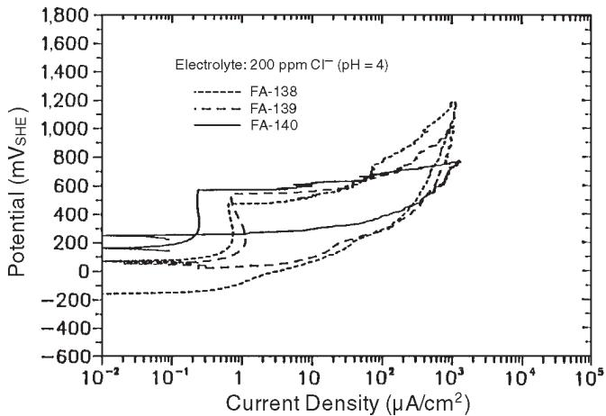  
FIGURE 6. EffectofMocontentonthecyclicanodicpolarization behavior of 4 at% Cr iron aluminides, FA-138, FA139, and FA-140 in aerated 200 ppm CF $( p H = 4 )$

treatment, two sets of FA-140 (Fe-28% Al-4% Cr-2% Mo) samples were submitted to cyclic anodic polarization testing. The first set received the heat treatment of recrystallization plus $\mathsf { D O } _ { 3 }$ ordering. The second set received the previous heat treatment followed by B2 ordering. Thus, the two sets of samples were recrystallized fully and differed principally in the type of ordered structure. The microstructure of FA-140 after both heat treatments is shown in Figure 10. The polarization curves are compared in Figure 11. The treatment yielding the ${ \mathsf { D O } } _ { 3 }$ structure produced somewhat better results: a lower passive current

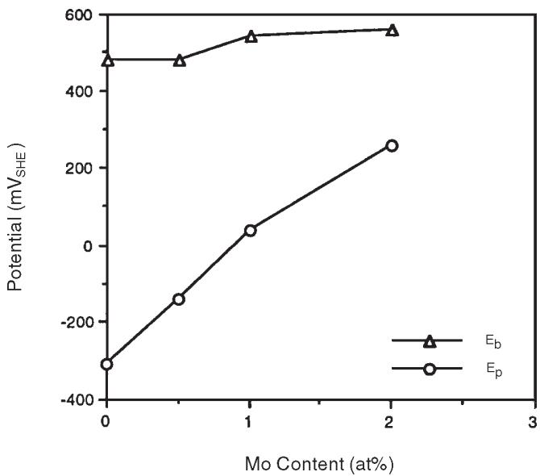  
FIGURE 7. Effect of Mo on $E _ { b }$ and $E _ { p } .$

density, a slightly higher localized corrosion $\mathsf { E } _ { \mathsf { b } }$ value, and a somewhat higher $( \mathsf E _ { \mathsf { p } } - \mathsf E _ { \mathsf { c o r r } } )$ value, as shown in Figure 11.

## Ecorr-vs-Time Behavior

Figure 12 compares typical $\mathsf { E } _ { \mathsf { c o r r } }$ data obtained for FA-72C, FA-138 (Fe-28% Al-4% Cr-0.5% Mo), FA-139 (Fe-28% Al-4% Cr-1% Mo), and FA-140 in 200 ppm ${ \mathsf { C l } } ^ { - } \left( { \mathsf { p H } } = 4 \right)$ , all having received ${ \mathsf { D } } { \mathsf { O } } _ { 3 }$ heat treatment. The E -vs-time curve illustrates the electrochemical principles of passivation and breakdown of the passive film. On immersion, the iron aluminides were activated, then passivated. Generally, the shift of the potential in the positive direction indicated formation of a passive film. The potential for FA-140 was shifted to a high, steady value in 30 h. The potential of FA-72C was unstable for 250 h. Passivation became easier with increasing Mo concentration. FA-140 and FA-139 maintained constant potentials after passivation. Furthermore, FA-140 and FA-139, which contained the higher concentrations of Mo, yielded higher $\mathsf { E } _ { \mathsf { c o r r } }$ and greater resistance to localized corrosion. FA-72C, which contained no Mo, yielded a lower $\mathsf { E } _ { \mathsf { c o r r } }$ and initiated localized corrosion rapidly.

## XPS Analyses

Examples of the XPS spectra are shown in Figure 13. The peak of Fe was identified with iron oxide $( { \sf F e } _ { 2 } { \sf O } _ { 3 } ) . { \sf A l } _ { 2 } { \sf O } _ { 3 }$ was the main part of the passive film. It coexisted with chromium oxide $( \mathsf { C r } _ { 2 } \mathsf { O } _ { 3 } )$ and a small amount of molybdenum oxide $( \mathsf { M o O } _ { 3 } )$ . Table 5 shows results obtained from quantitative evaluation of the XPS spectra for iron aluminides $( \mathsf { D O } _ { 3 }$ heat treatment)

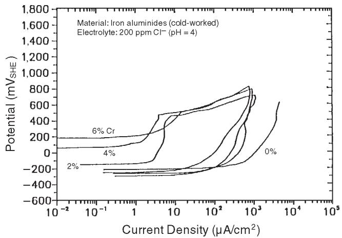  
FIGURE 8. Cyclic anodic polarization curves of 10% coldworked iron aluminides in aerated 200 ppm CH $( p H = 4 )$

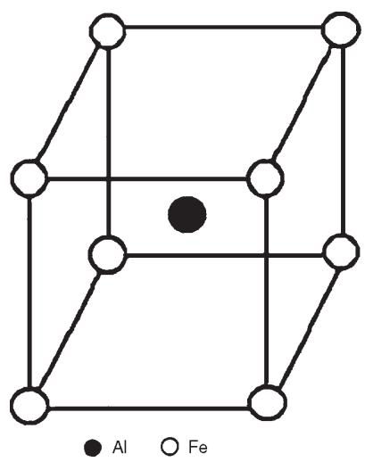  
(a)

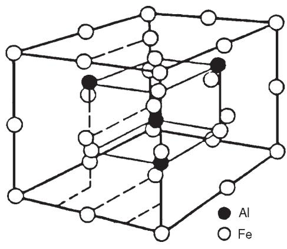  
(b)  
FIGURE 9. Typesoforderedcrystalstructureofironaluminide: (a) FeAI (B2) and (b) $F e _ { 3 } A I \left( D O _ { 3 } \right)$

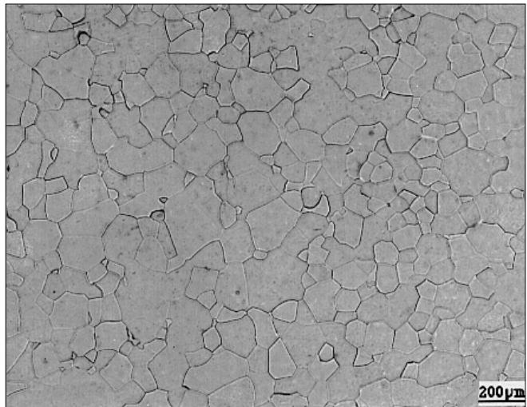  
FIGURE 10. Microstructure of FA-140 after heat treatments.

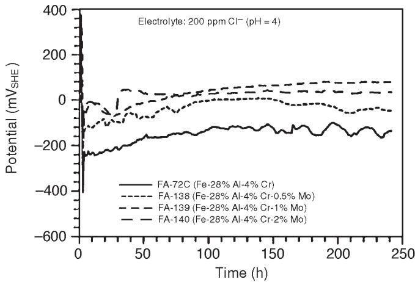  
FIGURE 12. Variation of $E _ { c o r r }$ with time in aerated 200 ppm Cl– (pH = 4).

passivated in 200 ppm Cl– (pH = 4) solution. Fe showed lower concentrations in the oxides than in the bulk alloys. The enrichment of Al and Cr in the passive film was attributed to the preferred dissolution of Fe. The Mo content of the passive films increased almost linearly with increasing Mo content of the alloys. The enrichment of Al seemed dependent upon the Mo content of the alloy up to 0.5 at% Mo. Figure 14 shows the Al enrichment of the passive film as a function of Mo content.

Pronounced spectra of the Cl $2 \mathsf { p } _ { 1 / 2 } \sim 2 \mathsf { p } _ { 3 / 2 }$ electron levels were obtained for all the iron aluminides. Figure 15 shows the height ratio of the peaks of the Cl 2p/O 1s as a function of Mo content. The ratio decreased with increasing Mo content. It was proposed that the improved resistance to localized corrosion resulted from the protective function of the passive film, which impeded adsorption of Cl– on the surface.

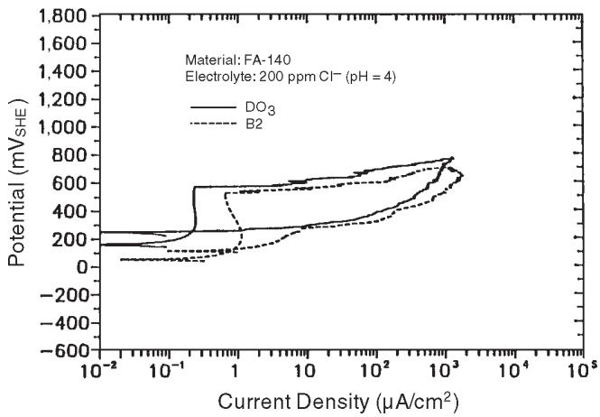  
FIGURE 11. Effectofstructureonthecyclicanodicpolarization behavior in aerated 200 ppm CF (pH = 4).

## Immersion Tests

Cyclic anodic polarization testing demonstrated that all these materials passivated and produced low corrosion current densities. However, the materials also demonstrated varying degrees of susceptibility to localized corrosion. Since analysis of polarization behavior could not predict initiation times for localized corrosion, immersion tests were conducted in which the initiation times were determined visually. Weight changes also were determined and found to be negligibly small. Initiation times for localized corrosion (Table 6) generally were consistent with the electrochemical test results. Higher Mo and Cr concentrations improved localized corrosion resistance.

## Crevice Corrosion Behaviors

In addition to pitting corrosion resistance, crevice corrosion resistance to a Cl–-containing environment is important for the successful utilization of materials. Wilde and Williams showed that potentials for initiating crevice corrosion in SS were lower than those for initiating pitting corrosion and concluded that results appeared to indicate that the kinetics of crevice initiation are more rapid than those of pit initiation.23 Wilde used electrochemical polarization tests on specimens containing synthetic crevices in aerated 3.5 wt% NaCl solution to assess an alloy’s susceptibility to and relative resistance to crevice corrosion on an accelerated basis.20 Using empirical correlations between long-term immersion crevice

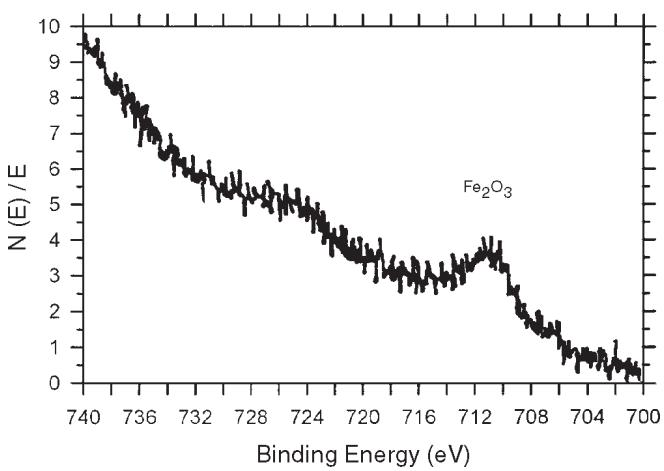  
(a)

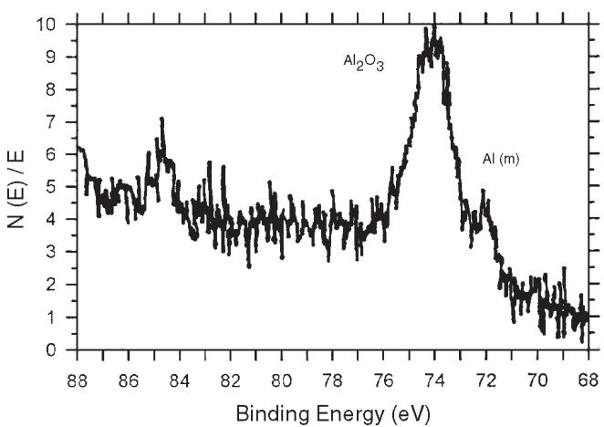  
(b)

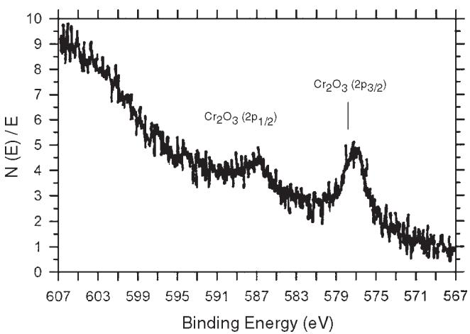  
(c)

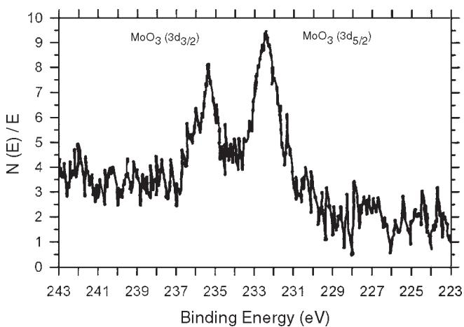  
(d)  
FIGURE 13. XPSspectraof: $( a ) F e 2 p _ { \scriptscriptstyle 3 / 2 } , ( b ) A I 2 p ,$ $( c ) C r { 2 p } _ { 1 / 2 }$ and ${ \cal { 2 } } p _ { 3 / 2 } ,$ and(d) $M o 3 d _ { 3 / 2 }$ and $3 d _ { 5 / 2 }$ peaksmeasured on FA-139 immersed in 200 ppm $C F \left( p H = 4 \right)$ solution for 18 h.

behavior and electrochemical polarization behavior, he suggested how electrochemical polarization data could be used to indicate the resistance of alloy to crevice corrosion initiation and propagation.

In the present work, crevice corrosion tests were performed on three alloys: FA-84, FAL-Mo, and type 304L (UNS S30403) SS. The iron aluminides were given the B2 heat treatment. The cyclic anodic polarization curves obtained under crevice conditions were compared to those obtained under noncrevice conditions (Figures 16 through 18). Table 7 summarizes results of the electrochemical corrosion tests. Figure 16 shows the crevice condition for FA-84 produced major changes in the polarization behavior. Figure 17 shows the crevice condition for FAL-Mo caused $\mathsf { E } _ { \mathsf { b } } , \mathsf { E } _ { \mathsf { p } } ,$ and $\mathsf { E } _ { \mathsf { c o r r } }$ to shift in the negative direction. A comparison of the curves for FA-84 and

TABLE 5  
XPS Test Results
<table><tr><td rowspan="2">Material</td><td colspan="4">Bulk/Surface Content (at%)</td></tr><tr><td>Fe</td><td>Al</td><td>Cr</td><td>Mo</td></tr><tr><td>FA-72C</td><td>68/45.05</td><td>28/43.69</td><td>4/11.26</td><td></td></tr><tr><td>FA-138</td><td>67.5/14.94</td><td>28/65.53</td><td>4/16.26</td><td>0.5/3.24</td></tr><tr><td>FA-139</td><td>67/15.68</td><td>28/65.40</td><td>4/12.97</td><td>1/5.95</td></tr><tr><td>FA-140</td><td>66/13.48</td><td>28/65.85</td><td>4/12.48</td><td>2/8.19</td></tr></table>

FAL-Mo suggested Mo and Cr promoted increased resistance to crevice corrosion. Figure 18 shows the polarization behavior of type 304L SS in the crevice and noncrevice conditions. While $\mathsf { E } _ { \mathsf { b } }$ and $\mathsf { E } _ { \mathsf { c o r r } }$ were similar, $\mathsf { E } _ { \mathsf { p } }$ was more negative in the crevice condition.

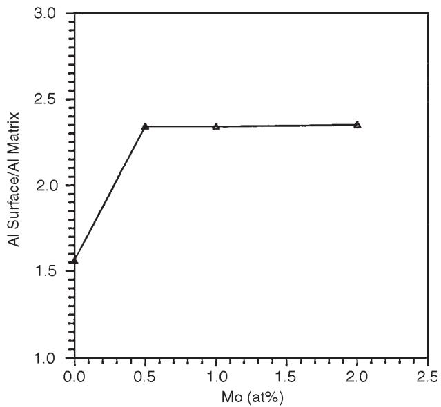  
FIGURE 14. Variation ofAl concentration on the surface with Mo content.

Immersion Test Results, Acid-Chloride Solution  
TABLE 6
<table><tr><td>Material</td><td>Visually Determined Localized Initiation Time (days)</td></tr><tr><td>FA-61</td><td>1</td></tr><tr><td>FA-77B</td><td>2</td></tr><tr><td>FA-72C</td><td>2</td></tr><tr><td>FA-78</td><td>27</td></tr><tr><td>FA-86</td><td>2</td></tr><tr><td>FA-85</td><td>41</td></tr><tr><td>FA-138</td><td>59</td></tr><tr><td>FA-139</td><td>&gt; 122</td></tr><tr><td>FA-140</td><td>&gt; 122</td></tr><tr><td>FA-84</td><td>1</td></tr><tr><td>FAL-Mo</td><td>&gt; 122</td></tr><tr><td>Type 304L SS</td><td>&gt; 122</td></tr></table>

Following the cyclic anodic polarization testing under crevice conditions, three-week immersion tests were conducted under crevice conditions. The resistance to crevice initiation was expressed as the number of sites and percentage of sites exhibiting attack. The maximum depth of corrosion at crevice sites was determined to provide an indication of severity.Table 8 gives results of the three-week immersion crevice tests conducted in 200 ppm Cl– (pH = 4). Crevice corrosion initiated at 52 of the 60

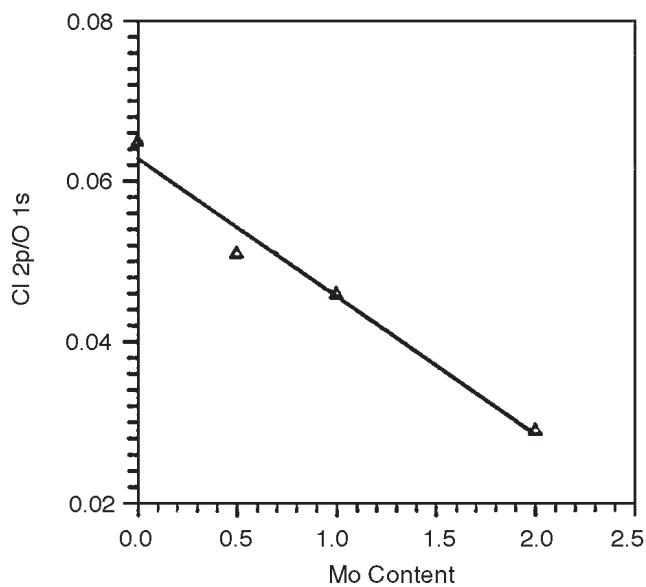  
FIGURE 15. Variation of Cl concentration on the surface with Mo content.

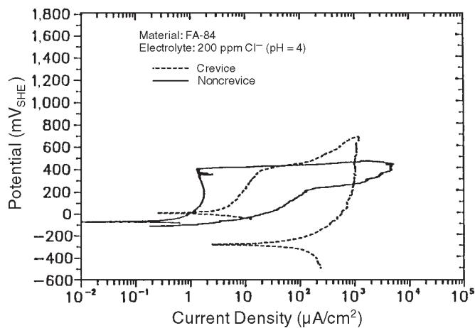  
FIGURE 16. Comparison of cyclic anodic polarization curves of FA-84 (Fe-28% Al-2% Cr-0.05% boron [B]) under crevice and noncrevice conditions in aerated 200 ppm CF (pH = 4).

sites for FA-84, at 1 of the 60 sites for type 304L SS, and at none of the sites for FAL-Mo. The maximum depth of attack was 6 µm for FA-84 and 4 µm for type 304L SS. These results were consistent with the predictions derived from analyses of the cyclic polarization behavior. Based on these results, FAL-Mo and type 304L SS were considered to be significantly more resistant to crevice corrosion than FA-84. Alloying with Mo and Cr appeared to have beneficial effects on crevice corrosion resistance.

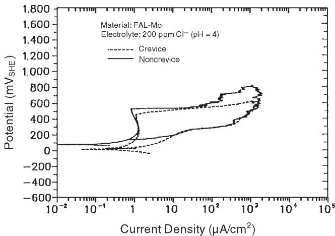  
FIGURE 17. Comparison of cyclic anodic polarization curves ofFAL-Mo (Fe-28% AI-5% Cr-1% Mo-0.04% B-0.08% zirconium [Zr]) under crevice and noncrevice conditions in aerated 200 ppm CF $( p H = 4 )$

## CONCLUSIONS

❖ Hysteresis loops were observed during cyclic anodic polarization for all the iron aluminides, indicating tendencies for localized corrosion.

$\clubsuit$ $\mathsf { E } _ { \mathrm { b } }$ increased with increasing Cr content, indicating increased resistance to initiation of localized corrosion. ❖ Mo additions were found to increase $\mathsf { E } _ { \mathsf { p } }$ (i.e., Mo assisted the repassivation of film breakdown).

❖ Cold working (10%) did not appear to influence localized corrosion resistance of the Cr-containing iron aluminides significantly.

❖ The $\mathsf { D O } _ { 3 }$ structure produced somewhat better localized corrosion resistance than the B2 structure. ❖ Alloying with Mo and Cr had beneficial effects on crevice corrosion resistance.

❖ The passive film developed on the iron aluminides in the mild acid-chloride solution was composed mainly of ${ \sf A l } _ { 2 } { \sf O } _ { 3 }$ that coexisted with ${ \mathsf { C r } } _ { 2 } { \mathsf { O } } _ { 3 }$ and of ${ \mathsf { M o O } } _ { 3 }$ ❖ Mo concentrations up to 0.5 at% enhanced enrichment of ${ \sf A l } _ { 2 } { \sf O } _ { 3 }$ on the metal surface (i.e., Mo facilitated the formation of an Al-enriched passive film). Mo inhibited pit initiation by improving the protective function of the passive film. The presence of ${ \mathsf { M o O } } _ { 3 }$ in the passive film impeded the adsorption of Cl–.

## ACKNOWLEDGMENTS

This research was sponsored by the U.S. Department of Energy, Fossil Energy Advanced Research and Technology Development, Materials Program, under subcontract 11B-07685C-T92. The authors acknowledge the assistance of the ORNL,

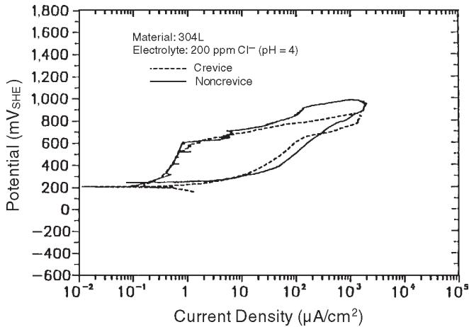  
FIGURE 18. Comparison of cyclic anodic polarization curves of type 304L SS under crevice and noncrevice conditions in aerated 200 ppm CF $\left( p H = 4 \right)$

TABLE 7  
Electrochemical Test Results  
of the Crevice and Noncrevice Conditions
<table><tr><td rowspan="2">Material</td><td colspan="4">Crevice/Noncrevice  $( \mathsf { m } \mathsf { v } _ { \mathsf { s H E } } )$ </td></tr><tr><td> $\mathsf { E } _ { \mathsf { b } }$ </td><td> $\mathsf { E } _ { \mathsf { p } }$ </td><td> $\mathsf { E } _ { \mathsf { c o r r } }$ </td><td> $\mathsf { E } _ { \mathsf { P } } - \mathsf { E } _ { \mathsf { c o r r } }$ </td></tr><tr><td>FA-84</td><td>420/420</td><td>-289/-115</td><td>20/-70</td><td>-309/-45</td></tr><tr><td>FAL-Mo</td><td>460/540</td><td>30/139</td><td>15/80</td><td>15/59</td></tr><tr><td>Type 304L SS</td><td>600/620</td><td>214/240</td><td>214/200</td><td>0/40</td></tr></table>

TABLE 8  
Three-Week Immersion Crevice Test Results
<table><tr><td>Material</td><td>No. Sites Initiated (60 max.)</td><td>Probability (%)</td><td>Max. Depth of Attack (μm)</td></tr><tr><td>FA-84</td><td>52</td><td>87</td><td>6</td></tr><tr><td>FAL-Mo</td><td>0</td><td>0</td><td>0</td></tr><tr><td>Type 304L SS</td><td>1</td><td>2</td><td>4</td></tr></table>

Metals & Ceramics Division, V. Sikka, and C.   
McKamey.

## REFERENCES

1. C.G. McKamey, J.H. Devan, P.F. Tortorelli, V.K. Sikka, J. Mater. Res. 6, 8 (1991): p. 1,779.

2. V.K. Sikka, C.G. McKamey, Fossil Energy Advanced Research and Technology Development, Materials Program, ORNL/TM-11465, 1990.

3. C.G. McKamey, C.T. Liu, E.H. Lee, Fossil Energy Advanced Research and Technology Development, Materials Program, ORNL/TM-10125, 1986.

4. C.G. McKamey, V.K. Sikka, Fossil Energy Advanced Research and Technology Development, Materials Program, Semiannual Progress Report for the Period Ending Sept. 30, 1989, ORNL/FMP-89/2, 1989, p. 271.

5. S.J. Dapkunas, Fossil Energy Advanced Research and Technology Development, Materials Program, Semiannual Progress Report for the Period Ending Sept. 30, 1990, ORNL/FMP-90/2, 1990, p. 439.

6. C.G. McKamey, J.A. Horton, C.T. Liu, Scrip. Metal. 22, 10 (1988): p. 1,679.

7. C.T. Liu, E.H. Lee, C.G. McKamey, Scrip. Metal. 23, 6 (1989): p. 875.

8. S. Vyas, S. Viswanathan, V.K. Sikka, Scrip. Metal. 27, 2 (1992): p. 185.

9. C.G. McKamey, J.A. Horton, C.T. Liu, J. Mater. Res. 4, 5 (1989): p. 1,156.

10. S.A. David, J.A. Horton, C.G. McKamey, T. Zacharia, R.W. Reed, Welding J. 68, 9 (1989): p. 372-s.

11. S.A. David, T. Zacharia, R.W. Reed, Fossil Energy Advanced Research and Technology Development, Materials Program, Proc. 4th Annua Conf. Fossil Energy Materials, ORNL/FMP-90/1, 1990, p. 207.

12. C.G. McKamey, Fossil Energy Advanced Research and Technology Development, Materials Program, Proc. 4th Annual Conf. on Fossil Energy Materials, ORNL/FMP-90/1, 1990, p. 197.

13. M. Shea, A. Castagna, N.S. Stoloff, Mat. Res. Soc. Symp. Proc. 213 (1991): p. 609.

14. J.H. Devan, Oxidation of High-Temperature Intermetallics, eds. T. Grobstein, J. Doychak (Warrendale, PA: TMS, 1989), p. 107.

15. J.L. Smialek, J. Doychak, D.J. Gaydosh, “Oxidation Behavior of FeAl + Hf, Zr, and B,” in Oxidation of High-Temperature Intermetallics, eds. T. Grobstein, J. Doychak (Warrendale, PA: TMS, 1989), p. 83.

16. B.A. Forster, The Acid Rain Debate (Ames, IA: Iowa State Univ. Press, 1993), p. 12.

17. N.D. Greene, Experimental Electrode Kinetics (Troy, NY: Rensselaer Polytechnic University, 1965), p. 3.

18. B.E. Wilde, E. Williams, J. Electrochem. Soc. 117, 6 (1970): p. 775.

19. W.D. France, N.D. Greene, Corrosion 26 (1970): p. 1.

20. B.E. Wilde, “On Pitting and Protection Potentials: Their Use and Possible Misuses for Predicting Localized Corrosion Resistance of Stainless Alloys in Halide Media,” in Localized Corrosion, eds. R.W. Shaehle, B.F. Brown, J. Kruger, A. Agrawal (Houston, TX: NACE, 1971), p. 342.

21. I. Baker, P.R. Munroe, “Properties of B2 Compounds,” in High-Temperature Aluminum and Intermetallics, eds. S.H. Whang, C.T. Liu, D.P. Pope, J.O. Stiegler (Warrendale, PA: TMS, 1990), p. 425.

22. R.N. Wright, Fossil Energy Advanced Research and Technology Development, Materials Program, Proc. 4th Annual Conf. on Fossil Energy Materials, ORNL/FMP-90/1, 1990), p. 231.

23. B.E. Wilde, E. Williams, Electrochim. Acta 16 (1971): p. 1,971.

## NEW PRODUCTS SIMPLIFY LITERATURE SEARCHES

Two new products designed to make searching for published corrosion research easier than ever have been released by NACE International.

MP●Lit/COR●Lit may save hours of library reference work by providing a convenient search program that consists of two data files containing the indexes of technical literature published in NACE’s periodicals Materials ( ) and .

MP●Lit/COR●Lit allows the user to specify key words or phrases, generating a list of citations for articles from the journals. MP●Lit/COR●Lit can identify citations by means of single-word, Boolean, phrase, or proximity searches, or by using “wildcards.”

MP●Lit/COR●Lit cites all technical articles published in the journals since their inception— more than 30 years of articles in and 50 years of papers in . The files identify the periodical, article title, author(s), issue month and year, and first page number.

MP●Lit/COR●Lit (item no. 38128) costs \$39 for NACE members, \$53 list. The product is not affiliated with any other organization or company.

The multiuser network version of COR●AB, NACE’s reference software, also is now available. COR●AB is a CD-ROM product featuring the most complete listing of abstracts of the world’s corrosion science and engineering literature.

It provides engineers and scientists with a resource to solve corrosion problems—including general corrosion, testing, corrosion characteristics, preventive measures, materials construction and performance, and equipment for various industries— by reviewing the documented experience of others.

In the past, COR●AB could be placed on a network system, but only one user at a time had access. Now, five-user packs can be purchased to accommodate multiple simultaneous searches.

COR●AB searches are conducted much like MP●Lit/ COR●Lit searches but allow the user to save related abstracts by linking them together and creating groups. The user can place

“bookmarks” and “notes” in the database for future reference. Specific searches also can be saved and referred to later.

NACE also provides the COR●AB subscription service, which keeps users up to date with the latest abstracts from corrosion literature around the world. Subscribers are sent updates six times a year and receive a new CD (incorporating all the new abstracts and those on the previous CD) at the end of the year. Users must have the CD-ROM product to use the subscription service.

To obtain a free COR●AB demo disk (item no. 38105), more information about the new network version, or information about MP●Lit/COR●Lit, contact the NACE Membership Services Department, phone 713/492-0535, ext. 81, or fax 713/579-6694.

Running MP●Lit/COR●Lit and COR●AB requires an IBMcompatible personal computer with a minimum 640K of RAM and Microsoft MS-DOS 3.2 or greater. COR●AB also requires a CD-ROM player installed with High Sierra extensions to DOS and 2.5 MB free on the hard disk.