SSSR, 117, 441 (1957).

23. J. Koutecky and V. G. Levich, Zh. Fiz. Khim., 32, 1565 (1958).

24. P. Lessner, F. R. McLarnon, and E. J. Cairns, Lawrence Berkeley Laboratory Report no. LBL-22399 (1986).

25. W. Giggenbach, Inorg. Chem., 11, 1201 (1972).

26. W. Giggenbach, ibid., 13, 1724 (1974).

27. H. Reller and E. Kirowa-Eisner, J. Electroanal. Chem. Interfacial Electrochem., 103, 335 (1979).

28. J. O'M. Bockris and A. K. N. Reddy, "Modern Electrochemistry," Chap. 9, Plenum Press, Inc., New York (1970).

29. D. G. Wierse, M. M. Lohrengel, and J. W. Shultze, J. Electroanal. Chem. Interfacial Electrochem., 92, 121 (1978).

30. I. C. Hamilton and R. Woods, J. Appl. Electrochem., 13,

783 (1983).

31. D. Lando, J. Manassen, G. Hodes, and D. Cahen, J. Am. Chem. Soc., 101, 3969 (1979).

32. R. Tenne, N. Müller, Y. Mirovsky, and D. Lando, This Journal, 130, 852 (1983).

33. K. W. Frese, Jr. and D. Canfield, ibid., 132, 1649 (1985)

34. N. Hartler, J. Libert, and A. Teder, Ind. Eng. Chem. Process Des. Dev., 6, 398 (1967).

35. E. Najdeker and E. Bishop, J. Electroanal. Chem. Interfacial Electrochem., 41, 79 (1973).

36. S. Kapusta, A. Viehbeck, S. M. Wilhelm, and N. Hackerman, ibid., 153, 157 (1983).

37. K. M. Abraham, R. D. Rauh, and S. B. Brummer, Electrochim. Acta, 23, 501 (1978).

38. R. D. Rauh, F. S. Shuker, J. M. Marston, and S. B. Brummer, J. Inorg. Nucl. Chem., 39, 1761 (1977).

39. W. Giggenbach, Personal communication (1986).

# Corrosion Behavior of Aluminum-Molybdenum Alloys in Chloride Solutions

W. C. Moshier, G. D. Davis, J. S. Ahearn, and H. F. Hough

Martin Marietta Laboratories, Department of Materials and Surface Science, Baltimore, Maryland 21227

## ABSTRACT

The electrochemical response of Al alloys containing various concentrations of Mo in solid solution was studied using potentiodynamic polarization. The evolution of the chemical composition of the passive film during exposure to deaerated 0.1N KCl was analyzed using x-ray photoelectron spectroscopy. Exposure of Al-Mo alloys to the chloride solution results in an increase in the corrosion potential and a decrease in the cathodic Tafel slope. The breakdown potential is also found to increase with higher concentrations of Mo in the alloy. These results correlate with an increase in the amount of Mo in the oxide film during polarization, even though the concentration of Mo in the passive film is well below that in the alloy. This work suggests that the oxidized Mo in the passive film inhibits the nucleation of pits in the alloy by improving the integrity of the passive film.

Aluminum is a reactive metal that owes its resistance to environmental attack to the formation of an inert passive film on its surface. The rate that the passive film dissolves in aqueous solutions controls the general corrosion characteristics of the metal. Between pH 4 and 9, the solubility of the passive film decreases and protects the metal substrate from attack (1). Away from nearneutral pH conditions, the solubility of the film and, therefore, the general corrosion rate of the metal increases (2, 3).

The presence of certain aggressive anions in the solution, most notably chlorides, results in the localized attack of the passive film. The pits that form during the attack are caused by an accelerated dissolution of the passive film and of the metal substrate. This, in turn, leads to locally high current densities and changes in the solution chemistry inside the pit. The pitting process involves a series of reaction steps including the adsorption of the Cl- anion and its chemical interaction with the passive film and subsequent thinning of the film followed by the exposure and rapid dissolution of the metal substrate (4). The overall process can be effectively controlled in aluminum through the use of inhibitors, such as either molybdates, chromates, or nitrates (5, 6), in the solution. The mechanism by which the corrosion inhibitor improves the integrity of the passive film is not clearly understood. Results of analyses of the interaction of inhibitors with aluminum using x-ray photoelectron spectroscopy (XPS) and Rutherford backscattering spectroscopy (RBS) indicate that the inhibitor anion is incorporated into the passive film during exposure to the solution (7-9). The common characteristic of these inhibitors and their interaction with the passive film is that their chemical state, as measured by XPS, is reduced from the higher valence state in the inhibitor during the incorporation of the species into the passive film. In the case of the molybdate inhibitor, two chemical states,

Mo+⁶ and Mo+4, were detected (7, 8). It was suggested that the inhibiting effect may be due to molybdate adsorption, reduction, and inclusion in the passive film, thereby improving the film's resistance to local attack, possibly by blocking paths used by the Cl- anion to reach the oxide/metal interface.

To determine whether reduction of the ion is essential to improving the passivity of Al exposed to chloride solutions, we directly alloyed Mo to Al to eliminate the presence of the higher Mo valence state $( \mathbb { M } o ^ { + 6 } )$ , thereby removing the reduction step from the inhibiting process. Because the solid solubility of Mo in Al is very low, efforts to eliminate pitting by its addition to Al using a conventional ingot metallurgy approach have been unsuccessful. Addition of Mo to Al generally leads to the preferential nucleation of pits at the precipitates in the alloy, and the pitting resistance of the material is diminished from that of the pure metal. Recently, Mo has been directly alloyed to Al using ion implantation (10, 11) and RF-magnetron sputter-deposition (12). Both techniques allow the Mo to be retained in solid solution with the Al at concentrations well above its solubility limit in Al without the formation of Mo-rich precipitates (12, 13). The resistance of these Al-Mo alloys to pitting attack is substantially increased. Figure 1 shows the effect that adding 6 atom percent (a/o) Mo to an Al sputterdeposited film has on the pitting potential, as measured potentiodynamically (12). The same concentration of Mo was even sufficient to passivate the alloy when it was tested in air-saturated chloride solutions.

The results of the polarization behavior of the alloy containing Mo in solid solution with Al are similar to the tests on pure Al conducted in aqueous solutions containing molybdates, where pitting potentials as high as +1V, with respect to the saturated calomel electrode (SCE), have been reported (6), and the resistance of the material to localized attack is increased significantly.

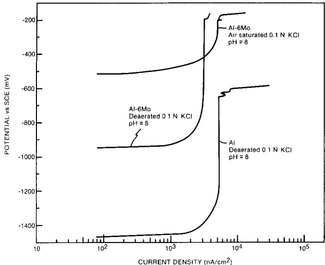  
Fig. 1. Potentiodynamic polarization curves for Al and for Al with 6 weight percent Mo in solid solution in deaerated and air-saturated 0.1N KCl solutions at pH 8.

The improvement in the ability of the passive film to resist localized attack in each case suggests a similar mechanism for Mo interaction with the passive film. However, the passive flm that forms when an Al-Mo alloy is exposed to an aggressive chloride-containing electrolyte must evolve through a series of steps that are likely to be quite different than those occurring when Al is exposed to a molybdate inhibitor. Understanding the nature of the evolution of the passive film in either system, in response to the exposure of Al to chloride-containing solutions, is essential in isolating the key elements that play a role in improving resistance to localized attack.

In this investigation, the response of Al alloys containing various concentrations of Mo in solid solution to anodic and cathodic potentiodynamic polarization has been used to characterize the corrosion behavior of the material in 0.1N KCl. The evolution in the surface chemistry of the passive film as a result of changes in the electrochemistry of the system have been analyzed, using XPS and high-resolution scanning electron microscopy (HSEM). The results of this work are discussed in light of the molybdate-inhibited Al system.

## Experimental Procedure

Specimen preparation.—Metal films of Al alloyed with various concentrations of Mo were prepared by codepositing the two elements onto a 5 cm diam singlecrystal silicon wafer, using the RF magnetron sputter deposition process. This process involves using two separate Al and Mo targets to grow films at a rate of 5 Å/s. The vacuum pressure in the chamber prior to sputtering was 10-7 torr. Immediately after the start of sputter deposition, the silicon was cooled to near -196°C to minimize heating the alloy during sputtering and suppress the formation of Mo-rich precipitates. The films were not cooled before sputter deposition to avoid using the wafer as a cold finger and increasing contamination of the surface. Between 0.8 and 1.0 μm of the Al-Mo alloy was deposited onto the Si. After deposition, the temperature of the alloy increased slowly to ambient prior to its removal from the vacuum chamber.

The composition of the film was controlled by setting the Al target to the maximum power and varying the power to the Mo target. Because the targets were close to the Si, the composition of the alloy varied across the wafer. Specimens used for this study were taken from the center of the wafer, where the compositional and thickness gradients were the lowest. The center of the wafer was separated into eight sections by cleaving the silicon along lines scribed onto its rear surface. Sections of the flms that were scratched during handling were not used in the polarization tests. The average Mo composition in each area of the film was determined on a duplicate sample by dissolving the alloy off of the Si, measuring the weight loss, and determining the concentration of Mo and Al in thę solvent. This information was compared with the results of the XPS analysis.

Electron microscopy and x-ray diffraction.—The HSEM was performed on a JEOL 100 CX at 40 kV on the sample surface in both the as-sputtered condition and after exposure to the electrolyte following polarization. The samples were coated with a thin layer of platinum prior to analysis, in order to reduce charging of the surface. Specimens were prepared for transmission electron microscopy (TEM) by polishing the back side of the silicon until the final thickness of the wafer was close to 50 μm. A copper-rhodium mask with an oval hole was then glued to the polished silicon side with epoxy. An area thin enough for transmission of a 100 kV beam was made by ion milling the Si side with argon on a Gatan Model 600 ion miller at $1 4 ^ { \circ }$ and 3 kV until perforation. The sample was milled on a cold stage to prevent heating during thinning.

The presence of precipitates in the films was determined using selected area diffraction (SAD), as well as glancing angle x-ray diffraction (XRD). The SAD patterns were made at 100 kV. The glancing angle XRD was performed on a Siemens diffractometer using a monochromatic Cu $\mathtt { K } _ { \alpha }$ x-ray source. The angle between the incident x-rays and the specimen was held constant at 12°, while the detector for the diffracted x-rays was swept in an arc around the sample. This technique improved the signal-to-noise of the as-deposited Al-Mo film over conventional diffraction techniques by at least 50%, and also eliminated diffraction from the silicon substrate.

Electrochemical polarization measurements.—Each polarized sample was masked with lacquer and allowed to dry for 24h. The electrolyte used in this study was made by mixing 500 ml distilled water with reagentgrade KCl to obtain a solution of 0.1N KCl. The electrolyte was first degassed under vacuum and subsequently deaerated with high purity nitrogen. The pH of the solution was adjusted to 8 with KOH. The electrode was held in the middle of the flask and a magnetic stirrer was used to vigorously agitate the solution throughout the test. The samples were placed into the electrolyte and allowed to come to an equilibrium corrosion potential (Ecor®) prior to polarization. The potential was monitored continuously after immersion and $\pmb { { E } } _ { \mathrm { C O R R } }$ was determined when the change in the open-circuit potential was less than 1 mV over a 6 min period. A platinum wire mesh with a surface area at least ten times that of the working electrode was used as a counterelectrode. An SCE, used as a reference electrode, was held approximately 2 mm from the surface of the working electrode, using a Luggin probe. Potentiodynamic polarization measurements were performed with a Princeton Applied Research PAR Model 273 potentiostat/galvanostat by scanning anodically or cathodically from $E _ { \mathrm { C O R R } }$ at 0.2 mV/s.

Surface analysis.—Samples to be analyzed by XPS were removed from the solution immediately following polarization. Most, but not all, of the samples were rinsed in high purity water and dried in a nitrogen stream before being placed into the ultrahigh vacuum (UHV) of the XPS chamber for analysis. In all cases, the transfer from the solution to the vacuum chamber took less than 5 min to accomplish.

The XPS spectrometer, a Surface Science Laboratories (SSL) Model SSX 100-03, consists of a monochromatized Al Kα x-ray source and a hemispherical electron energy analyzer with multichannel detection. A rasterable differentially pumpable ion gun, with an argon gas handling system, was used for sputtering the alloy. The x-ray source was focused to a spot size of 600 μm for the survey and high resolution spectra and to 300 $\mu \mathrm { m }$ for depth profiles.

Quantitative analysis was obtained primarily from the high resolution measurements of the Al 2p, Mo 3d, O 1s, and C 1s core level areas, using sensitivity factors derived from the spectra of standards using this instrument. These factors are presented in Table I. Chemical state information, from the Al 2p and Mo 3d spectra, was obtained using the curve-fitting routine supplied by the manufacturer. In the case of the Mo 3d spectra, the spinorbit doublet components were constrained by a 3.2 eV separation and an area ratio of 1.5, derived from the spectra of pure Mo. The Mo chemical states were identified using published data on the shifts in binding energy (14, 15).

Table I. Sensitivity factorsa
<table><tr><td>Element</td><td>Survey spectrāb</td><td>High-resolution spectra</td></tr><tr><td></td><td>0.613</td><td>0.467</td></tr><tr><td> $\underset { \mathbf { \Delta } \mathbf { \Sigma } } { \mathrm { ~ A l ~ } } 2 \mathbf { p } .$   $\mathtt { M o } \bar { 3 } \mathtt { d }$ </td><td>12.7</td><td>9.82</td></tr><tr><td> $\overline { { \Omega \ : 1 \ : \mathrm { s ^ { d } } } }$ </td><td>2.49</td><td>2.49</td></tr><tr><td></td><td></td><td></td></tr></table>

a Sensitivity factors include contributions from photoelectric cross section, electron escape depth, and analyzer transmission; C 1s = 1.00  
b Analyzer pass energy = 150 eV  
e Analyzer pass energy = 50 eV  
ª Core level used to normalize Al and Mo sensitivity factors

## Results

Alloy characterization.—The surface of the Al and the Al-Mo alloys was optically reflective without any cloudiness, which would have indicated contamination. Examination of the surface using HSEM revealed an uneven nodule-like structure. This feature became less pronounced at higher concentrations of Mo in the alloy. Figure 2 shows the difference in the surface morphology between a pure Al film and a film containing 2.8 a/o Mo. The grain size for the pure Al film was approximately 0.25 μm; it was reduced to 0.12 μm with the addition of up to 6 a/o $\mathbf { M o } ,$ but was not significantly reduced further at higher Mo concentrations. Figure 3a, b shows the microstructure of a pure Al and an Al-9Mo film. The spacing between the nodule-like structures on the surface in Fig. 2 suggests that these features are individual grains that were formed during deposition of the alloy.

To determine the metallurgical stability of the alloys at room temperature, the alloys were characterized using XRD and TEM as a function of time over several months. There was no evidence of Al-Mo intermetallic phase formation during this time. Glancing-angle XRD revealed that the Mo was in solid solution with Al in the asdeposited films, and it remained in this state during storage at room temperature. For each alloy, Al diffraction peaks were shifted to higher angles, indicating that the Mo atom had substitutionally replaced Al in the face center cubic (fcc) lattice, thereby decreasing the lattice parameter. SAD patterns (Fig. 3c, d) produced sharp ring diffraction patterns that indexed to an Al fcc lattice structure,

Electrochemical behavior.—After immersing each alloy in the electrolyte, the change in corrosion potential was monitored as a function of time. In the case of the pure Al films, the potential fell from its initial value toward more active potentials, asymptotically approaching the equilibrium $E _ { \mathrm { C O R R } } .$ The behavior of the Al-Mo alloy films was quite different, with the potential decreasing immediately after exposure to the solution, until it reached a minimum, at which point it began to increase asymptotically from more active potentials toward the $\begin{array} { r } { \bar { \pmb { { E } } } _ { \mathrm { { c o r t } } } . } \end{array}$ These differences are illustrated in Fig. 4. After 1h in the solution, the potential of both the pure Al and Al-Mo films leveled off at the ${ \pmb { { E } } } _ { \mathrm { C O R R } } .$ The $E _ { \mathrm { { c o R R } } } ^ { - }$ for each alloy was a function of the Mo concentration (Fig. 5). It increased from −1450 mV (SCE), for pure Al, to above −1000 mV (SCE), for 2.8 a/o Mo. The effect of Mo on $\pmb { { E } } _ { \mathrm { { c o R R } } }$ is less pronounced above 3 a/o with the slope of the curve in Fig. 5 decreasing at higher Mo concentrations.

The presence of Mo in the alloy also affects the response of the Al-Mo alloy during cathodic polarization. The cathodic Tafel slope $\beta _ { \mathrm { c } }$ for several films containing different levels of Mo are listed in Table II. The Tafel slope for pure Al was twice the value of that for the Al-Mo alloys. Furthermore, the Tafel slope of the Al-Mo alloys was independent of the Mo concentration for the alloy compositions tested. The behavior of $E _ { \mathrm { C O R R } }$ and $\beta _ { \mathrm { c } }$ indicates that Mo on the surface of the sputter-deposited film affects the cathodic half-reaction at the surface of the electrode.

The addition of Mo to Al also dramatically affected the anodic polarization behavior of the alloy. As shown in Fig. 6, the addition of Mo in solid solution with Al drove the breakdown potential for pitting $( E _ { \mathfrak { b } } )$ to more noble potentials. The $\bar { E _ { \mathrm { { b } } } }$ was found to be a function of the Mo in the alloy, becoming more electropositive with increasing Mo content. Figure 6 shows the dependence of $\pmb { E _ { \mathrm { b } } }$ on Mo concentration, i.e., it increased monotonically with higher concentrations of Mo. For this work, the presence of Mo in solid solution with Al improved the alloy's resistance to localized attack in chloride containing solutions.

Surface characterization.—High-resolution XPS spectra of the Mo 3d and Al 2p photoelectron peaks of an Al-7Mo alloy before immersion, after equilibration at $E _ { \mathrm { { C O R R } : } }$ and at the breakdown potential are shown in Fig. 7. The air-formed oxide contains very little Mo; nearly all the Mo detected on the surface is in the metallic state in the alloy below the oxidized film. The ratio of metallic Mo to metallic Al is close to that expected from the bulk concentrations for each alloy examined. The oxidized Mo in the air-formed passive film, which is in the $\mathbf { M o } ^ { + 4 }$ state, also scales with the bulk concentration. However, the proportion of Mo+⁴ to Al+³ in the air-formed passive film is much less than that found in the alloy, i.e., only approximately one tenth of the ratio of Moº to Alº. This low value suggests that the Al is preferentially oxidized when the alloy is removed from the deposition chamber and allowed to come into contact with the atmosphere.

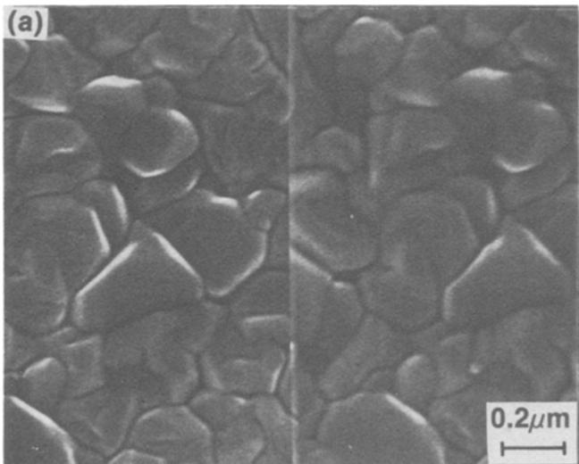

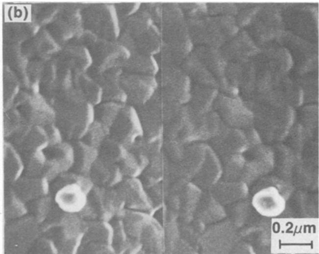  
Fig. 2. Surface of a) pure Al and b) Al with 6 a/o Mo in solid solution after RF-magnetron sputter-deposition.  
Downloaded on 2016-03-06 to IP 130.203.136.75 address. Redistribution subject to ECS terms of use (see ecsdl.org/site/terms\_use) unless CC License in place (see abstract).

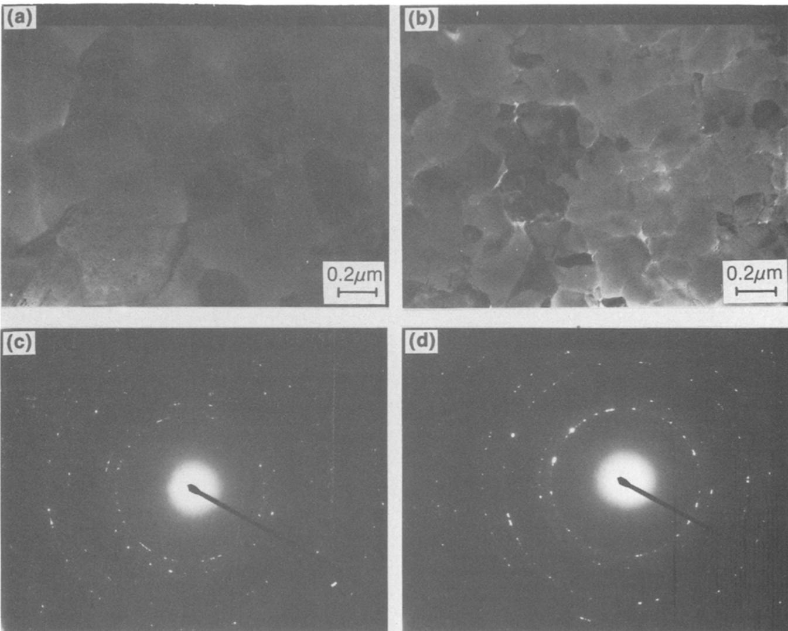  
Fig. 3. Microstructure of a) pure Al and b) Al-9Mo thin films after ion milling revealing grain size and morphology. Selected area diffraction patterns for c) pure Al and d) Al-9Mo showing ring diffraction patterns that index to the Al-fcc structure. No additional rings or spots that would indicate the presence of precipitates are evident.

Exposing the Al-Mo alloys to the chloride-containing electrolyte further oxidizes the surface, as indicated by the decrease in the metallic Al peak, relative to the oxidized Al peak (Fig. 7). During this period of change and growth in the passive film, the Mo concentration in the oxidized film also increased slightly. In general, increased amounts of both metallic and oxidized Mo (relative to the metallic, Fig. 8, and oxidized, Fig. 9, Al concentrations) corresponded with a slow increase in the open-circuit potential, an effect similar to that observed for the bulk Mo concentrations (Fig. 5).

The chemistry of the oxidized films, which appears independent of applied potential, resembles a boehmite phase (the aluminum oxyhydroxide, with an oxygen-tooxidized Al ratio of two) for alloys with bulk Mo concentrations below 9 a/o. It is similar to the chemistry of the passive film seen for pure Al immersed in dilute sulfate solutions (16), rather than the more thermodynamically stable trihydroxide phase (1). In contrast, the oxygen-tooxidized Al ratio for the 9 a/o alloys was consistently near 2.5, indicating a film composition between the oxyhydroxide and the trihydroxide phases. The reason for the change in the film composition with increasing Mo levels in the alloy is unclear at this time.

Table II. Cathodic Tafel slope
<table><tr><td>[Mo] (a/o)</td><td>ECORR βe (mV vs. SCE) (mV/decade)</td></tr></table>

During polarization, the oxidized film grows thicker until the metallic Al signal is nearly completely attenuated (Fig. 7). Because of an inability to uniquely fit a curve with four independent pairs of peaks, it is difficult to quantify the individual oxidized states of Mo. However, the data clearly show that the higher oxidation states (Mo+⁵ and Mo+⁶) are restricted to the thicker films (Fig. 10). The total amount of oxidized Mo [Mo°x], in the passive film, increased with film thickness, but always remained much below the amount in the bulk (typically 2-3% of the [Mo°], relative to [Alo]). The metallic Mo concentration at the oxidized film-alloy interface also increased for heavily oxidized surfaces, with a buildup of up to two to three times the bulk Mo%Alº ratio.

The rapid increase of the current density during anodic polarization at the E was associated with the formation of several visible pits on the surface of the alloy. HSEM of the surface of an Al-5Mo alloy that had been polarized to the ${ \pmb E } _ { \mathbf { b } }$ shows one large pit (5 μm diam) and several smaller pits starting; these appear to initiate in the dark regions of the photomicrograph (Fig. 11). X-ray energy dispersive spectroscopy (EDS) of these areas shows that the dark regions have been preferentially depleted of Al, leaving behind much of the Mo that was initially present in the film. The ratio of Al/Mo in the light area, 10.6, was considerably higher than in the adjacent dark region, 7.9 (Fig. 11b, c). Pits and films depleted of Al are typical features only of Al-Mo alloys that have undergone pitting; they are not found below $\mathbf { E _ { b } } .$ For example, HSEM analysis of an Al-13Mo film polarized to 0 V (SCE) showed no surface degradation.

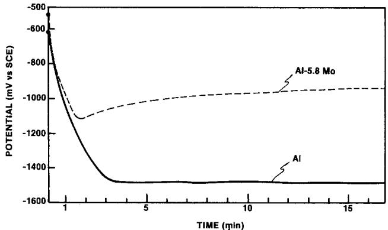  
Fig. 4. The functional dependence of potential on the time of exposure of the working electrode to the O.1N KCl electrolyte for pure Al and an Al-5.8 Mo alloy.

## Discussion

The results of the electrochemistry and surfacesensitive spectroscopy indicate that Mo plays an active role in controlling the corrosion behavior of Al-Mo alloys. The change in the corrosion potential of the alloy increases with the amount of Mo found in the passive film. This increase remains a small fraction of the level of Mo in the alloy, but is sufficient to impact its corrosion behavior and improve its resistance to localized attack.

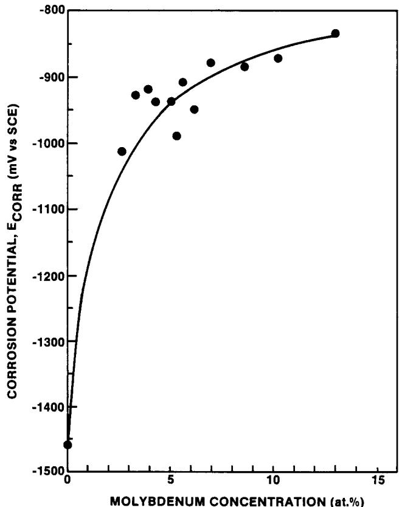  
${ \bar { \mathbf { F i g . } } }$ 5. The effect of the average Mo content in the alloy on the $\pmb { \varepsilon } _ { \mathrm { C O R R } } .$

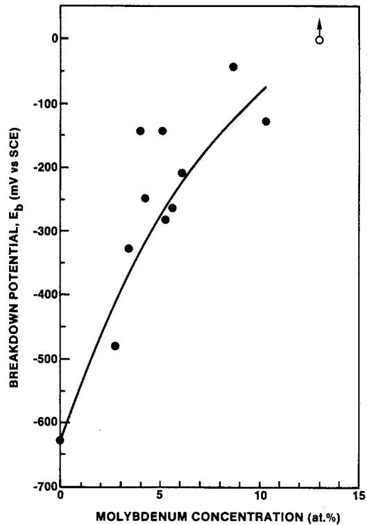  
Fig. 6. The effect of the average Mo content in the alloy on the $\pmb { \varepsilon _ { \mathrm { { b } } } }$ determined from a rapid increase in the current density during potentiodynamic polarization.

The effect of Mo in the passive film on the electrochemical response of the alloy was observed by the change in the potential with time after the electrode was immersed into the deaerated 0.1N KCl electrolyte. Initially, the potential of the Al-Mo alloy becomes more electronegative after exposure to the solution. This behavior is similar to a pure Al electrode in the same solution (Fig. 4). However, the potential of the alloy electrode begins to increase after several minutes in the solution, as the airformed film is replaced by a film that is more stable in the solution, whereas the potential measured on the pure Al electrode continues to fall. Eventually, each surface reaches an equilibrium condition with the electrolyte and the potential stabilizes at $E _ { \mathrm { { C O R R } } } .$ The film that forms on the Al and the Al-Mo alloy are similar in that each has increased in thickness over the air-formed film. However, the growth of the passive film of the Al-Mo alloys is accompanied by an increase in the concentration of Mo+⁴ in the film. Therefore, the electrochemical response of the Al-Mo electrode correlates with a small but significant increase in the concentration of Mo in the passive film (Fig. 7). This result suggests that the difference in the transient behavior of the potential of each electrode is related to an increase of Mo in the passive film, which affects the corrosion behavior of the alloy.

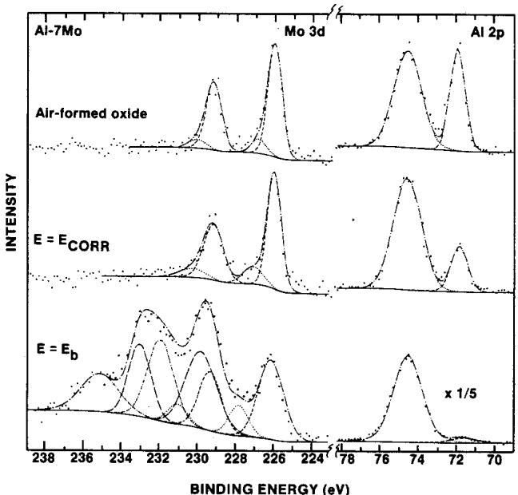  
Fig. 7. The results of high-resolution XPS on the surface of an airformed passive film, a passive film formed after exposure to the electrolyte at $\pmb { \varepsilon } _ { \mathrm { c o n s } } ,$ and a film at the breakdown potential, for both the Al 2p and Mo 3d peaks. The Al 2p state contains two peaks corresponding to the metallic (dashed) and the oxidized (dotted) states. On the other hand, Mo may contain up to four different valence states: metallic (dashed), $M o ^ { + 4 }$ (dotted), $M O ^ { + 5 }$ (long dashed), and $M O ^ { + 6 }$ (short dashdot). Each state of Mo contains two peaks due to the doublet of the valence state. The size and shape of the second peak is dependent upon the height and area of the first peak.

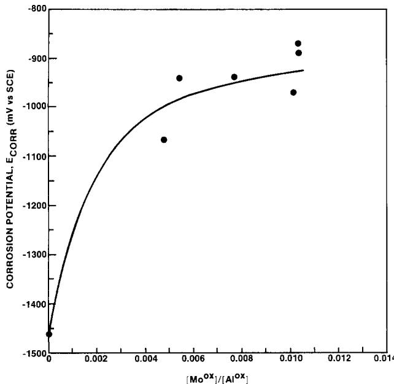  
Fig. 8. XPS data showing the dependence of $\pmb { \cal E } _ { \mathrm { C O R R } }$ on the ratio of the area under the metallic Mo peak to the area under the metallic Al peak. The behavior of $\pmb { \cal E } _ { \mathrm { C O R R } }$ with increasing ${ M O } ^ { 0 }$ at the surface is similar to the bulk concentration shown in Fig. 5.

As the Mo concentration increases in the passive film, $\pmb { { E } } _ { \mathrm { { c o R R } } }$ is driven to more noble potentials. It rises quickly at first, but then tapers off after the Mo concentration in the alloy reaches several percent (Fig. 5 and 8). The difference between the figures is that Fig. 5 shows the Mo concentration in the bulk of the alloy, whereas Fig. 8 shows the Mo concentration near the passive film. Very little Mo builds up at the passive film-metal interface, except in the case where a relatively thick passive film develops. The amount of Mo in the passive film, determined by the ${ \bf M } { \bf o } ^ { + 4 }$ to Al+³ ratio, also increases with higher Mo content in the alloy, but continues to be approximately one-tenth of the ratio of $\mathbf { M o ^ { 0 } }$ to Alº found in the bulk. It is the Mo in the passive film, which is governed by the concentration of Mo in the alloy, that determines the electrochemical response of the alloy.

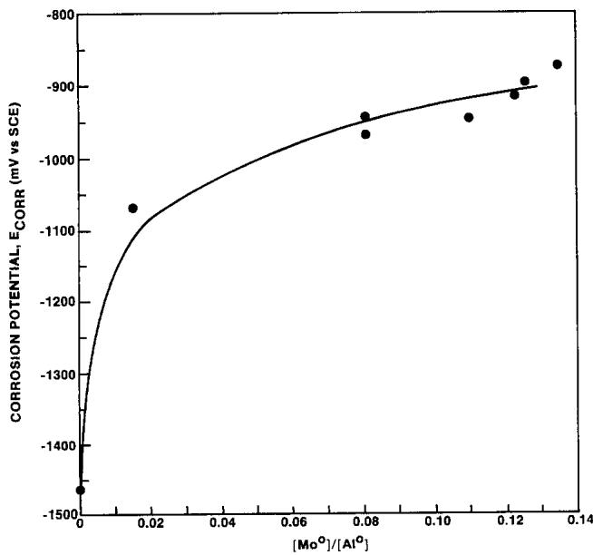  
Fig. 9. XPS data showing the dependence of $\pmb { \cal E } _ { \mathrm { C O R R } }$ on the ratio of the area under the oxidized Mo peak to the oxidized Al peak.

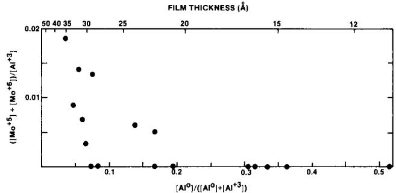  
Fig. 10. The increase in the film thickness correlated with an increase in the amount of $M o ^ { + 5 }$ and $M o ^ { + 6 }$ found in the passive film. These two states were not found in films less than 20Å thick.

The effect of Mo in the passive film on Ecor® can result from its interaction with either the anodic or cathodic reactions at the surface of the electrode. Each reaction must be considered to determine how the Mo may affect the corrosion behavior of the alloy. In mildly alkaline solutions $( p \mathbf { H } < 8 . 5 )$ , the overall anodic half-reaction on an aluminum surface will be the formation of the passive film

$$
\mathrm { A l } + 2 \mathrm { H } _ { 2 } \mathrm { O }  \mathrm { A l O O H } + 3 \mathrm { H } ^ { + } + 3 e ^ { - }
$$

whereas the cathodic half-reaction will be the decomposition of water to form hydroxyl ions and hydrogen gas

$$
2 \mathrm { H } _ { 2 } \mathrm { O } + 2 e ^ { - }  2 \mathrm { O H } ^ { - } + \mathrm { H } _ { 2 }
$$

The general corrosion of aluminum in deaerated alkaline solutions is limited by the dissolution of the passive film. The presence of Mo in the film may, in some way, limit the dissolution. This effect would be evident by a decrease in the passive current density $( i _ { \mathbf { p } } )$ measured during polarization. In the case of the Al-6Mo alloy shown in Fig. 1, the $i _ { \mathbf { p } }$ is one-third of the value of the pure Al. A decrease in $i _ { \mathfrak { p } }$ would result in an increase in $E _ { \ell }$ CORR, since the equilibrium between the cathodic and anodic reactions would shift to higher potentials, due to the Tafel slope of the cathodic reaction (Fig. 12). However, the change in $i _ { \mathbf { p } }$ is not sufficient to significantly increase $E _ { \mathrm { C O R R } } ,$ since the cathodic Tafel slope is shallow for the Al-Mo alloys (70 mV/decade). Therefore, a large change in the $E _ { \mathrm { { C O R R } } }$ will require a substantial change in $i _ { \mathbf { p } } .$

The Mo in the passive film may also affect the cathodic half-reaction by either increasing the exchange current density for the cathodic reaction, or decreasing the cathodic Tafel slope. In the situation where the cathodic halfreaction is the decomposition of water to form hydroxyl ions and hydrogen gas, one step in the reaction is the recombination of the adsorbed hydrogen atoms on the surface of the electrode. Molybdenum is a known catalyst for the recombination of adsorbed hydrogen, with an exchange current density (io) five orders of magnitude greater than Al (17). In light of this change, even small additions of Mo to the alloy would quickly increase $\pmb { { \cal E } } _ { e }$ CORR, since the large increase in the exchange current density would result in a significant shift in the cathodic reaction to higher current densities (Fig. 12), thereby substantially increasing $E _ { \mathrm { C O R R } } .$ Once sufficient Mo is present on the surface to control the recombination of adsorbed hydrogen, an increase in the Mo concentration in the film would be expected to have less of an affect on the $E _ { \mathrm { { ( } } }$ CORR, since the exchange current density would increase only as a function of the coverage of Mo on the surface. This model would explain the rapid rise in $E _ { \mathrm { C O R R } }$ with small additions of Mo as well as its diminishing effect on increasing $\pmb { { E } } _ { \mathrm { { C O R R } } }$ at higher Mo concentrations in the alloy.

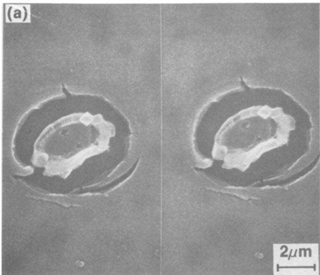

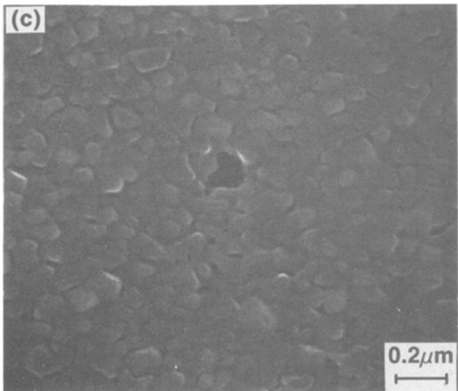

The effect of Mo on the cathodic half-reaction is further shown by the change in the cathodic Tafel slope of pure Al and the Al-Mo alloys. The Tafel slope for Al is more than twice the slope of the Al-Mo alloys. Additionally, once sufficient Mo has been added to the Al, the Tafel slope remains independent of the Mo concentration. The decrease in the Tafel slope for the alloy may also contribute to the rise in $E _ { \mathrm { { C O R R } } } ,$ as shown in Fig. 12. However, it alone cannot explain the continued dependence of ${ \pmb E } _ { \mathrm { C O R R } }$ on the Mo concentration above the initial rise. Rather, the decrease in the cathodic Tafel slope implies that the rate limiting step governing the cathodic half-reaction of Al differs from that of the Al-Mo alloys, since the cathodic Tafel slope can be related to a change in the reaction process through the transfer coefficient (18).

The addition of Mo to the passive film alters the electrochemical response of Al at the equilibrium corrosion potential. The difference in the response of Al and Al-Mo provides little direct information regarding the protective nature of the passive film in chloride-containing solutions at more noble potentials. However, during passivation, the same reactions occur at the surface of the electrodes. One aspect of pitting in Al is that the pit propagation is limited by the evolution of hydrogen (2). The strong dependence of the cathodic reaction on the presence of Mo in the alloy suggests that this alloying element may actually increase the propagation of a pit, once the pit has nucleated, since Mo is expected to promote the recombination of hydrogen. This leads to the conclusions that (i) it is the Mo in the passive film that controls the pitting behavior of the alloy and (ii) Mo does not impede the growth of the pit but, rather, inhibits pit nucleation.

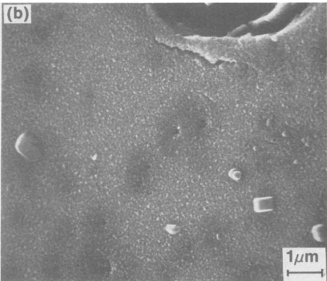  
Fig. 11. Stereomicrograph of the pitted surface of an Al-5.4 Mo alioy after the electrode was polarized to the pitting potential revealing a) the lift-off of the alloy film from the Si substrate. KCl crystals also are present on the surface. b) Isolated regions of the alloy near the pit are dark where Al has been leached from the film and contain c) a small pit that has formed on a grain boundary.

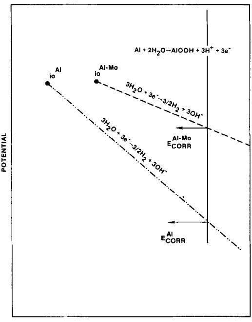  
Fig. 12. Diagram showing the effect of increasing the hydrogen recombination exchonge current density $( \romannumeral 3$ and the cathodic Tafel slope (βc) on $\pmb { \varepsilon } _ { \mathrm { { C O R R } } } .$

The passive film that forms during exposure to the electrolyte contains both ${ \bf A } { \bf l } ^ { + 3 }$ and $\mathbf { M o ^ { + 4 } }$ states, is thicker than the film formed when the alloy was first exposed to air, and is an oxyhydroxide phase for alloys containing less than 9 a/o Mo. Polarizing the alloy up to $\scriptstyle { { \pmb E } _ { \mathrm { b } } }$ further increases the thickness of the passive film. The presence of the higher oxidation states of Mo in the passive film is dependent on the thickness of the oxide film (Fig. 10). The $\mathrm { M o ^ { + 5 } }$ and $\mathbf { M o } ^ { + 6 }$ states may be a result of the formation of oxychlorides or oxides; however, the low sensitivity of the XPS measurement to Cl (as opposed to Mo) and the low concentration of the $\mathbb { M } \ o { 0 } ^ { + 5 }$ and $\mathbf { \bar { M } o ^ { + 6 } }$ in the film make it difficult to distinguish between the two possibilities. Furthermore, oxidation states other than $\mathbb { M o } ^ { + 4 }$ do not consistently appear in the passive film during polarization, even at the breakdown potential, and, therefore, do not seem to be necessary for inhibiting pitting in Al.

The addition of molybdates to solutions containing chlorides have shown a similar electrochemical response (6) as the Al-Mo films. Furthermore, Mo was found in both the $\mathbf { M o } ^ { + 4 }$ and $\mathbf { M o } ^ { + 6 }$ states for the aluminum protected by the inhibitor, indicating that the molybdate had been reduced during the formation of the passive film, and possibly competitively displaced the Cl- anion. However, it appears from this work that the reduction of Mo is not a major factor in the inhibition process.

## Conclusion

The results of our work show that the presence of Mo in solid solution with aluminum produces an alloy that is resistant to pitting attack. Increasing the concentration of Mo in the alloy drives the critical pitting potential electropositive. The Mo in the alloy was found to catalyze the cathodic half-reaction and produce a rapid increase in the $\mathbf { E _ { C O R R } }$ with Mo concentration. The influence of Mo on increasing the exchange current density for hydrogen recombination suggests that the Mo in the alloy does not inhibit the growth of pits, but, rather, controls their nucleation in the passive film at the electrode surface.

## Acknowledgments

The authors gratefully acknowledge A. J. Sedriks and the support of the Office of Naval Research under Contract no. N00014-85-C-0638. In addition, the authors

would like to thank S. Duncan for growing the alloy films used in this program and G. Cote for his assistance on the XPS analysis of the passive film.

Manuscript submitted Oct. 9, 1986; revised manuscript received April 30, 1987.

Martin Marietta Laboratories assisted in meeting the publication costs of this article.

## REFERENCES

1. M. Pourbaix, "Atlas of Electrochemical Equilibria in Aqueous Solutions," Pergamon Press, Ltd., Brussels (1966).

2. H. Lee Craig, Jr. and J. R. Scott, J. Mater., 4, 540 (1969).

3. H. Kaesche, in "Passivity in Metals," R. P. Frankenthal and J. Kruger, Editors, p. 935, The Electrochemical Society, Princeton, NJ (1978).

4. R. T. Foley, Corrosion (Houston), 42(5), 277 (1986).

5. M. S. Vukasovich and J. P. G. Farr, Mater. Perform., 25(5), 9 (1986).

6. R. R. Wiggle, V. Hospadaruk, and E. A. Styloglou, ibid., 20(6), 13 (1981).

7. R. C. McCune, R. L. Shilts, and S. M. Ferguson, Corros. Sci., 22, 1049 (1982).

8. J. Augustynski, in "Passivity in Metals," R. P. Frankenthal and J. Kruger, Editors, p. 973, The Electrochemical Society, Princeton, NJ (1978).

9. A. Kh. Bairamow, S. Zakipour, and C. Leygraf, Corros. Sci., 25, 69 (1985).

10. A. H. Al-Saffer, V. Ashworth, A. K. O. Bairamov, D. J. Chivers, W. A. Grant, and R. P. M. Procter, Corros. Sci., 20, 127 (1980).

11. P. M. Natishan, E. McCafferty, and G. K. Hubler, This Journal, 133, 1061 (1986).

12. W. C. Moshier, G. D. Davis, J. S. Ahearn, and H. F. Hough, ibid., 133, 1063 (1986).

13. J. Bentley, L. D. Stephenson, R. B. Benson, P. A. Parrish, and J. K. Hírvonen, Material Resources Society Symposium Proceedings, Vol. 27, p. 151, Elsevier Science Publishing Čo., Inc., New York (1984).

14. D. S. Zingg, L. E. Makovsky, R. E. Tischer, F. R. Brown, and D. M. Hercules, J. Phys. Chem., 84(22), 2899 (1980).

15. A. Cimino and B. A. De Angeles, J. Catal. 36, 11 (1975).

16. W. C. Moshier, G. D. Davis, and J. S. Ahearn, accepted by Corros. Sci.

17. J. West,"Electrodeposition and Corrosion Processes,"p. 56, Van Ñostrand-Reinhold, London (1971).

18. J. O'M. Bockris and A. K. N. Reddy, "Modern Electrochemistry," Vol. 2, p. 1080, Plenum Publishing Corp., New York (1977).

19. A. J. Forty, S. M. El-Mashri, R. G. Jones, R. Dupree, and I. Farnan, European Conference on Application of Surface Interface Analysis, The Netherlands, Oct. 14-18, 1985.