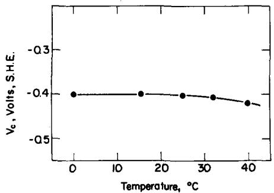
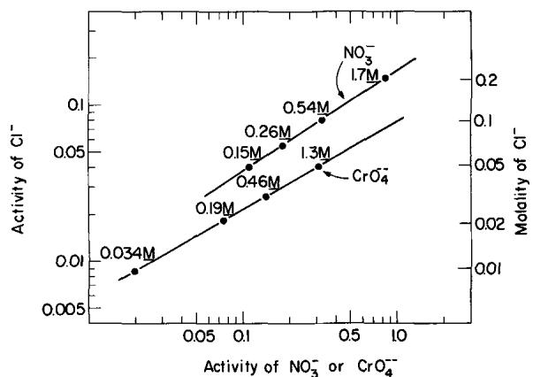
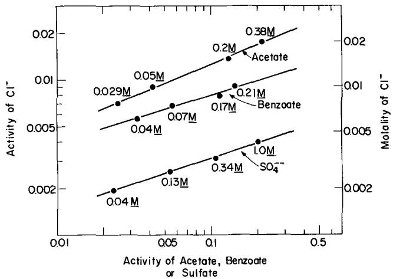
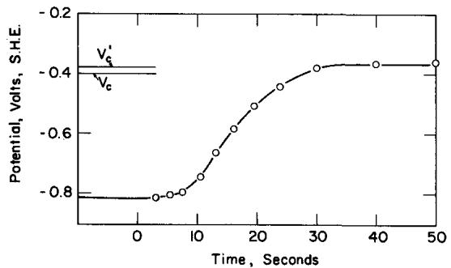
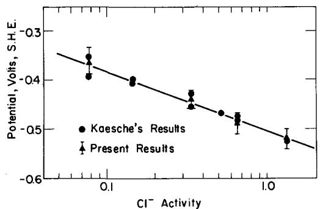
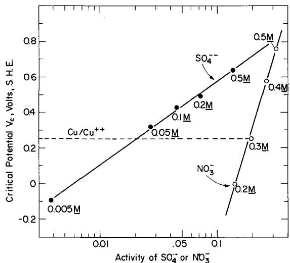
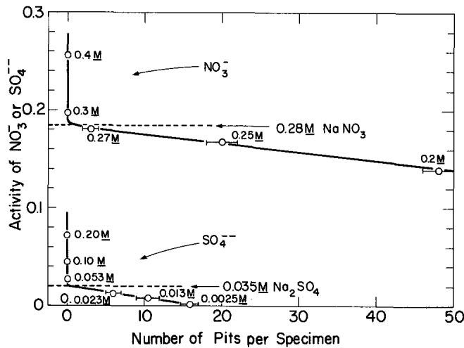

# Environmental Factors Affecting the Critical Pitting Potential of Aluminum

H. Böhni and H. H. Uhlig\*

Department of Metallurgy and Materials Science, Massachusetts Institute of Technology, Cambridge, Massachusetts

## ABSTRACT

The critical pitting potential determined potentiostatically of pure Al in 0.1N NaCl is —0.40V (SHE). This value is not greatly sensitive to temperature (0-40°C), to small alloying additions of Mn or Mg, nor to thickness of oxide film produced by anodizing. The value is more active the higher the Cl- concentration, but becomes more noble with additions to NaCl of nitrates, chromates, acetates, benzoates, or sulfates. The latter act as pitting inhibitors which are effective in the order as listed. Dissolved Cu+ + in trace amounts deposit on the Al surface as Cu which then acts as an efficient cathode, shifting the corrosion potential of aluminum to the critical pitting potential. Trace amounts of $\mathbf { F e } ^ { + } + + \mathbf { \Gamma }$ and Pd++ act similarly. Anodized surfaces effectively retard penetration of the oxide by Cu+ + thereby delaying onset of pitting, but they are not similarly effective when Al is coupled to Cu. The mechanism of pitting is interpreted in terms of competitive adsorption of Cl- with oxygen for sites on the metal surface. Extraneous anions compete in turn with $\mathbf { C l } ^ { \ceq }$ ions, making it necessary to shift the potential in the positive direction in order for Cl- to adsorb followed by pit initiation. Similarities in adsorption parameters of various anions other thân Cl- on Al and 18-8 stainless steel are pointed out.

Precise determination of the critical pitting potential of Al was first carried out by Kaesche (1) using both potentiostatic and galvanostatic techniques. He found that the potential above which, but not below, Al undergoes pitting corrosion in 1M NaCl is —0.48V [std. H2 scale (SHE)] which value is independent of pH between the interval pH 2-11. He also reported that the critical potential becomes more active (more negative) the higher the NaCl concentration between 0.1-4.0M NaCl. Bond et al. (2) measured the critical pitting potential for zone-refined Al in 0.5M NaCl in approximate agreement with the corresponding value reported by Kaesche.

Leckie and Uhlig (3) pointed out that the cathodic protection of aluminum, as usually practiced in aerated saline media, consists of polarizing Al only below the critical pitting potential and not below the open-circuit anode potential as is required for steel. In principle, therefore, zinc is a possible sacrificial anode for this purpose, but not iron. For stainless steels, on the other hand, pitting corrosion can be avoided in saline media such as sea water by coupling either iron or zinc, since either metal succeeds in polarizing the alloy below its critical pitting potential (0.21V).

In view of the importance of the critical potential to the application of Al to saline environments, data are reported herewith on the effect of temperature, of various anions and cations, of some alloying elements and of inhibiting salt concentrations on observed values. In addition, the mechanism of accelerated pitting by traces of Cu+ + is discussed.

## Experimental

For most of the measurements, 99.99% Al electrodes were employed measuring 1.5 cm long and 0.4 cm in diameter. One end of each electrode was drilled and tapped, allowing a threaded member attached to a nickel wire to hold the electrode firmly against a glass tube separated by a water-tight Teflon gasket. Only the electrode surface, totally immersed, Teflon, and glass made contact with the electrolyte. Specimens were polished to 3/0 emery paper followed by pickling in 2N NaOH at 80°C for 5 min and then washing in distilled water. A few measurements were also carried out on 99.4% Al and on alloys of 1.3%

Mn-Al and 2.4% Mg-Al all of which were supplied by courtesy of the Aluminum Company of America.

The all-glass cell as previously described (3) was placed in an air thermostat maintained at $\mathbf { 2 5 ^ { \circ } } \pm \mathbf { 0 . 2 ^ { \circ } C }$ Temperatures could also be maintained at some value above or below room temperature. At $0 ^ { \circ } \mathbf { C } ,$ the glass cell was placed additionally in a water-ice bath. The electrolyte was deaerated before measurements by bubbling through it purified $\mathbf { N _ { 2 } }$ previously passed over Cu turnings at 400°C.

The procedure was to polarize the electrode anodically within the passive region for 5 min at —0.80V vs. saturated calomel electrode (SCE) or —0.56V (SHE) using a Wenking potentiostat in conjunction with a chart recorder. This procedure achieved steadystate conditions before a step-by-step technique was applied by which the potential was increased 50 mV every 5 min and the corresponding current noted. The current remained relatively constant below the approximate critical potential $\mathbf { { \nabla } } V _ { \mathbf { { \mathbf { c } } } } ^ { \prime }$ (<1 μA/cm²), but increased sharply above by two or more orders of magnitude. These measurements in turn were supplemented by longer time runs maintaining a given potential near the critical value for at least 12 hr. The least noble value at which pits could not be observed under a low-power microscope was taken as the steady-state critical potential $\mathbf { \bar { v } _ { c } } .$ Reproducibility of steady-state values was better than ±15 mV. All potentials are reported with reference to the SHE.

As a check on some of the critical pitting potentials obtained as described, immersion tests were also run using pickled specimens of 99.4% Al measuring 1½ x ½ x 0.065 in. (3.8 x 1.3 x 0.17 cm). These were suspended by means of a nylon thread through a hole drilled in one end of the specimen and then placed in closed 250 ml flasks for a period of 1-14 days. After the test period, the number of pits on the two main faces of the specimen, visible under a low-power microscope, was counted.

## Results

Effect of temperature.—Temperatures between 0° and 40°C were found to have very little effect on the critical potential ${ \boldsymbol { \mathsf { v } } } _ { \mathsf { c } }$ as results of Fig. 1 show. These data are in contrast to the critical potentials for 18-8 stainless steel in 0.1M NaCl which are 0.6V more noble at 0°C than at 25°C (3). In other words, 18-8 stainless steel is much more resistant to pitting corrosion at low temperatures compared to room temperature, but susceptibility of aluminum is about the same. This temperature effect refers only to initiation of pits and not to rate of pit growth. Size of pits after a given time depends on the cathodic reaction rate, the latter in turn usually proceeding more rapidly the higher the temperature.

Metal analysis  
  
Fig. 1. Critical pitting potentials of 99.99% Al in 0.1M NaCl as a function of temperature.

Effect of anion concentration and alloying.—It is known that pitting of Al is pronounced in presence of chloride ions. In sulfates, on the other hand, Al electrodes can be polarized anodically without exhibiting a critical pitting potential or showing any evidence of pitting attack. In perchlorate solutions, however, pitting occurs, as well as in bromide and iodide solutions, although the pitting tendency is less pronounced than in chloride solutions.

The respective steady-state critical potentials in each environment are listed in Table I including the value in 0.5M NaCl reported by Bond et al. (2) and the nonsteady-state values reported earlier by Kaesche (1). The more active the critical potential, the greater is the tendency for pitting to occur. The effect of temperature is small in either 0.1M NaCl or NaBr.

Alloys of Al containing a small amount of Mg or Mn tend to pit more than does pure Al, although the shift of potential is small. For 99.4% Al, the critical potential is the same as for 99.99% Al within experimental error of the measurements. Porter and Hadden (4) reported that immersion tests in various supply waters showed that superpure Al tended to pit somewhat less than did Ai alloys, although the final pit depth was almost the same.

Added anions which do not of themselves cause pitting shift the critical potential of Al in halide solutions in the noble direction corresponding to improved corrosion resistance. This was shown previously to be true for stainless steels (3, 5). If extraneous salts are added in amount sufficient to shift the critical potential above the oxygen electrode potential in air approximating 0.8V, it is obvious that aluminum will no longer pit in an aerated solution of the electrolyte mixture since the corrosion potential cannot exceed the open-circuit cathode potential. Pitting could then occur only under conditions where passivity breaks down locally, such as in a crevice due to lack of oxygen and to high concentrations of chloride ion caused by electrochemical transport, or to decrease of pH caused by accumulation of AlCl3. Pitting otherwise would not be expected below the critical potential in any period of time for a crevice-free passive surface avoiding environmental gradients of the kind mentioned

Table I. Steady-state critical pitting potentials, $\pmb { \nu } _ { \alpha }$ vs SHE
<table><tr><td></td><td>Electrolyte</td><td>25°℃</td><td>0°℃</td></tr><tr><td>99.99% A1</td><td>0.1M NaCl 0.1M NaBr</td><td>-0.40 V</td><td>-0.41 V</td></tr><tr><td></td><td>0.1M NaClO₄</td><td>-0.29 0.0</td><td>-0.32</td></tr><tr><td></td><td>0.5M NaCl [Bond et al (2)]</td><td></td><td></td></tr><tr><td></td><td></td><td>-0.50</td><td></td></tr><tr><td></td><td>1M NaCl [Kaesche (1)]</td><td>-0.48*</td><td></td></tr><tr><td></td><td>1M KBr [Kaesche (1)]</td><td>-0.35*</td><td></td></tr><tr><td></td><td></td><td></td><td></td></tr><tr><td></td><td>1M KI {Kaesche (1)]</td><td>-0.20*</td><td></td></tr><tr><td>99.4% A1</td><td>0.1M NaCl</td><td>-0.41</td><td></td></tr><tr><td>1.3% Mn-A1 2.4% Mg-A1</td><td>0.1M NaCl 0.1M NaCl</td><td>-0.45 -0.44</td><td></td></tr></table>

<table><tr><td colspan="7"></td></tr><tr><td></td><td>%Cu</td><td>%Si</td><td>%Fe</td><td>%Mn</td><td>%Mg</td><td>%Cr</td></tr><tr><td>99.99% A1</td><td>0.0039</td><td>0.0016</td><td>0.0007</td><td></td><td>0.0005</td><td></td></tr><tr><td>99.4% A1</td><td>0.1</td><td>0.08</td><td>0.48</td><td>0.004</td><td>0.0004</td><td>0.002</td></tr><tr><td>1.3% Mn-A1</td><td>0.006</td><td>0.002</td><td>0.002</td><td>1.3</td><td>0.001</td><td></td></tr><tr><td>2.4% Mg-Al</td><td>0.04</td><td>0.08</td><td>0.16</td><td>0.02</td><td>2.43</td><td>0.23</td></tr></table>

• Values approximate but are not truly steady-state values.

  
Fig. 2. Relation of minimum activities (or concentrations) of sodium nitrate or of sodium chromate required to inhibit pitting of 99.99% Al in aerated sodium chloride solutions.

It was shown earlier for stainless steels that the logarithm of the activity of an extraneous anion necessary to shift the potential to an arbitrary noble value accompanied by inhibition of pitting in aerated solutions, is linear with the logarithm of the corresponding chloride ion activity. This relation is also found to hold for Al, as is shown by data for sodium nitrate and sodium chromate additions (Fig. 2) and for sodium sulfate, sodium benzoate and sodium acetate additions (Fig. 3), where the critical potential is shifted to 0.8V (SHE) in each case. In calculating ionic activities, the corresponding activity coefficients were taken from Latimer (6) for pure sodium salts omitting corrections for total ionic strength of the solutions. Since activity coefficients for sodium acetate and sodium benzoate were not listed, they were approximated by corresponding values for rubidium acetate at and above 0.1M and by NaCl below. Values for Na₂CrO₄ solutions were taken from Robinson and Stokes (7) above 0.1M and approximated by values for $\bf N a _ { 2 } S O _ { 4 }$ for the one lower concentration.

  
Fig. 3. Relation of minimum activities (or concentrations) of sodium acetate or sodium benzoate or sodium sulfate required to inhibit pitting of 99.99% Al in aerated sodium chloride solutions

The mixtures of electrolytes were not adjusted to constant pH in view of the fact that both our measurements and those previously reported by Kaesche showed no appreciable effect of pH on the critical potential. Molybdates and tungstates were also tried as inhibiting anions, but these substances were probably reduced to insoluble oxides at the aluminum surface and hence led to irreproducible results. Equations representing inhibiting activities of the various successful anions are as follows:

$$
\log { \left( \mathbf { C l } ^ { - } \right) } = 0 . 6 5 \log { \left( \mathrm { N O _ { 3 } } \right) } - - 0 . 7 8\tag{[1]}
$$

$$
\mathsf { l o g } \left( \mathrm { C I ^ { - } } \right) = 0 . 5 6 \log \left( \mathrm { C r O _ { 4 } } ^ { - - } \right) - 1 . 1 1\tag{[2]}
$$

$$
\mathsf { l o g ~ ( C l ^ { - } ) } = 0 . 4 1 \mathrm { ~ l o g ~ ( a c e t a t e ^ { - } ) } - 1 . 5 0\tag{[3]}
$$

$$
\mathbf { l o g \ ( C l ^ { - } ) } = 0 . 3 0 \log { ( \mathrm { b e n z o a t e ^ { - } ) } } - 1 . 8 0\tag{[4]}
$$

$$
\mathrm { { l o g } ~ ( C l ^ { - } ) = 0 . 3 1 \log ~ ( S O _ { 4 } ^ { -- } ) - 2 . 1 9 }\tag{[5]}
$$

Accordingly, the efficiency of inhibition within the present chloride concentration range decreases in the order: $\Delta { \bf N } \mathsf { O } _ { 3 } - { \bf \Phi } > { \bf C r O } _ { 4 } - { \bf \Phi } > $ acetate $>$ benzoate $>$ $\ S O _ { 4 } - \sim$

Effect of heavy metal ions.—It is well known that traces of $\mathtt { C u } ^ { + + }$ greatly accelerate the pitting of Al exposed to potable or industrial waters. Water passing through copper or brass piping, for example, picks up sufficient $\bar { \mathrm { C u ^ { + } } } { ^ { + } }$ to damage Al surfaces downstream. The mechanism of accelerated pitting is apparently, first, the deposition of metallic Cu on the Ai surface by a replacement reaction, the sites of which act as pit nuclei. Second, the Cu sites become cathodes for the efficient reduction of dissolved ${ \sf O } _ { 2 }$ or of any other suitably reducible species in solution, thereby polarizing Al to the critical potential at which anodic corrosion or pitting takes place. The potential reached is slightly more noble than, but does not appreciably exceed the critical value, however vigorous the pit growth, because of the small anodic polarizability of nonpassive Al within the pits (cathodic control). The time required for the shift from corrosion potential to critical potential is about 30 sec for 5 ppm $\dot { \mathrm { C u } } ^ { + + }$ additions to 0.1M NaCl as shown by data of Fig. 4. For 5 ppm Pd+ + addition, which behaves similarly, the time required is less, and for 5 ppm $\mathtt { F e ^ { + + + } }$ addition the time is longer, but the same critical pitting potential is reached in each case.

The above facts suggest that a suitable approach to measuring critical potentials in a given saline solution is to determine the corrosion potential in presence of a small concentration of $\mathtt { C u } ^ { + \bar { + } }$ The relevance of this technique to measuring critical potentials as a function of NaCl concentration is summarized in Fig. 5. As was shown previously for 18-8 stainless steel (3), the critical potentials for Al are linear with logarithm of ${ \bf C 1 ^ { - } }$ activity. Comparative data obtained by Kaesche using a different technique are included, showing good accord with present measurements. Either set of data follows the equation

$$
V _ { \mathrm { ~ c ~ } } ^ { \prime } ( \mathrm { v o l t s , S H E } ) = - 0 . 1 2 4 \log { \left( \mathrm { C l ^ { - } } \right) } - 0 . 5 0 4\tag{[6]}
$$

  
Fig. 4. Change of corrosion potential with time on immersion of 99.99% Al in 0.1N NaCl plus 5 ppm $C u ^ { + + } , 2 5 ^ { \circ } C .$ Critical potentials ${ \pmb v } _ { \mathbf { c } }$ and ${ \pmb v } _ { \textrm { c } } ^ { \prime }$ are potentiostatic values.

  
Fig. 5. Corrosion potentials of 99.99% Al in various activities of NaCI containing 5 ppm $\mathbb { c } _ { \pm } + \mathrm { \Delta } ^ { + }$ in comparison with critical pitting potentials determined by Kaesche.

Since the critical potentials calculated by this equation, for reasons stated earlier, are slightly more noble than the steady state values, they more nearly accord with the continuous polarization values ${ \bf { { V } } } _ { \bf { { c } } } ^ { \prime }$ (continuous shift of potential to more noble values). For example, the critical potential for 0.1M NaCl (γ = 0.78) calculated by the equation $\mathbf { i s } - 0 . 3 7 \nabla$ compared to the steady-state value —0.40V given in Table I.

The success of the above-described method for measuring critical potentials suggested that the effect of inhibiting anions could also be investigated in like manner. In carrying out such measurements, a higher concentration of $\begin{array} { r l } { \breve { \mathbf { C } } \mathbf { u } ^ { + } + } & { { } ( 2 . 5 ~ \mathbf { x } ~ 1 0 ^ { - 3 } M ~ \mathbf { o r } } \end{array}$ 159 ppm $\mathtt { C u } ^ { + + } )$ was found to be advisable in order to stimulate growth of pits that are nucleated at the critical potential, therefore making it easier to count their number. Figure 6, for example, shows that $\mathbf { N a _ { 2 } S O _ { 4 } }$ additions to 0.005M NaCl shift the resultant critical potentials for Al, as determined potentiostatically, in the noble direction. The equilibrium potential for Cu $\mathtt { C u ^ { + + } + 2 e } ,$ on the other hand, corresponding to 2.5 x $1 0 ^ { - 3 } M \ \dot { \mathrm { C u S O } _ { 4 } }$ is equal to 0.337 + (0.059/2) log (2.5 x $1 0 ^ { - 3 } \textbf { x } 0 . 7 ) \ = \ 0 . 2 5 6 \mathrm { { V } }$ where 0.7 is the approximate activity coefficient of the $\mathtt { C u S O _ { 4 } }$ solution (6). The calculated potential is relatively insensitive to the actual value chosen for the activity coefficient. Hence if the electrolyte is deaerated with nitrogen, $\mathrm { { { C u ^ { + } } ^ { + } } }$ reduction is the only relevant cathodic reaction and pitting is therefore expected only below a $\mathbf { S } { \mathsf { O } } _ { 4 } - { \mathsf { \Omega } } \mathbf { a c t i v i t y }$ of 0.02 corresponding to 0.035M Na2SO4. To check this prediction, specimens of 99.4% A1 (same approx. critical potential as pure Al) were immersed in 0.005M NaCl containing various additions of $\mathbf { N a _ { 2 } S O _ { 4 } }$ plus 2.5 x 10-3M CuSO4, the results of which are shown in Fig. 7. Many of the pits, when observed after an immersion period of 24 hr, were localized on the specimen edges, but for convenience only those were counted on the two main faces. When pitting was not observed on either face or edges, the test was usually continued beyond 24 hr to the order of two weeks so as to confirm that no pitting had taken place.

  
Fig. 6. Critical pitting potentials, determined potentiostatically, of AI in 0.005M NaCI with ${ \mathsf { N a s S O } } _ { 4 }$ additions, and in 0.1M NaCl with $N a N O _ { 3 }$ additions, $2 5 \circ _ { \bf C }$

  
Fig. 7. Number of pits per specimen after immersing 99.4% Al in 0.005M NaCl with $N a _ { 2 } S O _ { 4 }$ additions, and in 0.1M NaCl with $N a N O _ { 3 }$ additions, 24 hr, $2 5 \circ \mathsf { C }$

As the results show, the intersection of the line connecting points for the $\bf N a _ { 2 } S O _ { 4 }$ concentrations which induce pitting, with the line for zero pitting occurs at an activity of $\mathsf { S O 4 ^ { - - } }$ equal to 0.02. This value agrees with the inhibiting activity predicted by data of Fig. 6. Similar good agreement was found between predicted and observed inhibiting concentrations of $\bf N a N O _ { 3 }$ added to 0.1M NaCl (Fig. 6 and 7).

The amount of extraneous salt needed to inhibit pitting depends on the applied potential as data of Fig. 6 show. Hence the amount of sulfate which is required to inhibit pitting in presence of $\mathtt { C u } ^ { + + }$ at a cathode potential of 0.26V is less than that required in presence of dissolved air at 0.8V. The latter situation is described by Fig. 3.

Effect of cations.—Since anions have a large effect on the critical potential, it is of interest to know whether the type and valence of cations also have an influence. The effect of calcium ion was investigated by measuring through continuous potentiostatic polarization curves the critical potentials of 99.99%Al in 5 concentrations of CaCl2 from 0.05 to 1.0M. The dependence of the critical potential $\nabla _ { \mathbf { \mathbf { c } } } ^ { \prime }$ on logarithm of chloride ion activity followed the same linear equation within expected experimental variations as that derived for NaČl (Eq. [6]). Hence it is concluded that a divalent cation like $\dot { \mathbf { C } } \mathbf { a } ^ { + + }$ has no special effect on the critical potential compared to a monovalent ion like $\mathbf { N a } +$ . Subsequent measurements were carried out in 0.1N KCl, RbCl, CsCl, SrCl2, BaCl2, and LaCl3. Observed steady-state critical potentials corrected to the same approximate Cl- activity, using the equation cited above, were all the same within less than 20 mV, hence only the Cl- activity appears to be important. However, continuous polarization runs (50 mV/5 min) gave nonsteady-state critical potentials for $\mathbf { B a C l _ { 2 } }$ and CsCl which were about 70 mV more noble than for the other chlorides listed above. Although this peculiar effect of $\mathbf { B } \hat { \mathbf { a } } ^ { + + }$ and ${ \bf C } { \bf s } ^ { + }$ was not investigated further, it is perhaps caused by the double layer reaching its equilibrium structure much slower when large cations like $\mathbf { B } \hat { \mathbf { \textmd a } } ^ { + + }$ and Cs+ are involved compared to the situation for smaller cations.

## Discussion

The critical potential has been explained in terms of ${ \bf C 1 ^ { - } }$ penetrating an oxide film which covers the metal surface (8, 9) or in terms of competitive adsorption of ${ \bf C 1 ^ { - } }$ and oxygen for sites on the metal surface (3, 5). Aluminum provides an excellent opportunity to evaluate the influence of an oxide film because of the well-established procedure for increasing oxide film thickness by anodizing. The thicker the oxide film, presumably the smaller is the electric field impelling Cl- to penetrate it and the longer is the diffusion path of ${ \tt C 1 ^ { - } }$ from electrolyte to metal surface. These factors, if relevant, should combine to produce a more noble critical pitting potential. $\mathtt { o n }$ the other hand, if competitive adsorption at the metal surface is the mechanism, the thickness of any overlying oxide film would have no bearing on the steady-state potential at which Cl- displaces adsorbed oxygen.

Aluminum specimens of 99.99% purity were anodized in 15% $\bf { H _ { 2 } S O _ { 4 } }$ at 25 mA/cm² for specific times, then washed and sealed in distilled water at ${ \mathfrak { g } } 0 ^ { \circ } { \dot { \mathbf { C } } }$ for ½ hr. Thickness of oxide produced by anodizing was estimated from values reported by Hoar and Wood (10). Steady-state critical potentials were determined by potentiostatic polarization in 0.1M NaCl. Although continuous polarization runs showed a slightly more noble value (—0.33V) for anodized electrodes, the same steady-state value $\mathbf { - 0 . 3 9 V }$ was obtained both for an oxide film 0.3 and $1 . 4 \mu$ thick, compared $\mathrm { \bf t o } - { \bf 0 . 4 0 } \tt V$ for aluminum not anodized. The latter values are the same within the usual experimental variations of such measurements. They support the view, therefore, that the mechanism of competitive adsorption is in better accord with the facts, and they also provide evidence that any improved resistance of anodized aluminum to pitting corrosion does not result from a shift of the critical potential.

Davies (11) reported improved resistance to pitting corrosion of anodized aluminum immersed in a solution containing 30 ppm $\mathbf { C 1 ^ { - } } ,$ 40 ppm $\mathbf { C a } ^ { + } ,$ and 0.2 ppm $\mathtt { C u } ^ { + + }$ . No pits appeared in two weeks time, contrary to unanodized specimens which pitted in a much shorter period. These results suggest that the anodized oxide film is a good diffusion barrier to $\mathtt { C u } ^ { + + }$ ions even though it is not successful in preventing diffusion of Cl- ions. This matter was checked by anodizing 99.99% Al specimens to a film thickness of $\pmb { 1 . 4 \mu }$ and sealing in $\mathbf { H _ { 2 } O }$ at 90°C for 1 hr. They were then immersed in 0.1M NaCl containing $\mathbf { 2 . 5 { \overset { \cdot } { \circ } } x 1 0 ^ { - 3 } M \ C u ^ { + } } +$ at 25°C. Two specimens were coupled to an equal area of copper; these showed evidence of pitting after 2 hr, with many deep pits visible after 24 hr. Two specimens not coupled were free of pits after 24 hr, in line with Davies' longer time observations.

The above results show therefore that $\mathtt { C u } ^ { + + }$ must penetrate the oxide film in order to deposit suitable cathodic sites of metallic Cu before pitting is observed in short-time tests. To this end, anodized Al is better than unanodized Al. They also show that anodized films have no particular merit in preventing pitting corrosion whenever aluminum is coupled to a more cathodic metal like Cu.

The high-temperature coefficient of the critical potential for austenitic stainless steels reported previously (3, 12) was attributed to sensitivity of the double layer structure to temperature, caused perhaps by variable hydration of the passive film and of ions located within the double layer. A negligible temperature effect for Al suggests that it is not the temperature-sensitive hydration of ions that is important so much as the temperature-sensitive hydration and structure of the passive film in the case of 18-8, and the absence of such an effect for the passive film on Al.

The role played by various cations is not important probably because characteristically they do not adsorb at prevailing potentials, and hence their effect on the double layer and on passive film structure is minimal. The behavior of extraneous anions to inhibit pitting is similar to the behavior noted previously for 18-8 stainless steel for which inhibiting efficiency, as for $\mathbf { A l } ,$ decreases in the order $\mathrm { N O _ { 3 } ^ { - } } > \mathrm { \bar { A } c ^ { - } } > \mathrm { S O _ { 4 } ^ { - - } }$ . The data for inhibition of 18-8 by $\mathrm { { N O } _ { 3 } - }$ and ${ \tt S O } _ { 4 } \mathrm { { ^ - - } }$ were previously reported by Leckie and Uhlig (3); for acetates the data were presently obtained using the same potentiostatic technique and the same stainless steel as was used formerly. The equation representing activity of acetate necessary to inhibit pitting of 18-8 in a given activity of ${ \bf C l ^ { - } }$ ranging from 0.05 to 0.2M NaCl is

Table I1. Ratios of n appearing in Freundlich adsorption isotherm
<table><tr><td colspan="3">Observed ratios</td><td rowspan="2"> $\pmb { n } \mathrm { c } _ { 1 } \mathrm { - } / \pmb { n } _ { \mathrm { A c } } \mathrm { - }$ </td><td rowspan="2"> $n _ { \mathrm { { S O } _ { 4 } } ^ { - - } } / n _ { \mathrm { { N O } _ { 3 } } ^ { - } }$ </td><td rowspan="2">Calc. ratios  $ { n _ { \mathrm { A c } } }  { - } /  { n _ { \mathrm { N 0 } _ { 3 } } }  { - }$ </td><td rowspan="2"> $n _ { \mathrm { S } 0 _ { 4 } } \mathrm { - } \mathrm { - } / n _ { \mathrm { A } } \mathrm { - } _ { \mathrm { c } }$ </td></tr><tr><td></td><td> $n { \bf c } _ { 1 } { - } / n { \bf v } _ { 3 } { - }$ </td><td> $\ddot { n } \mathrm { c } _ { 1 } \mathrm { - } / n \mathrm { s } _ { 0 _ { 4 } } \mathrm { - - }$ </td></tr><tr><td>18-8 Al</td><td>1.88 0.65</td><td>0.85 0.31</td><td>1.12 0.41</td><td>2.21 2.10</td><td>1.68 1.59</td><td>1.32 1.32</td></tr></table>

$$
\log { ( \mathrm { C l ^ { - } } ) } = 1 . 1 3 \log { ( \mathrm { A c ^ { - } } ) } + 0 . 0 6\tag{[7]}
$$

The above log-log relationship was derived by Matsuda and Uhlig (13) on the basis of the Freundlich adsorption isotherm; $a _ { 1 } = k _ { 1 } ( \mathrm { A n i o n } ) ^ { 1 / n _ { 1 } }$ where (Anion) is the anion activity in solution, a1 is the quantity of anion adsorbed per unit area, and k1 and n1 are constants. It was shown that the coefficient of the log $( \mathsf { A } \mathsf { c } ^ { - } )$ term in the above Eq. [7] is then equal to $n _ { \mathrm { C l } ^ { - } } / n _ { \mathrm { A c } ^ { - } } .$ The values of this ratio are in general larger for 18-8 than for Al, corresponding to a greater tendency for Cl- to adsorb on Al than on 18-8. Interestingly, the ratio of n's for any pair of ions not involving Cl- are similar for both Al and 18-8. This is shown by the derived values listed in Table II. For example, $n _ { \mathrm { S 0 4 } } \mathrm { ~ -- ~ } / n _ { \mathrm { N 0 3 } } -$ obtained by dividing $n _ { \mathrm { { C l } } ^ { - } } / n _ { \mathrm { { N O 3 } ^ { - } } }$ by $n _ { \mathrm { C l } ^ { - } } / n _ { \mathrm { S } 0 4 ^ { - - } }$ is 2.21 for 18-8 and 2.10 for Al. The similarity of these ratios for anions other than Cl- point to the unique adsorption behavior of Cl- which is also the anion among those presently considered which is responsible for observed pitting corrosion.

## Acknowledgment

The authors are pleased to acknowledge support of this research by the Office of Saline Water, U.S.

Department of the Interior. One of the author's (H.B.) is furthermore grateful for a travel grant awarded by Stiftungen auf dem Gebiete der Chemie, Basle, Switzerland.

Manuscript submitted Oct. 17, 1968; revised manuscript received ca. Jan. 28, 1969. This was Paper 388 presented at the Montreal Meeting, Oct. 6-11, 1968.

Any discussion of this paper will appear in a Discussion Section to be published in "the June 1970 JOURNAL.

## REFERENCES

1. H. Kaesche, Z. physik. Chem. N.F., 34, 87 (1962).

2. A. Bond, G. Bolling, and H. Domian, This Journal, 113, 773 (1966).

3. H. Leckie and H. Uhlig, ibid., 113, 1262 (1966).

4. F. Porter and S. Hadden, J. Appl. Chem. (London), 3,385(1953).

5. Y. Kolotyrkin, Corrosion, 19, 261t (1963).

6. W. Latimer, "Oxidation Potentials," Prentice-Hall, New York (1952).

7. R. Robinson and R. Stokes, "Electrolyte Solutions," p. 486, Academic Press, New York (1955).

8. M. Streicher, This Journal, 103, 375 (1956).

9. T. Hoar, D. Mears, and G. Rothwell, Corrosion Sci., 5,279′(1965).

10. T. Hoar and G. Wood, Electrochim. Acta, 7, 333 (1962).

11. D. Davies, J. Appl. Chem. (London), 9, 651 (1959)

12. J. Horvath and H. Uhlig, This Journal, 115, 791 (1968).

13. S. Matsuda and H. Uhlig, ibid., 111, 156 (1964).

# Electrochemical Ellipsometric Study of Gold

R. S. Sirohi and M. A. Genshaw

Electrochemistry Laboratory, University of Pennsylvania, Philadelphia, Pennsylvania

## ABSTRACT

The application of ellipsometry and electrochemical techniques to the oxidation of gold reveals that a chemisorbed species is formed in the potential region 0.2-1.1V vs. SCE in acidic solution with gold oxide formed at more anodic potentials. In alkaline solution the chemisorbed species formed in the potentíal $\mathrm { \ r e g i o n \ - 0 . 8 \ t o \ + 0 . 2 V }$ vs. SCE with oxide formation at more anodic potentials. Evidence supporting a change in the optical properties of the oxide film with pH and, for alkaline solution, with the presence of chloride ions, is presented.

The electrochemical oxidation of gold has been a topic of interest for many years (1-11). This oxidation leads to the formation of chemisorbed oxygen (1, 5, 7) or gold oxide (1-6, 8-10) with the initial formation of this film occurring about 1.27-1.37V (1, 3, 4, 7-10) vs. a reversible hydrogen electrode (RHE). Reduction of the film commences at potentials between 1.2 and 1.37V (4, 6-8, 9, 10) vs. RHE. The potential of oxidation and reduction varies by —2.3 RT/F (3-5, 8, 9) per unit pH. The thickness of the film is of the order of a monolayer, but at potentials more anodic than 1.8 $( 7 ,$ $1 0 ) - 1 . { \overset { \vartriangle } { 9 } } 5 { \overset { \vartriangle } { \ v { v } } }$ (8), a thick oxide film forms.

Inflections in charging curves, which could not be reproduced by later workers (5-10), were attributed to successive formation of $\mathbf { A u _ { 2 } O _ { 3 } }$ AuO, and $\mathrm { { \bf A u _ { 2 } O _ { 3 } } \Sigma ( 4 ) }$ Two arrests in film reduction have been attributed to $\mathbf { A u _ { 2 } O _ { 3 } }$ and AuOH or AuO (2, 12).

In acidic chloride solutions passivation is observed, with the passivation time dependent on the concentration of chloride (13-17), indicating that passivation occurs when the surface concentration of chloride approaches zero.

An ellipsometric study of gold oxidation in sulfuric acid solutions, some with added oxalate, has been reported (18).

To gain further insight into the nature of the film formed at gold on electrochemical oxidation, this study, which combines optical and electrochemical measurements, was initiated.

Ellipsometry is the measurement of changes introduced in the polarization state of light by reflection from metal or metal oxide surface. The reflected light is analyzed for its polarization state, giving the relative phase retardation ∆ and relative amplitude di-