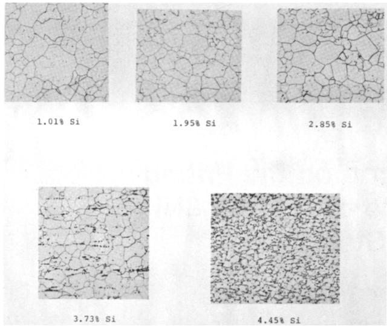
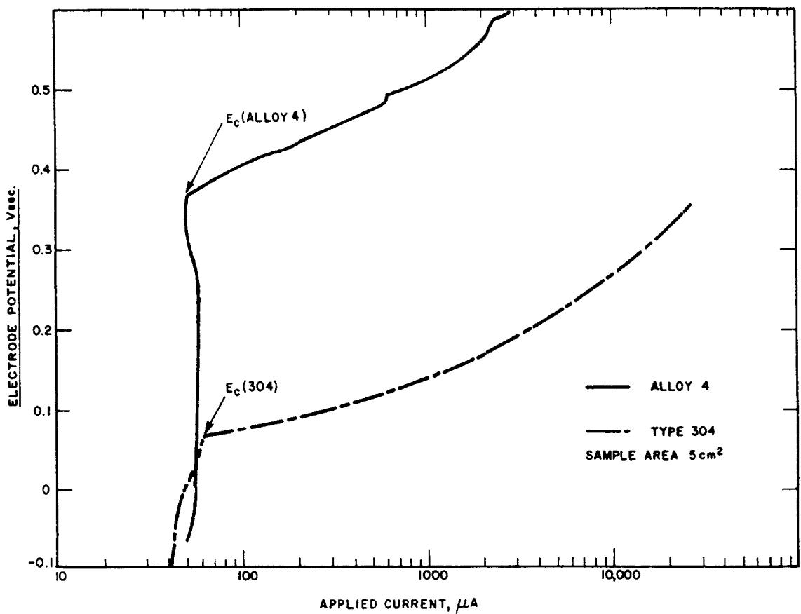
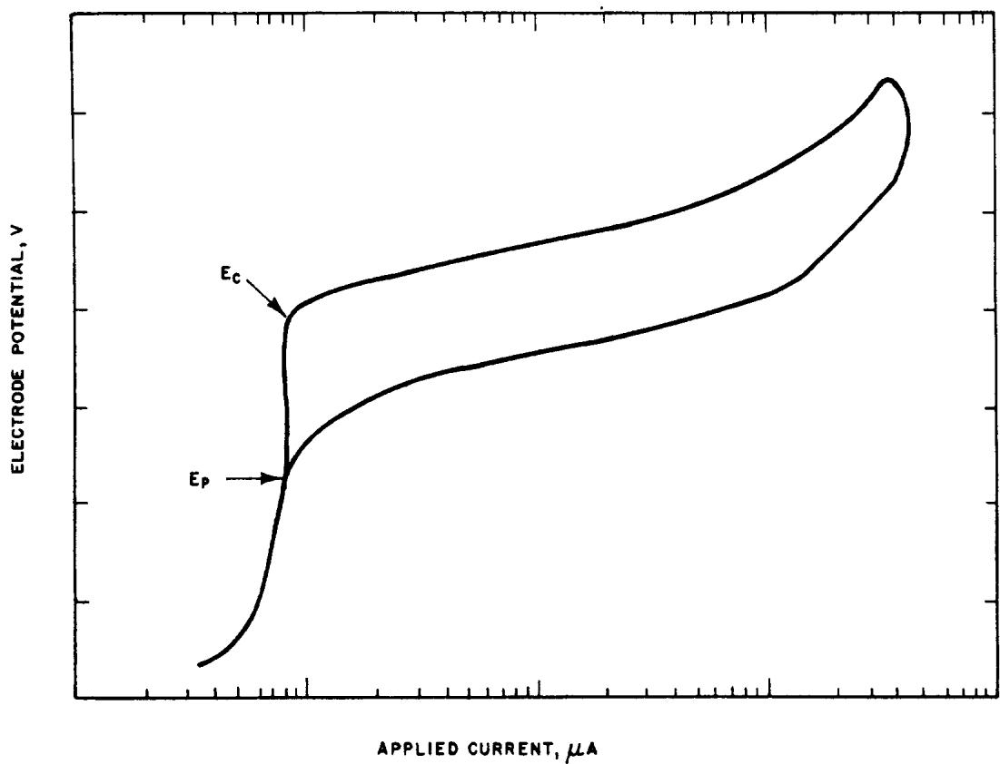
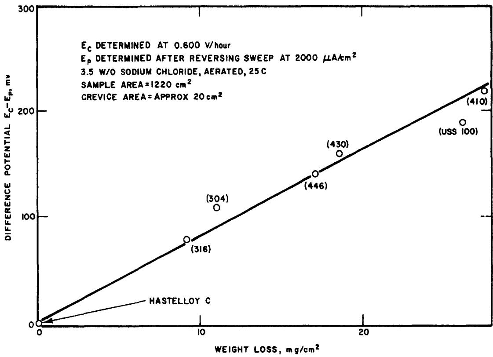

No. 9, p. 12-1, 1980.

16. J. B. Lumsden, R. W. Staehle, Scripta Met., Vol. 6, p. 1205, 1972.

17. K. Sugimoto, Y. Sawada, Corros. Sci., Vol. 17, p. 425, 1977.

18. A. P. Bond, E. A. Lizlovs, J. Electrochem. Soc., Vol. 115, p. 1130, 1968.

19. J. R. Ambrose, Passivity of Metals, R. P. Frankenthal, J. R. Kruger, Eds., Electrochemical Society, Pennington, New Jersey, p. 749, 1978.

20. K. Hashimoto, K. Asami, Corros. Sci., Vol. 19, p. 251, 1979.

21. M. Da Cunha Belo, B. Rondot, F. Pons, J. Lehericy, J. P. Langeron, J. Electrochem. Soc., Vol. 124, p. 1317, 1977.

22. M. Seo, Y. Matsumara, N. Sato, Trans. JIM, Vol. 20, p. 501, 1979.

23. D. R. Lamb, Electrical Conduction Mechanisms in Thin Insulating Films, Methuen, London, 1967.

24. L. Nevot, P. Croce, Rev. Phys. Appl., Vol. 15, p. 761, 1980.

25. Y. Katsuta, A. E. Hill, A. M. Phale, J. H. Calderwood, Thin Solid Films, Vol. 8, p. 53, 1973.

26. S. Kondo, M. Muroya, H. Fujiwara, N. Yamaguchi, Bull. Chem. Soc. Jap., Vol. 46, p. 1362, 1973.

27. E. M. Snow, A. S. Grove, B. E. Deal, D. T. Sah, J. Appl. Phys.,

Vol. 36, p. 1664, 1965.

28. S. R. Hoffstein, IEEE Trans. Electronic Devices, Vol. 13, p. 222, 1966.

29. S. M. Sze, Physics of Semiconductor Devices, John Wiley and Sons, New York, New York, 1981.

30. C. Y. Chang, S. M. Sze, Solid State Electronics, Vol. 13, p. 727, 1970.

31. A. I. Gubanov, Soviet Physics Solid State, Vol. 3, p. 2436, 1961.

32. K. Hashimoto, M. Naka, K. Asami, T. Masumoto, Corros. Sci., Vol. 19, p. 165, 1979.

33. G. M. Bulman, A. C. C. Tseung, Corros. Sci., Vol. 13, p. 531, 1973.

34. N. Sato, K. Kudo, Electrochim. Acta, Vol. 16, p. 447, 1971.

35. N. Sato, K. Kudo, R. Nishimura, J. Electrochem. Soc., Vol. 123, p. 1419, 1976.

36. "Surface et Interfaces," C.N.R.S. Report Mat. 7, Centre Nationale de la Recherche Scientifique, Toulouse, France, March 1985.

37. F. M. Delnick, N. Hackerman, Passivity of Metals, R. P. Frankenthal, J. R. Kruger, Eds., Electrochemical Society, Pennington, New Jersey, p. 116, 1978.

# The Influence of Silicon on the Pitting Corrosion Resistance of an 18Cr-8Ni Stainless Steel\*

B. E. WILDE\*

## Abstract

This paper describes the effect of silicon additions to an 18Cr-8Ni stainless steel (SS) on the resistance to pit initiation in halide media. Electrochemical polarization measurements conducted in aerated 3.5 wt% sodium chloride at 25 C indicate a progressive increase in the critical breakdown potential (Ec) for 18Cr-8Ni alloys over the range 1.01 to 4.45 wt% silicon (0 to 17% δ-ferrite), thereby predicting increasing resistance to pit initiation. Pitting corrosion tests conducted in acidified 10% ferric chloride solution confirmed the trends predicted from electrochemical studies. Corrosion rates decreasing from 1016 to 50 mdd were observed over the silicon range of 1.01 to 4.45 wt%. The latter figure was approximately 20 times better than that observed on AISI 304 SS.

Analysis of cyclic potentiodynamic anodic polarization curves revealed that although a significant increase in pit initiation resistance was observed on the duplex alloys, increasing silicon additions (and δ-ferrite content) may increase their susceptibility to crevice corrosion.

## Introduction

Currently available austenitic stainless steels (SSs) have varying resistances to localized corrosion, although they exhibit excellent resistance to general corrosive attack. For example, AISI 304 SS exhibits excellent general corrosion resistance in many applications, but is susceptible to chloride stress corrosion cracking (SCC), pitting, and intergranular attack (IGA) when heat treated to precipitate intergranular chromium carbides (sensitized). On the other hand, AISI 316 SS exhibits excellent resistance to general and pitting corrosion, but is susceptible to chloride SCC and, when sensitized, to IGA. To overcome some of the above limitations and improve the resistance of 18Cr-8Ni SSs to localized attack, a program has been initiated in which silicon additions were made to produce alloys with duplex microstructures (austenite and ferrite). Thus far, investigations have indicated that the resistance of these silicon-stabilized duplex alloys to general acid corrosion,1 chloride SCC,² and intergranular corrosion (IGC) in the sensitized heat treated condition³ is markedly superior to that of any currently available commercial austenitic SS.

This paper describes some of the results of this program, namely, the resistance of silicon duplex 18Cr-8Ni alloys to pitting corrosion in sodium chloride and acidified ferric chloride solutions.

## Materials and Experimental Work

Experimental alloys were made in a 500 Ib (227 kg) vacuum furnace. The ingots were hot rolled down to a 0.5-in. thick (1.27-cm) plate and then cold rolled to a 0.25-in.-thick (0.64-cm)

TABLE 1 — Chemical Composition of Alloys Used (wt%)
<table><tr><td>Alloy Designation</td><td>C</td><td>Mn</td><td>P</td><td>S</td><td>Si</td><td>Cu</td><td>Ni</td><td>Cr</td><td>Mo</td><td>N</td><td>AI</td><td>δ-Ferrite (%)</td></tr><tr><td>1</td><td>0.055</td><td>1.53</td><td>0.006</td><td>0.014</td><td>1.01</td><td>0.09</td><td>8.83</td><td>17.3</td><td>0.019</td><td>0.039</td><td>0.007</td><td>&lt;1</td></tr><tr><td>2</td><td>0.054</td><td>1.49</td><td>0.006</td><td>0.015</td><td>1.95</td><td>0.09</td><td>8.87</td><td>17.1</td><td>0.020</td><td>0.038</td><td>0.012</td><td>&lt;1</td></tr><tr><td>3</td><td>0.059</td><td>1.49</td><td>0.005</td><td>0.014</td><td>2.85</td><td>0.09</td><td>8.94</td><td>17.2</td><td>0.020</td><td>0.036</td><td>0.015</td><td>1.7</td></tr><tr><td>4</td><td>0.059</td><td>1.49</td><td>0.005</td><td>0.013</td><td>3.73</td><td>0.09</td><td>9.06</td><td>17.0</td><td>0.021</td><td>0.033</td><td>0.018</td><td>7.5</td></tr><tr><td>5</td><td>0.060</td><td>1.49</td><td>0.005</td><td>0.014</td><td>4.45</td><td>0.09</td><td>9.07</td><td>17.0</td><td>0.020</td><td>0.032</td><td>0.020</td><td>17.0</td></tr><tr><td>AISI 304</td><td>0.078</td><td>0.47</td><td>0.030</td><td>0.008</td><td>0.41</td><td>ND(1)</td><td>9.81</td><td>18.45</td><td>ND</td><td>ND</td><td>0.080</td><td>0.0</td></tr></table>

(1)ND = not determined.

  
FIGURE 1 — Metallographic structure of the sensitized [1150 F (620 C) 24 h] experimental alloys: 10% oxalic acid etch (100X).

plate. The cold-rolled plate was solution annealed at 2000 F (1092 C) for 60 min and quenched in flowing water. The final chemical compositions are given in Table 1, along with those of the alloys tested for comparison. The typical microstructures of the experimental alloys are shown in Figure 1, from which the changes in grain size and δ-ferrite content can readily be seen. The residual δ-ferrite content was close to that predicted by the Schaeffler diagram4 (see Table 1), and no evidence of a sigma phase was noted during x-ray examination.

Specimens for electrochemical measurements were machined from annealed stock in the form of cylinders, 0.25-in. dameter by 0.75-in. long (0.625 by 1.9 cm). Each specimen was polished to a 600 grit SiC finish and mounted on a Teflon(1) compression gasket.⁵ Specimens were then degreased in an ultrasonic cleaner, pickled in 25 vol% ${ \mathsf { H N O } } _ { 3 } / 4$ vol% HF at 140 F (60 C) for 5 min, washed in distilled water (7.6 megohm-cm at 25 C), and hot air dried. Before polarization, the mounted electrodes were painted at the Teflon/steel interface with an alkyd varnish to avoid interference from crevice corrosion. Electrochemical tests were conducted in aerated 3.5 wt% NaCl made from reagent grade chemicals and distilled water. The precise experimental procedures and apparatus used have been detailed previously.6,7

Freely corroding pitting tests were conducted on rectangular coupons $1 \times 2 . 5 \times 0 . 1 2 5$ in. $( 2 . 5 4 \times 6 . 3 5 \times 0 . 3 1 7$ cm), machined from the annealed stock, and polished to a No. 4 surface finish. The coupons were degreased in an ultrasonic cleaner, pickled and washed as described above, and hot air dried. Test coupons were placed in 150-mL beakers on an angle and completely covered with the test solution. The beakers were partially immersed in a constant temperature bath and covered with a plastic wrap to avoid evaporation. The test solution was 10 wt% $F e C l _ { 3 } { \cdot } 6 H _ { 2 } O$ with the pH adjusted to 0.9 with concentrated HCl.

Corrosion rates were calculated in terms of milligrams weight loss per square decimeter per day [mdd (1 mdd = 4 × $1 0 ^ { - 3 }$ mm/y)].

## Results and Discussion

Potentiodynamic anodic polarization curves for two alloys are shown in Figure 2. A wide range of the potentialindependent passive current density (CD) was observed on each alloy, with a clear breakdown potential $( E _ { \mathsf { C } } ) _ { : }$ marking the onset of pit initiation. Previous studies8-10 have shown that the magnitude of $\tt E _ { C }$ is qualitatively related to the resistance of an alloy to pit initiation; the more noble or positive the $\tt E _ { \tt C }$ value, the more resistant the material is to pit initiation.

The observed breakdown potentials for all of the alloys used in this investigation are summarized in Table 2. In the experimental duplex alloys (1 through 5), a gradual increase in $\mathtt { E } _ { \mathtt { C } }$ was observed as the silicon and δ-ferrite content was increased. On the basis of the data in Table 2, the resistance of the silicon duplex alloys to pit initiation—with the exception of Alloy 1 (1.01 wt% Si)—should be superior to that of AISI 304 SS used as a control.

Potentiodynamic anodic polarization data11,12 may be analyzed to predict alloy resistance to crevice corrosion propagation as well as to pit initiation. These analyses show that when cyclic potential sweeps are applied to the test specimen, a marked hysteresis is observed on the polarization plot, as shown in Figure 3. The area in the hysteresis loop is related to the resistance of the alloy to pit propagation or crevice corrosion propagation; the larger the area, the more susceptible the alloy is to crevice corrosion. The justification for this latter statement can be seen from the linear relationship shown in Figure 4, where the crevice corrosion weight loss incurred on a number of stainless alloys immersed in seawater for 4.25 y is plotted against the “difference potential," $( E _ { \mathsf { C } } - E _ { \mathsf { p } } ) ,$ where $E _ { p }$ is the repassivation potential obtained during cyclic polarizà- tion. In Figure $4 , ( E _ { 0 } - E _ { \mathsf { p } } )$ is used as a semiquantitative index of the area in the hysteresis loop (see Figure 3). By using the above cyclic polarization technique, values of the repassivation potential $( E _ { \mathsf { p } } )$ were obtained on the experimental alloys and are summarízed in Table 3. It would appear the increasing the silicon content in a duplex matrix, despite increasing the resistance to pit initiation, decreases the resistance of the alloy to crevice corrosion or pit propagation.

TABLE 2 — Critical Breakdown Potentials for Experimental Silicon Alloys and Controls In Aerated 3.5% NaCl at 25 C
<table><tr><td>Alloy Designation</td><td>SIlicon Contont (wt%)</td><td>δ-Ferrite Contont (%)</td><td>Critical Breakdown Potential (VsCE)</td></tr><tr><td>1</td><td>1.01</td><td>&lt; 1.0</td><td>0.220</td></tr><tr><td>2</td><td>1.95</td><td>&lt; 1.0</td><td>0.275</td></tr><tr><td>3</td><td>2.85</td><td>1.7</td><td>0.310</td></tr><tr><td>4</td><td>3.73</td><td>7.5</td><td>0.370</td></tr><tr><td>5</td><td>4.45</td><td>17.0</td><td>0.990</td></tr><tr><td>AISI 304</td><td>0.41</td><td>0.0</td><td>0.065</td></tr></table>

  
FIGURE 2 — Typical potentiodynamic anodic polarization curves for selected alloys in aerated 3.5% NaCl at 25 $\begin{array} { r } { \pmb { \complement _ { 3 } } } \end{array}$ sweep speed, 0.6 V/h.

  
FIGURE 3 — Schematic representation of a cyclic potentiodynamic anodic polarization curve for SSs in halide media.

  
FIGURE 4 — Correlation between the “difference potential" and corrosion weight loss of stainless alloys exposed in seawater for 4.25 y.

TABLE 3 — Repassivation Potentials for Experimental Alloys and Controls in 3.5% NaCl, Aerated at 25 C
<table><tr><td>Alloy Designation</td><td>Silicon Content (wt%)</td><td>δ-Ferrite Content (%)</td><td> $\pmb { \mathrm { E } } _ { \circ } ( \pmb { \nu } _ { \mathsf { s c e } } )$ </td><td> $\pmb { \mathrm { E } } _ { \mathsf { p } } ^ { ( 1 ) } ( \mathsf { V } _ { \mathsf { S C E } } )$ </td><td> $\mathsf { E } _ { \mathsf { c } } - \mathsf { E } _ { \mathsf { p } } ( \mathsf { M }$ </td></tr><tr><td>1</td><td>1.01</td><td>&lt; 1.0</td><td>0.220</td><td>-0.030</td><td>0.250</td></tr><tr><td>2</td><td>1.95</td><td>&lt; 1.0</td><td>0.275</td><td>-0.010</td><td>0.285</td></tr><tr><td>3</td><td>2.85</td><td>1.7</td><td>0.310</td><td>0.100</td><td>0.210</td></tr><tr><td>4</td><td>3.73</td><td>7.5</td><td>0.370</td><td></td><td></td></tr><tr><td>5</td><td>4.45</td><td>17.0</td><td>0.990</td><td>0.030</td><td>0.960</td></tr><tr><td>AISI 304</td><td>0.41</td><td>0.0</td><td>0.065</td><td>-0.110</td><td>0.175</td></tr></table>

(1)Sweep reversal conducted after the applied CD reached 10 mA/cm².

As a cross check on the predictions of the electrochemical tests for pit initiation, the resistance of the alloys in Table 1 to pitting corrosion in aqueous ferric chloride water was determined. Corrosion rates obtained over four days of exposure are summarized in Table 4. Increasing silicon additions to the 18Cr-8Ni matrix resulted in a progressive decrease in the corrosion rate, which is in complete agreement with the predictions of the electrochemical data. The lowest corrosion rate (50 mdd) obtained on Alloy 5 should be compared with that obtained on typically produced commercial AISI 304 SS, for example, 50 and 2170 mdd, respectively. The apparent inconsistency between the large difference potential for Alloy

5 and the low weight loss in $F e C l _ { 3 }$ can be explained as follows. The pitting potential denotes the oxidizing conditions necessary to initiate pits on a passive surface; in the case of Alloys 4 and 5, it has a value of 0.37 and 0.99 VsCE, respectively. The redox potential of the acidified ferric chloride solution used for exposure has been found to be 0.300 VsCE on AISI 304 $\mathsf { s s s } , \mathsf { \pmb { \mathscr { s } } } _ { \mathrm { \pmb { \mathscr { s } } } } ^ { \mathsf { \pmb { \mathscr { s } } } }$ thus, no pit initiation occurred on the specimens (and, consequently, a relatively low and similar weight loss was measured).

On the other hand, the data in Table 3 were obtained electronically where the pit initiation potential was purposely exceeded and the different potential data reflects the ease (or difficulty, in the case of Alloy 5) with which the growing pit (or crevice) could repassivate. Hence, the large $( E _ { \tt C } \mathrm { ~ - ~ } E _ { \tt D } )$ value for Alloy 5, which suggests susceptibility to crevice córrosion (or pit growth), does not conflict with the relatively low passive corrosion rates noted in the $\mathsf { F e C l } _ { 3 }$ tests. Thus, the addition of silicon (with the formation of δ-ferrite) is highly beneficial for improving the resistance of the alloy to pit initiation. The mechanistic reasons for the dramatic beneficial effect of silicon on pit initiation resistance is currently under investigation. It is surmised that the previously noted beneficial effect of silicon enrichment in the passive film is involved.13,14

TABLE 4 — Corrosion Rates of Experimental Silicon Alloys and Controls in 10 w/o $F o C l _ { 3 }$ (pH 0.9) at 25 C
<table><tr><td>Alloy Designation</td><td>Sllicon Contont (wt%)</td><td>δ-Ferrite Content (%)</td><td>Corroslon Rate(1) (mdd)</td></tr><tr><td>1</td><td>1.01</td><td>&lt; 1.0</td><td>1016.0</td></tr><tr><td>2</td><td>1.95</td><td>&lt; 1.0</td><td>634.0</td></tr><tr><td>3</td><td>2.85</td><td>1.7</td><td>105.0</td></tr><tr><td>4</td><td>3.73</td><td>7.5</td><td>65.3</td></tr><tr><td>5</td><td>4.45</td><td>17.0</td><td>50.0</td></tr><tr><td>AISI 304</td><td>0.41</td><td>0.0</td><td>2170.0</td></tr></table>

(1)Average of two coupons exposed for four days.

## Conclusions

The following conclusions may be drawn from the data presented:

1. The addition of silicon to an 18Cr-8Ni base alloy increased the resistance to pit initiation. The addition of 4.45 wt% silicon (17% δ-ferrite) resulted in an alloy with a pitting corrosion rate in ferric chloride solution of approximately 2% of that of AISI 304 SS.

2. Although silicon duplex SSs exhibit superior resistance to pit initiation, electrochemical data suggest that they may be more susceptible to crevice corrosion.

## References

1. B. E. Wilde, "The Influence of Silicon on the Electrochem-

ical Polarization Characteristics of an AISI 304 Stainless Steel in Dilute Sulfuric Acid," submitted for publication in Corrosion Journal.

2. B. E. Wilde, "The Influence of Silicon on the Chloride Stress Corrosion Cracking Behavior of an AISI 304 Stainless Steel," submitted for publication in Corrosion Journal.

3. B. E. Wilde, "The Influence of Silicon on the Intergranular Corrosion Behavior of an AISl 304 Stainless Steel,"submitted for publication in Corrosion Journal.

4. G. E. Linert, Metals Eng. Quart., Vol. 7, p. 10, 1967.

5. M. Stern, A. C. Makrides, J. Electrochem. Soc., Vol. 107, p. 782, 1960.

6. W. D. Henry, B. E. Wilde, Corrosion, Vol. 25, No. 12, p. 515, 1969.

7. B. E. Wilde, N. D. Greene, Scientific Report No. 3, Air Force Cambridge Research Laboratories, AFCRL 64-518, June 15, 1964.

8. B. E. Wilde, E. Williams, J. Electrochem. Soc., Vol. 116, p. 1539, 1969.

9. B. E. Wilde, E. Williams, J. Electrochem. Soc., Vol. 117, p. 775, 1970.

10. B. E. Wilde, E. Williams, J. Electrochem. Soc., Vol. 118 p. 1057, 1971.

11. B. E. Wilde, E. Williams, Electrochim. Acta, Vol. 16, p. 1971, 1971.

12. B. E. Wilde, Corrosion, Vol. 28, No. 8, p. 283, 1972.

13. T. N. Rhodin, Corrosion, Vol. 12, No. 3, p. 123t, 1956.

14. N. A. Nielson, T. N. Rhodin, Z. Electrochem., Vol. 62, p. 707, 1958.

# A Noniterative Method for Determining Corrosion Parameters From a Sequence of Polarization Data\*

V. FELIU\* and S. FELIU\*\*

## Abstract

In this report, a new calculation method, which is fundamentally different from those currently used, is described for the determination of corrosion parameters from a series of polarization points. This method may be applied in any laboratory with a microcomputer, and it requires writing only a short program.

Since the method is not iterative, the calculations may be conducted in a few seconds. On the other hand, its advantage over the algebraic methods is that it can accept a large number of points, which affords accuracy to the determinations.

## Introduction

From the Butler-Volmer equation for electrochemical kinetics and the assumptions that (1) no ohmic voltage drops and no concentration polarization exists and (2) the rest potential of the corroding system is sufficiently displaced from the reversible potentials of the anodic and cathodic reactions, the following well-known relationship is derived:

\* Submitted for publication March 1985; revised July 1985.

\*Dept. de Electronica y Automatica, E.T.S. de Ingenieros Industriales de la Universidad Nacional de Educacion a Distancia, Madrid 28040, Spain.

\*\*Centro Nacional de Investigaciones Metalurgicas, Ciudad Universitaria, Madrid 28040, Spain.

$$
| = | \mathsf { \Gamma } _ { \mathsf { c o r r } } \left[ \mathsf { e x p } \frac { 2 . 3 0 3 \left( \mathsf { E } - \mathsf { E } _ { \mathsf { C O r r } } \right) } { \mathsf { b } _ { \mathsf { a } } } - \mathsf { e x p } \frac { - 2 . 3 0 3 \left( \mathsf { E } - \mathsf { E } _ { \mathsf { C O r r } } \right) } { \mathsf { b } _ { \mathsf { C } } } \right] _ { ( 1 ) }
$$

where I is the current that flows between the metal and counter electrode (equal to the difference between the partial anodic and cathodic currents); E is the potential imposed on the metal; Eçorr is the open circuit corrosion potential; and $\mathsf { b } _ { \mathsf { a } }$ and ${ \sf b _ { C } }$ are the anodic and cathodic Tafel slopes.

Only in very special cases can the parameters $\mathsf { \Gamma } _ { \mathsf { c o r r } } , \mathsf { b } _ { \mathsf { a } } ,$ and ${ \mathsf b } _ { \mathsf c }$ be algebraically calculated from Equation (1) (e.g., by means of the "three point"1,2 and “four point"3 algebraic methods). For some time, other methods have been devised to overcome this problem. The "intercept" method and the