# QUANTITATIVE COMPARISON OF THE INFLUENCES OF TUNGSTEN AND MOLYBDENUM ON THE PASSIVITY OF Fe-29Cr FERRITIC STAINLESS STEELS

M. K. AHN, H. S. KWON\* and H. M. LEE

Department of Materials Science and Engineering, Korea Advanced Institute of Science and Technology, 373-1 Kusong-dong, Yusong-gu, Taejon, Korea, 305-701

Abstract—The influence of tungsten on the passivity of Fe-29Cr stainless steels was compared quantitatively with that of molybdenum by examining the effects of these alloying elements on passivation parameters such as the pitting potential $( E _ { \mathfrak { p i t } } ) .$ the primary passivation potential $( E _ { \mathfrak { p p } } )$ and the critical anodic current density $( I _ { \mathrm { c } } ) ,$ which were determined from anodic polarization responses of the alloys in a chloride or an acid solution. As the content of molybdenum and/or tungsten increased, the passive region of the alloys was expanded by increasing $E _ { \mathrm { p i l } }$ and simultaneously by decreasing both $E _ { \mathfrak { p p } }$ and $I _ { \mathrm { { c } } }$ for the alloys. Quantitative relationships were drawn between the passivation parameters and the content of tungsten or molybdenum in the alloys. It was demonstrated that the effects of tungsten on the passivation parameters of the alloys are almost equivalent to those of molybdenum when compared on the basis of atomic per cent, a result of the similarities in chemical and electrical properties between the two elements. © 1998 Published by Elsevier Science Ltd. All rights reserved

Keywords: A. stainless steel, molybdenum, tungsten, C. passivity, pitting potentials.

## INTRODUCTION

Ferritic stainless steels such as 29Cr–4Mo alloys, e.g. AL29-4 (Fe–29Cr-4Mo), AL29-4C (Fe-29Cr-4Mo-Ti) and AL29-4-2† (Fe-29Cr-4Mo–2Ni), developed by Streicher,' exhibit an excellent resistance to pitting and stress corrosion in chloride environments together with excellent mechanical properties and weldability.2-4 Because of these merits, these alloys have been used as tube materials for power plant condensers56 and as heat exchangers for the extraction of geothermal energy.7 However, intermetallic phases such as the χ and σ phases formed during aging at 540–950°C for these alloys cause a serious loss of toughness4.7.8 as well as a significant decrease of corrosion resistance.

Recent studies9,1º showed that full or partial replacement of molybdenum by tungsten in 22Cr- or 25Cr-base duplex (α + γ) stainless steel delayed the rate of σ-phase formation and increased the pitting potential of the alloys by a synergistic effect of molybdenum and tungsten when alloyed at a specific ratio of tungsten to molybdenum. Also, additions of tungsten to stainless steels,1–-ī3 amorphous alloys'4 and pure iron'⁵ have been reported to improve the resistance to pitting corrosion and hence the passivity of such alloys. The reason for employing tungsten as a substitute for molybdenum in the alloy design of stainless steel is that, in addition to preparing for large fluctuations in the price of molybdenum,1 both tungsten and molybdenum are strong ferrite formers, are in the same column of the Periodic Table, and thus have similar chemical and electrical properties. However, it is difficult to separate the inherent effect of tungsten on the improvement of localized corrosion of duplex stainless steels because other factors such as nitrogen and nickel contents and duplex phases also affect significantly the localized corrosion behavior of these alloys.

The favorable effects of tungsten in improving localized corrosion and reducing the rate of formation of the σ phase, which were confirmed in duplex stainless steels, are expected to be observed in ferritic alloys. Since ferritic alloys such as 29Cr-4Mo are composed of a single phase and contain extremely low carbon and nitrogen contents, the inherent effect of tungsten on the localized corrosion of the alloy can be examined and compared with that of molybdenum. It is important for the alloy design of stainless steels to elucidate the quantitative difference between molybdenum and tungsten in their improvement effects on the corrosion resistance of the alloys. The objective of the present study is to examine the effects of tungsten on the passivity and localized corrosion of Fe-29Cr stainless steels and to compare them quantitatively with those of molybdenum.

## EXPERIMENTAL METHOD

The alloys designed for this work were high-purity laboratory heats of Fe-29Cr xMo (x = 0 4 wt%) alloys, Fe 29Cr rW (1 = 1-8 wt%) and Fe−29Cr -xMo−yW (x + y = 4, $. \mathrm { { v } = 1 } . . 3 \mathrm { { w } 1 \% ) }$ alloys. Chemical compositions of the alloys are given in Table 1. These alloys are used to examine the inherent and synergistic effects of molybdenum and tungsten on the passivity of Fe -29Cr alloys.

High-purity alloying elements were vacuum arc-melted to obtain extremely low interstitial grades and cast in the form of a button. The casts were homogenized for 2 h at 1250 C, and then hot-rolled into 5 mm thick plates. Specimens were prepared by cold rolling the hot rolled plates into 2 mm thick sheets and solution annealing for 20 min at $1 0 5 0 ^ { \circ } \mathrm { C } .$ , followed by water quenching.

Table 1. Chemical composition of the alloys designed (wt%)
<table><tr><td>Alloy</td><td>Cr</td><td>Mo</td><td>W</td><td>Si</td><td>C</td><td>N</td><td>Nb</td><td>Fe</td></tr><tr><td>29Cr</td><td>28.93</td><td>0.012</td><td>0.011</td><td>0.41</td><td>0.0010</td><td>0.0009</td><td>0.11</td><td>bal.</td></tr><tr><td>29Cr-1W</td><td>28.89</td><td>0.011</td><td>1.08</td><td>0.42</td><td>0.0026</td><td>0.0012</td><td>0.13</td><td>bal.</td></tr><tr><td>29Cr-2W</td><td>28.88</td><td>0.011</td><td>2.08</td><td>0.42</td><td>0.0032</td><td>0.0015</td><td>0.10</td><td>bal.</td></tr><tr><td>29Cr 4W</td><td>28.85</td><td>0.010</td><td>4.10</td><td>0.44</td><td>0.0055</td><td>0.0009</td><td>0.12</td><td>bal.</td></tr><tr><td>29Cr--8W</td><td>28.78</td><td>0.011</td><td>8.17</td><td>0.46</td><td>0.0071</td><td>0.0010</td><td>0.10</td><td>bal.</td></tr><tr><td>29Cr-1Mo</td><td>28.97</td><td>1.04</td><td>0.010</td><td>0.42</td><td>0.0015</td><td>0.0012</td><td>0.11</td><td>bal.</td></tr><tr><td>29Cr -2Mo</td><td>29.06</td><td>2.07</td><td>0.010</td><td>0.41</td><td>0.0019</td><td>0.0017</td><td>0.09</td><td>bal.</td></tr><tr><td>29Cr-4Mo</td><td>29.10</td><td>4.19</td><td>0.011</td><td>0.44</td><td>0.0024</td><td>0.0015</td><td>0.10</td><td>bal.</td></tr><tr><td>29Cr 1Mo-3W</td><td>28.86</td><td>1.09</td><td>3.10</td><td>0.44</td><td>0.0052</td><td>0.0011</td><td>0.13</td><td>bal.</td></tr><tr><td>29Cr 2Mo 2W</td><td>28.89</td><td>2.11</td><td>2.07</td><td>0.42</td><td>0.0041</td><td>0.0009</td><td>0.14</td><td>bal.</td></tr><tr><td>29Cr 3Mo 1W</td><td>29.04</td><td>3.15</td><td>1.06</td><td>0.42</td><td>0.0024</td><td>0.0021</td><td>0.10</td><td>bal.</td></tr></table>

Anodic polarization tests for the alloys were conducted potentiodynamically at a scan rate of $0 . 5 \mathrm { m } \mathbf { V } \mathbf { s } ^ { - 1 }$ to determine the pitting potential $( E _ { \mathrm { p i t } } )$ and passivity parameters such as the primary passivation potential $( E _ { \mathfrak { p p } } )$ and the critical anodic current density $( I _ { \mathrm { c } } )$ . The electrochemical cell for the anodic polarization test consisted of a 1 L multinecked flask, as specified in ASTM G5, with a platinum counter electrode and a saturated calomel electrode (SCE) positioned in a salt bridge with a high-silica tip.'7 The pitting potential was measured in a 4M $\mathbf { M g C l } _ { 2 }$ solution at $8 0 ^ { \circ } \mathrm { C } .$ and $E _ { \mathfrak { p p } }$ and $I _ { \mathrm { c } }$ for the alloys were measured in a 20% ${ \mathrm { H } } _ { 2 } { \bf S O } _ { 4 }$ solution at $3 0 \%$ . The solutions were deaerated by purging with high-purity nitrogen throughout the test, starting from 1 h before the test.

Anodic polarization was applied to the working electrode (specimen) after a stable corrosion potential $( E _ { \mathrm { c o r r } } )$ had been achieved; this usually took about 2h after immersion in the solution. As a measure of the resistance to pitting corrosion, the pitting potentials for the alloys were determined from the anodic polarization curve by the potential at which the anodic current density reached a value of $1 0 \mu \mathbf { A } \mathsf { c m } ^ { - 2 }$ after film breakdown. All potentials in this study are referred to the saturated calomel electrode (SCE).

## EXPERIMENTAL RESULTS AND DISCUSSION

## $E _ { \mathrm { p i t } }$ in an aggressive chloride environment

Figures 1 and 2 show anodic polarization curves of Fe-29Cr-xMo (x = 0-4wt%) and $\mathrm { F e - 2 9 C r - } y \mathrm { W } \mathrm { ~ ( \it y = 0 \mathrm { - 8 \ : w t ^ { 0 } / _ { 0 } ) \Omega \Omega } }$ alloys in 4 M MgCl2 solution at ${ \displaystyle 8 0 ^ { \circ } C }$ For Fe-29Cr alloy, $E _ { \mathrm { c o r r } }$ was measured to be —590 mV (SCE) and the increase in applied potential increased rapidly the anodic current density of the alloy, indicating that pitting corrosion may occur even at $E _ { \mathrm { c o r r } }$ . This was confirmed by the observation of pits formed on the surface of the specimen subjected to anodic polarization. All of the molybdenumcontaining Fe-29Cr alloys exhibited a very low passive current of about $2 \mu \mathrm { A c m } ^ { - 2 }$ in the whole range of potential from $E _ { \mathrm { c o r r } }$ to $E _ { \mathrm { p i t } }$ . As the content of molybdenum in the alloys increased from 0 to 4 wt%, $E _ { \mathfrak { p i t } }$ increased significantly. For tungsten-containing Fe-29Cr alloys, pitting corrosion occurred at $E _ { \mathrm { c o r r } }$ even for the alloy containing up to 2 wt% tungsten. The pitting potentials of Fe-29Cr alloys containing more than 2 wt% W exhibited well-defined values that were lower than those of the alloys containing the equivalent weight per cent of molybdenum.

In order to examine the quantitative effect of molybdenum or tungsten content on the pitting potential of Fe-29Cr alloys, $E _ { \mathrm { p i t } }$ values for each alloy were measured from anodic polarization tests conducted three or four times, and are presented as a function of weight per cent of molybdenum or tungsten in Fig. 3. $E _ { \mathrm { p i t } }$ for the Fe-29Cr alloys increased linearly with molybdenum or tungsten content. However, the rate of increase in $E _ { \mathrm { p i t } }$ as a function of wt% Mo (179 mV/wt% Mo) is about twice that (94mV/wt% W) as a function of wt% W, indicating that the addition of molybdenum to Fe-29Cr alloy is twice as effective in improving the resistance to pitting corrosion as tungsten. Since there exists a large difference in atomic weight between tungsten and molybdenum, the data in Fig. 3 were plotted on the basis of atomic per cent in Fig. 4. Evidently tungsten and molybdenum have almost equal effect on the $E _ { \mathrm { p i t } }$ of Fe-29Cr alloys when compared based on their atomic per cent.

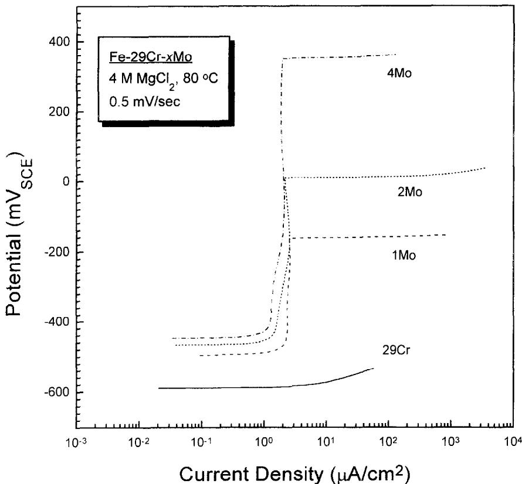  
Fig. 1. Anodic polarization curves for Fe 29Cr ferritic stainless steels containing 0 to 4 wt% of molybdenum in 4 M MgCl, solution at 80 C.

From the above results, a simple empirical formula between $E _ { \mathfrak { p i l } }$ and the content of alloyed molybdenum or tungsten in Fe-29Cr is obtained as follows;

$$
E _ { \mathrm { p i l } } = A _ { 1 } + B _ { 1 } X _ { \mathrm { M o t W } } ;\tag{1}
$$

where $A _ { \mathrm { ~ l ~ } }$ and $B _ { 1 }$ are constants, and $X _ { \mathrm { M o t W } }$ is the content of molybdenum or tungsten in wt% or $\mathrm { a t } ^ { 0 } \%$

Speidel'\* summarized the relationship between $E _ { \mathfrak { p i t } }$ and the content of alloying elements in Fe-18Cr alloys, and demonstrated that $E _ { \mathrm { p i t } }$ of the alloys is linearly proportional to the alloying contents of chromium, molybdenum and nitrogen with different slopes, exhibiting a similar relationship to the Fe-29Cr alloys obtained in this study. An increase in pitting potential by the addition of tungsten was also shown in austenitic stainless steels. Bui $e t ~ a l . ^ { \mathrm { ~ \tiny ~ l ~ l ~ } }$ showed for $1 6 \mathbf { C } \mathbf { r } - 1 4 \mathbf { N } \mathbf { i } \mathbf { - } \mathbf { { x } } \mathbf { W } \ ( { \boldsymbol { x } } = 0 \mathbf { - } 1 2 )$ alloys that $E _ { \mathsf { p i t } }$ of the alloys increased with the content of tungsten in 0.2 M NaCl solution, and claimed that this was associated with the formation of $\mathbf { W O } _ { 3 }$ in the passive film by an interaction of the metal with water.

To examine whether or not a synergistic effect, on the resistance to pitting corrosion of the Fe-29Cr base alloys, exists when a special ratio of tungsten to molybdenum is alloyed. $E _ { \mathsf { p i t } }$ for Fe-29Cr-4Mo, Fe-29Cr 4W and $\mathrm { F e } { - } 2 9 \mathrm { C r } { - } . \mathrm { x } \mathrm { M o } { - } . \mathrm { y } \mathrm { W } \quad ( . \mathrm { r } = 1 \dots 3 )$

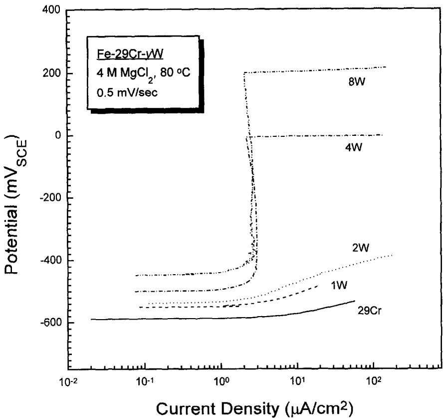  
Fig. 2. Anodic polarization curves for Fe-29Cr ferritic stainless steels containing 0 to 8 wt% of tungsten in 4 M $\mathbf { M } \mathbf { g } \mathbf { C } \mathbf { l } _ { 2 }$ solution at $8 0 ^ { \circ } \mathrm { C } .$

$x + y = 4 \mathrm { w t \% } )$ alloys was measured in 4M $\mathbf { M g C l } _ { 2 }$ solution at $8 0 ^ { \circ } C$ The results are plotted against the sum of the atomic percentages of tungsten and molybdenum in Fig. 5. It is evident in Fig. 5 that the pitting potential of $\mathrm { F e } { - } 2 9 \mathrm { C r } { - } x \mathbf { M _ { 0 - \gamma } } \mathbf { W }$ alloys increased linearly with (Mo + W) at $\%$ . The slope in the plot was determined to be $2 9 6 \mathrm { m V } / \mathrm { a t } \%$ i.e. almost equal to those in the case of the $\mathbf { F e { - } } 2 9 \mathbf { C r - } x \mathbf { M } _ { 0 }$ and $\mathrm { F e } { - } 2 9 \mathrm { C r } { - } y \mathbf { W }$ alloys in Fig. 4. From this result it can be concluded that, for Fe-29Cr alloys, the improvement of pitting resistance by the addition of molybdenum is almost equivalent to that by the addition of tungsten at the same atomic per cent, without any synergistic effect on the $E _ { \mathrm { p i t } }$ that may occur when the alloys are alloyed with a special ratio of molybdenum to tungsten.

## $E _ { p p }$ and $I _ { c }$ in a sulfuric acid solution

The anodic polarization behavior of $\mathrm { F e - 2 9 C r - } x \mathbf { M } \mathrm { o } \ ( x = 0 { \ - } 4 \mathrm { w t } ^ { \% } \mathrm { o } )$ and $\mathrm { F e } { - } 2 9 \mathrm { C r } { - }  y \mathbf { W }$ $( y = 0 { - } 8 \mathrm { w t \% } )$ alloys measured potentiodynamically in $2 0 \% \mathrm { H } _ { 2 } \mathrm { S O } _ { 4 }$ solution at $3 0 \mathrm { { ^ \circ C } }$ is shown in Figs 6 and 7, respectively. All of the alloys except Fe-29Cr-4Mo showed typical anodic polarization curves comprising an active, a passive and a transpassive region, although a secondary active region with the small value of current density of less than about $3 0 \mu \mathrm { A c m } ^ { - 2 }$ was observed. Additions of molybdenum or tungsten to Fe

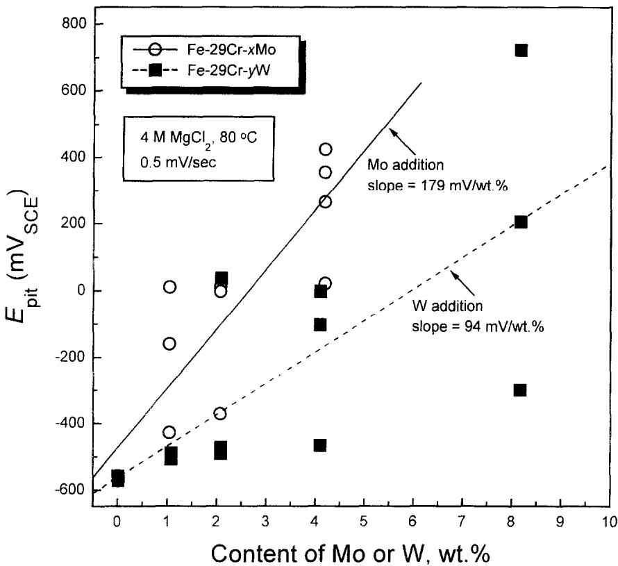  
Fig. 3. Dependence of $E _ { \mathsf { m } \ell }$ on weight per cent of molybdenum or tungsten for Fe 29Cr ferritie stainless steels in 4 M $\mathbf { M } \mathrm { g } \mathrm { C l } _ { 3 }$ solution at 80 C.

29Cr alloy displaced $E _ { \mathfrak { p } \mathfrak { p } }$ in the active direction, thereby expanding the passive range, and reduced $I _ { \mathrm { c } }$ and the passive current density $( { I } _ { \mathrm { { p a s s } } } )$ . Also, it was observed that $E _ { \mathfrak { p p } }$ and $I _ { \mathrm { c } }$ decreased significantly with increasing molybdenum or tungsten content.

It is noted that Fe-29Cr-4Mo alloy provided excellent passive characteristics over the whole range of potential from $E _ { \mathrm { c u r r } }$ to $E _ { \mathrm { t r a u r s } } .$ Changes in the anodic polarization behavior of the Fe-29Cr base alloys with molybdenum or tungsten content in sulfuric acid can be explained by the relative relationship between anodic dissolution of the metal and hydrogen reduction reactions, as shown schematically in Fig. 8. The increase in molybdenum or tungsten content enhances the stability of the passive film and expands the passive range as confirmed by the shifts of anodic polarization curves in the left and lower direction in Fig. 8, i.e. curves 1→2→3. Here, curve 4, a simulated anodic polarization curve of Fe 29Cr -4Mo in Fig. 7. can be obtained by deduction of the hydrogen evolution current from the anodic dissolution current (curve 3) with increasing applied potential.

The effects of various alloying elements on the passivity of stainless steels have been studied extensively and documented well by Sedriks.'9 However, a quantitative relationship between $E _ { \mathrm { p p } } , ~ I _ { \mathrm { c } }$ and $E _ { \mathsf { p i l } }$ as a function of alloy composition has rarely been investigated. Goetz et $a / . , ^ { 1 . }$ who studied the influence of different alloying elements (such as molybdenum, tungsten, vanadium and silicon) at the the same content of $6 \mathrm { a t \% }$ on the passivation behavior of Fe-13Cr and Fe-24Cr alloys in HCl, reported that there is no correlation between their relative effect on $I _ { \mathrm { p a s s } }$ and $E _ { \mathrm { p i t } }$ Osozawa and Engell²º studied on the influence of chromium on the passivity of Fe-9Ni alloys qualitatively in sulfuric acid through the anodic polarization curves. Lizlovs and $\mathbf { B o n d } ^ { 2 1 }$ reported, through a study on the anodic polarization behavior of 13 and 18% Cr stainless steels containing 0–5% Mo, that $I _ { \mathrm { c } }$ was decreased by addition of molybdenum with the decrease in $I _ { \mathrm { c } }$ being more pronounced for the 18Cr steels than the 13Cr alloy, and that $E _ { \mathfrak { p i t } }$ increased linearly with molybdenum content. They made no attempts to analyse quantitatively the effects of alloying content on passivation.

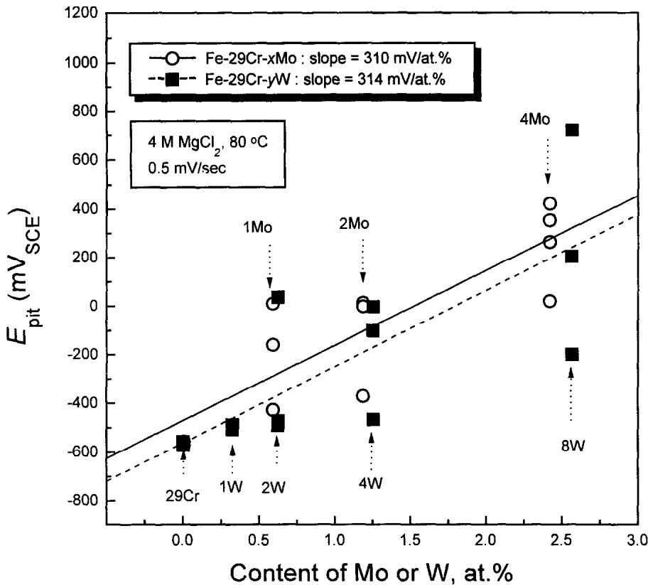  
Fig. 4. Dependence of $E _ { \mathfrak { p i t } }$ on atomic per cent of molybdenum or tungsten for Fe-29Cr ferritic stainless steels in 4 M $\mathbf { M g C l } _ { 2 }$ solution at $8 0 ^ { \circ } \mathrm { C } .$

$E _ { \mathrm { p p } }$ for Fe-29Cr-xMo and Fe-29Cr-yW alloys was measured quantitatively from the anodic polarization curves shown in Figs 6 and 7, and is plotted as a function of content of molybdenum or tungsten in Fig. 9. $E _ { \mathfrak { p p } }$ decreases rapidly with increasing molybdenum or tungsten content up to 2wt%, and then reduces slightly for further additions of tungsten or molybdenum. As shown in Fig. 10, a quantitative correlation for such a tendency was made by converting the linear scale to the logarithmic one for molybdenum and tungsten content, indicating that $E _ { \mathfrak { p p } }$ decreases almost linearly in proportion to the logarithmic values of atomic per cent $( X _ { \mathsf { M o ( W ) } } )$ of molybdenum or tungsten:

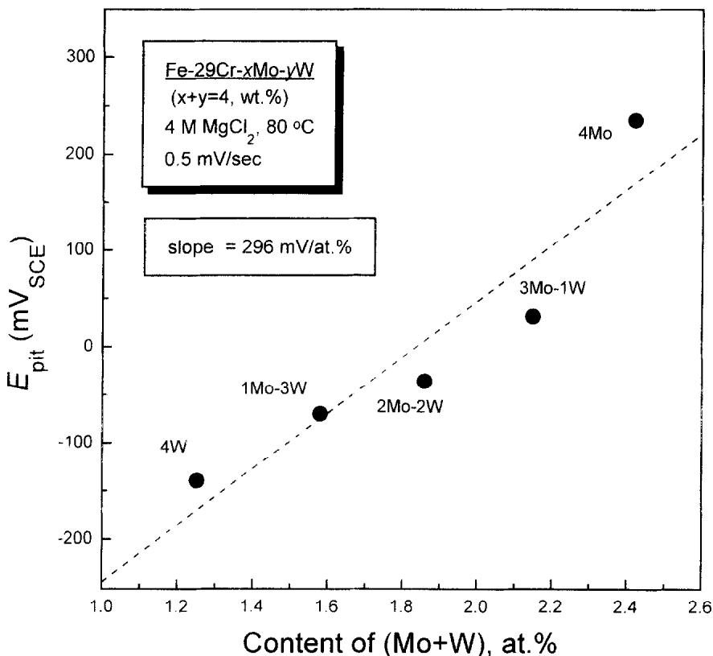  
Fig. 5. Dependence of Ep, on (Mo + W) at% for Fe 29Cr ferritic stainless steels in 4 M MgCl2 $t _ { \mathfrak { p } _ { i \parallel } }$ solution at 80 C.

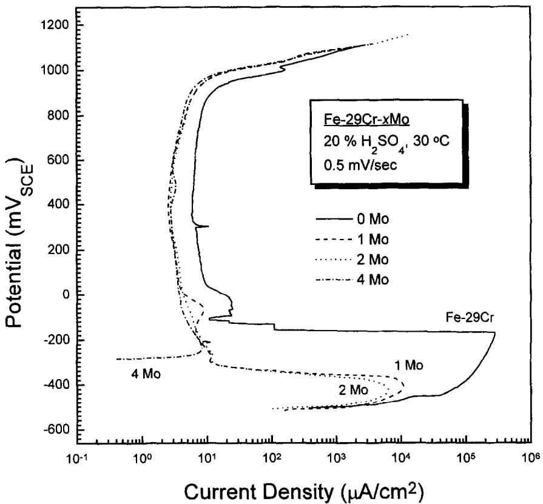  
Fig. 6. Anodic polarization curves for Fe-29Cr ferritic stainless steels containing 0 to 4 wt% of molybdenum in 20% $\mathbf { H } _ { 2 } \mathbf { S } \mathbf { O } _ { 4 }$ solution at $3 0 \mathrm { { ^ { \circ } C } }$

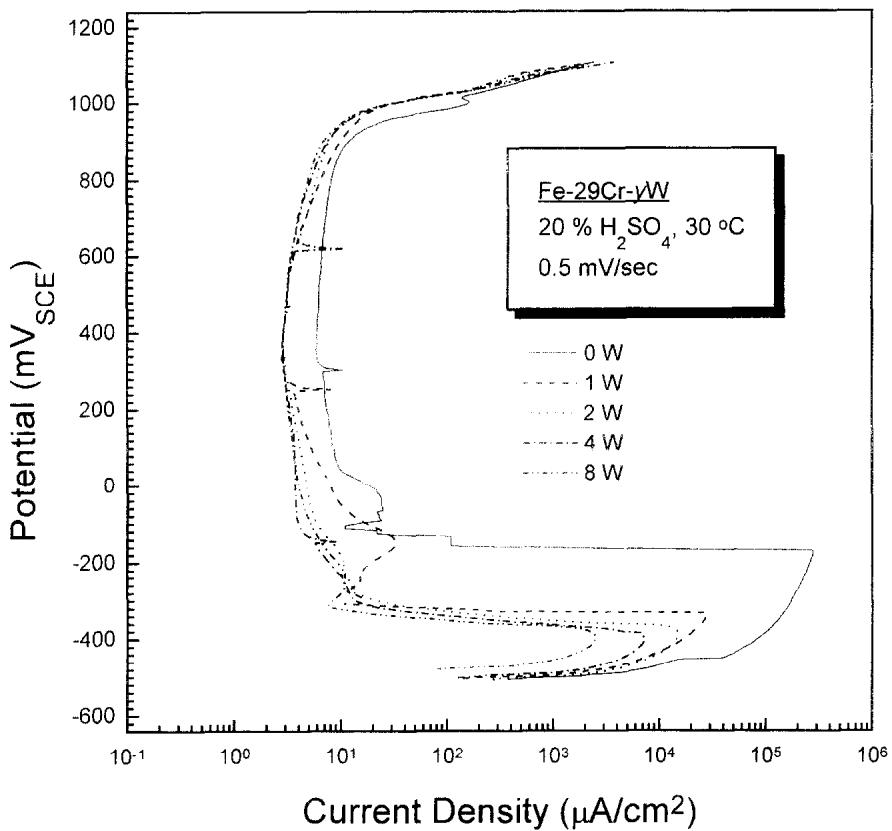  
Fig. 7. Anodic polarization curves for Fe 29Cr ferritie stainless steels containing 0 to 8 wt% of tungsten in 20% H2SO4 solution at 30 C.

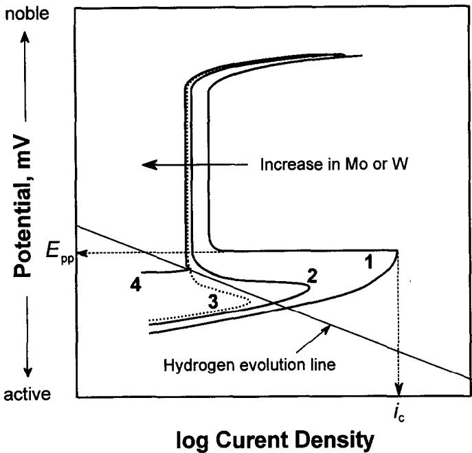  
Fig. 8. Schematic diagrams showing the effect of molybdenum or tungsten additions on the anodic polarization behavior of Fe-29Cr ferritic stainless steels in an acidic sulfate solution.

$$
E _ { \mathsf { p p } } = A _ { 2 } + B _ { 2 } \log X _ { \mathsf { M o ( W ) } }\tag{2}
$$

where $\pmb { A } _ { 2 }$ and $B _ { 2 }$ are constants.

The effects of molybdenum and tungsten on $E _ { \mathfrak { p p } }$ for the Fe-29Cr alloys can be expressed quantitatively by the slope in eqn (2): —112 and -91 mV/decade of at% for molybdenum and tungsten, respectively. It is significant that effect of molybdenum on $E _ { \mathfrak { p p } }$ is slightly better or almost equivalent to that of tungsten when compared on the basis of atomic per cent.

$I _ { \mathrm { c } }$ of Fe-29Cr alloys is shown as a function of molybdenum and tungsten content in Fig. 11. The data for $I _ { \mathrm { c } }$ were obtained from the anodic polarization curves in Figs 6 and 7. $I _ { \mathrm { c } }$ decreases rapidly with an increase in molybdenum or tungsten content up to about 2 wt% and then relatively slowly for further additions. The data in Fig. 7 were plotted in atomic per cent of molybdenum or tungsten on a log-log graph in Fig. 12, from which a linear relationship is drawn between the logarithmic value of $I _ { \mathrm { c } }$ and the logarithmic value of atomic percentage $( X _ { \mathbf { M o ( W ) } } )$ of molybdenum or tungsten:

$$
\log I _ { \mathrm { c } } = A _ { 3 } + B _ { 3 } \log X _ { \mathrm { M o ( W ) } }\tag{3}
$$

where $\boldsymbol { A } _ { 3 }$ and $B _ { 3 }$ are constants. It is significant that the effect of molybdenum or tungsten on $I _ { \mathrm { c } }$ is almost identical when compared by slope $( B _ { 3 } )$ on the scale of atomic per cent: —0.70 and -0.66 respectively for molybdenum and tungsten.

The similarity of molybdenum and tungsten in their effects on the passivity parameters such as $E _ { \mathrm { p i t } } , E _ { \mathrm { p p } }$ and $I _ { \mathrm { c } }$ for Fe-29Cr alloys can be understood by comparing the electrical and chemical properties of the two elements. The chemical and electrical properties of various alloying elements constituting stainless steels are represented in Table 2. Evidently, molybdenum and tungsten exhibit significant similarities in properties such as oxidation state, electrical conductivity and electronegativity that are important in determining the electrochemical properties of passive films. The reason why quantitative relationships cxist betwcen the passivation paramcters and the molybdenum or tungsten content, expressed by eqns (1)-(3), remains unclear and needs to be studied further.

Table 2. Chemical and electrical properties of the main elements constituting stainless steels
<table><tr><td></td><td>Fe</td><td>Ni</td><td>Cr</td><td>Mo</td><td>W</td></tr><tr><td>Column of Periodic Table</td><td>VIII</td><td>VIII</td><td>VIA</td><td>VIA</td><td>VIA</td></tr><tr><td>Oxidation state</td><td>3.2</td><td>3.2</td><td>6.3.2</td><td>6.5,4.3.2</td><td>6.5,4,3,2</td></tr><tr><td>Electrical conductivity (10&quot; em Ω )</td><td>0.0993</td><td>0.143</td><td>0.0774</td><td>0.187</td><td>0.189</td></tr><tr><td>Electronegativity</td><td>1.83</td><td>1.91</td><td>1.66</td><td>2.16</td><td>2.36</td></tr></table>

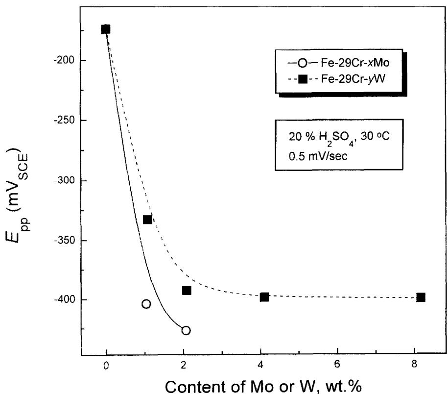  
Fig. 9. Influence of molybdenum or tungsten content on $E _ { \mathfrak { p p } }$ for Fe-29Cr ferritic stainless steels in 20% H2SO4 solution at 30 C.

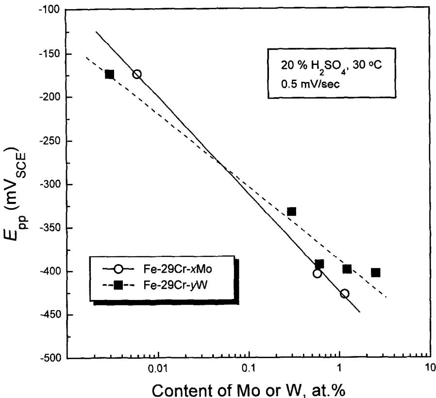  
Fig. 10. $E _ { \mathfrak { p p } }$ as a function of molybdenum or tungsten content for Fe-29Cr ferritic stainless steels in $2 0 \% \mathrm { H } _ { 2 } \mathrm { S O } _ { 4 }$ solution at 30C.

## CONCLUSIONS

A quantitative comparison of the influences of tungsten and molybdenum on the passivity of Fe-29Cr ferritic stainless steels in chloride or sulfuric acid solution leads to the following conclusions.

(1) $E _ { \mathrm { p i t } }$ for Fe-29Cr ferritic stainless steels in an aggressive chloride solution increases linearly with an increase in molybdenum or tungsten content according to the formula $E _ { \mathrm { p i t } } = A _ { \mathrm { l } } + B _ { \mathrm { l } } X _ { \mathrm { M o ( W ) } }$ . The increase in $E _ { \mathrm { p i t } }$ for the alloys by the addition of molybdenum is almost equal to that by the addition of tungsten when compared on the scale of atomic per cent.

(2) For $\mathrm { F e } \mathrm { - } 2 9 \mathrm { C r } \mathrm { - } x \mathrm { M o } \mathrm { - } y \mathrm { W } ( x = 1 \mathrm { - } 3 , \ x + y = 4 )$ alloys, $E _ { \mathrm { p i t } }$ increased linearly with the sum (Mo + W) at% without any synergic effect on $E _ { \mathrm { p i t } }$ by the special combination of molybdenum and tungsten.

(3) For Fe-29Cr alloys in 20% sulfuric acid, molybdenum and tungsten had a similar effect on the passivity parameters such as $E _ { \mathfrak { p p } }$ and $I _ { \mathrm { c } } , E _ { \mathrm { p p } }$ decreases linearly with the logarithmic value of at% Mo or at% W according to the equation $E _ { \mathrm { p p } } = A _ { 2 } + B _ { 2 } \log X _ { \mathrm { M o ( W ) } }$ . In contrast to this, the logarithmic value of $I _ { c }$ has a linear relationship with the logarithmic value of at%Mo or at% W: log $I _ { \mathrm { c } } = A _ { \mathrm { 3 } } + B _ { \mathrm { 3 } } \log X _ { \mathrm { M o ( W ) } }$

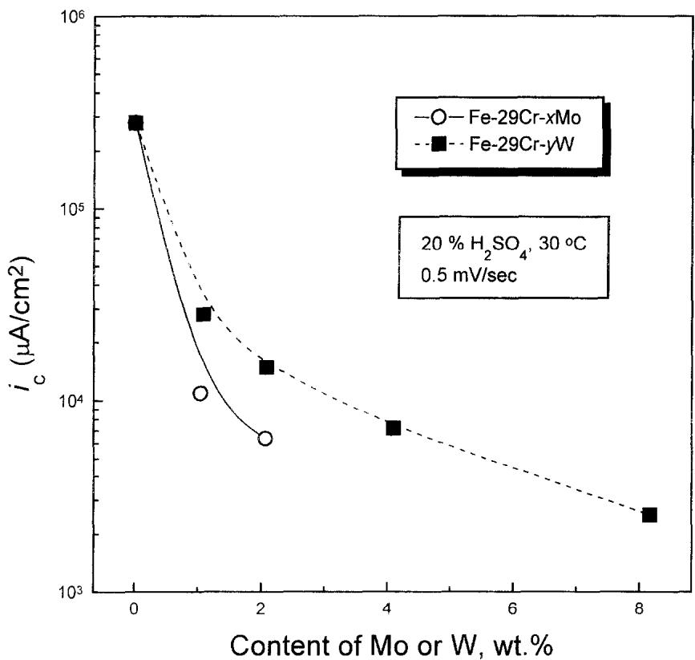  
Fig. 11. Influence of molybdenum or tungsten content on l for Fe-29Cr ferritic stainless steels in $\underline { { ? } } ( ) { } _ { \mathrm { ~ 0 ~ } } ^ { \prime } \mathsf { H } \mathrm { , S O } _ { \downarrow }$ solution at 30 C.

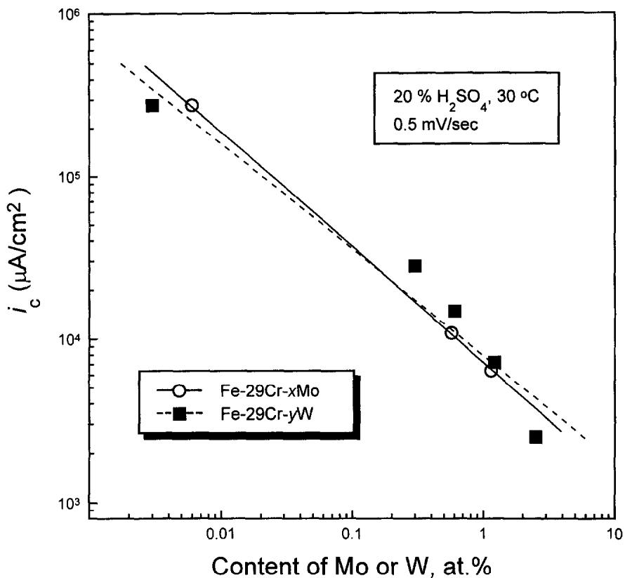  
Fig. 12. $I _ { \mathrm { c } }$ as a function of molybdenum or tungsten content for Fe–29Cr ferritic stainless steels in 20% $\mathrm { H _ { 2 } S O _ { 4 } }$ solution at $3 0 \mathrm { \ddot { C } } .$

(4) The similarities in the effects of molybdenum and tungsten on the passivity of Fe-29Cr alloys may result from the fact that both molybdenum and tungsten are similar in chemical and electrical properties.

Acknowledgement—The authors acknowledge the financial support of Pohang Iron and Steel Co., Ltd.

## REFERENCES

1. Streicher, M.A. Corrosion, 1974, 30, 77.

2. Lula, R.A. Metal Progress, 1976, 110, 24.

3. Deverell, H.E. and Franson, I.A. MP, 1989, 28, 52.

4. Streicher, M.A., Stainless Steel '77. Climax Molybdenum Company, London, 1977, p. 1.

5. Sedriks, A.J. Corrosion, 1989, 45, 510.

6. Maurer, J.R., Proc. Symp. Advanced Stainless Steels for Seawater Application. Climax Molybdenum Company, Piacenza, Italy, 1980, p. 11.

7. Streicher, M.A. Metal Progress, 1985, 128, 29.

8. Cao, H.L., Hertzman, S. and Hutchison, W.B., Stainless Steels '87. The Institute of Metals, London, 1988, p. 454.

9. Oh, B.W., Kim, J.I., Jeong, S.W., Kwon, H.S., Hong, S.H. and Kim, Y.G., Innovation Stainless Steel (Stainless Steel '93). Associazione Italiana Di Metallurgia, Florence, 1993, p. 3.59.

10. Okamoto, H., Tsuda, K., Azuma, S.. Ueda, M., Ogawa K. and Igarashi, M.. Duplex 94- Stainless Steel, Paper 91. TWI, Glasgow. 1994.

11. Bui, N., Irhzo, A., Dabosi, F., Limouzin-Maire, Y. Corrosion, 1983, 39, 491.

12. Goctz, R., Laurent, J. and Landolt, D. Corros. Sci., 1985, 25, 1115

13. Tomashov, N.D., Chernova, G.D. and Marcova, O.N. Corrosion. 1964, 20, 166t.

14. Habazaki, H., Kawashima, A., Asami, K. and Hashimoto. K. Corros. Sci., 1992, 33, 225.

15. Chen, J. and Wu, J.K. Corros. Sci., 1990, 30, 53.

16. Brookes. H.C. and Graham, F.J. Corrosion, 1989, 45, 287.

17. ASTM G 5-87, Standard Reference Test Method for Making Potentiostatic and Potentiodynamic Anodic Polarization Measurements. American Society for Testing and Materials, Philadelphia, PA, 1987.

18. Speidel, M. O.. Stainless Steels '91. The Iron and Steel Institute of Japan, Chiba. 1991, p. 25.

19. Sedriks, A.J. Corrosion. 1986, 42, 376.

20. Osozawa, K. and Engell, H.J. Corros. Sci.. 1966, 6, 389.

21. Lizlovs, E.A. and Bond, A.P. J. Electrochen. Soc.. 1975. 122, 719.