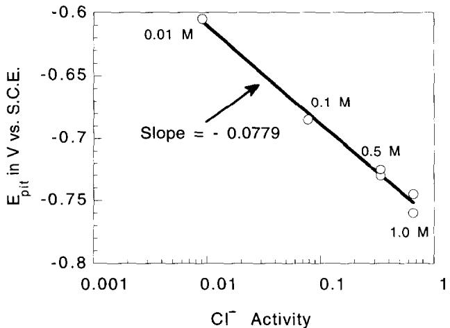
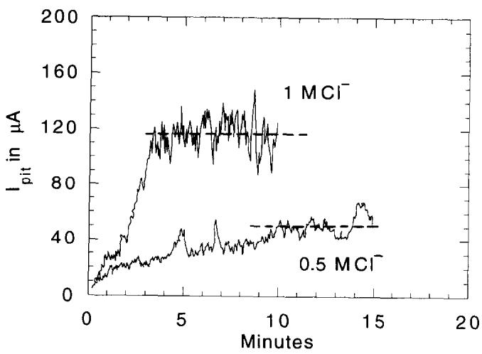
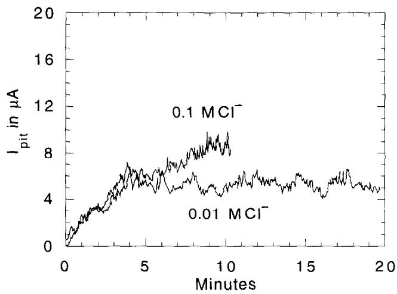
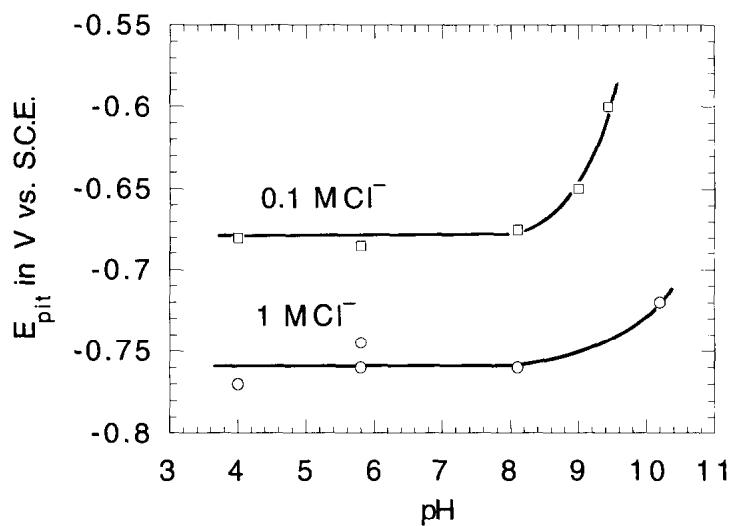
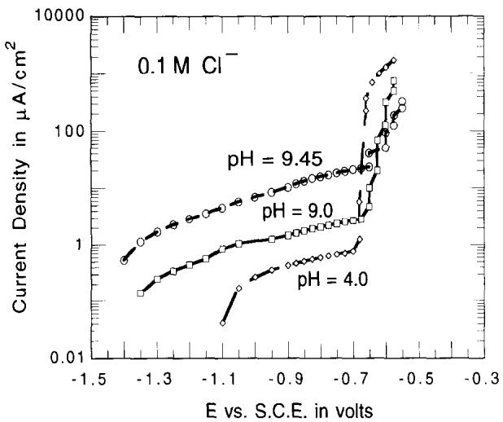

# THE ELECTRODE KINETICS OF PIT INITIATION ON ALUMINUM

E. McCAFFERTY

Naval Research Laboratory, Washington, DC 20375, U.S.A.

AbstractAn electrode kinetic model for pit initiation has been described in terms of the charge on the oxide surface and the pH of zero charge parameter. The model takes into account adsorption of chloride ions on the oxide surface, penctration of chloride ions through the oxide film via vacancy transport, and localized dissolution of aluminum at the metal/oxide interface in three consecutive single electron transfer steps. Mathematical expressions are derived which agree with the experimentally determined variation in pitting potential with chloride ion concentration at constant pH and with the variation in pitting potential with pH at constant chloride ion concentration.

## INTRODUCTION

Previous work in this laboratory1 and by Bargeron and Givens² has shown that corrosion pits on aluminum develop into blisters beneath the air-formed oxide film. The propagation of such corrosion pits involves the hydrolysis of aluminum ions under a restricted exchange of local and bulk electrolytes, resulting in a localized area of low $\mathrm { p } \mathrm { H } ^ { 3 }$ leading to pit propagation and eventual rupture of the blister.

The mechanism of pit initiation leading to the above situation is not as clear, although there is considerable evidence to show that aggressive anions, such as chlorides, assist the breakdown of passive oxide films. For example, several different groups have found chloride ion incorporation within passive films on aluminum using XPS,4 and Bargeron and Givens² have detected the presence of chloride around the periphery of blisters which develop later in the pitting process. The exact detailed mechanism of pit initiation is still somewhat uncertain, however, because there are several possible mechanisms by which chloride ions may penetrate the oxide film and assist the attack of the underlying substrate. These possiblities involve: (i) transport of chloride ions through the oxide film; and (ii) localized film dissolution or thinning. It is generally agreed that the first step in the initiation process involves adsorption of chloride ions on the oxide surface.

Despite this lack of detailed understanding as to the exact mechanism of pitting, it is well known that there exists a critical pitting potential above which corrosion pits initiate and then propagate. This critical pitting potential, which is associated with the initiation stage of pitting, is a function of chloride concentration but is independent of pH.

The purpose of this communication is to provide an electrode kinetic description of pit initiation for aluminum (having an air-formed oxide film), taking into account adsorption of chloride ions on the oxide surface, penetration through the oxide film and interaction with the underlying substrate. Mathematical expressions are derived which agree with the variation in pitting potential with chloride ion concentration at constant pH and with the variation in pitting potential with pH at constant chloride ion concentration.

## Acid-base surface reactions

The first step in the pitting process is the adsorption of chloride on the oxidecovered surface. The attractive forces which result when an ion, such as a chloride, interacts with an ionic surface, such as an oxide, consist of: (i) coulombic forces; (ii) induction of the adsorbent by the approaching ion; (iii) electrostatic polarization of the ion; and (iv) non-polar van der Waals forces.7 Of these attractive forces, the largest are the first two interactions, which are ionic, so that the adsorption of chloride ions is most favored when the surface charge is positive.

It is well known that the outermost surface of an oxide is covered with a layer of hydroxyl groups.8 In aqueous solutions, these hydroxyl groups may remain undissociated, in which case the pH of the aqueous solution is the same as the pH of zero charge of the oxide, $\mathrm { \ p H _ { \mathrm { p z c } } } ^ { \mathrm { ~ \tiny ~ { ~ \circ ~ } ~ } }$ If the pH is less than $\mathrm { \ p H _ { \mathrm { p z c } } }$ , the surface will acquire a positive charge:

$$
\begin{array} { r } { - \mathrm { O H } _ { \mathrm { s u r f } } + \mathrm { H } ^ { + }  - \mathrm { O H } _ { 2 \operatorname { s u r f } } ^ { + } . } \end{array}\tag{1}
$$

If the pH is greater than $\mathrm { \ p H _ { \mathrm { p } z c } } .$ , the surface will acquire a negative charge:

$$
\begin{array} { r } { - \mathrm { O H } _ { s u r t } + \mathrm { O H } ^ { - }  - \mathrm { O } _ { s u r t } ^ { - } + \mathrm { H } _ { 2 } \mathrm { O } , } \end{array}
$$

or:

$$
\mathrm { \longrightarrow O H _ { s u r f } -  O _ { s u r f } ^ { - } + H ^ { + } } .\tag{2}
$$

The acidity constants for the above are:

$$
K _ { \scriptscriptstyle 1 } = \frac { \mathrm { [ O H _ { s u r f } ] [ H ^ { + } ] } } { \mathrm { [ O H _ { 2 \thinspace s u r f } ^ { + } ] } }\tag{3}
$$

and

$$
K _ { 2 } = \frac { \mathrm { [ O _ { s u r f } ^ { - } ] [ H ^ { + } ] } } { \mathrm { [ O H _ { s u r f } ] } } .\tag{4}
$$

At the pH of zero charge, $[ \mathrm { O } _ { \mathsf { s u r f } } ^ { - } ] = [ \mathrm { O H } _ { 2 \mathsf { s u r f } } ^ { + } ]$ , so that equations (3) and (4) combine to give:

$$
\mathrm { p H } _ { \mathrm { p z c } } = \frac { \mathrm { p } K _ { 1 } + \mathrm { p } K _ { 2 } } { 2 } ,\tag{5}
$$

where $\mathrm { p } K _ { i } = - \mathrm { l o g } K _ { i }$

## ELECTRODE KINETICS OF PIT INITIATION

The total anodic current density $i _ { a }$ for a surface which undergoes localized attack in the form of pitting is:

$$
i _ { \mathrm { a } } = i _ { \mathrm { u } } + i _ { \mathrm { p i t } } ,\tag{6}
$$

where $i _ { \mathrm { u } }$ is the anodic current density for processes occurring uniformly over most of the surface (i.e. passivation) and $i _ { \mathrm { p i t } }$ is the anodic current density due to pitting at certain localized sites.

We propose that in solutions where a positive surface charge is acquired, the first two steps in the pit initiation process are:

$$
\mathbf { A l ( o x i d e ) O H } + \mathbf { H } ^ { + } \overset { 1 } { \underset { - 1 } {  } } \mathbf { A l ( o x i d e ) O H } _ { 2 } ^ { + }\tag{7}
$$

and

$$
\mathrm { A l ( o x i d e ) O H _ { 2 } ^ { + } } + n C \mathrm { l } ^ { - } \overset { 2 } { \underset { - 2 } {  } } \mathrm { A l ( o x i d e ) O H _ { 2 } ^ { + } } \mathrm { C l } _ { n } ^ { - n } .\tag{8}
$$

In Al(oxide)OH, Al refers to a substrate aluminum metal atom located immediately beneath the oxide film and oxide refers to the oxide film covering that aluminum atom, which will eventually undergo localized dissolution, i.e. pitting. For the sake of completeness (although not necessary), oxide can be formalized as $\mathbf { A l } _ { w } \mathbf { O } _ { x } ( \mathbf { O H } ) _ { y } ( \mathbf { H } _ { 2 } \mathbf { O } ) _ { z }$ 10 where the subscripts refer to the number of aluminum cations, oxide ions, hydroxide ions and water molecules in the oxide film corresponding to a single atom of underlying metallic Al. Finally, in Al(oxide)OH, OH refers to the outer layer of surface hydroxyl groups.

Reaction (7), the first step in the initiation process, considers that the pH of the neutral aqueous solution is less than the value of $\mathrm { p H } _ { \mathrm { p z c } }$ for aluminum oxide, i.e. $8 . 9 \mathrm { - } 9 . 2 , \mathrm { } ^ { 9 . \dot { 1 } 1 }$ so that the hydroxylated surface is protonated. Steps 2 and -2 (reaction (8)) involve adsorption and desorption of chloride ions. In the most general case, it has been considered that n chloride ions interact with a surface site, where $n \geq 1$

It is next necessary to invoke a mechanism by which chloride ions enter the oxide film. It is considered that the chloride ion is transported through the oxide film by means of oxygen vacancies:12.13

$$
\mathrm { A l ( o x i d e ) O H _ { 2 } ^ { + } C l ^ { - n } } + n \mathrm { V _ { O } . . . } \overset { 3 } { \underset { - 3 } {  } } \mathrm { A l [ ( n C l _ { O } . ) ( o x i d e ) ] O H _ { 2 } ^ { + } } ,\tag{9}
$$

where $\mathbf { V } _ { \mathrm { O } } .$ . refers to an oxygen vacancy in the film, $\mathrm { C l _ { O } }$ . is a chloride ion occupying an oxygen lattice site, and $\mathbf { A l } [ ( n \mathbf { C l } _ { \mathrm { O } } . ) ( \mathrm { o x i d e } ) ] \mathbf { O H } _ { 2 } ^ { + }$ refers to the oxide film on aluminum through which chloride ion transport is occurring. Equation (9) differs slightly from that of Macdonald et al. , 13 who assume that oxygen vacancies react with chloride ions at the oxide/solution interface, i.e. that Cl\~ adsorption requires a surface oxygen vacancy. The present description allows Cl\~ adsorption to occur via the surface forces referred to earlier.

Aluminum atoms at the base of the oxide film then react in three consecutive oneelectron transfer reactions, as is the case for the dissolution of other metals which give trivalent cations:14,15

$$
\mathrm { \bf A l } [ ( n \mathrm { C l } _ { \mathrm { O } } . ) ( \mathrm { o x i d e } ) ] \mathrm { O H } _ { 2 } ^ { + } \underset { - 4 } { \overset { 4 } {  } } \mathrm { \bf A l ^ { + } } [ ( n \mathrm { C l } _ { \mathrm { O } } . ) ( \mathrm { o x i d e } ) ] \mathrm { O H } _ { 2 } ^ { + } + \mathrm { e } ^ { - } ,\tag{10}
$$

$$
\mathrm { \bf A l ^ { + } } [ ( n \mathrm { C l _ { O } } . ) ( \mathrm { o x i d e } ) ] \mathrm { O H } _ { 2 } ^ { + } \stackrel { > } {  } \mathrm { \bf A l ^ { 2 + } } [ ( n \mathrm { C l _ { O } } . ) ( \mathrm { o x i d e } ) ] \mathrm { O H } _ { 2 } ^ { + } + \mathrm { e } ^ { - } ,\tag{11}
$$

$$
\begin{array} { r } { \mathbf { A l } ^ { 2 + } [ ( n \mathbf { C l } _ { \mathrm { O } } . ) ( \mathrm { o x i d e } ) ] \mathbf { O H } _ { 2 } ^ { + } \stackrel { 6 } {  } \mathbf { A l } ^ { 3 + } [ ( m \mathbf { C l } _ { \mathrm { O } } . ) ( \mathrm { o x i d e } ) ] \mathbf { O H } _ { 2 } ^ { + } \quad } \\ { + \mathbf { \Xi } ( n - m ) \mathbf { C l } ^ { - } + \mathbf { e } ^ { - } \mathbf { \Xi } ( \mathrm { a t } \mathrm { s i t e } \mathrm { o f } \mathrm { p i t } ) . } \end{array}\tag{12}
$$

The symbol $\mathbf { A l } [ ( n \mathbf { C l } _ { \mathrm { O } } . ) ( \mathrm { o x i d e } ) ] \mathbf { O H } _ { 2 } ^ { + }$ represents zero-valent aluminum metal, existing prior to pit initiation in which the metal substrate is covered by its chloridc-containing oxide film. The formulac $\mathbf { A l } ^ { + } [ ( n \mathbf { C l } _ { \mathrm { O } } . ) ( \mathrm { o x i d c } ) ] \mathbf { O H } _ { 2 } ^ { + }$ $\mathrm { \bf A l ^ { 2 + } } [ ( n \mathrm { C l _ { O } } . ) ( \mathrm { o x i d e } ) ] \mathrm { O H } _ { 2 } ^ { + }$ and $\mathrm { \bf A l ^ { 3 + } } [ ( m \mathrm { C l _ { O } } . ) ( \mathrm { o x i d e } ) ] \mathrm { O H } _ { 2 } ^ { + }$ , refer to monovalent, divalent and trivalent aluminum ions, respectively, at the metal/oxide interface, i.e. at the site of the initiating pit.

Experimental observations involving $\mathrm { \mathbf { X P S } ^ { 6 } }$ and radiotracer studies1" show that the concentration of chloride ions in the oxide film decreases with the onset of pitting. Thus, $0 < m < n$ (in reaction (12)) allows some expulsion of chloride from the film in the vicinity of the pit when pitting initiates.

In the steady state, the above system of equations/reactions is described by:

$$
\beta \frac { \mathrm { d } \theta _ { \mathrm { I } } } { \mathrm { d } t } = \bar { k } _ { 1 } [ \mathrm { O H } _ { \mathrm { s u r f } } ] [ \mathrm { H } ^ { + } ] - \bar { k } _ { - 1 } \beta \theta _ { \mathrm { I } } - \bar { k } _ { 2 } \beta \theta _ { \mathrm { 1 } } [ \mathrm { C l } ^ { - } ] ^ { n } + \bar { k } _ { - 2 } \beta \theta _ { \mathrm { C l } ^ { - } } = 0 ,\tag{13}
$$

$$
\beta \frac { \mathrm { d } \theta _ { \mathrm { C l } } } { \mathrm { d } t } = \bar { k _ { 2 } } \beta \theta _ { 1 } [ \mathrm { C l ^ { - } } ] ^ { n } - \bar { k _ { - 2 } } \beta \theta _ { \mathrm { C l ^ { - } } } - \bar { k _ { 3 } } \beta \theta _ { \mathrm { C l ^ { - } } } [ \mathrm { V } _ { \mathrm { O } } . . . ] ^ { n } + \bar { k _ { - 3 } } C _ { 0 } = 0 ,\tag{14}
$$

$$
\frac { \mathrm { d } C _ { 0 } } { \mathrm { d } t } = \bar { k _ { 3 } } \beta \theta _ { \mathrm { C l } } - [ \mathbf { V } _ { \mathrm { O } } . . ] ^ { n } - \bar { k _ { - 3 } } C _ { 0 } - \bar { k _ { 4 } } C _ { 0 } + \bar { k _ { - 4 } } C _ { 1 } = 0 ,\tag{15}
$$

$$
\frac { \mathrm { d } C _ { 1 } } { \mathrm { d } t } = \bar { k } _ { 4 } C _ { 0 } - \bar { k } _ { - 4 } C _ { 1 } - \bar { k } _ { 5 } C _ { 1 } + \bar { k } _ { - 5 } C _ { 2 } = 0 ,\tag{16}
$$

$$
\frac { \mathrm { d } C _ { 2 } } { \mathrm { d } t } = \bar { k _ { 5 } } C _ { 1 } - \bar { k } _ { - 5 } C _ { 2 } - \bar { k _ { 6 } } C _ { 2 } = 0 ,\tag{17}
$$

where $\widehat { k _ { i } }$ are the electrochemical rate constants given by $\bar { k _ { i } } = k _ { i } \exp ( \pm a _ { i } \gamma _ { i } F E / R T )$ $\gamma _ { i }$ is the number of electrons transferred (one or zero here) for the ith $\textstyle \operatorname { s t e p } , a _ { i }$ is the electrochemical transfer coefficient (taken later to be 1/2) and $E$ is the electrode potential. The term $\mathrm { [ O H _ { s u r f } ] }$ refers to the concentration, in mol $\mathrm { c m } ^ { - 2 }$ of the surface hydroxyls, i.e. Al(oxide)OH. The terms $\theta _ { 1 }$ and $\theta _ { \mathrm { C I } } .$ refer to the fractional surface coverages of Al(oxide)OH and chloride ion $( \mathbf { A l } ( \mathbf { o x i d e } ) \mathbf { O H } _ { 2 } ^ { + } \mathbf { C l } _ { n } ^ { - n } )$ , respectively. The term $\beta$ is a proportionality constant¹6 defined by: $[ \mathbf { A } \mathbf { l } ( \mathrm { o x i d e } ) \mathbf { O H } _ { 2 } ^ { + } ] = \beta \boldsymbol { \theta } _ { 1 }$ , so that $\beta$ has the units of mol $\mathrm { c m } ^ { - 2 }$ . Similarly, $[ \mathbf { A } \mathbf { l } ( \mathrm { o x i d e } ) \mathbf { O } \mathbf { H } _ { 2 } ^ { + } \mathbf { C } \mathbf { l } _ { n } ^ { - n } ] ~ = ~ \beta \theta _ { \mathrm { C l } ^ { - } }$ , where as a first approximation it is assumed that $\beta$ is the same for both surface species. The terms $C _ { \{ \} } , ~ C _  \}$ and $C _ { 2 }$ refer to the concentrations, in mol $\mathrm { c m } ^ { - 2 }$ , of the species $\mathbf { A l } [ ( n \mathbf { C l } _ { \mathrm { O } } . ) ( \mathrm { o x i d e } ) ] \mathbf { O } \mathbf { H } _ { 2 } ^ { + }$ $\mathbf { A l } ^ { + } [ ( n \mathbf { C l } _ { \mathrm { O } } . ) ( \mathrm { o x i d e } ) ] \mathbf { O H } _ { 2 } ^ { + }$ and $\mathbf { A } | ^ { 2 + } [ ( n \mathbf { C } \mathsf { I } _ { \mathrm { O } } . ) ( \mathrm { o x i d e } ) ] \mathrm { O H } _ { 2 } ^ { + }$ , respectively.

The anodic current density due to pitting is:

$$
\frac { i _ { \mathrm { p i t } } } { F } = \widetilde { k } _ { 4 } C _ { 0 } - \widehat { k } _ { - 4 } C _ { 1 } + \bar { k } _ { 5 } C _ { 1 } - \bar { k } _ { - 5 } C _ { 2 } + \bar { k } _ { 6 } C _ { 2 } .\tag{18}
$$

For pH $< \mathsf { p H } _ { \mathsf { p z c } }$ the possible surface sites consist of the species Al(oxide)OH Al(oxide)OH2 and $\mathbf { A l } ( \mathrm { o x i d e } ) \mathbf { O H } _ { 2 } ^ { + } \mathbf { C l } _ { n } ^ { - n }$ , so that:

$$
[ \mathrm { O H } _ { \mathrm { s u r f } } ] + \beta \theta _ { 1 } + \beta \theta _ { \mathrm { C l } ^ { - } } = N _ { 0 } ,\tag{19}
$$

where $N _ { 0 }$ is the total number of surface sites (in mol cm −2). Equation (19) then gives: $[ \mathrm { O H } _ { \mathrm { s u r f } } ] = N _ { \mathrm { 0 } } - \beta \theta _ { \mathrm { C l } ^ { - } }$ for use in equation (13). The solution to eqns (13)–(19) is:

$$
\frac { i _ { \mathrm { p i t } } } { F } = 3 \frac { \bar { k } _ { 1 } \bar { k } _ { 2 } \bar { k } _ { 3 } \bar { k } _ { 4 } \bar { k } _ { 5 } \bar { k } _ { 6 } [ \mathrm { V } _ { \mathrm { O } } . . ] ^ { n } } { \bar { k } _ { - 3 } \bar { k } _ { - 4 } \bar { k } _ { - 5 } } \times \frac { N _ { 0 } [ \mathrm { H } ^ { + } ] ( \mathrm { C l } ^ { - } ] ^ { n } } { \bar { k } _ { 1 } [ \mathrm { H } ^ { + } ] ( \bar { k } _ { - 2 } + \bar { k } _ { 2 } [ \mathrm { C l } ^ { - } ] ^ { n } ) + \bar { k } _ { - 1 } \bar { k } _ { - 2 } } ,\tag{20}
$$

subject to the condition that $\overline { { k } } _ { - 5 } \gg \overline { { k } } _ { 6 } .$ , similar to the active dissolution of iron and titanium.14,16 XPS measurements in this laboratory⁶ show that the uptake of chloride in the oxide film is of the order of only 1 at%, so that $\theta _ { \mathrm { C l } ^ { - } } \ll \theta _ { 1 }$

Evidence that $\theta _ { \mathrm { C l } ^ { - } } \ll \theta _ { 1 }$ can be obtained from recent data of Bockris and Minevski. $\cdot ^ { 1 7 }$ who have determined adsorption isotherms for chloride on aluminum at pH 8.4 (oxide-covered) and pH 12 (film-free). At pH 12, and for chloride conccntrations of $1 0 ^ { - 4 } { - } 1 0 ^ { - 2 } \dot { \bf M }$ , the chloride uptake was observed to increase with chloride concentration and with increasing positive potential, up to a plateau value prior to pitting. The maximum uptake prior to pitting was c. $0 . { \dot { 1 } } 0 \times 1 { \dot { 0 } } ^ { - 8 }$ mol $\mathrm { C l } ^ { - } \mathrm { c m } ^ { - 2 }$ and 100 times less, i.e. $0 . 1 \dot { 0 } \times 1 \dot { 0 } ^ { - 1 0 }$ mol $\mathrm { C l ^ { - } } \mathrm { \bar { \ c m } } ^ { - 2 } ( 6 \times 1 0 ^ { 1 2 } \mathrm { \ C l ^ { - } }$ ions $\mathrm { c m } ^ { - 2 } )$ , for oxide-covered aluminum. The concentration of surface hydroxyls is c. $1 ~ \times ~ 1 0 ^ { 1 5 }$ hydroxyls $\mathrm { c m } ^ { - 2 } . ^ { 1 8 }$ Sadek et $a l . ^ { 1 1 }$ list $\mathsf { p } K _ { 1 }$ for $\mathbf { A l } _ { 2 } \mathbf { O } _ { 3 }$ as 7.68. Use of this value in equation (3) for pH 7 gives:

$$
[ \mathrm { O H } _ { \mathrm { s u r f } } ] = 0 . 2 0 9 [ \mathrm { O H } _ { 2 \mathrm { s u r f } } ^ { + } ] .
$$

The above equation, along with the requirement that $[ \mathrm { O H } _ { \mathrm { s u r f } } ] + [ \mathrm { O H } _ { 2 \mathrm { s u r f } } ^ { + } ] = 1 \times$ $1 0 ^ { 1 5 }$ , gives $[ \dot { \mathrm { O H } } _ { 2 \mathrm { s u r f } } ^ { + } ] \ = \ \dot { 8 . } 2 7 \ \times \ 1 0 ^ { 1 4 }$ ions $\mathrm { c m } ^ { - 2 }$ . Thus, the ratio of the surfacc concentrations $( \Gamma )$ of chloride ions to OH ions is $\Gamma ( \mathrm { C l ^ { - } } ) / \Gamma ( \mathrm { O H _ { 2 } ^ { + } } ) = 6 \times 1 0 ^ { 1 2 } \mathrm { C l ^ { - } }$ ions/8. $2 7 \times 1 0 ^ { 1 4 }$ OH2 ions, or $\Gamma ( \mathbf { C l } ^ { - } ) / \Gamma ( \mathbf { O H } _ { 2 } ^ { + } ) = 7 . 3 \times 1 0 ^ { - 3 }$ . The size of an $\mathrm { O H } _ { 2 } ^ { + }$ surface group can be estimated by assuming it to be approximately the same size as a water molecule. The cross sectional area of a water molecule is $1 \dot { 0 } . 6 \mathring { \mathbf { A } } ^ { 2 }$ , which gives its radius as 1.83 Å. The radius of $\textrm { a C l } ^ { - }$ ion is 1.81 $\mathring { \mathbf { A } } . ^ { 1 9 }$ This then implies that $\theta ( \mathrm { C l ^ { - } } ) / \theta ( \mathrm { O H } _ { 2 } ^ { + } ) = 7 . 3 \times 1 0 ^ { - 3 } , \mathrm { i . e . } \ \theta _ { C l ^ { - } } \ll \theta _ { 1 }$

This condition implies that $\bar { k _ { 2 } } [ \mathrm { C l } ^ { - } ] ^ { n } \ll \bar { k _ { - 2 } }$ , which can be seen (after some algebra) upon solving eqns (13)–(17) for $\theta _ { \mathrm { C l } ^ { - } }$ and $\theta _ { 1 }$ . Then, equation (2) can be rewritten as:

$$
\frac { i _ { \mathrm { p i t } } } { F } = 3 \frac { \bar { k } _ { 2 } \bar { k } _ { 3 } \bar { k } _ { 4 } \bar { k } _ { 5 } \bar { k } _ { 6 } [ \boldsymbol { \mathrm { V } } _ { \mathrm { O } } \cdot \cdot \cdot ] ^ { n } } { \bar { k } _ { - 2 } \bar { k } _ { - 3 } \bar { k } _ { - 4 } \bar { k } _ { - 5 } } \times \frac { N _ { 0 } [ \boldsymbol { \mathrm { H } } ^ { + } ] [ \boldsymbol { \mathrm { C l } } ^ { - } ] ^ { n } } { [ \boldsymbol { \mathrm { H } } ^ { + } ] + K _ { 1 } } ,\tag{21}
$$

where $( \overleftarrow { k } _ { - 1 } / \overleftarrow { k } _ { 1 } ) = K _ { 1 }$ , the surface equilibrium constant in equation (3).

Steps 4–6 (reactions (10)-(12), respectively) in the reaction mechanism each involve a one-electron transfer, so that $\overline { { k _ { 4 } } } = k _ { 4 } \exp ( { \mathrm { F E } } / 2 \mathbf { R } \mathbf { T } )$ ， $\bar { k } _ { - 4 } = k _ { - 4 } \exp ( - F E /$ 2RT), $\bar { k _ { 5 } } = k _ { 5 } \exp ( F E / 2 R T )$ $\bar { k } _ { - 5 } = k _ { - 5 }$ exp $ ( - F E / 2 R T )$ and $\widetilde { k _ { 6 } } = k _ { 6 } \mathrm { e x p } ( F E / 2 R T )$ where α has been taken to be $1 / 2$ , whereas $\bar { k _ { j } } = k _ { j } \mathrm { f o r } j = \pm 2$ and ±3. Thus, equation (21) becomes:

$$
\frac { i _ { \mathrm { p i t } } } { F } = 3 \hat { K } \mathrm { e } ^ { 5 F E / 2 R T } \frac { [ \mathrm { H } ^ { + } ] } { [ \mathrm { H } ^ { + } ] + K _ { 1 } } [ \mathrm { C l } ^ { - } ] ^ { n } ,\tag{22}
$$

  
Fig. 1. Pitting potentials for aluminum as a function of chloride ion activity.

where $\hat { K } = ( k _ { 2 } k _ { 3 } k _ { 4 } k _ { 5 } k _ { 6 } / k _ { - 2 } k _ { - 3 } k _ { - 4 } k _ { - 5 } ) [ \mathrm { V } _ { \mathrm { O } } . . ] ^ { n } N _ { 0 }$ and $\hat { K }$ is a constant for a given system (i.e. metal).

Any small positive value of $( i _ { a } - i _ { u } )$ can be chosen consistently to mark the start of pitting, so that $( { i _ { \mathrm { a } } } \mathrm { ~ - ~ } { i _ { \mathrm { u } } } ) \ =$ constant when $E = E _ { \mathrm { p i t } }$ . Taking logarithms and differentiating in equation (22) with respect to the chloride concentration at constant pH then gives:

$$
\left( \frac { \mathrm { d } E _ { \mathrm { p i t } } } { \mathrm { d } \log \left[ \mathrm { C l \ ' } \right] } \right) _ { \mathrm { p H } } = \frac { - n } { \frac { 5 } { 2 } \left( \frac { E } { 2 . 3 0 3 R T } \right) } = \mathrm { c o n s t . }\tag{23}
$$

Figure 1 shows the pitting potential for pure aluminum foil as a function of chloride ion activity for chloride concentrations of 0.01–1.0 M. Activity coefficients are taken from Harned and Owen.20 These pitting potentials were determined by potentiostatic polarization for samples immersed for 24 h in deaerated solutions.

Experimental values for the variation in pitting potential of pure aluminum with chloride concentration have been reported to range from $- \dot { 0 } . 0 7 3 ~ \mathbf { V } ^ { 2 1 } ~ \mathbf { t o } ~ - 0 . 1 2$ $\mathrm { V } ^ { 2 2 - 2 5 }$ , although Bockris and $\mathbf { M i n e v s k i } ^ { \prime }$ report a much higher value of $c . - 0 . 3 1 5 \mathrm { V }$ Equation (23) thus agrees with the experimental observation that the pitting potential varies linearly with the logarithm of the chloride concentration at constant pH. Variations in experimental values for $\mathrm { d } E _ { \mathrm { p i t } } / \mathrm { d } { \log } [ \mathrm { C l } ^ { - } ]$ reported in the literature may be due to variations from system to system in the number, n, of chloride ions associated with a pit initiation site

## Determination of the parameter n

The value of n for the present case was determined so as to evaluate C $\scriptstyle \vert E _ { \mathrm { p i t } } / \mathrm { d l o g } [ \mathrm { C l } ^ { - } ]$ in equation (23).

When pitting initiates, equation (22) will apply until occluded cell effects come into play, i.e. until the pit electrolyte becomes acidified and concentrated in chloride ions and aluminum cations. Equation (22) will not hold beyond the pitting potential where pit propagation occurs and where activation control is replaced by concentration control. At the onset of pitting, and for constant $\mathsf { p H }$ , equation (22) can be written as:

$$
y = c + a E + n \ln [ \mathbf { C l ^ { - } } ] ,\tag{24}
$$

where:

$$
y = \ln I _ { \mathrm { p i t } } = \ln ( i _ { \mathrm { p i t } } A ) ,
$$

$$
c = \ln \left( 3 \hat { K } \mathrm { F } \frac { \left[ \mathrm { H } ^ { + } \right] } { \left[ \mathrm { H } ^ { + } \right] + K _ { 1 } } \right)
$$

and

$$
a = { \frac { \nu F } { R T } } .
$$

Here it is assumed that the accumulative number of electron transfer steps v (in units of $R T / F )$ and the number of chloride ions, n, per pitting site are both unknown.

Figure 2 shows the pitting current $( I _ { \mathrm { a } } - I _ { \mathrm { u } } )$ as a function of time at the pitting potential for four different bulk chloride concentrations. In each case, the system reaches a steady state current, even though there may be appreciable oscillation around the steady state value of the current. If $y _ { i }$ refers to the steady state pitting current, i.e. the plateau currents in Fig. 2, for the ith chloride concentration, then the least squares error is minimized:

$$
R = \sum _ { i = 1 } ^ { N } [ y _ { i } - ( c + a E _ { i } + n \ln { [ \mathrm { C l ^ { - } } ] _ { i } } ) ] ^ { 2 } ,
$$

where N is the total number of observations $( N = 4$ in Fig. 2). Taking $\partial R / \partial a = 0$ $\partial R / \partial c = 0$ and $\partial R / \partial n = 0$ , gives the set of simultaneous equations:

$$
a \sum _ { i = 1 } ^ { N } E _ { i } ^ { 2 } + n \sum _ { i = 1 } ^ { N } E _ { i } \ln \left[ \mathbf { C l } ^ { - } \right] _ { i } + c \sum _ { i = 1 } ^ { N } E _ { i } = \sum _ { i = 1 } ^ { N } E _ { i } y _ { i } ,\tag{25}
$$

$$
a \sum _ { i = 1 } ^ { N } E _ { i } \ln { [ \mathrm { C l ^ { - } } ] _ { i } } + n \sum _ { i = 1 } ^ { N } { ( \ln { [ \mathrm { C l ^ { - } } ] _ { i } } ) ^ { 2 } } + c \sum _ { i = 1 } ^ { N } \ln { [ \mathrm { C l ^ { - } } ] _ { i } } = \sum _ { i = 1 } ^ { N } y _ { i } \ln { [ \mathrm { C l ^ { - } } ] _ { i } } ,\tag{26}
$$

$$
a \sum _ { i = 1 } ^ { N } E _ { i } + n \sum _ { i = 1 } ^ { N } \ln \left[  { \boldsymbol { \mathrm { C 1 ^ { - } } } } \right] _ { i } + c N = \sum _ { i = 1 } ^ { N } y _ { i } .\tag{27}
$$

Solution of these simultaneous equations using the experimentally determined steady state values of the pitting current $y _ { i } = \ln { ( I _ { \mathrm { p i t } } ) } , E _ { i } = E _ { \mathrm { p i t } }$ and the chloride concentrations ln $[ \mathbf { C l } ^ { - } ] _ { i }$ (see Table 1) gives the result: $\nu = 2 . { \dot { 5 } } 9$ and $n = 3 . 7 7$ (if chloride activities are used in equations (25–(27) rather than chloride concentrations, the result is essentially the same: $\nu = 2 . 6 2 \mathrm { a n d } n = 4 . 0 9 )$ . It can be seen that the calculated value for the number of electron transfer steps is very close to the expected value of

  
Fig. 2. Pitting current for aluminum in various chloride solutions (at the pitting potential in each case).

5/2. The number of chloride ions, $n = 4$ , associated with a pitting site is also within the range of values (1–8) as determined from induction times to pitting for aluminum and its alloys in various aqueous solutions. 17.26–28

Use of n = 4 in equation (22) gives:

Table 1. Experimental data used to calculate the parameters n and v
<table><tr><td>Chloride concentration</td><td>Activity cocfficient</td><td>Chloride activity</td><td> $E _ { \mathrm { p i t } }$ </td><td>Steady-state  $l _ { \mathrm { p i t } } ( \mu \mathrm { A } )$ </td></tr><tr><td>0.01</td><td>0.9034</td><td>0.009034</td><td>-0.605</td><td>5.5</td></tr><tr><td>0.1</td><td>0.7796</td><td>0.07796</td><td>-0.685</td><td>8.5</td></tr><tr><td>0.5</td><td>0.681</td><td>0.3405</td><td>-0.730</td><td>50</td></tr><tr><td>1.0</td><td>0.657</td><td>0.657</td><td>-0.745</td><td>115</td></tr></table>

$$
\left( \frac { \mathrm { d } E _ { \mathrm { p i t } } } { \mathrm { d } \log \left[ \mathrm { C l ^ { - } } \right] } \right) _ { \mathrm { p H } } = - 0 . 0 9 4 5 .
$$

The experimentally observed slope in Fig. 1 is –0.0779.

Constant chloride solutions

The case for varying pH at constant chloride ion concentration is considered next. With pH $< \mathsf { p H } _ { \mathsf { p z c } }$ , the oxide covered aluminum surface is positively charged and reactions $( 7 ) - ( 1 \dot { 2 } )$ apply. With pH $< { \mathsf { p } } K _ { 1 }$ and $[ \mathrm { H } ^ { + } ] > K _ { 1 }$ so that $[ \mathbf { H } ^ { + } ] / ( [ \mathbf { H } ^ { + } ] \bar { + } K _ { 1 } ) \cong$ 1, equation (22) gives:

$$
\left( \frac { \mathrm { d } E _ { \mathrm { p i t } } } { \mathrm { d } _ { \mathrm { p H } } } \right) _ { [ \mathrm { C l ^ { - } ] } } \cong 0 ,\tag{28}
$$

again using $( \dot { \iota } _ { \mathrm { a } } - \dot { \iota } _ { \mathrm { u } } ) =$ constant when $E = E _ { \mathrm { p i t } }$

When pH $\mathrm { \ p H _ { p z c } }$ , however, the pit initiation process begins as:

$$
\mathrm { \bf A l ( o x i d e ) O H } \underset { - 1 } { \overset { 1 } {  } } \mathrm { \bf A l ( o x i d e ) O ^ { - } } + \mathrm { \bf H ^ { + } } ,\tag{29}
$$

$$
{ \mathrm { A l } } ( { \mathrm { o x i d e } } ) { \mathrm { O } } ^ { - } + n { \mathrm { C l } } ^ { - } \underbrace { \imath } _ { - 2 } ^ { 2 } { \mathrm { A l } } ( { \mathrm { o x i d e } } ) { \mathrm { O } } ^ { - } { \mathrm { C l } } _ { n } ^ { - n } ,\tag{30}
$$

rather than by reactions (7) and (8), and the process continues as in steps (3)–(6) (reactions (9)-(12)), except that the species $\mathbf { A l } [ ( n \mathbf { C l } _ { \mathrm { O } } . ) ( \mathrm { o x i d e } ) ] \mathbf { O H } _ { 2 } ^ { + }$ $\mathbf { A } \mathbf { l } ^ { + } [ ( n \mathbf { C } \mathbf { l } _ { \mathrm { O } } . ) ( \mathrm { o x i d e } ) ] \mathbf { O } \mathbf { H } _ { 2 } ^ { + }$ $\mathbf { \bar { A } l ^ { 2 + } } [ ( n \mathbf { C l } _ { \mathrm { O } } . ) ( \mathrm { o x i d e } ) ] \mathbf { O H } _ { 2 } ^ { + }$ and $\mathrm { \bf A l } ^ { 3 + } [ ( m \mathrm { \bf C l _ { O } } . )$ $\mathrm { ( o x i d e ) } ] \mathrm { O H } _ { 2 } ^ { + }$ are replaced by $\mathrm { \bf A l } [ ( n \mathrm { C l _ { O } } . ) ( \mathrm { o x i d e } ) ] \mathrm { O } ^ { - }$ $A { \sf I } ^ { + } [ n { \sf C l _ { O } } . ) ( \mathrm { o x i d e } ) ] { \sf O } ^ { - }$ $\mathbf { A } | ^ { 2 + } [ ( n \mathbf { C } | _ { \mathrm { O } ^ { . } } ) ( \mathrm { o x i d e } ) ] \bar { \mathrm { O } } ^ { - }$ and $\mathrm { \bf A l ^ { 3 + } } [ ( m \mathrm { C l _ { O } } . ) ( \mathrm { o x i d e } ) ] \mathrm { O ^ { - } }$ , respectively. Adsorption of Cl− on to the negatively charged oxide surface in reaction (29) is not as favored as in reaction (8) but proceeds through the operation of van der Waal's forces.

Using the same approach as above, the solution to this process, i.e. reactions (29) and (30) and the reactions replacing reactions (9)–(12) is:

$$
\frac { i _ { \mathrm { p i t } } } { F } = 3 \hat { K } \mathrm { e } ^ { 5 F E / 2 R T } \frac { K _ { 2 } } { [ \mathrm { H } ^ { + } ] + K _ { 2 } } [ \mathrm { C l } ^ { - } ] ^ { n } ,\tag{31}
$$

where each previous $k _ { i }$ has been replaced by a new rate constant $k _ { i } ^ { \prime } .$ which applies to reactions (29) and (30) and the replacement reactions for reactions (9)–(12). With $\mathsf { p H } > \mathsf { p } K _ { 2 } , [ \mathsf { H } ^ { + } ] < K _ { 2 }$ , so that $K _ { 2 } / ( [ \mathrm { H } ^ { + } ] + K _ { 2 } ) \cong 1$ , and equation (28) again results.

The earliest obscrvation that the pitting potential is independent of pH appears to be due to Kaesche.24 Recently, Carroll and Breslin29have shown that the pitting potential of aluminum in 0.5 M NaCl is essentially independent of pH between values of 2 and 10. Figure 3 shows recent results from this laboratory for pure aluminum foil in various buffer solutions at chloride concentrations of 0.1 and 1 M in the pH range of 4–10. The term d $1 E _ { \mathrm { p i t } } / \mathrm { d p H } = 0$ for pH values between 4 and 8 (typical polarization curves are shown in Fig. 4). There is a slight increase in pitting potential between pH values of 8 and 10, i.e. in the approximate range where $\mathsf { p } K _ { 1 } < \mathsf { p } \mathsf { H } < \mathsf { p } K _ { 2 }$ . In this pH region, the simplifications $\bar { [ { \bf H } ^ { + } ] } / ( [ { \bf H } ^ { + } ] + \bar { \bf \Phi } { \bf K } _ { 1 } ) \cong 1$ or $K _ { 2 } / ( [ H ^ { + } ] ~ + ~ K _ { 2 } )$

  
Fig. 3. Pitting potentials for aluminum as a function of pH in 0.1 and 1 M chloride solutions.

  
Fig. 4. Anodic polarization curves for aluminum in 0.I M NaCl at three different pH values.

≈ 1 will not hold exactly, so that equation (28) also will not hold exactly. Pitting potentials were not determined above a pH of 10 because the uniform corrosion current densities of aluminum become dominant and their high values make determination of pit initiation difficult.

## Additional comments

Another possible mechanism by which Cl⁻ ions breach the oxide film is by film thinning, i.e. local dissolution of the oxide film.30 If the oxide film is thinned locally in a channel extending only part way through the thickness of the oxide film, then there still exists a remaining part of the oxide film through which Cl\~ ions may pcnetrate by the mechanism considered above, so that the above treatment will still hold. However, the observation that blisters develop beneath the oxide film, on aluminum¹² suggests that the oxide film is not dissolved away locally down to the underlying metal substrate in order for a corrosion pit to initiate.

## SUMMARY

An electrode kinetic model for pit initiation has been described taking into account adsorption of chloride ions on the oxide surface, penetration through the oxide film by means of oxygen vacancies and dissolution of the underlying substrate to initiate a corrosion pit at the metal/oxide interface. Mathematical expressions are derived which agree with the variation in pitting potential with chloride ion concentration at constant pH, and with the variation in pitting potential with pH at constant chloride ion concentration.

Acknowledgements—This work is surrported by the Office of Naval Research. The author is grateful to A.   
J. Sedriks for his support and encouragement.

## REFERENCES

1. P. M. Natishan and E. McCafferty, J. electrochem. Soc. 136, 53 (1989).

2. C. B. Bargeron and R. B. Givens, Corrosion, 36, 618 (1980).

3. See, for example, B. F. Brown, Corrosion 26, 249 (1970).

4. J. Augustynski, in Passivity of Metals (eds R. P. Frankenthal and J. Kruger), p. 989. The Electrochemical Society, Princeton, NJ (1978).

5. L. D. Atanasoska, D. M. Drazic, A. R. Despic and A. Zalar, J. electroanal. Chem. 182, 179 (1985).

6. P. M. Natishan, E. McCafferty and W. E. O'Grady, in Application of Surface Analysis Methods to Envíronmental/Materials Interactions (eds D. R. Baer,. C. R. Clayton and G. D. Davis), p. 421. The Electrochemical Society, Pennington, NJ (1991).

7. J. H. de Boer, in Advances in Colloid Science (eds H. Mark and E. J. W. Verwey), Vol. III, p. 1. Interscience Publishers, NY (1950).

8. See, for example, E. McCafferty and A. C. Zettlemoyer, Disc. Faraday Soc. 52, 239 (1971).

9. G. A. Parks, Chem. Rev. 65, 177 (1965).

10. L. Tomcsanyi, K. Varga, I. Bartik, G. Horanyi and E. Maleczki, Electrochim. Acta 34, 855 (1989).

11. H. Sadek, A. K. Helmy, V. M. Sabet and T. F. Tadros, J. electroanal. Chem. 27, 257 (1970).

12. C. L. McBee and J. Kruger, in Localized Corrosion (eds R. W. Staehle et al.) p. 252. NACE, Houston, TX (1974).

13. L. F. Chin, C. Y. Chao and D. D. Macdonald, J. electrochem. Soc. 128, 1194 (1981).

14. E. J. Kelly, in Proc. 5th Int. Cong. on Metallic Corrosion, p. 137. National Association of Corrosion Engineers, Houston, TX (1974).

15. L. Kiss, J. Szalma, J. Farkas and P. Kovacs, J. electroanal. Chem. 180, 315 (1984).

16. E. J. Kelly, J. electrochem. Soc. 112, 124 (1965).

17. J. O'M. Bockris and Lj. V. Minevski, J. electroanal. Chem. 349, 375 (1993).

18. A. C. Zettlemoyer and E. McCafferty, Croatica Chem. Acta 45, 173 (1973).

19. L. Pauling, in The Nature of the Chemical Bond, p. 346. Cornell University Press, Ithaca, NY (1948).

20. H. S. Harned and B. B. Owen, in The Physical Chemistry of Electrolytic Solutions, p. 486. Reinhold Publishing Co., NY (1958)

21. J. R. Galvele and S. M. de De Micheli, Corros. Sci. 10, 795 (1970).

22. B. N. Stirrup, N. A. Hampson and I. S. Midgley, J. appl. Electrochem. 5, 229 (1975).

23. H. Bohni and H. H. Uhlig, J. electrochem. Soc. 116, 906 (1969).

24. H. Kaeschc, Z. Physik Chem. N.F. 34, 87 (1962).

25. Z. A. Foroulis and M. J. Thubrikar, Werkstoffe u. Korros. 26, 350 (1975).

26. Z. A. Foroulis and M. J. Thubrikar, J. electrochem. Soc. 122, 1296 (1975).

27. F. D. Bogar and R. T. Foley, J. electrochem. Soc. 119, 462 (1972).

28. S. Dallek and R. T. Foley, J. electrochem. Soc. 123, 1775 (1976).

29. W. M. Carroll and C. B. Breslin, Br. Corros. J. 26, 255 (1991).

30. Sec, for cxample, H. Kaesche, in Passivity of Metals (eds R. P. Frankenthal and J. Kruger), p. 935. The Electrochemical Society, Princeton, NJ (1978).