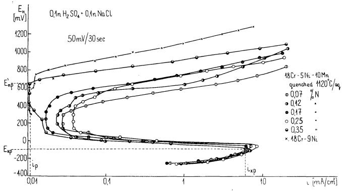
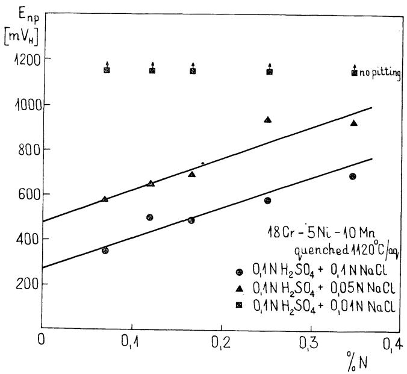
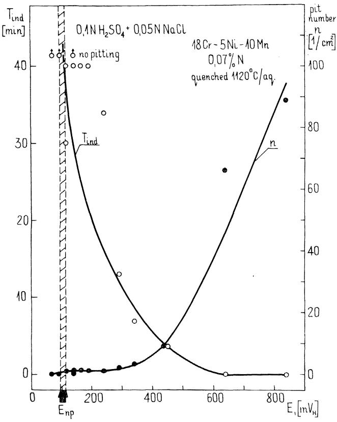
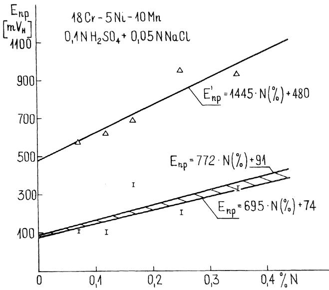
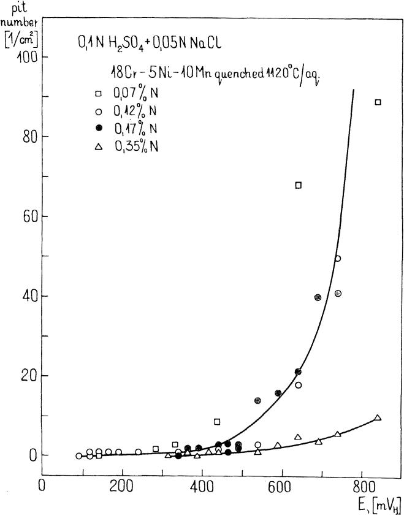
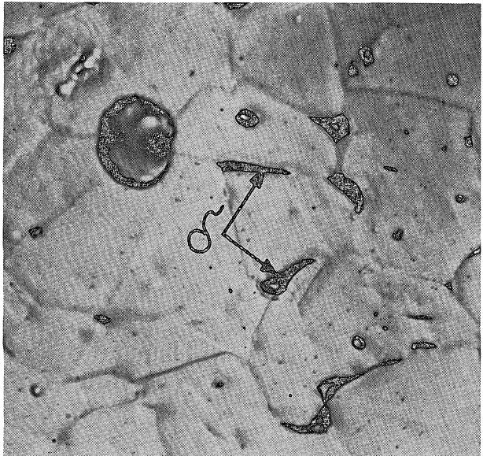
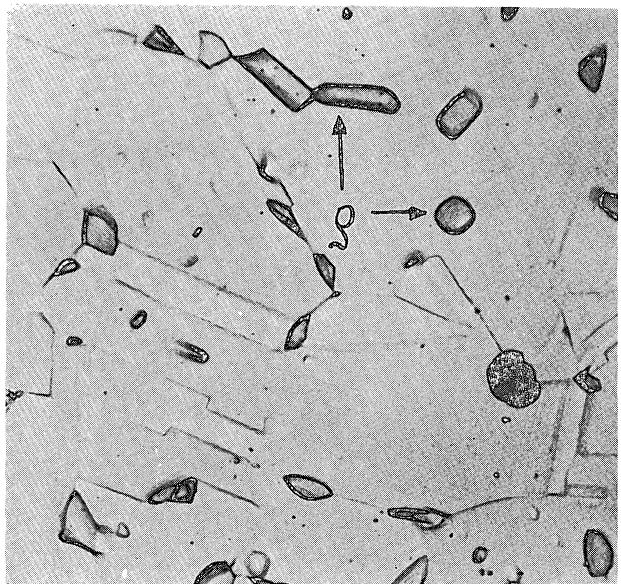
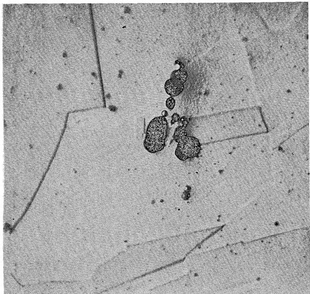

correlation exists between the SCC behavior of Ti and 4130 steel and the surface-layer stress coefficient. Further, analytical expressions of the type

$$
\mathbf { V } = \mathbf { V } _ { 0 } \left[ \mathbf { C _ { s } } \cdot \mathbf { C _ { s } ( 0 ) } \right] ^ { \mathbf { b } }\tag{1}
$$

$$
\mathbf { K } _ { \mathbf { I S C C } } = \mathbf { A } \cdot \mathbf { B C } _ { s }\tag{8}
$$

$$
\mathbf { t } _ { \mathbf { f } } = \alpha \mathbf { C } _ { \mathbf { S } } ^ { - \mathbf { p } } + \mathbf { t } _ { \mathbf { O } }\tag{11}
$$

may be used to describe the SCC behavior as a function of the stress intensity factor and the environment. Although it may be coincidental, note that the exponent (b) is the same for the titanium alloy and the steel. Further the exponent (p) is the same for the steel and the titanium alloy. The exponent (b) is also nearly equal to $| 1 / \mathbf { P } \ |$

for both metals.

It appears that data of the type contained in Equations (7) and (9) may be used to predict SCC in environments other than those used in this investigation. By assuming that the constants in the equations for a given metal are independent of the specific environment, it appears that the SCC behavior of a metal can be characterized by determining the surface-layer stress coefficient $( \mathrm { C _ { \mathrm { { S } } } ) }$ in that environment.

## Acknowledgment

This paper was supported in part by the Air Force Office of Scientific Research under Contract F44620-74-C-0032.

## Reference

1. I. R. Kramer. Trans TMS-AIME, Vol. 233, p. 1462 (1965).

# Effect of Nitrogen Content in a 18Cr-5Ni-10Mn Stainless Steel on the Pitting Susceptibility in Chloride Solutions\*

M. JANIK-CZACHOR, E. LUNARSKA, and Z. SZKLARSKA-SMIALOWSKA\*

## Abstract

Anodic behavior of 18Cr-5Ni-10Mn steels containing 0.07 to 0.35% nitrogen was studied in a 0.1N $\mathsf { H } _ { 2 } \mathsf { S O } _ { 4 }$ solution with additions of 0.01 to 0.1N NaCl. The nitrogen content in these steels does not significantly affect their passive behavior but increases their pitting resistance. The most susceptible sites for pit nucleation are boundaries between the austenite matrix and some second-phase precipitates (presumably carbides). The effect of nitrogen on the pitting resistance of Cr-Ni-Mn steels is discussed with respect to their phase compositions.

The chromium-manganese steels may be modified by additions of nickel (commonly 4 to 5%) and nitrogen, which both are effective as austenite-stabilizing components. Since the introduction of N into a steel is a rather difficult technological process, this element is most often added together with Mn. The upper limit of the N content in 18Cr steel is about 0.2%,1 but in the presence of about 10% Mn, it can be raised to $0 . 4 6 \% ^ { 2 }$ without initiating formation of gas bubbles within the solid metal. The lower limit of the N content necessary to stabilize the austenitic phase at a given Cr and Ni content depends upon the presence of other elements, particularly carbon.

The corrosion behavior of 18Cr-5Ni steels alloyed with Mn and N is not well known.³ The behavior in chloride solutions is an important concern. No systematic investigation of the effect of nitrogen on the susceptibility of these steels to pitting has been performed. The aim of this work, in connection with the previous work,³ was to bridge this gap.

## Experimental

Steels used for this study were kindly supplied by the Institute of Iron Metallurgy in Gliwice, Poland. They were in the form of hot forged rods, 18 mm in diameter. Compositions of steels are given in Table 1.

TABLE 1 — Chemical Composition of 18Cr-5Ni-10Mn Stainless Steels(1)(%)
<table><tr><td>C</td><td>Mn</td><td>Si</td><td>P</td><td>S</td><td>Cr</td><td>Ni</td><td>N</td></tr><tr><td>0.0185</td><td>9.9</td><td>0.44</td><td>0.027</td><td>0.018</td><td>18.1</td><td>5.7</td><td>0.17</td></tr><tr><td>0.025</td><td>9.6</td><td>0.23</td><td>0.030</td><td>0.018</td><td>17.7</td><td>5.6</td><td>0.12</td></tr><tr><td>0.024</td><td>10.4</td><td>0.22</td><td>0.027</td><td>0.022</td><td>17.4</td><td>5.5</td><td>0.07</td></tr><tr><td>0.020</td><td>10.2</td><td>0.31</td><td>0.026</td><td>0.024</td><td>17.8</td><td>5.2</td><td>0.25</td></tr><tr><td>0.020</td><td>10.7</td><td>0.32</td><td>0.029</td><td>0.022</td><td>18.2</td><td>5.4</td><td>0.35</td></tr></table>

(1)Chemical analysis was performed by the Institute of Iron Metallurgy, Gliwice, Poland.

The steels were tested in the as-received and quenched conditions. The steels were water quenched after 1 hour of heating in air at 1120 C. The specimen preparation, as well as the experimental procedure, are described elsewhere.³ Additional measurements of the relative ability to passivate were performed potentiokinetically using a scanning rate of 2V/h.

To compare the susceptibility of the steels to pitting, potentiokinetic polarization curves were measured in 0.1N $\mathrm { H } _ { 2 } \mathrm { S O } _ { 4 }$ solution containing from 0.01 to 0.1 NaCl. From these curves, the potentiokinetic potential of pit nucleation $( \mathrm { E _ { n p } ^ { \prime } } )$ was estimated. However, the potentiokinetic determination of $\dot { \mathrm { E } } _ { \mathrm { n p } } ^ { \prime }$ gives information only about the relative susceptibility of the materials to pitting $( \tau _ { \mathrm { i n d } } )$ and the pit number.(n) were measured at different potentials in 0.1N $\mathrm { H } _ { 2 } \mathrm { S O } _ { 4 } + 0 . 0 5 \mathrm { N }$ NaCl solution. The values of τind were determined from current density (cd) vs time curves at constant potential. Considering that at $\mathrm { { E } _ { n p } }$

  
FIGURE 1 — Anodic polarization curves for several steels in 0.1N ${ \sf H } _ { 2 } { \sf S } { \sf O } _ { 4 } + { \sf 0 } .$ 1N NaCl.

$$
\tau _ { \mathrm { i n d } } \to \infty , \mathrm { a n d ~ } \mathfrak { n } \to 0
$$

one can estimate the value of $\mathrm { { E } _ { n p } }$ for a given system.4 The $\mathrm { { E } _ { n p } }$ value so estimated corresponds to the lower limit of the potential range within which the pit nucleation can occur.

## Results

## Phase Composition

Metallographic examination showed that in the hot-forged condition the steels with 0.12, 0.25, and 0.35% N were austenitic, whereas those with 0.07 and 0.17% N contained austenite with a small amount of δ-ferrite (with an excess of Cr and relatively less Fe, Ni, and Mn than in the γ-phase). Some small second-phase particles also occurred. Electron microprobe analysis identified these particles as carbides $( \mathrm { M e } _ { 2 3 } \mathrm { C } _ { 6 }$ type) and carbonitrides $[ \mathrm { M e } _ { 2 } ( \mathrm { C } , \mathrm { N } ) \mathrm { t y p e } ]$ . Pure nitrides were very rare. Possible changes in structure and composition of the precipitates in 18Cr-5Ni-10Mn steels due to different N contents were not studied.

The X-ray analysis did not detect any σ-phase in the materials under investigation.

Quenching did not induce a significant change in the phase composition, apart from a certain homogenization of the alloys. In the two-phase steels, the boundaries between δ and γ-phases became less susceptible to etching; the inclusions of carbides and carbonitrides underwent coagulation, and their number decreased slightly.

## Measurements

Some examples of polarization curves in 0.1N $\mathrm { H } _ { 2 } \mathrm { S O } _ { 4 } \ + \ 0 .$ 1N NaCl are shown in Figure 1. For the steel containing 0.35% N, the following characteristic points are indicated in Figure 1: critical current density for passivation $( \mathrm { i } _ { \mathbf { k } \mathbf { p } } )$ , critical passivation potential $( { \mathrm { E } } _ { \mathbf { k p } } ) _ { i }$ current density in the passive state $( \mathrm { i } _ { \mathfrak { p } } ) _ { \mathrm { : } }$ and potentiokinetic potential of pit nucleation $( \mathrm { E _ { n p } ^ { \prime } } )$ . Within the range of low anodic potentials, the shape of all the curves is nearly the same, while there is a distinct difference in the vicinity of $\mathrm { E } _ { \mathrm { n p } } ^ { \prime }$ , where a rise of the apparent current density is observed as a consequence of pitting. For comparison, a polarization curve for 18Cr-9Ni stainless steel is also plotted. This steel is passive in the solution used (there is no range of anodic dissolution), and the breakdown at $\mathrm { { E } _ { n p } ^ { \prime } }$ occurs at a potential about 100 mV more positive than that for the 18Cr-5Ni-10Mn-0.35N steel.

Similar results were obtained in the solution containing 0.05N NaCl. In the presence of only 0.01N NaCl, no breakdown of passivity occurred, and no distinct difference between the shape of the curves w&s observed for specimens with different N contents.

  
FIGURE 2 — Effect of N content on the potentiokinetic potential of pit nucleation.

In solutions containing from 0.01 to 0.1N NaCl, the following characteristic values were observed for different steels, independent of their N content:

$$
\begin{array} { c } { { \mathrm { E } _ { { \bf k p } } = - 1 0 0 \mathrm { ~ t o } \cdot 5 0 \mathrm { ~ m V } _ { \bf N H E } } } \\ { { { \bf i } _ { { \bf k p } } = 4 \mathrm { ~ t o } 8 \mathrm { ~ m A } / \mathrm { c m } ^ { 2 } } } \\ { { { \bf i } _ { { \bf p } } = 0 . 1 \mathrm { ~ t o } 0 . 3 \mathrm { ~ m A } / \mathrm { c m } ^ { 2 } } } \end{array}
$$

Before and after quenching, the results were practically identical. This means that the passivation tendency is neither affected by the N content and the steel treatment, nor by the $\mathrm { C l } ^ { - }$ concentration in the solution.

The above conclusion was confirmed by potentiokinetic measurements performed in 0.1N H2SO₄ + 0.05N NaCl at a scanning rate of $2 \mathrm { V } / \mathrm { h }$ . For both the hot-forged and quenched steels with different N contents, the following results were observed:

$$
{ \begin{array} { c } { { \mathbf { E } } _ { \mathbf { k p } } = \mathbf { a b o u t \cdot 1 2 5 ~ t o \cdot 8 5 ~ m V } _ { \mathbf { N H E } } } \\ { { \mathrm { i } } _ { \mathbf { k p } } = 4 ~ { \mathrm { t o } } ~ 9 ~ { \mathrm { m A / c m } } ^ { 2 } } \\ { { \mathrm { i } } _ { \mathbf { p } } = 0 . 0 0 3 ~ { \mathrm { t o } } ~ 0 . 0 1 ~ { \mathrm { m A / c m } } ^ { 2 } } \end{array} }
$$

The pitting tendency was affected by both the N content in the steel and the $\mathrm { C l } ^ { - }$ concentration in the solution. As shown in Figure $2 , \mathrm { E _ { n p } ^ { \prime } }$ increases with the percentage of N, and a twofold increase in Cl⁻ concentration shifts $\mathrm { E _ { n p } ^ { \prime } }$ about 200 mV in the negative direction. One can note for comparison that in the case of 18Cr-8Ni stainless steel, a tenfold increase in the $\mathrm { C l } ^ { - }$ concentration shifted $\mathrm { E } _ { \mathrm { n p } } ^ { \prime }$ only 90 m $\mathrm { v . } ^ { 5 }$ In the case of pure iron, a shift of 100 mV was observed.6

Comparison of the above results of $\mathrm { E _ { n p } ^ { \prime } }$ measurements with those for 18Cr-5Ni steels (Reference 3, Figure 5), suggests that the beneficial effect of N can balance the detrimental effect of Mn. The $\mathrm { E _ { n p } ^ { \prime } }$ potentials for Cr-Ni-Mn-N steels are more noble than those for Cr-Ni-Mn steels with more than 5% Mn. The $\mathrm { { E } _ { n p } ^ { \prime } }$ value of 18Cr-5Ni-10Mn-0.35N steel approaches that for the martensiticaustenitic steel 18Cr-5Ni with the lowest Mn content of 0.03% Mn.

Figure 3 shows an example of $\tau _ { \mathrm { i n d } }$ vs E and n vs E relationships obtained in 0.1N $\mathrm { H } _ { 2 } \mathrm { S O } _ { 4 } \mathrm { ~ + ~ } 0 . 0 5 \mathrm { N }$ NaCl for specimens containing

  
FIGURE 3 — Effect of potential on the induction time and pit number for 18Cr-5Nk-10Mn steel containing 0.07% N.

TABLE 2 - Effect of N Content in 18Cr-5Ni-10Mn Steel on Potential of Pit Nucleation
<table><tr><td>N</td><td> $\mathsf { E } _ { \mathsf { n p } }$ </td></tr><tr><td>0.07</td><td>100  $m v _ { N H E } < E _ { n p } < 1 1 5 m v _ { N H E }$ </td></tr><tr><td>0.12</td><td> $9 0 \mathsf { m v } _ { \mathsf { N H E } } < \mathsf { E } _ { \mathsf { n p } } < 1 1 5 \mathsf { m V } _ { \mathsf { N H E } }$ </td></tr><tr><td>0.17</td><td>340 mVNHE &lt;Enp &lt;360 mVNHE</td></tr><tr><td>0.25</td><td> $1 9 0 \mathsf { m v } _ { \mathsf { N H E } } < \mathsf { E } _ { \mathsf { n p } } < 2 1 5 \mathsf { m v } _ { \mathsf { N H E } }$ </td></tr><tr><td>0.35</td><td> $3 1 5 \mathsf { m V } _ { \mathsf { N H E } } < \mathsf { E } _ { \mathsf { n p } } < 3 4 0 \mathsf { m V } _ { \mathsf { N H E } }$ </td></tr></table>

0.07% N. The estimated value of $\mathrm { { { E } _ { n p } } }$ is also given. Similar measurements for the whole series of the steel under investigation gave results listed in Table 2.

Figure 4 summarizes the results of $\mathrm { { E } _ { n p } ^ { \prime } }$ and $\mathrm { { E } _ { n p } }$ values vs N contents. Assuming the linearity of these relationships one obtains by the least square fitting procedure:

$$
\mathrm { \bf E _ { n p } ^ { \prime } } = 1 4 4 5 \mathrm { \bf ~ x } \mathrm { \bf ~ N } ( \mathrm { \mathcal { H } } _ { o } ) + 4 8 0 \mathrm { \ w i t h ~ c o r r e l a t i o n ~ c o e f f i c i e n t }
$$

$$
\mathbf { R } = \mathbf { 0 . 9 8 }
$$

$$
\mathrm { a n d } ~ 6 9 5 ~ \mathrm { x } ~ \mathrm { N } ( \% ) + 7 4 < \mathrm { E } _ { \mathrm { n p } } ~ [ \mathrm { N } ( \% ) ] < 7 2 2 ~ \mathrm { x } ~ \mathrm { N } ( \% ) + 9 1
$$

with correlation coefficients $\mathtt { R } _ { 1 } = 0$ 66 and $\ R _ { 2 } = 0 . 6 8 .$ respectively. As indicated by Figure 4, $\mathrm { { E } _ { n p } \ll \mathrm { { E } _ { n p } ^ { \prime } , } }$ which is a common feature, 4 and $\mathrm { { E } _ { n p } }$ shows a tendency to increase with increasing N content.

By comparison of the corresponding $\mathrm { E } _ { \mathrm { k p } }$ and $\mathrm { { E } _ { n p } }$ values, one can estimate the size of the stability range of the passive state of a given steel in a given aggressive medium. Taking into account that (as mentioned above) for all the steels $\mathrm { E } _ { \mathrm { k p } } = \cong 1 0 0 : \pi \prime _ { \mathrm { N H E } }$ , one can see from Figure 4 that the largest stability range (about 400 mV) is observed for steel with 0.35% N.

  
FIGURE 4 — Effect of N content in steel on potentiokinetic $\varepsilon _ { n \mathbf { p } } ^ { \prime }$ and $\theta _ { \mathsf { n p } }$ values.

  
FIGURE 5 — Effect of potential on pit number.

Some examples of curves illustrating the effect of the potential on the number of pits in steels with different N content are given in Figure 5. In this case too, the steel containing 0.35% N shows the best results, i.e., the smallest pit number, particularly at higher polarization potentials.

All the above results have been obtained at 25 C. A modest temperature rise, e.g., to 40 C, significantly lowers the resistance of the steel examined to pitting. Thus, for the 18Cr-5Ni-10Mn-0.35N steel, the value of $\mathrm { { E } _ { n p } }$ is shifted about 250 mV in the negative direction, and $\tau _ { \mathrm { i n i } }$ at 450 mV is shortened from about 30 minutes at 25 C to 1 minute at 40 C, i.e., the decrease of $\tau _ { \mathrm { i n d } }$ is one order of magnitude.

  
FIGURE 6 — Typical micrograph of hot forged austeniticferritic steel after corrosion, δ-phase attacked. 2400X

Metallographic Examination After Corrosion

Typical micrographs of specimens after corrosion are shown in Figures 6-8. In the as-received (hot forged) steels containing the δ-phase (Figure 6), the formation of pits is assisted by the attack on the δ-phase, and the grains of both δ and γ-phases show a susceptibility to corrosion. On the contrary, in quenched specimens the δ-phase is not attacked (Figure 7).

The explanation of differences in the corrosion behavior of the δ-phase in hot-forged and quenched specimens is similar to that 3 given previously.

Microscopic examination revealed that the most susceptible locations for pit nucleation are sites situated in the vicinity of second phase precipitates within the austenitic matrix (Figures 7 and 8). When free of these precipitates, the grains of the austenite are not attacked.

## Discussion

In austenitic stainless steels, the nitrogen is partly present in solid solution, and partly occurs as precipitate particles (nitrides and carbonitrides). The distribution ratio depends upon the N content. The upper limit of N concentration in solid solution is determined by its solubility in the austenite of the given composition. Therefore, at higher N contents, its distribution in precipitates must increase.

Consequently, it might be expected that in the steels under investigation, the composition and the properties of the austenite should not change very much with N content. On the contrary, the quantity of carbonitrides should increase.

It is known that alloying elements which improve the passivity of the steel (Cr, Mo) increase the pitting resistance. On the other hand, some nonmetallic inclusions and precipitates of second phases, e.g., sulfides and complex sulfide-oxide inclusions, nucleate pits. -10 It is thought that the passive film over the matrix-inclusion boundaries are very defective. This favors the localized attack and decreases the stability of the passive state. However, other observations indicate that some second-phase particles and inclusions, e.g., titanium sulfide, do not initiate $\mathsf { p i t s . }$ 11

  
FIGURE 7 — Typical micrograph of quenched austeniticferritic steel after corrosion, δ-phase immune. 2400X

The present results show that the higher N contents in 18Cr-5Ni-10Mn steel improve the pitting resistance, but do not practically affect its passivation tendency. Corrosion pits mainly nucleate in the vicinity of precipitated particles.

It may be suggested that in the steels under investigation, the austenitic phase determines their ability to passivate. The secondphase precipitates do not significantly affect the passive state, but influence the susceptibility to pitting.

Some literature data show that in Cr-Ni-Mn-N steels the nitrogen forms carbonitrides of the $\mathrm { M e } _ { 2 } ( \mathrm { C } , \Nu )$ type with a considerable C content, while the $\mathrm { M e } _ { 2 3 } \mathrm { C } _ { 6 }$ carbides do not incorporate N.12

An increase of the N content in the steel can induce either: (1) an increase of the quantitative ratio of carbonitrides to carbides, or (2) an increase of the N content in carbonitrides.

In the first case, the amelioration of the pitting resistance would be due to a relative reduction of the number of carbide particles which are assumed to nucleate pits. In the second case, it is assumed that with enrichment of the carbonitrides in nitrogen, the corrosion resistance of their boundaries with the austenitic phase increases. At present, there is no decisive evidence indicating which of the above two assumptions is correct. However, observations made in our previous study,3 namely that in 18Cr-5Ni-Mn steels with very low N content the pits are predominantly nucleated at the carbide particles, favors the first explanation.

## Conclusions

1. The presence of 0.07 to 0.35% N in 18Cr-5Ni-10Mn steels does not affect its practical ability to promote passivation in 0.1N $\mathrm { H } _ { 2 } \mathrm { S O } _ { 4 }$ solutions containing from 0.01 to 0.1 N NaCl (the values of $\mathbf { E } _ { \mathbf { k p } } ,$ ikp, and $\mathrm { i } _ { \mathrm { p } }$ do not change with the composition of the steel).

2. The pitting resistance increases with N content $( \mathrm { E _ { n p } }$ increases whereas number of pitsdecreases with N content).

3. The most susceptible locations for pit nucleation in the 18Cr-5Ni-10Mn steels, irrespective of N content, are boundaries between the austenite matrix and some precipitated particles (presumably carbides).

4. The beneficial effect of N can balance the detrimental effect of Mn on the resistance of 18Cr-5Ni steels to pitting.

  
FIGURE 8 — Micrograph of quenched austenitic steel after corrosion; pits occur in the vicinity of precipitated particles. 2400X

## References

1. E. Houdremont. Handbuch der Sonderstahlkunde, v.II, Springer Verlag, Berlin (1956).

2. M. V. Pridantsev and F. L. Levin. Metallovedenie i Termicheskaya Obrabotka Metallov, No. 12, p. 11 (1965).

3. E. Lunarska, Z. Szklarska-Smialowska, and M. Janik-Czachor. Corrosion, Vol. 31, No. 7, p. 231 (1975).

4. Z. Szklarska-Smialowska and M. Janik-Czachor. Corrosion Sci., Vol. 11, p. 901 (1971).

5. H. P. Leckie, and H. H. Uhlig. J. Electrochem. Soc., Vol. 113, p. 1261 (1966).

6. M. Janik-Czachor. Brit. Corr, J., Vol. 6, p. 57 (1971).

7. Z. Szklarska-Smialowska and M. Janik-Czachor. Corr. Sci., Vol. 7, p. 65 (1967).

8. Z. Szklarska-Smialowska. Corrosion, Vol. 28, p. 338 (1972).

9. G. Eklund. Jernkont. Ann., Vol. 155, p. 637 (1971).

10. S. A. Glaskova, L. I. Freiman, G. S. Raskin, and G. L. Shvarc. Zashchita Metallov, Vol. 8, p. 660 (1972).

11. V. Cihal, I. Kasova, and Yu. Kubelka. Zashchita Metallov., Vol. 8, p. 19 (1972).

12. N. Lashko, K. Sorokina, and G. Georgieva. Metallovedenie i Termicheskaya Obrabotka Metallov, No. 10, p. 23 (1970).

# A Study on Stress Corrosion Cracking of Austenitic Stainless Steel in Boiling Magnesium Chloride\*

KOJI HASHIMOTO\*

## Abstract

The anodic reaction within the transgranular stress corrosion crack of 18-8 stainless steel in boiling ${ \sf M g C l } _ { 2 }$ was studied under the open circuit condition at constant tensile speeds. The entire crack sides were not passive during the crack propagation. Consequently, stress corrosion cracking (SCC) of 18-8 stainless steel in boiling ${ \mathsf { M g C l } } _ { 2 }$ is thought to propagate under conditions similar to those for SCC of this alloy in acidic chloride solution at room temperature. The crack propagation rate (v) in the tensile crosshead speed region of $\dot { \epsilon } = 4 \mathrm { ~ - ~ } 7 . 5 \times { 1 0 } ^ { - 3 }$ mm/minute is described as $\mathsf { v } = \mathsf { a } \dot { \epsilon } + \mathsf { b }$ , where a and b are constants. The rate is interpreted as the repetition of selective dissolution and subsequent ductile tearing at the crack tip. Crack propagation is controlled by selective anodic dissolution forming tunnels at the crack tip. In the high tensile crosshead speed region of $1 \cdot 4 \times { { 1 0 } ^ { - 2 } }$ mm/minute, crack propagation was not greatly accelerated because excess plastic deformation resulted in multiple crack initiation and work-hardening of the specimen.

Stress corrosion cracking (SCC) of austenitic stainless steels in hot chloride solutions has been considered¹ to occur by a repetitive film-rupture and refilming process. When the surface film is ruptured by slip-step emergence under plastic flow, localized preferential dissolution takes place on the bare metal, followed by a refilming process that stifles the dissolution reaction. Davis and ${ \mathrm { W i l d e } } ^ { 2 }$ have reported the presence of a passivating film at steady state on Type 304 stainless steel in boiling $\mathbf { M g C l } _ { 2 }$ which shows electrode kinetic behavior analogous to that of this alloy in oxygenated, acidic ${ \ N a } _ { 2 } S { \ O } _ { 4 }$ at room temperature. ${ \mathrm { W i l d e } } ^ { 3 }$ has suggested that SCC is initiated by passive film rupture and propagates through stress assisted anodic dissolution at the crack tip.

Localized corrosion at the crack tip can take place when general corrosion of the specimen surface and crack walls is inhibited. It has been indicated4-8 for SCC of austenitic stainless steels in acidic chloride solutions at room temperature that the stainless steel surface is not passive and that the inhibiting role of the $\mathrm { C l } ^ { - }$ is one of the main factors in the occurrence of the localized corrosion during the active dissolution.

The localized, accelerated dissolution that occurs at yielding has been investigated using straining electrodes.9,10 Hoar and Ford,11 in studying the straining electrode behavior of Al-Mg wire exposed to chloride and sulfate solutions, have estimated the electrode kinetics during SCC by employing the rate of passivation which was estimated from the current decay found on cessation of plastic