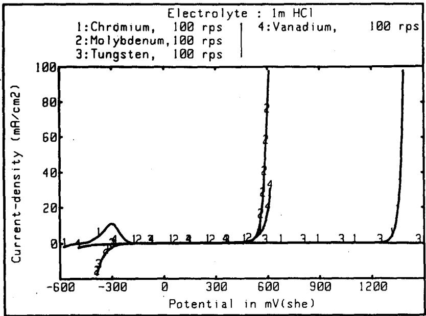
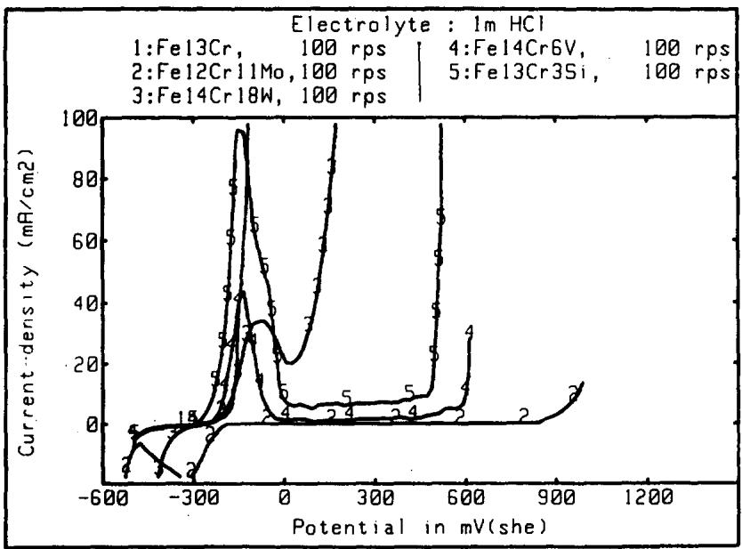
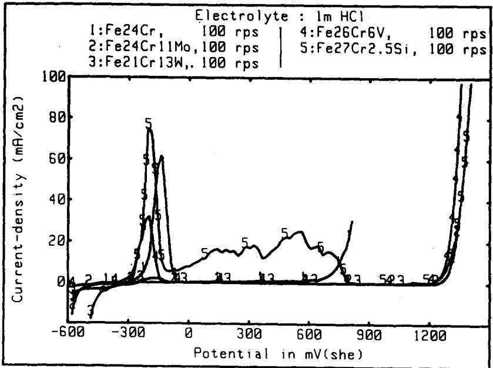
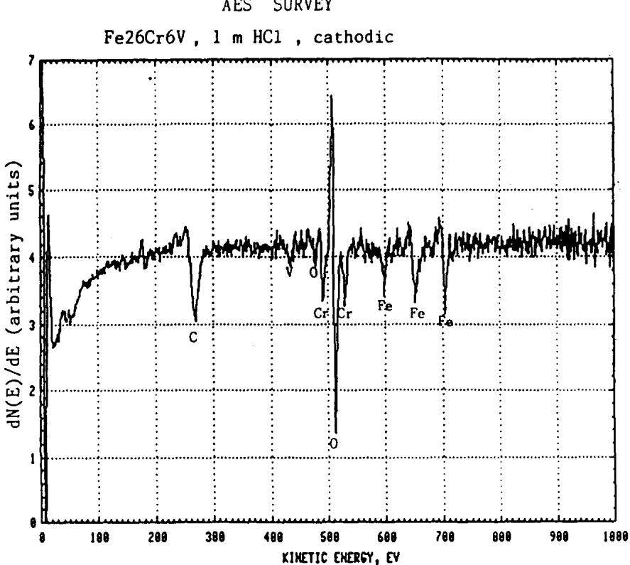
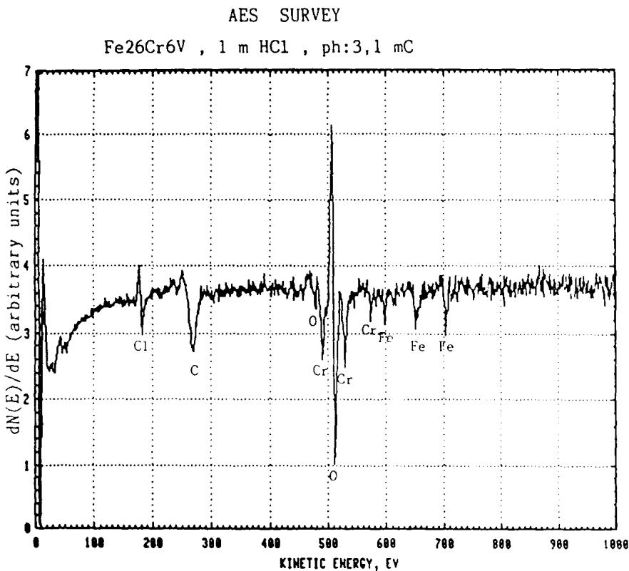
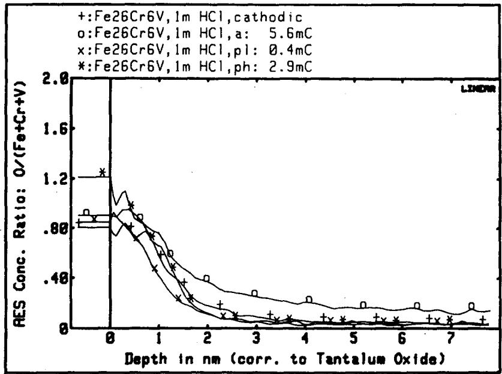
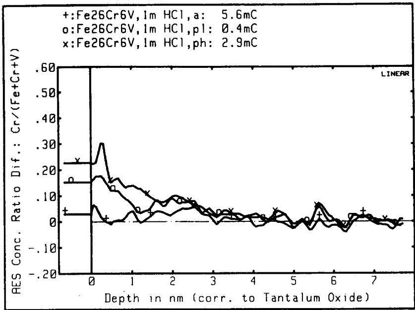
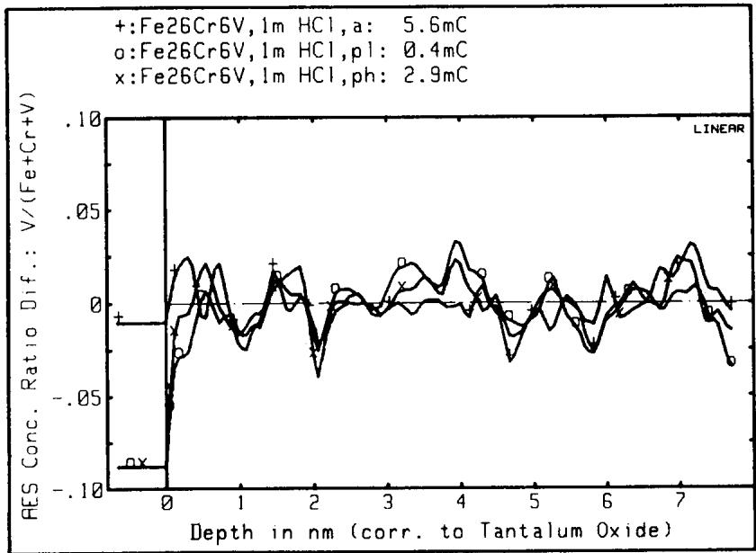

# THE INFLUENCE OF MINOR ALLOYING ELEMENTS ON THE PASSIVATION BEHAVIOUR OF IRON-CHROMIUM ALLOYS IN HCI

R. GoETz, J. LAURENT and D. LANDOLT

Materials Department, Swiss Federal Institute of Technology, Lausanne, Switzerland CH 1007

Abstract—The influence on the polarization behaviour in 1 M HCl of different alloying elements added in equal atomic concentration to ferritic Fe-13Cr-X and Fe-24Cr–X (X = 6 at.% of Mo, W, V or Si) is investigated using rotating disk electrodes. The presence of these additional elements facilitates passivation and increases the resistance to pitting of the alloys but there is no correlation between their relative effect on passivation current density and on pitting potential. AES depth profiling of Fe-24Cr-6V alloys shows that the ratio $\mathbf { V } / ( \mathbf { F e } + \mathbf { C r } + \mathbf { V } )$ at the surface is lower on samples polarized in the high passive potential region than on a cathodically polarized standard.

## INTRODUCTION

ThE coRrosion resistance of stainless steels is intimately related to their passivation behaviour. Generally, the higher the chromium content the more passivation is facilitated and chemical stability improved.1,2 Other elements are usually added to modify the structure and mechanical properties of the alloys and/or to increase corrosion resistance.

The most common alloying element is nickel which is an austenite former.³ In certain environments the presence of nickel may have a beneficial effect on corrosion behaviour. For example, in sulfuric acid solution it decreases the passivation current density and the current density in the passive state.4 On the other hand, nickel has hardly any influence on the value of the pitting potential in chloride media.2,7 The beneficial effect of molybdenum in increasing the resistance of stainless steels to pitting corrosion has been known for many years8,9 but is not yet sufficiently understood.10,11 Tungsten has been reported to improve resistance to pitting corrosion of both ferritic and austenitic alloys.8,9,12,13 In austenitic stainless steels silicon as well as vanadium have been found to increase the value of the pitting potential.12 On the other hand, manganese, due to sulfide formation, promotes pitting.14 Other metallic elements studied include copper5,15,16 and rhenium.12,17 Carbide forming elements such as titanium, niobium and tantalum are frequently added in small concentrations to austenitic stainless steels to reduce their susceptibility to intergranular corrosion.5,18 According to Tomashov et al.12 titanium increases and niobium and tantalum decrease the value of the pitting potential.

In our laboratory the reaction mechanism by which molybdenum improves the corrosion resistance of iron-chromium alloys in chloride media is being studied by electrochemical and surface analytical techniques.10,11,13,19,20 In this context it was considered of interest to compare the effect of alloyed molybdenum with that of other metals such as tungsten, vanadium and silicon that might exhibit similar behaviour. For that purpose, these elements were alloyed to binary Fe-Cr alloys in equal and relatively high atomic concentration. A comparison of the effect of different alloying elements must be done based on equal value of atomic rather than weight percent because large density differences between different alloying elements may otherwise lead to wrong conclusions. The use of a relatively high concentration is indicated to improve the signal to noise ratio of surface analytical measurements.

TOA  S :      SSES SES
<table><tr><td>Alloys</td><td>Cr</td><td>Mo</td><td>W</td><td>Si</td><td>V</td><td>Mn</td><td>C</td><td>S</td><td>0</td></tr><tr><td>Fe-13Cr</td><td>12.8(13.6)</td><td>&lt;0.001</td><td>一</td><td>0.033</td><td></td><td>&lt;0.001</td><td>0.0032</td><td>0.0040</td><td>0.0407</td></tr><tr><td>Fe-24Cr</td><td>24.3(25.6)</td><td>0.064</td><td></td><td>0.043</td><td></td><td>0.002</td><td>0.0033</td><td>0.0060</td><td>0.1099</td></tr><tr><td>Fe-12Cr-11Mo</td><td>12.2(13.6)</td><td>11.0(6.6)</td><td>0.02</td><td></td><td></td><td></td><td>0.0060</td><td>0.0090</td><td>0.0540</td></tr><tr><td>Fe-24Cr-11Mo</td><td>24.3(26.8)</td><td>10.9(6.5)</td><td>0.015</td><td></td><td></td><td>0.12</td><td>0.0090</td><td>0.0050</td><td>0.0450</td></tr><tr><td>Fe-14Cr-18W</td><td>13.9(16.9)</td><td></td><td>18.5(6.4)</td><td>0.031</td><td></td><td></td><td>&lt;0.0020</td><td>&lt;0.0020</td><td>&lt;0.0250</td></tr><tr><td>Fe-21Cr-13W</td><td>21.0(24.4)</td><td>0.07</td><td>13.1(4.3)</td><td>0.05</td><td></td><td>0.06</td><td>0.0070</td><td></td><td></td></tr><tr><td>Fe-13Cr-3Si</td><td>13.3(15.3)</td><td></td><td></td><td>3.0(6.3)</td><td></td><td>0.10</td><td>0.0100</td><td>0.0060</td><td>&lt;0.0020</td></tr><tr><td>Fe-27Cr-2.5Si</td><td>26.8(27.6)</td><td></td><td></td><td>2.4(4.6)</td><td></td><td>0.08</td><td>0.0050</td><td>0.0080</td><td>0.0190</td></tr><tr><td>Fe-14Cr-6V</td><td>13.9(14.7)</td><td></td><td></td><td>0.03</td><td>6.4(6.9)</td><td>0.02</td><td>0.0040</td><td>0.0060</td><td>0.0360</td></tr><tr><td>Fe-26Cr-6V</td><td>26.3(27.6)</td><td></td><td></td><td>0.04</td><td>5.8(6.2)</td><td>0.12</td><td>0.0070</td><td>0.0090</td><td>0.0550</td></tr></table>

Anetn n l    iann.

## EXPERIMENTAL METHOD

The chemical composition of the alloys used is given in Table 1. The binary Fe-Cr alloys were furnished by Climax Molybdenum. They were subsequently hot forged. The other alloys were prepared in our laboratory by alloying to the original Fe-Cr alloys the elements Mo, W, V or Si using a vacuum induction furnace under an argon atmosphere. The alloy homogeneity was checked by microprobe analysis and was found to be good. The metallographic examination revealed the presence of a few oxide inclusions in an otherwise apparently single phase ferritic matrix.

All studies were carried out with rotating disk electrodes of $0 . 1 \mathrm { c m } ^ { 2 }$ (diameter 0.357 cm) insulated with a PTFE shrinkable tubing. Experiments were performed at 6000 rpm (in part at 600 rpm) in 1 M HCl at 25°C under a nitrogen atmosphere. A Ag/AgCl reference electrode in saturated KCl was used.

A potentiostat (Amel 549 or 551) driven by a potential step motor unit (Wenking SMP 72) was used to determine polarization curves. The potential was increased in steps of 20 mV 400 s⁻ '. The current was monitored on a X-t recorder. Measured pseudo steady state values were digitized and evaluated on an HP 9845B computer.

Pretreatment of the electrodes included grinding with emery paper and polishing with alumina powder in water to 1/4 μm finish. They were rinsed and cathodically prepolarized in the working electrolyte at -700 mV(SHE) for 10 min.

Auger depth profile analysis of vanadium-containing alloys was carried out with a PHI 590 A scanning Auger apparatus including CMA, differentially pumped ion gun and fast interlock for sample introduction. The electron beam (3 keV, 100 nA) was scanned over an area of $1 7 3 \times 1 5 4 \ : \mu \mathrm { m } ^ { 2 }$ The angle of incidence was 30°. Sputtering was performed with a $1 \ \mathsf { K e V } \ \mathsf { K } \mathsf { r } ^ { + }$ beam at $4 3 ^ { \circ }$ scanned over $1 . 5 \times 2 ~ \mathrm { { m m ^ { 2 } } }$ CMA modulation was 3 V.

The electrodes to be analysed after cathodic prepolarization were held at a constant potential in the active $\mathrm { a t } - 3 0 0 \mathrm { m } \mathrm { V } ( \mathrm { S H E } )$ , the low passive at $+ 2 0 0 \mathrm { m V } ( \mathrm { S H E } )$ or the high passive potential region at +950 mV(SHE), respectively.

The charge passed was measured with a digital integrator (Amel 731). At the end of an experiment the electrodes were removed from the electrolyte without switching off the potentiostat. They were rinsed with distilled water and stored in a desiccator before being introduced into the UHV apparatus for analysis.

## EXPERIMENTAL RESULTS

## Polarization curves

Anodic polarization curves of Cr, Mo, W and V in 1 M HCl are shown in Fig. 1. Only Cr exhibits a measurable active-passive transition, the other elements are spontaneously passive or cannot be activated. Uniform transpassive dissolution of Mo and V sets in at potentials of approx. 550 mV(SHE), and of Cr at approx. 1250 mV(SHE). Tungsten exhibits a very low anodic current density up to potentials of several volts. This is attributed to the low solubility of $\mathbf { W O } _ { 3 }$ in HCl.

The data of Fig. 2 were obtained with Fe–13Cr and its alloys with approx. 6 at.% of either Mo, W, V or Si. The binary alloy in 1 M HCl undergoes uniform active dissolution but the addition of the three elements leads to polarization curves with a typical active-passive transition. The passivation potential of the Mo- and Wcontaining alloys is approx. 30 mV higher than that of the Si- and V-containing alloys while the passivation current density is lower. All alloys exhibit pitting with the pitting potential increasing in the order $\mathbf { W } < \mathbf { S i } < \mathbf { V } < \mathbf { M o }$ . The order of the pitting potentials of the different alloys is independent of the relative magnitude of the passivation current density.

  
FiG. 1. Polarization curves of Cr, Mo, W and V in 1 M HCl at 6000 rpm.

  
FiG. 2. Polarization curves of Fe–13Cr and Fe–13Cr–X alloys (X = 6 at.% Mo, W, V, Si) in 1M HCl at 6000 rpm.

  
FiG. 3. Polarization curves of Fe–24Cr and Fe–24Cr-X alloys (X = 6 at. % Mo, W, V, Si) in 1M HCl at 6000 rpm.

The binary Fe-24Cr alloy exhibits passivation and pitting (Fig. 3). Adding approx. 6 at.% of Mo, W or V lowers the passivation current density, the effect of V being less pronounced than that of W and Mo. No pitting occurs with these alloys, the range of stable passivity extending up to the potential of transpassive Cr dissolution. Alloying with Si leads to a similar transpassive behaviour but in the active and beginning passive potential region measured currents are substantially higher than with the other alloys and the passivation current density exceeds even that of the binary Fe–24Cr alloy.

The results of Figs 2 and 3 show that the effect of the alloying elements on passivation current density depends on chromium content. There is no correlation between their influence on passivation current density and on pitting potential.

## Surface analysis

Previous surface analysis studies on Fe-24Cr alloys containing ${ \bf M o } ^ { 1 0 , 1 1 }$ or $\mathbf { W } ^ { 1 3 }$ showed that these two metals are enriched at the surface in the active and beginning passive region. They are depleted at potentials higher than the transpassive dissolution potential of the respective pure alloying element.

AES SURVEY  
  
FtG. 4a. Auger survey speetra of Fe-27Cr–6V alloy after cathodie polarization.

The AES depth profile analysis of Si in oxide films on Si bearing Fe-Cr alloys is delicate because the main peak at the higher energy (1619 or 1606 eV for oxide and metal respectively) has a low sensitivity (0.07 relative to Cr 529 eV at 3 modulation) while the low energy peak (92 or 76 eV for oxide and metal respectively) interferes with the Fe 86 eV peak. The important chemical shift between oxide and metal introduces further uncertainties if multiplexing is used for depth profile analysis. For these reasons only the V-containing alloys were analysed with AES.

Typical AES spectra of Fe-26Cr-6V samples cathodically and anodically {high passive region, 950 mV(SHE)] polarized, respectively, are shown in Fig. 4. The spectrum of the cathodically polarized sample exhibits a small V peak at 437 eV (the other V peaks interfere with peaks of other elements) which is apparently absent on the sample polarized at 950 mV(SHE).

Under the applied conditions for depth profiling, the signal to noise ratio for V was relatively unfavourable. These conditions were chosen as a compromise of the following requirements: small current-density and beam voltage to reduce primary beam damage, slow sputter rate, not too many repetitions per energy window, small energy windows and a relatively short integration (rest) time per energy point (digital control) in order to get a sufficient number of points within the film. The spectrum of pure V shows four strong Auger peaks (31, 437, 473 and 509 eV)21 of which the peaks at 31 and 509 eV had to be discarded due to interference with peaks of Fe, Cr and O. The strongest Auger peak at 473 eV interferes with the Cr 559 eV and with the O 468 eV peak. This leaves the peak at 437 eV to be used for analysis although it might be slightly influenced by a minor peak of Cr at 447 eV. The V shows itself a peak at 431 eV which is too close to be correctly separated with the applied acquisition program (ESAU' version 4 of PHI). Finally, a chemical shift of a few eV towards higher energies was observed between oxidized and metallic V with the 437 eV peak. To overcome these problems a lower modulation amplitude than for the Mo bearing alloys" was employed (3 V) in order to increase the energy resolution. However, this does also generally decrease the peak heights. 'The energy interval for the V 437 eV peak was swept twice to increase the signal to noise ratio. The most critical step, the determination of the peak height, was finally ‘hand-evaluated': based on optimally expanded graphic plots of the individual energy window of V which were stored for every cycle through the profile, the height of the V 437 eV peak was measured and numerically fed back to the computer with a special program. Thus it was possible to separate the peaks at 431 and 437 eV.

  
FtG. 4b. Auger survey spectra of Fe–27Cr–6V after anodie polarization at 950 mV(SHE) (high passive potential region—ph).

Depth profiles were determined using Fe 703 eV, Cr 529 eV, V 437 eV, O 503 eV peaks. Figure 5 shows the ratio $\mathbf { O } / ( \mathbf { F e } + \mathbf { C r } + \mathbf { V } )$ as a function of depth for the cathodically polarized standard and for samples polarized anodically in the active, low and high passive potential regions. There is little difference in the oxygen profile between these samples indicating that the thickness of the surface film is approximately the same. The reason for this behaviour is surface oxidation taking place during rinsing and sample transfer into the UHV system. Apparently, the thickness of the surface oxide film formed spontaneously is of the same order as that of the passive film resulting from anodic polarization. A similar behaviour has previously been observed for Fe-Cr-Mo alloys."1

  
FiG. 5. AES oxygen depth profiles of Fe-26Cr–6V alloys subjected to polarization in the cathodic, active, low passive and high passive potential regions.

In order to reduce the influence of possible sputter effects, in particular preferential sputtering of Fe and Cr with respect to V, all depth profiles were evaluated on a relative basis. For that purpose the profiles of cathodically polarized samples were taken as reference and the difference between a profile measured on a sample polarized at a given anodic potential and the reference was calculated numerically for each point and plotted as a function of depth. Thus, in the Figs 6 and 7 a positive value indicates a relative enrichment compared to the cathodically polarized sample. The described procedure is applicable if the film thickness and the composition of the compared samples are not too different. For converting peak amplitudes into concentration elemental sensitivity factors were employed.21 To convert the time scale into a depth scale the mean sputter rate of $\mathbf { T } \mathbf { a } _ { 2 } \mathbf { O } _ { 5 }$ on Ta was used.

Figures 6 and 7 show difference profiles of $\mathbf { C r / ( F e + C r + V ) }$ and $\mathbf { V } / ( \mathbf { F e } + \mathbf { C r } + \mathbf { V } )$ respectively, for different potentials. In the passive potential region Cr is enriched in the anodic film. With increasing potential this enrichment becomes more pronounced. The same behaviour has previously been observed on Mo-containing alloys." Because of the unfavourable signal to noise ratio the V difference profiles are less certain. Active dissolution apparently does not lead to any substantial change in the V surface concentration with respect to the reference. This is different from the behaviour of the Mo- and the W-containing alloys11.13 but it is consistent with the polarization data of Fig. 3 which show that Mo or W decrease the current-density in the active potential region much more than V. In the case of Mo and W the inhibiting effect for active dissolution results from accumulation of these elements at the surface."1.13 It is therefore much less pronounced with V. In the passive potential region the outermost atomic layers of the oxide film are apparently depleted in V in both the passive low [200 mV(SHE)] and passive high [950 mV(SHE)] potential regions. The beneficial action of the presence of V on pitting (Fig. 2), therefore, cannot be explained by enrichment of the film with this element. In comparison, Mo under the same conditions may be enriched or depleted in the passive film depending on the potential.11

  
FiG. 6. AES difference profiles of Cr for Fe-26Cr–6V alloys polarized anodically into the active, low passive and high passive potential regions.

  
FiG. 7. AES difference profiles of V for Fe-26Cr–6V alloys polarized anodically into the active, low passive and high passive potential regions.

## DISCUSSION

The purpose of the study was to compare the influence of the alloying elements Mo, W, V and Si present in equal atomic concentration on passivation and passivity breakdown of Fe-Cr alloys in HCl. The most important result is that no direct correlation between the influence of a given alloying element on the passivation current density and on the pitting potential has been observed. Each phenomenon, therefore, should be discussed separately.

Passivation of Fe-Cr alloys is due to formation of a chromium rich oxide film. It occurs most readily with higher chromium contents.1,2 The present data in 1 M HCl are consistent with this view. Within the current density range of the present experiments Fe-24Cr exhibits an active-passive transition (Fig. 3) but not Fe-13Cr (Fig. 2). Alloying of Mo, W, V or Si favours passivation of Fe–13Cr alloys. This is readily understood by considering the polarization curves of the pure elements (Fig. 1) which all exhibit passivity in the potential region of interest (Si could not be measured due to low conductivity). The most efficient passivating element at equal atomic concentration is Mo which previously has been shown to become enriched at the alloy surface during active dissolution of the alloy. Vanadium, on the other hand, is not measurably enriched at the surface during active dissolution (Fig. 7). The presence of Si in Fe-24Cr unfavourably influences the passivation behaviour; the passivation current density is higher than in the absence of Si as well as the current density in the passive state up to potentials of 800 mV(SHE) (Fig. 3). Interestingly, at still higher potentials the passive current density decreases and pitting is suppressed.

Previously, it has been shown that both Mo and W are enriched (with respect to a cathodically polarized standard) in the passive film when the electrode is polarized in the low passive potential region, but depleted when it is polarized in the high passive potential region." The present AES data indicate that V is depleted in both the low as well as the high passive potential region (Fig. 7). Although in the case of the V alloy surface concentration changes are small and subject to an analytical uncertainty as described above, it may be concluded that for all three elements Mo,

W and V surface enrichment in the passive film is not the reason for the nonoccurrence of pitting in Fe-24Cr alloys.

The mechanism for passive film breakdown leading to pitting is still not suifficiently understood. In particular, it is an open question whether the passive film behaves as a static, non-porous oxide layer through which an ionic current flows²² or whether a dynamic equilibrium of film dissolution and build up at randomly distributed local sites takes place.23 The interpretation of the observed influence of alloying elements on the pitting potential depends on the model used for describing the passive film.

The occurrence of pitting in binary iron-chromium alloys is known to depend on the Cr/Fe ratio, i.e. on the activity of iron. Adding V decreases the iron activity in the alloy and thus is expected to diminish susceptibility to pitting. Whether such an effect involves a modification of ionic transport processes in a compact passive film as suggested by Mott,24 a change in charge transfer kinetics at the film-solution interface²5 or a change in repassivation kinetics on a film in dynamic equilibrium² cannot be decided at present.

## CONCLUSIONS

Added at equal atomic concentration (6 at.%) to Fe-13Cr alloys, Mo, W, V and Si increase the pitting potential in 1 M HCl in the order Mo $> \mathbf { V } > \mathbf { S i } > \mathbf { W }$ . The same elements added to an Fe-24Cr alloy suppress pitting entirely.

There is no correlation between the influence of the different alloying elements on passivation current density and on pitting potential.

The relative concentration of Mo, W and V at the surface of an Fe-24Cr-X alloy (X = 6 at.% Mo, W, V) polarized in the high passive potential region is lower than in the cathodically polarized standard. Surface enrichment of these elements can, therefore, be excluded as a significant factor for explaining suppression of pitting in these alloys.

The beneficial influence of additions of Mo, W, V and Si on the pitting resistance of ferritic iron-chromium alloys is tentatively attributed to a decrease in the iron activity of the alloys.

## REFERENCES

1. H. KAescHE, Die Korrosion der Metalle, 2, p. 193. Springer, Berlin (1979).

2. K. SuGIMOTo and Y. SAWADA, Corros. Sci. 17, 425 (1977).

3. C. J. NoVAK, Handbook of Stainless Steels (eds D. PeCHNER and I. M. BERNSTEIN), p. 4.1. McGraw-Hill, New York (1977).

4. G. P. CHERNOVA and N. D. ToMASHOv, Z. phys. Chem. 226, 136 (1964).

5. G. HERBSLEB, VDI Z. 123, 505 (1981).

6. H. J. ENGELL. and T. RAMCHANDRAN, Z. phys. Chem. 215, 176 (1960).

7. J. HoRVATH and H. H. UHLIG, J. electrochem. Soc. 115, 791 (1968).

8. P. MoNNARTZ, Metallurgie 8, 161, 193 (1911).

9. W. RoHN, Z. Metallk. 18, 387 (1926).

10. R. GoETz, Ph.D. thesis, EPFL, No. 469 (1982).

11. R. GoETZ and D. LANDoLT, Electrochim. Acta 29, 667 (1984).

12. N. D. ToMASHov, G. P. CHERNoVA and O. N. MARCoVA, Corrosion 20, 166 (1964).

13. R. GoETz, C. BoBAND and D. LANDoLT, Proc. 8th ICMC, p. 247. Mainz (1981).

14. K. J. BLOM and J. DEGERBECK, Mater. Performance 22, 51 (1983).

15. I. CLASs and H. GRAEFEN, Werkstoffe Korros. 15, 79 (1964).

16. J. M. DEFRANoUx, Corros. Sci. 3, 75 (1963).

17. H. BoíNI and H. H. UHLIG, Corros. Sci. 9, 353 (1969).

18. M. G. FonTANA and N. D. GREEN, Corrosion Engineering, p. 66. McGraw-Hill, New York (1967).

19. R. GoETZ and D. LANDoLT, Electrochim. Acta 27, 1061 (1982).

20. R. GoETz and D. LANDoLT, Proc. 9th ICMC, Vol. 4, pp. 23–27. Toronto (1984)

21. L. E. Davıs et al., Handbook of Auger Electron Spectroscopy (2nd edn). Physical Electronics Industries, Eden Prarie, Minnesota (1976).

22. J. K. VErtEr, Electrochemical Kinetics, p. 748. Academic Press, New York (1967).

23. B. MAcDoUGALL, D. F. MITCHELL, G. I. SPROULE and M. J. GRAHAM, J. electrochem. Soc. 130, 543 (1983).

24. N. F. MorT, Passivity of Metals and Semiconductors (ed. M. FRomENT), p. 1. Elsevier, Amsterdam (1983).

25. K. E. HEusLER, Electrochim. Acta 28, 439 (1983).

26. J. KruGER, Passivity and its Breakdown on Iron and Iron Base Alloys (eds R. W. STAEHLE and H. OκADa), p. 91. Natl. Assoc. Corr. Eng., Houston, Texas (1976).