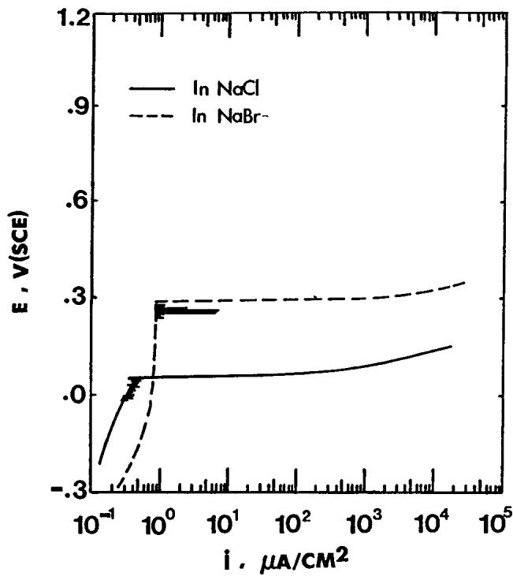
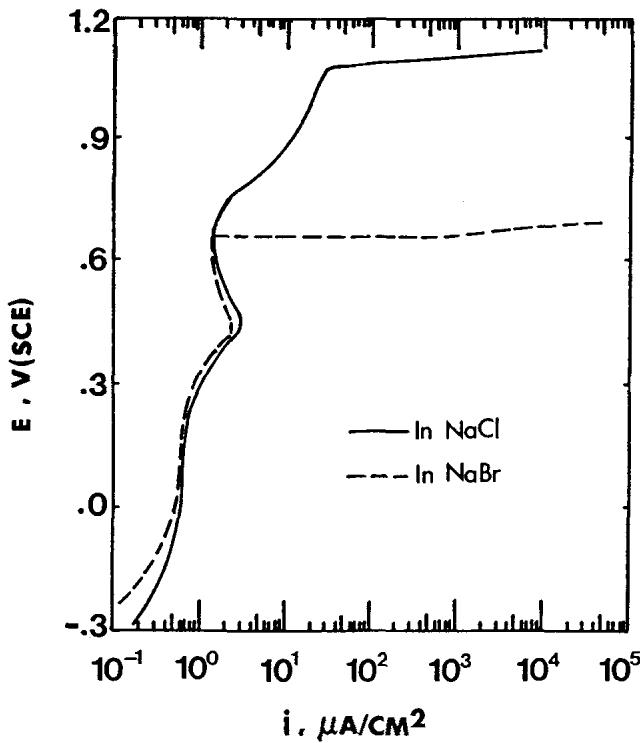
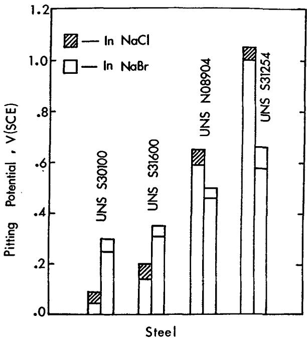
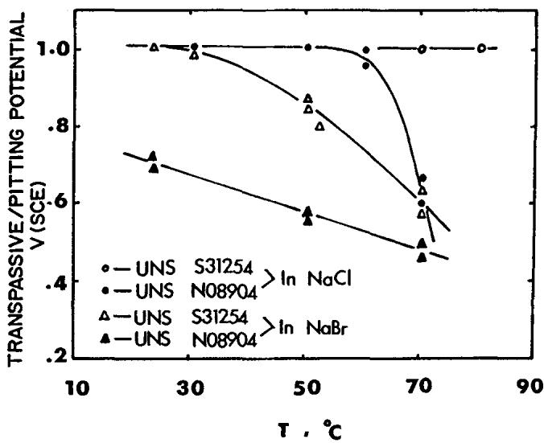
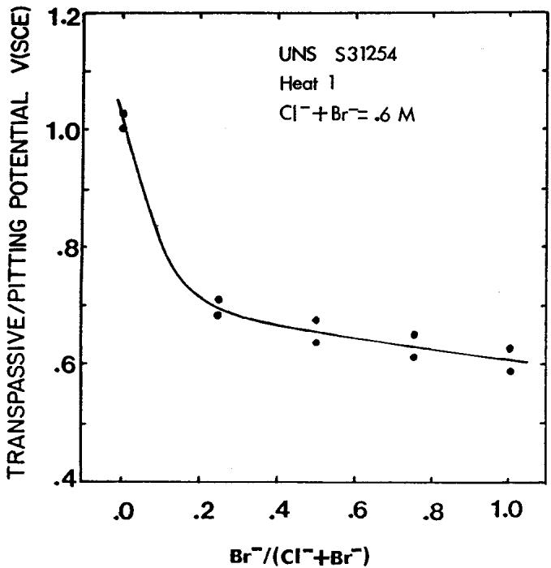
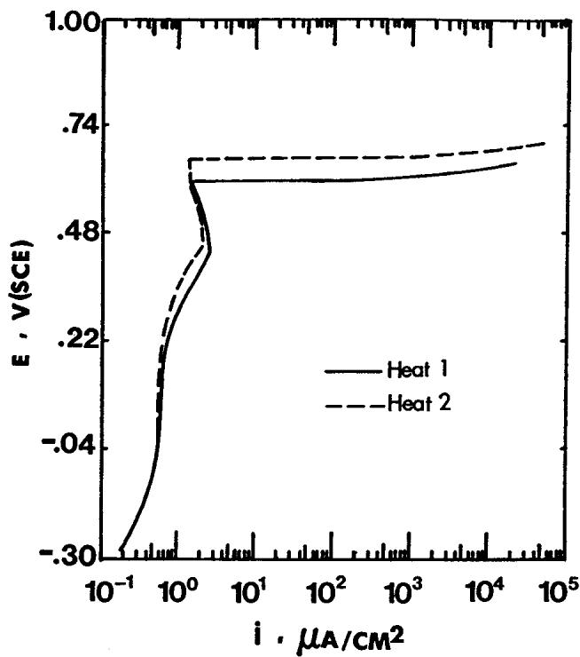
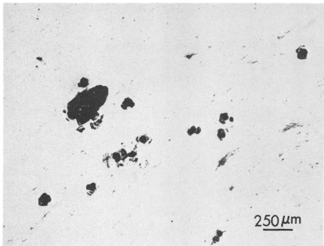
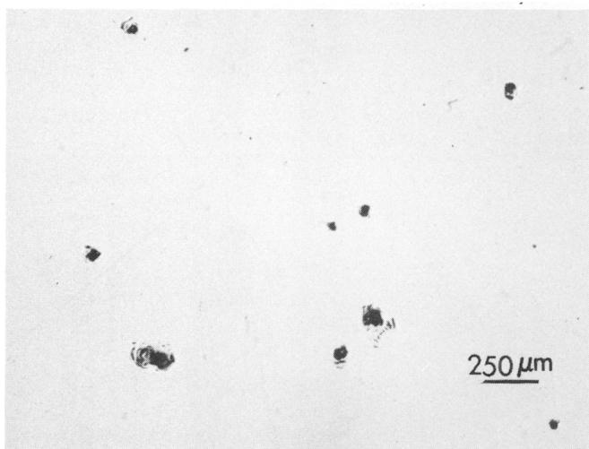

## CONCLUSIONS

HS steel has a higher trap density than LS steel. This conclusion follows from the greater quantity of nonmetallic inclusions (mostly sulfides) contained in HS steel than in LS steel, and also from the greater amount of hydrogen absorbed by HS steel than by LS steel under identical charging conditions.

Both steels suffer losses of ductility after charging. LS steel suffers an irreversible loss of ductility, while HS steel regains its ductility after 120 hours of aging.

Inclusion/matrix interfaces are strong trap sites that are still operative at 250°C.

The trapping energy of inclusion/matrix interfaces is greater in LS steel than in HS steel. This conclusion follows from almost the same hydrogen contents found in both steels after 120 hours of aging despite the higher trap density in HS steel.

During aging, the inclusion/matrix interfaces in both steels trap hydrogen taken from both the lattice and weak traps.

## ACKNOWLEDGMENT

This research was supported by the National Science Foundation under grant CPE-8319495. Helpful discussions with Dr. G.R. St. Pierre are gratefully acknowledged.

## REFERENCES

1. K.W. Lange and H.J. Koenig, Proc. Second Intern Congr. on Hydrogen in Metals, paper 1A 5 (Elmsford, NY: Pergamon, 1977).

2. M. lino, Acta Met. 30(1982): p. 377.

3. M. lino, Met. Trans. 16A(1985): p. 401.

4. M. Aucouturier, Proc. Conf. on Current Solutions to Hydrogen Problems in Steels, (Materials Park, OH: ASM International, 1982), p. 407.

5. J.Y. Lee, J.L. Lee and W.Y. Choo, ibid., p. 423.

6. G.M. Pressouyre and I.M. Bernstein, Met. Trans. 12A(1981): p. 835.

7. T. Asaoka, C. Dagbert, M. Aucoututier, and P. Lacombe Corrosion 36(1980): p 53.

8. J.P. Hirth, Met. Trans. 11A(1980): p. 861.

9. K. Kobayashi and Z. Szklarska-Smialowska, Met. Trans. 17A(1986): p. 2255.

10. A. Elkholy, J. Garland, P. Azou, and P. Bastien, Compt. rend. Acad. Sci. Paris 284, Ser. C(1977): pp. 2, 363.

11. M.A.V. Devanathan and Z. Stachurski, J. Electrochem. Soc. 111(1964): p. 619.

12. T. Zakroczymski and Z. Szklarska-Smialowska, J. Eiectrochem. Soc. 132(1985): p. 2545.

13. J. McBreen, L. Nanis, and W. Beck, J. Electrochem. Soc. 113(1966): p. 1218.

14. W.W. Scott Jr., Radex Rundschau 1/2(1981): p. 474.

15. G.M. Pressouyre and I.M. Bernstein, Met. Trans. 9A(1978): p. 1571.

16. R.B. McLellan, Acta Met. 27(1979): p. 1655.

# Pitting Susceptibility of Stainless Steels in Bromide Solutions at Elevated Temperatures ☆

R. Guo\* and M.B. Ives\*\*

## ABSTRACT

The pitting susceptibility of a range of austenitic stainless steels with different molybdenum contents was evaluated in both chloride and bromide solutions at elevated temperatures, using electrochemical polarization techniques. It is found that there is a less beneficial effect of molybdenum in solutions containing bromide ions than in those with chloride. Particular attention has been paid to the pitting behavior of UNS(¹)S31254 steel, which is found to be significantly more susceptible in bromide solutions. The effects of inclusions has also been observed on this alloy. The effect of molybdenum on pitting corrosion resistance in different aggressive solutions is discussed, and it is suggested that the interaction of molybdenum with specific aggressive anions should be taken into account in developing possible mechanisms

through which this alloying element improves the pitting corrosion resistance of iron-based alloys.

KEY WORDS: bromide, pitting, stainless steel.

## INTRODUCTION

The breakdown of passivity, which leads to localized corrosion, is a common type of failure of stainíess steels. The pitting behavior of stainless steels has been studied extensively in environments containing aggressive ions similar to those found in their operating environments, and reviewed by Smialowska,1 Galvele,² and Janik-Czachor et al.³ However, most work has been done in solutions containing chloride as the aggressive ions. This is presumably because chlorides are most commonly encountered in environments such as seawater, pulp and paper processing, and chemical plants in general. It is believed that chlorides are the most aggressive anions for the pitting corrosion attack of stainless steels.

There are only a few reports on the effect of molybdenum on pitting resistance of stainless steels in bromide solutions, and the results are not consistent with each other. A beneficial effect of

molybdenum on the pitting resistance of ferritic stainless steel in sodium bromide solution was reported by Bond.4 Molybdenum increased the pitting potential by almost the same magnitude as in chloride solution. However, Herbsleb et al.⁵ observed no difference in the influence of molybdenum in Cr-Ni and sodium chloride solutions.

In. the present study, tests were designed for a series of austenitic stainless steels with various molybdenum contents, to evaluate their pitting characteristics in bromide solution at elevated temperatures, and compare these with the behavior in chloride solutions.

## EXPERIMENTAL

## Materials

The series of austenitic stainless steels with different molybdenum contents shown in Table 1 were used in anodic polarization-controlled experiments. UNS S30100, UNS S31600, and UNS N08904 samples were cut from cold-rolled sheets, and UNS S31254 samples were taken from tube material. Two heats of UNS S31254 materials were tested because Heat 1 material was found to contain a significant quantity of titanium-rich inclusions, and was thus metallographically less clean than Heat 2 material. The pitting susceptibility of autogeneously welded zones, both annealed and unannealed, of UNS S31254 tubes was also studied.

The samples used for potentiodynamic measurements were surface ground to 600 grade silicon carbide paper, with additional fine polishing used for samples to be examined by optical or electron optical microscopy. Details of sample preparation can be found elsewhere.⁶

## Solutions

Chloride, bromide, and mixed neutral (pH \~ 7) solutions were prepared from analytical reagents, sodium salts, and distilled water. The ratios of [Br−]([Br] + [Cl-]) were chosen as 0.25, 0.50, and 0.75 for bromide-chloride mixed solutions, with a fixed total concentration [Br⁻] + [Cl] = 0.6 M. Test solutions were deaerated by nitrogen for one hour prior to the beginning of and for the duration of experiments.

## Procedures

Potentiodynamic measurements were carried out to determine pitting potentials and critical temperatures for pitting. Potentiodynamic polarization commenced at the free-corrosion potential after the sample had been immersed in the solution for 30 minutes, using a scan rate of600 mV/h.

Potentiostatic polarization for microscopic examination of pit morphology, pit distribution and inclusion behavior was conducted by holding the sample at a potential higher than the pitting potential. An optical and a Philips(²) model 515 scanning electron microscope were used to examine samples after potentiostatic treatment.

## RESULTS

Pitting potential, which is determined through potentiodynamic measurements, is believed to be a convenient measure of relative pitting susceptibility. Some results are shown in Figure 1 for UNS S30100 steel and Figure 2 for UNS S31254 steel (Heat 2), which are two extremes of molybdenum contents for commercial austenitic stainless steels, in 0.6 M sodium chloride and sodium bromide solution at 70°C. Although pitting potentials of UNS S31254 steel are higher than those of UNS S30100 steel in both solutions, it should be noted that chloride ions are more aggressive for UNS S30100 steel, while the reverse is true for UNS S31254 steel, suggesting that bromide ions are more aggressive in the higher molybdenum-content alloy

TABLE 1 Chemical Compositions of Steels (wt%)
<table><tr><td>Element Steel</td><td>C</td><td>Cr</td><td>Ni</td><td>Mo</td><td>Cu</td><td>N</td><td>Ti</td></tr><tr><td>UNS S30100</td><td>0.108</td><td>17.0</td><td>8.3</td><td>0.19</td><td>0.19</td><td>0.047</td><td>一</td></tr><tr><td>UNS S31600</td><td>0.06</td><td>17.2</td><td>10.5</td><td>2.0</td><td>0.25</td><td>0.049</td><td>一</td></tr><tr><td>UNS N08904</td><td>0.025</td><td>20.0</td><td>25.0</td><td>4.5</td><td>1.5</td><td>一</td><td>1</td></tr><tr><td>UNS S31254(A)</td><td></td><td></td><td></td><td></td><td></td><td></td><td></td></tr><tr><td>Heat 1</td><td>0.02</td><td>20.0</td><td>18.0</td><td>6.1</td><td>0.7</td><td>0.21</td><td>0.033</td></tr><tr><td>Heat 2</td><td>0.02</td><td>20.0</td><td>18.0</td><td>6.1</td><td>0.7</td><td>0.21</td><td>一</td></tr></table>

(A)Nominal values for all except titanium, which was directly analysed.

  
FIGURE 1. Anodic polarization curves for UNS S30100 steel in 0.6 M chloride and bromide solutions at 70°C.

Potentiodynamic polarization experiments were also conducted for UNS S31600 and UNS N08904 steels, thereby providing a more complete range of molybdenum contents from 0 to 6 wt%. The measured pitting potentials for these alloys are plotted in the histogram of Figure 3 where the alloys are placed in order of increasing molybdenum content. Alloying with molybdenum greatly increases the pitting potential in chloride solution, while a much smaller increase of pitting potential was observed in bromide-containing solution, resulting in less resistance of high-molybdenumbearing steels to pitting corrosion in the environments containing bromide ions.

Figure 4 gives the dependence of the transpassive and/or pitting potentials on temperature for UNS S31254 (Heat 1) and UNS N08904 steels in chloride and bromide solutions. Critical temperatures for pitting can be defined from those results, and are listed in Table 2. Critical temperatures for pitting are much lower in bromide than in chloride solution for both types of steels. These steels may be pitted in bromide solution even at room temperature.

  
FIGURE 2. Anodic polarization curves for UNS S31254 steel in 0.6 M chloride and bromide solutions at 70°C.

  
FIGuRE 3. A comparison of pitting potentials for four types of austenitic stainless steels in 0.6 M chloride and bromide solutions at 70°C. Indicated on each bar is the range of potentials measured experimentally.

UNS S31254 steel, as mentioned above, is very resistant to pitting corrosion attack in chloride-containing environments. The laboratory tests have indicated that no local breakdown of passivity was observed in UNS S31254 samples (Heat 1), even in 2 M sodium chloride solution at 80°C.

Pitting susceptibility of UNS S31254 (Heat 1) was studied at 70°C in chloride-bromide mixed solutions with proportions of 0,

  
FIGURE 4. Variations of transpassive and/or pitting potentials for stainless steels with temperature in 0.6 M chloride and bromide solutions.

TABLE 2  
Critical Temperature for Pitting (°C)
<table><tr><td>Solution Steel</td><td>Chloride</td><td>Bromide</td></tr><tr><td>UNS N08904</td><td>60</td><td></td></tr><tr><td></td><td></td><td>&lt;23</td></tr><tr><td>UNS S31254</td><td>&gt;80</td><td>30</td></tr><tr><td></td><td></td><td></td></tr></table>

0.25, 0.5, 0.75, and 1.0 bromide, but with a fixed total halide concentration (0.6 M). The results are shown in Figure 5. Pitting potential decreases with an increase in the bromide ion ratio with a large change being produced by only a small quantity of bromide.

Heat 1 of UNS S31254 steel contained a high population of titanium inclusions. Titanium inclusions were found in earlier studies6.7 to be nucleation sites for pitting in UNS 30100 and UNS 31600 steels, behaving cathodically. Figure 6 gives potentiodynamic polarization results for the two heats of UNS S31254 steel in 0.6 M sodium bromide at 70°C, which shows that the pitting potential for the higher inclusion content material is slightly lower than that for the cleaner alloy. So Heat 1 material is a little more susceptible to pitting attack.

It is expected that titanium inclusions behave as cathodic sites, causing anodic dissolution of the adjacent matrix. The pit density and its morphology were inspected after potentiostatic treatment of UNS S31254 at 800 $m V _ { s c E }$ in 0.6 M sodium bromide at 80°C for 5 min. The results are shown in Figure 7 for Heat 1 material and Figure 8 for Heat 2. Higher density and bigger pits are formed on the sample of “dirty” material after identical treatments.

Pitting susceptibility of welded zones, as-welded or welded and annealed, of UNS S31254 tube material was also evaluated by pitting potential measurements and microscopical observations. No difference was found in pitting potential between the matrix and the welded zone, with or without annealing treatment in 0.6 M sodium bromide solution at 50°C and 70°C. No preferential attack along the welded zones was observed in the samples after the anodic polarization in bromide solution at 50 to 80°C. Therefore, welds are not critical sites for pitting corrosion attack of UNS S31254 steel, at least under controlled laboratory test sample conditions.

  
FIGuRE 5. Dependence of transpassive and/or pitting potential on [Br−]/([Br−] + [CI- ]) ratio for UNS S31254 steel at 70°C with a fixed total halide concentration of 0.6 M.

  
FIGURE 6. Anodic polarization curves for Heat 1 and 2 materials of UNS S31254 steel in 0.6 M sodium bromide at 70°C.

## DISCUSSION

It is well known that alloying iron-base alloys with molybdenum greatly increases pitting resistance, so high-molybdenumcontaining alloys, such as UNS N08904 and UNS S31254, have been developed for industrial applications in aggressive environments. Although the protection mechanism of molybdenum is not clearly understood, their successful applications in chloride-containing environments are well recognized.

  
FIGURE 7. Pits formed in the UNS S31254 sample, Heat 1, after potentiostatic polarization at 800 $m V _ { s c E }$ in 0.6 M sodium bromide at 80°C for 5 min.

  
FIGURE 8. Pits formed in the UNS S31254 sample, Heat 2, after the same treatment as in Figure 7.

However, these studies suggest a limitation in the application of high molybdenum austenitic stainless steels in bromide solutions. Comparison of pitting resistance in chloride/bromide solutions, as shown in Figure 3 and 4, shows that alloying with molybdenum proves a smaller improvement of pitting corrosion resistance in bromide than in chloride solutions. In addition, the critical temperatures for pitting (Table 2) clearly show a dramatic drop in pitting resistance of high-molybdenum-bearing steels in bromide solution. Pitting attack of UNS S31254 can occur even in the presence of a small amount of bromide ions in solution (Figure 5).

Pitting corrosion can be caused by a variety of different anions, such as halides, perchlorates and thiocyanates, as summarized by Smialowska.8 It is claimed that the most aggressive ion is chloride, which produces pits in iron, nickel, aluminum, titanium, zirconium, and their alloys. However, whether chloride or bromide is the more aggressive is dependent on the alloy. Lower pitting potentials have been found in bromide than in chloride solutions for titaniumº and tantalum.1º Hence bromide ions are apparently more aggressive than chloride ions in these alloys also.

Some efforts have been made to explain these phenomena based on the mobility, radius, and free energy of adsorption of halide ions.11 The acidity of hydrochloric and hydrobromic acids may also be taken into consideration. According to the anion adsorption theory of Uhlig,1² the stronger the ability of anions to adsorb on the surface of a metal, the easier it is for passivity to be broken. The mobility determines the accumulation rate of aggressive ions, which must reach a critical concentration for the initiation of pits.13 For the ion penetration model,14 anions of smail radius have easier access to the passive film. According to the localized acidification theory,² the drop of pH and accumulation of chloride, ions within pits make the pit environment similar to hydrochloric acid, which is more destructive than hydrobromous acid.

No theory has taken into consideration the specific interaction between molybdenum and the aggressive anions, but there are clear differences in the behavior of alloyed molybdenum in chloride and bromide solutions, as shown in this work. It would appear that there is a specificity in the ability of molybdenum to improve pitting resistance in the various aggressive ions. This specificity suggests that there is an important chemical relationship betwéen the molybdenum and the aggressive ion, and that this is stronger in the case of chloride than of bromide.

## CONCLUSIÓNS

UNS N08904 and UNS S31254 are more susceptible to pitting corrosion in bromide than in chloride, as evidenced by the relative pitting potentials and the “critical pitting temperatures."

Variations in cleanliness of UNS S31254 affect the pitting resistance in bromide solution, and the nucleation of pits at titaniumrich inclusions occurs, but there is little commensurate change in the measured pitting potentials.

There is a specificity in the action of molybdenum in controlling pitting corrosion in the presence of chloride and bromide, suggesting that the mechanism of this action is related to the detailed chlorine or bromine chemistry of molybdenum.

## ACKNOWLEDGMENTS

This research was performed under a contract with Chemetics International Company, a division of C.I.L. Inc., and with the support of the Natural Sciences and Engineering Research Council of Canada

## REFERENCES

1. Z.S. Smialowska, Corrosion 27(1971): p. 223.

2. J.R. Galvele, Passivity of Metals, ed. R. Frankenthal, J. Kruger (Pennington, NJ: Electrochemical Society, 1978), p. 285.

3. M. Janik-Czachor, G.C. Wood, and G.E. Thompson, Brit. Corros. J. 15(1980): p 154.

4. A.P. Bond, J. Electrochem. Soc. 120(1973): p. 603.

5. G. Herbsleb, H. Hildebrand, W. Schwenk, Werkst. Korros. 27(1976): p. 618.

6. M.B. Ives, G. Ruijin, S.C. Srivastava, in Proceedings, 10th International Congress on Metallic Corrosion, Vol. 4 (Calcutta, India: Oxford & IBH Publishing Co., 1987), p. 3225.

7. S.C. Srivastava, M.B. Ives, Corrosion 45,6(1989): p. 488.

8. Z.S. Smialowska, Pitting Corrosion of Metals (Houston, TX: NACE, 1986), p. 201.

9. T.R. Beck, Localized Corrosion, ed. R. Staehle, B. Brown, J. Kruger, A. Agrawal, (Houston, TX: NACE 1974), p. 644.

10. M.F. Abd Rabboh, P.J. Boden, Localized Corrosion, ed. R. Staehle, B. Brown, J Kruger, A. Agrawal, (Houston, TX: NACE, 1974), p. 653.

11. H.J. Ratzer-Scheibe, H.G. Teller, Corros. Sci. 13(1973): p. 11.

12. H.P. Leckie, H.H. Uhlig, J. Electrochem. Soc. 113(1966): p. 1262.

13. G. Ruijin, H. Shizhong, J. of Chinese Society of Corrosion and Protection 6(1986): p. 113.

14. T.P. Hoar, D.C. Mears, G.P. Rothwell, Corros. Sci. 5(1965): p. 279.

# Electrochemical Investigation of Hydrogen Absorption of Type 304 Stainless Steel in 0.05 M $N a _ { 2 } S O _ { 4 }$ Solutions of Different pH at $9 5 \%$ ☆

N. Ohnaka and Y. Furutani\*

## ABSTRACT

An investigation of the permeation rate of electrolytic hydrogen through a type 304 (UNS(1) S30400) stainless steel membrane using an electrochemical technique is described. The variation of the permeation rate with cathodic overpotential has been determined in acidic (0.005 M $H _ { 2 } S O _ { 4 } + 0 . 0 5$ M $N a _ { 2 } S O _ { 4 } , p H = 2 . 5 ) ,$ neutral $( 0 . 0 5 \ M \ N a _ { 2 } S O _ { 4 } , p H = 7 . 2 )$ and alkaline (0.01 N NaOH+ 0.05 M $N a _ { 2 } S O _ { 4 } , p H = 1 1 . 8 )$ solutions under deaerated condition. The electrochemical relationships between electrochemical parameters like cathodic overpotential, cathodic current, and permeation current, indicate that hydrogen evolution and absorption reactions occur through different mechanisms depending on solution pH. A coupled-discharge recombination is confirmed in acidic solutions. Some indications were obtained in neutral and alkaline solutions that a direct absorption mechanism without an adsorption state may operate. The critical potentials above which the hydrogen entrance is unlikely to occur were determined from aerated permeation experiments. These potentials coincide with