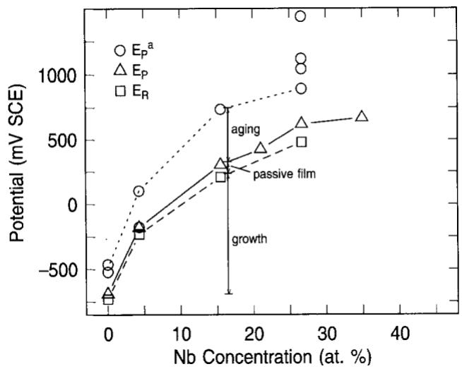
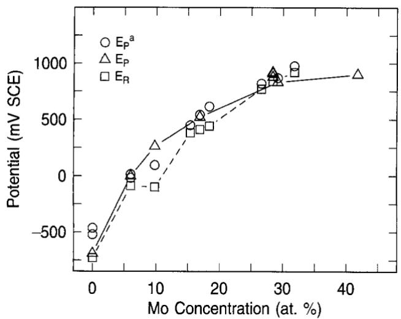
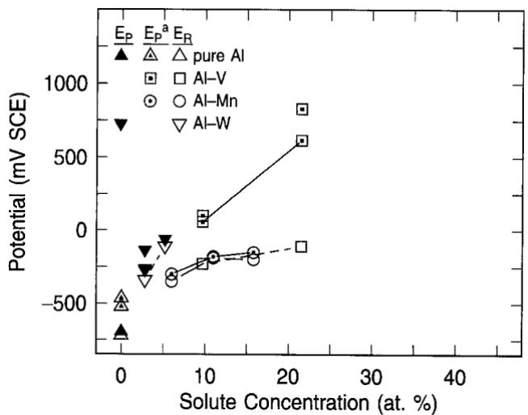
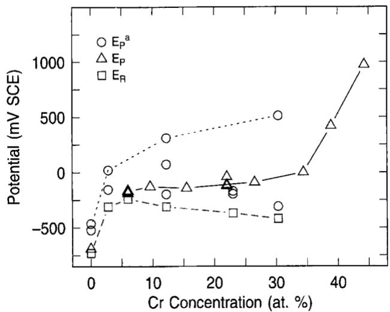
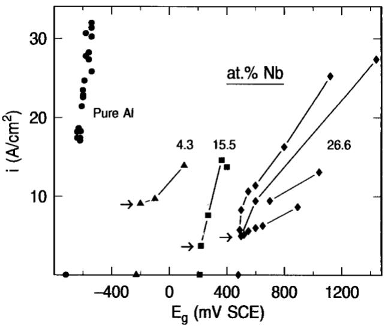
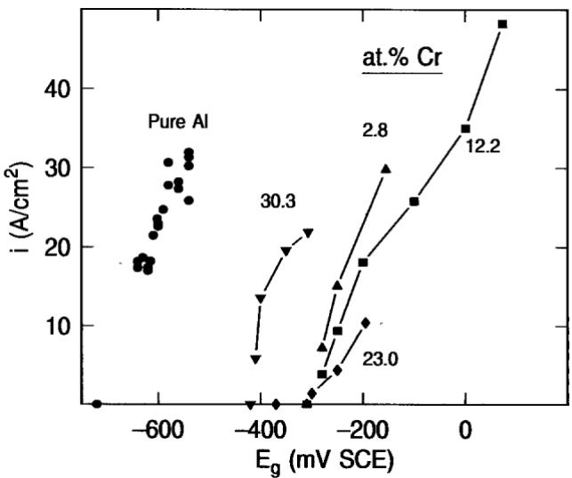

http://www.ecsdl.org/getpdf/servlet/GetPDFServlet?filetype=pdf&id=JESOAN000140000008002192000001&idtyp e=cvips&prog=normal

© The Electrochemical Society, Inc.1993. All rights reserved. Except as provided under U.S. copyright law, this work may not be reproduced, resold, distributed, or modified without the express permission of The Electrochemical Society (ECS). The archival version of this work was published in Journal of the Electrochemical Society, 1993, Volume 140, Issue 8, Pages 2192-2197.

# On the Pitting Resistance of Sputter-Deposited Aluminum Alloys

G. S. Frankel \* R. C, Newman,a C. V. Jahnes, and M. A. Russak

IBM Research Division, T. J. Watson Research Center Yorktown Heights, New York aUMIST, Corrosion and Protection Centre, Manchester, England

## Abstract

The pitting behavior of sputter-deposited Al binary alloy thin films was studied. Pitting and repassivation potentials were determined in 0.1M NaCl for samples in freshly deposited and air-aged states. Aging for several years in laboratory air increased the pitting potential for some of the alloy systems but had no effect on others. The repassivation potentials, meaningful values for pits in thin films, were found to be very close to the pitting potentials of freshly-deposited films for many alloy systems. Stable pits initiate in these Al binary alloys at potentials just above the value at which they would repassivate, indicating that pit growth considerations control the pitting process. By determining the pit anodic current density just before passivation it is shown that alloying improves pitting resistance through a reduction in the ability of pits to maintain the critical local environment necessary for growth. The influences of alloying on the passive film chemistry and on the tendency of the metal to repassivate (depassivation pH) are secondary in nature.

Sputter-deposited supersaturated Al binary alloys have been shown to exhibit remarkable pitting resistance in chloride solutions.1-6 The pitting potential, measured in 01M Cl−, for Al alloyed with about 5 atom percent (a/o) of any of a number of elements is about 600 mV higher than that for pure Al. Alloys with Mo, Nb, and Ta have pitting potentials that increase steadily with solute content at least to 40 a/o. AlW alloys have been reported to exhibit even better pitting resistance for a given composition.6,7 Interestingly, the pitting potential for AlCr alloys is independent of concentration and comparatively low for alloys in the range of 5-35 a/o Cr.3

Moshier and coworkers have studied the evolution of the passive film chemistry for a number of sputtered Al alloys.2,4,5 They have attributed the improved pitting resistance to enrichment of the solute element in the passive film. Specifically, passive films on AlTa, AlMo, and AlCr alloys were found to be enriched with ${ \mathrm { T a } } _ { 2 } { \mathrm { O } } _ { 5 }$ $\mathbf { M o O } _ { 4 } ^ { - 2 } .$ , and CrOOH, respectively. It was suggested that these species impede the ingress of chloride through the passive film. Surface analysis of films formed near the pitting potential suggested to them that pitting occurred either as a result of changes in the passive film (oxidation of $\mathrm { C r } ^ { + 3 } ~ \mathrm { t o } ~ \mathrm { C r } ^ { + 6 }$ or replacement of $\mathbf { M o O _ { 4 } } ^ { - 2 }$ with ${ \mathrm { M o } } ^ { + 4 } )$ or by field-assisted penetration of chloride (in the case of AlTa, which has a thin passive film). In contrast to these systems, W has been found to be depleted from the passive film on AlW alloys.6,7 This occurs despite the observation that alloying with W is extremely effective in improving pitting resistance.

Others have proposed that the enrichment of solute ions in the passive film on these Al alloys decreases the pH of zero charge, which in turn acts to repel chloride ion from the electrode surface.8 Recently, the work on AlW alloys has prompted Smialowska to suggest that the solute elements exert their influences at the active pit surface rather than in the passive film.3 She has proposed that the limited solubility of the oxidized solute phase in the acidic pit environment is responsible for the improved resistance to pitting.

This paper presents data to support the idea put forth by Frankel and Newman that the alloying of Al by sputter-deposition might alter the kinetics of the dissolution process.10 A similar argument has been proposed for the role of Mo in stainless steels.11,12 By analysis of repassivation and pitting potentials, along with the pit current densities, it will be shown that the role of solute enrichment in the passive film on sputtered Al alloys is small in comparison to changes in the ability of a pit to sustain the conditions necessary for growth.

The notion of repassivation or protection potential has been in the literature for thirty years.13 However, the utility of the repassivation potential has been questioned because of evidence showing that it depends strongly on experimental parameters such as the potential scan rate and the charge passed between pit initiation and the point of reversal scanning direction.14,15 Studies of pits in thin metallic films on inert substrates have shown that, in contrast to pits in bulk samples, the repassivation potential is a reproducible and meaningful value because there is no increasing dimension to result in an increasing diffusion path or ohmic potential drop.16,17 Pits in thin films grow in a 2-D fashion with a constant current density and repassivate at the potential at which the current density is so low that the critical pit environment cannot be maintained. The repassivation potential for pits in NiFe thin films has been found to be slightly dependent on thickness, and just above the intersection with the potential axis of a linear extrapolation of the pit current density vs. potential curve.17

An analysis of pit growth in thin film samples has shown that ohmic and charge-transfer considerations may be important below the limiting current density and that the position of the current density vs. potential curve along the potential axis is controlled by both thermodynamics, through the reversible potential of the alloy in the pit environment, and kinetics, through the exchange current density.17 The position of this curve and the repassivation potential therefore provide a measure of the influence of the rate of dissolution in the pit on the pitting potential.

It should be noted that growth and repassivation of stable pits are described in this paper. However the relevance of these data to the phenomenon of metastable pitting will be discussed.

## Experimental

Thin-film sputter-deposited samples, with thickness in the range of 1000-2000 Ǻ, were tested in stagnant, air-exposed 0.1M NaCl. Samples were examined with no pre-treatment of the surface, other than washing with water. The samples were masked with a sputter-deposited oxide film as described previously18 and pressed against the bottom of a Plexiglas cell, facing upwards, using a Viton o-ring. An SCE reference electrode was used and all potentials are referred to this scale.

The potential was scanned at a rate of 1 mV/s anodically from open circuit until a stable pit formed, as evidenced by an abrupt and prolonged increase in current. At that point, which is defined as the pitting potential, the scan was halted and the potential was held constant for a period. Images of the growing pit were recorded using a system described previously16 and the potential was then stepped downward (in the active direction) in increments of 10-100 mV to potentials which were maintained for periods of 15-120 s before further downward stepping. At relatively high potentials close to the pitting potential where the pit growth rate was high, the potential was held for only short periods (≈15-20 s) before stepping the potential down further, and large potential steps were applied. At potentials near the repassivation potential, where the rate of pit growth was lower, each potential was applied for longer periods and the steps were 10 mV in size. In this fashion it was possible to determine accurate values of the repassivation potential, $E _ { \mathrm { R } }$ , which is defined as the point at which the pit was observed to stop growing. Given the resolution of the optical system, the fact that the pit image was unchanging for 120 s indicates that the pit current density after repassivation was less than about ${ \bar { 0 } } . 2 { \bar { 5 } } \ \mathrm { A } / \mathrm { c m } ^ { 2 } .$ . A sudden drop in dissolution rate of over 20 times following a decrease in potential of only 10 mV was quite obvious and clear evidence of repassivation. This approach to measuring $E _ { \mathrm { R } }$ is not possible for pits in bulk samples for which the active pit surface is not entirely visible. Optical determination of $E _ { \mathrm { R } }$ for pits in thin films is much more accurate than the commonly used method of ascertaining the interception of the reverse scan with the forward scan. The passive current density for these Al alloys may vary considerably with potential and is a function of prior polarization history. As a result, the intersection of the forward and reverse scans may not be related to cessation of pitting. Furthermore, pits in thin films grow rapidly and can quickly reach the sample edge and then continue with different controlling considerations as crevice corrosion under the masking material. By constantly examining the pit, it is possible to be sure that such complications are prevented.

Many of the samples were deposited 2-4 years earlier and kept during that time at room temperature in plastic boxes, but otherwise unprotected from the laboratory atmosphere. The pitting potentials of these aged samples were compared to values measured on the same samples (or sister samples deposited in the same run) in the freshly deposited condition several years earlier.3 New samples of some compositions were deposited to check the pitting potentials of freshly deposited alloys reported previously. Most of the repassivation potential measurements were made on aged samples as it was assumed that $E _ { \mathrm { r } }$ would not change with aging. This assumption is supported by the fact that the repassivation potentials for aged and freshly deposited samples of the same composition were identical. Furthermore, aging will only affect the very top fraction of the samples, whereas repassivation involves cessation of dissolution of a cross section of the whole alloy thin film, which is unchanged by room-temperature aging. It is not expected that aging of these alloys at room temperature results in microstructural changes such as precipitate formation, which is commonly associated with commercial Al alloys. The formation of precipitates would increase the corrosion and pitting susceptibility. The microstructures of these supersaturated alloys remain stable during prolonged storage at room temperature and, as will be shown, exhibit improved resistance to pitting. For the purpose of this work, "freshly deposited" samples were tested within a few months of deposition, while "aged" samples were tested more than a year after deposition. It should be noted that the earlier study used 0.1M NaCl adjusted to a pH of 10 with NaOH and a slower scan rate of 0.2 mV/s.

The anodic current density at the pit surface was determined for some of the pits at each potential step during the approach to $E _ { \mathrm { R } }$ by analysis of the images of the growing pit using a method described previously.16,17 In most experiments, more than one pit formed. As a result, the net current density and the rate of the hydrogen evolution were not determined. However, copious hydrogen gas evolution was observed during many of the experiments. Weighted values of $n , \mathsf { p } ,$ and M were used in the analysis where these constants have their usual meanings.

  
Fig. 1. Pitting potentials for freshly deposited samples, $E _ { \mathrm { p } } ,$ and aged samples $E _ { \mathbf { p } } ^ { \mathbf { a } }$ along with repassivation potentials, $\mathbf { { { E } } _ { R } } ,$ for pure Al and AlNb alloys.

## Results

Pitting potentials measured on aged samples and repassivation potentials provided considerable insight into the role of the solute additions in increasing pitting resistance. Each alloy system behaved somewhat differently and is discussed in turn. Data for the AlNb system are given in Fig. 1. The pitting potentials for AlNb films increased by about 300 mV during a storage period of 4 years. As was true for most alloy systems, the scatter in the pitting potentials for aged samples was quite large. The pitting potentials for the freshly deposited samples determined in the earlier study also exhibited considerable scatter and the values reported were averages of several experiments. For aged AlNb samples, however, the pitting potential was typically much higher than that found for corresponding samples in the freshly deposited condition. The repassivation potentials were only about 100 mV lower than the pitting potentials measured on freshly deposited samples. In contrast to the pitting potentials, the repassivation potentials were reproducible to within ±10 mV. This very small scatter in $E _ { \mathrm { R } }$ has been observed for all thin film systems studied to date and is in contrast to the behavior of pits in bulk samples. As mentioned, $E _ { \mathrm { R } }$ was found previously to vary with NiFe metal film thickness over the range 300 Ǻ-1 µm.17 The samples in this study, however, all had a thickness within the range 1000- 2000 $\mathring \mathrm { A } .$ , so the influence of thickness variations was minimal.

The behavior of pure Al films is also shown in Fig. 1. Freshly sputter deposited Al films exhibit a pitting potential of −690 mV SCE, which is close to the value observed for pits in bulk pure Al in 0.1M NaCl. The pitting potential for Al films aged 4 years was about 200 mV higher, a factor that is well beyond the range of scatter for freshly deposited samples. The value of $E _ { \mathrm { R } }$ for pure Al films was found to be only about 25 mV below the pitting potential for freshly deposited films.

Figure 2 shows data for the AlMo system. Some new AlMo samples were examined and found to have similar pitting potentials to the freshly deposited samples examined in the previous study despite the differences in solution pH and scanning rate. Unlike the AlNb system, the pitting potentials of aged AlMo samples were not higher than those of freshly deposited samples. Except for one concentration, the values of $E _ { \mathrm { R } }$ were only about 50 mV

  
Fig. 2. Pitting potentials for freshly deposited samples, $E _ { \mathrm { p } } ,$ and aged samples, $E _ { \mathbf { p } } ^ { \mathbf { a } }$ along with repassivation potentials, $E _ { \mathrm { { R } } } ,$ for pure Al and AlMo alloys.

lower than the pitting potentials. $E _ { \mathrm { R } }$ for the 10% Mo alloy was anomalously low. This value was measured on an aged sample, and the pitting potential was also low. The older samples were deposited from two targets (Al and the solute element) and the compositions were determined by averaging the compositions, measured by Rutherford backscattering, of films on small carbon substrates placed to either side of each sample during deposition. This method was general quite reliable. However, given the small scatter in the measurement of $E _ { \mathrm { { R } } }$ , the anomalous behavior for this sample is likely due to an error in the measurement of concentration.

Aged AlW samples were not tested because the original study did not include this system. However, freshly deposited AlW samples with up to 5.2% W were examined and the data are shown in Fig. 3. Comparison with Fig. 2 reveals that the pitting potentials of AlW samples were similar to those of AlMo samples with similar compositions. For instance, the pitting potential of Al-5.2% W was about −60 mV SCE. This is in contrast to reports by Shaw et al. who have indicated that this alloy should not pit until above 800 mV SCE.7 Similar to the behavior of the AlMo system, the repassivation potentials for pits in AlW were only about 50 mV below the pitting potentials.

The AlCr alloys exhibited yet a different behavior, Fig. 4. Pitting potentials for aged AlCr samples were particularly nonreproducible; some aged samples improved tremendously while others actually had lower pitting potentials than freshly deposited samples. Included in Fig. 4 are two alloys that were recently deposited and tested in the fresh state. Like the new AlMo samples, the pitting potentials measured for these samples were in the range of values found previously. The repassivation potentials decreased by 180 mV with increasing Cr content over the range of 6-30% Cr. As will be described below, this behavior may result from the effects of Cr hydrolysis. The values of $E _ { \mathrm { R } }$ are up to 300 mV lower than the pitting potentials of freshly deposited samples.

  
Fig. 3. Pitting potentials for freshly deposited samples, $E _ { \mathbf { p } } ,$ and aged samples, $E _ { \mathbf { \mathfrak { p } } } ^ { \mathbf { a } }$ along with repassivation potentials, $E _ { \mathrm { { R } } } ,$ for pure Al, AlV alloys, AlMn alloys, and AlW alloys.

  
Fig. 4. Pitting potentials for freshly deposited samples, $E _ { \mathrm { p } } ,$ and aged samples, $E _ { \mathfrak { p } } ^ { \mathrm { a } }$ along with repassivation potentials, $E _ { \mathrm { { R } } } ,$ for pure Al and AlCr alloys.

Other systems have been studied to a limited extent. The behavior of AlV and AlMn alloys is shown in Fig. 3. These alloys were not tested in the fresh state and were aged only about 2 years. However, the pitting potentials of these aged samples indicate that alloying with either Mn or V is also beneficial. Other investigators have also seen beneficial effects of $\mathrm { M n } , ^ { 1 9 }$ an element not typically considered to improve corrosion resistance. The repassivation potentials of AlMn and AlV alloys are similar and are not strong functions of solute concentration. However, AlMn alloys pitted at potentials just above their repassivation potentials whereas AlV alloys pitted at much higher potentials.

## Discussion

By studying the behavior of sputter-deposited Al alloy thin films, it is possible both to fabricate extremely corrosion-resistant materials that are not possible by conventional approaches, and to utilize analytical techniques that allow accurate determination of the pit current densities and repassivation potentials. Since the pit depth (equal to the metal film thickness) is unchanging during pit growth and quite small, pits in thin films behave throughout their life like very small pits in bulk samples.

The behavior of the AlNb system shown in Fig. 1 provides a useful framework for the interpretation of the repassivation potentials and the aged-sample behavior. The improvement achieved by alloying, over the behavior of pure Al, can be divided into two components: the influence of the passive film and the role of pit growth. The value of $E _ { \mathrm { R } }$ is not dependent on the extent of prior growth for pits in thin films. For pits growing in a stable fashion at higher potentials, it is an accurate limiting value at which they will cease to grow if the potential is stepped downward. Since stable pit growth is not possible below $E _ { \mathrm { R } }$ , the portion of the increase in pitting potential from that of pure Al to $E _ { \mathrm { R } }$ for a given alloy results from pit growth considerations (see Fig. 1). Extremely noble potentials are required for a pit to grow in the Al alloy films. Pits can grow in a stable fashion above $E _ { \mathrm { R } }$ but stable pits do not initiate until the pitting potential because of protection provided by the passive film. According to this interpretation, the difference between the alloy repassivation and pitting potentials is the added effect of protection provided by the alloy passive film, as schematically indicated in Fig. 1. Since very little scatter exists in the $E _ { \mathrm { R } }$ data, it is the passive film component that results in the experimental scatter in pitting potentials. Clearly, enrichment of a solute element such as Nb in the alloy passive film is beneficial. However, the magnitude of this benefit is small in comparison to the large effect of the inhibition of pit growth.

Since aging does not alter the $E _ { \mathrm { R } }$ values, it results in added benefit by improving the passive film, as shown in Fig. 1. For the AlNb system, the aging effect is quite large, although the major portion of the improvement over the behavior of Al is still from pit growth limitations. Davis et. $\bar { a } l ^ { 5 }$ have shown that Ta preferentially segregates to the passive film formed on AlTa alloys, and it is likely that Nb in AlNb acts similarly. It may be speculated that continued preferential oxidation of Nb during prolonged air exposure is responsible for the influence of aging, but aging was not the focus of this study and detailed analyses of the passive films were not performed. However, since pure Al also improved with time, aging may involve oxide thickening and reordering as well as solute enrichment.

AlMo alloys were previously found to exhibit a higher pitting potential than AlNb for given solute atomic concentration. Since the pitting potentials for fresh and aged samples are only slightly above the repassivation potentials, the increase in pitting resistance is dominated by the effects of pit growth. The passive films formed on AlMo alloys, which have been shown to be enriched with Mo,2,4 generate much less protection than the films formed on AlNb alloys, and aging of the AlMo films does not add improvement. So despite the enrichment of Mo in the passive film, stable pits initiate at potentials only slightly above the potential at which they repassivate.

The large influence of pit growth can be understood through the conditions for pit repassivation, i.e., the pit stability criteria. For a pit to continue to grow, the environment at the active pit surface must be more aggressive than a critical condition for repassivation. This critical condition may be viewed as a critical surface pH for a given dissolving metal. The ability of a material to passivate will determine this critical pH. A material that repassivates more readily, perhaps as a result of a lower solubility as has been suggested by Smialowska,9 would have a lower repassivation pH. This means it would have a larger range of passivity than a material that was weakly passivating. Since the pH of the pit electrolyte is controlled by cation hydrolysis, the critical pH is associated with a critical surface cation concentration in the pit electrolyte. The cation concentration is in turn related to the pit current density and the pit geometric and hydrodynamic conditions. The more readily repassivating material with lower critical pH would have a higher critical surface cation concentration and higher critical current density. In other words, it would take more current density to maintain the more aggressive critical pit environment needed for this strongly passivating material to continue growing.

The scenario presented above suggests that two factors control the repassivation potential. The first is the tendency of the metal to repassivate, which is described by the critical environment, pH, cation concentration, or current density for repassivation. The second factor is the ability of the metal to maintain at least that critical environment at the controlled potentials. Part of this effect is the kinetics of dissolution as determined by the reversible potential, exchange current density, activation overpotential, ohmic potential drop and concentration overpotential. Another part is the hydrolysis of the dissolved cations or the relation between cation concentration and pH.

For bulk samples, as discussed above, larger pits exhibit a lower repassivation potential than smaller pits.14, 15 This happens because the critical pH can be maintained with lower current density since transport is more difficult as a pit deepens. According to Galvele's detailed

  
Fig. 5. Anodic pit current density as a function of growth potential for pure Al and AlNb alloys. The points on the abscissa represent the repassivation potentials. The arrows indicate the critical pit current densities for repassivation.

description of this phenomenon, a critical value of x · i is required to achieve sufficient pit acidification for pit growth to continue, where x is pit depth and i is current density.20 Pits in thin films grow laterally with constant pit depth once reaching the substrate so the critical x · i condition reduces to that of a critical i for continued pit growth. The repassivation potential and current density at the point of repassivation for pits in thin films have been found to increase slightly for thinner films.17 However, for pits in thin films with similar geometry, the current density at the point of repassivation should be a measure of the critical surface concentration.

The pit current density for pits in AlNb films is shown in Fig. 5 as a function of potential during the downward stepping of potential. Also included in Fig. 5 are anodic pit current densities as a function of potential determined previously for pure $\mathrm { A l . } ^ { 1 6 }$ These curves were obtained by stepping the potential downwards from the pitting potential, which is the highest potential on each curve. The lowest potential for each curve is the last value at which pit growth was observed, $\mathrm { o r } \approx 1 0 \ : \mathrm { m V }$ above $E _ { \mathrm { R } }$ . The current density at this potential (marked by an arrow in Fig. 5) is the critical pit current density, or the current density below which pits repassivate. It is clear from Fig. 5 that the critical current densities do not increase as the Nb content and pitting

  
Fig. 6. Anodic pit current density as a function of growth potential for pure Al and AlCr alloys.

potential increase. In fact, they may decrease slightly. Similar behavior was exhibited by pits in AlCr films, Fig. 6. As described above, a material that repassivates more easily should have a higher critical pit current density. The fact that the pit current density prior to repassivation does not increase with Nb or Cr concentration suggests that the great improvement achieved by alloying Al with Nb or Cr does not result from an improvement in the ability of pits to repassivate. Instead, it arises from a decrease in the ability of the dissolving metal to maintain the critical pit environment. The repassivation potential is ennobled because the anodic dissolution is ennobled; higher potentials are needed to achieve and maintain the critical pit environment. The influences of Nb in the passive film and in improving passivation via decreased solubility seem to be minor in comparison.

The behavior of the AlCr system may now be understood. Unlike the other systems, Cr alloying does not continually ennoble the repassivation process; it is much harder for a pit in an Al-30% Cr alloy to repassivate compared to one in Al-6%Cr. This results from the more effective hydrolysis of Cr ions compared to Al ions. Even though the hydrolysis constant of ${ \mathrm { A l } } ^ { 3 + }$ $( \approx 1 0 ^ { - 5 } M / \mathrm { l i t e r } )$ is extremely high relative to most metallic ions, the hydrolysis constant of $\mathrm { C r } ^ { 3 + } \left( \approx \right.$ $1 0 ^ { - 4 } M / \mathrm { l i t e r } )$ is even higher.21 As a result, the critical pit environment may be maintained at a lower potential (and current density) when more Cr is available to hydrolyze. However, the role of the passive film on AlCr is stronger than in other alloy systems as the pitting potentials of freshly deposited samples are up to 300 mV higher than the repassivation potentials. It is not clear, on the other hand, why aging of AlCr alloys was not always beneficial to pitting resistance and why the aged AlCr samples exhibited such large scatter in pitting potentials.

The AlMn system is also interesting. It has been shown by Moffat et al. that, like the AlW system, Mn is not present in the passive film on AlMn in chloride solutions.19 They also point out that this element, which is not known for its passivating properties, has a high solubility in acids. Therefore, the rationale of improved pitting resistance via decreased solubility is not applicable. The repassivation potentials of these alloys are relatively high but almost equal to the pitting potential. It is clear that the improvement in pitting resistance for AlMn over pure Al results from the requirement of noble potentials for the pits to grow. Even alloying with a relatively active metal like Mn allows this phenomenon to occur.

There are several possible mechanisms by which the solute elements ennoble the pitting process. As mentioned above, most ion including Mn+2, have lower hydrolysis constants than Al+3.21 So a higher dissolution rate would be required in the case of alloyed Al to maintain a given pH, compared to pure Al. This also explains the negative influence of Cr additions at high concentrations but not the large effect of the addition of a few percent compared to pure Al.

Alloying elements may also influence the current efficiency or rate of hydrogen evolution. For instance, pits in AlW alloys evolve massive amounts of hydrogen gas during growth. So much so, in fact, that the pit perimeter is obscured and image analysis to determine pit current density is impossible. Hydrogen evolution increases the pH and thus counteracts the influence of hydrolysis.

On the other hand, the addition of more-noble elements to Al, which is extremely active, may simply ennoble the dissolution process, resulting in the need for higher potentials to achieve a given current density. An increase in the reversible potential for metal dissolution, a decrease in the exchange current density, or a combination of the two would result in a shift of the dissolution kinetics in the anodic direction. It is reasonable to expect that alloying of Al will have these effects. The notion that alloying of Al improves pitting resistance by affecting the dissolution process is similar to the results of Newman, who studied the influence of Mo on the pitting resistance of stainless steel.11,12 In that work, the addition of 1.7 a/o Mo in Fe-Cr and Fe-Cr-Ni alloys was found to reduce the current density of both scratched and artificial pit electrodes held at a given potential. By sputter deposition, it is possible to incorporate large amounts of solute into the matrix. Even small additions are extremely effective in Al alloys because of the active nature of metallic Al. As in the case of Mo in stainless steel, the solute atoms might act by enriching at kink or step sites on the active surface.

Finally, the current-potential curves show a strong ohmic contribution. The values of di/dE for the corrosion resistant alloys are lower than that of pure Al, indicating that the ohmic contribution to these curves may be higher than for pure Al It is possible that precipitated oxides of the alloying elements or an alumina gel stabilized by these elements could create a resistive, though not passivating, layer with ion-selective properties that alters the current-potential relation.

Studies into the passive film chemistry of sputtered Al alloys have provided correlations to pitting behavior1,2,4-7 and such a relation may be intuitive to some investigators. However, direct tests of causality have not been furnished. The measurements of repassivation potential provide a direct causal link between the influence of alloying on pit growth considerations and the elevation of pitting potential. The data suggest that changes in the passive film chemistry as a result of alloying are much less important.

The fact that the critical pit current densities do not increase with pitting potential for the AlNb and AlCr systems suggests that pit growth is limited by the decreased ability of pits to maintain the critical pit environment rather than an increased ability to repassivate. Since alloying with elements such as Mn, which should not enhance repassivation, also improves pitting resistance, this view of pitting may be generally applicable to the whole class of binary Al alloys that has been studied in recent years.

It has recently been suggested that the improved pitting resistance of AlW alloys results from the possible presence of a metallic layer just beneath the passive film that is enriched in W compared to the bulk alloy composition.22 The results of this investigation show that the properties of the dilute alloys are sufficient to improve pitting resistance via ennoblement of $E _ { \mathrm { R } }$ The influence of a solute-enriched metallic layer beneath the passive film would result in apparent $E _ { \mathrm { R } }$ values higher than the $E _ { \mathrm { R } }$ curves measured here. Since the measured $E _ { \mathrm { R } }$ values are close to the freshly deposited pitting potentials for most alloy systems, little added benefit of a solute-enriched layer is possible.

It remains to be explained how the interpretation of pitting described above can be reconciled with the phenomenon of metastable pitting. Metastable pits initiate in Al and its alloys at potentials below $E _ { \mathrm { R } }$ , grow for short periods, and then repassivate.23 So metastable pits exhibit some growth at potentials at which stable pits would repassivate. Apparently, the factors controlling pit stability are different for metastable pits than for stable pits. In stainless steel, metastable pits were found to be covered by passive film remnants.24 Rupture of the pit covers was associated with pit repassivation. It is possible that pits in these Al alloys are also covered, allowing short metastable pit growth at low potentials and current densities. Given the large anodic pit current densities and the extent of hydrogen evolution for Al and its alloys, it might be extremely difficult for a covered pit to retain its cover. In this view, stable pits would not form until the potential was high enough so that the current density was large enough to maintain the critical pit environment in an open pit.

## Conclusions

The pitting and repassivation potentials of sputtered Al binary alloys were determined in a chloride solution. Whereas the pitting potentials of many sputter-deposited Al alloys are far higher than that for pure Al, they are only slightly higher than the repassivation potentials of the given alloys. This indicates that pit growth considerations play a much larger role than passive film effects in the pitting process for these alloys. Aging by prolonged exposure to air improves the pitting resistance of some alloys by improving the passive film, but the effect is still small copared to growth limitations. The anodic pit current density just prior to repassivation does not increase with increasing solute content and pitting resistance, suggesting that the repassivation and pitting potentials are ennobled by alloying because of a decrease in the ability of the metal to maintain the critical conditions required for pit growth.

## Acknowledgments

Interesting conversations with Tom Moffat are greatly appreciated.

IBM T. J. Watson Research Center assisted in meeting the publication costs of this article.

## References

1. W. C. Moshier, G. D. Davis, J. S. Ahearn, and H. F.Hough, This Journal, 133, 1063 (1986).

2. W. C. Moshier, G. D. Davis, J. S. Ahearn, and H. F.Hough, ibid, 134, 2677 (1987).

3. G. S. Frankel, M. A. Russak, C. V. Jahnes, M. Mirza-maani, and V. A. Brusic, ibid, 136, 1243 (1989).

4. W. C. Moshier, G. D. Davis, and G. O. Cote, ibid., 136, 356 (1989).

5. G. D. Davis, W. C. Moshier, T. L. Fritz, and G. O. Cote, ibid., 137,422 (1990).

6. B. A. Shaw, T. L. Fritz, G. D. Davis, and W. C. Moshier, ibid., 137, 1317 (1990).

7. B. A. Shaw, G. D. Davis, T. L. Fritz, B. J. Rees, and W. C. Moshier, in Critical Factors in Localized Corrosion, G. S. Frankel and R. C. Newman, Editors, PV 92-9 p. 323, The Electrochemical Society, Softbound Proceedings Series, Pennington, NJ (1992).

8. E. McCafferty and P. M. Natishan ibid., p. 299.

9. Z. Szklarska-Smialowska, Corros. Set. 33, 1193 (1992).

10. G. S. Frankel and R. C. Newman, in Critical Factors in Localized Corrosion, G. S. Frankel and R. C. Newman, Editors, PV-92, p. ix, The Electrochemical Society Softbound Proceedings Series, Pennington, NJ (1992).

11. R. C. Newman, Corr, Sci., 25, 331 (1985).

12. R. C. Newman, ibid., 25, 341 (1985).

13. M. Pourbaix, L. Klimzack-Mathieu, C. Mertens, J. Meunier, C. Vanleugenhaghe, L. de Munck, J. Laureys, L. Nellemans, and M. Warzee, ibid., 3, 239 (1963).

14. B. E. Wilde and E. Williams, Electrochim. Acta, 16, 1971 (1971).

15. B. E. Wilde, in Localized Corrosion, NACE-3, R. W Staehle, B. F. Brown, J. Kruger, and A. Agrawal, Editors, p. 342, NACE, Houston, TX (1974).

16. G. S. Frankel, Corros. Sci., 30, 1203 (1990).

17. G. S. Frankel, J. O. Dukovic, B. M. Rush, V. Brusic, and C. V. Jahnes, This Journal, 139, 2196 (1992).

18. G. S. Frankel, C. V. Jahnes, and M. A. Russak, Corrosion, 45, 630 (1989).

19. T. Moffat, G. R. Stafford, and D. E. Hall, Abstract 149, p. 220, The Electrochemical Society Extended Abstracts, Vol. 93-1 Honolulu, HI, Meeting, May 16-21, 1993; submitted to This Journal.

20. J. R. Galvele, This Journal, 123, 464 (1976).

21. L. G. Sillen and A. E. Martell, Stability Constants of Metal-ion Complexes, 2nd ed., Special publication No. 17, The Chemical Society (Great Britain), London (1964).

22. G. B. Davis, B. A. Shaw, B. J. Rees, and M. Ferry, This Journal 140, 951 (1993).

23. J. Craig, R. C. Newman, and G. S. Frankel, unpublished results.

24. G. S. Frankel, L. Stockert, F. Hunkeler, and H. Boehni, Corrosion, 43, 429 (1987).