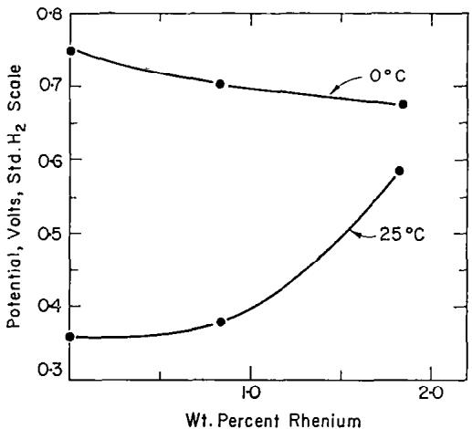
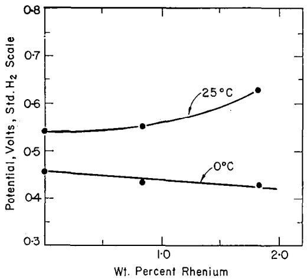

# SHORT COMMUNICATION

# EFFECT OF ALLOYED Re ON THE CRITICAL PITTING POTENTIALS OF 18%Cr/10%Ni STAINLESS STEELS

H. BöHNI and H. H. UHLIG

Department of Metallurgy and Materials Science, Massachusetts Institute of Technology, Cambridge, Massachusetts

Abstract—Stainless steels of the 18–8 variety at 25°C in 0·1N NaCl or 0·1N NaBr show increasingly noble critical pitting potentials, but at 0°C decreasingly noble critical potentials with added per cent Re. A likely cause is temperature-sensitive hydration effects within the double layer.

IN A RECENT paper¹ it was shown that Mo alloyed with $1 5 \% \mathrm { { C r } / 1 3 \% N i }$ stainless steel shifted the critical pitting potential in 0·1N NaCl in the noble direction corresponding to the well-known improved resistance of such alloys to pitting corrosion. The noble shift of potential, however, was shown to occur only at room and at somewhat above room temperature $( 4 0 ^ { \circ } \mathbf { C } ) . \ \mathbf { A } \mathbf { t } \ 0 ^ { \circ } \mathbf { C } ,$ by way of contrast, the effect of Mo was to lower the critical pitting potential or to shift it in the active direction corresponding to decreased resistance to pitting corrosion. Immersion tests in $1 0 \% \mathrm { F e C l _ { 3 } }$ confirmed that whereas pitting of $\textbf { a } 2 { \cdot } 4 \% \mathbf { M } \mathrm { o }$ stainless steel did not occur within two days at $2 5 \mathrm { ^ \circ C } ,$ pitting was observed under the same conditions at $\mathfrak { o } \mathfrak { c } .$ This is opposite to the effect found for 18-8 stainless steel without Mo, pitting being observed at $ \displaystyle 2 5 \mathrm { ‰}$ but not at $\boldsymbol { 0 ^ { \circ } } \mathbf { C }$ . It was of interest to learn whether alloyed $\mathbf { R e } ,$ which is also reported to improve pitting resistance of 18–8 stainless steel,² shows a similar temperature effect.

Alloys were prepared by vacuum melting in dense alumina crucibles decarburized electrolytic $\mathbf { F e } ,$ electrolytic Cr and carbonyl $\mathbf { N i } ,$ the latter supplied by courtesy of the International Nickel Company. Re containing 15ppm Fe but less than 1ppm of any other detectable impurity was supplied by courtesy of Ledgemont Laboratory, Kennecott Copper Corporation. The melt was cast in a purified argon atmosphere by drawing into 7mm dia. Vycor tubes and quenching in water. The alloys were homogenized at $1 0 5 0 ^ { \circ } \mathrm { C }$ for 17h, swaged to 0·4cm dia. rods, annealed at $1 0 5 0 ^ { \circ } \mathrm { C }$ and water quenched. They were mostly austenitic as quenched, being only slightly magnetic. Chemical analyses are given in Table 1. Electrodes measuring about $2 \mathsf { c m } \times 0 { \cdot } 4 \mathsf { c m }$ dia. were abraded to $3 / 0$ emery paper and then pickled in $1 5 \% \mathrm { { H N O _ { 3 } } , 2 \% H F \ a t \ 8 0 ^ { \circ } C }$ Mounting of the alloy specimens using a Teflon gasket to ensure exposure only of the alloy to the electrolyte was the same as previously described.¹ Potentiostatic polarization curves were obtained at $\textstyle 2 5 ^ { \circ } \mathbf { C }$ and at $\textstyle { \boldsymbol { 0 } } ^ { \circ } \mathbf { C }$ in $\mathbf { N _ { 2 } } .$ -saturated 0·1N NaCl and 0·1N NaBr. The electrode totally immersed was first polarized in the least noble passive region for 15min, then the potential was moved in the noble direction 50mV every 5min until the pitting potential was approximated and the current showed a marked increase. This was followed by longer-time runs of 12-15h at a single potential in the neighbourhood of the critical potential in order to establish the steady state value. The least noble potential at which the current did not continuously increase with time and at which no pits could be observed under a low power microscope was taken as the final value. Reproducibility was $\pm 1 0 \mathrm { - } \pm 1 5 \mathrm { m V }$

TABLE 1. COMPOSITION OF ALLOYS
<table><tr><td></td><td> $\% 0 \mathtt { r }$ </td><td> $\% \mathbf { N i }$ </td><td> $\% \tt R e$ </td></tr><tr><td>No.1</td><td>17.6</td><td>10.3</td><td>0</td></tr><tr><td>No.2</td><td>17.4</td><td>10-2</td><td>0.84</td></tr><tr><td>No.3</td><td>17.8</td><td>10.0</td><td>1.84</td></tr></table>

  
FiG. 1. Critical pitting potentials of $1 8 \% \mathbf { C r } ,$ 10%Ni, Re stainless steels in 0·1N NaCl.

Critical pitting potentials in 0·1N NaCl at $2 5 \mathrm { ^ \circ C }$ shown in Fig. 1 indicate that alloyed Re, like alloyed $\mathbf { M } \circ ,$ shifts the critical potential in the noble direction corresponding to an increased resistance to pitting corrosion. Similar to alloyed $\mathbf { M o } ,$ the shift at $\boldsymbol { \mathfrak { O } } ^ { \circ } \mathbf { C }$ is in the opposite or more active direction. The 75mV decrease at ${ \boldsymbol { 0 } } ^ { \circ } { \bf C }$ on adding $1 { \cdot } 8 4 \% \mathsf { R e }$ (0.55at.%), however, is less than the corresponding decrease of almost 500mV on adding 1·8%Mo (1·05at.%).

The observed effects in 0·1N NaBr (Fig. 2) at $2 5 \mathrm { { ^ \circ C } }$ are somewhat different fiom those for the Mo stainless steels in that alloyed Re increases the critical pitting potential whereas alloyed Mo decreases it. Also at $0 ^ { \circ } { \bf C } , 1 { \cdot } 8 4 \% { \bf R e }$ causes a slight shift of critical potential of 30mV in the active direction whereas $0 { \cdot } 5 \% \mathbf { M } \mathbf { o }$ produces a change of over

  
FiG. 2. Critical pitting potentials of $1 8 \% \mathrm { { C r } , 1 0 \% N i }$ Re stainless steels in0·1N NaBr.

100mV in the same direction. Stainless steels of the 18-8 variety at $2 5 \mathrm { ^ \circ C }$ are more resistant to pitting in NaBr than in $\bf N a C l$ but the critical potentials indicate that the alloy containing $1 { \cdot } 8 \% 8 e$ is almost equally resistant in either medium. $\mathbf { A t 0 ^ { \circ } C } ,$ resistance is better in chlorides than in bromides whether or not the alloys contain Re.

Results requiring explanation are (1) the much more noble critical potential for $0 \text{‰}$ stainless steel at $0 ^ { \circ }$ compared to ${ 2 5 \mathrm { ‰} }$ in 0·1N NaCl. On the other hand in 0·1N NaBr, the less noble critical potential at ${ \boldsymbol { 0 } } ^ { \circ } { \bf C }$ than at $2 5 \mathrm { ^ \circ C }$ (2) The increase of critical potential brought about by alloyed Re at $2 5 \mathrm { ‰}$ but the decrease at $0 ^ { \circ } \mathbf { C }$ in either 0·1N NaCl or 0·1N NaBr. (3) The greater sensitivity to temperature of the Mo- compared to the Re-stainless steels. As is discussed in the earlier reference¹ these effects are not readily explained by temperature coefficients of diffusion through a supposed oxide film. The effect of temperature is more likely due to an alteration of double layer structure caused by a temperature-dependent hydration of the relevant ions and of the passive film itself, thereby affecting competitive adsorption of anions with adsorbed oxygen of the passive film for sites on the metal surface.

Acknowledgement—This study was aided by a grant from the Office of Saline Water, U.S. Department of the Interior.

## REFERENCES

1. J. HoRVATH and H. UHLIG, J. electrochem. Soc. 115, 791 (1968).

2. N. ToMASHOV, G. CHERNOVA and O. MARCOVA, Corrosion 20, 166t (1964).