# A comparative study on potentiodynamic and potentiostatic critical pitting temperature of austenitic stainless steels

Y. T. Sun | J. M. Wang | Y. M. Jiang | J. Li

Department of Materials Science, Fudan University, Shanghai, P. R. China

Correspondence J. Li, Room 301, 2nd Materials Hall, Department of Materials Science, Fudan University, Shanghai 200433, P. R. China. Email: corrosion@fudan.edu.cn

Funding information   
National Natural Science Foundation of   
China, Grant numbers: 51371053,   
51501041, 51671059

Temperature and potential effect on pitting occurrence of four austenitic stainless steels in 1 M sodium chloride solution are plotted, then the influence of scan rate and chloride concentration on potentiodynamic critical pitting temperature (CPT) are investigated. Basing on the independence and reliability analysis, the potentiodynamic CPT and potentiostatic CPT are compared. To improve the reproducibility of potentiostatic CPT, an elevated potential should be applied. On the other hand, crevice corrosion induced by transpassive etching is clarified, indicating the upper limit of applied potential in potentiostatic test. Consequently, a potential of 800 or 850 mV(SCE) is recommended for austenitic stainless steels. Additionally, regression analysis is carried out to confirm the linear relationship between potentiodynamic CPT and pitting resistance equivalent.

K E YW ORD S

CPT, critical pitting temperature, potentiodynamic, potentiostatic, PREN

## 1 | INTRODUCTION

Pitting is an important form of localized corrosion caused by breakdown of the passive film on the metal surface, which can propagate and lead to perforation or further initiation of stress corrosion cracking.[1,2] The initiation of pitting is rare and stochastic, making it difficult to accurately predict when and where it will occur.[3,4] To characterize the pitting resistance of different alloys, there are generally two types of methods, immersion tests and electrochemical techniques. The latter ones become more and more widely used due to better reproducibility and higher efficiency.

Pitting potential (Ep) and repassivation potential (Er) were the two earliest proposed electrochemical parameters, which can be easily obtained from the anodic polarization curves.[2] In 1970s, Brigham and Tozer[5–8] first introduced the concept of critical pitting temperature (CPT) by studying the influence of different potentials and temperatures on pitting. Since then temperature became a novel pitting criterion. Several years later, the relationship between pitting potential and temperature was reproduced using potentiodynamic technique and described as a reversed S-shaped curve by Qvarfort.[9,10] Actually, the sharp transition from transpassive corrosion to pitting made it more similar to a Z-shaped curve (see Figure 1). For convenience, the principle of potential and temperature effect on pitting corrosion will be abbreviated as Z curve. In the potentiodynamic polarization test of a specific stainless steel, pitting occurred above the CPT while only transpassive corrosion could be observed below the CPT. Also, this CPT was found to be independent of pH value in the range 1–7 and chloride concentration in the range 1–5 M.[9] Basing on this principle, the potentiostatic method was further developed[11] and a standard electrochemical method to determine CPT of stainless steels was eventually established to be ASTM G150. According to some authors, the potentiostatic CPT was close to the potentiodynamic results[5,12] and almost unaffected by different test condition such as exposed area, applied potential, and gas purging.[11,13,14] Besides, the potentiostatic test was more convenient and timesaving to carry out. As a result, it was considered to be the best way to do quick comparison for pitting resistance of stainless steels. While it became more and more widely used by investigators,[15–19] potentiodynamic CPT was rarely discussed. However, to our knowledge, the independence and reproducibility of potentiostatic CPT were overestimated. For instance, some studies showed that chloride concentration had a considerable influence on CPT results[20–22]; potentiostatic CPT was quite discrete in highly alloyed steels[20–23] and tended to give higher values than potentiodynamic CPT.[24–27] In our opinion, available literature is still insufficient to clarify the discrepancy among different studies and it is necessary to reassess the reliability of CPT. Under this background, the present work is focused on the comparison between potentiodynamic and potentiostatic CPT and makes an effort to optimize the CPT evaluation of austenitic stainless steels.

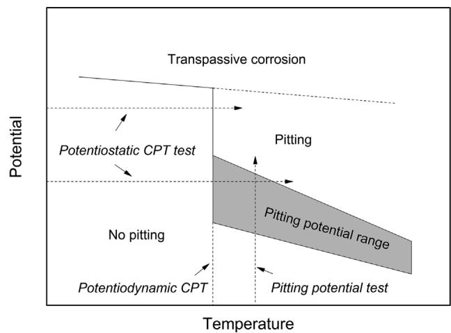  
FIGURE 1 Ideal Z curve of austenitic stainless steel (plotting pitting potential or transpassive potential vs. temperature)

## 2 | EXPERIMENTAL

## 2.1 | Material

Four commercial grade austenitic stainless steels, with the composition given by Table 1, were investigated. 317L, 904L, and 254SMO were provided by Outokumpu China and 316L by Baosteel. All specimens with the dimension of $1 2 \times 1 2 \mathrm { m m } ^ { 2 }$ were cut from a cold-rolled sheet and then embedded in epoxy resin. Prior to electrochemical measurements, they were wet ground with SiC paper to 1000 grit, degreased by acetone, then rinsed with distilled water, and dried in air. The interface between specimen and resin was covered by insulating tape, making an area of 1 cm2 exposed, which could effectively rule out the influence of crevice corrosion.

## 2.2 | Electrochemical test

A multichannel potentiostat PARSTAT MC (PMC) was used to conduct electrochemical measurements. The test medium was 1.0 M NaCl solution made from analytical grade reagent and distilled water. A saturated calomel electrode and a platinum foil electrode, respectively, worked as reference and auxiliary electrodes.

To obtain the Z curve of each steel, potentiodynamic tests were carried out thermostatically at different temperatures. The potential was swept at a constant rate from OCP to pitting potential or transpassive potential, at which the current density exceeded $1 0 0 \mu \mathrm { A } / \mathrm { c m } ^ { 2 } .$ For 317L and 904L, cyclic polarization curves were measured, in which the scan direction of potential was reversed down to repassivation.

Potentiostatic tests were performed by applying an anodic potential on the specimen, with the temperature rising at a rate of 1 °C/min. The initial temperatures were 0 °C for 316L and 317L, 20 °C for 904L, and 40 °C for 254SMO. After the temperature reached the CPT, where stable pitting occurred and current density continuously exceeded $1 0 0 \mu \mathrm { A } / \mathrm { c m } ^ { 2 } .$ , the experiment was stopped. The temperature was detected by a Pt-100 thermistor, whose resistance value was converted to synchronous voltage signal, input to the PMC, and finally shown as a temperature curve. Because the test cell we used in this work made the working electrode totally immersed in solution and the thermistor probe was just near the specimens, there was no need to do extra calibration between specimen temperature and solution temperature. Figure 2 gives the schematic diagram of potentiostatic CPT test.

TABLE 1 Chemical composition of the investigated stainless steels (wt%)
<table><tr><td>Material</td><td>Cr</td><td>Ni</td><td>Mo</td><td>N</td><td>Mn</td><td>C</td><td>Si</td><td>s</td><td>P</td><td>Cu</td></tr><tr><td>316L</td><td>16.39</td><td>10.21</td><td>2.03</td><td>0.034</td><td>1.37</td><td>0.021</td><td>0.46</td><td>0.001</td><td>0.034</td><td>0.16</td></tr><tr><td>317L</td><td>17.97</td><td>11.52</td><td>3.10</td><td>0.079</td><td>1.30</td><td>0.021</td><td>0.33</td><td>0.001</td><td>0.029</td><td>0.33</td></tr><tr><td>904L</td><td>19.84</td><td>23.91</td><td>4.36</td><td>0.055</td><td>1.40</td><td>0.014</td><td>0.34</td><td>0.001</td><td>0.021</td><td>1.36</td></tr><tr><td>254SMO</td><td>19.81</td><td>17.83</td><td>5.88</td><td>0.19</td><td>0.37</td><td>0.016</td><td>0.35</td><td>0.001</td><td>0.019</td><td>0.66</td></tr></table>

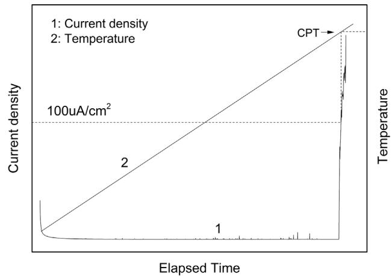  
FIGURE 2 Schematic diagram of potentiostatic CPT measurement

## 3 | RESULTS AND DISCUSSION

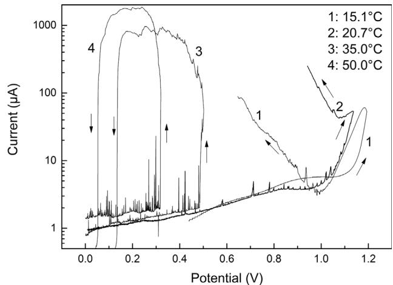  
FIGURE 4 Typical cyclic polarization curves of 317L at different temperatures

## 3.1 | Depiction of Z curves

The scan rate of potential was 30 mV/min in this part. Figure 3 shows the typical polarization curves of 316L. At a temperature above CPT, an abrupt rise of current can be observed, corresponding to the pitting process. When conducting the test at a temperature below the CPT, current density maintains below $5 \mu \mathrm { A } / \mathrm { c m } ^ { 2 }$ until reaching the transpassive region, indicating a continuous passive state of the specimen except for metastable pits.

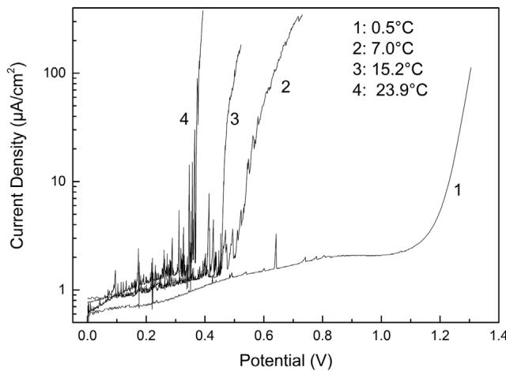  
FIGURE 3 Typical polarization curves of 316L at different temperatures

The cyclic polarization tests of 317L are shown in Figure 4. In the upward scans, the shape of the curves is similar to 316L. After reversing the scan direction, stable pitting keeps on propagating and the current density maintains in a high level before repassivation. However, in transpassive circumstances, the current density decreases and then gradually increases in the reversed scanning, indicating the specimen cannot return to passivity. Similar phenomenon was reported by Qvarfort.[9] He described the selective etching area where pits were initiated after reversing the scan direction but without providing pictures. However, according to our observation, it is crevice corrosion rather than pitting that leads to the increase of current density. Figure 5 shows a typical morphology of 317L after cyclic polarization test. The exposed area of specimen is intact, but when removing the cover of specimen, continuous etching along the margin and some obvious crevice corrosion morphologies can be observed. Here transpassive corrosion is not evenly distributed in the surface of a specimen but preferentially occurs near the marginal area, which results in micro crevice between the specimen and the cover.

By plotting all pitting and transpassive potentials versus temperature, Z curves of the four steels are shown in Figure 6. Each curve has a quite sharp transition from transpassive dissolution to pitting. This transition, which has been reported in many studies,[9,11] determines the potentiodynamic CPT or potential independent CPT. Peguet et al.[25] carried out similar tests using a duplex stainless steel 2205 and found that pitting and transpassive corrosion occurred at the same temperatures in a wide range of about $1 0 ^ { \circ } \mathrm { C } .$ The cause may be the inhomogeneous microstructure of DSS. It still needs to be clarified whether this is a general feature for all DSSs or a special phenomenon for 2205.

## 3.2 | Influence of test conditions on Z curve

## 3.2.1 | Scan rate of potential

Polarization tests were repeated using 904L to investigate the scan rate dependence of potentiodynamic CPT. The Z curves with the scan rate of 10 and 30 mV/min are shown in Figure 7.

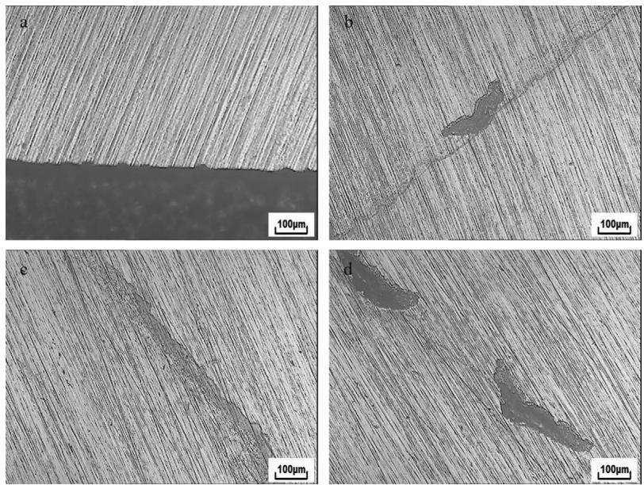  
FIGURE 5 Marginal morphology of 317L after cyclic polarization test at lower temperature: (a) before removing the cover, (b–d) after removing the cover

Obviously, they have the similar shape. But at the same temperature the slower scan rate leads to a lower pitting potential. In other word, the slower scan rate just shifts the curve toward left slightly and decreases the potentiodynamic CPT from 54.5 to $5 2 . 5 ^ { \circ } \mathrm { C } .$ . For 317L, more different scan rates were applied to determine the potentiodynamic CPT. Considering the efficiency, these tests were conducted only at five different temperatures near the CPT (25.4, 26.5, 27.6, 28.5, $2 9 . 3 ^ { \circ } \mathrm { C } )$ . The approximate interval of potentiodynamic CPT for each scan rate is presented in Table 2. For the scan rate of 3 mV/min, no pit can be observed in all specimens at $2 5 . 4 ^ { \circ } \mathrm { C } ;$ pitting occurs in some specimens at $2 6 . 5 ^ { \circ } \mathrm { C }$ and in all specimens at $2 7 . 6 ^ { \circ } \mathrm { C } .$ . Therefore it can be concluded that the potentiodynamic CPT interval is $2 5 . 4 - 2 6 . 5 ^ { \circ } \mathrm { C } .$ . Although the value increases at faster scan rate, the difference is very small. Therefore, it can be concluded that potentiodynamic CPT is quite independent of scan rate over a wide range.

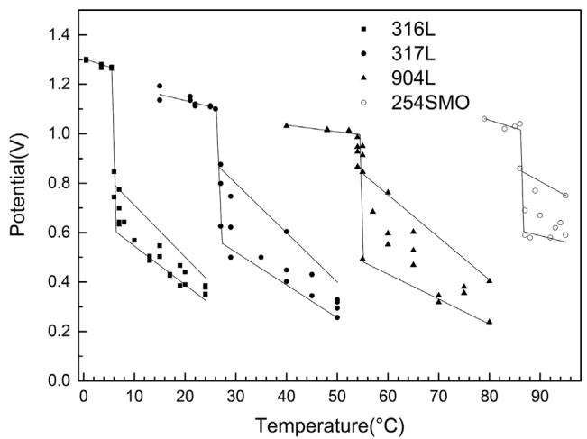  
FIGURE 6 Z curves of austenitic stainless steels

## 3.2.2 | Chloride concentration

The influence of chloride concentration on potentiodynamic CPT was also studied in the present work. According to Qvarfort,[9] increasing the chloride concentration from 1 to 5 M only resulted in a decrease of pitting or transpassive potential but had no effect on potentiodynamic CPT value of 254SMO. However, our investigation gives a contradictory result. As is shown in Figure 8, the potentiodynamic CPT of 254SMO is 82 °C in 3 M NaCl and 86 °C in 1 M NaCl, respectively. It should be noted that the 254SMO we use here is a little lower alloyed. Considering some other researche s,[20–22] we think chloride concentration really has influence but not very large on CPT value.

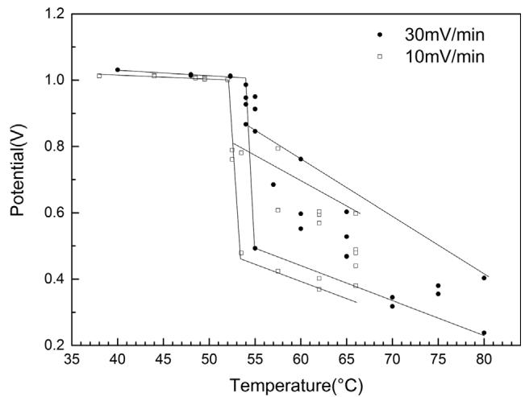  
FIGURE 7 Z curves of 904L with different scanning rate

TABLE 2 Potentiodynamic CPT of 317L with different scan rate
<table><tr><td>Scan rate (mV/min)</td><td>3</td><td>10</td><td>60</td><td>120</td></tr><tr><td>Potentiodynamic CPT interval (°C)</td><td>25.4–27.6</td><td>26.5–28.5</td><td>27.6–29.3</td><td>28.5—29.3</td></tr></table>

## 3.3 | Reliability analysis of potentiostatic CPT

When evaluating the influence of 10 min heat treatment at different temperatures on pitting resistance of 254SMO, we found that the reproducibility of standardized potentiostatic CPT was unsatisfactory. Figure 9 gives the average CPT values and the corresponding standard deviation with each specimen measured at least three times. Although it can be concluded the sensitization of 254SMO at $9 5 0 ^ { \circ } \mathrm { C }$ is the most obvious, the dispersion of CPT is quite huge. Basing on ASTM G150, the potentiodynamic CPT we discuss here is equivalent to the concept of potential independent CPT. If the applied potential is not high enough, the potentiostatic test can only obtain potential-dependent CPT, which has a wide dispersion and corresponds to the pitting potential range (see Figure 1). This principle can be well demonstrated by performing potentiostatic tests under different applied potentials. Taking 904L as an example, six different potentials from 400 to 900 mV(SCE) were adopted to measure the potentiostatic CPT. The average value, standard deviation, and number of tests are given in Table 3 and all data are plotted together with Z curve of 904L in Figure 10. It is obvious that a lower-applied potential leads to an increase of potentiostatic CPT value and a wider dispersion. Besides, most of the points are inside the pitting potential range of Z curve, indicating the good consistency between potentiostatic and potentiodynamic measurements under the certain test conditions.

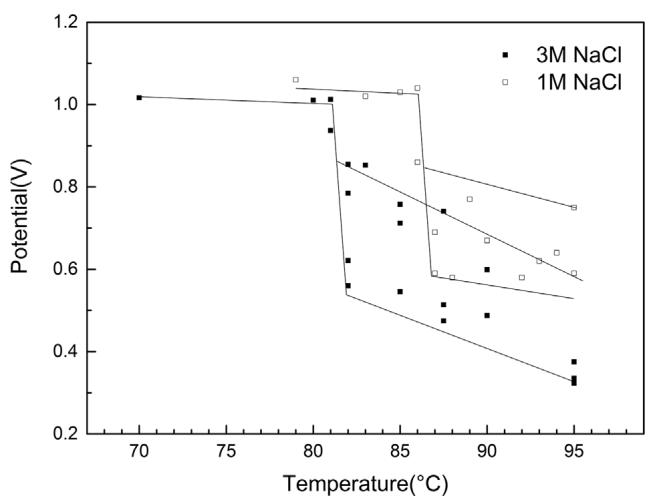  
FIGURE 8 Z curves of 254SMO in 1 M and 3 M NaCl

## 3.4 | Transpassive effect on potentiostatic test and optimization of applied potential

It is worth mentioning that the test at 900 mV(SCE) was carried out five times and two specimens had crevice morphologies similar to Figure 5. Unlike the typical CCT which is about $1 5 { - } 2 0 ^ { \circ } \mathrm { C }$ lower than CPT for a certain material, here the two discarded values are just a few degrees lower than CPT. According to the discussion in Section 3.1, this is because the crevice did not originally exist but gradually formed by transpassive etching during the experiment. To further investigate the transpassive corrosion, a set of potentiostatic polarization tests with different potential were performed at room temperature for 500 s. The current density curves against time are shown in Figure 11 and the corresponding morphologies in the marginal area are presented in Figure 12.

If the potential is not greater than 850 mV(SCE), the current density keeps decreasing during the whole test and no transpassive etching can be observed in the specimen as shown in Figure 12(a,b). When increasing the potential to 900, 950, and 1000 mV(SCE), the current density maintains at higher level and tends to increase in the latter part of the test. The marginal areas of the three specimens have slight but continuous corrosion trace, see Figure 12(c–e). As the potential further increases to 1100 and 1200 mV(SCE), the current density rises at the very beginning. Here the potential is too high for the specimen to maintain a passive state then the morphology of etching is quite obvious and even shows a deep ditch, see Figure 12(f,g). The two specimens with the potential of 950 and 1200 mV(SCE) were also observed by SEM. In Figure 13(b), it is easy to find depression area on the surface, in which crevice corrosion can preferentially occur.

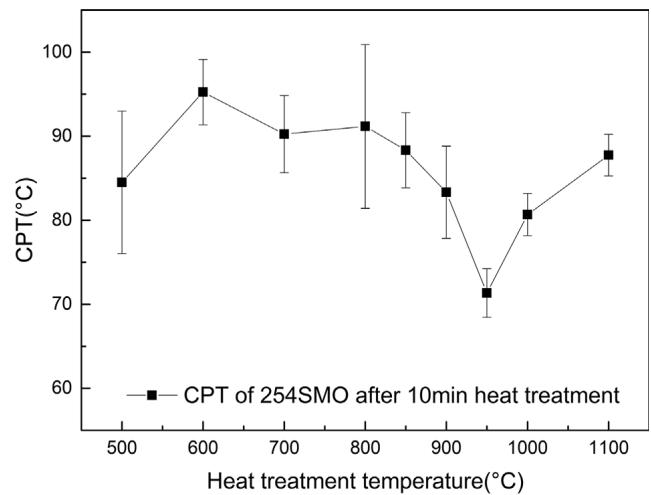  
FIGURE 9 Potentiostatic CPT of 254SMO after 10 min heat treatment at different temperatures

TABLE 3 Potentiostatic CPT and standard deviation of 904L under different potential
<table><tr><td>Potential (mV)</td><td>Average CPT (°C)</td><td>Standard deviation</td><td>Test times</td></tr><tr><td>400</td><td>66.1</td><td>4.7</td><td>4</td></tr><tr><td>500</td><td>65.0</td><td>4.5</td><td>6</td></tr><tr><td>600</td><td>59.0</td><td>3.3</td><td>4</td></tr><tr><td>700</td><td>58.3</td><td>1.7</td><td>4</td></tr><tr><td>800</td><td>55.9</td><td>1.3</td><td>4</td></tr><tr><td>900</td><td>54.0</td><td>0.8</td><td>3</td></tr></table>

From a practical viewpoint, in order to improve the reliability of potentiostatic CPT test, we should increase the applied potential but cannot increase too much in order to avoid the transpassive effect. This is somewhat of a dilemma. According to the above discussion, a potential of 800 or 850 mV(SCE) is suitable. By the way, it should be noted that at higher temperature the selection of applied potential is more limited because of the decrease of transpassive potential.

## 3.5 | Linear regression of PREN basing on potentiodynamic CPT

PRE is an empirical estimation of pitting resistance for stainless steels, which has been widely accepted and applied

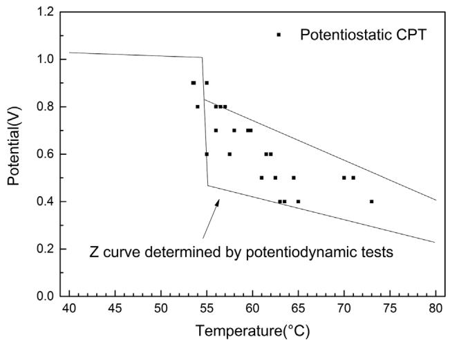  
FIGURE 10 Potentiostatic CPT of 904L under different applied potential

by manufacturers, consumers, and investigators. According to many authors,[29–31] there are several mainly used PRE equations as listed below:

$$
\mathrm { P R E } = \% \mathrm { C r } + 3 . 3 \% \mathrm { M o } ^ { [ 3 0 ] }\tag{ð1Þ}
$$

$$
\mathrm { P R E N } = \% \mathrm { C r } + 3 . 3 \% \mathrm { M o } + \mathrm { x } { \cdot } \% \mathrm { N } ^ { [ 2 8 ] }\tag{ð2Þ}
$$

$$
\mathrm { P R E N M n } = \% \mathrm { C r } + 3 . 3 \% \mathrm { M o } + \mathrm { x } { \cdot } \% \mathrm { N } - \% \mathrm { M n } ^ { [ 3 1 ] }\tag{ð3Þ}
$$

The nitrogen factor x has been reported in the range of $1 3 \mathrm { - } 3 0 ^ { [ 2 8 ] }$ and 16 is most widely accepted.

Originally, PRE was determined by studying the relationship between alloy contents and Ep or potentiostatic CPT. Since potentiodynamic CPT is more reliable to characterize pitting resistance of stainless steels than potentiostatic CPT or $\mathrm { E p , }$ it is more convincible to use it to determine PRE equation. As we do not have enough steels of different alloy content, we just carry out regression analysis between potentiodynamic CPT and some existing PRE equations to check their linear relationship, using the four steels investigated above. As is shown in Figure 14, when using x = 16, all three PRE numbers have good linear relationship against CPT and the standard error of PREN is minimum. The PREN formulas with different x value are also investigated and the factor 16 leads to the best linear relationship, see Figure 15. In summary, PREN = %Cr + 3.3%Mo + 16%N is relatively the most convincible formula basing on the four investigated alloys. By plugging PREN into the linear relationship between CPT and PREN, a new empirical formula to estimate potentiodynamic CPT can be obtained

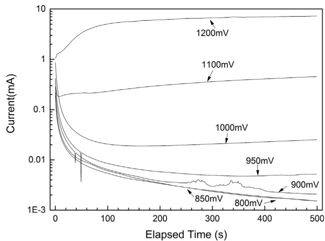  
FIGURE 11 Current density in 500 s potentiostatic polarization test of 904L under different potential

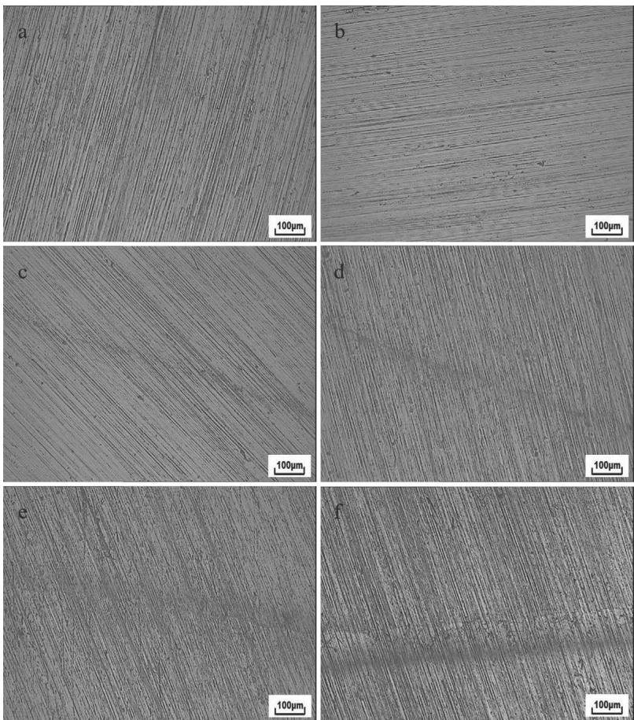

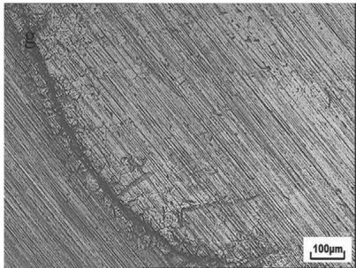  
FIGURE 12 Marginal morphology of 904L after potentiostatic polarization test: (a) 800 mV, (b) 850 mV, (c) 900 mV, (d) 950 mV, (e) 1000 mV, (f) 1100 mV, and (g) 1200 mV

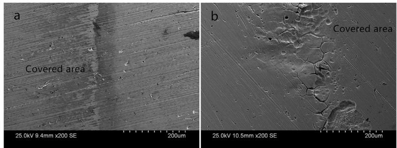  
FIGURE 13 SEM morphologies of 904L after potentiostatic polarization test: (a) 950 mV and (b) 1200 mV

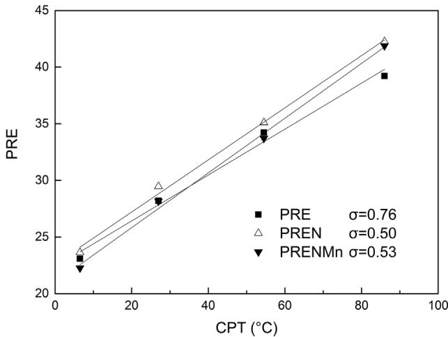  
FIGURE 14 Linear regression between PRE calculated by Eqs. (1)–(3) and CPT

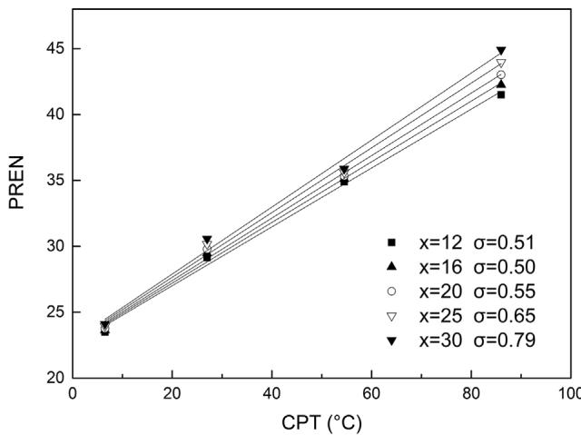  
FIGURE 15 Linear regression between PREN with different nitrogen factors and CPT

$$
\mathbf { C P T } = 4 . 3 \% \mathbf { C R } + 1 4 . 3 \% \mathbf { M o } + 6 9 . 5 \% \mathbf { N } - 9 8 . 2\tag{ð4Þ}
$$

## 4 | CONCLUSION

(1) The potential and temperature effect on pitting occurrence for austenitic stainless steels shows a sharp transition from transpassive corrosion to pitting, which refers to the potentiodynamic CPT. Although potentiodynamic CPT value can be influenced by chloride concentration, it is quite independent of potential scan rate in a certain NaCl solution.

(2) A high potential may lead to transpassive etching along the marginal area of specimen and further result in crevice corrosion in both potentiodynamic and potentiostatic measurements.

(3) The potentiostatic CPT under different applied potential is in accordance with Z curve of 904L. In consideration of transpassive effect, a potential of 800 or 850 mV(SCE) is recommended to obtain more reliable results for potentiostatic CPT.

(4) There is a good linear relationship between PREN and potentiodynamic CPT. According to the fitting result, CPT can be estimated by 4.3%Cr + 14.3%Mo + 69.5% N − 98.2.

## ACKNOWLEDGMENTS

The authors gratefully acknowledge Baosteel for the provision of specimens. This work is financially supported by the National Natural Science Foundation of China (grant nos. 51371053, 51501041, and 51671059).

## ORCID

Y. T. Sun http://orcid.org/0000-0002-0930-8963

## REFERENCES

[1] G. Frankel, J. Electrochem. Soc. 1998, 145, 6.

[2] J. Soltis, Corros. Sci. 2015, 90, 5.

[3] T. Shibata, T. Takeyama, Corrosion 1977, 33, 243.

[4] G. Frankel, N. Sridhar, Mater. Today 2008, 11, 38.

[5] R. Brigham, E. Tozer, Corrosion 1973, 29, 33.

[6] R. Brigham, E. Tozer, Corrosion 1974, 30, 161.

[7] R. Brigham, E. Tozer, J. Electrochem. Soc. 1974, 121, 1192.

[8] R. Brigham, Corrosion 1972, 28, 177.

[9] R. Qvarfort, Corros. Sci. 1989, 29, 987.

[10] R. Qvarfort, Corros. Sci. 1988, 28, 135.

[11] P. E. Arnvig, A. D. Bisgaard, presented at CORROSION/96-NACE, NACE International, Houston 1996.

[12] A. Pardo, F. Moreno, E. Otero, M. C. Merino, M. V. Utrilla, M. D. Lpez, Corrosion 2000, 56, 411.

[13] P. E. Arnvig, R. M. Davison, presented at 12th International Corrosion Congress, Houston, 1993.

[14] H. Andersen, C. Olsson, L. Wegrelius, presented at Materials Science Forum, Switzerland, 1998, pp. 925–932.

[15] H. Tan, Z. Y. Wang, Y. M. Jiang, Y. Z. Yang, B. Deng, H. M. Song, J. Li, Corros. Sci. 2012, 55, 368.

[16] Y. J. Guo, J. C. Hu, J. Li, L. Z. Jiang, T. W. Liu, Y. P. Wu, Materials 2014, 7, 6604.

[17] Y. J. Guo, T. Y. Sun, J. C. Hu, Y. M. Jiang, L. Z. Jiang, J. Li, J. Alloy. Compd. 2016, 658, 1031.

[18] B. Deng, Z. Y. Wang, Y. M. Jiang, H. Wang, J. Gao, J. Li, Electrochim. Acta 2009, 54, 2790.

[19] H. Tan, Y. M. Jiang, B. Deng, T. Sun, J. L. Xu, J. Li, Mater. Charact. 2009, 60, 1049.

[20] P. Ernst, R. C. Newman, Corros. Sci. 2007, 49, 3705.

[21] N. J. Laycock, Corrosion 1999, 55, 590.

[22] M. H. Moayed, R. C. Newman, Corros. Sci. 2006, 48, 3513.

[23] Y. P. Liu, N. Zhong, Y. T. Sun, Y. M. Jiang, Int. J. Electrochem. Sci. 2016, 11, 3908.

[24] C. Dussart, L. Peguet, A. Gaugain, B. Baroux, presented at Symposium; 6th, 2009.

[25] L. Peguet, A. Gaugain, C. Dussart, B. Malki, B. Baroux, Corros. Sci. 2012, 60, 280.

[26] N. Ebrahimi, M. Momeni, A. Kosari, M. Zakeri, M. H. Moayed, Corros. Sci. 2012, 59, 96.

[27] R. F. A. Pettersson, presented at 6th European stainless steel conference, Helsinki, Finland, 2008, p. 37.

[28] E. Alfonsson, R. Qvarfort, presented at Materials Science Forum, 1992, p. 483.

[29] R. F. A. Jargelius-Pettersson, Corrosion 1998, 54, 162.

[30] M. Renner, U. Heubner, M. B. Rockel, E. Wallis, Werkst. Korros. 1986, 37, 183.

[31] J. Charles, Stainless Steel World 2015, 9, 67.

How to cite this article: Sun YT, Wang JM, Jiang YM, Li J. A comparative study on potentiodynamic and potentiostatic critical pitting temperature of austenitic stainless steels. Materials and Corrosion. 2018;69:44–52. https://doi.org/10.1002/maco.201709641