# A CREVICE-FREE ELECTRODE ASSEMBLY FOR THE DETERMINATION OF REPRODUCIBLE BREAKDOWN POTENTIALS FOR STAINLESS STEELS IN HALIDE ENVIRONMENTS

W. M. CARROLL and E. E. LYNSKEY

Chemistry Department, University College Galway, Galway, Ireland

Abstract—In the present study, a 316 wire loop electrode system has been shown to give good reproducible results in a variety of halide environments. An unusual feature of these results is the fact that under all experimental conditions studied, the Br\~ ion is found to be considerably (approx. 200 mV) more aggressive than the Cl ion in terms of oxide stability. This trend is also maintained with steels 302 and 304L. The presence of SO⁻ ions in the halide electrolyte does not alter this order, nor does chemical pre-treatment in acid solutions prior to pitting potential determinations. Pitting potentials measured for the 316 wire loop samples are considerably more noble than those measured for samples of 316 cut from bar or sheet material. It is tentatively suggested that this order of oxide stability may be due to the superior ability of Cl\~ to adsorb at flaws in the developing oxide film, the wire loop samples containing fewer such flaws.

## INTRODUCTION

The breakdown of passivity, which leads to localized corrosion, is a very common type of failure encountered with stainless steels. The pitting and crevice corrosion behaviour of stainless steels has been studied extensively in environments containing aggressive ions similar to those found in their operating conditions, and reviewed by a number of workers.1-6 Most work however has been done in solutions containing Cl" as the aggressive ion. This is presumably because chlorides are most commonly encountered in environments such as sea-water, pulp and paper processing and chemical plants in general. It is believed that Cl\~ ions are the most aggressive anions for the pitting and crevice corrosion attack on stainless steels.7,8

Experimental arrangements or procedures for the determination of the pitting susceptibility of stainless steels in halide environments are many and varied.9,10 The accuracy and reliability of such tests however, depend very markedly on the working assemblies used, one of the most important considerations being that the electrode system should be crevice-free. This is particularly so if the tests are to be conducted over extended periods of time or at elevated temperatures. Pitting susceptibility results obtained for steel samples mounted in epoxy resin, waxed samples or those involving O-ring seals must therefore always be treated with a certain amount of care, particularly in their extrapolation to industrial situations.

It is of considerable importance therefore that new, crevice-free electrode systems be developed and tested. In these laboratories the crevice-free electrode system shown in Fig. 1a has been used with reasonable success, particularly for potentiostatic tests in halide solutions.11–13 Here the teflon collar, when filled with argon gas prevents the ingress of the test solution thus avoiding the development of crevice geometries. However considerable effort and dexterity is involved in the machining and polishing of the cylindrical test samples, so that only the transverse surface of the specimen is exposed to the electrolyte solution.

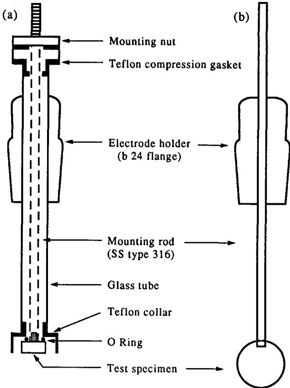  
Fig. 1. (a) Crevice-free electrode for steel bar samples of 316L. (b) Wire loop electrode system.

In an attempt to find an easier and more rapid test procedure various other crevice-free electrode assemblies were examined. The present communication details the results obtained using a wire loop type electrode¹⁴ when exposed in bromide and chloride solutions.

## EXPERIMENTAL METHOD

Unless otherwise stated the test electrodes were made from 0.25 mm wire looped to a diameter of 25 mm. The electrodes were attached to the holder as indicated in Fig. 1b and immersed to half distance to give an exposed surface area of 0.32 cm². Apart from a washing in distilled water and methanol, the wires were used in the as-received state. Test solutions were prepared from reagent grade chemicals and distilled water and the pH value was adjusted using $\mathbf { H } _ { 2 } \mathbf { S } \mathbf { O } _ { 4 }$ or NaOH as required. The oxygen content of the test solutions was reduced to a negligible value by bubbling nitrogen through them for a period of 24 h. All electrochemical measurements were performed in a conventional three electrode glass cell, purged with nitrogen during each experiment, the potential controlled and the currents measured using a Princeton Applied Research Model 273 potentiostat/galvanostat and associated Model 342 Softcorr corrosion measurement software. Prior to each measurement the sample was introduced into the test electrolyte at a cathodic potential of -800 mV(SCE), and held for a period of 5 min to ensure a reproducible surface. Polarization plots were run at a scan rate of 60 mV $\mathrm { \ m i n ^ { - 1 } }$ and all potentials quoted are with respect to the saturated calomel electrode. For the chemical pre-treatments the wire loops were immersed in 50% $\mathbf { H N O } _ { 3 }$ solution, maintained at a temperature of 50°C for 30 min. For the 20% $\mathrm { H N O } _ { 3 } $ 4% HF solution the immersion temperature was 65°C and the immersion time 10 min. Reproducibility of measurements was good and the results presented represent the average of at least three identical experiments.

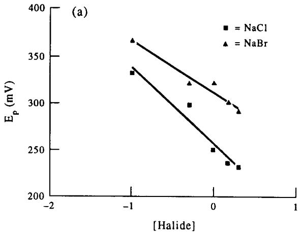

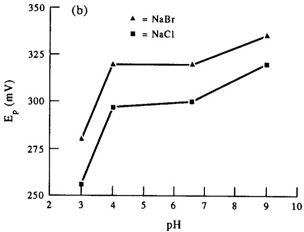  
Fig. 2. (a) The variation of $E _ { \mathbf { p } }$ with logarithmic halide concentration for steel 316L, pH 4. (b) The variation of $E _ { \mathfrak { p } }$ with pH for steel 316L in 0.5 M Cl and 0.5 M Br− solutions.

## EXPERIMENTAL RESULTS

Pitting potential $( E _ { \mathfrak { p } } )$ values measured for steel 316L in chloride and bromide solutions using the electrode assembly shown in Fig. 1a show the usual variation with pH and anion concentration. As observed by most workers in the field, the chloride anion is found clearly to be the more aggressive anion under the conditions studied (Fig. 2a and b). Since stainless steel type 316L was not commercially available, wire loop tests were carried out using steel type 316, the chemical composition of the two steel samples being quite similar, particularly in relation to the major alloying elements. Polarization plots recorded using the wire loop system (Fig. 1b), in 1.0 M

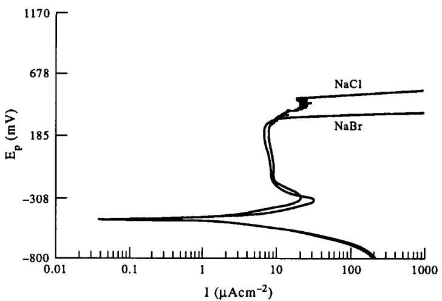  
Fig. 3. Potentiodynamic polarization plots recorded for 316 wire in 1.0 M NaCl and 1.0 M NaBr, pH 3 solutions.

NaCl and 1.0 M NaBr, pH 3 solutions are shown in Fig. 3. Rather surprisingly with this electrode system, the plots indicate that the $\mathbf { B } \mathbf { r } ^ { - }$ ion is now the more aggressive ion, and by a considerable amount. This unexpected result does not seem to be as a result of any particular pH or anion concentration as indicated in Fig. 4a and b. The order with respect to film breakdown is again $\mathbf { B } \mathbf { r } ^ { - }$ more severe than $\mathbf { C l } ^ { - }$ , the variation of the pitting potentials over the range studied being of the order of 200 mV.

Initially it was thought that these unexpected results could be due to stress or strain introduced as a result of the loop size. However, as indicated in Table 1, on increasing the loop size to 70 mm, the same order of pitting potentials was again observed. Smaller loop sizes did lead to some changes in the breakdown potentials in Cl\~ solutions (Table 1), so that the 25 mm loop diameter would seem the optimum size.

The only other steel wires commercially available were those of type 304L and 302, and tests were also conducted with these materials. Again with these steels the test results showed $\mathbf { B } \mathbf { r } ^ { - }$ to be the more aggressive in terms of oxide stability. The variation of $E _ { \mathfrak { p } }$ with pH for steel 302 in 1 M NaCl and 1 M NaBr is shown in Fig. 5, the difference between the pitting potential values in this instance being of the order of 100 mV.

Pitting potentials measured for steel 316 in solutions containing both $\mathbf { C l ^ { - } }$ and Br ions (total halide = 1.0 M) are shown in Fig. 6. $E _ { \mathfrak { p } }$ values for this steel in $\mathbf { C l } ^ { - }$ or $\mathbf { B } \mathbf { r } ^ { - }$ solutions only in the range 0.01–1.0 M are also included in this plot. For the mixed halide solutions of pH 5.5 it is clear that addition of just small amounts of $\mathbf { B } \mathbf { r } ^ { - }$ ions is sufficient to lower the $E _ { \mathfrak { p } }$ values of the $\mathbf { C l } ^ { - }$ solutions very considerably. For halide concentrations greater than 0.5 M the breakdown potentials would seem to be determined solely by the $\mathbf { B } \mathbf { r } ^ { - }$ ions. Shown in Fig. 7a is a current-time plot recorded initially at 400 mV in a 1.0 M NaCl solution. After a 20 min passivation period the NaCl solution is replaced by 1.0 M NaBr using a special overflow cell.1⁵Addition of the $\mathbf { B } \mathbf { r } ^ { - }$ ions leads almost immediately to activation of the steel sample. This is as would be expected, since the chosen passivation potential exceeds the pitting potential for the steel in the given $\mathbf { B } \mathbf { r } ^ { - }$ solution. This would tend to indicate that the potentiodynamically determined pitting potential value is indeed the correct one. Replacement of $\mathbf { B } \mathbf { r } ^ { - }$ by $\mathbf { C l } ^ { - }$ in the same cell at a potential of 300 mV did not lead to activation (Fig. 7b). Addition of the sulphate anion to chloride or bromide solutions generally leads to an ennoblement of the pitting potential values for stainless steels.16 This trend is clearly evident for steel 316 in the various $\mathbf { C l } ^ { - } + \mathbf { S O } _ { 4 }$ and $\mathbf { B r } ^ { - } + \mathbf { S O } _ { 4 }$ combinations (up to 1.0 M in total) shown in Fig. 8. Notwithstanding this trend, however, the more aggressive nature of the $\mathbf { B } \mathbf { r } ^ { - }$ anion is again evident over the whole concentration range but most particularly in the 0.5–1.0 M range.

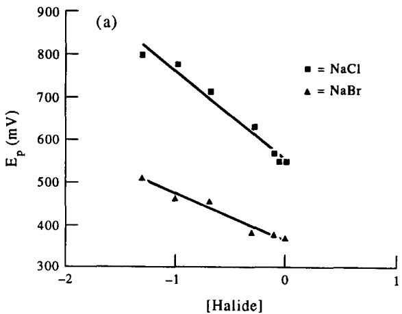

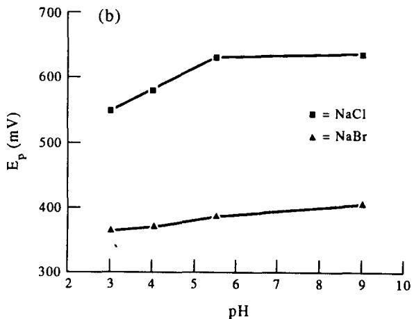  
Fig. 4. (a) The variation of $E _ { \mathfrak { p } }$ with logarithmic halide concentration for 316 wire, pH 5.5. (b) The variation of $E _ { \mathfrak { p } }$ with pH for 316 wire in 0.5 M Cl⁻ and 0.5 M Br− solutions.

Table 1. Influence of loop size on magnitude of pitting potentials in ${ \bf C l } ^ { - }$ solutions of pH 3
<table><tr><td> $\mathbf { C l } ^ { - }$   $\mathrm { ( m o l ~ d m } ^ { - 3 } \mathrm { ) }$ </td><td>Loop size (mm)</td><td> $E _ { \mathfrak { p } }$   $( \boldsymbol { \mathrm { m } } \mathbf { V } ( \dot { \mathbf { S } } \mathbf { C } \mathbf { E } ) )$ </td></tr><tr><td>1.0</td><td>25</td><td>530</td></tr><tr><td>1.0</td><td>70</td><td>530</td></tr><tr><td>1.0 1.0</td><td>22</td><td>517</td></tr><tr><td></td><td>17</td><td>485</td></tr></table>

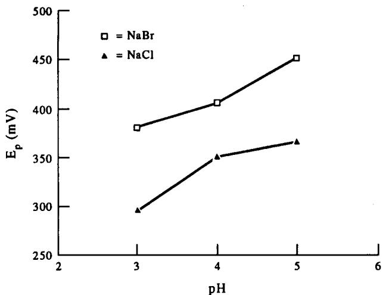  
Fig. 5. The variation of pitting potential with pH for 302 wire in 1.0 M NaCl and 1.0 M NaBr.

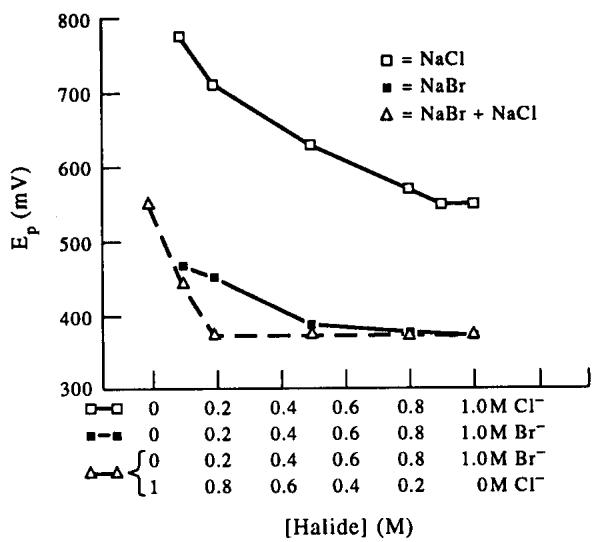  
Fig. 6. The variation of $E _ { \mathfrak { p } }$ with anion concentration for 316 wire in solutions of () NaCl, () NaBr and (∆) mixtures of NaCl and NaBr, pH 5.5.

Surface treatments of some stainless steels in solutions such as 50% $\mathbf { H N O } _ { 3 }$ or 20% $\mathrm { H N O } _ { 3 } + 4 \%$ HF have been shown17,18 to decrease their pitting susceptibility very considerably in halide solutions. As indicated in Table 2, this is indeed the case for the 316 wire loop samples in both the Cl⁻ and Br\~ solutions. Even after these $\mathbf { C l } ^ { - }$ $\mathbf { B } \mathbf { r } ^ { - }$ pre-treatments the order with respect to oxide stability is again maintained.

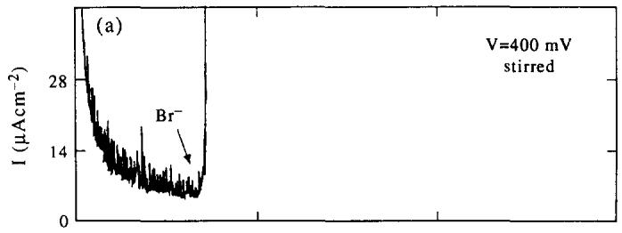

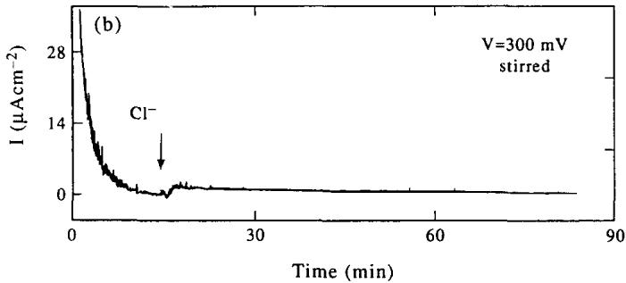  
Fig. 7. (a) Current decay profile recorded at a potential of 400 mV(SCE), initially in a 1.0 M NaCl, pH 2.5 solution. NaBr added after a 20 min passivation period. (b) Current decay profile recorded at a potential of 300 mV(SCE) in a 1.0 M NaBr, pH 2.5 solution; 1.0 M NaCl added after a 20 min passivation period.

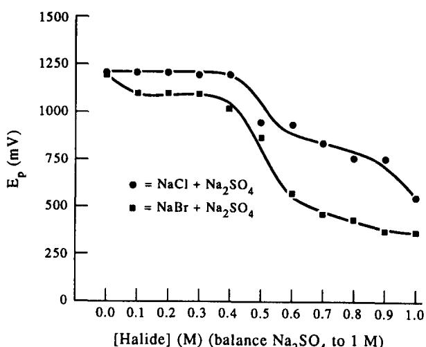  
Fig. 8. The variation of E for 316 wire in solutions containing both Cl\~ and $E _ { \mathsf { p } }$ $\mathsf { S O } _ { 4 } ^ { 2 - }$ and $\mathbf { B } \mathbf { r } ^ { - }$ and $\mathsf { S O } _ { 4 } ^ { 2 - }$ anions.

It should be noted however that the ennoblement of the pitting potential for the $\mathbf { B } \mathbf { r } ^ { - }$ solutions is considerably less than for the $\mathbf { C l } ^ { - }$ solutions.

Table 2. Pitting potentials for chemically pre-treated samples of steel 316 in the pH 3 halide solutions indicated
<table><tr><td>Halide concentration</td><td>Pre-treatment</td><td> $E _ { \mathfrak { p } }$   $( \boldsymbol { \mathrm { m } } \mathbf { V } ( \dot { \mathbf { S } } \mathbf { C } \mathbf { E } ) )$ </td></tr><tr><td>1.0 M NaCl</td><td></td><td>530</td></tr><tr><td>1.0 M NaCl</td><td> $2 0 \% \ \mathrm { H N O } _ { 3 } + 4 \% \ \mathrm { H F }$ </td><td>540</td></tr><tr><td>1.0 M NaCl</td><td> $5 0 \% \mathrm { H N O } _ { 3 }$ </td><td>670</td></tr><tr><td>1.0 M NaBr</td><td></td><td>330</td></tr><tr><td>1.0 M NaBr</td><td> $2 0 \% \ \mathrm { H N O } _ { 3 } + 4 \% \ \mathrm { H F }$ </td><td>350</td></tr><tr><td>1.0 M NaBr</td><td> $5 0 \% \mathrm { H N O } _ { 3 }$ </td><td>385</td></tr></table>

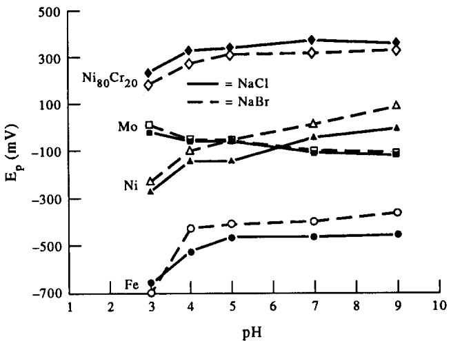  
Fig. 9. The variation of $E _ { \mathfrak { p } }$ with pH for wire samples of Fe, Ni, Mo and Ni80Cr20, in 1.0 M NaCl and 1.0 M NaBr solutions.

## DISCUSSION

As indicated in the introduction, the object of this work was to evaluate the performance of the crevice-free electrode assembly in order to carry out routine corrosion tests in various halide solutions. The present wire loop electrode system works very well in this context, giving good reproducible results for repeated tests over a wide range of experimental conditions. Within these sets of test results, the one factor which perhaps might mitigate against the system, and indeed the one most difficult to explain is the order of aggressiveness in the Cl\~ and $\mathbf { B } \mathbf { r } ^ { - }$ solutions. Results with this order of aggressiveness are not indeed unique,19,20 with electrode systems of other conformations. $E _ { \mathfrak { p } }$ values determined for stainless steels UNS N08904 (20% Cr, 25% Ni, 4.5% Mo) and UNS S31254 (20% Cr, 18% Ni, 6.1% Mo) in 0.6 M NaCl and NaBr at 70°C gave similar results.21 Since $E _ { \mathbf { p } }$ values recorded for a different steel UNS S31600 (17.2% Cr, 10.5% Ni, 2.0% Mo) under the same test conditions gave the usual order of breakdown i.e. Cl\~ more aggressive than $\mathbf { B } \mathbf { r } ^ { - }$ , the authors of the work attributed the variation in results to the Mo content of the steels. Because these steels also differ quite substantially in their Cr and Ni contents it is difficult to ascribe the results solely to the Mo content. Furthermore, since for the present work the 316 wire contains just over 2.0% Mo and steels 304L and 302 do not contain any Mo at all, other factors must be responsible for the anomalous behaviour.

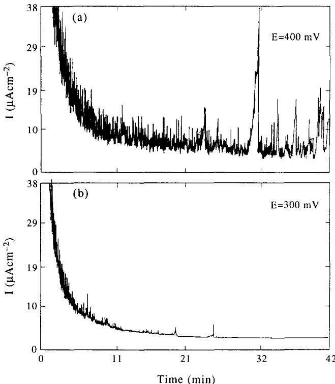  
Fig. 10. (a) Potentiostatic current time profile recorded for 316 wire in a 1.0 M NaCl, pH 2.5 solution at a potential of 400 mV(SCE). (b) Potentiostatic current time profile recorded for 316 wire in a 1.0 M NaBr, pH 2.5 solution at a potential of 300 mV(SCE).

The surface state of the steel wire does not seem to be a major variable (the wire was used in the as-received state) since repeated pitting potential determinations show very good reproducibility. While surface pre-treatments in acid solutions Table 2, do lead to a considerable ennoblement of the $E _ { \mathfrak { p } }$ values, the order with respect to oxide attack by $\mathbf { C l } ^ { - }$ and $\mathbf { B } \mathbf { r } ^ { - }$ is still maintained. It should be noted however that the increase in the $E _ { \mathrm { p } }$ values for the $\mathbf { B } \mathbf { r } ^ { - }$ containing solutions is considerably less than those observed for the solutions containing $\mathbf { C l } ^ { - }$ . Surface treatments of this kind are considered $\lfloor 1 1 , 1 8$ to remove sites on the steel surface (sulphides and other inclusions), which might otherwise lead to defects in the developing surface oxide. These defect sites are believed to $\mathsf { b e } ^ { 2 2 }$ the areas where pit initiation takes place in halide solutions, probably as a result of the higher field strengths associated with such flaws. Addition of inhibitors to solutions containing halide ions, can result in preferential adsorption of inhibitor ions at these flaws13 thus preventing attack by halide. However, as indicated in Fig. 8, while the presence of the $\mathsf { S O } _ { 4 } ^ { 2 ^ { - } }$ ion does lead to a considerable increase in the $E _ { \mathbf { p } }$ value for the 316 steel wire the order of oxide stability is still maintained. It is also clear from the data in Fig. 6, that in solutions containing both $\mathrm { C l ^ { - } }$ and $\mathbf { B } \mathbf { r } ^ { - }$ ions, small amounts of $\mathbf { B } \mathbf { r } ^ { - }$ only are required to bring the pitting potential down to values close to those measured in solutions containing $\mathrm { B r ^ { - } }$ only.

Attack by the $\mathbf { B } \mathbf { r } ^ { - }$ ion at the oxide surface would seem therefore to be relatively independent of the Cl⁻ presence or concentration.

It has been postulated²³ that the potential of zero charge $( E _ { \mathrm { p z c } } )$ of the surface oxide in halide solutions, can in many instances be related to the specific potential at which pitting attack on the oxide commences. For this work it is very difficult to see why the order of the $E _ { \mathsf { p z c } }$ values should reverse for the wire sample relative to those cut from bar or sheet.

In a further attempt to rationalize the order of aggressivity the alloy constituents of the 316 steel specimens were considered further. Iron, nickel and molybdenum were commercially available in wire form of similar thickness to the steel and these were tested in solutions similar to those used for the 316 electrodes. Results for these metals are shown in Fig. 9, where the potential is plotted versus pH for 1.0 M NaCl and 1.0 M NaBr solutions. Where definite pitting potentials were not evident on the polarization plots, the potential corresponding to an anodic current of $1 0 \mu \mathbf { A } \thinspace \mathrm { c m } ^ { - 2 }$ was used in the plots. These data show the usual trends for these metals in halide solutions of varying pH.13 For Fe, Ni and Mo the $\mathbf { C l } ^ { - }$ is found to be the more aggressive anion although not by a very substantial margin. Pitting potentials measured for a flat sample of Cr metal in 1.0 M NaCl and 1.0 M NaBr, pH 2.5 solutions were 856 and 866 mV, respectively, again the usual trend. Included in Fig. 9 also are some results for an 80% Ni:20% Cr wire sample. Here the order of aggressiveness is found to be similar to that for the 316 steel sample, but by a considerably reduced amount. While the $E _ { \mathfrak { p } }$ values for this wire sample are very much higher than those for pure Ni it would seem fair to say that it is not the overall composition of the steel alloy which determines this order of oxide stability. Other factors must be considered.

It has been shown²⁴ that the ability of halide ions to adsorb on metal or oxide surfaces normally increases in the order $\mathbf { F } ^ { - } < \mathbf { C } \mathbf { l } ^ { - } < \mathbf { B } \mathbf { r } ^ { - } < \mathbf { I } ^ { - }$ which is also the order of increasing ionic radius. For I− and F\~ solutions the verification of this sequence of aggressiveness for stainless steels is difficult, due to the occurrence of secondary processes.12 For $\mathbf { B } \mathbf { r } ^ { - }$ and $\mathbf { C l } ^ { - }$ solutions, it is fair to say, that stainless steels, except on quite rare occasions show the reverse order of pitting tendencies. Pitting studies on Ti metal and some of its alloys²⁵ and also on Ta metal,26 have yielded results which agree with the above order of adsorption ability.

The exact meaning of, or the precise factors which govern the pitting tendency of stainless steels in these halide solutions would thus seem difficult to rationalize.

From the results so far presented two interesting points emerge which might, in part at least, give some further insights into the observed order or pitting susceptibility. These are: (i) $E _ { \mathfrak { p } }$ values determined for the wire loop electrode in the bromide solutions studied are reasonably similar to $E _ { \mathfrak { p } }$ values obtained for 316L and 304 electrodes12,13 cut from steel bar. In chloride solutions, however, $E _ { \mathfrak { p } }$ values measured using the wire loop system are considerably higher than those obtained for 316L and 304 samples cut from steel bar and indeed for 316 sheet metal²7 samples; (ii) as indicated in Table 2, the improvement in the pitting potential, observed after the various surface treatments shown, is considerably less pronounced for tests in the $\mathbf { B } \mathbf { r } ^ { - }$ solutions, than those observed for $\mathbf { C l } ^ { - }$ ones. It would seem reasonable to assume on the basis of these two observations that the anomalous behaviour observed in this instance is associated with attack on the oxide surface by the Cl− ion.

In a recent paper, Burstein and Pistorius28 reported a pitting potential of

550 mV(SCE) for a type 304 steel, immersed in solution (1.0 M NaCl, pH 0.7) in the form of 50 μm wire electrodes.

Indeed for some 25% of these wire electrodes, breakdown did not occur until at least 850 mV. These values are considerably higher than those obtained with 304 steel samples cut from sheet or bar in similar chloride solutions. These authors suggest that the very high $E _ { \mathfrak { p } }$ values obtained with the $5 0 \mu \mathrm { m }$ electrodes may be as a result of the strong refining effect of the wire-drawing process on malleable inclusions (such as sulphides) or other pit nucleation sites. All this could perhaps suggest that the $\mathbf { C l } ^ { - }$ ion has a much greater tendency to adsorb at surface inclusions such as sulphides than the $\mathbf { B } \mathbf { r } ^ { - }$ ion. Thus the greater the population of these surface defects, the easier it is for pit initiation to occur. The lower the population density, as is the case for the wire loop samples, the more difficult it is for attack to initiate, and so the real adsorption ability of the $\mathbf { C l } ^ { - }$ and $\mathrm { B r ^ { - } }$ ions comes into play. This may indeed explain the wide variation in pitting potential values measured by different workers for the same steel type in given halide solutions. Perhaps on a surface free of inclusions or other defects the order of film breakdown would reflect that of the adsorption tendencies very closely. This ability of Cl− to adsorb at flaws, and generate conditions leading to metastable pit formation, is very evident from the potentiostatic current-time plots shown in Fig. 10a and b. In Fig. 10a the decay profile is for the wire loop in a 1.0 M NaCl, pH 2.5 solution, recorded at a potential of 400 mV(SCE), while in Fig. 10b the decay profile is for the 316 wire loop in a 1.0 M NaBr, pH 2.5 solution, the potential in this case being 300 mV(SCE). Thus while the wire loop samples may have a reduced population density of surface flaws, it is clear that in the Cl− solution the greatest number of pit initiation events take place. This is even more striking, since the potential chosen for the measurement in the $\mathrm { C l } ^ { - }$ solution is more than 120 mV removed from the potentiodynamically determined pitting potential while for the $\mathbf { B r } ^ { - }$ solution the potential chosen is only approximately 25 mV from the pitting potential. Why attack by the $\mathrm { B r } ^ { - }$ ion on the oxide covered metal, seems less dependent on the presence of surface inclusions or flaws is not immediately obvious and is the subject of further study.

## REFERENCES

1. Z. Szklarska-Smialowska, Pitting Corrosion of Metals, NACE, Houston, Texas (1986).

2. J. R. Galvele, Passivity of Metals, Electrochemical Society, Pennington, New Jersey, 285 (1978).

3. M. Janik-Czachor, G. C. Wood and G. E. Thompson, Br. Corros. J. 15, 154 (1980).

4. T. Okada, J. electrochem Soc. 131, 1026 (1984).

5. H. Bohni, Mater. Sci. Forum 111–112, 401 (1992).

6. J. Horvath and H. H. Uhlig, J. electrochem. Soc. 115, 791 (1968).

7. O. L. Riggs, Corrosion 19, 180 (1962).

8. W. M. Carroll, M. B. Howley and T. G. Walsh, Proc. 9th European Congr. on Corrosion, Utrecht, Netherlands (1989).

9. P. Eskelinen, O. Forsen, H. Hanninen, J. Onnela and S. Ylasaari, Mater. Sci. Forum 111–112, 515 (1992).

10. N. G. Thompson and B. C. Syrett, Corrosion 48, 649 (1992).

11. W. M. Carroll and T. G. Walsh, Corros. Sci. 29, 1205 (1989).

12. W. M. Carroll and M. B. Howley, Corros. Sci. 30, 643 (1990).

13. M. B. Howley, Ph.D. Thesis, National University of Ireland (1989).

14. L. Stockert, F. Hunkeler and H. Bohni, Corrosion 41, 676 (1985).

15. W. M. Carroll and C. B. Breslin, Corros. Sci. 33, 1161 (1991).

16. I. L. Rozenfeld and I. S. Danilov, Corros. Sci. 7, 129 (1967).

17. T. Sydberger, Werkst. Korros. 32, 119 (1981).

18. G. Hultquist and C. L. Leygraf, Corrosion 36, 126 (1980)

19. A. Marchlewska and Z. Szklarska-Smialowska, Proc. 8th Cong. Met. Corros. Mainz (1981).

20. G. Herbsleb, H. Hildebrand and W. Schwenk, Werkst. Korros. 27, 618 (1976).

21. R. Guo and M. B. Ives, Corrosion 46, 125 (1990).

22. R. Morach and H. Bohni, Mater. Sci. Forum 111–112, 493 (1992).

23. P. M. Natishan, E. McCafferty and G. K. Hubler, J. electrochem. Soc. 133, 1061 (1986).

24. H. J. Raetzer-Scheibe and H. G. Teller, Corros. Sci. 13, 11 (1973).

25. H. J. Raetzer-Scheibe, Corrosion 34, 437 (1978).

26. M. F. Abd. Rabboh and P. J. Boden, Localized Corrosion, NACE-3, Houston, Texas, 653 (1974).

27. J. H. Wang, C. C. Su and Z. Szklarska-Smialowska, Corrosion 44, 732 (1988).

28. P. C. Pistorius and G. T. Burstein, Phil. Trans. R. Soc. Lond. A, 531 (1992).